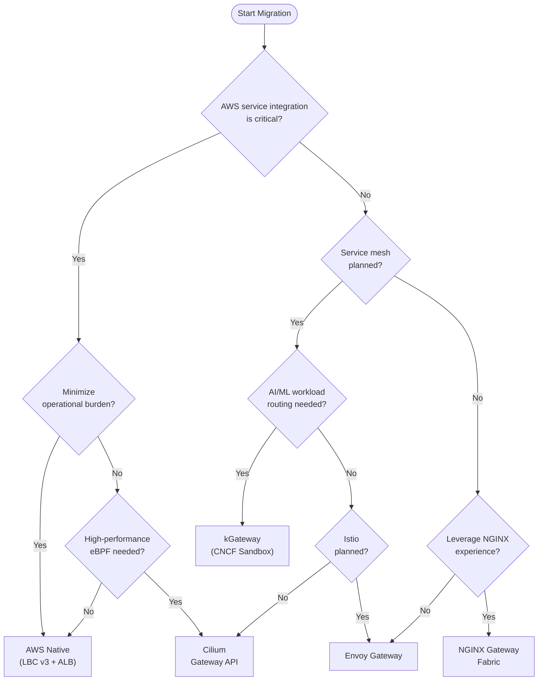

import Tabs from '@theme/Tabs';
import TabItem from '@theme/TabItem';
import GatewayApiBenefits from '@site/src/components/GatewayApiBenefits';
import {
  DocumentStructureTable,
  RiskAssessmentTable,
  ArchitectureComparisonTable,
  RoleSeparationTable,
  GaStatusTable,
  FeatureComparisonMatrix,
  SolutionOverviewMatrix,
  ScenarioRecommendationTable,
  FeatureMappingTable,
  DifficultyComparisonTable,
  AwsCostTable,
  OpenSourceCostTable,
  CostComparisonTable,
  MigrationFeatureMappingTable,
  TroubleshootingTable,
  RouteRecommendationTable,
  RoadmapTimeline,
} from '@site/src/components/GatewayApiTables';

# Gateway API Adoption Guide

> **Reference Versions**: Gateway API v1.4.0, Cilium v1.19.0, EKS 1.32, AWS LBC v3.0.0, Envoy Gateway v1.7.0

> **Written**: 2025-02-12 | **Updated**: 2026-02-14 | **Reading time**: ~13 min

## 1. Overview

With the official EOL (End-of-Life) of NGINX Ingress Controller in March 2026, migrating to Kubernetes Gateway API has become mandatory rather than optional. This guide comprehensively covers Gateway API architecture, comparison of 5 major implementations (AWS LBC v3, Cilium, NGINX Gateway Fabric, Envoy Gateway, kGateway), Cilium ENI mode deep-dive configuration, step-by-step migration execution strategy, and performance benchmark plans.

### 1.1 Target Audience

- **EKS cluster administrators running NGINX Ingress Controller**: EOL response strategy
- **Platform engineers planning Gateway API migration**: Technology selection and PoC
- **Architects reviewing traffic management modernization**: Long-term roadmap design
- **Network engineers considering Cilium ENI mode + Gateway API integration**: eBPF-based high-performance networking

### 1.2 Document Structure

<DocumentStructureTable />

:::info Reading Strategy
- **Quick understanding**: Sections 1-3, 6 (~10 min)
- **Technology selection**: Sections 1-4, 6 (~20 min)
- **Full migration**: Entire document + sub-documents (~25 min)
:::

---

## 2. NGINX Ingress Controller Retirement — Why Migration Is Mandatory

### 2.1 EOL Timeline

- **March 2025**: IngressNightmare (CVE-2025-1974) discovered — Snippets annotation arbitrary NGINX config injection vulnerability accelerated retirement discussions
- **November 2025**: Official retirement announcement by Kubernetes SIG Network. Cited insufficient maintainers (1-2) and Gateway API maturity
- **March 2026**: Official EOL — Security patches and bug fixes completely cease

:::danger Mandatory Action
**After March 2026, NGINX Ingress Controller receives no security vulnerability patches.** For PCI-DSS, SOC 2, ISO 27001 compliance, migration to a Gateway API-based solution is required.
:::

### 2.2 Security Vulnerability Analysis

<RiskAssessmentTable />

### 2.3 Structural Resolution Through Gateway API

Gateway API fundamentally resolves NGINX Ingress structural vulnerabilities through:
- **3-Tier role separation** eliminating snippet injection paths
- **CRD schema-based structural validation** preventing arbitrary config injection
- **Policy Attachment pattern** for safe extension with RBAC-controlled access

<ArchitectureComparisonTable />

---

## 3. Gateway API — The Next-Generation Traffic Management Standard

### 3.1 Architecture

Gateway API separates responsibilities across three roles: Infrastructure Provider (GatewayClass), Cluster Operator (Gateway), and Application Developer (HTTPRoute).

### 3.2 3-Tier Resource Model

<RoleSeparationTable />

### 3.3 GA Status (v1.4.0)

<GaStatusTable />

### 3.4 Key Benefits

<GatewayApiBenefits />

---

## 4. Gateway API Implementation Comparison - AWS Native vs Open Source

### 4.1 Solution Overview

<SolutionOverviewMatrix />

### 4.2 Feature Comparison Matrix

<FeatureComparisonMatrix />

### 4.3 NGINX Feature Mapping

<FeatureMappingTable />

### 4.4 Implementation Difficulty

<DifficultyComparisonTable />

### 4.5 Cost Impact Analysis

<CostComparisonTable />

### 4.7 Decision Tree

### 4.8 Scenario Recommendations

<ScenarioRecommendationTable />

---

## 5. Benchmark Comparison Plan

:::info Benchmark Details
Test environment design, detailed scenarios, metrics and execution plans are available at **[Gateway API Implementation Performance Benchmark Plan](/docs/benchmarks/gateway-api-benchmark)**.
:::

---

## 6. Conclusion and Roadmap

### 6.1 Conclusion

<RouteRecommendationTable />

### 6.2 Future Expansion Roadmap

<RoadmapTimeline />

### 6.3 Key Message

:::info
**Complete migration before the March 2026 NGINX Ingress EOL to eliminate security threats.**

Gateway API is not just an Ingress replacement — it's the future of cloud-native traffic management.
- **Role separation**: Clear responsibility division between platform and development teams
- **Standardization**: Portable configuration without vendor lock-in
- **Extensibility**: Scales to East-West, service mesh, and AI integration
:::

---

## Related Documents

### Sub-documents (Deep-dive Guides)

- **[1. GAMMA Initiative — The Future of Service Mesh Integration](/docs/eks-best-practices/networking-performance/gateway-api-adoption-guide/gamma-initiative)**
- **[2. Cilium ENI Mode + Gateway API Deep-dive Configuration](/docs/eks-best-practices/networking-performance/gateway-api-adoption-guide/cilium-eni-gateway-api)**
- **[3. Migration Execution Strategy](/docs/eks-best-practices/networking-performance/gateway-api-adoption-guide/migration-execution-strategy)**

### External References

- [Kubernetes Gateway API Official Documentation](https://gateway-api.sigs.k8s.io/)
- [AWS Load Balancer Controller](https://kubernetes-sigs.github.io/aws-load-balancer-controller/)
- [Cilium Gateway API Documentation](https://docs.cilium.io/en/stable/network/servicemesh/gateway-api/gateway-api/)
