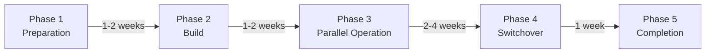

import Tabs from '@theme/Tabs';
import TabItem from '@theme/TabItem';
import { MigrationFeatureMappingTable, TroubleshootingTable } from '@site/src/components/GatewayApiTables';

:::info
This document is a deep-dive guide for the [Gateway API Adoption Guide](/docs/eks-best-practices/networking-performance/gateway-api-adoption-guide). It provides a practical migration strategy from NGINX Ingress to Gateway API.
:::

## 1. Prerequisites: CRD Installation

```bash
# Gateway API v1.4.0 standard install
kubectl apply -f https://github.com/kubernetes-sigs/gateway-api/releases/download/v1.4.0/standard-install.yaml

# Experimental features (optional)
kubectl apply -f https://github.com/kubernetes-sigs/gateway-api/releases/download/v1.4.0/experimental-install.yaml
```

Controller-specific installation: AWS LBC v3 (Helm with `enableGatewayAPI=true`), NGINX Gateway Fabric, Envoy Gateway, Cilium (already enabled with `gatewayAPI.enabled=true`).

## 2. 5-Phase Migration Process



## 3. Phase-by-Phase Detail

**Phase 1: Preparation** — Inventory collection, feature mapping, risk assessment
**Phase 2: Build** — CRD installation, controller deployment, PoC in test environment
**Phase 3: Parallel Operation** — Production Gateway + HTTPRoute creation alongside existing NGINX Ingress
**Phase 4: Switchover** — DNS weighted routing: 10% → 50% → 100%
**Phase 5: Completion** — NGINX Ingress backup, resource removal, documentation

<MigrationFeatureMappingTable />

## 4. Validation Script

Validation script checks: HTTPRoute existence, Accepted/Programmed conditions, backend service endpoints, Gateway address, and HTTP request test.

## 5. Troubleshooting

<TroubleshootingTable />

Controller-specific debugging commands provided for: AWS Load Balancer Controller, Cilium Gateway API, NGINX Gateway Fabric, and Envoy Gateway.

---

## Related Documents

- **[Gateway API Adoption Guide](/docs/eks-best-practices/networking-performance/gateway-api-adoption-guide)**
- **[Cilium ENI Mode + Gateway API](/docs/eks-best-practices/networking-performance/gateway-api-adoption-guide/cilium-eni-gateway-api)**
- [Gateway API Official Documentation](https://gateway-api.sigs.k8s.io/)
