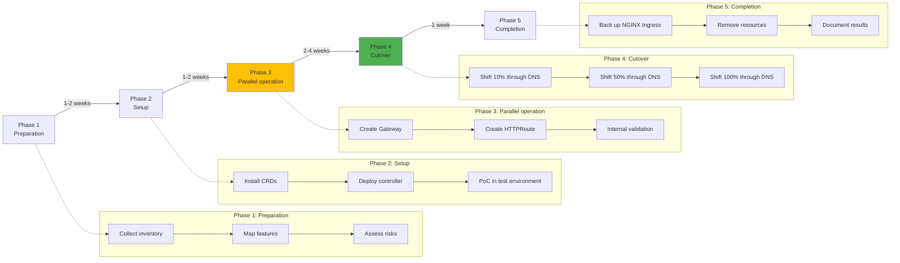

import Tabs from '@theme/Tabs';
import TabItem from '@theme/TabItem';
import { MigrationFeatureMappingTable, TroubleshootingTable } from '@site/src/components/GatewayApiTables';

:::info
This document extends the [Gateway API Adoption Guide](/docs/eks-best-practices/networking-performance/gateway-api-adoption-guide). It provides a practical strategy for migrating from NGINX Ingress to Gateway API.
:::

## 1. Prerequisites: CRD Installation

The Gateway API CRD version must match the selected controller’s supported version. The common example below uses v1.4.1 for the linked Cilium 1.19.3 guide. Do not overwrite Standard/Experimental bundles with different releases. Other controllers and the inference Gateway in section 9.4 of the Cilium guide have their own compatibility requirements.

### 1.1 Standard Gateway API CRDs

```bash
# Standard CRDs for the Cilium 1.19.3 baseline
kubectl apply -f https://github.com/kubernetes-sigs/gateway-api/releases/download/v1.4.1/standard-install.yaml

# Select the same-version experimental bundle instead if experimental resources are required
# kubectl apply -f https://github.com/kubernetes-sigs/gateway-api/releases/download/v1.4.1/experimental-install.yaml
```

**Installed CRDs:**
- `gatewayclasses.gateway.networking.k8s.io`
- `gateways.gateway.networking.k8s.io`
- `httproutes.gateway.networking.k8s.io`
- `referencegrants.gateway.networking.k8s.io`
- `grpcroutes.gateway.networking.k8s.io` (Standard)
- `tcproutes.gateway.networking.k8s.io` (Experimental)
- `tlsroutes.gateway.networking.k8s.io` (Experimental)
- `udproutes.gateway.networking.k8s.io` (Experimental)

### 1.2 Additional Installation for Each Controller
These are **controller-specific installation templates**, not a claim that all combinations were verified with v1.4.1. The official AWS LBC v3.0.0 guide targets Gateway API v1.3.0 and requires additional LBC Gateway CRDs. Select CRD and chart versions together using the chosen NGINX/Envoy release’s installation and compatibility documentation as well. Do not run all controller installation alternatives sequentially.
**AWS Native (ALB + NLB Gateway)**

```bash
# Install AWS Load Balancer Controller v3.0+ with Gateway API support
helm repo add eks https://aws.github.io/eks-charts
helm repo update

# Create IRSA (IAM Role for Service Account)
eksctl create iamserviceaccount \
  --cluster=<cluster-name> \
  --namespace=kube-system \
  --name=aws-load-balancer-controller \
  --role-name AmazonEKSLoadBalancerControllerRole \
  --attach-policy-arn=arn:aws:iam::<account-id>:policy/AWSLoadBalancerControllerIAMPolicy \
  --approve

# First create the official IAM policy in your account and select a compatible chart version
# https://kubernetes-sigs.github.io/aws-load-balancer-controller/latest/deploy/installation/
: "${LBC_CHART_VERSION:?Set a chart version compatible with the chosen Gateway API CRDs}"
# Install with Helm
helm install aws-load-balancer-controller eks/aws-load-balancer-controller \
  --version "$LBC_CHART_VERSION" -n kube-system \
  --set clusterName=<cluster-name> \
  --set serviceAccount.create=false \
  --set serviceAccount.name=aws-load-balancer-controller \
  --set controllerConfig.featureGates.ALBGatewayAPI=true \
  --set controllerConfig.featureGates.NLBGatewayAPI=true

# Verify the installation
kubectl get deployment -n kube-system aws-load-balancer-controller
```

**NGINX Gateway Fabric**

```bash
# Install NGINX Gateway Fabric
kubectl apply -f https://github.com/nginxinc/nginx-gateway-fabric/releases/download/v1.6.0/crds.yaml
kubectl apply -f https://github.com/nginxinc/nginx-gateway-fabric/releases/download/v1.6.0/nginx-gateway.yaml

# Verify the installation
kubectl get pods -n nginx-gateway
kubectl get gatewayclass nginx
```

**Envoy Gateway**

```bash
# Install Envoy Gateway
helm install eg oci://docker.io/envoyproxy/gateway-helm \
  --version v1.3.0 \
  --namespace envoy-gateway-system \
  --create-namespace

# Verify the installation
kubectl get pods -n envoy-gateway-system
kubectl get gatewayclass envoy-gateway
```

**Cilium Gateway API**

No separate installation is required when `gatewayAPI.enabled=true` was already set during Cilium installation.

```bash
# Check the GatewayClass
kubectl get gatewayclass cilium
```

---

## 2. 5-Phase Migration Process


```mermaid
flowchart LR
    P1[Phase 1<br/>Preparation]
    P2[Phase 2<br/>Setup]
    P3[Phase 3<br/>Parallel operation]
    P4[Phase 4<br/>Cutover]
    P5[Phase 5<br/>Completion]

    P1 -->|1-2 weeks| P2
    P2 -->|1-2 weeks| P3
    P3 -->|2-4 weeks| P4
    P4 -->|1 week| P5

    subgraph "Phase 1: Preparation"
        P1A[Collect inventory]
        P1B[Map features]
        P1C[Assess risks]
    end

    subgraph "Phase 2: Setup"
        P2A[Install CRDs]
        P2B[Deploy controller]
        P2C[PoC in test environment]
    end

    subgraph "Phase 3: Parallel operation"
        P3A[Create Gateway]
        P3B[Create HTTPRoute]
        P3C[Internal validation]
    end

    subgraph "Phase 4: Cutover"
        P4A[Shift 10% through DNS]
        P4B[Shift 50% through DNS]
        P4C[Shift 100% through DNS]
    end

    subgraph "Phase 5: Completion"
        P5A[Back up NGINX Ingress]
        P5B[Remove resources]
        P5C[Document results]
    end

    P1 -.-> P1A
    P1A --> P1B
    P1B --> P1C

    P2 -.-> P2A
    P2A --> P2B
    P2B --> P2C

    P3 -.-> P3A
    P3A --> P3B
    P3B --> P3C

    P4 -.-> P4A
    P4A --> P4B
    P4B --> P4C

    P5 -.-> P5A
    P5A --> P5B
    P5B --> P5C

    style P4 fill:#4CAF50
    style P3 fill:#FFC107
```

---

## 3. Phase-by-Phase Detail

<Tabs>
  <TabItem value="phase1" label="Phase 1: Preparation" default>

**Step 1.1: Collect the current Ingress inventory**

```bash
# Export all Ingress resources
kubectl get ingress -A -o json > ingress-inventory.json

# Summarize key information
cat ingress-inventory.json | jq -r '
  .items[] |
  {
    namespace: .metadata.namespace,
    name: .metadata.name,
    class: .spec.ingressClassName,
    hosts: [.spec.rules[].host],
    paths: [.spec.rules[].http.paths[].path],
    tls: (.spec.tls != null)
  }
' > ingress-summary.json

# Summarize statistics
echo "=== Ingress Statistics ==="
echo "Total Ingress: $(cat ingress-inventory.json | jq '.items | length')"
echo "With TLS: $(cat ingress-inventory.json | jq '[.items[] | select(.spec.tls != null)] | length')"
echo "Unique Hosts: $(cat ingress-inventory.json | jq -r '[.items[].spec.rules[].host] | unique | length')"
```

**Step 1.2: Map features from NGINX Ingress to Gateway API**

<MigrationFeatureMappingTable locale="en" />

**Step 1.3: Assess risks**

```yaml
# risk-assessment.yaml
risks:
  - id: RISK-001
    category: Missing functionality
    description: "No direct alternative to the NGINX rate-limit annotation"
    severity: MEDIUM
    mitigation: "Use AWS WAF or the Envoy Rate Limit service"

  - id: RISK-002
    category: Downtime
    description: "Migration to Cilium ENI mode causes downtime"
    severity: HIGH
    mitigation: "Use a blue-green cluster cutover or schedule a maintenance window"

  - id: RISK-003
    category: Learning curve
    description: "The team has limited Gateway API experience"
    severity: LOW
    mitigation: "Allow sufficient testing time during the Phase 2 PoC"
```

  </TabItem>
  <TabItem value="phase2" label="Phase 2: Setup">

**Step 2.1: Install CRDs (see Section 1)**

Install the CRDs and controller as described in the "Prerequisites" section above.

**Step 2.2: Run a PoC in a test environment**

```yaml
# poc-gateway.yaml (development environment)
apiVersion: gateway.networking.k8s.io/v1
kind: Gateway
metadata:
  name: poc-gateway
  namespace: dev
spec:
  gatewayClassName: cilium  # Or nginx, envoy-gateway, aws
  listeners:
    - name: http
      protocol: HTTP
      port: 80

---
apiVersion: gateway.networking.k8s.io/v1
kind: HTTPRoute
metadata:
  name: poc-httproute
  namespace: dev
spec:
  parentRefs:
    - name: poc-gateway
  hostnames:
    - "poc.dev.example.com"
  rules:
    - matches:
        - path:
            type: PathPrefix
            value: /
      backendRefs:
        - name: test-service
          port: 8080
```

```bash
# Deploy the PoC
kubectl apply -f poc-gateway.yaml

# Check the external IP
kubectl get gateway poc-gateway -n dev -o jsonpath='{.status.addresses[0].value}'

# This A record requires IPv4; use a Route 53 Alias for an NLB hostname
GATEWAY_TYPE=$(kubectl get gateway poc-gateway -n dev -o jsonpath='{.status.addresses[0].type}')
GATEWAY_IP=$(kubectl get gateway poc-gateway -n dev -o jsonpath='{.status.addresses[0].value}')
[[ "$GATEWAY_TYPE" == IPAddress && "$GATEWAY_IP" != *:* ]] || { echo "Use an Alias for a load balancer hostname; use AAAA for IPv6"; exit 1; }
aws route53 change-resource-record-sets \
  --hosted-zone-id Z1234567890ABC \
  --change-batch "{
    \"Changes\": [{
      \"Action\": \"CREATE\",
      \"ResourceRecordSet\": {
        \"Name\": \"poc.dev.example.com\",
        \"Type\": \"A\",
        \"TTL\": 60,
        \"ResourceRecords\": [{\"Value\": \"$GATEWAY_IP\"}]
      }
    }]
  }"

# Test functionality
curl -v http://poc.dev.example.com/
```

**Step 2.3: Benchmark performance in the PoC environment**

```bash
# k6 load test script
cat <<EOF > poc-benchmark.js
import http from 'k6/http';
import { check } from 'k6';

export let options = {
  stages: [
    { duration: '2m', target: 100 },  // Ramp up to 100 VUs
    { duration: '5m', target: 100 },  // Hold for 5 minutes
    { duration: '2m', target: 0 },    // Ramp down
  ],
  thresholds: {
    'http_req_duration': ['p(95)<200'],  // P95 latency below 200ms
    'http_req_failed': ['rate<0.01'],     // Error rate below 1%
  },
};

export default function () {
  const res = http.get('http://poc.dev.example.com/api/health');
  check(res, {
    'status is 200': (r) => r.status === 200,
    'response time < 200ms': (r) => r.timings.duration < 200,
  });
}
EOF

# Run k6
k6 run poc-benchmark.js
```

  </TabItem>
  <TabItem value="phase3" label="Phase 3: Parallel Operation">

**Step 3.1: Create the production Gateway**
This example uses Cilium Gateway behind an NLB. `infra/wildcard-tls-cert` must contain a valid certificate covering `api.example.com`, and `production/api-service:8080` must have ready backends. This differs from the AWS LBC’s own ALB/L7 Gateway API configuration.
```yaml
# production-gateway.yaml
apiVersion: gateway.networking.k8s.io/v1
kind: Gateway
metadata:
  name: production-gateway
  namespace: infra
spec:
  gatewayClassName: cilium
  infrastructure:
    annotations:
      service.beta.kubernetes.io/aws-load-balancer-type: external
      service.beta.kubernetes.io/aws-load-balancer-nlb-target-type: instance
      service.beta.kubernetes.io/aws-load-balancer-scheme: internet-facing
  listeners:
    - name: https
      protocol: HTTPS
      port: 443
      hostname: "*.example.com"
      tls:
        mode: Terminate
        certificateRefs:
          - kind: Secret
            name: wildcard-tls-cert
            namespace: infra
      allowedRoutes:
        namespaces:
          from: All
```

```bash
# Deploy
kubectl apply -f production-gateway.yaml

# Check status (wait for Programmed=True)
kubectl wait --for=condition=Programmed gateway/production-gateway -n infra --timeout=5m

# Check the external address
kubectl get gateway production-gateway -n infra -o jsonpath='{.status.addresses[0].value}'
```

**Step 3.2: Create an HTTPRoute for parallel operation**

Retain the existing NGINX Ingress and create an HTTPRoute pointing to the same backend.

```yaml
# parallel-httproute.yaml
apiVersion: gateway.networking.k8s.io/v1
kind: HTTPRoute
metadata:
  name: api-route
  namespace: production
spec:
  parentRefs:
    - name: production-gateway
      namespace: infra
  hostnames:
    - "api.example.com"
  rules:
    - matches:
        - path:
            type: PathPrefix
            value: /api/v1
      backendRefs:
        - name: api-service  # Same Service as the existing Ingress
          port: 8080
```

**Step 3.3: Perform internal validation with proxy tests**

```bash
# Connect to the external Gateway address before DNS cutover, retaining TLS SNI and certificate verification
GATEWAY_ADDRESS=$(kubectl get gateway production-gateway -n infra -o jsonpath='{.status.addresses[0].value}')
: "${GATEWAY_ADDRESS:?Gateway address is not assigned}"
[[ "$GATEWAY_ADDRESS" == *:* ]] && GATEWAY_ADDRESS="[$GATEWAY_ADDRESS]"

curl --fail-with-body --connect-to "api.example.com:443:${GATEWAY_ADDRESS}:443"   https://api.example.com/api/v1/health

# One request duration is not a benchmark
curl -w "Time: %{time_total}s\n" -o /dev/null -sS   https://api.example.com/api/v1/health
curl -w "Time: %{time_total}s\n" -o /dev/null -sS   --connect-to "api.example.com:443:${GATEWAY_ADDRESS}:443"   https://api.example.com/api/v1/health
```

  </TabItem>
  <TabItem value="phase4" label="Phase 4: Cutover">

**Step 4.1: Shift 10% of traffic with DNS weighted routing**
Weights control DNS answer selection, not an exact percentage of HTTP requests. The A-record examples below apply only to actual IPv4 endpoints. For NLB DNS names, use weighted Alias records of the same name/type with each NLB’s canonical hosted zone ID. If a simple record already exists, plan a change batch that avoids conflict with weighted records of the same name. See [Route 53 weighted routing](https://docs.aws.amazon.com/Route53/latest/DeveloperGuide/routing-policy-weighted.html).
```bash
# Check that the endpoint is IPv4
GATEWAY_TYPE=$(kubectl get gateway production-gateway -n infra -o jsonpath='{.status.addresses[0].type}')
GATEWAY_IP=$(kubectl get gateway production-gateway -n infra -o jsonpath='{.status.addresses[0].value}')
[[ "$GATEWAY_TYPE" == IPAddress && "$GATEWAY_IP" != *:* ]] || { echo "Use weighted Alias records for a load balancer hostname; use AAAA for IPv6"; exit 1; }
# Route 53 weighted records
# Existing NGINX Ingress (weight 90)
aws route53 change-resource-record-sets \
  --hosted-zone-id Z1234567890ABC \
  --change-batch '{
    "Changes": [{
      "Action": "UPSERT",
      "ResourceRecordSet": {
        "Name": "api.example.com",
        "Type": "A",
        "SetIdentifier": "nginx-ingress",
        "Weight": 90,
        "TTL": 60,
        "ResourceRecords": [{"Value": "203.0.113.10"}]
      }
    }]
  }'

# New Gateway API endpoint (weight 10)
aws route53 change-resource-record-sets \
  --hosted-zone-id Z1234567890ABC \
  --change-batch "{
    \"Changes\": [{
      \"Action\": \"UPSERT\",
      \"ResourceRecordSet\": {
        \"Name\": \"api.example.com\",
        \"Type\": \"A\",
        \"SetIdentifier\": \"gateway-api\",
        \"Weight\": 10,
        \"TTL\": 60,
        \"ResourceRecords\": [{\"Value\": \"$GATEWAY_IP\"}]
      }
    }]
  }"

# Monitor for 24 hours: error rate, latency, and throughput
# - Check CloudWatch dashboards
# - Compare Grafana metrics
# - Inspect error logs
```

**Step 4.2: Shift 50% of traffic through DNS**

```bash
# Adjust weights if no issues are observed
aws route53 change-resource-record-sets \
  --hosted-zone-id Z1234567890ABC \
  --change-batch '{
    "Changes": [
      {
        "Action": "UPSERT",
        "ResourceRecordSet": {
          "Name": "api.example.com",
          "Type": "A",
          "SetIdentifier": "nginx-ingress",
          "Weight": 50,
          "TTL": 60,
          "ResourceRecords": [{"Value": "203.0.113.10"}]
        }
      },
      {
        "Action": "UPSERT",
        "ResourceRecordSet": {
          "Name": "api.example.com",
          "Type": "A",
          "SetIdentifier": "gateway-api",
          "Weight": 50,
          "TTL": 60,
          "ResourceRecords": [{"Value": "'"$GATEWAY_IP"'"}]
        }
      }
    ]
  }'

# Monitor for 1 week
```

**Step 4.3: Shift 100% of traffic through DNS**

```bash
# Final cutover (NGINX Ingress weight 0)
aws route53 change-resource-record-sets \
  --hosted-zone-id Z1234567890ABC \
  --change-batch '{
    "Changes": [
      {
        "Action": "DELETE",
        "ResourceRecordSet": {
          "Name": "api.example.com",
          "Type": "A",
          "SetIdentifier": "nginx-ingress",
          "Weight": 50,
          "TTL": 60,
          "ResourceRecords": [{"Value": "203.0.113.10"}]
        }
      },
      {
        "Action": "UPSERT",
        "ResourceRecordSet": {
          "Name": "api.example.com",
          "Type": "A",
          "SetIdentifier": "gateway-api",
          "Weight": 100,
          "TTL": 300,
          "ResourceRecords": [{"Value": "'"$GATEWAY_IP"'"}]
        }
      }
    ]
  }'
```

  </TabItem>
  <TabItem value="phase5" label="Phase 5: Completion">

**Step 5.1: Back up NGINX Ingress**

```bash
# Back up all Ingress resources
kubectl get ingress -A -o yaml > backup-ingress-resources-$(date +%Y%m%d).yaml

# Back up the NGINX Ingress Controller configuration
kubectl get deployment ingress-nginx-controller -n ingress-nginx -o yaml > backup-nginx-controller.yaml
kubectl get cm ingress-nginx-controller -n ingress-nginx -o yaml > backup-nginx-configmap.yaml

# Upload the backup to S3
aws s3 cp backup-ingress-resources-$(date +%Y%m%d).yaml s3://my-backup-bucket/ingress-migration/
```

**Step 5.2: Remove NGINX Ingress after 2 weeks**

```bash
# Remove only explicitly inventoried resources whose migration is complete
# Do not delete all Ingress resources or a shared namespace
kubectl delete ingress <migrated-ingress-name> -n <application-namespace>
# Remove the release only when no remaining Ingress uses it
helm uninstall ingress-nginx -n ingress-nginx
```

**Step 5.3: Document the migration**
The report below is a **fictional worked example**. Its dates, resource counts, and performance figures are not an actual completion record or benchmark. Record the actual test environment, raw results, and verified values.
```markdown
# migration-report.md

## Migration Completion Report

### Basic Information
- Start date: 2026-01-15
- Completion date: 2026-02-28
- Total duration: 6 weeks
- Selected solution: Cilium Gateway API (ENI mode)

### Migration Scope
- Total Ingress resources: 47
- Total hosts: 23
- TLS certificates: 12

### Performance Comparison
| Metric | NGINX Ingress | Cilium Gateway | Improvement |
|------|---------------|----------------|--------|
| P95 Latency | 45ms | 12ms | 73% reduction |
| RPS (single instance) | 8,500 | 24,000 | 182% increase |
| CPU utilization | 35% | 18% | 49% reduction |

### Issues and Resolutions
1. **Issue**: Automatic TLS certificate renewal did not work
   - **Cause**: cert-manager depended on Ingress annotations
   - **Resolution**: Switch to the Certificate CRD for Gateway

2. **Issue**: 404 errors on some paths
   - **Cause**: Differences in PathPrefix matching logic
   - **Resolution**: Correct the exact path matching rules

### Lessons Learned
- Allow enough time for parallel operation in Phase 3
- Configure a short DNS TTL to support rapid rollback
- Define clear success criteria for each Phase
```

  </TabItem>
</Tabs>

---

## 4. Validation Script
This is a focused check for HTTP/HTTPS routes with selector-backed Service backends. It requires Bash, jq, kubectl, and curl. Supply a host and path for the selected listener and Route; test additional header, method, or authentication requirements separately. A successful response does not verify every traffic case or backend identity.

```bash
#!/bin/bash
# validate-httproute.sh: selector-backed Service routes, explicit Gateway/listener and probe.
set -euo pipefail
if [ "$#" -ne 7 ]; then
  echo "Usage: $0 <route-namespace> <route-name> <gateway-namespace> <gateway-name> <listener> <probe-host> <probe-path>" >&2
  exit 1
fi
NS=$1; ROUTE_NAME=$2; GW_NS=$3; GW_NAME=$4; LISTENER=$5; HOST=$6; PROBE_PATH=$7
[[ "$HOST" != *'*'* && "$PROBE_PATH" == /* ]] || { echo "Use a concrete hostname and absolute path" >&2; exit 1; }
ROUTE=$(kubectl get httproute "$ROUTE_NAME" -n "$NS" -o json)
GW=$(kubectl get gateway "$GW_NAME" -n "$GW_NS" -o json)
CLASS=$(jq -r '.spec.gatewayClassName' <<<"$GW")
CONTROLLER=$(kubectl get gatewayclass "$CLASS" -o jsonpath='{.spec.controllerName}')

# Gateway readiness is distinct from the HTTPRoute parent status; reject stale conditions.
jq -e '.metadata.generation as $g | .status.conditions as $c |
  all(["Accepted", "Programmed"][]; . as $t |
    any($c[]?; .type == $t and .status == "True" and .observedGeneration == $g))' <<<"$GW" >/dev/null
LISTENER_JSON=$(jq -ce --arg l "$LISTENER" '.spec.listeners[] | select(.name == $l)' <<<"$GW")
PORT=$(jq -r '.port' <<<"$LISTENER_JSON")
PROTOCOL=$(jq -r '.protocol' <<<"$LISTENER_JSON")
case "$PROTOCOL" in HTTP) SCHEME=http ;; HTTPS) SCHEME=https ;; *) echo "Only HTTP/HTTPS probes are supported" >&2; exit 1 ;; esac

# Match the intended parent and its controller, including namespace, sectionName and port.
jq -e --arg ns "$NS" --arg gn "$GW_NAME" --arg gns "$GW_NS" --arg l "$LISTENER" \
  --arg c "$CONTROLLER" --argjson port "$PORT" '
  def canonical: {group:(.group // "gateway.networking.k8s.io"), kind:(.kind // "Gateway"),
    namespace:(.namespace // $ns), name, sectionName:(.sectionName // null), port:(.port // null)};
  .metadata.generation as $g |
  [.spec.parentRefs[] | canonical | select(.group == "gateway.networking.k8s.io" and .kind == "Gateway"
    and .name == $gn and .namespace == $gns and (.sectionName == null or .sectionName == $l)
    and (.port == null or .port == $port))] as $refs |
  any(.status.parents[]?; . as $p | (.parentRef | canonical) as $ref |
    .controllerName == $c and any($refs[]; . == $ref) and
    all(["Accepted", "ResolvedRefs"][]; . as $t |
      any($p.conditions[]?; .type == $t and .status == "True" and .observedGeneration == $g)))' <<<"$ROUTE" >/dev/null

# This focused check supports ordinary Service backends, including cross-namespace references.
jq -e '[.spec.rules[]?.backendRefs[]?] as $b | ($b | length) > 0 and
  all($b[]; (.group // "") == "" and (.kind // "Service") == "Service")' <<<"$ROUTE" >/dev/null
BACKENDS=$(jq -r --arg ns "$NS" '[.spec.rules[]?.backendRefs[]? |
  [(.namespace // $ns), .name]] | unique[] | @tsv' <<<"$ROUTE")
while IFS=$'\t' read -r BACKEND_NS SERVICE; do
  kubectl get service "$SERVICE" -n "$BACKEND_NS" -o json >/dev/null
  kubectl get endpointslices -n "$BACKEND_NS" -l "kubernetes.io/service-name=$SERVICE" -o json |
    jq -e 'any(.items[]?.endpoints[]?; .conditions.ready != false and (.addresses | length) > 0)' >/dev/null
done <<<"$BACKENDS"

ADDRESS=$(jq -er '.status.addresses[0].value | select(length > 0)' <<<"$GW")
[[ "$ADDRESS" == *:* ]] && ADDRESS="[$ADDRESS]"
# --connect-to changes the destination while retaining Host, TLS SNI and certificate checks.
HTTP_CODE=$(curl --silent --show-error --output /dev/null --write-out '%{http_code}' \
  --connect-to "${HOST}:${PORT}:${ADDRESS}:${PORT}" \
  --max-time 10 "${SCHEME}://${HOST}:${PORT}${PROBE_PATH}")
[[ "$HTTP_CODE" =~ ^[23][0-9][0-9]$ ]] || { echo "Probe failed: HTTP $HTTP_CODE" >&2; exit 1; }
echo "Selected parent accepted/resolved; Gateway programmed; ready backends; probe HTTP $HTTP_CODE"
```

**Usage example:**
```bash
chmod +x validate-httproute.sh
./validate-httproute.sh production api-route infra production-gateway https api.example.com /api/v1/health
```

---

## 5. Troubleshooting

### 5.1 Common Issues and Resolutions

<TroubleshootingTable locale="en" />

### 5.2 Debugging Commands by Controller

**AWS Load Balancer Controller**

```bash
# Inspect controller logs
kubectl logs -n kube-system deployment/aws-load-balancer-controller --tail=100 -f

# Identify the Gateway's underlying NLB
kubectl get gateway <name> -n <namespace> -o jsonpath='{.metadata.annotations.service\.beta\.kubernetes\.io/aws-load-balancer-name}'

# Check NLB target group health
aws elbv2 describe-target-health --target-group-arn <arn>

# Inspect HTTPRoute events
kubectl describe httproute <name> -n <namespace>
```

**Cilium Gateway API**

```bash
# Cilium Operator logs
kubectl logs -n kube-system deployment/cilium-operator --tail=100 -f

# Dump the Envoy configuration
kubectl exec -n kube-system ds/cilium -- cilium envoy config dump > envoy-config.json

# Inspect the HTTPRoute routing table
kubectl exec -n kube-system ds/cilium -- cilium service list

# Monitor Gateway-related flows
hubble observe --protocol http --port 443

# Check Gateway status
cilium status --wait
```

**NGINX Gateway Fabric**

```bash
# NGINX Gateway logs
kubectl logs -n nginx-gateway deployment/nginx-gateway --tail=100 -f

# Inspect the NGINX configuration
kubectl exec -n nginx-gateway deployment/nginx-gateway -- nginx -T

# Check HTTPRoute mappings
kubectl describe httproute <name> -n <namespace>

# Follow access logs in real time
kubectl logs -n nginx-gateway deployment/nginx-gateway -f | grep "HTTP/1.1"
```

**Envoy Gateway**

```bash
# Envoy Gateway controller logs
kubectl logs -n envoy-gateway-system deployment/envoy-gateway --tail=100 -f

# Envoy Proxy logs (data plane)
kubectl logs -n envoy-gateway-system deployment/envoy-<gateway-name> --tail=100 -f

# Forward the Envoy admin interface port
kubectl port-forward -n envoy-gateway-system deployment/envoy-<gateway-name> 19000:19000

# Open http://localhost:19000 in a browser to inspect stats and configuration

# Dump the xDS configuration
curl http://localhost:19000/config_dump > envoy-xds-config.json
```

**Common debugging commands**

```bash
# Inspect detailed Gateway status
kubectl get gateway <name> -n <namespace> -o yaml

# Inspect detailed HTTPRoute status
kubectl get httproute <name> -n <namespace> -o yaml

# Check backend Service endpoints
kubectl get endpoints <service-name> -n <namespace>

# Check whether Pods are Ready
kubectl get pods -n <namespace> -l <selector>

# Inspect network policies for traffic blocking
kubectl get networkpolicies -n <namespace>

# Inspect events from the last 10 minutes
kubectl get events -n <namespace> --sort-by='.lastTimestamp' | tail -20
```

---

## Related Documents

- **[Gateway API Adoption Guide](/docs/eks-best-practices/networking-performance/gateway-api-adoption-guide)** - Complete Gateway API migration guide
- **[Cilium ENI Mode + Gateway API](/docs/eks-best-practices/networking-performance/gateway-api-adoption-guide/cilium-eni-gateway-api)** - Advanced Cilium configuration guide
- [Gateway API Documentation](https://gateway-api.sigs.k8s.io/)
- [AWS Load Balancer Controller](https://kubernetes-sigs.github.io/aws-load-balancer-controller/)
