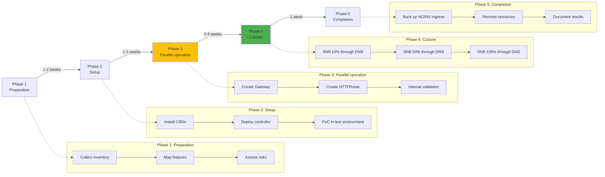

import Tabs from '@theme/Tabs';
import TabItem from '@theme/TabItem';
import { MigrationFeatureMappingTable, TroubleshootingTable } from '@site/src/components/GatewayApiTables';

:::info
This document extends the [Gateway API Adoption Guide](/docs/eks-best-practices/networking-performance/gateway-api-adoption-guide). It provides a practical strategy for migrating from NGINX Ingress to Gateway API.
:::

## 1. Prerequisites: CRD Installation

All Gateway API implementations require the common Kubernetes Gateway API CRDs.

### 1.1 Standard Gateway API CRDs

```bash
# Install Gateway API v1.5.1 standard CRDs
kubectl apply -f https://github.com/kubernetes-sigs/gateway-api/releases/download/v1.5.1/standard-install.yaml

# Install with experimental features (optional)
kubectl apply -f https://github.com/kubernetes-sigs/gateway-api/releases/download/v1.4.0/experimental-install.yaml
```

**Installed CRDs:**
- `gatewayclasses.gateway.networking.k8s.io`
- `gateways.gateway.networking.k8s.io`
- `httproutes.gateway.networking.k8s.io`
- `referencegrants.gateway.networking.k8s.io`
- `grpcroutes.gateway.networking.k8s.io` (Experimental)
- `tcproutes.gateway.networking.k8s.io` (Experimental)
- `tlsroutes.gateway.networking.k8s.io` (Experimental)
- `udproutes.gateway.networking.k8s.io` (Experimental)

### 1.2 Additional Installation for Each Controller

**AWS Native (ALB + NLB Gateway)**

```bash
# Install AWS Load Balancer Controller v3.0+ with Gateway API support
helm repo add eks https://aws.github.io/eks-charts
helm repo update

# Create IRSA (IAM Role for Service Account)
eksctl create iamserviceaccount \
  --cluster=<cluster-name> \
  --namespace=kube-system \
  --name=aws-load-balancer-controller \
  --role-name AmazonEKSLoadBalancerControllerRole \
  --attach-policy-arn=arn:aws:iam::aws:policy/AWSLoadBalancerControllerIAMPolicy \
  --approve

# Install with Helm
helm install aws-load-balancer-controller eks/aws-load-balancer-controller \
  -n kube-system \
  --set clusterName=<cluster-name> \
  --set serviceAccount.create=false \
  --set serviceAccount.name=aws-load-balancer-controller \
  --set enableGatewayAPI=true  # Enable Gateway API (required)

# Verify the installation
kubectl get deployment -n kube-system aws-load-balancer-controller
```

**NGINX Gateway Fabric**

```bash
# Install NGINX Gateway Fabric
kubectl apply -f https://github.com/nginxinc/nginx-gateway-fabric/releases/download/v1.6.0/crds.yaml
kubectl apply -f https://github.com/nginxinc/nginx-gateway-fabric/releases/download/v1.6.0/nginx-gateway.yaml

# Verify the installation
kubectl get pods -n nginx-gateway
kubectl get gatewayclass nginx
```

**Envoy Gateway**

```bash
# Install Envoy Gateway
helm install eg oci://docker.io/envoyproxy/gateway-helm \
  --version v1.3.0 \
  --namespace envoy-gateway-system \
  --create-namespace

# Verify the installation
kubectl get pods -n envoy-gateway-system
kubectl get gatewayclass envoy-gateway
```

**Cilium Gateway API**

No separate installation is required when `gatewayAPI.enabled=true` was already set during Cilium installation.

```bash
# Check the GatewayClass
kubectl get gatewayclass cilium
```

---

## 2. 5-Phase Migration Process


```mermaid
flowchart LR
    P1[Phase 1<br/>Preparation]
    P2[Phase 2<br/>Setup]
    P3[Phase 3<br/>Parallel operation]
    P4[Phase 4<br/>Cutover]
    P5[Phase 5<br/>Completion]

    P1 -->|1-2 weeks| P2
    P2 -->|1-2 weeks| P3
    P3 -->|2-4 weeks| P4
    P4 -->|1 week| P5

    subgraph "Phase 1: Preparation"
        P1A[Collect inventory]
        P1B[Map features]
        P1C[Assess risks]
    end

    subgraph "Phase 2: Setup"
        P2A[Install CRDs]
        P2B[Deploy controller]
        P2C[PoC in test environment]
    end

    subgraph "Phase 3: Parallel operation"
        P3A[Create Gateway]
        P3B[Create HTTPRoute]
        P3C[Internal validation]
    end

    subgraph "Phase 4: Cutover"
        P4A[Shift 10% through DNS]
        P4B[Shift 50% through DNS]
        P4C[Shift 100% through DNS]
    end

    subgraph "Phase 5: Completion"
        P5A[Back up NGINX Ingress]
        P5B[Remove resources]
        P5C[Document results]
    end

    P1 -.-> P1A
    P1A --> P1B
    P1B --> P1C

    P2 -.-> P2A
    P2A --> P2B
    P2B --> P2C

    P3 -.-> P3A
    P3A --> P3B
    P3B --> P3C

    P4 -.-> P4A
    P4A --> P4B
    P4B --> P4C

    P5 -.-> P5A
    P5A --> P5B
    P5B --> P5C

    style P4 fill:#4CAF50
    style P3 fill:#FFC107
```

---

## 3. Phase-by-Phase Detail

<Tabs>
  <TabItem value="phase1" label="Phase 1: Preparation" default>

**Step 1.1: Collect the current Ingress inventory**

```bash
# Export all Ingress resources
kubectl get ingress -A -o json > ingress-inventory.json

# Summarize key information
cat ingress-inventory.json | jq -r '
  .items[] |
  {
    namespace: .metadata.namespace,
    name: .metadata.name,
    class: .spec.ingressClassName,
    hosts: [.spec.rules[].host],
    paths: [.spec.rules[].http.paths[].path],
    tls: (.spec.tls != null)
  }
' > ingress-summary.json

# Summarize statistics
echo "=== Ingress Statistics ==="
echo "Total Ingress: $(cat ingress-inventory.json | jq '.items | length')"
echo "With TLS: $(cat ingress-inventory.json | jq '[.items[] | select(.spec.tls != null)] | length')"
echo "Unique Hosts: $(cat ingress-inventory.json | jq -r '[.items[].spec.rules[].host] | unique | length')"
```

**Step 1.2: Map features from NGINX Ingress to Gateway API**

<MigrationFeatureMappingTable locale="en" />

**Step 1.3: Assess risks**

```yaml
# risk-assessment.yaml
risks:
  - id: RISK-001
    category: Missing functionality
    description: "No direct alternative to the NGINX rate-limit annotation"
    severity: MEDIUM
    mitigation: "Use AWS WAF or the Envoy Rate Limit service"

  - id: RISK-002
    category: Downtime
    description: "Migration to Cilium ENI mode causes downtime"
    severity: HIGH
    mitigation: "Use a blue-green cluster cutover or schedule a maintenance window"

  - id: RISK-003
    category: Learning curve
    description: "The team has limited Gateway API experience"
    severity: LOW
    mitigation: "Allow sufficient testing time during the Phase 2 PoC"
```

  </TabItem>
  <TabItem value="phase2" label="Phase 2: Setup">

**Step 2.1: Install CRDs (see Section 1)**

Install the CRDs and controller as described in the "Prerequisites" section above.

**Step 2.2: Run a PoC in a test environment**

```yaml
# poc-gateway.yaml (development environment)
apiVersion: gateway.networking.k8s.io/v1
kind: Gateway
metadata:
  name: poc-gateway
  namespace: dev
spec:
  gatewayClassName: cilium  # Or nginx, envoy-gateway, aws
  listeners:
    - name: http
      protocol: HTTP
      port: 80

---
apiVersion: gateway.networking.k8s.io/v1
kind: HTTPRoute
metadata:
  name: poc-httproute
  namespace: dev
spec:
  parentRefs:
    - name: poc-gateway
  hostnames:
    - "poc.dev.example.com"
  rules:
    - matches:
        - path:
            type: PathPrefix
            value: /
      backendRefs:
        - name: test-service
          port: 8080
```

```bash
# Deploy the PoC
kubectl apply -f poc-gateway.yaml

# Check the external IP
kubectl get gateway poc-gateway -n dev -o jsonpath='{.status.addresses[0].value}'

# Add a DNS record (Route 53 example)
GATEWAY_IP=$(kubectl get gateway poc-gateway -n dev -o jsonpath='{.status.addresses[0].value}')
aws route53 change-resource-record-sets \
  --hosted-zone-id Z1234567890ABC \
  --change-batch "{
    \"Changes\": [{
      \"Action\": \"CREATE\",
      \"ResourceRecordSet\": {
        \"Name\": \"poc.dev.example.com\",
        \"Type\": \"A\",
        \"TTL\": 60,
        \"ResourceRecords\": [{\"Value\": \"$GATEWAY_IP\"}]
      }
    }]
  }"

# Test functionality
curl -v http://poc.dev.example.com/
```

**Step 2.3: Benchmark performance in the PoC environment**

```bash
# k6 load test script
cat <<EOF > poc-benchmark.js
import http from 'k6/http';
import { check } from 'k6';

export let options = {
  stages: [
    { duration: '2m', target: 100 },  // Ramp up to 100 VUs
    { duration: '5m', target: 100 },  // Hold for 5 minutes
    { duration: '2m', target: 0 },    // Ramp down
  ],
  thresholds: {
    'http_req_duration': ['p(95)<200'],  // P95 latency below 200ms
    'http_req_failed': ['rate<0.01'],     // Error rate below 1%
  },
};

export default function () {
  const res = http.get('http://poc.dev.example.com/api/health');
  check(res, {
    'status is 200': (r) => r.status === 200,
    'response time < 200ms': (r) => r.timings.duration < 200,
  });
}
EOF

# Run k6
k6 run poc-benchmark.js
```

  </TabItem>
  <TabItem value="phase3" label="Phase 3: Parallel Operation">

**Step 3.1: Create the production Gateway**

```yaml
# production-gateway.yaml
apiVersion: gateway.networking.k8s.io/v1
kind: Gateway
metadata:
  name: production-gateway
  namespace: infra
  annotations:
    # For AWS Native
    service.beta.kubernetes.io/aws-load-balancer-type: "nlb"
    service.beta.kubernetes.io/aws-load-balancer-scheme: "internet-facing"
spec:
  gatewayClassName: cilium
  listeners:
    - name: https
      protocol: HTTPS
      port: 443
      hostname: "*.example.com"
      tls:
        mode: Terminate
        certificateRefs:
          - kind: Secret
            name: wildcard-tls-cert
            namespace: infra
      allowedRoutes:
        namespaces:
          from: All
```

```bash
# Deploy
kubectl apply -f production-gateway.yaml

# Check status (wait for Programmed=True)
kubectl wait --for=condition=Programmed gateway/production-gateway -n infra --timeout=5m

# Check the external address
kubectl get gateway production-gateway -n infra -o jsonpath='{.status.addresses[0].value}'
```

**Step 3.2: Create an HTTPRoute for parallel operation**

Retain the existing NGINX Ingress and create an HTTPRoute pointing to the same backend.

```yaml
# parallel-httproute.yaml
apiVersion: gateway.networking.k8s.io/v1
kind: HTTPRoute
metadata:
  name: api-route
  namespace: production
spec:
  parentRefs:
    - name: production-gateway
      namespace: infra
  hostnames:
    - "api.example.com"
  rules:
    - matches:
        - path:
            type: PathPrefix
            value: /api/v1
      backendRefs:
        - name: api-service  # Same Service as the existing Ingress
          port: 8080
```

**Step 3.3: Perform internal validation with proxy tests**

```bash
# Test directly through the Gateway's cluster IP before changing external DNS
GATEWAY_SVC=$(kubectl get svc -n infra -l gateway.networking.k8s.io/gateway-name=production-gateway -o jsonpath='{.items[0].metadata.name}')
GATEWAY_IP=$(kubectl get svc $GATEWAY_SVC -n infra -o jsonpath='{.status.loadBalancer.ingress[0].ip}')

# Test with curl and the Host header
curl -H "Host: api.example.com" https://$GATEWAY_IP/api/v1/health --insecure

# Compare response times: NGINX Ingress vs Gateway API
echo "=== NGINX Ingress ==="
curl -w "Time: %{time_total}s\n" -o /dev/null -s https://api.example.com/api/v1/health

echo "=== Gateway API (direct access) ==="
curl -w "Time: %{time_total}s\n" -o /dev/null -s -H "Host: api.example.com" https://$GATEWAY_IP/api/v1/health --insecure
```

  </TabItem>
  <TabItem value="phase4" label="Phase 4: Cutover">

**Step 4.1: Shift 10% of traffic with DNS weighted routing**

```bash
# Create Route 53 weighted records
# Existing NGINX Ingress (weight 90)
aws route53 change-resource-record-sets \
  --hosted-zone-id Z1234567890ABC \
  --change-batch '{
    "Changes": [{
      "Action": "UPSERT",
      "ResourceRecordSet": {
        "Name": "api.example.com",
        "Type": "A",
        "SetIdentifier": "nginx-ingress",
        "Weight": 90,
        "TTL": 60,
        "ResourceRecords": [{"Value": "203.0.113.10"}]
      }
    }]
  }'

# New Gateway API endpoint (weight 10)
aws route53 change-resource-record-sets \
  --hosted-zone-id Z1234567890ABC \
  --change-batch "{
    \"Changes\": [{
      \"Action\": \"UPSERT\",
      \"ResourceRecordSet\": {
        \"Name\": \"api.example.com\",
        \"Type\": \"A\",
        \"SetIdentifier\": \"gateway-api\",
        \"Weight\": 10,
        \"TTL\": 60,
        \"ResourceRecords\": [{\"Value\": \"$GATEWAY_IP\"}]
      }
    }]
  }"

# Monitor for 24 hours: error rate, latency, and throughput
# - Check CloudWatch dashboards
# - Compare Grafana metrics
# - Inspect error logs
```

**Step 4.2: Shift 50% of traffic through DNS**

```bash
# Adjust weights if no issues are observed
aws route53 change-resource-record-sets \
  --hosted-zone-id Z1234567890ABC \
  --change-batch '{
    "Changes": [
      {
        "Action": "UPSERT",
        "ResourceRecordSet": {
          "Name": "api.example.com",
          "Type": "A",
          "SetIdentifier": "nginx-ingress",
          "Weight": 50,
          "TTL": 60,
          "ResourceRecords": [{"Value": "203.0.113.10"}]
        }
      },
      {
        "Action": "UPSERT",
        "ResourceRecordSet": {
          "Name": "api.example.com",
          "Type": "A",
          "SetIdentifier": "gateway-api",
          "Weight": 50,
          "TTL": 60,
          "ResourceRecords": [{"Value": "'"$GATEWAY_IP"'"}]
        }
      }
    ]
  }'

# Monitor for 1 week
```

**Step 4.3: Shift 100% of traffic through DNS**

```bash
# Final cutover (NGINX Ingress weight 0)
aws route53 change-resource-record-sets \
  --hosted-zone-id Z1234567890ABC \
  --change-batch '{
    "Changes": [
      {
        "Action": "DELETE",
        "ResourceRecordSet": {
          "Name": "api.example.com",
          "Type": "A",
          "SetIdentifier": "nginx-ingress",
          "Weight": 50,
          "TTL": 60,
          "ResourceRecords": [{"Value": "203.0.113.10"}]
        }
      },
      {
        "Action": "UPSERT",
        "ResourceRecordSet": {
          "Name": "api.example.com",
          "Type": "A",
          "SetIdentifier": "gateway-api",
          "Weight": 100,
          "TTL": 300,
          "ResourceRecords": [{"Value": "'"$GATEWAY_IP"'"}]
        }
      }
    ]
  }'
```

  </TabItem>
  <TabItem value="phase5" label="Phase 5: Completion">

**Step 5.1: Back up NGINX Ingress**

```bash
# Back up all Ingress resources
kubectl get ingress -A -o yaml > backup-ingress-resources-$(date +%Y%m%d).yaml

# Back up the NGINX Ingress Controller configuration
kubectl get deployment ingress-nginx-controller -n ingress-nginx -o yaml > backup-nginx-controller.yaml
kubectl get cm ingress-nginx-controller -n ingress-nginx -o yaml > backup-nginx-configmap.yaml

# Upload the backup to S3
aws s3 cp backup-ingress-resources-$(date +%Y%m%d).yaml s3://my-backup-bucket/ingress-migration/
```

**Step 5.2: Remove NGINX Ingress after 2 weeks**

```bash
# Remove after 2 weeks of monitoring if no issues are observed
kubectl delete ingress --all -A  # Delete Ingress resources
helm uninstall ingress-nginx -n ingress-nginx  # Remove the NGINX Controller
kubectl delete namespace ingress-nginx
```

**Step 5.3: Document the migration**

```markdown
# migration-report.md

## Migration Completion Report

### Basic Information
- Start date: 2026-01-15
- Completion date: 2026-02-28
- Total duration: 6 weeks
- Selected solution: Cilium Gateway API (ENI mode)

### Migration Scope
- Total Ingress resources: 47
- Total hosts: 23
- TLS certificates: 12

### Performance Comparison
| Metric | NGINX Ingress | Cilium Gateway | Improvement |
|------|---------------|----------------|--------|
| P95 Latency | 45ms | 12ms | 73% reduction |
| RPS (single instance) | 8,500 | 24,000 | 182% increase |
| CPU utilization | 35% | 18% | 49% reduction |

### Issues and Resolutions
1. **Issue**: Automatic TLS certificate renewal did not work
   - **Cause**: cert-manager depended on Ingress annotations
   - **Resolution**: Switch to the Certificate CRD for Gateway

2. **Issue**: 404 errors on some paths
   - **Cause**: Differences in PathPrefix matching logic
   - **Resolution**: Correct the exact path matching rules

### Lessons Learned
- Allow enough time for parallel operation in Phase 3
- Configure a short DNS TTL to support rapid rollback
- Define clear success criteria for each Phase
```

  </TabItem>
</Tabs>

---

## 4. Validation Script

```bash
#!/bin/bash
# validate-httproute.sh

set -e

NAMESPACE=${1:-default}
HTTPROUTE_NAME=${2:-}

if [ -z "$HTTPROUTE_NAME" ]; then
  echo "Usage: $0 <namespace> <httproute-name>"
  exit 1
fi

echo "=== HTTPRoute Validation ==="
echo "Namespace: $NAMESPACE"
echo "HTTPRoute: $HTTPROUTE_NAME"
echo ""

# 1. Check that the HTTPRoute exists
if ! kubectl get httproute $HTTPROUTE_NAME -n $NAMESPACE &>/dev/null; then
  echo "❌ HTTPRoute not found"
  exit 1
fi
echo "✅ HTTPRoute exists"

# 2. Check the Accepted condition
ACCEPTED=$(kubectl get httproute $HTTPROUTE_NAME -n $NAMESPACE -o jsonpath='{.status.parents[0].conditions[?(@.type=="Accepted")].status}')
if [ "$ACCEPTED" != "True" ]; then
  REASON=$(kubectl get httproute $HTTPROUTE_NAME -n $NAMESPACE -o jsonpath='{.status.parents[0].conditions[?(@.type=="Accepted")].reason}')
  echo "❌ HTTPRoute not accepted. Reason: $REASON"
  exit 1
fi
echo "✅ HTTPRoute accepted by Gateway"

# 3. Check the Programmed condition
PROGRAMMED=$(kubectl get httproute $HTTPROUTE_NAME -n $NAMESPACE -o jsonpath='{.status.parents[0].conditions[?(@.type=="Programmed")].status}')
if [ "$PROGRAMMED" != "True" ]; then
  REASON=$(kubectl get httproute $HTTPROUTE_NAME -n $NAMESPACE -o jsonpath='{.status.parents[0].conditions[?(@.type=="Programmed")].reason}')
  echo "❌ HTTPRoute not programmed. Reason: $REASON"
  exit 1
fi
echo "✅ HTTPRoute programmed in dataplane"

# 4. Check backend Services
BACKEND_SERVICES=$(kubectl get httproute $HTTPROUTE_NAME -n $NAMESPACE -o jsonpath='{.spec.rules[*].backendRefs[*].name}')
for svc in $BACKEND_SERVICES; do
  if ! kubectl get service $svc -n $NAMESPACE &>/dev/null; then
    echo "❌ Backend service not found: $svc"
    exit 1
  fi

  ENDPOINTS=$(kubectl get endpoints $svc -n $NAMESPACE -o jsonpath='{.subsets[*].addresses[*].ip}' | wc -w)
  if [ "$ENDPOINTS" -eq 0 ]; then
    echo "⚠️  Warning: Service $svc has no endpoints"
  else
    echo "✅ Backend service $svc has $ENDPOINTS endpoint(s)"
  fi
done

# 5. Check the Gateway address
PARENT_GATEWAY=$(kubectl get httproute $HTTPROUTE_NAME -n $NAMESPACE -o jsonpath='{.spec.parentRefs[0].name}')
PARENT_NAMESPACE=$(kubectl get httproute $HTTPROUTE_NAME -n $NAMESPACE -o jsonpath='{.spec.parentRefs[0].namespace}')
PARENT_NAMESPACE=${PARENT_NAMESPACE:-$NAMESPACE}

GATEWAY_ADDRESS=$(kubectl get gateway $PARENT_GATEWAY -n $PARENT_NAMESPACE -o jsonpath='{.status.addresses[0].value}')
if [ -z "$GATEWAY_ADDRESS" ]; then
  echo "❌ Gateway has no address assigned"
  exit 1
fi
echo "✅ Gateway address: $GATEWAY_ADDRESS"

# 6. Test an actual HTTP request
HOSTNAMES=$(kubectl get httproute $HTTPROUTE_NAME -n $NAMESPACE -o jsonpath='{.spec.hostnames[*]}')
FIRST_HOST=$(echo $HOSTNAMES | awk '{print $1}')
FIRST_PATH=$(kubectl get httproute $HTTPROUTE_NAME -n $NAMESPACE -o jsonpath='{.spec.rules[0].matches[0].path.value}')

echo ""
echo "=== HTTP Request Test ==="
HTTP_CODE=$(curl -s -o /dev/null -w "%{http_code}" -H "Host: $FIRST_HOST" http://$GATEWAY_ADDRESS$FIRST_PATH --max-time 5)

if [ "$HTTP_CODE" -ge 200 ] && [ "$HTTP_CODE" -lt 400 ]; then
  echo "✅ HTTP request successful (HTTP $HTTP_CODE)"
else
  echo "❌ HTTP request failed (HTTP $HTTP_CODE)"
  exit 1
fi

echo ""
echo "=== All Checks Passed ==="
```

**Usage example:**
```bash
chmod +x validate-httproute.sh
./validate-httproute.sh production api-route
```

---

## 5. Troubleshooting

### 5.1 Common Issues and Resolutions

<TroubleshootingTable locale="en" />

### 5.2 Debugging Commands by Controller

**AWS Load Balancer Controller**

```bash
# Inspect controller logs
kubectl logs -n kube-system deployment/aws-load-balancer-controller --tail=100 -f

# Identify the Gateway's underlying NLB
kubectl get gateway <name> -n <namespace> -o jsonpath='{.metadata.annotations.service\.beta\.kubernetes\.io/aws-load-balancer-name}'

# Check NLB target group health
aws elbv2 describe-target-health --target-group-arn <arn>

# Inspect HTTPRoute events
kubectl describe httproute <name> -n <namespace>
```

**Cilium Gateway API**

```bash
# Cilium Operator logs
kubectl logs -n kube-system deployment/cilium-operator --tail=100 -f

# Dump the Envoy configuration
kubectl exec -n kube-system ds/cilium -- cilium envoy config dump > envoy-config.json

# Inspect the HTTPRoute routing table
kubectl exec -n kube-system ds/cilium -- cilium service list

# Monitor Gateway-related flows
hubble observe --protocol http --port 443

# Check Gateway status
cilium status --wait
```

**NGINX Gateway Fabric**

```bash
# NGINX Gateway logs
kubectl logs -n nginx-gateway deployment/nginx-gateway --tail=100 -f

# Inspect the NGINX configuration
kubectl exec -n nginx-gateway deployment/nginx-gateway -- nginx -T

# Check HTTPRoute mappings
kubectl describe httproute <name> -n <namespace>

# Follow access logs in real time
kubectl logs -n nginx-gateway deployment/nginx-gateway -f | grep "HTTP/1.1"
```

**Envoy Gateway**

```bash
# Envoy Gateway controller logs
kubectl logs -n envoy-gateway-system deployment/envoy-gateway --tail=100 -f

# Envoy Proxy logs (data plane)
kubectl logs -n envoy-gateway-system deployment/envoy-<gateway-name> --tail=100 -f

# Forward the Envoy admin interface port
kubectl port-forward -n envoy-gateway-system deployment/envoy-<gateway-name> 19000:19000

# Open http://localhost:19000 in a browser to inspect stats and configuration

# Dump the xDS configuration
curl http://localhost:19000/config_dump > envoy-xds-config.json
```

**Common debugging commands**

```bash
# Inspect detailed Gateway status
kubectl get gateway <name> -n <namespace> -o yaml

# Inspect detailed HTTPRoute status
kubectl get httproute <name> -n <namespace> -o yaml

# Check backend Service endpoints
kubectl get endpoints <service-name> -n <namespace>

# Check whether Pods are Ready
kubectl get pods -n <namespace> -l <selector>

# Inspect network policies for traffic blocking
kubectl get networkpolicies -n <namespace>

# Inspect events from the last 10 minutes
kubectl get events -n <namespace> --sort-by='.lastTimestamp' | tail -20
```

---

## Related Documents

- **[Gateway API Adoption Guide](/docs/eks-best-practices/networking-performance/gateway-api-adoption-guide)** - Complete Gateway API migration guide
- **[Cilium ENI Mode + Gateway API](/docs/eks-best-practices/networking-performance/gateway-api-adoption-guide/cilium-eni-gateway-api)** - Advanced Cilium configuration guide
- [Gateway API Documentation](https://gateway-api.sigs.k8s.io/)
- [AWS Load Balancer Controller](https://kubernetes-sigs.github.io/aws-load-balancer-controller/)
