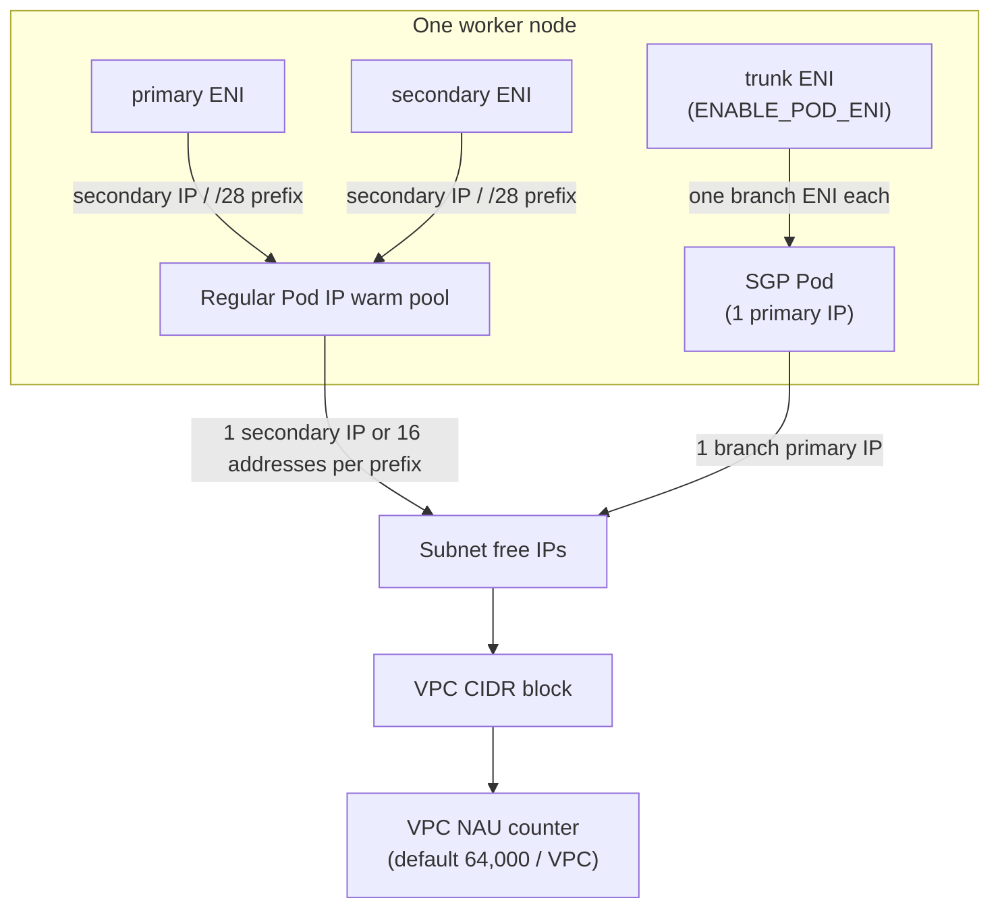

## Overview

Amazon VPC CNI assigns subnet addresses to ordinary Pods; hostNetwork Pods share the node network. Subnet addresses and VPC NAU constrain resource growth, while the branch ENI limit constrains further SGP Pod placement on a particular node. Reaching a node's branch limit does not stop all ordinary Pods or the creation of other nodes. This guide explains node IP budgets and how warm pools increase address consumption when Karpenter falls back from large to small instances. It is intended for platform teams managing node scaling and subnet design across clusters that share a VPC.

## Background

Terms are used with the following meanings.

- **secondary IP / prefix** — An extra IPv4 address assigned to an ENI, or a /28 prefix bundling 16 addresses
- **branch ENI** — An ENI attached per Pod for Pods that use Security Groups for Pods (SGP), hanging off the node's trunk ENI
- **warm pool** — Spare IPs and ENIs that ipamd holds in advance so it can answer Pod creation requests immediately
- **NAU (Network Address Usage)** — The unit that counts address resources attached to a VPC. IPs, prefixes, and ENIs each count at a fixed rate

The algorithm ipamd uses to fill the warm pool, the mechanics of Prefix Delegation, and the IP cooldown are covered in [How VPC CNI Works](./vpc-cni-deep-dive.md). This guide takes that behavior as given and concentrates on how to calculate consumption and where to leave headroom.

On EKS Auto Mode clusters, AWS manages node networking (including the ENI lifecycle), so there are no VPC CNI environment variables such as `WARM_*` or `MINIMUM_IP_TARGET`. IP allocation is controlled through the NodeClass instead. `advancedNetworking.ipv4PrefixSize` is either `Auto` (the default: Prefix Delegation, one /28 assigned to each node up front and another added when it fills) or `"32"` (secondary IP mode, one IP per Pod, only one spare IP kept warm). `secondaryIPv4Count` and `secondaryIPv4PrefixCount` under `advancedNetworking.networkInterfaces` fix the IP count per ENI at launch, after which no IPs, prefixes, or ENIs are added. Pod subnets are separated from node subnets with `podSubnetSelectorTerms`.

Auto Mode does not support Security Groups for Pods. Configure `podSubnetSelectorTerms` and `podSecurityGroupSelectorTerms` together; all Pods on nodes using that NodeClass share the same Pod security groups. This has different granularity from a per-Pod SecurityGroupPolicy. Separate workloads that require different policies with separate NodeClasses/NodePools and placement constraints. Pod capacity is the lowest of configured maxPods, instance IP capacity and Auto Mode's limit of 110. The warm-target settings below apply to self-managed CNI nodes. For sparse Auto Mode workloads, `ipv4PrefixSize: "32"` reduces the minimum prefix reservation.

## Architecture

IPs leave a node along two paths. Regular Pods take secondary IPs (or prefixes) on the primary and secondary ENIs; Pods with an SGP take the primary IP of a branch ENI attached to the trunk ENI. Both paths draw down the subnet's free addresses and the VPC's NAU counter.



Which subnet a secondary ENI lands in is decided by the VPC CNI settings and Enhanced Subnet Discovery. Branch ENI capacity is a fixed per-instance-type limit and is not affected by the warm targets.

## Calculating IP Consumption

### What one node holds

Distinguish the Pod address pool from the node's total address consumption. Primary addresses on IPv4 ENIs are separate from the secondary-IP pool; trunk and branch addresses also belong in the budget. The following identity counts private IPv4 addresses allocated to the node. Add other VPC resources separately.

```text
Allocated IPv4 for the node = E + A + 16 × F + B
E = primary IPv4 addresses on ordinary and trunk ENIs
A = individual secondary IPv4 addresses allocated for ordinary Pods
F = allocated IPv4 /28 prefixes
B = primary IPv4 addresses on branch ENIs
```

The steady-state ordinary-Pod pool target can be approximated as `T = max(MINIMUM_IP_TARGET, P + WARM_IP_TARGET)`, where `P` counts used Pod addresses excluding hostNetwork and SGP. In secondary-IP mode, `A ≈ T`; in prefix mode, `16 × F ≈ 16 × ceil(T / 16)`, subject to ENI limits, allocation delays and cooldown. This target is not the total including node/trunk/branch addresses. Without warm IP targets, also check the mode-specific ENI or prefix warm target.

### VPC NAU

NAU is a resource-accounting measure separate from subnet address consumption. The current VPC guide lists assigned addresses, additional ENIs and prefixes as NAU items, and also lists an Amazon EKS Pod as one NAU item. A prefix costing one NAU therefore does not establish a cluster-wide conversion of 16 Pods to one NAU. Reconcile the actual resource inventory with the official NAU table and observed VPC NAU. The default quota is 64,000 per VPC, adjustable to 256,000. The combined intra-Region peering quota defaults to 128,000 and can reach 512,000; cross-Region peering is excluded from that aggregate.

When dozens of clusters share a single VPC, the NAU quota can be reached while subnets still have free addresses. That is why subnet size and NAU belong in the same spreadsheet.

### Effect of instance size

The following example compares only the **secondary-IP pool for exactly 2,000 ordinary Pods**. All Pods exclude hostNetwork and SGP, `WARM_IP_TARGET=2`, and `MINIMUM_IP_TARGET` equals each row's maximum Pod count (100, 33 or 16). The 61-node row places 33 Pods on 48 nodes and 32 on 13 nodes. Add node and additional-ENI primary addresses to the table's totals.

| Size | Pod placement | Nodes | Pool IPs | Unused IPs |
|---|---|---|---|---|
| 24xlarge | 20 × 100 = 2,000 | 20 | 2,040 | 40 |
| 8xlarge | 48 × 33 + 13 × 32 = 2,000 | 61 | 2,122 | 122 |
| 4xlarge | 125 × 16 = 2,000 | 125 | 2,250 | 250 |

More nodes increase both warm-pool and ENI-primary-address overhead. Placement also changes the unused capacity imposed by the minimum target: filling 60 nodes with 33 Pods and placing 20 on the last leaves that last pool at its minimum of 33, for 2,133 Pod-pool IPs. This comparison assumes separate targets by size; one aws-node DaemonSet applies a common set of environment variables.

## Over-reservation on Small-Instance Fallback

VPC CNI environment variables are set cluster-wide on the aws-node DaemonSet, so a NodePool cannot carry its own values. If `MINIMUM_IP_TARGET` is set to 100 because a 24xlarge is expected to run 100 Pods, a node that fell back to a 4xlarge reserves 100 IPs too. It will only ever run 16 Pods, so 84 addresses per node sit idle.

```text
Idle IPs per fallback node ≈ MINIMUM_IP_TARGET − Pods per node at that size
Example: 100 − 16 = 84
500 × 4xlarge × 84 ≈ 42,000 → more than one /17 subnet (32,763 usable)
```

None of this shows up on a normal day. While large instances are available, the reserved IPs are mostly used by Pods. The waste appears when fallback happens all at once: a DR drill or a large redeploy during a regional capacity shortage brings up hundreds of small nodes together and empties the subnet. IPs released by deleted Pods are reusable only after the default 30-second cooldown (`IP_COOLDOWN_PERIOD`), so in a large redeploy that waiting stock adds to the momentary consumption as well.

Tune warm targets against expected Pod density and creation rate. Separate NodePools make candidate sizes and preferences easier to manage, but weights do not guarantee a strict 24xlarge → 8–16xlarge → 4xlarge sequence. Exclude unacceptable sizes with requirements and separately monitor growth in small nodes and subnet headroom.

## IP Consumption by Security Groups for Pods

With `ENABLE_POD_ENI=true`, Pods matched by a `SecurityGroupPolicy` use a branch ENI's primary IP. The [vpc-resource-controller limits](https://github.com/aws/amazon-vpc-resource-controller-k8s/blob/93df905c6fb7bec57d90afd490e926b1ad04a57e/pkg/aws/vpc/limits.go) list eight ENIs, 30 IPv4 addresses per ENI and 54 branch ENIs for c5.4xlarge. Subtracting each ENI's primary address gives a raw secondary-address slot ceiling of `8 × (30 − 1) = 232`. The current CNI README's '234 secondary IPs' example conflicts with that calculation and should not be used as a capacity guarantee. Determine the actual Pod limit from interface use, including trunk/custom networking, the CNI version and kubelet maxPods.

In clusters where most Pods use SGP, a few properties make IP planning harder.

- Turning on `ENABLE_PREFIX_DELEGATION=true` does not raise branch ENI Pod density. A branch ENI receives a single primary IP, so prefixes bring nothing.
- Branch ENI Pod counts are independent of the `WARM_*` targets. Setting the warm targets low, based on non-SGP Pods only, wastes less.
- `POD_SECURITY_GROUP_ENFORCING_MODE` is `strict` (default) or `standard`. `standard` exempts same-host kubelet and NodeLocal DNS traffic from the SG rules and is required when kube-proxy runs in `ipvs` mode. SGP and trunk/branch ENIs work only on Nitro instances.

## Subnet Expansion Paths

When a subnet runs short, consider these options in order of how much they change.

1. **Enhanced Subnet Discovery** — Attach a new CIDR block to the VPC and tag the new subnets with `kubernetes.io/role/cni=1`. Nodes running with `ENABLE_SUBNET_DISCOVERY=true` (the default since VPC CNI v1.18.0) create their new secondary ENIs in those subnets. Existing Pods are untouched and the address space grows. The VPC CNI role needs IAM permission to call `ec2:DescribeSubnets`.
2. **Secondary CIDR** — Add the RFC 6598 shared range `100.64.0.0/10` (for example `100.64.0.0/16`) to the VPC to give Pods address space without spending corporate RFC 1918 ranges.
3. **Custom networking** — When Pods must live in a different subnet from the node, use `AWS_VPC_K8S_CNI_CUSTOM_NETWORK_CFG=true` with `ENIConfig`. The primary ENI can no longer serve Pods, so the maximum Pods per node drops.
4. **IPv6** — For a new cluster, IPv4 exhaustion goes away entirely. IPv6 requires Prefix Delegation mode and Nitro instances.

Check the VPC quotas as well. A VPC allows 5 IPv4 CIDR blocks by default (up to 50) and 200 subnets by default; request increases where needed. For reference, eksctl splits its default VPC `192.168.0.0/16` into eight /19 subnets (8,192 addresses each).

Instead of tuning warm targets and guarding add-on configuration against drift indefinitely, moving the workloads that keep running out of IPs to an EKS Auto Mode NodePool is also worth considering as a way to shrink node-networking operations. You pick the per-node reservation unit with `ipv4PrefixSize` and hand the ENI lifecycle and CNI updates to AWS; in exchange you accept no Security Groups for Pods, a 110-Pod cap per node, and no fine-grained warm-target control. Auto Mode nodes and self-managed nodes can share one cluster, with workloads split between them.

## How Karpenter Picks Subnets

Karpenter v1 (`karpenter.sh/v1`) does not actively manage the IP budget. Among the subnets found by the EC2NodeClass `subnetSelectorTerms`, if several belong to the AZ where the node will launch, it picks the one with the most free IPs, and `status.subnets` is sorted by free IP count in descending order. This is a tiebreak within one AZ; Karpenter does not move nodes between AZs based on IP headroom.

If the subnet has no free IPs at launch time, the EC2 launch fails with `InsufficientFreeAddressesInSubnet` and the error is recorded on the NodeClaim. What Karpenter cannot see is a node that is already running and whose ipamd can no longer get IPs, leaving Pods in `ContainerCreating`. This is why the IP budget has to be built into NodePool design and subnet sizing up front.

## Implementation

### Adding subnets and tagging them for the CNI

Create the new subnets and tag them so the CNI can discover them.

```bash
# 1) Attach a secondary CIDR to the VPC (RFC 6598 shared range)
aws ec2 associate-vpc-cidr-block --vpc-id vpc-0abc --cidr-block 100.64.0.0/16

# 2) Create a subnet per AZ, then add the CNI role tag
aws ec2 create-tags --resources subnet-0def \
  --tags Key=kubernetes.io/role/cni,Value=1

# 3) Check free IPs in the subnet
aws ec2 describe-subnets --subnet-ids subnet-0def \
  --query 'Subnets[].AvailableIpAddressCount'
```

### Managing warm targets through add-on configuration

Whether changes made with `kubectl set env` survive an add-on update depends on conflict resolution. `PRESERVE` can retain existing edits, while `OVERWRITE` can replace managed fields. Even through the add-on API, existing advanced settings omitted from new `configuration-values` can revert to defaults.

Save the current `configurationValues` and effective aws-node configuration, then check the schema for the installed add-on version. Review a complete `reviewed-vpc-cni-config.json` that merges `WARM_ENI_TARGET="0"`, `WARM_IP_TARGET="2"`, and `MINIMUM_IP_TARGET="12"` into the existing settings. These are example targets; adjust them for Pod density and scale-out rate. Run the following command after selecting the intended cluster and Region and preparing that complete file.

```bash
aws eks update-addon --cluster-name my-cluster --addon-name vpc-cni \
  --configuration-values file://reviewed-vpc-cni-config.json \
  --resolve-conflicts PRESERVE
```

Use the returned update ID to check for `Successful` in `describe-update`, then inspect the add-on status, health issues, and `configurationValues` with `describe-addon`. Compare environment variables in the aws-node DaemonSet and running Pods against the intended values. `PRESERVE` does not guarantee that every requested value took effect.

If a conflict or connectivity problem occurs, stop further rollout, assess the affected workloads, and recover using the saved configuration after reviewing the differences. Follow the validation steps in [Update an Amazon EKS add-on](https://docs.aws.amazon.com/eks/latest/userguide/updating-an-add-on.html) before changing production settings.

Set `MINIMUM_IP_TARGET` to the Pod count expected on the dominant node size, and set `WARM_IP_TARGET` alongside it to a small value greater than 0. With `MINIMUM_IP_TARGET` alone, `WARM_IP_TARGET` is treated as 0 and no spare IPs are acquired once the minimum is reached. A smaller `WARM_IP_TARGET` saves IPs but adds an EC2 API call every time a Pod comes or goes, so on a large cluster or one with high Pod churn it can trigger EC2 API throttling. The VPC CNI README advises against relying on `WARM_IP_TARGET` alone in that situation; covering the base with `MINIMUM_IP_TARGET` and keeping `WARM_IP_TARGET` small is the compromise.

### Three-tier weighted NodePools

Assign weights to three NodePools split by size and family to express preference. Pod batching, bin packing and use of existing nodes can select a lower-weight pool, so this is not a guaranteed staged-fallback sequence. The `weight`, `limits` and disruption `budgets` syntax is covered in [Karpenter Autoscaling](../resource-cost/karpenter-autoscaling.md).

```yaml
apiVersion: karpenter.sh/v1
kind: NodePool
metadata:
  name: primary-large
spec:
  weight: 100
  template:
    spec:
      requirements:
        - key: karpenter.k8s.aws/instance-family
          operator: In
          values: ["c7i", "m7i"]
        - key: karpenter.k8s.aws/instance-size
          operator: In
          values: ["24xlarge"]
      nodeClassRef:
        group: karpenter.k8s.aws
        kind: EC2NodeClass
        name: default
  disruption:
    consolidationPolicy: WhenEmptyOrUnderutilized
    consolidateAfter: 1m
    budgets:
      - nodes: "10%"
  limits:
    cpu: "20000"
```

The second pool can use `weight: 50` and `instance-size In ["8xlarge","12xlarge","16xlarge"]`; the final 4xlarge pool can use a lower weight and `limits`. Limit checking is eventually consistent and may overrun during rapid scale-out, so retain subnet headroom rather than treating it as a strict IP safety barrier. Constrain size, family and generation with the corresponding Karpenter requirements labels.

### Narrowing the SGP scope

Keep only the Pods that truly need a per-Pod security group (for example, Pods that must reference a datastore's SG) as `SecurityGroupPolicy` targets, and cover the rest of the Pod-to-Pod isolation with node SGs and VPC CNI Network Policy. Branch ENI consumption drops accordingly. Network Policy is supported from VPC CNI v1.14.0 and is enforced with eBPF.

### Prefix Delegation on NodePools without SGP

For NodePools that do not use SGP, enable Prefix Delegation to improve ENI slot efficiency and reduce EC2 API calls. `spec.ipPrefixCount` on the EC2NodeClass controls the number of prefixes per node. A fragmented subnet may have no contiguous /28 left, which surfaces as `InsufficientCidrBlocks`; pair prefix mode with a dedicated subnet or a Subnet CIDR reservation. Recalculate kubelet `max-pods` for prefix mode, and roll the change out as a new NodePool rather than converting existing nodes in place.

### DR capacity

Options for the case where large instances cannot be obtained.

- Allow several families and sizes in the NodePool requirements rather than pinning one type.
- Consume On-Demand Capacity Reservations (ODCRs) first through `capacityReservationSelectorTerms` on the EC2NodeClass. This feature is in Beta as of the karpenter.sh documentation (September 2026) and requires `karpenter.sh/capacity-type: reserved` and the `ec2:DescribeCapacityReservations` IAM permission.
- Pre-warm nodes with static NodePool `replicas` or overprovisioning ([Karpenter Autoscaling](../resource-cost/karpenter-autoscaling.md)). For the disruption design when those nodes are consumed, see [Pod Scheduling and Availability](../operations-reliability/eks-pod-scheduling-availability.md).

## Operational Considerations

- Read each subnet's actual headroom from `AvailableIpAddressCount` in `aws ec2 describe-subnets`. Use EC2NodeClass `status.subnets` to identify the selected subnet IDs and AZs; it does not expose the available-IP count itself.
- Keep metrics exposure on aws-node enabled (`DISABLE_METRICS=false`, the default) and deploy the CNI Metrics Helper to get the number of ENIs the cluster can support, ENIs and IPs assigned, and total and maximum available IPs into CloudWatch. With Prometheus, scrape port 61678 on aws-node directly.
- Monitor VPC NAU in CloudWatch and request a quota increase before the limit is reached. Past the quota, calls such as `RunInstances` and `AssignPrivateIpAddresses` fail with `NetworkAddressUsageLimitExceeded`.
- An example threshold is subnet utilization at or above 80% (available capacity at or below 20%), or NAU utilization at or above 80%. Also track absolute available addresses and reserve headroom for the planned DR scale. Adding a CIDR after exhaustion still takes time before new ENIs can use it.
- The step-by-step procedure for diagnosing IP exhaustion symptoms is in [Networking Debugging](../operations-reliability/eks-debugging/networking.md).
- Hundreds of small nodes arriving at once during DR put load on the API server. Stage the scale-out and, where needed, arrange control plane capacity in advance.

## Troubleshooting

| Symptom | Cause | Action | How to verify |
|---|---|---|---|
| Pods wait for an IP in `ContainerCreating`, Pod count is low, subnet free IPs are 0 | Default `WARM_ENI_TARGET` reserves a whole ENI's worth of IPs | Set `WARM_ENI_TARGET=0` and retune `WARM_IP_TARGET` / `MINIMUM_IP_TARGET` via add-on configuration | Gap between total and assigned IPs narrows in CNI metrics |
| Each small fallback node holds many idle IPs | Cluster-wide `MINIMUM_IP_TARGET` sized for large nodes | Raise the fallback size to 8–16xlarge, add a minimum Pod size policy | Assigned/total IP ratio per node |
| Karpenter `InsufficientFreeAddressesInSubnet`, only one AZ fails to scale | That AZ's subnet is exhausted; Karpenter does not steer across AZs | Add a secondary CIDR with ESD tags, check `status.subnets` | ENIs appear in the new subnet |
| `InsufficientCidrBlocks` in prefix mode | Fragmented subnet, no contiguous /28 | Subnet CIDR reservation or a dedicated subnet | Reservation usage |
| IP pressure persists after enabling Prefix Delegation | SGP Pods consume branch ENI IPs (no prefix benefit) | Narrow the SGP scope, replace with Network Policy | SGP Pod share, branch ENI count |
| Pending with `Insufficient vpc.amazonaws.com/pod-eni` | Per-instance branch ENI limit reached | Account for per-type limits, narrow the SGP scope | Node allocatable `pod-eni` |
| IP exhaustion returns after an add-on update | Conflict resolution or omitted settings in a new configuration-values object | Compare old and new configuration and manage the complete merged settings through the add-on API | Compare describe-addon configurationValues with the actual DaemonSet |
| Small nodes surge during DR when large instances are unavailable | Single pinned type, regional capacity shortage | Weighted NodePools across sizes and families, ODCR, pre-warm | Node size distribution, ICE event count |

## Summary

Subnet addresses, VPC NAU and per-node branch ENI limits apply at different scopes. Budget node, trunk and branch addresses and prefix allocation units alongside Pod-pool warm targets. A shared warm target can increase idle addresses on small fallback nodes. Karpenter's launch-time subnet selection alone does not prevent Pod-level CNI IP exhaustion. Design subnet headroom and NodePool candidates together, treat weights as preferences, and budget SGP branch addresses separately from prefix-mode benefits.

## References

### Official Documentation
- [EKS Best Practices: Optimizing IP Address Utilization](https://docs.aws.amazon.com/eks/latest/best-practices/ip-opt.html) — Enhanced Subnet Discovery, secondary CIDR, warm pool tuning caveats
- [EKS Best Practices: Security Groups for Pods](https://docs.aws.amazon.com/eks/latest/best-practices/sgpp.html) — Trunk/branch ENI structure and supported instances
- [amazon-vpc-cni-k8s CNI Configuration Variables](https://github.com/aws/amazon-vpc-cni-k8s#cni-configuration-variables) — WARM/MINIMUM targets, ENABLE_SUBNET_DISCOVERY, POD_SECURITY_GROUP_ENFORCING_MODE defaults
- [VPC Network Address Usage](https://docs.aws.amazon.com/vpc/latest/userguide/network-address-usage.html) — How NAU is calculated per IP, prefix, and ENI
- [Amazon VPC quotas](https://docs.aws.amazon.com/vpc/latest/userguide/amazon-vpc-limits.html) — Default subnet, CIDR, and NAU quotas
- [Karpenter NodePools](https://karpenter.sh/docs/concepts/nodepools/) — weight, limits, disruption budgets, well-known labels
- [Karpenter NodeClasses](https://karpenter.sh/docs/concepts/nodeclasses/) — subnetSelectorTerms, capacityReservationSelectorTerms, ipPrefixCount
- [Learn about VPC Networking and Load Balancing in EKS Auto Mode](https://docs.aws.amazon.com/eks/latest/userguide/auto-networking.html) — Managed node networking in Auto Mode and NodeClass subnet selection
- [Create a Node Class for Amazon EKS](https://docs.aws.amazon.com/eks/latest/userguide/create-node-class.html) — `ipv4PrefixSize`, `networkInterfaces`, separate Pod subnets, the 110-Pod-per-node limit
- [eksctl VPC Configuration](https://eksctl.io/usage/vpc-configuration/) — Default VPC 192.168.0.0/16 split into eight /19 subnets

### Technical Blogs
- [Amazon VPC CNI introduces Enhanced Subnet Discovery](https://aws.amazon.com/blogs/containers/amazon-vpc-cni-introduces-enhanced-subnet-discovery/) — Tag-based, non-disruptive subnet expansion
- [Amazon VPC CNI increases pods per node limits](https://aws.amazon.com/blogs/containers/amazon-vpc-cni-increases-pods-per-node-limits/) — Density gains and constraints of Prefix Delegation

### Related Documents (internal)
- [How VPC CNI Works](./vpc-cni-deep-dive.md) — ipamd warm pool, Prefix Delegation, and IP cooldown mechanics
- [Karpenter Autoscaling](../resource-cost/karpenter-autoscaling.md) — NodePool syntax, weight, overprovisioning
- [Networking Debugging](../operations-reliability/eks-debugging/networking.md) — IP exhaustion diagnostic runbook
- [Pod Scheduling and Availability](../operations-reliability/eks-pod-scheduling-availability.md) — Taints, PDBs, and disruption design
