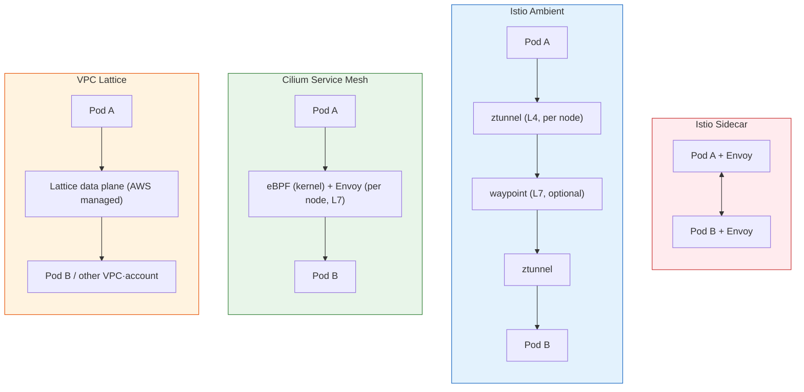
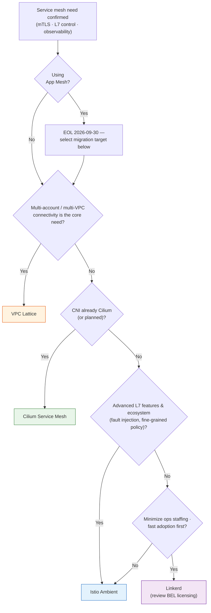

## Overview

While the [Gateway API Adoption Guide](../gateway-api-adoption-guide/index.md) covered North-South (ingress) traffic management, this document addresses the **service mesh layer** responsible for East-West (service-to-service) traffic. It compares the architecture, features, performance overhead, and operational complexity of the four practical options on EKS — Istio (sidecar/Ambient), Cilium Service Mesh, Linkerd, and AWS VPC Lattice — and provides selection criteria by workload characteristics.

The intended audience is platform engineers with mTLS, L7 traffic control, or service-level observability requirements, and organizations evaluating alternatives due to the AWS App Mesh end of support. Post-adoption latency and cost optimization is covered separately in [East-West Traffic Optimization](../east-west-traffic-best-practice.md).

**TL;DR**

| Situation | Recommended solution |
|-----------|---------------------|
| Feature completeness and ecosystem first, dedicated ops team | Istio (Ambient mode preferred) |
| CNI is already Cilium, minimal overhead | Cilium Service Mesh |
| Small team, automatic mTLS with minimal configuration | Linkerd |
| Multi-account / multi-VPC, managed service preferred | AWS VPC Lattice |
| Currently on App Mesh | **End of support September 30, 2026** — migration to one of the above is required |

## When to Adopt a Service Mesh

### Problems a Service Mesh Solves

A service mesh provides the following capabilities for service-to-service communication without application code changes.

- **mTLS / Zero-Trust**: Enforces mutual authentication and transport encryption at the platform layer. This is the standard means of satisfying end-to-end encryption requirements in regulated environments such as ISMS-P and PCI-DSS.
- **L7 traffic control**: Declaratively manages weighted traffic splitting (canary), header-based routing, retries, timeouts, and circuit breakers per service.
- **Observability**: Collects golden-signal metrics (latency, traffic, errors, saturation) and distributed traces between services without instrumentation code.

### When a Service Mesh Is Not Needed

In the following scenarios, Kubernetes-native features are sufficient without a mesh.

- **Only traffic locality optimization is needed**: Solved by Topology Aware Routing and `internalTrafficPolicy` — see [East-West Traffic Optimization](../east-west-traffic-best-practice.md)
- **Only L3/L4 access control is needed**: NetworkPolicy (or CiliumNetworkPolicy) is sufficient
- **Small workloads with fewer than ~10 services**: The operational cost of a mesh likely outweighs its benefits
- **Extremely latency-sensitive paths**: If any proxy hop is unacceptable, the design should exclude those paths from the mesh

### AWS App Mesh End of Support

:::warning AWS App Mesh EOL — September 30, 2026

AWS App Mesh reaches end of support on September 30, 2026. App Mesh resources become inaccessible after that date, and new adoption is not possible. AWS officially recommends **Amazon VPC Lattice** or **ECS Service Connect** (ECS only) as migration paths; on EKS, migrating to an open-source mesh such as Istio is also a common choice.

- To keep Envoy-based L7 features (retries, traffic splitting) → Istio or Cilium
- To keep a managed operational model → VPC Lattice
:::

## Solutions Compared and Data Plane Architectures

A service mesh's performance and operational characteristics are determined by its data plane architecture. The four solutions represent four distinct approaches.



### Istio — Sidecar Mode and Ambient Mode

Istio (current stable 1.30, released May 2026) has the most mature feature set and ecosystem. It offers two data plane modes.

- **Sidecar mode**: Injects an Envoy proxy into every Pod. Provides all L7 features per Pod, but resource consumption scales with Pod count and the proxy participates in the Pod lifecycle.
- **Ambient mode**: Splits the data plane into a per-node L4 proxy (ztunnel) and optional per-namespace/service L7 proxies (waypoints). Provides mTLS by default without sidecars, and only services requiring L7 features pay the waypoint cost. Ambient reached GA in Istio 1.24; 1.30 added multi-network Ambient, `ServiceEntry` CIDR routing, and a sidecar-to-ambient migration guide.

Ambient mode is the default choice for new adoption. Sidecar mode remains only for cases requiring per-Pod fine-grained control (e.g., different Envoy filters per Pod).

### Cilium Service Mesh — eBPF-Based Sidecarless

Cilium (current stable 1.19) absorbs mesh functionality into the CNI layer. L4 processing (load balancing, policy, encryption) is handled by eBPF in the kernel, and traffic traverses a per-node Envoy instance only when L7 features are needed.

- **mTLS works differently**: Instead of TLS handshakes in Envoy-based meshes, node-to-node transport encryption uses WireGuard or IPsec, and authentication is handled via SPIFFE-based mutual authentication. If regulatory requirements demand "per-service mTLS evidence," verify the audit interpretation in advance.
- **Prerequisite**: The cluster CNI must be Cilium. On EKS this means replacing VPC CNI with Cilium ENI mode; see [Cilium ENI Mode + Gateway API Deep Dive](../gateway-api-adoption-guide/cilium-eni-gateway-api.md) for details.
- If Cilium is already your CNI, enabling Hubble observability and L7 policy provides most mesh capabilities without additional components.

### Linkerd — Lightweight Rust Proxy

Linkerd (current stable 2.20, released June 2026) focuses on operational simplicity. Instead of Envoy, it uses a purpose-built Rust microproxy (linkerd2-proxy) as a sidecar, with per-proxy memory in the tens of MB — significantly lighter than Envoy. Automatic mTLS is active immediately after installation with no additional configuration.

- In 2.20, Kubernetes Native Sidecar (1.29+) was promoted to the default deployment type, structurally resolving sidecar start/termination ordering issues. Control plane memory was also reduced by up to 85% on large busy clusters.
- :::info Buoyant distribution policy
  Since 2024, the Linkerd project no longer publishes stable release binaries directly. Stable distributions are provided as Buoyant Enterprise for Linkerd (BEL), free for non-production use and for production use by companies with fewer than 50 employees. Other production use requires a commercial license, so review licensing terms before adoption. Running open-source edge releases directly is an option, but carries a self-validation burden.
  :::

### AWS VPC Lattice — Managed Alternative

Amazon VPC Lattice is strictly a **managed application networking service** rather than a mesh product, but it solves the mesh's core problems — service connectivity, authentication, observability — without sidecars.

- The data plane is built into AWS infrastructure, so there are no proxies or agents in the cluster. It natively crosses VPC and account boundaries.
- Authentication and authorization use IAM policies (SigV4 signing) — certificate management disappears, but request signing may require SDK or proxy configuration.
- In Kubernetes, it is managed declaratively through Gateway API resources (HTTPRoute) via the [AWS Gateway API Controller](https://www.gateway-api-controller.eks.aws.dev/) — effectively a managed implementation of the GAMMA pattern.
- Particularly advantageous in heterogeneous environments requiring integration with ECS, Lambda, and EC2 beyond EKS.

## Feature Comparison Matrix

| Item | Istio (Ambient) | Cilium Service Mesh | Linkerd | VPC Lattice |
|------|----------------|--------------------|---------| ------------|
| Current stable version | 1.30 | 1.19 | 2.20 (BEL) | Managed (no version) |
| Data plane | ztunnel (L4) + waypoint (L7) | eBPF + per-node Envoy | Rust sidecar | AWS managed |
| Sidecar | Not required | Not required | Required (Native Sidecar) | Not required |
| mTLS | Automatic (SPIFFE certificates) | WireGuard/IPsec + mutual auth | Automatic (zero config) | IAM + SigV4 |
| L7 routing / traffic splitting | HTTPRoute · VirtualService | HTTPRoute · CiliumEnvoyConfig | HTTPRoute | HTTPRoute (Lattice rules) |
| Retry / timeout / circuit breaker | Full support | Supported (via Envoy) | Supported (2.20: rate-limit-aware LB) | Retry/timeout (limited circuit breaking) |
| Fault injection | Native | Limited | Limited | AWS FIS integration |
| Observability | Kiali · Jaeger · Prometheus | Hubble (Service Map) | Viz dashboard | CloudWatch · X-Ray |
| Multi-cluster | Supported (high complexity) | ClusterMesh | Supported (BEL) | Native (VPC/account boundaries) |
| GAMMA support | Full support | HTTPRoute → Service | HTTPRoute-based | Gateway API Controller |
| EKS installation path | Helm / istioctl | Helm / Cilium CLI (CNI replacement) | Helm / linkerd CLI | AWS Gateway API Controller |
| License / governance | Apache-2.0, CNCF Graduated | Apache-2.0, CNCF Graduated | Apache-2.0 (stable via BEL) | AWS service (pay-as-you-go) |

For detailed GAMMA (Gateway API for Mesh) support status, see [GAMMA Initiative](./gamma-initiative.md).

### Differences in mTLS and Zero-Trust Implementation

The same "mTLS support" is implemented at different layers.

- **Istio · Linkerd**: Express service identity via per-workload X.509 certificates (SPIFFE IDs). Certificate rotation is automatic, but trust anchor (root CA) rotation is an operational task — Linkerd 2.20 automated it.
- **Cilium**: Separates transport encryption (WireGuard/IPsec) from identity authentication. Kernel-level encryption has the lowest overhead, but differs in nature from audit requirements that demand per-TLS-session evidence.
- **VPC Lattice**: Handles service-to-service authorization with TLS termination + IAM policy evaluation, sharing the same authorization model with non-Kubernetes services (Lambda, EC2).

## Performance Overhead and Resource Costs

### Data Plane Overhead

The general overhead ordering is as follows (lower is better):

```
eBPF (Cilium) < node proxy (Istio Ambient L4) ≈ lightweight sidecar (Linkerd) < Envoy sidecar (Istio Sidecar)
```

Quantitative figures for Istio sidecar mode (~0.2 vCPU / ~60 MB per sidecar at 1000 rps, ~5ms added p99 latency) and the measurement methodology are documented in [Step 6 of East-West Traffic Optimization](../east-west-traffic-best-practice.md). Ambient mode significantly reduces latency and resources versus sidecars for L4-only traffic, and only services with waypoints pay L7 proxy costs.

VPC Lattice has no in-cluster overhead, but adds a network hop through the AWS data plane.

### Resource and Node Density Impact

- **Sidecar mode**: Pod count × proxy resources consumes node capacity. In high-Pod-density clusters this drives node scale-out.
- **Ambient · Cilium**: Fixed per-node cost (ztunnel/Envoy DaemonSet), predictable regardless of Pod density.
- **Linkerd**: A sidecar, but tens of MB per proxy — lower than Envoy.

### AWS Cost Perspective

| Item | Self-managed mesh (Istio · Cilium · Linkerd) | VPC Lattice |
|------|---------------------------------------------|-------------|
| Billing model | EC2 compute for proxies and control plane | Per-service hourly + per-GB processing + per-request |
| Cost characteristics | Fixed regardless of traffic (resource-based) | Proportional to traffic (pay-as-you-go) |
| Hidden costs | Ops staffing, upgrades, incident response | Processing charges can surge at high traffic volume |

Workloads with few services and heavy traffic tend to favor self-managed; environments with many services and accounts with distributed traffic tend to favor Lattice. For interaction with cross-AZ data charges, see [East-West Traffic Optimization](../east-west-traffic-best-practice.md).

## Operational Complexity and EKS Integration

### Installation and Upgrade Paths

| Solution | Installation | Upgrade characteristics |
|----------|-------------|------------------------|
| Istio | Helm or istioctl | Canary control plane upgrades (revisions) recommended; Ambient updates ztunnel/waypoint sequentially |
| Cilium | Helm / Cilium CLI — **replaces the CNI** | Requires the same caution as CNI upgrades; recommended for new clusters |
| Linkerd | Helm / linkerd CLI | Trust anchor rotation is the main event (automated in 2.20) |
| VPC Lattice | Gateway API Controller (Helm) | AWS manages the data plane; only the controller is updated |

### Control Plane Operational Burden

- **Istio**: Requires operating Istiod, learning CRDs (VirtualService, DestinationRule, etc.), and tracking behavioral changes across versions. Highest operational burden of the four, but also the most commercial support options (Solo.io, Tetrate, etc.).
- **Cilium**: CNI and mesh are a single component, so there is no separate mesh control plane. However, Cilium itself is the cluster networking single point of failure, so CNI operating expertise is a prerequisite.
- **Linkerd**: Simple control plane and small CRD surface — the gentlest learning curve.
- **VPC Lattice**: No control plane to operate. In exchange, you depend on AWS service quotas and feature release cadence.

### Kubernetes Native Sidecar and Lifecycle

Kubernetes 1.29+ Native Sidecar (initContainer `restartPolicy: Always`) structurally resolves the chronic issues of sidecar-based meshes — proxies starting after the app or terminating before it, dropping traffic. Linkerd 2.20 adopted it as the default; Istio sidecar mode also supports it. For detailed patterns such as sidecar termination in Job workloads, see [EKS Pod Health Checks & Lifecycle Management](../../operations-reliability/eks-pod-health-lifecycle.md).

### Combining with Resilience Patterns

Practical configuration of mesh-based resilience patterns — circuit breakers, retries, outlier detection — is documented Istio-first in the [EKS High Availability Architecture Guide](../../operations-reliability/eks-resiliency-guide.md). When implementing the same patterns on another mesh, first check the support scope in the feature comparison matrix above.

## Selection Guide

### Decision Tree



### Recommended Combinations by Scenario

| Scenario | Recommendation | Rationale |
|----------|---------------|-----------|
| Small team, 10–30 services, automatic mTLS is the main goal | Linkerd | Minimal configuration, lowest learning curve. BEL production is free for companies under 50 employees |
| Zero-Trust regulated environment (ISMS-P, finance) | Istio Ambient | Per-workload SPIFFE identity, policy expressiveness, audit-evidence ecosystem |
| Existing Cilium CNI users | Cilium Service Mesh | Mesh capability without additional components, lowest overhead |
| Large organization with multiple accounts and dozens of VPCs | VPC Lattice | Native account boundaries, IAM integration, no ops burden |
| App Mesh exit (keep Envoy L7 features) | Istio | Maximum Envoy-based feature compatibility |
| App Mesh exit (stay managed) | VPC Lattice | AWS official migration path |

### For Multi-Cluster Requirements

| Option | Characteristics |
|--------|----------------|
| Cilium ClusterMesh | Lowest latency, direct Pod-to-Pod, all clusters must run Cilium |
| Istio multi-cluster | Full mesh features across cluster boundaries, highest operational complexity |
| VPC Lattice | Cluster, VPC, and account boundaries all solved as a managed service |

For quantitative latency/cost comparison and the Route53-based alternative, see the [multi-cluster connectivity strategies in East-West Traffic Optimization](../east-west-traffic-best-practice.md).

## Summary

Service mesh selection on EKS is determined not by "the best mesh" but by the organization's CNI strategy, operational capability, and account topology. Data planes have diverged from sidecars to node proxies (Ambient), the kernel (eBPF), and managed services (Lattice) — for new adoption, there is no longer a reason to default to sidecar mode. Organizations on App Mesh must complete migration before end of support on September 30, 2026. Quantitative performance benchmarks of the four solutions are planned as a separate future benchmark document.

## References

### Official Documentation
- [Istio Ambient Mode](https://istio.io/latest/docs/ambient/overview/) — Official documentation on ztunnel/waypoint architecture
- [Cilium Service Mesh](https://docs.cilium.io/en/stable/network/servicemesh/) — Official documentation on eBPF-based mesh features
- [Linkerd Documentation](https://linkerd.io/2/overview/) — Official Linkerd architecture and feature documentation
- [Amazon VPC Lattice](https://docs.aws.amazon.com/vpc-lattice/latest/ug/what-is-vpc-lattice.html) — VPC Lattice user guide
- [AWS App Mesh End of Support](https://aws.amazon.com/blogs/containers/migrating-from-aws-app-mesh-to-amazon-ecs-service-connect/) — App Mesh end-of-support notice and migration guide

### Related Documents (Internal)
- [GAMMA Initiative](./gamma-initiative.md) — Gateway API-based mesh standardization and per-implementation GAMMA support
- [Gateway API Adoption Guide](../gateway-api-adoption-guide/index.md) — North-South traffic management, 6-implementation comparison
- [East-West Traffic Optimization](../east-west-traffic-best-practice.md) — Post-adoption latency and cross-AZ cost optimization, quantitative Istio overhead
- [Cilium ENI Mode + Gateway API Deep Dive](../gateway-api-adoption-guide/cilium-eni-gateway-api.md) — Cilium CNI setup on EKS
- [EKS High Availability Architecture Guide](../../operations-reliability/eks-resiliency-guide.md) — Practical mesh-based circuit breaker and retry configuration
- [EKS Pod Health Checks & Lifecycle Management](../../operations-reliability/eks-pod-health-lifecycle.md) — Native Sidecar and proxy lifecycle patterns
