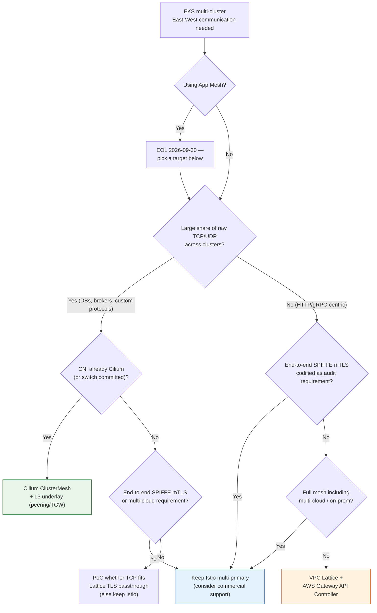

## 1. Purpose and Conclusions (Executive Summary)

This document examines, from the perspective of operating **multiple EKS clusters**, whether Istio remains a valid choice for effectively operating East-West (service-to-service) traffic. It compares architectures built on the main alternatives — Amazon VPC Lattice + AWS Gateway API Controller, Cilium ClusterMesh, and Istio multi-primary (optionally with a commercial management plane) — along four fixed axes: **functionality / stability / operability / cost**, and identifies the environment each architecture suits. Every external claim in this document was verified against the source documentation **as of 2026-07-16**; items that could not be verified are explicitly marked "needs verification."

**Conclusions:**

1. If cross-cluster traffic is **HTTP/gRPC-centric, VPC Lattice + AWS Gateway API Controller offers the best outcome relative to operational burden**. It crosses cluster, VPC, and account boundaries without L3 connectivity (VPC peering, Transit Gateway), and AWS manages both the control plane and the data plane.
2. **Istio multi-primary remains valid, but conditionally**. If a full mesh spanning multi-cloud or hybrid environments, end-to-end SPIFFE-based mTLS, or fine-grained L7 policy is the top requirement, Istio is the only candidate that satisfies all of them — at the price of operational complexity that grows with cluster count.
3. There are only two levers that reduce mesh operational burden — **(a) change who operates it** (managed service or commercial support), or **(b) simplify the architecture** (remove sidecars, or remove the mesh itself). A commercial management plane (e.g., Tetrate) is lever (a), but the control plane (istiod) still runs inside customer clusters. **The only option that removes the control plane from customer clusters entirely is the AWS-managed one (VPC Lattice).**
4. AWS App Mesh reaches **end of support on September 30, 2026** and is not a candidate for new adoption; this document treats it only as a migration starting point.

For single-cluster mesh selection, see the [Service Mesh Comparison Guide](./index.md); for post-adoption latency and cost optimization, see [East-West Traffic Optimization](../east-west-traffic-best-practice.md).

## 2. Requirements and Assumptions

### Scope

This document covers **East-West (service-to-service) communication across cluster boundaries only**. API gateways and ingress controllers that handle North-South (external-to-cluster) traffic — ALB + AWS Load Balancer Controller, Kong, NGINX-family, kgateway — are **complements, not substitutes**, for East-West communication. Routing inter-cluster calls through ingress increases external exposure, adds hops, and loses internal identity, so those options are excluded from the candidate list. For North-South selection, see the [Gateway API Adoption Guide](../gateway-api-adoption-guide/index.md).

### Five Questions That Decide the Architecture

Most of the multi-cluster East-West architecture decision follows from the answers to five requirements. The full question list is in [Appendix A](#appendix-a-requirement-confirmation-questions).

| # | Deciding question | Fork in the road |
|---|-------------------|------------------|
| 1 | **Protocol** — Is cross-cluster traffic HTTP/gRPC, or raw TCP/UDP (database protocols, message brokers, custom binary)? | A large raw TCP/UDP share makes the L7-centric Lattice a candidate for reconsideration. Lattice supports HTTP/HTTPS, gRPC, and TCP (TLS passthrough) but with TCP-path constraints (see [Section 6](#6-trade-offs-and-cautions)). UDP is not supported |
| 2 | **Boundaries** — Do the clusters share a single VPC, or span multiple VPCs and accounts? Are there overlapping CIDRs? | Multi-account or overlapping-CIDR environments structurally favor Lattice, which needs no L3 connectivity. Mesh options presuppose L3 reachability (peering/TGW) and non-overlapping CIDRs |
| 3 | **Identity/encryption compliance** — Does the audit requirement literally demand "end-to-end workload-level mTLS (SPIFFE)," or is "transport encryption + per-request authorization" sufficient? | The former makes Istio the direct answer. Lattice uses a TLS + IAM (SigV4) model; Cilium separates transport encryption (WireGuard/IPsec) from authentication |
| 4 | **Observability** — Is Kiali-grade mesh topology visualization mandatory, or are metrics, logs, and traces sufficient? | The former argues for keeping the Istio ecosystem. Lattice substitutes CloudWatch/X-Ray; Cilium substitutes Hubble |
| 5 | **Scale and churn** — How many clusters and services, and how high is pod churn (deployment frequency, autoscaling amplitude)? | As cluster count grows, mesh options pay proportionally more for control-plane synchronization; managed options convert this into a quota-management problem |

### Baseline Assumptions

- The target is EKS (EC2 nodes), in an organization already operating or evaluating Istio (sidecar mode) multi-cluster.
- The joint goal is "reduce operational burden while preserving communication requirements"; keeping a service mesh is not itself a goal.
- A single region is assumed by default; cross-region considerations are called out where relevant.

## 3. Mapping Istio Features to Alternatives

What each Istio multi-cluster feature becomes in each alternative:

| Istio feature | VPC Lattice + Gateway API Controller | Cilium ClusterMesh | Istio multi-primary (keep) | Reference: Linkerd / Consul |
|---------------|--------------------------------------|--------------------|----------------------------|------------------------------|
| **Cross-cluster service discovery** (remote-secret endpoint sync) | `ServiceExport`/`ServiceImport` CRDs + Lattice service network. DNS is provided managed by Lattice | `service.cilium.io/global: "true"` annotation on identically named Services → cross-cluster load balancing | istiod watches the peer cluster's API server via remote secrets | Linkerd: service mirroring (replicates remote services). Consul: cluster peering + `exported-services` |
| **mTLS / workload identity** (SPIFFE X.509, common root CA) | TLS (ACM certificates) + **IAM authentication** (SigV4 signing) + EKS Pod Identity session-tag ABAC (cluster / namespace / pod granularity) | Transport encryption via WireGuard/IPsec. SPIFFE mutual authentication is Beta and **incompatible with ClusterMesh** (stated in upstream docs, verified 2026-07-16) | End-to-end SPIFFE mTLS on a common root CA (cacerts) | Linkerd: unified trust-domain mTLS. Consul: mTLS between mesh gateways |
| **Traffic management** (canary, weighted routing, retries) | `HTTPRoute` weighted rules (implemented as Lattice listener rules). Retries and timeouts supported; circuit breaking limited | L7 via per-node Envoy (CiliumEnvoyConfig). Cross-cluster weighted-routing expressiveness limited vs Istio | VirtualService/DestinationRule or Gateway API — highest expressiveness | Linkerd: HTTPRoute-based. Consul: service resolver/splitter |
| **Custom domains** | Lattice custom domain + ACM certificate (BYOC) | Kubernetes DNS scheme as-is; custom domains configured separately | ServiceEntry + own DNS | Configured separately in each |
| **Observability** (Kiali, distributed tracing) | CloudWatch metrics/access logs, X-Ray. **No Kiali-grade mesh topology graph** | Hubble (Service Map, flow logs) | Kiali, Jaeger, Prometheus ecosystem unchanged | Linkerd Viz / Consul UI |
| **Control-plane operator** | **AWS** (only a lightweight controller lives in the cluster) | Customer (cilium-agent, cilium-operator, clustermesh-apiserver) | Customer (istiod per cluster). Commercial offerings like Tetrate change the support provider, but istiod stays in-cluster | Customer (or Buoyant/HashiCorp commercial support) |
| **L3 connectivity prerequisite** (peering/TGW) | **Not required** — overlapping CIDRs allowed | **Required** — direct node IP reachability + non-overlapping PodCIDRs | Multi-network mode relays via east-west gateway (NLB), so no direct L3; single-network mode requires it | Linkerd flat mode requires it; gateway mode does not. Consul relays via mesh gateways |

Two differences dominate this mapping. First, the **identity model** differs — Istio's "certificate-based workload identity" becomes "IAM-based request authorization" in Lattice, and "network-layer encryption + separate authentication" in Cilium. Which model your compliance language requires drives the choice. Second, the **control-plane location** differs — total operational burden converges on whose control plane it is.

## 4. Candidate Architectures in Detail

Each candidate is presented as: how it works → four-axis assessment (functionality/stability/operability/cost) → the environment it suits.

### 4.1 VPC Lattice + AWS Gateway API Controller — Managed, Sidecarless

**How it works.** VPC Lattice is a managed application networking service built into the AWS network fabric. On EKS, the [AWS Gateway API Controller](https://www.gateway-api-controller.eks.aws.dev/) (v2.1.2 as of 2026-07-16) translates Kubernetes Gateway API resources into Lattice resources — `Gateway` → service network, `HTTPRoute`/`GRPCRoute`/`TLSRoute` → Lattice service, Kubernetes `Service` → target group. Cross-cluster sharing is declared with `ServiceExport` (provider side) / `ServiceImport` (consumer side) CRDs.

```
  Cluster A (VPC-A, Account 1)                 Cluster B (VPC-B, Account 2)
  ┌──────────────────────────┐                ┌──────────────────────────┐
  │  Pod A ──► link-local    │                │      Target Group ◄──┐   │
  │          169.254.171.x   │                │        (Pod B's)     │   │
  └────────────┼─────────────┘                └──────────────────────┼───┘
               │                                                     │
               ▼                                                     │
  ═══════════ VPC Lattice service network (AWS-managed data plane) ══╪════
       · No L3 connectivity (peering/TGW) needed, overlapping CIDRs OK
       · IAM auth policy evaluation (SigV4) + TLS ───────────────────┘
       · Gateway API Controller syncs K8s resources ↔ Lattice resources
```

Pods send traffic to the Lattice data plane on the link-local range (`169.254.171.0/24`); the only cluster change is allowing the Lattice managed prefix list inbound on the cluster security group. Two VPCs **communicate even with identical CIDRs** — a behavior demonstrated in the official AWS blog ([References](#8-references) item 2, verified 2026-07-16).

Authentication and authorization use IAM auth policies. Using the session tags issued by EKS Pod Identity (`eks-cluster-name`, `kubernetes-namespace`, `kubernetes-pod-name`) as conditions enables **ABAC authorization at cluster, namespace, or pod granularity**. With IAM auth enabled, requests must be SigV4-signed — either natively in the SDK or via a signing proxy (e.g., an Envoy sidecar injected solely for signing).

**Four-axis assessment.**

| Axis | Assessment | Evidence (verified 2026-07-16) |
|------|------------|-------------------------------|
| Functionality | HTTP/HTTPS and gRPC routing, weighted traffic splitting, custom domains, fine-grained IAM authorization. TCP supported via TLS passthrough with constraints (Section 6). No UDP. No Kiali-grade mesh observability | Lattice FAQ, TLS listeners docs |
| Stability | Data plane is built into AWS infrastructure — the only customer-patched component is the controller. Default per-service per-AZ limits of 10 Gbps / 10,000 RPS (raiseable); 10-minute connection lifetime cap | Lattice quotas docs |
| Operability | **The only candidate whose control plane lives outside the cluster.** No sidecars, no certificate lifecycle (delegated to ACM); the upgrade surface is one lightweight controller. In exchange, you depend on AWS quotas and feature release cadence | Gateway API Controller deploy guide |
| Cost | Pay-as-you-go: $0.025 per service-hour + $0.025/GB processed + request charges ($0.10 per million requests/hour beyond the free 300,000/hour, us-east-1). No cross-AZ surcharge. **Cost scales with traffic** — simulate before committing at high volume. Per-region pricing varies (needs verification) | Lattice pricing page |

**Environment it suits.** Organizations whose cross-cluster traffic is HTTP/gRPC-centric, that must cross multi-VPC/multi-account boundaries, and that cannot staff a dedicated mesh control-plane team. It is also the official AWS path for App Mesh leavers who want to stay on a managed model.

### 4.2 Cilium ClusterMesh — eBPF, Sidecarless, Self-Managed

**How it works.** Cilium's ClusterMesh (stable version 1.19 as of 2026-07-16) solves multi-cluster at the CNI layer. Each cluster runs a `clustermesh-apiserver` (with embedded etcd) exposing cluster state; each cluster's cilium-agent subscribes (via the KVStoreMesh cache by default since v1.16) and reflects remote endpoints into local eBPF maps. Annotating identically named Services with `service.cilium.io/global: "true"` enables cross-cluster load balancing.

```
  Cluster A (PodCIDR 10.1.0.0/16)             Cluster B (PodCIDR 10.2.0.0/16)
  ┌──────────────────────────────┐            ┌──────────────────────────────┐
  │ Pod A ─► eBPF (kernel)        │            │           eBPF ─► Pod B      │
  │   ▲   clustermesh-apiserver ◄─┼── state ───┼─► clustermesh-apiserver  ▲   │
  │   └── cilium-agent (subscribe)│    sync    │   cilium-agent ──────────┘   │
  └───────────────┼──────────────┘            └────────────────┼─────────────┘
                  └────── direct pod-to-pod (VPC peering/TGW) ──┘
     Prereqs: non-overlapping PodCIDRs + direct node IP reachability + same datapath mode
```

With no proxy hop, traffic is **direct pod-to-pod**, giving the lowest data-plane overhead and latency of any candidate. The prerequisites are strict, however — non-overlapping PodCIDRs across all clusters, direct node IP reachability (VPC peering or TGW), the same datapath mode everywhere, and upfront cluster ID (1–255)/name design (changing them later requires restarting all workloads). All per upstream documentation (verified 2026-07-16).

**Four-axis assessment.**

| Axis | Assessment | Evidence (verified 2026-07-16) |
|------|------------|-------------------------------|
| Functionality | Full L3/L4 (TCP/UDP included — no protocol restrictions), global-service discovery and failover. L7 via per-node Envoy, but cross-cluster L7 expressiveness is limited vs Istio. **SPIFFE mutual auth is Beta and incompatible with ClusterMesh** — unsuitable for end-to-end workload-identity requirements | Cilium ClusterMesh and mutual-auth docs |
| Stability | Kernel eBPF data plane is mature. But the CNI doubles as the mesh, so **a Cilium failure is a cluster networking failure** — the largest blast radius here. The `cacheTTL` default of 0 (stale remote endpoints kept indefinitely when a peer cluster is unreachable) needs tuning in production | Cilium global services docs |
| Operability | Customers operate cilium-agent, operator, and clustermesh-apiserver per cluster. **Cilium CNI on EKS is not officially supported by AWS** — AWS documentation states the VPC CNI is the only CNI supported on EC2 nodes and recommends vendor (Isovalent) commercial support for alternates. EKS Auto Mode does not support alternate CNIs. VPC CNI chaining mode lacks L7 policy and IPsec, so a full CNI replacement is effectively a prerequisite | EKS alternate CNI docs, Cilium chaining docs |
| Cost | No license cost (OSS), no extra AWS service charges. The real costs are L3 connectivity (peering, or TGW at $0.05/attachment-hour + $0.02/GB) and **the dedicated headcount to own a CNI replacement**. Commercial support (Isovalent) adds license cost | TGW pricing page |

**Environment it suits.** Organizations already standardized on Cilium CNI (or firmly committed to switching), with substantial raw TCP/UDP cross-cluster traffic, hard low-latency requirements, and a dedicated networking team able to own CNI-level failures. **Replacing the CNI solely to obtain multi-cluster communication is not recommended.**

### 4.3 Istio Multi-Primary — Keep the Full Mesh, Self-Managed (+ Commercial Management Plane)

**How it works.** The production standard is the multi-primary topology (stable version 1.30 as of 2026-07-16), where each cluster runs its own istiod. Clusters share trust via a common root CA (cacerts), sync endpoints by watching each other's API servers through remote secrets, and — when networks are separate — relay traffic through east-west gateways (NLB).

```
  Cluster A (VPC-A)                            Cluster B (VPC-B)
  ┌────────────────────────────┐              ┌────────────────────────────┐
  │ istiod-A ◄── remote secret ┼──── watch ───┼► API Server                │
  │    │          (mutual)     │              │              istiod-B      │
  │ Pod A + Envoy ─► east-west ┼── mTLS ──────┼► east-west ─► Pod B + Envoy│
  │                 gateway    │  (SPIFFE)    │   gateway                  │
  └────────────────────────────┘              └────────────────────────────┘
   Common root CA (cacerts) · istiod per cluster · mutual API-server reachability
```

**Ambient (sidecarless) multi-cluster maturity** deserves caution. Single-cluster ambient is GA, but **multi-cluster ambient is Beta as of Istio 1.30** and supports only the multi-primary + multi-network combination (primary-remote and single-network are unsupported). Waypoints must be synchronized manually across clusters, and failover traffic to a remote network is uneven due to HTTP/2 connection reuse — both stated in the official docs (verified 2026-07-16). Starting a new multi-cluster deployment on ambient should be gated on a PoC.

**Commercial management planes (e.g., Tetrate Service Bridge)** add central governance, multi-tenancy, and support SLAs to multi-cluster Istio. That is lever (a), "change the operator" — but **istiod still runs inside each cluster**. The control-plane failure domain and upgrade burden remain in customer clusters, which is structurally different from a managed service like Lattice (per Tetrate product documentation; exact architectural wording needs verification).

**Four-axis assessment.**

| Axis | Assessment | Evidence (verified 2026-07-16) |
|------|------------|-------------------------------|
| Functionality | **Highest expressiveness** — end-to-end SPIFFE mTLS, cross-cluster canary/weighting/fault injection, locality failover, mesh expansion via ServiceEntry (VMs, other clouds). The only candidate capable of a multi-cloud full mesh | Istio multicluster install docs |
| Stability | Longest production track record. But stability rests on many customer-kept preconditions — common CA rotation, sustained cross-cluster API-server reachability, east-west gateway availability, version-skew management. Ambient multi-cluster is Beta | Istio before-you-begin docs |
| Operability | **Heaviest of the candidates.** For N clusters: N istiods + N×(N−1) remote secrets + N east-west gateways. In sidecar mode, data-plane upgrades that restart every pod are a recurring event. Commercial support mitigates but does not change the structure | Same |
| Cost | No license cost (OSS). Real costs: sidecar resources (per-pod CPU/memory — quantified in [East-West Traffic Optimization](../east-west-traffic-best-practice.md)), east-west gateway NLBs, cross-AZ/peering charges on inter-cluster traffic, and **the largest headcount requirement**. A commercial management plane adds subscription cost | — |

**Environment it suits.** Organizations where end-to-end workload-level mTLS (SPIFFE) is codified as an audit requirement, where a full mesh must extend beyond EKS (on-premises, other clouds), or where cross-cluster traffic-control expressiveness (fault injection, fine-grained retry policy) is a business requirement — and that have a dedicated platform team to carry it.

### 4.4 Reference Candidates — Linkerd Multi-Cluster, Consul Cluster Peering

- **Linkerd multi-cluster** (stable version 2.20): service mirroring replicates remote services locally, with three modes mixable per service — gateway mode (only the target gateway IP must be reachable), flat-network mode (direct pod-to-pod), and federated services. A unified trust domain provides mTLS on every hop. However, the open-source project stopped shipping stable artifacts in February 2024, so **production stable builds depend on Buoyant Enterprise for Linkerd (BEL)** — review license terms first (details need verification; distribution policy confirmed on the upstream releases page, 2026-07-16).
- **Consul cluster peering**: connects independent Consul clusters via peering tokens + mesh gateways, usable without an Enterprise license, with EKS documentation and tutorials. Weak adoption case unless Consul is already the organization's service-discovery standard.

Both retain a "customer-operated control plane + sidecar (Linkerd) or agent (Consul)" structure, so their structural advantage over Istio on this document's core question — reducing operational burden — is limited. They appear below only as references.

### 4.5 The L3 Underlay — VPC Peering vs Transit Gateway

Mesh options (Istio single-network, Cilium ClusterMesh, Linkerd flat mode) **presuppose L3 reachability** between clusters.

| Item | VPC Peering | Transit Gateway |
|------|-------------|-----------------|
| Topology | 1:1 (no transitive routing) | Hub-and-spoke (aggregates N VPCs) |
| Overlapping CIDRs | Not allowed | Not allowed |
| Pricing | Connection free; data-transfer charges (rate needs verification) | $0.05/attachment-hour + $0.02/GB processed (us-east-2, verified 2026-07-16) |
| Suitable scale | 2–3 VPCs | 4+ VPCs, multi-account |

As clusters multiply, peering becomes an N² management problem and TGW charges scale with traffic. **VPC Lattice does not need this layer at all** — a fact that belongs in the operability and cost axes: the cost of keeping a mesh includes not just the mesh, but the underlay's construction, charges, and CIDR governance.

### 4.6 AWS App Mesh — Do Not Adopt

:::warning AWS App Mesh EOL — September 30, 2026

AWS App Mesh support ends on September 30, 2026, and new onboarding has been blocked since September 24, 2024 (verified 2026-07-16). In this document App Mesh appears **only as a migration starting point**. For EKS, the official AWS migration path is VPC Lattice; where Envoy-based L7 feature compatibility matters most, Istio is also a common choice — see the EOL notice in the [Service Mesh Comparison Guide](./index.md).

:::

### 4.7 Four-Axis Summary

| Axis | VPC Lattice + GW API Controller | Cilium ClusterMesh | Istio multi-primary |
|------|--------------------------------|--------------------|--------------------|
| **Functionality** | ◎ HTTP/gRPC, IAM authorization, account boundaries / △ TCP constraints, no UDP, no mesh observability | ◎ All protocols, lowest latency / △ Cross-cluster L7 expressiveness, no SPIFFE mutual auth | ◎ Highest expressiveness everywhere, multi-cloud / △ None (on features alone, the strongest) |
| **Stability** | AWS-managed data plane, minimal customer components. Quota ceilings are the practical risk | Mature kernel datapath. But CNI = mesh, so the largest blast radius | Longest production record. But every stability precondition (CA, gateways, skew) is customer-kept |
| **Operability** | ◎ **The only candidate with the control plane outside the cluster** | △ CNI replacement + three self-operated components; not AWS-supported | ✕ N istiods + N×(N−1) remote secrets + gateways. Commercial support only mitigates |
| **Cost** | Pay-as-you-go (hourly + GB + requests). Favorable at small-to-medium traffic; simulate at high volume. No L3 cost | Free software + L3 charges + dedicated headcount. Favorable at high traffic | Free software + sidecar resources + gateway/L3 charges + **highest headcount** |
| **Environment it suits** | HTTP/gRPC-centric, multi-account/VPC, minimal ops staffing | Cilium already in place, TCP/UDP required, lowest latency, dedicated networking team | SPIFFE mTLS audit requirement, multi-cloud full mesh, dedicated platform team |

## 5. Decision Tree



**Recommendations:**

- **Default recommendation**: For HTTP/gRPC-centric multi-cluster, meet the communication requirements without a mesh via VPC Lattice + Gateway API Controller, and eliminate control-plane operations.
- **When keeping Istio is the right answer**: end-to-end SPIFFE mTLS audit requirements, multi-cloud full mesh, or advanced L7 control as a business requirement. Mitigate the burden with commercial support (lever a) and an ambient transition (lever b — noting multi-cluster ambient is Beta, so PoC first).
- **Cilium ClusterMesh is conditional**: only when Cilium CNI is already in place, TCP/UDP is required, and dedicated capability exists — all three.

Single-cluster mesh selection is delegated to the [Service Mesh Comparison Guide](./index.md).

## 6. Trade-offs and Cautions

**Before choosing VPC Lattice, verify:**

- **It is L7-centric.** Lattice supports HTTP/HTTPS, gRPC, and TCP via TLS passthrough — but passthrough carries constraints: a custom domain (SNI match) is mandatory, only the default rule is allowed (no path/header routing), forwarding must target a TCP target group, **connection lifetime is capped at 10 minutes**, and auth policies support anonymous principals only (verified 2026-07-16). Long-lived TCP connections (database connection pools, streaming) can make this cap a hard blocker — test it in the PoC. UDP is not supported.
- **Reconsider if end-to-end SPIFFE mTLS is required.** Lattice's security model is "TLS termination + IAM request authorization." If the audit requirement literally demands "X.509 mutual authentication evidence between workloads," Lattice alone will struggle to satisfy it. Agree on the interpretation of the compliance wording with your compliance owner first.
- **No mesh-grade observability.** There is no Kiali-level real-time topology graph or automatic golden-signal collection between services. Define your observability requirements first and check whether CloudWatch metrics/access logs plus X-Ray can substitute.
- **Design against quotas.** Architecture-shaping limits exist: one service network per VPC (non-adjustable), a 10 KB auth-policy cap, 10 rules per listener (adjustable), and others. Check projected service and rule counts against quotas before finalizing the design.
- **Simulate pricing.** The $0.025/GB processing charge exceeds cross-AZ charges ($0.01/GB × both directions). For a few very-high-volume paths, a hybrid design that bypasses Lattice (same-cluster placement, direct connectivity) can be more cost-efficient.

**Before choosing Cilium ClusterMesh:**

- Cilium CNI on EKS is outside official AWS support — get this accepted as an organizational risk (vendor commercial support recommended).
- Non-overlapping PodCIDRs are a **design decision that cannot be corrected later**. Overlapping CIDRs in existing clusters imply cluster rebuilds.
- SPIFFE mutual authentication (Beta) is incompatible with ClusterMesh — do not adopt it expecting mesh-grade workload identity.

**If you decide to keep Istio:**

- The root causes of the burden (sidecar lifecycle, CA rotation, version skew) do not disappear with the decision to stay. Pair it with at least one mitigation: ambient migration (starting single-cluster), revision-based canary upgrades, or a commercial support contract.
- Multi-cluster ambient is Beta (as of 1.30) — validate waypoint synchronization and failover behavior in a PoC before production.

## 7. Migration Steps from Istio to VPC Lattice

The transition path when Lattice is the chosen target. The governing principle: **no big-bang cutover — run both paths, migrate service by service**.

1. **Prepare (build the parallel foundation)**: Install the Gateway API Controller, create the service network and associate VPCs, allow the Lattice prefix list on cluster security groups. Existing Istio traffic is unaffected.
2. **Select pilot services**: one or two services that are HTTP/gRPC, have few downstreams, and have SLO headroom. Configure `ServiceExport`/`ServiceImport` and `HTTPRoute`, and apply an IAM auth policy (Pod Identity session-tag conditions).
3. **Validate dual paths**: expose the pilot service on both the Istio path and the Lattice path, shift a fraction of clients to the Lattice DNS name, and compare latency, error rate, and authorization behavior (use the [Appendix B](#appendix-b-poc-checklist) checklist).
4. **Migrate incrementally, service by service**: repeat the validated pattern per service group. Starting from leaves of the call graph (services with no downstreams) minimizes rollback blast radius.
5. **Shrink Istio**: once all cross-cluster calls run on Lattice, remove east-west gateways and remote secrets. If in-cluster mTLS/L7 policy is still needed, shrink to a single-cluster mesh (e.g., ambient); if not, remove the mesh entirely — this step realizes lever (b), architecture simplification.
6. **Keep a standing rollback plan**: at every stage, a DNS switch alone must restore the Istio path. Do not delete Istio resources for a service group until it has been stable post-migration (2 weeks recommended).

## 8. References

All links verified against the source on 2026-07-16.

### AWS official documentation
- [Amazon EKS integration with VPC Lattice](https://docs.aws.amazon.com/eks/latest/userguide/integration-vpc-lattice.html) — EKS User Guide overview of the Lattice integration
- [AWS Gateway API Controller](https://www.gateway-api-controller.eks.aws.dev/) — deploy guide; ServiceExport/ServiceImport and IAMAuthPolicy CRD reference (v2.1.2)
- [Application networking with Amazon VPC Lattice and Amazon EKS](https://aws.amazon.com/blogs/containers/application-networking-with-amazon-vpc-lattice-and-amazon-eks/) — multi-VPC demo with overlapping CIDRs; link-local data path
- [Secure cross-cluster communication with VPC Lattice and Pod Identity IAM session tags](https://aws.amazon.com/blogs/containers/secure-cross-cluster-communication-in-eks-with-vpc-lattice-and-pod-identity-iam-session-tags/) — session-tag ABAC authorization, SigV4 signing options
- [VPC Lattice FAQ](https://aws.amazon.com/vpc/lattice/faqs/) · [TLS listeners](https://docs.aws.amazon.com/vpc-lattice/latest/ug/tls-listeners.html) · [Quotas](https://docs.aws.amazon.com/vpc-lattice/latest/ug/quotas.html) · [Pricing](https://aws.amazon.com/vpc/lattice/pricing/)
- [Migrating from AWS App Mesh to Amazon VPC Lattice](https://aws.amazon.com/blogs/containers/migrating-from-aws-app-mesh-to-amazon-vpc-lattice/) — App Mesh EOL and onboarding-block timeline; official migration path
- [Alternate CNI plugins for EKS](https://docs.aws.amazon.com/eks/latest/userguide/alternate-cni-plugins.html) — alternate CNI support policy
- [VPC Peering basics](https://docs.aws.amazon.com/vpc/latest/peering/vpc-peering-basics.html) · [Transit Gateway pricing](https://aws.amazon.com/transit-gateway/pricing/)

### Upstream documentation
- [Istio Multicluster Installation](https://istio.io/latest/docs/setup/install/multicluster/) · [Before you begin](https://istio.io/latest/docs/setup/install/multicluster/before-you-begin/) — multi-primary/primary-remote topologies; common CA and east-west gateway requirements
- [Istio Ambient Multicluster](https://istio.io/latest/docs/ambient/install/multicluster/) — Beta status; supported topologies and limitations (as of 1.30)
- [Cilium ClusterMesh](https://docs.cilium.io/en/stable/network/clustermesh/clustermesh/) · [Global Services](https://docs.cilium.io/en/stable/network/clustermesh/services/) — prerequisites, cluster limits, global-service annotations
- [Cilium Mutual Authentication](https://docs.cilium.io/en/stable/network/servicemesh/mutual-authentication/mutual-authentication/) — Beta status; ClusterMesh incompatibility stated
- [Cilium AWS VPC CNI chaining](https://docs.cilium.io/en/stable/installation/cni-chaining-aws-cni/) — chaining-mode limitations
- [Linkerd Multi-cluster](https://linkerd.io/2-edge/features/multicluster/) · [Releases](https://linkerd.io/releases/) — three connection modes; distribution policy
- [Consul Cluster Peering](https://developer.hashicorp.com/consul/docs/east-west/cluster-peering)
- [Gateway API GAMMA](https://gateway-api.sigs.k8s.io/concepts/gamma/) · [Implementations](https://gateway-api.sigs.k8s.io/implementations/) — mesh-profile GA and implementation conformance

### Related documents (internal)
- [Service Mesh Comparison Guide](./index.md) — single-cluster mesh selection
- [GAMMA Initiative](./gamma-initiative.md) — Gateway API-based mesh standardization
- [East-West Traffic Optimization](../east-west-traffic-best-practice.md) — post-adoption latency and cross-AZ cost optimization; quantified Istio sidecar overhead
- [Gateway API Adoption Guide](../gateway-api-adoption-guide/index.md) — North-South traffic management

## Appendix A. Requirement Confirmation Questions

Questions to answer before finalizing the architecture. A single two-hour workshop is recommended.

**Protocol and traffic**
1. Have all cross-cluster call paths been enumerated? What is each path's protocol (HTTP/1.1, HTTP/2, gRPC, TCP, UDP)?
2. Do long-lived TCP connections (databases, message brokers, WebSocket/streaming) cross cluster boundaries? What is the connection-lifetime distribution?
3. What is the traffic volume per path (GB/month, peak RPS)? What share do the top three paths represent?

**Boundaries and topology**
4. How many VPCs and accounts do the clusters span? Are there overlapping CIDRs?
5. What cluster growth is planned in the next 24 months (count, regions, clouds)? Any on-premises or other-cloud connectivity requirements?

**Security and compliance**
6. What is the exact encryption/mutual-authentication wording of the applicable regulations (ISMS-P, PCI-DSS, etc.)? Does it literally require "X.509 mTLS between workloads," or is "transport encryption + access control" sufficient?
7. What is the smallest unit of service-to-service authorization? (cluster / namespace / service / pod)
8. Are there policy constraints on certificate/key ownership? (own-CA mandate, ACM permissibility)

**Observability and operations**
9. Which Kiali/Jaeger views and alerts are actually in use today? (fixes the scope of required equivalents after migration)
10. How many dedicated mesh/networking engineers are there, and how many person-days does one Istio upgrade currently take?
11. Which Istio features are actually in use? (mTLS only? VirtualService routing? fault injection? — unused features need no replacement)

## Appendix B. PoC Checklist

Items to validate during pilot-service migration (steps 2–3 of [Section 7](#7-migration-steps-from-istio-to-vpc-lattice)). Written for Lattice; the same skeleton applies to other candidates.

**Functionality**
- [ ] Cluster A → B HTTP/gRPC call succeeds (via ServiceExport/Import)
- [ ] Weighted routing (10/90 canary) works; measure shift latency
- [ ] TLS call succeeds with custom domain + ACM certificate
- [ ] IAM auth policy allows/denies at namespace granularity (Pod Identity session-tag conditions)
- [ ] Calls from unauthorized clusters/namespaces are rejected
- [ ] (If applicable) TCP workload: connection via TLS passthrough + reconnection behavior at the 10-minute lifetime cap

**Stability**
- [ ] Call success rate during a full rolling restart of target pods (pod-churn tolerance)
- [ ] Existing data-plane traffic continues when one cluster's controller is down
- [ ] Routing behavior under AZ-failure simulation (remove one AZ's targets)

**Performance**
- [ ] p50/p99 latency: existing Istio path vs new path under identical conditions
- [ ] Headroom against quota at peak RPS (default 10,000 RPS per AZ)
- [ ] Overhead comparison between SigV4 signing options (SDK vs signing proxy)

**Operations and cost**
- [ ] Existing dashboards/alerts reproducible from CloudWatch metrics/access logs
- [ ] Cost projection: extrapolate monthly cost for full migration from one month of measured pilot traffic
- [ ] Rollback rehearsal: measure time to restore the Istio path via DNS switch alone
