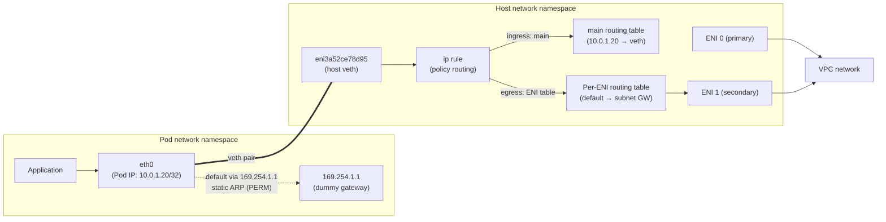
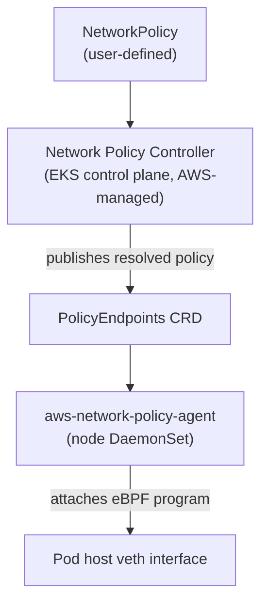

## Overview

Amazon VPC CNI (amazon-vpc-cni-k8s) is the default network plugin for EKS. Unlike Calico VXLAN or Cilium overlay mode, it assigns real VPC IP addresses directly to Pods without encapsulation and forwards traffic inside the node using L3 routing alone. This document explains the internals of VPC CNI along three axes.

- **Datapath** — The path a Pod's packet takes through the veth pair and routing rules before leaving via an ENI
- **IPAM** — The algorithm the ipamd daemon uses to manage ENIs and the IP address pool (warm pool)
- **NetworkPolicy** — The policy enforcement structure split between a controller and a node agent (eBPF)

Troubleshooting procedures (centered on kubectl commands) are covered in [Networking Debugging](../operations-reliability/eks-debugging/networking.md); this document focuses on the underlying mechanics that explain why those procedures are structured the way they are.

## Background: Two Processes, One Plugin

VPC CNI is not a single binary. It consists of two components with different roles.

| Component | Execution model | Role |
|---|---|---|
| CNI plugin binary (`aws-cni`) | Invoked by kubelet on every Pod create/delete | Network wiring such as creating veth pairs and configuring routing rules |
| ipamd (`aws-node` DaemonSet) | Long-running daemon, one per node | ENI attach/detach, secondary IP pool management, EC2 API calls |

When a Pod starts, the CNI binary requests an IP from the local ipamd over gRPC, and ipamd immediately returns one from the warm pool it has already reserved. EC2 API calls (ENI creation, IP allocation) are decoupled from the Pod creation path and run asynchronously in the background. This separation is why Pod startup latency is not tied to EC2 API latency.

In secondary-IP mode, address capacity depends on the instance type's ENI count and secondary IPs per ENI. An instance with 4 ENIs and 15 IPs per ENI has `4 × (15 - 1) = 56` secondary IPs available for Pods. The `+ 2` in the [VPC CNI recommended `max-pods` formula](https://github.com/aws/amazon-vpc-cni-k8s#setup) accounts for `hostNetwork` Pods that do not consume separate Pod IPs. Its result, 58, is a Pod-count setting, not 58 Pod IPs. Kubelet configuration and workload resource requirements also constrain actual capacity.

## Architecture: L3 Routed Mode Datapath

VPC CNI does not create an L2 bridge inside the node. It uses L3 routed mode: a veth pair per Pod, with packets forwarded purely through static routes and policy routing (`ip rule`).



### Inside the Pod: Dummy Gateway and Static ARP

The routing table in the Pod's network namespace is configured with a default route via the link-local address `169.254.1.1`.

```bash
# Routing table as seen from inside the Pod
default via 169.254.1.1 dev eth0
169.254.1.1 dev eth0

# Static ARP entry (PERM flag)
? (169.254.1.1) at 2a:09:74:cd:c4:62 [ether] PERM on eth0
```

`169.254.1.1` is not a real gateway. The CNI plugin pre-installs a static ARP entry pointing to the MAC address of the host-side veth, so the Pod pushes every outbound packet across the veth pair to the host without ever issuing an ARP query. This design has the following consequences.

- No ARP broadcasts occur for Pod-to-Pod communication — every forwarding decision is made by the host's L3 routing
- Traffic between Pods on the same node always traverses the host routing table
- With no L2 domain, the MAC learning and flooding problems seen in bridge-based CNIs simply do not exist

### Host Side: veth Naming Rules and Dual Routing

The host-side veth interface name is generated deterministically: the `eni` prefix (the default, configurable via `AWS_VPC_K8S_CNI_VETHPREFIX`) followed by the first 11 characters of the SHA-1 hash of the network name, Pod identifier, and interface name (`networkutils.GeneratePodHostVethName`). To trace a name like `eni3a52ce78d95` back to a Pod, you either recompute the hash input or cross-reference it with the `ip addr` routing entries.

Different routing tables are used depending on the direction of traffic.

| Direction | Table used | Behavior |
|---|---|---|
| VPC → Pod (ingress) | main table | Delivered via the `Pod IP/32 → host veth` host route |
| Pod → VPC (egress) | Per-ENI table | `ip rule` matches on the Pod IP as the source, sends the packet to the routing table of the ENI that owns that IP, and that table's default route points to the subnet gateway |

The reason egress needs per-ENI tables is that response packets from an IP assigned to a secondary ENI must leave through that same ENI. The VPC validates the mapping between source IP and ENI, so a packet sent out via the primary ENI's default route is treated as spoofing and dropped.

## Deep Dive: IPAM — ipamd's Pool Management Algorithm

### Warm Pool: Three Target Variables

ipamd pre-reserves spare IPs (the warm pool) so it can respond to Pod creation requests immediately. The pool size is determined by a combination of three absolute-value target variables.

| Variable | Default | Meaning |
|---|---|---|
| `WARM_ENI_TARGET` | `1` | Keep one full ENI's worth of IPs as spare. Ignored when `WARM_IP_TARGET` is set |
| `WARM_IP_TARGET` | None | Specify the number of spare IPs directly. Overrides `WARM_ENI_TARGET` |
| `MINIMUM_IP_TARGET` | None | The floor on the number of IPs the node always holds. Used for pre-scaling ahead of a burst of Pod scheduling right after node startup |

`WARM_ENI_TARGET=1` (the default) may look generous, but it is a deliberate design. ENI attachment can take up to 10 seconds, so if a Pod surge forces the node onto the attach-a-new-ENI path, every Pod startup on that node is delayed at once. Conversely, setting `WARM_IP_TARGET` too low means every Pod create/delete (churn) triggers an individual IP attach/detach through the EC2 API, which drives up API calls; once throttling kicks in, ENI/IP allocation is blocked not just for that node but for the entire cluster. This is why the public documentation (`eni-and-ip-target.md`) explicitly advises against `WARM_IP_TARGET` in large clusters and high-churn environments.

`MINIMUM_IP_TARGET` is safest when used together with `WARM_IP_TARGET`. If only `MINIMUM_IP_TARGET` is set, `WARM_IP_TARGET` is treated as 0, which can leave the node with no spare capacity at all once the floor is filled.

### Prefix Delegation: Allocation in /28 Units

With `ENABLE_PREFIX_DELEGATION=true` (v1.9.0+), ipamd assigns addresses to ENIs in **/28 prefixes (16 contiguous IPs)** instead of individual secondary IPs (/80 for IPv6). This delivers two benefits.

- **Higher Pod density** — Each ENI slot expands from 1 IP to 16. For example, c5.xlarge has a recommended count of 58 Pods in secondary-IP mode and can obtain a larger address pool in Prefix mode. Check the separately configured kubelet `max-pods`, available subnet addresses, and CPU and memory capacity before increasing Pod density.
- **Fewer EC2 API calls** — 16 IPs are acquired with a single API call, greatly reducing API load during scaling

There is a prerequisite. A /28 is 16 contiguous addresses, so heavy subnet fragmentation can cause prefix acquisition to fail, and when it does, ipamd does not fall back to individual IP mode but returns an error. Using a new dedicated subnet or a subnet CIDR reservation is the safe approach. In Prefix mode, warm target calculations also switch to prefix units, and `WARM_PREFIX_TARGET` (default `1`) comes into play.

### IP Cooldown: A Deleted Pod's IP Is Not Reused for 30 Seconds

When a Pod is deleted, its IP does not immediately return to the assignable state; it first passes through a **cooldown state**. The default cooldown is 30 seconds, adjustable via `IP_COOLDOWN_PERIOD` (v1.15.0+).

The cooldown exists because of Kubernetes' asynchronous nature. After a Pod is deleted, it takes time for kube-proxy to remove that IP from the iptables/IPVS rules on every node. If the IP were reassigned to a new Pod immediately with no cooldown, traffic for the old Service could flow into the new Pod through rules that have not yet been updated. Setting the value to 0 is supported but strongly discouraged by the official documentation; conversely, setting it too high ties up available IPs in cooldown and increases EC2 API calls. For workloads with heavy Pod churn, warm pool sizing must account for the fact that (Pod deletions per second × cooldown period) IPs are in cooldown at any given time.

### Pool Shrinking: Live Pod IPs Are Never Reclaimed

ipamd attempts to return surplus IPs/ENIs every 30 seconds, but this shrink path performs only **non-force deletion**. When removing an IP from the datastore, the deletion is refused if that IP is assigned to a Pod (`tryUnassignIPFromENI` in `ipamd.go` — "Don't force the delete, since a freeable IP might have been assigned to a pod"). Forced deletion happens only on the reconcile path, after confirming through the EC2 API that the secondary IP has already been detached from the instance.

As a result, lowering the warm targets or scaling down the node never breaks a running Pod's connectivity because of IPAM. What gets returned is always unassigned spare capacity.

## Deep Dive: NetworkPolicy — Division of Labor Between Controller and eBPF Agent

VPC CNI v1.14.0+ supports Kubernetes NetworkPolicy natively, with enforcement split into two layers.



- **Network Policy Controller** — Managed and operated by AWS on the EKS control plane. It resolves NetworkPolicy selectors into the actual set of Pod IPs and publishes the result as `PolicyEndpoints` CRDs.
- **aws-network-policy-agent** — A DaemonSet on each node that watches `PolicyEndpoints` and enforces policies as **eBPF probes attached to the Pod's host veth**. Because it creates no iptables chains, rule traversal cost does not grow linearly as the number of policies increases.

The operational implications are as follows.

- The first place to check enforcement status is not the NetworkPolicy object but the **`PolicyEndpoints` CRD** — whether the controller's resolved result has made it this far is the decision point
- Kernel-level DENYs are observed through the CLI provided by the node agent (`aws-eks-na-cli`) and the policy event logs
- Scope limitations: only the Pod's `eth0` is covered; host networking Pods, Windows nodes, and Fargate are not supported

## Operational Considerations

### Observation Points

| Point | Description |
|---|---|
| `/var/log/aws-routed-eni/ipamd.log` | ipamd's ENI/IP allocation and release decision log |
| `curl http://localhost:61679/v1/enis`, `/v1/pods` | ipamd introspection — a snapshot of the current datastore's ENI, IP, and Pod mappings |
| `curl http://localhost:61678/metrics` | Prometheus metrics (note the port differs from introspection) |

For concrete diagnostic procedures for warm pool anomalies (Pods stuck in `ContainerCreating` waiting for an IP, EC2 throttling errors in the `ipamd` log), see [Networking Debugging](../operations-reliability/eks-debugging/networking.md).

### Subnet IP Exhaustion and Workarounds

Because VPC CNI consumes Pod IPs directly from VPC subnets, subnet sizing is cluster capacity planning. The typical order of response to exhaustion is as follows.

1. **Enhanced Subnet Discovery** — Attach a CIDR block to the VPC and tag the new subnets with `kubernetes.io/role/cni=1` (`ENABLE_SUBNET_DISCOVERY=true`, the default since v1.18.0); new secondary ENIs are created in the discovered subnets and the IP space grows without disruption. For subnet and NAU budget calculations, see [IP Capacity Planning and Karpenter Node Sizing](./ip-capacity-planning-karpenter.md)
2. **Enable Prefix Delegation** — Subnet consumption itself is unchanged, but ENI slot efficiency and API load improve
3. **Custom networking** — Use `AWS_VPC_K8S_CNI_CUSTOM_NETWORK_CFG=true` plus the `ENIConfig` CRD (`crd.k8s.amazonaws.com/v1alpha1`) to place Pods in a subnet different from the node's (typically the secondary CIDR range 100.64.0.0/10). Note that the primary ENI can no longer be used for Pods, reducing the maximum Pods per node
4. **IPv6 cluster** — For a new build, the option that structurally eliminates the exhaustion problem

### Security Groups for Pods (SGP)

With `ENABLE_POD_ENI=true`, the VPC Resource Controller (on the control plane side) attaches a **trunk ENI** (`aws-k8s-trunk-eni`) to the node and, for each Pod that specifies an SG via the `SecurityGroupPolicy` CRD, creates a **branch ENI** (`aws-k8s-branch-eni`) and connects it to the trunk. In this case, that Pod's IPAM and datapath follow the branch ENI path rather than the secondary IP path described above, and branch ENI capacity is additive to the secondary IP limits. This works only on Nitro instance types that support trunking.

## Summary

VPC CNI is an L3 routed mode CNI that assigns VPC-native IPs directly to Pods with no overlay. The datapath consists of a dummy gateway (169.254.1.1), static ARP, and direction-specific dual routing tables, with no L2 bridge. For IPAM, ipamd maintains the pool based on absolute warm targets (`WARM_ENI_TARGET`/`WARM_IP_TARGET`/`MINIMUM_IP_TARGET`) and protects running Pods through a 30-second IP cooldown and non-force shrinking. NetworkPolicy is a two-layer structure in which the control plane controller resolves policies into `PolicyEndpoints` CRDs and the node's eBPF agent enforces them on the host veth.

## References

### Official Documentation
- [CNI Proposal](https://github.com/aws/amazon-vpc-cni-k8s/blob/master/docs/cni-proposal.md) — Original design document for the CNI binary/ipamd structure and datapath
- [ENI and IP Target](https://github.com/aws/amazon-vpc-cni-k8s/blob/master/docs/eni-and-ip-target.md) — Behavior of each warm pool variable combination and EC2 API throttling warnings
- [Prefix and IP Target](https://github.com/aws/amazon-vpc-cni-k8s/blob/master/docs/prefix-and-ip-target.md) — Warm target calculation in Prefix Delegation mode
- [Network Policy FAQ](https://github.com/aws/amazon-vpc-cni-k8s/blob/master/docs/network-policy-faq.md) — NetworkPolicy controller/node agent structure
- [Troubleshooting Guide](https://github.com/aws/amazon-vpc-cni-k8s/blob/master/docs/troubleshooting.md) — Debugging with ipamd.log and the introspection endpoint
- [EKS Best Practices: Networking](https://docs.aws.amazon.com/eks/latest/best-practices/networking.html) — Subnet sizing, custom networking, SGP recommendations
- [EKS Best Practices: Security Groups for Pods](https://docs.aws.amazon.com/eks/latest/best-practices/sgpp.html) — Trunk/branch ENI structure and supported instances

### Code (aws/amazon-vpc-cni-k8s)
- [routed-eni-cni-plugin/driver](https://github.com/aws/amazon-vpc-cni-k8s/blob/master/cmd/routed-eni-cni-plugin/driver/driver.go) — veth pair creation and 169.254.1.1 dummy gateway setup
- [pkg/ipamd/ipamd.go](https://github.com/aws/amazon-vpc-cni-k8s/blob/master/pkg/ipamd/ipamd.go) — Warm pool maintenance loop and non-force shrink path
- [aws-network-policy-agent](https://github.com/aws/aws-network-policy-agent) — eBPF-based NetworkPolicy node agent

### Related Documents (internal)
- [IP Capacity Planning and Karpenter Node Sizing](./ip-capacity-planning-karpenter.md) — Subnet, NAU, and branch ENI budget model and IP consumption on size fallback
- [Networking Debugging](../operations-reliability/eks-debugging/networking.md) — VPC CNI, DNS, and Service troubleshooting procedures
- [How Network Flow Monitor Works](../operations-reliability/network-flow-monitor.md) — eBPF sock_ops-based TCP flow observation
- [AWS Nitro Architecture and Performance Tuning](./nitro-architecture-performance-tuning.md) — ENA driver and PPS/CPS performance tuning
- [East-West Traffic Optimization](./east-west-traffic-best-practice.md) — Optimization strategies for service-to-service communication
