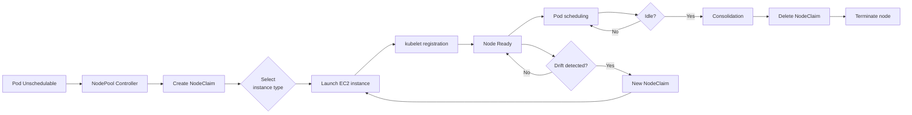
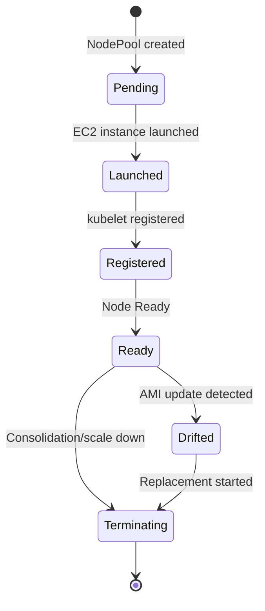

# EKS Auto Mode Debugging

EKS Auto Mode is an operational model in which AWS fully manages node provisioning, networking, and storage. While convenient, the reduced management surface also changes the debugging approach.

## Auto Mode vs Standard Mode Differences

| Item | Standard Mode | Auto Mode | Debugging Impact |
|------|---------------|-----------|------------|
| **Node management** | User (MNG/Karpenter) | AWS-managed (NodePool) | Check state via NodePool CRD; EC2 API access is limited |
| **VPC CNI** | Manual configuration/upgrade | Automatically managed | Custom CNI configuration unavailable; ENI debugging simplified |
| **GPU Driver** | GPU Operator installation | AWS-managed | Beware of Device Plugin conflicts (`devicePlugin=false`) |
| **Storage** | Separate EBS CSI installation | Built-in driver (gp3) | io2 Block Express constraints; EFS requires separate install |
| **CoreDNS** | Add-on management | Automatically managed | Custom CoreDNS configuration is restricted |
| **Node SSH** | Available (MNG/Karpenter) | Restricted (AWS Systems Manager) | `kubectl debug node` required |
| **Auto Scaling** | Karpenter/CA | NodePool auto-scaling | Spot interruption handling is automated |
| **Network Policy** | Calico/Cilium installable | VPC CNI Network Policy | Feature limitations exist |

## NodePool Architecture

Auto Mode node lifecycle:



## NodePool Debugging

### Check NodePool Status

```bash
# List NodePools
kubectl get nodepools

# Example output
# NAME              READY   AGE
# default           True    7d
# gpu-nodepool      True    2d

# NodePool details
kubectl describe nodepool default

# Key items to check:
# - Conditions: Ready, CapacityAvailable
# - Instance Types: allowed instance types
# - Constraints: labels, taints, availability zones
```

### NodeClaim Lifecycle

```bash
# List NodeClaims (actual node requests)
kubectl get nodeclaims

# Example output
# NAME                      TYPE           CAPACITY    READY   AGE
# default-abc123            t3.xlarge      4           True    2d
# default-def456            t3.xlarge      4           True    1d
# gpu-nodepool-xyz789       g5.2xlarge     8           True    6h

# NodeClaim details
kubectl describe nodeclaim <nodeclaim-name>

# Key fields:
# - Phase: Pending/Launched/Registered/Ready/Terminating
# - Conditions: Initialized, Ready, Drifted
# - Instance ID: EC2 instance ID
# - Node Name: corresponding Kubernetes node
```

### NodeClaim State Transitions



### Instance Type Selection Failure

**Symptom:** Pod stays in Pending, NodeClaim is not created

```bash
# Check Pod events
kubectl describe pod <pod-name>

# Example error:
# Warning  FailedScheduling  No nodes available to schedule pod

# Check NodePool constraints
kubectl get nodepool <nodepool-name> -o yaml | grep -A 10 requirements

# Common causes:
# 1. Pod resource request exceeds every instance type in the NodePool
# 2. Availability zone constraint (insufficient capacity in specific AZs)
# 3. Spot capacity shortage (capacityType: spot)
```

**Resolution:**

```yaml
# Modify NodePool: add larger instance type
apiVersion: eks.amazonaws.com/v1
kind: NodePool
metadata:
  name: default
spec:
  template:
    spec:
      requirements:
        - key: node.kubernetes.io/instance-type
          operator: In
          values:
            - t3.large
            - t3.xlarge
            - t3.2xlarge  # ← added
        - key: karpenter.sh/capacity-type
          operator: In
          values:
            - spot
            - on-demand  # ← On-Demand fallback when Spot is unavailable
```

## Storage Debugging

### Auto Mode Storage Constraints

| Storage Type | Standard Mode | Auto Mode | Constraints |
|--------------|---------------|-----------|----------|
| **gp3** | Requires EBS CSI installation | Built-in support | Provided by default; no extra configuration |
| **gp2** | Supported | Not supported | Must migrate to gp3 |
| **io2** | Supported | Limited support | io2 Block Express not supported |
| **EFS** | Install EFS CSI | EFS CSI installation required | Not automatically supported |
| **FSx for Lustre** | Install FSx CSI | FSx CSI installation required | Not automatically supported |
| **EBS encryption** | Custom KMS key possible | Default EBS encryption | Custom KMS key constraints |

### PVC Pending Debugging

```bash
# Check PVC status
kubectl get pvc

# Example output (issue)
# NAME      STATUS    VOLUME   CAPACITY   ACCESS MODES   STORAGECLASS   AGE
# my-pvc    Pending                                      gp3            5m

# Check PVC events
kubectl describe pvc my-pvc

# Common errors:
# 1. "waiting for a volume to be created" → check storage driver
# 2. "failed to provision volume" → check IAM permissions
# 3. "io2-block-express is not supported" → switch to gp3
```

### Check StorageClass

```bash
# List StorageClasses
kubectl get storageclass

# Auto Mode default StorageClass
# NAME            PROVISIONER             RECLAIMPOLICY   VOLUMEBINDINGMODE      ALLOWVOLUMEEXPANSION   AGE
# gp3 (default)   ebs.csi.aws.com         Delete          WaitForFirstConsumer   true                   7d

# io2 Block Express not supported (Auto Mode constraint)
```

## Networking Debugging

### VPC CNI Auto Management

In Auto Mode, VPC CNI cannot be configured directly:

```bash
# Check VPC CNI version (auto-managed)
kubectl get daemonset -n kube-system aws-node -o yaml | grep image:

# Custom CNI configuration attempts produce an error
# Auto Mode blocks modifications to the VPC CNI ConfigMap
kubectl edit configmap -n kube-system aws-node
# Error: Auto Mode managed resource cannot be modified
```

**Constraints:**

- Supported: ENI auto-allocation, Security Group for Pods, IPv6
- Not supported: Custom CIDR blocks, disabling Prefix Delegation, manual ENI management

### Pod Networking Issues

```bash
# Check Pod IP allocation
kubectl get pods -o wide

# Check ENI allocation state (node level)
kubectl describe node <node-name> | grep -A 5 "Allocatable"

# Example output:
# Allocatable:
#   vpc.amazonaws.com/pod-eni: 38  # ← ENI-based IP count

# Check Security Group for Pods
kubectl get securitygrouppolicies -A
```

### CoreDNS Debugging

```bash
# CoreDNS Pod status
kubectl get pods -n kube-system -l k8s-app=kube-dns

# Check CoreDNS logs
kubectl logs -n kube-system -l k8s-app=kube-dns --tail=100

# DNS resolution test
kubectl run -it --rm debug --image=busybox -- nslookup kubernetes.default

# Common issues:
# 1. CoreDNS Pod not Running → node resource shortage
# 2. DNS query timeout → verify Security Group allows UDP 53
```

## GPU Workloads with Auto Mode

:::danger GPU Operator Conflict
Auto Mode automatically manages the GPU Driver. Installing the GPU Operator causes a **Device Plugin conflict**.
:::

### Hybrid Configuration (Recommended)

To run GPU workloads in Auto Mode, **add an MNG** for a hybrid configuration:

```mermaid
flowchart TB
    subgraph "EKS Cluster (Hybrid)"
        subgraph "Auto Mode NodePool"
            A[General workloads]
            B[Web servers]
            C[Batch jobs]
        end
        
        subgraph "Managed Node Group (GPU)"
            D[GPU Operator<br/>devicePlugin=false]
            E[vLLM Pod]
            F[Training Job]
        end
    end
    
    G[Scheduler] --> A
    G --> B
    G --> C
    G -.Taint: nvidia.com/gpu.-> E
    G -.Taint: nvidia.com/gpu.-> F
```

### GPU MNG Configuration

```yaml
# ClusterPolicy: Device Plugin must be disabled
apiVersion: nvidia.com/v1
kind: ClusterPolicy
metadata:
  name: gpu-cluster-policy
spec:
  operator:
    defaultRuntime: containerd
  driver:
    enabled: true
  devicePlugin:
    enabled: false  # ← prevent conflict with Auto Mode
  dcgm:
    enabled: true   # metric collection still possible
  gfd:
    enabled: true   # GPU Feature Discovery works
  nodeStatusExporter:
    enabled: true
```

```yaml
# Add a Taint to MNG nodes (GPU workloads only)
apiVersion: v1
kind: Node
metadata:
  name: gpu-node-1
spec:
  taints:
    - key: nvidia.com/gpu
      value: "true"
      effect: NoSchedule
```

```yaml
# GPU Pods add Toleration
apiVersion: v1
kind: Pod
metadata:
  name: vllm-server
spec:
  tolerations:
    - key: nvidia.com/gpu
      operator: Equal
      value: "true"
      effect: NoSchedule
  containers:
    - name: vllm
      image: vllm/vllm-openai:latest
      resources:
        limits:
          nvidia.com/gpu: 4
```

For detailed GPU debugging, see [GPU/AI Workload Debugging](./gpu-ai-workload.md).

## Auto Mode Constraint Summary

### Supported Features

- NodePool-based auto-scaling
- Automatic Spot/On-Demand fallback
- gp3 storage out of the box
- Automatic VPC CNI management (including Security Group for Pods)
- Karpenter-like Consolidation
- Drift detection and automatic replacement
- DCGM/GFD metrics (partial GPU Operator support)

### Limitations

- Custom VPC CNI configuration not available
- GPU Device Plugin conflict (MNG hybrid required)
- io2 Block Express not supported
- EFS/FSx CSI require separate installation
- Custom CoreDNS configuration restricted
- Node SSH access restricted (use SSM)
- Direct EC2 instance management not available

## Hybrid Configuration (Auto Mode + MNG)

### When Is Hybrid Needed?

| Scenario | Auto Mode Only | Hybrid (Auto Mode + MNG) |
|---------|---------------|----------------------------|
| General web/API servers | Sufficient | Not needed |
| GPU inference/training | Many constraints | **Required** (GPU Operator) |
| High-performance storage (io2 BE) | Not supported | Available on MNG |
| Custom VPC CNI | Not supported | Available on MNG |
| Use of a specific AMI | Limited | MNG Launch Template |

### Hybrid Configuration Example

```bash
# 1. Create Auto Mode cluster
aws eks create-cluster \
  --name hybrid-cluster \
  --compute-config enabled=true

# 2. Add GPU MNG
aws eks create-nodegroup \
  --cluster-name hybrid-cluster \
  --nodegroup-name gpu-nodes \
  --node-role <node-role-arn> \
  --subnets <subnet-ids> \
  --instance-types g5.2xlarge g5.4xlarge \
  --scaling-config minSize=0,maxSize=10,desiredSize=2 \
  --labels workload=gpu \
  --taints nvidia.com/gpu=true:NoSchedule

# 3. Install GPU Operator (targeting MNG nodes)
helm install gpu-operator nvidia/gpu-operator \
  --namespace gpu-operator --create-namespace \
  --set operator.defaultRuntime=containerd \
  --set driver.enabled=true \
  --set devicePlugin.enabled=false  # ← key setting
```

## Diagnostic Command Collection

```bash
# === NodePool ===
# NodePool status
kubectl get nodepools -o wide
kubectl describe nodepool <nodepool-name>

# NodeClaim status
kubectl get nodeclaims -o wide
kubectl describe nodeclaim <nodeclaim-name>

# NodeClaim to Node mapping
kubectl get nodeclaims -o json | jq -r '.items[] | "\(.metadata.name) → \(.status.nodeName)"'

# === Storage ===
# PVC status
kubectl get pvc -A
kubectl describe pvc <pvc-name>

# Check StorageClasses
kubectl get storageclass

# Check EBS volumes (AWS CLI)
aws ec2 describe-volumes --filters "Name=tag:kubernetes.io/cluster/<cluster-name>,Values=owned"

# === Networking ===
# VPC CNI version
kubectl get daemonset -n kube-system aws-node -o yaml | grep image:

# Pod IP allocation
kubectl get pods -A -o wide

# CoreDNS status
kubectl get pods -n kube-system -l k8s-app=kube-dns
kubectl logs -n kube-system -l k8s-app=kube-dns --tail=50

# DNS test
kubectl run -it --rm debug --image=busybox -- nslookup kubernetes.default

# === GPU (hybrid configuration) ===
# GPU Operator status (MNG nodes only)
kubectl get clusterpolicy -A
kubectl get pods -n gpu-operator

# Check GPU resources
kubectl get nodes -o json | jq -r '.items[] | select(.status.allocatable."nvidia.com/gpu" != null) | "\(.metadata.name): \(.status.allocatable."nvidia.com/gpu") GPUs"'

# === Node debugging ===
# Run an interactive debug Pod on the node
kubectl debug node/<node-name> -it --image=ubuntu

# Connect to node via Systems Manager (instead of SSH)
aws ssm start-session --target <instance-id>
```

## Checklist by Problem

### Pod Stuck in Pending (NodeClaim Not Created)

- [ ] Do any NodePool instance types satisfy the Pod's resource request?
- [ ] Are there availability zone constraints on the NodePool?
- [ ] Spot capacity shortage? (add On-Demand fallback)
- [ ] Do NodePool labels/taints match the Pod?

### PVC Stuck in Pending

- [ ] Is the StorageClass gp3? (io2 Block Express not supported)
- [ ] Is the PVC size within allowed range?
- [ ] Are IAM permissions correct? (EBS creation)
- [ ] Is EBS capacity sufficient in the availability zone?

### GPU Workload Scheduling Failure

- [ ] Was an MNG added? (Auto Mode alone has GPU constraints)
- [ ] Is `devicePlugin: false` set in the GPU Operator?
- [ ] Does the MNG node have a Taint and does the Pod have a matching Toleration?
- [ ] Is the Pod's `nvidia.com/gpu` resource request correct?

### VPC CNI Configuration Not Possible

- [ ] Auto Mode manages VPC CNI automatically (no custom configuration allowed)
- [ ] If a specific CNI configuration is required, add an MNG
- [ ] Security Group for Pods is supported

## References

- [GPU/AI Workload Debugging](./gpu-ai-workload.md) - GPU Operator integration with Auto Mode
- [Karpenter Debugging](./karpenter.md) - Similar concepts to NodePool
- [Node Debugging](./node.md) - Node-level diagnosis
- [AWS EKS Auto Mode Official Documentation](https://docs.aws.amazon.com/eks/latest/userguide/automode.html)
