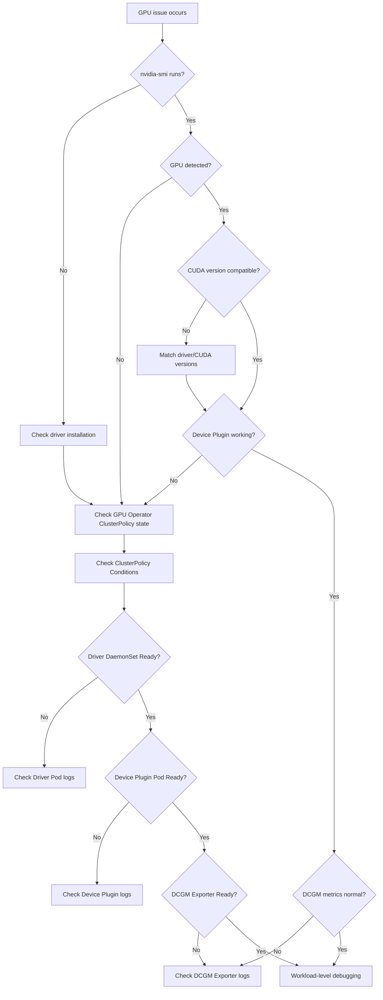

# GPU/AI Workload Debugging

This document covers common issues and solutions when operating GPU-based AI workloads on EKS.

## GPU Node Diagnostic Workflow

When a GPU issue occurs, diagnose in the following order:



## Basic GPU Node Diagnostics

### Check nvidia-smi

```bash
# Connect to the GPU node and check
kubectl debug node/<gpu-node-name> -it --image=nvidia/cuda:12.2.0-base-ubuntu22.04
# Inside the container
nvidia-smi

# Example output (normal)
+-----------------------------------------------------------------------------+
| NVIDIA-SMI 535.104.05   Driver Version: 535.104.05   CUDA Version: 12.2   |
|-------------------------------+----------------------+----------------------+
| GPU  Name        Persistence-M| Bus-Id        Disp.A | Volatile Uncorr. ECC |
| Fan  Temp  Perf  Pwr:Usage/Cap|         Memory-Usage | GPU-Util  Compute M. |
|===============================+======================+======================|
|   0  NVIDIA H100 80G...  On   | 00000000:10:1C.0 Off |                    0 |
| N/A   32C    P0    68W / 700W |      0MiB / 81559MiB |      0%      Default |
+-------------------------------+----------------------+----------------------+
```

### Check GPU Resources

```bash
# Check allocatable GPU count on a node
kubectl describe node <gpu-node-name> | grep nvidia.com/gpu
# Example output
#  nvidia.com/gpu:     8
#  nvidia.com/gpu:     8

# Check GPUs allocated to Pods
kubectl get pods -A -o json | jq '.items[] | select(.spec.containers[].resources.limits."nvidia.com/gpu" != null) | {name: .metadata.name, namespace: .metadata.namespace, gpu: .spec.containers[].resources.limits."nvidia.com/gpu"}'
```

## CUDA/NCCL Error Patterns

Common CUDA XID errors and remediation for GPU workloads:

| XID | Meaning | Cause | Action |
|-----|------|------|------|
| 13 | Graphics Engine Exception | Kernel execution error | Update driver, check CUDA version |
| 31 | GPU memory page fault | Invalid memory access | Update driver, validate memory allocation |
| 43 | GPU stopped responding | GPU unresponsive | Node restart required |
| 45 | Preemptive cleanup | Context switch error | Update driver |
| 48 | Double bit ECC error | Hardware memory defect | **Node replacement required** (permanent defect) |
| 62 | Internal micro-controller error | Firmware error | Reinstall driver, restart node |
| 74 | NVLink error | GPU-to-GPU communication failure | Check NVLink topology and cabling |
| 79 | GPU has fallen off the bus | PCIe communication loss | **Node replacement required** (hardware defect) |
| 94 | Contained/Uncontained error | Memory integrity error | Check ECC mode, consider node replacement |

### How to Check XID Errors

```bash
# Search for XID errors in kernel logs
kubectl debug node/<gpu-node-name> -it --image=ubuntu
# Inside the container
dmesg | grep -i "xid"

# Example output (issue)
# [  123.456789] NVRM: Xid (PCI:0000:10:1c): 79, pid=12345, GPU has fallen off the bus.
```

### NCCL Error Debugging

NCCL timeouts during multi-GPU or multi-node distributed training:

```bash
# Enable NCCL debug logs
env:
  - name: NCCL_DEBUG
    value: "INFO"
  - name: NCCL_DEBUG_SUBSYS
    value: "ALL"
  - name: NCCL_SOCKET_IFNAME
    value: "eth0"  # VPC CNI default interface
  - name: NCCL_IB_DISABLE
    value: "1"     # Disable InfiniBand (not used on EKS)
```

**Common NCCL failure causes:**

1. **Network connectivity issues**
   - Security Group must allow all traffic within the same SG
   - Verify Pod-to-Pod communication: `kubectl exec -it <pod> -- nc -zv <target-pod-ip> 12345`

2. **EFA misconfiguration** (p4d, p5 instances)
   - EFA Device Plugin must be installed
   - Check `vpc.amazonaws.com/efa` resource requests

3. **Mismatch between GPU count and Tensor Parallel size**
   - vLLM: `--tensor-parallel-size` must match the Pod's GPU count
   - PyTorch DDP: `WORLD_SIZE` env var must match actual GPU count

## vLLM Debugging

### Out of Memory (OOM) vs KV Cache Shortage

Memory shortage in vLLM has two root causes:

```python
# Check vLLM startup logs
# GPU memory utilization: 0.90
# Total GPU memory: 80.00 GiB
# Reserved for model weights: 45.23 GiB
# Reserved for KV cache: 26.77 GiB  # ← if too low, long-context requests fail
# Reserved for activation: 8.00 GiB
```

| Symptom | Cause | Action |
|------|------|------|
| OOM during model load | Model is larger than GPU memory | Use larger GPU, apply quantization (AWQ, GPTQ) |
| "No available blocks" during inference | KV Cache capacity shortage | Increase `gpu_memory_utilization` (0.9→0.95) |
| Short requests succeed, long requests fail | KV Cache shortage | Reduce `max_model_len`, reduce `max_num_batched_tokens` |
| Random OOM, hard to reproduce | Fragmentation | Restart server, increase `swap_space` |

### vLLM Parameter Tuning

```yaml
args:
  - --model=/models/llama-3.1-70b
  - --tensor-parallel-size=4        # must match GPU count
  - --gpu-memory-utilization=0.85   # default 0.9; decrease on OOM, increase if wasted
  - --max-model-len=8192           # max context length; determines KV Cache size
  - --max-num-batched-tokens=8192  # batched tokens; balances throughput/latency
  - --max-num-seqs=256            # concurrent sequences
  - --swap-space=4                # CPU memory swap (GiB)
```

**Tuning guide:**

1. **On OOM:**
   - Reduce `gpu_memory_utilization` from 0.9 → 0.85 → 0.8 stepwise
   - Reduce `max_model_len` (16k → 8k → 4k)
   - Reduce `max_num_seqs`

2. **Performance optimization:**
   - If GPU utilization is low, increase `max_num_batched_tokens`
   - For long-context needs, increase `max_model_len` (ensure sufficient KV Cache)

3. **Tensor Parallel configuration:**
   - H100 80GB × 8: `--tensor-parallel-size=8` (70B model)
   - A100 80GB × 4: `--tensor-parallel-size=4` (70B model, quantized)
   - **Note:** TP count should be a divisor of the model's hidden dimension for best results (2, 4, 8)

## GPU Operator Debugging

### Check ClusterPolicy Status

```bash
# ClusterPolicy status
kubectl get clusterpolicy -A

# Detailed status
kubectl describe clusterpolicy gpu-cluster-policy

# Component status
kubectl get pods -n gpu-operator

# Example output (normal)
# NAME                                       READY   STATUS    RESTARTS   AGE
# gpu-operator-1234567890-abcde              1/1     Running   0          7d
# gpu-feature-discovery-xxxxx                1/1     Running   0          7d
# nvidia-container-toolkit-daemonset-xxxxx   1/1     Running   0          7d
# nvidia-cuda-validator-xxxxx                0/1     Completed 0          7d
# nvidia-dcgm-exporter-xxxxx                 1/1     Running   0          7d
# nvidia-device-plugin-daemonset-xxxxx       1/1     Running   0          7d
# nvidia-driver-daemonset-xxxxx              1/1     Running   0          7d
# nvidia-operator-validator-xxxxx            1/1     Running   0          7d
```

### Check Driver Pod Logs

```bash
# On driver installation failure
kubectl logs -n gpu-operator nvidia-driver-daemonset-<pod-id>

# Common errors:
# 1. "Kernel headers not found" → AMI requires kernel-devel package
# 2. "Driver compilation failed" → check kernel-to-driver compatibility
# 3. "nouveau driver is loaded" → blacklist nouveau during AMI build
```

### Check Device Plugin Logs

```bash
# When Device Plugin does not detect GPUs
kubectl logs -n gpu-operator nvidia-device-plugin-daemonset-<pod-id>

# Normal logs:
# "Detected NVIDIA devices: 8"
# "Device: 0, Name: NVIDIA H100 80GB HBM3, UUID: GPU-xxxxx"

# Error log:
# "No NVIDIA devices found" → check nvidia-smi, verify driver installation
```

## GPUs on EKS Auto Mode

:::warning Auto Mode GPU Constraints
EKS Auto Mode manages the GPU Driver automatically, so **GPU Operator must not be installed**.
Use the AWS-managed driver but disable the Device Plugin.
:::

### Auto Mode GPU Configuration

```yaml
# When installing GPU Operator on MNG (Auto Mode + MNG hybrid)
# Device Plugin must be disabled in ClusterPolicy
apiVersion: nvidia.com/v1
kind: ClusterPolicy
metadata:
  name: gpu-cluster-policy
spec:
  operator:
    defaultRuntime: containerd
  driver:
    enabled: true
  devicePlugin:
    enabled: false  # ← prevents conflict with Auto Mode
  dcgm:
    enabled: true
  gfd:
    enabled: true
  nodeStatusExporter:
    enabled: true
```

**Auto Mode + GPU workload patterns:**

1. **Pure Auto Mode (not recommended)**
   - Many GPU workload constraints
   - Cannot install custom drivers

2. **Hybrid (Auto Mode + MNG)**
   - Auto Mode: general workloads
   - MNG (GPU): dedicated to GPU workloads
   - Install GPU Operator on MNG with `devicePlugin=false`
   - Separate via Taint: `nvidia.com/gpu=true:NoSchedule`

See [Auto Mode Debugging](./auto-mode.md) for details.

## Diagnostic Command Collection

```bash
# === GPU node checks ===
# nvidia-smi (in a node debug Pod)
kubectl debug node/<gpu-node-name> -it --image=nvidia/cuda:12.2.0-base-ubuntu22.04
# Inside the container
nvidia-smi
nvidia-smi -q  # detailed information

# GPU resource allocation
kubectl describe node <gpu-node-name> | grep -A 10 "Allocated resources"

# === GPU Operator ===
# ClusterPolicy status
kubectl get clusterpolicy -A -o wide
kubectl describe clusterpolicy gpu-cluster-policy

# GPU Operator Pod status
kubectl get pods -n gpu-operator -o wide

# Driver Pod logs
kubectl logs -n gpu-operator -l app=nvidia-driver-daemonset --tail=100

# Device Plugin logs
kubectl logs -n gpu-operator -l app=nvidia-device-plugin-daemonset --tail=100

# DCGM Exporter logs (metric issues)
kubectl logs -n gpu-operator -l app=nvidia-dcgm-exporter --tail=100

# === vLLM Pod debugging ===
# vLLM startup logs (check memory allocation)
kubectl logs <vllm-pod-name> | head -50

# NCCL debug logs
kubectl logs <vllm-pod-name> | grep NCCL

# GPU memory usage (from inside the Pod)
kubectl exec -it <vllm-pod-name> -- nvidia-smi

# === Network debugging (multi-node training) ===
# Pod-to-Pod communication test
kubectl run -it --rm debug --image=nicolaka/netshoot -- bash
# Inside the container
nc -zv <target-pod-ip> 12345

# Check Security Group (node level)
aws ec2 describe-security-groups --group-ids <sg-id>

# === NCCL test ===
# NCCL all-reduce test (multi-GPU)
kubectl exec -it <pod-name> -- python -c "
import torch
import torch.distributed as dist
dist.init_process_group(backend='nccl')
tensor = torch.ones(1).cuda()
dist.all_reduce(tensor)
print(f'Success: {tensor.item()}')
"
```

## Checklist by Problem

### "GPU not found" (nvidia-smi failure)

- [ ] Is the driver installed? (`lsmod | grep nvidia`)
- [ ] Is GPU Operator ClusterPolicy Ready?
- [ ] Is the Driver DaemonSet Pod Running?
- [ ] Does the node have the `nvidia.com/gpu.present=true` label?

### "Insufficient nvidia.com/gpu" (scheduling failure)

- [ ] Is the Device Plugin Pod Running?
- [ ] Does `kubectl describe node` show `nvidia.com/gpu` resources?
- [ ] Is `devicePlugin=false` set in Auto Mode?
- [ ] Does the Pod's GPU request exceed the node's GPU count?

### vLLM OOM

- [ ] Is `gpu_memory_utilization` set appropriately? (default 0.9)
- [ ] Is `max_model_len` too large?
- [ ] Does `tensor-parallel-size` match the GPU count?
- [ ] Does the model size fit in GPU memory?

### NCCL Timeout (Multi-Node)

- [ ] Do Security Groups allow all inter-node communication?
- [ ] Is the EFA Device Plugin installed when EFA is required?
- [ ] Does `NCCL_SOCKET_IFNAME` point to the correct network interface?
- [ ] Are `WORLD_SIZE` and `RANK` environment variables set correctly?

## References

- [Auto Mode Debugging](./auto-mode.md) - GPU constraints and resolutions under Auto Mode
- [Node Debugging](./node.md) - Node-level issue diagnosis
- [NVIDIA GPU Operator Official Documentation](https://docs.nvidia.com/datacenter/cloud-native/gpu-operator/latest/)
- [vLLM Official Documentation](https://docs.vllm.ai/)
