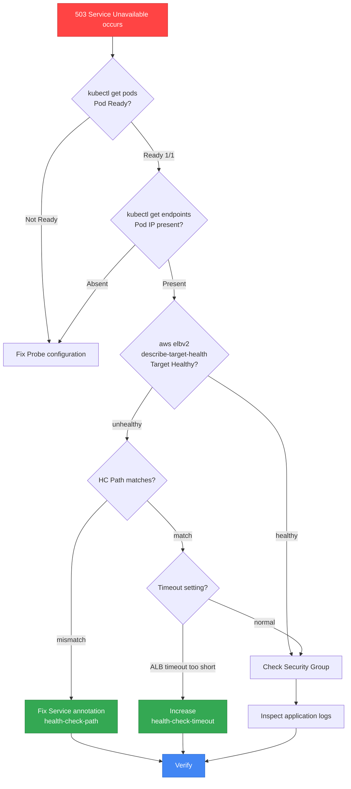
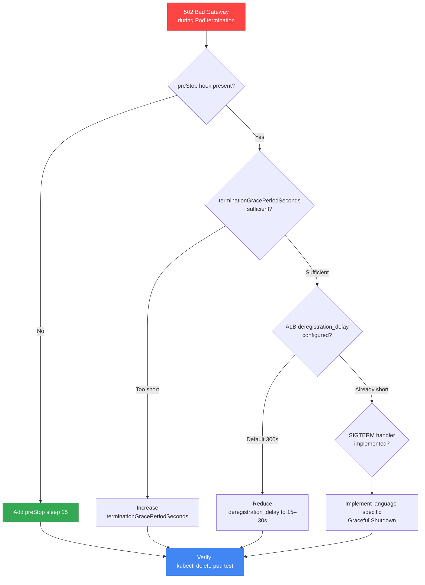
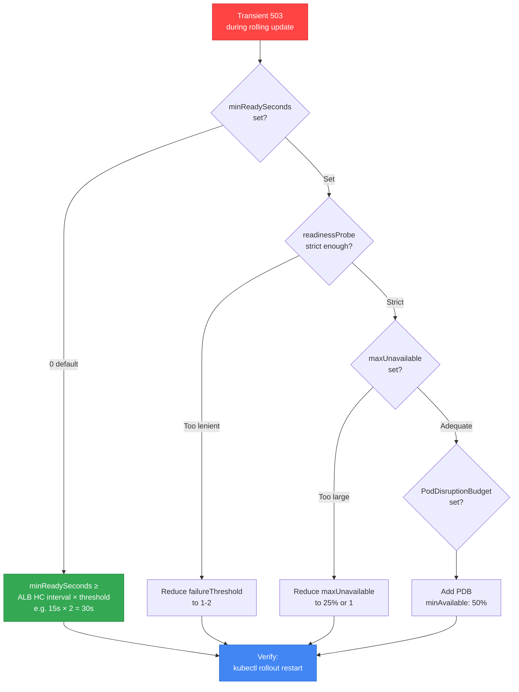

# Probe vs Health Check Mismatch Debugging

> **Created**: 2026-04-07 | **Reading time**: about 20 minutes

> **Baseline environment**: EKS 1.32+, AWS Load Balancer Controller v2.9+, Ingress-NGINX v1.11+

## 1. Overview

Kubernetes Probes and Load Balancer/Ingress Controller Health Checks run **independently** and use **different mechanisms and timings**. Mismatches can cause the following outages:

- **503 Service Unavailable**: Probe succeeds but ALB Health Check fails
- **502 Bad Gateway**: Graceful shutdown sequence mismatch sends traffic to a terminating Pod
- **Transient outages**: New Pods receive traffic before being fully ready during rolling updates
- **504 Gateway Timeout**: Ingress timeout mismatch with backend response time

This document clarifies the mechanism differences between K8s Probes and ALB/NLB/Ingress Health Checks, and provides diagnosis methods and recommended settings for frequent mismatch patterns.

:::tip Related Documents
- **Probe basics**: [Pod Health & Lifecycle](../eks-pod-health-lifecycle.md) — Detailed Probe configuration
- **Networking debugging**: [Networking Troubleshooting](#) — Service/DNS issues (coming soon)
- **High availability**: [EKS Resiliency Guide](../eks-resiliency-guide.md) — PDB, Graceful Shutdown
:::

---

## 2. Mechanism Comparison: Probe vs Health Check

### 2.1 Kubernetes Probes (Executed by kubelet)

Kubernetes Probes are health checks executed independently by **kubelet** on each node.

| Probe Type | Executor | Target | Behavior on Failure |
|-----------|----------|----------|-------------|
| **readinessProbe** | kubelet | Container | **Removed** from Service Endpoints (Pod still alive) |
| **livenessProbe** | kubelet | Container | Container is **restarted** (SIGTERM → SIGKILL) |
| **startupProbe** | kubelet | Container | Disables other probes until initialization completes; restart on failure |

**Key characteristics:**
- **Runs inside the Pod**: kubelet has direct access to the container
- **Service Endpoint control**: readinessProbe failure → removed from `kubectl get endpoints`
- **Fast checks**: default 1s timeout, 10s interval

### 2.2 AWS Load Balancer Health Checks

ALB/NLB Health Checks managed by AWS Load Balancer Controller (LBC) run independently at the **AWS infrastructure level**.

| Health Check Type | Executor | Target | Behavior on Failure |
|------------------|----------|----------|-------------|
| **ALB Target Group HC** | ALB | HTTP(S) endpoint | **Deregistered** from Target Group (independent of Pod state) |
| **NLB Target Group HC** | NLB | TCP or HTTP | **Deregistered** from Target Group |

**Key characteristics:**
- **External execution**: ALB/NLB sends HTTP/TCP requests to the Pod IP
- **Independent configuration**: interval, timeout, threshold configured separately from K8s probes
- **Slower checks**: default 5s timeout, 15–30s interval

### 2.3 Ingress-NGINX Health Checks

The Ingress-NGINX Controller performs health checks at the **nginx upstream** level.

| Health Check Type | Executor | Target | Behavior on Failure |
|------------------|----------|----------|-------------|
| **upstream health** | nginx process | HTTP backend | `proxy_next_upstream` behavior (retry another upstream) |

**Key characteristics:**
- **Inside the nginx process**: L7 proxy-level check
- **Timeout configuration**: `proxy-read-timeout`, `proxy-send-timeout` (default 60s)
- **Implicit checks**: no dedicated health endpoint; assessed from actual request outcomes

---

## 3. Timing Comparison Table

The following table compares default timings, executors, and failure behavior for each Health Check.

| Setting | K8s Probe | ALB Health Check | NLB Health Check | Ingress-NGINX |
|------|----------|-----------------|-----------------|---------------|
| **Default interval** | 10s | 15s | 30s | - (actual traffic) |
| **Default timeout** | 1s | 5s | 6s | 60s (proxy_read_timeout) |
| **Failure threshold** | 3 | 2 (unhealthy) | 3 | - |
| **Executor** | kubelet | ALB | NLB | nginx process |
| **Behavior on failure** | Remove from Endpoints | TG deregister | TG deregister | Remove from upstream and retry |
| **Check path** | `/healthz` etc. | `/` or custom | TCP or HTTP | Actual request path |
| **Configured in** | Pod spec | Service annotation | Service annotation | Ingress annotation |

**Key timing mismatches:**
- **ALB checks more slowly than K8s**: 15s interval vs 10s interval
- **ALB timeout is longer**: 5s vs 1s → Probe may pass while ALB fails
- **Path mismatch**: readinessProbe `/healthz` ≠ ALB Health Check `/`

---

## 4. Frequent Mismatch Patterns

### Pattern 1: Probe Success + ALB Health Check Failure → 503

**Symptoms:**
- `kubectl get pods` → Pod is `Running`, `Ready 1/1`
- `kubectl get endpoints` → Pod IP exists in Endpoints
- Actual requests → `503 Service Unavailable`

**Root causes:**
1. **Health Check path mismatch** (most common)
   - readinessProbe: `GET /healthz` → 200 OK
   - ALB Target Group HC: `GET /` → 404 Not Found
   - **Result**: K8s marks as Ready, ALB marks as Unhealthy

2. **Timeout mismatch**
   - readinessProbe timeout 1s → app responds in 800ms
   - App cannot respond within ALB HC timeout of 5s (e.g., DB query delay)

3. **Security Group misconfiguration**
   - ALB → Pod CIDR traffic is blocked
   - kubelet checks from inside the node (passes), ALB checks externally (fails)

**Diagnosis flow:**



**Resolution:**

```yaml
apiVersion: v1
kind: Service
metadata:
  name: my-service
  annotations:
    # Align ALB Health Check path with readinessProbe
    alb.ingress.kubernetes.io/healthcheck-path: /healthz
    alb.ingress.kubernetes.io/healthcheck-interval-seconds: "15"
    alb.ingress.kubernetes.io/healthcheck-timeout-seconds: "5"
    alb.ingress.kubernetes.io/healthy-threshold-count: "2"
    alb.ingress.kubernetes.io/unhealthy-threshold-count: "2"
spec:
  type: LoadBalancer
  ports:
  - port: 80
    targetPort: 8080
---
apiVersion: apps/v1
kind: Deployment
metadata:
  name: my-app
spec:
  template:
    spec:
      containers:
      - name: app
        image: my-app:1.0
        ports:
        - containerPort: 8080
        readinessProbe:
          httpGet:
            path: /healthz  # Match ALB HC path
            port: 8080
          initialDelaySeconds: 10
          periodSeconds: 10
          timeoutSeconds: 1
          failureThreshold: 3
```

### Pattern 2: 502 Bad Gateway During Graceful Shutdown

**Symptoms:**
- `502 Bad Gateway` during Pod termination
- Only some requests fail (intermittent)

**Root cause:**
A mismatch between the Pod termination sequence and ALB deregistration timing sends **traffic to a terminating Pod**.

**Pod termination sequence:**
1. `kubectl delete pod` or Rolling Update begins
2. Pod status → `Terminating`
3. **Two actions happen simultaneously:**
   - kubelet: run `preStop` hook → send `SIGTERM`
   - kube-proxy: remove Pod from Endpoints (update iptables rules)
4. Wait for `terminationGracePeriodSeconds` (default 30s)
5. Force termination with `SIGKILL`

**ALB deregistration sequence:**
1. ALB receives the deregister Pod request from the Target Group
2. Wait for `deregistration_delay` (default 300s)
3. Existing connections are preserved during the wait (connection draining)
4. Target fully removed after 300s

**Problem scenario:**

```
Timeline:
T+0s   Pod Terminating, preStop runs (SIGTERM immediately if absent)
T+0s   ALB deregistration begins (but waits 300s)
T+0s   SIGTERM sent → app starts terminating immediately
T+1s   App process terminated
T+1s~  ALB still in connection draining → 502 occurs
T+30s  terminationGracePeriodSeconds reached → SIGKILL
T+300s ALB deregistration completes
```

**Recommended formula:**

```
terminationGracePeriodSeconds > deregistration_delay + preStop_duration + app_shutdown_time
```

Example: `deregistration_delay=15s`, `preStop=10s`, `app_shutdown=5s`
→ `terminationGracePeriodSeconds=40s` or more

**Diagnosis flow:**



**Resolution:**

```yaml
apiVersion: v1
kind: Service
metadata:
  name: my-service
  annotations:
    # Reduce ALB deregistration delay (default 300s → 15s)
    alb.ingress.kubernetes.io/target-group-attributes: deregistration_delay.timeout_seconds=15
---
apiVersion: apps/v1
kind: Deployment
metadata:
  name: my-app
spec:
  template:
    spec:
      terminationGracePeriodSeconds: 40  # preStop + deregistration + shutdown
      containers:
      - name: app
        image: my-app:1.0
        lifecycle:
          preStop:
            exec:
              command:
              - /bin/sh
              - -c
              - |
                # 1. Allow time for ALB to detect deregistration
                sleep 15
                # 2. Send shutdown signal to the application (optional)
                # curl -X POST localhost:8080/shutdown
        # The application receives SIGTERM and performs graceful shutdown
```

**Example SIGTERM handler (Node.js):**

```javascript
// server.js
const express = require('express');
const app = express();
const server = app.listen(8080);

// Track in-flight requests
let isShuttingDown = false;

app.use((req, res, next) => {
  if (isShuttingDown) {
    res.setHeader('Connection', 'close');
    return res.status(503).send('Server is shutting down');
  }
  next();
});

// SIGTERM handler
process.on('SIGTERM', () => {
  console.log('SIGTERM received, starting graceful shutdown');
  isShuttingDown = true;
  
  server.close(() => {
    console.log('All connections closed, exiting');
    process.exit(0);
  });
  
  // Force shutdown after 25s
  setTimeout(() => {
    console.error('Forced shutdown after timeout');
    process.exit(1);
  }, 25000);
});
```

### Pattern 3: Transient 503 During Rolling Update

**Symptoms:**
- Intermittent 503 during `kubectl rollout status`
- New Pod is `Running`, `Ready`, but some requests still fail

**Root cause:**
K8s marks the Pod as "Ready" and begins routing traffic **before** the ALB Health Check passes.

**Timing mismatch:**

```
T+0s   New Pod starts
T+10s  readinessProbe succeeds (first check after 10s)
T+10s  K8s adds Pod to Endpoints → ALB receives Target registration request
T+10s  K8s stops routing traffic to the old Pod
T+15s  ALB runs first Health Check
T+30s  ALB Health Check succeeds twice (healthy threshold=2)
T+30s  ALB starts sending traffic to the new Pod

Issue: during T+10s ~ T+30s, traffic reaches the new Pod before it is ready → 503
```

**Diagnosis flow:**



**Resolution:**

```yaml
apiVersion: apps/v1
kind: Deployment
metadata:
  name: my-app
spec:
  replicas: 4
  strategy:
    type: RollingUpdate
    rollingUpdate:
      maxUnavailable: 1  # Terminate only one at a time
      maxSurge: 1        # Add only one at a time
  # Key: wait for ALB Health Check to pass
  minReadySeconds: 30  # ALB HC interval(15s) × threshold(2) = 30s
  template:
    spec:
      containers:
      - name: app
        image: my-app:2.0
        readinessProbe:
          httpGet:
            path: /healthz
            port: 8080
          initialDelaySeconds: 5
          periodSeconds: 5
          timeoutSeconds: 1
          failureThreshold: 2  # Strict
          successThreshold: 1
---
apiVersion: policy/v1
kind: PodDisruptionBudget
metadata:
  name: my-app-pdb
spec:
  minAvailable: 2  # Maintain at least 50%
  selector:
    matchLabels:
      app: my-app
```

### Pattern 4: NLB + externalTrafficPolicy: Local

**Symptoms:**
- Some requests time out when using NLB
- Health Check failures with `externalTrafficPolicy: Local`

**Root cause:**
NLB sends traffic to **all nodes**, but `externalTrafficPolicy: Local` has **only nodes with matching Pods** respond.

**Behavior:**

| externalTrafficPolicy | Client IP preserved | Health Check | Traffic distribution |
|----------------------|---------------|-------------|-----------|
| **Cluster (default)** | No (SNAT) | All nodes healthy | Even distribution → inter-node hops |
| **Local** | Yes | Only nodes with Pods healthy | Uneven distribution (proportional to Pod count) |

**Problem scenario:**

```
Node 1: Pod A, Pod B → NLB HC success → receives traffic
Node 2: No Pod → NLB HC failure → removed from TG
Node 3: Pod C → NLB HC success → receives traffic

Issue: Node 1 receives 2x the traffic (uneven)
```

**Diagnosis and resolution:**

```yaml
apiVersion: v1
kind: Service
metadata:
  name: my-service
  annotations:
    service.beta.kubernetes.io/aws-load-balancer-type: "nlb"
    # NLB Health Check configuration
    service.beta.kubernetes.io/aws-load-balancer-healthcheck-protocol: "http"
    service.beta.kubernetes.io/aws-load-balancer-healthcheck-path: "/healthz"
    service.beta.kubernetes.io/aws-load-balancer-healthcheck-interval: "10"
    service.beta.kubernetes.io/aws-load-balancer-healthcheck-timeout: "6"
    service.beta.kubernetes.io/aws-load-balancer-healthcheck-healthy-threshold: "2"
    service.beta.kubernetes.io/aws-load-balancer-healthcheck-unhealthy-threshold: "2"
spec:
  type: LoadBalancer
  # Choose Client IP preservation vs even distribution
  externalTrafficPolicy: Local  # When Client IP is required
  # externalTrafficPolicy: Cluster  # When even distribution is required
  ports:
  - port: 80
    targetPort: 8080
```

**Recommendations:**
- **Client IP required**: `Local` + sufficient Pod count (at least one per node)
- **Even distribution preferred**: `Cluster` + extract Client IP from the X-Forwarded-For header

### Pattern 5: Ingress-NGINX Upstream Timeout

**Symptoms:**
- `504 Gateway Timeout`
- File upload and batch API failures
- `413 Request Entity Too Large` (file size exceeded)

**Root cause:**
Ingress-NGINX `proxy-read-timeout` (default 60s) is shorter than the backend processing time.

**Diagnosis and resolution:**

```yaml
apiVersion: networking.k8s.io/v1
kind: Ingress
metadata:
  name: my-ingress
  annotations:
    # Timeout settings (seconds)
    nginx.ingress.kubernetes.io/proxy-read-timeout: "300"    # Wait for backend response
    nginx.ingress.kubernetes.io/proxy-send-timeout: "300"    # Wait while sending to backend
    nginx.ingress.kubernetes.io/proxy-connect-timeout: "10"  # Wait for backend connection
    
    # File upload size limit (default 1m)
    nginx.ingress.kubernetes.io/proxy-body-size: "100m"
    
    # Buffer settings (large responses)
    nginx.ingress.kubernetes.io/proxy-buffer-size: "8k"
    nginx.ingress.kubernetes.io/proxy-buffers-number: "4"
spec:
  ingressClassName: nginx
  rules:
  - host: api.example.com
    http:
      paths:
      - path: /
        pathType: Prefix
        backend:
          service:
            name: my-service
            port:
              number: 80
```

**Separate Ingress for batch APIs:**

```yaml
# General API (short timeout)
apiVersion: networking.k8s.io/v1
kind: Ingress
metadata:
  name: api-ingress
  annotations:
    nginx.ingress.kubernetes.io/proxy-read-timeout: "60"
spec:
  rules:
  - host: api.example.com
    http:
      paths:
      - path: /api
        pathType: Prefix
        backend:
          service:
            name: api-service
            port:
              number: 80
---
# Batch API (long timeout)
apiVersion: networking.k8s.io/v1
kind: Ingress
metadata:
  name: batch-ingress
  annotations:
    nginx.ingress.kubernetes.io/proxy-read-timeout: "1800"  # 30 minutes
    nginx.ingress.kubernetes.io/proxy-body-size: "1g"
spec:
  rules:
  - host: api.example.com
    http:
      paths:
      - path: /batch
        pathType: Prefix
        backend:
          service:
            name: batch-service
            port:
              number: 80
```

---

## 5. Recommended Configuration Guide

### 5.1 Unification Principle: Match Paths and Ports

**Principles:**
- ALB/NLB Health Check path = readinessProbe path
- Health Check port = Service targetPort
- Probe timeout < ALB HC timeout (Probe detects faster)

**Template:**

```yaml
apiVersion: v1
kind: Service
metadata:
  name: my-service
  annotations:
    # ALB Health Check configuration
    alb.ingress.kubernetes.io/healthcheck-path: /healthz
    alb.ingress.kubernetes.io/healthcheck-port: traffic-port
    alb.ingress.kubernetes.io/healthcheck-protocol: HTTP
    alb.ingress.kubernetes.io/healthcheck-interval-seconds: "15"
    alb.ingress.kubernetes.io/healthcheck-timeout-seconds: "5"
    alb.ingress.kubernetes.io/healthy-threshold-count: "2"
    alb.ingress.kubernetes.io/unhealthy-threshold-count: "2"
    
    # Graceful Shutdown settings
    alb.ingress.kubernetes.io/target-group-attributes: deregistration_delay.timeout_seconds=15
spec:
  type: LoadBalancer
  ports:
  - port: 80
    targetPort: 8080
    protocol: TCP
---
apiVersion: apps/v1
kind: Deployment
metadata:
  name: my-app
spec:
  replicas: 3
  strategy:
    type: RollingUpdate
    rollingUpdate:
      maxUnavailable: 1
      maxSurge: 1
  minReadySeconds: 30  # Wait for ALB HC to pass
  template:
    spec:
      terminationGracePeriodSeconds: 40
      containers:
      - name: app
        image: my-app:1.0
        ports:
        - containerPort: 8080
          name: http
          protocol: TCP
        
        # Startup Probe (for slow-starting apps)
        startupProbe:
          httpGet:
            path: /healthz
            port: 8080
          initialDelaySeconds: 0
          periodSeconds: 5
          timeoutSeconds: 3
          failureThreshold: 30  # Wait up to 150s
        
        # Liveness Probe (deadlock detection)
        livenessProbe:
          httpGet:
            path: /healthz
            port: 8080
          initialDelaySeconds: 0  # Activated after startupProbe succeeds
          periodSeconds: 10
          timeoutSeconds: 1
          failureThreshold: 3
        
        # Readiness Probe (traffic gating)
        readinessProbe:
          httpGet:
            path: /healthz  # Same as ALB HC
            port: 8080
          initialDelaySeconds: 0
          periodSeconds: 5
          timeoutSeconds: 1
          failureThreshold: 2
          successThreshold: 1
        
        # Graceful Shutdown
        lifecycle:
          preStop:
            exec:
              command:
              - /bin/sh
              - -c
              - sleep 15  # Wait for ALB deregistration
---
apiVersion: policy/v1
kind: PodDisruptionBudget
metadata:
  name: my-app-pdb
spec:
  minAvailable: 50%
  selector:
    matchLabels:
      app: my-app
```

### 5.2 Termination Sequence Formula

```
terminationGracePeriodSeconds = deregistration_delay + preStop_sleep + app_shutdown_buffer

Example:
  deregistration_delay = 15s
  preStop_sleep = 15s
  app_shutdown_buffer = 10s (SIGTERM handling + in-flight request completion)
  -------------------
  terminationGracePeriodSeconds = 40s
```

### 5.3 Timing Optimization Matrix

| Workload Type | readinessProbe period | ALB HC interval | minReadySeconds | terminationGracePeriodSeconds |
|-------------|----------------------|----------------|-----------------|------------------------------|
| **Stateless API** | 5s | 15s | 30s | 40s |
| **Web frontend** | 5s | 15s | 30s | 40s |
| **Batch worker** | 10s | 30s | 60s | 120s |
| **Long-lived connections** | 10s | 30s | 60s | 300s |
| **gRPC service** | 5s (grpc probe) | 15s (HTTP) | 30s | 40s |

---

## 6. Diagnostic Commands

### 6.1 Checking K8s Endpoints

```bash
# List Service Endpoints
kubectl get endpoints my-service -o wide

# Endpoint details (check NotReadyAddresses)
kubectl get endpoints my-service -o yaml

# Check whether a specific Pod is in Endpoints
kubectl get endpoints my-service -o json | jq '.subsets[].addresses[] | select(.ip=="10.0.1.100")'
```

### 6.2 Checking ALB Target Group Status

```bash
# Get Target Group ARN
kubectl get targetgroupbindings -A

# Check Target Health
aws elbv2 describe-target-health \
  --target-group-arn arn:aws:elasticloadbalancing:... \
  --query 'TargetHealthDescriptions[*].[Target.Id,TargetHealth.State,TargetHealth.Reason]' \
  --output table

# Details for a specific target (check Reason)
aws elbv2 describe-target-health \
  --target-group-arn arn:aws:elasticloadbalancing:... \
  --targets Id=10.0.1.100,Port=8080
```

**Key Reason codes:**
- `Target.FailedHealthChecks`: Health Check failure
- `Elb.RegistrationInProgress`: registration in progress
- `Target.DeregistrationInProgress`: deregistration in progress
- `Target.InvalidState`: Pod IP unreachable (SG issue)

### 6.3 AWS Load Balancer Controller Logs

```bash
# LBC logs (Health Check related)
kubectl logs -n kube-system deploy/aws-load-balancer-controller --tail=100 | grep -i health

# TargetGroupBinding events
kubectl describe targetgroupbindings -A

# Service events (LoadBalancer creation flow)
kubectl describe svc my-service
```

### 6.4 Ingress-NGINX Debugging

```bash
# Check Ingress status
kubectl describe ingress my-ingress

# nginx-ingress-controller logs
kubectl logs -n ingress-nginx deploy/ingress-nginx-controller --tail=100

# Check upstream configuration (in a controller Pod)
kubectl exec -n ingress-nginx deploy/ingress-nginx-controller -- cat /etc/nginx/nginx.conf | grep -A 20 "upstream"

# Live access logs
kubectl logs -n ingress-nginx deploy/ingress-nginx-controller --tail=1 -f
```

### 6.5 Pod Status and Probe Results

```bash
# Pod status and Ready conditions
kubectl get pods -o wide
kubectl describe pod my-app-7d8f9c-abcde

# Probe failure events
kubectl get events --field-selector involvedObject.name=my-app-7d8f9c-abcde

# Pod IP and container state
kubectl get pod my-app-7d8f9c-abcde -o json | jq '.status.podIP, .status.containerStatuses[]'
```

### 6.6 Security Group Verification

```bash
# Simulate ALB Health Check from inside the Pod
kubectl exec my-app-7d8f9c-abcde -- curl -v http://localhost:8080/healthz

# Health Check from node to Pod
NODE_IP=$(kubectl get node <node-name> -o json | jq -r '.status.addresses[] | select(.type=="InternalIP") | .address')
POD_IP=$(kubectl get pod my-app-7d8f9c-abcde -o json | jq -r '.status.podIP')
ssh ec2-user@$NODE_IP "curl -v http://$POD_IP:8080/healthz"

# Check Security Group rules
aws ec2 describe-security-groups --group-ids sg-xxxxxxxx
```

---

## 7. Cross References

### Related Documents
- **[Pod Health & Lifecycle](../eks-pod-health-lifecycle.md)** — Probe configuration details, language-specific Graceful Shutdown
- **[EKS Resiliency Guide](../eks-resiliency-guide.md)** — PDB, Pod Readiness Gates, Zone-aware routing
- **[EKS Debugging Guide](./index.md)** — Full debugging workflow

### External References
- [Kubernetes Probes](https://kubernetes.io/docs/tasks/configure-pod-container/configure-liveness-readiness-startup-probes/)
- [AWS Load Balancer Controller Annotations](https://kubernetes-sigs.github.io/aws-load-balancer-controller/v2.9/guide/service/annotations/)
- [Ingress-NGINX Configuration](https://kubernetes.github.io/ingress-nginx/user-guide/nginx-configuration/annotations/)
- [Zero-downtime Deployments in Kubernetes](https://learnk8s.io/graceful-shutdown)

---

## 8. Summary Checklist

Pre-deployment Health Check configuration review:

- [ ] **Path alignment**: ALB/NLB Health Check path = readinessProbe path
- [ ] **Timing design**: Probe timeout < ALB HC timeout
- [ ] **Graceful Shutdown**: `preStop` hook + SIGTERM handler implemented
- [ ] **Termination sequence**: `terminationGracePeriodSeconds > deregistration_delay + preStop_duration`
- [ ] **Rolling Update**: `minReadySeconds ≥ ALB HC interval × threshold`
- [ ] **High availability**: PodDisruptionBudget configured (`minAvailable: 50%`)
- [ ] **Security Group**: ALB → Pod CIDR traffic allowed
- [ ] **Ingress timeout**: Separate Ingress for batch APIs

Diagnosis order during an outage:

1. `kubectl get pods` → check Pod Ready status
2. `kubectl get endpoints` → whether Service Endpoints exist
3. `aws elbv2 describe-target-health` → Target Group state (ALB)
4. `kubectl logs -n kube-system deploy/aws-load-balancer-controller` → LBC logs
5. `kubectl describe ingress` → Ingress events (Ingress-NGINX)
6. Verify Security Group rules → Pod CIDR reachability

---

**Next**: [Networking Troubleshooting](#) (coming soon) — Service Discovery, DNS, CNI debugging
