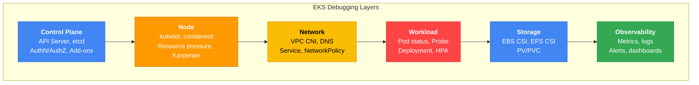
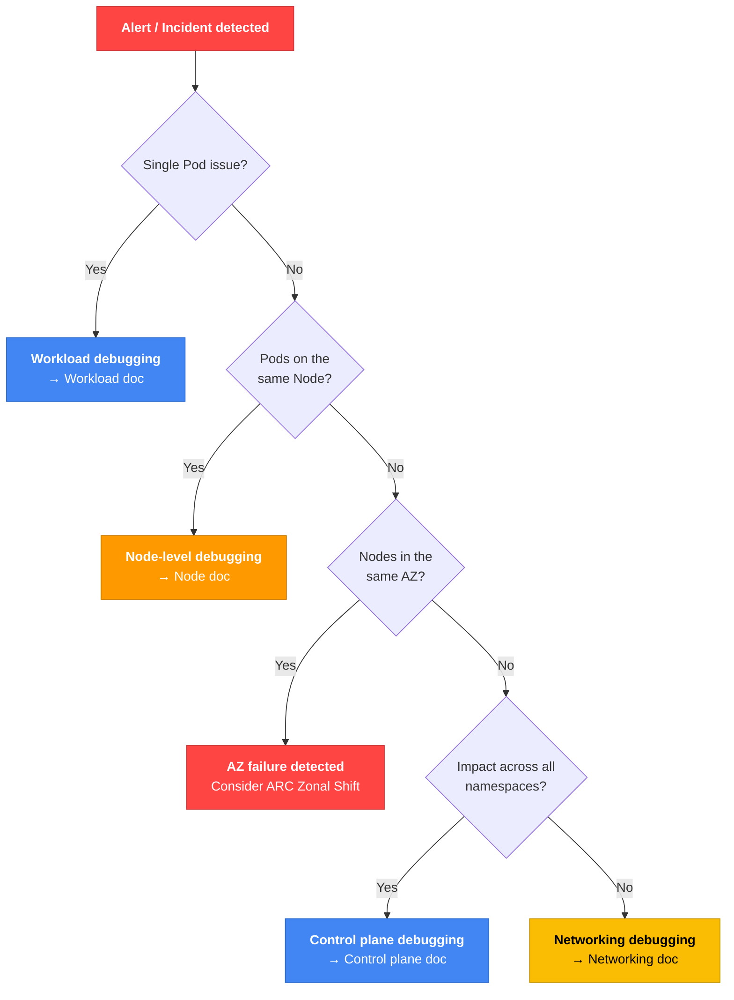

import { IncidentEscalationTable, ZonalShiftImpactTable, ControlPlaneLogTable, ClusterHealthTable, NodeGroupErrorTable, ErrorQuickRefTable } from '@site/src/components/EksDebugTables';

# EKS Debugging Guide

> **Created**: 2026-02-10 | **Updated**: 2026-04-07 | **Reading time**: about 8 minutes

> **Baseline environment**: EKS 1.32+, kubectl 1.30+, AWS CLI v2

## 1. Overview

Issues that occur during EKS operations span multiple layers including the control plane, nodes, network, workloads, storage, and observability. This document is a comprehensive debugging guide for SREs, DevOps engineers, and platform teams to **systematically diagnose and quickly resolve** these issues.

All commands and examples are written to be immediately executable, and decision trees and flowcharts help enable rapid judgment.

### EKS Debugging Layers



### Debugging Approach Methodology

Two approaches are available for EKS problem diagnosis.

| Approach | Description | Suitable Situations |
|-----------|------|------------|
| **Top-down (symptom → cause)** | Start from user-reported symptoms and trace back to causes | Immediate response to service outages and performance degradation |
| **Bottom-up (infra → app)** | Check layers sequentially starting from infrastructure | Preventive checks, validation after cluster migration |

:::tip Generally Recommended Order
For production incidents, a **Top-down** approach is recommended. First identify the symptom (Section 2 Incident Triage), then navigate to the debugging section for that layer.
:::

---

## 2. Incident Triage (Rapid Fault Determination)

### First 5 Minutes Checklist

When an incident occurs, the most important actions are **scope determination** and **initial response**.

#### 30 seconds: Initial diagnosis

```bash
# Check cluster status
aws eks describe-cluster --name <cluster-name> --query 'cluster.status' --output text

# Check node status
kubectl get nodes

# Check abnormal Pods
kubectl get pods --all-namespaces | grep -v Running | grep -v Completed
```

#### 2 minutes: Scope determination

```bash
# Check recent events (all namespaces)
kubectl get events --all-namespaces --sort-by='.lastTimestamp' | tail -20

# Aggregate Pod states for a specific namespace
kubectl get pods -n <namespace> --no-headers | awk '{print $3}' | sort | uniq -c | sort -rn

# Check distribution of abnormal Pods by node
kubectl get pods --all-namespaces -o wide --field-selector=status.phase!=Running | \
  awk 'NR>1 {print $8}' | sort | uniq -c | sort -rn
```

#### 5 minutes: Initial response

```bash
# Detailed information on the problem Pod
kubectl describe pod <pod-name> -n <namespace>

# Previous container logs (for CrashLoopBackOff)
kubectl logs <pod-name> -n <namespace> --previous

# Check resource usage
kubectl top nodes
kubectl top pods -n <namespace> --sort-by=cpu
```

### Scope Determination Decision Tree



### AZ Failure Detection

:::warning AWS Health API Requirements
The `aws health describe-events` API is only available on **AWS Business or Enterprise Support** plans. Without a Support plan, check directly from the [AWS Health Dashboard console](https://health.aws.amazon.com/health/home) or capture Health events via EventBridge rules.
:::

```bash
# Check EKS/EC2-related events via AWS Health API (Business/Enterprise Support plan required)
aws health describe-events \
  --filter '{"services":["EKS","EC2"],"eventStatusCodes":["open"]}' \
  --region us-east-1

# Alternative: AZ failure detection without Support plan — create EventBridge rule
aws events put-rule \
  --name "aws-health-eks-events" \
  --event-pattern '{
    "source": ["aws.health"],
    "detail-type": ["AWS Health Event"],
    "detail": {
      "service": ["EKS", "EC2"],
      "eventTypeCategory": ["issue"]
    }
  }'

# Aggregate abnormal Pods by AZ (only Pods scheduled to nodes)
kubectl get pods --all-namespaces -o json | jq -r '
  .items[] |
  select(.status.phase != "Running" and .status.phase != "Succeeded") |
  select(.spec.nodeName != null) |
  .spec.nodeName
' | sort -u | while read node; do
  zone=$(kubectl get node "$node" -o jsonpath='{.metadata.labels.topology\.kubernetes\.io/zone}' 2>/dev/null)
  [ -n "$zone" ] && echo "$zone"
done | sort | uniq -c | sort -rn

# Check ARC Zonal Shift status
aws arc-zonal-shift list-zonal-shifts \
  --resource-identifier arn:aws:eks:region:account:cluster/name
```

#### AZ Failure Response Using ARC Zonal Shift

```bash
# Enable Zonal Shift in EKS
aws eks update-cluster-config \
  --name <cluster-name> \
  --zonal-shift-config enabled=true

# Start manual Zonal Shift (move traffic away from failed AZ)
aws arc-zonal-shift start-zonal-shift \
  --resource-identifier arn:aws:eks:region:account:cluster/name \
  --away-from us-east-1a \
  --expires-in 3h \
  --comment "AZ impairment detected"
```

:::warning Zonal Shift Caveats
The maximum duration of a Zonal Shift is **3 days** and can be extended. Starting a shift blocks new traffic to Pods running on nodes in that AZ, so first verify that other AZs have sufficient capacity.
:::

:::danger Zonal Shift Only Blocks Traffic
ARC Zonal Shift **only changes Load Balancer / Service-level traffic routing**.

<ZonalShiftImpactTable />

AZ settings for Karpenter NodePools and ASGs (Managed Node Groups) are not updated automatically. Therefore, complete AZ evacuation requires additional actions:

1. **Start Zonal Shift** → Block new traffic (automatic)
2. **Drain nodes in that AZ** → Move existing Pods
3. **Remove the AZ from the Karpenter NodePool or ASG subnets** → Prevent new node provisioning

```bash
# 1. Identify and drain nodes in the failed AZ
for node in $(kubectl get nodes -l topology.kubernetes.io/zone=us-east-1a -o name); do
  kubectl cordon $node
  kubectl drain $node --ignore-daemonsets --delete-emptydir-data --grace-period=60
done

# 2. Temporarily exclude the AZ from the Karpenter NodePool (modify requirements)
kubectl patch nodepool default --type=merge -p '{
  "spec": {"template": {"spec": {"requirements": [
    {"key": "topology.kubernetes.io/zone", "operator": "In", "values": ["us-east-1b", "us-east-1c"]}
  ]}}}
}'

# 3. Managed Node Groups require ASG subnet changes (perform via console or IaC)
```

After the Zonal Shift is lifted, the above changes must be reverted.
:::

### CloudWatch Anomaly Detection

```bash
# Configure an Anomaly Detection alarm for Pod restart counts
aws cloudwatch put-anomaly-detector \
  --single-metric-anomaly-detector '{
    "Namespace": "ContainerInsights",
    "MetricName": "pod_number_of_container_restarts",
    "Dimensions": [
      {"Name": "ClusterName", "Value": "<cluster-name>"},
      {"Name": "Namespace", "Value": "production"}
    ],
    "Stat": "Average"
  }'
```

### Incident Response Escalation Matrix

<IncidentEscalationTable />

:::info See High-Availability Architecture Guide
For architecture-level fault recovery strategies (TopologySpreadConstraints, PodDisruptionBudget, multi-AZ deployment, etc.), see the [EKS Resiliency Guide](../eks-resiliency-guide.md).
:::

---

## 10. Debugging Quick Reference

### Error Pattern → Cause → Resolution Quick Reference Table

<ErrorQuickRefTable />

### Essential kubectl Command Cheat Sheet

#### Query and diagnosis

```bash
# See all resource status at a glance
kubectl get all -n <namespace>

# Filter only abnormal Pods
kubectl get pods --all-namespaces --field-selector=status.phase!=Running,status.phase!=Succeeded

# Pod details (including events)
kubectl describe pod <pod-name> -n <namespace>

# Namespace events (sorted newest first)
kubectl get events -n <namespace> --sort-by='.lastTimestamp'

# Resource usage
kubectl top nodes
kubectl top pods -n <namespace> --sort-by=memory
```

#### Log inspection

```bash
# Current container logs
kubectl logs <pod-name> -n <namespace>

# Previous (crashed) container logs
kubectl logs <pod-name> -n <namespace> --previous

# Specific container in a multi-container Pod
kubectl logs <pod-name> -n <namespace> -c <container-name>

# Real-time log streaming
kubectl logs -f <pod-name> -n <namespace>

# Logs from multiple Pods by label
kubectl logs -l app=<app-name> -n <namespace> --tail=50
```

#### Debugging

```bash
# Debug with an ephemeral container
kubectl debug <pod-name> -it --image=nicolaka/netshoot --target=<container-name>

# Node debugging
kubectl debug node/<node-name> -it --image=ubuntu

# Execute a command inside a Pod
kubectl exec -it <pod-name> -n <namespace> -- <command>
```

#### Deployment management

```bash
# Rollout status/history/rollback
kubectl rollout status deployment/<name>
kubectl rollout history deployment/<name>
kubectl rollout undo deployment/<name>

# Restart a Deployment
kubectl rollout restart deployment/<name>

# Node maintenance (drain)
kubectl cordon <node-name>
kubectl drain <node-name> --ignore-daemonsets --delete-emptydir-data
kubectl uncordon <node-name>
```

### Recommended Tool Matrix

| Scenario | Tool | Description |
|---------|------|------|
| Network debugging | [netshoot](https://github.com/nicolaka/netshoot) | Container bundled with networking tools |
| Node resource visualization | [eks-node-viewer](https://github.com/awslabs/eks-node-viewer) | Terminal-based node resource monitoring |
| Container runtime debugging | [crictl](https://kubernetes.io/docs/tasks/debug/debug-cluster/crictl/) | containerd debugging CLI |
| Log analysis | CloudWatch Logs Insights | AWS-native log query |
| Metric queries | Prometheus / Grafana | PromQL-based metric analysis |
| Distributed tracing | [ADOT](https://aws-otel.github.io/docs/introduction) / [OpenTelemetry](https://opentelemetry.io/docs/) | Request path tracing |
| Cluster security scanning | kube-bench | CIS Benchmark-based security scan |
| YAML manifest validation | kubeval / kubeconform | Pre-deployment manifest validation |
| Karpenter debugging | Karpenter controller logs | Diagnose node provisioning issues |
| IAM debugging | AWS IAM Policy Simulator | Validate IAM permissions |

### EKS Log Collector

EKS Log Collector is a script provided by AWS that automatically collects logs needed for debugging from EKS worker nodes and generates an archive file that can be shared with AWS Support.

**Installation and execution:**

```bash
# Download and run the script (after SSM connecting to the node)
curl -O https://raw.githubusercontent.com/awslabs/amazon-eks-ami/master/log-collector-script/linux/eks-log-collector.sh
sudo bash eks-log-collector.sh
```

**Collected items:**

- kubelet logs
- containerd logs
- iptables rules
- CNI config (VPC CNI configuration)
- cloud-init logs
- dmesg (kernel messages)
- systemd unit status

**Output:**

Collected logs are saved in a compressed archive following the format `/var/log/eks_i-xxxx_yyyy-mm-dd_HH-MM-SS.tar.gz`.

**S3 upload:**

```bash
# Upload collected logs directly to S3
sudo bash eks-log-collector.sh --upload s3://my-bucket/
```

:::tip Leveraging AWS Support
Attaching this log file when submitting an AWS Support case enables support engineers to quickly understand node state, significantly reducing time to resolution. Always attach it when reporting node join failures, kubelet failures, or network issues.
:::

---

## Detailed Debugging Guides

Use the following links to view detailed debugging guides for each layer:

| Document | Description | Key Topics |
|------|------|----------|
| [Control Plane Debugging](./control-plane.md) | Diagnose EKS control plane issues | API Server logs, AuthN/AuthZ, Add-ons, IRSA, Pod Identity, RBAC |
| [Node Debugging](./node.md) | Diagnose node-level issues | Node join failures, kubelet/containerd, resource pressure, Karpenter, Managed Node Group |
| [Workload Debugging](./workload.md) | Diagnose Pod and workload issues | Pod state-based debugging, Deployment, HPA/VPA, Probe configuration |
| [Networking Debugging](./networking.md) | Diagnose network issues | VPC CNI, DNS, Service, NetworkPolicy, Ingress/LoadBalancer |
| [Storage Debugging](./storage.md) | Diagnose storage issues | EBS CSI, EFS CSI, PV/PVC status, volume mount failures |
| [Observability](./observability.md) | Monitoring and log analysis | Container Insights, Prometheus, CloudWatch Logs Insights, ADOT |

### Related Documents

- [EKS Resiliency Guide](../eks-resiliency-guide.md) - Architecture-level fault recovery strategies
- [GitOps-based EKS Cluster Operations](../gitops-cluster-operation.md) - GitOps deployment and operations automation
- [Ultra-fast Autoscaling with Karpenter](/docs/eks-best-practices/resource-cost/karpenter-autoscaling) - Karpenter-based node provisioning optimization
- [Node Monitoring Agent](../node-monitoring-agent.md) - Node-level monitoring

### References

- [EKS Official Troubleshooting Guide](https://docs.aws.amazon.com/eks/latest/userguide/troubleshooting.html)
- [EKS Best Practices - Auditing and Logging](https://docs.aws.amazon.com/eks/latest/best-practices/auditing-and-logging.html)
- [EKS Best Practices - Networking](https://docs.aws.amazon.com/eks/latest/best-practices/networking.html)
- [EKS Best Practices - Reliability](https://docs.aws.amazon.com/eks/latest/best-practices/reliability.html)
- [Kubernetes Official Debugging Guide - Pod](https://kubernetes.io/docs/tasks/debug/debug-application/debug-pods/)
- [Kubernetes Official Debugging Guide - Service](https://kubernetes.io/docs/tasks/debug/debug-application/debug-service/)
- [Kubernetes DNS Debugging](https://kubernetes.io/docs/tasks/administer-cluster/dns-debugging-resolution/)
- [VPC CNI Troubleshooting](https://github.com/aws/amazon-vpc-cni-k8s/blob/master/docs/troubleshooting.md)
- [EBS CSI Driver FAQ](https://github.com/kubernetes-sigs/aws-ebs-csi-driver/blob/master/docs/faq.md)
- [EKS Zonal Shift Documentation](https://docs.aws.amazon.com/eks/latest/userguide/zone-shift.html)
