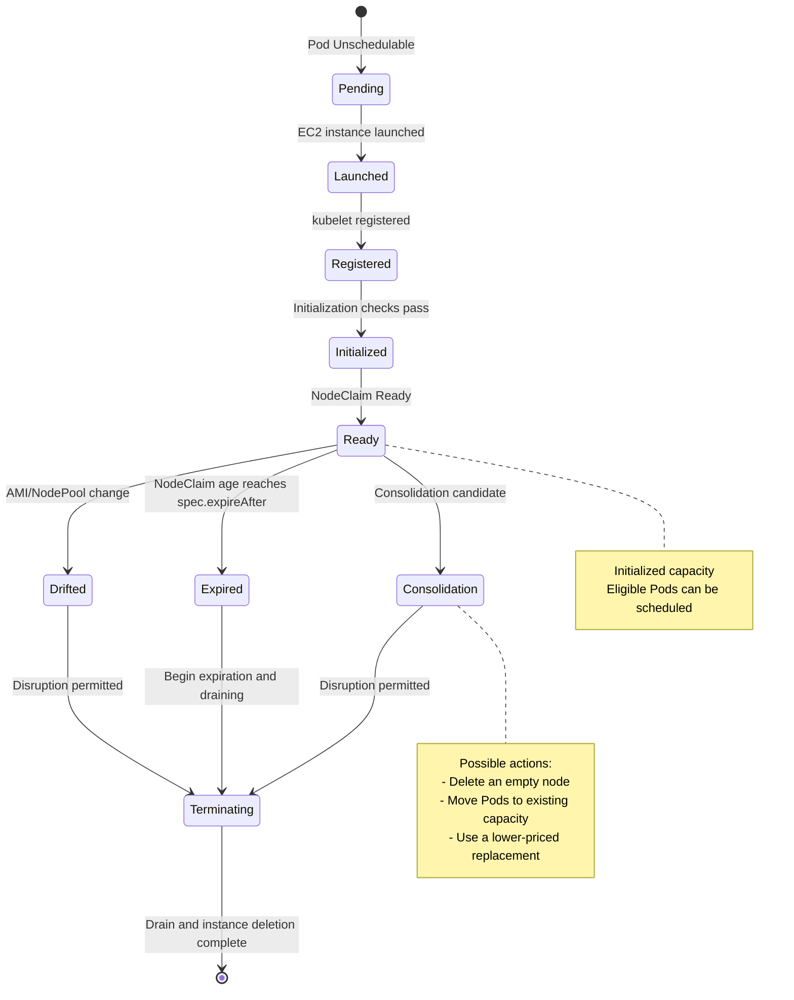
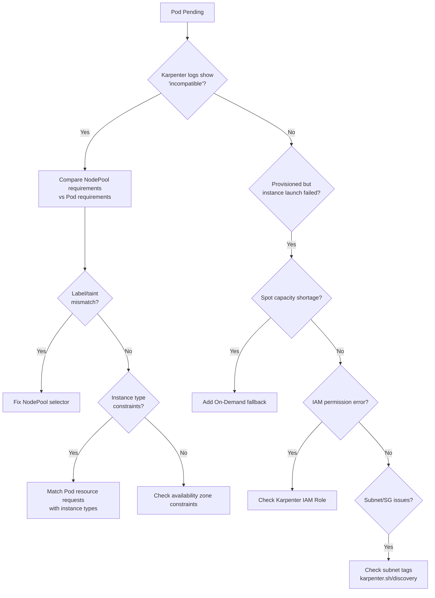
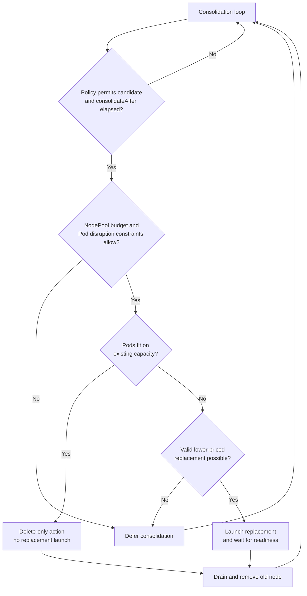
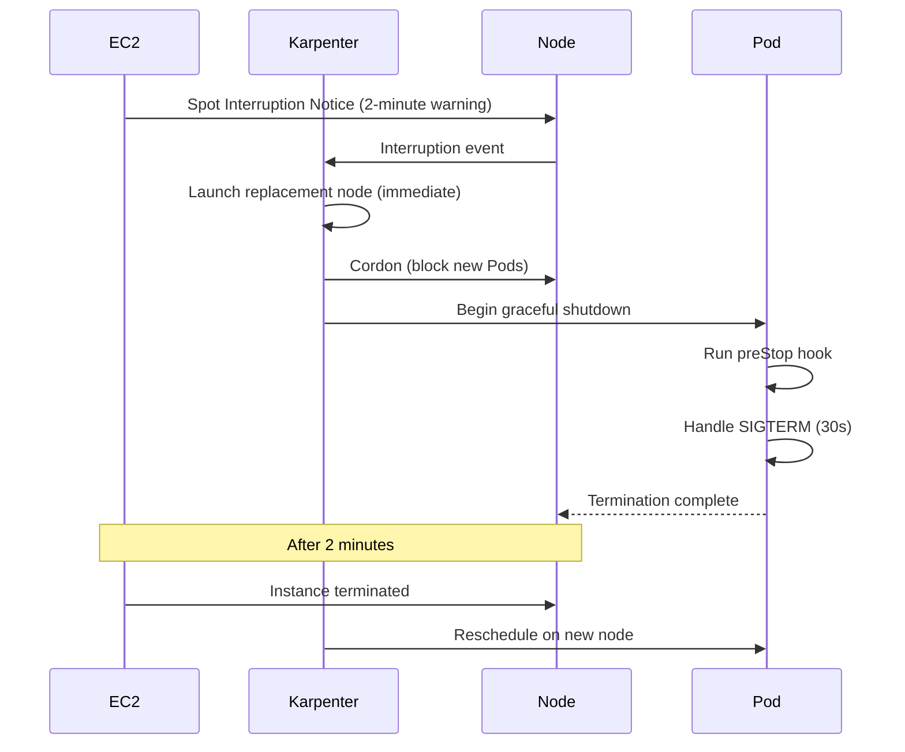

Karpenter is the next-generation autoscaler for EKS, delivering fast and efficient node provisioning based on NodePool/NodeClaim. This document covers Karpenter-specific debugging patterns.

## NodeClaim Lifecycle

This conceptual flow shows provisioning and disruption for a node that initializes normally. It is not a literal list of `status.conditions`. [Initialization checks](https://karpenter.sh/v1.14/concepts/nodeclaims/) include Node readiness, startup-taint removal and registration of requested resources. Expiration is calculated independently from the NodeClaim's creation time.


```mermaid
stateDiagram-v2
    [*] --> Pending: Pod Unschedulable
    Pending --> Launched: EC2 instance launched
    Launched --> Registered: kubelet registered
    Registered --> Initialized: Initialization checks pass
    Initialized --> Ready: NodeClaim Ready

    Ready --> Drifted: AMI/NodePool change
    Ready --> Expired: NodeClaim age reaches spec.expireAfter
    Ready --> Consolidation: Consolidation candidate

    Drifted --> Terminating: Disruption permitted
    Expired --> Terminating: Begin expiration and draining
    Consolidation --> Terminating: Disruption permitted

    Terminating --> [*]: Drain and instance deletion complete

    note right of Ready
        Initialized capacity
        Eligible Pods can be scheduled
    end note

    note right of Consolidation
        Possible actions:
        - Delete an empty node
        - Move Pods to existing capacity
        - Use a lower-priced replacement
    end note
```

In v1.14.1, [expiration](https://karpenter.sh/v1.14/concepts/disruption/#expiration) uses the NodeClaim's creation time and `spec.expireAfter`; it does not depend on the node becoming empty or Ready. The NodePool supplies this value through `spec.template.spec.expireAfter`. Changing the NodePool value does not rewrite existing NodeClaims; it induces drift.

Expiration starts forceful disruption without waiting for a NodePool budget or a healthy replacement. This does **not** mean every Pod is immediately deleted: blocking PDBs or an active `karpenter.sh/do-not-disrupt` annotation can stall draining. `terminationGracePeriod`, when configured, bounds that drain period and can cause Pod deletion despite those protections. Neither `expireAfter` alone nor the diagram guarantees a deletion deadline or that a workload finishes successfully.

## Scheduling Failure Debugging

### Pod Stuck in Pending

```bash
# Check Pod events
kubectl describe pod <pod-name>

# Common error messages:
# 1. "no matching nodeclaim"
# 2. "insufficient capacity"
# 3. "instance type not available"
```

#### Diagnosis Flowchart


```mermaid
flowchart TD
    A[Pod Pending] --> B{Karpenter logs show<br/>'incompatible'?}
    B -->|Yes| C[Compare NodePool requirements<br/>vs Pod requirements]
    B -->|No| D{Provisioned but<br/>instance launch failed?}

    C --> E{Label/taint<br/>mismatch?}
    E -->|Yes| F[Fix NodePool selector]
    E -->|No| G{Instance type<br/>constraints?}

    G -->|Yes| H[Match Pod resource requests<br/>with instance types]
    G -->|No| I[Check availability zone constraints]

    D -->|Yes| J{Spot capacity shortage?}
    J -->|Yes| K[Add On-Demand fallback]
    J -->|No| L{IAM permission error?}

    L -->|Yes| M[Check Karpenter IAM Role]
    L -->|No| N{Subnet/SG issues?}
    N -->|Yes| O[Check subnet tags<br/>karpenter.sh/discovery]
```

### Insufficient Instance Type Availability

**Symptom:** Repeated "instance type unavailable" in Karpenter logs

```bash
# Check Karpenter logs
kubectl logs -n karpenter -l app.kubernetes.io/name=karpenter --tail=100 | grep "launch instances"

# Example error:
# "could not launch instance" err="InsufficientInstanceCapacity: We currently do not have sufficient g5.2xlarge capacity"
```

**Resolution:**

The examples show selected NodePool fields from the [Karpenter v1.14.1 CRD](https://raw.githubusercontent.com/aws/karpenter-provider-aws/v1.14.1/pkg/apis/crds/karpenter.sh_nodepools.yaml). Retain omitted settings such as `spec.template.spec.nodeClassRef` when adapting an existing NodePool. Here, `30s` is an example wait after Pod changes before considering consolidation. Consolidation can take longer to complete.

```yaml
# NodePool: add diverse instance types (secure Spot capacity)
apiVersion: karpenter.sh/v1
kind: NodePool
metadata:
  name: default
spec:
  template:
    spec:
      expireAfter: 720h  # 30 days
      requirements:
        - key: karpenter.sh/capacity-type
          operator: In
          values: ["spot", "on-demand"]  # On-Demand fallback on Spot failure
        - key: node.kubernetes.io/instance-type
          operator: In
          values:
            - c6i.2xlarge
            - c6i.4xlarge
            - c6a.2xlarge   # ← include AMD instances
            - c7i.2xlarge   # ← add latest generation
        - key: topology.kubernetes.io/zone
          operator: In
          values:
            - us-east-1a
            - us-east-1b
            - us-east-1c   # ← diversify availability zones
  disruption:
    consolidationPolicy: WhenEmptyOrUnderutilized
    consolidateAfter: 30s  # example wait after Pod changes
```

### NodePool Requirements Mismatch

**Symptom:** Pod Pending, Karpenter logs "incompatible requirements"

```bash
# Check Pod spec
kubectl get pod <pod-name> -o yaml | grep -A 10 "nodeSelector\|affinity"

# Check NodePool requirements
kubectl get nodepool <nodepool-name> -o yaml | grep -A 20 "requirements"
```

**Example issue:**

```yaml
# Pod requires
nodeSelector:
  workload: gpu

# NodePool provides (no label)
spec:
  template:
    spec:
      requirements:
        - key: node.kubernetes.io/instance-type
          operator: In
          values: ["g5.2xlarge"]
      # ← no workload=gpu label!
```

**Resolution:**

```yaml
# Add label to NodePool
spec:
  template:
    metadata:
      labels:
        workload: gpu
    spec:
      requirements:
        - key: node.kubernetes.io/instance-type
          operator: In
          values: ["g5.2xlarge", "g5.4xlarge"]
```

## Consolidation Debugging

Consolidation can remove nodes or replace them with lower-priced capacity. The following conceptual flow separates the stabilization wait from node-age expiration.

### Consolidation Flow


```mermaid
flowchart TD
    A[Consolidation loop] --> B{Policy permits candidate<br/>and consolidateAfter elapsed?}
    B -->|No| A
    B -->|Yes| C{NodePool budget and<br/>Pod disruption constraints allow?}
    C -->|No| I[Defer consolidation]
    C -->|Yes| D{Pods fit on<br/>existing capacity?}
    D -->|Yes| E[Delete-only action<br/>no replacement launch]
    D -->|No| F{Valid lower-priced<br/>replacement possible?}
    F -->|No| I
    F -->|Yes| G[Launch replacement<br/>and wait for readiness]
    E --> H[Drain and remove old node]
    G --> H
    H --> A
    I --> A
```

[`consolidateAfter`](https://karpenter.sh/v1.14/concepts/disruption/#consolidation) is a wait after Pods are added or removed, reset by subsequent Pod changes. It applies before considering consolidation, not only after a node becomes empty. PDBs, active `do-not-disrupt` annotations, scheduling constraints and applicable budgets can still prevent the action. The existing `30s` settings below are illustrative waits, not completion deadlines.

### "Why Isn't Consolidation Happening?" Diagnosis

```bash
# Check NodeClaim status
kubectl get nodeclaims -o wide

# Example output:
# NAME           TYPE         ZONE         CAPACITY   AGE    READY
# default-abc    c6i.2xlarge  us-east-1a   8          30m    True   # ← consolidation candidate
# default-def    c6i.xlarge   us-east-1b   4          5m     True   # ← newly created
```

```bash
# Check blocking reasons for consolidation
kubectl describe nodeclaim <nodeclaim-name> | grep -A 5 "Conditions"

# Common blocking reasons:
# 1. "cannot disrupt: pod has do-not-disrupt annotation"
# 2. "cannot disrupt: pdb blocks eviction"
# 3. "cannot disrupt: node is not empty and no replacement found"
```

### PodDisruptionBudget (PDB) Blocking

```yaml
# PDB example (too restrictive)
apiVersion: policy/v1
kind: PodDisruptionBudget
metadata:
  name: my-app-pdb
spec:
  minAvailable: 3  # ← requires 3 to remain
  selector:
    matchLabels:
      app: my-app
```

```bash
# Check PDB status
kubectl get pdb -A

# Example output (blocked):
# NAME         MIN AVAILABLE   MAX UNAVAILABLE   ALLOWED DISRUPTIONS   AGE
# my-app-pdb   3               N/A               0                     7d
#                                                ↑ 0 means consolidation is not possible

# Check Pods blocked by PDB
kubectl get pods -l app=my-app -o wide
```

**Resolution:**

```yaml
# Switch PDB to maxUnavailable (more flexible)
apiVersion: policy/v1
kind: PodDisruptionBudget
metadata:
  name: my-app-pdb
spec:
  maxUnavailable: 1  # ← allow 1 disruption
  selector:
    matchLabels:
      app: my-app
```

### do-not-disrupt Annotation

```bash
# Find Pods with do-not-disrupt annotation
kubectl get pods -A -o json | jq -r '.items[] | select(.metadata.annotations."karpenter.sh/do-not-disrupt" == "true") | "\(.metadata.namespace)/\(.metadata.name)"'

# Can be applied to NodeClaims as well
kubectl get nodeclaims -o json | jq -r '.items[] | select(.metadata.annotations."karpenter.sh/do-not-disrupt" == "true") | .metadata.name'
```

**Use case:**

```yaml
# Long-running batch job (prevent interruption)
apiVersion: v1
kind: Pod
metadata:
  name: long-running-job
  annotations:
    karpenter.sh/do-not-disrupt: "true"  # ← exclude from consolidation
spec:
  containers:
    - name: job
      image: my-batch-job:latest
```

### Consolidation Policy Configuration

```yaml
# NodePool consolidation policy
apiVersion: karpenter.sh/v1
kind: NodePool
metadata:
  name: default
spec:
  template:
    spec:
      expireAfter: 720h  # begin expiration 30 days after node creation
  disruption:
    consolidationPolicy: WhenEmptyOrUnderutilized  # consider empty and underutilized nodes
    consolidateAfter: 30s  # example wait after Pods are added or removed

    # Scheduled limit for voluntary disruption in this NodePool
    budgets:
      - nodes: "10%"       # percentage cap; fractional node counts round up
        schedule: "0 9 * * *"  # daily start at 09:00 UTC
        duration: 1h          # active from 09:00 to 10:00 UTC
```

Outside this interval the budget is inactive, so this explicit list supplies no active NodePool budget cap. Other disruption constraints still apply. For a continuous 10% cap, omit **both** `schedule` and `duration`.

[Budget limits](https://karpenter.sh/v1.14/concepts/disruption/#nodepool-disruption-budgets) are per NodePool. For each applicable active budget, a percentage is rounded up to a whole-node ceiling; the lowest ceiling wins. A 10% budget is an upper limit, not a promise to replace exactly 10% at once.

The [v1.14.1 implementation](https://github.com/kubernetes-sigs/karpenter/blob/6e7eab7a0f485d7225eb98995fad9b66c79b322b/pkg/controllers/disruption/helpers.go#L262-L301) counts initialized managed nodes, excluding `InstanceTerminating` nodes. It subtracts nodes that are NotReady **or** marked for deletion, counting each once. The remaining allowance cannot be negative.

| Policy | Behavior | When to Use |
|--------|------|----------|
| **WhenEmpty** | Consider nodes without workload Pods for consolidation | Stability over cost; stateful workloads |
| **WhenEmptyOrUnderutilized** | Consider empty and underutilized nodes, subject to scheduling and disruption constraints | Cost optimization first; stateless workloads |

## Spot Interruption Handling

### Spot Interruption Flow


```mermaid
sequenceDiagram
    participant EC2
    participant Karpenter
    participant Node
    participant Pod

    EC2->>Node: Spot Interruption Notice (2-minute warning)
    Node->>Karpenter: Interruption event
    Karpenter->>Karpenter: Launch replacement node (immediate)
    Karpenter->>Node: Cordon (block new Pods)
    Karpenter->>Pod: Begin graceful shutdown
    Pod->>Pod: Run preStop hook
    Pod->>Pod: Handle SIGTERM (30s)
    Pod-->>Node: Termination complete

    Note over EC2,Node: After 2 minutes
    EC2->>Node: Instance terminated

    Karpenter->>Pod: Reschedule on new node
```

### Checking Spot Interruptions

```bash
# Spot Interruption logs
kubectl logs -n karpenter -l app.kubernetes.io/name=karpenter | grep interruption

# Example output:
# "received spot interruption warning" node="default-abc123" time-until-interruption="2m"
# "cordoned node" node="default-abc123"
# "launched replacement node" node="default-def456"
```

### Spot Interruption Response Strategy

```yaml
# NodePool: Spot Interruption Budget
apiVersion: karpenter.sh/v1
kind: NodePool
metadata:
  name: spot-optimized
spec:
  template:
    spec:
      requirements:
        - key: karpenter.sh/capacity-type
          operator: In
          values: ["spot", "on-demand"]  # ← On-Demand fallback on Spot shortage
  disruption:
    # Limit concurrent replacements on Spot interruption
    budgets:
      - nodes: "20%"  # at most 20% of all nodes at once
        reasons:
          - Drifted
          - Underutilized
          - Empty
```

**Pod-level response:**

```yaml
# preStop hook for graceful shutdown
apiVersion: v1
kind: Pod
metadata:
  name: web-server
spec:
  terminationGracePeriodSeconds: 60  # ← terminate within 2 minutes
  containers:
    - name: nginx
      image: nginx
      lifecycle:
        preStop:
          exec:
            command:
              - /bin/sh
              - -c
              - |
                # Remove from health check (block new requests)
                nginx -s quit
                # Wait for existing connections
                sleep 10
```

## Drift Detection and Automatic Replacement

### What Is Drift?

A state where a node no longer matches the NodePool definition:

- AMI updates
- NodePool requirement changes
- UserData changes
- SecurityGroup/Subnet changes

```bash
# Check drift status
kubectl get nodeclaims -o json | jq -r '.items[] | select(.status.conditions[] | select(.type=="Drifted" and .status=="True")) | .metadata.name'

# Check drift reason
kubectl describe nodeclaim <nodeclaim-name> | grep -A 5 "Drifted"

# Example output:
#   Type:   Drifted
#   Status: True
#   Reason: AMI
#   Message: AMI ami-old123 != ami-new456
```

### Drift Replacement Control

`consolidationPolicy` selects consolidation candidates; the `Drifted` budget below applies to drift replacement. `expireAfter` separately determines when expiration starts, not the consolidation wait or a drift budget.

```yaml
# NodePool: drift replacement policy
apiVersion: karpenter.sh/v1
kind: NodePool
metadata:
  name: default
spec:
  template:
    spec:
      expireAfter: 720h
  disruption:
    consolidationPolicy: WhenEmptyOrUnderutilized
    consolidateAfter: 30s  # example wait after Pod changes

    # Drift replacement control
    budgets:
      - nodes: "10%"  # percentage ceiling; apply rounding and existing disruptions
        reasons:
          - Drifted  # ← budget also applies to drift replacement
```

**Replacement order:**

1. Karpenter detects drift
2. Creates a new NodeClaim (with new AMI)
3. Migrates Pods to the new node
4. Terminates the old node

```bash
# Monitor replacement progress
watch -n 5 'kubectl get nodeclaims -o wide'

# Check AMI version
kubectl get nodeclaims -o json | jq -r '.items[] | "\(.metadata.name): \(.status.imageID)"'
```

## Analyzing Karpenter Logs

### Key Log Patterns

```bash
# Provisioning success
kubectl logs -n karpenter -l app.kubernetes.io/name=karpenter | grep "launched"
# "launched nodeclaim" nodeclaim="default-abc123" instance-type="c6i.2xlarge" zone="us-east-1a" capacity-type="spot"

# Provisioning failure
kubectl logs -n karpenter -l app.kubernetes.io/name=karpenter | grep "could not launch"
# "could not launch nodeclaim" err="InsufficientInstanceCapacity: ..."

# Consolidation execution
kubectl logs -n karpenter -l app.kubernetes.io/name=karpenter | grep "deprovisioning"
# "deprovisioning nodeclaim via consolidation" nodeclaim="default-abc123" reason="underutilized"

# Spot interruption
kubectl logs -n karpenter -l app.kubernetes.io/name=karpenter | grep "interruption"
# "received spot interruption warning" node="default-abc123" time-until-interruption="2m"
```

### CloudWatch Logs Insights Queries

```sql
# If Karpenter logs are shipped to CloudWatch

# 1. Provisioning failure rate by instance type
fields @timestamp, instanceType, err
| filter @message like /could not launch/
| stats count() by instanceType
| sort count desc

# 2. Nodes saved by consolidation
fields @timestamp, nodeclaim, reason
| filter @message like /deprovisioning/
| stats count() by bin(1h)

# 3. Spot interruption frequency
fields @timestamp, node
| filter @message like /spot interruption/
| stats count() by bin(1h)

# 4. Node launch time (provisioning performance)
fields @timestamp, nodeclaim, instance-type
| filter @message like /launched nodeclaim/
| stats avg(@duration) by instance-type
```

## Diagnostic Command Collection

```bash
# === NodePool / NodeClaim ===
# NodePool list and status
kubectl get nodepools -o wide

# NodeClaim list and status
kubectl get nodeclaims -o wide

# NodeClaim details (check Conditions)
kubectl describe nodeclaim <nodeclaim-name>

# NodeClaim to Node mapping
kubectl get nodeclaims -o json | jq -r '.items[] | "\(.metadata.name) → \(.status.nodeName)"'

# Drift status
kubectl get nodeclaims -o json | jq -r '.items[] | select(.status.conditions[] | select(.type=="Drifted" and .status=="True")) | .metadata.name'

# === Karpenter Controller ===
# Karpenter Pod status
kubectl get pods -n karpenter

# Live Karpenter logs
kubectl logs -n karpenter -l app.kubernetes.io/name=karpenter -f

# Recent provisioning logs
kubectl logs -n karpenter -l app.kubernetes.io/name=karpenter --tail=100 | grep "launched\|could not launch"

# Consolidation logs
kubectl logs -n karpenter -l app.kubernetes.io/name=karpenter --tail=100 | grep "deprovisioning"

# Spot interruption logs
kubectl logs -n karpenter -l app.kubernetes.io/name=karpenter --tail=100 | grep "interruption"

# === PodDisruptionBudget ===
# PDB status
kubectl get pdb -A

# Pods blocked by a specific PDB
kubectl get pdb <pdb-name> -o json | jq -r '.spec.selector'

# === do-not-disrupt ===
# Pods with do-not-disrupt annotation
kubectl get pods -A -o json | jq -r '.items[] | select(.metadata.annotations."karpenter.sh/do-not-disrupt" == "true") | "\(.metadata.namespace)/\(.metadata.name)"'

# NodeClaims with do-not-disrupt annotation
kubectl get nodeclaims -o json | jq -r '.items[] | select(.metadata.annotations."karpenter.sh/do-not-disrupt" == "true") | .metadata.name'

# === EC2 instances ===
# Instances managed by Karpenter
aws ec2 describe-instances \
  --filters "Name=tag:karpenter.sh/nodepool,Values=*" \
  --query 'Reservations[*].Instances[*].[InstanceId,InstanceType,State.Name,SpotInstanceRequestId]' \
  --output table

# Spot Fleet request status
aws ec2 describe-spot-instance-requests \
  --filters "Name=tag:karpenter.sh/nodepool,Values=*" \
  --query 'SpotInstanceRequests[*].[SpotInstanceRequestId,State,Status.Message]' \
  --output table

# === Metrics ===
# Karpenter metrics (Prometheus)
kubectl port-forward -n karpenter svc/karpenter 8080:8080
# Open http://localhost:8080/metrics in a browser

# Key metrics:
# - karpenter_nodeclaims_created_total
# - karpenter_nodeclaims_terminated_total
# - karpenter_nodeclaims_disrupted_total
# - karpenter_nodes_allocatable{resource="cpu"}
# - karpenter_nodes_allocatable{resource="memory"}
```

## Checklist by Problem

### Pod Stuck in Pending (NodeClaim Not Created)

- [ ] Do Karpenter logs show "incompatible requirements"?
- [ ] Do NodePool and Pod requirements match?
- [ ] Does an instance type satisfy the Pod's resource request?
- [ ] Is there sufficient instance capacity in the availability zones?
- [ ] Is an On-Demand fallback configured for Spot shortages?

### Consolidation Not Running

- [ ] Does the selected `consolidationPolicy` cover the nodes being investigated (for example, `WhenEmptyOrUnderutilized` for underutilized nodes)?
- [ ] Is PDB `minAvailable` excessively restrictive?
- [ ] Do Pods have the `do-not-disrupt` annotation?
- [ ] Does the NodeClaim have the `do-not-disrupt` annotation?
- [ ] Has `consolidateAfter` elapsed sufficiently?

### Pod Fails to Restart After Spot Interruption

- [ ] Is the PDB too restrictive?
- [ ] Is the Pod's `terminationGracePeriodSeconds` sufficient? (within 2 minutes)
- [ ] Is an On-Demand fallback configured?
- [ ] Was the old node terminated before the new one was launched? (check budgets)

### Drift Replacement Too Fast/Slow

- [ ] Are drift replacement budgets configured?
- [ ] Is the per-NodePool allowance appropriate after rounding and existing disruptions? An omitted `budgets` field defaults to `nodes: "10%"`; it is not unlimited.
- [ ] Is a PDB blocking replacements?

An explicitly stored `budgets: []` has no NodePool budget cap and differs from omitting the field. Likewise, a configured list with no currently active matching budget provides no cap for that reason. Neither case removes PDB, scheduling or other disruption constraints.

## Advanced Patterns

### Multi-NodePool Strategy

```yaml
# 1. General workloads (Spot preferred)
apiVersion: karpenter.sh/v1
kind: NodePool
metadata:
  name: general-spot
spec:
  weight: 10  # ← lower priority (Spot preferred)
  template:
    spec:
      requirements:
        - key: karpenter.sh/capacity-type
          operator: In
          values: ["spot"]
---
# 2. General workloads (On-Demand fallback)
apiVersion: karpenter.sh/v1
kind: NodePool
metadata:
  name: general-on-demand
spec:
  weight: 50  # ← higher priority (when Spot is scarce)
  template:
    spec:
      requirements:
        - key: karpenter.sh/capacity-type
          operator: In
          values: ["on-demand"]
---
# 3. GPU workloads (dedicated NodePool)
apiVersion: karpenter.sh/v1
kind: NodePool
metadata:
  name: gpu
spec:
  weight: 100  # ← highest priority
  template:
    metadata:
      labels:
        workload: gpu
    spec:
      requirements:
        - key: node.kubernetes.io/instance-type
          operator: In
          values: ["g5.2xlarge", "g5.4xlarge"]
      taints:
        - key: nvidia.com/gpu
          value: "true"
          effect: NoSchedule
```

### Time-of-Day Consolidation

This example defines business hours as **Monday–Friday, 09:00–18:00 UTC** (start included, end excluded). A continuous 50% budget covers the remaining hours and weekends; an overlapping 0% budget blocks voluntary disruption during business hours.

```yaml
# NodePool: example UTC window for voluntary disruption
apiVersion: karpenter.sh/v1
kind: NodePool
metadata:
  name: default
spec:
  disruption:
    consolidationPolicy: WhenEmptyOrUnderutilized
    consolidateAfter: 30s  # example wait after Pod changes
    budgets:
      - nodes: "50%"        # continuous baseline ceiling
      - nodes: "0%"         # overrides the baseline during this window
        schedule: "0 9 * * 1-5"  # Mon–Fri start at 09:00 UTC
        duration: 9h            # active until 18:00 UTC
```

[Schedules](https://karpenter.sh/v1.14/concepts/disruption/#schedule) specify start times, and `duration` supplies the interval; both must be present or both absent. Karpenter evaluates schedules in UTC, without a per-budget timezone. Convert local operating hours to UTC, including weekday changes and daylight-saving adjustments where relevant. The continuous baseline avoids a separate overnight cron range.

With no `reasons` filter, these budgets apply to voluntary `Drifted`, `Empty` and `Underutilized` disruptions. During the overlap the smaller allowance is zero; outside it the 50% ceiling applies, subject to rounding and deductions described above. The zero budget does not block expiration, guarantee application availability, or replace Pod-level disruption controls.

## References

- [Auto Mode Debugging](./auto-mode.md) - Similar NodePool/NodeClaim concepts
- [Node Debugging](./node.md) - Node-level diagnosis
- [Workload Debugging](./workload.md) - Pod scheduling issues
- [Karpenter Official Documentation](https://karpenter.sh/)
- [Karpenter Best Practices](https://aws.github.io/aws-eks-best-practices/karpenter/)
