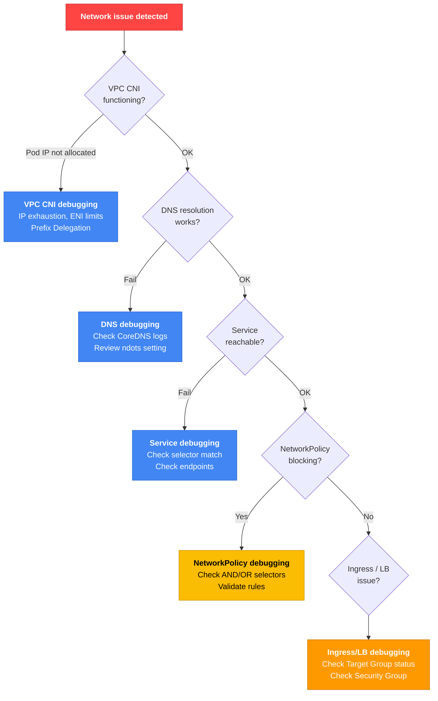

# Networking Debugging

## Networking Debugging Workflow



## VPC CNI Debugging

### Basic Checks

```bash
# Check VPC CNI Pod status
kubectl get pods -n kube-system -l k8s-app=aws-node

# Check VPC CNI logs
kubectl logs -n kube-system -l k8s-app=aws-node --tail=50

# Check current VPC CNI version
kubectl describe daemonset aws-node -n kube-system | grep Image
```

### Resolving IP Exhaustion

```bash
# Check available IPs by subnet
aws ec2 describe-subnets --subnet-ids <subnet-id> \
  --query 'Subnets[].{ID:SubnetId,AZ:AvailabilityZone,Available:AvailableIpAddressCount}'

# Enable Prefix Delegation (16x IP capacity)
kubectl set env daemonset aws-node -n kube-system ENABLE_PREFIX_DELEGATION=true

# Confirm Prefix Delegation is enabled
kubectl get daemonset aws-node -n kube-system -o yaml | grep ENABLE_PREFIX_DELEGATION
```

:::tip What Is Prefix Delegation?
In the default mode, each ENI receives individual secondary IPs. Enabling Prefix Delegation assigns a /28 prefix (16 IPs) per ENI, allowing 16x more Pods on the same ENI.

**Example**: c5.xlarge instance
- Default mode: up to 58 Pods (4 ENIs × 15 IPs - 1)
- Prefix Delegation: up to 110 Pods (4 ENIs × 16 prefixes × 16 IPs)
:::

### ENI and IP Limits

Each EC2 instance type limits the number of attachable ENIs and IPs per ENI.

```bash
# ENI limits by instance type
aws ec2 describe-instance-types \
  --instance-types c5.xlarge c5.2xlarge m5.xlarge \
  --query 'InstanceTypes[].[InstanceType,NetworkInfo.MaximumNetworkInterfaces,NetworkInfo.Ipv4AddressesPerInterface]' \
  --output table

# Current ENI utilization on nodes
kubectl get nodes -o json | jq -r '.items[] | {
  name: .metadata.name,
  allocatable_pods: .status.allocatable.pods,
  max_pods: .status.capacity.pods
}'
```

## DNS Troubleshooting

### CoreDNS Basic Checks

```bash
# CoreDNS Pod status
kubectl get pods -n kube-system -l k8s-app=kube-dns

# CoreDNS logs
kubectl logs -n kube-system -l k8s-app=kube-dns --tail=50

# DNS resolution test
kubectl run -it --rm debug --image=busybox --restart=Never -- nslookup kubernetes.default

# CoreDNS ConfigMap
kubectl get configmap coredns -n kube-system -o yaml

# Restart CoreDNS
kubectl rollout restart deployment coredns -n kube-system
```

### CoreDNS OOM Issues

When CoreDNS is OOMKilled, DNS resolution fails across the cluster.

```bash
# Check CoreDNS memory usage
kubectl top pods -n kube-system -l k8s-app=kube-dns

# Increase CoreDNS memory limits
kubectl set resources deployment coredns -n kube-system \
  --limits=memory=300Mi --requests=memory=100Mi
```

:::warning CoreDNS OOM Causes
- Query surge in large clusters (5,000+ Pods)
- Repeated queries due to missing DNS caching
- Malicious DNS amplification attacks

**Resolution**: Increase memory + use NodeLocal DNSCache
:::

### ndots:5 Issue and Resolutions

Kubernetes' default `resolv.conf` setting `ndots:5` causes unnecessary DNS queries when reaching external domains.

```bash
# Check resolv.conf inside a Pod
kubectl exec <pod-name> -- cat /etc/resolv.conf
# nameserver 10.100.0.10
# search default.svc.cluster.local svc.cluster.local cluster.local
# options ndots:5

# Problem: resolving api.example.com triggers 5 queries in sequence
# 1. api.example.com.default.svc.cluster.local (fail)
# 2. api.example.com.svc.cluster.local (fail)
# 3. api.example.com.cluster.local (fail)
# 4. api.example.com.ec2.internal (fail)
# 5. api.example.com (succeed)
```

#### Resolution 1: Adjust ndots Value

```yaml
apiVersion: v1
kind: Pod
metadata:
  name: app
spec:
  dnsConfig:
    options:
    - name: ndots
      value: "2"  # Reduce from default 5 to 2
  containers:
  - name: app
    image: my-app:latest
```

#### Resolution 2: Add Trailing Dot to FQDN

```bash
# When calling external domains from application code
curl https://api.example.com.  # ← trailing dot forces immediate external DNS resolution
```

#### Resolution 3: Use NodeLocal DNSCache

NodeLocal DNSCache provides per-node DNS caching, reducing load on CoreDNS.

```bash
# Install NodeLocal DNSCache
kubectl apply -f https://raw.githubusercontent.com/kubernetes/kubernetes/master/cluster/addons/dns/nodelocaldns/nodelocaldns.yaml

# Verify installation
kubectl get pods -n kube-system -l k8s-app=node-local-dns
```

:::info VPC DNS Throttling Limits
The VPC DNS resolver has a limit of **1,024 packets/sec per ENI**. For large clusters, NodeLocal DNSCache is essential to reduce VPC DNS calls.
:::

## Service Debugging

### Service Connectivity Failure Patterns

#### Pattern 1: Selector Label Mismatch

```bash
# Check Service status
kubectl get svc <service-name>

# Check Endpoints (verify backend Pods are connected)
kubectl get endpoints <service-name>
# NAME         ENDPOINTS
# web-service  <none>  ← issue: Endpoints is empty

# Check Service selector
kubectl get svc <service-name> -o jsonpath='{.spec.selector}'
# {"app":"web","version":"v1"}

# Check Pods matching the selector
kubectl get pods -l app=web,version=v1
# No resources found  ← issue: no matching Pod

# Check actual Pod labels
kubectl get pods --show-labels
# NAME        READY   STATUS    LABELS
# web-abc     1/1     Running   app=web,ver=v1  ← label is typo "ver"
```

**Resolution**: Align Service selector with Pod labels

```bash
# Option 1: modify Service selector
kubectl patch svc web-service -p '{"spec":{"selector":{"app":"web","ver":"v1"}}}'

# Option 2: modify Pod label (update Deployment template and redeploy)
kubectl set labels pod web-abc version=v1 --overwrite
```

#### Pattern 2: port vs targetPort Mismatch

```yaml
# Service configuration
apiVersion: v1
kind: Service
metadata:
  name: web-service
spec:
  selector:
    app: web
  ports:
  - port: 80          # ← port exposed by Service
    targetPort: 8080  # ← port Pod listens on (wrong value causes connectivity failure)
```

```bash
# Check the port the Pod actually listens on
kubectl get pod <pod-name> -o jsonpath='{.spec.containers[*].ports[*].containerPort}'
# 9090  ← actual is 9090 but Service is set to 8080

# Fix Service targetPort
kubectl patch svc web-service -p '{"spec":{"ports":[{"port":80,"targetPort":9090}]}}'
```

#### Pattern 3: Endpoints Check

```bash
# Endpoint details
kubectl describe endpoints <service-name>

# If Endpoints is empty:
# 1. Check Service selector vs Pod label alignment
# 2. Ensure Pods are Ready (NotReady Pods are excluded from Endpoints)
kubectl get pods -l app=web -o wide
```

### Common Service Issues

| Symptom | Check | Resolution |
|------|----------|------|
| Endpoints empty | Service selector vs Pod label mismatch | Fix label |
| ClusterIP unreachable | Is kube-proxy running? | `kubectl logs -n kube-system -l k8s-app=kube-proxy` |
| NodePort unreachable | Is 30000-32767 allowed in Security Group? | Add SG inbound rule |
| LoadBalancer Pending | Is AWS Load Balancer Controller installed? | Install controller and verify IAM permissions |

## NetworkPolicy Debugging

### AND vs OR Selector Confusion

The most common NetworkPolicy mistake is confusing **AND vs OR selectors**.

```yaml
# AND logic (two selectors inside the same from item)
# Allows only "Pods in the alice namespace with role=client"
apiVersion: networking.k8s.io/v1
kind: NetworkPolicy
metadata:
  name: allow-alice-client-only
spec:
  podSelector:
    matchLabels:
      app: web
  ingress:
  - from:
    - namespaceSelector:
        matchLabels:
          user: alice
      podSelector:
        matchLabels:
          role: client
```

```yaml
# OR logic (separated into multiple from items)
# Allows "all Pods in alice namespace" OR "Pods with role=client across all namespaces"
apiVersion: networking.k8s.io/v1
kind: NetworkPolicy
metadata:
  name: allow-alice-or-client
spec:
  podSelector:
    matchLabels:
      app: web
  ingress:
  - from:
    - namespaceSelector:
        matchLabels:
          user: alice
    - podSelector:
        matchLabels:
          role: client
```

:::danger AND vs OR Caution
The two YAMLs above differ by one indentation level and result in completely different security policies. In AND logic, `namespaceSelector` and `podSelector` are inside the **same `- from` item**; in OR logic, they are **separate `- from` items**.
:::

### Debugging NetworkPolicy Blocking

```bash
# List all NetworkPolicies
kubectl get networkpolicy -n <namespace>

# NetworkPolicies applied to a specific Pod
kubectl describe pod <pod-name> -n <namespace>

# Test whether a NetworkPolicy blocks traffic
kubectl run -it --rm debug --image=nicolaka/netshoot --restart=Never -- bash
# Inside:
curl -v http://<target-service>.<namespace>.svc.cluster.local
```

#### Missing Allow Rules After Default Deny

```yaml
# Default Deny (blocks all ingress)
apiVersion: networking.k8s.io/v1
kind: NetworkPolicy
metadata:
  name: default-deny-ingress
  namespace: production
spec:
  podSelector: {}
  policyTypes:
  - Ingress
  # No ingress rules → all ingress blocked
```

```yaml
# Add Allow rule (permit specific traffic)
apiVersion: networking.k8s.io/v1
kind: NetworkPolicy
metadata:
  name: allow-from-frontend
  namespace: production
spec:
  podSelector:
    matchLabels:
      app: backend
  ingress:
  - from:
    - podSelector:
        matchLabels:
          app: frontend
    ports:
    - protocol: TCP
      port: 8080
```

:::warning Default Deny Requires Care
Applying a Default Deny NetworkPolicy blocks all traffic not explicitly allowed. Before applying to production, write all necessary Allow rules and validate in a test environment.
:::

## Using netshoot

[netshoot](https://github.com/nicolaka/netshoot) is a container image that includes all tools needed for network debugging.

```bash
# Add an ephemeral container to an existing Pod
kubectl debug <pod-name> -it --image=nicolaka/netshoot

# Run a standalone debug Pod
kubectl run tmp-shell --rm -i --tty --image nicolaka/netshoot

# Tools available inside:
# - curl, wget: HTTP tests
# - dig, nslookup: DNS tests
# - tcpdump: packet capture
# - iperf3: bandwidth tests
# - ss, netstat: socket states
# - traceroute, mtr: path tracing
```

### Real-world Scenario: Pod-to-Pod Communication Check

```bash
# From netshoot Pod, test connection to another Service
kubectl run tmp-shell --rm -i --tty --image nicolaka/netshoot -- bash

# DNS resolution
dig <service-name>.<namespace>.svc.cluster.local

# TCP connection test
curl -v http://<service-name>.<namespace>.svc.cluster.local:<port>/health

# Packet capture (traffic to a specific Pod IP)
tcpdump -i any host <pod-ip> -n

# Path tracing
traceroute <pod-ip>

# Socket states
ss -tunap
```

## Ingress / LoadBalancer Debugging

### AWS Load Balancer Controller Issues

```bash
# Controller status
kubectl get pods -n kube-system -l app.kubernetes.io/name=aws-load-balancer-controller

# Controller logs
kubectl logs -n kube-system -l app.kubernetes.io/name=aws-load-balancer-controller --tail=100

# Ingress status
kubectl describe ingress <ingress-name>
```

### Target Group Health Check Failures

For AWS Load Balancer Target Group health check failures, see the [Health Check Mismatch doc](./health-check-mismatch.md).

**Common causes**:
- Health Check path differs from the Pod's actual endpoint
- Health Check port differs from the Pod's containerPort
- Security Group does not allow the Health Check port
- readinessProbe failure keeps the Pod NotReady

```bash
# Check Target Group health
aws elbv2 describe-target-health \
  --target-group-arn <tg-arn>

# Check Security Group inbound rules
aws ec2 describe-security-groups \
  --group-ids <sg-id> \
  --query 'SecurityGroups[].IpPermissions'
```

## Networking Issue Checklist

### Layer 3/4 (Basic Connectivity)

- [ ] Does the Pod have an IP? (`kubectl get pod -o wide`)
- [ ] Does the subnet have available IPs?
- [ ] Does the Security Group allow required ports?
- [ ] Is a NetworkPolicy blocking traffic?

### Layer 7 (Application)

- [ ] Do Service selector and Pod label match?
- [ ] Do Service port and Pod containerPort match?
- [ ] Does DNS resolution work? (`nslookup <service-name>`)
- [ ] Is the Pod's readinessProbe succeeding?
- [ ] Is the Ingress Health Check path correct?

### DNS-Specific

- [ ] Are CoreDNS Pods Running?
- [ ] Has CoreDNS been OOMKilled?
- [ ] Is the ndots setting appropriate? (for many external domain calls, ndots:2 is recommended)
- [ ] Is NodeLocal DNSCache installed? (large clusters)

---

## Related Documents

- [Workload Debugging](./workload.md) - Pod state-based troubleshooting
- [Storage Debugging](./storage.md) - PVC mount failures
- [Health Check Mismatch](./health-check-mismatch.md) - ALB/NLB Target Group Health Check issues
