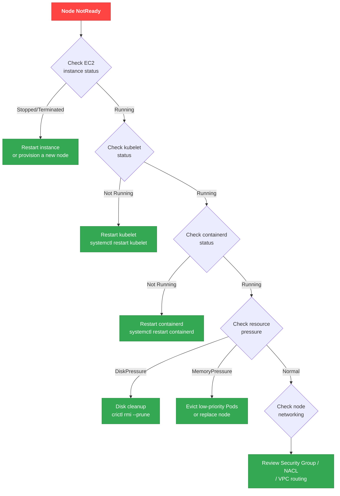
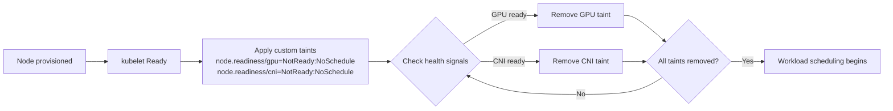

import { NodeGroupErrorTable } from '@site/src/components/EksDebugTables';

# Node-Level Debugging

## Node Join Failure Debugging

Nodes can fail to join a cluster for a variety of reasons. The following are the eight most common causes and how to diagnose them.

**Common causes of node join failures:**

1. **Node IAM Role not registered in aws-auth ConfigMap** (or Access Entry not created) — node cannot authenticate to the API server
2. **Bootstrap script ClusterName does not match the actual cluster name** — kubelet attempts to connect to the wrong cluster
3. **Node Security Group does not allow communication with the control plane** — TCP 443 (API server) and TCP 10250 (kubelet) are required
4. **Auto-assign public IP disabled on public subnets** — cannot access the internet on clusters with only a public endpoint enabled
5. **VPC DNS settings issue** — `enableDnsHostnames` or `enableDnsSupport` disabled
6. **STS regional endpoint disabled** — IAM authentication fails due to failed STS calls
7. **Instance profile ARN registered in aws-auth instead of the node IAM Role ARN** — aws-auth must contain only the Role ARN
8. **Missing `eks:kubernetes.io/cluster-name` tag** (self-managed nodes) — EKS does not recognize the node as cluster-owned

**Diagnostic commands:**

```bash
# Check node bootstrap logs (after SSM session)
sudo journalctl -u kubelet --no-pager | tail -50
sudo cat /var/log/cloud-init-output.log | tail -50

# Check Security Group rules
aws ec2 describe-security-groups --group-ids $CLUSTER_SG \
  --query 'SecurityGroups[].IpPermissions' --output table

# Check VPC DNS settings
aws ec2 describe-vpc-attribute --vpc-id $VPC_ID --attribute enableDnsHostnames
aws ec2 describe-vpc-attribute --vpc-id $VPC_ID --attribute enableDnsSupport
```

:::warning ARN to register in aws-auth
The aws-auth ConfigMap must contain the **IAM Role ARN** (`arn:aws:iam::ACCOUNT:role/...`), not the instance profile ARN (`arn:aws:iam::ACCOUNT:instance-profile/...`). This mistake is very common and a major cause of node join failures.
:::

## Node NotReady Decision Tree



## kubelet / containerd Debugging

```bash
# Connect to node via SSM
aws ssm start-session --target <instance-id>

# Check kubelet status
systemctl status kubelet
journalctl -u kubelet -n 100 -f

# Check containerd status
systemctl status containerd

# Check container runtime status
crictl pods
crictl ps -a

# Check logs for a specific container
crictl logs <container-id>
```

:::info SSM Access Prerequisites
SSM access requires the node IAM Role to have the `AmazonSSMManagedInstanceCore` policy attached. This is included by default in EKS Managed Node Groups; when using a custom AMI, verify that the SSM Agent is installed.
:::

## Diagnosing and Resolving Resource Pressure

```bash
# Check node status
kubectl describe node <node-name>
```

| Condition | Threshold | Diagnostic Command | Resolution |
|-----------|--------|-----------|----------|
| **DiskPressure** | Available disk < 10% | `df -h` (after SSM) | `crictl rmi --prune` to remove unused images; `crictl rm` to delete stopped containers |
| **MemoryPressure** | Available memory < 100Mi | `free -m` (after SSM) | Evict low-priority Pods, adjust memory requests/limits, replace the node |
| **PIDPressure** | Available PIDs < 5% | `ps aux \| wc -l` (after SSM) | Increase `kernel.pid_max`; identify and restart containers leaking PIDs |

## Karpenter Node Provisioning Debugging

```bash
# Check Karpenter controller logs
kubectl logs -f deployment/karpenter -n kube-system

# Check NodePool status
kubectl get nodepool
kubectl describe nodepool <nodepool-name>

# Check EC2NodeClass
kubectl get ec2nodeclass
kubectl describe ec2nodeclass <nodeclass-name>

# When provisioning fails, check:
# 1. Whether NodePool limits are exceeded
# 2. Whether EC2NodeClass subnet/Security Group selectors are correct
# 3. Whether Service Quotas for the instance types are sufficient
# 4. Whether Pod nodeSelector/affinity matches NodePool requirements
```

:::warning Karpenter v1 API Changes
Karpenter v1.2+ renamed `Provisioner` → `NodePool` and `AWSNodeTemplate` → `EC2NodeClass`. Migration is required when coming from v0.x configurations. Also update the API group to `karpenter.sh/v1`.
:::

## Managed Node Group Error Codes

Check Managed Node Group health status to diagnose provisioning and operational issues.

```bash
# Check node group health
aws eks describe-nodegroup --cluster-name $CLUSTER --nodegroup-name $NODEGROUP \
  --query 'nodegroup.health' --output json
```

<NodeGroupErrorTable />

**AccessDenied Recovery — Check the eks:node-manager ClusterRole:**

`AccessDenied` errors typically occur when the `eks:node-manager` ClusterRole or ClusterRoleBinding is deleted or modified.

```bash
# Check eks:node-manager ClusterRole
kubectl get clusterrole eks:node-manager
kubectl get clusterrolebinding eks:node-manager
```

:::danger AccessDenied Recovery
If the `eks:node-manager` ClusterRole/ClusterRoleBinding is missing, EKS **does not restore it automatically**. Recover it using one of the following methods:

**Method 1: Manual re-creation (recommended)**

```yaml
# eks-node-manager-role.yaml
apiVersion: rbac.authorization.k8s.io/v1
kind: ClusterRole
metadata:
  name: eks:node-manager
rules:
  - apiGroups: ['']
    resources: [pods]
    verbs: [get, list, watch, delete]
  - apiGroups: ['']
    resources: [nodes]
    verbs: [get, list, watch, patch]
  - apiGroups: ['']
    resources: [pods/eviction]
    verbs: [create]
---
apiVersion: rbac.authorization.k8s.io/v1
kind: ClusterRoleBinding
metadata:
  name: eks:node-manager
roleRef:
  apiGroup: rbac.authorization.k8s.io
  kind: ClusterRole
  name: eks:node-manager
subjects:
  - apiGroup: rbac.authorization.k8s.io
    kind: User
    name: eks:node-manager
```

```bash
kubectl auth reconcile -f eks-node-manager-role.yaml
```

**Method 2: Recreate the node group**

```bash
# Creating a new node group also creates the RBAC resources
eksctl create nodegroup --cluster=<cluster-name> --name=<new-nodegroup-name>
```

**Method 3: Upgrade the node group**

```bash
# RBAC reconciliation may be triggered during upgrade
eksctl upgrade nodegroup --cluster=<cluster-name> --name=<nodegroup-name>
```

> **Note**: The Kubernetes API server auto-reconciles default system ClusterRoles (`system:*`), but EKS-specific ClusterRoles (`eks:*`) are not auto-restored. Back up RBAC resources before deleting them.
:::

## Node Bootstrap Debugging with Node Readiness Controller

:::info New Kubernetes Feature (February 2026)
The [Node Readiness Controller](https://github.com/kubernetes-sigs/node-readiness-controller) is a new project announced on the Kubernetes official blog that declaratively addresses early scheduling problems during node bootstrap.
:::

### Problem Context

In traditional Kubernetes, workloads are scheduled immediately when a node reaches `Ready` state. However, many times the node is not actually fully ready:

| Incomplete Component | Symptoms | Impact |
|---|---|---|
| GPU driver/firmware loading | `nvidia-smi` failure, Pod `CrashLoopBackOff` | GPU workload failures |
| CNI plugin initializing | Pod IP not allocated, `NetworkNotReady` | Networking unavailable |
| CSI driver not registered | PVC `Pending`, volume mount failures | Storage unavailable |
| Security agent not installed | Compliance violation | Security policy not met |

### How Node Readiness Controller Works

The Node Readiness Controller **declaratively manages custom taints**, deferring workload scheduling until all infrastructure requirements are satisfied:



### Debugging Checklist

If a node is `Ready` but Pods are not scheduling:

```bash
# 1. Check custom readiness taints on the node
kubectl get node <node-name> -o jsonpath='{.spec.taints}' | jq .

# 2. Filter node.readiness-related taints
kubectl get nodes -o json | jq '
  .items[] |
  select(.spec.taints // [] | any(.key | startswith("node.readiness"))) |
  {name: .metadata.name, taints: [.spec.taints[] | select(.key | startswith("node.readiness"))]}
'

# 3. Check mismatch between Pod tolerations and node taints
kubectl describe pod <pending-pod> | grep -A 20 "Events:"
```

### Related Feature: Pod Scheduling Readiness (K8s 1.30 GA)

Using `schedulingGates`, scheduling readiness can also be controlled on the Pod side:

```yaml
apiVersion: v1
kind: Pod
metadata:
  name: gated-pod
spec:
  schedulingGates:
    - name: "example.com/gpu-validation"  # Pod waits until this gate is removed
  containers:
    - name: app
      image: app:latest
```

```bash
# Check Pods with schedulingGates
kubectl get pods -o json | jq '
  .items[] |
  select(.spec.schedulingGates != null and (.spec.schedulingGates | length > 0)) |
  {name: .metadata.name, namespace: .metadata.namespace, gates: .spec.schedulingGates}
'
```

### Related Feature: Pod Readiness Gates (AWS LB Controller)

The AWS Load Balancer Controller uses the `elbv2.k8s.aws/pod-readiness-gate-inject` annotation to delay a Pod's transition to `Ready` until ALB/NLB target registration is complete:

```bash
# Check Readiness Gate status
kubectl get pod <pod-name> -o jsonpath='{.status.conditions}' | jq '
  [.[] | select(.type | contains("target-health"))]
'

# Check whether readiness gate injection is enabled on a namespace
kubectl get namespace <ns> -o jsonpath='{.metadata.labels.elbv2\.k8s\.aws/pod-readiness-gate-inject}'
```

:::tip Comparing Readiness Features

| Feature | Target | Control | Status |
|------|-----------|-----------|------|
| **Node Readiness Controller** | Node | Taint-based | New (2026.02) |
| **Pod Scheduling Readiness** | Pod | schedulingGates | GA (K8s 1.30) |
| **Pod Readiness Gates** | Pod | Readiness Conditions | GA (AWS LB Controller) |
:::

## Using eks-node-viewer

[eks-node-viewer](https://github.com/awslabs/eks-node-viewer) is a terminal tool that visualizes node resource usage in real time.

```bash
# Default usage (CPU view)
eks-node-viewer

# View CPU and memory together
eks-node-viewer --resources cpu,memory

# View only a specific NodePool
eks-node-viewer --node-selector karpenter.sh/nodepool=<nodepool-name>
```

## Related Documents

- [EKS Debugging Guide (Main)](./index.md) - Full debugging guide
- [Control Plane Debugging](./control-plane.md) - Control plane issue diagnosis
- [Workload Debugging](./workload.md) - Pod and workload issue diagnosis
- [Networking Debugging](./networking.md) - Networking issue diagnosis
