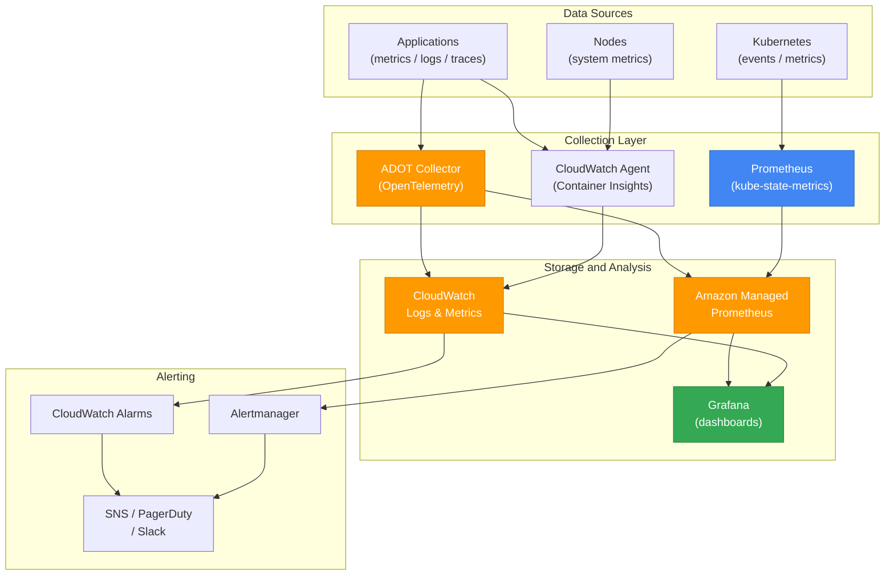
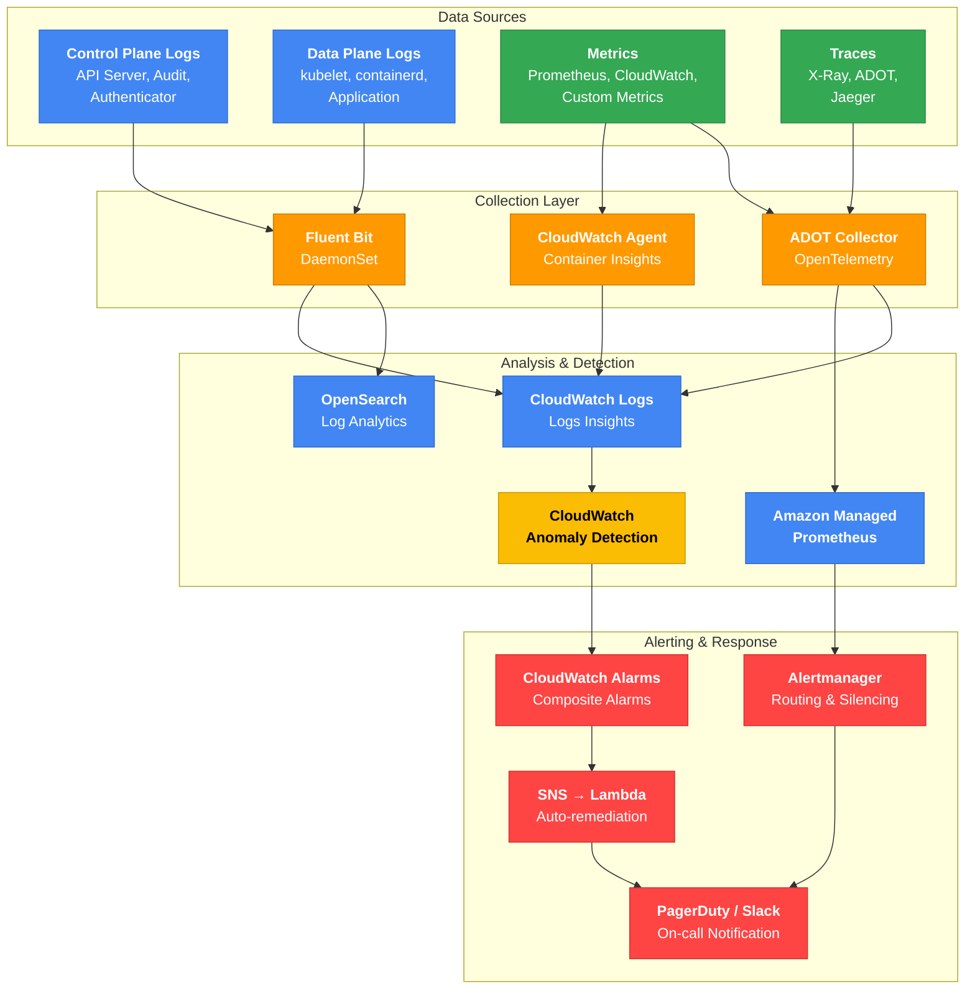

import { IncidentEscalationTable, ZonalShiftImpactTable } from '@site/src/components/EksDebugTables';

# Observability and Monitoring

## Observability Stack Architecture



## Container Insights Setup

```bash
# Install Container Insights Add-on
aws eks create-addon \
  --cluster-name <cluster-name> \
  --addon-name amazon-cloudwatch-observability

# Verify installation
kubectl get pods -n amazon-cloudwatch
```

## Metric Debugging: PromQL Queries

### CPU Throttling Detection

```promql
sum(rate(container_cpu_cfs_throttled_periods_total{namespace="production"}[5m]))
/ sum(rate(container_cpu_cfs_periods_total{namespace="production"}[5m])) > 0.25
```

:::info CPU Throttling Threshold
Throttling above 25% causes performance degradation. Consider removing or increasing CPU limits. Many organizations adopt a strategy of setting only CPU requests without limits.
:::

### OOMKilled Detection

```promql
kube_pod_container_status_last_terminated_reason{reason="OOMKilled"} > 0
```

### Pod Restart Rate

```promql
sum(rate(kube_pod_container_status_restarts_total[15m])) by (namespace, pod) > 0
```

### Node CPU Utilization (Warn Above 80%)

```promql
100 - (avg by(instance)(rate(node_cpu_seconds_total{mode="idle"}[5m])) * 100) > 80
```

### Node Memory Utilization (Warn Above 85%)

```promql
(1 - node_memory_MemAvailable_bytes / node_memory_MemTotal_bytes) * 100 > 85
```

## Log Debugging: CloudWatch Logs Insights

### Error Log Analysis

```sql
fields @timestamp, @message, kubernetes.container_name, kubernetes.pod_name
| filter @message like /ERROR|FATAL|Exception/
| sort @timestamp desc
| limit 50
```

### Latency Analysis

```sql
fields @timestamp, @message
| filter @message like /latency|duration|elapsed/
| parse @message /latency[=:]\s*(?<latency_ms>\d+)/
| stats avg(latency_ms), max(latency_ms), p99(latency_ms) by bin(5m)
```

### Error Pattern Analysis for a Specific Pod

```sql
fields @timestamp, @message
| filter kubernetes.pod_name like /api-server/
| filter @message like /error|Error|ERROR/
| stats count() by bin(1m)
| sort bin asc
```

### OOMKilled Event Tracking

```sql
fields @timestamp, @message
| filter @message like /OOMKilled|oom-kill|Out of memory/
| sort @timestamp desc
| limit 20
```

### Container Restart Events

```sql
fields @timestamp, @message, kubernetes.pod_name
| filter @message like /Back-off restarting failed container|CrashLoopBackOff/
| stats count() by kubernetes.pod_name
| sort count desc
```

## Alert Rules: PrometheusRule Example

```yaml
apiVersion: monitoring.coreos.com/v1
kind: PrometheusRule
metadata:
  name: kubernetes-alerts
spec:
  groups:
  - name: kubernetes-pods
    rules:
    - alert: PodCrashLooping
      expr: rate(kube_pod_container_status_restarts_total[15m]) * 60 * 5 > 0
      for: 1h
      labels:
        severity: warning
      annotations:
        summary: "Pod {{ $labels.namespace }}/{{ $labels.pod }} is crash looping"
        description: "Pod {{ $labels.pod }} has been restarting over the last 15 minutes."

    - alert: PodOOMKilled
      expr: kube_pod_container_status_last_terminated_reason{reason="OOMKilled"} > 0
      for: 0m
      labels:
        severity: critical
      annotations:
        summary: "Pod {{ $labels.namespace }}/{{ $labels.pod }} OOMKilled"
        description: "Pod {{ $labels.pod }} was terminated due to memory exhaustion. Adjust memory limits."

  - name: kubernetes-nodes
    rules:
    - alert: NodeNotReady
      expr: kube_node_status_condition{condition="Ready",status="true"} == 0
      for: 5m
      labels:
        severity: critical
      annotations:
        summary: "Node {{ $labels.node }} is NotReady"

    - alert: NodeHighCPU
      expr: 100 - (avg by(instance)(rate(node_cpu_seconds_total{mode="idle"}[5m])) * 100) > 80
      for: 10m
      labels:
        severity: warning
      annotations:
        summary: "Node {{ $labels.instance }} CPU usage above 80%"

    - alert: NodeHighMemory
      expr: (1 - node_memory_MemAvailable_bytes / node_memory_MemTotal_bytes) * 100 > 85
      for: 10m
      labels:
        severity: warning
      annotations:
        summary: "Node {{ $labels.instance }} memory usage above 85%"
```

## ADOT (AWS Distro for OpenTelemetry) Debugging

ADOT is the AWS-managed distribution of OpenTelemetry that collects traces, metrics, and logs and forwards them to various AWS services (X-Ray, CloudWatch, AMP, etc.).

```bash
# Check ADOT Add-on status
aws eks describe-addon --cluster-name $CLUSTER \
  --addon-name adot --query 'addon.{status:status,version:addonVersion}'

# Check ADOT Collector Pods
kubectl get pods -n opentelemetry-operator-system
kubectl logs -n opentelemetry-operator-system -l app.kubernetes.io/name=opentelemetry-operator --tail=50

# Check OpenTelemetryCollector CR
kubectl get otelcol -A
kubectl describe otelcol -n $NAMESPACE $COLLECTOR_NAME
```

### Common ADOT Issues

| Symptom | Cause | Resolution |
|------|------|----------|
| Operator Pod `CrashLoopBackOff` | CertManager not installed | ADOT operator requires CertManager for webhook certificates. `kubectl apply -f https://github.com/cert-manager/cert-manager/releases/download/v1.13.0/cert-manager.yaml` |
| Collector fails to send to AMP | Insufficient IAM permissions | Add `aps:RemoteWrite` to IRSA/Pod Identity |
| X-Ray traces not received | Insufficient IAM permissions | Add `xray:PutTraceSegments`, `xray:PutTelemetryRecords` to IRSA/Pod Identity |
| CloudWatch metrics not received | Insufficient IAM permissions | Add `cloudwatch:PutMetricData` to IRSA/Pod Identity |
| Collector Pod `OOMKilled` | Insufficient resources | Increase Collector `resources.limits.memory` when collecting high volumes of traces/metrics |

:::warning ADOT Permission Separation
AMP remote write, X-Ray, and CloudWatch each require different IAM permissions. When the Collector sends data to multiple backends, ensure the IAM Role includes every required permission.
:::

---

## Incident Detection Mechanisms and Logging Architecture

### Incident Detection Strategy Overview

To detect incidents quickly in EKS environments, a 4-layer pipeline of **data source → collection → analysis & detection → alerting & response** must be systematically configured. The layers must connect cohesively to minimize MTTD (Mean Time To Detect).



#### Four-Layer Architecture

| Layer | Role | Core Components |
|---|---|---|
| **Data Sources** | Generate all observable signals in the cluster | Control Plane Logs, Data Plane Logs, Metrics, Traces |
| **Collection Layer** | Standardize data from various sources and ship centrally | Fluent Bit, CloudWatch Agent, ADOT Collector |
| **Analysis & Detection** | Analyze collected data and detect anomalies | CloudWatch Logs Insights, AMP, OpenSearch, Anomaly Detection |
| **Alerting & Response** | Notify appropriate channels about detected incidents and run auto-remediation | CloudWatch Alarms, Alertmanager, SNS → Lambda, PagerDuty/Slack |

### Recommended Logging Architectures

#### Option A: AWS-Native Stack (Small to Medium Clusters)

An architecture centered on AWS managed services to minimize operational overhead.

| Layer | Component | Purpose |
|---|---|---|
| Collection | Fluent Bit (DaemonSet) | Node/container log collection |
| Transport | CloudWatch Logs | Central log store |
| Analysis | CloudWatch Logs Insights | Query-based analysis |
| Detection | CloudWatch Anomaly Detection | ML-based anomaly detection |
| Alerting | CloudWatch Alarms → SNS | Threshold/anomaly-based alerts |

**Fluent Bit DaemonSet deployment example:**

```yaml
apiVersion: apps/v1
kind: DaemonSet
metadata:
  name: fluent-bit
  namespace: amazon-cloudwatch
  labels:
    app.kubernetes.io/name: fluent-bit
spec:
  selector:
    matchLabels:
      app.kubernetes.io/name: fluent-bit
  template:
    metadata:
      labels:
        app.kubernetes.io/name: fluent-bit
    spec:
      serviceAccountName: fluent-bit
      containers:
        - name: fluent-bit
          image: public.ecr.aws/aws-observability/aws-for-fluent-bit:2.32.0
          resources:
            limits:
              memory: 200Mi
            requests:
              cpu: 100m
              memory: 100Mi
          volumeMounts:
            - name: varlog
              mountPath: /var/log
              readOnly: true
            - name: varlogpods
              mountPath: /var/log/pods
              readOnly: true
            - name: fluent-bit-config
              mountPath: /fluent-bit/etc/
      volumes:
        - name: varlog
          hostPath:
            path: /var/log
        - name: varlogpods
          hostPath:
            path: /var/log/pods
        - name: fluent-bit-config
          configMap:
            name: fluent-bit-config
```

:::tip Fluent Bit vs Fluentd
Fluent Bit uses more than 10× less memory than Fluentd (~10MB vs ~100MB). Deploying Fluent Bit as a DaemonSet is the standard pattern in EKS. The `amazon-cloudwatch-observability` Add-on installs Fluent Bit automatically.
:::

#### Option B: Open-Source-Based Stack (Large / Multi-Cluster)

An architecture combining open-source tools with AWS managed services for scalability and flexibility at scale.

| Layer | Component | Purpose |
|---|---|---|
| Collection | Fluent Bit + ADOT Collector | Unified collection of logs/metrics/traces |
| Metrics | Amazon Managed Prometheus (AMP) | Time-series metrics store |
| Logs | Amazon OpenSearch Service | Large-scale log analysis |
| Traces | AWS X-Ray / Jaeger | Distributed tracing |
| Visualization | Amazon Managed Grafana | Unified dashboards |
| Alerting | Alertmanager + PagerDuty/Slack | Advanced routing, grouping, silencing |

:::info Multi-Cluster Architecture
In multi-cluster environments, a hub-and-spoke pattern where each cluster's ADOT Collector sends metrics to a central AMP workspace is recommended. Grafana can then monitor all clusters from a single dashboard.
:::

### Incident Detection Patterns

#### Pattern 1: Threshold-Based Detection

The simplest detection method. Alerts fire when a predefined threshold is exceeded.

```yaml
# PrometheusRule - threshold-based alert example
apiVersion: monitoring.coreos.com/v1
kind: PrometheusRule
metadata:
  name: eks-threshold-alerts
  namespace: monitoring
spec:
  groups:
    - name: eks-thresholds
      rules:
        - alert: HighPodRestartRate
          expr: increase(kube_pod_container_status_restarts_total[1h]) > 5
          for: 10m
          labels:
            severity: warning
          annotations:
            summary: "Pod {{ $labels.namespace }}/{{ $labels.pod }} restart count increasing"
            description: "{{ $value }} restarts occurred within the last hour"

        - alert: NodeMemoryPressure
          expr: (1 - node_memory_MemAvailable_bytes / node_memory_MemTotal_bytes) > 0.85
          for: 5m
          labels:
            severity: critical
          annotations:
            summary: "Node {{ $labels.instance }} memory utilization above 85%"

        - alert: PVCNearlyFull
          expr: kubelet_volume_stats_used_bytes / kubelet_volume_stats_capacity_bytes > 0.9
          for: 15m
          labels:
            severity: warning
          annotations:
            summary: "PVC {{ $labels.persistentvolumeclaim }} utilization above 90%"
```

#### Pattern 2: Anomaly Detection

ML-based approaches learn normal patterns and detect deviations. Useful when thresholds are hard to define in advance.

```bash
# Configure CloudWatch Anomaly Detection
aws cloudwatch put-anomaly-detector \
  --single-metric-anomaly-detector '{
    "Namespace": "ContainerInsights",
    "MetricName": "pod_cpu_utilization",
    "Dimensions": [
      {"Name": "ClusterName", "Value": "'$CLUSTER'"},
      {"Name": "Namespace", "Value": "production"}
    ],
    "Stat": "Average"
  }'

# Create alarm based on Anomaly Detection
aws cloudwatch put-metric-alarm \
  --alarm-name "eks-cpu-anomaly" \
  --alarm-description "Detect EKS CPU utilization anomalies" \
  --evaluation-periods 3 \
  --comparison-operator LessThanLowerOrGreaterThanUpperThreshold \
  --threshold-metric-id ad1 \
  --metrics '[
    {
      "Id": "m1",
      "MetricStat": {
        "Metric": {
          "Namespace": "ContainerInsights",
          "MetricName": "pod_cpu_utilization",
          "Dimensions": [
            {"Name": "ClusterName", "Value": "'$CLUSTER'"}
          ]
        },
        "Period": 300,
        "Stat": "Average"
      }
    },
    {
      "Id": "ad1",
      "Expression": "ANOMALY_DETECTION_BAND(m1, 2)"
    }
  ]' \
  --alarm-actions $SNS_TOPIC_ARN
```

:::warning Anomaly Detection Training Period
Anomaly Detection requires at least 2 weeks of training data. Use threshold-based alerts alongside it immediately after deploying new services.
:::

#### Pattern 3: Composite Alarms

Combine multiple individual alarms logically to reduce noise and detect real incidents accurately.

```bash
# Combine individual alarms with AND/OR
aws cloudwatch put-composite-alarm \
  --alarm-name "eks-service-degradation" \
  --alarm-rule 'ALARM("high-error-rate") AND (ALARM("high-latency") OR ALARM("pod-restart-spike"))' \
  --alarm-actions $SNS_TOPIC_ARN \
  --alarm-description "Service degradation: error rate increase + latency increase or Pod restart spike"
```

:::tip Composite Alarm Tips
Individual alarms generate many false positives. Composite alarms that combine multiple signals can reliably detect real incidents. Example: "error rate increase AND latency increase" indicates a service outage; "error rate increase AND Pod restarts" indicates an application crash.
:::

#### Pattern 4: Log-Based Metric Filters

Detect specific patterns in CloudWatch Logs, convert them to metrics, and set alerts.

```bash
# Convert OOMKilled events into metrics
aws logs put-metric-filter \
  --log-group-name "/aws/eks/$CLUSTER/cluster" \
  --filter-name "OOMKilledEvents" \
  --filter-pattern '{ $.reason = "OOMKilled" || $.reason = "OOMKilling" }' \
  --metric-transformations \
    metricName=OOMKilledCount,metricNamespace=EKS/Custom,metricValue=1,defaultValue=0

# Detect 403 Forbidden events (security threat)
aws logs put-metric-filter \
  --log-group-name "/aws/eks/$CLUSTER/cluster" \
  --filter-name "UnauthorizedAccess" \
  --filter-pattern '{ $.responseStatus.code = 403 }' \
  --metric-transformations \
    metricName=ForbiddenAccessCount,metricNamespace=EKS/Security,metricValue=1,defaultValue=0
```

### Incident Detection Maturity Model

Classify organizational detection capability into four levels to diagnose the current level and define a roadmap to the next.

| Level | Stage | Detection Method | Tools | Target MTTD |
|---|---|---|---|---|
| Level 1 | Basic | Manual monitoring + basic alarms | CloudWatch Alarms | < 30 min |
| Level 2 | Standard | Thresholds + log metric filters | CloudWatch + Prometheus | < 10 min |
| Level 3 | Advanced | Anomaly detection + Composite Alarms | Anomaly Detection + AMP | < 5 min |
| Level 4 | Automated | Auto-detection + auto-remediation | Lambda + EventBridge + FIS | < 1 min |

:::info MTTD (Mean Time To Detect)
Average time from incident occurrence to detection. The goal is to continuously reduce MTTD as an organization matures from Level 1 to Level 4. Choose the appropriate level based on the organization's SLOs.
:::

### Auto-Remediation Pattern

A pattern where EventBridge and Lambda run automatic remediation actions when a specific incident is detected.

```bash
# EventBridge rule: trigger Lambda on Pod OOMKilled detection
aws events put-rule \
  --name "eks-oom-auto-remediation" \
  --event-pattern '{
    "source": ["aws.cloudwatch"],
    "detail-type": ["CloudWatch Alarm State Change"],
    "detail": {
      "alarmName": ["eks-oom-killed-alarm"],
      "state": {"value": ["ALARM"]}
    }
  }'
```

:::danger Auto-Remediation Caution
Apply auto-remediation to production only after thorough testing. Incorrect auto-remediation logic can worsen an incident. Start by running in `DRY_RUN` mode to validate logic by receiving alerts only, then expand the automation scope gradually.
:::

### Recommended Alert Channel Matrix

Set appropriate alert channels and response SLAs by severity to prevent alert fatigue and focus on important incidents.

| Severity | Alert Channels | Response SLA | Examples |
|---|---|---|---|
| P1 (Critical) | PagerDuty + Phone Call | Within 15 min | Full service outage, risk of data loss |
| P2 (High) | Slack DM + PagerDuty | Within 30 min | Partial outage, severe performance degradation |
| P3 (Medium) | Slack channel | Within 4 hours | Increased Pod restarts, resource utilization warnings |
| P4 (Low) | Email / Jira ticket | Next business day | Disk usage increase, certificate nearing expiration |

:::warning Alert Fatigue
Too many alerts lead ops teams to ignore them (alert fatigue). Route P3/P4 alerts only to Slack channels and send only genuine incidents (P1/P2) to PagerDuty. Review alert rules periodically and remove false positives.
:::

---

## Related Documents

- [Workload Debugging](./workload.md) - Pod state-based troubleshooting
- [Networking Debugging](./networking.md) - Service and DNS issues
- [Storage Debugging](./storage.md) - PVC mount failures
