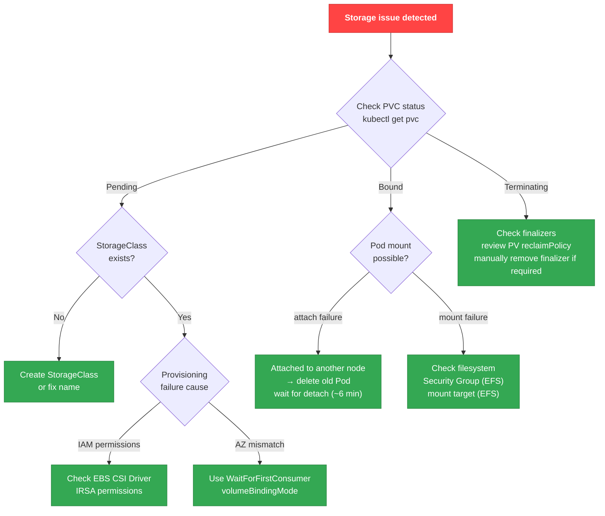

# Storage Debugging

## Storage Debugging Decision Tree



## EBS CSI Driver Debugging

### Basic Checks

```bash
# Check EBS CSI Driver Pod status
kubectl get pods -n kube-system -l app.kubernetes.io/name=aws-ebs-csi-driver

# Check Controller logs
kubectl logs -n kube-system -l app=ebs-csi-controller -c ebs-plugin --tail=100

# Check Node logs
kubectl logs -n kube-system -l app=ebs-csi-node -c ebs-plugin --tail=100

# Check IRSA ServiceAccount
kubectl describe sa ebs-csi-controller-sa -n kube-system
```

### EBS CSI Driver Error Patterns

| Error Message | Cause | Resolution |
|-------------|------|----------|
| `could not create volume` | Insufficient IAM permissions | Add `ec2:CreateVolume`, `ec2:AttachVolume`, etc. to the IRSA Role |
| `volume is already attached to another node` | Not yet detached from previous node | Clean up prior Pod/node, wait for EBS detach (~6 min) |
| `could not attach volume: already at max` | Instance EBS volume count limit exceeded | Use a larger instance type (Nitro instances: varies by type, up to 128) |
| `failed to provision volume with StorageClass` | StorageClass missing or misconfigured | Verify StorageClass name/parameters |

### Checking per-Instance EBS Volume Limits

```bash
# Maximum EBS volumes for an instance type
aws ec2 describe-instance-types \
  --instance-types c5.xlarge m5.2xlarge \
  --query 'InstanceTypes[].{Type:InstanceType,MaxEBS:EbsInfo.MaximumVolumeCount}' \
  --output table

# Current EBS volume usage on a node
aws ec2 describe-volumes \
  --filters "Name=attachment.instance-id,Values=<instance-id>" \
  --query 'Volumes[].{VolumeId:VolumeId,State:Attachments[0].State}' \
  --output table
```

### Recommended StorageClass Configuration

```yaml
apiVersion: storage.k8s.io/v1
kind: StorageClass
metadata:
  name: topology-aware-ebs
provisioner: ebs.csi.aws.com
parameters:
  type: gp3
  encrypted: "true"
  # gp3 performance parameters (optional)
  iops: "3000"        # default 3,000 IOPS
  throughput: "125"   # default 125 MB/s
volumeBindingMode: WaitForFirstConsumer
allowVolumeExpansion: true
reclaimPolicy: Delete
```

:::tip WaitForFirstConsumer
With `volumeBindingMode: WaitForFirstConsumer`, the PVC binds at Pod scheduling time. This **creates the volume in the AZ where the Pod is scheduled**, preventing AZ mismatch issues.
:::

## PVC Mount Failure Patterns

### Pattern 1: AZ Mismatch

EBS volumes exist in a single AZ, so scheduling a Pod to a node in a different AZ causes mount failures.

```bash
# Symptom: Pod stuck in ContainerCreating
kubectl describe pod <pod-name>
# Events:
#   Warning  FailedAttachVolume  AttachVolume.Attach failed : ... volume is in a different availability zone

# Check the PV's AZ
kubectl get pv <pv-name> -o jsonpath='{.metadata.labels.topology\.kubernetes\.io/zone}'

# Check the AZ of the node where the Pod was scheduled
kubectl get node <node-name> -o jsonpath='{.metadata.labels.topology\.kubernetes\.io/zone}'
```

**Resolution**: Use `volumeBindingMode: WaitForFirstConsumer`

```yaml
apiVersion: storage.k8s.io/v1
kind: StorageClass
metadata:
  name: ebs-sc
provisioner: ebs.csi.aws.com
parameters:
  type: gp3
volumeBindingMode: WaitForFirstConsumer  # ← prevents AZ mismatch
```

### Pattern 2: EBS Volume Limit Exceeded

Each instance type has a maximum number of attachable EBS volumes.

```bash
# Symptom: Pod stuck in ContainerCreating
kubectl describe pod <pod-name>
# Events:
#   Warning  FailedAttachVolume  AttachVolume.Attach failed : ... maximum number of attachments

# Check the number of attached volumes on a node
kubectl get node <node-name> -o json | jq '.status.volumesAttached | length'

# Check maximum volume count for the instance type
aws ec2 describe-instance-types \
  --instance-types <instance-type> \
  --query 'InstanceTypes[0].EbsInfo.MaximumVolumeCount'
```

**Resolution**:
- Use a larger instance type (e.g., c5.xlarge → c5.2xlarge)
- Move Pods without PVCs to other nodes
- Distribute EBS volumes across multiple nodes

### Pattern 3: ReadWriteOnce Constraint

EBS volumes support only `ReadWriteOnce` (RWO) and cannot be mounted on multiple nodes simultaneously.

```bash
# Symptom: the second Pod stuck in ContainerCreating
kubectl describe pod <pod-name-2>
# Events:
#   Warning  FailedAttachVolume  Multi-Attach error for volume ... Volume is already exclusively attached

# Check the PVC's accessModes
kubectl get pvc <pvc-name> -o jsonpath='{.spec.accessModes}'
# ["ReadWriteOnce"]
```

**Resolution**:
- Design a single Pod to use the PVC (StatefulSet recommended)
- For concurrent access from multiple Pods, use EFS (supports ReadWriteMany)

```yaml
# When ReadWriteMany is required, use EFS
apiVersion: v1
kind: PersistentVolumeClaim
metadata:
  name: shared-data
spec:
  accessModes:
    - ReadWriteMany  # only supported by EFS
  storageClassName: efs-sc
  resources:
    requests:
      storage: 10Gi
```

### Pattern 4: Volume Detach Delay

Even after the previous Pod is deleted, the EBS volume may not detach immediately, delaying the new Pod's start.

```bash
# Symptom: new Pod stuck in ContainerCreating for 6 minutes after prior Pod deletion
kubectl describe pod <pod-name>
# Events:
#   Warning  FailedAttachVolume  Volume is already attached to another node

# Check volume status in the AWS console
aws ec2 describe-volumes --volume-ids <volume-id> \
  --query 'Volumes[0].Attachments[0].State'
# "detaching" or "attached"
```

**Cause**: AWS API volume detach can take up to 6 minutes

**Resolution**:
- Force detach (caution: risk of data loss)

```bash
# Force detach (risk of data loss!)
aws ec2 detach-volume --volume-id <volume-id> --force
```

- Avoid `podManagementPolicy: Parallel` in StatefulSets (ensure sequential termination)

## EFS CSI Driver Debugging

### Basic Checks

```bash
# Check EFS CSI Driver Pod status
kubectl get pods -n kube-system -l app.kubernetes.io/name=aws-efs-csi-driver

# Check Controller logs
kubectl logs -n kube-system -l app=efs-csi-controller -c efs-plugin --tail=100

# Check EFS file system status
aws efs describe-file-systems --file-system-id <fs-id>

# Check Mount Targets (must exist in each AZ)
aws efs describe-mount-targets --file-system-id <fs-id>
```

### EFS Checklist

- [ ] A Mount Target exists in every AZ where Pods run
- [ ] The Mount Target Security Group allows **TCP 2049 (NFS)**
- [ ] The node Security Group allows outbound TCP 2049 to the EFS Mount Target

```bash
# Check Mount Target Security Groups
aws efs describe-mount-targets --file-system-id <fs-id> \
  --query 'MountTargets[].{MountTargetId:MountTargetId,SubnetId:SubnetId,SecurityGroups:join(`,`,NetworkInterfaceId)}' \
  --output table

# Check Security Group inbound rules (TCP 2049 must be allowed)
aws ec2 describe-security-groups --group-ids <sg-id> \
  --query 'SecurityGroups[0].IpPermissions[?FromPort==`2049`]'
```

### Debugging EFS Mount Failures

```bash
# Check Pod events
kubectl describe pod <pod-name>
# Events:
#   Warning  FailedMount  MountVolume.SetUp failed : ... connection timed out

# Verify EFS Mount Targets exist in every AZ
aws efs describe-mount-targets --file-system-id <fs-id> \
  --query 'MountTargets[].{AZ:AvailabilityZoneName,State:LifeCycleState,IP:IpAddress}'

# Check the AZ of the node running the Pod
kubectl get pod <pod-name> -o jsonpath='{.spec.nodeName}' | \
  xargs -I {} kubectl get node {} -o jsonpath='{.metadata.labels.topology\.kubernetes\.io/zone}'
```

### EFS StorageClass Example

```yaml
apiVersion: storage.k8s.io/v1
kind: StorageClass
metadata:
  name: efs-sc
provisioner: efs.csi.aws.com
parameters:
  provisioningMode: efs-ap  # auto-create Access Point
  fileSystemId: fs-1234567890abcdef0
  directoryPerms: "700"
  gidRangeStart: "1000"
  gidRangeEnd: "2000"
  basePath: "/dynamic_provisioning"
```

## Checking PV/PVC Status and Resolving Stuck States

### Actions by PVC Status

```bash
# Check PVC status
kubectl get pvc -n <namespace>

# Check PV status
kubectl get pv
```

| PVC Status | Meaning | Action |
|----------|------|------|
| **Pending** | Waiting for volume provisioning | Check StorageClass and CSI Driver logs |
| **Bound** | Successfully bound to a PV | Normal |
| **Lost** | PV deleted but PVC remains | Delete and recreate the PVC |
| **Terminating** | In deletion (blocked by finalizer) | Remove finalizer (see below) |

### Resolving a PVC Stuck in Terminating

```bash
# When PVC is stuck in Terminating (remove finalizer)
kubectl patch pvc <pvc-name> -n <namespace> -p '{"metadata":{"finalizers":null}}'

# Move a PV from Released back to Available (for reuse)
kubectl patch pv <pv-name> -p '{"spec":{"claimRef":null}}'
```

:::danger Caution When Manually Removing Finalizers
Manually removing a finalizer can leave the linked storage resource (e.g., EBS volume) uncleaned. First verify the volume is not in use and check the AWS console to ensure no orphan volumes are created.
:::

### Cleaning Up Orphan EBS Volumes

```bash
# Find EBS volumes no longer used by Kubernetes
aws ec2 describe-volumes \
  --filters "Name=tag:kubernetes.io/created-for/pvc/name,Values=*" \
  --query 'Volumes[?State==`available`].{VolumeId:VolumeId,PVC:Tags[?Key==`kubernetes.io/created-for/pvc/name`]|[0].Value,Size:Size}' \
  --output table

# Delete orphan volumes (carefully!)
aws ec2 delete-volume --volume-id <volume-id>
```

## Storage Performance Optimization

### Adjusting gp3 IOPS/Throughput

gp3 volumes allow independent tuning of IOPS and throughput.

```yaml
apiVersion: storage.k8s.io/v1
kind: StorageClass
metadata:
  name: fast-ebs
provisioner: ebs.csi.aws.com
parameters:
  type: gp3
  iops: "16000"      # max 16,000 IOPS
  throughput: "1000" # max 1,000 MB/s
volumeBindingMode: WaitForFirstConsumer
```

:::info gp3 Limits
- Default: 3,000 IOPS / 125 MB/s
- Maximum: 16,000 IOPS / 1,000 MB/s
- IOPS:throughput ratio must be at least 4:1 (e.g., 16,000 IOPS → at least 250 MB/s)
:::

### Volume Expansion

```bash
# Increase PVC size (requires allowVolumeExpansion: true)
kubectl patch pvc <pvc-name> -p '{"spec":{"resources":{"requests":{"storage":"50Gi"}}}}'

# Check expansion progress
kubectl describe pvc <pvc-name>
# Conditions:
#   Type                      Status  LastTransitionTime                 Reason
#   ----                      ------  ------------------                 ------
#   FileSystemResizePending   True    ...                                Waiting for user to restart pod

# Restart Pod (completes filesystem expansion)
kubectl delete pod <pod-name>
```

:::warning Volume Shrinking Not Supported
Neither Kubernetes nor EBS support volume shrinking. To reduce size, create a new PVC and migrate data.
:::

## Storage Issue Checklist

### PVC Pending

- [ ] Does the StorageClass exist?
- [ ] Are CSI Driver Pods Running?
- [ ] Are the CSI Driver's IRSA permissions correct?
- [ ] Is sufficient EBS volume quota available?

### PVC Bound but Pod ContainerCreating

- [ ] Are Pod and PV in the same AZ? (EBS)
- [ ] Does the node exceed its EBS volume limit?
- [ ] Is the volume attached to another node?
- [ ] Does the EFS Mount Target Security Group allow TCP 2049? (EFS)

### PVC Terminating

- [ ] Are all Pods using the PVC deleted?
- [ ] Is the PV's reclaimPolicy set to Delete?
- [ ] Is a finalizer blocking PVC deletion?

---

## Related Documents

- [Workload Debugging](./workload.md) - Pod state-based troubleshooting
- [Networking Debugging](./networking.md) - Service and DNS issues
- [Observability](./observability.md) - Storage metric monitoring
