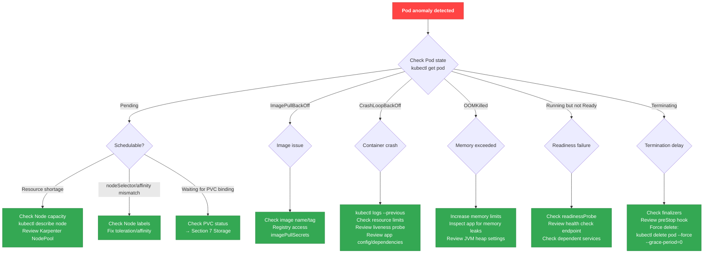
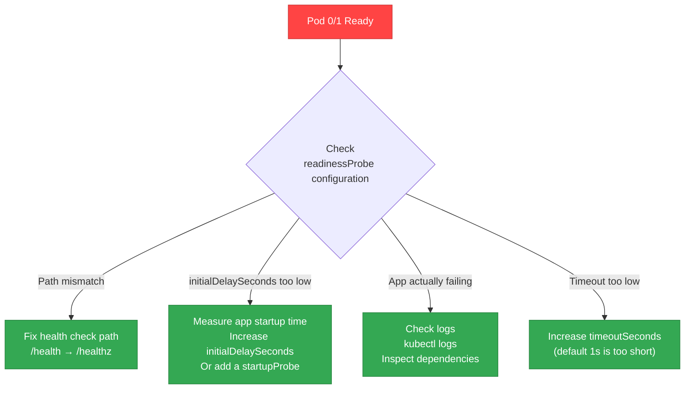
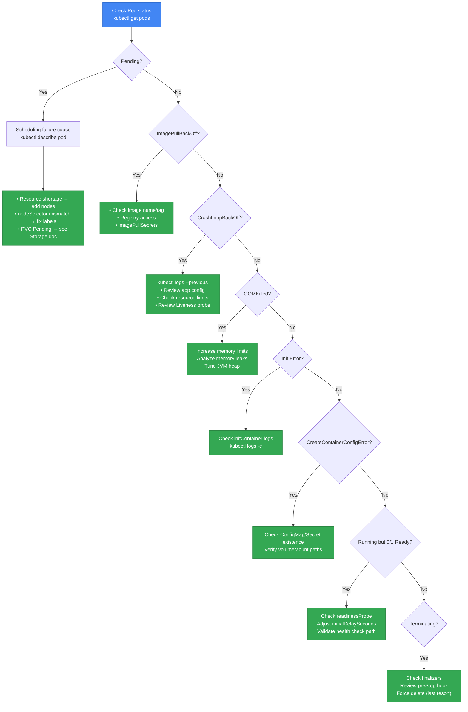

# Workload Debugging

## Pod State-Based Debugging Flowchart



## Basic Debugging Commands

```bash
# Check Pod status
kubectl get pods -n <namespace>
kubectl describe pod <pod-name> -n <namespace>

# Check current/previous container logs
kubectl logs <pod-name> -n <namespace>
kubectl logs <pod-name> -n <namespace> --previous

# Check namespace events
kubectl get events -n <namespace> --sort-by='.lastTimestamp'

# Check resource usage
kubectl top pods -n <namespace>
```

## Using kubectl debug

### Ephemeral Container (attach debug container to a running Pod)

```bash
# Basic ephemeral container
kubectl debug <pod-name> -it --image=busybox --target=<container-name>

# Image with networking tools
kubectl debug <pod-name> -it --image=nicolaka/netshoot --target=<container-name>
```

### Pod Copy (clone a Pod for debugging)

```bash
# Clone a Pod and start it with a different image
kubectl debug <pod-name> --copy-to=debug-pod --image=ubuntu

# Clone with a modified command
kubectl debug <pod-name> --copy-to=debug-pod --container=<container-name> -- sh
```

### Node Debugging (direct node access)

```bash
# Node debugging (the host filesystem is mounted at /host)
kubectl debug node/<node-name> -it --image=ubuntu
```

:::tip kubectl debug vs SSM
`kubectl debug node/` works even on nodes without SSM Agent installed. To access the host network namespace, add `--profile=sysadmin`.
:::

## Patterns: Deployed but Not Working

### Pattern 1: Probe Failure Loop (Running but 0/1 Ready)

A situation where the Pod is `Running` but the `READY` column shows `0/1` and does not receive traffic.

```bash
# Check symptom
kubectl get pods
# NAME                     READY   STATUS    RESTARTS   AGE
# api-server-xxx           0/1     Running   0          5m

# Check readinessProbe failure events
kubectl describe pod api-server-xxx | grep -A 10 "Readiness probe failed"
```

#### Diagnosis Flowchart



#### Common Causes

| Cause | Symptom | Resolution |
|------|------|----------|
| **readinessProbe path ≠ actual endpoint** | Probe returns 404 Not Found | Align with the app's actual health check path (`/health`, `/healthz`, `/ready`, etc.) |
| **initialDelaySeconds < app startup time** | Probe runs before app is ready → failure | Spring Boot/JVM apps often need 30s+. Increase initialDelaySeconds or use a startupProbe |
| **No startupProbe** | Slow apps repeatedly restart | Add a startupProbe to allow initial startup time (up to failureThreshold × periodSeconds) |
| **Health check depends on external services** | When DB fails, all Pods become Ready=false | readinessProbe should only assess the Pod itself (exclude DB connectivity) |

#### Resolution Example

```yaml
apiVersion: apps/v1
kind: Deployment
metadata:
  name: spring-boot-app
spec:
  template:
    spec:
      containers:
      - name: app
        image: my-spring-app:latest
        ports:
        - containerPort: 8080
        # 1. startupProbe: verifies app startup completion (Spring Boot is slow)
        startupProbe:
          httpGet:
            path: /actuator/health
            port: 8080
          failureThreshold: 30    # wait up to 300s (30 × 10s)
          periodSeconds: 10
        # 2. readinessProbe: verifies readiness to receive traffic
        readinessProbe:
          httpGet:
            path: /actuator/health/readiness
            port: 8080
          initialDelaySeconds: 10
          periodSeconds: 5
          timeoutSeconds: 3
          failureThreshold: 3
        # 3. livenessProbe: deadlock detection (exclude external dependencies!)
        livenessProbe:
          httpGet:
            path: /actuator/health/liveness
            port: 8080
          initialDelaySeconds: 60
          periodSeconds: 10
          timeoutSeconds: 5
          failureThreshold: 3
```

:::danger Do Not Include External Dependencies in Liveness Probe
Checking DB/Redis in a Liveness Probe is an anti-pattern. When external services fail, all Pods restart, causing **cascading failures**. Liveness should detect only app-level deadlocks.
:::

### Pattern 2: ConfigMap/Secret Changes Not Applied

The ConfigMap or Secret was updated but not reflected in the Pod.

#### Behavior Comparison

| Mount Method | Auto-update | Refresh Time | Notes |
|-------------|--------------|----------|------|
| **volumeMount (regular)** | Yes | 1–2 minutes (kubelet sync period) | Recommended |
| **volumeMount + subPath** | No | N/A | Pod restart required |
| **envFrom / env** | No | N/A | Pod restart required |

```bash
# Check ConfigMap contents
kubectl get cm <configmap-name> -o yaml

# Check the ConfigMap version mounted by the Pod (inside the Pod)
kubectl exec <pod-name> -- cat /etc/config/app.conf

# Restart Pod (apply changes immediately)
kubectl rollout restart deployment/<deployment-name>
```

#### Caveats with subPath

```yaml
# Bad: subPath prevents ConfigMap updates from applying
apiVersion: v1
kind: Pod
metadata:
  name: app
spec:
  containers:
  - name: app
    volumeMounts:
    - name: config
      mountPath: /etc/app/config.yaml
      subPath: config.yaml  # ← issue: no auto-update
  volumes:
  - name: config
    configMap:
      name: app-config

# Good: remove subPath to enable auto-update
apiVersion: v1
kind: Pod
metadata:
  name: app
spec:
  containers:
  - name: app
    volumeMounts:
    - name: config
      mountPath: /etc/app  # mount the entire directory
  volumes:
  - name: config
    configMap:
      name: app-config
```

#### Auto-restart Using Reloader

[stakater/reloader](https://github.com/stakater/Reloader) automatically restarts Deployments when ConfigMap/Secret changes.

```bash
# Install Reloader
kubectl apply -f https://raw.githubusercontent.com/stakater/Reloader/master/deployments/kubernetes/reloader.yaml
```

```yaml
# Add annotation to the Deployment
apiVersion: apps/v1
kind: Deployment
metadata:
  name: app
  annotations:
    reloader.stakater.com/auto: "true"  # watch all ConfigMaps/Secrets
    # or only specific resources:
    # configmap.reloader.stakater.com/reload: "app-config,common-config"
spec:
  template:
    spec:
      containers:
      - name: app
        image: my-app:latest
```

### Pattern 3: HPA Not Working

The Horizontal Pod Autoscaler is not scaling.

```bash
# Check HPA status
kubectl get hpa
# NAME      REFERENCE          TARGETS         MINPODS   MAXPODS   REPLICAS
# web-hpa   Deployment/web     <unknown>/50%   2         10        2

# Check HPA details
kubectl describe hpa web-hpa

# Verify metrics-server is running
kubectl get deployment metrics-server -n kube-system
kubectl top pods  # failure here indicates a metrics-server issue
```

#### HPA Failures — Causes and Resolutions

| Symptom | Cause | Resolution |
|------|------|------|
| `TARGETS` shows `<unknown>` | metrics-server not installed or failing | Install metrics-server and verify status |
| `unable to get metrics` | Metric collection from Pods fails | Check Pod resource requests (without requests, CPU utilization cannot be computed) |
| `current replicas above Deployment.spec.replicas` | minReplicas > Deployment replicas | Ensure HPA minReplicas ≤ Deployment replicas |
| Scale-up followed by immediate scale-down | stabilizationWindow not set | Configure `behavior.scaleDown.stabilizationWindowSeconds` (default 300s) |
| `invalid metrics` | Custom metrics source error | Check Prometheus Adapter configuration |

#### Correct HPA Example

```yaml
apiVersion: autoscaling/v2
kind: HorizontalPodAutoscaler
metadata:
  name: web-hpa
spec:
  scaleTargetRef:
    apiVersion: apps/v1
    kind: Deployment
    name: web
  minReplicas: 2
  maxReplicas: 10
  metrics:
  - type: Resource
    resource:
      name: cpu
      target:
        type: Utilization
        averageUtilization: 50
  - type: Resource
    resource:
      name: memory
      target:
        type: Utilization
        averageUtilization: 80
  behavior:
    scaleDown:
      stabilizationWindowSeconds: 300  # stabilize for 5 minutes before scaling down
      policies:
      - type: Percent
        value: 50  # reduce up to 50% at a time
        periodSeconds: 60
    scaleUp:
      stabilizationWindowSeconds: 0  # scale up immediately
      policies:
      - type: Percent
        value: 100  # up to 100% increase at a time (double)
        periodSeconds: 15
      - type: Pods
        value: 4  # add up to 4 Pods at a time
        periodSeconds: 15
      selectPolicy: Max  # choose the larger of the two policies
```

:::warning HPA Prerequisites
1. **metrics-server must be installed**: not installed by default on EKS clusters.
2. **Pod resource requests required**: requests are needed to compute CPU/memory utilization.
3. **Deployment replicas ≥ HPA minReplicas**
:::

### Pattern 4: Sidecar Ordering Issues

Sidecar containers like Envoy or ADOT Collector terminate before the main app, causing request loss.

```bash
# Compare Pod termination order (from log timestamps)
kubectl logs <pod-name> -c app --tail=50
kubectl logs <pod-name> -c envoy --tail=50

# Symptoms: "connection refused", "EOF", "broken pipe" errors at termination
```

#### Before Kubernetes 1.28: Use preStop Hooks

```yaml
apiVersion: v1
kind: Pod
metadata:
  name: app-with-envoy
spec:
  containers:
  - name: app
    image: my-app:latest
    lifecycle:
      preStop:
        exec:
          command: ["/bin/sh", "-c", "sleep 5"]  # let the app terminate first
  - name: envoy
    image: envoyproxy/envoy:v1.28
    lifecycle:
      preStop:
        exec:
          command: ["/bin/sh", "-c", "sleep 15"]  # Envoy waits longer
```

#### Kubernetes 1.29+ (Native Sidecar)

Kubernetes 1.29+ supports true sidecars via `restartPolicy: Always`.

```yaml
apiVersion: v1
kind: Pod
metadata:
  name: app-with-sidecar
spec:
  initContainers:
  - name: envoy
    image: envoyproxy/envoy:v1.28
    restartPolicy: Always  # ← native sidecar (1.29+)
    # Envoy terminates last during Pod shutdown
  containers:
  - name: app
    image: my-app:latest
```

:::tip Benefits of Native Sidecars
- initContainers with `restartPolicy: Always` act as sidecars
- On Pod start: sidecar starts first, then the main app
- On Pod termination: main app terminates first, sidecar terminates last
- No more preStop sleep trick
:::

### Pattern 5: Timezone/Locale Issues

Container time is fixed to UTC, causing log timestamps to differ from the local timezone.

```bash
# Check time inside the container
kubectl exec <pod-name> -- date
# Tue Apr  7 05:30:00 UTC 2026  ← in UTC

# App logs appear shifted by +9 hours (not matching KST)
kubectl logs <pod-name> | grep "ERROR"
```

#### Resolution

```yaml
apiVersion: v1
kind: Pod
metadata:
  name: app
spec:
  containers:
  - name: app
    image: my-app:latest
    env:
    - name: TZ
      value: "Asia/Seoul"
    # Additional option for Java apps
    - name: JAVA_OPTS
      value: "-Duser.timezone=Asia/Seoul"
```

:::warning Container Image Must Include tzdata
Some minimized images (distroless, alpine) do not include timezone data. Install `tzdata` in the Dockerfile.

```dockerfile
# Alpine-based
RUN apk add --no-cache tzdata

# Debian/Ubuntu-based
RUN apt-get update && apt-get install -y tzdata
```
:::

### Pattern 6: Resource Quota Exceeded

A namespace has a ResourceQuota that blocks Pod creation.

```bash
# Check ResourceQuota
kubectl get resourcequota -n <namespace>

# Details (usage/limit comparison)
kubectl describe resourcequota -n <namespace>

# Symptom: Pod stuck in Pending with "exceeded quota" message
kubectl describe pod <pod-name> -n <namespace>
# Events:
#   Warning  FailedCreate  Error creating: pods "app-xxx" is forbidden: exceeded quota: compute-quota
```

#### Adjusting ResourceQuota

```yaml
apiVersion: v1
kind: ResourceQuota
metadata:
  name: compute-quota
  namespace: production
spec:
  hard:
    requests.cpu: "100"        # total CPU requests limit
    requests.memory: "200Gi"   # total memory requests limit
    limits.cpu: "200"          # total CPU limits
    limits.memory: "400Gi"     # total memory limits
    pods: "100"                # maximum Pods
```

```bash
# Update ResourceQuota
kubectl apply -f resourcequota.yaml

# Or delete temporarily (caution!)
kubectl delete resourcequota compute-quota -n production
```

:::danger Also Check LimitRange
LimitRange can also block Pod creation. LimitRange restricts minimum/maximum resources per Pod/Container.

```bash
kubectl get limitrange -n <namespace>
kubectl describe limitrange -n <namespace>
```
:::

## Deployment Rollout Debugging

```bash
# Check rollout status
kubectl rollout status deployment/<name>

# Rollout history
kubectl rollout history deployment/<name>

# Roll back to previous version
kubectl rollout undo deployment/<name>

# Roll back to a specific revision
kubectl rollout undo deployment/<name> --to-revision=2

# Restart Deployment (rolling restart)
kubectl rollout restart deployment/<name>
```

## Probe Debugging and Best Practices

```yaml
# Recommended Probe configuration example
apiVersion: apps/v1
kind: Deployment
metadata:
  name: web-app
spec:
  template:
    spec:
      containers:
      - name: app
        image: my-app:latest
        ports:
        - containerPort: 8080
        # Startup Probe: verifies completion of app startup (required for slow-starting apps)
        startupProbe:
          httpGet:
            path: /healthz
            port: 8080
          failureThreshold: 30    # wait up to 300s (30 x 10s)
          periodSeconds: 10
        # Liveness Probe: verifies the app is alive (deadlock detection)
        livenessProbe:
          httpGet:
            path: /healthz
            port: 8080
          initialDelaySeconds: 30
          periodSeconds: 10
          timeoutSeconds: 5
          failureThreshold: 3
          successThreshold: 1
        # Readiness Probe: verifies readiness to receive traffic
        readinessProbe:
          httpGet:
            path: /ready
            port: 8080
          initialDelaySeconds: 10
          periodSeconds: 5
          timeoutSeconds: 3
          failureThreshold: 3
          successThreshold: 1
```

:::danger Probe Configuration Caveats

- **Do not include external dependencies in Liveness Probes** (DB connectivity, etc.). External outages cause cascading failures when all Pods restart.
- **Do not set a high initialDelaySeconds without a startupProbe**. Liveness/readiness probes are disabled until startupProbe succeeds, so use startupProbe for slow-starting apps.
- Readiness Probe failures do not restart the Pod; they only remove it from Service Endpoints.
:::

## Pod State Diagnosis Flowchart



---

## Related Documents

- [Networking Debugging](./networking.md) - Service, DNS, NetworkPolicy issues
- [Storage Debugging](./storage.md) - PVC, EBS/EFS mount failures
- [Observability](./observability.md) - Metric/log-based monitoring
