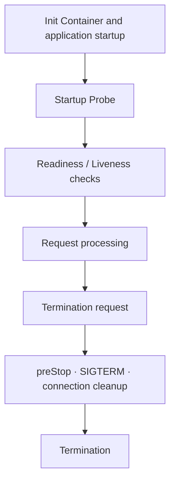

import LegacySectionLinks from '@site/src/components/LegacySectionLinks';
import legacySections from '@site/src/data/pod-lifecycle-legacy-sections.json';
import legacySectionTitles from '@site/src/data/pod-lifecycle-legacy-titles.en.json';

> **📌 Reference Environment**: EKS 1.33+, Kubernetes 1.30+, AWS Load Balancer Controller v2.7+

## 1. Overview

Pod health checks and lifecycle management are fundamental to service stability and availability. Proper Probe configuration and Graceful Shutdown implementation provide the following guarantees:

- **Zero-downtime deployments**: Prevent traffic loss during rolling updates.
- **Fast failure detection**: Automatically isolate and restart unhealthy Pods.
- **Resource optimization**: Prevent premature restarts of applications that start slowly.
- **Data integrity**: Safely complete in-flight requests during termination.

This guide covers the entire Pod lifecycle, from how Kubernetes Probes work to language-specific Graceful Shutdown implementations, Init Container patterns, and container image optimization.

:::info Related Documentation
- **Probe debugging**: See the "Probe Debugging and Best Practices" section of the [EKS Troubleshooting Guide](/docs/eks-best-practices/operations-reliability/eks-debugging).
- **High availability design**: See the "Graceful Shutdown," "PDB," and "Pod Readiness Gates" sections of the [EKS High Availability Architecture Guide](/docs/eks-best-practices/operations-reliability/eks-resiliency-guide).
:::

## Reading Paths by Objective

- **Configure health checks**: [Probe Basics](./pod-lifecycle/probe-basics.md) → [Workload-Specific Patterns](./pod-lifecycle/probe-workloads.md) → [Antipatterns](./pod-lifecycle/probe-antipatterns.md)
- **Investigate request loss during deployments**: [Termination Sequence](./pod-lifecycle/shutdown-basics.md) → [SIGTERM Handling](./pod-lifecycle/shutdown-languages.md) → [Connection Draining](./pod-lifecycle/shutdown-draining.md)
- **Handle node replacement**: [Karpenter and Node Drain](./pod-lifecycle/shutdown-karpenter.md) → [Fargate](./pod-lifecycle/shutdown-fargate.md) or [Auto Mode](./pod-lifecycle/auto-mode-checklist.md)
- **Improve startup time**: [Init Containers](./pod-lifecycle/init-containers.md) → [Lifecycle Hooks](./pod-lifecycle/lifecycle-hooks.md) → [Container Images](./pod-lifecycle/container-images.md)

## Lifecycle Flow

Review initialization, health checks, request processing, and termination separately. Each chapter provides the detailed conditions and configuration examples.

## All Topics

### Probes

- [Probe Types and Configuration Basics](./pod-lifecycle/probe-basics.md): Review Probe types, mechanisms, and timing together.
- [Workload-Specific Probe Patterns](./pod-lifecycle/probe-workloads.md): Review examples for REST, gRPC, batch, JVM, and AI workloads.
- [Probe Antipatterns](./pod-lifecycle/probe-antipatterns.md): Identify unnecessary restarts and incorrect health check configurations.
- [ALB/NLB and Probe Integration](./pod-lifecycle/probe-load-balancers.md): Connect load balancer health checks with Pod Readiness Gates.
- [EKS Features and Probe Integration](./pod-lifecycle/probe-eks-features.md): Review Probe integration examples for individual EKS features.

### Termination and Node Lifecycle

- [Pod Termination Sequence](./pod-lifecycle/shutdown-basics.md): Follow the sequence from a termination request to container termination.
- [SIGTERM Handling by Language](./pod-lifecycle/shutdown-languages.md): Review application shutdown handling examples.
- [Connection Draining](./pod-lifecycle/shutdown-draining.md): Review patterns for completing in-flight requests and closing connections.
- [Karpenter and Node Drain](./pod-lifecycle/shutdown-karpenter.md): Check Pod termination during node replacement and scale-down.
- [Node Readiness Controller](./pod-lifecycle/node-readiness.md): Review configurations that manage infrastructure readiness on nodes.
- [Fargate Pod Lifecycle](./pod-lifecycle/shutdown-fargate.md): Review startup, health check, and termination configurations for Fargate.

### Startup, Deployment, and Optimization

- [Init Container Patterns](./pod-lifecycle/init-containers.md): Compare initialization tasks and Sidecar configurations.
- [Pod Lifecycle Hooks](./pod-lifecycle/lifecycle-hooks.md): Review execution flows and examples for PostStart and PreStop.
- [Container Images and Startup Time](./pod-lifecycle/container-images.md): Review image builds, pre-pulling, and startup time comparisons.
- [Deployment Checklist and References](./pod-lifecycle/checklist-references.md): Review pre-deployment checks and the complete reference list.
- [EKS Auto Mode Checklist](./pod-lifecycle/auto-mode-checklist.md): Check Probe and shutdown configurations in Auto Mode environments.
- [AI-Assisted Probe Optimization](./pod-lifecycle/ai-probe-optimization.md): Review examples that use observability data and AI to optimize Probes.

<LegacySectionLinks sections={legacySections} sectionTitles={legacySectionTitles} basePath="/docs/eks-best-practices/operations-reliability/pod-lifecycle" />
