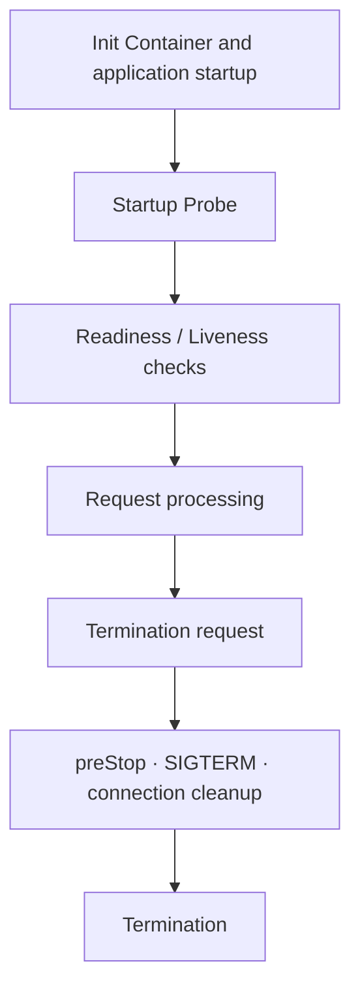

import React, {useEffect} from 'react';
import Link from '@docusaurus/Link';
import useBaseUrl from '@docusaurus/useBaseUrl';
import {useHistory, useLocation} from '@docusaurus/router';
import legacySections from '@site/src/data/pod-lifecycle-legacy-sections.json';

export const legacySectionTitles = {
  "2-kubernetes-probe-심층-가이드": "Kubernetes Probe Deep Dive",
  "21-세-가지-probe-유형과-동작-원리": "Three Probe Types and How They Work",
  "startup-probe-느린-시작-앱-보호": "Startup Probe: Protecting Applications with Slow Startup",
  "liveness-probe-데드락-감지": "Liveness Probe: Detecting Deadlocks",
  "readiness-probe-트래픽-수신-제어": "Readiness Probe: Controlling Incoming Traffic",
  "22-probe-메커니즘": "Probe Mechanisms",
  "httpget-예시": "httpGet Example",
  "tcpsocket-예시": "tcpSocket Example",
  "exec-예시": "exec Example",
  "grpc-예시-kubernetes-127": "grpc Example (Kubernetes 1.27+)",
  "23-probe-타이밍-설계": "Probe Timing Design",
  "타이밍-설계-공식": "Timing Design Formulas",
  "워크로드별-권장-타이밍": "Recommended Timing by Workload",
  "24-워크로드별-probe-패턴": "Probe Patterns by Workload",
  "패턴-1-웹-서비스-rest-api": "Pattern 1: Web Service (REST API)",
  "패턴-2-grpc-서비스": "Pattern 2: gRPC Service",
  "패턴-3-워커배치-처리": "Pattern 3: Worker/Batch Processing",
  "패턴-4-느린-시작-앱-spring-boot-jvm": "Pattern 4: Applications with Slow Startup (Spring Boot, JVM)",
  "패턴-5-사이드카-패턴-istio-proxy--앱": "Pattern 5: Sidecar Pattern (Istio Proxy + Application)",
  "native-sidecar-containers-k8s-128-ga": "Native Sidecar Containers (K8s 1.33 Stable)",
  "246-windows-컨테이너-probe-고려사항": "Probe Considerations for Windows Containers",
  "windows-vs-linux-probe-동작-차이": "Differences in Probe Behavior Between Windows and Linux",
  "windows-워크로드-probe-설정-예시": "Probe Configuration Example for Windows Workloads",
  "windows-워크로드-probe-타임아웃-주의사항": "Probe Timeout Considerations for Windows Workloads",
  "cloudwatch-container-insights-for-windows-2025-08": "CloudWatch Container Insights for Windows (2025-08)",
  "혼합-클러스터-linux--windows-통합-모니터링-전략": "Unified Monitoring Strategy for Mixed Clusters (Linux + Windows)",
  "25-probe-안티패턴과-함정": "Probe Antipatterns and Pitfalls",
  "-안티패턴-1-liveness-probe에-외부-의존성-포함": "❌ Antipattern 1: Including External Dependencies in a Liveness Probe",
  "-안티패턴-2-startup-probe-없이-높은-initialdelayseconds": "❌ Antipattern 2: A High initialDelaySeconds Without a Startup Probe",
  "-안티패턴-3-liveness와-readiness에-같은-엔드포인트": "❌ Antipattern 3: Using the Same Endpoint for Liveness and Readiness",
  "-안티패턴-4-너무-공격적인-failurethreshold": "❌ Antipattern 4: An Overly Aggressive failureThreshold",
  "-안티패턴-5-과도하게-긴-timeoutseconds": "❌ Antipattern 5: An Excessively Long timeoutSeconds",
  "26-albnlb-헬스체크와-probe-통합": "ALB/NLB Health Check and Probe Integration",
  "alb-target-group-헬스체크-vs-readiness-probe": "ALB Target Group Health Checks vs. Readiness Probes",
  "헬스체크-타이밍-동기화-전략": "Health Check Timing Synchronization Strategy",
  "pod-readiness-gates-무중단-배포-보장": "Pod Readiness Gates (Ensuring Zero-Downtime Deployments)",
  "264-gateway-api-헬스체크-통합-alb-controller-v214": "Gateway API Health Check Integration (ALB Controller v2.14+)",
  "gateway-api-vs-ingress-헬스체크-비교": "Gateway API vs. Ingress Health Check Comparison",
  "gateway-api-아키텍처와-헬스체크": "Gateway API Architecture and Health Checks",
  "l7-헬스체크-httproutegrpcroute-with-alb": "L7 Health Checks: HTTPRoute/GRPCRoute with ALB",
  "l4-헬스체크-tcprouteudproute-with-nlb": "L4 Health Checks: TCPRoute/UDPRoute with NLB",
  "gateway-api-pod-readiness-gates": "Gateway API Pod Readiness Gates",
  "ingress에서-gateway-api로-마이그레이션-시-헬스체크-전환-체크리스트": "Health Check Transition Checklist for Migrating from Ingress to Gateway API",
  "27-2025-2026-eks-신규-기능과-probe-통합": "Integrating Probes with New EKS Features in 2025-2026",
  "271-container-network-observability로-probe-연결성-검증": "Validating Probe Connectivity with Container Network Observability",
  "272-cloudwatch-observability-operator--control-plane-메트릭": "CloudWatch Observability Operator + Control Plane Metrics",
  "273-provisioned-control-plane에서-probe-성능-보장": "Ensuring Probe Performance with Provisioned Control Plane",
  "274-guardduty-extended-threat-detection-연계": "Integration with GuardDuty Extended Threat Detection",
  "3-graceful-shutdown-완벽-가이드": "Complete guide to graceful shutdown",
  "31-pod-종료-시퀀스-상세": "Pod termination sequence in detail",
  "32-언어별-sigterm-처리-패턴": "SIGTERM handling patterns by language",
  "nodejs-express": "Node.js (Express)",
  "javaspring-boot": "Java/Spring Boot",
  "go": "Go",
  "python-flask": "Python (Flask)",
  "33-connection-draining-패턴": "Connection draining patterns",
  "http-keep-alive-연결-처리": "Handling HTTP Keep-Alive connections",
  "websocket-연결-정리": "Cleaning up WebSocket connections",
  "grpc-graceful-shutdown": "gRPC Graceful Shutdown",
  "데이터베이스-연결-풀-정리": "Cleaning up database connection pools",
  "34-karpenternode-drain과의-상호작용": "Interaction with Karpenter and node drain",
  "karpenter-disruption과-graceful-shutdown": "Karpenter disruption and graceful shutdown",
  "343-arc--karpenter-통합-az-대피-패턴": "AZ evacuation pattern with ARC + Karpenter integration",
  "spot-인스턴스-2분-경고-처리": "Handling the 2-minute Spot instance warning",
  "344-node-readiness-controller--노드-수준-readiness-관리": "Node Readiness Controller — managing node-level readiness",
  "개요": "Overview",
  "핵심-기능": "Core features",
  "1-continuous-모드---지속-모니터링": "Continuous mode - ongoing monitoring",
  "2-bootstrap-only-모드---초기화-전용": "Bootstrap-only mode - initialization only",
  "3-dry-run-모드---안전한-검증": "Dry-run mode - safe validation",
  "4-nodeselector---타겟-노드-선택": "nodeSelector - selecting target nodes",
  "yaml-예시": "YAML examples",
  "cni-부트스트랩---bootstrap-only-모드": "CNI bootstrap - bootstrap-only mode",
  "gpu-노드-continuous-모니터링": "Continuous monitoring of GPU nodes",
  "ebs-csi-드라이버-준비-확인": "Checking EBS CSI driver readiness",
  "dry-run-모드---테스트-규칙": "Dry-run mode - test rule",
  "eks-적용-시나리오": "EKS usage scenarios",
  "1-vpc-cni-초기화-대기": "Waiting for VPC CNI initialization",
  "2-gpu-노드-nvidia-드라이버-준비": "NVIDIA driver readiness on GPU nodes",
  "3-node-problem-detector-통합": "Node Problem Detector integration",
  "워크플로우-다이어그램": "Workflow diagram",
  "pod-readiness와의-관계": "Relationship to Pod readiness",
  "설치-및-설정": "Installation and configuration",
  "1-node-readiness-controller-설치": "Install Node Readiness Controller",
  "2-설치-확인": "Verify installation",
  "3-노드-상태-확인": "Check node status",
  "디버깅-및-트러블슈팅": "Debugging and troubleshooting",
  "taint가-제거되지-않는-경우": "When a taint is not removed",
  "dry-run-모드로-규칙-테스트": "Test rules in dry-run mode",
  "참조-자료": "References",
  "35-fargate-pod-라이프사이클-특수-고려사항": "Special considerations for the Fargate Pod lifecycle",
  "fargate-vs-ec2-vs-auto-mode-아키텍처-비교": "Architecture comparison: Fargate vs EC2 vs Auto Mode",
  "fargate-pod-os-패치-자동-eviction": "Automatic Fargate Pod eviction for OS patches",
  "fargate-pod-시작-시간-특성": "Fargate Pod startup time characteristics",
  "fargate-daemonset-미지원으로-인한-사이드카-패턴": "Sidecar patterns for Fargate without DaemonSet support",
  "fargate-graceful-shutdown-타이밍-권장사항": "Recommended graceful shutdown timing for Fargate",
  "fargate-vs-ec2-vs-auto-mode-비교표-probe-관점": "Comparison of Fargate, EC2, and Auto Mode from a probe perspective",
  "4-init-container-모범-사례": "Init Container Best Practices",
  "41-init-container-동작-원리": "How Init Containers Work",
  "42-init-container-사용-사례": "Init Container Use Cases",
  "사례-1-데이터베이스-마이그레이션": "Use Case 1: Database Migration",
  "사례-2-설정-파일-생성-configmap-변환": "Use Case 2: Configuration File Generation (ConfigMap Transformation)",
  "사례-3-종속-서비스-대기": "Use Case 3: Waiting for Dependent Services",
  "사례-4-볼륨-권한-설정": "Use Case 4: Setting Volume Permissions",
  "43-init-container-vs-sidecar-container-kubernetes-129": "Init Container vs Sidecar Container (Kubernetes 1.29+)",
  "5-pod-lifecycle-hooks": "Pod Lifecycle Hooks",
  "51-poststart-hook": "PostStart Hook",
  "52-prestop-hook": "PreStop Hook",
  "53-hook-실행-메커니즘": "Hook Execution Mechanisms",
  "exec-hook-예시": "exec Hook Example",
  "httpget-hook-예시": "httpGet Hook Example",
  "6-컨테이너-이미지-최적화와-시작-시간": "Container Image Optimization and Startup Time",
  "61-멀티스테이지-빌드": "Multi-Stage Builds",
  "go-애플리케이션": "Go Application",
  "nodejs-애플리케이션": "Node.js Application",
  "javaspring-boot-애플리케이션": "Java/Spring Boot Application",
  "62-이미지-프리풀-전략": "Image Pre-Pulling Strategies",
  "karpenter-이미지-프리풀": "Image Pre-Pulling with Karpenter",
  "daemonset으로-이미지-프리풀": "Image Pre-Pulling with a DaemonSet",
  "63-distroless와-scratch-이미지": "distroless and scratch Images",
  "distroless-예시": "distroless Example",
  "64-시작-시간-벤치마크": "Startup Time Benchmarks",
  "7-종합-체크리스트--참고-자료": "Comprehensive Checklist & References",
  "71-프로덕션-배포-전-체크리스트": "Pre-Production Deployment Checklist",
  "pod-헬스체크": "Pod Health Checks",
  "graceful-shutdown": "Graceful Shutdown",
  "리소스-및-이미지": "Resources and Images",
  "고가용성": "High Availability",
  "72-관련-문서": "Related Documents",
  "73-외부-참조": "External References",
  "kubernetes-공식-문서": "Official Kubernetes Documentation",
  "aws-공식-문서": "Official AWS Documentation",
  "red-hat-openshift-문서": "Red Hat OpenShift Documentation",
  "추가-참고-자료": "Additional References",
  "74-eks-auto-mode-환경-체크리스트": "EKS Auto Mode Environment Checklist",
  "eks-auto-mode란": "What Is EKS Auto Mode?",
  "auto-mode-특성이-probe에-미치는-영향": "How Auto Mode Characteristics Affect Probes",
  "auto-mode-환경-probe-체크리스트": "Probe Checklist for Auto Mode Environments",
  "auto-mode-vs-수동-관리-시-probe-설정-차이": "Probe Configuration Differences Between Auto Mode and Manual Management",
  "auto-mode-환경의-os-패치-자동-eviction-대응": "Handling Automatic Eviction for OS Patching in Auto Mode",
  "auto-mode-활성화-확인": "Verifying That Auto Mode Is Enabled",
  "75-aiagentic-기반-probe-최적화": "AI/Agentic Probe Optimization",
  "cns421-세션-핵심---agentic-ai-for-eks-operations": "CNS421 Session Highlights - Agentic AI for EKS Operations",
  "kiro--eks-mcp를-활용한-probe-자동-최적화": "Automatic Probe Optimization with Kiro + EKS MCP",
  "amazon-q-developer를-활용한-probe-이슈-디버깅": "Debugging Probe Issues with Amazon Q Developer",
  "tribal-knowledge-기반-probe-패턴-학습": "Learning Probe Patterns from Tribal Knowledge",
  "probe-최적화-통합-대시보드": "Integrated Probe Optimization Dashboard"
};

export function EnglishLegacySectionLinks({sections, basePath}) {
  const history = useHistory();
  const {hash} = useLocation();
  const baseUrl = useBaseUrl(basePath);
  useEffect(() => {
    let id;
    try {
      id = decodeURIComponent(hash.slice(1));
    } catch {
      return;
    }
    const section = Object.prototype.hasOwnProperty.call(sections, id) ? sections[id] : null;
    if (section) {
      history.replace(`${baseUrl}/${section.path}#${encodeURIComponent(id)}`);
    }
  }, [hash, sections, baseUrl, history]);
  return (
    

      
Find a previous section

      
Previously shared section links open the chapter that contains the corresponding content.

      <ul>
        {Object.entries(sections).map(([id, section]) => (
          <li key={id} id={id}>
            <Link to={`${baseUrl}/${section.path}#${encodeURIComponent(id)}`}>
              {legacySectionTitles[id]}
            </Link>
          </li>
        ))}
      </ul>
    

  );
}

> **📌 Reference Environment**: EKS 1.33+, Kubernetes 1.30+, AWS Load Balancer Controller v2.7+

## 1. Overview

Pod health checks and lifecycle management are fundamental to service stability and availability. Proper Probe configuration and Graceful Shutdown implementation provide the following guarantees:

- **Zero-downtime deployments**: Prevent traffic loss during rolling updates.
- **Fast failure detection**: Automatically isolate and restart unhealthy Pods.
- **Resource optimization**: Prevent premature restarts of applications that start slowly.
- **Data integrity**: Safely complete in-flight requests during termination.

This guide covers the entire Pod lifecycle, from how Kubernetes Probes work to language-specific Graceful Shutdown implementations, Init Container patterns, and container image optimization.

:::info Related Documentation
- **Probe debugging**: See the "Probe Debugging and Best Practices" section of the [EKS Troubleshooting Guide](/docs/eks-best-practices/operations-reliability/eks-debugging).
- **High availability design**: See the "Graceful Shutdown," "PDB," and "Pod Readiness Gates" sections of the [EKS High Availability Architecture Guide](/docs/eks-best-practices/operations-reliability/eks-resiliency-guide).
:::

## Reading Paths by Objective

- **Configure health checks**: [Probe Basics](./pod-lifecycle/probe-basics.md) → [Workload-Specific Patterns](./pod-lifecycle/probe-workloads.md) → [Antipatterns](./pod-lifecycle/probe-antipatterns.md)
- **Investigate request loss during deployments**: [Termination Sequence](./pod-lifecycle/shutdown-basics.md) → [SIGTERM Handling](./pod-lifecycle/shutdown-languages.md) → [Connection Draining](./pod-lifecycle/shutdown-draining.md)
- **Handle node replacement**: [Karpenter and Node Drain](./pod-lifecycle/shutdown-karpenter.md) → [Fargate](./pod-lifecycle/shutdown-fargate.md) or [Auto Mode](./pod-lifecycle/auto-mode-checklist.md)
- **Improve startup time**: [Init Containers](./pod-lifecycle/init-containers.md) → [Lifecycle Hooks](./pod-lifecycle/lifecycle-hooks.md) → [Container Images](./pod-lifecycle/container-images.md)

## Lifecycle Flow

Review initialization, health checks, request processing, and termination separately. Each chapter provides the detailed conditions and configuration examples.

## All Topics

### Probes

- [Probe Types and Configuration Basics](./pod-lifecycle/probe-basics.md): Review Probe types, mechanisms, and timing together.
- [Workload-Specific Probe Patterns](./pod-lifecycle/probe-workloads.md): Review examples for REST, gRPC, batch, JVM, and AI workloads.
- [Probe Antipatterns](./pod-lifecycle/probe-antipatterns.md): Identify unnecessary restarts and incorrect health check configurations.
- [ALB/NLB and Probe Integration](./pod-lifecycle/probe-load-balancers.md): Connect load balancer health checks with Pod Readiness Gates.
- [EKS Features and Probe Integration](./pod-lifecycle/probe-eks-features.md): Review Probe integration examples for individual EKS features.

### Termination and Node Lifecycle

- [Pod Termination Sequence](./pod-lifecycle/shutdown-basics.md): Follow the sequence from a termination request to container termination.
- [SIGTERM Handling by Language](./pod-lifecycle/shutdown-languages.md): Review application shutdown handling examples.
- [Connection Draining](./pod-lifecycle/shutdown-draining.md): Review patterns for completing in-flight requests and closing connections.
- [Karpenter and Node Drain](./pod-lifecycle/shutdown-karpenter.md): Check Pod termination during node replacement and scale-down.
- [Node Readiness Controller](./pod-lifecycle/node-readiness.md): Review configurations that manage infrastructure readiness on nodes.
- [Fargate Pod Lifecycle](./pod-lifecycle/shutdown-fargate.md): Review startup, health check, and termination configurations for Fargate.

### Startup, Deployment, and Optimization

- [Init Container Patterns](./pod-lifecycle/init-containers.md): Compare initialization tasks and Sidecar configurations.
- [Pod Lifecycle Hooks](./pod-lifecycle/lifecycle-hooks.md): Review execution flows and examples for PostStart and PreStop.
- [Container Images and Startup Time](./pod-lifecycle/container-images.md): Review image builds, pre-pulling, and startup time comparisons.
- [Deployment Checklist and References](./pod-lifecycle/checklist-references.md): Review pre-deployment checks and the complete reference list.
- [EKS Auto Mode Checklist](./pod-lifecycle/auto-mode-checklist.md): Check Probe and shutdown configurations in Auto Mode environments.
- [AI-Assisted Probe Optimization](./pod-lifecycle/ai-probe-optimization.md): Review examples that use observability data and AI to optimize Probes.

<EnglishLegacySectionLinks sections={legacySections} basePath="/docs/eks-best-practices/operations-reliability/pod-lifecycle" />
