> **📌 Reference Environment**: EKS 1.33+, Karpenter v1.x, Kubernetes 1.30+

## 1. Overview

Kubernetes Pod scheduling is a core mechanism that directly affects service availability, performance, and cost efficiency. Applying appropriate scheduling strategies provides the following benefits:

- **High availability**: Minimize service interruptions by separating failure domains
- **Performance optimization**: Improve response times by placing workloads on suitable nodes
- **Resource efficiency**: Reduce costs through balanced use of node resources
- **Stable operations**: Guarantee resources based on priority and control preemption

This document covers core Pod scheduling concepts through advanced patterns, with practical YAML examples and decision guidance for EKS environments.

:::info High Availability Architecture Reference
This document focuses on scheduling patterns at the **Pod level**. For cluster-wide high availability architecture (Multi-AZ strategies, Topology Spread, and Cell Architecture), see the [EKS High Availability Architecture Guide](/docs/eks-best-practices/operations-reliability/eks-resiliency-guide).
:::

### Why Scheduling Matters

| Scenario | Incorrect Scheduling | Correct Scheduling |
|---------|----------------|----------------|
| **Failure isolation** | All replicas on the same node → Complete outage if the node fails | Distribute across nodes with Anti-Affinity → Only partial failures |
| **Resource contention** | CPU-intensive Pods concentrated on one node → Performance degradation | Separate workloads with Node Affinity → Stable performance |
| **Cost optimization** | Pods that do not need GPUs placed on GPU nodes → Wasted cost | Isolate dedicated nodes with Taints/Tolerations → Lower cost |
| **Upgrade safety** | Unplanned rollout strategy/readiness and no PDB for node drains → Excessive loss of available replicas | Control rolling updates through workload controller settings and constrain Eviction API-based node drains with a PDB |
| **Emergency response** | No priorities configured → Critical workloads remain Pending | PriorityClass configured → Critical Pods scheduled first |

---

## 2. Kubernetes Scheduling Fundamentals

### 2.1 Scheduling Process

The Kubernetes scheduler places Pods on nodes through a 3-phase process:

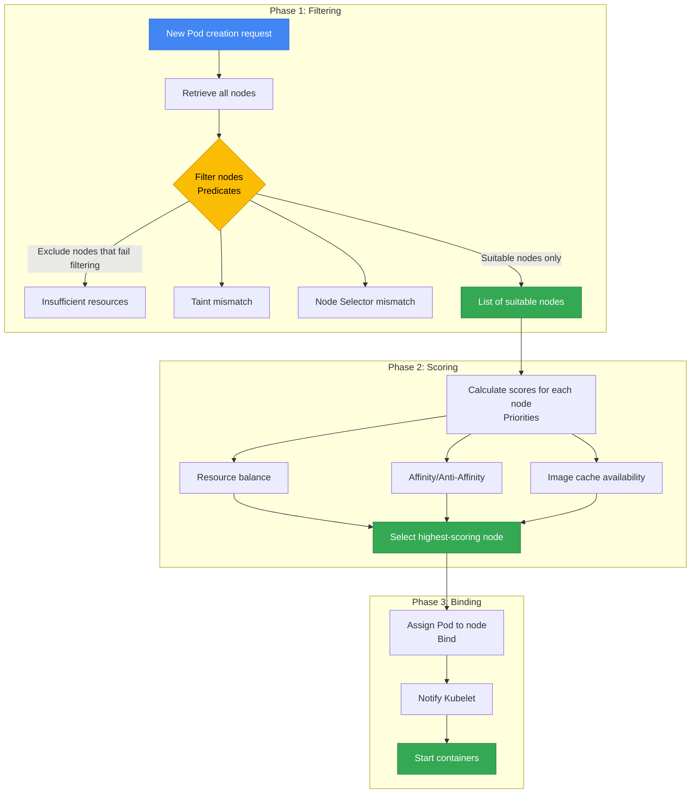

**1. Filtering (Predicates)**: Exclude nodes that do not meet requirements
- Insufficient resources (CPU, Memory)
- Taints/Tolerations mismatch
- Unmet Node Selector conditions
- Volume topology constraints (EBS AZ-Pinning)
- Port conflicts

**2. Scoring (Priorities)**: Score the remaining nodes and select the optimal node
- Resource balance (even utilization)
- Satisfaction of Pod Affinity/Anti-Affinity
- Image cache availability
- Topology Spread uniformity
- Node preference (PreferredDuringScheduling)

**3. Binding**: Assign the Pod to the highest-scoring node and notify Kubelet

:::tip Debugging Scheduling Failures
If a Pod remains `Pending`, inspect the Events section with `kubectl describe pod <pod-name>`. Messages such as `Insufficient cpu`, `No nodes available`, and `Taint not tolerated` identify the cause of the failure.
:::

### 2.2 Factors That Affect Scheduling

| Factor | Type | Affected Phase | Enforcement | Primary Use Case |
|------|------|-----------|--------|---------------|
| **Node Selector** | Pod | Filtering | Hard | Specify a particular node type (GPU, ARM) |
| **Node Affinity** | Pod | Filtering/Scoring | Hard/Soft | Fine-grained node selection conditions |
| **Pod Affinity** | Pod | Scoring | Hard/Soft | Place related Pods close together |
| **Pod Anti-Affinity** | Pod | Filtering/Scoring | Hard/Soft | Place Pods far apart |
| **Taints/Tolerations** | Node + Pod | Filtering | Hard | Isolate dedicated nodes |
| **Topology Spread** | Pod | Scoring | Hard/Soft | Distribute evenly across AZs/nodes |
| **PriorityClass** | Pod | Preemption | Hard | Preempt resources based on priority |
| **Resource Requests** | Pod | Filtering | Hard | Guarantee minimum resources |
| **PDB** | Pod Group | Eviction API | Hard | Constrain eviction requests that exceed the disruption budget |

**Hard vs Soft Constraints:**
- **Hard (Required)**: Scheduling fails if conditions are not met → `Pending` state
- **Soft (Preferred)**: Conditions are preferred, but scheduling proceeds even if they are not met → Alternatives allowed

---

## 3. Node Affinity & Anti-Affinity

### 3.1 Node Selector (Basic)

Node Selector is the simplest node selection mechanism and supports only label-based exact matches.

```yaml
apiVersion: apps/v1
kind: Deployment
metadata:
  name: gpu-workload
spec:
  replicas: 2
  selector:
    matchLabels:
      app: ml-training
  template:
    metadata:
      labels:
        app: ml-training
    spec:
      nodeSelector:
        node.kubernetes.io/instance-type: g5.2xlarge
        workload-type: gpu
      containers:
      - name: trainer
        image: ml/trainer:v2.0
        resources:
          requests:
            nvidia.com/gpu: 1
```

**Limitations**: Node Selector supports only `AND` conditions; it does not support `OR`, `NOT`, or comparison operators. Use Node Affinity when complex conditions are required.

### 3.2 Node Affinity in Detail

Node Affinity extends Node Selector to express complex logical conditions and preferences.

#### Required vs Preferred

| Type | Behavior | When to Use |
|------|------|----------|
| `requiredDuringSchedulingIgnoredDuringExecution` | Conditions must be met (Hard) | When placement on specific nodes is mandatory |
| `preferredDuringSchedulingIgnoredDuringExecution` | Conditions are preferred (Soft, weight-based) | When preferred placement allows alternatives |

:::info Meaning of IgnoredDuringExecution
`IgnoredDuringExecution` means that a Pod **already running** is not evicted when node labels change. If `RequiredDuringExecution` is introduced in the future, Pods will be relocated when conditions are no longer met during execution.
:::

#### Operator Types

| Operator | Description | Example |
|--------|------|------|
| `In` | Value is included in the list | `values: ["t3.xlarge", "t3.2xlarge"]` |
| `NotIn` | Value is not included in the list | `values: ["t2.micro", "t2.small"]` |
| `Exists` | Key exists (regardless of value) | Check only whether the label exists |
| `DoesNotExist` | Key does not exist | Select nodes without a specific label |
| `Gt` | Value is greater (numeric) | `values: ["100"]` (CPU core count, for example) |
| `Lt` | Value is less (numeric) | `values: ["10"]` |

#### YAML Examples by Use Case

**Example 1: Place ML Workloads on GPU Nodes (Hard)**

```yaml
apiVersion: apps/v1
kind: Deployment
metadata:
  name: ml-training
spec:
  replicas: 3
  selector:
    matchLabels:
      app: ml-training
  template:
    metadata:
      labels:
        app: ml-training
    spec:
      affinity:
        nodeAffinity:
          requiredDuringSchedulingIgnoredDuringExecution:
            nodeSelectorTerms:
            - matchExpressions:
              - key: node.kubernetes.io/instance-type
                operator: In
                values:
                - g5.xlarge
                - g5.2xlarge
                - g5.4xlarge
              - key: karpenter.sh/capacity-type
                operator: NotIn
                values:
                - spot  # Exclude Spot for GPU workloads
      containers:
      - name: trainer
        image: ml/trainer:v3.0
        resources:
          requests:
            nvidia.com/gpu: 1
            cpu: "4"
            memory: 16Gi
```

**Example 2: Instance Family Preferences (Soft, Weighted)**

```yaml
apiVersion: apps/v1
kind: Deployment
metadata:
  name: api-server
spec:
  replicas: 6
  selector:
    matchLabels:
      app: api-server
  template:
    metadata:
      labels:
        app: api-server
    spec:
      affinity:
        nodeAffinity:
          # Required: Use only On-Demand nodes
          requiredDuringSchedulingIgnoredDuringExecution:
            nodeSelectorTerms:
            - matchExpressions:
              - key: karpenter.sh/capacity-type
                operator: In
                values:
                - on-demand
          # Preferred: c7i > c6i > m6i order
          preferredDuringSchedulingIgnoredDuringExecution:
          - weight: 100
            preference:
              matchExpressions:
              - key: node.kubernetes.io/instance-type
                operator: In
                values:
                - c7i.xlarge
                - c7i.2xlarge
          - weight: 80
            preference:
              matchExpressions:
              - key: node.kubernetes.io/instance-type
                operator: In
                values:
                - c6i.xlarge
                - c6i.2xlarge
          - weight: 50
            preference:
              matchExpressions:
              - key: node.kubernetes.io/instance-type
                operator: In
                values:
                - m6i.xlarge
                - m6i.2xlarge
      containers:
      - name: api
        image: api-server:v2.5
        resources:
          requests:
            cpu: "1"
            memory: 2Gi
```

**Example 3: Specify an AZ (Database Client)**

```yaml
apiVersion: apps/v1
kind: Deployment
metadata:
  name: db-client
spec:
  replicas: 4
  selector:
    matchLabels:
      app: db-client
  template:
    metadata:
      labels:
        app: db-client
    spec:
      affinity:
        nodeAffinity:
          # Place in the same AZ (us-east-1a) as the RDS instance to reduce Cross-AZ costs
          requiredDuringSchedulingIgnoredDuringExecution:
            nodeSelectorTerms:
            - matchExpressions:
              - key: topology.kubernetes.io/zone
                operator: In
                values:
                - us-east-1a
      containers:
      - name: client
        image: db-client:v1.2
        env:
        - name: DB_ENDPOINT
          value: "mydb.us-east-1a.rds.amazonaws.com"
```

### 3.3 Node Anti-Affinity

Node Anti-Affinity has no explicit syntax but is implemented with the `NotIn` and `DoesNotExist` operators in Node Affinity.

```yaml
apiVersion: apps/v1
kind: Deployment
metadata:
  name: avoid-spot
spec:
  replicas: 3
  selector:
    matchLabels:
      app: critical-service
  template:
    metadata:
      labels:
        app: critical-service
    spec:
      affinity:
        nodeAffinity:
          requiredDuringSchedulingIgnoredDuringExecution:
            nodeSelectorTerms:
            - matchExpressions:
              # Avoid Spot nodes
              - key: karpenter.sh/capacity-type
                operator: NotIn
                values:
                - spot
              # Avoid ARM architecture
              - key: kubernetes.io/arch
                operator: NotIn
                values:
                - arm64
      containers:
      - name: app
        image: critical-service:v1.0
```

---

## 4. Pod Affinity & Anti-Affinity

Pod Affinity and Anti-Affinity make scheduling decisions based on **relationships between Pods**. They place related Pods close together (Affinity) or far apart (Anti-Affinity).

### 4.1 Pod Affinity

Pod Affinity co-locates other Pods in the topology domain (node, AZ, or region) where a specific Pod resides.

**Primary Use Cases:**
- **Cache Locality**: Place the cache server and application on the same node to minimize latency
- **Data Locality**: Place data processing workloads close to their data sources
- **Communication Intensive**: Place microservices that communicate frequently in the same AZ

```yaml
apiVersion: apps/v1
kind: Deployment
metadata:
  name: cache-client
spec:
  replicas: 3
  selector:
    matchLabels:
      app: cache-client
  template:
    metadata:
      labels:
        app: cache-client
    spec:
      affinity:
        podAffinity:
          # Hard: Place on the same node as Redis Pods (ultra-low latency requirement)
          requiredDuringSchedulingIgnoredDuringExecution:
          - labelSelector:
              matchExpressions:
              - key: app
                operator: In
                values:
                - redis
            topologyKey: kubernetes.io/hostname
      containers:
      - name: client
        image: cache-client:v1.0
```

**topologyKey Explained:**

| topologyKey | Scope | Description |
|-------------|------|------|
| `kubernetes.io/hostname` | Node | Place on the same node (strongest co-location) |
| `topology.kubernetes.io/zone` | AZ | Place in the same AZ |
| `topology.kubernetes.io/region` | Region | Place in the same region |
| Custom label | User-defined | Examples: `rack`, `datacenter` |

**Soft Affinity Example (Preferred, Alternatives Allowed):**

```yaml
apiVersion: apps/v1
kind: Deployment
metadata:
  name: web-frontend
spec:
  replicas: 6
  selector:
    matchLabels:
      app: web-frontend
  template:
    metadata:
      labels:
        app: web-frontend
    spec:
      affinity:
        podAffinity:
          # Soft: Prefer the same AZ as the API server (reduce Cross-AZ costs)
          preferredDuringSchedulingIgnoredDuringExecution:
          - weight: 100
            podAffinityTerm:
              labelSelector:
                matchExpressions:
                - key: app
                  operator: In
                  values:
                  - api-server
              topologyKey: topology.kubernetes.io/zone
      containers:
      - name: frontend
        image: web-frontend:v2.0
```

### 4.2 Pod Anti-Affinity

Pod Anti-Affinity **prevents** other Pods from being placed in the topology domain where a specific Pod resides. It is a key pattern for high availability.

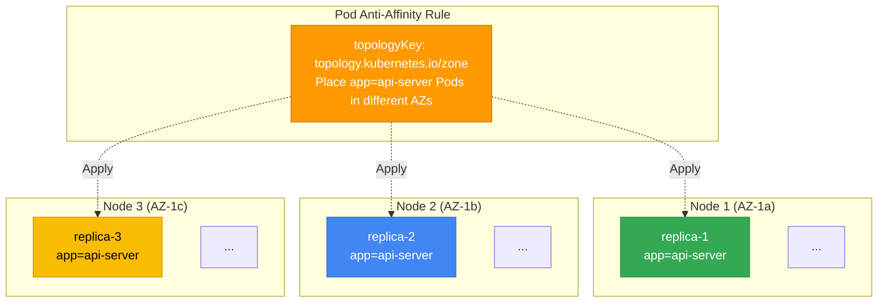

#### Hard Anti-Affinity (Failure Domain Isolation)

```yaml
apiVersion: apps/v1
kind: Deployment
metadata:
  name: api-server
spec:
  replicas: 6
  selector:
    matchLabels:
      app: api-server
  template:
    metadata:
      labels:
        app: api-server
    spec:
      affinity:
        podAntiAffinity:
          # Hard: Place at most 1 replica per node (isolate node failures)
          requiredDuringSchedulingIgnoredDuringExecution:
          - labelSelector:
              matchExpressions:
              - key: app
                operator: In
                values:
                - api-server
            topologyKey: kubernetes.io/hostname
      containers:
      - name: api
        image: api-server:v3.0
        resources:
          requests:
            cpu: "1"
            memory: 2Gi
```

:::warning Hard Anti-Affinity Considerations
When Hard Anti-Affinity is applied to `kubernetes.io/hostname`, some Pods remain `Pending` if the replica count exceeds the node count. For example, deploying 5 replicas across 3 nodes leaves 2 unscheduled. Use Soft Anti-Affinity in this case.
:::

#### Soft Anti-Affinity (Recommended Pattern)

```yaml
apiVersion: apps/v1
kind: Deployment
metadata:
  name: worker
spec:
  replicas: 10
  selector:
    matchLabels:
      app: worker
  template:
    metadata:
      labels:
        app: worker
    spec:
      affinity:
        podAntiAffinity:
          # Soft: Distribute across different nodes whenever possible (ensure flexibility)
          preferredDuringSchedulingIgnoredDuringExecution:
          - weight: 100
            podAffinityTerm:
              labelSelector:
                matchExpressions:
                - key: app
                  operator: In
                  values:
                  - worker
              topologyKey: kubernetes.io/hostname
      containers:
      - name: worker
        image: worker:v2.1
        resources:
          requests:
            cpu: "500m"
            memory: 1Gi
```

#### Criteria for Choosing Hard vs Soft

| Scenario | Recommendation | Reason |
|---------|------|------|
| Replica count ≤ Node count | Hard | Exactly 1 replica can be placed on each node |
| Replica count > Node count | Soft | Allow 2 or more replicas on some nodes |
| Mission-critical service | Hard (AZ level) | Complete failure domain isolation |
| General workload | Soft | Ensure scheduling flexibility |
| Rapid scaling required | Soft | Prevent Pending states |

### 4.3 Affinity/Anti-Affinity vs Topology Spread Comparison

| Comparison | Pod Anti-Affinity | Topology Spread Constraints |
|----------|-------------------|----------------------------|
| **Purpose** | Separate Pods | Distribute Pods evenly |
| **Granularity** | Per-Pod control | Balance across domains |
| **Complexity** | Low | Medium |
| **Flexibility** | Choose Hard/Soft | Control the allowed range with maxSkew |
| **Primary use** | Separate replicas of the same app | Overall balance across multiple apps |
| **AZ distribution** | Supported | More granular (minDomains) |
| **Node distribution** | Supported | More granular (maxSkew) |
| **Recommended combination** | Topology Spread (AZ) + Anti-Affinity (Node) | |

:::info Topology Spread Constraints Reference
Topology Spread Constraints provide more granular distribution control than Pod Anti-Affinity. For details and YAML examples, see the [EKS High Availability Architecture Guide](/docs/eks-best-practices/operations-reliability/eks-resiliency-guide#pod-topology-spread-constraints).
:::

#### 4.3.1 Practical Topology Spread Constraints Patterns

Topology Spread Constraints address complex distribution requirements effectively. The following patterns are commonly used in production environments, with YAML examples.

##### Pattern 1: Even Multi-AZ Distribution (Basic)

This is the most common pattern, distributing all replicas evenly across AZs.

```yaml
apiVersion: apps/v1
kind: Deployment
metadata:
  name: multi-az-app
  namespace: production
spec:
  replicas: 9
  selector:
    matchLabels:
      app: multi-az-app
  template:
    metadata:
      labels:
        app: multi-az-app
    spec:
      topologySpreadConstraints:
      - maxSkew: 1
        topologyKey: topology.kubernetes.io/zone
        whenUnsatisfiable: DoNotSchedule
        labelSelector:
          matchLabels:
            app: multi-az-app
      containers:
      - name: app
        image: myapp:v1.0
        resources:
          requests:
            cpu: 500m
            memory: 512Mi
```

**How It Works:**
- `maxSkew: 1`: Allow a difference of at most 1 Pod between AZs
- 9 replicas → us-east-1a(3), us-east-1b(3), us-east-1c(3)
- `whenUnsatisfiable: DoNotSchedule`: Keep Pods Pending if the constraint is violated

**Use Cases:**
- AZ failure resilience for mission-critical services
- Client traffic arriving evenly from all AZs
- Failure isolation at the data center level

##### Pattern 2: Using minDomains (Minimum AZ Guarantee)

`minDomains` guarantees the minimum number of domains (AZs) across which Pods must be distributed. It prevents Pods from concentrating in one location when the number of AZs is reduced.

```yaml
apiVersion: apps/v1
kind: Deployment
metadata:
  name: ha-critical-service
  namespace: production
spec:
  replicas: 6
  selector:
    matchLabels:
      app: ha-critical-service
      tier: critical
  template:
    metadata:
      labels:
        app: ha-critical-service
        tier: critical
    spec:
      topologySpreadConstraints:
      - maxSkew: 1
        minDomains: 3  # Must distribute across 3 AZs
        topologyKey: topology.kubernetes.io/zone
        whenUnsatisfiable: DoNotSchedule
        labelSelector:
          matchLabels:
            app: ha-critical-service
      containers:
      - name: service
        image: critical-service:v2.5
        resources:
          requests:
            cpu: "1"
            memory: 1Gi
          limits:
            cpu: "2"
            memory: 2Gi
```

**How It Works:**
- `minDomains: 3`: Guarantee Pod distribution across at least 3 AZs
- 6 replicas → Place at least 2 in each AZ
- Even if a particular AZ lacks resources, Pods do not concentrate only in the other AZs

**Use Cases:**
- Services requiring extremely high availability, such as financial and payment systems
- Requirements for an SLA of 99.99% or higher
- Maintain minimum availability even during AZ reduction (Zonal Shift)

:::warning Considerations When Configuring minDomains
When `minDomains` is configured, Pods remain Pending if the specified number of domains does not exist or resources are insufficient. Check the number of AZs actually available in the cluster before configuring it.
:::

##### Pattern 3: Combining Anti-Affinity + Topology Spread

This pattern prevents placing 2 or more replicas on the same node while ensuring even distribution across AZs.

```yaml
apiVersion: apps/v1
kind: Deployment
metadata:
  name: combined-constraints-app
  namespace: production
spec:
  replicas: 12
  selector:
    matchLabels:
      app: combined-app
  template:
    metadata:
      labels:
        app: combined-app
        version: v3.0
    spec:
      # 1. Topology Spread: Even distribution across AZs (Hard)
      topologySpreadConstraints:
      - maxSkew: 1
        minDomains: 3
        topologyKey: topology.kubernetes.io/zone
        whenUnsatisfiable: DoNotSchedule
        labelSelector:
          matchLabels:
            app: combined-app

      # 2. Anti-Affinity: Distribution across nodes (Hard)
      affinity:
        podAntiAffinity:
          requiredDuringSchedulingIgnoredDuringExecution:
          - labelSelector:
              matchExpressions:
              - key: app
                operator: In
                values:
                - combined-app
            topologyKey: kubernetes.io/hostname

      containers:
      - name: app
        image: combined-app:v3.0
        resources:
          requests:
            cpu: "2"
            memory: 4Gi
```

**How It Works:**
- **Level 1 (AZ)**: 12 replicas → Place 4 evenly in each AZ
- **Level 2 (Node)**: Place at most 1 Pod on each node

**Effects:**
- A node failure affects at most 1 Pod
- An AZ failure affects at most 4 Pods
- 8 of the total 12 Pods (66.7%) are always available

**Use Cases:**
- Complete elimination of single points of failure (Single Point of Failure)
- Resilience to both hardware and data center failures
- High-traffic API servers and payment gateways

##### Pattern 4: Multiple Topology Spread Constraints (Zone + Node)

Control distribution across multiple topology levels simultaneously in a single Pod Spec.

```yaml
apiVersion: apps/v1
kind: Deployment
metadata:
  name: multi-level-spread
  namespace: production
spec:
  replicas: 18
  selector:
    matchLabels:
      app: multi-level-app
  template:
    metadata:
      labels:
        app: multi-level-app
    spec:
      topologySpreadConstraints:
      # Constraint 1: AZ-level distribution (Hard)
      - maxSkew: 1
        minDomains: 3
        topologyKey: topology.kubernetes.io/zone
        whenUnsatisfiable: DoNotSchedule
        labelSelector:
          matchLabels:
            app: multi-level-app

      # Constraint 2: Node-level distribution (Soft)
      - maxSkew: 2
        topologyKey: kubernetes.io/hostname
        whenUnsatisfiable: ScheduleAnyway
        labelSelector:
          matchLabels:
            app: multi-level-app

      containers:
      - name: app
        image: multi-level-app:v1.5
        resources:
          requests:
            cpu: "1"
            memory: 2Gi
```

**How It Works:**
- **Level 1 (AZ)**: 18 → us-east-1a(6), us-east-1b(6), us-east-1c(6)
- **Level 2 (Node)**: Within each AZ, the Pod count differs by at most 2 per node
- Set the Node constraint to Soft (`ScheduleAnyway`) to prevent scheduling failures

**Use Cases:**
- Deployments with a large replica count (10 or more)
- Environments with a variable node count (Karpenter autoscaling)
- AZ distribution is required, while node distribution is preferred

##### Pattern Comparison

| Pattern | maxSkew | minDomains | whenUnsatisfiable | Additional Constraints | Complexity | Recommended Replica Count |
|------|---------|------------|-------------------|----------|--------|----------------|
| **Pattern 1: Basic Multi-AZ** | 1 | - | DoNotSchedule | None | Low | 3~12 |
| **Pattern 2: minDomains** | 1 | 3 | DoNotSchedule | None | Medium | 6~20 |
| **Pattern 3: Anti-Affinity Combination** | 1 | 3 | DoNotSchedule | Hard Anti-Affinity | High | 12~50 |
| **Pattern 4: Multiple Spread Constraints** | 1, 2 | 3 | Mixed | 2-level Topology | High | 15+ |

##### Troubleshooting: Causes of Topology Spread Failures

| Symptom | Cause | Resolution |
|------|------|----------|
| Pod remains Pending | `maxSkew` exceeded or `minDomains` not met | Check Events with `kubectl describe pod`, adjust the replica count, or add nodes |
| Pods concentrated in a specific AZ | `whenUnsatisfiable: ScheduleAnyway` used | Change to `DoNotSchedule` to enforce a Hard constraint |
| No redistribution when a new AZ is added | The scheduler does not relocate existing Pods | Use Descheduler or a Rolling Restart |
| All Pods Pending after configuring `minDomains` | The cluster does not have the specified number of AZs | Adjust `minDomains` to the actual AZ count |

:::tip Topology Spread Debugging Commands
```bash
# Check the AZ distribution of Pod placements
kubectl get pods -n production -l app=multi-az-app \
  -o custom-columns=NAME:.metadata.name,NODE:.spec.nodeName,ZONE:.spec.nodeSelector.topology\.kubernetes\.io/zone

# Check the Pod count per node
kubectl get pods -A -o wide --no-headers | \
  awk '{print $8}' | sort | uniq -c | sort -rn
```
:::

**Recommended Combined Pattern:**

```yaml
apiVersion: apps/v1
kind: Deployment
metadata:
  name: best-practice-app
spec:
  replicas: 6
  selector:
    matchLabels:
      app: best-practice-app
  template:
    metadata:
      labels:
        app: best-practice-app
    spec:
      # Topology Spread: Even distribution across AZs (Hard)
      topologySpreadConstraints:
      - maxSkew: 1
        topologyKey: topology.kubernetes.io/zone
        whenUnsatisfiable: DoNotSchedule
        labelSelector:
          matchLabels:
            app: best-practice-app
        minDomains: 3
      # Anti-Affinity: Distribution across nodes (Soft)
      affinity:
        podAntiAffinity:
          preferredDuringSchedulingIgnoredDuringExecution:
          - weight: 100
            podAffinityTerm:
              labelSelector:
                matchExpressions:
                - key: app
                  operator: In
                  values:
                  - best-practice-app
              topologyKey: kubernetes.io/hostname
      containers:
      - name: app
        image: app:v1.0
```

---

<span id="5-9-taintstolerations-topology-spread-pdb-priorityclass-descheduler-advanced-patterns" />

## 5. Taints & Tolerations

Taints and Tolerations are a **node-level repulsion mechanism**. When a Taint is applied to a node, only Pods that tolerate that Taint are scheduled on it.

**Concepts:**
- **Taint**: Applied to a node (for example, "This node is dedicated to GPU workloads")
- **Toleration**: Applied to a Pod (for example, "I tolerate GPU nodes")

### 5.1 Taint Effects

| Effect | Behavior | Impact on Existing Pods | When to Use |
|--------|------|--------------|----------|
| `NoSchedule` | Block new Pod scheduling | Keep existing Pods | When creating new dedicated nodes |
| `PreferNoSchedule` | Avoid scheduling if possible (Soft) | Keep existing Pods | Prefer avoidance (allow alternatives) |
| `NoExecute` | Block scheduling + Evict existing Pods | Immediately evict existing Pods | Node maintenance, emergency evacuation |

**Commands to Apply Taints:**

```bash
# NoSchedule: Block new Pod scheduling
kubectl taint nodes node1 workload-type=gpu:NoSchedule

# NoExecute: Block new Pods + Evict existing Pods
kubectl taint nodes node1 maintenance=true:NoExecute

# Remove a Taint (append '-' at the end)
kubectl taint nodes node1 workload-type=gpu:NoSchedule-
```

### 5.2 Common Taint Patterns

#### Pattern 1: Dedicated Node Groups (GPU, High-Memory)

```yaml
# Apply a Taint to the node (kubectl or Karpenter)
# kubectl taint nodes gpu-node-1 nvidia.com/gpu=present:NoSchedule

# GPU Pod declares a Toleration
apiVersion: v1
kind: Pod
metadata:
  name: gpu-job
spec:
  tolerations:
  - key: nvidia.com/gpu
    operator: Equal
    value: present
    effect: NoSchedule
  nodeSelector:
    node.kubernetes.io/instance-type: g5.2xlarge
  containers:
  - name: trainer
    image: ml/trainer:v1.0
    resources:
      limits:
        nvidia.com/gpu: 1
```

#### Pattern 2: System Workload Isolation

```yaml
# Create a dedicated system NodePool with Karpenter
apiVersion: karpenter.sh/v1
kind: NodePool
metadata:
  name: system-pool
spec:
  template:
    spec:
      requirements:
      - key: node.kubernetes.io/instance-type
        operator: In
        values: ["c6i.large", "c6i.xlarge"]
      taints:
      - key: workload-type
        value: system
        effect: NoSchedule
  limits:
    cpu: "20"
---
# System DaemonSet (monitoring agent)
apiVersion: apps/v1
kind: DaemonSet
metadata:
  name: monitoring-agent
spec:
  selector:
    matchLabels:
      app: monitoring-agent
  template:
    metadata:
      labels:
        app: monitoring-agent
    spec:
      tolerations:
      - key: workload-type
        operator: Equal
        value: system
        effect: NoSchedule
      # Also tolerate default Taints because deployment is required on all nodes
      - key: node.kubernetes.io/not-ready
        operator: Exists
        effect: NoExecute
      - key: node.kubernetes.io/unreachable
        operator: Exists
        effect: NoExecute
      containers:
      - name: agent
        image: monitoring-agent:v2.0
```

#### Pattern 3: Node Maintenance (Preparing to Drain)

For planned maintenance that respects PDBs, use the default Eviction API path of `kubectl drain`. The following `NoExecute` example illustrates taint-based deletion; it does not replace a drain procedure that enforces PDBs.

```bash
# Step 1: Apply a NoExecute Taint to the node
kubectl taint nodes node-1 maintenance=true:NoExecute

# Result: All Pods without a Toleration are immediately evicted and moved to other nodes
# NoExecute deletions do not use the Eviction API and are not constrained by PDBs

# Step 2: Remove the Taint after maintenance is complete
kubectl taint nodes node-1 maintenance=true:NoExecute-
kubectl uncordon node-1
```

### 5.3 Configuring Tolerations

#### Operator: Equal vs Exists

```yaml
# Equal: An exact key=value match is required
tolerations:
- key: workload-type
  operator: Equal
  value: gpu
  effect: NoSchedule

# Exists: Only the key needs to exist (ignore value)
tolerations:
- key: workload-type
  operator: Exists
  effect: NoSchedule

# Tolerate all Taints (DaemonSets, for example)
tolerations:
- operator: Exists
```

#### tolerationSeconds (NoExecute Only)

When a `NoExecute` Taint is applied, eviction is immediate by default, but `tolerationSeconds` can provide a grace period.

```yaml
apiVersion: v1
kind: Pod
metadata:
  name: resilient-app
spec:
  tolerations:
  # Remain for 300 seconds even if the node becomes NotReady (handle transient failures)
  - key: node.kubernetes.io/not-ready
    operator: Exists
    effect: NoExecute
    tolerationSeconds: 300
  # Remain for 300 seconds even if the node becomes Unreachable
  - key: node.kubernetes.io/unreachable
    operator: Exists
    effect: NoExecute
    tolerationSeconds: 300
  containers:
  - name: app
    image: app:v1.0
```

**Defaults**: Kubernetes uses the following defaults when `tolerationSeconds` is not specified:
- `node.kubernetes.io/not-ready`: 300 seconds
- `node.kubernetes.io/unreachable`: 300 seconds

### 5.4 Default EKS Taints

EKS automatically applies Taints to certain nodes:

| Taint | Applies To | Effect | Handling |
|-------|----------|------|----------|
| `node.kubernetes.io/not-ready` | Nodes that are not ready | NoExecute | Automatic Toleration (kubelet) |
| `node.kubernetes.io/unreachable` | Unreachable nodes | NoExecute | Automatic Toleration (kubelet) |
| `node.kubernetes.io/disk-pressure` | Nodes with insufficient disk space | NoSchedule | Only DaemonSets tolerate this |
| `node.kubernetes.io/memory-pressure` | Nodes with insufficient memory | NoSchedule | Only DaemonSets tolerate this |
| `node.kubernetes.io/pid-pressure` | Nodes with insufficient PIDs | NoSchedule | Only DaemonSets tolerate this |
| `node.kubernetes.io/network-unavailable` | Nodes without network configuration | NoSchedule | Removed by the CNI plugin |

### 5.5 Managing Taints in Karpenter

Karpenter manages Taints declaratively in NodePools:

```yaml
apiVersion: karpenter.sh/v1
kind: NodePool
metadata:
  name: gpu-pool
spec:
  template:
    spec:
      requirements:
      - key: node.kubernetes.io/instance-type
        operator: In
        values: ["g5.xlarge", "g5.2xlarge"]
      - key: karpenter.sh/capacity-type
        operator: In
        values: ["on-demand"]
      # Automatically apply Taints during node provisioning
      taints:
      - key: nvidia.com/gpu
        value: present
        effect: NoSchedule
      - key: workload-type
        value: ml
        effect: NoSchedule
      nodeClassRef:
        group: karpenter.k8s.aws
        kind: EC2NodeClass
        name: gpu-nodes
  limits:
    cpu: "100"
    memory: 500Gi
```

Taints are applied automatically to all nodes provisioned by Karpenter, so there is no need to run `kubectl taint` manually.

### 5.6 Migrating from Cluster Autoscaler to Karpenter

Cluster Autoscaler and Karpenter both provide node autoscaling but use fundamentally different approaches. This section describes differences in scheduling behavior during migration and provides a checklist.

#### 5.6.1 Differences in Scheduling Behavior

The key differences between Cluster Autoscaler and Karpenter are **how they provision nodes** and **how closely they integrate with Pod scheduling**.

##### Behavior Comparison

| Comparison | Cluster Autoscaler | Karpenter |
|----------|-------------------|-----------|
| **Trigger** | Detect Pending Pods → Request ASG scale-out | Detect Pending Pods → Immediately provision EC2 instances |
| **Scaling speed** | Tens of seconds ~ Several minutes (ASG wait time) | A few seconds (direct EC2 API calls) |
| **Node selection** | Select from predefined ASG groups | Select instance types in real time based on Pod requirements |
| **Instance type diversity** | Fixed types per ASG (LaunchTemplate) | Optimal selection from 100+ types (NodePool requirements) |
| **Cost optimization** | Manual ASG configuration required | Automatic Spot/On-Demand mix and lowest-price selection |
| **Bin Packing** | Limited (ASG level) | Advanced (aware of Pod requirements) |
| **Taints/Tolerations awareness** | Limited | Native integration |
| **Topology Spread awareness** | Limited | Native integration |
| **Integration level** | External tool for Kubernetes | Kubernetes-native (CRD-based) |

##### Scaling Scenario Example

**Scenario: Create 3 Pods That Request GPUs**

**Cluster Autoscaler Behavior:**
```
1. 3 Pods in Pending state (requesting GPUs)
2. Cluster Autoscaler scans Pending Pods every 10 seconds
3. Find a GPU ASG and request scale-out (for example, a g5.2xlarge ASG)
4. AWS ASG starts provisioning nodes (30~90 seconds)
5. After nodes are Ready, kubelet schedules Pods
6. Total time: 1~2 minutes
```

**Karpenter Behavior:**
```
1. 3 Pods in Pending state (requesting GPUs)
2. Karpenter detects them immediately (1~2 seconds)
3. Select the optimal instance based on NodePool requirements (from g5.xlarge, g5.2xlarge)
4. Call the EC2 RunInstances API directly
5. Schedule Pods after nodes are Ready
6. Total time: 30~45 seconds
```

##### Differences in Cost Optimization

**Cluster Autoscaler:**
- Separate Spot/On-Demand configuration required for each ASG
- Manual LaunchTemplate updates when changing instance types
- Over-provisioning may occur

**Karpenter:**
- Declaratively configure Spot/On-Demand priorities in a NodePool
- Select the cheapest instance type in real time
- Provision nodes that precisely match Pod requirements

**Cost Savings Example (Measured Data):**
```yaml
# Cluster Autoscaler: Fixed ASG
# m5.2xlarge (8 vCPU, 32GB) → $0.384/hour
# → Pay for the entire node even when a Pod requests only 2 vCPU

# Karpenter: Flexible selection
# m5.large (2 vCPU, 8GB) → $0.096/hour
# → Select a smaller node to match Pod requirements
# → 75% cost savings
```

#### 5.6.2 Migration Checklist

The following is a step-by-step guide to safely transitioning from Cluster Autoscaler to Karpenter.

##### Step 1: Define a NodePool (ASG → NodePool Mapping)

Convert the existing ASG configuration to a Karpenter NodePool CRD.

**Existing Cluster Autoscaler Configuration:**
```yaml
# ASG: eks-general-purpose-asg
# - Instance types: m5.xlarge, m5.2xlarge
# - Capacity type: On-Demand
# - AZ: us-east-1a, us-east-1b, us-east-1c
```

**Karpenter NodePool Conversion:**
```yaml
apiVersion: karpenter.sh/v1
kind: NodePool
metadata:
  name: general-purpose
spec:
  template:
    spec:
      requirements:
      # Instance types: Taken from the ASG LaunchTemplate
      - key: node.kubernetes.io/instance-type
        operator: In
        values: ["m5.xlarge", "m5.2xlarge", "m5a.xlarge", "m5a.2xlarge"]

      # Capacity type: Prefer On-Demand, allow Spot
      - key: karpenter.sh/capacity-type
        operator: In
        values: ["on-demand", "spot"]

      # AZs: Keep the existing ASG AZs
      - key: topology.kubernetes.io/zone
        operator: In
        values: ["us-east-1a", "us-east-1b", "us-east-1c"]

      # Architecture: x86_64 only (exclude ARM)
      - key: kubernetes.io/arch
        operator: In
        values: ["amd64"]

      nodeClassRef:
        group: karpenter.k8s.aws
        kind: EC2NodeClass
        name: default

  # Resource limits: Based on ASG Max Size
  limits:
    cpu: "1000"
    memory: 1000Gi

  # Consolidation policy: Enable Consolidation
  disruption:
    consolidationPolicy: WhenUnderutilized
    expireAfter: 720h  # 30 days
```

**Conversion Guide:**

| ASG Setting | NodePool Field | Notes |
|---------|--------------|------|
| LaunchTemplate instance types | `requirements[instance-type]` | A broader range is recommended (cost optimization) |
| Spot/On-Demand | `requirements[capacity-type]` | Convert to a priority array |
| Subnets (AZ) | `requirements[zone]` | SubnetSelector is also possible |
| Max Size | `limits.cpu`, `limits.memory` | Convert to total vCPU/memory |
| Tags | `EC2NodeClass.tags` | Tags for security and cost tracking |

##### Step 2: Check Taints/Tolerations Compatibility

The same Taints applied to the existing ASG must also be applied to the NodePool.

**Existing ASG Taint (UserData Script):**
```bash
# /etc/eks/bootstrap.sh option
--kubelet-extra-args '--register-with-taints=workload-type=batch:NoSchedule'
```

**Karpenter NodePool Taint:**
```yaml
apiVersion: karpenter.sh/v1
kind: NodePool
metadata:
  name: batch-workload
spec:
  template:
    spec:
      requirements:
      - key: karpenter.sh/capacity-type
        operator: In
        values: ["spot"]  # Use Spot for Batch

      # Apply Taints: Match the existing ASG
      taints:
      - key: workload-type
        value: batch
        effect: NoSchedule
```

**Verification Commands:**
```bash
# Check Taints on existing ASG nodes
kubectl get nodes -l eks.amazonaws.com/nodegroup=batch-asg \
  -o jsonpath='{.items[*].spec.taints}' | jq

# Check Taints on Karpenter nodes
kubectl get nodes -l karpenter.sh/nodepool=batch-workload \
  -o jsonpath='{.items[*].spec.taints}' | jq

# Verify that they match
```

##### Step 3: Validate PDBs (Minimize Disruption During Migration)

PodDisruptionBudgets must be configured correctly to minimize Pod disruptions during migration.

**Check PDB Configuration:**
```bash
# List all PDBs
kubectl get pdb -A

# Inspect a specific PDB in detail
kubectl describe pdb api-server-pdb -n production
```

**Recommended PDB Configuration (For Migration):**
```yaml
apiVersion: policy/v1
kind: PodDisruptionBudget
metadata:
  name: critical-app-pdb
  namespace: production
spec:
  minAvailable: 2  # Keep at least 2 available during migration
  selector:
    matchLabels:
      app: critical-app
```

**Validation Checklist:**
- [ ] Verify that PDBs are configured for all production workloads
- [ ] Set `minAvailable` or `maxUnavailable` appropriately
- [ ] Take extra care with StatefulSets (verify sequential termination)

##### Step 4: Revalidate Topology Spread

Karpenter natively supports Topology Spread Constraints, but existing configurations must be revalidated.

**Validation Points:**

| Item | What to Check |
|------|----------|
| **maxSkew** | Influences which AZ Karpenter chooses for new nodes |
| **minDomains** | Verify that it matches the actual number of AZs in the cluster |
| **whenUnsatisfiable** | With `DoNotSchedule`, Pods may remain Pending even after Karpenter creates nodes |

**Example: Debugging Topology Spread Issues**
```bash
# Check why the Pod is Pending
kubectl describe pod my-app-xyz -n production

# Message that may appear in the Events section:
# "0/10 nodes are available: 3 node(s) didn't match pod topology spread constraints."

# Resolution: Relax maxSkew or adjust the replica count
```

##### Step 5: Transition Monitoring (Metric Changes)

Cluster Autoscaler and Karpenter expose different metrics.

**Cluster Autoscaler Metrics:**
```promql
# Existing metric examples
cluster_autoscaler_scaled_up_nodes_total
cluster_autoscaler_scaled_down_nodes_total
cluster_autoscaler_unschedulable_pods_count
```

**Karpenter Metrics:**
```promql
# New metric examples
karpenter_nodes_created
karpenter_nodes_terminated
karpenter_pods_startup_duration_seconds
karpenter_disruption_queue_depth
karpenter_nodepool_usage
```

**Update the CloudWatch Dashboard:**
```yaml
# CloudWatch Container Insights widget example
{
  "type": "metric",
  "properties": {
    "metrics": [
      [ "AWS/Karpenter", "NodesCreated", { "stat": "Sum" } ],
      [ ".", "NodesTerminated", { "stat": "Sum" } ],
      [ ".", "PendingPods", { "stat": "Average" } ]
    ],
    "period": 300,
    "stat": "Average",
    "region": "us-east-1",
    "title": "Karpenter Node Autoscaling"
  }
}
```

**Alarm Transition Checklist:**
- [ ] Disable Cluster Autoscaler alarms
- [ ] Create new alarms based on Karpenter metrics
- [ ] Node creation failure alarm (`karpenter_nodeclaims_created{reason="failed"}`)
- [ ] Persistent Pending Pod alarm (`karpenter_pods_state{state="pending"} > 5`)

##### Step 6: Phased Migration Strategy

Minimize risk by transitioning workloads sequentially.

**Phase 1: Non-Production Workloads (Week 1-2)**
```yaml
# Start with development/staging namespaces
# 1. Create a Karpenter NodePool (dev-workload)
# 2. Add a Taint to existing ASG nodes (block new Pods)
kubectl taint nodes -l eks.amazonaws.com/nodegroup=dev-asg \
  migration=in-progress:NoSchedule

# 3. Rolling Restart of development workloads
kubectl rollout restart deployment -n dev --all

# 4. Verify that new Pods are scheduled on Karpenter nodes
kubectl get pods -n dev -o wide

# 5. Scale down the existing ASG
```

**Phase 2: Production Workloads (Week 3-4)**
```yaml
# Canary deployment: Move only some replicas to Karpenter
apiVersion: apps/v1
kind: Deployment
metadata:
  name: api-server-karpenter
  namespace: production
spec:
  replicas: 2  # Only 2 of the existing 10
  selector:
    matchLabels:
      app: api-server
      migration: karpenter
  template:
    metadata:
      labels:
        app: api-server
        migration: karpenter
    spec:
      # Remove NodeSelector (Karpenter selects automatically)
      # nodeSelector:
      #   eks.amazonaws.com/nodegroup: prod-asg  # Remove
      containers:
      - name: api
        image: api-server:v3.0
```

**Phase 3: Validate Parallel Operation (Week 5-6)**
- Run Cluster Autoscaler and Karpenter simultaneously
- Monitor traffic patterns
- Analyze and compare costs
- Compare scaling speeds

**Phase 4: Complete Transition (Week 7-8)**
```bash
# 1. Verify that all workloads run on Karpenter nodes
kubectl get pods -A -o wide | grep -v karpenter

# 2. Disable Cluster Autoscaler
kubectl scale deployment cluster-autoscaler \
  -n kube-system --replicas=0

# 3. Delete the existing ASG
aws autoscaling delete-auto-scaling-group \
  --auto-scaling-group-name eks-prod-asg \
  --force-delete

# 4. Delete the Cluster Autoscaler Deployment
kubectl delete deployment cluster-autoscaler -n kube-system
```

#### 5.6.3 Parallel Operation Pattern (Cluster Autoscaler + Karpenter)

The following describes how to safely run both autoscalers in parallel during migration.

##### Configuration to Prevent Conflicts

**1. Configure Node Group Exclusion in the NodePool**

Configure Karpenter so that it does not affect nodes managed by Cluster Autoscaler.

```yaml
apiVersion: karpenter.sh/v1
kind: NodePool
metadata:
  name: karpenter-only
spec:
  template:
    spec:
      requirements:
      # Exclude nodes managed by Cluster Autoscaler
      - key: eks.amazonaws.com/nodegroup
        operator: DoesNotExist  # Manage only nodes without a NodeGroup label

      - key: karpenter.sh/capacity-type
        operator: In
        values: ["on-demand", "spot"]
```

**2. Configure Node Exclusion in Cluster Autoscaler**

Configure Cluster Autoscaler so that it does not scale down nodes managed by Karpenter.

```yaml
apiVersion: apps/v1
kind: Deployment
metadata:
  name: cluster-autoscaler
  namespace: kube-system
spec:
  template:
    spec:
      containers:
      - name: cluster-autoscaler
        image: registry.k8s.io/autoscaling/cluster-autoscaler:v1.30.0
        command:
        - ./cluster-autoscaler
        - --v=4
        - --cloud-provider=aws
        - --skip-nodes-with-system-pods=false
        # Exclude Karpenter nodes
        - --skip-nodes-with-local-storage=false
        - --balance-similar-node-groups
        - --node-group-auto-discovery=asg:tag=k8s.io/cluster-autoscaler/enabled,k8s.io/cluster-autoscaler/my-cluster
```

**3. Explicit Separation with Pod NodeSelector**

Specify which autoscaler's nodes should host particular workloads.

```yaml
# Place on Cluster Autoscaler nodes
apiVersion: apps/v1
kind: Deployment
metadata:
  name: legacy-app
spec:
  template:
    spec:
      nodeSelector:
        eks.amazonaws.com/nodegroup: prod-asg  # ASG nodes only
---
# Place on Karpenter nodes
apiVersion: apps/v1
kind: Deployment
metadata:
  name: new-app
spec:
  template:
    spec:
      nodeSelector:
        karpenter.sh/nodepool: general-purpose  # Karpenter nodes only
```

##### Parallel Operation Checklist

- [ ] Configure `eks.amazonaws.com/nodegroup: DoesNotExist` in the NodePool
- [ ] Add flags to Cluster Autoscaler to exclude Karpenter nodes
- [ ] Configure NodeSelector or NodeAffinity for each workload
- [ ] Monitor metrics from both autoscalers simultaneously
- [ ] Create a cost comparison dashboard
- [ ] Establish a rollback plan (return to ASGs if Karpenter has issues)

:::warning Considerations for Parallel Operation
Running Cluster Autoscaler and Karpenter simultaneously may cause the following issues:
- Competing node provisioning (both autoscalers handling the same workload simultaneously)
- Difficulty predicting costs (requires tracking which autoscaler created each node)
- Increased debugging complexity

**Recommended Approach:**
- Limit parallel operation to a maximum of 2 weeks
- Clearly separate workloads (NodeSelector required)
- Establish a phased transition schedule
:::

##### Rollback Procedure

The following describes how to return to Cluster Autoscaler if issues arise after transitioning to Karpenter.

```bash
# 1. Delete Karpenter NodePools (keep nodes)
kubectl delete nodepool --all

# 2. Re-enable Cluster Autoscaler
kubectl scale deployment cluster-autoscaler \
  -n kube-system --replicas=1

# 3. Scale up the existing ASG
aws autoscaling set-desired-capacity \
  --auto-scaling-group-name eks-prod-asg \
  --desired-capacity 10

# 4. Add a Taint to Karpenter nodes (block new Pods)
kubectl taint nodes -l karpenter.sh/nodepool \
  rollback=true:NoSchedule

# 5. Rolling Restart of workloads
kubectl rollout restart deployment -n production --all

# 6. Remove Karpenter nodes
kubectl delete nodes -l karpenter.sh/nodepool
```

---

## 6. Advanced PodDisruptionBudget (PDB) Patterns

PodDisruptionBudget constrains requests that exceed the disruption budget during **voluntary disruptions through the Eviction API**. It does not constrain Deployment or StatefulSet rolling updates or direct Pod deletion. Pods unavailable during a rollout count against the disruption budget, but availability during the update itself is managed through the workload controller's strategy and readiness settings. See [Kubernetes Pod disruption budgets](https://kubernetes.io/docs/concepts/workloads/pods/disruptions/#pod-disruption-budgets) for the exact scope.

### 6.1 Review of PDB Basics

:::info Basic PDB Concepts
The basic concepts of PDB and its interaction with Karpenter are covered in the [EKS High Availability Architecture Guide](/docs/eks-best-practices/operations-reliability/eks-resiliency-guide#poddisruptionbudgets-pdb). This section focuses on advanced patterns and troubleshooting.
:::

**Voluntary vs. involuntary disruptions:**

| Disruption type | Examples | PDB applies | Response |
|----------|------|---------|----------|
| **Voluntary: Eviction API** | Default `kubectl drain`, node upgrades/consolidation that use the Eviction API | ✅ Constrains eviction requests | Configure PDB |
| **Voluntary: controller rollout/direct deletion** | Deployment or StatefulSet rolling updates, direct Pod deletion | ❌ Does not constrain the operation; unavailable Pods count against the budget | Configure rollout strategy/readiness; avoid direct deletion |
| **Involuntary** | Node crashes, OOM kills, hardware failures, AZ failures | ❌ Does not prevent disruption; unavailable Pods count against the budget | Increase replicas, Anti-Affinity |

### 6.2 Advanced PDB Strategies

#### Strategy 1: Combining Rolling Updates with PDB

```yaml
apiVersion: apps/v1
kind: Deployment
metadata:
  name: api-server
spec:
  replicas: 10
  strategy:
    type: RollingUpdate
    rollingUpdate:
      maxSurge: 2         # Allow up to 2 additional replicas during the rollout
      maxUnavailable: 0   # Do not reduce available replicas below the target through the rollout
  selector:
    matchLabels:
      app: api-server
  template:
    metadata:
      labels:
        app: api-server
    spec:
      containers:
      - name: api
        image: api-server:v3.0
---
apiVersion: policy/v1
kind: PodDisruptionBudget
metadata:
  name: api-server-pdb
spec:
  minAvailable: 8  # Minimum healthy Pod count used when admitting evictions
  selector:
    matchLabels:
      app: api-server
```

**Effects:**
- During rolling updates: the Deployment's `maxUnavailable: 0` and `maxSurge: 2` control replacement. Readiness and `minReadySeconds` determine when new Pods become available; the PDB does not control the rollout. The example container omits a Readiness Probe, so add a Probe that reflects the service's actual readiness.
- During node drains: with 10 healthy Pods and no other disruptions, `minAvailable: 8` provides a budget for 2 additional Pod evictions. Pods already unavailable due to rollouts or failures reduce that budget. A PDB cannot prevent availability loss caused by failures or direct deletion.

See the [Kubernetes Deployment strategy](https://kubernetes.io/docs/concepts/workloads/controllers/deployment/#strategy) for the meaning of the rollout settings.

#### Strategy 2: StatefulSet + PDB (Database Cluster)

```yaml
apiVersion: apps/v1
kind: StatefulSet
metadata:
  name: cassandra
spec:
  serviceName: cassandra
  replicas: 5
  selector:
    matchLabels:
      app: cassandra
  template:
    metadata:
      labels:
        app: cassandra
    spec:
      containers:
      - name: cassandra
        image: cassandra:4.1
        ports:
        - containerPort: 9042
          name: cql
---
apiVersion: policy/v1
kind: PodDisruptionBudget
metadata:
  name: cassandra-pdb
spec:
  maxUnavailable: 1  # Allow disruption of at most 1 node at a time (maintain quorum)
  selector:
    matchLabels:
      app: cassandra
```

**Effects:**
- Allows safe node drains while maintaining Cassandra quorum (at least 3 out of 5)
- Removes nodes one at a time during Karpenter consolidation

#### Strategy 3: Percentage-Based PDB (Large Deployments)

```yaml
apiVersion: policy/v1
kind: PodDisruptionBudget
metadata:
  name: worker-pdb
spec:
  maxUnavailable: "25%"  # Allow disruption of up to 25% at a time
  selector:
    matchLabels:
      app: worker
```

| Replica count | maxUnavailable: "25%" | Concurrent evictions allowed |
|-----------|---------------------|------------------|
| 4 | 1 | 1 |
| 10 | 2.5 → 2 | 2 |
| 100 | 25 | 25 |

**Advantages of percentages:**
- Automatically adjusts proportionally during scaling
- Works naturally with Cluster Autoscaler / Karpenter

### 6.3 PDB Troubleshooting

#### Issue 1: Drain Is Permanently Blocked

**Symptoms:**
```bash
$ kubectl drain node-1 --ignore-daemonsets
error: cannot delete Pods with local storage (use --delete-emptydir-data to override)
Cannot evict pod as it would violate the pod's disruption budget.
```

**Cause:** The PDB's `minAvailable` equals the current `replicas`, or too many Pods covered by the PDB are concentrated on a node

```yaml
# Example of an incorrect configuration
apiVersion: apps/v1
kind: Deployment
metadata:
  name: critical-app
spec:
  replicas: 3  # ⚠️ Issue: equals minAvailable
  # ...
---
apiVersion: policy/v1
kind: PodDisruptionBudget
metadata:
  name: critical-app-pdb
spec:
  minAvailable: 3  # ⚠️ Issue: equals the replica count
  selector:
    matchLabels:
      app: critical-app
```

**Resolution:**

```yaml
# Example of a correct configuration
apiVersion: policy/v1
kind: PodDisruptionBudget
metadata:
  name: critical-app-pdb
spec:
  minAvailable: 2  # ✅ Set below the replica count (3)
  selector:
    matchLabels:
      app: critical-app
```

Alternatively, use a percentage:

```yaml
spec:
  minAvailable: "67%"  # 2 out of 3 (67%)
```

:::warning PDB Configuration Considerations
Setting `minAvailable: replicas` means **no node can be drained**. Always set `minAvailable < replicas` or `maxUnavailable ≥ 1` to allow at least 1 Pod eviction.
:::

#### Issue 2: PDB Is Not Applied

**Symptoms:** PDB is ignored during a node drain, and all Pods are evicted simultaneously

**Causes:**
1. The PDB's `selector` does not match the Pod `labels`
2. The PDB was created in a different namespace
3. The PDB has `minAvailable: 0` or `maxUnavailable: "100%"`

**Verification:**

```bash
# Check PDB status
kubectl get pdb -A
kubectl describe pdb <pdb-name>

# Check the number of Pods selected by the PDB
# An ALLOWED DISRUPTIONS value of 0 blocks drains; 1 or more allows them
```

#### Issue 3: Karpenter Consolidation Conflicts with PDB

**Symptoms:** Karpenter attempts to remove a node but fails because of PDB, leaving the node `cordoned`

**Cause:** An overly strict PDB conflicts with Karpenter's disruption budget

**Resolution:**

```yaml
# Configure a disruption budget in the Karpenter NodePool
apiVersion: karpenter.sh/v1
kind: NodePool
metadata:
  name: general-pool
spec:
  disruption:
    consolidationPolicy: WhenEmptyOrUnderutilized
    consolidateAfter: 5m
    # Allow disruption of up to 20% of nodes at a time
    budgets:
    - nodes: "20%"
  # ...
```

**Example of a balanced PDB:**

```yaml
# Application PDB: ensure minimum availability
apiVersion: policy/v1
kind: PodDisruptionBudget
metadata:
  name: app-pdb
spec:
  maxUnavailable: "33%"  # Allow disruption of up to 33% at a time
  selector:
    matchLabels:
      app: my-app
```

This configuration allows Karpenter to consolidate nodes flexibly while respecting PDB.

---

## 7. Priority & Preemption

PriorityClass defines Pod priority. When resources are insufficient, lower-priority Pods are evicted (preemption) to schedule higher-priority Pods.

### 7.1 Defining a PriorityClass

```yaml
apiVersion: scheduling.k8s.io/v1
kind: PriorityClass
metadata:
  name: high-priority
value: 1000000  # Higher values mean higher priority (up to 1 billion)
globalDefault: false
description: "High priority for mission-critical services"
```

**Key properties:**

| Property | Description | Recommended value |
|------|------|--------|
| `value` | Priority value (integer) | 0 ~ 1,000,000,000 |
| `globalDefault` | Whether this is the default PriorityClass | `false` (explicit assignment recommended) |
| `preemptionPolicy` | Preemption policy | `PreemptLowerPriority` (default) or `Never` |
| `description` | Description | Specify the intended use |

:::warning Reserved Range for System PriorityClasses
Values of 1 billion or greater are reserved for Kubernetes system components (kube-system). Use values below 1 billion for user-defined PriorityClasses.
:::

### 7.2 Five-Tier Priority System for Production {#72-four-tier-priority-system-for-production}

**Recommended priority hierarchy:**

```yaml
# Tier 1: Critical System (highest value below 1 billion)
apiVersion: scheduling.k8s.io/v1
kind: PriorityClass
metadata:
  name: system-critical
value: 999999000
globalDefault: false
description: "Critical system components (DNS, CNI, monitoring)"
---
# Tier 2: Business Critical (1 million)
apiVersion: scheduling.k8s.io/v1
kind: PriorityClass
metadata:
  name: business-critical
value: 1000000
globalDefault: false
description: "Revenue-impacting services (payment, checkout, auth)"
---
# Tier 3: High Priority (100 thousand)
apiVersion: scheduling.k8s.io/v1
kind: PriorityClass
metadata:
  name: high-priority
value: 100000
globalDefault: false
description: "Important services (API, web frontend)"
---
# Tier 4: Standard (10 thousand, default)
apiVersion: scheduling.k8s.io/v1
kind: PriorityClass
metadata:
  name: standard-priority
value: 10000
globalDefault: true  # Default when no PriorityClass is specified
description: "Standard workloads"
---
# Tier 5: Low Priority (1 thousand)
apiVersion: scheduling.k8s.io/v1
kind: PriorityClass
metadata:
  name: low-priority
value: 1000
globalDefault: false
preemptionPolicy: Never  # Do not preempt other Pods
description: "Batch jobs, non-critical background tasks"
```

**Usage example:**

```yaml
apiVersion: apps/v1
kind: Deployment
metadata:
  name: payment-service
spec:
  replicas: 5
  selector:
    matchLabels:
      app: payment-service
  template:
    metadata:
      labels:
        app: payment-service
    spec:
      priorityClassName: business-critical  # Ensure top priority
      containers:
      - name: payment
        image: payment-service:v2.0
        resources:
          requests:
            cpu: "1"
            memory: 2Gi
---
apiVersion: batch/v1
kind: CronJob
metadata:
  name: data-cleanup
spec:
  schedule: "0 2 * * *"
  jobTemplate:
    spec:
      template:
        spec:
          priorityClassName: low-priority  # Low priority for batch jobs
          containers:
          - name: cleanup
            image: data-cleanup:v1.0
```

### 7.3 Understanding Preemption Behavior

Preemption frees resources by evicting lower-priority Pods when a higher-priority Pod cannot be scheduled.

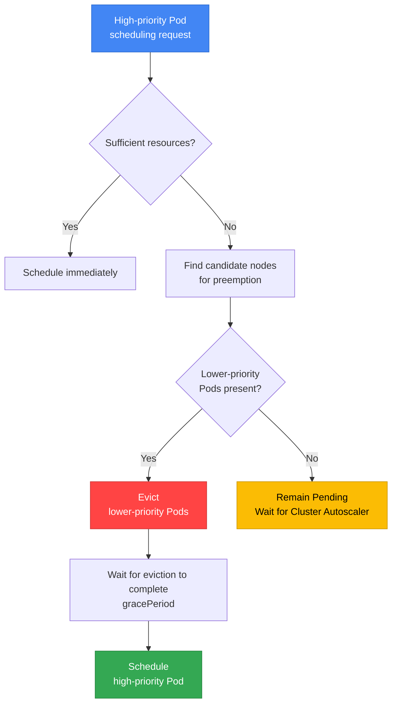

**Preemption decision process:**

1. **Scheduling of a high-priority Pod fails**
2. **Find candidate nodes for preemption**: Find nodes where the Pod can be scheduled after removing lower-priority Pods
3. **Select victim Pods**: Select Pods for removal starting with the lowest priority
4. **Consider PDB**: Prefer victim sets that avoid PDB violations, but allow preemption that violates a PDB if no suitable set exists
5. **Graceful eviction**: Evict while respecting `terminationGracePeriodSeconds`
6. **Schedule after resources become available**: Place the high-priority Pod

:::tip Relationship Between Preemption and PDB
Scheduler preemption considers PDBs on a **best-effort basis**. If it cannot find victims that avoid a PDB violation, it can remove lower-priority Pods despite violating the PDB. This is not the same guarantee as budget enforcement through the Eviction API. See [Kubernetes PDB support during preemption](https://kubernetes.io/docs/concepts/scheduling-eviction/pod-priority-preemption/#poddisruptionbudget-is-supported-but-not-guaranteed).
:::

**Example preemption scenario:**

```yaml
# Current cluster state: node resources are almost fully utilized
# Node-1: low-priority-pod (CPU: 2, Memory: 4Gi)
# Node-2: standard-priority-pod (CPU: 2, Memory: 4Gi)

# Request to create a high-priority Pod
apiVersion: v1
kind: Pod
metadata:
  name: critical-payment
spec:
  priorityClassName: business-critical  # Priority: 1000000
  containers:
  - name: payment
    image: payment:v1.0
    resources:
      requests:
        cpu: "2"
        memory: 4Gi

# Result:
# 1. The scheduler detects insufficient resources
# 2. Select low-priority-pod (priority: 1000) as the victim
# 3. low-priority-pod Evict (graceful shutdown)
# 4. Schedule the critical-payment Pod
```

### 7.4 PreemptionPolicy: Never

Specific workloads can be configured not to preempt other Pods:

```yaml
apiVersion: scheduling.k8s.io/v1
kind: PriorityClass
metadata:
  name: batch-job
value: 5000
globalDefault: false
preemptionPolicy: Never  # Do not preempt other Pods
description: "Batch jobs that wait for available resources"
```

**Use cases:**
- **Batch jobs**: When waiting for resources to become available is preferable
- **Test/development workloads**: When production workloads must not be disturbed
- **Low urgency**: Tasks that do not need to run immediately

### 7.5 Advanced Patterns Combining Priority and QoS Class

PriorityClass and QoS Class serve different purposes, but using them together can ensure more predictable behavior when resources are insufficient. This section introduces the interaction between the two concepts and combined patterns validated in production environments.

#### Review of QoS Classes

Kubernetes automatically assigns a QoS Class based on a Pod's resource requests and limits.

| QoS Class | Conditions | CPU throttling | Eviction order during OOM | Typical use |
|-----------|------|-------------|-------------------|------------|
| **Guaranteed** | requests = limits for all containers | Only when limits are reached | Last (safest) | Mission-critical workloads, DB |
| **Burstable** | requests set for at least one container, requests < limits | Only when limits are reached | Middle | General web apps, APIs |
| **BestEffort** | Neither requests nor limits set | No limits | First (at risk) | Batch jobs, tests |

**QoS Class assignment rules:**

```yaml
# Guaranteed: requests = limits (all containers)
resources:
  requests:
    cpu: "1"
    memory: 2Gi
  limits:
    cpu: "1"      # Same as requests
    memory: 2Gi   # Same as requests

# Burstable: requests < limits
resources:
  requests:
    cpu: "500m"
    memory: 1Gi
  limits:
    cpu: "2"      # Greater than requests
    memory: 4Gi   # Greater than requests

# BestEffort: nothing configured
resources: {}
```

**Checking QoS Class:**
```bash
# Check a Pod's QoS Class
kubectl get pod my-pod -o jsonpath='{.status.qosClass}'

# QoS distribution of all Pods in the namespace
kubectl get pods -n production \
  -o custom-columns=NAME:.metadata.name,QOS:.status.qosClass
```

#### Recommended Combination Matrix

The combination of Priority and QoS determines the level of resource guarantees and cost.

| Combination | Priority | QoS | Scheduling priority | OOM survival rate | Cost | Recommended workloads | Examples |
|------|----------|-----|-----------------|-------------|------|-------------|------|
| **Tier 1** | critical (10000) | Guaranteed | Highest | Highest | High | Mission-critical workloads | Payment systems, DB |
| **Tier 2** | high (5000) | Guaranteed | High | High | Medium-high | Core services | API gateway |
| **Tier 3** | standard (1000) | Burstable | Normal | Medium | Medium | General web apps | Frontend, back office |
| **Tier 4** | low (500) | Burstable | Low | Low | Low | Internal tools | Monitoring, logging |
| **Tier 5** | batch (100) | BestEffort | Lowest | Very low | Very low | Batch, CI/CD | Data pipelines |

**Details of each combination:**

##### Tier 1: Guaranteed + critical-priority (Strongest Guarantees)

**Characteristics:**
- Preempts other Pods for immediate placement during scheduling
- Guarantees CPU/memory (requests = limits)
- Terminates last during OOM
- Never evicted, even under node resource pressure

**Practical YAML:**
```yaml
apiVersion: apps/v1
kind: Deployment
metadata:
  name: payment-gateway
  namespace: production
spec:
  replicas: 6
  selector:
    matchLabels:
      app: payment-gateway
      tier: critical
  template:
    metadata:
      labels:
        app: payment-gateway
        tier: critical
    spec:
      priorityClassName: critical-priority  # Priority: 10000
      containers:
      - name: gateway
        image: payment-gateway:v3.5
        resources:
          requests:
            cpu: "2"
            memory: 4Gi
          limits:
            cpu: "2"       # Same as requests → Guaranteed
            memory: 4Gi    # Same as requests → Guaranteed
        livenessProbe:
          httpGet:
            path: /health
            port: 8080
          initialDelaySeconds: 30
          periodSeconds: 10
        readinessProbe:
          httpGet:
            path: /ready
            port: 8080
          initialDelaySeconds: 10
          periodSeconds: 5
---
apiVersion: policy/v1
kind: PodDisruptionBudget
metadata:
  name: payment-gateway-pdb
  namespace: production
spec:
  minAvailable: 4  # Always maintain at least 4 out of 6
  selector:
    matchLabels:
      app: payment-gateway
```

**Usage scenarios:**
- Financial transaction systems (payments, transfers)
- Real-time order processing
- Databases (MySQL, PostgreSQL)
- Message queues (Kafka, RabbitMQ)

##### Tier 2: Guaranteed + high-priority (Core Services)

**Characteristics:**
- Priority immediately below critical
- Guaranteed CPU/memory
- Terminates after BestEffort and Burstable during OOM
- Recommended configuration for typical production services

**Practical YAML:**
```yaml
apiVersion: apps/v1
kind: Deployment
metadata:
  name: api-server
  namespace: production
spec:
  replicas: 10
  selector:
    matchLabels:
      app: api-server
  template:
    metadata:
      labels:
        app: api-server
    spec:
      priorityClassName: high-priority  # Priority: 5000
      containers:
      - name: api
        image: api-server:v2.8
        resources:
          requests:
            cpu: "1"
            memory: 2Gi
          limits:
            cpu: "1"       # Guaranteed
            memory: 2Gi    # Guaranteed
        env:
        - name: MAX_CONNECTIONS
          value: "1000"
```

**Usage scenarios:**
- REST API servers
- GraphQL servers
- Authentication/authorization services
- Session management services

##### Tier 3: Burstable + standard-priority (General Web Apps)

**Characteristics:**
- Guaranteed baseline resources (requests)
- Can use additional resources when available (limits > requests)
- Cost-effective and stable
- Suitable for most web applications

**Practical YAML:**
```yaml
apiVersion: apps/v1
kind: Deployment
metadata:
  name: web-frontend
  namespace: production
spec:
  replicas: 8
  selector:
    matchLabels:
      app: web-frontend
  template:
    metadata:
      labels:
        app: web-frontend
    spec:
      priorityClassName: standard-priority  # Priority: 1000
      containers:
      - name: frontend
        image: web-frontend:v1.12
        resources:
          requests:
            cpu: "500m"    # Minimum guarantee
            memory: 1Gi    # Minimum guarantee
          limits:
            cpu: "2"       # Allow bursts up to 4 times the baseline
            memory: 4Gi    # Allow bursts up to 4 times the baseline
        env:
        - name: NODE_ENV
          value: "production"
```

**Usage scenarios:**
- Web frontends (React, Vue, Angular)
- Back-office applications
- Internal dashboards
- CMS (Content Management System)

##### Tier 4: Burstable + low-priority (Internal Tools)

**Characteristics:**
- Minimal resource guarantees
- Subject to preemption when resources are insufficient
- Minimizes cost
- Limited impact from service interruptions

**Practical YAML:**
```yaml
apiVersion: apps/v1
kind: Deployment
metadata:
  name: monitoring-agent
  namespace: monitoring
spec:
  replicas: 3
  selector:
    matchLabels:
      app: monitoring-agent
  template:
    metadata:
      labels:
        app: monitoring-agent
    spec:
      priorityClassName: low-priority  # Priority: 500
      containers:
      - name: agent
        image: monitoring-agent:v2.1
        resources:
          requests:
            cpu: "100m"    # Minimal guarantee
            memory: 256Mi
          limits:
            cpu: "500m"
            memory: 1Gi
```

**Usage scenarios:**
- Monitoring agents
- Log collectors (Fluent Bit, Fluentd)
- Metrics exporters
- Development tools

##### Tier 5: BestEffort + batch-priority (Batch Jobs)

**Characteristics:**
- No resource guarantees (uses only idle resources)
- Terminates first during OOM
- Minimizes cost (can use Spot Instances)
- Suitable for retryable tasks

**Practical YAML:**
```yaml
apiVersion: batch/v1
kind: CronJob
metadata:
  name: data-pipeline
  namespace: batch
spec:
  schedule: "0 2 * * *"  # Every day at 2 a.m.
  jobTemplate:
    spec:
      template:
        spec:
          priorityClassName: batch-priority  # Priority: 100
          restartPolicy: OnFailure
          containers:
          - name: etl
            image: data-pipeline:v1.8
            resources: {}  # BestEffort: no requests/limits
            env:
            - name: BATCH_SIZE
              value: "10000"
          # Place on Spot Instances
          nodeSelector:
            karpenter.sh/capacity-type: spot
          tolerations:
          - key: karpenter.sh/capacity-type
            operator: Equal
            value: spot
            effect: NoSchedule
```

**Usage scenarios:**
- ETL pipelines
- Data analysis jobs
- CI/CD builds
- Image/video processing

#### Eviction Order (During OOM)

When a node runs low on memory, Kubelet terminates Pods in the following order:

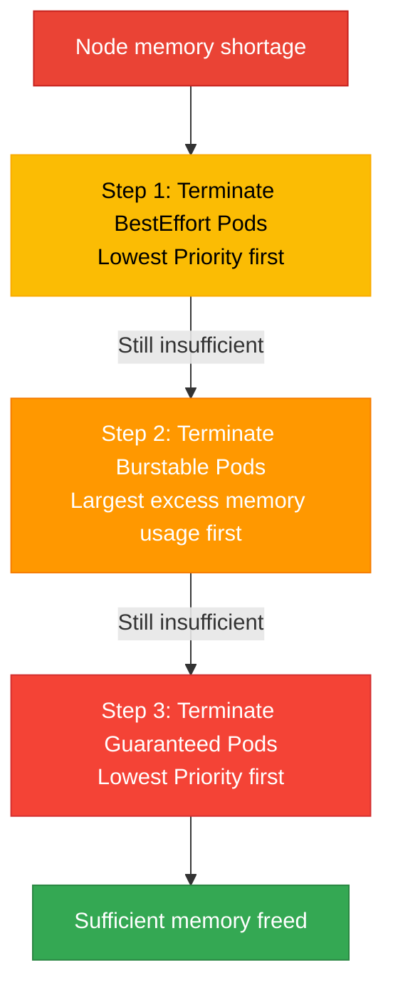

**Eviction decision factors:**

1. **QoS Class** (primary criterion)
   - BestEffort → Burstable → Guaranteed order

2. **Priority** (secondary criterion, when QoS is the same)
   - Terminate lower-priority Pods first

3. **Memory usage** (tertiary criterion, when QoS + Priority are the same)
   - Terminate Pods with greater usage above their requests first

**Example scenario:**

```yaml
# Node state: 31GB of 32GB memory in use, OOM imminent

# Pod 1: BestEffort + low-priority (500)
# - In use: 4GB
# → Eviction order: 1st

# Pod 2: Burstable + standard-priority (1000)
# - requests: 2GB, limits: 8GB
# - In use: 6GB (+4GB above requests)
# → Eviction order: 2nd

# Pod 3: Burstable + high-priority (5000)
# - requests: 4GB, limits: 8GB
# - In use: 5GB (+1GB above requests)
# → Eviction order: 3rd

# Pod 4: Guaranteed + critical-priority (10000)
# - requests = limits: 8GB
# - In use: 8GB (no excess)
# → Eviction order: 4th (last)
```

#### Kubelet Eviction Configuration

Kubelet eviction thresholds are configured at the node level. In EKS, they can be customized through User Data scripts.

**Default configuration (EKS):**
```yaml
# /etc/kubernetes/kubelet/kubelet-config.json
{
  "evictionHard": {
    "memory.available": "100Mi",
    "nodefs.available": "10%",
    "imagefs.available": "15%"
  },
  "evictionSoft": {
    "memory.available": "500Mi",
    "nodefs.available": "15%"
  },
  "evictionSoftGracePeriod": {
    "memory.available": "1m30s",
    "nodefs.available": "2m"
  }
}
```

**Customization example (Karpenter EC2NodeClass):**
```yaml
apiVersion: karpenter.k8s.aws/v1
kind: EC2NodeClass
metadata:
  name: custom-eviction
spec:
  amiFamily: AL2023
  userData: |
    #!/bin/bash
    # Modify the Kubelet configuration
    cat <<EOF > /etc/kubernetes/kubelet/kubelet-config.json
    {
      "evictionHard": {
        "memory.available": "200Mi",  # Use a more conservative setting
        "nodefs.available": "10%"
      },
      "evictionSoft": {
        "memory.available": "1Gi",    # Raise the soft threshold
        "nodefs.available": "15%"
      },
      "evictionSoftGracePeriod": {
        "memory.available": "2m",     # Increase the grace period
        "nodefs.available": "3m"
      }
    }
    EOF

    systemctl restart kubelet
```

**Eviction threshold descriptions:**

| Setting | Meaning | Default | Recommended (production) |
|------|------|--------|-----------------|
| `evictionHard.memory.available` | Immediate eviction at or below this level | 100Mi | 200~500Mi |
| `evictionSoft.memory.available` | Eviction after remaining at or below this level for a specified duration | 500Mi | 1Gi |
| `evictionSoftGracePeriod.memory.available` | Grace period for the soft threshold | 1m30s | 2~5m |

:::warning Eviction Configuration Considerations
If the `evictionHard` threshold is too low, the OOM Killer acts first, making Kubelet's graceful eviction ineffective. Conversely, setting it too high reduces node resource utilization and increases cost.

**Recommended approach:**
- General workloads: `evictionHard: 200Mi`, `evictionSoft: 1Gi`
- Memory-intensive workloads: `evictionHard: 500Mi`, `evictionSoft: 2Gi`
- Monitoring: Track the `kube_node_status_condition{condition="MemoryPressure"}` metric
:::

#### Validating Practical Combination Patterns

**Pattern 1: Multi-Tier Architecture**

```yaml
# Tier 1: Database (Guaranteed + critical)
apiVersion: apps/v1
kind: StatefulSet
metadata:
  name: postgres
spec:
  serviceName: postgres
  replicas: 3
  template:
    spec:
      priorityClassName: critical-priority
      containers:
      - name: postgres
        image: postgres:16
        resources:
          requests:
            cpu: "4"
            memory: 16Gi
          limits:
            cpu: "4"
            memory: 16Gi
---
# Tier 2: API Server (Guaranteed + high)
apiVersion: apps/v1
kind: Deployment
metadata:
  name: api-server
spec:
  replicas: 10
  template:
    spec:
      priorityClassName: high-priority
      containers:
      - name: api
        resources:
          requests: { cpu: "1", memory: 2Gi }
          limits: { cpu: "1", memory: 2Gi }
---
# Tier 3: Frontend (Burstable + standard)
apiVersion: apps/v1
kind: Deployment
metadata:
  name: frontend
spec:
  replicas: 8
  template:
    spec:
      priorityClassName: standard-priority
      containers:
      - name: frontend
        resources:
          requests: { cpu: "500m", memory: 1Gi }
          limits: { cpu: "2", memory: 4Gi }
---
# Tier 4: Monitoring (Burstable + low)
apiVersion: apps/v1
kind: DaemonSet
metadata:
  name: node-exporter
spec:
  template:
    spec:
      priorityClassName: low-priority
      containers:
      - name: exporter
        resources:
          requests: { cpu: "100m", memory: 128Mi }
          limits: { cpu: "200m", memory: 256Mi }
```

**Verification commands:**
```bash
# Check QoS + Priority distribution
kubectl get pods -A -o custom-columns=\
NAME:.metadata.name,\
NAMESPACE:.metadata.namespace,\
QOS:.status.qosClass,\
PRIORITY:.spec.priorityClassName,\
CPU_REQ:.spec.containers[0].resources.requests.cpu,\
MEM_REQ:.spec.containers[0].resources.requests.memory

# Check QoS distribution per node
kubectl describe node <node-name> | grep -A 10 "Non-terminated Pods"
```

#### Troubleshooting: QoS + Priority Combination Issues

| Symptom | Cause | Resolution |
|------|------|----------|
| Guaranteed Pod is OOM-killed | limits are too low | Profile memory and increase limits |
| Burstable Pod experiences CPU throttling | limits reached, insufficient node resources | Increase requests or add nodes |
| Low-priority Pod remains Pending | High-priority Pods monopolize resources | Add nodes or adjust Priority |
| BestEffort Pod terminates immediately | Eviction threshold reached | Switch to Burstable and set requests |

:::tip QoS + Priority Optimization Tips
1. **Monitoring**: Track actual usage with the Prometheus metrics `container_memory_working_set_bytes` and `container_cpu_usage_seconds_total`
2. **Rightsizing**: Refer to VPA (Vertical Pod Autoscaler) recommendations
3. **Gradual transition**: Apply progressively in the order BestEffort → Burstable → Guaranteed
4. **Cost balance**: Setting all Pods to Guaranteed increases cost; apply different configurations based on workload importance
:::

---

## 8. Descheduler

Descheduler balances a cluster by **relocating** Pods that have already been scheduled. Because the Kubernetes scheduler handles only initial placement, imbalances between nodes can develop over time.

### 8.1 Why Descheduler Is Needed

**Scenario 1: Imbalance after adding nodes**
- Pods are concentrated on existing nodes, while newly added nodes are empty
- Descheduler evicts older Pods → the scheduler relocates them to new nodes

**Scenario 2: Affinity/Anti-Affinity violations**
- Node labels change after Pod placement, violating Affinity conditions
- Descheduler evicts violating Pods → relocates them to nodes that meet the conditions

**Scenario 3: Resource fragmentation**
- Some nodes have excessive CPU utilization, while others are idle
- Descheduler resolves the imbalance

### 8.2 Installing Descheduler (Helm)

```bash
# Add the Descheduler Helm chart
helm repo add descheduler https://kubernetes-sigs.github.io/descheduler/
helm repo update

# Basic installation
helm install descheduler descheduler/descheduler \
  --namespace kube-system \
  --set cronJobApiVersion="batch/v1" \
  --set schedule="*/15 * * * *"  # Run every 15 minutes
```

**CronJob vs. Deployment mode:**

| Mode | Execution interval | Resource usage | Recommended environment |
|------|----------|------------|----------|
| **CronJob** | Periodic (e.g., 15 minutes) | Uses resources only while running | Small to medium clusters (recommended) |
| **Deployment** | Continuous execution | Always uses resources | Large clusters (1000+ nodes) |

### 8.3 Key Descheduler Strategies

#### Strategy 1: RemoveDuplicates

**Purpose**: Distribute Pods from the same controller (ReplicaSet, Deployment) when multiple Pods are placed on one node

```yaml
apiVersion: v1
kind: ConfigMap
metadata:
  name: descheduler-policy
  namespace: kube-system
data:
  policy.yaml: |
    apiVersion: "descheduler/v1alpha2"
    kind: "DeschedulerPolicy"
    profiles:
      - name: default
        pluginConfig:
        - name: RemoveDuplicates
          args:
            # Keep only 1 Pod from the same controller per node
            excludeOwnerKinds:
            - "ReplicaSet"
            - "StatefulSet"
        plugins:
          balance:
            enabled:
            - RemoveDuplicates
```

**Effect**: When multiple replicas of the same Deployment are on one node, evict some to distribute them across other nodes

#### Strategy 2: LowNodeUtilization

**Purpose**: Balance nodes with low and high resource utilization

```yaml
apiVersion: v1
kind: ConfigMap
metadata:
  name: descheduler-policy
  namespace: kube-system
data:
  policy.yaml: |
    apiVersion: "descheduler/v1alpha2"
    kind: "DeschedulerPolicy"
    profiles:
      - name: default
        pluginConfig:
        - name: LowNodeUtilization
          args:
            # Low utilization thresholds (underutilized at or below these values)
            thresholds:
              cpu: 20
              memory: 20
              pods: 20
            # High utilization thresholds (overutilized at or above these values)
            targetThresholds:
              cpu: 50
              memory: 50
              pods: 50
        plugins:
          balance:
            enabled:
            - LowNodeUtilization
```

**Behavior:**
1. Identify nodes with CPU/memory/Pod counts below 20% (underutilized)
2. Identify nodes at or above 50% (overutilized)
3. Evict Pods from overutilized nodes
4. The Kubernetes scheduler relocates them to underutilized nodes

#### Strategy 3: RemovePodsViolatingNodeAffinity

**Purpose**: Remove Pods that violate Node Affinity conditions (after node labels change)

```yaml
apiVersion: v1
kind: ConfigMap
metadata:
  name: descheduler-policy
  namespace: kube-system
data:
  policy.yaml: |
    apiVersion: "descheduler/v1alpha2"
    kind: "DeschedulerPolicy"
    profiles:
      - name: default
        pluginConfig:
        - name: RemovePodsViolatingNodeAffinity
          args:
            nodeAffinityType:
            - requiredDuringSchedulingIgnoredDuringExecution
        plugins:
          deschedule:
            enabled:
            - RemovePodsViolatingNodeAffinity
```

**Scenario**: Remove the `gpu=true` label from a GPU node → Pods requiring GPUs remain on the unlabeled node → Descheduler evicts them → relocates them to GPU nodes

#### Strategy 4: RemovePodsViolatingInterPodAntiAffinity

**Purpose**: Remove Pods that violate Pod Anti-Affinity conditions

```yaml
apiVersion: v1
kind: ConfigMap
metadata:
  name: descheduler-policy
  namespace: kube-system
data:
  policy.yaml: |
    apiVersion: "descheduler/v1alpha2"
    kind: "DeschedulerPolicy"
    profiles:
      - name: default
        plugins:
          deschedule:
            enabled:
            - RemovePodsViolatingInterPodAntiAffinity
```

**Scenario**: Initially, sufficient nodes satisfy Anti-Affinity → node scale-down places violating Pods on the same node → Descheduler relocates them after nodes are added

#### Strategy 5: RemovePodsHavingTooManyRestarts

**Purpose**: Remove problematic Pods that restart excessively (retry on another node)

```yaml
apiVersion: v1
kind: ConfigMap
metadata:
  name: descheduler-policy
  namespace: kube-system
data:
  policy.yaml: |
    apiVersion: "descheduler/v1alpha2"
    kind: "DeschedulerPolicy"
    profiles:
      - name: default
        pluginConfig:
        - name: RemovePodsHavingTooManyRestarts
          args:
            podRestartThreshold: 10  # Evict after 10 or more restarts
            includingInitContainers: true
        plugins:
          deschedule:
            enabled:
            - RemovePodsHavingTooManyRestarts
```

#### Strategy 6: PodLifeTime

**Purpose**: Remove old Pods to replace them with the latest images/configuration

```yaml
apiVersion: v1
kind: ConfigMap
metadata:
  name: descheduler-policy
  namespace: kube-system
data:
  policy.yaml: |
    apiVersion: "descheduler/v1alpha2"
    kind: "DeschedulerPolicy"
    profiles:
      - name: default
        pluginConfig:
        - name: PodLifeTime
          args:
            maxPodLifeTimeSeconds: 604800  # 7 days (7 * 24 * 3600)
            # Target only Pods in specific states
            states:
            - Running
            # Exclude Pods with specific labels
            labelSelector:
              matchExpressions:
              - key: app
                operator: NotIn
                values:
                - stateful-db
        plugins:
          deschedule:
            enabled:
            - PodLifeTime
```

### 8.4 Descheduler vs. Karpenter Consolidation

| Feature | Descheduler | Karpenter Consolidation |
|------|------------|------------------------|
| **Purpose** | Pod relocation (balancing) | Node removal (cost savings) |
| **Scope** | Pod level | Node level |
| **Execution interval** | CronJob (e.g., 15 minutes) | Continuous monitoring (real time) |
| **Strategies** | Various strategies (6+) | Empty / Underutilized nodes |
| **Respects PDB** | ✅ Yes | ✅ Yes |
| **Adds/removes nodes** | ❌ No | ✅ Yes |
| **Cluster Autoscaler compatibility** | ✅ Yes | N/A (alternative) |
| **Main use cases** | Resolving imbalance and Affinity violations | Cost optimization, node consolidation |
| **Can be used together** | ✅ Can run alongside Karpenter | ✅ Can run alongside Descheduler |

:::tip Recommended Combination: Descheduler + Karpenter
Descheduler specializes in Pod relocation, while Karpenter specializes in node management. The two tools complement each other when used together:
- Descheduler evicts Pods that contribute to imbalance
- The Kubernetes scheduler relocates Pods to other nodes
- Karpenter removes empty nodes to reduce cost
:::

**Example configuration for using both tools:**

```yaml
# Descheduler: rebalance every 15 minutes
apiVersion: batch/v1
kind: CronJob
metadata:
  name: descheduler
  namespace: kube-system
spec:
  schedule: "*/15 * * * *"
  jobTemplate:
    spec:
      template:
        spec:
          containers:
          - name: descheduler
            image: registry.k8s.io/descheduler/descheduler:v0.29.0
            command:
            - /bin/descheduler
            - --policy-config-file=/policy/policy.yaml
---
# Karpenter: continuous node consolidation
apiVersion: karpenter.sh/v1
kind: NodePool
metadata:
  name: general
spec:
  disruption:
    consolidationPolicy: WhenEmptyOrUnderutilized
    consolidateAfter: 5m  # Start consolidation after 5 minutes
    budgets:
    - nodes: "20%"
```

#### 8.4.1 Practical Patterns Combining Descheduler and Karpenter

Using Descheduler and Karpenter together automatically coordinates Pod relocation and node consolidation to improve cluster efficiency and reduce cost simultaneously.

**How the combination works:**

1. **Step 1 (Descheduler)**: Detect resource imbalance and relocate Pods
   - Evict Pods from overutilized nodes with the `LowNodeUtilization` strategy
   - Relocate unnecessarily placed Pods with `RemoveDuplicates`, `RemovePodsViolatingNodeAffinity`, and other strategies

2. **Step 2 (Kubernetes Scheduler)**: Reschedule evicted Pods onto optimal nodes
   - Select nodes with available resources
   - Satisfy Affinity/Anti-Affinity and Topology Spread conditions

3. **Step 3 (Karpenter)**: Remove empty or underutilized nodes
   - Consolidate empty nodes after the `consolidateAfter` duration elapses
   - Consolidate Pods from multiple underutilized nodes onto fewer nodes
   - Reduce cost by terminating unnecessary nodes

**Timing coordination example:**

```yaml
# Descheduler: run LowNodeUtilization every 15 minutes
apiVersion: v1
kind: ConfigMap
metadata:
  name: descheduler-policy
  namespace: kube-system
data:
  policy.yaml: |
    apiVersion: "descheduler/v1alpha2"
    kind: "DeschedulerPolicy"
    profiles:
      - name: default
        pluginConfig:
        - name: LowNodeUtilization
          args:
            thresholds:
              cpu: 20
              memory: 20
              pods: 20
            targetThresholds:
              cpu: 50
              memory: 50
              pods: 50
        plugins:
          balance:
            enabled:
            - LowNodeUtilization
---
# Karpenter: consolidate empty nodes after 5 minutes (allow sufficient time after Descheduler runs)
apiVersion: karpenter.sh/v1
kind: NodePool
metadata:
  name: general-pool
spec:
  disruption:
    consolidationPolicy: WhenEmptyOrUnderutilized
    consolidateAfter: 5m  # Wait 5 minutes after Descheduler moves Pods
    budgets:
    - nodes: "20%"  # Consolidate at most 20% of nodes at a time
  template:
    spec:
      requirements:
      - key: karpenter.sh/capacity-type
        operator: In
        values: ["on-demand", "spot"]
      - key: kubernetes.io/arch
        operator: In
        values: ["amd64"]
```

**Example operational scenario:**

```
Time: 00:00 - Descheduler runs (15-minute interval)
  └─ Node-A (CPU 80%, Memory 85%) → detected as overutilized
  └─ Node-B (CPU 15%, Memory 10%) → detected as underutilized
  └─ Evict Pod-1 and Pod-2 from Node-A

Time: 00:01 - Kubernetes Scheduler relocates Pods
  └─ Pod-1 → scheduled on Node-B
  └─ Pod-2 → scheduled on Node-C
  └─ Node-A now has CPU 50%, Memory 55% (normal range)

Time: 00:06 - Karpenter consolidation (5 minutes elapsed)
  └─ Node-B: still underutilized but running Pods → retain
  └─ Node-D: detected as empty (previously hosted Pods that have moved) → terminate
  └─ Cost savings achieved
```

**Interaction with PDB:**

Both Descheduler and Karpenter respect PDB, allowing them to be used together safely:

```yaml
# Configure an application PDB
apiVersion: policy/v1
kind: PodDisruptionBudget
metadata:
  name: api-server-pdb
spec:
  minAvailable: 2
  selector:
    matchLabels:
      app: api-server
---
# Both Descheduler and Karpenter respect this PDB
# - Descheduler: block evictions that violate minAvailable
# - Karpenter: ensure minAvailable when removing nodes
```

**Considerations: Preventing Pod Flapping**

Conflicting timing between Descheduler and Karpenter can cause Pods to move repeatedly:

:::warning Preventing Pod Flapping
Coordinate the Descheduler execution interval with Karpenter's `consolidateAfter` interval:
- **Recommended pattern**: Descheduler every 15 minutes + Karpenter `consolidateAfter` of 5 minutes
- **Risky pattern**: Descheduler every 5 minutes + Karpenter `consolidateAfter` of 1 minute (too frequent)
- **Safeguard**: Limit the number of nodes consolidated simultaneously with Karpenter `budgets`
:::

**Monitoring and verification:**

```bash
# 1. Check Descheduler logs
kubectl logs -n kube-system -l app=descheduler --tail=50

# 2. Check Karpenter consolidation events
kubectl logs -n karpenter -l app.kubernetes.io/name=karpenter --tail=50 | grep consolidation

# 3. Check Pod distribution per node
kubectl get pods -A -o wide | awk '{print $8}' | sort | uniq -c

# 4. Check node resource utilization
kubectl top nodes

# 5. Check PDB status (whether evictions are blocked)
kubectl get pdb -A
```

**Benefits of the combination:**

| Benefit | Description |
|------|------|
| **Automatic balancing** | Descheduler automatically resolves resource imbalance |
| **Cost optimization** | Karpenter removes unnecessary nodes |
| **Safety guarantees** | Respecting PDB prevents service interruptions |
| **Reduced operational burden** | Automatic coordination without manual intervention |
| **Scalability** | Works regardless of cluster size |

---

## 9. Comprehensive EKS Scheduling Strategy

### 9.1 Scheduling Configuration Matrix by Workload Type

The following table summarizes recommended scheduling settings for various workload types.

| Workload Type | Node Selector/Affinity | Pod Anti-Affinity | Topology Spread | Taints/Tolerations | PriorityClass | PDB | Additional Considerations |
|-------------|----------------------|-------------------|-----------------|-------------------|---------------|-----|-------------|
| **API server** | On-Demand nodes | Soft (spread across nodes) | Hard (spread across AZs) | - | `high-priority` | `minAvailable: "67%"` | Readiness Probe required |
| **Payment service** | On-Demand, specific instance types | Hard (spread across nodes) | Hard (spread across AZs, minDomains: 3) | - | `business-critical` | `minAvailable: 2` | PCI-DSS-compliant nodes |
| **ML training** | GPU nodes (g5.xlarge+) | Soft (spread across nodes) | - | GPU Taint Tolerate | `high-priority` | `maxUnavailable: 1` | Spot supported (with checkpointing) |
| **ML inference** | GPU nodes | Hard (spread across AZs) | Hard (spread across AZs) | GPU Taint Tolerate | `high-priority` | `minAvailable: 2` | On-Demand recommended |
| **Database (StatefulSet)** | Nodes with EBS availability, WaitForFirstConsumer | Hard (spread across nodes) | Hard (spread across AZs) | - | `business-critical` | `maxUnavailable: 1` | PVC backups required |
| **Cache (Redis)** | Memory-optimized nodes (r6i) | Hard (spread across nodes) | Hard (spread across AZs) | - | `high-priority` | `minAvailable: 2` | Configure persistence |
| **Batch jobs** | Allow Spot nodes | - | - | Spot Tolerate | `low-priority`, `preemptionPolicy: Never` | - | Design for restartability |
| **CI/CD Runner** | Prefer Spot nodes | - | - | Spot Tolerate | `low-priority` | - | Ephemeral jobs |
| **Log collection (DaemonSet)** | All nodes | - | - | Tolerate all taints | `system-critical` | - | Use `hostPath` |
| **Ingress Controller** | On-Demand | Hard (spread across nodes) | Hard (spread across AZs) | - | `high-priority` | `minAvailable: 2` | Configure NodePort / LB |
| **Monitoring (Prometheus)** | Dedicated monitoring nodes | Soft (spread across nodes) | Soft (spread across AZs) | Tolerate monitoring taints | `high-priority` | `minAvailable: 1` | Large-capacity storage |
| **Web frontend** | ARM nodes supported | Soft (spread across nodes) | Hard (spread across AZs) | - | `standard-priority` | `minAvailable: "50%"` | CDN integration |
| **Background workers** | Spot nodes | - | Soft (spread across AZs) | Spot Tolerate | `standard-priority` | `maxUnavailable: "50%"` | Retry logic required |
| **Serverless (Knative)** | Mix of Spot + On-Demand | - | Soft (spread across AZs) | - | `standard-priority` | - | Configure scale-to-zero |
| **AI/ML training** | GPU nodes (g5.xlarge+) | Soft (spread across nodes) | Soft (spread across AZs) | GPU Taint Tolerate | `high-priority` | `maxUnavailable: 1` | Checkpointing, Spot supported |
| **AI/ML inference** | GPU/Inferentia nodes | Hard (spread across nodes) | Hard (spread across AZs) | GPU Taint Tolerate | `high-priority` | `minAvailable: 2` | On-Demand recommended |

### 9.2 AI/ML Workload Scheduling Patterns

AI/ML workloads require resources such as GPUs, large amounts of memory, and specialized accelerators (Inferentia, Trainium). Training and inference have significantly different requirements.

#### 9.2.1 GPU Workload Scheduling

GPU workloads are scheduled efficiently by combining dedicated node isolation, resource requests, and Node Affinity.

**GPU resource request pattern:**

```yaml
apiVersion: v1
kind: Pod
metadata:
  name: gpu-training-job
spec:
  containers:
  - name: trainer
    image: ml/trainer:v3.0
    resources:
      requests:
        nvidia.com/gpu: 1  # Request 1 GPU
        cpu: "4"
        memory: 16Gi
      limits:
        nvidia.com/gpu: 1  # Set limits equal to requests
        cpu: "4"
        memory: 16Gi
```

:::info GPU Resource Management
`nvidia.com/gpu` can only be requested in whole numbers, and limits must equal requests. GPUs cannot be overcommitted, so consider Multi-Instance GPU (MIG) or Time-Slicing when fractional GPUs are required.
:::

**Dedicated GPU NodePool + workload deployment:**

```yaml
# Karpenter NodePool: Dedicated GPU node group
apiVersion: karpenter.sh/v1
kind: NodePool
metadata:
  name: gpu-pool
spec:
  template:
    spec:
      requirements:
      - key: node.kubernetes.io/instance-type
        operator: In
        values:
        - g5.xlarge   # 1x NVIDIA A10G, 4 vCPU, 16 GiB
        - g5.2xlarge  # 1x NVIDIA A10G, 8 vCPU, 32 GiB
        - g5.4xlarge  # 1x NVIDIA A10G, 16 vCPU, 64 GiB
        - g5.12xlarge # 4x NVIDIA A10G, 48 vCPU, 192 GiB
      - key: karpenter.sh/capacity-type
        operator: In
        values:
        - on-demand  # On-Demand is recommended for training workloads
      # Isolate dedicated GPU nodes
      taints:
      - key: nvidia.com/gpu
        value: present
        effect: NoSchedule
      - key: workload-type
        value: ml-training
        effect: NoSchedule
      nodeClassRef:
        group: karpenter.k8s.aws
        kind: EC2NodeClass
        name: gpu-nodes
  limits:
    cpu: "200"
    memory: 800Gi
  disruption:
    consolidationPolicy: WhenEmpty
    consolidateAfter: 10m  # Remove empty GPU nodes after 10 minutes (cost savings)
---
# EC2NodeClass: GPU node configuration
apiVersion: karpenter.k8s.aws/v1
kind: EC2NodeClass
metadata:
  name: gpu-nodes
spec:
  amiFamily: AL2
  amiSelectorTerms:
  - alias: al2@latest  # EKS-optimized AMI with GPU drivers
  role: KarpenterNodeRole
  subnetSelectorTerms:
  - tags:
      karpenter.sh/discovery: my-cluster
  securityGroupSelectorTerms:
  - tags:
      karpenter.sh/discovery: my-cluster
  userData: |
    #!/bin/bash
    # Configure the NVIDIA container runtime (already included in the AMI)
    echo "GPU node initialized"
---
# ML training workload: Schedule on GPU nodes
apiVersion: batch/v1
kind: Job
metadata:
  name: model-training
spec:
  parallelism: 4  # 4 parallel training jobs
  completions: 4
  template:
    metadata:
      labels:
        app: model-training
    spec:
      # GPU Taint Tolerate
      tolerations:
      - key: nvidia.com/gpu
        operator: Equal
        value: present
        effect: NoSchedule
      - key: workload-type
        operator: Equal
        value: ml-training
        effect: NoSchedule
      # Select GPU nodes
      nodeSelector:
        node.kubernetes.io/instance-type: g5.2xlarge
      # Pod Anti-Affinity: Place each Job Pod on a different node
      affinity:
        podAntiAffinity:
          preferredDuringSchedulingIgnoredDuringExecution:
          - weight: 100
            podAffinityTerm:
              labelSelector:
                matchExpressions:
                - key: app
                  operator: In
                  values:
                  - model-training
              topologyKey: kubernetes.io/hostname
      containers:
      - name: trainer
        image: ml/pytorch-trainer:v2.0
        resources:
          requests:
            nvidia.com/gpu: 1
            cpu: "7"
            memory: 28Gi
          limits:
            nvidia.com/gpu: 1
            cpu: "7"
            memory: 28Gi
        env:
        - name: NCCL_DEBUG
          value: "INFO"
        volumeMounts:
        - name: data
          mountPath: /data
        - name: checkpoints
          mountPath: /checkpoints
      volumes:
      - name: data
        persistentVolumeClaim:
          claimName: training-data
      - name: checkpoints
        persistentVolumeClaim:
          claimName: model-checkpoints
      restartPolicy: OnFailure
```

**Using Multi-Instance GPU (MIG):**

GPUs such as the NVIDIA A100 and A30 support MIG, which partitions a single GPU into multiple independent instances.

```yaml
# Example MIG profile request (A100 GPU)
apiVersion: v1
kind: Pod
metadata:
  name: mig-inference
spec:
  containers:
  - name: inference
    image: ml/inference:v1.0
    resources:
      requests:
        nvidia.com/mig-1g.5gb: 1  # 1/7 A100 (1 GPU slice, 5GB memory)
      limits:
        nvidia.com/mig-1g.5gb: 1
```

**MIG profiles:**

| MIG Profile | GPU Slice | Memory | Use Case |
|-------------|-----------|--------|----------|
| `mig-1g.5gb` | 1/7 | 5GB | Small-scale inference |
| `mig-2g.10gb` | 2/7 | 10GB | Medium-scale inference |
| `mig-3g.20gb` | 3/7 | 20GB | Large-scale inference |
| `mig-7g.40gb` | 7/7 | 40GB | Full GPU (training) |

#### 9.2.2 Introduction to DRA (Dynamic Resource Allocation)

In Kubernetes 1.34+, Dynamic Resource Allocation (DRA) provides more flexible allocation of specialized resources such as GPUs.

**Benefits of DRA:**

| Traditional Approach (Device Plugin) | DRA (K8s 1.34+) |
|-------------------------|----------------|
| Static resource names (`nvidia.com/gpu`) | Dynamic resource claims |
| Node-level allocation | Fine-grained Pod-level control |
| Simple counting (1, 2, 3...) | Selection based on resource attributes |
| Limited sharing | Dynamic sharing/partitioning |
| Node restart required | Runtime reconfiguration |

**DRA ResourceClass and ResourceClaim example:**

```yaml
# ResourceClass: Define a GPU resource class
apiVersion: resource.k8s.io/v1alpha4
kind: ResourceClass
metadata:
  name: nvidia-a100-gpu
spec:
  driverName: gpu.nvidia.com
  parameters:
    apiVersion: gpu.nvidia.com/v1alpha1
    kind: GpuConfig
    memory: "40Gi"
    computeCapability: "8.0"  # A100
    migEnabled: true
---
# ResourceClaim: Request GPU resources
apiVersion: resource.k8s.io/v1alpha4
kind: ResourceClaim
metadata:
  name: ml-training-gpu
  namespace: ml-team
spec:
  resourceClassName: nvidia-a100-gpu
  parametersRef:
    apiGroup: gpu.nvidia.com
    kind: GpuClaimParameters
    name: training-params
---
# GpuClaimParameters: Detailed requirements
apiVersion: gpu.nvidia.com/v1alpha1
kind: GpuClaimParameters
metadata:
  name: training-params
  namespace: ml-team
spec:
  count: 1  # 1 GPU
  migProfile: "mig-3g.20gb"  # Specify the MIG profile
  sharing: "TimeSlicing"  # Allow time-sliced sharing
---
# Pod: Use the ResourceClaim
apiVersion: v1
kind: Pod
metadata:
  name: dra-training-pod
  namespace: ml-team
spec:
  resourceClaims:
  - name: gpu-claim
    resourceClaimName: ml-training-gpu
  containers:
  - name: trainer
    image: ml/trainer:v3.0
    resources:
      claims:
      - name: gpu-claim
    env:
    - name: CUDA_VISIBLE_DEVICES
      value: "0"
```

:::info DRA Availability
The DRA core became GA in Kubernetes 1.34 (`resource.k8s.io/v1`, enabled by default). It is available for production use and can currently run alongside the existing Device Plugin approach.
:::

#### 9.2.3 Scheduling Strategies for AI Training vs. Inference

AI/ML training and inference have significantly different requirements, so each needs an appropriate scheduling strategy.

**Training vs. inference comparison:**

| Comparison | Training | Inference |
|----------|----------------|-----------------|
| **GPU requirements** | Large scale (4-8+ GPUs) | Small scale (1-2 GPUs) or Inferentia |
| **Execution time** | Long-running (hours to days) | Low latency (ms to seconds) |
| **Workload type** | Batch job (Job) | Always-on service (Deployment) |
| **Instance types** | g5, p4d, p5 (NVIDIA) | g5 (small scale), inf2 (Inferentia), c7g (Graviton) |
| **Spot usage** | ✅ Supported (checkpointing required) | ⚠️ Use with caution (high availability required) |
| **PriorityClass** | `standard-priority` | `high-priority` |
| **PDB** | `maxUnavailable: 1` (allows restarts) | `minAvailable: 2` (ensures availability) |
| **Scheduling strategy** | Soft Anti-Affinity (prefer distribution) | Hard Anti-Affinity (fault isolation) |
| **Cost optimization** | Spot + Reserved Instances | On-Demand + Savings Plans |

**Training workload scheduling example:**

This Job targets 8 parallel Pods, each requesting 4 GPUs, for a total allocation of 32 GPUs when all are running. The [G5 specifications](https://aws.amazon.com/ec2/instance-types/g5/) list 4 A10G GPUs per `g5.12xlarge`, so reaching the target parallelism requires 8 such instances when GPU sharing is not configured. `parallelism` specifies [Job Pod parallelism](https://kubernetes.io/docs/concepts/workloads/controllers/job/#controlling-parallelism), not the GPU count itself. GPU `requests` and `limits` are set to equal values according to the [Kubernetes GPU resource rules](https://kubernetes.io/docs/tasks/manage-gpus/scheduling-gpus/#using-device-plugins).

```yaml
# Large-scale distributed training: 32-GPU Job (8 Pods × 4 GPUs per Pod)
apiVersion: batch/v1
kind: Job
metadata:
  name: distributed-training
spec:
  parallelism: 8
  completions: 8
  template:
    metadata:
      labels:
        app: distributed-training
    spec:
      tolerations:
      - key: nvidia.com/gpu
        operator: Exists
        effect: NoSchedule
      - key: karpenter.sh/capacity-type
        operator: Equal
        value: spot
        effect: NoSchedule  # Allow Spot nodes
      nodeSelector:
        node.kubernetes.io/instance-type: g5.12xlarge  # 4x A10G per node
      affinity:
        # Soft Anti-Affinity: Spread across different nodes when possible
        podAntiAffinity:
          preferredDuringSchedulingIgnoredDuringExecution:
          - weight: 100
            podAffinityTerm:
              labelSelector:
                matchLabels:
                  app: distributed-training
              topologyKey: kubernetes.io/hostname
      containers:
      - name: trainer
        image: ml/pytorch-distributed:v2.0
        resources:
          requests:
            nvidia.com/gpu: 4  # 4 GPUs per Pod
            cpu: "45"
            memory: 180Gi
          limits:
            nvidia.com/gpu: 4
        env:
        - name: MASTER_ADDR
          value: "distributed-training-master"
        - name: WORLD_SIZE
          value: "8"  # 8 processes in total
        - name: RANK
          valueFrom:
            fieldRef:
              fieldPath: metadata.name
        volumeMounts:
        - name: checkpoints
          mountPath: /checkpoints
      volumes:
      - name: checkpoints
        persistentVolumeClaim:
          claimName: training-checkpoints
      restartPolicy: OnFailure
```

#### 9.2.4 Setu: Proactive Scheduling with Kueue + Karpenter

Distributed AI training workloads (such as PyTorch DDP and JAX) require **Gang Scheduling**. If all GPU nodes are not ready at the same time, resources are wasted or training cannot start. Traditional Karpenter supports only **reactive** provisioning, creating nodes only after Pods enter the Pending state. This causes the following issues:

**Limitations of traditional Karpenter:**

| Issue | Description | Impact |
|------|------|------|
| **Partial allocation risk** | 4 nodes with 4 GPUs each are required, but only 2 are successfully provisioned | 2 nodes remain idle, wasting costs |
| **Scheduling delay** | Pod Pending → Karpenter detection → EC2 provisioning (sequential process) | Distributed training takes several minutes to start |
| **Lack of atomicity** | Only some nodes are created; the rest fail due to insufficient capacity | Workload waits indefinitely |

**The Setu solution:**

Setu bridges Kueue's **AdmissionCheck** and Karpenter's **NodeClaim v1 API** to **proactively** provision all required nodes before workload admission.

**Workflow:**

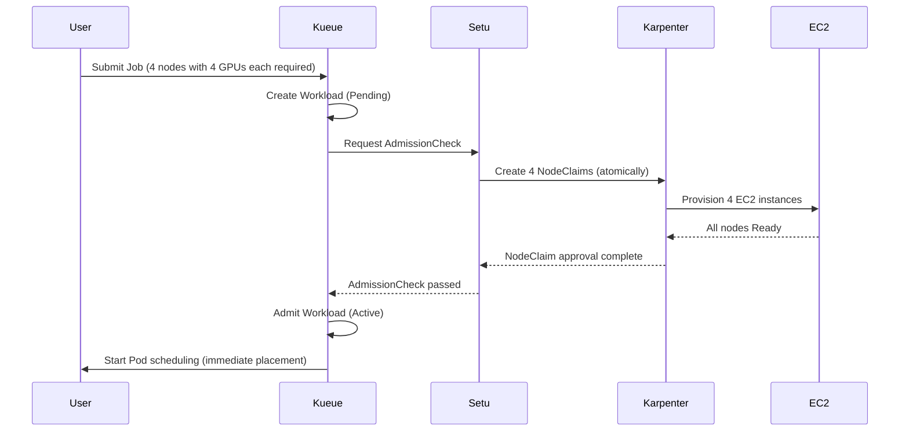

**Gang Scheduling and scheduling safety:**

Setu's core value is its **All-or-Nothing** guarantee. Distributed training workloads are only useful when all replicas run simultaneously.

| Scenario | Traditional Karpenter | Setu + Kueue |
|---------|---------------|-------------|
| **4 nodes with 4 GPUs each required** | Only 2 created → 2 idle → wasted costs | Admit after confirming all 4 are Ready → zero waste |
| **Node provisioning failure** | Some Pods Running, the rest indefinitely Pending | Automatic rollback + exponential backoff retries (5s-80s, up to 5 retries) |
| **Scheduling start time** | Sequential scheduling as each node is created | All nodes Ready → simultaneous scheduling |

**Failure handling and retry logic:**

Setu responds intelligently to node provisioning failures:

```
Failure scenario:
1. Only 3 of 4 NodeClaims succeed (1 fails due to insufficient Spot capacity)
2. Setu detects the failure → deletes all NodeClaims (rollback)
3. Retry with exponential backoff:
   - Retry 1: after 5 seconds
   - Retry 2: after 10 seconds
   - Retry 3: after 20 seconds
   - Retry 4: after 40 seconds
   - Retry 5: after 80 seconds (final)
4. After 5 failures, AdmissionCheck fails permanently → Kueue rejects the Workload
```

**Kueue integration architecture:**

Setu integrates with the workload admission process through Kueue's AdmissionCheck CRD.

```yaml
# 1. Define AdmissionCheck: Specify the Setu controller
apiVersion: kueue.x-k8s.io/v1beta1
kind: AdmissionCheck
metadata:
  name: karpenter-provision
spec:
  controllerName: setu.io/karpenter-provision
---
# 2. ClusterQueue: Apply AdmissionCheck
apiVersion: kueue.x-k8s.io/v1beta1
kind: ClusterQueue
metadata:
  name: ml-training-queue
spec:
  namespaceSelector: {}
  resourceGroups:
  - coveredResources: ["cpu", "memory", "nvidia.com/gpu"]
    flavors:
    - name: gpu-flavor
      resources:
      - name: nvidia.com/gpu
        nominalQuota: 32  # Allow up to 32 GPUs in total
  # Attach the Setu AdmissionCheck
  admissionChecks:
  - karpenter-provision
---
# 3. LocalQueue: Per-namespace queue
apiVersion: kueue.x-k8s.io/v1beta1
kind: LocalQueue
metadata:
  name: training-jobs
  namespace: ml-team
spec:
  clusterQueue: ml-training-queue
---
# 4. Job: Add the Kueue label
apiVersion: batch/v1
kind: Job
metadata:
  name: distributed-training
  namespace: ml-team
  labels:
    kueue.x-k8s.io/queue-name: training-jobs  # Specify the LocalQueue
spec:
  parallelism: 4
  completions: 4
  template:
    spec:
      nodeSelector:
        node.kubernetes.io/instance-type: g5.2xlarge
      tolerations:
      - key: nvidia.com/gpu
        operator: Exists
        effect: NoSchedule
      containers:
      - name: trainer
        image: ml/pytorch-distributed:v2.0
        resources:
          requests:
            nvidia.com/gpu: 1
            cpu: "7"
            memory: 28Gi
      restartPolicy: OnFailure
```

**Detailed execution flow:**

```
1. Submit Job → create Kueue Workload (Pending state)
2. Kueue checks the resource quota (ClusterQueue: 4 of 32 GPUs available)
3. Kueue executes AdmissionCheck → invokes the Setu controller
4. Setu creates 4 NodeClaims (g5.2xlarge, 1 GPU each)
5. Karpenter provisions 4 EC2 instances
6. Confirm all nodes are Ready (kubelet registered + GPU device plugin activated)
7. Setu approves AdmissionCheck → Kueue transitions the Workload to Active
8. Kueue sets suspend: false on the Job → scheduling starts for 4 Pods
9. The Scheduler immediately places Pods on the newly created GPU nodes (zero Pending time)
```

**Comparison: Traditional Karpenter vs. Setu + Kueue:**

| Stage | Traditional Karpenter | Setu + Kueue |
|------|---------------|-------------|
| **Job submission** | Immediately creates Pods (Pending) | Kueue manages the Job as a Workload (awaiting admission) |
| **Node provisioning** | Reacts after detecting Pending Pods | Pre-provisions through AdmissionCheck |
| **Partial failure handling** | Some Pods Running, the rest waiting indefinitely | Full rollback + retry (All-or-Nothing) |
| **Scheduling start** | Sequentially as nodes are created | Simultaneously after all nodes are Ready |
| **Time required** | 2-3 minutes (sequential process) | 1-2 minutes (parallel + advance preparation) |

**Recommended use cases:**

| Workload Type | Setu Required? | Reason |
|-------------|--------------|------|
| **Large-scale distributed training** (16+ GPUs) | ✅ Required | Guarantees Gang Scheduling and prevents partial allocation |
| **Small-scale training** (1-4 GPUs) | ⚠️ Optional | Limited benefit relative to overhead |
| **Single-GPU inference** | ❌ Not required | Traditional Karpenter is sufficient |
| **Batch processing** (CPU workloads) | ⚠️ Optional | Useful when cost efficiency is the goal |

:::info Setu Installation and Configuration
Setu requires Karpenter v1.0+ and Kueue v0.6+. It can be installed through a Helm chart; see the [Setu GitHub repository](https://github.com/sanjeevrg89/Setu) for detailed guidance.
:::

:::warning Production Considerations
Setu is a community project. Verify the following in production environments:
- Karpenter/Kueue version compatibility
- Alarms for NodeClaim creation failures
- ClusterQueue quota monitoring (to prevent resource exhaustion)
:::

**Inference workload scheduling example:**

One `podAntiAffinity` mapping contains both the required node-level rule and the preferred AZ-level rule. The 4 replicas require 4 distinct eligible nodes, but the AZ rule is a preference, allowing placement across 3 AZs. This does not guarantee an even distribution across AZs. The configuration also accommodates admission settings that restrict the `topologyKey` of required anti-affinity to `kubernetes.io/hostname`. See [Kubernetes inter-pod affinity and anti-affinity](https://kubernetes.io/docs/concepts/scheduling-eviction/assign-pod-node/#inter-pod-affinity-and-anti-affinity).

```yaml
# Highly available inference service: On-Demand GPU nodes
apiVersion: apps/v1
kind: Deployment
metadata:
  name: ml-inference
spec:
  replicas: 4
  selector:
    matchLabels:
      app: ml-inference
  template:
    metadata:
      labels:
        app: ml-inference
    spec:
      tolerations:
      - key: nvidia.com/gpu
        operator: Exists
        effect: NoSchedule
      nodeSelector:
        karpenter.sh/capacity-type: on-demand  # Use only On-Demand
      affinity:
        # Hard Anti-Affinity: At most 1 replica per node
        podAntiAffinity:
          requiredDuringSchedulingIgnoredDuringExecution:
          - labelSelector:
              matchLabels:
                app: ml-inference
            topologyKey: kubernetes.io/hostname
          # Soft Anti-Affinity: Prefer distribution across different AZs
          preferredDuringSchedulingIgnoredDuringExecution:
          - weight: 100
            podAffinityTerm:
              labelSelector:
                matchLabels:
                  app: ml-inference
              topologyKey: topology.kubernetes.io/zone
      priorityClassName: high-priority
      containers:
      - name: inference
        image: ml/triton-inference:v2.0
        resources:
          requests:
            nvidia.com/gpu: 1
            cpu: "3"
            memory: 12Gi
          limits:
            nvidia.com/gpu: 1
            cpu: "3"
            memory: 12Gi
        ports:
        - containerPort: 8000
          name: http
        - containerPort: 8001
          name: grpc
        livenessProbe:
          httpGet:
            path: /v2/health/live
            port: 8000
          initialDelaySeconds: 30
          periodSeconds: 10
        readinessProbe:
          httpGet:
            path: /v2/health/ready
            port: 8000
          initialDelaySeconds: 15
          periodSeconds: 5
---
# PDB: Apply a minimum of 2 healthy Pods to Eviction API requests
apiVersion: policy/v1
kind: PodDisruptionBudget
metadata:
  name: ml-inference-pdb
spec:
  minAvailable: 2
  selector:
    matchLabels:
      app: ml-inference
```

**Inferentia/Graviton inference optimization:**

AWS Inferentia is a dedicated inference accelerator that can reduce costs by up to 70% compared with GPUs.

```yaml
# Schedule on Inferentia nodes
apiVersion: apps/v1
kind: Deployment
metadata:
  name: inferentia-inference
spec:
  replicas: 6
  selector:
    matchLabels:
      app: inferentia-inference
  template:
    metadata:
      labels:
        app: inferentia-inference
    spec:
      nodeSelector:
        node.kubernetes.io/instance-type: inf2.xlarge  # AWS Inferentia2
      tolerations:
      - key: aws.amazon.com/neuron
        operator: Exists
        effect: NoSchedule
      containers:
      - name: inference
        image: ml/neuron-inference:v1.0
        resources:
          requests:
            aws.amazon.com/neuron: 1  # 1 Inferentia core
            cpu: "3"
            memory: 8Gi
          limits:
            aws.amazon.com/neuron: 1
        env:
        - name: NEURON_RT_NUM_CORES
          value: "1"
```

**Cost optimization strategy summary:**

| Workload | Instance Types | Spot Usage | Recommended Strategy |
|---------|-------------|----------|----------|
| **Large-scale training** | g5.12xlarge, p4d.24xlarge | ✅ Supported | Spot + Checkpointing + Spot Interruption Handler |
| **Small-scale training** | g5.2xlarge, g5.4xlarge | ✅ Supported | Mix of Spot 70% + On-Demand 30% |
| **High-performance inference** | g5.xlarge, g5.2xlarge | ❌ Not recommended | On-Demand + Savings Plans |
| **Lightweight inference** | inf2.xlarge, c7g.xlarge | ❌ Not recommended | On-Demand or Reserved Instances |
| **Batch inference** | g5.xlarge | ✅ Supported | Spot + retry logic |

### 9.2 Scheduling Decision Flowchart

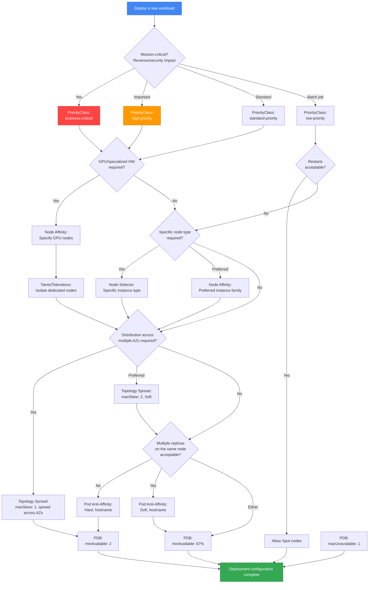

**Decision guide:**

1. **Assess business impact** → Determine PriorityClass
2. **Hardware requirements** → Node Affinity, Taints/Tolerations
3. **Cost optimization** → Decide whether to allow Spot nodes
4. **High availability requirements** → Topology Spread, Anti-Affinity
5. **Upgrade safety** → Configure rollout strategy/readiness, and a PDB for Eviction API-based node drains

---

<span id="10-2025-2026-aws-innovations" />

## 10. AWS Innovations in 2025-2026 and Scheduling Strategies

Key innovations announced at AWS re:Invent 2025 are significantly influencing EKS scheduling strategies. This section covers how the latest features, including Provisioned Control Plane, EKS Auto Mode, Karpenter + ARC integration, and Container Network Observability, apply to Pod scheduling and availability.

### 10.1 Provisioned Control Plane Scheduling Performance

**Overview:**

Provisioned Control Plane provisions control plane capacity in predefined tiers such as XL, 2XL, and 4XL, providing predictable, high-performance Kubernetes operations.

**Performance characteristics by tier:**

| Tier | API Concurrency | Pod Scheduling Speed | Cluster Scale | Use Case |
|------|-----------|-----------------|------------|----------|
| **Standard** | Dynamic scaling | Standard | ~1,000 nodes | General workloads |
| **XL** | High | Fast | ~2,000 nodes | Large-scale deployments |
| **2XL** | Very high | Very fast | ~4,000 nodes | AI/ML training, HPC |
| **4XL** | Maximum | Maximum | ~8,000 nodes | Very large clusters |

**Scheduling performance improvements:**

Provisioned Control Plane improves scheduling performance in the following ways:

1. **API server concurrency**: Processes more scheduling requests simultaneously
2. **Expanded etcd capacity**: Stores metadata for more nodes and Pods
3. **Increased scheduler throughput**: Processes more Pod bindings per second
4. **Predictable latency**: Ensures consistent scheduling latency even during traffic bursts

**Scheduling strategy for large clusters:**

```yaml
# Example: Deploy a large-scale Deployment on the Provisioned Control Plane XL tier
apiVersion: apps/v1
kind: Deployment
metadata:
  name: large-scale-app
spec:
  replicas: 1000  # Deploy 1000 replicas simultaneously
  selector:
    matchLabels:
      app: large-scale-app
  template:
    metadata:
      labels:
        app: large-scale-app
    spec:
      # Topology Spread: Distribute 1000 Pods evenly
      topologySpreadConstraints:
      - maxSkew: 10  # Increase maxSkew for flexibility in large-scale deployments
        topologyKey: topology.kubernetes.io/zone
        whenUnsatisfiable: DoNotSchedule
        labelSelector:
          matchLabels:
            app: large-scale-app
      - maxSkew: 50
        topologyKey: kubernetes.io/hostname
        whenUnsatisfiable: DoNotSchedule
        labelSelector:
          matchLabels:
            app: large-scale-app
      affinity:
        podAntiAffinity:
          preferredDuringSchedulingIgnoredDuringExecution:
          - weight: 100
            podAffinityTerm:
              labelSelector:
                matchLabels:
                  app: large-scale-app
              topologyKey: kubernetes.io/hostname
      containers:
      - name: app
        image: app:v1.0
        resources:
          requests:
            cpu: "500m"
            memory: 1Gi
```

**AI/ML training workload optimization (thousands of GPU Pods):**

Provisioned Control Plane is optimized for scenarios that simultaneously schedule thousands of GPU Pods for AI/ML training workloads.

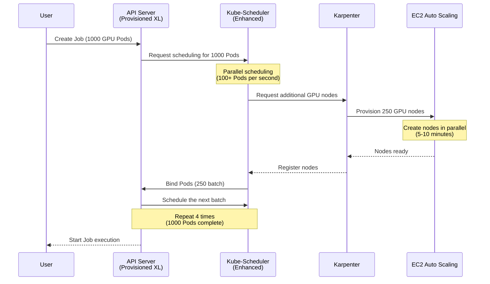

**Recommended tiers by use case:**

| Use Case | Recommended Tier | Reason |
|----------|----------|------|
| **General web applications** | Standard | Dynamic scaling is sufficient |
| **Large-scale batch jobs (500+ Pods)** | XL | Fast concurrent scheduling required |
| **Distributed ML training (1000+ GPU Pods)** | 2XL | Very fast scheduling + high API concurrency |
| **HPC clusters (thousands of nodes)** | 4XL | Maximum scale + predictable performance |
| **Mission-critical services** | XL or higher | Consistent latency even during traffic bursts |

:::tip Provisioned Control Plane Selection Criteria
- **Node count > 1,000**: Consider XL or higher
- **Frequent large-scale deployments (500+ Pods)**: XL or higher
- **GPU workloads (100+ GPUs)**: 2XL or higher
- **Predictable performance requirements**: Consider Provisioned at any scale
:::

### 10.2 Automatic Node Provisioning with EKS Auto Mode

**Overview:**

EKS Auto Mode simplifies Kubernetes operations by fully automating compute, storage, and networking, from provisioning through ongoing maintenance.

**How Auto Mode affects scheduling:**

| Feature | Traditional Approach (Manual) | Auto Mode |
|------|---------------|----------|
| **Node selection** | Explicit NodeSelector and Node Affinity | Automatic instance type selection |
| **Dynamic scaling** | Configure Cluster Autoscaler or Karpenter | Automatic scaling (no configuration required) |
| **Cost optimization** | Manually configure Spot and Graviton | Automatic use of Spot + Graviton |
| **AZ placement** | Manually configure Topology Spread | Automatic Multi-AZ distribution |
| **Node upgrades** | Manual AMI updates | Automatic OS patching |

**Manual NodeSelector/Affinity vs. Auto Mode comparison:**

```yaml
# Traditional approach: Manual NodeSelector + Karpenter NodePool
---
# Create a Karpenter NodePool
apiVersion: karpenter.sh/v1
kind: NodePool
metadata:
  name: general-pool
spec:
  template:
    spec:
      requirements:
      - key: node.kubernetes.io/instance-type
        operator: In
        values: ["c6i.xlarge", "c6i.2xlarge", "c6a.xlarge"]
      - key: karpenter.sh/capacity-type
        operator: In
        values: ["on-demand", "spot"]
---
# Deployment: Specify nodes with NodeSelector
apiVersion: apps/v1
kind: Deployment
metadata:
  name: api-server
spec:
  replicas: 10
  template:
    spec:
      nodeSelector:
        karpenter.sh/nodepool: general-pool
      containers:
      - name: api
        image: api:v1.0
        resources:
          requests:
            cpu: "1"
            memory: 2Gi
```

```yaml
# Auto Mode approach: Minimal configuration
apiVersion: apps/v1
kind: Deployment
metadata:
  name: api-server
spec:
  replicas: 10
  template:
    spec:
      # NodeSelector and Affinity are unnecessary - Auto Mode selects automatically
      containers:
      - name: api
        image: api:v1.0
        resources:
          requests:
            cpu: "1"
            memory: 2Gi
      # Auto Mode automatically:
      # - Selects appropriate instance types (c6i, c6a, c7i, etc.)
      # - Optimizes the mix of Spot vs. On-Demand
      # - Distributes across multiple AZs
      # - Uses Graviton (ARM) when possible
```

**Scheduling settings still required in Auto Mode:**

Auto Mode automates node provisioning, but the following scheduling settings **must still be configured explicitly**:

| Setting | Automated by Auto Mode? | Description |
|------|---------------------|------|
| **Resource Requests/Limits** | ❌ Configuration required | Workload resource requirements must be specified |
| **Topology Spread** | ⚠️ Provided by default + configure for fine-grained control | Auto Mode provides basic distribution; specify settings for fine-grained control |
| **Pod Anti-Affinity** | ❌ Configuration required | Distribution of replicas of the same app must be specified |
| **PDB** | ❌ Configuration required | The app is responsible for ensuring minimum availability |
| **PriorityClass** | ❌ Configuration required | The app is responsible for priority |
| **Taints/Tolerations** | ⚠️ Specialized nodes only | Must be specified for specialized workloads such as GPUs |

**Recommended scheduling pattern for Auto Mode:**

```yaml
# Recommended minimum scheduling settings for Auto Mode
apiVersion: apps/v1
kind: Deployment
metadata:
  name: production-app
spec:
  replicas: 6
  selector:
    matchLabels:
      app: production-app
  template:
    metadata:
      labels:
        app: production-app
    spec:
      # 1. Resource Requests (required)
      containers:
      - name: app
        image: app:v1.0
        resources:
          requests:
            cpu: "1"
            memory: 2Gi
          limits:
            cpu: "2"
            memory: 4Gi

      # 2. Topology Spread (fine-grained control of AZ distribution)
      topologySpreadConstraints:
      - maxSkew: 1
        topologyKey: topology.kubernetes.io/zone
        whenUnsatisfiable: DoNotSchedule
        labelSelector:
          matchLabels:
            app: production-app
        minDomains: 3

      # 3. Pod Anti-Affinity (spread across nodes)
      affinity:
        podAntiAffinity:
          preferredDuringSchedulingIgnoredDuringExecution:
          - weight: 100
            podAffinityTerm:
              labelSelector:
                matchLabels:
                  app: production-app
              topologyKey: kubernetes.io/hostname

      # 4. PriorityClass (priority)
      priorityClassName: high-priority
---
# 5. PDB (ensure availability)
apiVersion: policy/v1
kind: PodDisruptionBudget
metadata:
  name: production-app-pdb
spec:
  minAvailable: 4
  selector:
    matchLabels:
      app: production-app
```

**Auto Mode + PDB + Karpenter interactions:**

Auto Mode internally provides autoscaling similar to Karpenter and respects PDBs.

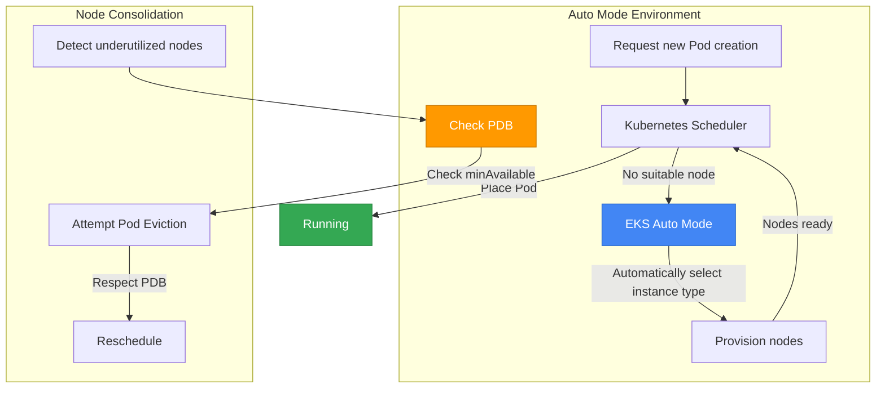

### 10.3 AZ Evacuation with ARC + Karpenter Integration

**Overview:**

Integration between AWS Application Recovery Controller (ARC) and Karpenter evacuates workloads to healthy AZs through automatic Zonal Shift when an AZ fails.

**Automatic recovery pattern for AZ failures:**

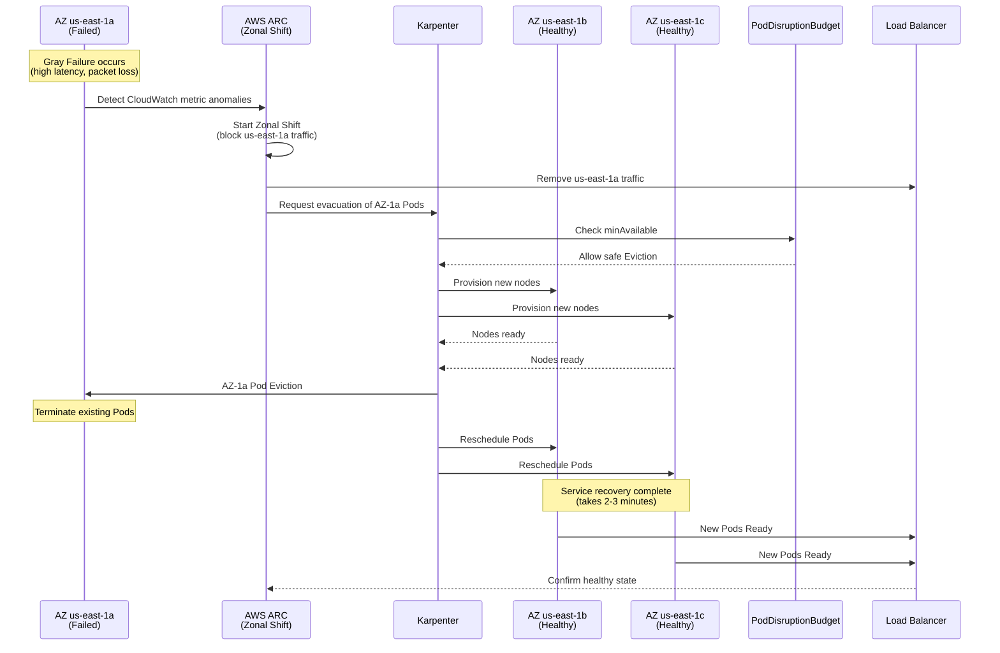

**ARC + Karpenter integration configuration example:**

```yaml
# Karpenter NodePool: Support AZ evacuation
apiVersion: karpenter.sh/v1
kind: NodePool
metadata:
  name: arc-enabled-pool
spec:
  template:
    spec:
      requirements:
      - key: topology.kubernetes.io/zone
        operator: In
        values:
        - us-east-1a
        - us-east-1b
        - us-east-1c
      - key: karpenter.sh/capacity-type
        operator: In
        values: ["on-demand"]  # On-Demand is recommended for AZ evacuation
  disruption:
    consolidationPolicy: WhenEmptyOrUnderutilized
    consolidateAfter: 5m
    budgets:
    - nodes: "30%"  # Headroom for rapid rescheduling during AZ evacuation
---
# Application: Topology Spread + PDB
apiVersion: apps/v1
kind: Deployment
metadata:
  name: resilient-app
spec:
  replicas: 9  # 3 AZ x 3 replica
  selector:
    matchLabels:
      app: resilient-app
  template:
    metadata:
      labels:
        app: resilient-app
    spec:
      topologySpreadConstraints:
      - maxSkew: 1
        topologyKey: topology.kubernetes.io/zone
        whenUnsatisfiable: DoNotSchedule
        labelSelector:
          matchLabels:
            app: resilient-app
        minDomains: 3  # Must be distributed across 3 AZs
      affinity:
        podAntiAffinity:
          preferredDuringSchedulingIgnoredDuringExecution:
          - weight: 100
            podAffinityTerm:
              labelSelector:
                matchLabels:
                  app: resilient-app
              topologyKey: kubernetes.io/hostname
      containers:
      - name: app
        image: app:v1.0
        resources:
          requests:
            cpu: "1"
            memory: 2Gi
---
# PDB: Maintain 6 during AZ evacuation (allow eviction of 3 out of 9)
apiVersion: policy/v1
kind: PodDisruptionBudget
metadata:
  name: resilient-app-pdb
spec:
  minAvailable: 6
  selector:
    matchLabels:
      app: resilient-app
```

**End-to-end recovery with Istio service mesh integration:**

Using Istio with ARC coordinates traffic routing and Pod rescheduling during AZ failures to achieve end-to-end recovery.

```yaml
# Istio DestinationRule: Subsets by AZ
apiVersion: networking.istio.io/v1beta1
kind: DestinationRule
metadata:
  name: resilient-app-dr
spec:
  host: resilient-app.default.svc.cluster.local
  trafficPolicy:
    loadBalancer:
      localityLbSetting:
        enabled: true
        failover:
        - from: us-east-1a
          to: us-east-1b
        - from: us-east-1b
          to: us-east-1c
        - from: us-east-1c
          to: us-east-1a
    outlierDetection:
      consecutiveErrors: 5
      interval: 30s
      baseEjectionTime: 30s
      maxEjectionPercent: 50
  subsets:
  - name: az-1a
    labels:
      topology.kubernetes.io/zone: us-east-1a
  - name: az-1b
    labels:
      topology.kubernetes.io/zone: us-east-1b
  - name: az-1c
    labels:
      topology.kubernetes.io/zone: us-east-1c
---
# Istio VirtualService: Route traffic only to healthy AZs
apiVersion: networking.istio.io/v1beta1
kind: VirtualService
metadata:
  name: resilient-app-vs
spec:
  hosts:
  - resilient-app.default.svc.cluster.local
  http:
  - route:
    - destination:
        host: resilient-app.default.svc.cluster.local
        subset: az-1b
      weight: 50
    - destination:
        host: resilient-app.default.svc.cluster.local
        subset: az-1c
      weight: 50
    # az-1a is automatically removed during ARC Zonal Shift
```

**Gray Failure detection pattern:**

A Gray Failure is a situation in which degraded performance reduces service quality without a complete failure. ARC detects Gray Failures based on CloudWatch metrics.

```yaml
# CloudWatch Alarm: Detect Gray Failure
apiVersion: v1
kind: ConfigMap
metadata:
  name: gray-failure-detection
data:
  alarm.json: |
    {
      "AlarmName": "EKS-AZ-1a-HighLatency",
      "MetricName": "TargetResponseTime",
      "Namespace": "AWS/ApplicationELB",
      "Statistic": "Average",
      "Period": 60,
      "EvaluationPeriods": 3,
      "Threshold": 1.0,
      "ComparisonOperator": "GreaterThanThreshold",
      "Dimensions": [
        {
          "Name": "AvailabilityZone",
          "Value": "us-east-1a"
        }
      ],
      "TreatMissingData": "notBreaching"
    }
```

**AZ evacuation strategy summary:**

| Scenario | PDB Setting | Topology Spread | Karpenter Setting | Recovery Time |
|---------|---------|----------------|---------------|----------|
| **Complete AZ failure** | `minAvailable: 6` (out of 9) | `minDomains: 3` | Prefer On-Demand | 2-3 minutes |
| **Gray Failure** | `minAvailable: 6` (out of 9) | Allow `minDomains: 2` | Spot supported | 3-5 minutes |
| **Planned maintenance** | `maxUnavailable: 3` | Allow `minDomains: 2` | Spot + On-Demand | 5-10 minutes |

### 10.4 Container Network Observability and Scheduling

**Overview:**

Container Network Observability provides granular network metrics to analyze the correlation between Pod placement and network performance and optimize scheduling strategies.

**Correlation between Pod placement and network performance:**

| Pod Placement Pattern | Network Latency | Cross-AZ Traffic Cost | Use Case |
|-------------|-------------|-------------------|----------|
| **Same Node** | ~0.1ms | $0 | Cache server + application |
| **Same AZ** | ~0.5ms | $0 | Microservices that communicate frequently |
| **Cross-AZ** | ~2-5ms | $0.01/GB | Services requiring high availability |
| **Cross-Region** | ~50-100ms | $0.02/GB | Geographically distributed services |

**Scheduling with Cross-AZ traffic costs in mind:**

```yaml
# Example: Place API Gateway + Backend Service in the same AZ
apiVersion: apps/v1
kind: Deployment
metadata:
  name: api-gateway
spec:
  replicas: 6
  selector:
    matchLabels:
      app: api-gateway
  template:
    metadata:
      labels:
        app: api-gateway
        network-locality: same-az  # Network observability label
    spec:
      # Topology Spread: Distribute evenly across AZs
      topologySpreadConstraints:
      - maxSkew: 1
        topologyKey: topology.kubernetes.io/zone
        whenUnsatisfiable: DoNotSchedule
        labelSelector:
          matchLabels:
            app: api-gateway
      containers:
      - name: gateway
        image: api-gateway:v1.0
        resources:
          requests:
            cpu: "1"
            memory: 2Gi
---
# Backend Service: Prefer the same AZ as API Gateway
apiVersion: apps/v1
kind: Deployment
metadata:
  name: backend-service
spec:
  replicas: 6
  selector:
    matchLabels:
      app: backend-service
  template:
    metadata:
      labels:
        app: backend-service
        network-locality: same-az
    spec:
      affinity:
        # Pod Affinity: Prefer the same AZ as API Gateway (reduce Cross-AZ costs)
        podAffinity:
          preferredDuringSchedulingIgnoredDuringExecution:
          - weight: 100
            podAffinityTerm:
              labelSelector:
                matchExpressions:
                - key: app
                  operator: In
                  values:
                  - api-gateway
              topologyKey: topology.kubernetes.io/zone
      containers:
      - name: backend
        image: backend-service:v1.0
        resources:
          requests:
            cpu: "2"
            memory: 4Gi
```

**Topology Spread optimization based on network observability:**

Analyze Container Network Observability metrics to adjust scheduling strategies.

```yaml
# Example CloudWatch Container Insights metrics query
apiVersion: v1
kind: ConfigMap
metadata:
  name: network-metrics-query
data:
  query.json: |
    {
      "MetricName": "pod_network_rx_bytes",
      "Namespace": "ContainerInsights",
      "Dimensions": [
        {"Name": "PodName", "Value": "api-gateway-*"},
        {"Name": "Namespace", "Value": "default"}
      ],
      "Period": 300,
      "Stat": "Sum"
    }
```

**Optimization patterns based on network observability:**

1. **Detect high Cross-AZ traffic** → Use Pod Affinity for placement in the same AZ
2. **Detect network congestion in a specific AZ** → Use Topology Spread to distribute across other AZs
3. **Analyze inter-Pod communication patterns** → Optimize traffic with a service mesh (Istio)
4. **Detect network latency spikes** → Evacuate the failed AZ with ARC Zonal Shift

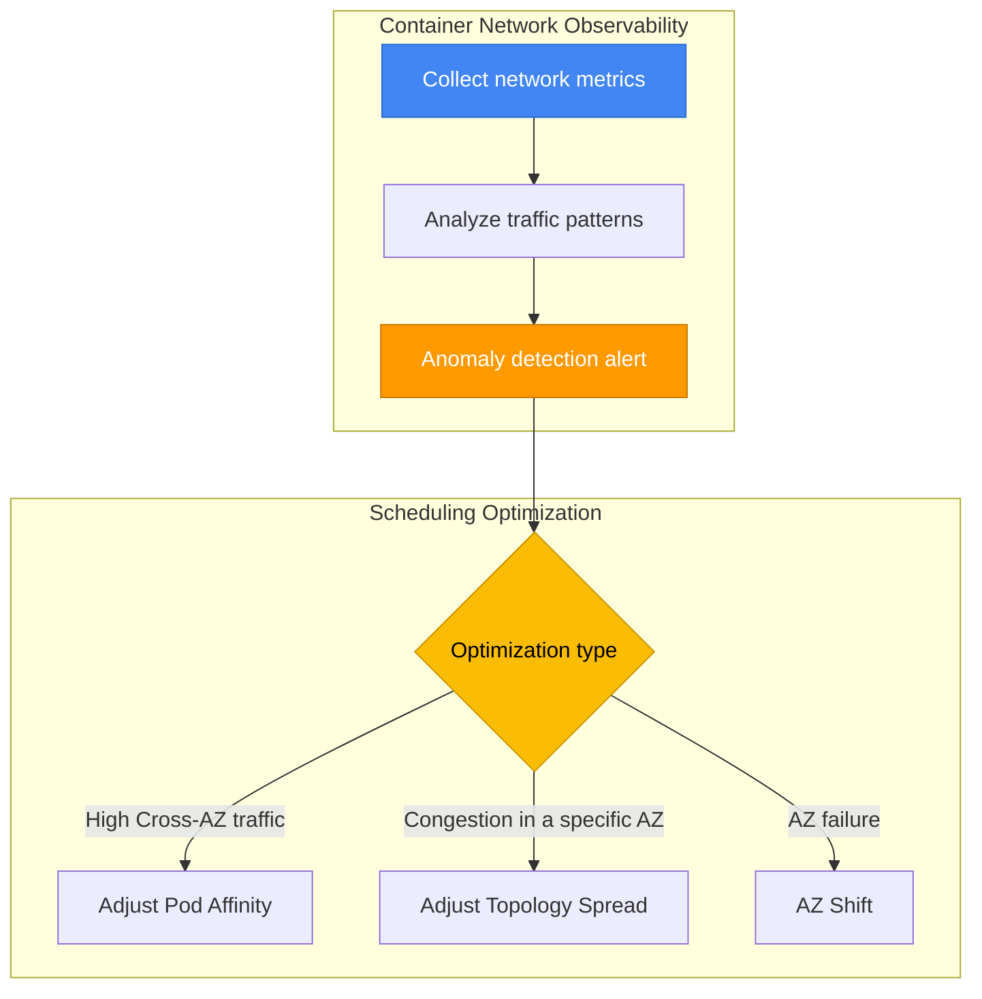

**Practical example: Network optimization for an ML inference service:**

```yaml
# ML inference service: Low latency + cost optimization
apiVersion: apps/v1
kind: Deployment
metadata:
  name: ml-inference-optimized
spec:
  replicas: 9
  selector:
    matchLabels:
      app: ml-inference
  template:
    metadata:
      labels:
        app: ml-inference
    spec:
      # 1. Topology Spread: Distribute evenly across AZs (high availability)
      topologySpreadConstraints:
      - maxSkew: 1
        topologyKey: topology.kubernetes.io/zone
        whenUnsatisfiable: DoNotSchedule
        labelSelector:
          matchLabels:
            app: ml-inference
        minDomains: 3

      # 2. Pod Affinity: Same AZ as API Gateway (low latency)
      affinity:
        podAffinity:
          preferredDuringSchedulingIgnoredDuringExecution:
          - weight: 80
            podAffinityTerm:
              labelSelector:
                matchExpressions:
                - key: app
                  operator: In
                  values:
                  - api-gateway
              topologyKey: topology.kubernetes.io/zone

      containers:
      - name: inference
        image: ml-inference:v1.0
        resources:
          requests:
            cpu: "2"
            memory: 8Gi
```

**Cost savings from network observability:**

| Before Optimization | After Optimization | Savings |
|----------|----------|----------|
| Cross-AZ traffic: 1TB/month | Cross-AZ traffic: 0.2TB/month | Save $8/month |
| Average latency: 3ms | Average latency: 0.5ms | 6x performance improvement |
| Pod Affinity not used | Pod Affinity optimized | Increased operational efficiency |

---

### 10.5 Node Readiness Controller — Improving Scheduling Safety

**Overview:**

Node Readiness Controller (NRC), introduced as an Alpha feature in Kubernetes 1.32, prevents situations where nodes are marked `Ready` but cannot actually run Pods safely. It significantly improves scheduling safety by blocking Pod scheduling until infrastructure components such as CNI plugins, CSI drivers, and GPU drivers are fully ready.

**The problem from a scheduling perspective:**

The traditional Kubernetes scheduler checks only a node's `Ready` state when placing Pods. However, Pod placement can fail in the following situations:

| Scenario | Node State | Actual Situation | Result |
|---------|---------|----------|------|
| **CNI plugin not ready** | `Ready` | Calico/Cilium Pod starting | Pod network connection failure |
| **CSI driver not ready** | `Ready` | EBS CSI Driver initializing | PVC mount failure |
| **GPU driver not ready** | `Ready` | NVIDIA Device Plugin loading | GPU workload startup failure |
| **Image pre-pull in progress** | `Ready` | Large image (10GB) downloading | Pod startup delay (5 minutes or more) |

**How Node Readiness Controller works:**

NRC uses the `NodeReadinessRule` CRD (`readiness.node.x-k8s.io/v1alpha1`) as follows:

1. **Condition-based taint management**: Applies a taint until a specific Node Condition is satisfied
2. **Blocks scheduling**: Pods cannot be scheduled on tainted nodes
3. **Automatic taint removal**: Automatically removes the taint when the condition is satisfied → allows Pod scheduling

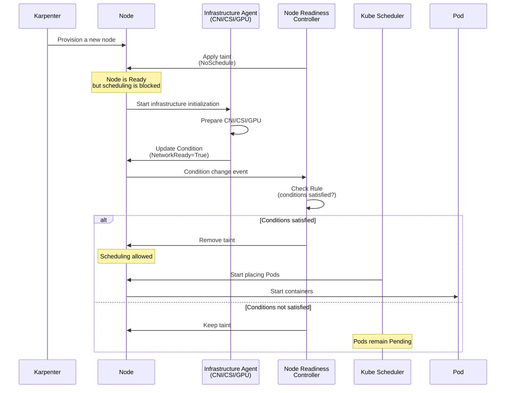

**Two enforcement modes:**

NRC operates in two modes, each with a different effect on scheduling safety:

| Mode | Behavior | Scheduling Impact | Use Case |
|------|---------|-------------|----------|
| **bootstrap-only** | Applies taint only during node initialization<br/>→ Removes it once ready and stops monitoring | Ensures initial scheduling safety<br/>Does not detect runtime failures | CNI plugins, image pre-pulling<br/>(a one-time check is sufficient) |
| **continuous** | Continuously monitors<br/>→ Immediately re-taints on driver crashes | Blocks new Pod scheduling<br/>even during runtime failures | GPU drivers, CSI drivers<br/>(runtime failures are possible) |

**Practical example 1: Check CNI plugin readiness (Bootstrap-only)**

```yaml
apiVersion: readiness.node.x-k8s.io/v1alpha1
kind: NodeReadinessRule
metadata:
  name: network-readiness-rule
spec:
  # Wait until the CNI plugin reports the NetworkReady Condition as True
  conditions:
    - type: "cniplugin.example.net/NetworkReady"
      requiredStatus: "True"

  # Apply this taint until ready
  taint:
    key: "readiness.k8s.io/network-unavailable"
    effect: "NoSchedule"
    value: "pending"

  # Bootstrap-only: Stop monitoring once ready
  enforcementMode: "bootstrap-only"

  # Apply only to worker nodes
  nodeSelector:
    matchLabels:
      node.kubernetes.io/role: worker
```

**Practical example 2: Continuously monitor GPU drivers (Continuous)**

```yaml
apiVersion: readiness.node.x-k8s.io/v1alpha1
kind: NodeReadinessRule
metadata:
  name: gpu-driver-readiness-rule
spec:
  # Wait until the NVIDIA Device Plugin reports the GPUReady Condition as True
  conditions:
    - type: "nvidia.com/gpu.present"
      requiredStatus: "True"
    - type: "nvidia.com/gpu.driver.ready"
      requiredStatus: "True"

  # Apply this taint until the GPU is ready
  taint:
    key: "readiness.k8s.io/gpu-unavailable"
    effect: "NoSchedule"
    value: "pending"

  # Continuous: Re-taint on GPU driver crashes to block new Pod scheduling
  enforcementMode: "continuous"

  # Apply only to the GPU node group
  nodeSelector:
    matchLabels:
      node.kubernetes.io/instance-type: "p4d.24xlarge"
```

**Comparison with Pod Scheduling Readiness (schedulingGates):**

Kubernetes can control scheduling safety at both the Pod and node levels:

| Comparison | `schedulingGates` (Pod Level) | `NodeReadinessRule` (Node Level) |
|----------|------------------------------|--------------------------------|
| **Control target** | Scheduling of a specific Pod | Scheduling of all Pods on a specific node |
| **Use case** | Hold a Pod until external conditions are satisfied<br/>(e.g., wait for database readiness) | Block a node until infrastructure is ready<br/>(e.g., CNI/GPU driver loading) |
| **Condition location** | Specified in the Pod Spec | Reported as a Node Condition |
| **Removal method** | An external controller removes the gate | NRC automatically removes the taint |
| **Scope of impact** | A single Pod | All new Pods on the node |

**Combined pattern:**

```yaml
# Combine Pod-level + node-level scheduling safety
apiVersion: v1
kind: Pod
metadata:
  name: ml-training-job
spec:
  # Pod level: Hold scheduling until the dataset is ready
  schedulingGates:
    - name: "example.com/dataset-ready"

  # Node level: Place only on nodes with GPU drivers ready (NodeReadinessRule manages taints)
  tolerations:
    - key: "readiness.k8s.io/gpu-unavailable"
      operator: "DoesNotExist"  # Allow only nodes without the taint (=nodes with GPUs ready)

  containers:
    - name: trainer
      image: ml-trainer:v1.0
      resources:
        limits:
          nvidia.com/gpu: 8
```

**Karpenter + NRC integration pattern:**

In environments that use Karpenter for dynamic node provisioning, NRC provides the following workflow:

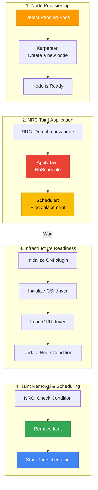

**Practical GPU node group example:**

Using NRC with a GPU node group for AI/ML workloads delays AI workload scheduling until NVIDIA drivers finish loading, preventing placement failures:

```yaml
# Karpenter NodePool: GPU node group
apiVersion: karpenter.sh/v1
kind: NodePool
metadata:
  name: gpu-pool
spec:
  template:
    spec:
      requirements:
        - key: node.kubernetes.io/instance-type
          operator: In
          values: ["p4d.24xlarge", "p5.48xlarge"]
        - key: karpenter.sh/capacity-type
          operator: In
          values: ["on-demand"]
      nodeClassRef:
        name: gpu-nodeclass
---
# NodeReadinessRule: Check GPU driver readiness
apiVersion: readiness.node.x-k8s.io/v1alpha1
kind: NodeReadinessRule
metadata:
  name: gpu-readiness-rule
spec:
  conditions:
    - type: "nvidia.com/gpu.driver.ready"
      requiredStatus: "True"
  taint:
    key: "readiness.k8s.io/gpu-unavailable"
    effect: "NoSchedule"
    value: "pending"
  enforcementMode: "continuous"
  nodeSelector:
    matchLabels:
      karpenter.sh/nodepool: gpu-pool
---
# AI workload: Use a Toleration to place only on ready GPU nodes
apiVersion: batch/v1
kind: Job
metadata:
  name: ml-training
spec:
  template:
    spec:
      # Place only on nodes with GPUs ready
      tolerations:
        - key: "readiness.k8s.io/gpu-unavailable"
          operator: "DoesNotExist"

      containers:
        - name: trainer
          image: ml-trainer:v1.0
          resources:
            limits:
              nvidia.com/gpu: 8

      restartPolicy: OnFailure
```

:::tip Recommendations for Optimizing Scheduling Safety
- **CNI plugins**: Use `bootstrap-only` mode to check initial network readiness
- **GPU drivers**: Use `continuous` mode to block new Pod placement even during runtime failures
- **CSI drivers**: Use `continuous` mode to respond to storage driver crashes
- **Image pre-pulling**: Use `bootstrap-only` mode to wait for large image downloads to complete
- **Karpenter integration**: Configure a NodeReadinessRule per NodePool for workload-specific readiness conditions
:::

:::warning Considerations for Alpha Features
Node Readiness Controller is an Alpha feature in Kubernetes 1.32:

1. **Feature Gate activation required**: `--feature-gates=NodeReadiness=true` (kube-apiserver, kube-controller-manager)
2. **Potential API changes**: The `NodeReadinessRule` CRD schema may change during the transition to Beta/GA
3. **Production environments**: Adoption is recommended only after thorough testing
4. **Alternatives**: If adopting an Alpha feature is a concern, use existing manual Node Taint management or Init Container patterns
:::

**References:**

- [Kubernetes Blog: Introducing Node Readiness Controller](https://kubernetes.io/blog/2026/02/03/introducing-node-readiness-controller/)
- [Node Readiness Controller GitHub](https://github.com/kubernetes-sigs/node-readiness-controller)

---

## 11. Comprehensive Checklist & References

### 11.1 Comprehensive Checklist

Use the following checklist to verify scheduling settings before production deployment.

#### Basic Scheduling (All Workloads)

| Item | Description | Check |
|------|------|------|
| **Configure Resource Requests** | Specify CPU and memory requests for all containers | [ ] |
| **Assign PriorityClass** | Assign a PriorityClass appropriate to workload importance | [ ] |
| **Liveness/Readiness Probe** | Configure health checks to ensure Pod reliability | [ ] |
| **Graceful Shutdown** | preStop Hook + terminationGracePeriodSeconds | [ ] |
| **Image Pull Policy** | Production: `IfNotPresent` or `Always` | [ ] |

#### High Availability (Critical Workloads)

| Item | Description | Check |
|------|------|------|
| **Replica count ≥ 3** | Minimum replicas for fault domain isolation | [ ] |
| **Topology Spread Constraints** | Even distribution across AZs (maxSkew: 1) | [ ] |
| **Pod Anti-Affinity** | Spread across nodes (Soft or Hard) | [ ] |
| **Configure PDB** | Specify minAvailable or maxUnavailable | [ ] |
| **Verify PDB** | Confirm `minAvailable < replicas` | [ ] |
| **Verify Multi-AZ deployment** | Verify AZ distribution with `kubectl get pods -o wide` | [ ] |

#### Resource Optimization

| Item | Description | Check |
|------|------|------|
| **Use Spot nodes** | Allow Spot nodes for restartable workloads | [ ] |
| **Optimize Node Affinity** | Select instance types suited to the workload | [ ] |
| **Taints/Tolerations** | Isolate dedicated nodes such as GPU and high-performance nodes | [ ] |
| **Configure Descheduler** | Resolve node imbalance (optional) | [ ] |
| **Karpenter integration** | Configure disruption budgets | [ ] |

#### Specialized Workloads

| Item | Description | Check |
|------|------|------|
| **GPU workloads** | GPU Taint Tolerate + GPU resource requests | [ ] |
| **StatefulSet** | Use a WaitForFirstConsumer StorageClass | [ ] |
| **DaemonSet** | Configure tolerations for all taints | [ ] |
| **Batch jobs** | PriorityClass: low-priority, preemptionPolicy: Never | [ ] |

### Pod Scheduling Verification Commands

```bash
# 1. Check Pod placement (distribution across AZs and nodes)
kubectl get pods -n <namespace> -o wide

# 2. Check Pod scheduling events (identify why Pods are Pending)
kubectl describe pod <pod-name> -n <namespace>

# 3. Check PDB status
kubectl get pdb -A
kubectl describe pdb <pdb-name> -n <namespace>

# 4. List PriorityClasses
kubectl get priorityclass

# 5. Check node taints
kubectl describe node <node-name> | grep Taints

# 6. Check Pod distribution by node
kubectl get pods -A -o wide | awk '{print $8}' | sort | uniq -c

# 7. Check Pod distribution by AZ
kubectl get pods -A -o json | \
  jq -r '.items[] | "\(.metadata.namespace) \(.metadata.name) \(.spec.nodeName)"' | \
  while read ns pod node; do
    az=$(kubectl get node $node -o jsonpath='{.metadata.labels.topology\.kubernetes\.io/zone}')
    echo "$ns $pod $node $az"
  done | column -t

# 8. Analyze why Pods are Pending
kubectl get events --sort-by='.lastTimestamp' -A | grep -i warning

# 9. Check Descheduler logs (if installed)
kubectl logs -n kube-system -l app=descheduler --tail=100
```

<span id="related-documents" />

### 11.2 Related Documents

**Internal documents:**
- [EKS High Availability Architecture Guide](/docs/eks-best-practices/operations-reliability/eks-resiliency-guide) — Multi-AZ strategies, Topology Spread, Cell Architecture
- [High-Speed Autoscaling with Karpenter](/docs/eks-best-practices/resource-cost/karpenter-autoscaling) — In-depth Karpenter NodePool configuration
- [EKS Resource Optimization Guide](/docs/eks-best-practices/resource-cost/eks-resource-optimization) — Resource Requests/Limits optimization
- [EKS Pod Health Checks & Lifecycle](/docs/eks-best-practices/operations-reliability/eks-pod-health-lifecycle) — Probes, Lifecycle Hooks

### 11.3 External References

**Official Kubernetes documentation:**
- [Kubernetes Scheduling Framework](https://kubernetes.io/docs/concepts/scheduling-eviction/scheduling-framework/)
- [Assigning Pods to Nodes](https://kubernetes.io/docs/concepts/scheduling-eviction/assign-pod-node/)
- [Pod Priority and Preemption](https://kubernetes.io/docs/concepts/scheduling-eviction/pod-priority-preemption/)
- [Taints and Tolerations](https://kubernetes.io/docs/concepts/scheduling-eviction/taint-and-toleration/)
- [Pod Topology Spread Constraints](https://kubernetes.io/docs/concepts/scheduling-eviction/topology-spread-constraints/)
- [PodDisruptionBudget](https://kubernetes.io/docs/concepts/workloads/pods/disruptions/)

**Descheduler:**
- [Descheduler GitHub](https://github.com/kubernetes-sigs/descheduler)
- [Descheduler Strategies](https://github.com/kubernetes-sigs/descheduler#policy-and-strategies)

**Official AWS EKS documentation:**
- [EKS Best Practices — Reliability](https://docs.aws.amazon.com/eks/latest/best-practices/reliability.html)
- [Karpenter Scheduling](https://karpenter.sh/docs/concepts/scheduling/)
- [EKS Node Taints](https://docs.aws.amazon.com/eks/latest/userguide/node-taints-managed-node-groups.html)

**AWS re:Invent 2025 resources:**
- [Amazon EKS introduces Provisioned Control Plane](https://aws.amazon.com/blogs/containers/amazon-eks-introduces-provisioned-control-plane/) — Scheduling performance by XL/2XL/4XL tier
- [Getting started with Amazon EKS Auto Mode](https://aws.amazon.com/blogs/containers/getting-started-with-amazon-eks-auto-mode) — Automatic node provisioning
- [Enhance Kubernetes high availability with ARC and Karpenter](https://aws.amazon.com/blogs/containers/enhance-kubernetes-high-availability-with-amazon-application-recovery-controller-and-karpenter-integration/) — Automatic AZ evacuation patterns
- [Monitor network performance across EKS clusters](https://aws.amazon.com/blogs/aws/monitor-network-performance-and-traffic-across-your-eks-clusters-with-container-network-observability/) — Container Network Observability
- [Proactive EKS monitoring with CloudWatch Operator](https://aws.amazon.com/blogs/containers/proactive-amazon-eks-monitoring-with-amazon-cloudwatch-operator-and-aws-control-plane-metrics/) — Control Plane metrics

**Red Hat OpenShift documentation:**
- [Controlling Pod Placement with Taints and Tolerations](https://docs.openshift.com/container-platform/4.18/nodes/scheduling/nodes-scheduler-taints-tolerations.html) — Taints/Tolerations operations
- [Placing Pods on Specific Nodes with Pod Affinity](https://docs.openshift.com/container-platform/4.18/nodes/scheduling/nodes-scheduler-pod-affinity.html) — Pod Affinity/Anti-Affinity configuration
- [Evicting Pods Using the Descheduler](https://docs.openshift.com/container-platform/4.18/nodes/scheduling/nodes-descheduler.html) — Descheduler strategies and configuration
- [Managing Pods](https://docs.openshift.com/container-platform/4.18/nodes/pods/nodes-pods-configuring.html) — Pod management and scheduling fundamentals

**Community:**
- [CNCF Scheduler SIG](https://github.com/kubernetes/community/tree/master/sig-scheduling)
- [Kubernetes Scheduling Deep Dive (KubeCon)](https://www.youtube.com/results?search_query=kubecon+scheduling)
- [AWS re:Invent 2025 — Amazon EKS Sessions](https://aws.amazon.com/blogs/containers/guide-to-amazon-eks-and-kubernetes-sessions-at-aws-reinvent-2025/)
