> **📌 Reference Environment**: EKS 1.33+, Karpenter v1.x, Kubernetes 1.30+

## 1. Overview

Kubernetes Pod scheduling is a core mechanism that directly affects service availability, performance, and cost efficiency. Applying appropriate scheduling strategies provides the following benefits:

- **High availability**: Minimize service interruptions by separating failure domains
- **Performance optimization**: Improve response times by placing workloads on suitable nodes
- **Resource efficiency**: Reduce costs through balanced use of node resources
- **Stable operations**: Guarantee resources based on priority and control preemption

This document covers core Pod scheduling concepts through advanced patterns, with practical YAML examples and decision guidance for EKS environments.

:::info High Availability Architecture Reference
This document focuses on scheduling patterns at the **Pod level**. For cluster-wide high availability architecture (Multi-AZ strategies, Topology Spread, and Cell Architecture), see the [EKS High Availability Architecture Guide](/docs/eks-best-practices/operations-reliability/eks-resiliency-guide).
:::

### Why Scheduling Matters

| Scenario | Incorrect Scheduling | Correct Scheduling |
|---------|----------------|----------------|
| **Failure isolation** | Co-located replicas share exposure to that node's failure | Anti-affinity reduces direct co-location exposure; dependency failures require separate assessment |
| **Resource contention** | CPU-intensive Pods concentrated on one node → Performance degradation | Separate workloads with Node Affinity → Stable performance |
| **Cost optimization** | Pods that do not need GPUs placed on GPU nodes → Wasted cost | Isolate dedicated nodes with Taints/Tolerations → Lower cost |
| **Upgrade safety** | Unplanned rollout strategy/readiness and no PDB for node drains → Excessive loss of available replicas | Control rolling updates through workload controller settings and constrain Eviction API-based node drains with a PDB |
| **Emergency response** | No priorities configured → Critical workloads remain Pending | PriorityClass configured → Critical Pods scheduled first |

---

## 2. Kubernetes Scheduling Fundamentals

### 2.1 Scheduling Process

The Kubernetes scheduler places Pods on nodes through a 3-phase process:

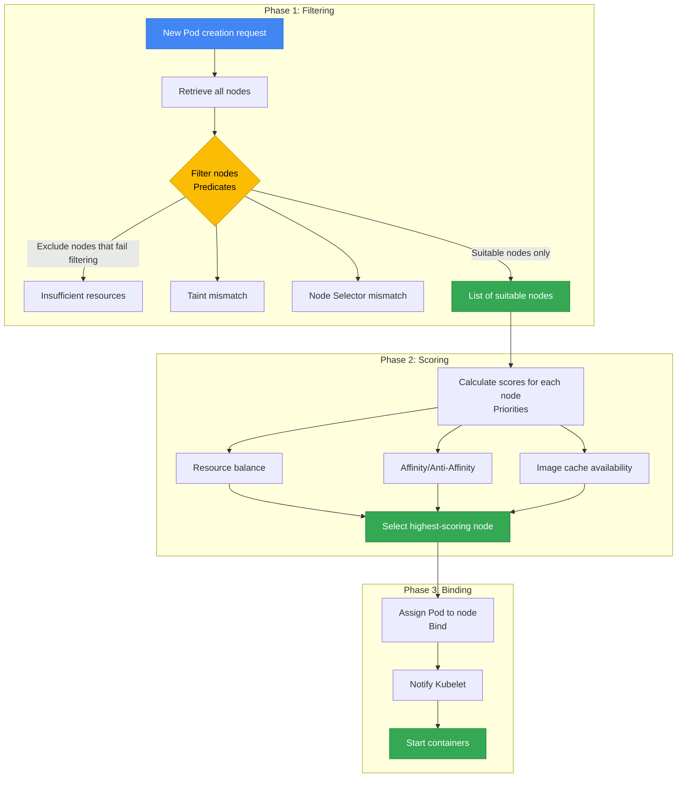

**1. Filtering (Predicates)**: Exclude nodes that do not meet requirements
- Insufficient resources (CPU, Memory)
- Taints/Tolerations mismatch
- Unmet Node Selector conditions
- Volume topology constraints (EBS AZ-Pinning)
- Port conflicts

**2. Scoring (Priorities)**: Score the remaining nodes and select the optimal node
- Resource balance (even utilization)
- Satisfaction of Pod Affinity/Anti-Affinity
- Image cache availability
- Topology Spread uniformity
- Node preference (PreferredDuringScheduling)

**3. Binding**: Assign the Pod to the highest-scoring node and notify Kubelet

:::tip Debugging Scheduling Failures
If a Pod remains `Pending`, inspect the Events section with `kubectl describe pod <pod-name>`. Messages such as `Insufficient cpu`, `No nodes available`, and `Taint not tolerated` identify the cause of the failure.
:::

### 2.2 Factors That Affect Scheduling

| Factor | Type | Affected Phase | Enforcement | Primary Use Case |
|------|------|-----------|--------|---------------|
| **Node Selector** | Pod | Filtering | Hard | Specify a particular node type (GPU, ARM) |
| **Node Affinity** | Pod | Filtering/Scoring | Hard/Soft | Fine-grained node selection conditions |
| **Pod Affinity** | Pod | Filtering/Scoring | Hard/Soft | Filter on required rules and score preferred rules |
| **Pod Anti-Affinity** | Pod | Filtering/Scoring | Hard/Soft | Place Pods far apart |
| **Taints/Tolerations** | Node + Pod | Filtering/Scoring, NoExecute eviction | Depends on the effect | Separate placement permission, preferences and eviction |
| **Topology Spread** | Pod | Filtering/Scoring | Hard/Soft | Compare counts of selected Pods across eligible domains |
| **PriorityClass** | Pod | Queue ordering, permitted preemption | Does not bypass other placement constraints | Consider higher-priority pending Pods first |
| **Resource Requests** | Pod | Filtering | Hard | Check fit against node allocatable and existing requests |
| **PDB** | Pod Group | Eviction API | Hard | Constrain eviction requests that exceed the disruption budget |

**Hard vs Soft Constraints:**
- **Hard (Required)**: Scheduling fails if conditions are not met → `Pending` state
- **Soft (Preferred)**: A Pod may use another node that satisfies all hard constraints

---

## 3. Node Affinity & Anti-Affinity

### 3.1 Node Selector (Basic)

Node Selector is the simplest node selection mechanism and supports only label-based exact matches.

```yaml
apiVersion: apps/v1
kind: Deployment
metadata:
  name: gpu-workload
spec:
  replicas: 2
  selector:
    matchLabels:
      app: ml-training
  template:
    metadata:
      labels:
        app: ml-training
    spec:
      nodeSelector:
        node.kubernetes.io/instance-type: g5.2xlarge
        workload-type: gpu
      containers:
      - name: trainer
        image: ml/trainer:v2.0
        resources:
          requests:
            nvidia.com/gpu: 1
          limits:
            nvidia.com/gpu: 1
```

The GPU examples require drivers and a device plugin that advertises `nvidia.com/gpu` on the nodes. Image names are placeholders; verify your image and node labels. Under the [GPU resource rules](https://v1-34.docs.kubernetes.io/docs/tasks/manage-gpus/scheduling-gpus/), specify a GPU limit alone or equal GPU requests and limits.

**Limitations**: Node Selector supports only `AND` conditions; it does not support `OR`, `NOT`, or comparison operators. Use Node Affinity when complex conditions are required.

### 3.2 Node Affinity in Detail

Node Affinity extends Node Selector to express complex logical conditions and preferences.

#### Required vs Preferred

| Type | Behavior | When to Use |
|------|------|----------|
| `requiredDuringSchedulingIgnoredDuringExecution` | Conditions must be met (Hard) | When placement on specific nodes is mandatory |
| `preferredDuringSchedulingIgnoredDuringExecution` | Conditions are preferred (Soft, weight-based) | When preferred placement allows alternatives |

:::info Meaning of IgnoredDuringExecution
`IgnoredDuringExecution` means that this affinity rule alone does not evict or relocate a scheduled Pod when node labels change. The [Kubernetes 1.34 Node Affinity API](https://v1-34.docs.kubernetes.io/docs/concepts/scheduling-eviction/assign-pod-node/#node-affinity) has no `RequiredDuringExecution` field that re-enforces the condition during execution.
:::

#### Operator Types

| Operator | Description | Example |
|--------|------|------|
| `In` | Value is included in the list | `values: ["t3.xlarge", "t3.2xlarge"]` |
| `NotIn` | Value is outside the list, or the label is absent | `values: ["t2.micro", "t2.small"]`; add `Exists` when the label must be present |
| `Exists` | Key exists (regardless of value) | Check only whether the label exists |
| `DoesNotExist` | Key does not exist | Select nodes without a specific label |
| `Gt` | Value is greater (numeric) | `values: ["100"]` (CPU core count, for example) |
| `Lt` | Value is less (numeric) | `values: ["10"]` |

#### YAML Examples by Use Case

**Example 1: Place ML Workloads on GPU Nodes (Hard)**

```yaml
apiVersion: apps/v1
kind: Deployment
metadata:
  name: ml-training
spec:
  replicas: 3
  selector:
    matchLabels:
      app: ml-training
  template:
    metadata:
      labels:
        app: ml-training
    spec:
      affinity:
        nodeAffinity:
          requiredDuringSchedulingIgnoredDuringExecution:
            nodeSelectorTerms:
            - matchExpressions:
              - key: node.kubernetes.io/instance-type
                operator: In
                values:
                - g5.2xlarge
                - g5.4xlarge
              - key: karpenter.sh/capacity-type
                operator: Exists
              - key: karpenter.sh/capacity-type
                operator: NotIn
                values:
                - spot  # Exclude Spot for GPU workloads
      containers:
      - name: trainer
        image: ml/trainer:v3.0
        resources:
          requests:
            nvidia.com/gpu: 1
            cpu: "4"
            memory: 16Gi
          limits:
            nvidia.com/gpu: 1
```

This example requires a Karpenter capacity-type label whose value is not `spot`. CPU and memory requests must fit the capacity remaining after system reservations and DaemonSet requests.

**Example 2: Instance Family Preferences (Soft, Weighted)**

```yaml
apiVersion: apps/v1
kind: Deployment
metadata:
  name: api-server
spec:
  replicas: 6
  selector:
    matchLabels:
      app: api-server
  template:
    metadata:
      labels:
        app: api-server
    spec:
      affinity:
        nodeAffinity:
          # Required: Use only On-Demand nodes
          requiredDuringSchedulingIgnoredDuringExecution:
            nodeSelectorTerms:
            - matchExpressions:
              - key: karpenter.sh/capacity-type
                operator: In
                values:
                - on-demand
          # Preferred: c7i > c6i > m6i order
          preferredDuringSchedulingIgnoredDuringExecution:
          - weight: 100
            preference:
              matchExpressions:
              - key: node.kubernetes.io/instance-type
                operator: In
                values:
                - c7i.xlarge
                - c7i.2xlarge
          - weight: 80
            preference:
              matchExpressions:
              - key: node.kubernetes.io/instance-type
                operator: In
                values:
                - c6i.xlarge
                - c6i.2xlarge
          - weight: 50
            preference:
              matchExpressions:
              - key: node.kubernetes.io/instance-type
                operator: In
                values:
                - m6i.xlarge
                - m6i.2xlarge
      containers:
      - name: api
        image: api-server:v2.5
        resources:
          requests:
            cpu: "1"
            memory: 2Gi
```

**Example 3: Static AZ Preference (Database Client)**

This example prefers the current RDS writer's AZ when placing new Pods. Replace `us-east-1a` and `DB_ENDPOINT` with the actual AZ and RDS endpoint. The preference does not move existing Pods or follow the writer to another AZ after failover.

A Multi-AZ DB instance failover changes the endpoint's DNS target. Check that the client's DNS caching and reconnection behavior allow it to use the new address. Evaluate same-AZ traffic and cost changes from the actual request path.

```yaml
apiVersion: apps/v1
kind: Deployment
metadata:
  name: db-client
spec:
  replicas: 4
  selector:
    matchLabels:
      app: db-client
  template:
    metadata:
      labels:
        app: db-client
    spec:
      affinity:
        nodeAffinity:
          # Static preference; not a writer-AZ tracking mechanism
          preferredDuringSchedulingIgnoredDuringExecution:
          - weight: 100
            preference:
              matchExpressions:
              - key: topology.kubernetes.io/zone
                operator: In
                values:
                - us-east-1a
      containers:
      - name: client
        image: db-client:v1.2
        env:
        - name: DB_ENDPOINT
          value: "REPLACE_WITH_RDS_ENDPOINT"
```

### 3.3 Node Anti-Affinity

Node Anti-Affinity has no explicit syntax but is implemented with the `NotIn` and `DoesNotExist` operators in Node Affinity.

```yaml
apiVersion: apps/v1
kind: Deployment
metadata:
  name: avoid-spot
spec:
  replicas: 3
  selector:
    matchLabels:
      app: critical-service
  template:
    metadata:
      labels:
        app: critical-service
    spec:
      affinity:
        nodeAffinity:
          requiredDuringSchedulingIgnoredDuringExecution:
            nodeSelectorTerms:
            - matchExpressions:
              # Require the label, then exclude Spot nodes
              - key: karpenter.sh/capacity-type
                operator: Exists
              - key: karpenter.sh/capacity-type
                operator: NotIn
                values:
                - spot
              # Require the label, then exclude ARM architecture
              - key: kubernetes.io/arch
                operator: Exists
              - key: kubernetes.io/arch
                operator: NotIn
                values:
                - arm64
      containers:
      - name: app
        image: critical-service:v1.0
```

---

## 4. Pod Affinity & Anti-Affinity

Pod Affinity and Anti-Affinity make scheduling decisions based on **relationships between Pods**. They place related Pods close together (Affinity) or far apart (Anti-Affinity).

### 4.1 Pod Affinity

Pod affinity uses the topology domain of matching Pods as a placement condition or preference. Request-by-request endpoint selection by a Service or proxy follows separate routing configuration.

**Primary Use Cases:**
- **Cache Locality**: Place the cache server and application on the same node to minimize latency
- **Data Locality**: Place data processing workloads close to their data sources
- **Communication Intensive**: Place microservices that communicate frequently in the same AZ

```yaml
apiVersion: apps/v1
kind: Deployment
metadata:
  name: cache-client
spec:
  replicas: 3
  selector:
    matchLabels:
      app: cache-client
  template:
    metadata:
      labels:
        app: cache-client
    spec:
      affinity:
        podAffinity:
          # Hard: Place on the same node as Redis Pods (ultra-low latency requirement)
          requiredDuringSchedulingIgnoredDuringExecution:
          - labelSelector:
              matchExpressions:
              - key: app
                operator: In
                values:
                - redis
            topologyKey: kubernetes.io/hostname
      containers:
      - name: client
        image: cache-client:v1.0
```

**topologyKey Explained:**

| topologyKey | Scope | Description |
|-------------|------|------|
| `kubernetes.io/hostname` | Node | Place on the same node (strongest co-location) |
| `topology.kubernetes.io/zone` | AZ | Place in the same AZ |
| `topology.kubernetes.io/region` | Region | Place in the same region |
| Custom label | User-defined | Examples: `rack`, `datacenter` |

**Soft Affinity Example (Preferred, Alternatives Allowed):**

```yaml
apiVersion: apps/v1
kind: Deployment
metadata:
  name: web-frontend
spec:
  replicas: 6
  selector:
    matchLabels:
      app: web-frontend
  template:
    metadata:
      labels:
        app: web-frontend
    spec:
      affinity:
        podAffinity:
          # Soft: Prefer the API server's AZ; request routing is configured separately
          preferredDuringSchedulingIgnoredDuringExecution:
          - weight: 100
            podAffinityTerm:
              labelSelector:
                matchExpressions:
                - key: app
                  operator: In
                  values:
                  - api-server
              topologyKey: topology.kubernetes.io/zone
      containers:
      - name: frontend
        image: web-frontend:v2.0
```

### 4.2 Pod Anti-Affinity

Pod anti-affinity restricts placement or prefers separation so that Pods matching a selector do not gather on the same node or in the same AZ. The diagram shows a possible placement across three domains. Actual placement depends on candidate nodes and other constraints; shared dependencies such as a database can still fail. Hard AZ anti-affinity requires admission settings that permit that topology key.

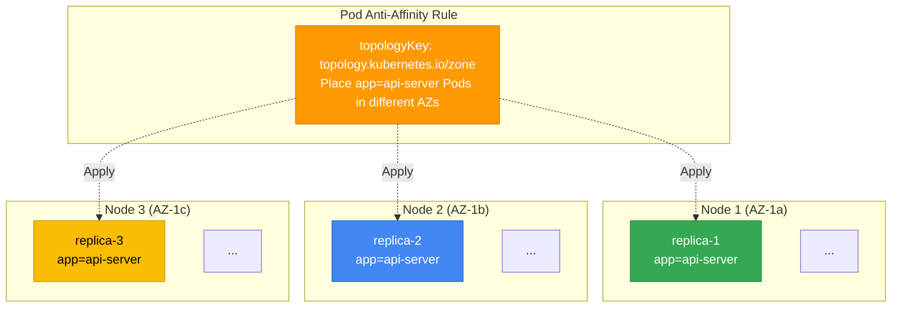

#### Hard Anti-Affinity (Failure Domain Isolation)

```yaml
apiVersion: apps/v1
kind: Deployment
metadata:
  name: api-server
spec:
  replicas: 6
  selector:
    matchLabels:
      app: api-server
  template:
    metadata:
      labels:
        app: api-server
    spec:
      affinity:
        podAntiAffinity:
          # Hard: Place at most 1 replica per node (isolate node failures)
          requiredDuringSchedulingIgnoredDuringExecution:
          - labelSelector:
              matchExpressions:
              - key: app
                operator: In
                values:
                - api-server
            topologyKey: kubernetes.io/hostname
      containers:
      - name: api
        image: api-server:v3.0
        resources:
          requests:
            cpu: "1"
            memory: 2Gi
```

:::warning Hard Anti-Affinity Considerations
Hard hostname anti-affinity allows at most one matching Pod per eligible hostname. With three otherwise suitable nodes, at least two of five replicas may remain Pending. Check resources, taints, volumes and rollout surge headroom as well. Switching to Soft relaxes this separation condition; other causes of Pending remain.
:::

#### Soft Anti-Affinity (Recommended Pattern)

```yaml
apiVersion: apps/v1
kind: Deployment
metadata:
  name: worker
spec:
  replicas: 10
  selector:
    matchLabels:
      app: worker
  template:
    metadata:
      labels:
        app: worker
    spec:
      affinity:
        podAntiAffinity:
          # Soft: Distribute across different nodes whenever possible (ensure flexibility)
          preferredDuringSchedulingIgnoredDuringExecution:
          - weight: 100
            podAffinityTerm:
              labelSelector:
                matchExpressions:
                - key: app
                  operator: In
                  values:
                  - worker
              topologyKey: kubernetes.io/hostname
      containers:
      - name: worker
        image: worker:v2.1
        resources:
          requests:
            cpu: "500m"
            memory: 1Gi
```

#### Criteria for Choosing Hard vs Soft

| Scenario | Recommendation | Reason |
|---------|------|------|
| Enough eligible hostnames and capacity | Consider Hard | At most one matching Pod per hostname; rollout surge also needs headroom |
| More replicas than eligible hostnames | Add capacity or consider Soft | Soft permits co-location and changes failure exposure |
| Reduce AZ-level failure exposure | Topology Spread or permitted hard AZ anti-affinity | Hard AZ rules allow at most one per eligible AZ; check admission policy |
| General workloads | Consider Soft | Scores the spreading preference alongside other constraints |
| Rapid scaling required | Review constraints and capacity together | Soft alone does not guarantee placement or eliminate Pending |

### 4.3 Affinity/Anti-Affinity vs Topology Spread Comparison

| Comparison | Pod Anti-Affinity | Topology Spread Constraints |
|----------|-------------------|----------------------------|
| **Purpose** | Separation from selected Pods | Spread the selected Pod set across domains |
| **Granularity** | Pod selector and topology key | Pod selector and counts per domain |
| **Complexity** | Depends on rules and selectors | Depends on rules and domains |
| **Flexibility** | Choose Hard/Soft | Hard skew limit or Soft spreading preference |
| **Primary use** | Separate matching replicas | Balance Pods matched by labelSelector in the same namespace |
| **AZ distribution** | Supported; hard rules require admission review | Evaluate eligible domains, maxSkew and minDomains together |
| **Node distribution** | Supported | Hard hostname constraint or Soft scoring |
| **Recommended combination** | Topology Spread (AZ) + Anti-Affinity (Node) | |

:::info Topology Spread Constraints Reference
Topology Spread Constraints provide more granular distribution control than Pod Anti-Affinity. For details and YAML examples, see the [EKS High Availability Architecture Guide](/docs/eks-best-practices/operations-reliability/eks-resiliency-guide#pod-topology-spread-constraints).
:::

#### 4.3.1 Practical Topology Spread Constraints Patterns

Topology Spread compares how many Pods match a selector in each domain within the same namespace. A domain is a node or AZ identified by `topologyKey`. Node selector/affinity, topology labels and `nodeAffinityPolicy`/`nodeTaintsPolicy` determine which domains enter the calculation. Counting spare CPU/memory or uncordoned nodes is not a substitute.

The examples use Kubernetes 1.34. `DoNotSchedule` rejects placements that exceed the allowed difference in Pod counts, called skew. `ScheduleAnyway` prefers candidates that improve the spread. Pattern 2 explains how `minDomains` affects the skew calculation. Other scheduling conditions, including resource shortages, can block placement with either setting.

##### Pattern 1: Even Multi-AZ Distribution (Basic)

This Hard pattern constrains the selected replica counts per AZ. Its illustrated placement assumes three eligible AZs and enough capacity.

```yaml
apiVersion: apps/v1
kind: Deployment
metadata:
  name: multi-az-app
  namespace: production
spec:
  replicas: 9
  selector:
    matchLabels:
      app: multi-az-app
  template:
    metadata:
      labels:
        app: multi-az-app
    spec:
      topologySpreadConstraints:
      - maxSkew: 1
        topologyKey: topology.kubernetes.io/zone
        whenUnsatisfiable: DoNotSchedule
        labelSelector:
          matchLabels:
            app: multi-az-app
      containers:
      - name: app
        image: myapp:v1.0
        resources:
          requests:
            cpu: 500m
            memory: 512Mi
```

**How It Works:**
- `maxSkew: 1`: compare the target AZ's matching-Pod count, including the incoming Pod, with the global minimum
- A 3/3/3 placement of nine replicas is possible with three eligible AZs and all other constraints satisfied
- `DoNotSchedule`: reject a candidate whose skew exceeds the limit

**Use Cases:**
- AZ failure resilience for mission-critical services
- Client traffic arriving evenly from all AZs
- Failure isolation at the data center level

##### Pattern 2: Using minDomains (Global Minimum Calculation) {#pattern-2-using-mindomains-minimum-az-guarantee}

`minDomains` does not create a required number of AZs or guarantee availability. When fewer domains are eligible, the Hard skew calculation uses a global minimum of zero. The field is GA from Kubernetes 1.30; earlier releases require checking feature-gate support.

```yaml
apiVersion: apps/v1
kind: Deployment
metadata:
  name: ha-critical-service
  namespace: production
spec:
  replicas: 6
  selector:
    matchLabels:
      app: ha-critical-service
      tier: critical
  template:
    metadata:
      labels:
        app: ha-critical-service
        tier: critical
    spec:
      topologySpreadConstraints:
      - maxSkew: 1
        minDomains: 3  # Fewer than three eligible domains means a global minimum of zero
        topologyKey: topology.kubernetes.io/zone
        whenUnsatisfiable: DoNotSchedule
        labelSelector:
          matchLabels:
            app: ha-critical-service
      containers:
      - name: service
        image: critical-service:v2.5
        resources:
          requests:
            cpu: "1"
            memory: 1Gi
          limits:
            cpu: "2"
            memory: 2Gi
```

**How It Works:**
- With at least three eligible AZs, the smallest matching-Pod count is the global minimum.
- Six replicas can reach 2/2/2 when all three AZs have suitable capacity and constraints; this is not a minimum of two per AZ or an SLA.
- With two eligible AZs containing 2/2 matching Pods, the global minimum is zero. An incoming matching Pod fails in both candidates because `3 - 0 > 1`.

**Use Cases:**
- Intentionally restricting higher-skew placement when fewer than three domains are eligible
- Deciding in advance whether domain loss should leave Pods Pending or use another placement policy

:::warning Considerations When Configuring minDomains
Fewer domains do not always make every Pod Pending. In two empty domains, the first Pod in each can satisfy `1 - 0 <= 1`. Check recovery capacity and other filters during AZ reduction; compare the Soft AZ example in section 10.3 when placement is the priority.
:::

##### Pattern 3: Combining Anti-Affinity + Topology Spread

This combines at-most-one matching replica per hostname with an AZ skew constraint. Candidates and capacity must satisfy both constraints.

```yaml
apiVersion: apps/v1
kind: Deployment
metadata:
  name: combined-constraints-app
  namespace: production
spec:
  replicas: 12
  selector:
    matchLabels:
      app: combined-app
  template:
    metadata:
      labels:
        app: combined-app
        version: v3.0
    spec:
      # 1. Topology Spread: Even distribution across AZs (Hard)
      topologySpreadConstraints:
      - maxSkew: 1
        minDomains: 3
        topologyKey: topology.kubernetes.io/zone
        whenUnsatisfiable: DoNotSchedule
        labelSelector:
          matchLabels:
            app: combined-app

      # 2. Anti-Affinity: Distribution across nodes (Hard)
      affinity:
        podAntiAffinity:
          requiredDuringSchedulingIgnoredDuringExecution:
          - labelSelector:
              matchExpressions:
              - key: app
                operator: In
                values:
                - combined-app
            topologyKey: kubernetes.io/hostname

      containers:
      - name: app
        image: combined-app:v3.0
        resources:
          requests:
            cpu: "2"
            memory: 4Gi
```

**How It Works:**
- A 4/4/4 placement of twelve replicas is possible with four eligible hostnames and sufficient capacity in each of three eligible AZs
- Hostname anti-affinity and AZ skew must both be satisfied; rollout surge needs additional candidates

**Effects:**
- If that placement already holds, one node failure directly exposes at most one selected Pod
- `12 - 4 = 8` replicas lie outside one failed AZ; this is not a measured healthy-endpoint count or load capacity
- Assess dependencies, storage, networking and remaining-AZ capacity separately to evaluate service availability

**Use Cases:**
- API servers and payment gateways needing lower shared node/AZ failure exposure
- Evaluating Pending behavior and replacement capacity under Hard constraints before domain loss

##### Pattern 4: Multiple Topology Spread Constraints (Zone + Node)

Control distribution across multiple topology levels simultaneously in a single Pod Spec.

```yaml
apiVersion: apps/v1
kind: Deployment
metadata:
  name: multi-level-spread
  namespace: production
spec:
  replicas: 18
  selector:
    matchLabels:
      app: multi-level-app
  template:
    metadata:
      labels:
        app: multi-level-app
    spec:
      topologySpreadConstraints:
      # Constraint 1: AZ-level distribution (Hard)
      - maxSkew: 1
        minDomains: 3
        topologyKey: topology.kubernetes.io/zone
        whenUnsatisfiable: DoNotSchedule
        labelSelector:
          matchLabels:
            app: multi-level-app

      # Constraint 2: Node-level distribution (Soft)
      - maxSkew: 2
        topologyKey: kubernetes.io/hostname
        whenUnsatisfiable: ScheduleAnyway
        labelSelector:
          matchLabels:
            app: multi-level-app

      containers:
      - name: app
        image: multi-level-app:v1.5
        resources:
          requests:
            cpu: "1"
            memory: 2Gi
```

**How It Works:**
- The Hard AZ constraint and Soft hostname preference are evaluated together, not as an AZ-then-node allocation algorithm
- A 6/6/6 placement of eighteen replicas is possible with three eligible AZs and other constraints satisfied
- Hostname `ScheduleAnyway` scores candidates that reduce skew; it does not impose a per-AZ difference of at most two Pods per node
- The Soft hostname preference itself does not forbid higher skew, but the Hard AZ constraint or other filters can still leave Pods Pending

**Use Cases:**
- Deployments with a large replica count (10 or more)
- Environments with a variable node count (Karpenter autoscaling)
- AZ distribution is required, while node distribution is preferred

##### Pattern Comparison

| Pattern | maxSkew | minDomains | whenUnsatisfiable | Additional Constraints | Complexity | Recommended Replica Count |
|------|---------|------------|-------------------|----------|--------|----------------|
| **Pattern 1: Basic Multi-AZ** | 1 | - | DoNotSchedule | None | Low | 3~12 |
| **Pattern 2: minDomains** | 1 | 3 | DoNotSchedule | None | Medium | 6~20 |
| **Pattern 3: Anti-Affinity Combination** | 1 | 3 | DoNotSchedule | Hard Anti-Affinity | High | 12~50 |
| **Pattern 4: Multiple Spread Constraints** | 1, 2 | 3 | Mixed | Concurrent AZ constraint and hostname preference | High | 15+ |

##### Troubleshooting: Causes of Topology Spread Failures

| Symptom | Cause | Resolution |
|------|------|----------|
| Pods remain Pending | No candidate satisfies Hard skew or another filter | Review Events, eligible domains, matching-Pod counts and capacity together |
| Pods concentrated in one AZ | Soft preference or too few eligible domains, among other causes | Inspect actual candidates and availability needs before accepting the Pending risk of Hard constraints |
| No redistribution after adding an AZ | The scheduler does not automatically relocate existing Pods | Review targets and disruption effects of a separate rebalance or rollout |
| More Pending after setting minDomains | Domain loss may have changed the global minimum to zero | Calculate candidate skew instead of diagnosing from AZ count alone |

:::tip Topology Spread Debugging Commands
Use Pod and Node snapshots from the same cluster and record their capture times. `spec.nodeSelector` is an input constraint; the actual zone is the label on the Node named by `spec.nodeName`. The two lists are not an atomic snapshot.

```bash
: "${CONTEXT:?set the selected Kubernetes context}"
: "${NAMESPACE:?set the workload namespace}"
: "${SELECTOR:?set the workload label selector}"
kubectl --context "$CONTEXT" get pods -n "$NAMESPACE" -l "$SELECTOR" -o json > pods.json
kubectl --context "$CONTEXT" get nodes -o json > nodes.json
```

The following offline function joins the supplied JSON objects. Keep unscheduled Pods, missing Nodes, unknown zones and `Unknown` readiness visible when aggregating counts by node or zone.

```python
def placement_report(pod_list, node_list):
    """Join supplied snapshots only; labels are observations, not ownership proof."""
    nodes = {n["metadata"]["name"]: n for n in node_list["items"]}
    result = []
    for pod in pod_list["items"]:
        name = pod.get("spec", {}).get("nodeName")
        node = nodes.get(name)
        labels = (node or {}).get("metadata", {}).get("labels", {})
        ready = next((c.get("status", "Unknown")
                      for c in (node or {}).get("status", {}).get("conditions", [])
                      if c.get("type") == "Ready"), "Unknown")
        result.append({
            "namespace": pod["metadata"].get("namespace", "default"),
            "pod": pod["metadata"]["name"],
            "node": name,
            "placement": ("unscheduled" if not name else
                          "node_missing" if node is None else "node_found"),
            "zone": labels.get("topology.kubernetes.io/zone"),
            "nodeReady": ready,
            "providerID": (node or {}).get("spec", {}).get("providerID"),
            "nodepoolLabel": labels.get("karpenter.sh/nodepool"),
            "nodegroupLabel": labels.get("eks.amazonaws.com/nodegroup"),
            "owners": pod["metadata"].get("ownerReferences", []),
        })
    return result
```
:::

**Recommended Combined Pattern:**

```yaml
apiVersion: apps/v1
kind: Deployment
metadata:
  name: best-practice-app
spec:
  replicas: 6
  selector:
    matchLabels:
      app: best-practice-app
  template:
    metadata:
      labels:
        app: best-practice-app
    spec:
      # Topology Spread: Even distribution across AZs (Hard)
      topologySpreadConstraints:
      - maxSkew: 1
        topologyKey: topology.kubernetes.io/zone
        whenUnsatisfiable: DoNotSchedule
        labelSelector:
          matchLabels:
            app: best-practice-app
        minDomains: 3
      # Anti-Affinity: Distribution across nodes (Soft)
      affinity:
        podAntiAffinity:
          preferredDuringSchedulingIgnoredDuringExecution:
          - weight: 100
            podAffinityTerm:
              labelSelector:
                matchExpressions:
                - key: app
                  operator: In
                  values:
                  - best-practice-app
              topologyKey: kubernetes.io/hostname
      containers:
      - name: app
        image: app:v1.0
```

---

<span id="5-9-taintstolerations-topology-spread-pdb-priorityclass-descheduler-advanced-patterns" />

## 5. Taints & Tolerations

Taints belong to nodes and tolerations belong to Pods. The scheduler blocks or discourages placement according to the effects of taints the Pod does not tolerate. A toleration permits consideration of a node; affinity and resource constraints still apply.

**Concepts:**
- **Taint**: Applied to a node (for example, "This node is dedicated to GPU workloads")
- **Toleration**: Applied to a Pod (for example, "I tolerate GPU nodes")

### 5.1 Taint Effects

| Effect | Behavior | Impact on Existing Pods | When to Use |
|--------|------|--------------|----------|
| `NoSchedule` | Block new Pod scheduling | Keep existing Pods | When creating new dedicated nodes |
| `PreferNoSchedule` | Avoid scheduling if possible (Soft) | Keep existing Pods | Prefer avoidance (allow alternatives) |
| `NoExecute` | Block placement without a matching toleration | Evict unmatched Pods; otherwise honor `tolerationSeconds` | Eviction policy for node-state changes |

**Commands to Apply Taints:**

```bash
# NoSchedule: Block new Pod scheduling
kubectl taint nodes node1 workload-type=gpu:NoSchedule

# NoExecute: Block new Pods + Evict existing Pods
kubectl taint nodes node1 maintenance=true:NoExecute

# Remove a Taint (append '-' at the end)
kubectl taint nodes node1 workload-type=gpu:NoSchedule-
```

### 5.2 Common Taint Patterns

#### Pattern 1: Dedicated Node Groups (GPU, High-Memory)

```yaml
# Apply a Taint to the node (kubectl or Karpenter)
# kubectl taint nodes gpu-node-1 nvidia.com/gpu=present:NoSchedule

# GPU Pod declares a Toleration
apiVersion: v1
kind: Pod
metadata:
  name: gpu-job
spec:
  tolerations:
  - key: nvidia.com/gpu
    operator: Equal
    value: present
    effect: NoSchedule
  nodeSelector:
    node.kubernetes.io/instance-type: g5.2xlarge
  containers:
  - name: trainer
    image: ml/trainer:v1.0
    resources:
      limits:
        nvidia.com/gpu: 1
```

#### Pattern 2: System Workload Isolation

These standalone Karpenter examples use the `v1.14.1` NodePool/EC2NodeClass contract. The referenced `default` EC2NodeClass must already select the intended AMI, node role, subnets and security groups. Match the installed controller and CRDs to the cluster version; this reference does not create those dependencies.

```yaml
# Dedicated system NodePool
apiVersion: karpenter.sh/v1
kind: NodePool
metadata:
  name: system-pool
spec:
  template:
    spec:
      nodeClassRef:
        group: karpenter.k8s.aws
        kind: EC2NodeClass
        name: default
      requirements:
      - key: node.kubernetes.io/instance-type
        operator: In
        values: ["c6i.large", "c6i.xlarge"]
      taints:
      - key: workload-type
        value: system
        effect: NoSchedule
  limits:
    cpu: "20"
---
# System DaemonSet (monitoring agent)
apiVersion: apps/v1
kind: DaemonSet
metadata:
  name: monitoring-agent
spec:
  selector:
    matchLabels:
      app: monitoring-agent
  template:
    metadata:
      labels:
        app: monitoring-agent
    spec:
      tolerations:
      - key: workload-type
        operator: Equal
        value: system
        effect: NoSchedule
      # These built-in DaemonSet tolerations do not authorize bypassing every custom taint
      - key: node.kubernetes.io/not-ready
        operator: Exists
        effect: NoExecute
      - key: node.kubernetes.io/unreachable
        operator: Exists
        effect: NoExecute
      containers:
      - name: agent
        image: monitoring-agent:v2.0
```

#### Pattern 3: Node Maintenance (Preparing to Drain)

For planned maintenance that respects PDBs, use the default Eviction API path of `kubectl drain`. The following `NoExecute` example illustrates taint-based deletion; it does not replace a drain procedure that enforces PDBs.

```bash
# Step 1: Apply a NoExecute Taint to the node
kubectl taint nodes node-1 maintenance=true:NoExecute

# Result: All Pods without a Toleration are immediately evicted and moved to other nodes
# NoExecute deletions do not use the Eviction API and are not constrained by PDBs

# Step 2: Remove the Taint after maintenance is complete
kubectl taint nodes node-1 maintenance=true:NoExecute-
kubectl uncordon node-1
```

### 5.3 Configuring Tolerations

#### Operator: Equal vs Exists

```yaml
# Equal: An exact key=value match is required
tolerations:
- key: workload-type
  operator: Equal
  value: gpu
  effect: NoSchedule

---
# Exists: Only the key needs to exist (ignore value)
tolerations:
- key: workload-type
  operator: Exists
  effect: NoSchedule

---
# Wildcard syntax only: tolerates every taint, including readiness/isolation guards.
# Do not make this the default for DaemonSets.
tolerations:
- operator: Exists
```

#### tolerationSeconds (NoExecute Only)

An existing Pod that does not tolerate a `NoExecute` taint is subject to eviction. A matching toleration with `tolerationSeconds` retains it for that duration. Omitting the duration from an explicit matching toleration allows it to remain indefinitely with respect to that taint.

```yaml
apiVersion: v1
kind: Pod
metadata:
  name: resilient-app
spec:
  tolerations:
  # Remain for 300 seconds even if the node becomes NotReady (handle transient failures)
  - key: node.kubernetes.io/not-ready
    operator: Exists
    effect: NoExecute
    tolerationSeconds: 300
  # Remain for 300 seconds even if the node becomes Unreachable
  - key: node.kubernetes.io/unreachable
    operator: Exists
    effect: NoExecute
    tolerationSeconds: 300
  containers:
  - name: app
    image: app:v1.0
```

**An injected toleration differs from an explicit toleration.** Default admission adds 300-second `not-ready` and `unreachable` tolerations to ordinary Pods when those tolerations are absent. An explicit matching `NoExecute` toleration without a duration is indefinite, not 300 seconds. The DaemonSet controller adds indefinite tolerations for both taints. None of these durations guarantees the complete time from failure detection to service recovery.

### 5.4 Default EKS Taints

The following Kubernetes node-condition taints and default tolerations also apply in EKS. The [official taint and toleration guide](https://v1-34.docs.kubernetes.io/docs/concepts/scheduling-eviction/taint-and-toleration/) distinguishes placement restrictions from eviction.

| Taint | Applies To | Effect | Handling |
|-------|----------|------|----------|
| `node.kubernetes.io/not-ready` | Ready=False | NoExecute | Default admission adds 300 seconds for ordinary Pods; DaemonSet controller adds an indefinite toleration |
| `node.kubernetes.io/unreachable` | Ready=Unknown | NoExecute | Default admission adds 300 seconds for ordinary Pods; DaemonSet controller adds an indefinite toleration |
| `node.kubernetes.io/disk-pressure` | Disk pressure | NoSchedule | Automatically tolerated by DaemonSets; other Pods may explicitly tolerate it |
| `node.kubernetes.io/memory-pressure` | Memory pressure | NoSchedule | Automatically tolerated by non-BestEffort Pods and DaemonSets |
| `node.kubernetes.io/pid-pressure` | PID pressure | NoSchedule | Automatically tolerated by DaemonSets; other Pods may explicitly tolerate it |
| `node.kubernetes.io/network-unavailable` | Network not configured | NoSchedule | hostNetwork DaemonSets receive an automatic toleration; verify network readiness for ordinary workloads |

A toleration does not restore resources or connectivity. Even a Pod allowed onto the node can be evicted under resource pressure or fail at the application level.

### 5.5 Managing Taints in Karpenter

Karpenter manages Taints declaratively in NodePools:

```yaml
apiVersion: karpenter.sh/v1
kind: NodePool
metadata:
  name: gpu-pool
spec:
  template:
    spec:
      requirements:
      - key: node.kubernetes.io/instance-type
        operator: In
        values: ["g5.xlarge", "g5.2xlarge"]
      - key: karpenter.sh/capacity-type
        operator: In
        values: ["on-demand"]
      # Automatically apply Taints during node provisioning
      taints:
      - key: nvidia.com/gpu
        value: present
        effect: NoSchedule
      - key: workload-type
        value: ml
        effect: NoSchedule
      nodeClassRef:
        group: karpenter.k8s.aws
        kind: EC2NodeClass
        name: gpu-nodes
  limits:
    cpu: "100"
    memory: 500Gi
```

Taints are applied automatically to all nodes provisioned by Karpenter, so there is no need to run `kubectl taint` manually.

### 5.6 Migrating from Cluster Autoscaler to Karpenter

Cluster Autoscaler adjusts existing ASG sizes, while Karpenter provisions new nodes for Pod requirements. During migration, check what each controller owns and where the Pods actually run.

First identify the AWS account, role/profile, Region, Kubernetes context, workload namespaces, ASGs/managed node groups and NodePools. The NodePool fields follow Karpenter `v1.14.1`; referenced EC2NodeClasses must already exist with compatible AMIs and IAM/network settings. Cluster Autoscaler must match the Kubernetes minor version. The configuration fragment below uses Kubernetes/CA `1.34`.

Retain the current CA installation, launch templates, desired capacity and workload-placement configuration for rollback. The week labels are an example schedule. Advance based on workload health, capacity and data checks.

#### 5.6.1 Differences in Scheduling Behavior

The key differences between Cluster Autoscaler and Karpenter are **how they provision nodes** and **how closely they integrate with Pod scheduling**.

##### Behavior Comparison

| Comparison | Cluster Autoscaler | Karpenter |
|----------|-------------------|-----------|
| **Trigger** | Detect Pending Pods → Request ASG scale-out | Detect Pending Pods → Immediately provision EC2 instances |
| **Scaling speed** | Tens of seconds ~ Several minutes (ASG wait time) | A few seconds (direct EC2 API calls) |
| **Node selection** | Select from predefined ASG groups | Select instance types in real time based on Pod requirements |
| **Instance type diversity** | Fixed types per ASG (LaunchTemplate) | Optimal selection from 100+ types (NodePool requirements) |
| **Cost optimization** | Manual ASG configuration required | Automatic Spot/On-Demand mix and lowest-price selection |
| **Bin Packing** | Limited (ASG level) | Advanced (aware of Pod requirements) |
| **Taints/Tolerations awareness** | Limited | Native integration |
| **Topology Spread awareness** | Limited | Native integration |
| **Integration level** | External tool for Kubernetes | Kubernetes-native (CRD-based) |

##### Scaling Scenario Example

**Scenario: Create 3 Pods That Request GPUs**

**Cluster Autoscaler Behavior:**
```text
1. Three GPU Pods cannot be scheduled on existing nodes.
2. CA evaluates unschedulable Pods on its configured scan interval.
3. CA simulates candidate node groups and requests capacity in a matching GPU ASG.
4. The ASG launches instances; nodes register and initialize their runtime and GPU resources.
5. kube-scheduler binds Pods when scheduling constraints permit; kubelet starts containers.
6. Measure trigger-to-capacity, registration, binding and workload readiness separately.
```

**Karpenter Behavior:**
```text
1. Three GPU Pods cannot be scheduled on existing nodes.
2. Karpenter batches provisioning decisions using Pod and NodePool constraints.
3. Karpenter creates NodeClaims from the constraints; the AWS provider selects compatible instance offerings.
4. In provider v1.14.1, the instance creation path uses EC2 CreateFleet.
5. After registration and resource initialization, kube-scheduler binds eligible Pods and kubelet starts them.
6. Timing depends on capacity, AMI, network, drivers and workload startup; this is a flow example, not a measured comparison.
```

##### Differences in Cost Optimization

**Cluster Autoscaler:**
- Separate Spot/On-Demand configuration required for each ASG
- Manual LaunchTemplate updates when changing instance types
- Over-provisioning may occur

**Karpenter:**
- Declare allowed capacity types in NodePool requirements; list order is not an On-Demand preference.
- Select the cheapest instance type in real time
- Provision nodes that precisely match Pod requirements

**Cost Savings Example (Measured Data):**
```yaml
# Cluster Autoscaler: Fixed ASG
# m5.2xlarge (8 vCPU, 32GB) → $0.384/hour
# → Pay for the entire node even when a Pod requests only 2 vCPU

# Karpenter: Flexible selection
# m5.large (2 vCPU, 8GB) → $0.096/hour
# → Select a smaller node to match Pod requirements
# → 75% cost savings
```

#### 5.6.2 Migration Checklist

The following is a step-by-step guide to safely transitioning from Cluster Autoscaler to Karpenter.

##### Step 1: Define a NodePool (ASG → NodePool Mapping)

Convert the existing ASG configuration to a Karpenter NodePool CRD.

**Existing Cluster Autoscaler Configuration:**
```yaml
# ASG: eks-general-purpose-asg
# - Instance types: m5.xlarge, m5.2xlarge
# - Capacity type: On-Demand
# - AZ: us-east-1a, us-east-1b, us-east-1c
```

**Karpenter NodePool Conversion:**
```yaml
apiVersion: karpenter.sh/v1
kind: NodePool
metadata:
  name: general-purpose
spec:
  template:
    spec:
      expireAfter: 720h  # Illustrative 30-day node lifetime
      requirements:
      # Instance types: Taken from the ASG LaunchTemplate
      - key: node.kubernetes.io/instance-type
        operator: In
        values: ["m5.xlarge", "m5.2xlarge", "m5a.xlarge", "m5a.2xlarge"]

      # Capacity types allowed; array order is not a preference
      - key: karpenter.sh/capacity-type
        operator: In
        values: ["on-demand", "spot"]

      # AZs: Keep the existing ASG AZs
      - key: topology.kubernetes.io/zone
        operator: In
        values: ["us-east-1a", "us-east-1b", "us-east-1c"]

      # Architecture: x86_64 only (exclude ARM)
      - key: kubernetes.io/arch
        operator: In
        values: ["amd64"]

      nodeClassRef:
        group: karpenter.k8s.aws
        kind: EC2NodeClass
        name: default

  # Resource limits: Based on ASG Max Size
  limits:
    cpu: "1000"
    memory: 1000Gi

  # Consolidation policy: Enable Consolidation
  disruption:
    consolidationPolicy: WhenEmptyOrUnderutilized
    consolidateAfter: 1m  # Illustrative wait after Pod changes
```

**Conversion Guide:**

| ASG Setting | NodePool Field | Notes |
|---------|--------------|------|
| LaunchTemplate instance types | `requirements[instance-type]` | A broader range is recommended (cost optimization) |
| Spot/On-Demand | `requirements[capacity-type]` | Allowed values, not a priority array or target ratio |
| Subnets (AZ) | `requirements[zone]` | SubnetSelector is also possible |
| Max Size | `limits.cpu`, `limits.memory` | Convert to total vCPU/memory |
| Tags | `EC2NodeClass.tags` | Tags for security and cost tracking |

##### Step 2: Check Taints/Tolerations Compatibility

The same Taints applied to the existing ASG must also be applied to the NodePool.

**Existing ASG Taint (UserData Script):**
```bash
# /etc/eks/bootstrap.sh option
--kubelet-extra-args '--register-with-taints=workload-type=batch:NoSchedule'
```

**Karpenter NodePool Taint:**
```yaml
apiVersion: karpenter.sh/v1
kind: NodePool
metadata:
  name: batch-workload
spec:
  template:
    spec:
      nodeClassRef:
        group: karpenter.k8s.aws
        kind: EC2NodeClass
        name: default
      requirements:
      - key: karpenter.sh/capacity-type
        operator: In
        values: ["spot"]  # Use Spot for Batch

      # Apply Taints: Match the existing ASG
      taints:
      - key: workload-type
        value: batch
        effect: NoSchedule
```

**Verification Commands:**
```bash
# Check Taints on existing ASG nodes
kubectl get nodes -l eks.amazonaws.com/nodegroup=batch-asg \
  -o jsonpath='{.items[*].spec.taints}' | jq

# Check Taints on Karpenter nodes
kubectl get nodes -l karpenter.sh/nodepool=batch-workload \
  -o jsonpath='{.items[*].spec.taints}' | jq

# Verify that they match
```

##### Step 3: Validate PDBs (Minimize Disruption During Migration)

PodDisruptionBudgets must be configured correctly to minimize Pod disruptions during migration.

**Check PDB Configuration:**
```bash
# List all PDBs
kubectl get pdb -A

# Inspect a specific PDB in detail
kubectl describe pdb api-server-pdb -n production
```

**Recommended PDB Configuration (For Migration):**
```yaml
apiVersion: policy/v1
kind: PodDisruptionBudget
metadata:
  name: critical-app-pdb
  namespace: production
spec:
  minAvailable: 2  # Keep at least 2 available during migration
  selector:
    matchLabels:
      app: critical-app
```

**Validation Checklist:**
- [ ] Verify that PDBs are configured for all production workloads
- [ ] Set `minAvailable` or `maxUnavailable` appropriately
- [ ] Take extra care with StatefulSets (verify sequential termination)

##### Step 4: Revalidate Topology Spread

Karpenter natively supports Topology Spread Constraints, but existing configurations must be revalidated.

**Validation Points:**

| Item | What to Check |
|------|----------|
| **maxSkew** | Influences which AZ Karpenter chooses for new nodes |
| **minDomains** | Check how fewer eligible domains change the global minimum and Pending behavior |
| **whenUnsatisfiable** | With `DoNotSchedule`, Pods may remain Pending even after Karpenter creates nodes |

**Example: Debugging Topology Spread Issues**
```bash
# Check why the Pod is Pending
kubectl describe pod my-app-xyz -n production

# Message that may appear in the Events section:
# "0/10 nodes are available: 3 node(s) didn't match pod topology spread constraints."

# Resolution: Relax maxSkew or adjust the replica count
```

##### Step 5: Transition Monitoring (Metric Changes)

Cluster Autoscaler and Karpenter expose different metrics.

**Cluster Autoscaler Metrics:**
```promql
# Existing metric examples
cluster_autoscaler_scaled_up_nodes_total
cluster_autoscaler_scaled_down_nodes_total
cluster_autoscaler_unschedulable_pods_count
```

**Karpenter Metrics:**
```promql
# New metric examples
karpenter_nodes_created
karpenter_nodes_terminated
karpenter_pods_startup_duration_seconds
karpenter_disruption_queue_depth
karpenter_nodepool_usage
```

**Update the CloudWatch Dashboard:**
```yaml
# CloudWatch Container Insights widget example
{
  "type": "metric",
  "properties": {
    "metrics": [
      [ "AWS/Karpenter", "NodesCreated", { "stat": "Sum" } ],
      [ ".", "NodesTerminated", { "stat": "Sum" } ],
      [ ".", "PendingPods", { "stat": "Average" } ]
    ],
    "period": 300,
    "stat": "Average",
    "region": "us-east-1",
    "title": "Karpenter Node Autoscaling"
  }
}
```

**Alarm Transition Checklist:**
- [ ] Disable Cluster Autoscaler alarms
- [ ] Create new alarms based on Karpenter metrics
- [ ] Node creation failure alarm (`karpenter_nodeclaims_created{reason="failed"}`)
- [ ] Persistent Pending Pod alarm (`karpenter_pods_state{state="pending"} > 5`)

##### Step 6: Phased Migration Strategy

Minimize risk by transitioning workloads sequentially.

**Phase 1: Non-Production Workloads (Week 1-2)**
First give the selected Deployment an eligible Karpenter NodePool selector and verify replacement capacity and rollout strategy. The restart below affects that Deployment only; it does not move Pods by itself or make PDBs constrain a Deployment rollout.

```bash
: "${CONTEXT:?set the selected Kubernetes context}"
: "${NAMESPACE:?set the development namespace}"
: "${DEPLOYMENT:?set one reviewed Deployment name}"
kubectl --context "$CONTEXT" -n "$NAMESPACE" rollout restart "deployment/$DEPLOYMENT"
kubectl --context "$CONTEXT" -n "$NAMESPACE" rollout status "deployment/$DEPLOYMENT" --timeout=5m
```

Use the Pod-to-Node snapshot join above to inspect placement and service readiness before repeating for another workload. Keep the existing ASG available during validation.

**Phase 2: Production Workloads (Week 3-4)**
This is a separate two-replica canary. With the old Deployment at ten replicas, the combined desired count is twelve; an eight-plus-two target requires a separate, health-gated change to the old controller. Verify non-overlapping Deployment selectors, HPA behavior and explicit Service/traffic routing. Replica share does not establish traffic share.

```yaml
# Separate canary controller; route traffic explicitly
apiVersion: apps/v1
kind: Deployment
metadata:
  name: api-server-karpenter
  namespace: production
spec:
  replicas: 2  # Additional canary replicas
  selector:
    matchLabels:
      app: api-server-canary
      migration: karpenter
  template:
    metadata:
      labels:
        app: api-server-canary
        migration: karpenter
    spec:
      nodeSelector:
        karpenter.sh/nodepool: general-purpose
      containers:
      - name: api
        image: api-server:v3.0
```

**Phase 3: Validate Parallel Operation (Week 5-6)**
- Run Cluster Autoscaler and Karpenter simultaneously
- Monitor traffic patterns
- Analyze and compare costs
- Compare scaling speeds

**Phase 4: Complete Transition (Week 7-8)**
Retirement depends on the node owner. A nodegroup label or Pod name is not proof of ASG membership. Export a cluster-wide PodList and NodeList with the same context, then use `placement_report` to retain each Pod's owner, Node name, provider ID and observed pool/group labels.

```bash
: "${CONTEXT:?set the selected Kubernetes context}"
kubectl --context "$CONTEXT" get pods -A -o json > migration-pods.json
kubectl --context "$CONTEXT" get nodes -o json > migration-nodes.json
```

| Retirement record | Required content and decision |
|---|---|
| Ownership inventory | Join Node provider IDs to dated EC2/ASG and EKS managed-node-group inventories. Record explicit instance IDs, ASG names, managed node group identities and remaining Pod owners; unresolved joins block retirement. |
| Workload transfer | Check replacement service/data health, PDB eviction headroom, StatefulSet volumes, local storage and bootstrap/system agents on each selected node. Retain the replacement and original capacity until these checks pass. |
| Owner-specific retirement | For EKS managed node groups, retain the EKS-managed lifecycle; for self-managed ASGs, retain their reviewed IaC/ASG lifecycle. Use a bounded drain/scale-in procedure that accounts for CA reconciliation. |
| CA retirement and recovery | Disable CA only after every ASG it still serves has an explicit remaining-capacity plan. Retain its installation, IAM/discovery configuration and previous replica count; delete the installation only after rollback requirements expire. |

Check these items before retiring nodes. Write the actual commands and sequence from the collected inventory and the node group's management procedure. ASG `ForceDelete` terminates associated instances; it does not establish that the workload migration is complete.

#### 5.6.3 Parallel Operation Pattern (Cluster Autoscaler + Karpenter)

The following describes how to safely run both autoscalers in parallel during migration.

##### Configuration to Prevent Conflicts

**1. Separate NodePool requirements from ASG ownership**

NodePool requirements constrain newly provisioned nodes; they are not an ownership filter over existing ASG nodes. Karpenter owns its NodeClaims and their instances, while CA acts on discovered ASGs. Keep those inventories and IAM scopes separate.

```yaml
apiVersion: karpenter.sh/v1
kind: NodePool
metadata:
  name: karpenter-only
spec:
  template:
    spec:
      nodeClassRef:
        group: karpenter.k8s.aws
        kind: EC2NodeClass
        name: default
      requirements:
      - key: karpenter.sh/capacity-type
        operator: In
        values: ["on-demand", "spot"]
```

**2. Configure Node Exclusion in Cluster Autoscaler**

CA discovery tags and scoped IAM permissions define the ASGs it can change. The `skip-nodes-with-system-pods` and `skip-nodes-with-local-storage` flags are scale-down safeguards, not Karpenter ownership filters.

The following is an illustrative **container-list fragment for an existing CA Deployment on Kubernetes 1.34**, not a complete installation. Merge the named container into the retained Deployment; preserve its ServiceAccount, RBAC, IAM binding, resources and scheduling settings. Set discovery tags to the actual cluster.

```yaml
# Existing Deployment.spec.template.spec.containers entry
- name: cluster-autoscaler
  image: registry.k8s.io/autoscaling/cluster-autoscaler:v1.34.0
  command:
  - ./cluster-autoscaler
  - --v=4
  - --cloud-provider=aws
  - --skip-nodes-with-system-pods=true
  - --skip-nodes-with-local-storage=true
  - --balance-similar-node-groups
  - --node-group-auto-discovery=asg:tag=k8s.io/cluster-autoscaler/enabled,k8s.io/cluster-autoscaler/my-cluster
```

**3. Explicit Separation with Pod NodeSelector**

Specify the actual node ownership group for each workload. These are two alternative `Deployment.spec.template.spec` merge fragments; retain the existing container and selector/template labels. `prod-managed-nodegroup` must be an observed EKS managed-node-group name, not an arbitrary ASG name. For self-managed ASGs, use a verified custom node label also represented in CA's node-template discovery metadata.

```yaml
# legacy-app: existing Deployment.spec.template.spec fragment
nodeSelector:
  eks.amazonaws.com/nodegroup: prod-managed-nodegroup
---
# new-app: existing Deployment.spec.template.spec fragment
nodeSelector:
  karpenter.sh/nodepool: general-purpose
```

##### Parallel Operation Checklist

- [ ] Verify NodeClaim/provider-ID ownership separately from ASG and managed-node-group membership
- [ ] Restrict CA discovery and IAM to its intended ASGs; preserve scale-down safeguards
- [ ] Configure NodeSelector or NodeAffinity for each workload
- [ ] Monitor metrics from both autoscalers simultaneously
- [ ] Create a cost comparison dashboard
- [ ] Establish a rollback plan (return to ASGs if Karpenter has issues)

:::warning Considerations for Parallel Operation
Running Cluster Autoscaler and Karpenter simultaneously may cause the following issues:
- Competing node provisioning (both autoscalers handling the same workload simultaneously)
- Difficulty predicting costs (requires tracking which autoscaler created each node)
- Increased debugging complexity

**Recommended Approach:**
- Set a bounded overlap period based on workload validation and retained rollback capacity
- Separate intended workloads with verified NodeSelector or NodeAffinity constraints
- Establish a phased transition schedule
:::

##### Rollback Procedure

To return from Karpenter to Cluster Autoscaler and ASGs, **restore replacement capacity and workload operation before terminating existing nodes**. Under [Karpenter's deletion behavior](https://karpenter.sh/docs/concepts/disruption/#manual-methods), deleting a NodePool cascades to its NodeClaims and nodes and can terminate instances. `kubectl delete nodepool --all` is not a node-preservation step.

1. Identify the AWS account, role, region, cluster, ASGs, and NodePools. Retain recoverable launch-template, IAM, networking, CA installation, and workload-placement configuration. If the earlier migration deleted the CA Deployment or ASG, a scale command cannot recreate it; restore it from the retained IaC or installation configuration.
2. Prepare the required capacity in the selected ASG and verify CA permissions, node-group discovery, and scaling. Check the required AZs, image pulls, volume attachment, and network access as well as node readiness.
3. Match workload nodeSelector, affinity, and tolerations to the actual ASG node labels. A remaining Karpenter-only selector prevents placement even when spare capacity exists. Move a small workload first and check service errors, latency, and data health.
4. Within the verified migration scope, cordon existing nodes individually and use a drain procedure that respects PDBs. If replacement Pods cannot serve correctly, stop further termination and return to the retained capacity and placement settings. Do not restart an entire production namespace at once.
5. After verifying workload and data migration, retire only explicitly identified NodeClaims and nodes through the selected Karpenter version's termination procedure. Deleting a NodePool with owned resources can terminate those resources too. Do not remove finalizers or orphan resources to bypass termination handling.

These are recovery-design conditions, not a runnable bulk rollback script. The actual capacity, PDBs, storage, and CA/Karpenter versions must be established first.


---

## 6. Advanced PodDisruptionBudget (PDB) Patterns

PodDisruptionBudget constrains requests that exceed the disruption budget during **voluntary disruptions through the Eviction API**. It does not constrain Deployment or StatefulSet rolling updates or direct Pod deletion. Pods unavailable during a rollout count against the disruption budget, but availability during the update itself is managed through the workload controller's strategy and readiness settings. See [Kubernetes Pod disruption budgets](https://kubernetes.io/docs/concepts/workloads/pods/disruptions/#pod-disruption-budgets) for the exact scope.

### 6.1 Review of PDB Basics

:::info Basic PDB Concepts
The basic concepts of PDB and its interaction with Karpenter are covered in the [EKS High Availability Architecture Guide](/docs/eks-best-practices/operations-reliability/eks-resiliency-guide#poddisruptionbudgets-pdb). This section focuses on advanced patterns and troubleshooting.
:::

**Voluntary vs. involuntary disruptions:**

| Disruption type | Examples | PDB applies | Response |
|----------|------|---------|----------|
| **Voluntary: Eviction API** | Default `kubectl drain`, node upgrades/consolidation that use the Eviction API | ✅ Constrains eviction requests | Configure PDB |
| **Voluntary: controller rollout/direct deletion** | Deployment or StatefulSet rolling updates, direct Pod deletion | ❌ Does not constrain the operation; unavailable Pods count against the budget | Configure rollout strategy/readiness; avoid direct deletion |
| **Involuntary** | Node crashes, OOM kills, hardware failures, AZ failures | ❌ Does not prevent disruption; unavailable Pods count against the budget | Increase replicas, Anti-Affinity |

### 6.2 Advanced PDB Strategies

#### Strategy 1: Combining Rolling Updates with PDB

```yaml
apiVersion: apps/v1
kind: Deployment
metadata:
  name: api-server
spec:
  replicas: 10
  strategy:
    type: RollingUpdate
    rollingUpdate:
      maxSurge: 2         # Allow up to 2 additional replicas during the rollout
      maxUnavailable: 0   # Do not reduce available replicas below the target through the rollout
  selector:
    matchLabels:
      app: api-server
  template:
    metadata:
      labels:
        app: api-server
    spec:
      containers:
      - name: api
        image: api-server:v3.0
---
apiVersion: policy/v1
kind: PodDisruptionBudget
metadata:
  name: api-server-pdb
spec:
  minAvailable: 8  # Minimum healthy Pod count used when admitting evictions
  selector:
    matchLabels:
      app: api-server
```

**Effects:**
- During rolling updates: the Deployment's `maxUnavailable: 0` and `maxSurge: 2` control replacement. Readiness and `minReadySeconds` determine when new Pods become available; the PDB does not control the rollout. The example container omits a Readiness Probe, so add a Probe that reflects the service's actual readiness.
- During node drains: with 10 healthy Pods and no other disruptions, `minAvailable: 8` provides a budget for 2 additional Pod evictions. Pods already unavailable due to rollouts or failures reduce that budget. A PDB cannot prevent availability loss caused by failures or direct deletion.

See the [Kubernetes Deployment strategy](https://kubernetes.io/docs/concepts/workloads/controllers/deployment/#strategy) for the meaning of the rollout settings.

#### Strategy 2: StatefulSet + PDB (Database Cluster)

```yaml
apiVersion: apps/v1
kind: StatefulSet
metadata:
  name: cassandra
spec:
  serviceName: cassandra
  replicas: 5
  selector:
    matchLabels:
      app: cassandra
  template:
    metadata:
      labels:
        app: cassandra
    spec:
      containers:
      - name: cassandra
        image: cassandra:4.1
        ports:
        - containerPort: 9042
          name: cql
---
apiVersion: policy/v1
kind: PodDisruptionBudget
metadata:
  name: cassandra-pdb
spec:
  maxUnavailable: 1  # Limit unavailable Pods in the selected set to one
  selector:
    matchLabels:
      app: cassandra
```

This example connects a PDB to a StatefulSet; it is not a complete Cassandra deployment. Cassandra quorum depends on the keyspace replication factor, consistency level, and data placement, not the total Pod count. Use the [Cassandra replication and consistency model](https://cassandra.apache.org/doc/4.1/cassandra/architecture/dynamo.html) to check readiness, replication health, and failure domains separately.

A PDB limits voluntary eviction for the selected **set of Pods**. It does not make all Karpenter nodes terminate one at a time. Configure node concurrency for voluntary consolidation, drift, and related disruption separately through NodePool disruption budgets.

#### Strategy 3: Percentage-Based PDB (Large Deployments)

```yaml
apiVersion: policy/v1
kind: PodDisruptionBudget
metadata:
  name: worker-pdb
spec:
  maxUnavailable: "25%"  # Allow disruption of up to 25% at a time
  selector:
    matchLabels:
      app: worker
```

| Replica count | maxUnavailable: "25%" | Concurrent evictions allowed |
|-----------|---------------------|------------------|
| 4 | 1 | 1 |
| 10 | 2.5 → 3 (rounded up) | 3 |
| 100 | 25 | 25 |

[Kubernetes rounds PDB percentages up](https://v1-34.docs.kubernetes.io/docs/tasks/run-application/configure-pdb/#rounding-logic-when-specifying-percentages). This table assumes all selected Pods are healthy and no other disruptions are in progress. Check `status.disruptionsAllowed` for the actual additional eviction allowance after accounting for unavailable or already disrupted Pods. A 25% setting for ten replicas can therefore allow three disruptions.

**Advantages of percentages:**
- Automatically adjusts proportionally during scaling
- Works naturally with Cluster Autoscaler / Karpenter

### 6.3 PDB Troubleshooting

#### Issue 1: Drain Is Permanently Blocked

**Symptoms:**
```bash
$ kubectl drain node-1 --ignore-daemonsets
error: cannot delete Pods with local storage (use --delete-emptydir-data to override)
Cannot evict pod as it would violate the pod's disruption budget.
```

**Cause:** The PDB's `minAvailable` equals the current `replicas`, or too many Pods covered by the PDB are concentrated on a node

```yaml
# Example of an incorrect configuration
apiVersion: apps/v1
kind: Deployment
metadata:
  name: critical-app
spec:
  replicas: 3  # ⚠️ Issue: equals minAvailable
  # ...
---
apiVersion: policy/v1
kind: PodDisruptionBudget
metadata:
  name: critical-app-pdb
spec:
  minAvailable: 3  # ⚠️ Issue: equals the replica count
  selector:
    matchLabels:
      app: critical-app
```

**Resolution:**

```yaml
# Example of a correct configuration
apiVersion: policy/v1
kind: PodDisruptionBudget
metadata:
  name: critical-app-pdb
spec:
  minAvailable: 2  # ✅ Set below the replica count (3)
  selector:
    matchLabels:
      app: critical-app
```

`minAvailable: "67%"` rounds 3 × 0.67 = 2.01 up to **three**. To retain two of three replicas in this example, use the integer `minAvailable: 2` shown above. Reassess application availability requirements and the budget when the replica count changes.

:::warning PDB Configuration Considerations
Setting `minAvailable` equal to the replica count can be a valid policy to prohibit voluntary eviction of healthy Pods selected by that PDB. This maintenance example needs eviction headroom, but that does not justify relaxing every workload budget. Confirm required replicas, health, and maintenance conditions with the application owner. The policy does not block drains of every other node that has none of the selected Pods.
:::

#### Issue 2: PDB Is Not Applied

**Symptoms:** PDB is ignored during a node drain, and all Pods are evicted simultaneously

**Causes:**
1. The PDB's `selector` does not match the Pod `labels`
2. The PDB was created in a different namespace
3. The PDB has `minAvailable: 0` or `maxUnavailable: "100%"`

**Verification:**

```bash
# Check PDB status
kubectl get pdb -A
kubectl describe pdb <pdb-name>

# Check the number of Pods selected by the PDB
# An ALLOWED DISRUPTIONS value of 0 blocks drains; 1 or more allows them
```

#### Issue 3: Karpenter Consolidation Conflicts with PDB

**Symptoms:** Karpenter attempts to remove a node but fails because of PDB, leaving the node `cordoned`

**Cause:** An overly strict PDB conflicts with Karpenter's disruption budget

**Resolution:**

```yaml
# Configure a disruption budget in the Karpenter NodePool
apiVersion: karpenter.sh/v1
kind: NodePool
metadata:
  name: general-pool
spec:
  disruption:
    consolidationPolicy: WhenEmptyOrUnderutilized
    consolidateAfter: 5m
    # Allow disruption of up to 20% of nodes at a time
    budgets:
    - nodes: "20%"
  # ...
```

**Example of a balanced PDB:**

```yaml
# Application PDB: ensure minimum availability
apiVersion: policy/v1
kind: PodDisruptionBudget
metadata:
  name: app-pdb
spec:
  maxUnavailable: "33%"  # Allow disruption of up to 33% at a time
  selector:
    matchLabels:
      app: my-app
```

This configuration allows Karpenter to consolidate nodes flexibly while respecting PDB.

---

## 7. Priority & Preemption

PriorityClass defines Pod priority. When resources are insufficient, lower-priority Pods are evicted (preemption) to schedule higher-priority Pods.

### 7.1 Defining a PriorityClass

```yaml
apiVersion: scheduling.k8s.io/v1
kind: PriorityClass
metadata:
  name: high-priority
value: 1000000  # Higher values mean higher priority (up to 1 billion)
globalDefault: false
description: "High priority for mission-critical services"
```

**Key properties:**

| Property | Description | Recommended value |
|------|------|--------|
| `value` | Priority value (integer) | 0 ~ 1,000,000,000 |
| `globalDefault` | Whether this is the default PriorityClass | `false` (explicit assignment recommended) |
| `preemptionPolicy` | Preemption policy | `PreemptLowerPriority` (default) or `Never` |
| `description` | Description | Specify the intended use |

:::warning Reserved Range for System PriorityClasses
Values of 1 billion or greater are reserved for Kubernetes system components (kube-system). Use values below 1 billion for user-defined PriorityClasses.
:::

### 7.2 Five-Tier Priority System for Production {#72-four-tier-priority-system-for-production}

**Recommended priority hierarchy:**

```yaml
# Tier 1: Critical System (highest value below 1 billion)
apiVersion: scheduling.k8s.io/v1
kind: PriorityClass
metadata:
  name: system-critical
value: 999999000
globalDefault: false
description: "Critical system components (DNS, CNI, monitoring)"
---
# Tier 2: Business Critical (1 million)
apiVersion: scheduling.k8s.io/v1
kind: PriorityClass
metadata:
  name: business-critical
value: 1000000
globalDefault: false
description: "Revenue-impacting services (payment, checkout, auth)"
---
# Tier 3: High Priority (100 thousand)
apiVersion: scheduling.k8s.io/v1
kind: PriorityClass
metadata:
  name: high-priority
value: 100000
globalDefault: false
description: "Important services (API, web frontend)"
---
# Tier 4: Standard (10 thousand, default)
apiVersion: scheduling.k8s.io/v1
kind: PriorityClass
metadata:
  name: standard-priority
value: 10000
globalDefault: true  # Default when no PriorityClass is specified
description: "Standard workloads"
---
# Tier 5: Low Priority (1 thousand)
apiVersion: scheduling.k8s.io/v1
kind: PriorityClass
metadata:
  name: low-priority
value: 1000
globalDefault: false
preemptionPolicy: Never  # Do not preempt other Pods
description: "Batch jobs, non-critical background tasks"
```

**Usage example:**

```yaml
apiVersion: apps/v1
kind: Deployment
metadata:
  name: payment-service
spec:
  replicas: 5
  selector:
    matchLabels:
      app: payment-service
  template:
    metadata:
      labels:
        app: payment-service
    spec:
      priorityClassName: business-critical  # Ensure top priority
      containers:
      - name: payment
        image: payment-service:v2.0
        resources:
          requests:
            cpu: "1"
            memory: 2Gi
---
apiVersion: batch/v1
kind: CronJob
metadata:
  name: data-cleanup
spec:
  schedule: "0 2 * * *"
  jobTemplate:
    spec:
      template:
        spec:
          priorityClassName: low-priority  # Low priority for batch jobs
          containers:
          - name: cleanup
            image: data-cleanup:v1.0
```

### 7.3 Understanding Preemption Behavior

Preemption frees resources by evicting lower-priority Pods when a higher-priority Pod cannot be scheduled.

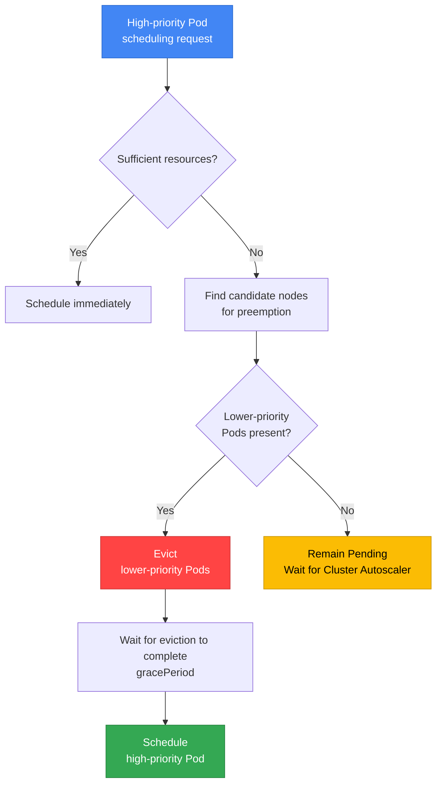

**Preemption decision process:**

1. **Scheduling of a high-priority Pod fails**
2. **Find candidate nodes for preemption**: Find nodes where the Pod can be scheduled after removing lower-priority Pods
3. **Select victim Pods**: Select Pods for removal starting with the lowest priority
4. **Consider PDB**: Prefer victim sets that avoid PDB violations, but allow preemption that violates a PDB if no suitable set exists
5. **Graceful eviction**: Evict while respecting `terminationGracePeriodSeconds`
6. **Schedule after resources become available**: Place the high-priority Pod

:::tip Relationship Between Preemption and PDB
Scheduler preemption considers PDBs on a **best-effort basis**. If it cannot find victims that avoid a PDB violation, it can remove lower-priority Pods despite violating the PDB. This is not the same guarantee as budget enforcement through the Eviction API. See [Kubernetes PDB support during preemption](https://kubernetes.io/docs/concepts/scheduling-eviction/pod-priority-preemption/#poddisruptionbudget-is-supported-but-not-guaranteed).
:::

**Example preemption scenario:**

```yaml
# Current cluster state: node resources are almost fully utilized
# Node-1: low-priority-pod (CPU: 2, Memory: 4Gi)
# Node-2: standard-priority-pod (CPU: 2, Memory: 4Gi)

# Request to create a high-priority Pod
apiVersion: v1
kind: Pod
metadata:
  name: critical-payment
spec:
  priorityClassName: business-critical  # Priority: 1000000
  containers:
  - name: payment
    image: payment:v1.0
    resources:
      requests:
        cpu: "2"
        memory: 4Gi

# Result:
# 1. The scheduler detects insufficient resources
# 2. Select low-priority-pod (priority: 1000) as the victim
# 3. low-priority-pod Evict (graceful shutdown)
# 4. Schedule the critical-payment Pod
```

### 7.4 PreemptionPolicy: Never

Specific workloads can be configured not to preempt other Pods:

```yaml
apiVersion: scheduling.k8s.io/v1
kind: PriorityClass
metadata:
  name: batch-job
value: 5000
globalDefault: false
preemptionPolicy: Never  # Do not preempt other Pods
description: "Batch jobs that wait for available resources"
```

**Use cases:**
- **Batch jobs**: When waiting for resources to become available is preferable
- **Test/development workloads**: When production workloads must not be disturbed
- **Low urgency**: Tasks that do not need to run immediately

### 7.5 Advanced Patterns Combining Priority and QoS Class

PriorityClass influences scheduling/preemption and kubelet pressure eviction; QoS describes the admitted resource configuration. The examples below use Linux Pods with per-container CPU/memory resources, not Pod-level resource declarations. Check the admitted Pod (including defaults and injected containers). These mechanisms do not guarantee immediate placement, OOM survival or a measured cost tier.

#### Review of QoS Classes

Kubernetes automatically assigns a QoS Class based on a Pod's resource requests and limits.

| QoS Class | Conditions after admission | CPU behavior | Memory-pressure consideration | Typical use |
|-----------|------|-------------|-------------------|------------|
| **Guaranteed** | Every container has positive CPU and memory requests and limits, equal for each resource | A CPU limit can throttle usage | Requests affect ranking; eviction and OOM are still possible | Carefully sized critical workloads |
| **Burstable** | Not Guaranteed, with a positive CPU or memory request or limit in at least one container | Depends on the container's limit and contention | Usage above requests and priority matter | General web apps, APIs |
| **BestEffort** | No positive CPU or memory requests or limits in any container | No per-container CPU limit in this configuration; contention still matters | Positive memory usage exceeds the zero request | Workloads designed to tolerate resource contention |

**QoS Class assignment rules:**

```yaml
# Guaranteed: requests = limits (all containers)
resources:
  requests:
    cpu: "1"
    memory: 2Gi
  limits:
    cpu: "1"      # Same as requests
    memory: 2Gi   # Same as requests

---
# Burstable example: not Guaranteed
resources:
  requests:
    cpu: "500m"
    memory: 1Gi
  limits:
    cpu: "2"      # Greater than requests
    memory: 4Gi   # Greater than requests

---
# BestEffort: nothing configured
resources: {}
```

**Checking QoS Class:**
```bash
# Check a Pod's QoS Class
kubectl get pod my-pod -o jsonpath='{.status.qosClass}'

# QoS distribution of all Pods in the namespace
kubectl get pods -n production \
  -o custom-columns=NAME:.metadata.name,QOS:.status.qosClass
```

#### Recommended Combination Matrix

The following matrix is a workload policy sketch. Priority values and class names must be reconciled with the cluster's actual PriorityClasses; the table does not rank measured survival or cost.

| Combination | Priority policy | QoS | Scheduling consideration | Memory-pressure consideration | Example workloads |
|------|----------|-----|-----------------|-------------|------|
| **Tier 1** | critical | Guaranteed | Higher priority, subject to feasibility | Positive matching requests/limits; still subject to OOM/eviction | Payment systems, DB |
| **Tier 2** | high | Guaranteed | Below critical policy | Same QoS classification, different priority | API gateway |
| **Tier 3** | standard | Burstable | Normal policy | Compare actual usage with requests | Frontend, back office |
| **Tier 4** | low | Burstable | Lower-priority policy | Lower priority can increase eviction/preemption exposure | Internal tools |
| **Tier 5** | batch | BestEffort | Lowest policy in this example | Positive memory usage exceeds requests | Retryable batch, CI/CD |

**Details of each combination:**

##### Tier 1: Guaranteed + critical-priority (Strongest Guarantees)

**Characteristics:**
- Higher priority can enable preemption when removing lower-priority Pods makes placement feasible
- Equal positive CPU/memory requests and limits establish Guaranteed QoS in this example
- Requests and priority influence kubelet pressure eviction; kernel OOM uses a different mechanism
- Memory limits, node pressure and other failures can still terminate the Pod

**Practical YAML:**
```yaml
apiVersion: apps/v1
kind: Deployment
metadata:
  name: payment-gateway
  namespace: production
spec:
  replicas: 6
  selector:
    matchLabels:
      app: payment-gateway
      tier: critical
  template:
    metadata:
      labels:
        app: payment-gateway
        tier: critical
    spec:
      priorityClassName: critical-priority  # Priority: 10000
      containers:
      - name: gateway
        image: payment-gateway:v3.5
        resources:
          requests:
            cpu: "2"
            memory: 4Gi
          limits:
            cpu: "2"       # Same as requests → Guaranteed
            memory: 4Gi    # Same as requests → Guaranteed
        livenessProbe:
          httpGet:
            path: /health
            port: 8080
          initialDelaySeconds: 30
          periodSeconds: 10
        readinessProbe:
          httpGet:
            path: /ready
            port: 8080
          initialDelaySeconds: 10
          periodSeconds: 5
---
apiVersion: policy/v1
kind: PodDisruptionBudget
metadata:
  name: payment-gateway-pdb
  namespace: production
spec:
  minAvailable: 4  # Always maintain at least 4 out of 6
  selector:
    matchLabels:
      app: payment-gateway
```

**Usage scenarios:**
- Financial transaction systems (payments, transfers)
- Real-time order processing
- Databases (MySQL, PostgreSQL)
- Message queues (Kafka, RabbitMQ)

##### Tier 2: Guaranteed + high-priority (Core Services)

**Characteristics:**
- Priority immediately below critical
- CPU/memory requests and equal limits establish Guaranteed QoS for the shown containers
- Pressure eviction and kernel OOM are possible; there is no fixed class-only termination order
- Recommended configuration for typical production services

**Practical YAML:**
```yaml
apiVersion: apps/v1
kind: Deployment
metadata:
  name: api-server
  namespace: production
spec:
  replicas: 10
  selector:
    matchLabels:
      app: api-server
  template:
    metadata:
      labels:
        app: api-server
    spec:
      priorityClassName: high-priority  # Priority: 5000
      containers:
      - name: api
        image: api-server:v2.8
        resources:
          requests:
            cpu: "1"
            memory: 2Gi
          limits:
            cpu: "1"       # Guaranteed
            memory: 2Gi    # Guaranteed
        env:
        - name: MAX_CONNECTIONS
          value: "1000"
```

**Usage scenarios:**
- REST API servers
- GraphQL servers
- Authentication/authorization services
- Session management services

##### Tier 3: Burstable + standard-priority (General Web Apps)

**Characteristics:**
- Requests inform scheduling capacity and CPU allocation under contention; they do not ensure uninterrupted service
- Can use additional resources when available (limits > requests)
- Cost-effective and stable
- Suitable for most web applications

**Practical YAML:**
```yaml
apiVersion: apps/v1
kind: Deployment
metadata:
  name: web-frontend
  namespace: production
spec:
  replicas: 8
  selector:
    matchLabels:
      app: web-frontend
  template:
    metadata:
      labels:
        app: web-frontend
    spec:
      priorityClassName: standard-priority  # Priority: 1000
      containers:
      - name: frontend
        image: web-frontend:v1.12
        resources:
          requests:
            cpu: "500m"    # CPU request for scheduling and relative allocation
            memory: 1Gi    # Memory request, not a limit
          limits:
            cpu: "2"       # Allow bursts up to 4 times the baseline
            memory: 4Gi    # Allow bursts up to 4 times the baseline
        env:
        - name: NODE_ENV
          value: "production"
```

**Usage scenarios:**
- Web frontends (React, Vue, Angular)
- Back-office applications
- Internal dashboards
- CMS (Content Management System)

##### Tier 4: Burstable + low-priority (Internal Tools)

**Characteristics:**
- Small resource requests; size them from actual usage
- Subject to preemption when resources are insufficient
- Minimizes cost
- Limited impact from service interruptions

**Practical YAML:**
```yaml
apiVersion: apps/v1
kind: Deployment
metadata:
  name: monitoring-agent
  namespace: monitoring
spec:
  replicas: 3
  selector:
    matchLabels:
      app: monitoring-agent
  template:
    metadata:
      labels:
        app: monitoring-agent
    spec:
      priorityClassName: low-priority  # Priority: 500
      containers:
      - name: agent
        image: monitoring-agent:v2.1
        resources:
          requests:
            cpu: "100m"    # CPU request
            memory: 256Mi
          limits:
            cpu: "500m"
            memory: 1Gi
```

**Usage scenarios:**
- Monitoring agents
- Log collectors (Fluent Bit, Fluentd)
- Metrics exporters
- Development tools

##### Tier 5: BestEffort + batch-priority (Batch Jobs)

**Characteristics:**
- No CPU/memory requests or limits in this example; resource contention is possible
- Positive memory usage exceeds requests, but pressure-eviction ranking also depends on priority
- Minimizes cost (can use Spot Instances)
- Suitable for retryable tasks

**Practical YAML:**
```yaml
apiVersion: batch/v1
kind: CronJob
metadata:
  name: data-pipeline
  namespace: batch
spec:
  schedule: "0 2 * * *"  # Every day at 2 a.m.
  jobTemplate:
    spec:
      template:
        spec:
          priorityClassName: batch-priority  # Priority: 100
          restartPolicy: OnFailure
          containers:
          - name: etl
            image: data-pipeline:v1.8
            resources: {}  # BestEffort: no requests/limits
            env:
            - name: BATCH_SIZE
              value: "10000"
          # Place on Spot Instances
          nodeSelector:
            karpenter.sh/capacity-type: spot
          tolerations:
          - key: karpenter.sh/capacity-type
            operator: Equal
            value: spot
            effect: NoSchedule
```

**Usage scenarios:**
- ETL pipelines
- Data analysis jobs
- CI/CD builds
- Image/video processing

#### Eviction Order (During OOM)

The diagram describes kubelet **memory-pressure eviction**, not the kernel OOM killer or a container exceeding its memory limit. Kubelet first attempts node-level resource reclamation; if Pod eviction is needed, it ranks candidates using the affected resource.

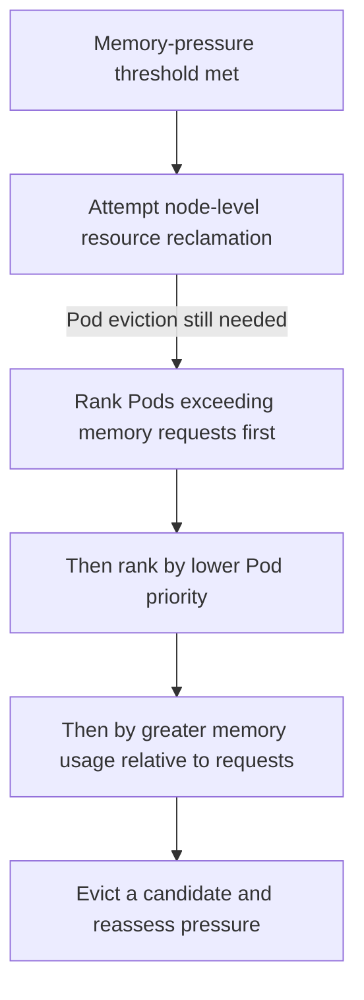

**Eviction decision factors:**

1. Whether usage of the starved resource exceeds requests.
2. Pod priority within that grouping.
3. Usage relative to requests when priority is equal.

QoS correlates with some memory-request configurations, but is not the ranking algorithm. Disk pressure uses disk-related signals; the kernel OOM killer uses `oom_score_adj` and process memory usage. Neither mechanism establishes an unconditional class-only survival order.

**Example scenario:**

```text
Illustrative memory-pressure candidates (not a measured event):
Pod 1: request 0, usage 4 GiB, priority 500       -> exceeds request
Pod 2: request 2 GiB, usage 6 GiB, priority 1000 -> exceeds request
Pod 3: request 4 GiB, usage 5 GiB, priority 5000 -> exceeds request
Pod 4: request 8 GiB, usage 8 GiB, priority 10000 -> does not exceed request
Among these candidates: 1, 2, 3, then 4.
This result follows requests and priority, not a universal QoS-class order.
Kubelet reassesses pressure after eviction; it need not evict every candidate.
```

#### Kubelet Eviction Configuration

For Karpenter `v1.14.1` with a compatible AL2023 EC2NodeClass, configure the supported `spec.kubelet` fields. Preserve the class's verified AMI, role/instance profile, subnet and security-group selectors. This is a configuration merge for newly provisioned nodes; do not overwrite a live kubelet file or restart the service from user data.

**Example eviction thresholds:**

The effective defaults depend on the AMI and bootstrap configuration. The following JSON illustrates possible field values. It is not a measurement of the cluster's EKS defaults:

```json
{
  "evictionHard": {
    "memory.available": "100Mi",
    "nodefs.available": "10%",
    "imagefs.available": "15%"
  },
  "evictionSoft": {
    "memory.available": "500Mi",
    "nodefs.available": "15%"
  },
  "evictionSoftGracePeriod": {
    "memory.available": "1m30s",
    "nodefs.available": "2m"
  }
}
```

**Customization example (Karpenter EC2NodeClass):**

Merge this mapping into `EC2NodeClass/custom-eviction.spec.kubelet` after reviewing its complete effective threshold set. Every configured soft signal needs a corresponding soft grace period.

```yaml
# EC2NodeClass.spec.kubelet fragment; values are illustrative
evictionHard:
  memory.available: 200Mi
  nodefs.available: "10%"
  imagefs.available: "15%"
  nodefs.inodesFree: "5%"
  imagefs.inodesFree: "5%"
evictionSoft:
  memory.available: 1Gi
  nodefs.available: "15%"
evictionSoftGracePeriod:
  memory.available: 2m
  nodefs.available: 3m
evictionMaxPodGracePeriod: 60
```

**Eviction threshold descriptions:**

| Setting | Meaning | Value in the merge example |
|------|------|--------|
| `evictionHard.memory.available` | Hard threshold; no soft grace period | 200Mi |
| `evictionSoft.memory.available` | Soft threshold evaluated over its grace period | 1Gi |
| `evictionSoftGracePeriod.memory.available` | Duration the soft threshold must remain met | 2m |
| `evictionMaxPodGracePeriod` | Maximum termination grace for soft eviction | 60 seconds |

:::warning Eviction Configuration Considerations
Thresholds need workload and node-memory evidence. A low threshold can allow kernel OOM before kubelet reclaims memory; a high one reduces available headroom. Hard-threshold eviction does not provide graceful termination.

**Recommended approach:**
- Measure node reservations, peak memory, image/disk use and reclaim behavior before selecting values.
- Preserve needed hard signals when overriding defaults; inspect the resulting AMI/kubelet configuration.
- Monitor pressure and termination outcomes; the example values are not production sizing results.
:::

#### Validating Practical Combination Patterns

**Pattern 1: Multi-Tier Architecture**

```yaml
# Tier 1: Database (Guaranteed + critical)
apiVersion: apps/v1
kind: StatefulSet
metadata:
  name: postgres
spec:
  serviceName: postgres
  replicas: 3
  template:
    spec:
      priorityClassName: critical-priority
      containers:
      - name: postgres
        image: postgres:16
        resources:
          requests:
            cpu: "4"
            memory: 16Gi
          limits:
            cpu: "4"
            memory: 16Gi
---
# Tier 2: API Server (Guaranteed + high)
apiVersion: apps/v1
kind: Deployment
metadata:
  name: api-server
spec:
  replicas: 10
  template:
    spec:
      priorityClassName: high-priority
      containers:
      - name: api
        resources:
          requests: { cpu: "1", memory: 2Gi }
          limits: { cpu: "1", memory: 2Gi }
---
# Tier 3: Frontend (Burstable + standard)
apiVersion: apps/v1
kind: Deployment
metadata:
  name: frontend
spec:
  replicas: 8
  template:
    spec:
      priorityClassName: standard-priority
      containers:
      - name: frontend
        resources:
          requests: { cpu: "500m", memory: 1Gi }
          limits: { cpu: "2", memory: 4Gi }
---
# Tier 4: Monitoring (Burstable + low)
apiVersion: apps/v1
kind: DaemonSet
metadata:
  name: node-exporter
spec:
  template:
    spec:
      priorityClassName: low-priority
      containers:
      - name: exporter
        resources:
          requests: { cpu: "100m", memory: 128Mi }
          limits: { cpu: "200m", memory: 256Mi }
```

**Verification commands:**
```bash
# Check QoS + Priority distribution
kubectl get pods -A -o custom-columns=\
NAME:.metadata.name,\
NAMESPACE:.metadata.namespace,\
QOS:.status.qosClass,\
PRIORITY:.spec.priorityClassName,\
CPU_REQ:.spec.containers[0].resources.requests.cpu,\
MEM_REQ:.spec.containers[0].resources.requests.memory

# Check QoS distribution per node
kubectl describe node <node-name> | grep -A 10 "Non-terminated Pods"
```

#### Troubleshooting: QoS + Priority Combination Issues

| Symptom | Cause | Resolution |
|------|------|----------|
| Guaranteed Pod is OOM-killed | limits are too low | Profile memory and increase limits |
| Burstable Pod experiences CPU throttling | limits reached, insufficient node resources | Increase requests or add nodes |
| Low-priority Pod remains Pending | High-priority Pods monopolize resources | Add nodes or adjust Priority |
| BestEffort Pod terminates immediately | Eviction threshold reached | Switch to Burstable and set requests |

:::tip QoS + Priority Optimization Tips
1. **Monitoring**: Track actual usage with the Prometheus metrics `container_memory_working_set_bytes` and `container_cpu_usage_seconds_total`
2. **Rightsizing**: Refer to VPA (Vertical Pod Autoscaler) recommendations
3. **Gradual transition**: Apply progressively in the order BestEffort → Burstable → Guaranteed
4. **Cost balance**: Setting all Pods to Guaranteed increases cost; apply different configurations based on workload importance
:::

---

## 8. Descheduler

Descheduler balances a cluster by **relocating** Pods that have already been scheduled. Because the Kubernetes scheduler handles only initial placement, imbalances between nodes can develop over time.

### 8.1 Why Descheduler Is Needed

**Scenario 1: Imbalance after adding nodes**
- Pods are concentrated on existing nodes, while newly added nodes are empty
- Descheduler evicts older Pods → the scheduler relocates them to new nodes

**Scenario 2: Affinity/Anti-Affinity violations**
- Node labels change after Pod placement, violating Affinity conditions
- Descheduler evicts violating Pods → relocates them to nodes that meet the conditions

**Scenario 3: Resource fragmentation**
- Some nodes have excessive CPU utilization, while others are idle
- Descheduler resolves the imbalance

### 8.2 Installing Descheduler (Helm)

```bash
# Add the Descheduler Helm chart
helm repo add descheduler https://kubernetes-sigs.github.io/descheduler/
helm repo update

# Basic installation
helm install descheduler descheduler/descheduler \
  --namespace kube-system \
  --set cronJobApiVersion="batch/v1" \
  --set schedule="*/15 * * * *"  # Run every 15 minutes
```

**CronJob vs. Deployment mode:**

| Mode | Execution interval | Resource usage | Recommended environment |
|------|----------|------------|----------|
| **CronJob** | Periodic (e.g., 15 minutes) | Uses resources only while running | Small to medium clusters (recommended) |
| **Deployment** | Continuous execution | Always uses resources | Large clusters (1000+ nodes) |

### 8.3 Key Descheduler Strategies

#### Strategy 1: RemoveDuplicates

**Purpose**: Distribute Pods from the same controller (ReplicaSet, Deployment) when multiple Pods are placed on one node

```yaml
apiVersion: v1
kind: ConfigMap
metadata:
  name: descheduler-policy
  namespace: kube-system
data:
  policy.yaml: |
    apiVersion: "descheduler/v1alpha2"
    kind: "DeschedulerPolicy"
    profiles:
      - name: default
        pluginConfig:
        - name: RemoveDuplicates
          args:
            # Keep only 1 Pod from the same controller per node
            excludeOwnerKinds:
            - "ReplicaSet"
            - "StatefulSet"
        plugins:
          balance:
            enabled:
            - RemoveDuplicates
```

**Effect**: When multiple replicas of the same Deployment are on one node, evict some to distribute them across other nodes

#### Strategy 2: LowNodeUtilization

**Purpose**: Balance nodes with low and high resource utilization

```yaml
apiVersion: v1
kind: ConfigMap
metadata:
  name: descheduler-policy
  namespace: kube-system
data:
  policy.yaml: |
    apiVersion: "descheduler/v1alpha2"
    kind: "DeschedulerPolicy"
    profiles:
      - name: default
        pluginConfig:
        - name: LowNodeUtilization
          args:
            # Low utilization thresholds (underutilized at or below these values)
            thresholds:
              cpu: 20
              memory: 20
              pods: 20
            # High utilization thresholds (overutilized at or above these values)
            targetThresholds:
              cpu: 50
              memory: 50
              pods: 50
        plugins:
          balance:
            enabled:
            - LowNodeUtilization
```

**Behavior:**
1. Identify nodes with CPU/memory/Pod counts below 20% (underutilized)
2. Identify nodes at or above 50% (overutilized)
3. Evict Pods from overutilized nodes
4. The Kubernetes scheduler relocates them to underutilized nodes

#### Strategy 3: RemovePodsViolatingNodeAffinity

**Purpose**: Remove Pods that violate Node Affinity conditions (after node labels change)

```yaml
apiVersion: v1
kind: ConfigMap
metadata:
  name: descheduler-policy
  namespace: kube-system
data:
  policy.yaml: |
    apiVersion: "descheduler/v1alpha2"
    kind: "DeschedulerPolicy"
    profiles:
      - name: default
        pluginConfig:
        - name: RemovePodsViolatingNodeAffinity
          args:
            nodeAffinityType:
            - requiredDuringSchedulingIgnoredDuringExecution
        plugins:
          deschedule:
            enabled:
            - RemovePodsViolatingNodeAffinity
```

**Scenario**: Remove the `gpu=true` label from a GPU node → Pods requiring GPUs remain on the unlabeled node → Descheduler evicts them → relocates them to GPU nodes

#### Strategy 4: RemovePodsViolatingInterPodAntiAffinity

**Purpose**: Remove Pods that violate Pod Anti-Affinity conditions

```yaml
apiVersion: v1
kind: ConfigMap
metadata:
  name: descheduler-policy
  namespace: kube-system
data:
  policy.yaml: |
    apiVersion: "descheduler/v1alpha2"
    kind: "DeschedulerPolicy"
    profiles:
      - name: default
        plugins:
          deschedule:
            enabled:
            - RemovePodsViolatingInterPodAntiAffinity
```

**Scenario**: Initially, sufficient nodes satisfy Anti-Affinity → node scale-down places violating Pods on the same node → Descheduler relocates them after nodes are added

#### Strategy 5: RemovePodsHavingTooManyRestarts

**Purpose**: Remove problematic Pods that restart excessively (retry on another node)

```yaml
apiVersion: v1
kind: ConfigMap
metadata:
  name: descheduler-policy
  namespace: kube-system
data:
  policy.yaml: |
    apiVersion: "descheduler/v1alpha2"
    kind: "DeschedulerPolicy"
    profiles:
      - name: default
        pluginConfig:
        - name: RemovePodsHavingTooManyRestarts
          args:
            podRestartThreshold: 10  # Evict after 10 or more restarts
            includingInitContainers: true
        plugins:
          deschedule:
            enabled:
            - RemovePodsHavingTooManyRestarts
```

#### Strategy 6: PodLifeTime

**Purpose**: Remove old Pods to replace them with the latest images/configuration

```yaml
apiVersion: v1
kind: ConfigMap
metadata:
  name: descheduler-policy
  namespace: kube-system
data:
  policy.yaml: |
    apiVersion: "descheduler/v1alpha2"
    kind: "DeschedulerPolicy"
    profiles:
      - name: default
        pluginConfig:
        - name: PodLifeTime
          args:
            maxPodLifeTimeSeconds: 604800  # 7 days (7 * 24 * 3600)
            # Target only Pods in specific states
            states:
            - Running
            # Exclude Pods with specific labels
            labelSelector:
              matchExpressions:
              - key: app
                operator: NotIn
                values:
                - stateful-db
        plugins:
          deschedule:
            enabled:
            - PodLifeTime
```

### 8.4 Descheduler vs. Karpenter Consolidation

| Feature | Descheduler | Karpenter Consolidation |
|------|------------|------------------------|
| **Purpose** | Pod relocation (balancing) | Node removal (cost savings) |
| **Scope** | Pod level | Node level |
| **Execution interval** | CronJob (e.g., 15 minutes) | Continuous monitoring (real time) |
| **Strategies** | Various strategies (6+) | Empty / Underutilized nodes |
| **Respects PDB** | ✅ Yes | ✅ Yes |
| **Adds/removes nodes** | ❌ No | ✅ Yes |
| **Cluster Autoscaler compatibility** | ✅ Yes | N/A (alternative) |
| **Main use cases** | Resolving imbalance and Affinity violations | Cost optimization, node consolidation |
| **Can be used together** | ✅ Can run alongside Karpenter | ✅ Can run alongside Descheduler |

:::tip Recommended Combination: Descheduler + Karpenter
Descheduler specializes in Pod relocation, while Karpenter specializes in node management. The two tools complement each other when used together:
- Descheduler evicts Pods that contribute to imbalance
- The Kubernetes scheduler relocates Pods to other nodes
- Karpenter removes empty nodes to reduce cost
:::

**Example configuration for using both tools:**

```yaml
# Descheduler: rebalance every 15 minutes
apiVersion: batch/v1
kind: CronJob
metadata:
  name: descheduler
  namespace: kube-system
spec:
  schedule: "*/15 * * * *"
  jobTemplate:
    spec:
      template:
        spec:
          containers:
          - name: descheduler
            image: registry.k8s.io/descheduler/descheduler:v0.29.0
            command:
            - /bin/descheduler
            - --policy-config-file=/policy/policy.yaml
---
# Karpenter: continuous node consolidation
apiVersion: karpenter.sh/v1
kind: NodePool
metadata:
  name: general
spec:
  disruption:
    consolidationPolicy: WhenEmptyOrUnderutilized
    consolidateAfter: 5m  # Start consolidation after 5 minutes
    budgets:
    - nodes: "20%"
```

#### 8.4.1 Practical Patterns Combining Descheduler and Karpenter

Using Descheduler and Karpenter together automatically coordinates Pod relocation and node consolidation to improve cluster efficiency and reduce cost simultaneously.

**How the combination works:**

1. **Step 1 (Descheduler)**: Detect resource imbalance and relocate Pods
   - Evict Pods from overutilized nodes with the `LowNodeUtilization` strategy
   - Relocate unnecessarily placed Pods with `RemoveDuplicates`, `RemovePodsViolatingNodeAffinity`, and other strategies

2. **Step 2 (Kubernetes Scheduler)**: Reschedule evicted Pods onto optimal nodes
   - Select nodes with available resources
   - Satisfy Affinity/Anti-Affinity and Topology Spread conditions

3. **Step 3 (Karpenter)**: Remove empty or underutilized nodes
   - Consolidate empty nodes after the `consolidateAfter` duration elapses
   - Consolidate Pods from multiple underutilized nodes onto fewer nodes
   - Reduce cost by terminating unnecessary nodes

**Timing coordination example:**

```yaml
# Descheduler: run LowNodeUtilization every 15 minutes
apiVersion: v1
kind: ConfigMap
metadata:
  name: descheduler-policy
  namespace: kube-system
data:
  policy.yaml: |
    apiVersion: "descheduler/v1alpha2"
    kind: "DeschedulerPolicy"
    profiles:
      - name: default
        pluginConfig:
        - name: LowNodeUtilization
          args:
            thresholds:
              cpu: 20
              memory: 20
              pods: 20
            targetThresholds:
              cpu: 50
              memory: 50
              pods: 50
        plugins:
          balance:
            enabled:
            - LowNodeUtilization
---
# Karpenter: consolidate empty nodes after 5 minutes (allow sufficient time after Descheduler runs)
apiVersion: karpenter.sh/v1
kind: NodePool
metadata:
  name: general-pool
spec:
  disruption:
    consolidationPolicy: WhenEmptyOrUnderutilized
    consolidateAfter: 5m  # Wait 5 minutes after Descheduler moves Pods
    budgets:
    - nodes: "20%"  # Consolidate at most 20% of nodes at a time
  template:
    spec:
      requirements:
      - key: karpenter.sh/capacity-type
        operator: In
        values: ["on-demand", "spot"]
      - key: kubernetes.io/arch
        operator: In
        values: ["amd64"]
```

**Example operational scenario:**

```
Time: 00:00 - Descheduler runs (15-minute interval)
  └─ Node-A (CPU 80%, Memory 85%) → detected as overutilized
  └─ Node-B (CPU 15%, Memory 10%) → detected as underutilized
  └─ Evict Pod-1 and Pod-2 from Node-A

Time: 00:01 - Kubernetes Scheduler relocates Pods
  └─ Pod-1 → scheduled on Node-B
  └─ Pod-2 → scheduled on Node-C
  └─ Node-A now has CPU 50%, Memory 55% (normal range)

Time: 00:06 - Karpenter consolidation (5 minutes elapsed)
  └─ Node-B: still underutilized but running Pods → retain
  └─ Node-D: detected as empty (previously hosted Pods that have moved) → terminate
  └─ Cost savings achieved
```

**Interaction with PDB:**

Both Descheduler and Karpenter respect PDB, allowing them to be used together safely:

```yaml
# Configure an application PDB
apiVersion: policy/v1
kind: PodDisruptionBudget
metadata:
  name: api-server-pdb
spec:
  minAvailable: 2
  selector:
    matchLabels:
      app: api-server
---
# Both Descheduler and Karpenter respect this PDB
# - Descheduler: block evictions that violate minAvailable
# - Karpenter: ensure minAvailable when removing nodes
```

**Considerations: Preventing Pod Flapping**

Conflicting timing between Descheduler and Karpenter can cause Pods to move repeatedly:

:::warning Preventing Pod Flapping
Coordinate the Descheduler execution interval with Karpenter's `consolidateAfter` interval:
- **Recommended pattern**: Descheduler every 15 minutes + Karpenter `consolidateAfter` of 5 minutes
- **Risky pattern**: Descheduler every 5 minutes + Karpenter `consolidateAfter` of 1 minute (too frequent)
- **Safeguard**: Limit the number of nodes consolidated simultaneously with Karpenter `budgets`
:::

**Monitoring and verification:**

```bash
# 1. Check Descheduler logs
kubectl logs -n kube-system -l app=descheduler --tail=50

# 2. Check Karpenter consolidation events
kubectl logs -n karpenter -l app.kubernetes.io/name=karpenter --tail=50 | grep consolidation

# 3. Check Pod distribution per node
kubectl get pods -A -o wide | awk '{print $8}' | sort | uniq -c

# 4. Check node resource utilization
kubectl top nodes

# 5. Check PDB status (whether evictions are blocked)
kubectl get pdb -A
```

**Benefits of the combination:**

| Benefit | Description |
|------|------|
| **Automatic balancing** | Descheduler automatically resolves resource imbalance |
| **Cost optimization** | Karpenter removes unnecessary nodes |
| **Safety guarantees** | Respecting PDB prevents service interruptions |
| **Reduced operational burden** | Automatic coordination without manual intervention |
| **Scalability** | Works regardless of cluster size |

---

## 9. Comprehensive EKS Scheduling Strategy

### 9.1 Scheduling Configuration Matrix by Workload Type

The following table summarizes recommended scheduling settings for various workload types.

| Workload Type | Node Selector/Affinity | Pod Anti-Affinity | Topology Spread | Taints/Tolerations | PriorityClass | PDB | Additional Considerations |
|-------------|----------------------|-------------------|-----------------|-------------------|---------------|-----|-------------|
| **API server** | On-Demand nodes | Soft (spread across nodes) | Hard (spread across AZs) | - | `high-priority` | `minAvailable: "67%"` | Readiness Probe required |
| **Payment service** | On-Demand, specific instance types | Hard (spread across nodes) | Hard (spread across AZs, minDomains: 3) | - | `business-critical` | `minAvailable: 2` | PCI-DSS-compliant nodes |
| **ML training** | GPU nodes (g5.xlarge+) | Soft (spread across nodes) | - | GPU Taint Tolerate | `high-priority` | `maxUnavailable: 1` | Spot supported (with checkpointing) |
| **ML inference** | GPU nodes | Hard (spread across AZs) | Hard (spread across AZs) | GPU Taint Tolerate | `high-priority` | `minAvailable: 2` | On-Demand recommended |
| **Database (StatefulSet)** | Nodes with EBS availability, WaitForFirstConsumer | Hard (spread across nodes) | Hard (spread across AZs) | - | `business-critical` | `maxUnavailable: 1` | PVC backups required |
| **Cache (Redis)** | Memory-optimized nodes (r6i) | Hard (spread across nodes) | Hard (spread across AZs) | - | `high-priority` | `minAvailable: 2` | Configure persistence |
| **Batch jobs** | Allow Spot nodes | - | - | Spot Tolerate | `low-priority`, `preemptionPolicy: Never` | - | Design for restartability |
| **CI/CD Runner** | Prefer Spot nodes | - | - | Spot Tolerate | `low-priority` | - | Ephemeral jobs |
| **Log collection (DaemonSet)** | Intended collection nodes | - | - | Only required node/agent tolerations | `system-critical` | - | Use `hostPath` |
| **Ingress Controller** | On-Demand | Hard (spread across nodes) | Hard (spread across AZs) | - | `high-priority` | `minAvailable: 2` | Configure NodePort / LB |
| **Monitoring (Prometheus)** | Dedicated monitoring nodes | Soft (spread across nodes) | Soft (spread across AZs) | Tolerate monitoring taints | `high-priority` | `minAvailable: 1` | Large-capacity storage |
| **Web frontend** | ARM nodes supported | Soft (spread across nodes) | Hard (spread across AZs) | - | `standard-priority` | `minAvailable: "50%"` | CDN integration |
| **Background workers** | Spot nodes | - | Soft (spread across AZs) | Spot Tolerate | `standard-priority` | `maxUnavailable: "50%"` | Retry logic required |
| **Serverless (Knative)** | Mix of Spot + On-Demand | - | Soft (spread across AZs) | - | `standard-priority` | - | Configure scale-to-zero |
| **AI/ML training** | GPU nodes (g5.xlarge+) | Soft (spread across nodes) | Soft (spread across AZs) | GPU Taint Tolerate | `high-priority` | `maxUnavailable: 1` | Checkpointing, Spot supported |
| **AI/ML inference** | GPU/Inferentia nodes | Hard (spread across nodes) | Hard (spread across AZs) | GPU Taint Tolerate | `high-priority` | `minAvailable: 2` | On-Demand recommended |

### 9.2 AI/ML Workload Scheduling Patterns

AI/ML workloads require resources such as GPUs, large amounts of memory, and specialized accelerators (Inferentia, Trainium). Training and inference have significantly different requirements.

#### 9.2.1 GPU Workload Scheduling

GPU workloads are scheduled efficiently by combining dedicated node isolation, resource requests, and Node Affinity.

**GPU resource request pattern:**

```yaml
apiVersion: v1
kind: Pod
metadata:
  name: gpu-training-job
spec:
  containers:
  - name: trainer
    image: ml/trainer:v3.0
    resources:
      requests:
        nvidia.com/gpu: 1  # Request 1 GPU
        cpu: "4"
        memory: 16Gi
      limits:
        nvidia.com/gpu: 1  # Set limits equal to requests
        cpu: "4"
        memory: 16Gi
```

:::info GPU Resource Management
`nvidia.com/gpu` can only be requested in whole numbers, and limits must equal requests. GPUs cannot be overcommitted, so consider Multi-Instance GPU (MIG) or Time-Slicing when fractional GPUs are required.
:::

**Dedicated GPU NodePool + workload deployment:**

This example follows Karpenter `v1.14.1` and requires a verified EKS-optimized AL2023 x86_64 NVIDIA AMI for the chosen Kubernetes version, Region and GPU family. EKS stopped publishing AL2 optimized/accelerated AMIs on November 26, 2025. The AMI ID below is a placeholder, so the manifest is illustrative until it is replaced and the role/network selectors are resolved. Check the AMI's driver/runtime matrix and a compatible NVIDIA device plugin that advertises the required allocatable GPUs; `amiFamily` alone does not install or prove these capabilities.
```yaml
# Karpenter NodePool: Dedicated GPU node group
apiVersion: karpenter.sh/v1
kind: NodePool
metadata:
  name: gpu-pool
spec:
  template:
    spec:
      requirements:
      - key: node.kubernetes.io/instance-type
        operator: In
        values:
        - g5.xlarge   # 1x NVIDIA A10G, 4 vCPU, 16 GiB
        - g5.2xlarge  # 1x NVIDIA A10G, 8 vCPU, 32 GiB
        - g5.4xlarge  # 1x NVIDIA A10G, 16 vCPU, 64 GiB
        - g5.12xlarge # 4x NVIDIA A10G, 48 vCPU, 192 GiB
      - key: karpenter.sh/capacity-type
        operator: In
        values:
        - on-demand  # On-Demand is recommended for training workloads
      # Isolate dedicated GPU nodes
      taints:
      - key: nvidia.com/gpu
        value: present
        effect: NoSchedule
      - key: workload-type
        value: ml-training
        effect: NoSchedule
      nodeClassRef:
        group: karpenter.k8s.aws
        kind: EC2NodeClass
        name: gpu-nodes
  limits:
    cpu: "200"
    memory: 800Gi
  disruption:
    consolidationPolicy: WhenEmpty
    consolidateAfter: 10m  # Remove empty GPU nodes after 10 minutes (cost savings)
---
# EC2NodeClass: illustrative AL2023 NVIDIA AMI selection
apiVersion: karpenter.k8s.aws/v1
kind: EC2NodeClass
metadata:
  name: gpu-nodes
spec:
  amiFamily: AL2023
  amiSelectorTerms:
  - id: ami-0123456789abcdef0  # Placeholder: verified regional x86_64 NVIDIA AMI ID required
  role: KarpenterNodeRole
  subnetSelectorTerms:
  - tags:
      karpenter.sh/discovery: my-cluster
  securityGroupSelectorTerms:
  - tags:
      karpenter.sh/discovery: my-cluster
---
# ML training workload: Schedule on GPU nodes
apiVersion: batch/v1
kind: Job
metadata:
  name: model-training
spec:
  parallelism: 4  # 4 parallel training jobs
  completions: 4
  template:
    metadata:
      labels:
        app: model-training
    spec:
      # GPU Taint Tolerate
      tolerations:
      - key: nvidia.com/gpu
        operator: Equal
        value: present
        effect: NoSchedule
      - key: workload-type
        operator: Equal
        value: ml-training
        effect: NoSchedule
      # Select GPU nodes
      nodeSelector:
        node.kubernetes.io/instance-type: g5.2xlarge
      # Pod Anti-Affinity: Place each Job Pod on a different node
      affinity:
        podAntiAffinity:
          preferredDuringSchedulingIgnoredDuringExecution:
          - weight: 100
            podAffinityTerm:
              labelSelector:
                matchExpressions:
                - key: app
                  operator: In
                  values:
                  - model-training
              topologyKey: kubernetes.io/hostname
      containers:
      - name: trainer
        image: ml/pytorch-trainer:v2.0
        resources:
          requests:
            nvidia.com/gpu: 1
            cpu: "7"
            memory: 28Gi
          limits:
            nvidia.com/gpu: 1
            cpu: "7"
            memory: 28Gi
        env:
        - name: NCCL_DEBUG
          value: "INFO"
        volumeMounts:
        - name: data
          mountPath: /data
        - name: checkpoints
          mountPath: /checkpoints
      volumes:
      - name: data
        persistentVolumeClaim:
          claimName: training-data
      - name: checkpoints
        persistentVolumeClaim:
          claimName: model-checkpoints
      restartPolicy: OnFailure
```

**Using Multi-Instance GPU (MIG):**

GPUs such as the NVIDIA A100 and A30 support MIG, which partitions a single GPU into multiple independent instances.

```yaml
# Example MIG profile request (A100 GPU)
apiVersion: v1
kind: Pod
metadata:
  name: mig-inference
spec:
  containers:
  - name: inference
    image: ml/inference:v1.0
    resources:
      requests:
        nvidia.com/mig-1g.5gb: 1  # 1/7 A100 (1 GPU slice, 5GB memory)
      limits:
        nvidia.com/mig-1g.5gb: 1
```

**MIG profiles:**

| MIG Profile | GPU Slice | Memory | Use Case |
|-------------|-----------|--------|----------|
| `mig-1g.5gb` | 1/7 | 5GB | Small-scale inference |
| `mig-2g.10gb` | 2/7 | 10GB | Medium-scale inference |
| `mig-3g.20gb` | 3/7 | 20GB | Large-scale inference |
| `mig-7g.40gb` | 7/7 | 40GB | Full GPU (training) |

#### 9.2.2 Introduction to DRA (Dynamic Resource Allocation)

In Kubernetes 1.34+, Dynamic Resource Allocation (DRA) provides more flexible allocation of specialized resources such as GPUs.

**Benefits of DRA:**

| Traditional Approach (Device Plugin) | DRA (K8s 1.34+) |
|-------------------------|----------------|
| Static resource names (`nvidia.com/gpu`) | Dynamic resource claims |
| Node-level allocation | Fine-grained Pod-level control |
| Simple counting (1, 2, 3...) | Selection based on resource attributes |
| Limited sharing | Dynamic sharing/partitioning |
| Node restart required | Runtime reconfiguration |

**DRA ResourceClass and ResourceClaim example:**

```yaml
# ResourceClass: Define a GPU resource class
apiVersion: resource.k8s.io/v1alpha4
kind: ResourceClass
metadata:
  name: nvidia-a100-gpu
spec:
  driverName: gpu.nvidia.com
  parameters:
    apiVersion: gpu.nvidia.com/v1alpha1
    kind: GpuConfig
    memory: "40Gi"
    computeCapability: "8.0"  # A100
    migEnabled: true
---
# ResourceClaim: Request GPU resources
apiVersion: resource.k8s.io/v1alpha4
kind: ResourceClaim
metadata:
  name: ml-training-gpu
  namespace: ml-team
spec:
  resourceClassName: nvidia-a100-gpu
  parametersRef:
    apiGroup: gpu.nvidia.com
    kind: GpuClaimParameters
    name: training-params
---
# GpuClaimParameters: Detailed requirements
apiVersion: gpu.nvidia.com/v1alpha1
kind: GpuClaimParameters
metadata:
  name: training-params
  namespace: ml-team
spec:
  count: 1  # 1 GPU
  migProfile: "mig-3g.20gb"  # Specify the MIG profile
  sharing: "TimeSlicing"  # Allow time-sliced sharing
---
# Pod: Use the ResourceClaim
apiVersion: v1
kind: Pod
metadata:
  name: dra-training-pod
  namespace: ml-team
spec:
  resourceClaims:
  - name: gpu-claim
    resourceClaimName: ml-training-gpu
  containers:
  - name: trainer
    image: ml/trainer:v3.0
    resources:
      claims:
      - name: gpu-claim
    env:
    - name: CUDA_VISIBLE_DEVICES
      value: "0"
```

:::info DRA Availability
The DRA core became GA in Kubernetes 1.34 (`resource.k8s.io/v1`, enabled by default). It is available for production use and can currently run alongside the existing Device Plugin approach.
:::

#### 9.2.3 Scheduling Strategies for AI Training vs. Inference

AI/ML training and inference have significantly different requirements, so each needs an appropriate scheduling strategy.

**Training vs. inference comparison:**

| Comparison | Training | Inference |
|----------|----------------|-----------------|
| **GPU requirements** | Large scale (4-8+ GPUs) | Small scale (1-2 GPUs) or Inferentia |
| **Execution time** | Long-running (hours to days) | Low latency (ms to seconds) |
| **Workload type** | Batch job (Job) | Always-on service (Deployment) |
| **Instance types** | g5, p4d, p5 (NVIDIA) | g5 (small scale), inf2 (Inferentia), c7g (Graviton) |
| **Spot usage** | ✅ Supported (checkpointing required) | ⚠️ Use with caution (high availability required) |
| **PriorityClass** | `standard-priority` | `high-priority` |
| **PDB** | `maxUnavailable: 1` (allows restarts) | `minAvailable: 2` (ensures availability) |
| **Scheduling strategy** | Soft Anti-Affinity (prefer distribution) | Hard Anti-Affinity (fault isolation) |
| **Cost optimization** | Spot + Reserved Instances | On-Demand + Savings Plans |

**Training workload scheduling example:**

This Job targets 8 parallel Pods, each requesting 4 GPUs, for a total allocation of 32 GPUs when all are running. The [G5 specifications](https://aws.amazon.com/ec2/instance-types/g5/) list 4 A10G GPUs per `g5.12xlarge`, so reaching the target parallelism requires 8 such instances when GPU sharing is not configured. `parallelism` specifies [Job Pod parallelism](https://kubernetes.io/docs/concepts/workloads/controllers/job/#controlling-parallelism), not the GPU count itself. GPU `requests` and `limits` are set to equal values according to the [Kubernetes GPU resource rules](https://kubernetes.io/docs/tasks/manage-gpus/scheduling-gpus/#using-device-plugins).

```yaml
# Large-scale distributed training: 32-GPU Job (8 Pods × 4 GPUs per Pod)
apiVersion: batch/v1
kind: Job
metadata:
  name: distributed-training
spec:
  parallelism: 8
  completions: 8
  template:
    metadata:
      labels:
        app: distributed-training
    spec:
      tolerations:
      - key: nvidia.com/gpu
        operator: Exists
        effect: NoSchedule
      - key: karpenter.sh/capacity-type
        operator: Equal
        value: spot
        effect: NoSchedule  # Allow Spot nodes
      nodeSelector:
        node.kubernetes.io/instance-type: g5.12xlarge  # 4x A10G per node
      affinity:
        # Soft Anti-Affinity: Spread across different nodes when possible
        podAntiAffinity:
          preferredDuringSchedulingIgnoredDuringExecution:
          - weight: 100
            podAffinityTerm:
              labelSelector:
                matchLabels:
                  app: distributed-training
              topologyKey: kubernetes.io/hostname
      containers:
      - name: trainer
        image: ml/pytorch-distributed:v2.0
        resources:
          requests:
            nvidia.com/gpu: 4  # 4 GPUs per Pod
            cpu: "45"
            memory: 180Gi
          limits:
            nvidia.com/gpu: 4
        env:
        - name: MASTER_ADDR
          value: "distributed-training-master"
        - name: WORLD_SIZE
          value: "8"  # 8 processes in total
        - name: RANK
          valueFrom:
            fieldRef:
              fieldPath: metadata.name
        volumeMounts:
        - name: checkpoints
          mountPath: /checkpoints
      volumes:
      - name: checkpoints
        persistentVolumeClaim:
          claimName: training-checkpoints
      restartPolicy: OnFailure
```

#### 9.2.4 Setu: Proactive Scheduling with Kueue + Karpenter

Distributed AI training workloads (such as PyTorch DDP and JAX) require **Gang Scheduling**. If all GPU nodes are not ready at the same time, resources are wasted or training cannot start. Traditional Karpenter supports only **reactive** provisioning, creating nodes only after Pods enter the Pending state. This causes the following issues:

**Limitations of traditional Karpenter:**

| Issue | Description | Impact |
|------|------|------|
| **Partial allocation risk** | 4 nodes with 4 GPUs each are required, but only 2 are successfully provisioned | 2 nodes remain idle, wasting costs |
| **Scheduling delay** | Pod Pending → Karpenter detection → EC2 provisioning (sequential process) | Distributed training takes several minutes to start |
| **Lack of atomicity** | Only some nodes are created; the rest fail due to insufficient capacity | Workload waits indefinitely |

**The Setu solution:**

Setu bridges Kueue's **AdmissionCheck** and Karpenter's **NodeClaim v1 API** to **proactively** provision all required nodes before workload admission.

**Workflow:**

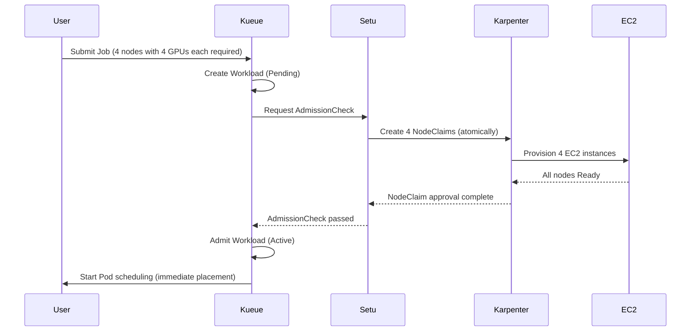

**Gang Scheduling and scheduling safety:**

Setu's core value is its **All-or-Nothing** guarantee. Distributed training workloads are only useful when all replicas run simultaneously.

| Scenario | Traditional Karpenter | Setu + Kueue |
|---------|---------------|-------------|
| **4 nodes with 4 GPUs each required** | Only 2 created → 2 idle → wasted costs | Admit after confirming all 4 are Ready → zero waste |
| **Node provisioning failure** | Some Pods Running, the rest indefinitely Pending | Automatic rollback + exponential backoff retries (5s-80s, up to 5 retries) |
| **Scheduling start time** | Sequential scheduling as each node is created | All nodes Ready → simultaneous scheduling |

**Failure handling and retry logic:**

Setu responds intelligently to node provisioning failures:

```
Failure scenario:
1. Only 3 of 4 NodeClaims succeed (1 fails due to insufficient Spot capacity)
2. Setu detects the failure → deletes all NodeClaims (rollback)
3. Retry with exponential backoff:
   - Retry 1: after 5 seconds
   - Retry 2: after 10 seconds
   - Retry 3: after 20 seconds
   - Retry 4: after 40 seconds
   - Retry 5: after 80 seconds (final)
4. After 5 failures, AdmissionCheck fails permanently → Kueue rejects the Workload
```

**Kueue integration architecture:**

Setu integrates with the workload admission process through Kueue's AdmissionCheck CRD.

```yaml
# 1. Define AdmissionCheck: Specify the Setu controller
apiVersion: kueue.x-k8s.io/v1beta1
kind: AdmissionCheck
metadata:
  name: karpenter-provision
spec:
  controllerName: setu.io/karpenter-provision
---
# 2. ClusterQueue: Apply AdmissionCheck
apiVersion: kueue.x-k8s.io/v1beta1
kind: ClusterQueue
metadata:
  name: ml-training-queue
spec:
  namespaceSelector: {}
  resourceGroups:
  - coveredResources: ["cpu", "memory", "nvidia.com/gpu"]
    flavors:
    - name: gpu-flavor
      resources:
      - name: nvidia.com/gpu
        nominalQuota: 32  # Allow up to 32 GPUs in total
  # Attach the Setu AdmissionCheck
  admissionChecks:
  - karpenter-provision
---
# 3. LocalQueue: Per-namespace queue
apiVersion: kueue.x-k8s.io/v1beta1
kind: LocalQueue
metadata:
  name: training-jobs
  namespace: ml-team
spec:
  clusterQueue: ml-training-queue
---
# 4. Job: Add the Kueue label
apiVersion: batch/v1
kind: Job
metadata:
  name: distributed-training
  namespace: ml-team
  labels:
    kueue.x-k8s.io/queue-name: training-jobs  # Specify the LocalQueue
spec:
  parallelism: 4
  completions: 4
  template:
    spec:
      nodeSelector:
        node.kubernetes.io/instance-type: g5.2xlarge
      tolerations:
      - key: nvidia.com/gpu
        operator: Exists
        effect: NoSchedule
      containers:
      - name: trainer
        image: ml/pytorch-distributed:v2.0
        resources:
          requests:
            nvidia.com/gpu: 1
            cpu: "7"
            memory: 28Gi
      restartPolicy: OnFailure
```

**Detailed execution flow:**

```
1. Submit Job → create Kueue Workload (Pending state)
2. Kueue checks the resource quota (ClusterQueue: 4 of 32 GPUs available)
3. Kueue executes AdmissionCheck → invokes the Setu controller
4. Setu creates 4 NodeClaims (g5.2xlarge, 1 GPU each)
5. Karpenter provisions 4 EC2 instances
6. Confirm all nodes are Ready (kubelet registered + GPU device plugin activated)
7. Setu approves AdmissionCheck → Kueue transitions the Workload to Active
8. Kueue sets suspend: false on the Job → scheduling starts for 4 Pods
9. The Scheduler immediately places Pods on the newly created GPU nodes (zero Pending time)
```

**Comparison: Traditional Karpenter vs. Setu + Kueue:**

| Stage | Traditional Karpenter | Setu + Kueue |
|------|---------------|-------------|
| **Job submission** | Immediately creates Pods (Pending) | Kueue manages the Job as a Workload (awaiting admission) |
| **Node provisioning** | Reacts after detecting Pending Pods | Pre-provisions through AdmissionCheck |
| **Partial failure handling** | Some Pods Running, the rest waiting indefinitely | Full rollback + retry (All-or-Nothing) |
| **Scheduling start** | Sequentially as nodes are created | Simultaneously after all nodes are Ready |
| **Time required** | 2-3 minutes (sequential process) | 1-2 minutes (parallel + advance preparation) |

**Recommended use cases:**

| Workload Type | Setu Required? | Reason |
|-------------|--------------|------|
| **Large-scale distributed training** (16+ GPUs) | ✅ Required | Guarantees Gang Scheduling and prevents partial allocation |
| **Small-scale training** (1-4 GPUs) | ⚠️ Optional | Limited benefit relative to overhead |
| **Single-GPU inference** | ❌ Not required | Traditional Karpenter is sufficient |
| **Batch processing** (CPU workloads) | ⚠️ Optional | Useful when cost efficiency is the goal |

:::info Setu Installation and Configuration
Setu requires Karpenter v1.0+ and Kueue v0.6+. It can be installed through a Helm chart; see the [Setu GitHub repository](https://github.com/sanjeevrg89/Setu) for detailed guidance.
:::

:::warning Production Considerations
Setu is a community project. Verify the following in production environments:
- Karpenter/Kueue version compatibility
- Alarms for NodeClaim creation failures
- ClusterQueue quota monitoring (to prevent resource exhaustion)
:::

**Inference workload scheduling example:**

One `podAntiAffinity` mapping contains both the required node-level rule and the preferred AZ-level rule. The 4 replicas require 4 distinct eligible nodes, but the AZ rule is a preference, allowing placement across 3 AZs. This does not guarantee an even distribution across AZs. The configuration also accommodates admission settings that restrict the `topologyKey` of required anti-affinity to `kubernetes.io/hostname`. See [Kubernetes inter-pod affinity and anti-affinity](https://kubernetes.io/docs/concepts/scheduling-eviction/assign-pod-node/#inter-pod-affinity-and-anti-affinity).

```yaml
# Highly available inference service: On-Demand GPU nodes
apiVersion: apps/v1
kind: Deployment
metadata:
  name: ml-inference
spec:
  replicas: 4
  selector:
    matchLabels:
      app: ml-inference
  template:
    metadata:
      labels:
        app: ml-inference
    spec:
      tolerations:
      - key: nvidia.com/gpu
        operator: Exists
        effect: NoSchedule
      nodeSelector:
        karpenter.sh/capacity-type: on-demand  # Use only On-Demand
      affinity:
        # Hard Anti-Affinity: At most 1 replica per node
        podAntiAffinity:
          requiredDuringSchedulingIgnoredDuringExecution:
          - labelSelector:
              matchLabels:
                app: ml-inference
            topologyKey: kubernetes.io/hostname
          # Soft Anti-Affinity: Prefer distribution across different AZs
          preferredDuringSchedulingIgnoredDuringExecution:
          - weight: 100
            podAffinityTerm:
              labelSelector:
                matchLabels:
                  app: ml-inference
              topologyKey: topology.kubernetes.io/zone
      priorityClassName: high-priority
      containers:
      - name: inference
        image: ml/triton-inference:v2.0
        resources:
          requests:
            nvidia.com/gpu: 1
            cpu: "3"
            memory: 12Gi
          limits:
            nvidia.com/gpu: 1
            cpu: "3"
            memory: 12Gi
        ports:
        - containerPort: 8000
          name: http
        - containerPort: 8001
          name: grpc
        livenessProbe:
          httpGet:
            path: /v2/health/live
            port: 8000
          initialDelaySeconds: 30
          periodSeconds: 10
        readinessProbe:
          httpGet:
            path: /v2/health/ready
            port: 8000
          initialDelaySeconds: 15
          periodSeconds: 5
---
# PDB: Apply a minimum of 2 healthy Pods to Eviction API requests
apiVersion: policy/v1
kind: PodDisruptionBudget
metadata:
  name: ml-inference-pdb
spec:
  minAvailable: 2
  selector:
    matchLabels:
      app: ml-inference
```

**Inferentia/Graviton inference optimization:**

AWS Inferentia is a dedicated inference accelerator that can reduce costs by up to 70% compared with GPUs.

```yaml
# Schedule on Inferentia nodes
apiVersion: apps/v1
kind: Deployment
metadata:
  name: inferentia-inference
spec:
  replicas: 6
  selector:
    matchLabels:
      app: inferentia-inference
  template:
    metadata:
      labels:
        app: inferentia-inference
    spec:
      nodeSelector:
        node.kubernetes.io/instance-type: inf2.xlarge  # AWS Inferentia2
      tolerations:
      - key: aws.amazon.com/neuron
        operator: Exists
        effect: NoSchedule
      containers:
      - name: inference
        image: ml/neuron-inference:v1.0
        resources:
          requests:
            aws.amazon.com/neuron: 1  # 1 Inferentia core
            cpu: "3"
            memory: 8Gi
          limits:
            aws.amazon.com/neuron: 1
        env:
        - name: NEURON_RT_NUM_CORES
          value: "1"
```

**Cost optimization strategy summary:**

| Workload | Instance Types | Spot Usage | Recommended Strategy |
|---------|-------------|----------|----------|
| **Large-scale training** | g5.12xlarge, p4d.24xlarge | ✅ Supported | Spot + Checkpointing + Spot Interruption Handler |
| **Small-scale training** | g5.2xlarge, g5.4xlarge | ✅ Supported | Mix of Spot 70% + On-Demand 30% |
| **High-performance inference** | g5.xlarge, g5.2xlarge | ❌ Not recommended | On-Demand + Savings Plans |
| **Lightweight inference** | inf2.xlarge, c7g.xlarge | ❌ Not recommended | On-Demand or Reserved Instances |
| **Batch inference** | g5.xlarge | ✅ Supported | Spot + retry logic |

### 9.2 Scheduling Decision Flowchart

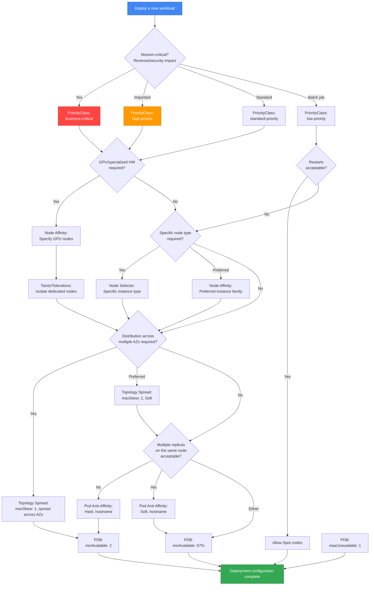

**Decision guide:**

1. **Assess business impact** → Determine PriorityClass
2. **Hardware requirements** → Node Affinity, Taints/Tolerations
3. **Cost optimization** → Decide whether to allow Spot nodes
4. **High availability requirements** → Topology Spread, Anti-Affinity
5. **Upgrade safety** → Configure rollout strategy/readiness, and a PDB for Eviction API-based node drains

---

<span id="10-2025-2026-aws-innovations" />

## 10. AWS Innovations in 2025-2026 and Scheduling Strategies

Key innovations announced at AWS re:Invent 2025 are significantly influencing EKS scheduling strategies. This section covers how the latest features, including Provisioned Control Plane, EKS Auto Mode, Karpenter + ARC integration, and Container Network Observability, apply to Pod scheduling and availability.

### 10.1 Provisioned Control Plane Scheduling Performance

**Overview:**

Provisioned Control Plane provisions control plane capacity in predefined tiers such as XL, 2XL, and 4XL, providing predictable, high-performance Kubernetes operations.

**Performance characteristics by tier:**

| Tier | API Concurrency | Pod Scheduling Speed | Cluster Scale | Use Case |
|------|-----------|-----------------|------------|----------|
| **Standard** | Dynamic scaling | Standard | ~1,000 nodes | General workloads |
| **XL** | High | Fast | ~2,000 nodes | Large-scale deployments |
| **2XL** | Very high | Very fast | ~4,000 nodes | AI/ML training, HPC |
| **4XL** | Maximum | Maximum | ~8,000 nodes | Very large clusters |

**Scheduling performance improvements:**

Provisioned Control Plane improves scheduling performance in the following ways:

1. **API server concurrency**: Processes more scheduling requests simultaneously
2. **Expanded etcd capacity**: Stores metadata for more nodes and Pods
3. **Increased scheduler throughput**: Processes more Pod bindings per second
4. **Predictable latency**: Ensures consistent scheduling latency even during traffic bursts

**Scheduling strategy for large clusters:**

```yaml
# Example: Deploy a large-scale Deployment on the Provisioned Control Plane XL tier
apiVersion: apps/v1
kind: Deployment
metadata:
  name: large-scale-app
spec:
  replicas: 1000  # Deploy 1000 replicas simultaneously
  selector:
    matchLabels:
      app: large-scale-app
  template:
    metadata:
      labels:
        app: large-scale-app
    spec:
      # Topology Spread: Distribute 1000 Pods evenly
      topologySpreadConstraints:
      - maxSkew: 10  # Increase maxSkew for flexibility in large-scale deployments
        topologyKey: topology.kubernetes.io/zone
        whenUnsatisfiable: DoNotSchedule
        labelSelector:
          matchLabels:
            app: large-scale-app
      - maxSkew: 50
        topologyKey: kubernetes.io/hostname
        whenUnsatisfiable: DoNotSchedule
        labelSelector:
          matchLabels:
            app: large-scale-app
      affinity:
        podAntiAffinity:
          preferredDuringSchedulingIgnoredDuringExecution:
          - weight: 100
            podAffinityTerm:
              labelSelector:
                matchLabels:
                  app: large-scale-app
              topologyKey: kubernetes.io/hostname
      containers:
      - name: app
        image: app:v1.0
        resources:
          requests:
            cpu: "500m"
            memory: 1Gi
```

**AI/ML training workload optimization (thousands of GPU Pods):**

Provisioned Control Plane is optimized for scenarios that simultaneously schedule thousands of GPU Pods for AI/ML training workloads.

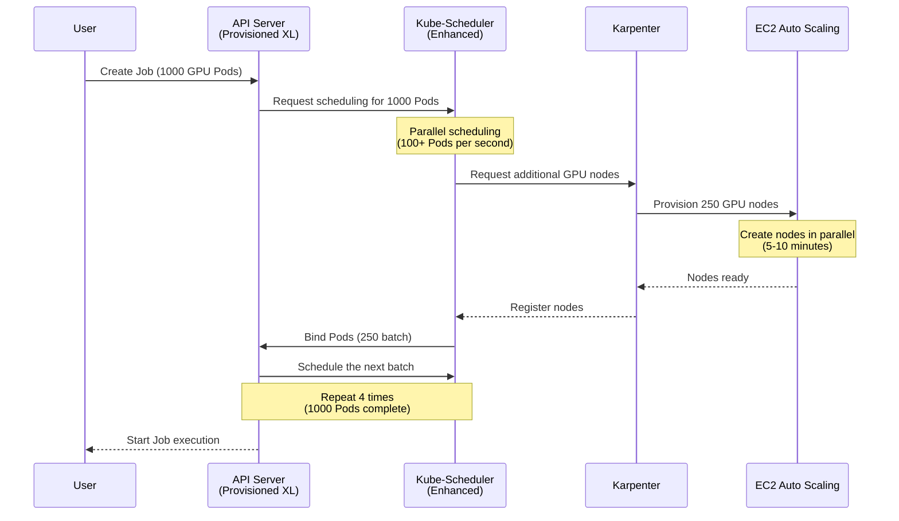

**Recommended tiers by use case:**

| Use Case | Recommended Tier | Reason |
|----------|----------|------|
| **General web applications** | Standard | Dynamic scaling is sufficient |
| **Large-scale batch jobs (500+ Pods)** | XL | Fast concurrent scheduling required |
| **Distributed ML training (1000+ GPU Pods)** | 2XL | Very fast scheduling + high API concurrency |
| **HPC clusters (thousands of nodes)** | 4XL | Maximum scale + predictable performance |
| **Mission-critical services** | XL or higher | Consistent latency even during traffic bursts |

:::tip Provisioned Control Plane Selection Criteria
- **Node count > 1,000**: Consider XL or higher
- **Frequent large-scale deployments (500+ Pods)**: XL or higher
- **GPU workloads (100+ GPUs)**: 2XL or higher
- **Predictable performance requirements**: Consider Provisioned at any scale
:::

### 10.2 Automatic Node Provisioning with EKS Auto Mode

**Overview:**

EKS Auto Mode manages node provisioning and maintenance. The following code compares two configurations. Standalone Karpenter requires an existing `default` EC2NodeClass. The Auto Mode example requires Auto Mode enabled with a Ready NodeClass, an eligible NodePool, compatible images, IAM and network access.

Built-in `general-purpose` uses On-Demand `amd64` capacity. Spot requires a suitable custom pool; ARM requires an eligible `arm64` pool and compatible images. The built-in `system` pool also supports ARM but has the `CriticalAddonsOnly` taint for critical workloads.

Standalone Karpenter uses `karpenter.k8s.aws/EC2NodeClass`, while Auto Mode uses `eks.amazonaws.com/NodeClass`. Check that each NodePool refers to the correct kind of NodeClass when applying the examples.

**How Auto Mode affects scheduling:**

| Feature | Traditional Approach (Manual) | Auto Mode |
|------|---------------|----------|
| **Node selection** | Configure compatible NodePools and Pod constraints | Selects eligible offerings within NodePool and Pod constraints |
| **Dynamic scaling** | Configure Cluster Autoscaler or Karpenter | Managed provisioning within configured capacity and access boundaries |
| **Cost optimization** | Configure allowed capacity types/architectures | Spot/Graviton require an eligible pool and compatible workloads |
| **AZ placement** | Configure required topology policy | Application topology policy and eligible subnets still apply |
| **Node upgrades** | Manage AMI lifecycle | Managed node OS lifecycle, subject to supported configuration |

**Manual NodeSelector/Affinity vs. Auto Mode comparison:**

```yaml
# Traditional approach: Manual NodeSelector + Karpenter NodePool
---
# Create a Karpenter NodePool
apiVersion: karpenter.sh/v1
kind: NodePool
metadata:
  name: general-pool
spec:
  template:
    spec:
      nodeClassRef:
        group: karpenter.k8s.aws
        kind: EC2NodeClass
        name: default
      requirements:
      - key: node.kubernetes.io/instance-type
        operator: In
        values: ["c6i.xlarge", "c6i.2xlarge", "c6a.xlarge"]
      - key: karpenter.sh/capacity-type
        operator: In
        values: ["on-demand", "spot"]
---
# Deployment: Specify nodes with NodeSelector
apiVersion: apps/v1
kind: Deployment
metadata:
  name: api-server
spec:
  replicas: 10
  selector:
    matchLabels:
      app: api-server
  template:
    metadata:
      labels:
        app: api-server
    spec:
      nodeSelector:
        karpenter.sh/nodepool: general-pool
      containers:
      - name: api
        image: api:v1.0
        resources:
          requests:
            cpu: "1"
            memory: 2Gi
```

```yaml
# Auto Mode approach: Minimal configuration
apiVersion: apps/v1
kind: Deployment
metadata:
  name: api-server
spec:
  replicas: 10
  selector:
    matchLabels:
      app: api-server
  template:
    metadata:
      labels:
        app: api-server
    spec:
      nodeSelector:
        eks.amazonaws.com/compute-type: auto
      containers:
      - name: api
        image: api:v1.0
        resources:
          requests:
            cpu: "1"
            memory: 2Gi
      # Eligible NodePool constraints and application topology policy still apply
```

**Scheduling settings still required in Auto Mode:**

Auto Mode automates node provisioning, but the following scheduling settings **must still be configured explicitly**:

| Setting | Automated by Auto Mode? | Description |
|------|---------------------|------|
| **Resource Requests/Limits** | ❌ Configuration required | Workload resource requirements must be specified |
| **Topology Spread** | ⚠️ Explicit policy for application requirements | Default scheduler behavior does not establish the application's required AZ distribution |
| **Pod Anti-Affinity** | ❌ Configuration required | Distribution of replicas of the same app must be specified |
| **PDB** | ❌ Configuration required | The app is responsible for ensuring minimum availability |
| **PriorityClass** | ❌ Configuration required | The app is responsible for priority |
| **Taints/Tolerations** | ⚠️ Specialized nodes only | Must be specified for specialized workloads such as GPUs |

**Recommended scheduling pattern for Auto Mode:**

```yaml
# Recommended minimum scheduling settings for Auto Mode
apiVersion: apps/v1
kind: Deployment
metadata:
  name: production-app
spec:
  replicas: 6
  selector:
    matchLabels:
      app: production-app
  template:
    metadata:
      labels:
        app: production-app
    spec:
      # 1. Resource Requests (required)
      containers:
      - name: app
        image: app:v1.0
        resources:
          requests:
            cpu: "1"
            memory: 2Gi
          limits:
            cpu: "2"
            memory: 4Gi

      # 2. Topology Spread (fine-grained control of AZ distribution)
      topologySpreadConstraints:
      - maxSkew: 1
        topologyKey: topology.kubernetes.io/zone
        whenUnsatisfiable: DoNotSchedule
        labelSelector:
          matchLabels:
            app: production-app
        minDomains: 3

      # 3. Pod Anti-Affinity (spread across nodes)
      affinity:
        podAntiAffinity:
          preferredDuringSchedulingIgnoredDuringExecution:
          - weight: 100
            podAffinityTerm:
              labelSelector:
                matchLabels:
                  app: production-app
              topologyKey: kubernetes.io/hostname

      # 4. PriorityClass (priority)
      priorityClassName: high-priority
---
# 5. PDB (ensure availability)
apiVersion: policy/v1
kind: PodDisruptionBudget
metadata:
  name: production-app-pdb
spec:
  minAvailable: 4
  selector:
    matchLabels:
      app: production-app
```

**Auto Mode + PDB + Karpenter interactions:**

Auto Mode internally provides autoscaling similar to Karpenter and respects PDBs.

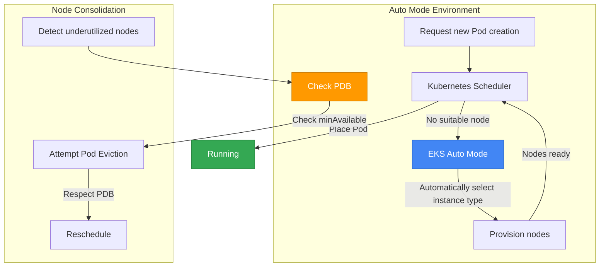

### 10.3 ARC Zonal Shift and Karpenter {#103-az-evacuation-with-arc--karpenter-integration}

**Overview:**

EKS ARC zonal shift reduces supported traffic toward an impaired AZ. It cordons nodes there and removes affected Pod endpoints from EndpointSlices; it does not evict existing Pods or automatically recreate Deployment replicas in other AZs.

- Enable zonal shift for the EKS cluster. Self-managed Karpenter requires version 1.12.0 or later and its controller's zonal-shift setting. For the 1.14.1 example, the CLI option is `--enable-zonal-shift=true`; the controller also needs `arc-zonal-shift:GetManagedResource` permission for the target cluster. EKS Auto Mode has a separate enablement path.
- AWS zonal autoshift uses AWS internal AZ telemetry. A user CloudWatch alarm is input to an operator or separately implemented automation; this document does not implement an alarm-to-shift controller.
- Before shifting, remaining-AZ replicas, CoreDNS, capacity and dependencies must be able to carry the load. Check the LB resource's ARC settings, target type and endpoint-consumption path as well. The NodePool below assumes an existing `default` EC2NodeClass with the regional networking, image and permissions resolved; a resource name does not enable ARC.

**Supported traffic changes and independent Karpenter behavior:**

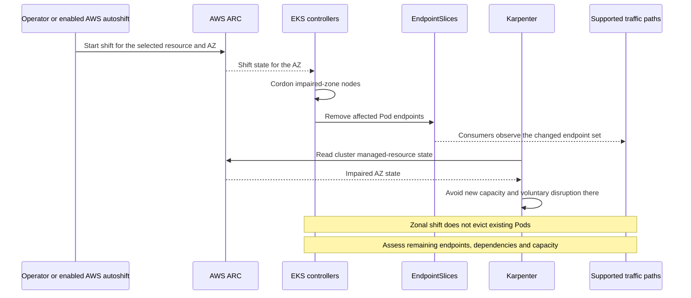

**Workload constraints for a separately ARC-enabled cluster:**

This example uses Soft AZ spread and omits `minDomains`. Losing an AZ therefore does not make this spread setting block new Pod placement. Node affinity, taints, volumes, capacity and other constraints still apply, so placement may be uneven or remain pending.

Supply the real application image and readiness configuration. If existing Pods stay alive after the shift, the Deployment still has its desired replica count and does not automatically create replacements.

```yaml
# NodePool constraints; ARC enablement is separate
apiVersion: karpenter.sh/v1
kind: NodePool
metadata:
  name: arc-enabled-pool
spec:
  template:
    spec:
      nodeClassRef:
        group: karpenter.k8s.aws
        kind: EC2NodeClass
        name: default
      requirements:
      - key: topology.kubernetes.io/zone
        operator: In
        values:
        - us-east-1a
        - us-east-1b
        - us-east-1c
      - key: karpenter.sh/capacity-type
        operator: In
        values: ["on-demand"]  # Illustrative allowed type, not a capacity reservation
  disruption:
    consolidationPolicy: WhenEmptyOrUnderutilized
    consolidateAfter: 5m
    budgets:
    - nodes: "30%"  # Voluntary disruption budget, not spare capacity
---
# Application: Topology Spread + PDB
apiVersion: apps/v1
kind: Deployment
metadata:
  name: resilient-app
spec:
  replicas: 9  # Desired count; inspect actual placement per AZ
  selector:
    matchLabels:
      app: resilient-app
  template:
    metadata:
      labels:
        app: resilient-app
    spec:
      topologySpreadConstraints:
      - maxSkew: 1
        topologyKey: topology.kubernetes.io/zone
        whenUnsatisfiable: ScheduleAnyway
        labelSelector:
          matchLabels:
            app: resilient-app
      affinity:
        podAntiAffinity:
          preferredDuringSchedulingIgnoredDuringExecution:
          - weight: 100
            podAffinityTerm:
              labelSelector:
                matchLabels:
                  app: resilient-app
              topologyKey: kubernetes.io/hostname
      containers:
      - name: app
        image: app:v1.0
        resources:
          requests:
            cpu: "1"
            memory: 2Gi
---
# PDB: selected-Pod voluntary Eviction API budget; it does not bound an AZ failure
apiVersion: policy/v1
kind: PodDisruptionBudget
metadata:
  name: resilient-app-pdb
spec:
  minAvailable: 6
  selector:
    matchLabels:
      app: resilient-app
```

**Istio locality-routing example:**

The following assumes an existing `default/resilient-app` Service with the correct HTTP port and healthy endpoints, a sidecar-based mesh, and an Istio installation supporting the shown CRD fields. Istio locality and outlier detection govern mesh endpoint selection. They are separate from EKS's ARC EndpointSlice path; verify the mesh's endpoint discovery and behavior during a shift.

`failover.from/to` take region names, so they are not an AZ rotation list. This example instead compares region and zone metadata using `failoverPriority`, with `consecutive5xxErrors`. That priority is not a fixed AZ ring or a recovery-time guarantee. Specify only one of `distribute`, `failover` or `failoverPriority`; the retained 30-second values are examples to tune and validate.

```yaml
# Istio DestinationRule: endpoint-locality priority
apiVersion: networking.istio.io/v1beta1
kind: DestinationRule
metadata:
  name: resilient-app-dr
spec:
  host: resilient-app.default.svc.cluster.local
  trafficPolicy:
    loadBalancer:
      localityLbSetting:
        enabled: true
        failoverPriority:
        - topology.kubernetes.io/region
        - topology.kubernetes.io/zone
    outlierDetection:
      consecutive5xxErrors: 5
      interval: 30s
      baseEjectionTime: 30s
      maxEjectionPercent: 50
---
# Route to the Service; no static AZ subset exclusion
apiVersion: networking.istio.io/v1beta1
kind: VirtualService
metadata:
  name: resilient-app-vs
spec:
  hosts:
  - resilient-app.default.svc.cluster.local
  http:
  - route:
    - destination:
        host: resilient-app.default.svc.cluster.local
```

**Gray Failure detection pattern:**

A Gray Failure degrades service quality, for example through slow responses, without causing a complete outage. This ConfigMap stores a latency-alarm definition for one ALB and AZ. Creating the ConfigMap does not create a CloudWatch alarm.

Check the actual account/Region, published `LoadBalancer` suffix, AZ and latency threshold, then create the alarm through separate IaC or API calls. The example disables actions and treats absent samples as `missing`. Connect the response to an operator runbook or separate automation. AWS zonal autoshift uses AWS internal telemetry rather than this alarm.

```yaml
# Alarm definition data: replace the illustrative ALB identifier
apiVersion: v1
kind: ConfigMap
metadata:
  name: gray-failure-detection
data:
  alarm.json: |
    {
      "AlarmName": "EKS-AZ-1a-HighLatency",
      "ActionsEnabled": false,
      "MetricName": "TargetResponseTime",
      "Namespace": "AWS/ApplicationELB",
      "Statistic": "Average",
      "Unit": "Seconds",
      "Period": 60,
      "EvaluationPeriods": 3,
      "Threshold": 1.0,
      "ComparisonOperator": "GreaterThanThreshold",
      "Dimensions": [
        {
          "Name": "LoadBalancer",
          "Value": "app/resilient-app/0123456789abcdef"
        },
        {
          "Name": "AvailabilityZone",
          "Value": "us-east-1a"
        }
      ],
      "TreatMissingData": "missing"
    }
```

**Boundaries to verify for AZ impairment:**

| Scenario | PDB Role | Topology Spread | Capacity and Control Path | Result to Verify |
|---------|---------|----------------|---------------|----------|
| **Complete AZ failure** | Constrains voluntary Eviction only | Review Soft spread and remaining Hard constraints | Pre-existing replicas/capacity in remaining AZs and enabled ARC paths | Measure endpoint transition and service SLOs |
| **Gray Failure** | Does not detect impairment or start a shift | Inspect actual eligible domains and load | AWS autoshift or an operator/separate automation decision | Validate alarm quality and impact scope |
| **Planned maintenance** | Evaluate the selected Pods' Eviction budget | Review placement policy for maintenance | Separate drain/recovery plan; shift itself does not evict Pods | Measure workload-specific preparation and restoration |

### 10.4 Container Network Observability and Scheduling

**Overview:**

Container Network Observability provides granular network metrics to analyze the correlation between Pod placement and network performance and optimize scheduling strategies.

**Correlation between Pod placement and network performance:**

| Pod Placement Pattern | Network Latency | Cross-AZ Traffic Cost | Use Case |
|-------------|-------------|-------------------|----------|
| **Same Node** | ~0.1ms | $0 | Cache server + application |
| **Same AZ** | ~0.5ms | $0 | Microservices that communicate frequently |
| **Cross-AZ** | ~2-5ms | $0.01/GB | Services requiring high availability |
| **Cross-Region** | ~50-100ms | $0.02/GB | Geographically distributed services |

**Evaluate Cross-AZ request paths alongside placement preferences:**

The Pod affinity below affects placement scoring only. When API Gateway Pods already span several AZs, several zones may satisfy that preference. Evaluate Service/mesh endpoint selection and actual byte paths before attributing same-AZ communication or cost changes to placement.

```yaml
# Example: spread API Gateway and express the backend's AZ placement preference
apiVersion: apps/v1
kind: Deployment
metadata:
  name: api-gateway
spec:
  replicas: 6
  selector:
    matchLabels:
      app: api-gateway
  template:
    metadata:
      labels:
        app: api-gateway
        network-locality: same-az  # Network observability label
    spec:
      # Topology Spread: Distribute evenly across AZs
      topologySpreadConstraints:
      - maxSkew: 1
        topologyKey: topology.kubernetes.io/zone
        whenUnsatisfiable: DoNotSchedule
        labelSelector:
          matchLabels:
            app: api-gateway
      containers:
      - name: gateway
        image: api-gateway:v1.0
        resources:
          requests:
            cpu: "1"
            memory: 2Gi
---
# Backend Service: Prefer the same AZ as API Gateway
apiVersion: apps/v1
kind: Deployment
metadata:
  name: backend-service
spec:
  replicas: 6
  selector:
    matchLabels:
      app: backend-service
  template:
    metadata:
      labels:
        app: backend-service
        network-locality: same-az
    spec:
      affinity:
        # Pod Affinity: prefer the API Gateway AZ; endpoint routing is separate
        podAffinity:
          preferredDuringSchedulingIgnoredDuringExecution:
          - weight: 100
            podAffinityTerm:
              labelSelector:
                matchExpressions:
                - key: app
                  operator: In
                  values:
                  - api-gateway
              topologyKey: topology.kubernetes.io/zone
      containers:
      - name: backend
        image: backend-service:v1.0
        resources:
          requests:
            cpu: "2"
            memory: 4Gi
```

**Topology Spread optimization based on network observability:**

Analyze Container Network Observability metrics to adjust scheduling strategies.

```yaml
# Example CloudWatch Container Insights metrics query
apiVersion: v1
kind: ConfigMap
metadata:
  name: network-metrics-query
data:
  query.json: |
    {
      "MetricName": "pod_network_rx_bytes",
      "Namespace": "ContainerInsights",
      "Dimensions": [
        {"Name": "PodName", "Value": "api-gateway-*"},
        {"Name": "Namespace", "Value": "default"}
      ],
      "Period": 300,
      "Stat": "Sum"
    }
```

**Optimization patterns based on network observability:**

1. **Detect high Cross-AZ traffic** → inspect actual endpoint/byte paths and locality policy before changing placement preferences
2. **Detect AZ network congestion** → evaluate eligible domains, capacity and the effect of placement policy together
3. **Analyze inter-Pod communication** → validate service-mesh routing and health configuration
4. **Detect latency spikes** → an operator or separate automation evaluates cause and readiness before deciding on an ARC traffic shift for supported resources

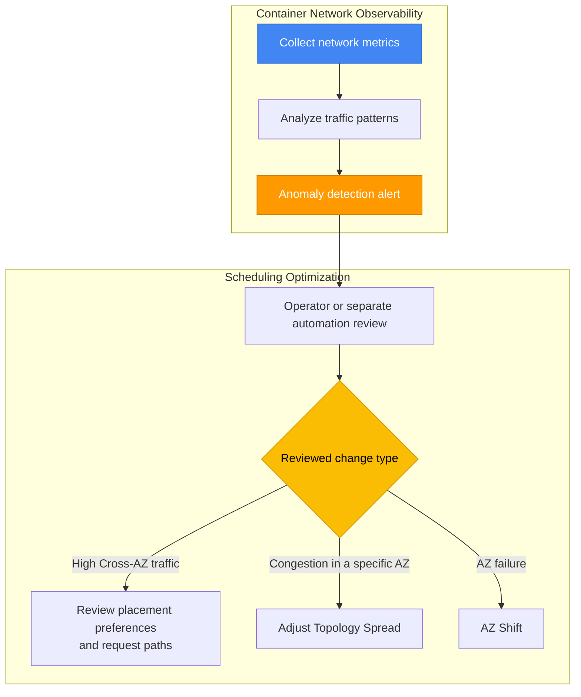

**Practical example: Network optimization for an ML inference service:**

```yaml
# ML inference service: Low latency + cost optimization
apiVersion: apps/v1
kind: Deployment
metadata:
  name: ml-inference-optimized
spec:
  replicas: 9
  selector:
    matchLabels:
      app: ml-inference
  template:
    metadata:
      labels:
        app: ml-inference
    spec:
      # 1. Topology Spread: Distribute evenly across AZs (high availability)
      topologySpreadConstraints:
      - maxSkew: 1
        topologyKey: topology.kubernetes.io/zone
        whenUnsatisfiable: DoNotSchedule
        labelSelector:
          matchLabels:
            app: ml-inference
        minDomains: 3

      # 2. Pod Affinity: prefer the API Gateway AZ; measure request latency separately
      affinity:
        podAffinity:
          preferredDuringSchedulingIgnoredDuringExecution:
          - weight: 80
            podAffinityTerm:
              labelSelector:
                matchExpressions:
                - key: app
                  operator: In
                  values:
                  - api-gateway
              topologyKey: topology.kubernetes.io/zone

      containers:
      - name: inference
        image: ml-inference:v1.0
        resources:
          requests:
            cpu: "2"
            memory: 8Gi
```

**Cost savings from network observability:**

| Before Optimization | After Optimization | Savings |
|----------|----------|----------|
| Cross-AZ traffic: 1TB/month | Cross-AZ traffic: 0.2TB/month | Save $8/month |
| Average latency: 3ms | Average latency: 0.5ms | 6x performance improvement |
| Pod Affinity not used | Pod Affinity optimized | Increased operational efficiency |

---

### 10.5 Node Readiness Controller — Improving Scheduling Safety

**Overview:**

Node Readiness Controller (NRC) is an external Kubernetes SIGs controller, introduced in the Kubernetes blog on February 3, 2026. It reconciles readiness taints from custom Node Conditions; it is not a built-in Kubernetes 1.32 feature gate.

This section uses NRC `v0.5.0` controller/CRDs and Karpenter `v1.14.1` schemas. Treat the standalone rules and combined GPU pattern as alternatives, and check overlapping selectors/taint ownership before combining them. The examples require:

- The controller and CRDs from the same release, with the controller able to run outside nodes blocked by its own readiness guards. Admission-webhook packaging and certificate prerequisites depend on the chosen release installation.
- Target labels and matching `NoSchedule` taints present **at node registration**. Karpenter can supply the latter through `startupTaints`; adding them asynchronously leaves a scheduling race.
- A separately implemented, authorized reporter for the exact custom conditions shown below. CNI/NVIDIA device plugins are not assumed to publish them. Define each check, Node status RBAC, reporting interval, failure/unknown behavior and stale-signal handling; NRC is not itself a health checker or a freshness timeout.
- A bootstrap agent that can tolerate only its required guards and dedicated-node taints. Ordinary workloads must not tolerate the readiness guard. For GPU workloads, also resolve the compatible accelerated AMI/runtime/device-plugin prerequisites from section 9.2.

The rule objects demonstrate the API contract. They are not a complete runnable readiness deployment until the reporter and registration configuration are supplied.

**The problem from a scheduling perspective:**

The scheduler evaluates resources, taints, affinity, topology and other constraints. `Ready=True` alone does not prove that every workload-specific dependency is usable; the following are possible initialization gaps, not measured failure results.

| Scenario | Node State | Actual Situation | Result |
|---------|---------|----------|------|
| **CNI plugin not ready** | `Ready` | Calico/Cilium Pod starting | Pod network connection failure |
| **CSI driver not ready** | `Ready` | EBS CSI Driver initializing | PVC mount failure |
| **GPU driver not ready** | `Ready` | NVIDIA Device Plugin loading | GPU workload startup failure |
| **Image pre-pull in progress** | `Ready` | Required image layers are still downloading | Startup can wait for image availability; duration depends on image, cache and network |

**How Node Readiness Controller works:**

NRC uses the `NodeReadinessRule` CRD (`readiness.node.x-k8s.io/v1alpha1`) as follows:

1. **Condition-based taint management**: Reconcile a rule's taint using its required Node Conditions.
2. **Blocks ordinary scheduling**: A `NoSchedule` guard blocks new Pods without a matching toleration; it does not evict existing Pods.
3. **Conditional taint removal**: Remove that rule's taint when its conditions match. Other guards and scheduler constraints must still permit placement.

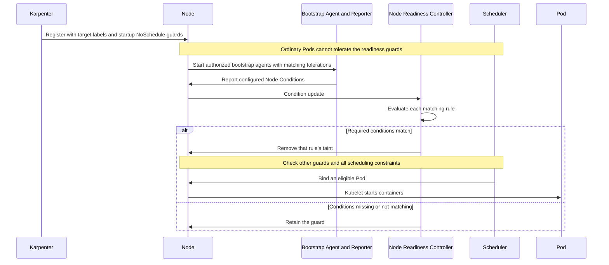

**Two enforcement modes:**

NRC operates in two modes, each with a different effect on scheduling safety:

| Mode | Behavior | Scheduling Impact | Use Case |
|------|---------|-------------|----------|
| **bootstrap-only** | Removes its taint and marks completion after conditions first match | One-time gate; later condition failures do not reapply this rule | One-time initialization or pre-pulling |
| **continuous** | Reconciles its taint when reported conditions change | Blocks new non-tolerating Pods after reconciliation; does not evict existing Pods | Dependencies requiring continued health reporting |

**Practical example 1: Check CNI plugin readiness (Bootstrap-only)**

```yaml
apiVersion: readiness.node.x-k8s.io/v1alpha1
kind: NodeReadinessRule
metadata:
  name: network-readiness-rule
spec:
  # Requires a custom network reporter; missing condition remains Unknown
  conditions:
    - type: "example.com/NetworkReady"
      requiredStatus: "True"

  # Apply this taint until ready
  taint:
    key: "readiness.k8s.io/network-unavailable"
    effect: "NoSchedule"
    value: "pending"

  # Bootstrap-only: Stop monitoring once ready
  enforcementMode: "bootstrap-only"

  # Apply to a label supplied at node registration
  nodeSelector:
    matchLabels:
      example.com/readiness-profile: network-bootstrap
```

**Practical example 2: Continuously monitor GPU drivers (Continuous)**

```yaml
apiVersion: readiness.node.x-k8s.io/v1alpha1
kind: NodeReadinessRule
metadata:
  name: gpu-driver-readiness-rule
spec:
  # Custom reporter checks device registration and driver health
  conditions:
    - type: "example.com/GPUDevicePluginReady"
      requiredStatus: "True"
    - type: "example.com/GPUDriverReady"
      requiredStatus: "True"

  # Apply this taint until the GPU is ready
  taint:
    key: "readiness.k8s.io/gpu-unavailable"
    effect: "NoSchedule"
    value: "pending"

  # Continuous: reconcile the guard when reported conditions fail
  enforcementMode: "continuous"

  # Apply only to the GPU node group
  nodeSelector:
    matchLabels:
      example.com/readiness-profile: gpu-continuous
```

**Comparison with Pod Scheduling Readiness (schedulingGates):**

Kubernetes can control scheduling safety at both the Pod and node levels:

| Comparison | `schedulingGates` (Pod Level) | `NodeReadinessRule` (Node Level) |
|----------|------------------------------|--------------------------------|
| **Control target** | Scheduling of a specific Pod | Scheduling eligibility of matching nodes for Pods that do not tolerate the guard |
| **Use case** | Hold a Pod until external conditions are satisfied | Guard nodes while reported infrastructure conditions are unmet |
| **Condition location** | Gate names in Pod spec; external controller owns the readiness decision | Conditions in Node status, supplied by a reporter |
| **Removal method** | An external controller removes the gate | NRC removes its taint when the rule matches |
| **Scope of impact** | A single Pod | New Pods without matching tolerations; `NoSchedule` does not evict existing Pods |

**Combined pattern:**

```yaml
# Combine Pod-level + node-level scheduling safety
apiVersion: v1
kind: Pod
metadata:
  name: ml-training-job
spec:
  # Pod level: Hold scheduling until the dataset is ready
  schedulingGates:
    - name: "example.com/dataset-ready"

  # The target pool registers with its readiness guard; do not tolerate that guard.
  nodeSelector:
    karpenter.sh/nodepool: gpu-pool

  containers:
    - name: trainer
      image: ml-trainer:v1.0
      resources:
        limits:
          nvidia.com/gpu: 8
```

**Karpenter + NRC integration pattern:**

In environments that use Karpenter for dynamic node provisioning, NRC provides the following workflow:

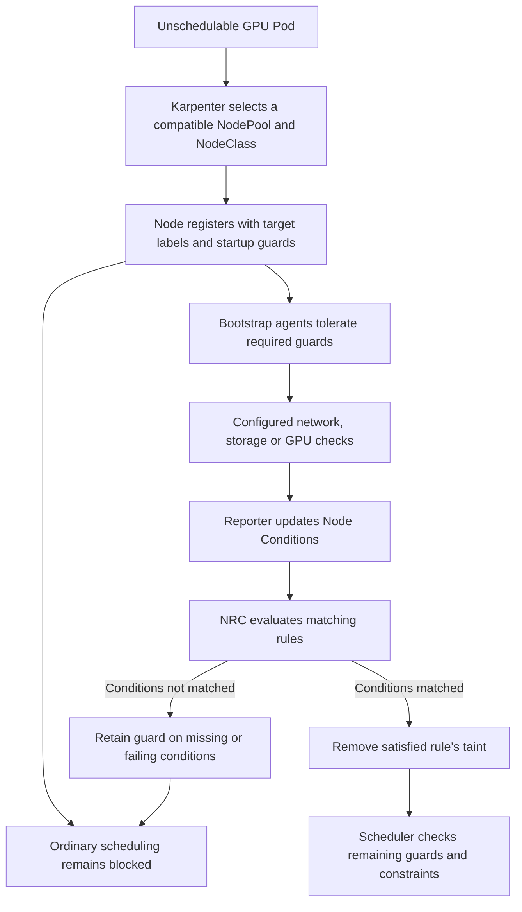

**Practical GPU node group example:**

This combined pattern uses a guarded `gpu-pool` and a custom GPU reporter. `gpu-nodeclass` must already resolve a compatible accelerated AMI, IAM role and network. The Pod/Job examples target this pool and require eight allocatable GPUs. Use this as an alternative to the standalone GPU rule above; a reporter implementation and observed failure/unknown/staleness behavior remain required.

```yaml
# Karpenter NodePool: GPU node group
apiVersion: karpenter.sh/v1
kind: NodePool
metadata:
  name: gpu-pool
spec:
  template:
    spec:
      startupTaints:
        - key: readiness.k8s.io/gpu-unavailable
          value: pending
          effect: NoSchedule
      requirements:
        - key: node.kubernetes.io/instance-type
          operator: In
          values: ["p4d.24xlarge", "p5.48xlarge"]
        - key: karpenter.sh/capacity-type
          operator: In
          values: ["on-demand"]
      nodeClassRef:
        group: karpenter.k8s.aws
        kind: EC2NodeClass
        name: gpu-nodeclass
---
# NodeReadinessRule: Check GPU driver readiness
apiVersion: readiness.node.x-k8s.io/v1alpha1
kind: NodeReadinessRule
metadata:
  name: gpu-readiness-rule
spec:
  conditions:
    - type: "example.com/GPUDriverReady"
      requiredStatus: "True"
    - type: "example.com/GPUDevicePluginReady"
      requiredStatus: "True"
  taint:
    key: "readiness.k8s.io/gpu-unavailable"
    effect: "NoSchedule"
    value: "pending"
  enforcementMode: "continuous"
  nodeSelector:
    matchLabels:
      karpenter.sh/nodepool: gpu-pool
---
# AI workload: target the guarded pool without tolerating its readiness guard
apiVersion: batch/v1
kind: Job
metadata:
  name: ml-training
spec:
  template:
    spec:
      # Do not tolerate the readiness guard.
      nodeSelector:
        karpenter.sh/nodepool: gpu-pool

      containers:
        - name: trainer
          image: ml-trainer:v1.0
          resources:
            limits:
              nvidia.com/gpu: 8

      restartPolicy: OnFailure
```

:::tip Recommendations for Optimizing Scheduling Safety
- **CNI plugins**: Use `bootstrap-only` for explicitly one-time checks; continued network health needs a continuous rule and reporter.
- **GPU/CSI drivers**: With `continuous`, reported failures cause reconciliation of the guard for new Pods. Existing workload recovery needs its own procedure.
- **Image pre-pulling**: A custom reporter can confirm the required images are present before a bootstrap rule completes.
- **Karpenter integration**: Match each rule's selector and taint to registration labels/startup taints and verify that bootstrap agents can run.
:::

:::warning Considerations for Alpha Features
The `NodeReadinessRule` API is `v1alpha1` in the referenced external NRC release. There is no `NodeReadiness=true` Kubernetes control-plane gate to enable.

1. Pin the controller, CRDs and optional admission webhook to the same release. In `v0.5.0`, conditions, nodeSelector, enforcementMode and taint fields are immutable; an existing rule needs a planned replacement rather than an in-place edit of those fields.
2. Review Node status/reporting permissions, selector overlap and taint ownership. Full webhook packaging requires its documented certificate setup.
3. Validate startup races, missing/failed/stale conditions, bootstrap-agent placement and controller outage/recovery in a separate test plan.
4. Init containers run after a Pod is assigned to a node; they do not replace a node scheduling guard. Retain an owner-specific recovery procedure for guarded nodes.
:::

**References:**

- [Kubernetes Blog: Introducing Node Readiness Controller](https://kubernetes.io/blog/2026/02/03/introducing-node-readiness-controller/)
- [Node Readiness Controller GitHub](https://github.com/kubernetes-sigs/node-readiness-controller)

---

## 11. Comprehensive Checklist & References

### 11.1 Comprehensive Checklist

Use the following checklist to verify scheduling settings before production deployment.

#### Basic Scheduling (All Workloads)

| Item | Description | Check |
|------|------|------|
| **Configure Resource Requests** | Specify CPU and memory requests for all containers | [ ] |
| **Assign PriorityClass** | Assign a PriorityClass appropriate to workload importance | [ ] |
| **Liveness/Readiness Probe** | Configure health checks to ensure Pod reliability | [ ] |
| **Graceful Shutdown** | preStop Hook + terminationGracePeriodSeconds | [ ] |
| **Image Pull Policy** | Production: `IfNotPresent` or `Always` | [ ] |

#### High Availability (Critical Workloads)

| Item | Description | Check |
|------|------|------|
| **Replica count ≥ 3** | Minimum replicas for fault domain isolation | [ ] |
| **Topology Spread Constraints** | Verify selected Pods, eligible domains and Hard/Soft skew semantics | [ ] |
| **Pod Anti-Affinity** | Spread across nodes (Soft or Hard) | [ ] |
| **Configure PDB** | Specify minAvailable or maxUnavailable | [ ] |
| **Verify PDB** | Confirm `minAvailable < replicas` | [ ] |
| **Verify Multi-AZ deployment** | Join Pod `spec.nodeName` to Node zone labels using the snapshot method above; retain missing/unscheduled results | [ ] |

#### Resource Optimization

| Item | Description | Check |
|------|------|------|
| **Use Spot nodes** | Allow Spot nodes for restartable workloads | [ ] |
| **Optimize Node Affinity** | Select instance types suited to the workload | [ ] |
| **Taints/Tolerations** | Isolate dedicated nodes such as GPU and high-performance nodes | [ ] |
| **Configure Descheduler** | Resolve node imbalance (optional) | [ ] |
| **Karpenter integration** | Configure disruption budgets | [ ] |

#### Specialized Workloads

| Item | Description | Check |
|------|------|------|
| **GPU workloads** | GPU Taint Tolerate + GPU resource requests | [ ] |
| **StatefulSet** | Use a WaitForFirstConsumer StorageClass | [ ] |
| **DaemonSet** | Add only the tolerations required by that agent; bootstrap agents may need specific readiness guards | [ ] |
| **Batch jobs** | PriorityClass: low-priority, preemptionPolicy: Never | [ ] |

### Pod Scheduling Verification Commands

Set the context and individual inspection targets before using these read-only command examples. Node/AZ counts use the two snapshots and `placement_report` above; preserve unknown and unscheduled results instead of querying an empty node name.

```bash
: "${CONTEXT:?set the selected Kubernetes context}"
: "${NAMESPACE:?set the workload namespace}"
: "${POD:?set one Pod name}"
: "${PDB:?set one PDB name}"
: "${NODE:?set one Node name}"

# 1. Pod-to-node assignment; wide output does not contain actual zone labels
kubectl --context "$CONTEXT" get pods -n "$NAMESPACE" -o wide

# 2. Scheduling events for the selected Pod
kubectl --context "$CONTEXT" describe pod "$POD" -n "$NAMESPACE"

# 3. PDB status in the selected namespace
kubectl --context "$CONTEXT" get pdb -n "$NAMESPACE"
kubectl --context "$CONTEXT" describe pdb "$PDB" -n "$NAMESPACE"

# 4. PriorityClasses
kubectl --context "$CONTEXT" get priorityclass

# 5. Taints on the selected Node
kubectl --context "$CONTEXT" get node "$NODE" -o jsonpath='{.spec.taints}'

# 6-7. Snapshot input for node/AZ counts via placement_report
kubectl --context "$CONTEXT" get pods -n "$NAMESPACE" -o json > pods.json
kubectl --context "$CONTEXT" get nodes -o json > nodes.json

# 8. Warning events in the selected namespace
kubectl --context "$CONTEXT" get events -n "$NAMESPACE" --field-selector type=Warning --sort-by='.lastTimestamp'

# 9. Descheduler logs, if that installation uses this namespace and selector
kubectl --context "$CONTEXT" logs -n kube-system -l app=descheduler --tail=100
```

<span id="related-documents" />

### 11.2 Related Documents

**Internal documents:**
- [EKS High Availability Architecture Guide](/docs/eks-best-practices/operations-reliability/eks-resiliency-guide) — Multi-AZ strategies, Topology Spread, Cell Architecture
- [High-Speed Autoscaling with Karpenter](/docs/eks-best-practices/resource-cost/karpenter-autoscaling) — In-depth Karpenter NodePool configuration
- [EKS Resource Optimization Guide](/docs/eks-best-practices/resource-cost/eks-resource-optimization) — Resource Requests/Limits optimization
- [EKS Pod Health Checks & Lifecycle](/docs/eks-best-practices/operations-reliability/eks-pod-health-lifecycle) — Probes, Lifecycle Hooks

### 11.3 External References

**Official Kubernetes documentation:**
- [Kubernetes Scheduling Framework](https://kubernetes.io/docs/concepts/scheduling-eviction/scheduling-framework/)
- [Assigning Pods to Nodes](https://kubernetes.io/docs/concepts/scheduling-eviction/assign-pod-node/)
- [Pod Priority and Preemption](https://kubernetes.io/docs/concepts/scheduling-eviction/pod-priority-preemption/)
- [Taints and Tolerations](https://kubernetes.io/docs/concepts/scheduling-eviction/taint-and-toleration/)
- [Pod Topology Spread Constraints](https://kubernetes.io/docs/concepts/scheduling-eviction/topology-spread-constraints/)
- [PodDisruptionBudget](https://kubernetes.io/docs/concepts/workloads/pods/disruptions/)

**Descheduler:**
- [Descheduler GitHub](https://github.com/kubernetes-sigs/descheduler)
- [Descheduler Strategies](https://github.com/kubernetes-sigs/descheduler#policy-and-strategies)

**Official AWS EKS documentation:**
- [EKS Best Practices — Reliability](https://docs.aws.amazon.com/eks/latest/best-practices/reliability.html)
- [Karpenter Scheduling](https://karpenter.sh/docs/concepts/scheduling/)
- [EKS Node Taints](https://docs.aws.amazon.com/eks/latest/userguide/node-taints-managed-node-groups.html)

**Related AWS architecture and feature resources:**
- [Amazon EKS introduces Provisioned Control Plane](https://aws.amazon.com/blogs/containers/amazon-eks-introduces-provisioned-control-plane/) — Scheduling performance by XL/2XL/4XL tier
- [Getting started with Amazon EKS Auto Mode](https://aws.amazon.com/blogs/containers/getting-started-with-amazon-eks-auto-mode) — Automatic node provisioning
- [ARC zonal shift support for EKS Auto Mode and Karpenter](https://aws.amazon.com/blogs/containers/arc-zonal-shift-support-for-eks-auto-mode-and-karpenter/) — Traffic shifting, capacity controls and prerequisites published in July 2026
- [Monitor network performance across EKS clusters](https://aws.amazon.com/blogs/aws/monitor-network-performance-and-traffic-across-your-eks-clusters-with-container-network-observability/) — Container Network Observability
- [Proactive EKS monitoring with CloudWatch Operator](https://aws.amazon.com/blogs/containers/proactive-amazon-eks-monitoring-with-amazon-cloudwatch-operator-and-aws-control-plane-metrics/) — Control Plane metrics

**Red Hat OpenShift documentation:**
- [Controlling Pod Placement with Taints and Tolerations](https://docs.openshift.com/container-platform/4.18/nodes/scheduling/nodes-scheduler-taints-tolerations.html) — Taints/Tolerations operations
- [Placing Pods on Specific Nodes with Pod Affinity](https://docs.openshift.com/container-platform/4.18/nodes/scheduling/nodes-scheduler-pod-affinity.html) — Pod Affinity/Anti-Affinity configuration
- [Evicting Pods Using the Descheduler](https://docs.openshift.com/container-platform/4.18/nodes/scheduling/nodes-descheduler.html) — Descheduler strategies and configuration
- [Managing Pods](https://docs.openshift.com/container-platform/4.18/nodes/pods/nodes-pods-configuring.html) — Pod management and scheduling fundamentals

**Community:**
- [CNCF Scheduler SIG](https://github.com/kubernetes/community/tree/master/sig-scheduling)
- [Kubernetes Scheduling Deep Dive (KubeCon)](https://www.youtube.com/results?search_query=kubecon+scheduling)
- [AWS re:Invent 2025 — Amazon EKS Sessions](https://aws.amazon.com/blogs/containers/guide-to-amazon-eks-and-kubernetes-sessions-at-aws-reinvent-2025/)
