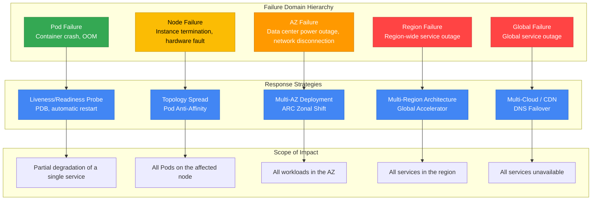
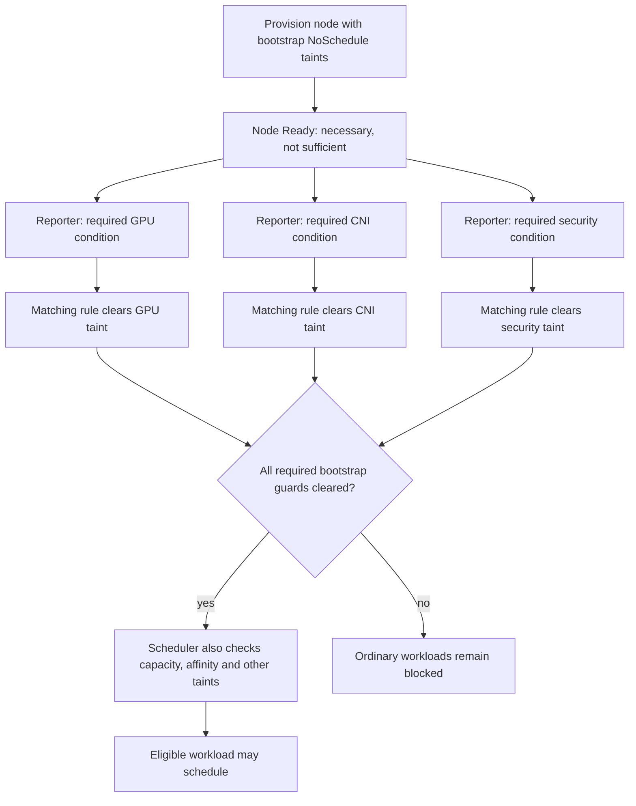
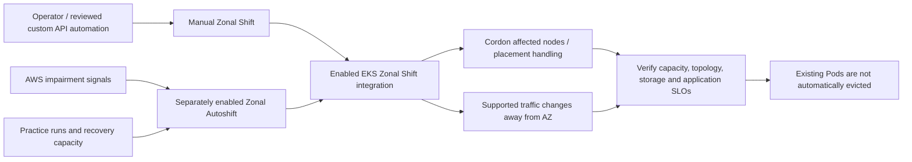
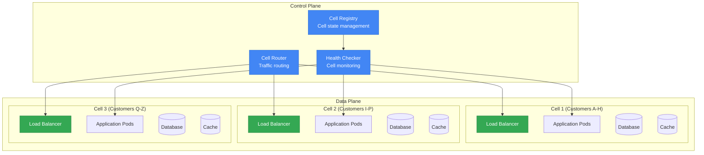
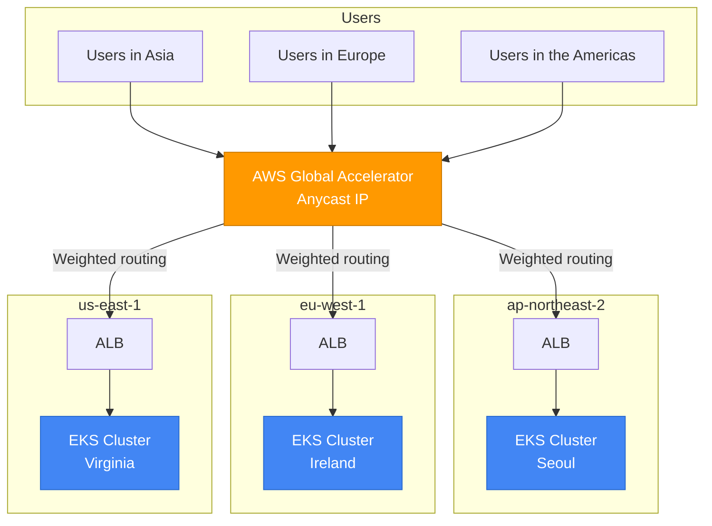
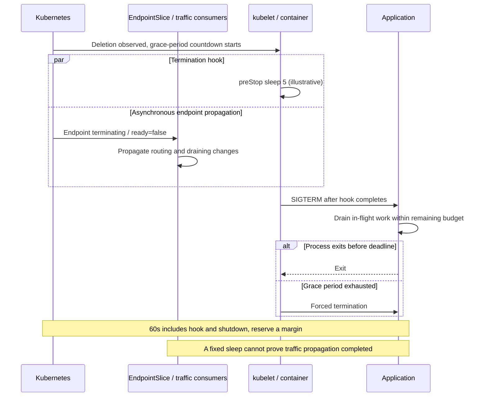

> **📌 Reference Environment**: EKS 1.33+, Karpenter v1.x, Istio 1.22+

## 1. Overview

Resiliency is the ability to maintain service and recover when components fail. A single Pod termination and the loss of an entire Availability Zone require different responses. This guide explains how to design EKS placement, traffic handling and data recovery for each failure scope.

### Failure Domain Hierarchy



### Resiliency Maturity Model

An organization's resiliency can be classified into 4 levels, enabling gradual improvement from its current level.

| Level | Stage | Core Capabilities | Implementation Items | Complexity | Cost Impact |
|-------|------|-----------|-----------|--------|-----------|
| **1** | Basic | Pod-level resiliency | Probe configuration, PDB, Graceful Shutdown, resource Limits | Low | Minimal |
| **2** | Multi-AZ | AZ fault tolerance | Topology Spread, Multi-AZ NodePool, ARC Zonal Shift | Medium | Cross-AZ traffic costs |
| **3** | Cell-Based | Blast radius isolation | Cell Architecture, Shuffle Sharding, independent deployments | High | Per-cell overhead |
| **4** | Multi-Region | Region fault tolerance | Active-Active architecture, Global Accelerator, data replication | Very high | Per-region infrastructure costs |

:::info Troubleshooting and Incident Response Guide
For diagnosing and resolving operational incidents, refer to the [EKS Troubleshooting and Incident Response Guide](eks-debugging/index.md). This document focuses on failure **prevention** and **design**; the troubleshooting and incident response guide covers real-time troubleshooting.
:::

---

## 2. Multi-AZ Strategy

Multi-AZ deployment is a foundational and powerful strategy for EKS resiliency. It distributes workloads across multiple Availability Zones so that a single AZ failure does not interrupt the entire service.

### Pod Topology Spread Constraints

Topology Spread Constraints compare matching Pods in the same namespace across eligible topology domains. `minDomains` (K8s 1.24 alpha → 1.30 GA) controls the global minimum used for a hard constraint: when fewer eligible domains exist, that minimum becomes zero. It does not create capacity or guarantee placement in that many AZs.

| Parameter | Description | Recommended Value |
|----------|------|--------|
| `maxSkew` | Hard: allowed difference from the global minimum; soft: scoring preference | Example: AZ 1, hostname 2 |
| `topologyKey` | Label used to distribute Pods | `topology.kubernetes.io/zone` |
| `whenUnsatisfiable` | Behavior when the constraint cannot be satisfied | `DoNotSchedule` (hard) or `ScheduleAnyway` (soft) |
| `minDomains` | Threshold for the hard constraint's global-minimum calculation | Omit for this reduced-zone example; omission behaves as 1 |
| `labelSelector` | Counts matching Pods in this Pod's namespace | Match the intended workload labels |

**Combined Hard + Soft Strategy** (recommended):

Illustrative manifest, not ready to deploy: replace the image and supply the application's resources and health checks. The reserved `.invalid` image deliberately prevents treating this as a tested deployment.

```yaml
apiVersion: apps/v1
kind: Deployment
metadata:
  name: critical-app
spec:
  replicas: 6
  selector:
    matchLabels:
      app: critical-app
  template:
    metadata:
      labels:
        app: critical-app
    spec:
      topologySpreadConstraints:
      # Hard: limit skew among eligible zones
      - maxSkew: 1
        topologyKey: topology.kubernetes.io/zone
        whenUnsatisfiable: DoNotSchedule
        labelSelector:
          matchLabels:
            app: critical-app
      # Soft: Distribution across nodes (best effort)
      - maxSkew: 2
        topologyKey: kubernetes.io/hostname
        whenUnsatisfiable: ScheduleAnyway
        labelSelector:
          matchLabels:
            app: critical-app
      containers:
      - name: app
        image: example.invalid/critical-app:replace-me
```

:::tip maxSkew Configuration Tip
With six matching Pods and three equally eligible, sufficiently provisioned AZs, a balanced placement can be 2/2/2. This is conditional, not an availability guarantee. Omitting `minDomains: 3` removes that specific reduced-domain blocker, but cordoned or unusable nodes can still affect domain counting through affinity, taints and inclusion policies. Test the intended EKS version, two-zone spare capacity and both hard constraints and soft preferences during recovery.
:::

### AZ-Aware Karpenter Configuration

Karpenter's `karpenter.sh/v1` NodePool API declares allowed AZs, capacity types and disruption budgets. Requirements allow offerings; they do not reserve capacity, ensure an AZ distribution or set a Spot/On-Demand ratio. The referenced `EC2NodeClass/multi-az` must already select compatible subnets, security groups, AMIs and node identity.

```yaml
apiVersion: karpenter.sh/v1
kind: NodePool
metadata:
  name: multi-az-pool
spec:
  disruption:
    consolidationPolicy: WhenEmptyOrUnderutilized
    consolidateAfter: 5m
    # Allowed voluntary disruptions: ceil(nodes * 0.20) - deleting - NotReady
    budgets:
    - nodes: "20%"
    # Optional additional budget: Monday-Friday 09:00-17:00 UTC
    # - nodes: "10%"
    #   schedule: "0 9 * * MON-FRI"
    #   duration: 8h
  template:
    spec:
      requirements:
      # Allowed zones, not a guaranteed distribution
      - key: topology.kubernetes.io/zone
        operator: In
        values: ["us-east-1a", "us-east-1b", "us-east-1c"]
      # Allowed capacity types, not a guaranteed mixing ratio
      - key: karpenter.sh/capacity-type
        operator: In
        values: ["on-demand", "spot"]
      - key: node.kubernetes.io/instance-type
        operator: In
        values:
          - c6i.xlarge
          - c6i.2xlarge
          - c6i.4xlarge
          - c7i.xlarge
          - c7i.2xlarge
          - c7i.4xlarge
          - m6i.xlarge
          - m6i.2xlarge
      nodeClassRef:
        group: karpenter.k8s.aws
        kind: EC2NodeClass
        name: multi-az
  limits:
    cpu: "1000"
    memory: 2000Gi
```

:::warning Spot Instances and Multi-AZ
Spot pools vary by instance type and AZ; the eight types above are illustrative. Choose compatible diversity and interruption-tolerant workloads, then validate available capacity. An On-Demand baseline needs a separate capacity policy; merely allowing both types does not establish it. For disruption budgets, percentage rounding is upward (19 × 20% permits 4 before subtracting deleting/NotReady nodes), and the most restrictive applicable active budget wins. These budgets constrain supported voluntary disruptions, not every interruption or expiration. The optional schedule above is UTC.
:::

### Safe Workload Placement with Node Readiness

When a new node is provisioned in a Multi-AZ environment, it may not be fully prepared to host workloads even after it enters the `Ready` state. Kubernetes readiness mechanisms help prevent workloads from being placed prematurely.

#### Node Readiness Controller (Announced in February 2026)

[Node Readiness Controller](https://github.com/kubernetes-sigs/node-readiness-controller) is a separately installed controller, not an EKS built-in readiness guarantee. Pin its controller and CRD together (this example uses v0.1.1 semantics). Pre-register the matching bootstrap `NoSchedule` taints before ordinary workloads can schedule, and provide trusted reporters for each required Node condition. Installing a GPU/CNI/CSI/security component does not automatically publish those custom conditions. Rules, node selection and required-condition statuses must match the pinned CRD; do not copy newer `main` fields into v0.1.1.



**Resiliency Benefits:**

- **AZ recovery**: block ordinary workloads while the configured replacement-node prerequisites remain unsatisfied.
- **Scale-out**: bootstrap taints close the registration race only when installed before scheduling; broad workload tolerations can bypass them.
- **GPU/ML workloads**: a trustworthy driver-readiness condition reduces driver-startup races. It does not prevent unrelated `CrashLoopBackOff` or prove application readiness.

#### Pod Scheduling Readiness (K8s 1.30 GA)

`schedulingGates` controls scheduling timing from the Pod side. An external system verifies readiness, then removes the gates to allow scheduling:

```yaml
apiVersion: v1
kind: Pod
metadata:
  name: validated-pod
spec:
  schedulingGates:
    - name: "example.com/capacity-validation"
    - name: "example.com/security-clearance"
  containers:
    - name: app
      image: app:latest
      resources:
        requests:
          cpu: "4"
          memory: "8Gi"
```

**Use Cases:**

- Allow scheduling after resource quota prevalidation
- Allow scheduling after security approval
- Allow scheduling after custom admission checks pass

#### Pod Readiness Gates (AWS LB Controller)

AWS Load Balancer Controller Pod Readiness Gates can reduce the gap between Kubernetes readiness and target-group registration during rolling updates. For the v2.14 controller reference, injection requires IP targets, a matching Service and TargetGroupBinding already present when the Pod is created, namespace opt-in, and a functioning admission webhook:

```yaml
apiVersion: v1
kind: Namespace
metadata:
  name: production
  labels:
    elbv2.k8s.aws/pod-readiness-gate-inject: enabled  # Enable automatic injection
```

Check that new Pods actually contain the injected readiness gate and that its target-health condition becomes True. A namespace label alone does not retrofit existing Pods. The following rollout strategy retains available replicas while a surge Pod becomes ready, provided spare capacity exists; application draining and LB deregistration still need validation, so zero downtime is not guaranteed.

```yaml
# Merge into the existing Deployment.spec; not a standalone object.
strategy:
  type: RollingUpdate
  rollingUpdate:
    maxUnavailable: 0
    maxSurge: 1
```

:::tip Readiness Feature Selection Guide

| Requirement | Recommended Feature | Level |
|----------|-----------|-----------|
| Configured node prerequisites before placement | Node Readiness Controller plus reporters/bootstrap taints | Node |
| External validation before Pod scheduling | Pod Scheduling Readiness | Pod |
| Include LB target health in Pod readiness | Pod Readiness Gates | Pod |
| Report GPU/special-hardware readiness | Node Readiness Controller plus component reporter | Node |
| Reduce rollout target-registration races | Pod Readiness Gates plus rollout/drain settings | Pod |
:::

### AZ Avoidance Deployment Strategy (ARC Zonal Shift)

AWS Application Recovery Controller (ARC) Zonal Shift supports operator/API-requested traffic and placement changes away from one AZ. EKS has supported the integration since November 2024. Zonal Autoshift is separately enabled AWS-managed automation with practice-run prerequisites; a custom Health/EventBridge/Lambda workflow is another implementation, not an automatically installed EKS feature. EKS Zonal Shift cordons affected nodes and adjusts supported traffic handling; it does not itself evict existing Pods or terminate nodes.



**ARC Zonal Shift activation and use:**

Illustrative manual-shift template for an already enabled cluster. Enable EKS zonal shift in a separate reviewed configuration change and wait for completion first. Record the returned shift ID, expiry and cancellation owner; cancelling a shift is not proof that application recovery succeeded.

```bash
# Required: reviewed account/profile/region, enabled cluster, evacuation capacity.
set -euo pipefail
: "${AWS_PROFILE:?}" "${AWS_REGION:?}" "${EXPECTED_ACCOUNT_ID:?}"
: "${CLUSTER_NAME:?}" "${IMPAIRED_AZ:?}"
aws_scoped=(aws --profile "$AWS_PROFILE" --region "$AWS_REGION" --no-cli-pager)
actual_account=$("${aws_scoped[@]}" sts get-caller-identity --query Account --output text)
[[ "$actual_account" == "$EXPECTED_ACCOUNT_ID" ]] || exit 1
cluster_arn=$("${aws_scoped[@]}" eks describe-cluster --name "$CLUSTER_NAME" --query cluster.arn --output text)
enabled=$("${aws_scoped[@]}" eks describe-cluster --name "$CLUSTER_NAME" --query cluster.zonalShiftConfig.enabled --output text)
[[ "$enabled" == "True" ]] || exit 1
# Review the AZ against this cluster's subnet inventory before this write.
# APPROVED_AZ must name the exact AZ approved in the runbook.
[[ "${APPROVED_AZ:-}" == "$IMPAIRED_AZ" ]] || exit 1
shift_id=$("${aws_scoped[@]}" arc-zonal-shift start-zonal-shift \
  --resource-identifier "$cluster_arn" --away-from "$IMPAIRED_AZ" \
  --expires-in 3h --comment "Approved manual zonal evacuation drill" \
  --query zonalShiftId --output text)
printf 'Record zonalShiftId=%s; expiry=3h; verify application recovery separately.\n' "$shift_id"
"${aws_scoped[@]}" arc-zonal-shift list-zonal-shifts --resource-identifier "$cluster_arn"
# Authorized early recovery uses cancel-zonal-shift with the recorded shift ID.
```

:::info Zonal Shift Limitations
The maximum duration of a Zonal Shift is **3 days**, and it can be extended if necessary. When Zonal Autoshift is enabled, AWS detects AZ-level failures and automatically shifts traffic.
:::

**Emergency AZ evacuation: one-node drain template**

Manual eviction is separate from native Zonal Shift. Before using this template, bind `KUBE_CONTEXT` to the verified cluster endpoint, select an explicit node allowlist, inspect all namespaces on each node and confirm surviving-zone capacity, PDBs, volume constraints and application recovery criteria. Do not expand it into an unchecked loop over an AZ. Bash, jq and compatible kubectl are prerequisites; this example has not been run.

```bash
#!/usr/bin/env bash
# One explicitly approved node; inspection is the default.
set -euo pipefail
: "${KUBE_CONTEXT:?}" "${NODE:?}" "${EXPECTED_AZ:?}"
k=(kubectl --context "$KUBE_CONTEXT")
node_json=$("${k[@]}" get node "$NODE" -o json)
actual_az=$(jq -er '.metadata.labels["topology.kubernetes.io/zone"]' <<<"$node_json")
[[ "$actual_az" == "$EXPECTED_AZ" ]] || exit 1
was_cordoned=$(jq -r '.spec.unschedulable // false' <<<"$node_json")
printf 'Context=%s Node=%s AZ=%s previouslyCordoned=%s\n' \
  "$KUBE_CONTEXT" "$NODE" "$actual_az" "$was_cordoned"
# Node drain affects Pods across namespaces. Save this complete inventory.
"${k[@]}" get pods --all-namespaces --field-selector "spec.nodeName=$NODE" -o json
"${k[@]}" get pdb --all-namespaces -o json
if [[ "${DRAIN_APPROVED:-}" != "$NODE" ]]; then
  printf 'Inspection only. Review owners, PDBs, local data and replacement capacity.\n'
  exit 0
fi
# Uses Eviction API, honors Pod grace periods; refuses emptyDir deletion by default.
# 15m is an observation limit, not a recovery guarantee. A failure leaves state to inspect.
"${k[@]}" drain "$NODE" --ignore-daemonsets --timeout=15m
"${k[@]}" get pods --all-namespaces --field-selector "spec.nodeName=$NODE" -o json
printf 'Drain command returned. Verify replacement Pods, traffic and data separately.\n'
```

On failure, stop and retain the node's previous cordon state and command output. Do not bypass a PDB or discard `emptyDir` data to make the command succeed. Recovery may uncordon only an explicitly identified node that this change cordoned, after health/capacity checks and coordination with other operators; never uncordon a node that was already cordoned. DaemonSet, mirror and completed Pods require owner-aware interpretation of the remaining inventory. A successful drain is not an application availability measurement.

### Handling EBS AZ-Pinning

EBS volumes are pinned to a specific AZ. If that AZ fails, Pods using those volumes cannot move to another AZ.

**WaitForFirstConsumer StorageClass** (recommended):

```yaml
apiVersion: storage.k8s.io/v1
kind: StorageClass
metadata:
  name: topology-aware-ebs
provisioner: ebs.csi.aws.com
parameters:
  type: gp3
  encrypted: "true"
volumeBindingMode: WaitForFirstConsumer
allowVolumeExpansion: true
```

`WaitForFirstConsumer` delays binding/provisioning until a consuming Pod's scheduling requirements are available, so initial EBS placement can align with the selected topology. The resulting volume remains confined to its AZ; cross-AZ recovery requires a separate data recovery or replication design.

**EFS Cross-AZ alternative**: EFS Regional stores data across multiple AZs; EFS One Zone stores data in one AZ and is exposed to loss of that AZ. For a Regional recovery design, configure reachable mount targets in the surviving AZs, security groups, DNS and client/application retry behavior. Choosing EFS alone does not prove continuous access during a fault.

| Storage | AZ Dependency | Failure Behavior | Suitable Workloads |
|----------|-----------|-------------|----------------|
| EBS (gp3) | Pinned to a single AZ | Inaccessible during an AZ failure | Databases, stateful applications |
| EFS Regional / One Zone | Multi-AZ storage / single-AZ storage | Regional recovery depends on mount/network/client design; One Zone remains AZ-dependent | Shared files, CMS, logs |
| Instance Store | Node-dependent | Data lost on node termination | Temporary caches, scratch space |

### Cross-AZ Cost Optimization

Cross-AZ transfer can be a material Multi-AZ cost. Rates depend on the specific AWS service, region, direction and exemptions; a single `$0.01/GB` rule does not apply to every path. Price the actual billed source/destination path using current public service pricing and measured bytes.

**Istio Locality-Aware Routing** can minimize Cross-AZ traffic:

```yaml
apiVersion: networking.istio.io/v1
kind: DestinationRule
metadata:
  name: locality-aware-routing
spec:
  host: backend-service
  trafficPolicy:
    connectionPool:
      http:
        http2MaxRequests: 1000
    outlierDetection:
      consecutive5xxErrors: 5
      interval: 10s
      baseEjectionTime: 30s
    loadBalancer:
      localityLbSetting:
        enabled: true
        # Illustrative locality weights; health/capacity can change observed routing
        distribute:
        - from: "us-east-1/us-east-1a/*"
          to:
            "us-east-1/us-east-1a/*": 80
            "us-east-1/us-east-1b/*": 10
            "us-east-1/us-east-1c/*": 10
        - from: "us-east-1/us-east-1b/*"
          to:
            "us-east-1/us-east-1b/*": 80
            "us-east-1/us-east-1a/*": 10
            "us-east-1/us-east-1c/*": 10
        - from: "us-east-1/us-east-1c/*"
          to:
            "us-east-1/us-east-1c/*": 80
            "us-east-1/us-east-1a/*": 10
            "us-east-1/us-east-1b/*": 10
```

:::tip Cross-AZ Cost Savings
Each of the three source-locality rules totals 100. With populated, healthy localities the example expresses an 80/10/10 preference, not a measured byte split or savings percentage. Verify source locality labels, endpoint health, request/response sizes and actual billed transfer. No monthly savings measurement is supplied here.
:::

---

## 3. Cell-Based Architecture

Cell-Based Architecture is an advanced resiliency pattern recommended by the AWS Well-Architected Framework. It divides a system into independent cells to isolate the scope of failure impact, or blast radius.

### Cell Concepts and Design Principles

A cell is a service unit designed to operate independently. Limiting cross-cell dependencies reduces fault propagation, but shared routing, identity, networks, deployments or data services can still cause correlated failures. Validate those boundaries rather than assuming every cell failure is isolated.



**Core Cell Design Principles:**

1. **Independence**: Each cell has its own data store, cache, and queue
2. **Isolation**: Cells do not communicate directly; coordination occurs only through the control plane
3. **Homogeneity**: All cells run the same code and configuration
4. **Scalability**: As demand grows, add new cells instead of expanding existing cells

### Implementing Cells in EKS

| Implementation Approach | Namespace-Based Cell | Cluster-Based Cell |
|-----------|-------------------|------------------|
| **Isolation level** | Namespace/API boundary within one cluster | Separate cluster control planes; infrastructure boundaries depend on design |
| **Resource isolation** | ResourceQuota, LimitRange; shared nodes unless separately placed | Independently provisioned cluster capacity; shared dependencies still matter |
| **Network isolation** | NetworkPolicy with a supporting/enforcing network implementation | Explicit VPC/subnet/routing/security design |
| **Blast radius** | Shared control plane and nodes can affect multiple cells | Reduced cluster-level coupling; shared account/region/data risks remain |
| **Operational complexity** | Lower (single cluster) | Higher (multiple clusters) |
| **Cost** | Shared cluster resources | Additional control planes and capacity, depending on design |
| **Suitable environments** | Small/medium or internal services with acceptable shared risks | Workloads requiring stronger verified boundaries; compliance is a separate assessment |

**Namespace-Based Cell Implementation Example:**

```yaml
# Cell-1 Namespace and ResourceQuota
apiVersion: v1
kind: Namespace
metadata:
  name: cell-1
  labels:
    cell-id: "cell-1"
    partition: "customers-a-h"
---
apiVersion: v1
kind: ResourceQuota
metadata:
  name: cell-1-quota
  namespace: cell-1
spec:
  hard:
    requests.cpu: "20"
    requests.memory: 40Gi
    limits.cpu: "40"
    limits.memory: 80Gi
    pods: "100"
---
# Cell-aware Deployment
apiVersion: apps/v1
kind: Deployment
metadata:
  name: api-server
  namespace: cell-1
  labels:
    cell-id: "cell-1"
spec:
  replicas: 4
  selector:
    matchLabels:
      app: api-server
      cell-id: "cell-1"
  template:
    metadata:
      labels:
        app: api-server
        cell-id: "cell-1"
    spec:
      topologySpreadConstraints:
      - maxSkew: 1
        topologyKey: topology.kubernetes.io/zone
        whenUnsatisfiable: DoNotSchedule
        labelSelector:
          matchLabels:
            app: api-server
            cell-id: "cell-1"
      containers:
      - name: api-server
        image: myapp/api-server:v2.1
        env:
        - name: CELL_ID
          value: "cell-1"
        - name: PARTITION_RANGE
          value: "A-H"
        resources:
          requests:
            cpu: "500m"
            memory: 1Gi
          limits:
            cpu: "1"
            memory: 2Gi
```

### Cell Router Implementation

The Cell Router is the core component that routes incoming requests to the appropriate cell. There are three implementation approaches.

**1. Route 53 ARC Routing Control:**

Controls cell routing at the DNS level. Configure health checks and routing controls for each cell to block traffic at the DNS level when a cell fails.

**2. ALB Target Groups:**

ALB weighted target groups distribute traffic among cells, while header rules can implement tenant-to-cell routing. An empty or unhealthy weighted target group does not automatically fail over to another weighted group. The router/control workflow must explicitly handle health, capacity and the tenant's available data.

**3. Service Mesh (Istio):**

Implements cell routing through header-based routing in Istio VirtualService. This is the most flexible approach, but it adds the operational complexity of Istio.

### Blast Radius Isolation Strategies

| Strategy | Description | Isolation Boundary | Use Case |
|------|------|-----------|-----------|
| **Customer Partitioning** | Cell assignment based on a customer ID hash | Customer group | SaaS platforms |
| **Geographic** | Cell assignment based on geographic location | Region/country | Global services |
| **Capacity-Based** | Dynamic assignment based on cell capacity | Available resources | Services with highly variable traffic |
| **Tier-Based** | Cell assignment based on customer tier | Service level | Premium/standard separation |

### Shuffle Sharding Pattern

Shuffle Sharding assigns each customer (or tenant) to a small number of randomly selected cells from the full cell pool. This limits the impact of a single cell failure to a small subset of customers.

**Principle**: assigning two of eight cells gives C(8,2) = 28 possible pairs. The ConfigMap below stores illustrative assignments only; Kubernetes does not interpret it as a failover policy. A router must use a stable tenant mapping, detect unhealthy cells, check alternate capacity and data availability, bound retries and prevent duplicate non-idempotent operations. Failover behavior and the fraction of affected tenants remain unverified without that implementation and a measured fault test.

```yaml
# Shuffle Sharding ConfigMap example
apiVersion: v1
kind: ConfigMap
metadata:
  name: shuffle-sharding-config
data:
  sharding-config.yaml: |
    totalCells: 8
    shardsPerTenant: 2
    tenantAssignments:
      tenant-acme:
        cells: ["cell-1", "cell-5"]
        primary: "cell-1"
      tenant-globex:
        cells: ["cell-3", "cell-7"]
        primary: "cell-3"
      tenant-initech:
        cells: ["cell-2", "cell-6"]
        primary: "cell-2"
```

:::warning Cell Architecture Trade-offs
Cell Architecture provides strong isolation, but increases operational complexity and cost. Because each cell has an independent data store, data migration, cross-cell queries, and consistency between cells require additional design. Consider adoption first for services that require an SLA of 99.99% or higher.
:::

---

## 4. Multi-Cluster / Multi-Region

Multi-Cluster and Multi-Region strategies prepare for region-level failures.

### Architecture Pattern Comparison

| Pattern | Description | RTO dependency | RPO dependency | Cost / complexity | Suitable environments |
|------|------|------|------|------|------|
| **Active-Active** | Multiple regions serve traffic | Detection, routing and surviving capacity; not inherently zero | Replication lag and conflict/data-loss policy; not inherently zero | Usually more operating components; workload-dependent | Global serving with tested recovery targets |
| **Active-Passive** | One region serves, another waits | Standby capacity, promotion, restore and routing | Replication/checkpoint lag or backup age | Depends on cold/warm/hot standby | Applications with a defined standby strategy |
| **Regional Isolation** | Independent regional service/data boundaries | Region-specific recovery design | Region-specific data protection | Depends on duplication and independence | Regional autonomy or data residency requirements |
| **Hub-Spoke** | Central management of serving clusters | Management topology alone defines no RTO | Management topology alone defines no RPO | Depends on management and data architecture | Central operations with separately designed recovery |

These are design dependencies, not measured recovery values. Set explicit RTO/RPO targets and validate failure detection, application correctness, data loss and sustained recovery under the intended load.

### Global Accelerator + EKS

AWS Global Accelerator routes new connections using client location, endpoint health and configured endpoint weights/traffic dials. The chosen endpoint need not be in the geographically nearest region. Existing connections and application/data recovery have separate behavior; endpoint health alone does not prove data correctness.



### ArgoCD Multi-Cluster GitOps

Use an ArgoCD ApplicationSet Generator to automate consistent deployments across multiple clusters.

```yaml
apiVersion: argoproj.io/v1alpha1
kind: ApplicationSet
metadata:
  name: multi-cluster-app
  namespace: argocd
spec:
  generators:
  # Dynamic deployments based on cluster labels
  - clusters:
      selector:
        matchLabels:
          environment: production
          resiliency-tier: "high"
  template:
    metadata:
      name: 'myapp-{{name}}'
    spec:
      project: default
      source:
        repoURL: https://github.com/myorg/k8s-manifests.git
        targetRevision: main
        path: 'overlays/{{metadata.labels.region}}'
      destination:
        server: '{{server}}'
        namespace: production
      syncPolicy:
        automated:
          prune: true
          selfHeal: true
        syncOptions:
        - CreateNamespace=true
        retry:
          limit: 5
          backoff:
            duration: 5s
            factor: 2
            maxDuration: 3m
```

### Istio Multi-Cluster Federation

An Istio Multi-Primary configuration runs an independent Istio control plane in each cluster while providing cross-cluster service discovery and load balancing.

```yaml
# Istio Locality-Aware routing (Multi-Region)
apiVersion: networking.istio.io/v1
kind: DestinationRule
metadata:
  name: multi-region-routing
spec:
  host: backend-service
  trafficPolicy:
    loadBalancer:
      localityLbSetting:
        enabled: true
        # Prefer the same region; fail over to another region on failure
        failover:
        - from: us-east-1
          to: eu-west-1
        - from: eu-west-1
          to: us-east-1
        - from: ap-northeast-2
          to: ap-southeast-1
    outlierDetection:
      consecutive5xxErrors: 3
      interval: 10s
      baseEjectionTime: 30s
      maxEjectionPercent: 50
```

:::info Istio API Version Reference
Istio 1.22+ supports both `networking.istio.io/v1` and `networking.istio.io/v1beta1`. Use `v1` for new deployments; existing `v1beta1` configurations remain valid.
:::

---

## 5. Application Resiliency Patterns

Application-level fault tolerance patterns must be implemented alongside infrastructure-level resiliency.

### PodDisruptionBudgets (PDB)

A PDB constrains requests that exceed the disruption budget during voluntary disruptions that use the Eviction API. This includes the default `kubectl drain` path and node upgrades or consolidation that use that API. PDBs do not constrain Deployment or StatefulSet rolling updates or direct Pod deletion.

| Setting | Behavior | Suitable Situations |
|------|------|------------|
| `minAvailable: 2` | Evaluate eviction admission against a minimum of 2 healthy Pods | Node drains for services with a small replica count (3-5) |
| `minAvailable: "50%"` | Check that at least 50% of desired replicas remain healthy | Eviction budgets for services with a large replica count |
| `maxUnavailable: 1` | Constrain evictions against a maximum of 1 unavailable Pod, including Pods already unavailable | Limit concurrent disruption during node maintenance |
| `maxUnavailable: "25%"` | Constrain evictions against a 25% threshold, including Pods already unavailable | Eviction API-based node replacement or scale-down |

Pods made unavailable by rollouts or failures count against the PDB budget, but the PDB cannot prevent those disruptions themselves. Manage rolling-update availability through workload controller settings, such as a Deployment's `maxUnavailable` and `maxSurge`, together with readiness. See the [Kubernetes PDB scope](https://kubernetes.io/docs/concepts/workloads/pods/disruptions/#pod-disruption-budgets) and [Deployment strategy](https://kubernetes.io/docs/concepts/workloads/controllers/deployment/#strategy).

```yaml
apiVersion: policy/v1
kind: PodDisruptionBudget
metadata:
  name: api-pdb
spec:
  minAvailable: 2
  selector:
    matchLabels:
      app: api-server
---
# Percentage-based PDB suitable for large Deployments
apiVersion: policy/v1
kind: PodDisruptionBudget
metadata:
  name: worker-pdb
spec:
  maxUnavailable: "25%"
  selector:
    matchLabels:
      app: worker
```

:::warning PDB and Karpenter Interaction
Karpenter disruption budgets (`budgets: - nodes: "20%"`) and PDBs work together. Karpenter respects PDBs during node consolidation. An overly strict PDB, such as minAvailable equal to the replica count, can permanently block node draining.
:::

### Graceful Shutdown

Graceful Shutdown aims to complete in-flight work during termination. The complete Deployment structure below uses matching selector/template labels; an existing Deployment's immutable selector must be preserved when adapting it. The application-specific image must implement `/ready`, handle SIGTERM, and include the shell/sleep used by this illustrative hook.

```yaml
apiVersion: apps/v1
kind: Deployment
metadata:
  name: web-server
spec:
  selector:
    matchLabels:
      app: web-server
  template:
    metadata:
      labels:
        app: web-server
    spec:
      terminationGracePeriodSeconds: 60
      containers:
      - name: web
        image: myapp/web:v2.0
        ports:
        - containerPort: 8080
        lifecycle:
          preStop:
            exec:
              # Illustrative delay, not proof that all traffic has drained.
              # The Pod grace-period clock includes preStop execution.
              command: ["/bin/sh", "-c", "sleep 5"]
        readinessProbe:
          httpGet:
            path: /ready
            port: 8080
          periodSeconds: 5
          failureThreshold: 1
```

**Graceful Shutdown Timing Design:**



:::tip Why preStop sleep Is Needed
The hook and EndpointSlice/traffic updates are asynchronous. A five-second sleep is only a tunable delay; existing connections and slow propagation can outlast it. Measure deregistration and in-flight request durations, then budget the hook plus application drain and a margin inside the 60-second grace period. Do not promise exactly 55 seconds of application shutdown or zero lost requests.
:::

### Circuit Breaker (Istio DestinationRule)

A Circuit Breaker blocks requests to a failing service to prevent cascading failures. It is implemented using an Istio DestinationRule.

```yaml
# Istio 1.22+: Both v1 and v1beta1 are supported
apiVersion: networking.istio.io/v1
kind: DestinationRule
metadata:
  name: backend-circuit-breaker
spec:
  host: backend-service
  trafficPolicy:
    connectionPool:
      tcp:
        maxConnections: 100
        connectTimeout: 5s
      http:
        http1MaxPendingRequests: 50
        http2MaxRequests: 100
        maxRequestsPerConnection: 10
        # Maximum outstanding concurrent retries, not retries per request.
        maxRetries: 3
    outlierDetection:
      # Eject an instance from the pool after 5 consecutive 5xx errors
      consecutive5xxErrors: 5
      # Passive outlier-analysis interval, not an active health-check probe
      interval: 30s
      # Minimum isolation time for an ejected instance
      baseEjectionTime: 30s
      # Allow ejection of up to 50% of all instances
      maxEjectionPercent: 50
```

### Retry / Timeout (Istio VirtualService)

```yaml
apiVersion: networking.istio.io/v1
kind: VirtualService
metadata:
  name: backend-retry
spec:
  hosts:
  - backend-service
  http:
  - route:
    - destination:
        host: backend-service
    timeout: 10s
    retries:
      attempts: 3
      perTryTimeout: 3s
      retryOn: "5xx,reset,connect-failure,retriable-4xx"
      retryRemoteLocalities: true
```

**Retry Best Practices:**

| Setting | Example / interpretation | Reason |
|------|------|------|
| `attempts` | 3 additional retries, up to 4 total attempts | Retry load includes the initial attempt |
| `perTryTimeout` | 3s inside the 10s overall timeout | Four full 3s attempts plus backoff do not fit; the overall deadline limits execution |
| `retryOn` | Selected transient failures, with idempotency/duplicate handling | A retriable status alone does not make a business operation safe to repeat |
| `retryRemoteLocalities` | `true` permits eligible remote localities | Requires discovery, health and data/capacity readiness there |

The example specifies upper bounds, not a promise to execute all three retries. Budget initial work, retry delays and backoff together.

:::warning Rate Limiting Adoption Considerations
Rate Limiting is a core resiliency measure alongside Circuit Breakers and retries, but incorrect configuration can block legitimate traffic. Implement it using an Istio EnvoyFilter or an external rate limiter, such as one backed by Redis, and **always introduce it gradually**. The recommended progression is monitoring mode → warning mode → blocking mode.
:::

### Resiliency Considerations for EKS Auto Mode

EKS Auto Mode automates infrastructure management, but its characteristics must be considered when designing for resiliency.

| Item | Auto Mode Characteristics | Resiliency Impact | Recommended Response |
|------|---------------|---------------|---------|
| **Node replacement** | Managed updates and node lifecycle | Workloads may move; voluntary disruption controls have limits | PDB plus measured shutdown budget; no universal 90-second minimum |
| **Instance diversity** | Built-in general-purpose: amd64 On-Demand; system: amd64/arm64 On-Demand | Custom pools and compatible images are needed for other choices | Explicitly configure capacity types/architectures and measure startup time |
| **Spot interruption** | Spot requires a custom NodePool; replacement capacity is conditional | Notices are best effort, usually two minutes; hibernation is an exception | Design checkpoint/recovery and drain for the actual interruption mode |
| **AZ distribution** | Provisioning follows requirements and available offerings | AZ allowance alone does not ensure workload distribution | Define topology constraints and validate surviving-zone capacity |

:::tip Auto Mode + Resiliency Checklist
In Auto Mode environments, distinguish **infrastructure-level automation** from **application-level resiliency**:
- **Auto Mode manages**: node provisioning, managed OS lifecycle and instance selection within configured requirements; it does not promise a Spot/On-Demand ratio or unlimited fallback capacity.
- **User responsibilities**: PDB, Topology Spread, Graceful Shutdown, Probe configuration, Circuit Breakers

For detailed Probe and resource configuration in Auto Mode environments, refer to [EKS Pod Health Checks & Lifecycle Management](/docs/eks-best-practices/operations-reliability/eks-pod-health-lifecycle) and the [EKS Pod Resource Optimization Guide](/docs/eks-best-practices/resource-cost/eks-resource-optimization).
:::

---

## 6. Chaos Engineering

Chaos Engineering is a practical methodology for validating system resiliency in production environments. Testing while everything is healthy prepares the system for failures.

### AWS Fault Injection Service (FIS)

AWS FIS is a managed Chaos Engineering service that injects failures into AWS services such as EC2, EKS, and RDS.

**Scenario 1: Pod Deletion (Application Resiliency Test)**

These JSON blocks illustrate `CreateExperimentTemplate` request shapes, not deployable experiments. Replace every example account, region, ARN and token; supply an existing action-scoped FIS role and a tested CloudWatch stop alarm. A fresh idempotency token is needed for each distinct create request; an SDK/CLI may generate it when omitted. No template is created or experiment started here.

For Pod deletion, use standard regional EKS 1.30+ and review the current action requirements, namespace RBAC, experiment-role Kubernetes access, injector image access and admission/security settings. The current FIS documentation requires a writable target root filesystem for monitoring; do not relax a production security policy merely to run this example. `chaos-demo/fis-pod-delete` and at least three explicitly approved matching Pods must exist. Pod targets use parameters, not AWS tags/ARNs. Omitting `gracePeriodSeconds` uses the Pod's grace period; deletion does not use PDB admission.

```json
{
  "clientToken": "00000000-0000-4000-8000-000000000001",
  "description": "Illustrative deletion of three selected EKS Pods",
  "roleArn": "arn:aws:iam::123456789012:role/REPLACE_WITH_REVIEWED_FIS_ROLE",
  "targets": {
    "eks-pods": {
      "resourceType": "aws:eks:pod",
      "selectionMode": "COUNT(3)",
      "parameters": {
        "clusterIdentifier": "arn:aws:eks:us-east-1:123456789012:cluster/REPLACE_WITH_CLUSTER",
        "namespace": "chaos-demo",
        "selectorType": "labelSelector",
        "selectorValue": "chaos-scope=critical-api-approved"
      }
    }
  },
  "actions": {
    "terminate-pods": {
      "actionId": "aws:eks:pod-delete",
      "parameters": {
        "kubernetesServiceAccount": "fis-pod-delete"
      },
      "targets": {
        "Pods": "eks-pods"
      }
    }
  },
  "stopConditions": [
    {
      "source": "aws:cloudwatch:alarm",
      "value": "arn:aws:cloudwatch:us-east-1:123456789012:alarm:REPLACE_WITH_TESTED_STOP_ALARM"
    }
  ]
}
```

**Scenario 2: Stop selected workers in one AZ**

This tests the loss of the listed worker capacity, not a complete AZ outage: it does not impair every network/service dependency or prevent replacement launches. Replace the example ARN with a reviewed allowlist after verifying cluster ownership, AZ, supported instance state/type, every hosted namespace and local data. `ALL` refers only to that explicit list. FIS does not allow resource ARNs and resource filters on the same target, so verify AZ membership in the preflight inventory rather than adding an AZ filter here.

The ten-minute restart parameter is a fault duration setting, not a measured service RTO. Record the experiment/instance IDs and a recovery owner; stop conditions do not guarantee that already stopped instances, controllers or application state are restored.

```json
{
  "clientToken": "00000000-0000-4000-8000-000000000002",
  "description": "Illustrative stop of an explicitly approved EKS worker instance in one AZ",
  "roleArn": "arn:aws:iam::123456789012:role/REPLACE_WITH_REVIEWED_FIS_ROLE",
  "targets": {
    "approved-worker": {
      "resourceType": "aws:ec2:instance",
      "resourceArns": [
        "arn:aws:ec2:us-east-1:123456789012:instance/i-0123456789abcdef0"
      ],
      "selectionMode": "ALL"
    }
  },
  "actions": {
    "stop-instances": {
      "actionId": "aws:ec2:stop-instances",
      "parameters": {
        "startInstancesAfterDuration": "PT10M"
      },
      "targets": {
        "Instances": "approved-worker"
      }
    }
  },
  "stopConditions": [
    {
      "source": "aws:cloudwatch:alarm",
      "value": "arn:aws:cloudwatch:us-east-1:123456789012:alarm:REPLACE_WITH_TESTED_STOP_ALARM"
    }
  ]
}
```

**Scenario 3: Network Latency Injection**

The target must be an SSM-managed EC2 instance with an appropriate instance profile and a supported OS (the current preconfigured-document support list includes Amazon Linux 2023, Ubuntu, RHEL 8/9 and CentOS 9). Confirm `eth0` is the intended interface and review its full host-level blast radius, including control-plane/SSM connectivity. The network-latency document needs preinstalled `atd`, `dig` and `tc`; `InstallDependencies: "False"` explicitly disables the default dependency installation. Pin and review the SSM document version in the actual experiment.

`DurationSeconds: "300"` controls the injected fault, while `duration: "PT10M"` is an illustrative FIS monitoring window. Setup/cleanup can extend document execution; measure it and choose a suitable window. FIS action completion is not proof of SSM completion or network restoration. Record command IDs, inspect final SSM status and rollback logs, and verify restored connectivity and application SLOs.

```json
{
  "clientToken": "00000000-0000-4000-8000-000000000003",
  "description": "Illustrative network latency on one approved SSM-managed EKS worker",
  "roleArn": "arn:aws:iam::123456789012:role/REPLACE_WITH_REVIEWED_FIS_ROLE",
  "targets": {
    "approved-worker": {
      "resourceType": "aws:ec2:instance",
      "resourceArns": [
        "arn:aws:ec2:us-east-1:123456789012:instance/i-0123456789abcdef0"
      ],
      "selectionMode": "ALL"
    }
  },
  "actions": {
    "inject-latency": {
      "actionId": "aws:ssm:send-command",
      "parameters": {
        "documentArn": "arn:aws:ssm:us-east-1::document/AWSFIS-Run-Network-Latency",
        "documentParameters": "{\"DurationSeconds\":\"300\",\"DelayMilliseconds\":\"200\",\"Interface\":\"eth0\",\"InstallDependencies\":\"False\"}",
        "duration": "PT10M"
      },
      "targets": {
        "Instances": "approved-worker"
      }
    }
  },
  "stopConditions": [
    {
      "source": "aws:cloudwatch:alarm",
      "value": "arn:aws:cloudwatch:us-east-1:123456789012:alarm:REPLACE_WITH_TESTED_STOP_ALARM"
    }
  ]
}
```

### Litmus Chaos on EKS

Litmus is a CNCF incubating project and a Kubernetes-native Chaos Engineering framework.

**Installation:**

```bash
# Install Litmus ChaosCenter
helm repo add litmuschaos https://litmuschaos.github.io/litmus-helm/
helm repo update

helm install litmus litmuschaos/litmus \
  --namespace litmus --create-namespace \
  --set portal.frontend.service.type=LoadBalancer
```

**ChaosEngine example (Pod Delete):**

Illustrative and not runnable from the ChaosCenter Helm install alone. Preserve the consistent `litmuschaos` repository alias above. Before activating this engine, pin compatible chart/controller/CRD/experiment image versions and provide all of the following in the reviewed environment:

- A ChaosExperiment named `pod-delete` in `production`, from the pinned upstream experiment definition.
- A `production/litmus-admin` ServiceAccount and namespace-scoped RBAC for that exact experiment and runner; do not substitute cluster-admin.
- A connected agent/operator watching `production`, approved target labels, any experiment-required annotations, and a measured abort/restore procedure.
- A steady-state probe with tested failure handling (including `stopOnFailure` when supported by the pinned probe version).

`engineState: active` requests execution once reconciled. The Pod percentage and timing below are illustrative; they are not authorization to affect production. A complete runnable deployment cannot be supplied without the missing versioned dependencies and permissions evidence.

```yaml
apiVersion: litmuschaos.io/v1alpha1
kind: ChaosEngine
metadata:
  name: pod-delete-chaos
  namespace: production
spec:
  appinfo:
    appns: production
    applabel: "app=api-server"
    appkind: deployment
  engineState: active
  chaosServiceAccount: litmus-admin
  experiments:
  - name: pod-delete
    spec:
      components:
        env:
        - name: TOTAL_CHAOS_DURATION
          value: "60"
        - name: CHAOS_INTERVAL
          value: "10"
        - name: FORCE
          value: "false"
        - name: PODS_AFFECTED_PERC
          value: "50"
```

### Chaos Mesh

Chaos Mesh is a CNCF incubating project and a Chaos Engineering platform built for Kubernetes that supports a variety of failure types.

**Installation:**

```bash
# Install Chaos Mesh
helm repo add chaos-mesh https://charts.chaos-mesh.org
helm repo update

helm install chaos-mesh chaos-mesh/chaos-mesh \
  --namespace chaos-mesh --create-namespace \
  --set chaosDaemon.runtime=containerd \
  --set chaosDaemon.socketPath=/run/containerd/containerd.sock
```

**NetworkChaos example (network partition through Schedule):**

For Chaos Mesh v2.8.4, recurrence belongs in a `Schedule` CR, not `NetworkChaos.spec.scheduler`. This is a recurring destructive test definition, not an apply-ready deployment: the matching controller/CRDs, containerd socket, cross-namespace watch/authorization, explicit target inventory and an approved abort/cleanup procedure must be verified first. `Forbid` prevents overlapping children of this Schedule; it does not prevent unrelated experiments.

```yaml
apiVersion: chaos-mesh.org/v1alpha1
kind: Schedule
metadata:
  name: network-partition
  namespace: chaos-mesh
spec:
  schedule: "@every 24h"
  historyLimit: 2
  concurrencyPolicy: Forbid
  type: NetworkChaos
  networkChaos:
    action: partition
    mode: all
    selector:
      namespaces:
      - production
      labelSelectors:
        app: frontend
    direction: both
    target:
      selector:
        namespaces:
        - production
        labelSelectors:
          app: backend
      mode: all
    duration: "5m"
```

**PodChaos example (Pod Kill):**

`pod-kill` is a one-shot deletion, not continuous failure for one minute. The example deliberately shows immediate deletion with `gracePeriod: 0`; it can lose in-flight work and bypasses PDB protection. Use it only for an explicitly approved abrupt-loss experiment after target inventory and recovery checks. A graceful-termination test needs a separately chosen, measured grace period. The controller/authorization prerequisites above also apply.

```yaml
apiVersion: chaos-mesh.org/v1alpha1
kind: PodChaos
metadata:
  name: pod-kill-test
  namespace: chaos-mesh
spec:
  action: pod-kill
  mode: fixed-percent
  value: "30"
  selector:
    namespaces:
    - production
    labelSelectors:
      "app": "api-server"
  gracePeriod: 0
```

### Chaos Engineering Tool Comparison

| Feature | AWS FIS | Litmus Chaos | Chaos Mesh |
|------|---------|-------------|------------|
| **Type** | Managed service | Open source (CNCF) | Open source (CNCF) |
| **Scope** | Supported AWS resources and EKS actions | Kubernetes plus supported infrastructure experiments, including AWS | Kubernetes plus supported infrastructure experiments, including AWSChaos |
| **Fault types** | Action-specific EC2, EKS, RDS and network faults | Version-specific Pod, node, network and infrastructure experiments | Version-specific Pod, network, I/O, time, JVM and infrastructure faults |
| **AZ scenarios** | Scenario/action set must model the intended dependencies | Depends on selected experiments and topology | Depends on selected experiments and topology |
| **Dashboard** | AWS Console | Litmus Portal | Chaos Dashboard |
| **Cost** | Action-minute pricing; additional target-account charges can apply | Open-source software plus infrastructure and operations | Open-source software plus infrastructure and operations |
| **Stop condition** | CloudWatch alarm stop conditions; action-specific recovery | Probes and supported stopOnFailure, plus workflow/manual controls | Workflow/manual controls and separately validated observation/abort logic |
| **Operational complexity** | Low | Medium | Medium |
| **GitOps integration** | CloudFormation / CDK | CRD-based (ArgoCD-compatible) | CRD-based (ArgoCD-compatible) |
| **Recommended scenarios** | Infrastructure-level failure testing | K8s-native testing | When fine-grained fault injection is required |

:::tip Tool Selection Guide
Choose tools from the exact fault model, supported version and observable recovery criteria. Combining FIS with Kubernetes-native experiments is one option. A stop condition requests that an experiment stop; it is not a universal rollback transaction. Check each action's cancellation, cleanup and restoration behavior before relying on it.
:::

### Game Day Runbook Template

A Game Day is an exercise in which a team executes planned failure scenarios together to uncover weaknesses in systems and processes.

**5-Phase Game Day Execution Framework:**

```mermaid
flowchart LR
    subgraph "Phase 1: Preparation"
        P1[Form a hypothesis<br/>Example: Automatic recovery from an AZ failure]
        P2[Define success criteria<br/>Example: Recovery within 5 minutes]
        P3[Set stop conditions<br/>CloudWatch Alarm]
    end

    subgraph "Phase 2: Execution"
        E1[Verify steady state<br/>Record current metrics]
        E2[Inject a failure<br/>Start the FIS experiment]
        E3[Observe and record<br/>Real-time monitoring]
    end

    subgraph "Phase 3: Analysis"
        A1[Measure recovery time<br/>Actual RTO]
        A2[Assess data loss<br/>Actual RPO]
        A3[Analyze user impact]
    end

    subgraph "Phase 4: Improvement"
        I1[List identified weaknesses]
        I2[Create improvement tickets]
        I3[Update the runbook]
    end

    subgraph "Phase 5: Iteration"
        R1[Schedule the next Game Day]
        R2[Expand scenarios]
        R3[Expand automation]
    end

    P1 --> P2 --> P3
    P3 --> E1 --> E2 --> E3
    E3 --> A1 --> A2 --> A3
    A3 --> I1 --> I2 --> I3
    I3 --> R1 --> R2 --> R3

    style P1 fill:#4286f4,stroke:#2a6acf,color:#fff
    style E2 fill:#ff4444,stroke:#cc3636,color:#fff
    style A1 fill:#fbbc04,stroke:#c99603,color:#000
    style I1 fill:#34a853,stroke:#2a8642,color:#fff
    style R1 fill:#4286f4,stroke:#2a6acf,color:#fff
```



**Game Day evidence collection and action lifecycle:**

This collector binds the AWS account/region/cluster to the selected kubeconfig endpoint and records complete namespace snapshots. It requires read access, Bash, jq, Python 3, AWS CLI and compatible kubectl; it makes no cluster configuration change and injects no fault. Run it only in the reviewed environment, once before and once after the separately authorized experiment, using different new output directories. Snapshot collection is not atomic; retain both timestamps. Do not publish raw Pod specifications or operational identifiers without review.

```bash
#!/usr/bin/env bash
# Collect one before/after snapshot. No fault is injected by this script.
set -euo pipefail
if [[ $# -ne 8 ]]; then
  printf 'Usage: %s <context> <cluster> <namespace> <profile> <region> <account-id> <phase> <new-output-dir>\n' "$0" >&2
  exit 2
fi
KUBE_CONTEXT=$1 CLUSTER_NAME=$2 NAMESPACE=$3 AWS_PROFILE=$4
AWS_REGION=$5 EXPECTED_ACCOUNT_ID=$6 PHASE=$7 OUT_DIR=$8
for value in "$KUBE_CONTEXT" "$CLUSTER_NAME" "$NAMESPACE" "$AWS_PROFILE" "$AWS_REGION"; do
  [[ -n "$value" && "$value" != -* ]] || exit 2
done
[[ "$EXPECTED_ACCOUNT_ID" =~ ^[0-9]{12}$ ]] || exit 2
[[ "$PHASE" == before || "$PHASE" == after ]] || exit 2
[[ -n "$OUT_DIR" && "$OUT_DIR" != -* && ! -e "$OUT_DIR" ]] || exit 2
command -v jq >/dev/null
command -v python3 >/dev/null
a=(aws --profile "$AWS_PROFILE" --region "$AWS_REGION" --no-cli-pager)
k=(kubectl --context "$KUBE_CONTEXT")
actual_account=$("${a[@]}" sts get-caller-identity --query Account --output text)
[[ "$actual_account" == "$EXPECTED_ACCOUNT_ID" ]] || exit 1
cluster_json=$("${a[@]}" eks describe-cluster --name "$CLUSTER_NAME" --output json)
cluster_arn=$(jq -er '.cluster.arn' <<<"$cluster_json")
[[ "$cluster_arn" == arn:*:eks:"$AWS_REGION":"$EXPECTED_ACCOUNT_ID":cluster/"$CLUSTER_NAME" ]] || exit 1
expected_server=$(jq -er '.cluster.endpoint' <<<"$cluster_json")
actual_server=$("${k[@]}" config view --minify -o jsonpath='{.clusters[0].cluster.server}')
[[ "$actual_server" == "$expected_server" ]] || exit 1
"${k[@]}" get namespace "$NAMESPACE" -o name >/dev/null
umask 077
mkdir -- "$OUT_DIR"
date -u '+%Y-%m-%dT%H:%M:%SZ' > "$OUT_DIR/started-at.txt"
jq -n --arg context "$KUBE_CONTEXT" --arg cluster "$cluster_arn" \
  --arg namespace "$NAMESPACE" --arg phase "$PHASE" \
  '{context:$context,clusterArn:$cluster,namespace:$namespace,phase:$phase}' > "$OUT_DIR/scope.json"
"${k[@]}" get pods -n "$NAMESPACE" -o json > "$OUT_DIR/pods.json"
"${k[@]}" get nodes -o json > "$OUT_DIR/nodes.json"
"${k[@]}" get pdb -n "$NAMESPACE" -o json > "$OUT_DIR/pdb.json"
"${k[@]}" get endpointslices.discovery.k8s.io -n "$NAMESPACE" -o json > "$OUT_DIR/endpointslices.json"
python3 - "$OUT_DIR/nodes.json" > "$OUT_DIR/node-summary.json" <<'PY'
import json
import sys

def node_summary(node):
    conditions = node.get("status", {}).get("conditions", [])
    ready = next((c.get("status", "Missing") for c in conditions
                  if c.get("type") == "Ready"), "Missing")
    return {
        "name": node["metadata"]["name"],
        "ready": ready,
        "zone": node["metadata"].get("labels", {}).get("topology.kubernetes.io/zone"),
        "unschedulable": node.get("spec", {}).get("unschedulable", False),
    }

with open(sys.argv[1]) as stream:
    nodes = json.load(stream)["items"]
print(json.dumps([node_summary(node) for node in nodes], indent=2))
PY
date -u '+%Y-%m-%dT%H:%M:%SZ' > "$OUT_DIR/finished-at.txt"
printf 'Snapshot saved. Application SLO/data evidence and action cleanup are still required.\n'
```

The execution runbook must specify an explicit action and its recovery contract before any mutation:

| Action | Approved scope and preflight | Stop / restoration evidence |
|---|---|---|
| Zonal evacuation | Exact cluster ARN/AZ, enabled integration, surviving-zone capacity and topology/storage checks | Record zonalShiftId and expiry; cancel only that shift when authorized. This changes traffic/placement, not AZ health, and does not itself evict Pods |
| Pod deletion | Reviewed namespace, workload and exact Pod name/UID inventory; count zero means no deletion, never force a minimum of one | Direct deletion bypasses PDBs; record requested/completed deletes and controller replacements. Validate endpoint recovery, business operations and data, not just restart counts |
| Node drain | Explicit node allowlist, all namespaces/owners on each node, preexisting cordon state, PDB/local-storage checks | Use the one-node Eviction API template above. Stop on failure; never discard local data or randomly select a node. Uncordon only a node this change cordoned after independent health/capacity checks |
| FIS / Chaos experiment | Pinned versioned template, exact target inventory, permissions, tested alarms/probes and action-specific fault budget | Record experiment/SSM command or Chaos resource IDs. Observe terminal state, cleanup and restoration; stopping an orchestrator does not prove the target recovered |

Preserve the steady-state and post-action snapshots together with SLO time series, error/latency/throughput under the same offered load, data consistency checks and action lifecycle timestamps. Define sustained recovery criteria before the test. Sixty seconds of waiting, Pod phase or a restart counter does not establish RTO/RPO. If the action or cleanup fails, mark the run incomplete and keep the recovery owner engaged; do not print a success message. Actual availability, recovery time and data loss remain unverified until this evidence exists.

---

<span id="7-resiliency-checklist" />

## 7. Resiliency Checklist & References

### Resiliency Implementation Checklist

Use the following checklists to assess the current resiliency level and identify implementation items for the next level.

**Level 1 — Basic**

| Item | Description | Check |
|------|------|------|
| Liveness/Readiness Probe configuration | Configure appropriate Probes for every Deployment | [ ] |
| Resource Requests/Limits configuration | Specify CPU and memory resource limits | [ ] |
| PodDisruptionBudget configuration | Check selected-Pod health and disruptionsAllowed for Eviction API requests; not a minimum-availability guarantee | [ ] |
| Graceful Shutdown implementation | preStop Hook + terminationGracePeriodSeconds | [ ] |
| Startup Probe configuration | Protect initialization of slow-starting applications | [ ] |
| Automatic restart policy | Verify restartPolicy: Always | [ ] |

**Level 2 — Multi-AZ**

| Item | Description | Check |
|------|------|------|
| Topology Spread Constraints | Verify eligible domains and placement during reduced-zone operation | [ ] |
| Multi-AZ Karpenter NodePool | Allow intended AZs and validate actual capacity/placement | [ ] |
| WaitForFirstConsumer StorageClass | Align initial volume topology; EBS remains AZ-pinned | [ ] |
| ARC Zonal Shift enabled | Verify manual/API shift readiness; separately configure autoshift and practice runs | [ ] |
| Cross-AZ traffic optimization | Configure Locality-Aware routing | [ ] |
| AZ Evacuation runbook preparation | Document emergency AZ evacuation procedures | [ ] |

**Level 3 — Cell-Based**

| Item | Description | Check |
|------|------|------|
| Cell boundary definition | Configure Namespace-based or Cluster-based cells | [ ] |
| Cell Router implementation | Route requests to the appropriate cell | [ ] |
| Cell isolation verification | Isolation through NetworkPolicy or at the VPC level | [ ] |
| Shuffle Sharding adoption | Diversify cell assignments for each tenant | [ ] |
| Cell Health Monitoring | Dashboard for monitoring individual cell health | [ ] |
| Cell Failover testing | Validate cell failures through Chaos Engineering | [ ] |

**Level 4 — Multi-Region**

| Item | Description | Check |
|------|------|------|
| Multi-Region architecture design | Choose Active-Active or Active-Passive | [ ] |
| Global Accelerator configuration | Route traffic across regions | [ ] |
| Data replication strategy | Cross-Region data synchronization | [ ] |
| ArgoCD Multi-Cluster GitOps | Multi-cluster deployments using ApplicationSet | [ ] |
| Multi-Region Chaos Test | Game Day simulating a region failure | [ ] |
| RTO/RPO measurement and validation | Validate actual recovery time/data loss against targets | [ ] |

### Cost Optimization Tips

| Optimization Area | Strategy | Measurement needed before claiming savings |
|-------------|------|-----------|
| **Cross-AZ traffic** | Tune locality routing against capacity and recovery requirements | Billed bytes by path, source locality and request/response size |
| **Spot instances** | Use interruption-tolerant workloads and compatible offerings | Actual instance-hours/rates, interruption overhead and On-Demand baseline |
| **Cell utilization** | Size cells against workload and isolation targets | Before/after utilization with the same load and failure headroom |
| **Multi-Region** | Choose a standby capacity that meets measured recovery targets | Standby services, replication and recovery capacity costs |
| **Karpenter consolidation** | Consolidate only where scheduling and disruption constraints permit | Residual idle capacity, PDB/budget constraints and actual billing; idle cost is not necessarily eliminated |
| **Selective EFS use** | Choose storage from sharing, durability and recovery requirements | Storage class, capacity, requests/throughput, backup and transfer charges; compare like-for-like requirements |

:::danger Cost vs. Resiliency Trade-off
Additional regions and redundancy can add cost, but there is no universal two-times multiplier. Estimate each design using dated region/service prices and measured workload units, including replicated storage, transfer, operating overhead and required failure headroom. Report estimates separately from measured bills and validated RTO/RPO. Select the resiliency level from business requirements; no quantified savings or recovery result is established by this article.
:::

### Related Documents

- [EKS Troubleshooting and Incident Response Guide](eks-debugging/index.md) — Operational incident diagnosis and troubleshooting
- [GitOps-Based EKS Cluster Operations](./gitops-cluster-operation.md) — Cluster management with ArgoCD and KRO
- [High-Speed Autoscaling with Karpenter](/docs/eks-best-practices/resource-cost/karpenter-autoscaling) — In-depth Karpenter configuration and HPA optimization
- [EKS Service Mesh Solution Comparison Guide](/docs/eks-best-practices/networking-performance/service-mesh) — Criteria for selecting mesh solutions that provide resiliency patterns such as retries and circuit breakers

<span id="references" />

### External References

- [AWS Well-Architected — Cell-Based Architecture](https://docs.aws.amazon.com/wellarchitected/latest/reducing-scope-of-impact-with-cell-based-architecture/reducing-scope-of-impact-with-cell-based-architecture.html)
- [AWS Cell-Based Architecture Guidance](https://aws.amazon.com/solutions/guidance/cell-based-architecture-on-aws/)
- [AWS Shuffle Sharding](https://aws.amazon.com/blogs/architecture/shuffle-sharding-massive-and-magical-fault-isolation/)
- [EKS Reliability Best Practices](https://docs.aws.amazon.com/eks/latest/best-practices/reliability.html)
- [EKS + ARC Zonal Shift](https://docs.aws.amazon.com/eks/latest/userguide/zone-shift.html)
- [Kubernetes PDB](https://kubernetes.io/docs/concepts/workloads/pods/disruptions/)
- [Kubernetes Topology Spread Constraints](https://kubernetes.io/docs/concepts/scheduling-eviction/topology-spread-constraints/)
- [Istio Circuit Breaking](https://istio.io/latest/docs/tasks/traffic-management/circuit-breaking/)
- [Karpenter Documentation](https://karpenter.sh/docs/)
- [AWS FIS](https://aws.amazon.com/fis/)
- [Litmus Chaos](https://litmuschaos.io/)
- [Chaos Mesh](https://chaos-mesh.org/)
- [Route 53 ARC](https://docs.aws.amazon.com/r53recovery/latest/dg/routing-control.html)
