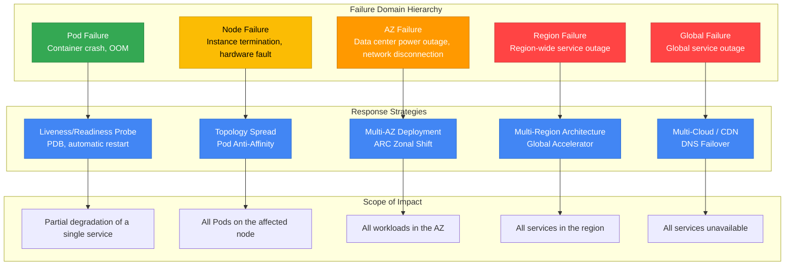
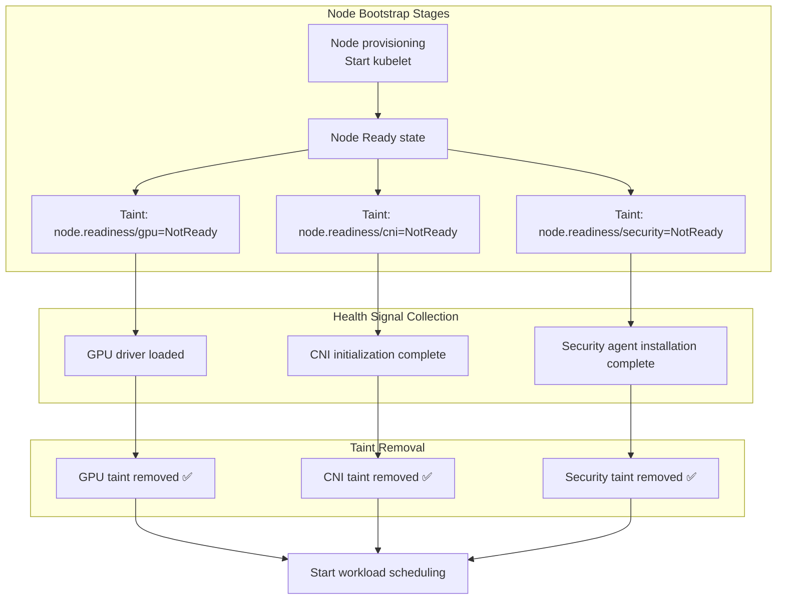
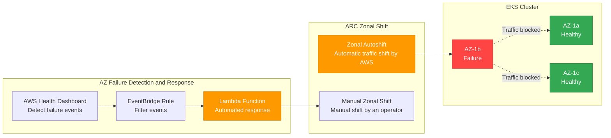
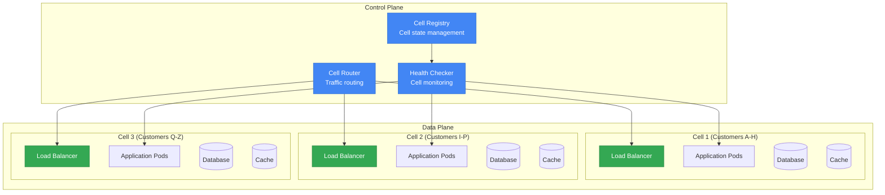
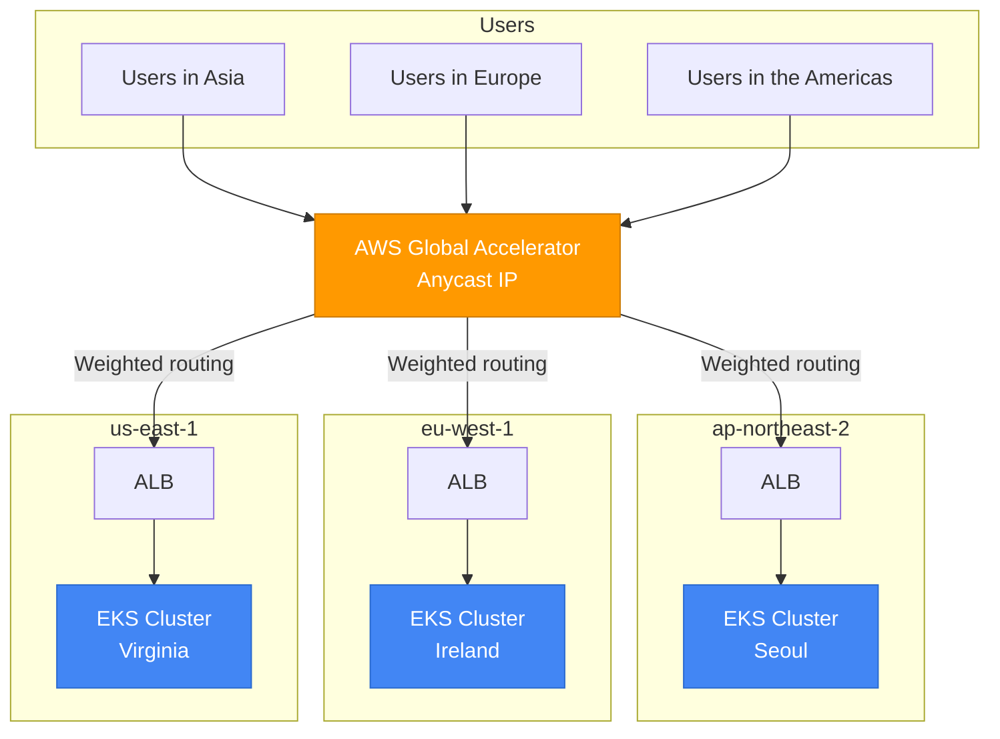
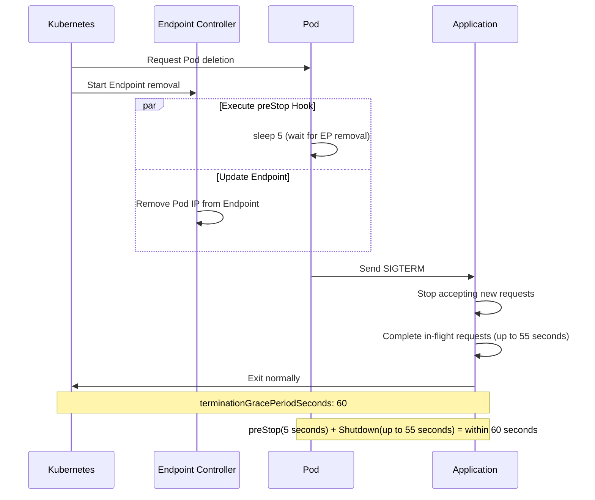

> **📌 Reference Environment**: EKS 1.33+, Karpenter v1.x, Istio 1.22+

## 1. Overview

Resiliency is a system's ability to recover to a normal state when failures occur, or to maintain service while minimizing their impact. The core principle of resiliency in cloud-native environments is straightforward: **Failures will happen — prepare through design.**

Understanding failure domains at every layer, from a single Pod failure to a region-wide outage, and establishing the corresponding defense strategies are central to EKS operations.

### Failure Domain Hierarchy



### Resiliency Maturity Model

An organization's resiliency can be classified into 4 levels, enabling gradual improvement from its current level.

| Level | Stage | Core Capabilities | Implementation Items | Complexity | Cost Impact |
|-------|------|-----------|-----------|--------|-----------|
| **1** | Basic | Pod-level resiliency | Probe configuration, PDB, Graceful Shutdown, resource Limits | Low | Minimal |
| **2** | Multi-AZ | AZ fault tolerance | Topology Spread, Multi-AZ NodePool, ARC Zonal Shift | Medium | Cross-AZ traffic costs |
| **3** | Cell-Based | Blast radius isolation | Cell Architecture, Shuffle Sharding, independent deployments | High | Per-cell overhead |
| **4** | Multi-Region | Region fault tolerance | Active-Active architecture, Global Accelerator, data replication | Very high | Per-region infrastructure costs |

:::info Troubleshooting and Incident Response Guide
For diagnosing and resolving operational incidents, refer to the [EKS Troubleshooting and Incident Response Guide](eks-debugging/index.md). This document focuses on failure **prevention** and **design**; the troubleshooting and incident response guide covers real-time troubleshooting.
:::

---

## 2. Multi-AZ Strategy

Multi-AZ deployment is a foundational and powerful strategy for EKS resiliency. It distributes workloads across multiple Availability Zones so that a single AZ failure does not interrupt the entire service.

### Pod Topology Spread Constraints

Topology Spread Constraints distribute Pods evenly across AZs, nodes, and custom topology domains. The `minDomains` parameter (K8s 1.24 alpha → 1.30 GA) specifies the minimum number of domains across which Pods are distributed.

| Parameter | Description | Recommended Value |
|----------|------|--------|
| `maxSkew` | Maximum difference in Pod counts between domains | AZ: 1, node: 2 |
| `topologyKey` | Label used to distribute Pods | `topology.kubernetes.io/zone` |
| `whenUnsatisfiable` | Behavior when the constraint cannot be satisfied | `DoNotSchedule` (hard) or `ScheduleAnyway` (soft) |
| `minDomains` | Minimum number of distribution domains | Equal to the AZ count (e.g., 3) |
| `labelSelector` | Selects the target Pods | Same as the Deployment's matchLabels |

**Combined Hard + Soft Strategy** (recommended):

```yaml
apiVersion: apps/v1
kind: Deployment
metadata:
  name: critical-app
spec:
  replicas: 6
  selector:
    matchLabels:
      app: critical-app
  template:
    metadata:
      labels:
        app: critical-app
    spec:
      topologySpreadConstraints:
      # Hard: Even distribution across AZs (must be guaranteed)
      - maxSkew: 1
        topologyKey: topology.kubernetes.io/zone
        whenUnsatisfiable: DoNotSchedule
        labelSelector:
          matchLabels:
            app: critical-app
        minDomains: 3
      # Soft: Distribution across nodes (best effort)
      - maxSkew: 2
        topologyKey: kubernetes.io/hostname
        whenUnsatisfiable: ScheduleAnyway
        labelSelector:
          matchLabels:
            app: critical-app
```

:::tip maxSkew Configuration Tip
`maxSkew: 1` ensures the strictest even distribution. Deploying 6 replicas across 3 AZs places exactly 2 in each AZ. When scaling speed is important, relaxing the setting to `maxSkew: 2` provides scheduling flexibility.
:::

### AZ-Aware Karpenter Configuration

Karpenter v1 GA supports declarative configuration of Multi-AZ distribution, disruption budgets, and mixed Spot + On-Demand strategies at the NodePool level.

```yaml
apiVersion: karpenter.sh/v1
kind: NodePool
metadata:
  name: multi-az-pool
spec:
  disruption:
    consolidationPolicy: WhenEmptyOrUnderutilized
    consolidateAfter: 5m
    # Disruption budget: Prevent simultaneous disruption of 20% or more of nodes
    budgets:
    - nodes: "20%"
    # Operate more conservatively during business hours (optional)
    # - nodes: "10%"
    #   schedule: "0 9 * * MON-FRI"  # Weekdays 09:00-17:00
    #   duration: 8h
  template:
    spec:
      requirements:
      # Provision nodes across 3 AZs
      - key: topology.kubernetes.io/zone
        operator: In
        values: ["us-east-1a", "us-east-1b", "us-east-1c"]
      # Combine Spot + On-Demand for cost optimization and stability
      - key: karpenter.sh/capacity-type
        operator: In
        values: ["on-demand", "spot"]
      - key: node.kubernetes.io/instance-type
        operator: In
        values:
          - c6i.xlarge
          - c6i.2xlarge
          - c6i.4xlarge
          - c7i.xlarge
          - c7i.2xlarge
          - c7i.4xlarge
          - m6i.xlarge
          - m6i.2xlarge
      nodeClassRef:
        group: karpenter.k8s.aws
        kind: EC2NodeClass
        name: multi-az
  limits:
    cpu: "1000"
    memory: 2000Gi
```

:::warning Spot Instances and Multi-AZ
Spot instance capacity pools vary by AZ. Specifying 15 or more diverse instance types can minimize provisioning failures caused by insufficient Spot capacity. Mission-critical workloads must run their base capacity on On-Demand instances.
:::

### Safe Workload Placement with Node Readiness

When a new node is provisioned in a Multi-AZ environment, it may not be fully prepared to host workloads even after it enters the `Ready` state. Kubernetes readiness mechanisms help prevent workloads from being placed prematurely.

#### Node Readiness Controller (Announced in February 2026)

The [Node Readiness Controller](https://github.com/kubernetes-sigs/node-readiness-controller) declaratively manages custom taints during node bootstrapping. It delays workload scheduling until all infrastructure requirements are met, including GPU drivers, CNI plugins, CSI drivers, and security agents.



**Resiliency Benefits:**

- **AZ failure recovery**: When Karpenter provisions nodes in a new AZ, the nodes accept traffic only after they are fully ready
- **Scale-out events**: Workloads are not placed on unprepared nodes, even during rapid scaling
- **GPU/ML workloads**: Prevents `CrashLoopBackOff` by blocking scheduling until drivers finish loading

#### Pod Scheduling Readiness (K8s 1.30 GA)

`schedulingGates` controls scheduling timing from the Pod side. An external system verifies readiness, then removes the gates to allow scheduling:

```yaml
apiVersion: v1
kind: Pod
metadata:
  name: validated-pod
spec:
  schedulingGates:
    - name: "example.com/capacity-validation"
    - name: "example.com/security-clearance"
  containers:
    - name: app
      image: app:latest
      resources:
        requests:
          cpu: "4"
          memory: "8Gi"
```

**Use Cases:**

- Allow scheduling after resource quota prevalidation
- Allow scheduling after security approval
- Allow scheduling after custom admission checks pass

#### Pod Readiness Gates (AWS LB Controller)

Pod Readiness Gates in the AWS Load Balancer Controller ensure **zero-downtime deployments** during rolling updates:

```yaml
apiVersion: v1
kind: Namespace
metadata:
  name: production
  labels:
    elbv2.k8s.aws/pod-readiness-gate-inject: enabled  # Enable automatic injection
```

The old Pod does not terminate until the new Pod is registered as an ALB/NLB target and passes health checks, enabling deployments without traffic loss.

:::tip Readiness Feature Selection Guide

| Requirement | Recommended Feature | Level |
|----------|-----------|-----------|
| Ensure node bootstrapping is complete | Node Readiness Controller | Node |
| External validation before Pod scheduling | Pod Scheduling Readiness | Pod |
| Receive traffic after LB registration is complete | Pod Readiness Gates | Pod |
| Ensure GPU/specialized hardware readiness | Node Readiness Controller | Node |
| Zero-downtime rolling deployments | Pod Readiness Gates | Pod |
:::

### AZ Avoidance Deployment Strategy (ARC Zonal Shift)

AWS Application Recovery Controller (ARC) Zonal Shift automatically or manually redirects traffic away from a specific AZ when a problem is detected there. EKS has supported ARC Zonal Shift since November 2024.



**Enabling and Using ARC Zonal Shift:**

```bash
# Enable Zonal Shift on the EKS cluster
aws eks update-cluster-config \
  --name my-cluster \
  --zonal-shift-config enabled=true

# Start a manual Zonal Shift (redirect traffic away from a specific AZ)
aws arc-zonal-shift start-zonal-shift \
  --resource-identifier arn:aws:eks:us-east-1:123456789012:cluster/my-cluster \
  --away-from us-east-1b \
  --expires-in 3h \
  --comment "AZ-b impairment detected via Health Dashboard"

# Check Zonal Shift status
aws arc-zonal-shift list-zonal-shifts \
  --resource-identifier arn:aws:eks:us-east-1:123456789012:cluster/my-cluster
```

:::info Zonal Shift Limitations
The maximum duration of a Zonal Shift is **3 days**, and it can be extended if necessary. When Zonal Autoshift is enabled, AWS detects AZ-level failures and automatically shifts traffic.
:::

**Emergency AZ Evacuation Script:**

```bash
#!/bin/bash
# az-evacuation.sh - Safely evacuate all workloads from an impaired AZ
IMPAIRED_AZ=$1

if [ -z "$IMPAIRED_AZ" ]; then
  echo "Usage: $0 <az-name>"
  echo "Example: $0 us-east-1b"
  exit 1
fi

echo "=== AZ Evacuation: ${IMPAIRED_AZ} ==="

# 1. Cordon nodes in the affected AZ (block new Pod scheduling)
echo "[Step 1] Cordoning nodes in ${IMPAIRED_AZ}..."
kubectl get nodes -l topology.kubernetes.io/zone=${IMPAIRED_AZ} -o name | \
  xargs -I {} kubectl cordon {}

# 2. Drain nodes in the affected AZ (safely move existing Pods)
echo "[Step 2] Draining nodes in ${IMPAIRED_AZ}..."
kubectl get nodes -l topology.kubernetes.io/zone=${IMPAIRED_AZ} -o name | \
  xargs -I {} kubectl drain {} \
    --ignore-daemonsets \
    --delete-emptydir-data \
    --grace-period=30 \
    --timeout=120s

# 3. Verify evacuation results
echo "[Step 3] Verifying evacuation..."
echo "Remaining pods in ${IMPAIRED_AZ}:"
kubectl get pods --all-namespaces -o wide | grep ${IMPAIRED_AZ} | grep -v DaemonSet

echo "=== Evacuation complete ==="
```

### Handling EBS AZ-Pinning

EBS volumes are pinned to a specific AZ. If that AZ fails, Pods using those volumes cannot move to another AZ.

**WaitForFirstConsumer StorageClass** (recommended):

```yaml
apiVersion: storage.k8s.io/v1
kind: StorageClass
metadata:
  name: topology-aware-ebs
provisioner: ebs.csi.aws.com
parameters:
  type: gp3
  encrypted: "true"
volumeBindingMode: WaitForFirstConsumer
allowVolumeExpansion: true
```

`WaitForFirstConsumer` delays volume creation until the Pod is scheduled, ensuring that the volume is created in the same AZ as the Pod.

**EFS as a Cross-AZ Alternative**: Use Amazon EFS for workloads that require storage access even during an AZ failure. EFS supports concurrent access from all AZs and therefore avoids AZ-pinning issues.

| Storage | AZ Dependency | Failure Behavior | Suitable Workloads |
|----------|-----------|-------------|----------------|
| EBS (gp3) | Pinned to a single AZ | Inaccessible during an AZ failure | Databases, stateful applications |
| EFS | Cross-AZ | Accessible even during an AZ failure | Shared files, CMS, logs |
| Instance Store | Node-dependent | Data lost on node termination | Temporary caches, scratch space |

### Cross-AZ Cost Optimization

Cross-AZ network traffic is a major cost driver for Multi-AZ deployments. AWS charges $0.01/GB in each direction for data transfer between AZs in the same region.

**Istio Locality-Aware Routing** can minimize Cross-AZ traffic:

```yaml
apiVersion: networking.istio.io/v1
kind: DestinationRule
metadata:
  name: locality-aware-routing
spec:
  host: backend-service
  trafficPolicy:
    connectionPool:
      http:
        http2MaxRequests: 1000
    outlierDetection:
      consecutive5xxErrors: 5
      interval: 10s
      baseEjectionTime: 30s
    loadBalancer:
      localityLbSetting:
        enabled: true
        # Prefer the same AZ; fail over to another AZ on failure
        distribute:
        - from: "us-east-1/us-east-1a/*"
          to:
            "us-east-1/us-east-1a/*": 80
            "us-east-1/us-east-1b/*": 10
            "us-east-1/us-east-1c/*": 10
        - from: "us-east-1/us-east-1b/*"
          to:
            "us-east-1/us-east-1b/*": 80
            "us-east-1/us-east-1a/*": 10
            "us-east-1/us-east-1c/*": 10
```

:::tip Cross-AZ Cost Savings
Locality-Aware routing can keep 80% or more of traffic within the same AZ, significantly reducing Cross-AZ data transfer costs. High-traffic services can save thousands of dollars per month.
:::

---

## 3. Cell-Based Architecture

Cell-Based Architecture is an advanced resiliency pattern recommended by the AWS Well-Architected Framework. It divides a system into independent cells to isolate the scope of failure impact, or blast radius.

### Cell Concepts and Design Principles

A cell is a self-contained service unit that can operate independently. A failure in one cell does not affect other cells.



**Core Cell Design Principles:**

1. **Independence**: Each cell has its own data store, cache, and queue
2. **Isolation**: Cells do not communicate directly; coordination occurs only through the control plane
3. **Homogeneity**: All cells run the same code and configuration
4. **Scalability**: As demand grows, add new cells instead of expanding existing cells

### Implementing Cells in EKS

| Implementation Approach | Namespace-Based Cell | Cluster-Based Cell |
|-----------|-------------------|------------------|
| **Isolation level** | Logical isolation (soft) | Physical isolation (hard) |
| **Resource isolation** | ResourceQuota, LimitRange | Complete cluster isolation |
| **Network isolation** | NetworkPolicy | VPC/Subnet level |
| **Blast Radius** | Potential impact within the same cluster | Complete isolation between cells |
| **Operational complexity** | Low (single cluster) | High (multiple clusters) |
| **Cost** | Low | High (control plane cost × number of cells) |
| **Suitable environments** | Small to medium scale, internal services | Large scale, regulatory compliance requirements |

**Namespace-Based Cell Implementation Example:**

```yaml
# Cell-1 Namespace and ResourceQuota
apiVersion: v1
kind: Namespace
metadata:
  name: cell-1
  labels:
    cell-id: "cell-1"
    partition: "customers-a-h"
---
apiVersion: v1
kind: ResourceQuota
metadata:
  name: cell-1-quota
  namespace: cell-1
spec:
  hard:
    requests.cpu: "20"
    requests.memory: 40Gi
    limits.cpu: "40"
    limits.memory: 80Gi
    pods: "100"
---
# Cell-aware Deployment
apiVersion: apps/v1
kind: Deployment
metadata:
  name: api-server
  namespace: cell-1
  labels:
    cell-id: "cell-1"
spec:
  replicas: 4
  selector:
    matchLabels:
      app: api-server
      cell-id: "cell-1"
  template:
    metadata:
      labels:
        app: api-server
        cell-id: "cell-1"
    spec:
      topologySpreadConstraints:
      - maxSkew: 1
        topologyKey: topology.kubernetes.io/zone
        whenUnsatisfiable: DoNotSchedule
        labelSelector:
          matchLabels:
            app: api-server
            cell-id: "cell-1"
      containers:
      - name: api-server
        image: myapp/api-server:v2.1
        env:
        - name: CELL_ID
          value: "cell-1"
        - name: PARTITION_RANGE
          value: "A-H"
        resources:
          requests:
            cpu: "500m"
            memory: 1Gi
          limits:
            cpu: "1"
            memory: 2Gi
```

### Cell Router Implementation

The Cell Router is the core component that routes incoming requests to the appropriate cell. There are three implementation approaches.

**1. Route 53 ARC Routing Control:**

Controls cell routing at the DNS level. Configure health checks and routing controls for each cell to block traffic at the DNS level when a cell fails.

**2. ALB Target Groups:**

Distributes traffic across cells using ALB weighted target groups. Header-based routing rules map customers to cells.

**3. Service Mesh (Istio):**

Implements cell routing through header-based routing in Istio VirtualService. This is the most flexible approach, but it adds the operational complexity of Istio.

### Blast Radius Isolation Strategies

| Strategy | Description | Isolation Boundary | Use Case |
|------|------|-----------|-----------|
| **Customer Partitioning** | Cell assignment based on a customer ID hash | Customer group | SaaS platforms |
| **Geographic** | Cell assignment based on geographic location | Region/country | Global services |
| **Capacity-Based** | Dynamic assignment based on cell capacity | Available resources | Services with highly variable traffic |
| **Tier-Based** | Cell assignment based on customer tier | Service level | Premium/standard separation |

### Shuffle Sharding Pattern

Shuffle Sharding assigns each customer (or tenant) to a small number of randomly selected cells from the full cell pool. This limits the impact of a single cell failure to a small subset of customers.

**How It Works**: With 8 cells and 2 cells assigned to each customer, there are C(8,2) = 28 possible combinations. If one cell fails, only customers using that cell are affected, and they automatically fail over to their remaining cell.

```yaml
# Shuffle Sharding ConfigMap example
apiVersion: v1
kind: ConfigMap
metadata:
  name: shuffle-sharding-config
data:
  sharding-config.yaml: |
    totalCells: 8
    shardsPerTenant: 2
    tenantAssignments:
      tenant-acme:
        cells: ["cell-1", "cell-5"]
        primary: "cell-1"
      tenant-globex:
        cells: ["cell-3", "cell-7"]
        primary: "cell-3"
      tenant-initech:
        cells: ["cell-2", "cell-6"]
        primary: "cell-2"
```

:::warning Cell Architecture Trade-offs
Cell Architecture provides strong isolation, but increases operational complexity and cost. Because each cell has an independent data store, data migration, cross-cell queries, and consistency between cells require additional design. Consider adoption first for services that require an SLA of 99.99% or higher.
:::

---

## 4. Multi-Cluster / Multi-Region

Multi-Cluster and Multi-Region strategies prepare for region-level failures.

### Architecture Pattern Comparison

| Pattern | Description | RTO | RPO | Cost | Complexity | Suitable Environments |
|------|------|-----|-----|------|--------|------------|
| **Active-Active** | All regions process traffic simultaneously | ~0 | ~0 | Very high | Very high | Global services, extremely stringent SLAs |
| **Active-Passive** | One active region, others on standby | Minutes to hours | Minutes | High | High | Most business applications |
| **Regional Isolation** | Independent regional operations and data isolation | Independent per region | N/A | Medium | Medium | Regulatory compliance, data sovereignty |
| **Hub-Spoke** | Central hub for management, spokes for serving | Minutes | Seconds to minutes | Medium to high | Medium | Environments prioritizing management efficiency |

### Global Accelerator + EKS

AWS Global Accelerator uses the AWS global network to route traffic to the EKS cluster in the region closest to the user.



### ArgoCD Multi-Cluster GitOps

Use an ArgoCD ApplicationSet Generator to automate consistent deployments across multiple clusters.

```yaml
apiVersion: argoproj.io/v1alpha1
kind: ApplicationSet
metadata:
  name: multi-cluster-app
  namespace: argocd
spec:
  generators:
  # Dynamic deployments based on cluster labels
  - clusters:
      selector:
        matchLabels:
          environment: production
          resiliency-tier: "high"
  template:
    metadata:
      name: 'myapp-{{name}}'
    spec:
      project: default
      source:
        repoURL: https://github.com/myorg/k8s-manifests.git
        targetRevision: main
        path: 'overlays/{{metadata.labels.region}}'
      destination:
        server: '{{server}}'
        namespace: production
      syncPolicy:
        automated:
          prune: true
          selfHeal: true
        syncOptions:
        - CreateNamespace=true
        retry:
          limit: 5
          backoff:
            duration: 5s
            factor: 2
            maxDuration: 3m
```

### Istio Multi-Cluster Federation

An Istio Multi-Primary configuration runs an independent Istio control plane in each cluster while providing cross-cluster service discovery and load balancing.

```yaml
# Istio Locality-Aware routing (Multi-Region)
apiVersion: networking.istio.io/v1
kind: DestinationRule
metadata:
  name: multi-region-routing
spec:
  host: backend-service
  trafficPolicy:
    loadBalancer:
      localityLbSetting:
        enabled: true
        # Prefer the same region; fail over to another region on failure
        failover:
        - from: us-east-1
          to: eu-west-1
        - from: eu-west-1
          to: us-east-1
        - from: ap-northeast-2
          to: ap-southeast-1
    outlierDetection:
      consecutive5xxErrors: 3
      interval: 10s
      baseEjectionTime: 30s
      maxEjectionPercent: 50
```

:::info Istio API Version Reference
Istio 1.22+ supports both `networking.istio.io/v1` and `networking.istio.io/v1beta1`. Use `v1` for new deployments; existing `v1beta1` configurations remain valid.
:::

---

## 5. Application Resiliency Patterns

Application-level fault tolerance patterns must be implemented alongside infrastructure-level resiliency.

### PodDisruptionBudgets (PDB)

PDBs ensure a minimum level of Pod availability during voluntary disruptions, such as node drains, cluster upgrades, and Karpenter consolidation.

| Setting | Behavior | Suitable Situations |
|------|------|------------|
| `minAvailable: 2` | Always maintain at least 2 Pods | Services with a small replica count (3-5) |
| `minAvailable: "50%"` | Maintain at least 50% of all Pods | Services with a large replica count |
| `maxUnavailable: 1` | Disrupt at most 1 Pod at a time | Stability during rolling updates |
| `maxUnavailable: "25%"` | Allow simultaneous disruption of up to 25% of all Pods | When rapid deployments are required |

```yaml
apiVersion: policy/v1
kind: PodDisruptionBudget
metadata:
  name: api-pdb
spec:
  minAvailable: 2
  selector:
    matchLabels:
      app: api-server
---
# Percentage-based PDB suitable for large Deployments
apiVersion: policy/v1
kind: PodDisruptionBudget
metadata:
  name: worker-pdb
spec:
  maxUnavailable: "25%"
  selector:
    matchLabels:
      app: worker
```

:::warning PDB and Karpenter Interaction
Karpenter disruption budgets (`budgets: - nodes: "20%"`) and PDBs work together. Karpenter respects PDBs during node consolidation. An overly strict PDB, such as minAvailable equal to the replica count, can permanently block node draining.
:::

### Graceful Shutdown

The Graceful Shutdown pattern safely completes in-flight requests and stops accepting new requests when a Pod terminates.

```yaml
apiVersion: apps/v1
kind: Deployment
metadata:
  name: web-server
spec:
  template:
    spec:
      terminationGracePeriodSeconds: 60
      containers:
      - name: web
        image: myapp/web:v2.0
        ports:
        - containerPort: 8080
        lifecycle:
          preStop:
            exec:
              # Wait for Endpoint removal with sleep (avoid a race between Kubelet and Endpoint Controller)
              # kubelet automatically sends SIGTERM after the preStop Hook completes
              command: ["/bin/sh", "-c", "sleep 5"]
        readinessProbe:
          httpGet:
            path: /ready
            port: 8080
          periodSeconds: 5
          failureThreshold: 1
```

**Graceful Shutdown Timing Design:**



:::tip Why preStop sleep Is Needed
When Kubernetes deletes a Pod, preStop Hook execution and Endpoint removal occur **asynchronously**. Adding a 5-second sleep to preStop gives the Endpoint Controller time to remove the Pod IP from the service, preventing traffic from reaching the terminating Pod.
:::

### Circuit Breaker (Istio DestinationRule)

A Circuit Breaker blocks requests to a failing service to prevent cascading failures. It is implemented using an Istio DestinationRule.

```yaml
# Istio 1.22+: Both v1 and v1beta1 are supported
apiVersion: networking.istio.io/v1
kind: DestinationRule
metadata:
  name: backend-circuit-breaker
spec:
  host: backend-service
  trafficPolicy:
    connectionPool:
      tcp:
        maxConnections: 100
        connectTimeout: 5s
      http:
        http1MaxPendingRequests: 50
        http2MaxRequests: 100
        maxRequestsPerConnection: 10
        maxRetries: 3
    outlierDetection:
      # Eject an instance from the pool after 5 consecutive 5xx errors
      consecutive5xxErrors: 5
      # Check instance health every 30 seconds
      interval: 30s
      # Minimum isolation time for an ejected instance
      baseEjectionTime: 30s
      # Allow ejection of up to 50% of all instances
      maxEjectionPercent: 50
```

### Retry / Timeout (Istio VirtualService)

```yaml
apiVersion: networking.istio.io/v1
kind: VirtualService
metadata:
  name: backend-retry
spec:
  hosts:
  - backend-service
  http:
  - route:
    - destination:
        host: backend-service
    timeout: 10s
    retries:
      attempts: 3
      perTryTimeout: 3s
      retryOn: "5xx,reset,connect-failure,retriable-4xx"
      retryRemoteLocalities: true
```

**Retry Best Practices:**

| Setting | Recommended Value | Reason |
|------|--------|------|
| `attempts` | 2-3 | Too many retries amplify load |
| `perTryTimeout` | 1/3 of the overall timeout | Allows 3 retries to complete within the overall timeout |
| `retryOn` | `5xx,connect-failure` | Retry only transient failures |
| `retryRemoteLocalities` | `true` | Retry against instances in other AZs as well |

:::warning Rate Limiting Adoption Considerations
Rate Limiting is a core resiliency measure alongside Circuit Breakers and retries, but incorrect configuration can block legitimate traffic. Implement it using an Istio EnvoyFilter or an external rate limiter, such as one backed by Redis, and **always introduce it gradually**. The recommended progression is monitoring mode → warning mode → blocking mode.
:::

### Resiliency Considerations for EKS Auto Mode

EKS Auto Mode automates infrastructure management, but its characteristics must be considered when designing for resiliency.

| Item | Auto Mode Characteristics | Resiliency Impact | Recommended Response |
|------|---------------|---------------|---------|
| **Node replacement** | Frequent node replacement for OS patches and optimization | More frequent Pod relocation | PDB required; `terminationGracePeriodSeconds` 90 seconds+ |
| **Instance diversity** | Automatic mix of Graviton + x86 and Spot + On-Demand | Performance differences between instances | Set a high Startup Probe failureThreshold (30+) |
| **Spot interruption** | Automatic Spot Fallback handling | Termination after a 2-minute warning | Graceful Shutdown + preStop sleep required |
| **AZ distribution** | Auto Mode selects instances automatically | AZ distribution is the user's responsibility | Explicit Topology Spread Constraints required |

:::tip Auto Mode + Resiliency Checklist
In Auto Mode environments, distinguish **infrastructure-level automation** from **application-level resiliency**:
- **Auto Mode responsibilities**: Node provisioning, Spot Fallback, OS patches, instance selection
- **User responsibilities**: PDB, Topology Spread, Graceful Shutdown, Probe configuration, Circuit Breakers

For detailed Probe and resource configuration in Auto Mode environments, refer to [EKS Pod Health Checks & Lifecycle Management](/docs/eks-best-practices/operations-reliability/eks-pod-health-lifecycle) and the [EKS Pod Resource Optimization Guide](/docs/eks-best-practices/resource-cost/eks-resource-optimization).
:::

---

## 6. Chaos Engineering

Chaos Engineering is a practical methodology for validating system resiliency in production environments. Testing while everything is healthy prepares the system for failures.

### AWS Fault Injection Service (FIS)

AWS FIS is a managed Chaos Engineering service that injects failures into AWS services such as EC2, EKS, and RDS.

**Scenario 1: Pod Deletion (Application Resiliency Test)**

```json
{
  "description": "EKS Pod termination test",
  "targets": {
    "eks-pods": {
      "resourceType": "aws:eks:pod",
      "resourceTags": {
        "app": "critical-api"
      },
      "selectionMode": "COUNT(3)",
      "parameters": {
        "clusterIdentifier": "arn:aws:eks:us-east-1:123456789012:cluster/prod-cluster",
        "namespace": "production"
      }
    }
  },
  "actions": {
    "terminate-pods": {
      "actionId": "aws:eks:pod-delete",
      "targets": {
        "Pods": "eks-pods"
      }
    }
  },
  "stopConditions": [
    {
      "source": "aws:cloudwatch:alarm",
      "value": "arn:aws:cloudwatch:us-east-1:123456789012:alarm:HighErrorRate"
    }
  ]
}
```

**Scenario 2: AZ Failure Simulation**

```json
{
  "description": "Simulate AZ failure for EKS",
  "targets": {
    "eks-nodes-az1a": {
      "resourceType": "aws:ec2:instance",
      "resourceTags": {
        "kubernetes.io/cluster/my-cluster": "owned"
      },
      "filters": [
        {
          "path": "Placement.AvailabilityZone",
          "values": ["us-east-1a"]
        }
      ],
      "selectionMode": "ALL"
    }
  },
  "actions": {
    "stop-instances": {
      "actionId": "aws:ec2:stop-instances",
      "parameters": {
        "startInstancesAfterDuration": "PT10M"
      },
      "targets": {
        "Instances": "eks-nodes-az1a"
      }
    }
  },
  "stopConditions": [
    {
      "source": "aws:cloudwatch:alarm",
      "value": "arn:aws:cloudwatch:us-east-1:123456789012:alarm:CriticalServiceDown"
    }
  ]
}
```

**Scenario 3: Network Latency Injection**

```json
{
  "description": "Inject network latency to EKS nodes",
  "targets": {
    "eks-nodes": {
      "resourceType": "aws:ec2:instance",
      "resourceTags": {
        "kubernetes.io/cluster/my-cluster": "owned",
        "app-tier": "backend"
      },
      "selectionMode": "PERCENT(50)"
    }
  },
  "actions": {
    "inject-latency": {
      "actionId": "aws:ssm:send-command",
      "parameters": {
        "documentArn": "arn:aws:ssm:us-east-1::document/AWSFIS-Run-Network-Latency",
        "documentParameters": "{\"DurationSeconds\":\"300\",\"DelayMilliseconds\":\"200\",\"Interface\":\"eth0\"}",
        "duration": "PT5M"
      },
      "targets": {
        "Instances": "eks-nodes"
      }
    }
  }
}
```

### Litmus Chaos on EKS

Litmus is a CNCF incubating project and a Kubernetes-native Chaos Engineering framework.

**Installation:**

```bash
# Install Litmus ChaosCenter
helm repo add litmuschaos https://litmuschaos.github.io/litmus-helm/
helm repo update

helm install litmus litmuschaos/litmus \
  --namespace litmus --create-namespace \
  --set portal.frontend.service.type=LoadBalancer
```

**ChaosEngine Example (Pod Delete):**

```yaml
apiVersion: litmuschaos.io/v1alpha1
kind: ChaosEngine
metadata:
  name: pod-delete-chaos
  namespace: production
spec:
  appinfo:
    appns: production
    applabel: "app=api-server"
    appkind: deployment
  engineState: active
  chaosServiceAccount: litmus-admin
  experiments:
  - name: pod-delete
    spec:
      components:
        env:
        - name: TOTAL_CHAOS_DURATION
          value: "60"
        - name: CHAOS_INTERVAL
          value: "10"
        - name: FORCE
          value: "false"
        - name: PODS_AFFECTED_PERC
          value: "50"
```

### Chaos Mesh

Chaos Mesh is a CNCF incubating project and a Chaos Engineering platform built for Kubernetes that supports a variety of failure types.

**Installation:**

```bash
# Install Chaos Mesh
helm repo add chaos-mesh https://charts.chaos-mesh.org
helm repo update

helm install chaos-mesh chaos-mesh/chaos-mesh \
  --namespace chaos-mesh --create-namespace \
  --set chaosDaemon.runtime=containerd \
  --set chaosDaemon.socketPath=/run/containerd/containerd.sock
```

**NetworkChaos Example (Network Partition):**

```yaml
apiVersion: chaos-mesh.org/v1alpha1
kind: NetworkChaos
metadata:
  name: network-partition
  namespace: chaos-mesh
spec:
  action: partition
  mode: all
  selector:
    namespaces:
    - production
    labelSelectors:
      "app": "frontend"
  direction: both
  target:
    selector:
      namespaces:
      - production
      labelSelectors:
        "app": "backend"
    mode: all
  duration: "5m"
  scheduler:
    cron: "@every 24h"
```

**PodChaos Example (Pod Kill):**

```yaml
apiVersion: chaos-mesh.org/v1alpha1
kind: PodChaos
metadata:
  name: pod-kill-test
  namespace: chaos-mesh
spec:
  action: pod-kill
  mode: fixed-percent
  value: "30"
  selector:
    namespaces:
    - production
    labelSelectors:
      "app": "api-server"
  duration: "1m"
  gracePeriod: 0
```

### Chaos Engineering Tool Comparison

| Feature | AWS FIS | Litmus Chaos | Chaos Mesh |
|------|---------|-------------|------------|
| **Type** | Managed service | Open source (CNCF) | Open source (CNCF) |
| **Scope** | AWS infrastructure + K8s | Kubernetes only | Kubernetes only |
| **Failure types** | EC2, EKS, RDS, network | Pod, Node, network, DNS | Pod, network, I/O, time, JVM |
| **AZ failure simulation** | Native support | Limited (Pod/Node level) | Limited (Pod/Node level) |
| **Dashboard** | AWS Console | Litmus Portal (web UI) | Chaos Dashboard (web UI) |
| **Cost** | Charged per execution | Free (infrastructure costs only) | Free (infrastructure costs only) |
| **Stop Condition** | CloudWatch Alarm integration | Manual / API | Manual / API |
| **Operational complexity** | Low | Medium | Medium |
| **GitOps integration** | CloudFormation / CDK | CRD-based (ArgoCD-compatible) | CRD-based (ArgoCD-compatible) |
| **Recommended scenarios** | Infrastructure-level failure testing | K8s-native testing | When fine-grained fault injection is required |

:::tip Tool Selection Guide
A **hybrid approach** is recommended: start with AWS FIS to test infrastructure-level failures such as AZ and network failures, then use Litmus or Chaos Mesh for fine-grained application-level failure tests. AWS FIS stop conditions, based on CloudWatch Alarms, are essential for safe testing in production environments.
:::

### Game Day Runbook Template

A Game Day is an exercise in which a team executes planned failure scenarios together to uncover weaknesses in systems and processes.

**5-Phase Game Day Execution Framework:**

```mermaid
flowchart LR
    subgraph "Phase 1: Preparation"
        P1[Form a hypothesis<br/>Example: Automatic recovery from an AZ failure]
        P2[Define success criteria<br/>Example: Recovery within 5 minutes]
        P3[Set stop conditions<br/>CloudWatch Alarm]
    end

    subgraph "Phase 2: Execution"
        E1[Verify steady state<br/>Record current metrics]
        E2[Inject a failure<br/>Start the FIS experiment]
        E3[Observe and record<br/>Real-time monitoring]
    end

    subgraph "Phase 3: Analysis"
        A1[Measure recovery time<br/>Actual RTO]
        A2[Assess data loss<br/>Actual RPO]
        A3[Analyze user impact]
    end

    subgraph "Phase 4: Improvement"
        I1[List identified weaknesses]
        I2[Create improvement tickets]
        I3[Update the runbook]
    end

    subgraph "Phase 5: Iteration"
        R1[Schedule the next Game Day]
        R2[Expand scenarios]
        R3[Expand automation]
    end

    P1 --> P2 --> P3
    P3 --> E1 --> E2 --> E3
    E3 --> A1 --> A2 --> A3
    A3 --> I1 --> I2 --> I3
    I3 --> R1 --> R2 --> R3

    style P1 fill:#4286f4,stroke:#2a6acf,color:#fff
    style E2 fill:#ff4444,stroke:#cc3636,color:#fff
    style A1 fill:#fbbc04,stroke:#c99603,color:#000
    style I1 fill:#34a853,stroke:#2a8642,color:#fff
    style R1 fill:#4286f4,stroke:#2a6acf,color:#fff
```



**Game Day Automation Script:**

```bash
#!/bin/bash
# game-day.sh - Automate Game Day execution
set -euo pipefail

CLUSTER_NAME=$1
SCENARIO=$2
NAMESPACE=${3:-production}

echo "============================================"
echo " Game Day: ${SCENARIO}"
echo " Cluster: ${CLUSTER_NAME}"
echo " Namespace: ${NAMESPACE}"
echo " Time: $(date -u '+%Y-%m-%d %H:%M:%S UTC')"
echo "============================================"

# Phase 1: Record steady state
echo ""
echo "[Phase 1] Recording Steady State..."
echo "--- Pod Status ---"
kubectl get pods -n ${NAMESPACE} -o wide | head -20

echo "--- Node Status ---"
kubectl get nodes -o custom-columns=\
NAME:.metadata.name,\
STATUS:.status.conditions[-1].type,\
AZ:.metadata.labels.topology\\.kubernetes\\.io/zone

echo "--- Service Endpoints ---"
kubectl get endpoints -n ${NAMESPACE}

# Phase 2: Inject failures (by scenario)
echo ""
echo "[Phase 2] Injecting failure: ${SCENARIO}..."

case ${SCENARIO} in
  "az-failure")
    echo "Simulating AZ failure with ARC Zonal Shift..."
    # Run ARC Zonal Shift (1 hour)
    aws arc-zonal-shift start-zonal-shift \
      --resource-identifier arn:aws:eks:us-east-1:$(aws sts get-caller-identity --query Account --output text):cluster/${CLUSTER_NAME} \
      --away-from us-east-1a \
      --expires-in 1h \
      --comment "Game Day: AZ failure simulation"
    ;;

  "pod-delete")
    echo "Deleting 30% of pods in ${NAMESPACE}..."
    TOTAL=$(kubectl get pods -n ${NAMESPACE} -l app=api-server --no-headers | wc -l)
    DELETE_COUNT=$(( TOTAL * 30 / 100 ))
    DELETE_COUNT=$(( DELETE_COUNT < 1 ? 1 : DELETE_COUNT ))
    kubectl get pods -n ${NAMESPACE} -l app=api-server -o name | \
      shuf | head -n ${DELETE_COUNT} | \
      xargs kubectl delete -n ${NAMESPACE}
    ;;

  "node-drain")
    echo "Draining a random node..."
    NODE=$(kubectl get nodes --no-headers | shuf -n 1 | awk '{print $1}')
    kubectl cordon ${NODE}
    kubectl drain ${NODE} --ignore-daemonsets --delete-emptydir-data --timeout=120s
    ;;

  *)
    echo "Unknown scenario: ${SCENARIO}"
    echo "Available: az-failure, pod-delete, node-drain"
    exit 1
    ;;
esac

# Phase 3: Observe recovery
echo ""
echo "[Phase 3] Observing recovery..."
echo "Waiting 60 seconds for recovery..."
sleep 60

echo "--- Post-Failure Pod Status ---"
kubectl get pods -n ${NAMESPACE} -o wide | head -20

echo "--- Pod Restart Counts ---"
kubectl get pods -n ${NAMESPACE} -o custom-columns=\
NAME:.metadata.name,\
RESTARTS:.status.containerStatuses[0].restartCount,\
STATUS:.status.phase

echo ""
echo "============================================"
echo " Game Day Phase 3 Complete"
echo " Review results and proceed to analysis"
echo "============================================"
```

---

## 7. Resiliency Checklist & References

### Resiliency Implementation Checklist

Use the following checklists to assess the current resiliency level and identify implementation items for the next level.

**Level 1 — Basic**

| Item | Description | Check |
|------|------|------|
| Liveness/Readiness Probe configuration | Configure appropriate Probes for every Deployment | [ ] |
| Resource Requests/Limits configuration | Specify CPU and memory resource limits | [ ] |
| PodDisruptionBudget configuration | Ensure a minimum number of available Pods | [ ] |
| Graceful Shutdown implementation | preStop Hook + terminationGracePeriodSeconds | [ ] |
| Startup Probe configuration | Protect initialization of slow-starting applications | [ ] |
| Automatic restart policy | Verify restartPolicy: Always | [ ] |

**Level 2 — Multi-AZ**

| Item | Description | Check |
|------|------|------|
| Topology Spread Constraints | Distribute Pods evenly across AZs | [ ] |
| Multi-AZ Karpenter NodePool | Provision nodes across 3 or more AZs | [ ] |
| WaitForFirstConsumer StorageClass | Prevent EBS AZ-pinning | [ ] |
| ARC Zonal Shift enabled | Automatically shift traffic during AZ failures | [ ] |
| Cross-AZ traffic optimization | Configure Locality-Aware routing | [ ] |
| AZ Evacuation runbook preparation | Document emergency AZ evacuation procedures | [ ] |

**Level 3 — Cell-Based**

| Item | Description | Check |
|------|------|------|
| Cell boundary definition | Configure Namespace-based or Cluster-based cells | [ ] |
| Cell Router implementation | Route requests to the appropriate cell | [ ] |
| Cell isolation verification | Isolation through NetworkPolicy or at the VPC level | [ ] |
| Shuffle Sharding adoption | Diversify cell assignments for each tenant | [ ] |
| Cell Health Monitoring | Dashboard for monitoring individual cell health | [ ] |
| Cell Failover testing | Validate cell failures through Chaos Engineering | [ ] |

**Level 4 — Multi-Region**

| Item | Description | Check |
|------|------|------|
| Multi-Region architecture design | Choose Active-Active or Active-Passive | [ ] |
| Global Accelerator configuration | Route traffic across regions | [ ] |
| Data replication strategy | Cross-Region data synchronization | [ ] |
| ArgoCD Multi-Cluster GitOps | Multi-cluster deployments using ApplicationSet | [ ] |
| Multi-Region Chaos Test | Game Day simulating a region failure | [ ] |
| RTO/RPO measurement and validation | Validate actual recovery time/data loss against targets | [ ] |

### Cost Optimization Tips

| Optimization Area | Strategy | Expected Savings |
|-------------|------|-----------|
| **Cross-AZ traffic** | Keep 80%+ of traffic within the same AZ using Istio Locality-Aware routing | Reduce inter-AZ transfer costs by 60-80% |
| **Spot instances** | Use Spot for non-critical workloads (mixed Karpenter capacity-type) | Reduce compute costs by 60-90% |
| **Cell utilization** | Size cells appropriately to minimize wasted resources | Reduce overprovisioning by 20-40% |
| **Multi-Region** | Run the passive region at minimum capacity in Active-Passive configurations | Reduce passive region costs by 50-70% |
| **Karpenter consolidation** | Automatically remove unused nodes with the WhenEmptyOrUnderutilized policy | Eliminate idle resource costs |
| **Selective EFS use** | Use EFS only when Cross-AZ access is required; otherwise use EBS gp3 | Reduce storage costs |

:::danger Cost vs. Resiliency Trade-off
Costs increase with higher resiliency levels. Multi-Region Active-Active requires at least 2 times the infrastructure cost of a single region. Select an appropriate resiliency level by balancing business requirements, including SLAs and regulations, against cost. Not every service needs Level 4.
:::

### Related Documents

- [EKS Troubleshooting and Incident Response Guide](eks-debugging/index.md) — Operational incident diagnosis and troubleshooting
- [GitOps-Based EKS Cluster Operations](./gitops-cluster-operation.md) — Cluster management with ArgoCD and KRO
- [High-Speed Autoscaling with Karpenter](/docs/eks-best-practices/resource-cost/karpenter-autoscaling) — In-depth Karpenter configuration and HPA optimization
- [EKS Service Mesh Solution Comparison Guide](/docs/eks-best-practices/networking-performance/service-mesh) — Criteria for selecting mesh solutions that provide resiliency patterns such as retries and circuit breakers

### External References

- [AWS Well-Architected — Cell-Based Architecture](https://docs.aws.amazon.com/wellarchitected/latest/reducing-scope-of-impact-with-cell-based-architecture/reducing-scope-of-impact-with-cell-based-architecture.html)
- [AWS Cell-Based Architecture Guidance](https://aws.amazon.com/solutions/guidance/cell-based-architecture-on-aws/)
- [AWS Shuffle Sharding](https://aws.amazon.com/blogs/architecture/shuffle-sharding-massive-and-magical-fault-isolation/)
- [EKS Reliability Best Practices](https://docs.aws.amazon.com/eks/latest/best-practices/reliability.html)
- [EKS + ARC Zonal Shift](https://docs.aws.amazon.com/eks/latest/userguide/zone-shift.html)
- [Kubernetes PDB](https://kubernetes.io/docs/concepts/workloads/pods/disruptions/)
- [Kubernetes Topology Spread Constraints](https://kubernetes.io/docs/concepts/scheduling-eviction/topology-spread-constraints/)
- [Istio Circuit Breaking](https://istio.io/latest/docs/tasks/traffic-management/circuit-breaking/)
- [Karpenter Documentation](https://karpenter.sh/docs/)
- [AWS FIS](https://aws.amazon.com/fis/)
- [Litmus Chaos](https://litmuschaos.io/)
- [Chaos Mesh](https://chaos-mesh.org/)
- [Route 53 ARC](https://docs.aws.amazon.com/r53recovery/latest/dg/routing-control.html)
