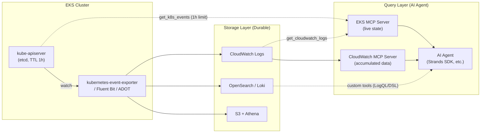

## Overview

Building a system where an AI Agent automatically analyzes Kubernetes events during incidents requires understanding the structural constraints of event data first. Kubernetes events are volatile data retained in the cluster for only 1 hour by default, so the goal of "querying events" necessarily presupposes an export pipeline to external storage. This document covers a 3-layer architecture for collecting, storing, and querying events in EKS environments, and how to expose event data to AI Agents using the EKS MCP server and CloudWatch MCP server.

## Background: Structural Constraints of Kubernetes Events

### 1-Hour TTL

Kubernetes Event objects are stored in etcd, and the default value of the `kube-apiserver` `--event-ttl` flag is `1h0m0s`. EKS has maintained the upstream default of 60 minutes, and because events filling up etcd degrades API server performance, EKS did not allow changing this setting for a long time ([containers-roadmap #785](https://github.com/aws/containers-roadmap/issues/785)). After 60 minutes, etcd deletes the events, so `kubectl get events` can only retrieve the most recent hour of events.

:::info EKS Control Plane Customization (New)
EKS has recently started exposing some scheduler, controller manager, and API server settings through the Kubernetes control plane customization feature, which includes the event time-to-live setting ([EKS console help](https://docs.aws.amazon.com/help-panel/eks/latest/console/hp-control-plane-event-ttl.html)). However, increasing the TTL increases the number of objects stored in etcd, which can affect control plane performance, and the best-effort characteristics below still apply. TTL extension should therefore be treated as a complement to an export pipeline, not a replacement. Supported versions and API details should be verified in the latest documentation before adoption.
:::

### Best-Effort Data

The Kubernetes Event v1 API documentation defines events as follows: *"Events have a limited retention time... should be treated as informative, best-effort, supplemental data."* Events are supplemental signals with no guarantee of retention or delivery, and cannot serve as the sole basis for incident analysis.

### Audit Logs Are Not a Substitute

Enabling EKS control plane audit logs does not capture Event objects, because the EKS audit policy explicitly specifies `Do not log events resources` (`level: None`) ([EKS Best Practices: Auditing and logging](https://docs.aws.amazon.com/eks/latest/best-practices/auditing-and-logging.html)). Audit logs record "who called which API" and are useful for root cause tracing, but they cannot serve as a retention mechanism for Event resources themselves.

:::caution A Common Misconception About EventBridge
Amazon EventBridge `aws.eks` source events only deliver EKS service events (add-on creation/deletion, health, etc.). Kubernetes cluster events such as Pod scheduling failures and OOMKilled are not delivered to EventBridge.
:::

## Architecture: Collect → Store → Query in 3 Layers

To make events queryable by an AI Agent, design collection (export), storage (durable store), and query (query interface) as separate layers.



## Collection Layer: Export Options Compared

| Method | Collection Target | Characteristics | Best Fit |
|------|----------|------|------------|
| **CloudWatch Observability add-on (Container Insights)** | Container/host/dataplane logs | Managed add-on, Fluent Bit based | CloudWatch-centric stack |
| **kubernetes-event-exporter** | All Event objects | Attribute-based filtering/routing, leader election HA, 20+ sinks | Dedicated event pipeline |
| **ADOT / OTel Collector (`k8sobjects` receiver)** | K8s objects including Events | Integrates into existing OTel pipelines | OTel-standardized environments |
| **Custom watcher (aws-samples/eks-event-watcher)** | Selected events | Custom, based on Kubernetes API watch | Special filtering requirements |

:::caution Default Collection Scope of Container Insights
What the standard Container Insights Fluent Bit DaemonSet collects by default is `/aws/containerinsights/{cluster}/application` (container logs), `/host` (host logs), and `/dataplane` (dataplane logs such as kubelet). **Event objects (`kubectl get events`) are not collected by default.** If the claim is "events are being stored via Container Insights," first verify that a separate event collection setup actually exists and which log group it writes to.
:::

kubernetes-event-exporter is the de facto community standard for event pipelines. The [EKS Workshop](https://www.eksworkshop.com/docs/observability/opensearch/events) also uses this tool to export events to OpenSearch. Apply the following for production configurations:

```yaml
# kubernetes-event-exporter configuration example (Loki sink)
logLevel: info
kubeQPS: 100          # prevents event loss in large clusters
kubeBurst: 500
maxEventAgeSeconds: 60
leaderElection:
  enabled: true        # prevents duplicate delivery in HA deployments
receivers:
  - name: "loki"
    loki:
      url: http://loki.monitoring:3100/loki/api/v1/push
      streamLabels:          # static labels only (templates work only in layout/headers)
        app: kube-events
route:
  routes:
    - match:
        - receiver: "loki"
      drop:
        - type: "Normal"   # store only Warnings — Normal is the majority, so this greatly reduces ingestion volume
```

## Storage Layer: Choose by Query Pattern

Choose the store based on "how the events will be queried."

| Store | Query Pattern | Retention Cost | MCP Integration |
|--------|----------|----------|---------|
| **CloudWatch Logs** | Logs Insights queries, pattern analysis | Medium (reduce via S3 export) | Directly supported by CloudWatch MCP and EKS MCP |
| **OpenSearch** | Precise field-based search, dashboards | Medium–high | Custom tool required |
| **Loki** | LogQL, low-cost long-term retention | Low | Custom tool required |
| **S3 + Athena** | SQL post-hoc analysis, archive | Very low | Custom tool required |
| **Kinesis / Firehose** | Real-time stream processing | Volume-based | Custom tool required |

If events are already accumulating in CloudWatch, re-shipping them to Loki (CloudWatch → Loki) wastes a hop. To use Loki as the destination, sending directly from kubernetes-event-exporter to Loki also reduces CloudWatch ingestion costs.

## Query Layer: AI Agent Integration via MCP Servers

### Division of Roles Between the EKS MCP Server and the CloudWatch MCP Server

AWS provides a fully managed EKS MCP server (announced November 2025, preview) and a CloudWatch MCP server. The two servers query different targets, so connecting both is the standard configuration for an incident analysis Agent.

| Aspect | EKS MCP Server | CloudWatch MCP Server |
|------|-------------|-------------------|
| Perspective | **Current state** of cluster and K8s resources | **History** of accumulated logs, metrics, alarms |
| Key tools | `get_k8s_events`, `get_pod_logs`, `list_k8s_resources`, `get_cloudwatch_logs`, `get_eks_insights` | Alarm Based Troubleshooting, Log Analyzer (anomaly/error patterns), Metric Definition Analyzer, Alarm Recommendations |
| Authentication | AWS IAM (SigV4), CloudTrail auditing | AWS IAM (SigV4) |
| Access control | IAM permission separation (`eks-mcp:CallReadOnlyTool` / `CallPrivilegedTool`), `AmazonEKSMCPReadOnlyAccess` managed policy | Read-oriented tool composition |

:::warning `get_k8s_events` on the EKS MCP Server Is Not a Retention Solution
`get_k8s_events` queries the live Kubernetes API and returns events for a specific resource (kind/name/namespace). Because it queries the API server without a separate storage layer, **the etcd TTL constraint applies as-is.** Events older than 1 hour require querying the log group populated by the export pipeline via `get_cloudwatch_logs` or the CloudWatch MCP server. The EKS MCP server is currently in preview, so GA status and tool changes should be re-verified before production adoption.
:::

### Integrating Stores Without an MCP Server

For stores without a provided MCP server, such as OpenSearch and Loki, implement custom tools that wrap the query API (LogQL, OpenSearch DSL) using the Strands Agents SDK or similar, and expose them to the Agent. Whatever the store, standardizing on an MCP or tool interface minimizes Agent code changes when the store is replaced.

## Recommended Architecture Patterns

### Pattern A: Minimal Change (CloudWatch-Centric)

A configuration for starting without adding a pipeline in environments already using Container Insights.

```
Event collector → CloudWatch Logs → CloudWatch MCP + EKS MCP → AI Agent
                                    (+ enable control plane api/audit logs)
```

1. Verify the log group where events are actually stored (see the verification section below).
2. Enable control plane logs (api, audit). Durable API call history compensates for the gaps in (best-effort) events.

```bash
aws eks update-cluster-config \
  --name my-cluster \
  --logging '{"clusterLogging":[{"types":["api","audit"],"enabled":true}]}'
```

3. Connect both the CloudWatch MCP server (history analysis) and the EKS MCP server (current state queries) to the AI Agent.

### Pattern B: Enhanced Search (Dedicated Event Pipeline)

A configuration for cases where precise search on event fields (reason, involvedObject, message) and long-term retention matter.

```
kubernetes-event-exporter ─┬→ OpenSearch/Loki (search & dashboards → custom tools)
                           └→ S3 (long-term archive → Athena SQL post-hoc analysis)
```

### Operating Principles

1. **Never treat events as the sole evidence** — they are best-effort data; cross-verify with audit logs, metrics, and application logs.
2. **Operate the collector explicitly** — manage "who watches events and where they are sent" as a pipeline, and monitor loss indicators (watch lag).
3. **Choose the store by query pattern** — combine real-time (Kinesis), search (OpenSearch/Loki), and archive (S3+Athena) to match requirements.
4. **Expose to AI Agents through standard interfaces** — wrap with MCP servers or SDK custom tools to prepare for store replacement and expansion. Hedge MCP preview-stage risk with your own implementation.

## Verification: Confirming Events Are Being Stored

CloudWatch Logs Insights queries to confirm events are actually accumulating in CloudWatch. Run them against the log group your event collector writes to.

```sql
fields @timestamp, @message
| filter @message like /(?i)(FailedScheduling|OOMKilling|BackOff|Unhealthy|FailedMount)/
| sort @timestamp desc
| limit 50
```

Aggregating occurrence counts by Warning type:

```sql
fields @timestamp
| parse @message /"reason":\s*"(?<reason>[^"]+)"/
| filter ispresent(reason)
| stats count(*) as cnt by reason
| sort cnt desc
```

If events with timestamps older than 1 hour are returned, the export pipeline is working correctly. If only the last hour of data exists, the result is either a live API query or the pipeline started recently, so inspect the collector configuration.

## Summary

Kubernetes events cannot be a query target in their raw form because of the etcd TTL (1 hour by default) and their best-effort characteristics. CloudWatch is not the only option but one of several durable store candidates, and store selection is driven by query patterns (real-time, search, archive). For AI Agent integration, running the EKS MCP server (current state) and the CloudWatch MCP server (accumulated data) side by side is the standard configuration, and the fact that `get_k8s_events` does not bypass the TTL constraint is the key premise of the architecture design.

## References

### Official Documentation
- [kube-apiserver Reference](https://kubernetes.io/docs/reference/command-line-tools-reference/kube-apiserver/) — `--event-ttl` default 1h0m0s
- [Kubernetes Event v1 API](https://kubernetes.io/docs/reference/kubernetes-api/cluster-resources/event-v1/) — best-effort, supplemental data definition
- [EKS Control Plane Logs](https://docs.aws.amazon.com/eks/latest/userguide/control-plane-logs.html) — api/audit log types and how to enable them
- [EKS Best Practices: Auditing and logging](https://docs.aws.amazon.com/eks/latest/best-practices/auditing-and-logging.html) — event exclusion in the audit policy (`level: None`)
- [Amazon EKS MCP Server](https://docs.aws.amazon.com/eks/latest/userguide/eks-mcp-introduction.html) — fully managed MCP server (preview) and [Tools Reference](https://docs.aws.amazon.com/eks/latest/userguide/eks-mcp-tools.html)
- [EKS Event time-to-live Setting](https://docs.aws.amazon.com/help-panel/eks/latest/console/hp-control-plane-event-ttl.html) — event TTL item in control plane customization

### Blogs / Workshops
- [Managing Kubernetes control plane events in Amazon EKS](https://aws.amazon.com/blogs/containers/managing-kubernetes-control-plane-events-in-amazon-eks/) — event TTL constraint and a CloudWatch export solution
- [Enhance your AIOps: CloudWatch & Application Signals MCP servers](https://aws.amazon.com/blogs/mt/enhance-your-aiops-introducing-amazon-cloudwatch-and-application-signals-mcp-servers/) — CloudWatch MCP server tool composition
- [EKS Workshop: Kubernetes events](https://www.eksworkshop.com/docs/observability/opensearch/events) — exporting events to OpenSearch with kubernetes-event-exporter
- [kubernetes-event-exporter](https://github.com/resmoio/kubernetes-event-exporter) — community-standard event export tool

### Related Documents (internal)
- [Observability and Monitoring](./eks-debugging/observability.md) — Container Insights setup and Logs Insights queries
- [EKS Node Monitoring Agent](./node-monitoring-agent.md) — automatic detection of node health events
- [AgenticOps Observability Stack](../../aidlc/operations/observability-stack.md) — observability stack for AI Agent operations
