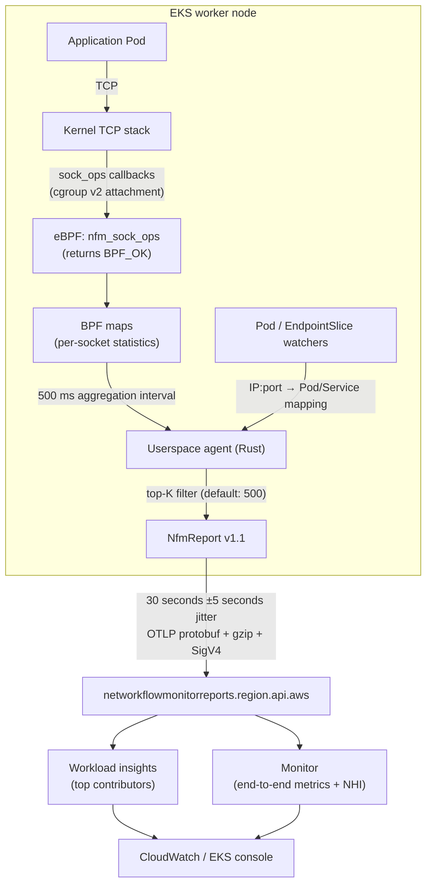

## Overview

CloudWatch Network Flow Monitor (NFM) observes network performance from the workload's perspective. It collects flow-level retransmissions, round-trip time (RTT), and timeouts to help distinguish application problems from AWS network problems. The agent subscribes to socket-event callbacks (`sock_ops`) from the kernel TCP stack. It does not capture packet payloads, use packet mirroring, or attach an XDP program. Its observation scope is TCP.

The agent is open source ([aws/network-flow-monitor-agent](https://github.com/aws/network-flow-monitor-agent), Rust, Apache-2.0), so its collection and publishing paths can be inspected in code. This guide follows the path from kernel collection through userspace aggregation and Kubernetes enrichment to backend publishing, then covers EKS add-on deployment and troubleshooting.

## Background: Backend Components

The backend uses the following concepts.

| Component | Role |
|---|---|
| Scope | The set of accounts to observe. An AWS Organizations scope can include up to 100 accounts. |
| Workload insights | Aggregated flow metrics within a scope and top contributors for each metric, grouped into categories such as intra-AZ, inter-AZ, and inter-VPC traffic. |
| Monitor | Detailed tracking for selected local and remote resources, such as subnets, VPCs, AZs, or EKS clusters. Publishes end-to-end metrics and NHI. |
| Network Health Indicator (NHI) | A binary indicator. **100 means Degraded: at least one flow in the monitored segment experienced an AWS network issue.** |

NHI supplies AWS's assessment of network health during an incident. Its internal calculation is not public. The official documentation also notes that RTT is not available for every observation and can be sparse.

## Architecture: The Data Path



## Kernel Collection

### A Single sock_ops Program

The agent attaches one `BPF_PROG_TYPE_SOCK_OPS` program to cgroup v2 ([nfm-bpf/src/main.rs](https://github.com/aws/network-flow-monitor-agent/blob/main/nfm-bpf/src/main.rs)). The kernel invokes it for events such as TCP state changes, RTT measurements, and retransmissions. The program accumulates per-socket statistics in BPF maps and returns `BPF_OK` so that observation does not change the connection's behavior.

### Events and Collected Values

The following table summarizes `handle_socket_event()` in [sock_ops_handler.rs](https://github.com/aws/network-flow-monitor-agent/blob/main/nfm-common/src/sock_ops_handler.rs).

| sock_ops callback | Recorded values |
|---|---|
| `TCP_CONNECT_CB` | Registers a new client socket, increments `connect_attempts`, and records the connection start time. |
| `PASSIVE_ESTABLISHED_CB` | Registers a new server socket. |
| `STATE_CB` | Records `connect_duration_us` and `connect_successes` on ESTABLISHED; sets termination flags (`TERMINATED_FROM_SYN` / `FROM_EST` / `CLOSED`); records final byte and segment counts on CLOSE. |
| `RTT_CB` | Updates `rtt_latest_us` and `rtt_smoothed_us`; falls back to `srtt_us` and increments `rtts_invalid` when an argument is unavailable. |
| `RETRANS_CB` | Counts retransmitted segments by connection state: `retrans_syn`, `retrans_est`, and `retrans_close`. |
| `RTO_CB` | Counts retransmission timeouts by state: `rtos_syn`, `rtos_est`, and `rtos_close`. |
| `PARSE_HDR_OPT_CB`, `HDR_OPT_LEN_CB` | Updates sent and received byte and segment counts. |

`TIMEOUT_INIT`, `RWND_INIT`, `NEEDS_ECN`, and `ACTIVE_ESTABLISHED_CB` return early; CONNECT and STATE events cover connection establishment. Separating retransmissions and RTOs into SYN, ESTABLISHED, and CLOSE phases helps distinguish connection-establishment failures from loss after a connection has formed.

### Sampling and Capability Reduction

- **Sampling is applied when a socket enters tracking**, at CONNECT or PASSIVE_ESTABLISHED, using `sampling_interval` in the `NFM_CONTROL` map. Subsequent events for a tracked socket remain part of its statistics.
- The agent starts privileged, then drops `CAP_SYS_ADMIN`, `CAP_PERFMON`, and `CAP_NET_ADMIN` after loading eBPF. It retains **`CAP_BPF`** for BPF-map access; see `drop_capabilities` in [lib.rs](https://github.com/aws/network-flow-monitor-agent/blob/main/nfm-controller/src/lib.rs).

## Userspace Aggregation, Enrichment, and Publishing

### Timer-Driven Main Loop

Three timers drive the main loop. The principal options and defaults are:

| Option | Default | Purpose |
|---|---|---|
| `--aggregate-msecs` | 500 | Interval for aggregating BPF-map data into userspace flows. |
| `--publish-secs` / `--jitter-secs` | 30 / 5 | Publishing interval and jitter, giving an effective interval of 25–35 seconds. |
| `--top-k` | 500 | Maximum flows per report; prioritizes flows with greater loss. |
| `--notrack-secs` | 65 | Stops tracking idle sockets; covers six TCP exponential-backoff intervals totaling up to 63 seconds. |
| `--report-compression` | gzip | Report compression. |
| `--kubernetes-metadata` | off | Enables Pod and EndpointSlice watchers. The EKS add-on entrypoint enables it. |
| `--resolve-nat` | off | Uses conntrack to recover addresses behind local NAT. |

### Kubernetes Enrichment: Adding Pod and Service Names

[kubernetes_metadata_collector.rs](https://github.com/aws/network-flow-monitor-agent/blob/main/nfm-controller/src/kubernetes/kubernetes_metadata_collector.rs) supplies the Kubernetes context used by the EKS console's service map.

1. **Pod and EndpointSlice watchers** maintain an `IP address → (TCP port → {pod, namespace, service})` map. The Service name comes from the EndpointSlice's `kubernetes.io/service-name` label, falling back to its owner reference. Pod events preserve entries populated by EndpointSlices because the latter contain richer metadata.
2. For each flow, the agent looks up the local and remote addresses. On a client flow, the remote port can identify the remote Pod. The local ephemeral port does not identify an application port, so the agent assigns a local Pod only when all ports associated with that IP map to the same Pod. The direction is reversed for a server flow.
3. IPv4-mapped IPv6 addresses such as `::ffff:10.0.0.1` are also looked up as IPv4 addresses. The map considers **TCP ports only**, ignoring UDP container ports.

### Report Contents

`NfmReport` version 1.1 ([report.rs](https://github.com/aws/network-flow-monitor-agent/blob/main/nfm-controller/src/reports/report.rs)) contains:

- `network_stats[]`: per-flow socket-state counts, sent and received bytes and segments, state-specific retransmissions and RTOs, and the `connect_us`, `rtt_us`, and `rtt_smoothed_us` histograms.
- `host_stats.interface_stats[]`: **ENA allowance counters**, including `bw_in/out_allowance_exceeded`, `pps_allowance_exceeded`, `conntrack_allowance_exceeded/available`, and `linklocal_allowance_exceeded`. Reporting these alongside flow metrics helps correlate loss with instance networking limits.
- `process_stats`: the agent's CPU use, memory use, and tracked-socket count.
- `k8s_metadata`: `node_name` and `cluster_name`.

### Publishing Path

The agent converts `NfmReport` to an OpenTelemetry `ExportMetricsServiceRequest` protobuf, compresses it with gzip, signs it with **SigV4 using the service name `networkflowmonitor`**, and POSTs it to `https://networkflowmonitorreports.<region>.api.aws/publish`. See [publisher_endpoint.rs](https://github.com/aws/network-flow-monitor-agent/blob/main/nfm-controller/src/reports/publisher_endpoint.rs). A response other than HTTP 200 increments `failed_reports`, which is included in a later report. A log entry containing `HTTP request complete, status:200 ... publisher_endpoint` confirms a successful publishing request.

The source also supports other destinations. `--prometheus-workspace-id` selects an Amazon Managed Service for Prometheus remote-write endpoint. Building with the `open-metrics` feature exposes a local Prometheus scrape server.

## EKS Deployment and Operations

### Installation

The EKS add-on name is `aws-network-flow-monitoring-agent`. The source guide describes Kubernetes 1.25+ and agent images in the v1.1.x series; select an add-on version compatible with the cluster when deploying. Pod Identity supplies the credentials used for SigV4 signing, so install **`eks-pod-identity-agent`** first and attach the managed policy `CloudWatchNetworkFlowMonitorAgentPublishPolicy` to the agent's IAM role.

```bash
aws eks create-addon --cluster-name <CLUSTER> \
  --addon-name aws-network-flow-monitoring-agent \
  --pod-identity-associations \
    serviceAccount=aws-network-flow-monitor-agent-service-account,roleArn=<ROLE_ARN>
```

### Resource Names

The add-on, namespace, and DaemonSet have slightly different names.

| Resource | Name |
|---|---|
| EKS add-on | `aws-network-flow-monitoring-agent` (**monitoring**) |
| Namespace | `amazon-network-flow-monitor` (**monitor**, without **ing**) |
| DaemonSet / Pod label | `aws-network-flow-monitor-agent` / `name=aws-network-flow-monitor-agent` |
| ServiceAccount | `aws-network-flow-monitor-agent-service-account` |
| Internal container-image name | `aws-network-sonar-agent` |

```bash
# Check the agent using the exact namespace and label.
kubectl get pods -n amazon-network-flow-monitor -l name=aws-network-flow-monitor-agent
kubectl logs -n amazon-network-flow-monitor -l name=aws-network-flow-monitor-agent \
  --tail=50 | grep publisher_endpoint
```

### Constraints

- **TCP only**: the sock_ops collection path does not observe UDP or ICMP flows.
- **Kernel 5.8+ and cgroup v2 are required.**
- **Fargate is unsupported**: the DaemonSet requires privileged access and a hostPath mount for cgroup.
- **Distribution compatibility matters**: the agent README identifies SUSE 15 SP5 and Ubuntu 20.04 as unsupported because their kernel configuration restricts required BPF helpers to GPL-licensed programs.

### Enabled but No Data: Three Diagnostic Layers

Check the collection path from the agent upward.

1. **Agent publishing**: confirm an agent Pod is running on each expected node and inspect logs for `status:200 ... publisher_endpoint`. For HTTP 403, check the Pod Identity association and IAM policy. For timeouts, check the outbound path, including proxies and VPC endpoints.
2. **Scope**: confirm the account belongs to the intended NFM scope. A successful publishing request alone does not establish that the console is querying the appropriate scope.
3. **Monitor**: confirm that a monitor covers the local and remote resources for the flows being investigated. An EKS cluster can be selected as a local resource.

If the service map is empty despite `--kubernetes-metadata` being enabled, investigate enrichment. The agent's `Flow enrichment completed.` log message indicates that an enrichment pass has completed.

## Summary

NFM uses a cgroup v2 `sock_ops` program to collect TCP socket events, aggregates them into flows in userspace, adds Kubernetes context through Pod and EndpointSlice watchers, and publishes signed OTLP reports. Workload insights provides scope-level contributors, while monitors provide end-to-end metrics and NHI. Use the publishing, scope, and monitor layers to locate missing-data problems, and account for the agent's TCP-only observation boundary.

## References

### Official Documentation

- [Components and features of Network Flow Monitor](https://docs.aws.amazon.com/AmazonCloudWatch/latest/monitoring/CloudWatch-NetworkFlowMonitor-components.html) — Scope, workload insights, monitors, and NHI.
- [Using Network Flow Monitor](https://docs.aws.amazon.com/AmazonCloudWatch/latest/monitoring/CloudWatch-NetworkFlowMonitor.html) — Service overview.
- [Install the agent on EKS clusters](https://docs.aws.amazon.com/AmazonCloudWatch/latest/monitoring/CloudWatch-NetworkFlowMonitor-agents-kubernetes-eks.html) — Add-on installation and Pod Identity.

### Source Code

- [nfm-bpf/src/main.rs](https://github.com/aws/network-flow-monitor-agent/blob/main/nfm-bpf/src/main.rs) — The sock_ops eBPF program.
- [nfm-common/src/sock_ops_handler.rs](https://github.com/aws/network-flow-monitor-agent/blob/main/nfm-common/src/sock_ops_handler.rs) — Callback handling.
- [nfm-controller/src/lib.rs](https://github.com/aws/network-flow-monitor-agent/blob/main/nfm-controller/src/lib.rs) — Main loop, defaults, and capability reduction.
- [kubernetes_metadata_collector.rs](https://github.com/aws/network-flow-monitor-agent/blob/main/nfm-controller/src/kubernetes/kubernetes_metadata_collector.rs) — Pod and EndpointSlice enrichment.
- [reports/report.rs](https://github.com/aws/network-flow-monitor-agent/blob/main/nfm-controller/src/reports/report.rs) and [publisher_endpoint.rs](https://github.com/aws/network-flow-monitor-agent/blob/main/nfm-controller/src/reports/publisher_endpoint.rs) — Report schema and publishing.

### Related Documents

- [How VPC CNI Works](../networking-performance/vpc-cni-deep-dive.md) — The datapath being observed.
- [EKS Node Monitoring Agent](./node-monitoring-agent.md) — Node health monitoring.
- [Networking Debugging](./eks-debugging/networking.md) — Network troubleshooting procedures.
- [Nitro Architecture and Tuning](../networking-performance/nitro-architecture-performance-tuning.md) — ENA allowance limits.
