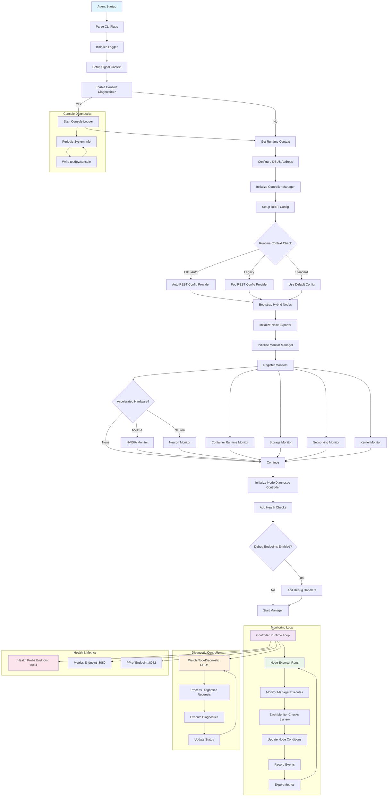

## Overview

The EKS Node Monitoring Agent (NMA) is an AWS-provided node health monitoring tool. It automatically detects and reports hardware and system-level issues that occur on EKS cluster nodes. Generally available since 2024, it works alongside Node Auto Repair to improve cluster stability.

### Problems Addressed

Traditional EKS cluster operations faced the following problems:

- Insufficient early detection of hardware failures
- Manual monitoring required for system-level issues
- Delayed response to node state changes
- Lack of integration between problem detection and automatic recovery

NMA was designed to address these problems.

### Key Features

- **Log-based problem detection**: Real-time analysis of system logs with pattern matching
- **Automatic event generation**: Creates Kubernetes Events and Node Conditions upon detection
- **CloudWatch integration**: Sends detected issues to CloudWatch for centralized monitoring
- **EKS Add-on support**: Simple installation and management

:::warning Important

NMA is a useful tool for automatically detecting node health issues, but on its own it cannot serve as a complete monitoring solution. It requires appropriate expectation-setting that accounts for the limitations below, along with complementary tooling.

:::

:::tip Key Recommendations

**✅ Recommended usage**

- Use NMA as a node-state detection layer
- Complement with Container Insights or Prometheus for metric collection
- Use together with Node Auto Repair to implement automatic recovery
- Tune thresholds to each environment's characteristics

**❌ Usage to avoid**

- Relying on NMA alone for full monitoring
- Expecting it to handle sudden hardware failures

:::

## 1. Design Goals

### 1.1 Comprehensive Node Health Monitoring

NMA monitors various system components on EKS nodes:

- **Container Runtime**: Health of Docker/containerd
- **Storage System**: Disk space and I/O performance monitoring
- **Networking**: Network connectivity and configuration validation
- **Kernel**: Kernel modules and system state checks
- **Accelerated Hardware**: GPU (NVIDIA) and Neuron chip health (when such hardware is detected)

### 1.2 Kubernetes-Native Integration

NMA integrates tightly with Kubernetes using controller-runtime:

```go
mgr, err := controllerruntime.NewManager(controllerruntime.GetConfigOrDie(), controllerruntime.Options{
    Logger:                 log.FromContext(ctx),
    Scheme:                 scheme.Scheme,
    HealthProbeBindAddress: controllerHealthProbeAddress,
    BaseContext:            func() context.Context { return ctx },
    Metrics:                server.Options{BindAddress: controllerMetricsAddress},
})
```

### 1.3 Support for Diverse EKS Environments

As seen in the REST configuration logic, NMA supports diverse EKS environments:

- **EKS Auto**: Uses a special user impersonation flow
- **Legacy RBAC**: Supports the legacy permission model
- **Standard**: Standard Pod-based authentication

## 2. Architecture and Operating Principles

### 2.1 Agent Startup and Initialization Flow

The following diagram shows NMA's startup process and the overall flow of its monitoring loop.



### 2.2 Monitor Registration and Management

NMA manages each subsystem through monitor configuration. The following shows the structure of monitor registration.

```go
var monitorConfigs = []monitorConfig{
    {
        Monitor:       &runtime.RuntimeMonitor{},
        ConditionType: rules.ContainerRuntimeReady,
    },
    {
        Monitor:       storage.NewStorageMonitor(),
        ConditionType: rules.StorageReady,
    },
    // ... additional monitors
}
```

Each monitor is linked to a corresponding Node Condition and reports its status.

### 2.3 Node Condition-Based Status Reporting

NMA leverages the Kubernetes Node Condition mechanism to report the status of each subsystem:

- `ContainerRuntimeReady`: container runtime status
- `StorageReady`: storage subsystem status
- `NetworkingReady`: networking status
- `KernelReady`: kernel status
- `AcceleratedHardwareReady`: GPU/Neuron hardware status (conditional)

### 2.4 Real-Time Diagnostics

On-demand diagnostics execution via the NodeDiagnostic CRD:

```go
diagnosticController := controllers.NewNodeDiagnosticController(mgr.GetClient(), hostname, runtimeContext)
```

This lets operators run diagnostic commands in real time on a specific node.

### 2.5 Observability

NMA provides observability through various endpoints:

- **Health Probe** (`:8081`): Kubernetes health checks
- **Metrics** (`:8080`): Prometheus metrics exposure
- **PProf** (`:8082`): Go profiling (optional)

### 2.6 Console Diagnostic Logging

When the `-console-diagnostics` flag is enabled, system information is periodically written to `/dev/console`:

```go
if enableConsoleDiagnostics {
    startConsoleDiagnostics(ctx)
}
```

This provides instance-level visibility.

### 2.7 Deployment and Operational Characteristics

#### 2.7.1 DaemonSet-Based Deployment

As seen in `agent.tpl.yaml`, NMA is deployed as a DaemonSet and runs on all worker nodes:

```yaml
kind: DaemonSet
apiVersion: apps/v1
metadata:
  name: eks-node-monitoring-agent
  namespace: kube-system
```

#### 2.7.2 Node Selection and Constraints

The affinity settings in `values.yaml` restrict execution to specific node types:

- Excludes Fargate nodes
- Excludes EKS Auto compute types
- Excludes HyperPod nodes
- Supports AMD64/ARM64 architectures only

#### 2.7.3 Permission Management

The RBAC settings in `agent.tpl.yaml` apply the principle of least privilege:

```yaml
rules:
  # monitoring permissions
  - apiGroups: [""]
    resources: ["events"]
    verbs: ["create", "patch"]
  # nodediagnostic permissions
  - apiGroups: ["eks.amazonaws.com"]
    resources: ["nodediagnostics"]
    verbs: ["get", "watch", "list"]
```

#### 2.7.4 Resource Efficiency

The resource limits defined in `values.yaml` keep operation lightweight:

```yaml
resources:
  requests:
    cpu: 10m
    memory: 30Mi
  limits:
    cpu: 250m
    memory: 100Mi
```

### 2.8 Types of Detectable Issues

The node health issues that NMA detects are divided into two categories by **severity**. This distinction must be understood precisely because it determines whether Node Auto Repair acts.

- **Condition**: a terminal issue warranting node Replace or Reboot. When Auto Repair is enabled, a repair action is taken.
- **Event**: a temporary or non-critical issue, or a sub-optimal node configuration. It **does not trigger an Auto Repair action** and is recorded for investigation/alerting only.

Multiple detailed issues are mapped under each monitoring condition type (`ContainerRuntimeReady`, `KernelReady`, `NetworkingReady`, `StorageReady`, `AcceleratedHardwareReady`). Even within the same condition type, the severity (Condition vs. Event) differs per detailed issue.

#### 2.8.1 Container Runtime Issues (`ContainerRuntimeReady`)

Directly relevant to scenarios where containerd load/failure causes node problems.

| Name | Severity | Description | Repair Action |
|------|----------|-------------|---------------|
| `PodStuckTerminating` | **Condition** | A pod is excessively delayed in terminating (e.g., due to CRI errors), unable to progress state | **Replace** |
| `ContainerRuntimeFailed` | Event | The runtime failed to create a container (a failure signal if recurring) | None |
| `KubeletFailed` | Event | The kubelet entered a failed state | None |
| `DeprecatedContainerdConfiguration` | Event | A deprecated image manifest (v2 schema 1) pull occurred | None |
| `Liveness/ReadinessProbeFailures` | Event | Probe failure detected (possible app code issue or insufficient timeout) | None |
| `[Name]RepeatedRestart` / `ServiceFailedToStart` | Event | Frequent restarts / startup failure of a systemd unit | None |

→ **Key point**: Only the level where containerd is fully broken and pods cannot terminate (`PodStuckTerminating`) is classified as a Condition and leads to node replacement. A plain container-create failure (`ContainerRuntimeFailed`) is recorded as an Event only and is not auto-remediated.

#### 2.8.2 Major Kernel / Networking / Storage Issues

Only the representative items classified as Condition (auto-repair targets) are listed. Most other items are Events.

| Condition type | Condition issues (Replace) | Representative Event issues |
|------|------|------|
| `KernelReady` | `ForkFailedOutOfPIDs` (PID/memory exhaustion) | `SoftLockup`, `KernelBug`, `ApproachingKernelPidMax`, `ConntrackExceededKernel` |
| `NetworkingReady` | `IPAMDNotRunning`, `IPAMDNotReady`, `InterfaceNotUp/Running`, `MissingLoopbackInterface` | `ConntrackExceeded`, `BandwidthIn/OutExceeded`, `PPSExceeded`, `NetworkSysctl` |
| `StorageReady` | (all items in that table are Events) | `EBSVolumeIOPS/ThroughputExceeded`, `IODelays`, `KubeletDiskUsageSlow` |

:::warning DiskPressure / MemoryPressure / PIDPressure are NOT auto-repair targets

`DiskPressure`, `MemoryPressure`, and `PIDPressure` are standard Kubernetes conditions, and **Node Auto Repair intentionally does not react to them.** These are more likely to indicate application behavior, workload configuration, or resource-limit issues than node-level faults, making it hard to define an appropriate default repair action. In these cases, handling is delegated to the Kubernetes [node-pressure eviction](https://kubernetes.io/docs/concepts/scheduling-eviction/node-pressure-eviction/) behavior.

→ If containerd load **manifests as memory/disk pressure or PID exhaustion, the node is not automatically replaced.** The load must be caught as a runtime failure itself (a Condition such as `PodStuckTerminating`) for Auto Repair to act.

:::

#### 2.8.3 Accelerated Hardware Issues (`AcceleratedHardwareReady`)

Detects NVIDIA GPU and AWS Neuron accelerator health. For NVIDIA XID errors, only well-known codes are classified as Conditions (`NvidiaXID[Code]Error`) and trigger repair; unregistered codes are recorded as Events only (`NvidiaXID[Code]Warning`). Refer to AWS official documentation for per-XID-code repair actions (Reboot/Replace).

| Representative issue | Severity | Repair Action |
|------|------|------|
| `NvidiaXID[Code]Error` (well-known) | Condition | Replace or Reboot (varies by code) |
| `NvidiaNVLinkError`, `NvidiaDoubleBitError` | Condition | Replace |
| `NeuronDMAError`, `NeuronHBMUncorrectableError` | Condition | Replace |
| `DCGMError`, `DCGMDiagnosticFailure` | Condition | None |
| `NvidiaThermalError`, `NvidiaPowerError`, `NvidiaPageRetirement` | Event | None |

## 3. Node Auto Repair Integration

On its own, NMA only provides visibility (exposing NodeConditions and events). Automatic replacement/reboot for detected Conditions happens only when used together with Node Auto Repair.

### 3.1 Auto Repair Reaction Targets With/Without NMA

| Configuration | What Auto Repair reacts to |
|------|------|
| Auto Repair alone (no NMA) | kubelet's `Ready` condition, manually deleted node objects, managed node group instances that fail to join the cluster |
| Auto Repair + NMA | The above, **plus** `AcceleratedHardwareReady`, `ContainerRuntimeReady`, `KernelReady`, `NetworkingReady`, `StorageReady` |

### 3.2 Per-Condition Repair Wait Time and Action

These are default behaviors, applied commonly across EKS Auto Mode, managed node groups, and Karpenter. `Reboot` is supported only on managed node groups; Auto Mode and Karpenter both act with `Replace`.

| Condition | Repair after | Action |
|------|------|------|
| `AcceleratedHardwareReady` | 10 min | Replace or Reboot |
| `ContainerRuntimeReady` | 30 min | Replace |
| `KernelReady` | 30 min | Replace |
| `NetworkingReady` | 30 min | Replace |
| `StorageReady` | 30 min | Replace |
| `Ready` | 30 min | Replace |
| `DiskPressure` / `MemoryPressure` | N/A | None |

### 3.3 Runaway-Prevention Guardrails

To prevent cascading node replacement during mass failures, new repair actions are halted by default in the following situations (in-progress repairs continue).

- **Managed node groups**: When there are more than 5 nodes and more than 20% of the group's nodes are unhealthy, or when an ARC (Application Recovery Controller) zonal shift occurs
- **Auto Mode / Karpenter**: When more than 20% of the NodePool's nodes are unhealthy (for standalone NodeClaims, 20% of the cluster)

### 3.4 Enablement

- **EKS Auto Mode**: Always enabled (not configurable)
- **Karpenter**: Set feature gate `NodeRepair=true`
- **Managed node groups**: Console "Enable node auto repair" checkbox / CLI `--node-repair-config enabled=true` / eksctl `nodeRepairConfig.enabled: true`

Managed node groups can customize detailed behavior with `maxUnhealthyNodeThresholdCount/Percentage`, `maxParallelNodesRepairedCount/Percentage`, and per-condition/reason `nodeRepairConfigOverrides` (e.g., immediate Replace for a specific NVIDIA XID error, NoAction for others).

## 4. Differences by Deployment Method

### 4.1 Manual Mode (DaemonSet)

**Pros:**

- Flexible version management
- ConfigMap-based configuration changes
- Custom configuration possible

**Cons:**

- High kubelet dependency
- Delay during node bootstrap
- Affected by kubelet failures

### 4.2 EKS Auto Mode

**Pros:**

- Built directly into the AMI
- Runs independently of kubelet
- Higher availability
- Faster problem detection

**Cons:**

- AMI replacement required for updates
- Limited customization

## 5. Technical Limitations

### 5.1 Metric Collection Limits

- **NMA is not a metric collection tool**: Cannot collect performance metrics (CPU, memory utilization, etc.)
- **Log-parsing approach**: Does not use cAdvisor; purely log-analysis based
- **Prometheus endpoint**: Exposes only limited health-status metrics (port 8080)

### 5.2 Constraints When Using Alternative Backends

:::warning When using a backend other than CloudWatch

- No native ADOT integration
- Very limited Prometheus metric coverage
- No configuration-change options
- Limited official documentation and support

:::

### 5.3 Hardware Failure Detection Limits

**Detectable:**

- ✅ Gradual performance degradation
- ✅ Increasing I/O errors
- ✅ Memory ECC errors

**Not detectable:**

- ❌ Sudden power loss
- ❌ Instantaneous hardware failure
- ❌ Complete network disconnection

## 6. Recommended Implementation Strategy

### 6.1 Multi-Layer Monitoring Architecture

```
Integrated monitoring stack:
├── L1: State detection (NMA)
│   └── Early detection of node problems
├── L2: Metric collection (Container Insights/Prometheus)
│   └── Detailed performance data
├── L3: Automatic response (Node Auto Repair)
│   └── Automatic replacement of problem nodes
└── L4: Unified dashboard (CloudWatch/Grafana)
    └── Comprehensive monitoring view
```

### 6.2 Recommended Configuration When Using Prometheus

When using NMA together with Node Exporter, the following configuration is recommended.

```yaml
apiVersion: v1
kind: Service
metadata:
  name: monitoring-stack
spec:
  components:
    - name: nma
      purpose: "node state events"
      port: 8080
    - name: node-exporter
      purpose: "detailed system metrics"
      port: 9100
    - name: kube-state-metrics
      purpose: "cluster state metrics"
      port: 8080
```

## 7. Cost and Performance Considerations

### 7.1 Resource Usage

NMA is a very lightweight component. Based on EKS add-on / Helm chart defaults, the resource requests and limits are as follows.

| Resource | requests | limits |
|----------|----------|--------|
| CPU | 10m | 250m |
| Memory | 30Mi | 100Mi |

On NVIDIA GPU instances, a DCGM server component (`nv-hostengine`) also starts and can be tuned separately via `dcgmAgent.resources.*` values. Adjust resource requests/limits for your environment via the add-on configuration values (`monitoringAgent.resources.*`).

### 7.2 CloudWatch Cost

| Item | Cost |
|------|------|
| Custom metrics | $0.30/metric/month |
| Events | $1.00/million events |
| Logs | $0.50/GB ingested |

## 8. Best Practices

### 8.1 Production Deployment

1. **Phased rollout**: Dev → Staging → Production
2. **Alert threshold tuning**: Account for each environment's characteristics
3. **Enable auto repair cautiously**: Start with monitoring only
4. **Regular testing**: Monthly failure simulations

### 8.2 Integration With Other Tools

| Combination | Description |
|------|------|
| NMA + Container Insights | Fully AWS-native visibility |
| NMA + Prometheus + Grafana | Open-source monitoring stack |
| NMA + Datadog/New Relic | Enterprise-grade monitoring solution |

## References

### Official Documentation
- [Detect node health issues and enable automatic node repair](https://docs.aws.amazon.com/eks/latest/userguide/node-health.html) — NMA/Auto Repair overview and NodeCondition list
- [Detect node health issues with the EKS node monitoring agent](https://docs.aws.amazon.com/eks/latest/userguide/node-health-nma.html) — Full detected-issue tables (Condition/Event), XID codes, add-on config values
- [Automatically repair nodes in EKS clusters](https://docs.aws.amazon.com/eks/latest/userguide/node-repair.html) — Per-condition repair actions/timeouts, guardrails, customization
- [aws/eks-node-monitoring-agent](https://github.com/aws/eks-node-monitoring-agent) — NMA source code and Helm chart

### Technical Blogs
- [Amazon EKS introduces node monitoring and auto repair capabilities](https://aws.amazon.com/blogs/containers/amazon-eks-introduces-node-monitoring-and-auto-repair-capabilities/) — Launch announcement and architecture overview

### Related Documents (internal)
- [EKS Troubleshooting and Response](./eks-debugging/index.md) — Systematic diagnosis of node/workload issues
- [Pod Health Checks & Lifecycle](./eks-pod-health-lifecycle.md) — Probe configuration and graceful shutdown
- [AWS Nitro Architecture and Performance Tuning](../networking-performance/nitro-architecture-performance-tuning.md) — Per-generation node-hardware characteristics and kernel tuning
