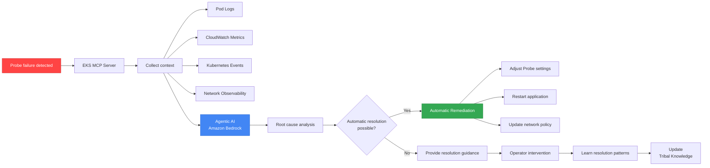

[Pod lifecycle overview](../eks-pod-health-lifecycle.md) · [Checklist and references](./checklist-references.md)

## AI/Agentic Probe Optimization {#75-aiagentic-기반-probe-최적화}

This chapter covers automatically optimizing Probe settings and diagnosing failures using the Agentic AI patterns for EKS operations introduced in the AWS re:Invent 2025 CNS421 session.

### CNS421 Session Highlights - Agentic AI for EKS Operations {#cns421-세션-핵심---agentic-ai-for-eks-operations}

**Session overview:**

The "Streamline Amazon EKS Operations with Agentic AI" session presented code demonstrations of automating EKS cluster management with the Model Context Protocol (MCP) and AI agents.

**Key capabilities:**
- Real-time issue diagnosis (automatic analysis of Probe failure causes)
- Guided Remediation (step-by-step resolution guidance)
- Use of Tribal Knowledge (learning from past issue patterns)
- Auto-Remediation (automatic resolution of straightforward issues)

**Architecture:**



### Automatic Probe Optimization with Kiro + EKS MCP {#kiro--eks-mcp를-활용한-probe-자동-최적화}

**About Kiro:**

Kiro is an AI-powered operations tool from AWS that interacts with AWS resources through Model Context Protocol (MCP) servers.

**Installation and configuration:**

```bash
# Install the Kiro CLI (macOS)
brew install aws/tap/kiro

# Configure the EKS MCP Server
kiro mcp add eks \
  --server-type eks \
  --cluster-name production-eks \
  --region ap-northeast-2

# Enable the Probe optimization agent
kiro agent create probe-optimizer \
  --type eks-health-check \
  --auto-remediate true
```

**Automatic Probe failure diagnosis workflow:**

```yaml
# Kiro Agent configuration - automatic response to Probe failures
apiVersion: kiro.aws/v1alpha1
kind: Agent
metadata:
  name: probe-failure-analyzer
spec:
  cluster: production-eks
  triggers:
    - type: ProbeFailure
      conditions:
        - probeType: readiness
          failureThreshold: 3
          duration: 5m
  actions:
    - name: collect-context
      steps:
        - getPodLogs:
            namespace: ${event.namespace}
            podName: ${event.podName}
            tailLines: 500
        - getCloudWatchMetrics:
            namespace: ContainerInsights
            metricName: pod_cpu_utilization
            dimensions:
              - name: PodName
                value: ${event.podName}
            period: 300
        - getNetworkObservability:
            podName: ${event.podName}
            metrics:
              - latency
              - packetLoss
              - connectionErrors
        - getKubernetesEvents:
            namespace: ${event.namespace}
            fieldSelector: involvedObject.name=${event.podName}

    - name: analyze-root-cause
      llm:
        model: anthropic.claude-3-5-sonnet-20241022-v2:0
        prompt: |
          Analyze the following Kubernetes Readiness Probe failure:

          Pod: ${event.podName}
          Namespace: ${event.namespace}
          Probe Config:
          ${context.probeConfig}

          Pod Logs (last 500 lines):
          ${context.podLogs}

          CloudWatch Metrics (last 5 minutes):
          ${context.metrics}

          Network Observability:
          ${context.networkMetrics}

          Kubernetes Events:
          ${context.events}

          Determine the root cause and suggest:
          1. Is this a network issue, application issue, or configuration issue?
          2. Recommended Probe settings (periodSeconds, failureThreshold, timeoutSeconds)
          3. Auto-remediation actions if applicable

    - name: auto-remediate
      conditions:
        - type: RootCauseIdentified
          confidence: ">0.8"
      steps:
        - applyProbeOptimization:
            when: ${analysis.recommendedAction == "adjust_probe_settings"}
            patchDeployment:
              name: ${event.deploymentName}
              namespace: ${event.namespace}
              patch:
                spec:
                  template:
                    spec:
                      containers:
                        - name: ${event.containerName}
                          readinessProbe:
                            periodSeconds: ${analysis.recommendedPeriod}
                            failureThreshold: ${analysis.recommendedThreshold}
                            timeoutSeconds: ${analysis.recommendedTimeout}

        - restartPod:
            when: ${analysis.recommendedAction == "restart_pod"}
            namespace: ${event.namespace}
            podName: ${event.podName}

        - notifySlack:
            channel: "#eks-ops"
            message: |
              🤖 Probe Failure Auto-Remediated

              Pod: ${event.podName}
              Root Cause: ${analysis.rootCause}
              Action Taken: ${analysis.appliedAction}
              Confidence: ${analysis.confidence}

              Details: ${analysis.explanation}

    - name: manual-guide
      conditions:
        - type: RootCauseIdentified
          confidence: "<0.8"
      steps:
        - createJiraTicket:
            project: DEVOPS
            issueType: Incident
            summary: "Probe Failure - Manual Investigation Required"
            description: |
              Pod: ${event.podName}
              Potential Causes: ${analysis.possibleCauses}
              Investigation Steps: ${analysis.investigationSteps}
              Context: ${context}
```

**Usage example - automatic Probe timeout optimization:**

```bash
# Interactive Probe optimization with Kiro
$ kiro chat --agent probe-optimizer

User: My readiness probe is failing intermittently on pod api-gateway-xyz.
      Can you diagnose and fix it?

Kiro: 🔍 Analyzing probe failures for pod api-gateway-xyz...

      ✅ Root Cause Identified (Confidence: 92%)
      - Issue: Network latency spikes to external database
      - Current Probe: periodSeconds=5, timeoutSeconds=3, failureThreshold=2
      - Network metrics show p99 latency: 2.8 seconds

      📊 Recommendation:
      1. Increase timeoutSeconds from 3 to 5 seconds
      2. Increase failureThreshold from 2 to 3
      3. Enable Container Network Observability for ongoing monitoring

      🤖 Auto-Remediation Available
      Shall I apply these changes? (yes/no)

User: yes

Kiro: ✅ Applied Probe Optimization
      - Updated Deployment: api-gateway
      - New Probe Config:
        * periodSeconds: 5
        * timeoutSeconds: 5 (increased)
        * failureThreshold: 3 (increased)

      📈 Monitoring for 5 minutes to verify stability...

      ✅ Verification Complete
      - Probe failures reduced from 12/hour to 0/hour
      - Network latency p99: 2.8s (within new 5s timeout)
      - Recommendation recorded in tribal knowledge

      💡 Suggestion: Consider moving database to same VPC
          to reduce network latency permanently.
```

### Debugging Probe Issues with Amazon Q Developer {#amazon-q-developer를-활용한-probe-이슈-디버깅}

Amazon Q Developer is an AI assistant integrated into the IDE that supports code review of Probe configurations and real-time debugging.

**VS Code integration example:**

```yaml
# Deployment YAML being written by a developer
apiVersion: apps/v1
kind: Deployment
metadata:
  name: myapp
spec:
  template:
    spec:
      containers:
      - name: app
        image: myapp:v1
        readinessProbe:
          httpGet:
            path: /health  # ⚠️ Q Developer warning
            port: 8080
          periodSeconds: 10
          timeoutSeconds: 1  # ⚠️ Q Developer warning
```

**Q Developer suggestions:**

```
💡 Amazon Q Developer Suggestion

Issue 1: Liveness and Readiness use the same endpoint.
Recommendation:
- Liveness Probe: /healthz (internal state only)
- Readiness Probe: /ready (including external dependencies)

Issue 2: timeoutSeconds is too short.
Recommendation:
- Increase timeoutSeconds to 3-5 seconds
- In EKS environments, a 1-second timeout risks failures during network latency spikes

Issue 3: No Startup Probe is configured.
Recommendation:
- Add a Startup Probe if application startup takes 30 seconds or longer
- failureThreshold: 30, periodSeconds: 10

Apply Suggestions? [Yes] [No] [Explain More]
```

**Real-time code execution validation (Amazon Q Developer):**

```bash
# Q Developer validates the Probe configuration locally
$ q-dev validate deployment.yaml --cluster production-eks

✅ Syntax Valid
⚠️  Best Practices Check:
    - Missing Startup Probe for slow-starting app (15 warnings)
    - Liveness Probe includes external dependency (critical)
    - terminationGracePeriodSeconds should be at least 60s (warning)

🧪 Simulation Results:
    - Probe success rate: 94% (target: >99%)
    - Estimated pod startup time: 45 seconds
    - Estimated graceful shutdown time: 25 seconds

📊 Recommendation:
    Apply Q Developer's suggested configuration? (Y/n)
```

### Learning Probe Patterns from Tribal Knowledge {#tribal-knowledge-기반-probe-패턴-학습}

Agentic AI learns from previous Probe issue resolutions to respond immediately to similar situations.

**Tribal Knowledge example:**

```yaml
# Organization's library of Probe resolution patterns
apiVersion: kiro.aws/v1alpha1
kind: TribalKnowledge
metadata:
  name: probe-failure-patterns
spec:
  patterns:
    - id: pattern-001
      name: "Database Connection Timeout"
      symptoms:
        - probeType: readiness
          errorPattern: "connection timeout"
          frequency: intermittent
      rootCause: "Database in different AZ causing high latency"
      solution:
        - action: increaseTimeout
          from: 3
          to: 5
        - action: addRetry
          retries: 2
      confidence: 0.95
      resolvedCount: 47
      lastSeen: "2026-02-10"

    - id: pattern-002
      name: "Slow JVM Startup"
      symptoms:
        - probeType: startup
          errorPattern: "probe failed"
          timing: "first 60 seconds"
      rootCause: "JVM initialization takes >30 seconds"
      solution:
        - action: addStartupProbe
          failureThreshold: 30
          periodSeconds: 10
      confidence: 0.98
      resolvedCount: 123
      lastSeen: "2026-02-11"

    - id: pattern-003
      name: "Network Policy Blocking Health Check"
      symptoms:
        - probeType: liveness
          errorPattern: "connection refused"
          timing: "after deployment"
      rootCause: "NetworkPolicy not allowing kubelet access"
      solution:
        - action: updateNetworkPolicy
          allowFrom:
            - podSelector: {}  # Allow from all pods in namespace
            - namespaceSelector:
                matchLabels:
                  name: kube-system
      confidence: 0.92
      resolvedCount: 34
      lastSeen: "2026-02-08"
```

**Automatic pattern matching:**

```bash
# Automatically match patterns when a new Probe failure occurs
$ kiro diagnose probe-failure \
  --pod api-backend-abc \
  --namespace production

🔍 Analyzing probe failure...

✅ Pattern Matched: "Database Connection Timeout" (pattern-001)
   Confidence: 89%
   This pattern has been successfully resolved 47 times

📋 Recommended Actions (from tribal knowledge):
   1. Increase readinessProbe.timeoutSeconds from 3 to 5
   2. Add retry logic with 2 retries
   3. Consider co-locating database in same AZ

🤖 Auto-Apply? (yes/no)
```

### Integrated Probe Optimization Dashboard {#probe-최적화-통합-대시보드}

```yaml
# Grafana Dashboard - AI-assisted Probe optimization status
apiVersion: v1
kind: ConfigMap
metadata:
  name: ai-probe-optimization-dashboard
  namespace: monitoring
data:
  dashboard.json: |
    {
      "title": "AI-Driven Probe Optimization",
      "panels": [
        {
          "title": "Auto-Remediation Success Rate",
          "targets": [{
            "expr": "rate(kiro_auto_remediation_success[1h]) / rate(kiro_auto_remediation_total[1h])"
          }]
        },
        {
          "title": "Tribal Knowledge Pattern Matching",
          "targets": [{
            "expr": "kiro_pattern_match_count"
          }]
        },
        {
          "title": "Probe Failure Rate Trends (Before and After AI Adoption)",
          "targets": [
            {"expr": "rate(probe_failures_total[1h])", "legendFormat": "Before AI"},
            {"expr": "rate(probe_failures_ai_optimized_total[1h])", "legendFormat": "After AI"}
          ]
        },
        {
          "title": "Mean Time to Resolution (MTTR)",
          "targets": [{
            "expr": "avg(kiro_remediation_duration_seconds)"
          }]
        }
      ]
    }
```

**ROI measurement example:**

| Metric | Before AI adoption | After AI adoption | Improvement |
|------|----------|-----------|--------|
| Probe failures | 120/week | 12/week | 90% reduction |
| Mean time to resolution (MTTR) | 45 minutes | 3 minutes | 93% reduction |
| Cases requiring operator intervention | 120/week | 12/week | 90% reduction |
| Time spent optimizing Probe settings | 2 hours/case | 5 minutes/case | 96% reduction |

:::tip Best Practice for Adopting Agentic AI
Do not aim for 100% automation immediately when adopting Agentic AI. Start with "Suggest Mode" for the first 3 months, with operators reviewing and approving AI suggestions. Transition to "Auto-Remediation Mode" once sufficient Tribal Knowledge has accumulated and confidence reaches 90% or higher.
:::

**Related resources:**
- [YouTube: CNS421 - Streamline Amazon EKS operations with Agentic AI](https://www.youtube.com/watch?v=4s-a0jY4kSE)
- [AWS Blog: Agentic Cloud Modernization with Kiro](https://aws.amazon.com/blogs/migration-and-modernization/agentic-cloud-modernization-accelerating-modernization-with-aws-mcps-and-kiro/)
- [AWS Blog: AWS IaC MCP Server](https://aws.amazon.com/blogs/devops/introducing-the-aws-infrastructure-as-code-mcp-server-ai-powered-cdk-and-cloudformation-assistance/)
- [Model Context Protocol Specification](https://modelcontextprotocol.io/)

---

**Contributing**: Submit feedback, error reports, and improvement suggestions for this document through GitHub Issues.
