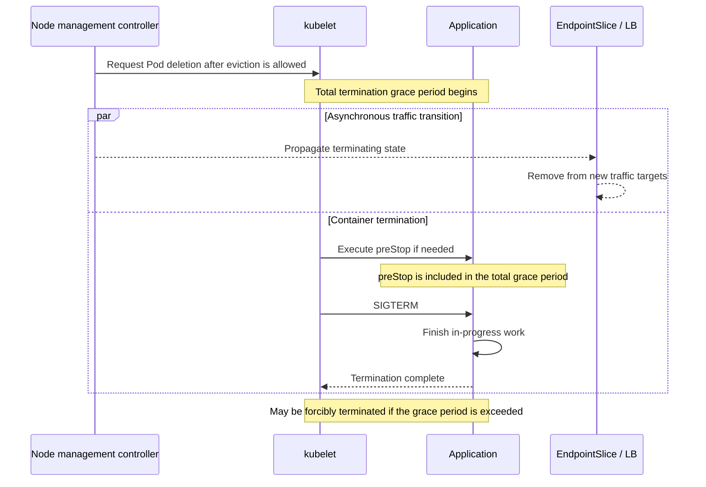

[Pod lifecycle overview](../eks-pod-health-lifecycle.md) · [Deployment checklist and references](./checklist-references.md)

## EKS Auto Mode Environment Checklist {#74-eks-auto-mode-환경-체크리스트}

Even when Auto Mode manages nodes, workload owners must design application startup, readiness, and shutdown behavior. Set probe and termination timing based on **actual startup time, traffic propagation delays, and the processing time of in-flight requests**, rather than the node management approach itself.

### What Is EKS Auto Mode? {#eks-auto-mode란}

Auto Mode manages compute provisioning and scaling, node OS management, networking, load balancing, storage, and other capabilities. Features such as cluster DNS are also built into Auto Mode; this should not be confused with automatically updating the CoreDNS, VPC CNI, and kube-proxy add-ons in a user cluster. When Auto Mode nodes run alongside existing managed node groups or other compute, the add-ons required for that existing compute must be maintained separately. Refer to [EKS Add-ons and Auto Mode](https://docs.aws.amazon.com/eks/latest/userguide/eks-add-ons.html) to distinguish these responsibilities.

### How Auto Mode Characteristics Affect Probes {#auto-mode-특성이-probe에-미치는-영향}

| Consideration | Data to Check | Application Criteria |
|---|---|---|
| Instance and architecture diversity | Distribution of initialization times in each supported environment | A startupProbe budget that accommodates normal cold starts |
| Node replacement | NodePool policies, disruption events, and replacement capacity | Validate replicas, distribution, PDBs, and shutdown behavior together |
| Spot capacity | Interruption handling paths, request retries, and checkpoints | Design for recovery even when capacity disappears without warning |
| Traffic transition | EndpointSlice and LB target changes, and the time of the last request | Apply only the wait needed for the measured propagation delay |

`failureThreshold × periodSeconds` is an approximation used to set the startupProbe budget. Also account for `initialDelaySeconds`, probe execution time, and scheduling. The `terminationGracePeriodSeconds` countdown **includes preStop execution time**. A new, full grace period does not start after preStop completes.

### Probe Checklist for Auto Mode Environments {#auto-mode-환경-probe-체크리스트}

| Item | Check |
|---|---|
| Startup | Have image loading and application initialization been measured separately on supported instances? Does liveness avoid restarting the application during normal startup? |
| Readiness | Does it reflect readiness to receive requests? Does it avoid removing all replicas simultaneously when a dependent service fails? |
| Liveness | Does it detect unrecoverable application states? Does it avoid creating restart loops due to simple overload or external dependency failures? |
| Termination budget | Do the required propagation wait + completion of in-progress work + safety margin fit within the total grace period? |
| PDB | Is the number of disruptions allowed during voluntary eviction defined? Can it make progress when running alongside other rollouts? |
| Distribution and capacity | Have node/AZ distribution, replacement node capacity, and scheduling constraints been verified in the actual deployment? |
| Failure recovery | Do retries, duplicate processing prevention, and checkpoints work even after forced termination or node loss? |

:::warning Scope of PDBs and Spot Notices

PDBs limit voluntary disruptions through the eviction API. They do not prevent infrastructure failures or node loss, or guarantee availability. EC2 Spot interruption notices are best effort, and there are exceptions to the typical 2-minute warning for termination or stopping. Hibernation can begin immediately. Do not rely on notices or a long Pod grace period alone to guarantee work completion. See [Spot Interruption Notices](https://docs.aws.amazon.com/AWSEC2/latest/UserGuide/spot-instance-termination-notices.html).

:::

### Probe Configuration Differences Between Auto Mode and Manual Management {#auto-mode-vs-수동-관리-시-probe-설정-차이}

For the same workload, apply the same measurement principles in both environments. There is no 90-second minimum termination time or mandatory `preStop sleep` specific to Auto Mode.

The following 60-second example assumes **5 seconds for traffic propagation + 40 seconds for application shutdown + a 15-second safety margin**. These are not measured values and must not be used unchanged as operational criteria. Replace the image and health endpoints. The example assumes that the image contains `/bin/sh` and `sleep`, and that the application handles SIGTERM. If a propagation wait is unnecessary, remove preStop and recalculate the budget.

```yaml
apiVersion: apps/v1
kind: Deployment
metadata:
  name: api-auto-mode
spec:
  replicas: 3
  selector:
    matchLabels:
      app: api-auto-mode
  strategy:
    rollingUpdate:
      maxUnavailable: 0
      maxSurge: 1
  template:
    metadata:
      labels:
        app: api-auto-mode
    spec:
      nodeSelector:
        eks.amazonaws.com/compute-type: auto
      terminationGracePeriodSeconds: 60
      topologySpreadConstraints:
      - maxSkew: 1
        topologyKey: topology.kubernetes.io/zone
        whenUnsatisfiable: DoNotSchedule
        labelSelector:
          matchLabels:
            app: api-auto-mode
      containers:
      - name: api
        image: ghcr.io/your-org/api:replace-with-tested-tag
        resources:
          requests:
            cpu: 500m
            memory: 1Gi
        startupProbe:
          httpGet:
            path: /healthz
            port: 8080
          periodSeconds: 5
          failureThreshold: 30
        readinessProbe:
          httpGet:
            path: /ready
            port: 8080
          periodSeconds: 5
          failureThreshold: 2
        livenessProbe:
          httpGet:
            path: /healthz
            port: 8080
          periodSeconds: 10
          failureThreshold: 3
        lifecycle:
          preStop:
            exec:
              command: ["/bin/sh", "-c", "sleep 5"]
---
apiVersion: policy/v1
kind: PodDisruptionBudget
metadata:
  name: api-auto-mode
spec:
  minAvailable: 2
  selector:
    matchLabels:
      app: api-auto-mode
```

Verify the AZs and instances available for the NodePool to select, subnet IPs, and capacity to accommodate additional replicas during a rollout. The spread constraints and PDB in this YAML do not guarantee the availability of all three replicas under every failure condition.

### Handling Automatic Eviction for OS Patching in Auto Mode {#auto-mode-환경의-os-패치-자동-eviction-대응}

The following is a **conceptual diagram of the Pod termination path** during voluntary node replacement. The order of replacement node creation, eviction, and rescheduling may vary depending on the reason for replacement and controller behavior.



Record termination timestamps, the last request, whether termination was forced, and client error rates together. Check actual NodePool policies and events instead of relying on a fixed average interval between node replacements.

```bash
# Check recent events for Pods, Nodes, NodeClaims, and other resources
kubectl get events -A --sort-by=.metadata.creationTimestamp

# Check the OS and compute type for each node
kubectl get nodes -o custom-columns=NAME:.metadata.name,OS_IMAGE:.status.nodeInfo.osImage,KERNEL:.status.nodeInfo.kernelVersion
kubectl get nodes -L eks.amazonaws.com/compute-type
```

### Verifying That Auto Mode Is Enabled {#auto-mode-활성화-확인}

Verify the current AWS account, profile, and Region, then enter the target cluster name. The following commands query status.

```bash
aws eks describe-cluster --name "<cluster-name>" --region "<region>" \
  --query 'cluster.computeConfig.enabled' --output text
kubectl get nodes -L eks.amazonaws.com/compute-type
```

**Related documents:**

- [Kubernetes Pod Termination](https://kubernetes.io/docs/concepts/workloads/pods/pod-lifecycle/#pod-termination)
- [Kubernetes Pod Disruptions](https://kubernetes.io/docs/concepts/workloads/pods/disruptions/)
- [EKS Add-ons and Auto Mode](https://docs.aws.amazon.com/eks/latest/userguide/eks-add-ons.html)
- [EC2 Spot Interruption Notices](https://docs.aws.amazon.com/AWSEC2/latest/UserGuide/spot-instance-termination-notices.html)
