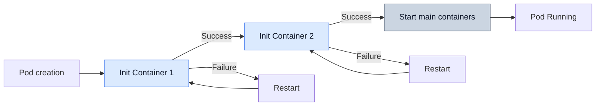

[Pod lifecycle overview](../eks-pod-health-lifecycle.md) · [Deployment checklist and references](./checklist-references.md)

## Init Container Best Practices {#4-init-container-모범-사례}

Regular init containers finish the preparation needed by the application, then exit. The sequence below explains this startup process; the final section covers native sidecars that continue running alongside the application.

### How Init Containers Work {#41-init-container-동작-원리}

- Regular init containers **run sequentially**.
- Each container must exit successfully before the next init container starts.
- The main containers start after all regular init containers complete.
- With Pod `restartPolicy: Always` or `OnFailure`, the failed init container is retried. With `Never`, the Pod is treated as failed.

The diagram shows a retry-enabled Pod. It retries the failed container rather than returning to a completed earlier container. Initialization can run again, for example after Pod recreation, so the work must be safe to repeat.



### Init Container Use Cases {#42-init-container-사용-사례}

#### Use Case 1: Database Migration {#사례-1-데이터베이스-마이그레이션}

Supply application-specific images for the `myapp/*` placeholders, along with the `db-secret`, Services and PVC needed by each example. The Deployment below has three replicas, so the same migration can run repeatedly and concurrently. Verify that the migrator handles both cases safely.

If the migration fails, `|| exit "$?"` returns its exit status. Without this check, a successful `echo` afterward can make the entire initialization command appear successful.

```yaml
apiVersion: apps/v1
kind: Deployment
metadata:
  name: web-app
spec:
  selector:
    matchLabels:
      app: web-app
  replicas: 3
  template:
    metadata:
      labels:
        app: web-app
    spec:
      # Init Container: DB migration
      initContainers:
      - name: db-migration
        image: myapp/migrator:v1
        command:
        - /bin/sh
        - -c
        - |
          echo "Running database migrations..."
          /app/migrate up || exit "$?"
          echo "Migrations completed"
        env:
        - name: DATABASE_URL
          valueFrom:
            secretKeyRef:
              name: db-secret
              key: url
      # Main application
      containers:
      - name: app
        image: myapp/web-app:v1
        ports:
        - containerPort: 8080
```

#### Use Case 2: Configuration File Generation (ConfigMap Transformation) {#사례-2-설정-파일-생성-configmap-변환}

Set the environment values in the JSON template's fields and serialize the result. This preserves quotes, newlines and characters such as `&` without string substitution. JSON is a subset of YAML 1.2, but verify the generated `config.yaml` with the application's YAML parser.

The file contains a Secret value, so log only the completion message. File-read, value-validation and write failures also fail the init container.

```yaml
apiVersion: v1
kind: ConfigMap
metadata:
  name: app-config-template
data:
  config.template: |
    {"server": {"port": 8080, "host": "0.0.0.0"}, "database": {"url": ""}}
---
apiVersion: apps/v1
kind: Deployment
metadata:
  name: app-with-config
spec:
  selector:
    matchLabels:
      app: app-with-config
  template:
    metadata:
      labels:
        app: app-with-config
    spec:
      initContainers:
      - name: config-generator
        image: python:3.13-alpine
        command:
        - python3
        - -c
        - |
          import json
          import os

          with open("/config-template/config.template", encoding="utf-8") as source:
              config = json.load(source)
          port = int(os.environ["PORT"])
          if not 1 <= port <= 65535:
              raise ValueError("PORT must be between 1 and 65535")
          config["server"]["port"] = port
          config["server"]["host"] = os.environ["HOST"]
          config["database"]["url"] = os.environ["DB_URL"]
          with open("/config/config.yaml", "w", encoding="utf-8") as target:
              json.dump(config, target, indent=2)
          print("Config file generated")
        env:
        - name: PORT
          value: "8080"
        - name: HOST
          value: "0.0.0.0"
        - name: DB_URL
          valueFrom:
            secretKeyRef:
              name: db-secret
              key: url
        volumeMounts:
        - name: config-template
          mountPath: /config-template
        - name: config
          mountPath: /config
      containers:
      - name: app
        image: myapp/app:v1
        volumeMounts:
        - name: config
          mountPath: /app/config
      volumes:
      - name: config-template
        configMap:
          name: app-config-template
      - name: config
        emptyDir: {}
```

#### Use Case 3: Waiting for Dependent Services {#사례-3-종속-서비스-대기}

These checks establish whether a connection to the Service's TCP port succeeds. Authentication, schema readiness and real request handling still need application-specific checks.

Each init container makes at most 30 connection attempts, with a two-second connection timeout and two-second retry interval. DNS resolution and attempts across multiple addresses can add time, so these settings do not establish an overall deadline. Exhausting the attempts fails the init container; the Pod policy may then restart it.

```yaml
apiVersion: apps/v1
kind: Deployment
metadata:
  name: backend-api
spec:
  selector:
    matchLabels:
      app: backend-api
  template:
    metadata:
      labels:
        app: backend-api
    spec:
      initContainers:
      # Init Container 1: Wait for a DB connection
      - name: wait-for-db
        image: python:3.13-alpine
        command:
        - python3
        - -c
        - |
          import socket
          import time

          for attempt in range(30):
              try:
                  with socket.create_connection(("postgres-service", 5432), timeout=2):
                      pass
              except OSError:
                  if attempt == 29:
                      raise SystemExit("TCP connection failed after 30 attempts")
                  time.sleep(2)
              else:
                  print("TCP connection established")
                  break
      # Init Container 2: Wait for a Redis connection
      - name: wait-for-redis
        image: python:3.13-alpine
        command:
        - python3
        - -c
        - |
          import socket
          import time

          for attempt in range(30):
              try:
                  with socket.create_connection(("redis-service", 6379), timeout=2):
                      pass
              except OSError:
                  if attempt == 29:
                      raise SystemExit("TCP connection failed after 30 attempts")
                  time.sleep(2)
              else:
                  print("TCP connection established")
                  break
      containers:
      - name: api
        image: myapp/backend-api:v1
        ports:
        - containerPort: 8080
```

:::tip Separate startup prerequisites from recovery
Init containers check prerequisites before startup. The application needs reconnection and retry logic for failures after startup. Reflect a dependency failure in readiness when it prevents this instance from serving requests. If some requests can still be served, avoid removing every replica solely because a shared dependency is unavailable.
:::

#### Use Case 4: Setting Volume Permissions {#사례-4-볼륨-권한-설정}

This example changes an application-owned volume to UID/GID `1000`. Applying `755` recursively also grants other users read access and adds execute permission to files, so adjust the mode to the actual data requirements. Do not apply it unchanged to an existing shared volume. Check whether root execution is permitted and how the PVC/CSI driver handles permissions first.

```yaml
apiVersion: apps/v1
kind: Deployment
metadata:
  name: app-with-volume
spec:
  selector:
    matchLabels:
      app: app-with-volume
  template:
    metadata:
      labels:
        app: app-with-volume
    spec:
      securityContext:
        fsGroup: 1000
      initContainers:
      - name: volume-permissions
        image: busybox
        command:
        - /bin/sh
        - -c
        - |
          echo "Setting up volume permissions..."
          chown -R 1000:1000 /data || exit "$?"
          chmod -R 755 /data || exit "$?"
          echo "Permissions set"
        volumeMounts:
        - name: data
          mountPath: /data
        securityContext:
          runAsUser: 0  # Run as root (to change permissions)
      containers:
      - name: app
        image: myapp/app:v1
        securityContext:
          runAsUser: 1000
          runAsNonRoot: true
        volumeMounts:
        - name: data
          mountPath: /app/data
      volumes:
      - name: data
        persistentVolumeClaim:
          claimName: app-data-pvc
```

### Init Container vs Sidecar Container (Kubernetes 1.29+) {#43-init-container-vs-sidecar-container-kubernetes-129}

Native sidecars use the `SidecarContainers` feature, enabled by default since Kubernetes 1.29. An `initContainers` entry with `restartPolicy: Always` keeps running after it starts, allowing initialization to proceed to the next entry.

| Characteristic | Init Container | Sidecar Container (1.29+) |
|------|---------------|---------------------------|
| **Execution timing** | Run sequentially before the main containers | Run concurrently with the main containers |
| **Lifecycle** | Exit after completion | Run alongside the main containers |
| **Restart** | Retry the failed init container according to Pod policy | Can restart individually |
| **Use cases** | One-time initialization tasks | Continuous supporting tasks (log collection, proxying) |

**Sidecar Container Example (K8s 1.29+):**

When the app writes `/app/logs/*.log`, Fluent Bit's `tail` input reads the same shared-volume files at `/var/log/app/*.log` and sends them to `stdout`. This demonstrates the file-to-output path; central collection, duplicates and loss still require separate validation.

```yaml
apiVersion: v1
kind: Pod
metadata:
  name: app-with-sidecar
spec:
  initContainers:
  # Native sidecar: Set restartPolicy to Always
  - name: log-collector
    image: fluent/fluent-bit:2.0
    command: ["/fluent-bit/bin/fluent-bit"]
    args: ["-i", "tail", "-p", "path=/var/log/app/*.log", "-p", "read_from_head=true",
           "-t", "app.logs", "-o", "stdout", "-m", "app.logs"]
    restartPolicy: Always  # Run as a sidecar
    volumeMounts:
    - name: logs
      mountPath: /var/log/app
      readOnly: true
  containers:
  - name: app
    image: myapp/app:v1
    volumeMounts:
    - name: logs
      mountPath: /app/logs
  volumes:
  - name: logs
    emptyDir: {}
```

---
