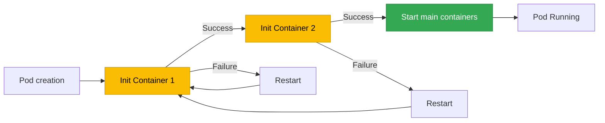

[Pod lifecycle overview](../eks-pod-health-lifecycle.md) · [Deployment checklist and references](./checklist-references.md)

## Init Container Best Practices {#4-init-container-모범-사례}

Init containers run before the main containers start to perform initialization tasks.

### How Init Containers Work {#41-init-container-동작-원리}

- Init containers **run sequentially** (concurrent execution is not possible)
- Each init container must exit successfully before the next init container starts
- All init containers must complete before the main containers start
- If an init container fails, it is restarted according to the Pod's `restartPolicy`



### Init Container Use Cases {#42-init-container-사용-사례}

#### Use Case 1: Database Migration {#사례-1-데이터베이스-마이그레이션}

```yaml
apiVersion: apps/v1
kind: Deployment
metadata:
  name: web-app
spec:
  replicas: 3
  template:
    spec:
      # Init Container: DB migration
      initContainers:
      - name: db-migration
        image: myapp/migrator:v1
        command:
        - /bin/sh
        - -c
        - |
          echo "Running database migrations..."
          /app/migrate up
          echo "Migrations completed"
        env:
        - name: DATABASE_URL
          valueFrom:
            secretKeyRef:
              name: db-secret
              key: url
      # Main application
      containers:
      - name: app
        image: myapp/web-app:v1
        ports:
        - containerPort: 8080
```

#### Use Case 2: Configuration File Generation (ConfigMap Transformation) {#사례-2-설정-파일-생성-configmap-변환}

```yaml
apiVersion: v1
kind: ConfigMap
metadata:
  name: app-config-template
data:
  config.template: |
    server:
      port: {{ PORT }}
      host: {{ HOST }}
    database:
      url: {{ DB_URL }}
---
apiVersion: apps/v1
kind: Deployment
metadata:
  name: app-with-config
spec:
  template:
    spec:
      initContainers:
      - name: config-generator
        image: busybox
        command:
        - /bin/sh
        - -c
        - |
          # Generate the actual configuration file from the template
          sed -e "s/{{ PORT }}/$PORT/g" \
              -e "s/{{ HOST }}/$HOST/g" \
              -e "s|{{ DB_URL }}|$DB_URL|g" \
              /config-template/config.template > /config/config.yaml
          echo "Config file generated"
          cat /config/config.yaml
        env:
        - name: PORT
          value: "8080"
        - name: HOST
          value: "0.0.0.0"
        - name: DB_URL
          valueFrom:
            secretKeyRef:
              name: db-secret
              key: url
        volumeMounts:
        - name: config-template
          mountPath: /config-template
        - name: config
          mountPath: /config
      containers:
      - name: app
        image: myapp/app:v1
        volumeMounts:
        - name: config
          mountPath: /app/config
      volumes:
      - name: config-template
        configMap:
          name: app-config-template
      - name: config
        emptyDir: {}
```

#### Use Case 3: Waiting for Dependent Services {#사례-3-종속-서비스-대기}

```yaml
apiVersion: apps/v1
kind: Deployment
metadata:
  name: backend-api
spec:
  template:
    spec:
      initContainers:
      # Init Container 1: Wait for a DB connection
      - name: wait-for-db
        image: busybox
        command:
        - /bin/sh
        - -c
        - |
          echo "Waiting for database..."
          until nc -z postgres-service 5432; do
            echo "Database not ready, sleeping..."
            sleep 2
          done
          echo "Database is ready"
      # Init Container 2: Wait for a Redis connection
      - name: wait-for-redis
        image: busybox
        command:
        - /bin/sh
        - -c
        - |
          echo "Waiting for Redis..."
          until nc -z redis-service 6379; do
            echo "Redis not ready, sleeping..."
            sleep 2
          done
          echo "Redis is ready"
      containers:
      - name: api
        image: myapp/backend-api:v1
        ports:
        - containerPort: 8080
```

:::tip A Better Alternative: readinessProbe
Handling dependent service availability in the main container's readiness probe is more flexible than using an init container. An init container runs only once, so it cannot respond if a dependent service goes down while the main container is running.
:::

#### Use Case 4: Setting Volume Permissions {#사례-4-볼륨-권한-설정}

```yaml
apiVersion: apps/v1
kind: Deployment
metadata:
  name: app-with-volume
spec:
  template:
    spec:
      securityContext:
        fsGroup: 1000
      initContainers:
      - name: volume-permissions
        image: busybox
        command:
        - /bin/sh
        - -c
        - |
          echo "Setting up volume permissions..."
          chown -R 1000:1000 /data
          chmod -R 755 /data
          echo "Permissions set"
        volumeMounts:
        - name: data
          mountPath: /data
        securityContext:
          runAsUser: 0  # Run as root (to change permissions)
      containers:
      - name: app
        image: myapp/app:v1
        securityContext:
          runAsUser: 1000
          runAsNonRoot: true
        volumeMounts:
        - name: data
          mountPath: /app/data
      volumes:
      - name: data
        persistentVolumeClaim:
          claimName: app-data-pvc
```

### Init Container vs Sidecar Container (Kubernetes 1.29+) {#43-init-container-vs-sidecar-container-kubernetes-129}

Native sidecar containers were introduced in Kubernetes 1.29+.

| Characteristic | Init Container | Sidecar Container (1.29+) |
|------|---------------|---------------------------|
| **Execution timing** | Run sequentially before the main containers | Run concurrently with the main containers |
| **Lifecycle** | Exit after completion | Run alongside the main containers |
| **Restart** | Restart the entire Pod on failure | Can restart individually |
| **Use cases** | One-time initialization tasks | Continuous supporting tasks (log collection, proxying) |

**Sidecar Container Example (K8s 1.29+):**

```yaml
apiVersion: v1
kind: Pod
metadata:
  name: app-with-sidecar
spec:
  initContainers:
  # Native sidecar: Set restartPolicy to Always
  - name: log-collector
    image: fluent/fluent-bit:2.0
    restartPolicy: Always  # Run as a sidecar
    volumeMounts:
    - name: logs
      mountPath: /var/log/app
  containers:
  - name: app
    image: myapp/app:v1
    volumeMounts:
    - name: logs
      mountPath: /app/logs
  volumes:
  - name: logs
    emptyDir: {}
```

---
