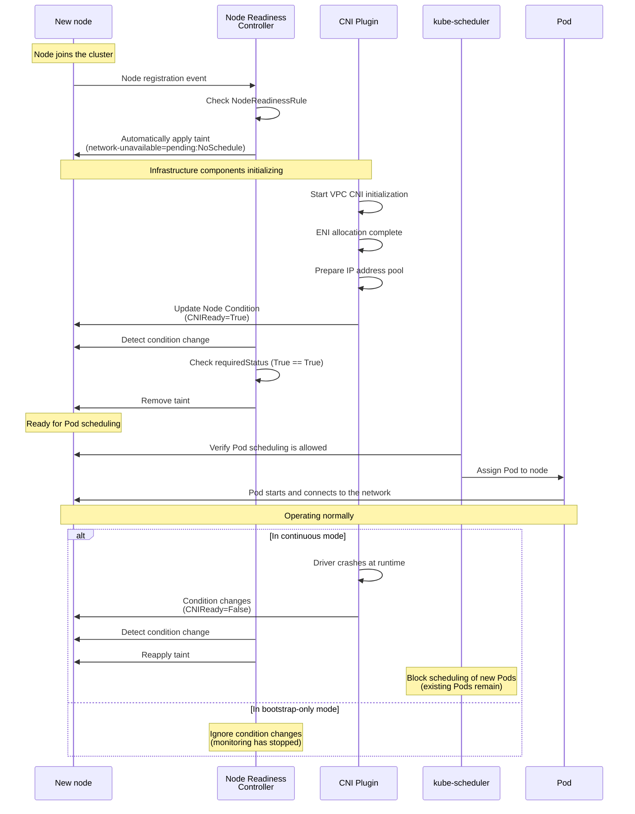
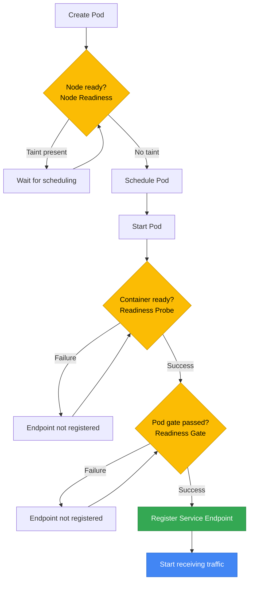

[Pod lifecycle overview](../eks-pod-health-lifecycle.md) · [Checklist and references](./checklist-references.md)

## Node Readiness Controller — managing node-level readiness {#344-node-readiness-controller--노드-수준-readiness-관리}

### Overview {#개요}

Node Readiness Controller (NRC) is an alpha feature (v0.1.1) announced on the official Kubernetes blog in February 2026. It introduces a mechanism for declaratively managing infrastructure readiness at the node level.

The existing Kubernetes node `Ready` condition provides only a simple binary state (Ready/NotReady). It cannot accurately reflect complex infrastructure dependencies such as CNI plugin initialization, GPU driver loading, and storage driver readiness. To address this limitation, NRC provides a `NodeReadinessRule` CRD for declaratively defining custom readiness gates.

**Key benefits:**
- **Granular node status control**: Manage the readiness of each infrastructure component independently
- **Automated taint management**: Automatically apply a NoSchedule taint when conditions are not met
- **Flexible monitoring modes**: Support for bootstrap-only, continuous monitoring, and dry-run modes
- **Selective enforcement**: Use nodeSelector to apply rules only to specific node groups

**API information:**
- API Group: `readiness.node.x-k8s.io/v1alpha1`
- Kind: `NodeReadinessRule`
- Official documentation: https://node-readiness-controller.sigs.k8s.io/

### Core features {#핵심-기능}

#### Continuous mode - ongoing monitoring {#1-continuous-모드---지속-모니터링}

Continuously monitors the specified conditions throughout the node lifecycle. If an infrastructure component fails at runtime (for example, a GPU driver crashes), it immediately applies a taint to block scheduling of new Pods.

**Use cases:**
- Monitor GPU driver health
- Continuously check network plugin health
- Check storage driver availability

#### Bootstrap-only mode - initialization only {#2-bootstrap-only-모드---초기화-전용}

Checks conditions only during node initialization and stops monitoring once they are met. It does not respond to condition changes after bootstrap.

**Use cases:**
- Initial CNI plugin bootstrap
- Verify container image pre-pull completion
- Wait for the initial security scan to complete

#### Dry-run mode - safe validation {#3-dry-run-모드---안전한-검증}

Simulates rule behavior without applying actual taints. This is useful for validating rules before production deployment.

**Use cases:**
- Test new NodeReadinessRules
- Analyze the impact of condition changes
- Debug and diagnose issues

#### nodeSelector - selecting target nodes {#4-nodeselector---타겟-노드-선택}

Applies rules only to specific node groups based on labels. Different readiness rules can be applied to GPU nodes and general-purpose nodes.

### YAML examples {#yaml-예시}

#### CNI bootstrap - bootstrap-only mode {#cni-부트스트랩---bootstrap-only-모드}

```yaml
apiVersion: readiness.node.x-k8s.io/v1alpha1
kind: NodeReadinessRule
metadata:
  name: network-readiness-rule
  namespace: kube-system
spec:
  # Node conditions to check
  conditions:
    - type: "cniplugin.example.net/NetworkReady"
      requiredStatus: "True"

  # Taint to apply when conditions are not met
  taint:
    key: "readiness.k8s.io/acme.com/network-unavailable"
    effect: "NoSchedule"
    value: "pending"

  # Stop monitoring after bootstrap completes
  enforcementMode: "bootstrap-only"

  # Apply only to worker nodes
  nodeSelector:
    matchLabels:
      node-role.kubernetes.io/worker: ""
```

**Workflow:**
1. NRC automatically applies a taint when a new node joins the cluster
2. The CNI plugin sets the `NetworkReady=True` condition after initialization completes
3. NRC checks the condition and removes the taint
4. Pod scheduling is enabled (subsequent CNI status changes are ignored)

#### Continuous monitoring of GPU nodes {#gpu-노드-continuous-모니터링}

```yaml
apiVersion: readiness.node.x-k8s.io/v1alpha1
kind: NodeReadinessRule
metadata:
  name: gpu-driver-readiness
  namespace: kube-system
spec:
  conditions:
    - type: "nvidia.com/gpu-driver-ready"
      requiredStatus: "True"

  taint:
    key: "readiness.k8s.io/gpu-unavailable"
    effect: "NoSchedule"
    value: "driver-not-ready"

  # Continue monitoring at runtime
  enforcementMode: "continuous"

  # Apply only to GPU nodes
  nodeSelector:
    matchLabels:
      nvidia.com/gpu.present: "true"
```

**Workflow:**
1. Automatically apply a taint when a GPU node starts
2. The NVIDIA driver daemon sets the condition after GPU initialization completes
3. NRC removes the taint, enabling AI workload scheduling
4. **If the driver crashes at runtime:**
   - The condition changes to `False`
   - NRC immediately reapplies the taint
   - Existing Pods remain; scheduling of new Pods is blocked

#### Checking EBS CSI driver readiness {#ebs-csi-드라이버-준비-확인}

```yaml
apiVersion: readiness.node.x-k8s.io/v1alpha1
kind: NodeReadinessRule
metadata:
  name: ebs-csi-readiness
  namespace: kube-system
spec:
  conditions:
    - type: "ebs.csi.aws.com/VolumeAttachReady"
      requiredStatus: "True"

  taint:
    key: "readiness.k8s.io/storage-unavailable"
    effect: "NoSchedule"
    value: "csi-not-ready"

  enforcementMode: "bootstrap-only"

  # Apply only to nodes dedicated to storage workloads
  nodeSelector:
    matchLabels:
      workload-type: "stateful"
```

#### Dry-run mode - test rule {#dry-run-모드---테스트-규칙}

```yaml
apiVersion: readiness.node.x-k8s.io/v1alpha1
kind: NodeReadinessRule
metadata:
  name: test-custom-condition
  namespace: kube-system
spec:
  conditions:
    - type: "example.com/CustomHealthCheck"
      requiredStatus: "True"

  taint:
    key: "readiness.k8s.io/test-condition"
    effect: "NoSchedule"
    value: "testing"

  # Log actions without applying taints
  enforcementMode: "dry-run"

  nodeSelector:
    matchLabels:
      environment: "staging"
```

### EKS usage scenarios {#eks-적용-시나리오}

#### Waiting for VPC CNI initialization {#1-vpc-cni-초기화-대기}

**Problem:**
Network connectivity fails if Pods are scheduled immediately after a node joins the cluster, before the VPC CNI plugin is fully initialized.

**Solution:**
```yaml
apiVersion: readiness.node.x-k8s.io/v1alpha1
kind: NodeReadinessRule
metadata:
  name: vpc-cni-readiness
  namespace: kube-system
spec:
  conditions:
    - type: "vpc.amazonaws.com/CNIReady"
      requiredStatus: "True"
  taint:
    key: "node.eks.amazonaws.com/network-unavailable"
    effect: "NoSchedule"
    value: "vpc-cni-initializing"
  enforcementMode: "bootstrap-only"
```

**Set the condition in the VPC CNI DaemonSet:**
```yaml
# Init container in the aws-node DaemonSet
initContainers:
- name: set-node-condition
  image: bitnami/kubectl:latest
  command:
  - /bin/sh
  - -c
  - |
    # Wait for CNI initialization
    until [ -f /host/etc/cni/net.d/10-aws.conflist ]; do
      echo "Waiting for CNI config..."
      sleep 2
    done

    # Set the Node Condition
    kubectl patch node $NODE_NAME --type=json -p='[
      {
        "op": "add",
        "path": "/status/conditions/-",
        "value": {
          "type": "vpc.amazonaws.com/CNIReady",
          "status": "True",
          "lastTransitionTime": "'$(date -u +"%Y-%m-%dT%H:%M:%SZ")'",
          "reason": "CNIInitialized",
          "message": "VPC CNI is ready"
        }
      }
    ]'
  env:
  - name: NODE_NAME
    valueFrom:
      fieldRef:
        fieldPath: spec.nodeName
```

#### NVIDIA driver readiness on GPU nodes {#2-gpu-노드-nvidia-드라이버-준비}

**Problem:**
If a GPU workload is scheduled before the NVIDIA driver finishes loading, CUDA initialization fails and the Pod enters CrashLoopBackOff.

**Solution:**
```yaml
apiVersion: readiness.node.x-k8s.io/v1alpha1
kind: NodeReadinessRule
metadata:
  name: nvidia-gpu-readiness
  namespace: kube-system
spec:
  conditions:
    - type: "nvidia.com/gpu-driver-ready"
      requiredStatus: "True"
    - type: "nvidia.com/gpu-device-plugin-ready"
      requiredStatus: "True"
  taint:
    key: "nvidia.com/gpu-not-ready"
    effect: "NoSchedule"
    value: "driver-loading"
  enforcementMode: "continuous"
  nodeSelector:
    matchLabels:
      node.kubernetes.io/instance-type: "g5.xlarge"
```

**Set conditions in the NVIDIA Device Plugin:**
```go
// Health check logic in the NVIDIA Device Plugin
func updateNodeCondition(nodeName string) error {
    // Check GPU driver status
    version, err := nvml.SystemGetDriverVersion()
    if err != nil {
        return setCondition(nodeName, "nvidia.com/gpu-driver-ready", "False")
    }

    // Check Device Plugin status
    devices, err := nvml.DeviceGetCount()
    if err != nil || devices == 0 {
        return setCondition(nodeName, "nvidia.com/gpu-device-plugin-ready", "False")
    }

    // Set to True if both are healthy
    setCondition(nodeName, "nvidia.com/gpu-driver-ready", "True")
    setCondition(nodeName, "nvidia.com/gpu-device-plugin-ready", "True")
    return nil
}
```

#### Node Problem Detector integration {#3-node-problem-detector-통합}

**Problem:**
Kubernetes does not automatically block Pod scheduling when a node experiences hardware errors, kernel deadlocks, or network issues.

**Solution:**
```yaml
apiVersion: readiness.node.x-k8s.io/v1alpha1
kind: NodeReadinessRule
metadata:
  name: node-problem-detector-readiness
  namespace: kube-system
spec:
  conditions:
    - type: "KernelDeadlock"
      requiredStatus: "False"  # False indicates healthy status
    - type: "DiskPressure"
      requiredStatus: "False"
    - type: "NetworkUnavailable"
      requiredStatus: "False"
  taint:
    key: "node.kubernetes.io/problem-detected"
    effect: "NoSchedule"
    value: "true"
  enforcementMode: "continuous"
```

### Workflow diagram {#워크플로우-다이어그램}



### Relationship to Pod readiness {#pod-readiness와의-관계}

The Kubernetes readiness mechanism now forms a complete 3-layer structure:

| Layer | Mechanism | Scope | Action on failure | Use case |
|------|---------|------|-------------|----------|
| **1. Container** | Readiness Probe | Health checks inside the container | Remove Service Endpoint | Check application readiness |
| **2. Pod** | Readiness Gate | External conditions at the Pod level | Remove Service Endpoint | Integrate ALB/NLB health checks |
| **3. Node** | Node Readiness Controller | Node infrastructure conditions | Block Pod scheduling (taint) | Check CNI, GPU, and storage readiness |

**Integrated scenario - complete traffic safety:**

```yaml
apiVersion: apps/v1
kind: Deployment
metadata:
  name: critical-service
spec:
  replicas: 3
  selector:
    matchLabels:
      app: critical-service
  template:
    metadata:
      labels:
        app: critical-service
    spec:
      # Apply 3-layer readiness
      containers:
      - name: app
        image: myapp:v2
        # Layer 1: container Readiness Probe
        readinessProbe:
          httpGet:
            path: /ready
            port: 8080
          periodSeconds: 5
          failureThreshold: 2

      # Layer 2: Pod Readiness Gate
      readinessGates:
      - conditionType: "target-health.alb.ingress.k8s.aws/production-alb"

      # Layer 3: Node Readiness (handled automatically by NodeReadinessRule)
      # - Check node CNI, GPU, and storage readiness
      # - Scheduled only on nodes without taints
```

**Traffic acceptance checklist:**



### Installation and configuration {#설치-및-설정}

#### Install Node Readiness Controller {#1-node-readiness-controller-설치}

```bash
# Install with Helm
helm repo add node-readiness-controller https://node-readiness-controller.sigs.k8s.io
helm repo update

helm install node-readiness-controller \
  node-readiness-controller/node-readiness-controller \
  --namespace kube-system \
  --create-namespace

# Or install with Kustomize
kubectl apply -k https://github.com/kubernetes-sigs/node-readiness-controller/config/default
```

#### Verify installation {#2-설치-확인}

```bash
# Check controller Pod status
kubectl get pods -n kube-system -l app=node-readiness-controller

# Check the CRD
kubectl get crd nodereadinessrules.readiness.node.x-k8s.io

# Apply a sample rule
kubectl apply -f https://raw.githubusercontent.com/kubernetes-sigs/node-readiness-controller/main/examples/basic-rule.yaml

# List rules
kubectl get nodereadinessrules -A
```

#### Check node status {#3-노드-상태-확인}

```bash
# Check conditions on a specific node
kubectl get node <node-name> -o jsonpath='{.status.conditions}' | jq

# Filter for a specific condition
kubectl get node <node-name> -o jsonpath='{.status.conditions[?(@.type=="CNIReady")]}' | jq

# Check taints on all nodes
kubectl get nodes -o custom-columns=NAME:.metadata.name,TAINTS:.spec.taints
```

### Debugging and troubleshooting {#디버깅-및-트러블슈팅}

#### When a taint is not removed {#taint가-제거되지-않는-경우}

```bash
# 1. Check NodeReadinessRule events
kubectl describe nodereadinessrule <rule-name> -n kube-system

# 2. Check node condition status
kubectl get node <node-name> -o yaml | grep -A 10 conditions

# 3. Check controller logs
kubectl logs -n kube-system -l app=node-readiness-controller --tail=100

# 4. Set a condition manually (for testing)
kubectl patch node <node-name> --type=json -p='[
  {
    "op": "add",
    "path": "/status/conditions/-",
    "value": {
      "type": "CNIReady",
      "status": "True",
      "lastTransitionTime": "'$(date -u +"%Y-%m-%dT%H:%M:%SZ")'",
      "reason": "ManualSet",
      "message": "Manually set for testing"
    }
  }
]'
```

#### Test rules in dry-run mode {#dry-run-모드로-규칙-테스트}

```bash
# Change an existing rule to dry-run
kubectl patch nodereadinessrule <rule-name> -n kube-system \
  --type=merge \
  -p '{"spec":{"enforcementMode":"dry-run"}}'

# Check behavior in controller logs
kubectl logs -n kube-system -l app=node-readiness-controller -f | grep "dry-run"

# Restore the original mode after testing
kubectl patch nodereadinessrule <rule-name> -n kube-system \
  --type=merge \
  -p '{"spec":{"enforcementMode":"continuous"}}'
```

:::info Alpha feature considerations
Node Readiness Controller is currently at alpha version v0.1.1. Before applying it to production:
- Perform thorough testing in a staging environment
- Validate rule behavior in dry-run mode
- Set up controller log monitoring
- Prepare a procedure for manually removing taints if issues occur
:::

:::tip Operational best practices
1. **Prefer bootstrap-only**: Bootstrap-only mode is sufficient in most cases. Use continuous mode only for components that frequently fail at runtime, such as GPU drivers.
2. **Make effective use of nodeSelector**: Define rules by workload type instead of applying the same rule to all nodes.
3. **Integrate Node Problem Detector**: Using NRC and NPD together enables automated responses to hardware/OS-level issues as well.
4. **Monitoring and alerts**: Collect taint application/removal events in CloudWatch or Prometheus, and configure alerts for taints that remain in place for a long time.
:::

:::warning Potential conflicts with PDBs
When Node Readiness Controller applies a taint, new Pods are not created on that node. If taints are applied to multiple nodes simultaneously and the PodDisruptionBudget is strict, workload placement across the entire cluster may be blocked. Review PDB policies when designing rules.
:::

### References {#참조-자료}

- **Official documentation**: [Node Readiness Controller](https://node-readiness-controller.sigs.k8s.io/)
- **Kubernetes Blog**: [Introducing Node Readiness Controller](https://kubernetes.io/blog/2026/02/03/introducing-node-readiness-controller/)
- **GitHub Repository**: [kubernetes-sigs/node-readiness-controller](https://github.com/kubernetes-sigs/node-readiness-controller)

---
