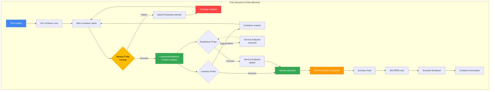

[Pod lifecycle overview](../eks-pod-health-lifecycle.md) · [Checklist and references](./checklist-references.md)

## Kubernetes Probe Deep Dive {#2-kubernetes-probe-심층-가이드}

### Three Probe Types and How They Work {#21-세-가지-probe-유형과-동작-원리}

Kubernetes provides three types of probes to monitor Pod health.

| Probe type | Purpose | Action on failure | Activation timing |
|-----------|------|-------------|-------------|
| **Startup Probe** | Verify that application initialization is complete | Terminate the container and restart according to restartPolicy (when failureThreshold is reached) | Immediately after Pod startup |
| **Liveness Probe** | Detect application deadlocks | Restart the container | After the Startup Probe succeeds |
| **Readiness Probe** | Verify readiness to receive traffic | Remove from Service Endpoints (no restart) | After the Startup Probe succeeds |

#### Startup Probe: Protecting Applications with Slow Startup {#startup-probe-느린-시작-앱-보호}

A Startup Probe delays Liveness and Readiness Probes until the application has fully started. It is essential for applications with slow startup, such as Spring Boot applications, JVM applications, and applications that load ML models.

**How it works:**
- Liveness and Readiness Probes remain disabled while the Startup Probe is running.
- Startup Probe succeeds → Liveness and Readiness Probes are enabled.
- Startup Probe fails (failureThreshold is reached) → the container restarts.

#### Liveness Probe: Detecting Deadlocks {#liveness-probe-데드락-감지}

A Liveness Probe checks whether the application is alive. If it fails, kubelet restarts the container.

**Use cases:**
- Detecting infinite loops and deadlocks
- Unrecoverable application errors
- Unresponsiveness caused by memory leaks

**Cautions:**
- **Do not include external dependencies** (such as a database or Redis) in a Liveness Probe.
- An external service failure can cause a cascading failure in which all Pods restart.

#### Readiness Probe: Controlling Incoming Traffic {#readiness-probe-트래픽-수신-제어}

A Readiness Probe checks whether a Pod is ready to receive traffic. If it fails, the Pod is removed from the Service's Endpoints, but the container does not restart.

**Use cases:**
- Checking connections to dependent services (databases and caches)
- Verifying that initial data loading is complete
- Gradually receiving traffic during deployment

**Flow summary**

1. After the Init Container and main container start, the Startup Probe verifies that initialization is complete.
2. The Liveness Probe determines whether to restart the container, and the Readiness Probe determines whether the Pod participates in Service Endpoints.
3. Following a termination request, the container terminates after preStop execution, SIGTERM handling, and graceful shutdown.



### Probe Mechanisms {#22-probe-메커니즘}

Kubernetes supports four probe mechanisms.

| Mechanism | Description | Advantages | Disadvantages | Suitable use cases |
|----------|------|------|------|------------|
| **httpGet** | Send an HTTP GET request and check for a 200-399 response code | Standard approach, straightforward implementation | Requires an HTTP server | REST APIs, web services |
| **tcpSocket** | Check whether a connection to a TCP port can be established | Lightweight and fast | Cannot validate application logic | gRPC, databases |
| **exec** | Run a command inside the container and check for exit code 0 | Flexible, supports custom logic | High overhead | Batch workers, file-based checks |
| **grpc** | Use the gRPC Health Check Protocol (GA in K8s 1.27+) | Native gRPC support | Limited to gRPC applications | gRPC microservices |

#### httpGet Example {#httpget-예시}

```yaml
livenessProbe:
  httpGet:
    path: /healthz
    port: 8080
    httpHeaders:
    - name: X-Custom-Header
      value: HealthCheck
    scheme: HTTP  # Or HTTPS
  initialDelaySeconds: 30
  periodSeconds: 10
```

#### tcpSocket Example {#tcpsocket-예시}

```yaml
livenessProbe:
  tcpSocket:
    port: 5432  # PostgreSQL
  initialDelaySeconds: 15
  periodSeconds: 10
```

#### exec Example {#exec-예시}

```yaml
livenessProbe:
  exec:
    command:
    - /bin/sh
    - -c
    - test -f /tmp/healthy
  initialDelaySeconds: 5
  periodSeconds: 5
```

#### grpc Example (Kubernetes 1.27+) {#grpc-예시-kubernetes-127}

```yaml
livenessProbe:
  grpc:
    port: 9090
    service: myservice  # Optional
  initialDelaySeconds: 10
  periodSeconds: 5
```

:::tip gRPC Health Check Protocol
gRPC services must implement the [gRPC Health Checking Protocol](https://github.com/grpc/grpc/blob/master/doc/health-checking.md). Use `google.golang.org/grpc/health` for Go and the `grpc-health-check` library for Java.
:::

### Probe Timing Design {#23-probe-타이밍-설계}

Probe timing parameters determine the balance between failure detection speed and stability.

| Parameter | Description | Default | Recommended range |
|----------|------|--------|----------|
| `initialDelaySeconds` | Wait time between container startup and the first probe | 0 | 10-30s (can be 0 when using a Startup Probe) |
| `periodSeconds` | Interval between probe executions | 10 | 5-15s |
| `timeoutSeconds` | Wait time for a probe response | 1 | 3-10s |
| `failureThreshold` | Number of consecutive failures required to declare failure | 3 | Liveness: 3, Readiness: 1-3, Startup: 30+ |
| `successThreshold` | Number of consecutive successes required to declare success (only Readiness can use a value of 1 or higher) | 1 | 1-2 |

#### Timing Design Formulas {#타이밍-설계-공식}

```
Approximate consecutive failure detection budget = failureThreshold × periodSeconds
Minimum recovery time = successThreshold × periodSeconds
```

**Examples:**
- `failureThreshold: 3, periodSeconds: 10` → a consecutive failure detection budget of approximately 30 seconds
- `successThreshold: 2, periodSeconds: 5` → recovery is declared after at least 10 seconds (Readiness only)

#### Recommended Timing by Workload {#워크로드별-권장-타이밍}

| Workload type | initialDelaySeconds | periodSeconds | failureThreshold | Rationale |
|--------------|-------------------|---------------|-----------------|------|
| Web services (Node.js, Python) | 10 | 5 | 3 | Fast startup, requires rapid detection |
| JVM applications (Spring Boot) | 0 (with a Startup Probe) | 10 | 3 | Slow startup, protected by a Startup Probe |
| Databases (PostgreSQL) | 30 | 10 | 5 | Long initialization time |
| Batch workers | 5 | 15 | 2 | Periodic tasks, less aggressive detection |
| ML inference services | 0 (Startup: 60) | 10 | 3 | Long model loading time |
