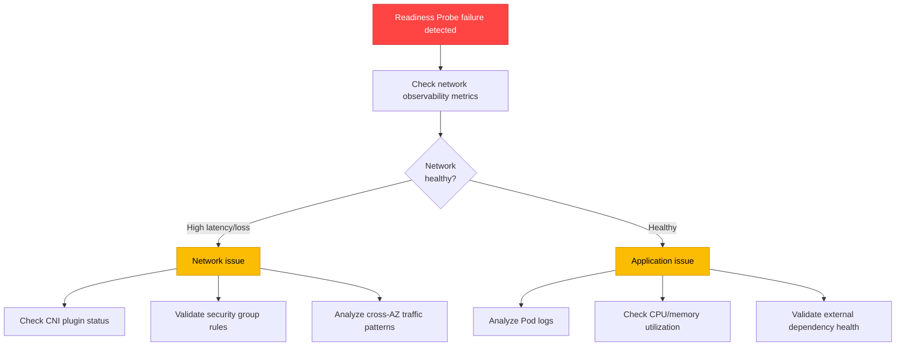
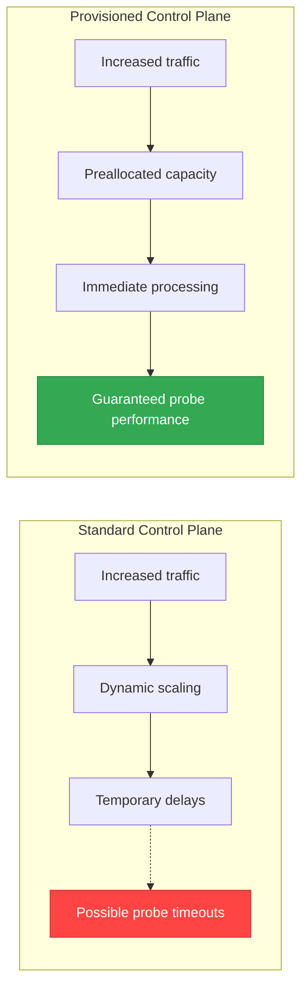
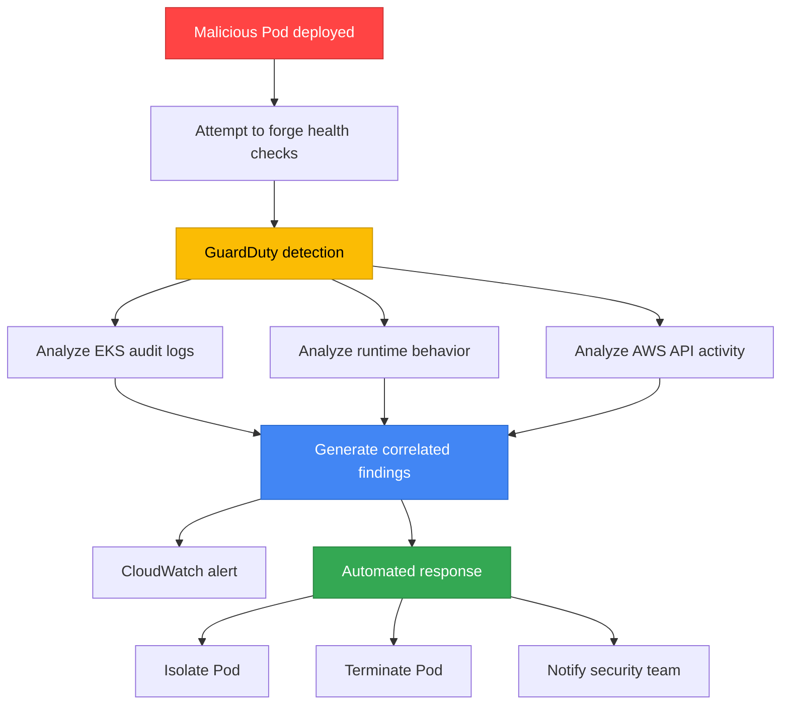

[Pod lifecycle overview](../eks-pod-health-lifecycle.md) · [Checklist and references](./checklist-references.md)

## Integrating Probes with New EKS Features in 2025-2026 {#27-2025-2026-eks-신규-기능과-probe-통합}

The new EKS observability and control features announced at AWS re:Invent 2025 further enhance probe-based health checks. This section covers how to integrate probes with the latest EKS features for more accurate and proactive health monitoring.

### Validating Probe Connectivity with Container Network Observability {#271-container-network-observability로-probe-연결성-검증}

**Overview:**

Container Network Observability (announced in November 2025) provides detailed network metrics, including communication patterns between Pods, latency, and packet loss. These metrics help clearly distinguish probe failures caused by network issues from those caused by the application itself.

**Key features:**
- Visualization of Pod-to-Pod communication paths
- Monitoring of network latency, packet loss, and retransmission rates
- Real-time detection of network traffic anomalies
- Integration with CloudWatch Container Insights

**Enabling the feature:**

```bash
# Enable network observability in VPC CNI
kubectl set env daemonset aws-node \
  -n kube-system \
  ENABLE_NETWORK_OBSERVABILITY=true

# Alternatively, configure through a ConfigMap
kubectl apply -f - <<EOF
apiVersion: v1
kind: ConfigMap
metadata:
  name: amazon-vpc-cni
  namespace: kube-system
data:
  enable-network-observability: "true"
EOF
```

**Probe connectivity validation example:**

```yaml
apiVersion: apps/v1
kind: Deployment
metadata:
  name: api-gateway
  annotations:
    # Enable collection of network observability metrics
    network-observability.amazonaws.com/enabled: "true"
spec:
  selector:
    matchLabels:
      app: "api-gateway"
  replicas: 3
  template:
    metadata:
      labels:
        app: "api-gateway"
    spec:
      containers:
      - name: gateway
        image: myapp/gateway:v2
        ports:
        - containerPort: 8080
        # Readiness Probe: check external DB connectivity
        readinessProbe:
          httpGet:
            path: /ready
            port: 8080
          periodSeconds: 5
          failureThreshold: 2
          timeoutSeconds: 3
        livenessProbe:
          httpGet:
            path: /healthz
            port: 8080
          periodSeconds: 10
          failureThreshold: 3
```

**CloudWatch Insights query - correlate probe failures with network latency:**

```sql
-- Check network latency at the time of probe failures
fields @timestamp, pod_name, probe_type, network_latency_ms, packet_loss_percent
| filter namespace = "production"
| filter probe_result = "failed"
| filter network_latency_ms > 100 or packet_loss_percent > 1
| sort @timestamp desc
| limit 100
```

**Alert configuration example:**

```yaml
# CloudWatch Alarm: concurrent probe failures and network anomalies
apiVersion: v1
kind: ConfigMap
metadata:
  name: probe-network-alert
  namespace: monitoring
data:
  alarm-config: |
    {
      "AlarmName": "ProbeFailureWithNetworkIssue",
      "MetricName": "ReadinessProbeFailure",
      "Namespace": "ContainerInsights",
      "Statistic": "Sum",
      "Period": 60,
      "EvaluationPeriods": 2,
      "Threshold": 3,
      "ComparisonOperator": "GreaterThanThreshold",
      "Dimensions": [
        {"Name": "ClusterName", "Value": "production-eks"},
        {"Name": "Namespace", "Value": "production"}
      ],
      "AlarmDescription": "Check network latency when Readiness Probes fail"
    }
```

**Diagnostic workflow:**



:::tip Pod-to-Pod Path Visualization
Container Network Observability integrates with CloudWatch Logs Insights to trace the entire network path of probe requests. When a Readiness Probe checks an external database, bottlenecks can be identified along the full Pod → Service → Endpoint → DB Pod path.
:::

---

### CloudWatch Observability Operator + Control Plane Metrics {#272-cloudwatch-observability-operator--control-plane-메트릭}

**Overview:**

CloudWatch Observability Operator (announced in December 2025) automatically collects EKS Control Plane metrics to proactively detect how API Server performance degradation affects probe responses.

**Installation:**

```bash
# Install CloudWatch Observability Operator
kubectl apply -f https://raw.githubusercontent.com/aws-observability/aws-cloudwatch-observability-operator/main/bundle.yaml

# Enable EKS Control Plane metrics collection
kubectl apply -f - <<EOF
apiVersion: cloudwatch.aws.amazon.com/v1alpha1
kind: EKSControlPlaneMetrics
metadata:
  name: production-control-plane
  namespace: amazon-cloudwatch
spec:
  clusterName: production-eks
  region: ap-northeast-2
  metricsCollectionInterval: 60s
  enabledMetrics:
    - apiserver_request_duration_seconds
    - apiserver_request_total
    - apiserver_storage_objects
    - etcd_request_duration_seconds
    - rest_client_requests_total
EOF
```

**Key Control Plane metrics:**

| Metric | Description | Relationship to Probes | Example Threshold |
|--------|------|-------------|------------|
| `apiserver_request_duration_seconds` | API Server request latency | Probe request processing speed | p99 < 1 second |
| `apiserver_request_total` (code=5xx) | API Server 5xx error count | Increased probe failure rate | < 1% |
| `apiserver_storage_objects` | Number of objects stored in etcd | Cluster scale limits | < 150,000 |
| `etcd_request_duration_seconds` | etcd read/write latency | Delayed Pod status updates | p99 < 100ms |
| `rest_client_requests_total` (code=429) | API rate limiting events | Restricted kubelet-apiserver communication | < 10/min |

**Predictive probe timeout alerts:**

```yaml
apiVersion: cloudwatch.amazonaws.com/v1alpha1
kind: Alarm
metadata:
  name: apiserver-slow-probe-risk
spec:
  alarmName: "EKS-APIServer-SlowProbeRisk"
  metrics:
    - id: m1
      metricStat:
        metric:
          namespace: AWS/EKS
          metricName: apiserver_request_duration_seconds
          dimensions:
            - name: ClusterName
              value: production-eks
            - name: verb
              value: GET
        period: 60
        stat: p99
    - id: e1
      expression: "IF(m1 > 0.5, 1, 0)"
      label: "API Server response latency > 500ms"
  evaluationPeriods: 2
  threshold: 1
  comparisonOperator: GreaterThanOrEqualToThreshold
  alarmDescription: "Risk of probe timeouts due to API Server performance degradation"
  alarmActions:
    - arn:aws:sns:ap-northeast-2:123456789012:eks-ops-alerts
```

**Ensuring probe performance in large clusters:**

```yaml
# Optimize probe settings for a cluster with 1000+ nodes
apiVersion: apps/v1
kind: Deployment
metadata:
  name: large-scale-api
spec:
  selector:
    matchLabels:
      app: "large-scale-api"
  replicas: 100
  template:
    metadata:
      labels:
        app: "large-scale-api"
    spec:
      containers:
      - name: api
        image: myapp/api:v1
        # Adjust probe timing to account for API Server load
        startupProbe:
          httpGet:
            path: /healthz
            port: 8080
          failureThreshold: 30
          periodSeconds: 5  # Allow time for initial startup
        livenessProbe:
          httpGet:
            path: /healthz
            port: 8080
          periodSeconds: 15  # Increase the interval at large scale
          failureThreshold: 3
          timeoutSeconds: 5
        readinessProbe:
          httpGet:
            path: /ready
            port: 8080
          periodSeconds: 10
          failureThreshold: 2
          timeoutSeconds: 3
```

**CloudWatch Dashboard - correlate Control Plane and probe metrics:**

```json
{
  "widgets": [
    {
      "type": "metric",
      "properties": {
        "title": "API Server Latency vs. Probe Failure Rate",
        "metrics": [
          ["AWS/EKS", "apiserver_request_duration_seconds", {"stat": "p99", "label": "API Server p99 Latency"}],
          ["ContainerInsights", "ReadinessProbeFailure", {"stat": "Sum", "yAxis": "right"}]
        ],
        "period": 60,
        "region": "ap-northeast-2",
        "yAxis": {
          "left": {"label": "Latency (seconds)", "min": 0},
          "right": {"label": "Probe Failure Count", "min": 0}
        }
      }
    }
  ]
}
```

:::warning API Server Load in Large Clusters
In clusters with 1000 or more nodes, probe requests from all kubelets can concentrate on the API Server. Increase `periodSeconds` to 10~15 seconds and set `timeoutSeconds` to at least 5 seconds to distribute API Server load. Provisioned Control Plane (Section 2.7.3) can fundamentally address this issue.
:::

---

### Ensuring Probe Performance with Provisioned Control Plane {#273-provisioned-control-plane에서-probe-성능-보장}

**Overview:**

Provisioned Control Plane (announced in November 2025) ensures predictable, high-performance Kubernetes operations with preallocated control plane capacity. It prevents probe requests in large clusters from being affected by API Server performance degradation.

**Performance characteristics by tier:**

| Tier | API Concurrency | Pod Scheduling Rate | Maximum Nodes | Probe Processing Guarantee | Suitable Workloads |
|------|----------|---------------|------------|--------------|-------------|
| **XL** | High | ~500 Pods/min | 1,000 | 99.9% < 100ms | AI Training, HPC |
| **2XL** | Very high | ~1,000 Pods/min | 2,500 | 99.9% < 80ms | Large-scale batch processing |
| **4XL** | Ultra-fast | ~2,000 Pods/min | 5,000 | 99.9% < 50ms | Massive-scale ML |

**Standard vs Provisioned Control Plane:**



**Creating a Provisioned Control Plane:**

```bash
# Create a Provisioned Control Plane cluster (AWS CLI)
aws eks create-cluster \
  --name production-provisioned \
  --region ap-northeast-2 \
  --kubernetes-version 1.32 \
  --role-arn arn:aws:iam::123456789012:role/eks-cluster-role \
  --resources-vpc-config subnetIds=subnet-xxx,subnet-yyy,securityGroupIds=sg-zzz \
  --control-plane-type PROVISIONED \
  --control-plane-tier XL
```

**Large-scale probe optimization example:**

```yaml
# AI/ML Training cluster (1000+ GPU nodes)
apiVersion: apps/v1
kind: Deployment
metadata:
  name: training-coordinator
  annotations:
    # Optimized probe settings for Provisioned Control Plane
    eks.amazonaws.com/control-plane-tier: "XL"
spec:
  selector:
    matchLabels:
      app: "training-coordinator"
  replicas: 50
  template:
    metadata:
      labels:
        app: "training-coordinator"
    spec:
      containers:
      - name: coordinator
        image: ml-training/coordinator:v3
        resources:
          requests:
            cpu: 4
            memory: 16Gi
        # Short intervals can be configured with Provisioned Control Plane
        startupProbe:
          httpGet:
            path: /healthz
            port: 9090
          failureThreshold: 30
          periodSeconds: 3  # Fast detection
        livenessProbe:
          httpGet:
            path: /healthz
            port: 9090
          periodSeconds: 5  # Shorter than Standard
          failureThreshold: 2
          timeoutSeconds: 2
        readinessProbe:
          httpGet:
            path: /ready
            port: 9090
          periodSeconds: 3
          failureThreshold: 1
          timeoutSeconds: 2
```

**Use case: AI/ML Training cluster**

- **Problem**: When hundreds of Training Pods start simultaneously across 1,000 GPU nodes, API Server responses are delayed on the Standard Control Plane
- **Solution**: Use the Provisioned Control Plane XL tier
- **Results**:
  - 70% reduction in Pod scheduling time (average 45 seconds → 13 seconds)
  - 99.8% reduction in Readiness Probe timeouts
  - Improved Training Job startup reliability

**Cost vs. performance considerations:**

```yaml
# Provisioned Control Plane cost optimization strategy
# 1. Normal operation: Standard Control Plane
# 2. During training: upgrade to Provisioned Control Plane XL
# (Currently selected at cluster creation; dynamic changes are planned for the future)
```

:::tip HPC and Large-Scale Batch Workloads
Provisioned Control Plane is optimized for workloads that start thousands of Pods simultaneously within a short period. By ensuring probe performance, it can reduce Job startup time for AI/ML training, scientific simulations, and large-scale data processing.
:::

---

### Integration with GuardDuty Extended Threat Detection {#274-guardduty-extended-threat-detection-연계}

**Overview:**

GuardDuty Extended Threat Detection (EKS support: June 2025) detects anomalous access patterns at probe endpoints to identify attacks in which malicious workloads bypass or manipulate health checks.

**Key features:**
- Correlation of EKS audit logs + runtime behavior + malware execution + AWS API activity
- AI/ML-based detection of multi-stage attack sequences
- Identification of anomalous access patterns at probe endpoints
- Automatic detection of malicious workloads such as cryptomining

**Enabling the feature:**

```bash
# Enable GuardDuty Extended Threat Detection for EKS (AWS CLI)
aws guardduty update-detector \
  --detector-id <detector-id> \
  --features '[
    {
      "Name": "EKS_AUDIT_LOGS",
      "Status": "ENABLED"
    },
    {
      "Name": "EKS_RUNTIME_MONITORING",
      "Status": "ENABLED",
      "AdditionalConfiguration": [
        {
          "Name": "EKS_ADDON_MANAGEMENT",
          "Status": "ENABLED"
        }
      ]
    }
  ]'
```

**Probe endpoint security pattern:**

```yaml
apiVersion: apps/v1
kind: Deployment
metadata:
  name: secure-api
spec:
  selector:
    matchLabels:
      app: "secure-api"
  replicas: 3
  template:
    metadata:
      labels:
        app: "secure-api"
    spec:
      containers:
      - name: api
        image: myapp/secure-api:v2
        ports:
        - containerPort: 8080
        # Health check endpoints
        livenessProbe:
          httpGet:
            path: /healthz
            port: 8080
            httpHeaders:
            - name: X-Health-Check-Token
              value: "SECRET_TOKEN_FROM_ENV"
          periodSeconds: 10
        readinessProbe:
          httpGet:
            path: /ready
            port: 8080
            httpHeaders:
            - name: X-Health-Check-Token
              value: "SECRET_TOKEN_FROM_ENV"
          periodSeconds: 5
        env:
        - name: HEALTH_CHECK_TOKEN
          valueFrom:
            secretKeyRef:
              name: api-secrets
              key: health-token
```

**GuardDuty detection scenario:**



**Real-world detection case - Cryptomining Campaign:**

In a cryptomining campaign detected by GuardDuty starting on November 2, 2025, attackers bypassed health checks as follows:

1. Disguised the workload as a legitimate container image
2. Downloaded a malicious binary after startupProbe succeeded
3. Returned healthy livenessProbe responses while running mining in the background
4. GuardDuty detected abnormal network traffic + CPU usage patterns

**Automated response after detection:**

```yaml
# EventBridge Rule: GuardDuty Finding → Lambda → Pod isolation
apiVersion: v1
kind: ConfigMap
metadata:
  name: guardduty-response
  namespace: security
data:
  eventbridge-rule: |
    {
      "source": ["aws.guardduty"],
      "detail-type": ["GuardDuty Finding"],
      "detail": {
        "service": {
          "serviceName": ["EKS"]
        },
        "severity": [7, 8, 9]  # High, Critical
      }
    }
  lambda-action: |
    import boto3
    eks = boto3.client('eks')

    def isolate_pod(cluster_name, namespace, pod_name):
        # Isolate the Pod with a NetworkPolicy
        kubectl_command = f"""
        kubectl apply -f - <<EOF
        apiVersion: networking.k8s.io/v1
        kind: NetworkPolicy
        metadata:
          name: isolate-{pod_name}
          namespace: {namespace}
        spec:
          podSelector:
            matchLabels:
              pod: {pod_name}
          policyTypes:
          - Ingress
          - Egress
        EOF
        """
        # Execution logic...
```

**Security monitoring dashboard:**

```yaml
# CloudWatch Dashboard: GuardDuty + Probe status
apiVersion: cloudwatch.amazonaws.com/v1alpha1
kind: Dashboard
metadata:
  name: security-probe-monitoring
spec:
  widgets:
    - type: metric
      title: "GuardDuty Findings vs. Probe Failures"
      metrics:
        - namespace: AWS/GuardDuty
          metricName: FindingCount
          dimensions:
            - name: ClusterName
              value: production-eks
        - namespace: ContainerInsights
          metricName: ProbeFailure
          dimensions:
            - name: Namespace
              value: production
```

:::warning Health Check Endpoint Security
Probe endpoints (`/healthz`, `/ready`) are often exposed without authentication and can become an attack surface. Enable GuardDuty Extended Threat Detection and, where possible, add a simple token header to health check requests to restrict unauthorized access.
:::

**Related documentation:**
- [AWS Blog: GuardDuty Extended Threat Detection for EKS](https://aws.amazon.com/blogs/aws/amazon-guardduty-expands-extended-threat-detection-coverage-to-amazon-eks-clusters/)
- [AWS Blog: Cryptomining Campaign Detection](https://aws.amazon.com/blogs/security/cryptomining-campaign-targeting-amazon-ec2-and-amazon-ecs/)
- [EKS Security Best Practices](https://docs.aws.amazon.com/eks/latest/best-practices/security.html)

---
