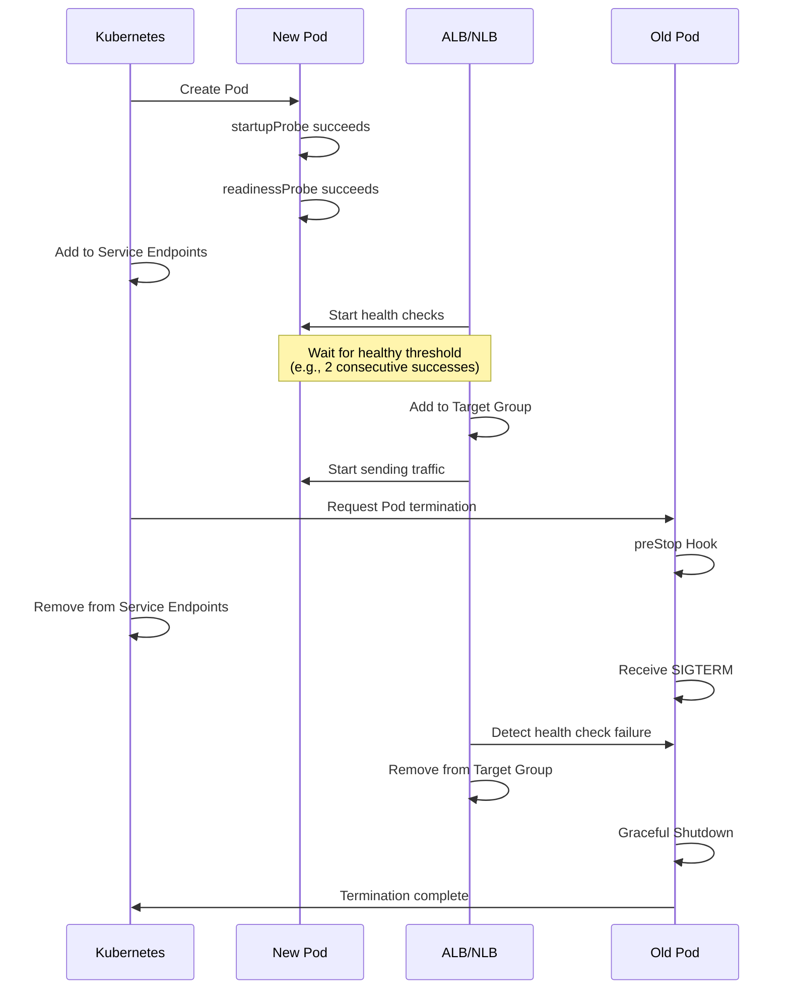
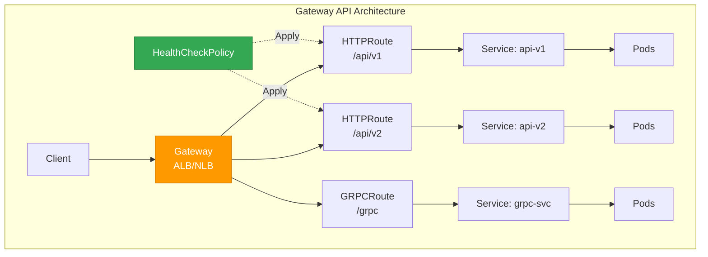

[Pod lifecycle overview](../eks-pod-health-lifecycle.md) · [Checklist and references](./checklist-references.md)

## ALB/NLB Health Check and Probe Integration {#26-albnlb-헬스체크와-probe-통합}

When using AWS Load Balancer Controller, synchronize ALB/NLB health checks with Kubernetes Readiness Probes to enable zero-downtime deployments.

### ALB Target Group Health Checks vs. Readiness Probes {#alb-target-group-헬스체크-vs-readiness-probe}

| Aspect | ALB/NLB Health Check | Kubernetes Readiness Probe |
|------|-----------------|---------------------------|
| **Executed by** | AWS Load Balancer | kubelet |
| **Check target** | IP:Port in the Target Group | Pod container |
| **Action on failure** | Remove from targets (block traffic) | Remove from Service Endpoints |
| **Default interval** | 30 seconds | 10 seconds |
| **Timeout** | 5 seconds | 1 second |

### Health Check Timing Synchronization Strategy {#헬스체크-타이밍-동기화-전략}

During a rolling update, operations proceed in the following order:



**Recommended configuration:**

```yaml
apiVersion: v1
kind: Service
metadata:
  name: myapp
  annotations:
    # ALB health check configuration
    alb.ingress.kubernetes.io/healthcheck-path: /ready
    alb.ingress.kubernetes.io/healthcheck-interval-seconds: "10"
    alb.ingress.kubernetes.io/healthcheck-timeout-seconds: "5"
    alb.ingress.kubernetes.io/healthy-threshold-count: "2"
    alb.ingress.kubernetes.io/unhealthy-threshold-count: "2"
spec:
  type: NodePort
  ports:
  - port: 80
    targetPort: 8080
  selector:
    app: myapp
---
apiVersion: apps/v1
kind: Deployment
metadata:
  name: myapp
spec:
  replicas: 3
  selector:
    matchLabels:
      app: myapp
  template:
    metadata:
      labels:
        app: myapp
    spec:
      containers:
      - name: app
        image: myapp:v1
        ports:
        - containerPort: 8080
        readinessProbe:
          httpGet:
            path: /ready  # Same path as ALB
            port: 8080
          periodSeconds: 5  # Shorter interval than ALB
          failureThreshold: 2
          successThreshold: 1
      terminationGracePeriodSeconds: 60
```

### Pod Readiness Gates (Ensuring Zero-Downtime Deployments) {#pod-readiness-gates-무중단-배포-보장}

AWS Load Balancer Controller v2.5+ supports Pod Readiness Gates, delaying the transition to the `Ready` state until the Pod is registered as an ALB/NLB target and passes health checks.

**Enabling the feature:**

```yaml
# Enable automatic injection by adding a label to the Namespace
apiVersion: v1
kind: Namespace
metadata:
  name: production
  labels:
    elbv2.k8s.aws/pod-readiness-gate-inject: enabled
```

**Verify operation:**

```bash
# Check Pod Readiness Gates
kubectl get pod myapp-xyz -o yaml | grep -A 10 readinessGates

# Example output:
# readinessGates:
# - conditionType: target-health.alb.ingress.k8s.aws/my-target-group-hash

# Check Pod Conditions
kubectl get pod myapp-xyz -o jsonpath='{.status.conditions}' | jq
```

**Benefits:**
- During rolling updates, the old Pod is retained until it is removed from the targets
- The new Pod receives traffic only after passing ALB health checks
- Fully zero-downtime deployments without traffic loss

:::info Details
For more information about Pod Readiness Gates, see the "Pod Readiness Gates" section of the [EKS High Availability Architecture Guide](/docs/eks-best-practices/operations-reliability/eks-resiliency-guide).
:::

### Gateway API Health Check Integration (ALB Controller v2.14+) {#264-gateway-api-헬스체크-통합-alb-controller-v214}

AWS Load Balancer Controller v2.14+ integrates natively with Kubernetes Gateway API v1.4, providing more advanced per-route health check mappings than Ingress.

#### Gateway API vs. Ingress Health Check Comparison {#gateway-api-vs-ingress-헬스체크-비교}

| Aspect | Ingress | Gateway API |
|------|---------|-------------|
| **Health check configuration location** | Service/Ingress annotation | HealthCheckPolicy CRD |
| **Per-route health checks** | Limited (annotation-based) | Native support (per HTTPRoute/GRPCRoute) |
| **L4/L7 protocol support** | HTTP/HTTPS only | Supports TCP/UDP/TLS/HTTP/GRPC |
| **Multi-tenant role separation** | Single Ingress object | Separate Gateway (infrastructure) and Route (application) |
| **Weighted canary deployments** | Difficult or unavailable | Native HTTPRoute support |

#### Gateway API Architecture and Health Checks {#gateway-api-아키텍처와-헬스체크}



#### L7 Health Checks: HTTPRoute/GRPCRoute with ALB {#l7-헬스체크-httproutegrpcroute-with-alb}

**HealthCheckPolicy CRD example:**

```yaml
apiVersion: gateway.networking.k8s.io/v1
kind: Gateway
metadata:
  name: prod-gateway
  namespace: production
spec:
  gatewayClassName: alb
  listeners:
  - name: http
    protocol: HTTP
    port: 80
---
apiVersion: gateway.networking.k8s.io/v1
kind: HTTPRoute
metadata:
  name: api-v1-route
  namespace: production
spec:
  parentRefs:
  - name: prod-gateway
  hostnames:
  - api.example.com
  rules:
  - matches:
    - path:
        type: PathPrefix
        value: /api/v1
    backendRefs:
    - name: api-v1-service
      port: 8080
---
# HealthCheckPolicy (AWS Load Balancer Controller v2.14+)
apiVersion: elbv2.k8s.aws/v1beta1
kind: HealthCheckPolicy
metadata:
  name: api-v1-healthcheck
  namespace: production
spec:
  targetGroupARN: arn:aws:elasticloadbalancing:region:account:targetgroup/name/id
  healthCheckConfig:
    protocol: HTTP
    path: /api/v1/healthz  # Per-route health checks
    port: 8080
    intervalSeconds: 10
    timeoutSeconds: 5
    healthyThresholdCount: 2
    unhealthyThresholdCount: 2
    matcher:
      httpCode: "200-299"
```

**GRPCRoute health check example:**

```yaml
apiVersion: gateway.networking.k8s.io/v1alpha2
kind: GRPCRoute
metadata:
  name: grpc-service-route
  namespace: production
spec:
  parentRefs:
  - name: prod-gateway
  hostnames:
  - grpc.example.com
  rules:
  - matches:
    - method:
        service: myservice.v1.MyService
    backendRefs:
    - name: grpc-backend
      port: 9090
---
apiVersion: elbv2.k8s.aws/v1beta1
kind: HealthCheckPolicy
metadata:
  name: grpc-healthcheck
  namespace: production
spec:
  targetGroupARN: arn:aws:elasticloadbalancing:region:account:targetgroup/grpc/id
  healthCheckConfig:
    protocol: HTTP  # gRPC health checks use HTTP/2
    path: /grpc.health.v1.Health/Check
    port: 9090
    intervalSeconds: 10
    timeoutSeconds: 5
    healthyThresholdCount: 2
    unhealthyThresholdCount: 2
    matcher:
      grpcCode: "0"  # gRPC OK status
```

#### L4 Health Checks: TCPRoute/UDPRoute with NLB {#l4-헬스체크-tcprouteudproute-with-nlb}

```yaml
apiVersion: gateway.networking.k8s.io/v1alpha2
kind: TCPRoute
metadata:
  name: tcp-service-route
  namespace: production
spec:
  parentRefs:
  - name: nlb-gateway
    sectionName: tcp-listener
  rules:
  - backendRefs:
    - name: tcp-backend
      port: 5432
---
apiVersion: elbv2.k8s.aws/v1beta1
kind: HealthCheckPolicy
metadata:
  name: tcp-healthcheck
  namespace: production
spec:
  targetGroupARN: arn:aws:elasticloadbalancing:region:account:targetgroup/tcp/id
  healthCheckConfig:
    protocol: TCP  # Check TCP connectivity only
    port: 5432
    intervalSeconds: 30
    timeoutSeconds: 10
    healthyThresholdCount: 3
    unhealthyThresholdCount: 3
```

#### Gateway API Pod Readiness Gates {#gateway-api-pod-readiness-gates}

Gateway API supports Pod Readiness Gates in the same way as Ingress:

```yaml
apiVersion: v1
kind: Namespace
metadata:
  name: production
  labels:
    elbv2.k8s.aws/pod-readiness-gate-inject: enabled
```

**Verify operation:**

```bash
# Check Gateway status
kubectl get gateway prod-gateway -n production

# Check HTTPRoute status
kubectl get httproute api-v1-route -n production -o yaml

# Check Pod Readiness Gates
kubectl get pod -n production -l app=api-v1 \
  -o jsonpath='{range .items[*]}{.metadata.name}{"\t"}{.status.conditions[?(@.type=="target-health.gateway.networking.k8s.io")].status}{"\n"}{end}'
```

#### Health Check Transition Checklist for Migrating from Ingress to Gateway API {#ingress에서-gateway-api로-마이그레이션-시-헬스체크-전환-체크리스트}

| Step | Ingress | Gateway API | Verification |
|------|---------|-------------|----------|
| 1. Health check path mapping | Annotation-based | HealthCheckPolicy CRD | Separate policies for each route |
| 2. Protocol configuration | HTTP/HTTPS only | HTTP/HTTPS/GRPC/TCP/UDP | Verify protocol type |
| 3. Pod Readiness Gates | Namespace label | Namespace label (same) | Ensure zero-downtime deployments |
| 4. Health check timing | Service annotation | HealthCheckPolicy | Validate interval/timeout |
| 5. Multi-route health checks | Single route only | Independent configuration per route | Validate each route |

**Migration example (Ingress → Gateway API):**

```yaml
# Before (Ingress)
apiVersion: v1
kind: Service
metadata:
  name: myapp
  annotations:
    alb.ingress.kubernetes.io/healthcheck-path: /healthz
    alb.ingress.kubernetes.io/healthcheck-interval-seconds: "10"
---
apiVersion: networking.k8s.io/v1
kind: Ingress
metadata:
  name: myapp-ingress
spec:
  rules:
  - host: api.example.com
    http:
      paths:
      - path: /
        pathType: Prefix
        backend:
          service:
            name: myapp
            port:
              number: 8080
```

```yaml
# After (Gateway API)
apiVersion: gateway.networking.k8s.io/v1
kind: HTTPRoute
metadata:
  name: myapp-route
spec:
  parentRefs:
  - name: prod-gateway
  hostnames:
  - api.example.com
  rules:
  - matches:
    - path:
        type: PathPrefix
        value: /
    backendRefs:
    - name: myapp
      port: 8080
---
apiVersion: elbv2.k8s.aws/v1beta1
kind: HealthCheckPolicy
metadata:
  name: myapp-healthcheck
spec:
  targetGroupARN: <auto-discovered-or-explicit>
  healthCheckConfig:
    protocol: HTTP
    path: /healthz
    port: 8080
    intervalSeconds: 10
    timeoutSeconds: 5
    healthyThresholdCount: 2
    unhealthyThresholdCount: 2
```

:::tip Gateway API Migration Strategy
- **Phased migration**: Ingress and Gateway API can run simultaneously on the same ALB (separate listeners)
- **Canary deployment**: Transition safely using weighted traffic splitting in HTTPRoute
- **Rollback plan**: Retain Ingress objects for a period after migration is complete
:::

:::info References
- [Kubernetes Gateway API v1.4 Release](https://kubernetes.io/blog/2025/11/06/gateway-api-v1-4/)
- [AWS Load Balancer Controller Gateway API Guide](https://kubernetes-sigs.github.io/aws-load-balancer-controller/latest/guide/gateway/gateway/)
- [Practical Gateway API Migration Guide](https://medium.com/@gudiwada.chaithu/zero-downtime-migration-from-kubernetes-ingress-to-gateway-api-on-aws-eks-642f3432d394)
:::
