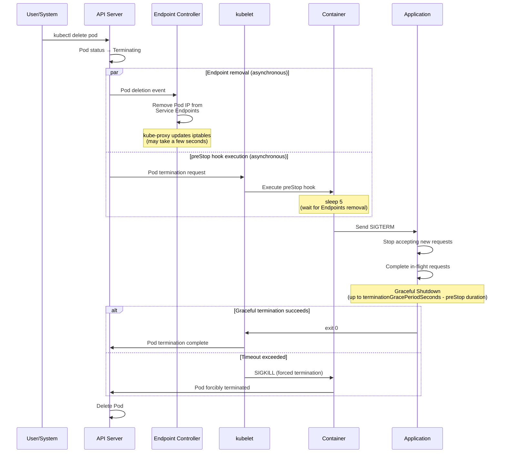

[Pod lifecycle overview](../eks-pod-health-lifecycle.md) · [Checklist and references](./checklist-references.md)

## Complete guide to graceful shutdown {#3-graceful-shutdown-완벽-가이드}

Graceful shutdown is a pattern that safely completes in-flight requests and stops accepting new requests when a Pod terminates. It is essential for zero-downtime deployments and data integrity.

### Pod termination sequence in detail {#31-pod-종료-시퀀스-상세}

Pod termination in Kubernetes follows this sequence.

**Timing details:**

1. **T+0 seconds**: Pod deletion is requested through `kubectl delete pod` or a rolling update
2. **T+0 seconds**: The API Server changes the Pod status to `Terminating`
3. **T+0 seconds**: Two operations start concurrently and **asynchronously**:
   - The Endpoint Controller removes the Pod IP from Service Endpoints
   - kubelet executes the preStop hook
4. **T+0~5 seconds**: The preStop hook runs `sleep 5` (waiting for Endpoints removal)
5. **T+5 seconds**: The preStop hook runs `kill -TERM 1` → sends SIGTERM
6. **T+5 seconds**: The application receives SIGTERM and starts graceful shutdown
7. **T+5~60 seconds**: The application completes in-flight requests and performs cleanup
8. **T+60 seconds**: SIGKILL (forced termination) is sent when `terminationGracePeriodSeconds` is reached

:::tip Why preStop sleep is necessary
Endpoint removal and preStop hook execution occur **asynchronously**. Adding a 5-second sleep to preStop allows the Endpoint Controller and kube-proxy to update iptables, ensuring that new traffic does not reach the terminating Pod. Without this pattern, traffic may continue to reach the terminating Pod and cause 502/503 errors.
:::
