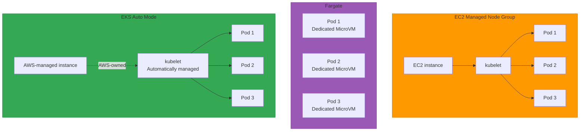
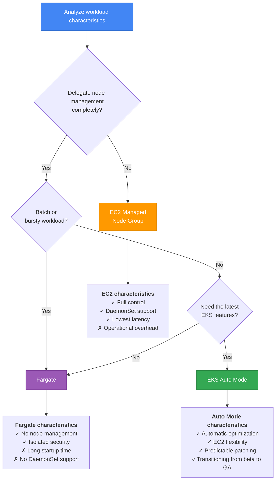

[Pod lifecycle overview](../eks-pod-health-lifecycle.md) · [Checklist and references](./checklist-references.md)

## Special considerations for the Fargate Pod lifecycle {#35-fargate-pod-라이프사이클-특수-고려사항}

AWS Fargate is a serverless compute engine that runs Pods without node management. Fargate Pods have different lifecycle characteristics from EC2-based Pods.

### Architecture comparison: Fargate vs EC2 vs Auto Mode {#fargate-vs-ec2-vs-auto-mode-아키텍처-비교}



### Automatic Fargate Pod eviction for OS patches {#fargate-pod-os-패치-자동-eviction}

Fargate periodically evicts Pods automatically to apply security patches.

**How it works:**

1. **Detect patch availability**: AWS detects new OS/runtime patches
2. **Graceful eviction**: Fargate sends SIGTERM to the Pod → waits for termination within `terminationGracePeriodSeconds`
3. **Forced termination**: Send SIGKILL on timeout
4. **Rescheduling**: Kubernetes reschedules onto a new Fargate Pod (using the updated runtime)

**Key characteristics:**

- **Unpredictable timing**: Users cannot control it (managed by AWS)
- **No advance notification**: No advance warning, unlike EC2 Scheduled Events
- **Automatic restart**: Respects PodDisruptionBudget (PDB), but security patches have higher priority

**Response strategy:**

```yaml
apiVersion: apps/v1
kind: Deployment
metadata:
  name: fargate-app
  namespace: fargate-namespace
spec:
  replicas: 3  # At least 3 recommended (to account for automatic eviction)
  selector:
    matchLabels:
      app: fargate-app
  template:
    metadata:
      labels:
        app: fargate-app
    spec:
      containers:
      - name: app
        image: myapp:v1
        resources:
          requests:
            cpu: 500m
            memory: 1Gi
        startupProbe:
          httpGet:
            path: /healthz
            port: 8080
          failureThreshold: 10
          periodSeconds: 5
        readinessProbe:
          httpGet:
            path: /ready
            port: 8080
          periodSeconds: 5
        livenessProbe:
          httpGet:
            path: /healthz
            port: 8080
          periodSeconds: 10
        lifecycle:
          preStop:
            exec:
              command:
              - /bin/sh
              - -c
              - sleep 10  # Wait longer to account for Fargate eviction
      # Fargate can have longer startup times
      terminationGracePeriodSeconds: 60
---
# Limit concurrent evictions with a PDB (best effort; may be ignored for security patches)
apiVersion: policy/v1
kind: PodDisruptionBudget
metadata:
  name: fargate-app-pdb
  namespace: fargate-namespace
spec:
  minAvailable: 2
  selector:
    matchLabels:
      app: fargate-app
```

:::warning Fargate PDB limitations
Fargate respects PDBs only on a **best-effort** basis. For critical security patches, it may ignore the PDB and force eviction. Therefore, Fargate environments require **at least 3 replicas** to ensure high availability.
:::

### Fargate Pod startup time characteristics {#fargate-pod-시작-시간-특성}

Fargate Pods take longer to start than EC2-based Pods.

| Stage | EC2 (Managed Node) | Fargate | Reason |
|------|-------------------|---------|------|
| **Node provisioning** | 0 seconds (already running) | 20-40 seconds | MicroVM creation + ENI attachment |
| **Image pull** | 5-30 seconds | 10-60 seconds | No layer cache (on first run) |
| **Container startup** | 1-5 seconds | 1-5 seconds | Same |
| **Total startup time** | 6-35 seconds | 31-105 seconds | Additional Fargate overhead |

**Startup Probe tuning example:**

```yaml
# EC2 Pod
startupProbe:
  httpGet:
    path: /healthz
    port: 8080
  failureThreshold: 6   # 6 × 5 seconds = 30 seconds
  periodSeconds: 5

# Fargate Pod (allow more time)
startupProbe:
  httpGet:
    path: /healthz
    port: 8080
  failureThreshold: 20  # 20 × 5 seconds = 100 seconds
  periodSeconds: 5
```

**Image pull optimization (Fargate):**

```yaml
apiVersion: v1
kind: Pod
metadata:
  name: fargate-pod
  namespace: fargate-namespace
spec:
  containers:
  - name: app
    image: 123456789012.dkr.ecr.us-east-1.amazonaws.com/myapp:v1
    imagePullPolicy: IfNotPresent  # IfNotPresent is recommended instead of Always
  imagePullSecrets:
  - name: ecr-secret
```

:::tip Fargate image caching
Fargate caches layers when the same image is reused, but **the cache is lost when the Pod is evicted**. Use ECR Image Scanning and Image Replication to reduce image pull time.
:::

### Sidecar patterns for Fargate without DaemonSet support {#fargate-daemonset-미지원으로-인한-사이드카-패턴}

Fargate does not support DaemonSets, so a sidecar pattern is required when node-level agents are needed.

**Monitoring pattern comparison: EC2 vs Fargate:**

| Capability | EC2 (DaemonSet) | Fargate (Sidecar) |
|------|----------------|-------------------|
| **Log collection** | Fluent Bit DaemonSet | Fluent Bit Sidecar + FireLens |
| **Metric collection** | CloudWatch Agent DaemonSet | CloudWatch Agent Sidecar |
| **Security scanning** | Falco DaemonSet | Fargate is managed by AWS (no user control) |
| **Network policies** | Calico/Cilium DaemonSet | NetworkPolicy unsupported (use Security Groups for Pods) |

**Fargate logging pattern (FireLens):**

```yaml
apiVersion: apps/v1
kind: Deployment
metadata:
  name: fargate-logging-app
  namespace: fargate-namespace
spec:
  replicas: 2
  selector:
    matchLabels:
      app: logging-app
  template:
    metadata:
      labels:
        app: logging-app
    spec:
      containers:
      # Main application
      - name: app
        image: myapp:v1
        ports:
        - containerPort: 8080
        resources:
          requests:
            cpu: 500m
            memory: 512Mi
      # FireLens log router (sidecar)
      - name: log-router
        image: public.ecr.aws/aws-observability/aws-for-fluent-bit:stable
        resources:
          requests:
            cpu: 100m
            memory: 128Mi
          limits:
            cpu: 200m
            memory: 256Mi
        env:
        - name: FLB_LOG_LEVEL
          value: "info"
        firelensConfiguration:
          type: fluentbit
          options:
            enable-ecs-log-metadata: "true"
```

:::info CloudWatch Container Insights on Fargate
Fargate **natively supports** CloudWatch Container Insights and automatically collects metrics without a separate sidecar. It is enabled automatically when a Fargate profile is created.

```bash
aws eks create-fargate-profile \
  --cluster-name my-cluster \
  --fargate-profile-name my-profile \
  --pod-execution-role-arn arn:aws:iam::123456789012:role/FargatePodExecutionRole \
  --selectors namespace=fargate-namespace \
  --tags 'EnableContainerInsights=enabled'
```
:::

### Recommended graceful shutdown timing for Fargate {#fargate-graceful-shutdown-타이밍-권장사항}

Automatic eviction and longer startup times require a different graceful shutdown strategy for Fargate than for EC2.

| Scenario | terminationGracePeriodSeconds | preStop sleep | Reason |
|---------|------------------------------|---------------|------|
| **EC2 Pod** | 30-60 seconds | 5 seconds | Wait for Endpoints removal |
| **Fargate Pod (standard)** | 60-90 seconds | 10-15 seconds | Longer network propagation time |
| **Fargate + ALB** | 90-120 seconds | 15-20 seconds | Account for ALB deregistration delay |
| **Long-running Fargate tasks** | 120-300 seconds | 10 seconds | Allow time for batch jobs to complete |

**Fargate optimization example:**

```yaml
apiVersion: apps/v1
kind: Deployment
metadata:
  name: fargate-web-app
  namespace: fargate-namespace
spec:
  replicas: 3
  selector:
    matchLabels:
      app: web-app
  template:
    metadata:
      labels:
        app: web-app
    spec:
      containers:
      - name: app
        image: myapp:v1
        ports:
        - containerPort: 8080
        readinessProbe:
          httpGet:
            path: /ready
            port: 8080
          periodSeconds: 5
          failureThreshold: 3
          successThreshold: 1
        lifecycle:
          preStop:
            exec:
              command:
              - /bin/sh
              - -c
              - |
                # Network propagation can be slower on Fargate
                echo "PreStop: Waiting for network propagation..."
                sleep 15

                # Signal readiness failure (optional)
                # curl -X POST http://localhost:8080/shutdown

                echo "PreStop: Graceful shutdown initiated"
      terminationGracePeriodSeconds: 90  # 60 seconds for EC2, 90 seconds for Fargate
```

### Comparison of Fargate, EC2, and Auto Mode from a probe perspective {#fargate-vs-ec2-vs-auto-mode-비교표-probe-관점}

| Item | EC2 Managed Node Group | Fargate | EKS Auto Mode |
|------|------------------------|---------|---------------|
| **Node management** | User-managed | AWS-managed | AWS-managed |
| **Pod density** | High (multiple Pods/node) | Low (1 Pod = 1 MicroVM) | Medium (AWS-optimized) |
| **Startup time** | Fast (5-35 seconds) | Slow (30-105 seconds) | Fast (10-40 seconds) |
| **Startup Probe failureThreshold** | 6-10 | 15-20 | 8-12 |
| **terminationGracePeriodSeconds** | 30-60 seconds | 60-120 seconds | 30-60 seconds |
| **preStop sleep** | 5 seconds | 10-15 seconds | 5-10 seconds |
| **Automatic OS patching** | Manual (AMI update) | Automatic (unpredictable eviction) | Automatic (planned eviction) |
| **PDB support** | Full support | Limited (best effort) | Full support |
| **DaemonSet support** | Full support | Unsupported (sidecar required) | Limited (AWS-managed) |
| **Cost model** | Per instance (always running) | Per Pod (runtime only) | Per Pod (optimized) |
| **Spot support** | Full support (Termination Handler) | Limited Fargate Spot support | Automatic optimization |
| **Network policies** | Calico/Cilium supported | Security Groups for Pods only | AWS-managed network policies |

**Selection guide:**



:::tip Fargate production checklist
- [ ] **Replica count**: At least 3 (to account for automatic eviction)
- [ ] **Startup Probe**: Set failureThreshold to 15-20 (account for long startup times)
- [ ] **terminationGracePeriodSeconds**: Set to 60-120 seconds
- [ ] **preStop sleep**: Set to 10-15 seconds (wait for network propagation)
- [ ] **PDB**: Set minAvailable (recommended despite best-effort enforcement)
- [ ] **Image optimization**: Use ECR and minimize layers
- [ ] **Logging**: FireLens sidecar or CloudWatch Logs integration
- [ ] **Monitoring**: Enable CloudWatch Container Insights
- [ ] **Cost optimization**: Consider Fargate Spot (fault-tolerant workloads)
:::

:::info References
- [Official AWS Fargate on EKS documentation](https://docs.aws.amazon.com/eks/latest/userguide/fargate.html)
- [Fargate Pod patching and security updates](https://docs.aws.amazon.com/eks/latest/userguide/fargate-pod-patching.html)
- [EKS Auto Mode overview](https://aws.amazon.com/blogs/aws/streamline-kubernetes-cluster-management-with-new-amazon-eks-auto-mode/)
- [Fargate and EC2 comparison guide](https://aws.amazon.com/blogs/containers/)
:::

---
