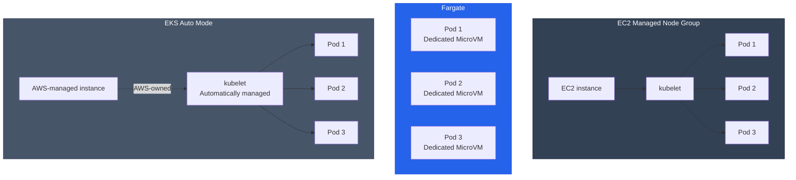
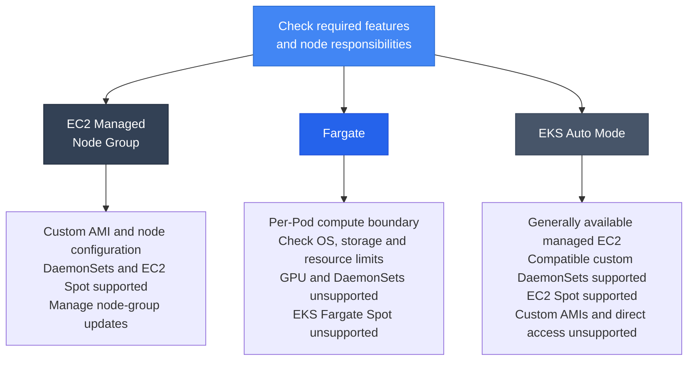

[Pod lifecycle overview](../eks-pod-health-lifecycle.md) · [Checklist and references](./checklist-references.md)

## Special considerations for the Fargate Pod lifecycle {#35-fargate-pod-라이프사이클-특수-고려사항}

AWS Fargate is a serverless compute engine that runs Pods without node management. Fargate Pods have different lifecycle characteristics from EC2-based Pods.

### Architecture comparison: Fargate vs EC2 vs Auto Mode {#fargate-vs-ec2-vs-auto-mode-아키텍처-비교}



### Automatic Fargate Pod eviction for OS patches {#fargate-pod-os-패치-자동-eviction}

When patching the OS of Fargate nodes, Amazon EKS notifies you of the affected resources and scheduled Pod eviction date. Operators can identify those Pods and roll their Deployments or other controllers before that date to apply the patch.

**Patching sequence:**

1. EKS calls the Eviction API by Availability Zone and checks the application's PodDisruptionBudget (PDB).
2. Once eviction is admitted, the kubelet starts Pod termination. `preStop` and application shutdown share `terminationGracePeriodSeconds`. When a controller such as a Deployment creates a replacement Pod, the new Pod uses the latest patch.
3. If eviction fails, an `EKS Fargate Pod Scheduled Termination` event provides the failure reason and `scheduledTerminationTime`. Operators can check application availability and the PDB configuration before that time.
4. At the scheduled time, EKS retries eviction without sending another failure event. If the retry also fails, EKS periodically deletes the existing Pods so they can be replaced.

See the [Fargate OS patching guide](https://docs.aws.amazon.com/eks/latest/userguide/fargate-pod-patching.html) for the procedure and notification setup.

**Configuration example:**

This example sets a PDB to keep two of three replicas Ready. Choose the replica count and placement across failure domains from required serving capacity, and adapt the image, health endpoints and shutdown timings to the application. Prepare `fargate-namespace` and a matching Fargate profile first.

```yaml
apiVersion: apps/v1
kind: Deployment
metadata:
  name: fargate-app
  namespace: fargate-namespace
spec:
  replicas: 3  # Example: adjust for required Ready capacity and placement
  selector:
    matchLabels:
      app: fargate-app
  template:
    metadata:
      labels:
        app: fargate-app
    spec:
      containers:
      - name: app
        image: myapp:v1
        resources:
          requests:
            cpu: 500m
            memory: 1Gi
        startupProbe:
          httpGet:
            path: /healthz
            port: 8080
          failureThreshold: 10
          periodSeconds: 5
        readinessProbe:
          httpGet:
            path: /ready
            port: 8080
          periodSeconds: 5
        livenessProbe:
          httpGet:
            path: /healthz
            port: 8080
          periodSeconds: 10
        lifecycle:
          preStop:
            exec:
              command:
              - /bin/sh
              - -c
              - sleep 10  # Example wait included in the total termination grace period
      terminationGracePeriodSeconds: 60  # Includes preStop and application shutdown
---
apiVersion: policy/v1
kind: PodDisruptionBudget
metadata:
  name: fargate-app-pdb
  namespace: fargate-namespace
spec:
  minAvailable: 2
  selector:
    matchLabels:
      app: fargate-app
```

:::info Where the PDB applies
A PDB limits disruptions admitted through the Eviction API. Direct Pod deletion bypasses PDB checks; Deployment rolling updates use the Deployment's update strategy. Fargate patching can proceed to deletion after eviction retries fail, so arrange the required Ready capacity before the notified time.
:::

### Fargate Pod startup time characteristics {#fargate-pod-시작-시간-특성}

Measure startup in separate stages: scheduling and compute preparation, image pull, and application initialization after the container starts. A startup probe checks application initialization while the container is running, so earlier provisioning and image-pull time are outside its budget.

| Stage | What to inspect |
|------|-----------------|
| **Scheduling and compute preparation** | Pod events and scheduling time, Fargate profile and subnet configuration |
| **Image pull** | Image size, registry location, authentication and network path |
| **Application initialization** | Time from container start until the health endpoint succeeds |

**Startup probe example:**

For both EC2 and Fargate, set `failureThreshold × periodSeconds` from measured application initialization. The example below uses 20 attempts at five-second intervals for an initialization budget of about 100 seconds.

```yaml
# Example configuration for containers[].startupProbe
startupProbe:
  httpGet:
    path: /healthz
    port: 8080
  failureThreshold: 20
  periodSeconds: 5
```

**ECR image example:**

```yaml
apiVersion: v1
kind: Pod
metadata:
  name: fargate-pod
  namespace: fargate-namespace
spec:
  containers:
  - name: app
    image: 123456789012.dkr.ecr.us-east-1.amazonaws.com/myapp:v1
    imagePullPolicy: IfNotPresent
```

[Private ECR image pulls](https://docs.aws.amazon.com/AmazonECR/latest/userguide/ECR_on_EKS.html) use the Fargate Pod execution role. Replace the registry address with the actual image and check image size and the path to the registry.

[ECR Image Scanning](https://docs.aws.amazon.com/AmazonECR/latest/userguide/image-scanning.html) checks images for vulnerabilities. Measure image-pull performance separately, using the same image and network conditions when comparing platforms.

### Sidecar patterns for Fargate without DaemonSet support {#fargate-daemonset-미지원으로-인한-사이드카-패턴}

When an application on Fargate needs an agent, use a supported sidecar or separate collector. EKS provides a Fluent Bit log router for collecting container standard output logs.

| Capability | EC2 | Fargate |
|------|-----|---------|
| **Log collection** | Fluent Bit DaemonSet | Built-in Fluent Bit log router and `aws-logging` ConfigMap |
| **Metric collection** | CloudWatch Agent or another collector | Configure an ADOT collector to send metrics to Container Insights |
| **Security checks** | Image scanning and host tools such as Falco | Scan application images and configuration; account for host-access restrictions |
| **Kubernetes NetworkPolicy** | Supported VPC CNI network policies or a Calico/Cilium configuration | Unsupported. Security Groups for Pods provide separate traffic controls |

Security Groups for Pods control traffic through VPC security groups. They do not implement the Kubernetes `NetworkPolicy` API, so creating a NetworkPolicy object alone does not enforce it on Fargate Pods. Check the [VPC CNI network policy support boundaries](https://docs.aws.amazon.com/eks/latest/userguide/cni-network-policy.html) and [Security Groups for Pods considerations](https://docs.aws.amazon.com/eks/latest/userguide/security-groups-for-pods.html).

**CloudWatch Logs configuration example:**

Prepare the `aws-observability` namespace and `aws-logging` ConfigMap using the [Fargate logging guide](https://docs.aws.amazon.com/eks/latest/userguide/fargate-logging.html). Replace the Region below with the cluster's Region, grant the Pod execution role permissions for the log destination, and provide network access to it. Apply the ConfigMap before creating new Pods; configuration changes also take effect on new Pods.

```yaml
apiVersion: v1
kind: Namespace
metadata:
  name: aws-observability
  labels:
    aws-observability: enabled
---
apiVersion: v1
kind: ConfigMap
metadata:
  name: aws-logging
  namespace: aws-observability
data:
  flb_log_cw: "false"
  output.conf: |
    [OUTPUT]
        Name cloudwatch_logs
        Match kube.*
        region us-east-1
        log_group_name /eks/fargate/app
        log_stream_prefix app-
        auto_create_group true
```

The application writes logs to standard output and standard error. This Deployment uses a Fargate profile matching `fargate-namespace` and an actual application image.

```yaml
apiVersion: apps/v1
kind: Deployment
metadata:
  name: fargate-logging-app
  namespace: fargate-namespace
spec:
  replicas: 2
  selector:
    matchLabels:
      app: logging-app
  template:
    metadata:
      labels:
        app: logging-app
    spec:
      containers:
      - name: app
        image: myapp:v1
        ports:
        - containerPort: 8080
        resources:
          requests:
            cpu: 500m
            memory: 512Mi
```

:::info CloudWatch Container Insights on Fargate
Application system metrics reach Container Insights through an [ADOT collection setup](https://docs.aws.amazon.com/eks/latest/userguide/monitoring-fargate-usage.html). The `AWS/Usage` metrics that Fargate publishes automatically represent account usage against service quotas.
:::

### Recommended graceful shutdown timing for Fargate {#fargate-graceful-shutdown-타이밍-권장사항}

Set the termination budget from the time needed to move traffic and finish work already in progress. `preStop` consumes the same grace period, so leave time for the application to handle its stop signal after the wait.

| Item to inspect | Contribution to the termination budget |
|-----------|-------------------------|
| **Traffic transition** | Time for EndpointSlice and load-balancer target state to propagate |
| **Active requests and jobs** | Time for remaining handlers and workers to finish after admission stops |
| **Resource cleanup** | Time to close connections and flush buffers after work finishes |
| **preStop** | Hook execution and application shutdown must fit within the total grace period |

**Termination budget example:**

This example assigns 15 seconds of a total 90-second budget to traffic transition. On receiving its stop signal, the application stops admitting requests and jobs, then finishes remaining work and cleanup. Load-balancer propagation and Pod termination proceed asynchronously; adjust the values and margin using observations from the service.

```yaml
apiVersion: apps/v1
kind: Deployment
metadata:
  name: fargate-web-app
  namespace: fargate-namespace
spec:
  replicas: 3
  selector:
    matchLabels:
      app: web-app
  template:
    metadata:
      labels:
        app: web-app
    spec:
      containers:
      - name: app
        image: myapp:v1
        ports:
        - containerPort: 8080
        readinessProbe:
          httpGet:
            path: /ready
            port: 8080
          periodSeconds: 5
          failureThreshold: 3
          successThreshold: 1
        lifecycle:
          preStop:
            exec:
              command:
              - /bin/sh
              - -c
              - sleep 15  # Traffic-transition wait to adjust using service measurements
      terminationGracePeriodSeconds: 90  # Includes the 15-second preStop and application shutdown
```

See the [Pod termination sequence](https://kubernetes.io/docs/concepts/workloads/pods/pod-lifecycle/#pod-termination) and [connection and work cleanup examples](./shutdown-draining.md).

### Comparison of Fargate, EC2, and Auto Mode from a probe perspective {#fargate-vs-ec2-vs-auto-mode-비교표-probe-관점}

| Item | EC2 Managed Node Group | Fargate | EKS Auto Mode |
|------|------------------------|---------|---------------|
| **Node management** | User manages node-group configuration and updates | AWS-managed | AWS-managed |
| **Pod capacity** | Depends on instance and network configuration | Separate compute boundary for each Pod | Depends on instance and NodePool configuration |
| **Startup time** | Measure by stage | Measure by stage | Measure by stage |
| **Startup probe** | Based on application initialization | Based on application initialization | Based on application initialization |
| **terminationGracePeriodSeconds** | Based on requests, jobs and cleanup | Based on requests, jobs and cleanup | Based on requests, jobs and cleanup |
| **preStop** | Any required transition wait is part of the total grace period | Any required transition wait is part of the total grace period | Any required transition wait is part of the total grace period |
| **OS patching** | Manage AMI and node-group updates | Scheduled notification, eviction and retry procedure | AWS manages node replacement |
| **PDB** | Checked by the Eviction API | Checked by the Eviction API; failed patch retries can lead to deletion | Updates account for PDBs and NodePool disruption budgets |
| **DaemonSet** | Supported | Unsupported; configure needed agents separately | Custom DaemonSets supported, subject to node security constraints |
| **Cost model** | EC2 instance and other resource charges | Runtime charges for the provisioned Fargate vCPU/memory configuration and other resources | EC2 charges plus Auto Mode compute-management charges |
| **Spot** | EC2 Spot available | EKS Fargate Spot unsupported | EC2 Spot available |
| **Kubernetes NetworkPolicy** | Supported VPC CNI network policies or a Calico/Cilium configuration | Unsupported. Security Groups for Pods are a separate access control | Auto Mode network policies supported; Security Groups for Pods unsupported |

The [Auto Mode configuration guide](https://docs.aws.amazon.com/eks/latest/userguide/automode.html) describes custom DaemonSets and the scope of node management.

**Conditions to check before choosing:**

A batch job or a burst of traffic alone does not determine the platform. First check support for the required OS, architecture, storage and agents, then measure capacity and cost for compatible candidates using the same workload. The diagram lists conditions to check for each candidate. A per-Pod compute boundary does not establish network isolation or application availability.



:::tip Fargate production checklist
- [ ] **Patch notifications**: Identify affected Pods and dates, and prepare to handle failed-eviction events
- [ ] **Replicas and PDB**: Set from required Ready capacity and placement across failure domains
- [ ] **Startup probe**: Set from application initialization after the container starts
- [ ] **Termination budget**: Measure traffic transition, remaining work and cleanup; include preStop in the total grace period
- [ ] **Images**: Check execution-role ECR access, optimize image size and scan for vulnerabilities
- [ ] **Logging**: Configure `aws-logging`, execution-role permissions and verified log delivery
- [ ] **Monitoring**: Configure ADOT collection and check Container Insights metrics
- [ ] **Cost**: Review requested resources and runtime; consider EC2-based options when Spot is required
:::

:::info References
- [Official AWS Fargate on EKS documentation](https://docs.aws.amazon.com/eks/latest/userguide/fargate.html)
- [Fargate Pod patching and security updates](https://docs.aws.amazon.com/eks/latest/userguide/fargate-pod-patching.html)
- [EKS Auto Mode launch and charging model](https://aws.amazon.com/blogs/aws/streamline-kubernetes-cluster-management-with-new-amazon-eks-auto-mode/)
- [AWS Containers blog](https://aws.amazon.com/blogs/containers/)
:::

---
