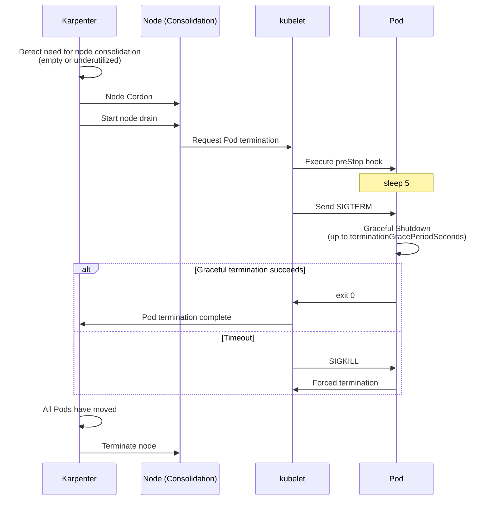
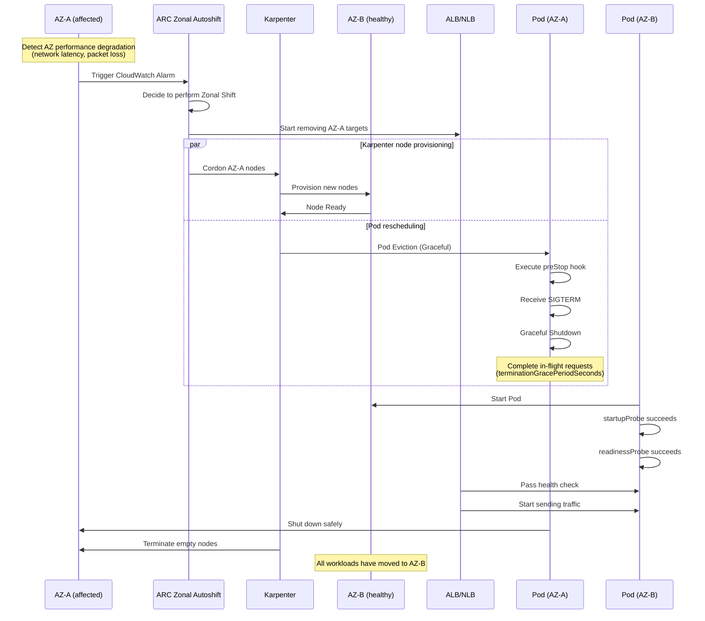

[Pod lifecycle overview](../eks-pod-health-lifecycle.md) · [Checklist and references](./checklist-references.md)

## Interaction with Karpenter and node drain {#34-karpenternode-drain과의-상호작용}

When Karpenter consolidates nodes or a Spot instance terminates, all Pods on the node must move safely.

### Karpenter disruption and graceful shutdown {#karpenter-disruption과-graceful-shutdown}



**Karpenter NodePool configuration:**

```yaml
apiVersion: karpenter.sh/v1
kind: NodePool
metadata:
  name: default
spec:
  disruption:
    consolidationPolicy: WhenEmptyOrUnderutilized
    consolidateAfter: 5m
    # Disruption budget: limit concurrent node disruptions
    budgets:
    - nodes: "20%"
      schedule: "0 9-17 * * MON-FRI"  # 20% during business hours
    - nodes: "50%"
      schedule: "0 0-8,18-23 * * *"   # 50% outside business hours
```

:::warning Interaction between PDB and Karpenter
If a PodDisruptionBudget is too strict (for example, `minAvailable` equals the replica count), Karpenter cannot drain nodes. Set the PDB to `minAvailable: replica - 1` or `maxUnavailable: 1` so that at least 1 Pod can move.
:::

### AZ evacuation pattern with ARC + Karpenter integration {#343-arc--karpenter-통합-az-대피-패턴}

**Overview:**

The integration of AWS Application Recovery Controller (ARC) and Karpenter, announced in 2025, provides a high-availability pattern that automatically moves workloads to other Availability Zones (AZs) when an AZ fails. This ensures graceful shutdown and minimizes service disruption during AZ failures or gray failures.

**About ARC Zonal Shift:**

Zonal Shift automatically shifts traffic from an AZ to other healthy AZs when a failure or performance degradation is detected in that AZ. Integration with EKS also automates safe Pod relocation.

**Architecture components:**

| Component | Role | Behavior |
|----------|------|------|
| **ARC Zonal Autoshift** | Automatically detect AZ failures and decide when to shift traffic | Automatic shift based on CloudWatch Alarms |
| **Karpenter** | Provision nodes in a new AZ | Create nodes in healthy AZs according to NodePool configuration |
| **AWS Load Balancer** | Control traffic routing | Remove targets in the affected AZ |
| **PodDisruptionBudget** | Ensure availability during Pod relocation | Maintain the minimum number of available Pods |

**AZ evacuation sequence:**



**Configuration examples:**

**1. Enable ARC Zonal Autoshift:**

```bash
# Enable Zonal Autoshift on the load balancer
aws arc-zonal-shift create-autoshift-observer-notification-configuration \
  --resource-identifier arn:aws:elasticloadbalancing:ap-northeast-2:123456789012:loadbalancer/app/production-alb/1234567890abcdef

# Configure Zonal Autoshift
aws arc-zonal-shift update-zonal-autoshift-configuration \
  --resource-identifier arn:aws:elasticloadbalancing:ap-northeast-2:123456789012:loadbalancer/app/production-alb/1234567890abcdef \
  --zonal-autoshift-status ENABLED
```

**2. Karpenter NodePool - AZ-aware configuration:**

```yaml
apiVersion: karpenter.sh/v1
kind: NodePool
metadata:
  name: default
spec:
  disruption:
    consolidationPolicy: WhenEmptyOrUnderutilized
    consolidateAfter: 30s
    # Respond quickly to AZ failures
    budgets:
    - nodes: "100%"
      reasons:
      - "Drifted"  # Replace immediately when an AZ is cordoned
  template:
    spec:
      requirements:
      - key: "topology.kubernetes.io/zone"
        operator: In
        values:
        - ap-northeast-2a
        - ap-northeast-2b
        - ap-northeast-2c
      - key: karpenter.sh/capacity-type
        operator: In
        values:
        - on-demand  # On-Demand is recommended for AZ failure recovery
      nodeClassRef:
        name: default
---
apiVersion: karpenter.k8s.aws/v1
kind: EC2NodeClass
metadata:
  name: default
spec:
  amiFamily: AL2023
  role: "KarpenterNodeRole-production"
  subnetSelectorTerms:
  - tags:
      karpenter.sh/discovery: "production-eks"
  securityGroupSelectorTerms:
  - tags:
      karpenter.sh/discovery: "production-eks"
  # Automatically detect AZ failures
  metadataOptions:
    httpTokens: required
    httpPutResponseHopLimit: 2
```

**3. Deployment with PDB - distribute across AZs:**

```yaml
apiVersion: apps/v1
kind: Deployment
metadata:
  name: critical-api
spec:
  replicas: 6
  selector:
    matchLabels:
      app: critical-api
  template:
    metadata:
      labels:
        app: critical-api
    spec:
      # Ensure distribution across AZs
      topologySpreadConstraints:
      - maxSkew: 1
        topologyKey: topology.kubernetes.io/zone
        whenUnsatisfiable: DoNotSchedule
        labelSelector:
          matchLabels:
            app: critical-api
      # Avoid placement on the same node
      affinity:
        podAntiAffinity:
          preferredDuringSchedulingIgnoredDuringExecution:
          - weight: 100
            podAffinityTerm:
              labelSelector:
                matchLabels:
                  app: critical-api
              topologyKey: kubernetes.io/hostname
      containers:
      - name: api
        image: myapp/critical-api:v3
        ports:
        - containerPort: 8080
        resources:
          requests:
            cpu: 500m
            memory: 1Gi
        readinessProbe:
          httpGet:
            path: /ready
            port: 8080
          periodSeconds: 5
          failureThreshold: 2
        livenessProbe:
          httpGet:
            path: /healthz
            port: 8080
          periodSeconds: 10
        lifecycle:
          preStop:
            exec:
              command:
              - /bin/sh
              - -c
              - sleep 5
      terminationGracePeriodSeconds: 60
---
apiVersion: policy/v1
kind: PodDisruptionBudget
metadata:
  name: critical-api-pdb
spec:
  minAvailable: 4  # Maintain at least 4 of 6 (operate in 2 AZs during an AZ failure)
  selector:
    matchLabels:
      app: critical-api
```

**4. CloudWatch Alarm - detect AZ performance degradation:**

```yaml
apiVersion: v1
kind: ConfigMap
metadata:
  name: az-health-monitoring
  namespace: monitoring
data:
  cloudwatch-alarm: |
    {
      "AlarmName": "AZ-A-NetworkLatency-High",
      "MetricName": "NetworkLatency",
      "Namespace": "AWS/EC2",
      "Statistic": "Average",
      "Period": 60,
      "EvaluationPeriods": 3,
      "Threshold": 100,
      "ComparisonOperator": "GreaterThanThreshold",
      "Dimensions": [
        {"Name": "AvailabilityZone", "Value": "ap-northeast-2a"}
      ],
      "AlarmDescription": "Increased AZ-A network latency - trigger Zonal Shift",
      "AlarmActions": [
        "arn:aws:arc-zonal-shift:ap-northeast-2:123456789012:autoshift-observer-notification"
      ]
    }
```

**End-to-end AZ recovery with an Istio service mesh:**

Integration with an Istio service mesh enables more granular traffic control during AZ evacuation:

```yaml
# Istio DestinationRule: AZ-based traffic routing
apiVersion: networking.istio.io/v1beta1
kind: DestinationRule
metadata:
  name: critical-api-az-routing
spec:
  host: critical-api.production.svc.cluster.local
  trafficPolicy:
    loadBalancer:
      localityLbSetting:
        enabled: true
        distribute:
        - from: ap-northeast-2a/*
          to:
            "ap-northeast-2b/*": 50
            "ap-northeast-2c/*": 50
        - from: ap-northeast-2b/*
          to:
            "ap-northeast-2a/*": 50
            "ap-northeast-2c/*": 50
        - from: ap-northeast-2c/*
          to:
            "ap-northeast-2a/*": 50
            "ap-northeast-2b/*": 50
    outlierDetection:
      consecutiveErrors: 3
      interval: 10s
      baseEjectionTime: 30s
      maxEjectionPercent: 50
---
# VirtualService: automatic rerouting during AZ failures
apiVersion: networking.istio.io/v1beta1
kind: VirtualService
metadata:
  name: critical-api-failover
spec:
  hosts:
  - critical-api.production.svc.cluster.local
  http:
  - match:
    - sourceLabels:
        topology.kubernetes.io/zone: ap-northeast-2a
    route:
    - destination:
        host: critical-api.production.svc.cluster.local
        subset: az-b
      weight: 50
    - destination:
        host: critical-api.production.svc.cluster.local
        subset: az-c
      weight: 50
    timeout: 3s
    retries:
      attempts: 3
      perTryTimeout: 1s
```

**Gray failure handling strategies:**

A gray failure is a state of degraded performance rather than a complete failure, making it difficult to detect. Use ARC + Karpenter + Istio together to respond:

| Gray failure symptom | Detection method | Automated response |
|------------------|----------|----------|
| Increased network latency (50-200ms) | Container Network Observability | Istio Outlier Detection → reroute traffic |
| Intermittent packet loss (1-5%) | CloudWatch Network Metrics | Trigger ARC Zonal Shift |
| Degraded disk I/O | EBS CloudWatch Metrics | Karpenter node replacement |
| API Server response latency | Control Plane Metrics | Automatic scaling of the Provisioned Control Plane |

**Testing and validation:**

```bash
# Simulate an AZ failure (Chaos Engineering)
kubectl apply -f - <<EOF
apiVersion: v1
kind: ConfigMap
metadata:
  name: az-failure-test
  namespace: chaos
data:
  experiment: |
    # 1. Add a taint to all nodes in AZ-A (simulate an AZ failure)
    kubectl taint nodes -l topology.kubernetes.io/zone=ap-northeast-2a \
      az-failure=true:NoSchedule

    # 2. Verify that Karpenter creates new nodes in AZ-B and AZ-C
    kubectl get nodes -l topology.kubernetes.io/zone=ap-northeast-2b,ap-northeast-2c

    # 3. Monitor Pod relocation
    kubectl get pods -o wide --watch

    # 4. Verify PDB compliance (maintain minAvailable)
    kubectl get pdb critical-api-pdb

    # 5. Check graceful shutdown logs
    kubectl logs <pod-name> --previous

    # 6. Recover (remove the taint)
    kubectl taint nodes -l topology.kubernetes.io/zone=ap-northeast-2a \
      az-failure-
EOF
```

**Monitoring dashboard:**

```yaml
# Grafana Dashboard: AZ health and evacuation status
apiVersion: v1
kind: ConfigMap
metadata:
  name: az-failover-dashboard
  namespace: monitoring
data:
  dashboard.json: |
    {
      "panels": [
        {
          "title": "Pod distribution by AZ",
          "targets": [
            {
              "expr": "count(kube_pod_info) by (node, zone)"
            }
          ]
        },
        {
          "title": "Network latency by AZ",
          "targets": [
            {
              "expr": "avg(container_network_latency_ms) by (availability_zone)"
            }
          ]
        },
        {
          "title": "Karpenter node provisioning rate",
          "targets": [
            {
              "expr": "rate(karpenter_nodes_created_total[5m])"
            }
          ]
        },
        {
          "title": "Graceful shutdown success rate",
          "targets": [
            {
              "expr": "rate(pod_termination_graceful_total[5m]) / rate(pod_termination_total[5m])"
            }
          ]
        }
      ]
    }
```

**Related resources:**
- [AWS Blog: ARC + Karpenter high-availability integration](https://aws.amazon.com/blogs/containers/enhance-kubernetes-high-availability-with-amazon-application-recovery-controller-and-karpenter-integration/)
- [AWS Blog: Istio-based end-to-end AZ recovery](https://aws.amazon.com/blogs/containers/)
- [AWS re:Invent 2025: Supercharge your Karpenter](https://www.youtube.com/watch?v=kUQ4Q11F4iQ)

:::tip Operational best practices
Although AZ evacuation is automated, validate it through regular Chaos Engineering tests. Run at least 1 AZ failure simulation per quarter to verify that PDB, Karpenter, and graceful shutdown behave as expected. In particular, measure actual shutdown time in production to ensure that `terminationGracePeriodSeconds` provides sufficient time.
:::

### Handling the 2-minute Spot instance warning {#spot-인스턴스-2분-경고-처리}

AWS Spot instances send a warning 2 minutes before termination. Handle this warning to ensure graceful shutdown.

**Install AWS Node Termination Handler:**

```bash
helm repo add eks https://aws.github.io/eks-charts
helm repo update

helm install aws-node-termination-handler \
  --namespace kube-system \
  eks/aws-node-termination-handler \
  --set enableSpotInterruptionDraining=true \
  --set enableScheduledEventDraining=true
```

**How it works:**
1. Detect the 2-minute Spot termination warning
2. Immediately cordon the node (block scheduling of new Pods)
3. Drain all Pods on the node
4. Complete graceful shutdown within the Pod's `terminationGracePeriodSeconds`

**Recommended terminationGracePeriodSeconds:**
- Standard web services: 30-60 seconds
- Long-running tasks (batch jobs, ML inference): 90-120 seconds
- Set to no more than 2 minutes (accounting for the Spot warning period)

---
