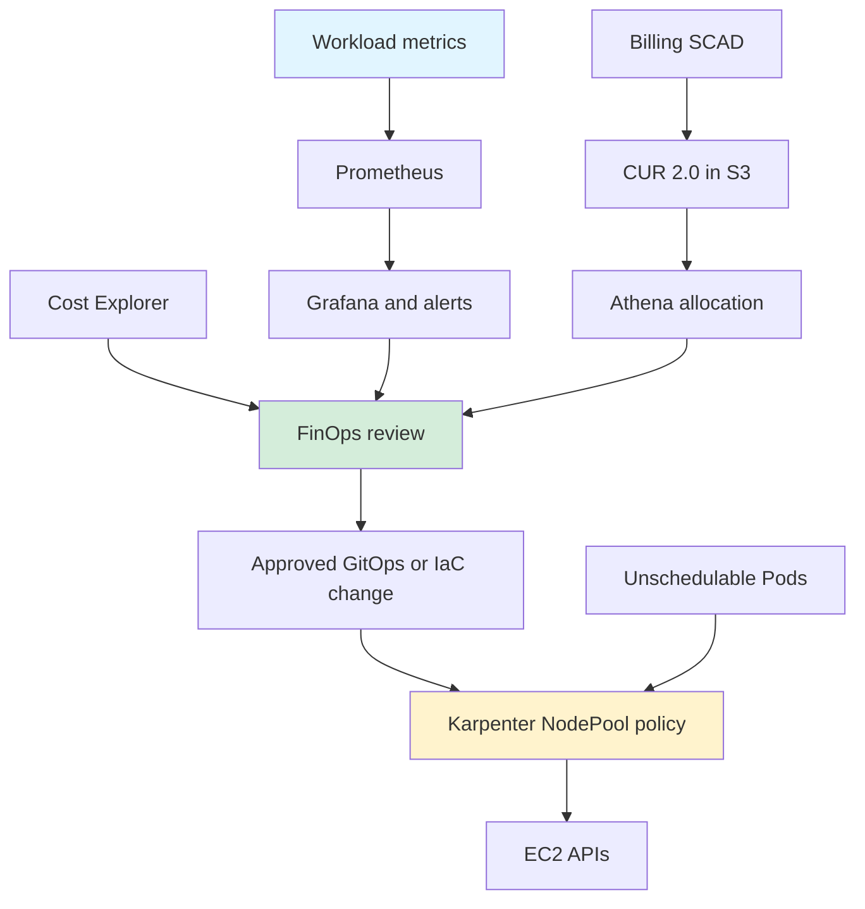
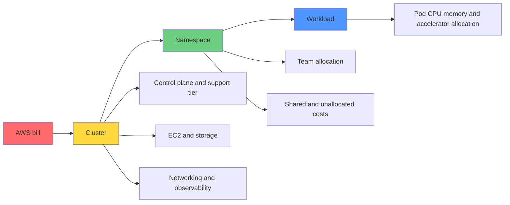

> **Scope**: Karpenter v1.13 documentation/APIs; technical review 2026-09-18.

## Overview

EKS cost management allocates billed costs to workloads while accounting for usage, performance, and availability constraints. This chapter connects FinOps assessment, SCAD, Karpenter, tagging, and review-only rightsizing. Measure savings using consistent pricing, periods, and traffic; no savings percentage or company case study is guaranteed.

EKS Auto Mode management charges are additional to EC2 charges and depend on instance type. Do not apply a blanket 10% premium. Compare management fees, operating effort, observability, and migration costs with self-managed Karpenter. [EKS pricing](https://aws.amazon.com/eks/pricing/)

### Key Topics

- FinOps maturity and cost ownership
- Pod allocation through SCAD and CUR 2.0
- Karpenter node selection, consolidation, and availability constraints
- Per-container rightsizing review and savings verification

### Learning Objectives

- Distinguish billed costs from estimated allocations.
- Identify cost drivers and potentially excessive resource requests.
- Define reviewable changes and recovery criteria.
- Track actual savings alongside performance and availability.

## Prerequisites

Examples are design and review material for an existing EKS environment. Set the account, AWS profile, Region, cluster, and namespace for the intended environment.

### Required Tools

| Tool | Scope | Purpose |
|------|-------|---------|
| kubectl | Supported version skew with the API server | Resource inspection |
| Helm | Version supported by the selected chart | Reviewed chart installation |
| AWS CLI v2 | Version providing `bcm-data-exports` | Billing export inspection and configuration |
| Python | 3.11 or later, standard library | Offline calculations and tests |
| Karpenter | Examples use v1.13 APIs and documentation | Self-managed NodePools |

Check compatibility tables and installed CRDs for Kubernetes, Karpenter, and charts. A version number alone does not satisfy installation prerequisites.

### Required Permissions

Grant the analysis role read access to the relevant billing data, cluster, and resources. Billing opt-in, S3 exports, Karpenter installation, and EC2 tagging require separate mutation permissions and resource scopes. This policy is a read-only example, not a complete installation policy.

```json
{
  "Version": "2012-10-17",
  "Statement": [
    {
      "Effect": "Allow",
      "Action": [
        "ce:GetCostAndUsage",
        "eks:DescribeCluster",
        "ec2:DescribeInstances",
        "ec2:DescribeInstanceTypeOfferings",
        "bcm-data-exports:ListExports",
        "bcm-data-exports:GetExport"
      ],
      "Resource": "*"
    }
  ]
}
```

### Prior Knowledge

Understand Kubernetes requests and limits, Pod ownership, EKS node configuration, AWS cost allocation tags, and IAM roles.

## Architecture

Separate cost analysis from the controllers that implement approved changes.

### EKS Cost Monitoring System Architecture

This is a conceptual flow. Alertmanager notifications do not directly change Karpenter policies. An implemented, approved GitOps/IaC integration must deliver policy changes; Karpenter provisions capacity through EC2 APIs.



### 3-Layer Cost Allocation Model

Define separate allocation policies for shared control-plane, networking, and observability costs. Pod EC2 allocation costs are not the total cluster bill.



<span id="implementation-steps" />

## Implementation

Proceed through visibility, change review, gradual rollout, and billing reconciliation.

<span id="step-1-finops-maturity-assessment" />

### Step 1: Assess FinOps Maturity

Identify cost management activities the organization can repeat and the owner of each activity.

#### Maturity Model

This is an internal assessment example. Do not assign fixed allocation accuracy or automation percentages to FinOps stages.

| Stage | Activity | Evidence |
|-------|----------|----------|
| Crawl | Inspect costs and identify owners | Monthly bills and missing tags |
| Walk | Allocate to teams and optimize regularly | Review records and before/after metrics |
| Run | Connect cost to business metrics | Cost per transaction and policy automation evidence |

#### Self-Assessment Checklist

- [ ] Identify cluster, team, and workload owners.
- [ ] Report shared and unallocated costs.
- [ ] Keep weekly review and change approval records.
- [ ] Define recovery criteria for performance or availability regression.
- [ ] Track cost per business unit such as request, job, or customer.

<span id="step-2-eks-cost-structure" />

### Step 2: Understand the EKS Cost Structure

Fix the billing scope and cost basis before comparing tools.

#### Cost Components

| Cost component | Calculation basis | Review |
|----------------|-------------------|--------|
| EKS control plane | Support-tier hourly rate × actual running hours | Extended support and additional feature charges |
| EC2 | Instance, Region, OS, and purchase option | On-Demand does not guarantee capacity |
| Savings Plans and RI | Commitments, upfront amortization, covered usage | Unused commitments and coverage |
| Spot | Actual runtime and applicable price | Interruptions, retries, and checkpoints |
| EBS, LB, NAT, transfer | Storage, requests, processing, and traffic paths | Regional and service-specific charges |
| Auto Mode and observability | Management, ingestion, storage, and queries | Charges additional to EC2 |

Applying the $0.10/hour standard-support example in [EKS pricing](https://aws.amazon.com/eks/pricing/) to an assumed 730-hour month gives $73. This excludes extended support, Auto Mode, and other service charges. Cluster consolidation also requires an isolation and failure-domain review.

#### Identifying Cost Waste Patterns

Requests express scheduling requirements; usage describes observed load. A low CPU average does not imply that the entire node bill is removable. Check memory, peaks, placement constraints, and missing telemetry. This query inventories container requests; it does not measure efficiency by itself.

Compare Regions using the same instance, OS, currency, and price timestamp, alongside latency, transfer costs, and regulatory constraints.

```bash
kubectl get pods -A -o json | jq -r '
  .items[] | select(.status.phase == "Running") |
  .metadata as $m | .spec.containers[] |
  [$m.namespace, $m.name, .name,
   (.resources.requests.cpu // "missing"),
   (.resources.requests.memory // "missing")] | @tsv'
```

<span id="step-3-cost-management-tools" />

### Step 3: Implement Cost Management Tools

Select tools by data latency, allocation model, retention, and operating cost.

#### AWS Split Cost Allocation Data (SCAD)

SCAD is a Billing feature that allocates EC2 costs to Pods. It is not an EKS `resourcesVpcConfig` setting. Follow the [activation procedure](https://docs.aws.amazon.com/cur/latest/userguide/enabling-split-cost-allocation-data.html) and [CUR 2.0 configuration](https://docs.aws.amazon.com/cur/latest/userguide/table-dictionary-cur2.html).

1. In a regular or payer account, open Billing and Cost Management → **Cost Management preferences** and opt in to split cost allocation data for Amazon EKS.
2. Select a measurement method. **Resource requests** uses Pods with CPU and memory requests. AMP requires all AWS Organizations features, the service-linked role, and an implemented Prometheus collection setup. Accelerated instances use Resource requests.
3. In Data Exports select CUR 2.0, hourly granularity, resource IDs, and split cost allocation data. Prepare the destination S3 bucket, delivery policy, and export permissions first.
4. Save the following JSON as `cur2-export.json`, replace the bucket and Region, then run the command. `COST_AND_USAGE_REPORT` is the actual Data Exports table name. [CLI schema](https://docs.aws.amazon.com/cli/latest/reference/bcm-data-exports/create-export.html)
5. After delivery, configure a Glue/Athena table for the S3 Parquet files. `eks_cur2` below names that table. Distinguish Athena SQL from the SQL executed by Data Exports itself.

SCAD is unavailable in Cost Explorer. Preparation of current-month data and initial delivery take time; the official guide allows up to 24 hours for CUR visibility. S3, Athena, AMP, and Container Insights usage charges are separate.

```json
{
  "Name": "eks-cost-report",
  "DataQuery": {
    "QueryStatement": "SELECT * FROM COST_AND_USAGE_REPORT",
    "TableConfigurations": {
      "COST_AND_USAGE_REPORT": {
        "TIME_GRANULARITY": "HOURLY",
        "INCLUDE_RESOURCES": "TRUE",
        "INCLUDE_SPLIT_COST_ALLOCATION_DATA": "TRUE"
      }
    }
  },
  "DestinationConfigurations": {
    "S3Destination": {
      "S3Bucket": "REPLACE_WITH_BILLING_EXPORT_BUCKET",
      "S3Prefix": "cur2",
      "S3Region": "us-east-1",
      "S3OutputConfigurations": {
        "OutputType": "CUSTOM",
        "Format": "PARQUET",
        "Compression": "PARQUET",
        "Overwrite": "OVERWRITE_REPORT"
      }
    }
  },
  "RefreshCadence": {
    "Frequency": "SYNCHRONOUS"
  }
}
```

```bash
aws bcm-data-exports create-export --region us-east-1 \
  --export file://cur2-export.json
```

[Tag keys](https://docs.aws.amazon.com/cur/latest/userguide/split-cost-allocation-data.html) reside in the `resource_tags` map. Check the [map schema](https://docs.aws.amazon.com/cur/latest/userguide/table-dictionary-cur2-resource-tags.html) and delivered keys, adapting normalized names if necessary. These queries target a CUR 2.0 table whose map uses original tag names. Sum [SplitCost and UnusedCost](https://docs.aws.amazon.com/cur/latest/userguide/split-line-item-columns.html) to include the allocated share of unused EC2 cost. For an after-discount basis, use NetSplitCost and NetUnusedCost, falling back to their non-net counterparts for nulls. Adding parent EC2 billing rows to split rows double-counts costs. Average hourly cost requires aggregating CPU and memory rows by hour before dividing by observed hours.

```sql
-- Inspect the delivered schema and tag keys before selecting an allocation.
DESCRIBE eks_cur2;
SELECT DISTINCT tag_key
FROM eks_cur2 CROSS JOIN UNNEST(map_keys(resource_tags)) AS t(tag_key)
WHERE split_line_item_parent_resource_id IS NOT NULL;

-- Daily Pod EC2 allocation, including the allocated unused share.
SELECT date_trunc('day', line_item_usage_start_date) AS day,
       element_at(resource_tags, 'aws:eks:cluster-name') AS cluster_name,
       element_at(resource_tags, 'aws:eks:namespace') AS namespace,
       line_item_currency_code AS currency,
       SUM(COALESCE(split_line_item_split_cost, 0)
           + COALESCE(split_line_item_unused_cost, 0)) AS allocated_cost
FROM eks_cur2
WHERE split_line_item_parent_resource_id IS NOT NULL
  AND element_at(resource_tags, 'aws:eks:namespace') IS NOT NULL
GROUP BY 1, 2, 3, 4
ORDER BY 1 DESC, 5 DESC;

-- Pod resource IDs, not invented Pod-name columns.
SELECT line_item_resource_id AS pod_resource_id,
       line_item_currency_code AS currency,
       SUM(COALESCE(split_line_item_split_cost, 0)
           + COALESCE(split_line_item_unused_cost, 0)) AS allocated_cost
FROM eks_cur2
WHERE split_line_item_parent_resource_id IS NOT NULL
  AND line_item_usage_start_date >= date_add('day', -7, current_timestamp)
GROUP BY 1, 2
ORDER BY 3 DESC
LIMIT 20;
```

#### Kubecost Implementation

Kubecost provides Kubernetes allocation models and billing integration. Check retention, licensing, and features against the product version and contract; do not assume a fixed free retention period or Enterprise monthly price.

Use the selected release README, values, and AWS integration instructions in the [official Helm chart](https://github.com/kubecost/cost-analyzer-helm-chart) to prepare the following:

1. Verify the selected release’s collection architecture. Version 2.x uses Prometheus, while 3.x uses direct collection; do not carry 2.x Prometheus values unchanged into 3.x.
2. Configure the billing integration read role, S3/Athena location, Region, and workgroup. Do not substitute an example project ID for an AWS account ID.
3. Configure retention, storage, resource requests, and authenticated dashboard access.
4. Review manifests and RBAC rendered from the same chart version before installing in a separate environment. Derive service names and ports from that output.
5. Reconcile namespace totals and shared/idle cost inclusion with billing data.

Creating an alert ConfigMap alone does not wire an integration. Implement the alert API or Prometheus/Alertmanager integration supported by the selected Kubecost version.

#### Tool Selection Guide

| Tool | Primary use | Cost review | Integration requirements |
|------|-------------|-------------|--------------------------|
| SCAD + Athena | Billing-based AWS Pod allocation | Query, storage, and collection charges | Billing opt-in and CUR 2.0 |
| Kubecost | Kubernetes allocation dashboards | Edition quote and operating cost | Release-specific collection and billing integration |
| OpenCost | Open allocation model and customization | Operation, collection, and storage | Metrics and pricing data |
| Commercial FinOps platform | Multicloud governance and automation | Vendor quote and contract scope | Permissions, data, and change controls |

Do not select products by cluster count alone. Compare billing reconciliation, multicluster aggregation, latency, retention, and operating ownership against actual requirements.

<span id="step-4-karpenter-cost-optimization" />

### Step 4: Optimize Costs with Karpenter

Karpenter provisions nodes for unschedulable Pods and evaluates consolidation opportunities. There is no fixed savings percentage relative to other autoscalers.

#### How Karpenter Reduces Costs

This configuration uses the [v1.13 NodePool](https://karpenter.sh/v1.13/concepts/nodepools/) and [EC2NodeClass](https://karpenter.sh/v1.13/concepts/nodeclasses/) schemas. First satisfy the IAM, node access, and networking prerequisites in the installation section. `al2023@latest` illustrates AMI discovery in a test environment. In production, pin an AMI release alias or ID validated for the Kubernetes version and architecture.

`Gt: 5` means strictly greater than generation 5. Put `expireAfter` in the node template and `reasons` in a budget. Use `EC2NodeClass.spec.tags` for EC2 cost tags; environment variables do not tag resources. The one-hour node termination grace period is an example policy requiring review of expiry, forced termination, and PDB effects.

For a bin-packing illustration, assume three equally priced nodes with four allocatable CPUs each carry six CPU requests in total. Consolidating to two nodes, with no other constraints, reduces those node costs by `(3 - 2) / 3 = 33.3%`. This is not a measured scheduler comparison and omits memory, DaemonSet, and topology constraints.

A Spot-only pool uses `capacity-type: [spot]`. Taints select eligible workloads; they do not handle interruptions. Spot-to-Spot replacement also requires checking the [version-specific feature flag and instance flexibility conditions](https://karpenter.sh/v1.13/concepts/disruption/).

```yaml
apiVersion: karpenter.sh/v1
kind: NodePool
metadata:
  name: default
spec:
  template:
    spec:
      expireAfter: 720h
      terminationGracePeriod: 1h
      nodeClassRef:
        group: karpenter.k8s.aws
        kind: EC2NodeClass
        name: default
      requirements:
        - key: karpenter.sh/capacity-type
          operator: In
          values: ["spot", "on-demand"]
        - key: kubernetes.io/arch
          operator: In
          values: ["amd64"]
        - key: karpenter.k8s.aws/instance-category
          operator: In
          values: ["c", "m", "r"]
        - key: karpenter.k8s.aws/instance-generation
          operator: Gt
          values: ["5"]  # Strictly greater than generation 5.
  disruption:
    consolidationPolicy: WhenEmptyOrUnderutilized
    consolidateAfter: 30s
    budgets:
      - nodes: "10%"
        reasons: ["Empty", "Underutilized", "Drifted"]
  limits:
    cpu: "1000"
    memory: "1000Gi"
---
apiVersion: karpenter.k8s.aws/v1
kind: EC2NodeClass
metadata:
  name: default
spec:
  amiFamily: AL2023
  amiSelectorTerms:
    - alias: al2023@latest
  role: KarpenterNodeRole-your-cluster
  subnetSelectorTerms:
    - tags:
        karpenter.sh/discovery: your-cluster
  securityGroupSelectorTerms:
    - tags:
        karpenter.sh/discovery: your-cluster
  tags:
    CostCenter: CC-12345
    Environment: development
    Team: platform
```

#### Karpenter Installation (Self-Managed on EKS)

Use IAM/CloudFormation templates and settings from the same release as the [v1.13 installation guide](https://karpenter.sh/v1.13/getting-started/getting-started-with-karpenter/). These are required configuration steps for an existing cluster, not a shortened installation that attaches only a read policy.

1. Select the AWS account, Region, cluster, and Karpenter version; check compatibility. Provide existing controller capacity and access to the Kubernetes API, EC2, SSM, and other required endpoints.
2. Create the node role with EC2 trust, required node/image-pull permissions, and an EKS access entry or node authentication mapping appropriate to the cluster.
3. Create a dedicated controller role with the release-specific resource/tag-constrained policy. Review the official template covering EC2 provisioning and discovery, instance profile management, restricted `iam:PassRole`, SSM, EKS reads, and interruption queue access. `AmazonEKSWorkerNodePolicy` alone is not a controller policy.
4. For the official Pod Identity setup, configure the agent, trust, and association. For IRSA, construct trust from the actual cluster OIDC issuer and ServiceAccount namespace/name/audience. Do not copy an example OIDC ID.
5. Prepare interruption SQS/EventBridge resources and permissions, subnet/security-group discovery tags, and CRDs.
6. Wire actual `settings.clusterName`, `settings.interruptionQueue`, and the selected identity mechanism into the release-matched chart; review rendered output. After installation, inspect NodeClass/NodePool Ready conditions and controller logs.

These commands only inspect state. This chapter does not report an executed controller installation or node provisioning test.

```bash
kubectl get pods -n karpenter
kubectl get ec2nodeclasses,nodepools,nodeclaims
kubectl logs -n karpenter -l app.kubernetes.io/name=karpenter --tail=100
```

#### Production NodePool Strategy

| Pool | Example requirements | Workload conditions |
|------|----------------------|---------------------|
| Production | `capacity-type=on-demand`, `instance-category` values `c,m,r` | Review SLOs, multiple AZs, and capacity alternatives |
| Development/staging | `capacity-type=spot`, `instance-category` values `c,m,r,t` | Interruption tolerance and job retries |
| GPU | `instance-category` values `g,p` or `instance-family` values `g4dn,p3` | Validate model, GPU memory, architecture, and drivers |

Do not mix `instance-category` and `instance-family`. Every pool needs a `nodeClassRef` with group, kind, and name. GPU pools need a separate NodeClass with a validated GPU AMI and device plugin. [NodeClass AMI requirements](https://karpenter.sh/v1.13/concepts/nodeclasses/)

When multiple pools match, a higher `weight` is preferred. Weight and value order do not guarantee Spot/On-Demand ratios or a G-before-P sequence. Taints/tolerations only permit placement; use labels and nodeSelector/affinity to target a pool. [Scheduling scope](https://karpenter.sh/v1.13/concepts/nodepools/)

<span id="step-5-cost-allocation--tagging" />

### Step 5: Cost Allocation and Tagging Strategy

Document the path between Kubernetes labels and AWS resource tags. Adding a namespace label does not automatically create EC2 tags.

#### Hierarchical Tagging Architecture

Manage `cost_center`, `environment`, and `team` with their owners, and activate AWS cost allocation tags in Billing. Prefer direct NodeClass tagging for EC2 cost tags. In a supplementary Lambda integration, extract the cluster name from the **key suffix** of `kubernetes.io/cluster/<name>`. The values `owned` and `shared` are not names.

This code performs offline tag transformation and tests. It rejects ambiguous cluster ownership and does not replace unknown teams with arbitrary valid-looking values.

```python
# tag_review.py: offline, no AWS calls.
PREFIX = "kubernetes.io/cluster/"

def cluster_name_from_tags(tags):
    names = {
        tag["Key"][len(PREFIX):]
        for tag in tags
        if tag.get("Key", "").startswith(PREFIX)
        and tag.get("Value") in {"owned", "shared"}
        and tag["Key"][len(PREFIX):]
    }
    if len(names) > 1:
        raise ValueError("Ambiguous cluster ownership; review required")
    return next(iter(names), None)

def proposed_cost_tags(cluster_tags):
    mapping = {"cost_center": "CostCenter", "environment": "Environment", "team": "Team"}
    return [{"Key": target, "Value": cluster_tags[source]}
            for source, target in mapping.items()
            if cluster_tags.get(source)]

if __name__ == "__main__":
    assert cluster_name_from_tags([
        {"Key": "kubernetes.io/cluster/prod-eks", "Value": "owned"}
    ]) == "prod-eks"
    assert cluster_name_from_tags([]) is None
    try:
        cluster_name_from_tags([
            {"Key": "kubernetes.io/cluster/a", "Value": "owned"},
            {"Key": "kubernetes.io/cluster/b", "Value": "shared"}
        ])
    except ValueError:
        pass
    else:
        raise AssertionError("Ambiguous ownership must be rejected")
    assert proposed_cost_tags({"team": "platform"}) == [
        {"Key": "Team", "Value": "platform"}
    ]
```

The following integration must be implemented. It requires an EventBridge target, Lambda invoke permission, Region/account validation, retries, idempotency, and existing-tag conflict handling. Do not grant unconditional write access for every EC2 event.

```text
EC2 running event -> EventBridge target -> Lambda with resource-scoped IAM
  -> DescribeInstances in the event Region/account
  -> cluster_name_from_tags(instance tags); skip absent, reject ambiguous
  -> DescribeCluster(name=extracted key suffix)
  -> proposed_cost_tags(cluster tags)
  -> compare existing tags; produce an audit record and reviewed change
  -> approved implementation calls CreateTags for that instance only
```

#### Enforcing Tags with Policy as Code

The policy detects missing Kubernetes labels; it does not propagate AWS cost tags. With Gatekeeper, check ConstraintTemplate/Rego support in the installed release and audit existing namespaces and system exemptions first.

This is policy intent. Implement and test the actual ConstraintTemplate, Constraint, exemptions, and GitOps delivery.

```text
For each namespace outside the reviewed exemption list:
  require nonempty labels: cost-center, team, environment
  validate values against the approved ownership registry
  audit existing violations before enabling admission denial
  separately reconcile AWS resource tags and Billing tag activation
```

<span id="step-6-monitoring--alerting" />

### Step 6: Configure Monitoring and Alerts

Cost alerts should include data-quality checks and reconciliation with actual billing.

#### Grafana Cost Dashboard

This is a Prometheus recording-rule file for one cluster. Load it through [rule_files](https://prometheus.io/docs/prometheus/latest/configuration/recording_rules/), or translate it into a PrometheusRule selected by the installed Operator. A ConfigMap alone does not load rules.

`finops_node_hourly_cost_usd{node}` is a **custom input metric**. An implemented collector must supply USD/node/hour prices for the actual node, purchase option, Region, currency, and timestamp. Alert on missing or stale prices; deduplicate per-node price/allocatable series and container metrics. For multiple clusters, include a cluster label in every aggregation and join.

The units are `requested cores × (USD/node/hour ÷ allocatable cores/node)`. This is a **simple estimation policy** allocating the entire node price by CPU requests, not a GPU/memory-weighted or billed allocation model. Report unrequested capacity as residual cost. For example, a one-core request on a four-allocatable-core node priced at $0.40/hour is allocated $0.10/hour.

Display `namespace:cpu_allocated_cost_usd_per_hour:sum` as USD/hour in Grafana. Multiplying it by 24 projects the current rate over a day; actual daily cost requires time integration or a daily CUR total. A usage/request ratio can exceed one, so its difference from one is not billed waste.

Allocate current cost only to assigned `Pending` and `Running` Pods. Match `(namespace, pod, uid)` so completed Jobs and reused Pod names do not inflate requests. `max by` removes duplicate scrapes of the same source; it does not reconcile different clusters or conflicting prices.

```yaml
groups:
  - name: active_cost_estimates
    interval: 1m
    rules:
      - record: pod:active_assigned:info
        expr: |
          max by (namespace, pod, uid, node) (
            kube_pod_info{node!="", uid!=""}
          )
          and on (namespace, pod, uid)
          (
            max by (namespace, pod, uid) (
              kube_pod_status_phase{phase=~"Pending|Running", uid!=""}
            ) == 1
          )
      - record: pod_container:cpu_requests_active:cores
        expr: |
          max by (namespace, pod, uid, node, container) (
            kube_pod_container_resource_requests{
              resource="cpu", unit="core", node!="", uid!=""
            }
          )
          and on (namespace, pod, uid, node)
          pod:active_assigned:info
      - record: namespace:cpu_requests_active:cores
        expr: |
          sum by (namespace) (pod_container:cpu_requests_active:cores)
      - record: namespace:cpu_allocated_cost_usd_per_hour:sum
        expr: |
          sum by (namespace) (
            sum by (namespace, node) (
              pod_container:cpu_requests_active:cores
            )
            * on (node) group_left()
            (
              max by (node) (finops_node_hourly_cost_usd)
              / on (node)
              (
                max by (node) (
                  kube_node_status_allocatable{resource="cpu", unit="core"}
                ) > 0
              )
            )
          )
```

CPU usage/request ratios must use the same Pod population. The additional rules below require **one total-CPU counter per container with the actual Pod UID supplied by the collection pipeline**. Default kubelet cAdvisor counters have no `uid`, so applying these rules to the raw input yields no ratio. Attaching the current UID through `(namespace, pod)` alone can associate old usage with a replacement Pod. Verify identity-preserving inputs before adding these rules, and display missing data separately from zero.

```yaml
groups:
  - name: uid_usage_contract
    interval: 1m
    rules:
      - record: pod_container:cpu_usage_active:cores
        expr: |
          max by (namespace, pod, uid, container) (
            rate(container_cpu_usage_seconds_total{
              container!="", container!="POD", uid!=""
            }[5m])
          )
          and on (namespace, pod, uid)
          pod:active_assigned:info
      - record: namespace:cpu_request_utilization:ratio
        expr: |
          sum by (namespace) (pod_container:cpu_usage_active:cores)
          / on (namespace)
          (namespace:cpu_requests_active:cores > 0)
```

#### Multichannel Alert Configuration

The illustrative threshold is a 50% increase over the same time yesterday sustained for 30 minutes. Subtracting 1 makes the displayed value an increase fraction. Handle a missing or zero previous value through separate data-quality/new-workload alerts.

Connect Prometheus alerting to the actual Alertmanager and route `alert_type="cost"` to a cost-review receiver using [Alertmanager configuration](https://prometheus.io/docs/alerting/latest/configuration/). Supply Slack webhooks and PagerDuty keys through Secrets or protected files. Receiver configuration, permissions, and test notification verification are separate integration work.

```yaml
groups:
  - name: cost_alerts
    rules:
      - alert: UnusualCostSpike
        expr: |
          (
            namespace:cpu_allocated_cost_usd_per_hour:sum
            / (namespace:cpu_allocated_cost_usd_per_hour:sum offset 24h > 0)
            - 1
          ) > 0.5
        for: 30m
        labels:
          severity: warning
          alert_type: cost
        annotations:
          description: 'CPU-based cost estimate increased by {{ $value | humanizePercentage }} versus 24h ago'
```

### Step 7: Automated Optimization

Begin automation with candidate calculation and review evidence. Apply changes only after workload-owner approval and performance validation.

#### Automated Rightsizing Pipeline

This Python normalizes CPU to cores and memory to bytes, then **rounds up** to mCPU and MiB. It distinguishes decimal/binary [Kubernetes quantities](https://kubernetes.io/docs/concepts/configuration/manage-resources-containers/) and rejects unsupported strings. `1.8Gi × 1.2 = 2.16Gi`, rounded up to Mi, is `2212Mi`.

Each input row contains requests and observations for the same cluster, namespace, Pod UID, and container. Do not copy Pod totals into every container. The collector must distinguish recreated Pods and duplicate scrapes, calculating `observed_hours` from valid samples. The example's 168 hours and 20% headroom are review assumptions, not safety guarantees. Missing or short observations produce no candidate.

Collect CPU P95 from the time distribution of `rate(container_cpu_usage_seconds_total[5m])` and memory P95 from per-container working-set bytes. Separately inspect memory peaks, OOMs, and startup usage. Review existing limits, LimitRange, HPA denominators, QoS, and SLOs. The returned percentage is a CPU request change, not monetary savings.

The code does not call API clients, authentication, owner lookup, or patch functions. An actual PR generator must resolve ReplicaSet→Deployment or StatefulSet ownership, combine observations across replicas, and update **only the matching container**. Implement owner approval, canary validation, and restoration of previous requests without conflicting with GitOps declarations.

```python
# rightsizing_review.py: standard library only; no network or Kubernetes writes.
import json
import re
from decimal import Decimal, ROUND_CEILING

D = Decimal
SUFFIX = {"": D(1), "n": D("1e-9"), "u": D("1e-6"), "m": D("1e-3")}
SUFFIX.update({s: D(1000) ** i for i, s in enumerate("kMGTPE", 1)})
SUFFIX.update({s + "i": D(1024) ** i for i, s in enumerate("KMGTPE", 1)})
PATTERN = re.compile(r"([+]?(?:[0-9]+(?:\.[0-9]*)?|\.[0-9]+))([eE][+-]?[0-9]+|[numkMGTPE]|[KMGTPE]i)?")

def number(value):
    value = D(str(value))
    if not value.is_finite() or value < 0:
        raise ValueError("Expected a finite nonnegative number")
    return value

def quantity(value):
    match = PATTERN.fullmatch(str(value))
    if not match:
        raise ValueError("Unsupported resource quantity")
    base, suffix = match.groups()
    suffix = suffix or ""
    factor = SUFFIX[suffix] if suffix in SUFFIX else D(10) ** int(suffix[1:])
    return number(base) * factor

def ceil_units(value, unit):
    return int((value / unit).to_integral_value(rounding=ROUND_CEILING))

def review(row, min_hours=168, headroom="1.2"):
    # The observation window/headroom are review assumptions, not safety guarantees.
    margin = number(headroom)
    if margin < 1:
        raise ValueError("Headroom must be at least one")
    for key in ("cpu_p95_cores", "memory_p95_bytes", "observed_hours"):
        if row.get(key) is None:
            return None
    if number(row["observed_hours"]) < number(min_hours):
        return None
    cpu = quantity(row["requests"]["cpu"])
    memory = quantity(row["requests"]["memory"])
    if cpu <= 0 or memory <= 0:
        raise ValueError("Positive current requests are required")
    target_cpu = max(1, ceil_units(number(row["cpu_p95_cores"]) * margin, D("0.001")))
    target_mem = max(1, ceil_units(number(row["memory_p95_bytes"]) * margin, D(2) ** 20))
    return {
        "identity": {key: row[key] for key in ("cluster", "namespace", "pod_uid", "container")},
        "current_requests": row["requests"],
        "review_requests": {"cpu": f"{target_cpu}m", "memory": f"{target_mem}Mi"},
        "cpu_request_change_pct": str((D(target_cpu) / 1000 / cpu - 1) * 100),
        "review_only": True,
    }

if __name__ == "__main__":
    sample = {"cluster": "example", "namespace": "backend", "pod_uid": "example-uid",
              "container": "app", "requests": {"cpu": "500m", "memory": "512Mi"},
              "cpu_p95_cores": "0.2", "memory_p95_bytes": 200 * 2**20, "observed_hours": 168}
    result = review(sample)
    assert result["review_requests"] == {"cpu": "240m", "memory": "240Mi"}
    assert quantity("1") == quantity("1000m")
    assert quantity("1Gi") == quantity("1024Mi")
    assert quantity("1G") == D(10)**9
    assert quantity("1e3") == 1000
    assert quantity("250000000n") == D("0.25")
    assert review({**sample, "cpu_p95_cores": None}) is None
    assert review({**sample, "observed_hours": 24}) is None
    sidecar = review({**sample, "container": "sidecar", "cpu_p95_cores": "0.01"})
    assert sidecar["review_requests"]["cpu"] == "12m"
    assert review({**sample, "memory_p95_bytes": str(D("1.8") * 2**30)})["review_requests"]["memory"] == "2212Mi"
    print(json.dumps(result, indent=2))
```

## GPU Workload Cost Optimization

Evaluate GPU costs using device count, runtime, model fit, and interruption recovery time. Do not assume fixed GPU prices or immediate availability in a Region.

### GPU Cost Savings Stack

| Strategy | Cost mechanism | Validation |
|----------|----------------|------------|
| Spot | Changes execution rate | Retry, model reload, and recovery costs |
| Consolidation | Removes unnecessary node hours | PDBs, placement feasibility, and spare capacity |
| Rightsizing | Selects required GPU and memory | Load tests, quality, and SLOs |
| Scheduled demand changes | Reduces actual replicas or jobs | A separate scheduler coordinated with HPA |

Effects overlap; adding or multiplying claimed savings does not create a guarantee. As an illustrative calculation, removing 100 hours from each of two GPU nodes priced at an assumed $10/hour saves $2,000 gross; subtract retry, storage, networking, and operating costs separately. A managed-model fallback requires model/API/quality compatibility, quota, and cost validation and does not guarantee uninterrupted service.

### Time-Based Disruption Budgets

A [Karpenter disruption budget](https://karpenter.sh/v1.13/concepts/disruption/) limits voluntary disruptions. It does not reduce replicas/queue demand or schedule removal of 50% of nodes overnight. When multiple budgets are active, the most restrictive limit applies.

The example has a 10% baseline limit and blocks Underutilized consolidation Monday–Friday **00:00–09:00 UTC (09:00–18:00 KST)**. The baseline remains in force outside that window and on weekends. Schedules use UTC and have no timezone field. Implement actual demand reduction through separate workload scheduling, queue admission, and HPA coordination.

This example references the earlier general CPU NodeClass. For GPUs, substitute a validated GPU NodeClass, device plugin, and model-fit requirements. Budgets do not block every termination, including Spot interruptions and expiry.

```yaml
apiVersion: karpenter.sh/v1
kind: NodePool
metadata:
  name: scheduled-consolidation
spec:
  template:
    spec:
      nodeClassRef:
        group: karpenter.k8s.aws
        kind: EC2NodeClass
        name: default
      requirements:
        - key: kubernetes.io/arch
          operator: In
          values: ["amd64"]
        - key: karpenter.k8s.aws/instance-category
          operator: In
          values: ["c", "m", "r"]
  disruption:
    consolidationPolicy: WhenEmptyOrUnderutilized
    consolidateAfter: 30s
    budgets:
      - nodes: "10%"
      - nodes: "0"
        reasons: ["Underutilized"]
        schedule: "0 0 * * 1-5"
        duration: 9h
```

### Securing GPU Instance Capacity

Instance offerings, account/Regional quotas, and launch-time capacity are separate. Check the applicable G/VT and P On-Demand/Spot quotas in Service Quotas for the account. Do not assume a universal 64-vCPU default.

`describe-instance-type-offerings` reports types offered in a Region/AZ; it does not guarantee available capacity. Diagnose failures using Fleet errors in NodeClaim/controller logs and EC2 events. Broaden compatible types, AZs, and purchase options, and evaluate capacity reservation options and model compatibility where needed. The order in `instance-category: [g,p]` is not a G-first policy.

See [GPU resource management](../../agentic-ai-platform/model-serving/gpu-infrastructure/gpu-resource-management.md) for GPU operations design.

## Verification

Record actual validation separately from illustrative calculations.

### Measuring Cost Savings

Compare before/after costs and traffic using the same account, tags, currency, and amortization basis.

#### 1. Establish a Baseline

This is a historical January 2025 query. [Cost Explorer API](https://docs.aws.amazon.com/aws-cost-management/latest/APIReference/API_GetCostAndUsage.html) end dates are exclusive, so use the first day of the following month. The tag must be enabled for cost allocation and present on the relevant cost rows. `owned` is the tag value here; the cluster name is in the key.

The filter includes only tagged costs. It does not automatically include control-plane, shared networking, or untagged costs and is not a SCAD Pod cost query. Check retention settings and data availability for older periods. Compare Savings Plans/RI on an amortized basis when appropriate.

```bash
cat > eks-filter.json <<'EOF'
{
  "Tags": {
    "Key": "kubernetes.io/cluster/your-cluster",
    "Values": ["owned"]
  }
}
EOF
aws ce get-cost-and-usage \
  --time-period Start=2025-01-01,End=2025-02-01 \
  --granularity MONTHLY \
  --metrics UnblendedCost \
  --filter file://eks-filter.json
```

#### 2. Weekly Tracking

Keep the same CUR 2.0 allocation basis for weekly tracking. Mark partial weeks and check data availability before SCAD opt-in. For Spot share, join a separately verified parent-EC2 purchase-model classification; do not assume Pod usage types contain `SpotUsage`. Treat ratios with zero total cost as undefined.

```sql
SELECT date_trunc('week', line_item_usage_start_date) AS week,
       line_item_currency_code AS currency,
       SUM(COALESCE(split_line_item_split_cost, 0)
           + COALESCE(split_line_item_unused_cost, 0)) AS allocated_ec2_cost
FROM eks_cur2
WHERE split_line_item_parent_resource_id IS NOT NULL
  AND element_at(resource_tags, 'aws:eks:cluster-name') = 'your-cluster'
  AND line_item_usage_start_date >= date_add('month', -3, current_timestamp)
GROUP BY 1, 2
ORDER BY 1 DESC;
```

#### 3. Calculate ROI

Define ROI explicitly. Here it is first-year net benefit divided by `initial implementation cost + first-year tool cost`. Payback divides initial cost by monthly savings after tool costs. ROI is undefined with zero investment, and no finite payback exists when net monthly savings are nonpositive.

Amounts are illustrative assumptions in one currency; `500/month` is not a product quote. Do not subtract tools twice if current cost already includes them. Add ongoing operating effort, retries, migration costs, and traffic changes to an actual assessment. This example yields 17,500 net monthly savings, 194,000 first-year net benefit, approximately 881.8% ROI, and 0.914-month payback.

```python
# roi_calculator.py: illustrative amounts in one currency, no AWS calls.
from decimal import Decimal

D = Decimal

def calculate_finops_roi(baseline_monthly_cost, current_monthly_cost,
                         implementation_hours, avg_hourly_rate=100,
                         tool_monthly_cost=0):
    values = [D(str(v)) for v in (baseline_monthly_cost, current_monthly_cost,
              implementation_hours, avg_hourly_rate, tool_monthly_cost)]
    if any(not v.is_finite() or v < 0 for v in values):
        raise ValueError("Inputs must be finite and nonnegative")
    baseline, current, hours, rate, tools = values
    gross = baseline - current
    initial = hours * rate
    monthly_net = gross - tools
    first_year_net = monthly_net * 12 - initial
    investment = initial + tools * 12
    return {
        "gross_monthly_savings": gross,
        "net_monthly_savings": monthly_net,
        "implementation_cost": initial,
        "net_first_year_savings": first_year_net,
        "roi_pct": first_year_net / investment * 100 if investment else None,
        "payback_months": initial / monthly_net if monthly_net > 0 else None,
    }

if __name__ == "__main__":
    result = calculate_finops_roi(50000, 32000, 160, tool_monthly_cost=500)
    assert result["net_monthly_savings"] == 17500
    assert result["net_first_year_savings"] == 194000
    assert result["payback_months"] == D(16000) / D(17500)
    assert calculate_finops_roi(100, 100, 0)["roi_pct"] is None
    assert calculate_finops_roi(100, 120, 1)["payback_months"] is None
    assert calculate_finops_roi(100, 50, 0)["payback_months"] == 0
    print(result)
```

#### 4. Verification Checklist

| Milestone | Checks | Evidence |
|-----------|--------|----------|
| 30 days | Visibility, allocation, data quality, alerts | Missing-data list, billing reconciliation, alert tests |
| 90 days | Rightsizing and node-policy effects | Cost, latency, errors, and OOMs under comparable load |
| 180 days | Repeatable FinOps operations | Unit cost, ROI, recurring reviews, and recovery records |

Do not impose fixed savings percentages or Spot shares as success criteria. Approve targets according to organizational SLOs, traffic, and commitments. Reduced requests may not lower bills if the nodes remain.

## Troubleshooting

Identify the cause before narrowing the change scope. Distinguish price, quota, capacity, and permission issues.

### Common Issues and Solutions

The procedures below describe diagnosis and valid examples; they are not reports of production validation.

#### Issue 1: SCAD Data Does Not Appear in CUR

First check the Billing EKS SCAD opt-in and measurement method. Then verify `INCLUDE_SPLIT_COST_ALLOCATION_DATA="TRUE"` and resource IDs in the export's `COST_AND_USAGE_REPORT` configuration. [SCAD activation](https://docs.aws.amazon.com/cur/latest/userguide/enabling-split-cost-allocation-data.html)

Check S3 delivery status, bucket policy, export freshness, and Athena table locations/partitions. Investigate missing CPU/memory requests in requests mode, inactive tags, and preparation delays. Do not infer missing Pod split rows from EC2 resource IDs alone. Set the ARN below to the actual export.

```bash
aws bcm-data-exports list-exports --region us-east-1
aws bcm-data-exports get-export --region us-east-1 \
  --export-arn "$EXPORT_ARN"
```

```sql
SELECT line_item_resource_id, split_line_item_parent_resource_id,
       split_line_item_split_cost, resource_tags
FROM eks_cur2
WHERE split_line_item_parent_resource_id IS NOT NULL
LIMIT 10;
```

#### Issue 2: Karpenter Does Not Provision Nodes

Compare Pod requirements, taints, and node limits with NodePool/EC2NodeClass Ready conditions. Inspect the controller role and attached policies appropriate to the installation method. Distinguish discovery tags, AMI selection, and EKS node-access failures. [v1.13 diagnostic prerequisites](https://karpenter.sh/v1.13/getting-started/getting-started-with-karpenter/)

The [offerings API](https://docs.aws.amazon.com/cli/latest/reference/ec2/describe-instance-type-offerings.html) query only checks whether an instance type is **offered** in AZs in ap-northeast-2. It is not a live EC2 capacity check. Diagnose the cause before creating a permissive debug NodePool; if needed, review a complete v1 configuration based on the earlier example with cost limits.

```bash
kubectl get nodepool default -o yaml
kubectl get ec2nodeclass default -o yaml
kubectl get nodeclaims -o wide
kubectl get events -A --field-selector reason=FailedScheduling
aws ec2 describe-instance-type-offerings \
  --location-type availability-zone \
  --filters "Name=instance-type,Values=m5.xlarge" \
  --region ap-northeast-2
```

#### Issue 3: Large Cost Discrepancies in Kubecost

Do not classify discrepancies as normal or erroneous using an arbitrary 20% threshold. First align periods, currency, billed/amortized/discounted cost basis, and shared/idle cost inclusion.

Inspect collection health for the installed version: scrape health and duplicate series for Prometheus-based 2.x, and the direct collection agent for 3.x. Also reconcile node-price freshness, tags, and CUR delivery. Compare actual settings and permissions with the [selected Kubecost release's billing integration](https://github.com/kubecost/cost-analyzer-helm-chart). Do not overwrite values from a different chart version or delete Pods to force cost recalculation. Use the product version's supported reprocessing procedure if needed.

#### Issue 4: Service Impact from Spot Instance Interruptions

A [PDB](https://kubernetes.io/docs/concepts/workloads/pods/disruptions/) limits voluntary disruptions through the eviction API. It does not guarantee 80% availability during Spot reclamation or node failure. With five replicas, `minAvailable: "80%"` requires four healthy Pods, while spare capacity, readiness, and involuntary failures remain separate concerns.

This is a complete Deployment/PDB example for a dedicated test namespace. The application is nginx; pin a validated digest under the production image policy. Put `terminationGracePeriodSeconds` in the Pod spec. The five-second endpoint propagation delay and nginx graceful quit are illustrative; validate connection draining and maximum request duration for the actual service. preStop runs within the overall termination grace period. [Pod termination flow](https://kubernetes.io/docs/concepts/workloads/pods/pod-lifecycle/)

[Spot interruption notices](https://docs.aws.amazon.com/AWSEC2/latest/UserGuide/spot-instance-termination-notices.html) are delivered on a best-effort basis. A two-minute notice is not a guaranteed application grace period, and hibernation may start immediately. Configure the official SQS/EventBridge interruption handling for Karpenter-managed nodes. Avoid overlapping drain ownership with a separate Node Termination Handler. Evaluate compatible instance types/AZs, topology spread, and tested On-Demand/managed fallbacks without guaranteeing uninterrupted service. [Karpenter interruption handling](https://karpenter.sh/v1.13/concepts/disruption/)

```yaml
apiVersion: apps/v1
kind: Deployment
metadata:
  name: spot-aware-app
spec:
  replicas: 5
  selector:
    matchLabels:
      app: spot-aware-app
  template:
    metadata:
      labels:
        app: spot-aware-app
    spec:
      terminationGracePeriodSeconds: 60
      containers:
        - name: app
          image: nginx:1.28
          ports:
            - containerPort: 80
          readinessProbe:
            httpGet:
              path: /
              port: 80
          resources:
            requests:
              cpu: 100m
              memory: 64Mi
            limits:
              memory: 128Mi
          lifecycle:
            preStop:
              exec:
                command: ["/bin/sh", "-c", "sleep 5; nginx -s quit"]
---
apiVersion: policy/v1
kind: PodDisruptionBudget
metadata:
  name: spot-aware-app-pdb
spec:
  minAvailable: "80%"
  selector:
    matchLabels:
      app: spot-aware-app
```

#### Issue 5: High Data Transfer Costs

Separate transfer, NAT processing, LB processing, and endpoint hourly/processing charges by traffic path. This Service uses the annotation-based [Topology Aware Routing](https://kubernetes.io/docs/concepts/services-networking/topology-aware-routing/) configuration, without `topologyKeys`. Ready Pods labeled `app: backend` must serve port 8080, with endpoints distributed across AZs.

Topology hints depend on endpoint distribution and consumer support; they do not guarantee same-AZ routing or eliminate transfer charges. This example does not require the newer `trafficDistribution` field. A single-AZ NodePool reduces resilience to AZ failure and is not a default cost optimization.

For private ECR access, review ECR API/DKR interface endpoints, the S3 image-layer path, DNS, endpoint policies, and security groups together. Associate an S3 gateway endpoint with route tables. Compare actual NAT paths with interface endpoint hourly and processing charges before choosing a design. [ECR VPC endpoint prerequisites](https://docs.aws.amazon.com/AmazonECR/latest/userguide/vpc-endpoints.html)

```yaml
apiVersion: v1
kind: Service
metadata:
  name: backend-service
  annotations:
    service.kubernetes.io/topology-mode: Auto
spec:
  type: ClusterIP
  selector:
    app: backend
  ports:
    - name: http
      port: 80
      targetPort: 8080
      protocol: TCP
```

## Conclusion

Cost optimization combines allocation models, observations, and controlled changes.

### Key Takeaways

First define the billing basis and cost owners, then establish visibility through SCAD or a Kubernetes allocation tool. Review requests, node policies, and purchase options, measuring actual cost and SLO changes. Neither rightsizing output nor a disruption budget guarantees billing savings.

| Stage | Activity | Deliverable |
|-------|----------|-------------|
| Baseline | Check tags, billing scope, and collection quality | Baseline cost and missing-data list |
| Candidate review | Analyze containers, nodes, and networking | Reviewable change proposal |
| Gradual rollout | Validate tests, performance, and recovery | Before/after evidence |
| Continuous operation | Weekly review, ROI, and unit costs | Actual effects and next priorities |

<span id="references" />

### Additional Learning Resources

**Official documentation**

- [SCAD opt-in](https://docs.aws.amazon.com/cur/latest/userguide/enabling-split-cost-allocation-data.html) — Billing activation and collection prerequisites
- [CUR 2.0](https://docs.aws.amazon.com/cur/latest/userguide/table-dictionary-cur2.html) — Table configuration and export scope
- [CUR 2.0 resource tags](https://docs.aws.amazon.com/cur/latest/userguide/table-dictionary-cur2-resource-tags.html) — Map schema
- [Split line item details](https://docs.aws.amazon.com/cur/latest/userguide/split-line-item-columns.html) — Allocated and unused cost definitions
- [EKS cost allocation tags](https://docs.aws.amazon.com/cur/latest/userguide/split-cost-allocation-data.html) — Pod attributes and tags
- [Data Exports CLI](https://docs.aws.amazon.com/cli/latest/reference/bcm-data-exports/create-export.html) — create-export input schema
- [EKS pricing](https://aws.amazon.com/eks/pricing/) — Support tiers and Auto Mode pricing
- [Karpenter v1.13 NodePools](https://karpenter.sh/v1.13/concepts/nodepools/) — NodePool schema and weight
- [Karpenter v1.13 NodeClasses](https://karpenter.sh/v1.13/concepts/nodeclasses/) — AMIs and EC2 tags
- [Karpenter v1.13 disruption](https://karpenter.sh/v1.13/concepts/disruption/) — Budgets and interruption handling
- [Karpenter v1.13 installation](https://karpenter.sh/v1.13/getting-started/getting-started-with-karpenter/) — IAM, node roles, and queue setup
- [Kubernetes resource management](https://kubernetes.io/docs/concepts/configuration/manage-resources-containers/) — Resource quantities
- [Kubernetes disruptions](https://kubernetes.io/docs/concepts/workloads/pods/disruptions/) — PDB scope
- [Pod lifecycle](https://kubernetes.io/docs/concepts/workloads/pods/pod-lifecycle/) — Termination grace and preStop
- [Topology Aware Routing](https://kubernetes.io/docs/concepts/services-networking/topology-aware-routing/) — Service hints and constraints
- [Prometheus recording rules](https://prometheus.io/docs/prometheus/latest/configuration/recording_rules/) — Rule loading and validation
- [Kubecost Helm chart](https://github.com/kubecost/cost-analyzer-helm-chart) — Release-scoped installation and integration

**Related documents**

- [Karpenter autoscaling](./karpenter-autoscaling.md) — Node scaling design
- [EKS resource optimization](./eks-resource-optimization.md) — Requests, limits, and observability
- [GitOps cluster operations](../operations-reliability/gitops-cluster-operation.md) — Change management

---

**Document version**: v2.2 (2026-09-18)

**Next review**: 2026-12-18
