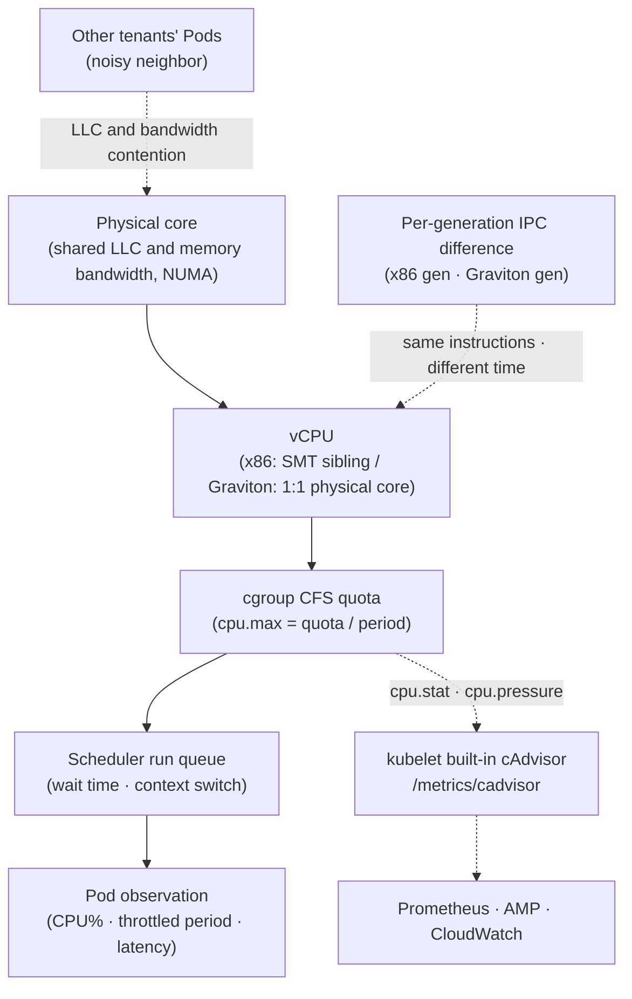

## Overview

Move the same container image to a node of a different size or generation and its CPU utilization (CPU%) often looks different. Domain teams read this as a regression and platform teams start wondering whether to roll back the node sizing policy, but CPU% is not a number that can be compared as-is across sizes and generations. The sections below cover why CPU% shifts, which metrics to use when comparing sizes and generations and where those metrics come from, a Pod sizing baseline, and how to decide whether several sizes or generations can share one workload. The intended readers are platform teams that set node sizing policy and domain teams that run CPU% alarms.

## Background

What requests and limits mean, how CFS bandwidth throttling works at the cgroup level, QoS classes, VPA-based right-sizing, and the throttled-period PromQL are in the [Pod Resource Optimization Guide](./eks-resource-optimization.md). Node kernel and arm64 prerequisites are in [AWS Nitro Architecture and Performance Tuning](../networking-performance/nitro-architecture-performance-tuning.md); node size tiers and consolidation are in [Karpenter Autoscaling](./karpenter-autoscaling.md).

Terms are used with the following meanings.

- **SMT (Simultaneous Multithreading)** — One physical core exposing two or more hardware threads (vCPUs). On x86 instances 1 vCPU is one hyperthread; AWS Graviton has no SMT, so 1 vCPU maps to one physical core
- **run queue** — Threads that are ready to run but have not yet been given a vCPU. The longer it gets, the longer the scheduling wait
- **LLC (Last-Level Cache)** — The lowest cache level shared by the cores in a socket. Contention with neighboring workloads lowers the hit rate
- **CFS (Completely Fair Scheduler)** — The default Linux scheduler. CPU limits are enforced as its bandwidth quota
- **PSI (Pressure Stall Information)** — The kernel's accounting of the share of time tasks spent stalled waiting for a resource. On cgroup v2 it is exposed per cgroup in the `cpu.pressure` file

Benchmark harness implementation and load tool deployment are out of scope; for per-generation benchmarking, only the pipeline design is covered.

## Architecture

CPU utilization changes meaning as it passes from physical hardware up to the Pod-level observation. Other workloads, settings, and the scheduler intervene at each layer, so the CPU% seen at the top does not reflect the state of the layers below. Observation starts at the bottom of this stack: the kernel records throttling and stall time per cgroup in `cpu.stat` and `cpu.pressure`, the cAdvisor built into the kubelet exposes those values as metrics, and Prometheus or CloudWatch only collect them.



## Why CPU Utilization Is Not Comparable

The reasons the same image shows different CPU% on different instances span everything from the hardware to the scheduler.

- LLC and memory bandwidth are shared by the cores in a socket. The share per core differs by instance size, and depending on neighboring Pods the same code stalls more or less.
- On x86, 1 vCPU is one hardware thread of a physical core. When the sibling thread uses the same execution units, two vCPUs deliver less than one physical core. Graviton has no SMT, so the same vCPU count on x86 and Graviton cannot be placed side by side.
- A new generation changes clock, cache sizes, and core microarchitecture, so the time to execute the same number of instructions changes. CPU%, being a time ratio, does not show this. Per-generation core and cache configurations for Graviton are listed in the [AWS Graviton Technical Guide](https://github.com/aws/aws-graviton-getting-started).
- Low utilization with a long run queue still means higher latency. Utilization and latency have to be read separately.
- A multithreaded container with a CPU limit can burn through its quota early and get throttled even at low utilization. The mechanism and PromQL are in the [CPU throttling observation section of the Pod Resource Optimization Guide](./eks-resource-optimization.md#633-automatic-cpu-throttling-detection).

A newer generation finishes the same work faster thanks to higher IPC, so at low concurrency its CPU% comes out lower. On a small node, on the other hand, DaemonSets and sidecars take a larger share, so an application Pod's CPU% appears to rise with no change in load. Using absolute CPU% thresholds on a fleet that mixes sizes and generations turns these effects into false alarms.

## Comparable KPIs

To compare sizes and generations, measure workload outcomes under identical conditions instead of utilization.

| KPI | Definition | What it tells you |
|---|---|---|
| sustained RPS | Requests per second handled in steady state within the SLO | Direct measure of throughput |
| p99 latency | 99th percentile response time | Whether tail latency degraded |
| throttled-period ratio | throttled periods / total CFS periods | Whether quota is short |
| run queue latency | Time threads spent waiting in the run queue | Whether scheduling is contended |
| cost-per-1K-req | Compute cost to serve 1,000 requests | Price/performance |

Domain teams' CPU% threshold alarms produce fewer false positives when converted to SLO-based alarms on latency and error rate. The throttled-period ratio shows quota shortage directly and works as a secondary signal in place of CPU%.

cost-per-1K-req is the instance hourly price divided by sustained RPS. Across generations and architectures, price and throughput change together, so normalizing to cost per request is what makes the comparison hold. The figure is only meaningful when the RPS was measured within the same SLO.

## Observing Throttling and Scheduling Wait

### Where the throttling counters come from and how to collect them

Throttling is measured without any extra instrumentation. Every time the kernel enforces CFS bandwidth control it increments `nr_periods`, `nr_throttled`, and `throttled_usec` (`throttled_time` in nanoseconds on cgroup v1) in the cgroup's `cpu.stat`, and the cAdvisor built into the kubelet exposes those values on the `/metrics/cadvisor` endpoint as `container_cpu_cfs_periods_total`, `container_cpu_cfs_throttled_periods_total`, and `container_cpu_cfs_throttled_seconds_total`. These metrics are enabled by default, so a cluster that already runs Prometheus is most likely collecting them already.

Pick the collection path that matches the monitoring stack in use.

- With Prometheus installed through kube-prometheus-stack, the kubernetes-mixin "Compute Resources / Pod" dashboard already has a CPU Throttling panel and the alert rules include `CPUThrottlingHigh` (by default, above 25% for 15 minutes). Nothing needs to be added.
- On the AWS managed stack, scrape the kubelet's `/metrics/cadvisor` with the ADOT Collector's prometheus receiver and remote-write to Amazon Managed Service for Prometheus (AMP), or send the metrics to CloudWatch through the CloudWatch agent's Prometheus scrape configuration or the ADOT `awsemf` exporter. The default metric set of CloudWatch Container Insights (Enhanced) includes `pod_cpu_utilization`, `pod_cpu_utilization_over_pod_limit`, and `pod_cpu_reserved_capacity` but no CFS throttled-period metric, so adding this scrape job is how throttling becomes visible in a CloudWatch-centric environment.
- Commercial agents such as Datadog, New Relic, and Dynatrace expose the same cgroup counters under their own metric names; the product documentation gives the exact names.
- JVM workloads can observe it from inside the application. JFR on JDK 17 and later has the `jdk.ContainerCPUThrottling` event (`cpuThrottledSlices`, `cpuThrottledTime`), recorded without any external agent.

### Observing scheduling wait

Scheduling wait is a different signal from throttling: time spent in the run queue without getting a vCPU even though quota remained. Check it from the lightest method up.

- PSI reports the share of time tasks spent stalled waiting for CPU, per cgroup. `cpu.pressure` on cgroup v2 (`/proc/pressure/cpu` for the whole node) carries `some` (at least one task stalled) and `full` (all tasks stalled) as avg10/avg60/avg300 plus a cumulative `total`. It does not separate throttling from contention, but a single file answers whether tasks waited at all. The kubelet has collected PSI since Kubernetes 1.33, the feature went GA in 1.36 with the `KubeletPSI` gate locked on, and the values are readable as `container_pressure_cpu_waiting_seconds_total` (some) and `container_pressure_cpu_stalled_seconds_total` (full) on `/metrics/cadvisor` and at node, Pod, and container level in the Summary API. Kernel 4.20 or later, `CONFIG_PSI`, and cgroup v2 are required (the EKS AL2023 and Bottlerocket AMIs default to cgroup v2); a distribution that ships PSI disabled needs the `psi=1` kernel parameter.
- `/proc/<pid>/schedstat` gives, per thread, the time spent running on a CPU, the time spent waiting in the run queue (nanoseconds), and the number of timeslices. cAdvisor's `container_cpu_schedstat_runqueue_seconds_total` and `container_cpu_schedstat_run_seconds_total` are these values summed per container, but they belong to the `sched` metric group, which is disabled by default and not exposed by the kubelet's embedded endpoint, so a standalone cAdvisor DaemonSet with `-enable_metrics=sched` is needed.
- When the distribution of wait times (a histogram) is needed, use eBPF `runqlat` or `perf sched latency`. This is the only step where eBPF is required.

## Pod Sizing Baseline

### Ratios and minimum size

Aligning a Pod's CPU:memory ratio with an instance family reduces bin-packing waste and narrows the spread of node sizes. The table below is a decision template; validate the values against your workload.

| Pod profile | CPU:mem ratio | Aligned family | Recommended minimum vCPU | QoS and policy |
|---|---|---|---|---|
| CPU-bound | 1:2 | c (compute) | 2 vCPU or more (higher for thread-pool runtimes) | Burstable, consider omitting the CPU limit |
| General purpose | 1:4 | m (general) | 2 vCPU | Burstable |
| Memory-bound | 1:8 | r (memory) | 2 vCPU | Burstable |
| Latency-sensitive, isolation required | Per workload | c/m | Integer vCPU | Guaranteed + CPU Manager static |

The minimum vCPU floor exists because 1–2 vCPU Pods piling onto a large node such as a 24xlarge consume IPs and scheduling slots while lowering density. The IP side of this is covered in [IP Capacity Planning and Karpenter Node Sizing](../networking-performance/ip-capacity-planning-karpenter.md). Whether to omit the CPU limit on a latency-sensitive service depends on isolation requirements, tenant policy, and conflicts with LimitRange, all weighed together ([CFS Bandwidth Throttling in the Pod Resource Optimization Guide](./eks-resource-optimization.md#cfs-bandwidth-throttling)). A node-level alternative is `spec.kubelet.cpuCFSQuota: false` on the Karpenter EC2NodeClass: the kubelet stops enforcing CFS quota, so throttling disappears, but CPU limits become ineffective for every Pod on that node, which confines this option to a NodePool dedicated to latency-sensitive workloads.

### Guaranteed integer CPU and CPU Manager static

The Kubernetes CPU Manager `static` policy gives exclusive cores (a cpuset) only to containers that are Guaranteed QoS with an integer CPU request. Fractional requests and Burstable or BestEffort Pods run in the shared pool. Enabling `static` requires a non-zero CPU reservation on the kubelet through `--reserved-cpus` or `--kube-reserved`/`--system-reserved`; without it the kubelet refuses to start. Pinning cores improves cache locality, but pinned cores are unavailable to other Pods, so overall node utilization drops.

### Runtime thread counts

Match the processor count a container sees to its CPU allocation.

- The JVM has `UseContainerSupport` on by default since JDK 10 and derives `availableProcessors()` from the container CPU quota. To pin the value, use `-XX:ActiveProcessorCount=N`.
- Go 1.25 and later lower the default `GOMAXPROCS` on Linux based on the cgroup CPU bandwidth limit. CPU requests are not considered, and setting the `GOMAXPROCS` environment variable or calling `runtime.GOMAXPROCS` disables the behavior ([Go 1.25 release notes](https://go.dev/doc/go1.25#container-aware-gomaxprocs)). Below 1.25, [uber-go/automaxprocs](https://github.com/uber-go/automaxprocs) gives the same effect.

## Deciding on Mixed-Size and Mixed-Generation Node Pools

Before deciding whether instances of different sizes or generations can share a workload, establish the conditions under which a comparison holds. All of the following have to be true for a KPI comparison to be valid.

1. Use the same container image (same tag and digest).
2. Hold the load profile (request mix, payload size) constant.
3. Use the same concurrency (client threads, connections).
4. State the SLO (target p99, error rate) and measure sustained RPS within it.
5. Include a warm-up window so the JIT, caches, and connection pools reach steady state before measuring.
6. Run long enough to observe steady state rather than a momentary spike.
7. Repeat at least three times and check the variance.
8. Report p50/p95/p99 latency, sustained RPS, and cost-per-1K-req together.

Results measured under different conditions are not used as comparison evidence. When comparing Graviton with x86, first confirm that the image and its native dependencies support arm64 ([AWS Nitro Architecture and Performance Tuning](../networking-performance/nitro-architecture-performance-tuning.md)).

If a mixed node pool is adopted, keep only the sizes and generations whose KPIs fall within the SLO as candidates, and exclude the rest or move them to a separate NodePool with its own weight. The CPU% spread that domain teams see may widen, while throughput and latency stay within the SLO. Candidate selection and weighted NodePool configuration follow [Karpenter Autoscaling](./karpenter-autoscaling.md).

## Implementation

### Enforcing minimum requests and defaults with LimitRange

Enforce minimum CPU and memory plus defaults for containers in a namespace. A ResourceQuota that enforces `limits.cpu` conflicts with a strategy of omitting CPU limits, so reconcile the two before applying both ([Resource Quota & LimitRange in the Pod Resource Optimization Guide](./eks-resource-optimization.md#resource-quota--limitrange)). The values are examples.

```yaml
apiVersion: v1
kind: LimitRange
metadata:
  name: cpu-sizing-baseline
  namespace: production
spec:
  limits:
  - type: Container
    min:
      cpu: "2000m"        # 2 vCPU floor
      memory: "4Gi"
    defaultRequest:
      cpu: "2000m"
      memory: "4Gi"
    default:
      memory: "4Gi"       # no CPU default -> CPU limit may be omitted
```

### A ResourceQuota that allows omitting CPU limits

Leaving `limits.cpu` out of the quota allows Pods without a CPU limit. Memory keeps request=limit so the Guaranteed path stays available.

```yaml
apiVersion: v1
kind: ResourceQuota
metadata:
  name: production-quota
  namespace: production
spec:
  hard:
    requests.cpu: "200"       # CPU counted on requests only
    requests.memory: "400Gi"
    limits.memory: "400Gi"    # no limits.cpu -> compatible with omitted CPU limits
    pods: "500"
```

### A CPU Manager static node pool

Because `static` is a node-level kubelet setting, put it in a separate NodePool and schedule only the workloads that need exclusive cores there. `spec.kubelet` on a Karpenter v1 EC2NodeClass supports a subset of kubelet fields and `cpuManagerPolicy` is not among them. Keep the CPU reservation in `spec.kubelet` and pass the policy through AL2023 `NodeConfig` userData, which is merged with the NodeConfig Karpenter generates. Pin the AMI to a dated version instead of `@latest`: if the AMI changes when a node is replaced, the baseline for the generation and performance comparison moves with it. NodePool syntax and weight are covered in [Karpenter Autoscaling](./karpenter-autoscaling.md).

This approach does not apply to EKS Auto Mode nodes. Auto Mode lets you tune `maxPods` (up to 110), `podPidsLimit`, eviction thresholds, container log rotation, `singleProcessOOMKill`, and `allowedUnsafeSysctls` through the NodeClass `advancedCompute.kubelet` field, and kernel parameters through `advancedCompute.kernel.sysctl`, but it exposes neither the CPU Manager policy, CFS quota, nor reserved CPUs, and it accepts no userData (NodeConfig). Workloads that need exclusive cores go to a self-managed NodePool outside Auto Mode. For general workloads that do not, check first whether Auto Mode's tuning range is sufficient; running both node types in one cluster and splitting workloads between them is also an option worth considering.

```yaml
apiVersion: karpenter.k8s.aws/v1
kind: EC2NodeClass
metadata:
  name: cpu-pinned
spec:
  amiSelectorTerms:
    - alias: al2023@vYYYYMMDD   # pin to a real release date; @latest changes the AMI when nodes are replaced
  kubelet:
    systemReserved:
      cpu: "1"              # static requires a non-zero reservation
    kubeReserved:
      cpu: "1"
  userData: |
    apiVersion: node.eks.aws/v1alpha1
    kind: NodeConfig
    spec:
      kubelet:
        config:
          cpuManagerPolicy: static   # fields unsupported in spec.kubelet go through NodeConfig
```

### Checking the throttling ratio and alerting on it

A spot check works without Prometheus. Read the cgroup counters inside the container, or pull the node's kubelet cAdvisor snapshot through the API server proxy.

```bash
# cgroup counters inside the container (cgroup v2; on v1 use /sys/fs/cgroup/cpu/cpu.stat)
kubectl exec -n <namespace> <pod> -c <container> -- cat /sys/fs/cgroup/cpu.stat

# kubelet cAdvisor snapshot for the node
kubectl get --raw "/api/v1/nodes/<node>/proxy/metrics/cadvisor" \
  | grep 'container_cpu_cfs_throttled_periods_total{.*namespace="<namespace>"'

# PSI (Kubernetes 1.33+, cgroup v2)
kubectl get --raw "/api/v1/nodes/<node>/proxy/metrics/cadvisor" \
  | grep 'container_pressure_cpu_waiting_seconds_total{.*namespace="<namespace>"'
```

In Prometheus, compute the throttling ratio from the `rate()` of the two counters and use the same expression in the alert rule; kube-prometheus-stack's `CPUThrottlingHigh` works the same way. Reuse the Grafana panel layout and the detailed PromQL from the [CPU throttling observation section of the Pod Resource Optimization Guide](./eks-resource-optimization.md#633-automatic-cpu-throttling-detection).

```promql
sum by (namespace, pod, container) (rate(container_cpu_cfs_throttled_periods_total{container!=""}[5m]))
/ sum by (namespace, pod, container) (rate(container_cpu_cfs_periods_total{container!=""}[5m]))
```

### Per-generation benchmark pipeline

To catch regressions before a size or generation change reaches production, add a load-test stage to CI that runs the same image across an instance matrix. The harness itself is out of scope; reproducible benchmark write-ups and harness precedents in this repo live under `docs/benchmarks/`. The gate runs in this order.

```text
For each (instance-size x generation) target NodePool:
- Deploy identical image (same tag/digest) to a dedicated node
- Apply fixed load profile and concurrency for a warm-up + steady window
- Repeat >= 3 runs; record p50/p95/p99, sustained RPS, cost-per-1K-req
- Compare against baseline within the declared SLO
- Fail the stage on regression beyond threshold; publish the report
```

## Operational Considerations

- 60-second averages hide sub-minute throttling spikes; use 15–30 second resolution and histograms. A PSI avg10 clearly above avg300 points to contention that started recently; when avg300 rises as well, the bottleneck is sustained.
- cAdvisor's CFS, schedstat, and pressure counters are counter-type metrics: apply `rate()` first, then compute ratios. Keep namespace/pod/container identifiers rather than summing replicas into one value, and watch for time-series breaks from Pod recreation and duplicate scrapes.
- Read throttling-ratio alerts together with p99 and error rate. A high ratio that stays within the SLO is recorded as a candidate for a limit adjustment; act when the SLO is breached.
- eBPF tools such as `runqlat` and `offcputime` from `bcc`/`bpftrace`, or [Inspektor Gadget](https://www.inspektor-gadget.io/), assume kernel BTF/CO-RE support and a privileged collection path. On custom Linux distributions, check the kernel version and BTF support first and evaluate the collection overhead separately.

## Troubleshooting

| Symptom | Cause | Action | How to verify |
|---|---|---|---|
| CPU% alarm on a small node or a different generation | Not comparable across sizes and generations (shared cache and bandwidth, SMT, IPC) | Switch to SLO-based alarms, redefine thresholds from benchmarks | p99 and error rate unchanged |
| Latency rises at low utilization | CFS global quota throttles a multithreaded process | Consider omitting the CPU limit or align thread counts | nr_throttled/nr_periods in `cpu.stat`, throttling-ratio PromQL |
| Throttling ratio is 0 but latency rises | Quota remains, but run queue wait (node contention) | Adjust node density, consider Guaranteed integer CPU or CPU Manager static | `cpu.pressure` some ratio, schedstat run queue time |
| Many 1–2 vCPU Pods on a 24xlarge | No Pod sizing baseline | LimitRange minimums, ratio alignment | Fewer Pods per node, lower IP usage |
| Performance varies even for Guaranteed integer-CPU Pods | Shared-pool scheduling, noisy neighbor | `cpuManagerPolicy: static` with reserved-cpus (state the lost spare cores) | Check cpuset, run queue latency |
| JVM/Go spawn threads for every core on the node | Runtime does not see the container CPU | `-XX:ActiveProcessorCount`, Go 1.25+/automaxprocs | Thread count, throttled ratio |

## Summary

CPU utilization is not a metric that can be compared directly across instance sizes and generations; comparisons use sustained RPS, p99, and cost-per-1K-req measured under identical conditions. CFS throttling is recorded by the kernel in the cgroup's `cpu.stat` and exposed by the kubelet's built-in cAdvisor, so it can be collected through Prometheus, AMP, or CloudWatch alike, and eBPF is only needed to see the distribution of scheduling wait. Pod sizing aligns the CPU:memory ratio to a family and sets a minimum vCPU floor; latency-sensitive workloads weigh the trade-off between Guaranteed integer CPU and CPU Manager static. Per-generation comparison is automated with a benchmark pipeline, and only the sizes and generations that meet the SLO stay in the node pool.

## References

### Official Documentation

- [Control CPU Management Policies on the Node](https://kubernetes.io/docs/tasks/administer-cluster/cpu-management-policies/) — Prerequisites and kubelet options for the CPU Manager static policy
- [Understand Pressure Stall Information (PSI) Metrics](https://kubernetes.io/docs/reference/instrumentation/understand-psi-metrics/) — kubelet PSI metrics (introduced in 1.33, GA in 1.36), requirements, and the `container_pressure_*` metrics
- [PSI - Pressure Stall Information (kernel)](https://docs.kernel.org/accounting/psi.html) — Definitions of some/full in `/proc/pressure/cpu` and cgroup `cpu.pressure`
- [cgroup v2 (kernel)](https://docs.kernel.org/admin-guide/cgroup-v2.html) — `cpu.max`, `cpu.stat` (nr_periods, nr_throttled, throttled_usec)
- [cAdvisor Prometheus metrics](https://github.com/google/cadvisor/blob/master/docs/storage/prometheus.md) — CFS, schedstat, and pressure container metric definitions
- [Enhanced Container Insights metrics for EKS](https://docs.aws.amazon.com/AmazonCloudWatch/latest/monitoring/Container-Insights-metrics-enhanced-EKS.html) — Metric list (confirms the absence of CFS throttling metrics)
- [Container Insights Prometheus metrics monitoring](https://docs.aws.amazon.com/AmazonCloudWatch/latest/monitoring/ContainerInsights-Prometheus.html) — Prometheus scrape configuration for the CloudWatch agent
- [AWS Graviton Technical Guide](https://github.com/aws/aws-graviton-getting-started) — Per-generation core, cache, and NUMA layout; arm64 prerequisites
- [Go 1.25 Release Notes: Container-aware GOMAXPROCS](https://go.dev/doc/go1.25#container-aware-gomaxprocs) — GOMAXPROCS default based on the cgroup CPU limit
- [JDK-8203359: JFR Container Metrics Events](https://bugs.openjdk.org/browse/JDK-8203359) — JDK 17 container events including `jdk.ContainerCPUThrottling`
- [ContainerCPUThrottlingEvent.java (OpenJDK)](https://github.com/openjdk/jdk/blob/master/src/jdk.jfr/share/classes/jdk/jfr/events/ContainerCPUThrottlingEvent.java) — Definition of the event fields `cpuElapsedSlices`, `cpuThrottledSlices`, `cpuThrottledTime`
- [Create a Node Class for Amazon EKS](https://docs.aws.amazon.com/eks/latest/userguide/create-node-class.html) — The kubelet settings Auto Mode exposes through `advancedCompute.kubelet` (maxPods, PID limit, eviction, logging, OOM, unsafe sysctls) and `advancedCompute.kernel.sysctl`

### Technical Blogs

- [Using Prometheus to Avoid Disasters with Kubernetes CPU Limits](https://aws.amazon.com/blogs/containers/using-prometheus-to-avoid-disasters-with-kubernetes-cpu-limits/) — Interpreting CFS quota, slices, and throttled periods
- [kubernetes-mixin](https://github.com/kubernetes-monitoring/kubernetes-mixin) — The CPU Throttling panel and the `CPUThrottlingHigh` alert rule shipped with kube-prometheus-stack
- [uber-go/automaxprocs](https://github.com/uber-go/automaxprocs) — Container-aware GOMAXPROCS for Go below 1.25

### Related Documents (internal)

- [Pod Resource Optimization Guide](./eks-resource-optimization.md) — requests/limits, QoS, CFS throttling PromQL, VPA, LimitRange in detail
- [Karpenter Autoscaling](./karpenter-autoscaling.md) — NodePool/EC2NodeClass syntax, weight, consolidation
- [IP Capacity Planning and Karpenter Node Sizing](../networking-performance/ip-capacity-planning-karpenter.md) — IP and slot consumption of small Pods and node density
- [AWS Nitro Architecture and Performance Tuning](../networking-performance/nitro-architecture-performance-tuning.md) — Node kernel, arm64, and PPS tuning prerequisites
