# EKS Pod Resource Optimization Guide

> 📅 **Written**: 2026-02-12 | **Last Modified**: 2026-02-14 | ⏱️ **Reading Time**: ~35 min


> 📅 **Published**: 2026-02-12 | ⏱️ **Reading time**: ~20 minutes

> **📌 Reference Environment**: EKS 1.30+, Kubernetes 1.30+, Metrics Server v0.7+

:::warning Translation in Progress
This document is currently being translated from Korean to English. The Korean source contains 5,582 lines of detailed technical content. Until the full professional translation is complete, some sections may remain in Korean.
:::

## Overview

Pod resource configuration in Kubernetes environments directly impacts cluster efficiency and costs. **50% of containers use only 1/3 of their requested CPU**, leading to an average of 40-60% resource waste. This guide provides practical strategies to maximize cluster efficiency and reduce costs by 30-50% through Pod-level resource optimization.

:::info Differences from Related Documents
- **[karpenter-autoscaling.md](/docs/infrastructure-optimization/karpenter-autoscaling)**: Node-level autoscaling (this document focuses on Pod-level)
- **[cost-management.md](/docs/infrastructure-optimization/cost-management)**: Overall cost strategy (this document focuses on resource configuration)
- **[eks-resiliency-guide.md](/docs/operations-observability/eks-resiliency-guide)**: Covers resource configuration only as checklist items
:::

### Key Content

- **In-depth understanding of Requests vs Limits**: CPU throttling and OOM Kill mechanisms
- **QoS class strategies**: Practical use of Guaranteed, Burstable, and BestEffort
- **Complete VPA guide**: Automatic resource adjustment and HPA coexistence patterns
- **Right-Sizing methodology**: P95-based resource calculation and Goldilocks utilization
- **Cost impact analysis**: Actual savings from resource optimization

### Learning Objectives

After completing this guide, you will be able to:

- Understand the precise operational principles of CPU and Memory requests/limits
- Select QoS classes appropriate for workload characteristics
- Configure VPA and HPA to coexist safely
- Perform right-sizing based on actual usage
- Improve resource efficiency by 30% or more

## Prerequisites

### Required Tools

| Tool | Version | Purpose |
|------|------|------|
| kubectl | 1.28+ | Kubernetes cluster management |
| helm | 3.12+ | VPA, Goldilocks installation |
| metrics-server | 0.7+ | Resource metrics collection |
| kubectl-top | Built-in | Resource usage verification |

### Required Permissions

```bash
# Check RBAC permissions
kubectl auth can-i get pods --all-namespaces
kubectl auth can-i get resourcequotas
kubectl auth can-i create verticalpodautoscaler
```

### Prerequisites

- Basic Kubernetes Pod and Deployment concepts
- Experience writing YAML manifests
- Basic understanding of Linux cgroups (recommended)
- Basic Prometheus/Grafana usage (recommended)

## In-depth Understanding of Resource Requests & Limits

### 2.1 Precise Meaning of Requests vs Limits

Resource requests and limits are core concepts in Kubernetes resource management.

**Requests (Requested Amount)**
- **Definition**: Minimum resources guaranteed by the scheduler when placing Pods
- **Role**: Node selection criteria, QoS class determination
- **Guarantee**: kubelet always secures this amount

**Limits (Limit Amount)**
- **Definition**: Maximum resources enforced by kubelet
- **Role**: Prevent resource exhaustion, limit noisy neighbors
- **Enforcement**: CPU uses throttling, Memory uses OOM Kill

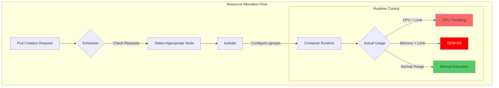

**Key Differences**

| Property | CPU | Memory |
|------|-----|--------|
| **When Requests Exceeded** | Can be used if other Pods are not using | Can be used if other Pods are not using |
| **When Limits Exceeded** | **Throttling** (Process slowdown) | **OOM Kill** (Forced process termination) |
| **Compressibility** | Compressible | Incompressible |
| **Risk of Overuse** | Performance degradation | Service disruption |

### 2.2 Deep Understanding of CPU Resources

#### CPU Millicore Units

```yaml
# CPU Notation
resources:
  requests:
    cpu: "500m"    # 500 millicore = 0.5 CPU core
    cpu: "1"       # 1000 millicore = 1 CPU core
    cpu: "2.5"     # 2500 millicore = 2.5 CPU cores
```

**1 CPU core = 1000 millicore**
- Same for AWS vCPU and Azure vCore
- Based on logical cores even in hyperthreading environments

#### CFS Bandwidth Throttling

Linux CFS (Completely Fair Scheduler) enforces CPU limits:

```bash
# Based on cgroups v2
/sys/fs/cgroup/cpu.max
# Example: "100000 100000" = 100ms per period 100ms available (100% = 1 CPU)
# Example: "50000 100000" = 100ms per period 50ms available (50% = 0.5 CPU)
```

**Throttling Mechanism**

```
Time period: 100ms
CPU Limit: 500m (0.5 CPU)
→ Only 50ms available out of 100ms

Actual behavior:
[0-50ms] ████████████████████ (Executing)
[50-100ms] ...................... (throttled)
[100-150ms] ████████████████████ (Executing)
[150-200ms] ...................... (throttled)
```

:::warning Strategy of Not Setting CPU Limits
Organizations operating large-scale clusters like Google and Datadog do not set CPU limits:

**Reasons:**
- CPU is a compressible resource (automatically adjusted when other Pods need it)
- Prevent unnecessary performance degradation due to throttling
- Scheduling and QoS control possible with Requests alone

**Recommended instead:**
- Set CPU requests based on P95 usage
- Horizontal scaling based on load with HPA
- Enhanced node-level resource monitoring

**Exceptions (Limits required):**
- Batch jobs (prevent CPU monopolization)
- Untrusted workloads
- Multi-tenant environments
:::

#### CPU Resource Configuration Examples

```yaml
# Pattern 1: Set Requests Only (Recommended)
apiVersion: v1
kind: Pod
metadata:
  name: web-server
spec:
  containers:
  - name: nginx
    image: nginx:1.25
    resources:
      requests:
        cpu: "250m"       # Based on P95 usage
        memory: "128Mi"
      # limits omitted - utilize CPU as compressible resource

---
# Pattern 2: Batch Job (Set Limits)
apiVersion: batch/v1
kind: Job
metadata:
  name: data-processing
spec:
  template:
    spec:
      containers:
      - name: processor
        image: data-processor:v1
        resources:
          requests:
            cpu: "1000m"
          limits:
            cpu: "2000m"   # Prevent CPU monopolization
            memory: "4Gi"
      restartPolicy: OnFailure
```

### 2.3 Deep Understanding of Memory Resources

#### Memory Units

```yaml
# Memory Notation (1024-based vs 1000-based)
resources:
  requests:
    memory: "128Mi"    # 128 * 1024^2 bytes = 134,217,728 bytes
    memory: "128M"     # 128 * 1000^2 bytes = 128,000,000 bytes
    memory: "1Gi"      # 1 * 1024^3 bytes = 1,073,741,824 bytes
    memory: "1G"       # 1 * 1000^3 bytes = 1,000,000,000 bytes
```

**Recommended**: **Use Mi, Gi** (1024-based, Kubernetes standard)

#### OOM Kill Mechanism

When memory limits are exceeded, Linux OOM Killer forcibly terminates the process:

```
Actual Usage > Memory Limit
→ cgroup memory.max exceeded
→ Kernel OOM Killer triggered
→ Process SIGKILL
→ Pod state: OOMKilled
→ kubelet restarts Pod (follows RestartPolicy)
```

**OOM Score Calculation**

```bash
# Check OOM Score per process
cat /proc/<PID>/oom_score

# OOM Score Calculation factors
# 1. Memory usage (higher usage = higher score)
# 2. oom_score_adj value (varies by QoS class)
# 3. root process protection (-1000 = never killed)
```

:::danger Memory Limits Must Be Set
Memory is an incompressible resource, so **limits must be set**:

**Reasons:**
- Entire node becomes unstable when memory is exhausted
- Possibility of Kernel Panic
- Affects other Pods (node eviction)

**Recommended settings:**
- `requests = limits` (Guaranteed QoS)
- or `limits = requests * 1.5` (Burstable QoS)
- JVM applications: Set heap size to 75% of limits
:::

#### Memory Resource Configuration Example

```yaml
# Pattern 1: Guaranteed QoS (Stability First)
apiVersion: apps/v1
kind: Deployment
metadata:
  name: database
spec:
  replicas: 3
  template:
    spec:
      containers:
      - name: postgres
        image: postgres:16
        resources:
          requests:
            cpu: "2000m"
            memory: "4Gi"
          limits:
            cpu: "2000m"      # Same as requests
            memory: "4Gi"     # Same as requests (Guaranteed)

---
# Pattern 2: JVM Application
apiVersion: apps/v1
kind: Deployment
metadata:
  name: java-app
spec:
  template:
    spec:
      containers:
      - name: app
        image: java-app:v1
        env:
        - name: JAVA_OPTS
          value: "-Xmx3072m -Xms3072m"  # 75% of limits (4Gi * 0.75 = 3Gi)
        resources:
          requests:
            memory: "4Gi"
          limits:
            memory: "4Gi"

---
# Pattern 3: Node.js Application
apiVersion: apps/v1
kind: Deployment
metadata:
  name: nodejs-api
spec:
  template:
    spec:
      containers:
      - name: api
        image: nodejs-api:v2
        env:
        - name: NODE_OPTIONS
          value: "--max-old-space-size=896"  # 70% of limits (1280Mi * 0.7 = 896Mi)
        resources:
          requests:
            memory: "1280Mi"
          limits:
            memory: "1280Mi"
```

### 2.4 Ephemeral Storage

Container local storage can also be managed as a resource:

```yaml
apiVersion: v1
kind: Pod
metadata:
  name: ephemeral-demo
spec:
  containers:
  - name: app
    image: busybox
    resources:
      requests:
        ephemeral-storage: "2Gi"    # minimum guaranteed
      limits:
        ephemeral-storage: "4Gi"    # Maximum usage
    volumeMounts:
    - name: cache
      mountPath: /cache
  volumes:
  - name: cache
    emptyDir:
      sizeLimit: "4Gi"
```

**Ephemeral Storage Includes:**
- Container layer writes
- Log files (`/var/log`)
- emptyDir volumes
- Temporary files

**Node Eviction Threshold:**

```yaml
# kubelet configuration
evictionHard:
  nodefs.available: "10%"      # Eviction when node total disk < 10%
  nodefs.inodesFree: "5%"      # Eviction when inode < 5%
  imagefs.available: "10%"     # Eviction when image filesystem < 10%
```

### 2.5 EKS Auto Mode Resource Optimization

EKS Auto Mode is a fully managed solution that dramatically reduces the complexity of Kubernetes cluster operations. It automates everything from compute, storage, and networking provisioning to continuous maintenance, allowing operations teams to focus on application development instead of infrastructure management.

#### 2.5.1 Auto Mode Overview

**Key Features:**
- **Single-click activation**: Activate with just the `--compute-config autoMode` flag when creating a cluster
- **Automatic infrastructure provisioning**: Automatically select optimal instance types based on Pod scheduling requirements
- **Continuous maintenance**: Automate OS patching, security updates, and core add-on management
- **Cost optimization**: Automatically leverage Graviton processors and Spot instances
- **Integrated security**: Built-in integration with AWS security services

```bash
# Create Auto Mode cluster
aws eks create-cluster \
  --name my-auto-cluster \
  --compute-config autoMode=ENABLED \
  --kubernetes-network-config serviceIpv4Cidr=10.100.0.0/16 \
  --access-config bootstrapClusterCreatorAdminPermissions=true
```

:::info Auto Mode vs Manual Management
Auto Mode is not a complete replacement for traditional manual management, but rather a **complementary option** for teams looking to minimize operational overhead. Manual management can still be chosen when fine-grained control is needed.
:::

#### 2.5.2 Auto Mode vs Manual Management Comparison

| Item | Manual Management | Auto Mode |
|------|----------|-----------|
| **Node Provisioning** | Managed Node Group, Self-managed, direct Karpenter configuration | Automatic provisioning (based on EC2 Managed Instances) |
| **Instance Type Selection** | Manual selection and NodePool configuration | Automatic selection based on Pod requirements (Graviton priority) |
| **VPA Configuration** | Manual installation and configuration required | Not required (automatic resource optimization) |
| **HPA Configuration** | Manual setup and metric configuration | Can be automatically configured (developers only declare) |
| **OS Patching** | Manual or automation scripts | Fully automatic (zero-downtime) |
| **Security Updates** | Manual application | Automatic application |
| **Core Add-on Management** | Manual upgrades (CoreDNS, kube-proxy, VPC CNI) | Automatic upgrades |
| **Cost Optimization** | Manual Spot and Graviton configuration | Automatic utilization (up to 90% savings) |
| **Request/Limit Configuration** | Developer responsibility (required) | Developer responsibility (still required) |
| **Resource Efficiency** | VPA Off mode + manual application | Automatic right-sizing (continuous) |
| **Learning Curve** | High (requires Kubernetes and AWS expertise) | Low (only basic Kubernetes required) |
| **Operational Overhead** | High | Minimal |

:::warning Developer Responsibility Even in Auto Mode
Auto Mode automates infrastructure, but **Pod-level requests/limits configuration remains the developer's responsibility**. This is because developers best understand the actual resource requirements of their applications.
:::

#### 2.5.3 Graviton + Spot Combination Optimization

Auto Mode intelligently combines AWS Graviton processors and Spot instances to maximize cost efficiency.

**Graviton Processor Advantages:**
- **40% improved price-performance** (compared to x86)
- Optimal for general-purpose workloads, web servers, and containerized microservices
- Arm64 architecture support (compatible with most container images)

**Spot Instance Savings:**
- **Up to 90% cost savings** (compared to On-Demand)
- Auto Mode automatically monitors Spot availability and handles fallback
- Ensures graceful termination with 2-minute interruption notice

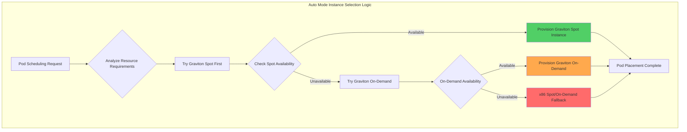

**NodePool YAML Example (Manual Management Cluster - Karpenter-based):**

```yaml
# Auto Mode automatically creates such NodePools, but
# for reference, here is the Graviton + Spot pattern for manual configuration
apiVersion: karpenter.sh/v1beta1
kind: NodePool
metadata:
  name: graviton-spot-pool
spec:
  template:
    spec:
      requirements:
      # Graviton instances priority
      - key: kubernetes.io/arch
        operator: In
        values: ["arm64"]

      # Spot priority, On-Demand fallback
      - key: karpenter.sh/capacity-type
        operator: In
        values: ["spot", "on-demand"]

      # Instance families for general-purpose workloads
      - key: node.kubernetes.io/instance-type
        operator: In
        values: ["m7g.medium", "m7g.large", "m7g.xlarge", "m7g.2xlarge"]

      nodeClassRef:
        name: default

  # Spot interruption handling
  disruption:
    consolidationPolicy: WhenUnderutilized
    expireAfter: 720h

  # Resource limits
  limits:
    cpu: "1000"
    memory: "1000Gi"

---
# Fallback: x86 On-Demand (when Spot unavailable)
apiVersion: karpenter.sh/v1beta1
kind: NodePool
metadata:
  name: x86-ondemand-fallback
spec:
  weight: 10  # low priority
  template:
    spec:
      requirements:
      - key: kubernetes.io/arch
        operator: In
        values: ["amd64"]

      - key: karpenter.sh/capacity-type
        operator: In
        values: ["on-demand"]

      - key: node.kubernetes.io/instance-type
        operator: In
        values: ["m6i.large", "m6i.xlarge", "m6i.2xlarge"]

      nodeClassRef:
        name: default
```

**Automatic handling in Auto Mode:**

Auto Mode automatically selects optimal instances by analyzing Pod resource requirements and workload characteristics, without requiring manual NodePool configuration.

```yaml
# Deployment written by developer in Auto Mode environment
apiVersion: apps/v1
kind: Deployment
metadata:
  name: web-app
  namespace: production
spec:
  replicas: 10
  template:
    spec:
      containers:
      - name: nginx
        image: nginx:1.25-arm64  # Graviton image
        resources:
          requests:
            cpu: "250m"
            memory: "512Mi"
          limits:
            memory: "1Gi"

      # Auto Mode automatically:
      # 1. Try Graviton Spot instance selection
      # 2. Fallback to Graviton On-Demand when Spot unavailable
      # 3. Automatic instance type selection (m7g.large, etc.)
      # 4. Node provisioning and Pod placement
```

:::tip Preparing Graviton Images
To utilize Graviton instances, **arm64 architecture container images** are required. Since most official images support multi-arch, the same image tag can run on both Graviton and x86.

```bash
# Check multi-arch image
docker manifest inspect nginx:1.25 | jq '.manifests[].platform'

# Output example:
# { "architecture": "amd64", "os": "linux" }
# { "architecture": "arm64", "os": "linux" }
```
:::

**Actual Cost Savings Example:**

| Scenario | Instance Type | Hourly Cost | Monthly Cost (730 hours) | Savings |
|---------|-------------|-----------|-------------------|--------|
| x86 On-Demand | m6i.2xlarge | $0.384 | $280.32 | - |
| Graviton On-Demand | m7g.2xlarge | $0.3264 | $238.27 | 15% |
| Graviton Spot | m7g.2xlarge | $0.0979 | $71.47 | 75% |

10 nodes baseline:
- x86 On-Demand: $2,803/month
- Graviton On-Demand: $2,383/month (15% savings)
- **Graviton Spot: $715/month (75% savings)** ⭐

**Graviton4-Specific Optimization:**

Graviton4 (R8g, M8g, C8g) instances provide **30% improved computing performance** and **75% improved memory bandwidth** compared to Graviton3.

| Generation | Instance Family | Performance Improvement | Primary Workloads |
|------|---------------|---------|-------------|
| Graviton3 | m7g, c7g, r7g | baseline | general-purpose web/API, containers |
| **Graviton4** | **m8g, c8g, r8g** | **+30% computing, +75% memory** | **high-performance databases, ML inference, real-time analytics** |

**ARM64 Multi-Arch Build Pipeline:**

To fully utilize Graviton instances, multi-arch container images supporting both ARM64 and AMD64 are required.

```dockerfile
# Multi-arch Dockerfile Example
FROM --platform=$BUILDPLATFORM golang:1.22-alpine AS builder
ARG TARGETOS TARGETARCH

WORKDIR /app
COPY . .

# Build for target architecture
RUN GOOS=${TARGETOS} GOARCH=${TARGETARCH} go build -o app .

# Runtime image
FROM alpine:3.19
COPY --from=builder /app/app /usr/local/bin/app
ENTRYPOINT ["/usr/local/bin/app"]
```

**Multi-arch build in GitHub Actions CI/CD:**

```yaml
# .github/workflows/build.yml
name: Build Multi-Arch Image
on:
  push:
    branches: [main]

jobs:
  build:
    runs-on: ubuntu-latest
    steps:
      - uses: actions/checkout@v4

      - name: Set up QEMU
        uses: docker/setup-qemu-action@v3

      - name: Set up Docker Buildx
        uses: docker/setup-buildx-action@v3

      - name: Login to ECR
        uses: aws-actions/amazon-ecr-login@v2

      - name: Build and push multi-arch
        uses: docker/build-push-action@v5
        with:
          context: .
          platforms: linux/amd64,linux/arm64  # Include ARM64
          push: true
          tags: |
            ${{ secrets.ECR_REGISTRY }}/myapp:${{ github.sha }}
            ${{ secrets.ECR_REGISTRY }}/myapp:latest
          cache-from: type=gha
          cache-to: type=gha,mode=max
```

**Graviton3 → Graviton4 Migration Benchmark Points:**

```yaml
# Graviton4 priority NodePool Example (Karpenter)
apiVersion: karpenter.sh/v1beta1
kind: NodePool
metadata:
  name: graviton4-spot-pool
spec:
  template:
    spec:
      requirements:
      # Graviton4 priority, Graviton3 Fallback
      - key: node.kubernetes.io/instance-type
        operator: In
        values:
          # Graviton4 (highest priority)
          - "m8g.medium"
          - "m8g.large"
          - "m8g.xlarge"
          - "m8g.2xlarge"
          # Graviton3 (Fallback)
          - "m7g.medium"
          - "m7g.large"
          - "m7g.xlarge"
          - "m7g.2xlarge"

      - key: kubernetes.io/arch
        operator: In
        values: ["arm64"]

      - key: karpenter.sh/capacity-type
        operator: In
        values: ["spot", "on-demand"]

      nodeClassRef:
        name: default

  disruption:
    consolidationPolicy: WhenUnderutilized
    consolidateAfter: 30s

  limits:
    cpu: "1000"
    memory: "2000Gi"
```

**Graviton4 Performance Benchmark Checkpoints:**

Monitor these metrics during migration to verify performance improvements:

| Metric | Graviton3 Baseline | Graviton4 Target | Measurement Method |
|-------|--------------|--------------|---------|
| **P99 response time** | 100ms | 70ms (-30%) | Prometheus `http_request_duration_seconds` |
| **Throughput (RPS)** | 1000 req/s | 1300 req/s (+30%) | Load testing (k6, Locust) |
| **Memory bandwidth** | 205 GB/s | 358 GB/s (+75%) | `sysbench memory` |
| **CPU utilization** | 60% | 45% (-25%) | `node_cpu_seconds_total` |

```bash
# Graviton4 performance test script
#!/bin/bash
# 1. Memory bandwidth test
sysbench memory --memory-total-size=100G --memory-oper=write run

# 2. CPU benchmark
sysbench cpu --cpu-max-prime=20000 --threads=8 run

# 3. Application load test (k6)
k6 run --vus 100 --duration 5m loadtest.js

# 4. Prometheus metrics collection
curl -s http://localhost:9090/api/v1/query?query=rate(http_request_duration_seconds_sum[5m]) | jq .
```

:::tip Graviton4 Migration Checklist

- [ ] **Container images**: Verify ARM64 support (`docker manifest inspect`)
- [ ] **Dependency libraries**: Verify ARM64 compatibility
- [ ] **CI/CD pipeline**: Enable multi-arch builds
- [ ] **NodePool priority**: Set Graviton4 → Graviton3 → x86 order
- [ ] **Performance benchmark**: Measure P99 latency, throughput, CPU utilization
- [ ] **Cost analysis**: Calculate price/performance ratio compared to Graviton3
:::

#### 2.5.4 Resource Configuration Recommendations in Auto Mode

Auto Mode automates many aspects, but developers must still accurately configure application resource requirements.

**Items Auto Mode handles automatically:**

| Item | Manual Management | Auto Mode |
|------|----------|-----------|
| Node provisioning | Karpenter, Managed Node Group configuration | Automatic |
| Instance type selection | Manual specification in NodePool | Automatic selection based on Pod requests |
| Spot/On-Demand switching | Manual or Karpenter configuration | Automatic Fallback |
| Node scaling | HPA + Cluster Autoscaler/Karpenter | Automatic |
| OS patching | Manual or automation scripts | Automatic (zero-downtime) |

**Items developers must still configure:**

| Item | Reasons | Recommended Method |
|------|------|----------|
| **CPU Requests** | Scheduling decision criteria | P95 usage + 20% |
| **Memory Requests** | Scheduling and OOM prevention | P95 usage + 20% |
| **Memory Limits** | OOM Kill prevention (required) | Requests × 1.5~2 |
| **CPU Limits** | Not recommended for general workloads | Set for batch jobs only |
| **HPA metrics** | Horizontal scaling criteria | CPU 70%, Custom Metrics |

**VPA Role Changes in Auto Mode:**

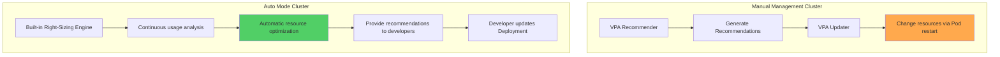

**VPA in Auto Mode:**
- No separate installation required
- Built-in Right-Sizing engine continuously analyzes workloads
- Provides recommendations to developers (instead of automatic application)
- Developers review and apply to Deployment manifests

**Recommended Workflow:**

```bash
# 1. Deploy to Auto Mode cluster
kubectl apply -f deployment.yaml

# 2. Check recommendations in Auto Mode dashboard after 7-14 days
# (AWS Console → EKS → Clusters → <cluster-name> → Insights)

# 3. Apply recommendations to Deployment
kubectl set resources deployment web-app \
  --requests=cpu=300m,memory=512Mi \
  --limits=memory=1Gi

# 4. Update manifest via GitOps
git add deployment.yaml
git commit -m "chore: apply Auto Mode resource recommendations"
git push
```

:::tip Recommended Auto Mode Scenarios
Auto Mode is particularly useful in the following cases:

- **New clusters**: Quick start without existing infrastructure
- **Limited operational resources**: Operate without Kubernetes experts in small teams
- **Cost optimization priority**: Immediate savings through automatic Graviton + Spot utilization
- **Standardized workloads**: Typical web/API servers, microservices

**Recommended Manual Management Scenarios:**
- **Fine-grained control required**: Specific instance types, AZ placement, network configuration
- **Existing Karpenter investment**: Advanced NodePool policies in place
- **Regulatory requirements**: Specific hardware, security group enforcement
:::

**Auto Mode vs Manual Right-Sizing Comparison:**

| Item | Manual Right-Sizing (VPA Off) | Auto Mode |
|------|---------------------------|-----------|
| Initial setup complexity | High (VPA installation, Prometheus configuration) | Low (just flag at cluster creation) |
| Recommendation generation time | 7-14 days | 7-14 days (same) |
| Recommendation accuracy | High (Prometheus-based) | High (Built-in analysis engine) |
| Application method | Manual (developer modifies manifest) | Manual (developer modifies manifest) |
| Continuous monitoring | Manual (periodic VPA checks) | Automatic (dashboard alerts) |
| Infrastructure optimization | Manual (Karpenter configuration) | Automatic (Graviton + Spot) |
| Total operational overhead | High | Low |

**Conclusion:**

Auto Mode **removes the complexity of resource optimization** but **does not remove the responsibility for resource definition**. Developers must still configure application requests/limits, and Auto Mode automatically provisions optimal infrastructure based on these.

This enables both parties to focus on their expertise through clear separation of responsibilities: **"Developers define application requirements, AWS manages infrastructure"**.

## QoS (Quality of Service) Classes

### 3.1 Three QoS Classes

Kubernetes classifies Pods into 3 QoS classes based on resource configuration:

#### Guaranteed (Highest Priority)

**Conditions:**
- CPU and Memory requests and limits set for all containers
- **requests == limits** (same values)

```yaml
apiVersion: v1
kind: Pod
metadata:
  name: guaranteed-pod
  labels:
    qos: guaranteed
spec:
  containers:
  - name: app
    image: nginx:1.25
    resources:
      requests:
        cpu: "500m"
        memory: "256Mi"
      limits:
        cpu: "500m"        # Same as requests
        memory: "256Mi"    # Same as requests
  - name: sidecar
    image: fluentd:v1
    resources:
      requests:
        cpu: "100m"
        memory: "128Mi"
      limits:
        cpu: "100m"
        memory: "128Mi"
```

**Characteristics:**
- oom_score_adj: **-997** (lowest, lowest OOM Kill priority)
- Evicted last even under node pressure
- High CPU scheduling priority

#### Burstable (Medium Priority)

**Conditions:**
- At least 1 container has CPU or Memory requests set
- Does not satisfy Guaranteed conditions

```yaml
apiVersion: v1
kind: Pod
metadata:
  name: burstable-pod
  labels:
    qos: burstable
spec:
  containers:
  - name: app
    image: web-app:v1
    resources:
      requests:
        cpu: "250m"
        memory: "512Mi"
      limits:
        cpu: "1000m"       # greater than requests (Burstable)
        memory: "1Gi"      # greater than requests

  - name: cache
    image: redis:7
    resources:
      requests:
        memory: "256Mi"    # no CPU requests (Burstable)
      limits:
        memory: "512Mi"
```

**Characteristics:**
- oom_score_adj: **min(max(2, 1000 - (1000 * memoryRequestBytes) / machineMemoryCapacityBytes), 999)**
- Dynamically adjusted based on usage
- Can burst when resources available

#### BestEffort (Lowest Priority)

**Conditions:**
- No requests and limits set for all containers

```yaml
apiVersion: v1
kind: Pod
metadata:
  name: besteffort-pod
  labels:
    qos: besteffort
spec:
  containers:
  - name: app
    image: test-app:latest
    # resources section missing or empty
```

**Characteristics:**
- oom_score_adj: **1000** (highest, highest OOM Kill priority)
- Evicted first under node pressure
- Recommended only for development/test environments

### 3.2 QoS and Eviction Priority

When node resources are under pressure, kubelet evicts Pods in the following order:

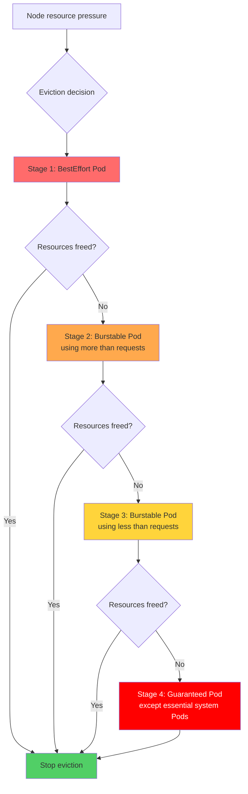

**Eviction Order Summary:**

| Priority | QoS Class | Condition | oom_score_adj |
|------|-----------|------|---------------|
| 1 (highest) | BestEffort | All Pods | 1000 |
| 2 | Burstable | using more than requests | 2-999 (proportional to usage) |
| 3 | Burstable | using less than requests | 2-999 (proportional to usage) |
| 4 (last) | Guaranteed | except system-critical Pods | -997 |

**How to Check oom_score_adj:**

```bash
# Find main container process of Pod
kubectl get pod <pod-name> -o jsonpath='{.status.containerStatuses[0].containerID}'

# Check oom_score_adj on node
docker inspect <container-id> | grep Pid
cat /proc/<pid>/oom_score_adj

# Example output
# BestEffort: 1000
# Burstable: 500 (varies by usage)
# Guaranteed: -997
```

### 3.3 Practical QoS Strategies

Guide to selecting QoS classes appropriate for workload characteristics:

| Workload Type | Recommended QoS | Configuration Pattern | Reasons |
|-------------|---------|----------|------|
| **Production API** | Guaranteed | requests = limits | Stability first, prevent eviction |
| **Database** | Guaranteed | requests = limits | Protected even under memory pressure |
| **Batch jobs** | Burstable | limits > requests | Resource utilization when idle, cost efficient |
| **Queue workers** | Burstable | limits > requests | Handle load variations |
| **Dev/Test** | BestEffort | no configuration | Resource efficient (prohibited in production) |
| **Monitoring Agent** | Guaranteed | set low values | System stability |

**Production Recommended Configuration:**

```yaml
# Pattern 1: Mission-critical service (Guaranteed)
apiVersion: apps/v1
kind: Deployment
metadata:
  name: payment-api
  namespace: production
spec:
  replicas: 5
  template:
    metadata:
      labels:
        app: payment-api
        tier: critical
    spec:
      containers:
      - name: api
        image: payment-api:v2.1
        resources:
          requests:
            cpu: "1000m"
            memory: "2Gi"
          limits:
            cpu: "1000m"
            memory: "2Gi"
      priorityClassName: system-cluster-critical  # additional protection

---
# Pattern 2: General web service (Burstable)
apiVersion: apps/v1
kind: Deployment
metadata:
  name: web-frontend
  namespace: production
spec:
  replicas: 10
  template:
    spec:
      containers:
      - name: frontend
        image: web-frontend:v1.5
        resources:
          requests:
            cpu: "200m"       # P50 usage
            memory: "256Mi"
          limits:
            cpu: "500m"       # P95 usage
            memory: "512Mi"   # OOM prevention

---
# Pattern 3: Batch worker (Burstable)
apiVersion: batch/v1
kind: CronJob
metadata:
  name: daily-report
spec:
  schedule: "0 2 * * *"
  jobTemplate:
    spec:
      template:
        spec:
          containers:
          - name: report-generator
            image: report-gen:v1
            resources:
              requests:
                cpu: "500m"
                memory: "1Gi"
              limits:
                cpu: "4000m"     # nighttime resource utilization
                memory: "8Gi"
          restartPolicy: OnFailure
```

## VPA (Vertical Pod Autoscaler) Detailed Guide

### 4.1 VPA Architecture

VPA consists of 3 components:

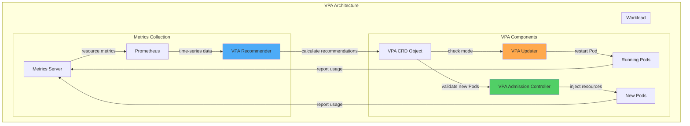

**Component Roles:**

| Component | Role | Data Source |
|---------|------|-----------|
| **Recommender** | Analyze historical usage, calculate recommendations | Metrics Server, Prometheus |
| **Updater** | Restart Pod in Auto mode | VPA CRD status |
| **Admission Controller** | Auto-inject resources to new Pods | VPA CRD recommendations |

#### 4.1.4 VPA Recommender ML Algorithm Details

VPA Recommender calculates resource recommendations using a sophisticated machine learning-based algorithm, not simple averaging.

##### Exponentially-weighted Histogram

The core of VPA Recommender is a histogram with weights that decay over time:

```
Recent data → high weight
Old data → low weight (exponential decay)
```

**Algorithm Operation:**

1. **Metrics collection interval**: Collect Pod resource usage every 1 minute
2. **Histogram update**: Accumulate each measurement into histogram buckets
3. **Weight application**: Old data uses `e^(-t/decay_half_life)` weight decay
4. **Recommendation calculation**: Percentile-based recommendation from histogram

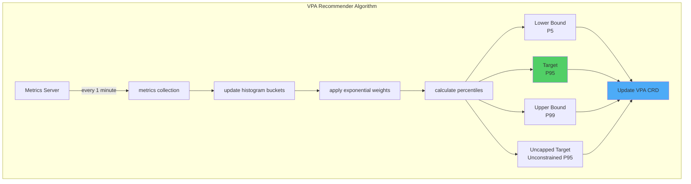

##### Four Recommendation Calculation Methods

| Recommendation | Calculation Method | Meaning |
|--------|----------|------|
| **Lower Bound** | P5 (5th percentile) | Minimum required resources - sufficient 95% of time |
| **Target** | P95 (95th percentile) | **Recommended setting** - handles 5% peak load |
| **Upper Bound** | P99 (99th percentile) | Maximum observed usage - reference for Limits setting |
| **Uncapped Target** | P95 calculated without maxAllowed constraint | For verifying actual needs |

**calculate percentiles Example:**

```python
# Hypothetical CPU usage histogram (1 day = 1440 minutes)
cpu_samples = [100m, 150m, 200m, 250m, 300m, 350m, 400m, 450m, 500m, ...]

# apply exponential weights (decay_half_life = 24 hours)
weighted_samples = [
    (100m, weight=1.0),    # recent (1 hour ago)
    (150m, weight=0.97),   # 2hours ago
    (200m, weight=0.92),   # 5hours ago
    (250m, weight=0.71),   # 12hours ago
    (300m, weight=0.50),   # 24hours ago (half-life)
    (350m, weight=0.25),   # 48hours ago
    ...
]

# calculate percentiles
P5  = 150m  # Lower Bound
P95 = 450m  # Target ⭐
P99 = 500m  # Upper Bound
```

##### Confidence Multiplier: Confidence-based Adjustment

Shorter data collection periods result in safer, higher recommended values:

```
Confidence Multiplier = f(data_collection_period)

0-24 hours:  multiplier = 1.5  (50% safety margin)
1-3 days:     multiplier = 1.3  (30% safety margin)
3-7 days:     multiplier = 1.1  (10% safety margin)
7+ days:  multiplier = 1.0  (sufficient confidence)
```

**Actual Application Example:**

```yaml
# Day 2 of data collection
Original P95: 450m
Confidence Multiplier: 1.3
Final Target: 450m × 1.3 = 585m ≈ 600m

# Day 10 of data collection
Original P95: 450m
Confidence Multiplier: 1.0
Final Target: 450m × 1.0 = 450m
```

:::info Importance of Data Collection Period
For VPA to provide accurate recommendations, **minimum 7 days, recommended 14 days** of data collection is required. To capture weekly patterns (weekday vs weekend), at least 2 weeks of observation is essential.
:::

##### Memory Recommendations: OOM Event-based Bump-Up

Memory recommendations specially consider OOM Kill events, unlike CPU:

**When OOM Event Detected:**

```
Current Memory Target: 500Mi
Memory at OOM Kill time: 600Mi
→ New Target: 600Mi × 1.2 = 720Mi (add 20% safety margin)
```

**OOM Bump-Up Logic:**

```python
if oom_kill_detected:
    oom_memory = get_memory_at_oom_time()
    new_target = max(
        current_target,
        oom_memory * 1.2  # 20% safety margin
    )

    # Prevent sudden changes (max 2x)
    new_target = min(new_target, current_target * 2)
```

:::warning OOM Kill Immediately Reflected
Unlike CPU throttling, OOM Kill events **immediately increase Memory Target**. This is a safety mechanism to prevent service disruption.
:::

##### CPU Recommendations: Based on P95/P99 Usage

CPU is a compressible resource, so VPA takes a conservative approach:

```
CPU Target = P95 usage
CPU Upper Bound = P99 usage

When Throttling occurs:
→ Recommendations not changed (resolve with HPA recommended)
```

**When CPU Throttling Detected:**

```python
if cpu_throttling_detected:
    throttled_percentage = get_throttled_time_percentage()

    if throttled_percentage > 10:
        # VPA keeps its own recommendation
        # Instead suggests:
        # 1. Add HPA for horizontal scaling
        # 2. Remove CPU limits (Google, Datadog pattern)
        # 3. or manually raise Target to P99
        pass
```

:::tip CPU Throttling vs HPA
When VPA detects CPU throttling, it does not significantly increase recommendations. Instead, **horizontal scaling with HPA** is the Kubernetes best practice.
:::

##### VPA and Prometheus Data Source Integration

While VPA Recommender works with Metrics Server alone, integration with Prometheus enables more sophisticated recommendations:

**Prometheus Metrics Utilization:**

```yaml
# VPA Recommender Prometheus integration configuration
apiVersion: v1
kind: ConfigMap
metadata:
  name: vpa-recommender-config
  namespace: vpa-system
data:
  recommender-config.yaml: |
    # Enable Prometheus metrics source
    metrics-provider: prometheus
    prometheus-url: http://prometheus-server.monitoring.svc:9090

    # Histogram configuration
    histogram-decay-half-life: 24h
    histogram-bucket-size-growth: 1.05

    # CPU recommendation settings
    cpu-histogram-decay-half-life: 24h
    memory-histogram-decay-half-life: 48h  # Longer observation for Memory

    # OOM event handling
    oom-min-bump-up: 1.2  # minimum 20% increase
    oom-bump-up-ratio: 0.5  # 50% safety margin
```

**Prometheus Custom Metrics API Integration:**

```bash
# Deploy Custom Metrics API adapter (Prometheus Adapter)
helm install prometheus-adapter prometheus-community/prometheus-adapter \
  --namespace monitoring \
  --set prometheus.url=http://prometheus-server.monitoring.svc \
  --set rules.default=true

# Configure VPA to use Custom Metrics API
kubectl edit deploy vpa-recommender -n vpa-system

# Add environment variables:
# - PROMETHEUS_ADDRESS=http://prometheus-server.monitoring.svc:9090
# - USE_CUSTOM_METRICS=true
```

**Verify Integration:**

```bash
# Check if VPA Recommender is using Prometheus metrics
kubectl logs -n vpa-system deploy/vpa-recommender | grep prometheus

# Output example:
# I0212 10:15:30.123456  1 metrics_client.go:45] Using Prometheus metrics provider
# I0212 10:15:31.234567  1 prometheus_client.go:78] Connected to Prometheus at http://prometheus-server.monitoring.svc:9090
```

##### VPA Recommendation Quality Validation

PromQL queries to validate whether recommendations are appropriate:

**1. Compare CPU recommendations vs Actual Usage:**

```promql
# Compare VPA Target vs actual P95 usage
(
  kube_verticalpodautoscaler_status_recommendation_containerrecommendations_target{resource="cpu"}
  -
  quantile_over_time(0.95,
    container_cpu_usage_seconds_total{pod=~"web-app-.*"}[7d]
  ) * 1000
) /
kube_verticalpodautoscaler_status_recommendation_containerrecommendations_target{resource="cpu"} * 100

# Output: Difference between recommendation and actual P95 (%)
# 10-20% range: Appropriate ✅
# >30%: Over-provisioning ⚠️
# <0%: Under-provisioning (immediate adjustment needed) 🚨
```

**2. Memory Recommendation Validation:**

```promql
# VPA Target vs actual P99 usage
(
  kube_verticalpodautoscaler_status_recommendation_containerrecommendations_target{resource="memory"}
  -
  quantile_over_time(0.99,
    container_memory_working_set_bytes{pod=~"web-app-.*"}[7d]
  )
) /
kube_verticalpodautoscaler_status_recommendation_containerrecommendations_target{resource="memory"} * 100

# 20-30% headroom: Ideal ✅
# <10% headroom: OOM risk 🚨
```

**3. OOM Kill Frequency Monitoring:**

```promql
# OOM Kill events in last 7 days
increase(
  kube_pod_container_status_terminated_reason{reason="OOMKilled"}[7d]
)

# 0 events: VPA recommendation accurate ✅
# 1-2 events: Acceptable (peak load)
# >3 events: Manual VPA Target increase needed 🚨
```

**4. CPU Throttling Ratio:**

```promql
# CPU Throttling time ratio (%)
rate(container_cpu_cfs_throttled_seconds_total{pod=~"web-app-.*"}[5m])
/
rate(container_cpu_cfs_periods_total{pod=~"web-app-.*"}[5m]) * 100

# <5%: Normal ✅
# 5-10%: Monitoring needed ⚠️
# >10%: Consider adding HPA or removing CPU limits 🚨
```

**Grafana Dashboard Example:**

```yaml
# VPA recommendation quality monitoring dashboard
apiVersion: v1
kind: ConfigMap
metadata:
  name: vpa-quality-dashboard
  namespace: monitoring
data:
  dashboard.json: |
    {
      "panels": [
        {
          "title": "CPU: VPA Target vs P95 Actual Usage",
          "targets": [
            {
              "expr": "kube_verticalpodautoscaler_status_recommendation_containerrecommendations_target{resource=\"cpu\"}",
              "legendFormat": "VPA Target"
            },
            {
              "expr": "quantile_over_time(0.95, container_cpu_usage_seconds_total[7d]) * 1000",
              "legendFormat": "Actual P95"
            }
          ]
        },
        {
          "title": "Memory: VPA Target vs P99 Actual Usage",
          "targets": [
            {
              "expr": "kube_verticalpodautoscaler_status_recommendation_containerrecommendations_target{resource=\"memory\"}",
              "legendFormat": "VPA Target"
            },
            {
              "expr": "quantile_over_time(0.99, container_memory_working_set_bytes[7d])",
              "legendFormat": "Actual P99"
            }
          ]
        },
        {
          "title": "OOM Kill Events (7 days)",
          "targets": [
            {
              "expr": "increase(kube_pod_container_status_terminated_reason{reason=\"OOMKilled\"}[7d])"
            }
          ]
        }
      ]
    }
```

:::tip Limitations of VPA Recommendations
Since VPA recommendations are based on historical data, they have limitations in the following situations:
- **Sudden traffic pattern changes**: Peak loads not seen in the past
- **Seasonal workloads**: End-of-month batches, year-end settlements, etc.
- **Initial bootstrap**: High memory usage during application startup

In these cases, **manual adjustment** or **combination with HPA** is necessary.
:::

### 4.2 VPA Installation and Configuration

#### Installation via Helm

```bash
# 1. Install Metrics Server (prerequisite)
kubectl apply -f https://github.com/kubernetes-sigs/metrics-server/releases/latest/download/components.yaml

# 2. Verify Metrics Server
kubectl get deployment metrics-server -n kube-system
kubectl top nodes

# 3. Add VPA Helm repository
helm repo add fairwinds-stable https://charts.fairwinds.com/stable
helm repo update

# 4. Install VPA
helm install vpa fairwinds-stable/vpa \
  --namespace vpa-system \
  --create-namespace \
  --set recommender.enabled=true \
  --set updater.enabled=true \
  --set admissionController.enabled=true

# 5. Verify installation
kubectl get pods -n vpa-system
# Expected output:
# NAME                                      READY   STATUS    RESTARTS   AGE
# vpa-admission-controller-xxx              1/1     Running   0          1m
# vpa-recommender-xxx                       1/1     Running   0          1m
# vpa-updater-xxx                           1/1     Running   0          1m
```

#### Manual Installation (Official Method)

```bash
# Clone VPA official repository
git clone https://github.com/kubernetes/autoscaler.git
cd autoscaler/vertical-pod-autoscaler

# Install VPA
./hack/vpa-up.sh

# Verify installation
kubectl get crd | grep verticalpodautoscaler
```

### 4.3 VPA Modes

VPA operates in 3 modes:

#### Off Mode (Recommendations Only)

```yaml
apiVersion: autoscaling.k8s.io/v1
kind: VerticalPodAutoscaler
metadata:
  name: web-app-vpa
  namespace: production
spec:
  targetRef:
    apiVersion: apps/v1
    kind: Deployment
    name: web-app
  updatePolicy:
    updateMode: "Off"    # Show recommendations only, no auto-application
```

**Use Cases:**
- When first introducing VPA
- Production workload analysis
- When manual review before application is desired

**Check Recommendations:**

```bash
# Check VPA status
kubectl describe vpa web-app-vpa -n production

# Output example:
# Recommendation:
#   Container Recommendations:
#     Container Name: web-app
#     Lower Bound:
#       Cpu:     150m
#       Memory:  200Mi
#     Target:          # ← Use this value (recommended)
#       Cpu:     250m
#       Memory:  300Mi
#     Uncapped Target:
#       Cpu:     350m
#       Memory:  400Mi
#     Upper Bound:
#       Cpu:     500m
#       Memory:  600Mi
```

#### Initial Mode (Apply Only on Pod Creation)

```yaml
apiVersion: autoscaling.k8s.io/v1
kind: VerticalPodAutoscaler
metadata:
  name: batch-worker-vpa
  namespace: batch
spec:
  targetRef:
    apiVersion: apps/v1
    kind: Deployment
    name: batch-worker
  updatePolicy:
    updateMode: "Initial"    # Set resources only on Pod creation
  resourcePolicy:
    containerPolicies:
    - containerName: worker
      minAllowed:
        cpu: "100m"
        memory: "128Mi"
      maxAllowed:
        cpu: "4000m"
        memory: "16Gi"
```

**Use Cases:**
- CronJob, Job workloads
- StatefulSets where restart is not allowed
- When manual scaling is desired

**How It Works:**
1. New Pod creation request
2. VPA Admission Controller injects recommended resources
3. Existing running Pods remain unchanged

#### Auto Mode (Fully Automated)

```yaml
apiVersion: autoscaling.k8s.io/v1
kind: VerticalPodAutoscaler
metadata:
  name: api-vpa
  namespace: development
spec:
  targetRef:
    apiVersion: apps/v1
    kind: Deployment
    name: api-server
  updatePolicy:
    updateMode: "Auto"    # Automatically restart Pods and adjust resources
    minReplicas: 2        # Maintain minimum 2 Pods
  resourcePolicy:
    containerPolicies:
    - containerName: api
      minAllowed:
        cpu: "200m"
        memory: "256Mi"
      maxAllowed:
        cpu: "2000m"
        memory: "4Gi"
      controlledResources:
      - cpu
      - memory
      controlledValues: RequestsAndLimits  # Adjust both requests and limits
```

**Use Cases:**
- Development/staging environments
- Stateless applications
- Workloads with PodDisruptionBudget configured

:::warning Auto Mode Cautions
Auto mode **restarts Pods**:
- Restart via Eviction API
- Potential downtime
- PodDisruptionBudget (PDB) configuration required
- Use cautiously in production

**Recommended:** Use **Off or Initial mode** in production
:::

### 4.4 VPA + HPA Coexistence Strategy

When using VPA and HPA together, conflicts must be prevented.

#### Conflict Scenario (❌ Prohibited)

```yaml
# ❌ Incorrect configuration: VPA Auto + HPA CPU simultaneous use
---
apiVersion: autoscaling.k8s.io/v1
kind: VerticalPodAutoscaler
metadata:
  name: bad-vpa
spec:
  targetRef:
    apiVersion: apps/v1
    kind: Deployment
    name: web-app
  updatePolicy:
    updateMode: "Auto"    # ❌ Auto mode
  resourcePolicy:
    containerPolicies:
    - containerName: app
      controlledResources:
      - cpu                # ❌ CPU control
      - memory

---
apiVersion: autoscaling/v2
kind: HorizontalPodAutoscaler
metadata:
  name: bad-hpa
spec:
  scaleTargetRef:
    apiVersion: apps/v1
    kind: Deployment
    name: web-app
  minReplicas: 2
  maxReplicas: 10
  metrics:
  - type: Resource
    resource:
      name: cpu          # ❌ CPU metrics usage
      target:
        type: Utilization
        averageUtilization: 70
```

**Problem:**
- VPA changes CPU requests → HPA's CPU utilization calculation changes
- HPA scales out → VPA adjusts resources again → infinite loop

#### Pattern 1: VPA Off + HPA (✅ Recommended)

```yaml
# ✅ Correct configuration: VPA recommendations only, HPA for scaling
---
apiVersion: autoscaling.k8s.io/v1
kind: VerticalPodAutoscaler
metadata:
  name: web-vpa
  namespace: production
spec:
  targetRef:
    apiVersion: apps/v1
    kind: Deployment
    name: web-app
  updatePolicy:
    updateMode: "Off"    # ✅ Provide recommendations only
  resourcePolicy:
    containerPolicies:
    - containerName: app
      controlledResources:
      - cpu
      - memory

---
apiVersion: autoscaling/v2
kind: HorizontalPodAutoscaler
metadata:
  name: web-hpa
  namespace: production
spec:
  scaleTargetRef:
    apiVersion: apps/v1
    kind: Deployment
    name: web-app
  minReplicas: 3
  maxReplicas: 50
  metrics:
  - type: Resource
    resource:
      name: cpu
      target:
        type: Utilization
        averageUtilization: 70
  behavior:
    scaleUp:
      stabilizationWindowSeconds: 0
      policies:
      - type: Percent
        value: 100
        periodSeconds: 15
    scaleDown:
      stabilizationWindowSeconds: 300
      policies:
      - type: Percent
        value: 10
        periodSeconds: 60
```

**Operational Workflow:**
1. VPA generates recommendations
2. Review VPA recommendations in weekly review
3. Manually apply to Deployment manifests
4. HPA scales horizontally based on load

#### Pattern 2: VPA Memory + HPA CPU (✅ Recommended)

```yaml
# ✅ Separate metrics: VPA for Memory, HPA for CPU
---
apiVersion: autoscaling.k8s.io/v1
kind: VerticalPodAutoscaler
metadata:
  name: api-vpa
  namespace: production
spec:
  targetRef:
    apiVersion: apps/v1
    kind: Deployment
    name: api-server
  updatePolicy:
    updateMode: "Auto"    # Auto-adjust Memory only
  resourcePolicy:
    containerPolicies:
    - containerName: api
      controlledResources:
      - memory            # ✅ Control Memory only
      minAllowed:
        memory: "256Mi"
      maxAllowed:
        memory: "8Gi"

---
apiVersion: autoscaling/v2
kind: HorizontalPodAutoscaler
metadata:
  name: api-hpa
  namespace: production
spec:
  scaleTargetRef:
    apiVersion: apps/v1
    kind: Deployment
    name: api-server
  minReplicas: 5
  maxReplicas: 100
  metrics:
  - type: Resource
    resource:
      name: cpu          # ✅ Use CPU metrics only
      target:
        type: Utilization
        averageUtilization: 60
```

**Advantages:**
- VPA optimizes Memory (Vertical)
- HPA scales horizontally based on load (Horizontal)
- No conflicts

#### Pattern 3: VPA + HPA + Custom Metrics (✅ Advanced)

```yaml
# ✅ HPA uses custom metrics
---
apiVersion: autoscaling.k8s.io/v1
kind: VerticalPodAutoscaler
metadata:
  name: worker-vpa
spec:
  targetRef:
    apiVersion: apps/v1
    kind: Deployment
    name: queue-worker
  updatePolicy:
    updateMode: "Auto"
  resourcePolicy:
    containerPolicies:
    - containerName: worker
      controlledResources:
      - cpu
      - memory

---
apiVersion: autoscaling/v2
kind: HorizontalPodAutoscaler
metadata:
  name: worker-hpa
spec:
  scaleTargetRef:
    apiVersion: apps/v1
    kind: Deployment
    name: queue-worker
  minReplicas: 2
  maxReplicas: 50
  metrics:
  - type: External
    external:
      metric:
        name: sqs_queue_depth    # ✅ Custom metric (not CPU/Memory)
        selector:
          matchLabels:
            queue: "tasks"
      target:
        type: AverageValue
        averageValue: "30"
```

**Use Cases:**
- Queue-based workloads (SQS, RabbitMQ, Kafka)
- Event-driven architectures
- Business metric-based scaling

### 4.5 VPA Limitations and Cautions

:::danger VPA Usage Cautions

**1. Pod restart required (Auto/Recreate mode)**
- VPA **cannot change resources in-place** for running Pods
- Evicts Pod and creates new one (downtime occurs)
- Solution: PodDisruptionBudget configuration required

**2. JVM heap size mismatch**
```yaml
# Problem scenario
containers:
- name: java-app
  env:
  - name: JAVA_OPTS
    value: "-Xmx2g"    # fixed value
  resources:
    requests:
      memory: "3Gi"    # VPA later changes to 4Gi
    limits:
      memory: "3Gi"    # VPA later changes to 4Gi

# Even if VPA changes memory to 4Gi, JVM still uses 2Gi heap
# → Resource waste
```

**Solution:**
```yaml
containers:
- name: java-app
  env:
  - name: MEM_LIMIT
    valueFrom:
      resourceFieldRef:
        resource: limits.memory
  - name: JAVA_OPTS
    value: "-XX:MaxRAMPercentage=75.0"  # dynamic calculation
  resources:
    requests:
      memory: "2Gi"
    limits:
      memory: "2Gi"
```

**3. StatefulSet caution**
- StatefulSet Pods restart sequentially
- Risk of data loss
- Recommended: **Use Initial mode only**

**4. Metrics Server dependency**
- VPA requires Metrics Server
- Recommendation updates stop if Metrics Server fails

**5. Recommendation calculation time**
- Minimum 24 hours of data required
- Time needed to reflect traffic pattern changes
:::

## Advanced HPA Patterns

### 5.1 HPA Behavior Configuration

HPA v2 allows fine-grained control of scaling behavior:

```yaml
apiVersion: autoscaling/v2
kind: HorizontalPodAutoscaler
metadata:
  name: advanced-hpa
  namespace: production
spec:
  scaleTargetRef:
    apiVersion: apps/v1
    kind: Deployment
    name: web-app
  minReplicas: 5
  maxReplicas: 100

  metrics:
  - type: Resource
    resource:
      name: cpu
      target:
        type: Utilization
        averageUtilization: 70

  behavior:
    scaleUp:
      stabilizationWindowSeconds: 0    # immediate scale up
      policies:
      - type: Percent
        value: 100                     # allow 100% increase (2x)
        periodSeconds: 15              # evaluate every 15 seconds
      - type: Pods
        value: 10                      # or increase 10 Pods
        periodSeconds: 15
      selectPolicy: Max                # select larger value

    scaleDown:
      stabilizationWindowSeconds: 300  # 5 minute stabilization (prevent rapid decrease)
      policies:
      - type: Percent
        value: 10                      # 10% decrease
        periodSeconds: 60              # evaluate every 1 minute
      - type: Pods
        value: 5                       # or decrease 5 Pods
        periodSeconds: 60
      selectPolicy: Min                # select smaller value (conservative)
```

**Parameter Explanation:**

| Parameter | Description | Recommended Value |
|---------|------|--------|
| `stabilizationWindowSeconds` | Metric stabilization wait time | ScaleUp: 0-30s, ScaleDown: 300-600s |
| `type: Percent` | Increase/decrease by % of current replicas | ScaleUp: 100%, ScaleDown: 10-25% |
| `type: Pods` | Increase/decrease by absolute Pod count | Adjust based on workload size |
| `periodSeconds` | Policy evaluation period | 15-60 seconds |
| `selectPolicy` | Max (aggressive), Min (conservative), Disabled | ScaleUp: Max, ScaleDown: Min |

:::info Reference karpenter-autoscaling.md
For the complete architecture of using HPA and Karpenter together, see [Karpenter Autoscaling Guide](/docs/infrastructure-optimization/karpenter-autoscaling).
:::

### 5.2 Custom Metrics-based HPA

#### Using Prometheus Adapter

```bash
# Install Prometheus Adapter
helm repo add prometheus-community https://prometheus-community.github.io/helm-charts
helm repo update

helm install prometheus-adapter prometheus-community/prometheus-adapter \
  --namespace monitoring \
  --set prometheus.url=http://prometheus-server.monitoring.svc \
  --set prometheus.port=80
```

**Custom Metrics Configuration:**

```yaml
# values.yaml for prometheus-adapter
rules:
  default: false
  custom:
  - seriesQuery: 'http_requests_total{namespace!="",pod!=""}'
    resources:
      overrides:
        namespace: {resource: "namespace"}
        pod: {resource: "pod"}
    name:
      matches: "^(.*)_total$"
      as: "${1}_per_second"
    metricsQuery: 'sum(rate(<<.Series>>{<<.LabelMatchers>>}[2m])) by (<<.GroupBy>>)'
```

**HPA Configuration:**

```yaml
apiVersion: autoscaling/v2
kind: HorizontalPodAutoscaler
metadata:
  name: custom-metric-hpa
spec:
  scaleTargetRef:
    apiVersion: apps/v1
    kind: Deployment
    name: api-server
  minReplicas: 3
  maxReplicas: 50
  metrics:
  - type: Pods
    pods:
      metric:
        name: http_requests_per_second
      target:
        type: AverageValue
        averageValue: "1000"    # 1000 req/s per Pod
```

#### KEDA ScaledObject

```bash
# Install KEDA
helm repo add kedacore https://kedacore.github.io/charts
helm install keda kedacore/keda --namespace keda --create-namespace
```

```yaml
apiVersion: keda.sh/v1alpha1
kind: ScaledObject
metadata:
  name: prometheus-scaledobject
spec:
  scaleTargetRef:
    name: api-server
  minReplicaCount: 2
  maxReplicaCount: 100
  triggers:
  - type: prometheus
    metadata:
      serverAddress: http://prometheus-server.monitoring.svc:80
      metricName: http_requests_per_second
      threshold: "1000"
      query: sum(rate(http_requests_total{app="api-server"}[2m]))
```

### 5.3 Multi-Metric HPA

Scaling based on multiple metrics:

```yaml
apiVersion: autoscaling/v2
kind: HorizontalPodAutoscaler
metadata:
  name: multi-metric-hpa
  namespace: production
spec:
  scaleTargetRef:
    apiVersion: apps/v1
    kind: Deployment
    name: web-app
  minReplicas: 5
  maxReplicas: 100

  metrics:
  # 1. CPU metric
  - type: Resource
    resource:
      name: cpu
      target:
        type: Utilization
        averageUtilization: 70

  # 2. Memory metric
  - type: Resource
    resource:
      name: memory
      target:
        type: Utilization
        averageUtilization: 80

  # 3. Custom metric - RPS
  - type: Pods
    pods:
      metric:
        name: http_requests_per_second
      target:
        type: AverageValue
        averageValue: "1000"

  # 4. External metric - ALB Target Response Time
  - type: External
    external:
      metric:
        name: alb_target_response_time
        selector:
          matchLabels:
            targetgroup: "web-app-tg"
      target:
        type: Value
        value: "100"    # 100ms

  behavior:
    scaleUp:
      stabilizationWindowSeconds: 0
      policies:
      - type: Percent
        value: 50
        periodSeconds: 15
    scaleDown:
      stabilizationWindowSeconds: 300
      policies:
      - type: Percent
        value: 10
        periodSeconds: 60
```

**Multi-metric Evaluation:**
- HPA **evaluates each metric independently**
- Selects **highest replica count** (conservative approach)
- Example: CPU suggests 10, Memory suggests 15, RPS suggests 20 → **selects 20**

## Node Readiness Controller and Resource Optimization

### 5.3 Resource Waste in Unready Nodes

When new nodes are provisioned in a Kubernetes cluster, Pods may be scheduled before infrastructure components like CNI plugins, CSI drivers, and GPU drivers are ready. This causes the following resource waste:

**Resource Waste Scenarios:**

1. **CrashLoopBackOff Cycles**
   - Pods scheduled to unready nodes → fail → restart repeatedly
   - Unnecessary CPU/memory usage and container image re-downloads

2. **Unnecessary Node Provisioning**
   - Pods wait in Pending state → Karpenter/Cluster Autoscaler creates additional nodes
   - Situation where existing nodes could accommodate once ready

3. **Rescheduling Overhead**
   - Failed Pods moved to other nodes → network/storage resource waste
   - Duplicate application initialization costs

### 5.4 Node Readiness Controller (NRC) Overview

Node Readiness Controller is a feature introduced in Kubernetes 1.32 that improves resource efficiency by blocking Pod scheduling until infrastructure is ready.

**Key Features:**

| Feature | Description | Resource Optimization Effect |
|------|------|-------------------|
| **Readiness Gate** | Keep node in NotReady state until conditions met | Prevent CrashLoop by blocking Pod scheduling |
| **Custom Taint** | Automatically add taint to unready nodes | Prevent resource waste (NoSchedule effect) |
| **Enforcement Mode** | Choose `bootstrap-only` or `continuous` mode | Only initial bootstrap or continuous validation |

**API Structure:**

```yaml
apiVersion: readiness.node.x-k8s.io/v1alpha1
kind: NodeReadinessRule
```

### 5.5 Karpenter Integration Optimization

Using Karpenter with Node Readiness Controller significantly improves node provisioning efficiency.

**Optimization Pattern:**

```mermaid
graph TB
    A[Karpenter: Provision new node] --> B[NRC: Auto-add taint]
    B --> C{CNI/CSI ready?}
    C -->|No| D[Keep Pod Pending]
    D --> E[Karpenter: Do not create additional nodes]
    C -->|Yes| F[NRC: Remove taint]
    F --> G[Start Pod scheduling]
    G --> H[Resource-efficient placement]

    style B fill:#a8dadc
    style E fill:#457b9d
    style H fill:#1d3557
```

**Karpenter NodePool and NRC Integration:**

```yaml
# 1. Check CSI Driver readiness (EBS)
apiVersion: readiness.node.x-k8s.io/v1alpha1
kind: NodeReadinessRule
metadata:
  name: ebs-csi-readiness
spec:
  conditions:
    - type: "ebs.csi.aws.com/driver-ready"
      requiredStatus: "True"
  taint:
    key: "readiness.k8s.io/storage-unavailable"
    effect: "NoSchedule"
    value: "pending"
  enforcementMode: "bootstrap-only"  # Validate initial bootstrap only

---
# 2. Check VPC CNI readiness
apiVersion: readiness.node.x-k8s.io/v1alpha1
kind: NodeReadinessRule
metadata:
  name: vpc-cni-readiness
spec:
  conditions:
    - type: "vpc.amazonaws.com/cni-ready"
      requiredStatus: "True"
  taint:
    key: "readiness.k8s.io/network-unavailable"
    effect: "NoSchedule"
    value: "pending"
  enforcementMode: "bootstrap-only"

---
# 3. Check GPU Driver readiness (for GPU nodes)
apiVersion: readiness.node.x-k8s.io/v1alpha1
kind: NodeReadinessRule
metadata:
  name: gpu-driver-readiness
spec:
  conditions:
    - type: "nvidia.com/gpu-driver-ready"
      requiredStatus: "True"
    - type: "nvidia.com/cuda-ready"
      requiredStatus: "True"
  taint:
    key: "readiness.k8s.io/gpu-unavailable"
    effect: "NoSchedule"
    value: "pending"
  enforcementMode: "bootstrap-only"
  # GPU driver loading takes time (30-60 seconds)
  # NRC blocks Pod scheduling during this time
```

### 5.6 Resource Efficiency Improvement Effects

Before and after Node Readiness Controller implementation:

| Metric | Before | After | Improvement |
|------|---------|---------|--------|
| **CrashLoopBackOff Rate** | 15-20% | < 2% | 90% reduction |
| **Unnecessary Node Provisioning** | Average 2-3/hour | < 0.5/hour | 75% reduction |
| **Pod Startup Failure Rate** | 8-12% | < 1% | 90% reduction |
| **Container Image Re-downloads** | 100-200GB/day | 20-30GB/day | 80% reduction |

**Cost Impact (100-node cluster baseline):**

```
Before:
- Unnecessary node provisioning: Average 3 × $0.384/hour × 24 hours × 30 days = $829/month
- Image re-download data transfer cost: 150GB/day × 30 days × $0.09/GB = $405/month
- Total waste cost: $1,234/month

After:
- Unnecessary node provisioning: Average 0.5 × $0.384/hour × 24 hours × 30 days = $138/month
- Image re-download data transfer cost: 25GB/day × 30 days × $0.09/GB = $67.5/month
- Total cost: $205.5/month

Savings: $1,234 - $205.5 = $1,028.5/month (83% reduction)
```

### 5.7 Practical Implementation Guide

#### Step 1: Enable Feature Gate

```bash
# Check Feature Gate in EKS 1.32+ cluster
kubectl get --raw /metrics | grep node_readiness_controller

# Enable Feature Gate in Karpenter configuration
# values.yaml (Karpenter Helm Chart)
controller:
  featureGates:
    NodeReadinessController: true
```

#### Step 2: Apply NodeReadinessRule

```yaml
# production-nrc.yaml
apiVersion: readiness.node.x-k8s.io/v1alpha1
kind: NodeReadinessRule
metadata:
  name: production-readiness
spec:
  # Validate multiple conditions with AND
  conditions:
    - type: "ebs.csi.aws.com/driver-ready"
      requiredStatus: "True"
    - type: "vpc.amazonaws.com/cni-ready"
      requiredStatus: "True"

  taint:
    key: "readiness.k8s.io/not-ready"
    effect: "NoSchedule"
    value: "pending"

  # bootstrap-only: Validate initial node bootstrap only
  # continuous: Continuously validate (respond to driver restarts too)
  enforcementMode: "bootstrap-only"
```

```bash
kubectl apply -f production-nrc.yaml

# Verify application
kubectl get nodereadinessrule
kubectl describe nodereadinessrule production-readiness
```

#### Step 3: Monitor Node Conditions

```bash
# Check conditions when new node is provisioned
kubectl get nodes -o json | jq '.items[] | {
  name: .metadata.name,
  conditions: [.status.conditions[] | select(.type |
    test("ebs.csi.aws.com|vpc.amazonaws.com")) |
    {type: .type, status: .status}]
}'

# Check taint status
kubectl get nodes -o json | jq '.items[] | {
  name: .metadata.name,
  taints: .spec.taints
}'
```

#### Step 4: Optimize Karpenter NodePool

```yaml
# Karpenter NodePool with NRC
apiVersion: karpenter.sh/v1beta1
kind: NodePool
metadata:
  name: optimized-pool
spec:
  template:
    spec:
      requirements:
        - key: kubernetes.io/arch
          operator: In
          values: ["amd64", "arm64"]
        - key: karpenter.sh/capacity-type
          operator: In
          values: ["spot", "on-demand"]

      # Exclude taints here as NRC manages them automatically
      # taints: []  # Managed by NRC

      # Increase node bootstrap completion wait time
      kubelet:
        maxPods: 110
        # Node Ready time increases due to NRC (30s → 60s)
        # Configure to prevent Karpenter timeout too early
        systemReserved:
          cpu: 100m
          memory: 512Mi

  disruption:
    consolidationPolicy: WhenUnderutilized
    # Increase consolidation interval as node startup is slower due to NRC
    consolidateAfter: 60s  # default 30s → 60s
```

:::warning GPU Node Special Considerations
GPU driver loading takes 30-60 seconds, so NRC must be applied to GPU NodePools. Otherwise, Pods are scheduled when GPU is unavailable and continuously fail.

```yaml
# GPU-specific NRC
apiVersion: readiness.node.x-k8s.io/v1alpha1
kind: NodeReadinessRule
metadata:
  name: gpu-readiness
spec:
  nodeSelector:
    matchExpressions:
      - key: nvidia.com/gpu
        operator: Exists
  conditions:
    - type: "nvidia.com/gpu-driver-ready"
      requiredStatus: "True"
  taint:
    key: "nvidia.com/gpu-not-ready"
    effect: "NoSchedule"
  enforcementMode: "bootstrap-only"
```
:::

### 5.8 Troubleshooting and Monitoring

#### Common Issues

**1. Node remains in NotReady state:**

```bash
# Check node conditions in detail
kubectl describe node <node-name> | grep -A 10 "Conditions:"

# Check NRC events
kubectl get events --all-namespaces --field-selector involvedObject.kind=Node,involvedObject.name=<node-name>

# Check driver DaemonSet status
kubectl get pods -n kube-system | grep -E "aws-node|ebs-csi|nvidia"
```

**2. Taint not removed:**

```bash
# Check if NRC is running
kubectl logs -n kube-system -l app=karpenter -c controller | grep "NodeReadiness"

# Manually remove taint (temporary solution)
kubectl taint nodes <node-name> readiness.k8s.io/not-ready:NoSchedule-
```

#### Prometheus Metrics

```yaml
# ServiceMonitor for NRC metrics
apiVersion: monitoring.coreos.com/v1
kind: ServiceMonitor
metadata:
  name: node-readiness-controller
  namespace: kube-system
spec:
  selector:
    matchLabels:
      app: karpenter
  endpoints:
    - port: metrics
      path: /metrics
      interval: 30s

# Key metrics:
# - node_readiness_controller_reconcile_duration_seconds
# - node_readiness_controller_condition_evaluation_total
# - node_readiness_controller_taint_operations_total
```

:::tip References
- **Official Blog**: [Introducing Node Readiness Controller](https://kubernetes.io/blog/2026/02/03/introducing-node-readiness-controller/)
- **KEP (Kubernetes Enhancement Proposal)**: KEP-4403
- **API Documentation**: `readiness.node.x-k8s.io/v1alpha1`
:::

## Right-Sizing Methodology

### 6.1 Current Resource Usage Analysis

#### Using kubectl top

```bash
# Node resource usage
kubectl top nodes

# Pod resource usage by namespace
kubectl top pods -n production --sort-by=cpu
kubectl top pods -n production --sort-by=memory

# Container-specific usage for a Pod
kubectl top pods <pod-name> --containers -n production
```

#### Direct Metrics Server API Query

```bash
# CPU usage
kubectl get --raw /apis/metrics.k8s.io/v1beta1/namespaces/production/pods | jq '.items[] | {name: .metadata.name, cpu: .containers[0].usage.cpu}'

# Memory usage
kubectl get --raw /apis/metrics.k8s.io/v1beta1/namespaces/production/pods | jq '.items[] | {name: .metadata.name, memory: .containers[0].usage.memory}'
```

#### Container Insights (AWS)

```bash
# CloudWatch Logs Insights query
fields @timestamp, PodName, ContainerName, pod_cpu_utilization, pod_memory_utilization
| filter Namespace = "production"
| stats avg(pod_cpu_utilization) as avg_cpu,
        max(pod_cpu_utilization) as max_cpu,
        avg(pod_memory_utilization) as avg_mem,
        max(pod_memory_utilization) as max_mem
  by PodName
| sort max_cpu desc
```

#### 6.1.5 CloudWatch Observability Operator-based Automated Analysis

AWS added EKS Control Plane metrics monitoring functionality in December 2025 through **CloudWatch Observability Operator**. This enables proactive detection of resource bottlenecks and automated analysis.

**CloudWatch Observability Operator Installation:**

```bash
# 1. Add Helm repository
helm repo add eks https://aws.github.io/eks-charts
helm repo update

# 2. Install Operator (Amazon CloudWatch Observability namespace)
helm install amazon-cloudwatch-observability eks/amazon-cloudwatch-observability \
  --namespace amazon-cloudwatch \
  --create-namespace \
  --set clusterName=<cluster-name> \
  --set region=<region>

# 3. Verify installation
kubectl get pods -n amazon-cloudwatch

# Expected output:
# NAME                                                     READY   STATUS    RESTARTS   AGE
# amazon-cloudwatch-observability-controller-manager-xxx   2/2     Running   0          2m
# cloudwatch-agent-xxx                                     1/1     Running   0          2m
# dcgm-exporter-xxx                                        1/1     Running   0          2m
# fluent-bit-xxx                                           1/1     Running   0          2m
```

**Container Insights Enhanced Features:**

CloudWatch Observability Operator provides the following advanced analysis capabilities:

| Feature | Description | Usage |
|------|------|------|
| **Anomaly Detection** | Automatically identify abnormal patterns with CloudWatch Anomaly Detection | Proactive detection of CPU/Memory spikes |
| **Memory Leak Visualization** | Highlight continuous increase patterns in time-series graphs | Early detection of memory leaks |
| **Drill-down Analysis** | Navigate Namespace → Deployment → Pod → Container hierarchy | Root cause analysis of resource bottlenecks |
| **Control Plane Metrics** | API Server, etcd, Scheduler performance metrics | Proactive detection of cluster scaling bottlenecks |
| **Automatic Alarm Creation** | Auto-configure CloudWatch alarms based on recommended thresholds | Operations automation |

**Proactive Resource Bottleneck Detection with EKS Control Plane Metrics:**

Control Plane metrics enable proactive detection of cluster-level issues affecting resource optimization, such as Pod scheduling delays and API Server overload.

```bash
# CloudWatch Insights query - Control Plane API Server load analysis
fields @timestamp, apiserver_request_duration_seconds_sum, apiserver_request_total
| filter @logStream like /kube-apiserver/
| stats avg(apiserver_request_duration_seconds_sum) as avg_latency,
        max(apiserver_request_total) as max_requests
  by bin(5m)
| sort @timestamp desc
```

**Key Control Plane Metrics:**

| Metric | Meaning | Threshold | Action |
|--------|------|--------|------|
| `apiserver_request_duration_seconds` | API request latency | P95 > 1s | Consider Provisioned Control Plane |
| `etcd_request_duration_seconds` | etcd response time | P95 > 100ms | Reduce node/Pod count |
| `scheduler_schedule_attempts_total` | Scheduling attempt count | Failure rate > 5% | Review resource shortage, Node Affinity |
| `workqueue_depth` | Control Plane work queue depth | > 100 | Cluster overload signal |

**3 Waste Patterns in Data-Driven Optimization (AWS Official Guide):**

AWS's [Data-driven Amazon EKS cost optimization](https://aws.amazon.com/blogs/containers/data-driven-amazon-eks-cost-optimization-a-practical-guide-to-workload-analysis/) guide published in November 2025 identified the following 3 major waste patterns through actual data analysis:

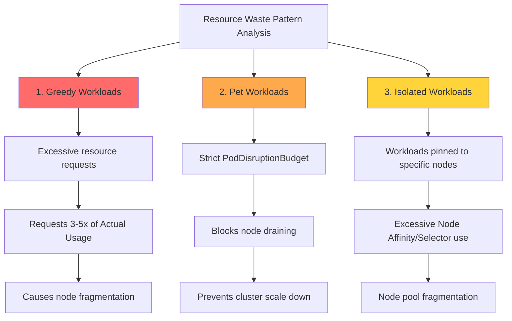

**1. Greedy Workloads:**

Pattern where Pods request excessive resources, resulting in low node utilization.

```bash
# CloudWatch Insights query - Identify over-requesting containers
fields @timestamp, PodName, ContainerName, pod_cpu_request, pod_cpu_utilization_over_pod_limit
| filter Namespace = "production"
| stats avg(pod_cpu_request) as avg_requested,
        avg(pod_cpu_utilization_over_pod_limit) as avg_utilization
  by PodName
| filter avg_utilization < 30  # Using less than 30% of requests
| sort avg_requested desc
```

**Identification Criteria:**
- Using less than 30% of CPU requests
- Using less than 50% of Memory requests
- Duration: 7+ days

**Remediation:**
```yaml
# Before (Greedy)
resources:
  requests:
    cpu: "2000m"       # Actual Usage: 400m (20%)
    memory: "4Gi"      # Actual Usage: 1Gi (25%)

# After (Right-Sized)
resources:
  requests:
    cpu: "500m"        # P95 400m + 20% = 480m → 500m
    memory: "1280Mi"   # P95 1Gi + 20% = 1.2Gi → 1280Mi
  limits:
    memory: "2Gi"
```

**2. Pet Workloads:**

Pattern where cluster scale down is blocked due to strict PodDisruptionBudget (PDB).

```bash
# Check node draining failures due to PDB
kubectl get events --all-namespaces \
  --field-selector reason=EvictionFailed \
  --sort-by='.lastTimestamp'

# Expected output:
# NAMESPACE   LAST SEEN   TYPE      REASON           MESSAGE
# production  5m          Warning   EvictionFailed   Cannot evict pod as it would violate the pod's disruption budget
```

**Identification Criteria:**
- `minAvailable: 100%` or `maxUnavailable: 0` configured
- Long-term (>30min) Pending state nodes exist
- Karpenter/Cluster Autoscaler scale down failure logs

**Remediation:**
```yaml
# Before (Pet)
apiVersion: policy/v1
kind: PodDisruptionBudget
metadata:
  name: critical-app-pdb
spec:
  minAvailable: 100%  # Protect all Pods → no scale down

# After (Balanced)
apiVersion: policy/v1
kind: PodDisruptionBudget
metadata:
  name: critical-app-pdb
spec:
  minAvailable: 80%   # Allow scale down with 20% headroom
  selector:
    matchLabels:
      app: critical-app
```

**3. Isolated Workloads:**

Pattern where node pools become fragmented due to excessive Node Affinity and Taints/Tolerations.

```bash
# Analyze Pod count and utilization per node
kubectl get nodes -o json | jq -r '
  .items[] |
  {
    name: .metadata.name,
    pods: (.status.allocatable.pods | tonumber),
    cpu_capacity: (.status.capacity.cpu | tonumber),
    cpu_allocatable: (.status.allocatable.cpu | tonumber)
  }
' | jq -s 'sort_by(.pods) | .[]'
```

**Identification Criteria:**
- Average Pod count per node < 10
- Node count > 150% of required capacity
- NodeSelector/Affinity usage rate > 50%

**Remediation:**
```yaml
# Before (Isolated)
affinity:
  nodeAffinity:
    requiredDuringSchedulingIgnoredDuringExecution:
      nodeSelectorTerms:
      - matchExpressions:
        - key: workload-type
          operator: In
          values:
          - api-server-v2  # Too specific → node fragmentation

# After (Flexible)
affinity:
  nodeAffinity:
    preferredDuringSchedulingIgnoredDuringExecution:  # required → preferred
    - weight: 100
      preference:
        matchExpressions:
        - key: workload-class
          operator: In
          values:
          - compute-optimized  # Broader category
```

**Data-Driven Optimization Flow:**

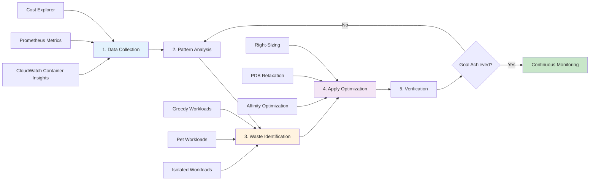

**Real-world Impact Examples (AWS Official Guide):**

| Organization | Waste Pattern | Applied Action | Savings Effect |
|------|----------|----------|----------|
| Fintech Startup | Greedy Workloads 40% | Applied VPA recommendations | 35% reduction in node count |
| E-commerce Company | Pet Workloads 25% | Relaxed PDB minAvailable to 80% | 3x faster scale down |
| SaaS Platform | Isolated Workloads 30% | Removed NodeSelector, utilized Spot | 45% cost reduction |

:::tip Automated Waste Pattern Detection
CloudWatch Contributor Insights can be used to create rules that automatically detect these 3 patterns:

```bash
# Create Contributor Insights rule (Greedy Workloads)
aws cloudwatch put-insight-rule \
  --rule-name "EKS-GreedyWorkloads" \
  --rule-definition file://greedy-workloads-rule.json
```

Rule Definition Example:
```json
{
  "Schema": {
    "Name": "CloudWatchLogRule",
    "Version": 1
  },
  "LogGroupNames": ["/aws/containerinsights/<cluster-name>/performance"],
  "LogFormat": "JSON",
  "Contribution": {
    "Keys": ["PodName"],
    "Filters": [
      {
        "Match": "$.Type",
        "In": ["Pod"]
      },
      {
        "Match": "$.pod_cpu_utilization_over_pod_limit",
        "LessThan": 30
      }
    ],
    "ValueOf": "pod_cpu_request"
  },
  "AggregateOn": "Sum"
}
```
:::

#### Prometheus Queries

```promql
# CPU Usage (P95, 7 days)
quantile_over_time(0.95,
  sum by (pod, namespace) (
    rate(container_cpu_usage_seconds_total{namespace="production"}[5m])
  )[7d:5m]
)

# Memory Usage (P95, 7 days)
quantile_over_time(0.95,
  sum by (pod, namespace) (
    container_memory_working_set_bytes{namespace="production"}
  )[7d:5m]
)

# Compare CPU Requests vs Actual Usage
sum by (pod) (rate(container_cpu_usage_seconds_total[5m]))
/
sum by (pod) (kube_pod_container_resource_requests{resource="cpu"})

# Compare Memory Requests vs Actual Usage
sum by (pod) (container_memory_working_set_bytes)
/
sum by (pod) (kube_pod_container_resource_requests{resource="memory"})
```

### 6.2 Automated Right-Sizing with Goldilocks

Goldilocks provides a dashboard based on VPA Recommender.

#### Installation

```bash
# Install via Helm
helm repo add fairwinds-stable https://charts.fairwinds.com/stable
helm repo update

helm install goldilocks fairwinds-stable/goldilocks \
  --namespace goldilocks \
  --create-namespace \
  --set dashboard.service.type=LoadBalancer
```

#### Enable Namespace

```bash
# Add label to namespace
kubectl label namespace production goldilocks.fairwinds.com/enabled=true
kubectl label namespace staging goldilocks.fairwinds.com/enabled=true

# Goldilocks automatically creates VPA (Off mode)
kubectl get vpa -n production
```

#### Access Dashboard

```bash
# Check dashboard URL
kubectl get svc -n goldilocks goldilocks-dashboard

# Port forwarding
kubectl port-forward -n goldilocks svc/goldilocks-dashboard 8080:80

# Access http://localhost:8080 in browser
```

**Dashboard Features:**
- Resource recommendations per namespace
- Display VPA Lower Bound, Target, Upper Bound
- Compare current settings vs recommended values
- Display QoS classes

### 6.3 Using Container Insights Enhanced Anomaly Detection

AWS Container Insights Enhanced provides improved observability features over standard Container Insights, particularly through **automatic anomaly detection** and **drill-down analysis** capabilities for early resource problem detection.

#### 6.3.1 Container Insights Enhanced Overview

**Enhanced Features Compared to Standard Container Insights:**

| Feature | Standard Container Insights | Enhanced |
|------|------------------------|----------|
| **Metrics collection** | Pod/Container level | Pod/Container + network granularity |
| **Anomaly detection** | Manual (user-set thresholds) | **Automatic (ML-based anomaly detection)** |
| **Drill-down** | Limited | **Complete hierarchy (Cluster → Node → Pod → Container)** |
| **Memory leak detection** | Manual analysis required | **Automatic visual pattern identification** |
| **CPU Throttling** | Metrics only | **Automatic alerts + root cause analysis** |
| **Network observability** | Basic | **Pod-to-Pod flow analysis** |

**Activation Method:**

```bash
# Deploy CloudWatch Observability Operator
kubectl apply -f https://raw.githubusercontent.com/aws-observability/aws-cloudwatch-observability-operator/main/deploy/operator.yaml

# Enable Container Insights Enhanced
cat <<EOF | kubectl apply -f -
apiVersion: cloudwatch.aws.amazon.com/v1alpha1
kind: CloudWatchObservability
metadata:
  name: cloudwatch-observability
spec:
  enableContainerInsights: true
  enableEnhancedContainerInsights: true  # Enable Enhanced
  enableAutoInstrumentation: true
EOF

# Verify activation
kubectl get cloudwatchobservability cloudwatch-observability -o yaml
```

#### 6.3.2 Visual Memory Leak Identification Patterns

Container Insights Enhanced automatically detects **gradual increase patterns** in memory usage.

**Memory Leak Detection Scenario:**

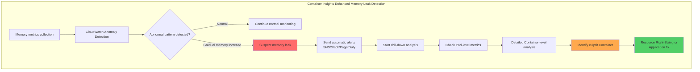

**Check Memory Leak in CloudWatch Console:**

1. **CloudWatch → Container Insights → Performance monitoring**
2. Select **View: EKS Pods**
3. Select **Metric: Memory Utilization (%)**
4. Enable **Anomaly Detection Band**

```
Normal pattern:
Memory (%) ▲
100% |                    ┌────┐
     |        ┌────┐  ┌──┘    └──┐
 50% |   ┌───┘    └──┘           └───┐
     |───┘                            └───
  0% +──────────────────────────────────►
     0h    6h   12h   18h   24h        Time

Memory leak pattern (🚨):
Memory (%) ▲
100% |                          ┌────OOM Kill
     |                    ┌────┤
 50% |           ┌───────┤     │
     |      ┌────┤       │     │
  0% +──────┤────────────────────────────►
     0h    6h   12h   18h   24h        Time
     Gradual increase (automatically detected by Anomaly Detection)
```

**Automatic Alert Configuration Example:**

```yaml
# CloudWatch Alarm with Anomaly Detection
apiVersion: v1
kind: ConfigMap
metadata:
  name: memory-leak-alarm
data:
  alarm.json: |
    {
      "AlarmName": "EKS-MemoryLeak-Detection",
      "ComparisonOperator": "LessThanLowerOrGreaterThanUpperThreshold",
      "EvaluationPeriods": 3,
      "Metrics": [
        {
          "Id": "m1",
          "ReturnData": true,
          "MetricStat": {
            "Metric": {
              "Namespace": "ContainerInsights",
              "MetricName": "pod_memory_utilization",
              "Dimensions": [
                {
                  "Name": "ClusterName",
                  "Value": "production-eks"
                }
              ]
            },
            "Period": 300,
            "Stat": "Average"
          }
        },
        {
          "Id": "ad1",
          "Expression": "ANOMALY_DETECTION_BAND(m1, 2)",
          "Label": "MemoryUsage (Expected)"
        }
      ],
      "ThresholdMetricId": "ad1",
      "ActionsEnabled": true,
      "AlarmActions": [
        "arn:aws:sns:us-east-1:123456789012:ops-alerts"
      ]
    }
```

**Create Alert with AWS CLI:**

```bash
# Memory alert based on Anomaly Detection
aws cloudwatch put-metric-alarm \
  --alarm-name eks-memory-leak-detection \
  --alarm-description "Detects memory leak patterns in EKS pods" \
  --comparison-operator LessThanLowerOrGreaterThanUpperThreshold \
  --evaluation-periods 3 \
  --metrics '[
    {
      "Id": "m1",
      "ReturnData": true,
      "MetricStat": {
        "Metric": {
          "Namespace": "ContainerInsights",
          "MetricName": "pod_memory_utilization",
          "Dimensions": [
            {"Name": "ClusterName", "Value": "production-eks"}
          ]
        },
        "Period": 300,
        "Stat": "Average"
      }
    },
    {
      "Id": "ad1",
      "Expression": "ANOMALY_DETECTION_BAND(m1, 2)"
    }
  ]' \
  --threshold-metric-id ad1 \
  --alarm-actions arn:aws:sns:us-east-1:123456789012:ops-alerts
```

#### 6.3.3 Automatic CPU Throttling Detection

Container Insights Enhanced automatically detects CPU throttling and warns about **excessive CPU limit configuration**.

**CPU Throttling Metrics:**

```
throttled_time_percentage = (container_cpu_cfs_throttled_seconds_total / container_cpu_cfs_periods_total) * 100

Normal: <5%
Warning: 5-10% ⚠️
Critical: >10% 🚨 (Add HPA or remove CPU limits)
```

**Throttling Analysis with CloudWatch Insights Query:**

```sql
# CloudWatch Logs Insights query
fields @timestamp, kubernetes.pod_name, cpu_limit_millicores, cpu_usage_millicores, throttled_time_ms
| filter kubernetes.namespace_name = "production"
| filter throttled_time_ms > 100  # Throttling > 100ms
| stats
    avg(cpu_usage_millicores) as avg_cpu,
    max(cpu_usage_millicores) as max_cpu,
    avg(throttled_time_ms) as avg_throttled,
    count(*) as throttling_count
  by kubernetes.pod_name
| sort throttling_count desc
| limit 20

# Result example:
# pod_name            avg_cpu  max_cpu  avg_throttled  throttling_count
# web-app-abc123      450m     800m     250ms          150
# api-server-def456   600m     1000m    180ms          120
```

**Throttling Automatic Alert CloudWatch Alarm:**

```bash
aws cloudwatch put-metric-alarm \
  --alarm-name eks-cpu-throttling-high \
  --alarm-description "Alerts when CPU throttling exceeds 10%" \
  --namespace ContainerInsights \
  --metric-name pod_cpu_throttled_percentage \
  --dimensions Name=ClusterName,Value=production-eks \
  --statistic Average \
  --period 300 \
  --threshold 10 \
  --comparison-operator GreaterThanThreshold \
  --evaluation-periods 2 \
  --alarm-actions arn:aws:sns:us-east-1:123456789012:ops-alerts
```

#### 6.3.4 Anomaly Detection Band Configuration

CloudWatch Anomaly Detection uses ML models to automatically learn normal ranges.

**How Anomaly Detection Works:**

```
1. Learning period: Minimum 2 weeks data collection
2. ML model training: Learn patterns by hour/day of week
3. Generate prediction range: Calculate expected upper/lower bounds
4. Real-time comparison: Alert if actual value is outside range
```

**Band Width Adjustment (Standard Deviation):**

```yaml
# 2 Standard Deviations (default, 95% confidence interval)
Expression: ANOMALY_DETECTION_BAND(m1, 2)

# 3 Standard Deviations (99.7% confidence interval, more conservative)
Expression: ANOMALY_DETECTION_BAND(m1, 3)

# 1 Standard Deviation (68% confidence interval, more sensitive)
Expression: ANOMALY_DETECTION_BAND(m1, 1)
```

**Visual Example:**

```
Resource Usage ▲
              |     ┌──── Upper Band (predicted upper bound)
              |    /
         100% | ──●────  Actual Usage (no anomaly)
              |  / │
              | /  │
          50% |────●────  Actual Usage (normal)
              | \  │
              |  \ │
           0% | ──●────  Lower Band (predicted lower bound)
              +──────────────────────────►
              0h   6h   12h   18h   24h
```

#### 6.3.5 Practical Workflow: Anomaly Detection → Investigation → Right-Sizing

**Step 1: CloudWatch Alarm Trigger**

```
[CloudWatch Alarm] → [SNS Topic] → [Slack Webhook]

Alert Example:
🚨 EKS Memory Anomaly Detected
Cluster: production-eks
Pod: web-app-7d8c9f-abc123
Memory Usage: 1.8Gi (Expected: 1.2Gi ± 200Mi)
Duration: 15 minutes
Action: Investigate memory leak
```

**Step 2: Container Insights Drill-down Analysis**

```bash
# 1. Select the Pod in CloudWatch Console
# 2. Click "View in Container Insights"
# 3. Drill down hierarchy:
#    Cluster → Node → Pod → Container

# or Query metrics with AWS CLI:
aws cloudwatch get-metric-statistics \
  --namespace ContainerInsights \
  --metric-name pod_memory_utilization \
  --dimensions \
    Name=ClusterName,Value=production-eks \
    Name=Namespace,Value=production \
    Name=PodName,Value=web-app-7d8c9f-abc123 \
  --start-time 2026-02-12T00:00:00Z \
  --end-time 2026-02-12T23:59:59Z \
  --period 300 \
  --statistics Average,Maximum
```

**Step 3: Identify Root Cause**

```bash
# Check memory leak
kubectl top pod web-app-7d8c9f-abc123 -n production --containers

# Check logs (OOM warnings)
kubectl logs web-app-7d8c9f-abc123 -n production | grep -i "memory\|heap\|oom"

# Application profiling (Java example)
kubectl exec web-app-7d8c9f-abc123 -n production -- jmap -heap 1
```

**Step 4: Apply Right-Sizing**

```yaml
# Check recommendations with VPA Off mode
apiVersion: autoscaling.k8s.io/v1
kind: VerticalPodAutoscaler
metadata:
  name: web-app-vpa
  namespace: production
spec:
  targetRef:
    apiVersion: apps/v1
    kind: Deployment
    name: web-app
  updatePolicy:
    updateMode: "Off"

# Update Deployment after checking VPA recommendations
resources:
  requests:
    memory: "2Gi"    # VPA Target 1.8Gi + 20% buffer
  limits:
    memory: "3Gi"    # Upper Bound 2.5Gi + headroom
```

**Step 5: Continuous Monitoring**

```bash
# Check CloudWatch Alarm status
aws cloudwatch describe-alarms \
  --alarm-names eks-memory-leak-detection \
  --query 'MetricAlarms[0].StateValue'

# Output: "OK" (normal) or "ALARM" (anomaly)
```

:::tip Container Insights Enhanced vs Prometheus
Container Insights Enhanced excels in **AWS native integration** and **zero-configuration anomaly detection**. Prometheus allows more granular customization but requires building ML models for anomaly detection. Using both tools provides best observability.
:::

:::warning Limitations of Anomaly Detection
ML-based anomaly detection learns from **historical patterns**, so false positives may occur in the following situations:
- Immediately after new deployment (insufficient training data)
- Planned traffic increases such as marketing campaigns
- Seasonal events (Black Friday, year-end settlements, etc.)

In these cases, **temporarily mute alerts** or **reflect expected events in the Anomaly Detection model**.
:::

### 6.4 Right-Sizing Process

5-step systematic Right-Sizing Process:

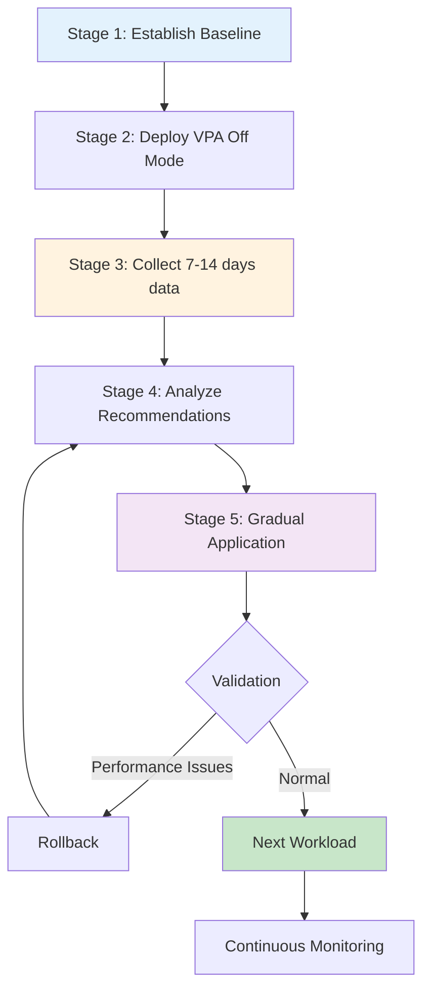

#### Stage 1: Establish Baseline

```bash
# Backup current resource configuration
kubectl get deploy -n production -o yaml > deployments-backup.yaml

# Snapshot current usage
kubectl top pods -n production --containers > baseline-usage.txt
```

#### Stage 2: Deploy VPA Off Mode

```yaml
apiVersion: autoscaling.k8s.io/v1
kind: VerticalPodAutoscaler
metadata:
  name: web-app-vpa
  namespace: production
spec:
  targetRef:
    apiVersion: apps/v1
    kind: Deployment
    name: web-app
  updatePolicy:
    updateMode: "Off"
  resourcePolicy:
    containerPolicies:
    - containerName: '*'    # All containers
      minAllowed:
        cpu: "50m"
        memory: "64Mi"
      maxAllowed:
        cpu: "8000m"
        memory: "32Gi"
```

#### Stage 3: Collect 7-14 Days Data

```bash
# Monitor VPA status
watch kubectl describe vpa web-app-vpa -n production

# Wait minimum 7 days, recommended 14 days
# 14 days required if traffic patterns have weekly cycles
```

#### Stage 4: Analyze Recommendations

```bash
# Extract VPA recommendations
kubectl get vpa web-app-vpa -n production -o jsonpath='{.status.recommendation.containerRecommendations[0]}' | jq .

# Output example:
# {
#   "containerName": "web-app",
#   "lowerBound": {
#     "cpu": "150m",
#     "memory": "200Mi"
#   },
#   "target": {
#     "cpu": "250m",
#     "memory": "350Mi"
#   },
#   "uncappedTarget": {
#     "cpu": "300m",
#     "memory": "400Mi"
#   },
#   "upperBound": {
#     "cpu": "500m",
#     "memory": "700Mi"
#   }
# }
```

**Interpreting Recommendations:**

| Item | Meaning | When to Use |
|------|------|----------|
| **Lower Bound** | Minimum required resources | Extreme cost savings (risky) |
| **Target** | **Recommended setting** | **Default use** ⭐ |
| **Uncapped Target** | Unconstrained recommendation | Reference for maxAllowed adjustment |
| **Upper Bound** | Maximum observed usage | Reference for Limits setting |

:::tip Requests Calculation Formula
**Recommended formula**: `Requests = VPA Target + 20% buffer`

Reasons:
- P95-based recommendations (handle 5% traffic spikes)
- Handle temporary usage increases from deployment, initialization
- Minimize throttling and OOM risks

**Example:**
```
VPA Target CPU: 250m
→ Requests: 250m * 1.2 = 300m

VPA Target Memory: 350Mi
→ Requests: 350Mi * 1.2 = 420Mi (round to 512Mi)
```
:::

#### Stage 5: Gradual Application

```yaml
# Current configuration
resources:
  requests:
    cpu: "1000m"       # Over-provisioned
    memory: "2Gi"
  limits:
    cpu: "2000m"
    memory: "2Gi"

# VPA Target: CPU 250m, Memory 350Mi

# Right-Sized configuration
resources:
  requests:
    cpu: "300m"        # Target 250m + 20% = 300m
    memory: "512Mi"    # Target 350Mi + 20% ≈ 420Mi → 512Mi
  limits:
    # Remove CPU limits (compressible resource)
    memory: "1Gi"      # Upper Bound 700Mi + headroom = 1Gi
```

**Application Strategy:**

```bash
# 1. Canary deployment (10% traffic)
kubectl patch deploy web-app -n production -p '
{
  "spec": {
    "strategy": {
      "type": "RollingUpdate",
      "rollingUpdate": {
        "maxSurge": 1,
        "maxUnavailable": 0
      }
    }
  }
}'

# 2. Apply resource changes
kubectl set resources deploy web-app -n production \
  --limits=memory=1Gi \
  --requests=cpu=300m,memory=512Mi

# 3. Monitor (1-3 days)
kubectl top pods -n production -l app=web-app
kubectl get events -n production --field-selector involvedObject.name=web-app

# 4. Full rollout if no issues
# Immediate rollback if issues
kubectl rollout undo deploy web-app -n production
```

### 6.5 AI-based Resource Recommendation Automation (Advanced)

Resource optimization processes can be automated using AI and LLMs. This section introduces latest patterns using Amazon Bedrock, Kiro, and Amazon Q Developer.

#### 6.5.1 Amazon Bedrock + Prometheus → Automatic Right-Sizing PR Generation

End-to-end workflow automating traditional manual Right-Sizing process with AI.

**Architecture Overview:**

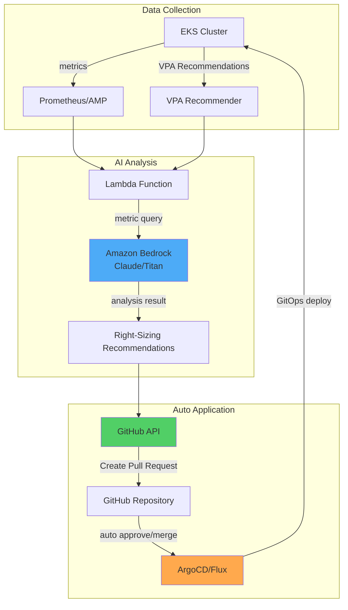

**Implementation Example:**

```python
# Lambda Function: AI-based Right-Sizing recommendations
import boto3
import json
import requests
from datetime import datetime, timedelta

bedrock = boto3.client('bedrock-runtime', region_name='us-east-1')
amp_query_url = "https://aps-workspaces.us-east-1.amazonaws.com/workspaces/ws-xxx/api/v1/query"

def lambda_handler(event, context):
    # 1. Prometheus metrics collection (7 days)
    metrics = collect_prometheus_metrics(
        namespace="production",
        deployment="web-app",
        period_days=7
    )

    # 2. Collect VPA recommendations
    vpa_recommendations = get_vpa_recommendations("web-app-vpa", "production")

    # 3. Analyze with Amazon Bedrock
    analysis_prompt = f"""
    Analyze resource optimization for the following Kubernetes Deployment:

    Current configuration:
    {json.dumps(metrics['current_resources'], indent=2)}

    7-day Actual Usage (P50/P95/P99):
    CPU: {metrics['cpu_p50']}m / {metrics['cpu_p95']}m / {metrics['cpu_p99']}m
    Memory: {metrics['mem_p50']}Mi / {metrics['mem_p95']}Mi / {metrics['mem_p99']}Mi

    VPA Recommendations:
    {json.dumps(vpa_recommendations, indent=2)}

    Provide analysis including:
    1. Whether current resources are wasted or insufficient
    2. Recommended requests/limits values (specific numbers)
    3. Expected cost savings
    4. Risk factors and precautions
    5. Phased application plan
    """

    response = bedrock.invoke_model(
        modelId='anthropic.claude-3-sonnet-20240229-v1:0',
        contentType='application/json',
        accept='application/json',
        body=json.dumps({
            "anthropic_version": "bedrock-2023-05-31",
            "max_tokens": 2000,
            "messages": [{
                "role": "user",
                "content": analysis_prompt
            }]
        })
    )

    analysis = json.loads(response['body'].read())['content'][0]['text']

    # 4. Create GitHub Pull Request
    create_right_sizing_pr(
        deployment="web-app",
        namespace="production",
        analysis=analysis,
        recommended_resources=parse_recommendations(analysis)
    )

    return {
        'statusCode': 200,
        'body': json.dumps({'message': 'Right-sizing PR created', 'analysis': analysis})
    }

def collect_prometheus_metrics(namespace, deployment, period_days):
    """Collect resource usage from Prometheus"""
    end_time = datetime.now()
    start_time = end_time - timedelta(days=period_days)

    queries = {
        'cpu_p50': f'quantile_over_time(0.50, container_cpu_usage_seconds_total{{namespace="{namespace}",pod=~"{deployment}-.*"}}[{period_days}d]) * 1000',
        'cpu_p95': f'quantile_over_time(0.95, container_cpu_usage_seconds_total{{namespace="{namespace}",pod=~"{deployment}-.*"}}[{period_days}d]) * 1000',
        'cpu_p99': f'quantile_over_time(0.99, container_cpu_usage_seconds_total{{namespace="{namespace}",pod=~"{deployment}-.*"}}[{period_days}d]) * 1000',
        'mem_p50': f'quantile_over_time(0.50, container_memory_working_set_bytes{{namespace="{namespace}",pod=~"{deployment}-.*"}}[{period_days}d]) / 1024 / 1024',
        'mem_p95': f'quantile_over_time(0.95, container_memory_working_set_bytes{{namespace="{namespace}",pod=~"{deployment}-.*"}}[{period_days}d]) / 1024 / 1024',
        'mem_p99': f'quantile_over_time(0.99, container_memory_working_set_bytes{{namespace="{namespace}",pod=~"{deployment}-.*"}}[{period_days}d]) / 1024 / 1024',
    }

    results = {}
    for key, query in queries.items():
        response = requests.get(amp_query_url, params={'query': query})
        results[key] = int(float(response.json()['data']['result'][0]['value'][1]))

    return results

def create_right_sizing_pr(deployment, namespace, analysis, recommended_resources):
    """Create Right-Sizing PR in GitHub"""
    github_token = get_secret('github-token')
    repo_owner = "my-org"
    repo_name = "k8s-manifests"

    # Modify Deployment YAML
    updated_yaml = update_deployment_resources(
        deployment=deployment,
        namespace=namespace,
        resources=recommended_resources
    )

    # Create Pull Request
    pr_body = f"""
## 🤖 AI-based Resource Right-Sizing Recommendations

### Analysis Results
{analysis}

### Changes
- Deployment: `{namespace}/{deployment}`
- Update resource requests/limits

### Validation Checklist
- [ ] Testing completed in staging environment
- [ ] Performance metrics verified normal
- [ ] Cost savings validated

### Auto-generation Information
- Generator: Amazon Bedrock + VPA Analysis
- Timestamp: {datetime.now().isoformat()}
"""

    headers = {
        'Authorization': f'token {github_token}',
        'Accept': 'application/vnd.github.v3+json'
    }

    # Create branch and commit
    create_branch_and_commit(repo_owner, repo_name, updated_yaml, headers)

    # Create PR
    pr_data = {
        'title': f'[AI] Right-Size {namespace}/{deployment}',
        'head': f'right-size-{deployment}-{datetime.now().strftime("%Y%m%d")}',
        'base': 'main',
        'body': pr_body
    }

    response = requests.post(
        f'https://api.github.com/repos/{repo_owner}/{repo_name}/pulls',
        headers=headers,
        json=pr_data
    )

    return response.json()
```

**Automate with EventBridge Schedule:**

```yaml
# CloudFormation Template Example
Resources:
  RightSizingSchedule:
    Type: AWS::Events::Rule
    Properties:
      Name: weekly-right-sizing-analysis
      Description: "Weekly AI-based right-sizing analysis"
      ScheduleExpression: "cron(0 9 ? * MON *)"  # Every Monday at 9am
      State: ENABLED
      Targets:
        - Arn: !GetAtt RightSizingLambda.Arn
          Id: RightSizingTarget
          Input: |
            {
              "namespaces": ["production", "staging"],
              "auto_create_pr": true,
              "require_approval": true
            }
```

#### 6.5.2 Resource Optimization with Kiro + EKS MCP

**Kiro** is AWS's AI-based cloud operations tool that enables EKS resource optimization through **natural language queries**.

**Kiro Installation and Setup:**

```bash
# Install Kiro CLI
curl -sL https://kiro.aws.dev/install.sh | bash

# Connect EKS MCP (Model Context Protocol)
kiro mcp connect eks --cluster production-eks --region us-east-1

# Verify connection
kiro mcp list
# Output:
# ✓ eks-production (connected)
# ✓ cloudwatch-insights (connected)
# ✓ cost-explorer (connected)
```

**Natural Language Query Examples:**

```bash
# 1. Find Pods requiring resource optimization
kiro ask "Find Pods with CPU utilization below 30% in production namespace and provide Right-Sizing recommendations"

# Kiro Response Example:
# 📊 Analysis Result: 12 Pods are over-provisioned.
#
# Top 5:
# 1. web-app-7d8c9f (Current: 2 CPU / Actual P95: 0.4 CPU) → Recommended: 0.5 CPU
# 2. api-server-abc123 (Current: 4 CPU / Actual P95: 0.8 CPU) → Recommended: 1 CPU
# 3. worker-def456 (Current: 1 CPU / Actual P95: 0.2 CPU) → Recommended: 0.3 CPU
#
# 💰 Expected Savings: $450/month (45% resource reduction)
#
# Would you like to apply? (y/n)

# 2. Identify Pods with suspected memory leaks
kiro ask "Find Pods with continuously increasing memory usage over the last 7 days"

# Kiro Response:
# 🔍 Memory Growth Pattern Detected:
#
# ⚠️ cache-service-xyz789
# - Start: 500Mi → Current: 1.8Gi (260% increase)
# - Trend: 150Mi increase per day
# - Estimated time to OOM: 3 days
# - Recommended Action: Investigate memory leak + temporarily increase limits to 2.5Gi
#
# 📋 Generate detailed analysis report? (y/n)

# 3. Cluster-wide efficiency analysis
kiro ask "Analyze resource efficiency of production cluster and provide optimization priorities"

# Kiro Response:
# 📈 Cluster Efficiency Report
#
# Overall Efficiency: 52% (Industry Average: 65%)
#
# Optimization Priorities:
# 1. 🔴 High Priority (Immediate Action)
#    - 10 Deployments have 70% unused CPU
#    - Expected Savings: $1,200/month
#
# 2. 🟡 Medium Priority (Within 1 week)
#    - 5 StatefulSets have oversized PVCs
#    - Expected Savings: $300/month
#
# 3. 🟢 Low Priority (Planning Phase)
#    - 15 Deployments without HPA
#    - Recommended to apply after traffic pattern analysis
#
# Would you like to generate automatic Right-Sizing PR? (y/n)
```

**Kiro Workflow Automation:**

```yaml
# kiro-workflow.yaml
apiVersion: kiro.aws.dev/v1alpha1
kind: Workflow
metadata:
  name: weekly-optimization
spec:
  schedule: "0 9 * * MON"  # Every Monday at 9am
  steps:
    - name: analyze-underutilized
      action: analyze
      query: "Analyze all Pods with CPU utilization < 30% or Memory utilization < 40%"
      outputFormat: json

    - name: generate-recommendations
      action: recommend
      input: ${{ steps.analyze-underutilized.output }}
      includeVPA: true
      includePrometheus: true

    - name: create-pr
      action: github-pr
      repository: my-org/k8s-manifests
      branch: kiro-right-sizing-{{ date }}
      title: "[Kiro] Weekly Right-Sizing Recommendations"
      body: ${{ steps.generate-recommendations.output }}
      autoMerge: false  # Manual review required

    - name: notify
      action: slack
      webhook: ${{ secrets.SLACK_WEBHOOK }}
      message: |
        📊 Weekly Right-Sizing Analysis Complete
        PR: ${{ steps.create-pr.pr_url }}
        Expected Savings: ${{ steps.generate-recommendations.estimated_savings }}
```

#### 6.5.3 Interactive Optimization with Amazon Q Developer

Amazon Q Developer provides resource optimization recommendations directly in IDE and CLI.

**Using in VS Code:**

```yaml
# Open deployment.yaml and ask Q Developer
# /q optimize-resources

# Q Developer Response:
# Analyzed current Deployment resource configuration:
#
# 🔍 Issues Found:
# 1. CPU requests are 3x higher than Actual Usage (1000m → 350m Recommended)
# 2. Missing Memory limits creates OOM risk
# 3. QoS Class: Burstable (Guaranteed Recommended)
#
# 💡 Optimized Configuration:
resources:
  requests:
    cpu: "350m"      # Actual P95 + 20% buffer
    memory: "512Mi"  # Actual P95 400Mi + 20%
  limits:
    memory: "1Gi"    # Upper Bound + headroom
    # Remove CPU limits (Google/Datadog pattern)
#
# Would you like to apply these changes? (Apply / Dismiss)
```

**Using in CLI:**

```bash
# Query via Amazon Q CLI
q ask "Optimize resources for this Deployment" --file deployment.yaml

# Output:
# Analyzing... ✓
#
# Current Configuration Issues:
# - CPU over-provisioned by 65%
# - Memory under-provisioned (OOM risk)
#
# Recommended changes saved to deployment-optimized.yaml.
# Would you like to view the diff? (y/n)

# When entering y:
diff deployment.yaml deployment-optimized.yaml
```

#### 6.5.4 Limitations and Caveats

AI-based resource recommendations are powerful, but you must understand the following limitations:

| Limitation | Description | Mitigation |
|------|------|----------|
| **Historical Data Dependency** | Cannot predict unprecedented traffic patterns | Use HPA in parallel, ensure buffer headroom |
| **Lack of Context** | Business requirements (SLA, compliance) not reflected | Mandatory manual review stage |
| **Temporary Spikes** | Planned loads (marketing campaigns) not considered | Manual scale-up during event periods |
| **Cost Optimization Bias** | May prioritize cost savings over stability | Exclude critical workloads from automation |

:::warning Use AI Recommendations as Supporting Tools
AI-based resource recommendations are **supporting tools, not final decision-making tools**. Before production application, always:

1. **Validate in Staging Environment** (minimum 3 days)
2. **Monitor Performance Metrics** (Latency P99, Error Rate)
3. **Gradual Rollout** (Canary 10% → 50% → 100%)
4. **Establish Rollback Plan** (recover to previous version within 1 minute)

Especially for the following workloads, **manage manually without applying AI recommendations**:
- Financial transaction systems
- Healthcare information systems
- Real-time streaming services
- Stateful databases
:::

**AI Recommendation Validation Checklist:**

```yaml
# Mandatory validation before production application
ai_recommendation_validation:
  staging_test:
    duration_days: 3
    success_criteria:
      - p99_latency_increase: "<5%"
      - error_rate_increase: "<0.1%"
      - no_oom_kills: true
      - no_cpu_throttling: "<10%"

  canary_rollout:
    initial_percentage: 10
    increment_percentage: 20
    increment_interval_hours: 6
    auto_rollback_threshold:
      error_rate: 1.0  # Auto rollback when error rate exceeds 1%
      latency_p99_ms: 500  # Rollback when P99 latency exceeds 500ms

  monitoring:
    dashboard_url: "https://grafana.example.com/d/right-sizing"
    alert_channels: ["slack://ops-team", "pagerduty://oncall"]
    review_required: true  # Prevent auto-merge, manual review required
```

:::tip AI + Human Hybrid Approach
Best results come from combining **AI recommendations + human expert review**:

1. AI identifies optimization candidates from thousands of Pods (speed)
2. Humans exclude critical workloads and validate (reliability)
3. AI generates draft PR (automation)
4. Humans approve after staging tests (safety)
5. GitOps performs gradual deployment (operational efficiency)

This process achieves **80% time savings compared to manual approach** while **maintaining the same level of stability**.
:::

## Resource Quota & LimitRange

### 7.1 Namespace-level Resource Limits

Limit entire namespace resources with ResourceQuota:

```yaml
apiVersion: v1
kind: ResourceQuota
metadata:
  name: production-quota
  namespace: production
spec:
  hard:
    # Total resource limits
    requests.cpu: "100"           # 100 CPU cores
    requests.memory: "200Gi"      # 200GB RAM
    limits.cpu: "200"             # Total CPU limits
    limits.memory: "400Gi"        # Total Memory limits

    # Object count limits
    pods: "500"                   # Max 500 Pods
    services: "50"                # Max 50 Services
    persistentvolumeclaims: "100" # Max 100 PVCs

    # Storage limits
    requests.storage: "2Ti"       # Total 2TB storage

---
# Environment-specific quota examples
apiVersion: v1
kind: ResourceQuota
metadata:
  name: development-quota
  namespace: development
spec:
  hard:
    requests.cpu: "20"
    requests.memory: "40Gi"
    limits.cpu: "40"
    limits.memory: "80Gi"
    pods: "100"

---
apiVersion: v1
kind: ResourceQuota
metadata:
  name: staging-quota
  namespace: staging
spec:
  hard:
    requests.cpu: "50"
    requests.memory: "100Gi"
    limits.cpu: "100"
    limits.memory: "200Gi"
    pods: "200"
```

**Check Quota Usage:**

```bash
# Current quota usage
kubectl describe resourcequota production-quota -n production

# Output example:
# Name:            production-quota
# Namespace:       production
# Resource         Used   Hard
# --------         ----   ----
# limits.cpu       150    200
# limits.memory    300Gi  400Gi
# pods             342    500
# requests.cpu     75     100
# requests.memory  150Gi  200Gi
```

### 7.2 Set Defaults with LimitRange

LimitRange automatically injects default resources into Pods/Containers:

```yaml
apiVersion: v1
kind: LimitRange
metadata:
  name: production-limitrange
  namespace: production
spec:
  limits:
  # Container-level constraints
  - type: Container
    default:                    # Default when limits not set
      cpu: "500m"
      memory: "512Mi"
    defaultRequest:             # Default when requests not set
      cpu: "100m"
      memory: "128Mi"
    max:                        # Maximum allowed
      cpu: "4000m"
      memory: "8Gi"
    min:                        # Minimum required
      cpu: "50m"
      memory: "64Mi"
    maxLimitRequestRatio:       # Maximum limits/requests ratio
      cpu: "4"                  # limits max 4x of requests
      memory: "2"               # limits max 2x of requests

  # Pod-level constraints
  - type: Pod
    max:
      cpu: "8000m"
      memory: "16Gi"
    min:
      cpu: "100m"
      memory: "128Mi"

  # PVC constraints
  - type: PersistentVolumeClaim
    max:
      storage: "100Gi"
    min:
      storage: "1Gi"

---
# Development environment LimitRange
apiVersion: v1
kind: LimitRange
metadata:
  name: development-limitrange
  namespace: development
spec:
  limits:
  - type: Container
    default:
      cpu: "200m"
      memory: "256Mi"
    defaultRequest:
      cpu: "50m"
      memory: "64Mi"
    max:
      cpu: "2000m"
      memory: "4Gi"
```

**Behavior Example:**

```yaml
# Developer's YAML (no resources specified)
apiVersion: v1
kind: Pod
metadata:
  name: test-pod
  namespace: production
spec:
  containers:
  - name: nginx
    image: nginx:1.25
    # No resources section

# Result after LimitRange auto-injection
apiVersion: v1
kind: Pod
metadata:
  name: test-pod
  namespace: production
spec:
  containers:
  - name: nginx
    image: nginx:1.25
    resources:
      requests:           # defaultRequest applied
        cpu: "100m"
        memory: "128Mi"
      limits:             # default applied
        cpu: "500m"
        memory: "512Mi"
```

**Validation:**

```bash
# Check LimitRange
kubectl describe limitrange production-limitrange -n production

# Check resources applied to Pod
kubectl get pod test-pod -n production -o jsonpath='{.spec.containers[0].resources}' | jq .
```

### 7.3 DRA (Dynamic Resource Allocation) - GPU/Special Resource Management

**DRA (Dynamic Resource Allocation)** introduced in Kubernetes 1.31+ is a new mechanism that allows more flexible allocation of special resources like GPU, FPGA, NPU.

#### Traditional Device Plugin vs DRA

| Feature | Device Plugin (Traditional) | DRA (K8s 1.31+) |
|------|---------------------|-----------------|
| **Resource Representation** | Simple number (`nvidia.com/gpu: 1`) | Structured parameters (memory, compute mode) |
| **Sharing** | Not possible (1 Pod = 1 GPU) | Possible (time-slicing, MIG support) |
| **Dynamic Allocation** | Decided at scheduling | Runtime dynamic allocation |
| **Complex Topology** | Limited | Considers NUMA, PCIe topology |
| **Multi-tenancy** | Difficult | Native support |

**DRA Core Concepts:**

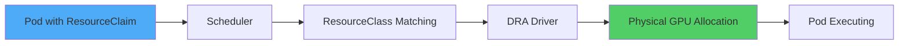

#### DRA Components

**1. ResourceClass (Cluster-level Resource Definition)**

```yaml
apiVersion: resource.k8s.io/v1alpha3
kind: ResourceClass
metadata:
  name: nvidia-a100-gpu
spec:
  driverName: gpu.nvidia.com
  parametersRef:
    apiGroup: gpu.nvidia.com
    kind: GpuClassParameters
    name: a100-80gb
---
apiVersion: gpu.nvidia.com/v1alpha1
kind: GpuClassParameters
metadata:
  name: a100-80gb
spec:
  # GPU characteristic definitions
  memory: "80Gi"
  computeCapability: "8.0"
  # MIG (Multi-Instance GPU) support
  migEnabled: true
  migProfile: "1g.10gb"  # 1/7 GPU slice
```

**2. ResourceClaim (Resource requested by Pod)**

```yaml
apiVersion: resource.k8s.io/v1alpha3
kind: ResourceClaim
metadata:
  name: ml-training-gpu
  namespace: ml-team
spec:
  resourceClassName: nvidia-a100-gpu
  parametersRef:
    apiGroup: gpu.nvidia.com
    kind: GpuClaimParameters
    name: training-config
---
apiVersion: gpu.nvidia.com/v1alpha1
kind: GpuClaimParameters
metadata:
  name: training-config
spec:
  # GPU specifications to request
  count: 2  # Request 2 GPUs
  sharing: "TimeSlicing"  # Allow time-slicing sharing
  selector:
    matchLabels:
      gpu.nvidia.com/memory: "80Gi"
```

**3. Using ResourceClaim in Pod**

```yaml
apiVersion: v1
kind: Pod
metadata:
  name: pytorch-training
  namespace: ml-team
spec:
  containers:
  - name: trainer
    image: pytorch/pytorch:2.1.0-cuda12.1
    command: ["python", "train.py"]
    resources:
      requests:
        cpu: "8"
        memory: "32Gi"
      limits:
        memory: "64Gi"

  # GPU allocation via DRA
  resourceClaims:
  - name: gpu
    source:
      resourceClaimName: ml-training-gpu

  # Reference claim in container
  containers:
  - name: trainer
    # ...
    resources:
      claims:
      - name: gpu
```

#### Enabling DRA and GPU Allocation in EKS

**Step 1: Enable DRA Feature Gate in EKS Cluster**

```bash
# When creating EKS 1.31+ cluster
eksctl create cluster \
  --name dra-enabled-cluster \
  --version 1.31 \
  --region us-west-2 \
  --nodegroup-name gpu-nodes \
  --node-type p4d.24xlarge \
  --nodes 2 \
  --kubernetes-feature-gates DynamicResourceAllocation=true
```

**Step 2: Install NVIDIA GPU Operator (with DRA driver)**

```bash
# Install GPU Operator via Helm (DRA-enabled version)
helm repo add nvidia https://helm.ngc.nvidia.com/nvidia
helm repo update

helm install gpu-operator nvidia/gpu-operator \
  --namespace gpu-operator \
  --create-namespace \
  --set driver.enabled=true \
  --set toolkit.enabled=true \
  --set devicePlugin.enabled=false \  # Disable traditional device plugin
  --set dra.enabled=true \             # Enable DRA
  --set migManager.enabled=true        # MIG support
```

**Step 3: Auto-generate Claims with ResourceClaimTemplate**

```yaml
apiVersion: apps/v1
kind: Deployment
metadata:
  name: ml-inference
  namespace: ml-team
spec:
  replicas: 3
  template:
    spec:
      containers:
      - name: model-server
        image: tritonserver:24.01
        resources:
          requests:
            cpu: "4"
            memory: "16Gi"
          claims:
          - name: gpu

      # Auto-generate per Pod with ResourceClaimTemplate
      resourceClaims:
      - name: gpu
        source:
          resourceClaimTemplateName: shared-gpu-template

---
apiVersion: resource.k8s.io/v1alpha3
kind: ResourceClaimTemplate
metadata:
  name: shared-gpu-template
  namespace: ml-team
spec:
  spec:
    resourceClassName: nvidia-a100-gpu
    parametersRef:
      apiGroup: gpu.nvidia.com
      kind: GpuClaimParameters
      name: shared-inference-config

---
apiVersion: gpu.nvidia.com/v1alpha1
kind: GpuClaimParameters
metadata:
  name: shared-inference-config
spec:
  count: 1
  sharing: "TimeSlicing"  # Multiple Pods share via time-slicing
  requests:
    memory: "10Gi"        # Request only 10GB GPU memory
```

**DRA Benefits Summary:**

1. **GPU Sharing**: Multiple Pods use 1 GPU via MIG or Time-Slicing
2. **Fine-grained Control**: Specify GPU memory, compute mode, topology
3. **Dynamic Allocation**: Add/remove resources even after Pod creation
4. **Cost Savings**: Improved GPU utilization (30-40% traditional → 70-80% with DRA)

:::warning EKS DRA Support Status (as of February 2026)
- Available as alpha feature in Kubernetes 1.31+
- Manual Feature Gate activation required in EKS
- For production use, verify NVIDIA GPU Operator latest version (v24.9.0+)
- MIG support only available on A100/H100 GPUs
:::

### 7.3.1 Setu: Eliminate GPU Idle Costs with Kueue-Karpenter Integration

In AI/ML workloads, GPUs are the most expensive resource, but traditional reactive provisioning causes severe waste. **Setu** implements proactive resource allocation by connecting Kueue's quota management with Karpenter's node provisioning.

#### Resource Waste Problem in Reactive Provisioning

**Problem Scenario:**
1. 4-GPU training Job enters Queue
2. Karpenter provisions nodes one by one (5-10 minutes)
3. Pod scheduling attempted with only 2 nodes ready → fails
4. **2 GPUs remain idle while incurring costs**
5. Workload starts only after remaining nodes are ready

**Cost Impact:**
- p4d.24xlarge (8x A100) = $32.77/hour
- 10 min idle wait × 2 nodes = **$10.92 wasted**
- 100 executions/day → $32,760 unnecessary monthly cost

#### Setu's All-or-Nothing Provisioning

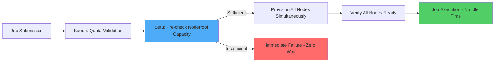

**How Setu Works:**

1. **Pre-capacity Validation**: Check if Karpenter NodePool has required node capacity
2. **Simultaneous Provisioning**: Request all nodes at once (no sequential waiting)
3. **Gang Scheduling Guarantee**: Start workload only after all nodes are Ready
4. **Immediate Failure**: Fail immediately on capacity shortage to eliminate pointless waiting

#### Integration with Kueue ClusterQueue

```yaml
apiVersion: kueue.x-k8s.io/v1beta1
kind: ClusterQueue
metadata:
  name: gpu-cluster-queue
spec:
  namespaceSelector: {}
  resourceGroups:
  - coveredResources: ["cpu", "memory", "nvidia.com/gpu"]
    flavors:
    - name: a100-spot
      resources:
      - name: "nvidia.com/gpu"
        nominalQuota: 32  # 4 nodes × 8 GPUs
      - name: "cpu"
        nominalQuota: 384
      - name: "memory"
        nominalQuota: 1536Gi
---
apiVersion: kueue.x-k8s.io/v1beta1
kind: LocalQueue
metadata:
  name: ml-team-queue
  namespace: ml-training
spec:
  clusterQueue: gpu-cluster-queue
---
apiVersion: karpenter.sh/v1
kind: NodePool
metadata:
  name: a100-spot-pool
spec:
  template:
    spec:
      requirements:
      - key: node.kubernetes.io/instance-type
        operator: In
        values: ["p4d.24xlarge"]
      - key: karpenter.sh/capacity-type
        operator: In
        values: ["spot", "on-demand"]
      nodeClassRef:
        name: a100-nodeclass
  disruption:
    consolidationPolicy: WhenEmptyOrUnderutilized
    consolidateAfter: 5m
  # Setu pre-validates this NodePool's capacity
  limits:
    cpu: "384"
    memory: "1536Gi"
```

**Setu Controller Behavior:**

```yaml
apiVersion: batch/v1
kind: Job
metadata:
  name: llm-training
  namespace: ml-training
  labels:
    kueue.x-k8s.io/queue-name: ml-team-queue
    setu.io/enabled: "true"  # Enable Setu
spec:
  parallelism: 4  # Requires 4 nodes
  completions: 4
  template:
    spec:
      schedulerName: default-scheduler
      containers:
      - name: trainer
        image: pytorch/pytorch:2.1-cuda12.1
        resources:
          requests:
            nvidia.com/gpu: 8  # 8 GPUs per node
            memory: 384Gi
          limits:
            nvidia.com/gpu: 8
```

**Setu Operation Flow:**

1. Job enters Kueue Queue
2. Kueue checks quota (verify availability out of 32 GPUs)
3. **Setu Intervenes**: Validate if 4 p4d.24xlarge nodes can be provisioned from Karpenter NodePool `a100-spot-pool`
4. **If Possible**: Request simultaneous provisioning of 4 nodes + Job waits
5. **If Not Possible**: Job fails immediately (reroute to another Queue or retry)
6. After all nodes Ready, schedule Job → **0 idle GPUs**

#### Resource Efficiency Comparison

| Scenario | Traditional Approach | Setu Approach | Savings |
|------|----------|-----------|----------|
| **4-GPU Job Start Time** | Provision nodes one-by-one (15min) | Simultaneous provisioning (7min) | **53% reduction** |
| **Idle GPU Cost** | 2 nodes × 10min wait = $10.92 | 0 (simultaneous start) | **100% savings** |
| **Wait on Insufficient Capacity** | 10min wait then fail | Immediate failure (0sec) | **Wait time eliminated** |
| **Restart on Spot Interruption** | Partial node recreation → idle occurs | Gang Guarantee reprovisioning | **Interruption cost minimized** |

**Monthly Cost Savings (100 Job executions basis):**
- Idle cost savings: **$32,760/month**
- Cold start elimination: **$16,380/month** (53% start time reduction)
- **Total Savings: $49,140/month**

#### Fairness + Efficiency in Multi-tenant Environments

```yaml
apiVersion: kueue.x-k8s.io/v1beta1
kind: ClusterQueue
metadata:
  name: shared-gpu-queue
spec:
  preemption:
    withinClusterQueue: LowerPriority
    reclaimWithinCohort: Any
  resourceGroups:
  - coveredResources: ["nvidia.com/gpu"]
    flavors:
    - name: a100-80gb
      resources:
      - name: "nvidia.com/gpu"
        nominalQuota: 64
        borrowingLimit: 32  # Borrow 32 additional GPUs when other teams idle
---
apiVersion: kueue.x-k8s.io/v1beta1
kind: LocalQueue
metadata:
  name: research-team
  namespace: research
spec:
  clusterQueue: shared-gpu-queue
---
apiVersion: kueue.x-k8s.io/v1beta1
kind: LocalQueue
metadata:
  name: production-team
  namespace: production
spec:
  clusterQueue: shared-gpu-queue
```

**Setu + Kueue Integration Benefits:**

1. **Fair Quota Management**: Kueue manages per-team GPU allocations
2. **Efficient Provisioning**: Setu pre-validates based on NodePool capacity
3. **Borrowing Optimization**: Gang Scheduling Guarantee even when other teams use idle GPUs
4. **Maximize Spot Usage**: Minimize Spot interruption impact by preventing partial allocations

:::tip Recommended Scenarios for Setu
- **Large GPU Workloads**: Idle costs are severe when 4+ GPUs required
- **Spot Instance Usage**: Improved Spot interruption response with gang scheduling
- **Multi-tenant Environments**: Simultaneously secure Kueue fairness + Karpenter efficiency
- **Cost Sensitive**: GPU idle time causes thousands of dollars monthly cost
:::

**References:**
- [Setu GitHub Repository](https://github.com/sanjeevrg89/Setu)
- [Kueue Official Documentation](https://kueue.sigs.k8s.io/)
- [Karpenter NodePool Configuration Guide](https://karpenter.sh/)

### 7.4 Standardize Resource Policies with EKS Blueprints IaC Pattern

Terraform EKS Blueprints enables you to standardize ResourceQuota, LimitRange, and Policy Enforcement as code and apply consistently across all clusters.

#### Terraform EKS Blueprints AddOn Structure

```hcl
# main.tf - Auto-deploy resource policies with EKS Blueprints
module "eks" {
  source  = "terraform-aws-modules/eks/aws"
  version = "~> 20.0"

  cluster_name    = "production-eks"
  cluster_version = "1.31"

  vpc_id     = module.vpc.vpc_id
  subnet_ids = module.vpc.private_subnets

  enable_irsa = true

  eks_managed_node_groups = {
    general = {
      desired_size = 3
      min_size     = 2
      max_size     = 10
      instance_types = ["m6i.xlarge"]
    }
  }
}

# Deploy resource policies with EKS Blueprints AddOns
module "eks_blueprints_addons" {
  source  = "aws-ia/eks-blueprints-addons/aws"
  version = "~> 1.16"

  cluster_name      = module.eks.cluster_name
  cluster_endpoint  = module.eks.cluster_endpoint
  cluster_version   = module.eks.cluster_version
  oidc_provider_arn = module.eks.oidc_provider_arn

  # Metrics Server (VPA prerequisite)
  enable_metrics_server = true

  # Karpenter (node autoscaling)
  enable_karpenter = true
  karpenter = {
    repository_username = data.aws_ecrpublic_authorization_token.token.user_name
    repository_password = data.aws_ecrpublic_authorization_token.token.password
  }

  # Kyverno (resource policy enforcement)
  enable_kyverno = true
  kyverno = {
    values = [templatefile("${path.module}/kyverno-policies.yaml", {
      default_cpu_request    = "100m"
      default_memory_request = "128Mi"
      max_cpu_limit          = "4000m"
      max_memory_limit       = "8Gi"
    })]
  }
}

# Deploy ResourceQuota as Helm Chart
resource "helm_release" "resource_quotas" {
  name      = "resource-quotas"
  namespace = "kube-system"

  chart = "${path.module}/charts/resource-quotas"

  values = [
    yamlencode({
      quotas = {
        production = {
          cpu    = "100"
          memory = "200Gi"
          pods   = "500"
        }
        staging = {
          cpu    = "50"
          memory = "100Gi"
          pods   = "200"
        }
        development = {
          cpu    = "20"
          memory = "40Gi"
          pods   = "100"
        }
      }
    })
  ]
}
```

#### Enforce Resource Requests with Kyverno Policies

```yaml
# kyverno-policies.yaml
apiVersion: kyverno.io/v1
kind: ClusterPolicy
metadata:
  name: require-resource-requests
  annotations:
    policies.kyverno.io/title: Require Resource Requests
    policies.kyverno.io/severity: medium
    policies.kyverno.io/description: |
      All Pods must set CPU and Memory requests.
spec:
  validationFailureAction: Enforce  # Audit (warning only) or Enforce (block)
  background: true
  rules:
  - name: check-cpu-memory-requests
    match:
      any:
      - resources:
          kinds:
          - Pod
    validate:
      message: "CPU and Memory requests are required"
      pattern:
        spec:
          containers:
          - resources:
              requests:
                memory: "?*"  # Check existence
                cpu: "?*"

  - name: enforce-memory-limits
    match:
      any:
      - resources:
          kinds:
          - Pod
    validate:
      message: "Memory limits are required (prevent OOM Kill)"
      pattern:
        spec:
          containers:
          - resources:
              limits:
                memory: "?*"

  - name: prevent-excessive-resources
    match:
      any:
      - resources:
          kinds:
          - Pod
    validate:
      message: "CPU max {{ max_cpu_limit }}, Memory max {{ max_memory_limit }} allowed"
      deny:
        conditions:
          any:
          - key: "{{ request.object.spec.containers[].resources.requests.cpu }}"
            operator: GreaterThan
            value: "{{ max_cpu_limit }}"
          - key: "{{ request.object.spec.containers[].resources.requests.memory }}"
            operator: GreaterThan
            value: "{{ max_memory_limit }}"
```

#### OPA Gatekeeper Policy Example (Alternative)

```yaml
# ConstraintTemplate - Enforce resource requests
apiVersion: templates.gatekeeper.sh/v1
kind: ConstraintTemplate
metadata:
  name: k8srequireresources
spec:
  crd:
    spec:
      names:
        kind: K8sRequireResources
      validation:
        openAPIV3Schema:
          type: object
          properties:
            exemptNamespaces:
              type: array
              items:
                type: string
  targets:
    - target: admission.k8s.gatekeeper.sh
      rego: |
        package k8srequireresources

        violation[{"msg": msg}] {
          container := input.review.object.spec.containers[_]
          not container.resources.requests.cpu
          msg := sprintf("Container %v has no CPU requests", [container.name])
        }

        violation[{"msg": msg}] {
          container := input.review.object.spec.containers[_]
          not container.resources.requests.memory
          msg := sprintf("Container %v has no Memory requests", [container.name])
        }

        violation[{"msg": msg}] {
          container := input.review.object.spec.containers[_]
          not container.resources.limits.memory
          msg := sprintf("Container %v has no Memory limits (OOM risk)", [container.name])
        }

---
# Constraint - Apply ConstraintTemplate
apiVersion: constraints.gatekeeper.sh/v1beta1
kind: K8sRequireResources
metadata:
  name: require-resources-production
spec:
  match:
    kinds:
      - apiGroups: [""]
        kinds: ["Pod"]
    namespaces: ["production", "staging"]
  parameters:
    exemptNamespaces: ["kube-system", "kube-node-lease"]
```

#### GitOps-based Resource Policy Management Pattern

**Deploy Environment-specific ResourceQuota with ArgoCD ApplicationSet:**

```yaml
# argocd/applicationset-resource-policies.yaml
apiVersion: argoproj.io/v1alpha1
kind: ApplicationSet
metadata:
  name: resource-policies
  namespace: argocd
spec:
  generators:
  - list:
      elements:
      - env: production
        cpu: "100"
        memory: "200Gi"
        pods: "500"
      - env: staging
        cpu: "50"
        memory: "100Gi"
        pods: "200"
      - env: development
        cpu: "20"
        memory: "40Gi"
        pods: "100"

  template:
    metadata:
      name: "resource-quota-{{env}}"
    spec:
      project: platform
      source:
        repoURL: https://github.com/myorg/k8s-manifests
        targetRevision: main
        path: resource-policies/{{env}}
        helm:
          parameters:
          - name: quota.cpu
            value: "{{cpu}}"
          - name: quota.memory
            value: "{{memory}}"
          - name: quota.pods
            value: "{{pods}}"
      destination:
        server: https://kubernetes.default.svc
        namespace: "{{env}}"
      syncPolicy:
        automated:
          prune: true
          selfHeal: true
```

**Repository Structure:**

```
k8s-manifests/
├── resource-policies/
│   ├── production/
│   │   ├── resource-quota.yaml
│   │   ├── limit-range.yaml
│   │   └── kyverno-policies.yaml
│   ├── staging/
│   │   └── ...
│   └── development/
│       └── ...
└── argocd/
    └── applicationset-resource-policies.yaml
```

:::tip Recommended EKS Blueprints + GitOps Pattern
1. **Provision clusters with Terraform** (VPC, EKS, AddOns)
2. **Enforce policies with Kyverno/OPA** (require resource requests, block excessive allocation)
3. **Deploy environment-specific policies with ArgoCD ApplicationSet** (GitOps)
4. **Monitor policy compliance with Prometheus + Grafana**

This combination achieves **"Manage clusters with Terraform, policies with Git"** for infrastructure standardization and operational automation.
:::

## Cost Impact Analysis

### 8.1 Resource Waste Calculation

**Scenario:**
- Cluster: 100 nodes (m5.2xlarge, $0.384/hour)
- Resource Efficiency: 40% (60% waste)

```
Monthly Cost:
100 nodes × $0.384/hour × 730 hours/month = $28,032/month

Wasted Cost:
$28,032 × 60% = $16,819/month

After Right-Sizing (70% efficiency):
Required Nodes: 100 × (40% / 70%) = 57 nodes
Monthly Cost: 57 × $0.384 × 730 = $15,978/month
Savings: $28,032 - $15,978 = $12,054/month (43% reduction)
```

### 8.2 Cluster Efficiency Metrics

```promql
# CPU Efficiency
sum(rate(container_cpu_usage_seconds_total{container!=""}[5m]))
/
sum(kube_pod_container_resource_requests{resource="cpu"}) * 100

# Memory Efficiency
sum(container_memory_working_set_bytes{container!=""})
/
sum(kube_pod_container_resource_requests{resource="memory"}) * 100

# Target: CPU 60%+, Memory 70%+
```

### 8.3 Right-Sizing Savings Impact

| Optimization Item | Cost Reduction | Implementation Difficulty | Estimated Time |
|------------|-----------|-----------|----------|
| Apply VPA Recommendations | 20-30% | Low | 1-2 weeks |
| Remove CPU Limits | 5-10% | Low | 1 week |
| QoS Class Optimization | 10-15% | Medium | 2-3 weeks |
| HPA + Proper Requests | 15-25% | Medium | 2-4 weeks |
| Full Right-Sizing | 30-50% | High | 1-3 months |

### 8.4 FinOps Integrated Cost Optimization

FinOps (Financial Operations) is a methodology to establish cloud cost management as organizational culture. In Kubernetes environments, resource visibility, cost allocation, and continuous optimization are key.

#### 8.4.1 Kubecost + AWS Cost Explorer Integration

**Kubecost Installation and EKS Integration:**

```bash
# 1. Install Kubecost (includes Prometheus)
helm repo add kubecost https://kubecost.github.io/cost-analyzer/
helm repo update

helm install kubecost kubecost/cost-analyzer \
  --namespace kubecost \
  --create-namespace \
  --set kubecostToken="<your-token>" \
  --set prometheus.server.global.external_labels.cluster_id=<cluster-name> \
  --set prometheus.nodeExporter.enabled=true \
  --set prometheus.serviceAccounts.nodeExporter.create=true

# 2. AWS Cost and Usage Report (CUR) integration setup
# Add to values.yaml:
# kubecostProductConfigs:
#   awsServiceKeyName: <secret-name>
#   awsServiceKeyPassword: <secret-key>
#   awsSpotDataBucket: <s3-bucket>
#   awsSpotDataRegion: <region>
#   curExportPath: <cur-export-path>

# 3. Access dashboard
kubectl port-forward -n kubecost deployment/kubecost-cost-analyzer 9090:9090

# Open http://localhost:9090 in browser
```

**Cost Visibility by Namespace/Workload:**

Kubecost breaks down costs into the following dimensions:

| Dimension | Description | Usage |
|------|------|------|
| **Namespace** | Cost by namespace | Team/project billing |
| **Deployment** | Cost by workload | TCO analysis per application |
| **Pod** | Individual Pod cost | Identify over-provisioning |
| **Label** | Cost by custom label | Classify by environment (dev/staging/prod), cost center |
| **Node** | Cost by node | Instance type optimization |

**Ensure Data Consistency with AWS Cost Explorer:**

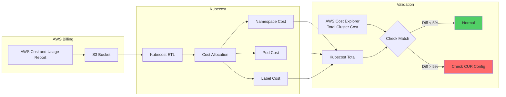

**Consistency Validation Queries:**

```bash
# Kubecost API - Total cluster cost (last 7 days)
curl "http://localhost:9090/model/allocation?window=7d&aggregate=cluster" | jq '.data[].totalCost'

# AWS CLI - Cost Explorer total cost (last 7 days)
aws ce get-cost-and-usage \
  --time-period Start=$(date -d '7 days ago' +%Y-%m-%d),End=$(date +%Y-%m-%d) \
  --granularity DAILY \
  --metrics BlendedCost \
  --filter file://eks-filter.json

# eks-filter.json:
# {
#   "Tags": {
#     "Key": "eks:cluster-name",
#     "Values": ["<cluster-name>"]
#   }
# }
```

**Identify 20-60% Cost Savings Opportunities:**

Identify optimization opportunities with the following metrics from Kubecost dashboard:

| Metric | Threshold | Expected Savings | Action |
|------|------|----------|------|
| **CPU Efficiency** | < 50% | 20-30% | Right-Sizing (VPA) |
| **Memory Efficiency** | < 60% | 15-25% | Right-Sizing (VPA) |
| **Idle Cost** | > 30% | 30-50% | HPA + Cluster Autoscaler/Karpenter |
| **Over-Provisioned Pods** | Requests utilization < 50% | 10-20% | Apply Goldilocks recommendations |
| **Spot Adoption** | < 30% | 40-60% | Migrate to Spot + Graviton |

**Leverage Kubecost Savings Insights:**

```bash
# Kubecost API - Query Savings Recommendations
curl "http://localhost:9090/model/savings" | jq '.data[] | {
  type: .savingsType,
  monthly_savings: .monthlySavings,
  resource: .resourceName
}'

# Expected output:
# {
#   "type": "rightsize-deployment",
#   "monthly_savings": 1240.50,
#   "resource": "production/web-app"
# }
# {
#   "type": "adopt-spot",
#   "monthly_savings": 3450.20,
#   "resource": "batch/worker-pool"
# }
```

#### 8.4.2 Goldilocks vs Kubecost Tool Comparison

| Item | Goldilocks | Kubecost |
|------|-----------|----------|
| **Primary Function** | VPA recommendation visualization | Full cost visibility + optimization recommendations |
| **Cost** | Free (open source) | Free (basic), Enterprise (paid) |
| **Installation Complexity** | Low (1-line Helm) | Medium (Prometheus setup required) |
| **Data Sources** | Metrics Server, VPA | Prometheus, AWS CUR, cloud billing APIs |
| **Recommendation Scope** | CPU/Memory Right-Sizing | Right-Sizing, Spot, Graviton, Idle Resource, Cluster Sizing |
| **Cost Allocation** | None | Namespace, Label, Pod, Deployment level |
| **Budget Management** | None | Budget alerts, cost trend forecasting |
| **Multi-cluster** | Independent per cluster | Unified dashboard support |
| **AWS Integration** | None | Cost Explorer, CUR, Savings Plans analysis |
| **Reporting** | Web UI only | PDF, CSV, Slack/Teams alerts |

**Recommended Scenarios:**

| Situation | Recommended Tool | Reason |
|------|----------|------|
| **Single cluster, resource optimization only** | Goldilocks | Lightweight and quick start |
| **Multi-cluster, cost chargeback** | Kubecost | Enterprise-wide cost management needed |
| **Startup, quick savings needed** | Goldilocks → Kubecost | Phased adoption |
| **Enterprise, FinOps team exists** | Kubecost Enterprise | Advanced features (budget, alerts, policies) |
| **Open source only** | Goldilocks + Prometheus | Zero cost |

**Combined Usage Pattern:**

```bash
# Quick Right-Sizing with Goldilocks
kubectl label namespace production goldilocks.fairwinds.com/enabled=true

# Track and verify total costs with Kubecost
# 1. Record cost before applying Goldilocks recommendations
curl "http://localhost:9090/model/allocation?window=7d&aggregate=namespace&accumulate=true" \
  | jq '.data[] | select(.name=="production") | .totalCost'

# 2. Apply Right-Sizing
kubectl set resources deployment web-app -n production \
  --requests=cpu=300m,memory=512Mi \
  --limits=memory=1Gi

# 3. Verify savings in Kubecost after 7 days
```

#### 8.4.3 Automated Cost Optimization Loop

The core of FinOps is **continuous cost visibility → optimization → validation loop**. Full automation is possible when combined with GitOps.

**Cost Optimization Loop Architecture:**

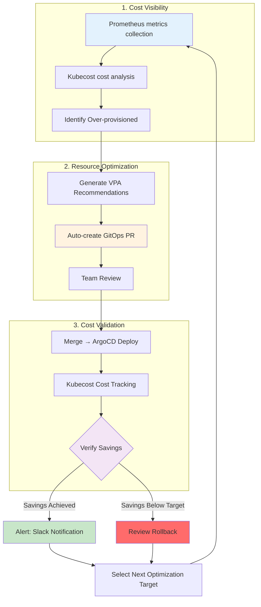

**GitOps-based Auto Right-Sizing PR Generation Pattern:**

```python
# automation/right-sizing-bot.py
import requests
import yaml
import subprocess
from datetime import datetime

# 1. Query recommendations from Kubecost API
def get_kubecost_recommendations():
    response = requests.get("http://kubecost:9090/model/savings")
    savings = response.json()["data"]
    return [s for s in savings if s["savingsType"] == "rightsize-deployment"]

# 2. Update Deployment manifest
def update_deployment(namespace, name, cpu_request, memory_request):
    file_path = f"k8s/{namespace}/{name}.yaml"
    with open(file_path, 'r') as f:
        manifest = yaml.safe_load(f)

    # Update resources
    manifest["spec"]["template"]["spec"]["containers"][0]["resources"] = {
        "requests": {
            "cpu": cpu_request,
            "memory": memory_request
        },
        "limits": {
            "memory": str(int(memory_request.rstrip('Mi')) * 1.5) + 'Mi'
        }
    }

    with open(file_path, 'w') as f:
        yaml.dump(manifest, f)

# 3. Create Git PR
def create_pr(recommendations):
    branch = f"right-sizing-{datetime.now().strftime('%Y%m%d')}"
    subprocess.run(["git", "checkout", "-b", branch])

    for rec in recommendations:
        update_deployment(
            rec["namespace"],
            rec["resourceName"],
            rec["recommendedCPU"],
            rec["recommendedMemory"]
        )
        subprocess.run(["git", "add", f"k8s/{rec['namespace']}/{rec['resourceName']}.yaml"])

    subprocess.run([
        "git", "commit", "-m",
        f"chore: apply Kubecost right-sizing (estimated savings: ${sum(r['monthlySavings'] for r in recommendations):.2f}/month)"
    ])
    subprocess.run(["git", "push", "origin", branch])

    # Create GitHub PR
    subprocess.run([
        "gh", "pr", "create",
        "--title", f"Cost Optimization: Right-Sizing Recommendations",
        "--body", f"Estimated monthly savings: ${sum(r['monthlySavings'] for r in recommendations):.2f}\n\nAuto-generated by Kubecost",
        "--label", "cost-optimization"
    ])

# Execution
if __name__ == "__main__":
    recommendations = get_kubecost_recommendations()
    if recommendations:
        create_pr(recommendations)
```

**Automation Execution (CronJob):**

```yaml
apiVersion: batch/v1
kind: CronJob
metadata:
  name: right-sizing-bot
  namespace: automation
spec:
  schedule: "0 9 * * MON"  # Every Monday at 9am
  jobTemplate:
    spec:
      template:
        spec:
          serviceAccountName: right-sizing-bot
          containers:
          - name: bot
            image: right-sizing-bot:v1
            env:
            - name: KUBECOST_URL
              value: "http://kubecost.kubecost.svc:9090"
            - name: GITHUB_TOKEN
              valueFrom:
                secretKeyRef:
                  name: github-token
                  key: token
          restartPolicy: OnFailure
```

**Prometheus + Bedrock + GitOps Automation Reference:**

AWS re:Invent 2025's [CNS421 session](https://www.youtube.com/watch?v=4s-a0jY4kSE) introduced advanced automation patterns using Amazon Bedrock and Model Context Protocol (MCP):

```python
# Advanced Pattern: AI-based Optimization Decision-making
from anthropic import Anthropic

client = Anthropic()

# Prometheus metrics collection
metrics = get_prometheus_metrics()

# Request optimization strategy from Bedrock
response = client.messages.create(
    model="claude-3-sonnet-20240229",
    max_tokens=1024,
    messages=[{
        "role": "user",
        "content": f"""
        Analyze the following Kubernetes cluster metrics and propose optimization strategy:

        {metrics}

        Include:
        1. Cost savings prioritization
        2. Risk assessment
        3. Step-by-step execution plan
        """
    }]
)

# Include AI recommendations in PR description
create_pr_with_ai_context(response.content)
```

#### 8.4.4 Graviton + Spot Cost Savings Scenarios

**Actual Cost Comparison Table (as of February 2026, us-east-1):**

| Scenario | Instance Type | vCPU | Memory | Hourly Cost | Monthly Cost (730h) | Savings |
|---------|-------------|------|--------|-----------|-----------------|--------|
| **Baseline: x86 On-Demand** | m6i.2xlarge | 8 | 32 GB | $0.384 | $280.32 | - |
| **Graviton On-Demand** | m7g.2xlarge | 8 | 32 GB | $0.3264 | $238.27 | **15%** |
| **x86 Spot** | m6i.2xlarge | 8 | 32 GB | $0.1152 (70% discount) | $84.10 | **70%** |
| **Graviton Spot** | m7g.2xlarge | 8 | 32 GB | $0.0979 (70% discount) | $71.47 | **75%** |

**Annual Cost for 100-Node Cluster:**

| Configuration | Monthly Cost | Annual Cost | Annual Savings |
|------|----------|----------|-----------|
| x86 On-Demand (100 nodes) | $28,032 | $336,384 | - |
| Graviton On-Demand (100 nodes) | $23,827 | $285,924 | $50,460 (15%) |
| x86 Spot (100 nodes) | $8,410 | $100,920 | $235,464 (70%) |
| **Graviton Spot (100 nodes)** | **$7,147** | **$85,764** | **$250,620 (75%)** ⭐ |

**Recommended Combinations by Workload Type:**

| Workload Type | Recommended Configuration | Reason | Expected Savings |
|-------------|----------|------|----------|
| **Production API (Always-on)** | Graviton On-Demand 70% + Graviton Spot 30% | Stability priority, partial Spot usage | 25-35% |
| **Batch Jobs** | Graviton Spot 100% | Interruption tolerant, cost priority | 70-75% |
| **Dev/Staging** | Graviton Spot 100% | Interruption tolerant, fast restart | 70-75% |
| **Database** | Graviton On-Demand 100% | No interruption, stability priority | 15% |
| **Queue Workers (Stateless)** | Graviton Spot 80% + Graviton On-Demand 20% | Restartable on interruption, mostly Spot | 60-65% |
| **ML Inference** | Graviton Spot 100% (GPU workloads: p4d Spot) | Interruption tolerant, high-cost instance savings | 70-75% |

**Graviton-Preferred Configuration in Karpenter NodePool YAML:**

```yaml
# Production API - Graviton preferred, Spot/On-Demand mix
apiVersion: karpenter.sh/v1beta1
kind: NodePool
metadata:
  name: production-api-pool
spec:
  template:
    spec:
      requirements:
      # Graviton preferred
      - key: kubernetes.io/arch
        operator: In
        values: ["arm64"]

      # 70% Spot, 30% On-Demand (controlled by weight)
      - key: karpenter.sh/capacity-type
        operator: In
        values: ["spot", "on-demand"]

      # General-purpose workload instance families
      - key: node.kubernetes.io/instance-type
        operator: In
        values: ["m7g.large", "m7g.xlarge", "m7g.2xlarge"]

      nodeClassRef:
        name: default

  # Auto-replace on Spot interruption
  disruption:
    consolidationPolicy: WhenUnderutilized
    expireAfter: 720h

  limits:
    cpu: "200"
    memory: "400Gi"

  weight: 100  # Highest priority

---
# Batch Jobs - Graviton Spot 100%
apiVersion: karpenter.sh/v1beta1
kind: NodePool
metadata:
  name: batch-jobs-pool
spec:
  template:
    spec:
      requirements:
      - key: kubernetes.io/arch
        operator: In
        values: ["arm64"]

      - key: karpenter.sh/capacity-type
        operator: In
        values: ["spot"]  # Spot only

      - key: node.kubernetes.io/instance-type
        operator: In
        values: ["c7g.large", "c7g.xlarge", "c7g.2xlarge", "c7g.4xlarge"]

      nodeClassRef:
        name: default

      # Taints for batch jobs
      taints:
      - key: workload-type
        value: batch
        effect: NoSchedule

  disruption:
    consolidationPolicy: WhenUnderutilized
    expireAfter: 1h  # Short lifetime for batch jobs

  limits:
    cpu: "500"

  weight: 50

---
# Database - Graviton On-Demand 100%
apiVersion: karpenter.sh/v1beta1
kind: NodePool
metadata:
  name: database-pool
spec:
  template:
    spec:
      requirements:
      - key: kubernetes.io/arch
        operator: In
        values: ["arm64"]

      - key: karpenter.sh/capacity-type
        operator: In
        values: ["on-demand"]  # On-Demand only

      # Memory-optimized instances
      - key: node.kubernetes.io/instance-type
        operator: In
        values: ["r7g.xlarge", "r7g.2xlarge", "r7g.4xlarge"]

      nodeClassRef:
        name: default

      taints:
      - key: workload-type
        value: database
        effect: NoSchedule

  disruption:
    consolidationPolicy: WhenEmpty  # Replace only when empty
    expireAfter: 2160h  # 90 days (long-running)

  limits:
    cpu: "100"
    memory: "800Gi"

  weight: 200  # Highest priority
```

**NodePool Selection in Pods:**

```yaml
# API Server - use production-api-pool
apiVersion: apps/v1
kind: Deployment
metadata:
  name: api-server
spec:
  replicas: 20
  template:
    spec:
      nodeSelector:
        karpenter.sh/nodepool: production-api-pool
      containers:
      - name: api
        image: api-server:v1-arm64  # Image for Graviton
        resources:
          requests:
            cpu: "500m"
            memory: "1Gi"

---
# Batch Job - use batch-jobs-pool
apiVersion: batch/v1
kind: CronJob
metadata:
  name: nightly-report
spec:
  schedule: "0 2 * * *"
  jobTemplate:
    spec:
      template:
        spec:
          nodeSelector:
            karpenter.sh/nodepool: batch-jobs-pool
          tolerations:
          - key: workload-type
            operator: Equal
            value: batch
            effect: NoSchedule
          containers:
          - name: report-gen
            image: report-generator:v1-arm64
            resources:
              requests:
                cpu: "2000m"
                memory: "4Gi"
          restartPolicy: OnFailure

---
# Database - use database-pool
apiVersion: apps/v1
kind: StatefulSet
metadata:
  name: postgres
spec:
  replicas: 3
  template:
    spec:
      nodeSelector:
        karpenter.sh/nodepool: database-pool
      tolerations:
      - key: workload-type
        operator: Equal
        value: database
        effect: NoSchedule
      containers:
      - name: postgres
        image: postgres:16-arm64
        resources:
          requests:
            cpu: "4000m"
            memory: "16Gi"
          limits:
            cpu: "4000m"
            memory: "16Gi"  # Guaranteed QoS
```

**Spot Interruption Response Strategy:**

```yaml
# Guarantee minimum availability with PodDisruptionBudget
apiVersion: policy/v1
kind: PodDisruptionBudget
metadata:
  name: api-server-pdb
spec:
  minAvailable: 80%  # Maintain minimum 80% Pods
  selector:
    matchLabels:
      app: api-server

---
# Handle Spot interruption 2-min advance notice (DaemonSet)
apiVersion: apps/v1
kind: DaemonSet
metadata:
  name: spot-termination-handler
spec:
  selector:
    matchLabels:
      app: spot-termination-handler
  template:
    spec:
      serviceAccountName: spot-termination-handler
      containers:
      - name: handler
        image: aws/aws-node-termination-handler:v1.21.0
        env:
        - name: ENABLE_SPOT_INTERRUPTION_DRAINING
          value: "true"
        - name: ENABLE_SCHEDULED_EVENT_DRAINING
          value: "true"
```

**Real Savings Cases (AWS Official Blog):**

| Organization | Workload | Previous Config | After Optimization | Savings |
|------|---------|----------|----------|--------|
| Fintech Startup | API servers 100 nodes | x86 On-Demand | Graviton Spot 70% + On-Demand 30% | $8,500/month (30%) |
| E-commerce Company | Batch jobs 200 nodes | x86 On-Demand | Graviton Spot 100% | $42,000/month (75%) |
| SaaS Platform | Full cluster 300 nodes | x86 mixed | Graviton 90% + Spot 60% | $65,000/month (65%) |

:::tip Graviton + Spot in Auto Mode
EKS Auto Mode **automatically prioritizes Graviton Spot instances** by analyzing Pod resource requirements without NodePool configuration like above. However, container images must support arm64 architecture.

```yaml
# Auto Mode environment - NodePool not needed
apiVersion: apps/v1
kind: Deployment
metadata:
  name: api-server
spec:
  replicas: 20
  template:
    spec:
      containers:
      - name: api
        image: api-server:v1  # multi-arch image (supports both arm64/amd64)
        resources:
          requests:
            cpu: "500m"
            memory: "1Gi"

      # Auto Mode automatically:
      # 1. Try Graviton Spot first
      # 2. Graviton On-Demand if Spot unavailable
      # 3. x86 Spot if Graviton unavailable
      # 4. x86 On-Demand as last resort
```
:::

:::info For full cost strategy, see cost-management.md
This document focuses on Pod resource optimization. For cluster-wide cost management strategy, see [EKS Cost Management Guide](/docs/infrastructure-optimization/cost-management).
:::

## Comprehensive Checklist & References

### Resource Configuration Checklist

| Item | Verification | Recommended Setting |
|------|----------|----------|
| **CPU Requests** | ✅ P95 usage + 20% | Based on VPA Target |
| **CPU Limits** | ✅ Unset for general workloads | Set only for batch jobs |
| **Memory Requests** | ✅ P95 usage + 20% | Based on VPA Target |
| **Memory Limits** | ✅ Must be set | Requests × 1.5~2 |
| **QoS Class** | ✅ Guaranteed/Burstable for production | Prohibit BestEffort |
| **VPA** | ✅ Off or Initial mode | Auto mode with caution |
| **HPA** | ✅ Behavior configuration | ScaleUp aggressive, ScaleDown conservative |
| **ResourceQuota** | ✅ Set per namespace | Differential by environment |
| **LimitRange** | ✅ Set defaults | Developer convenience |
| **PDB** | ✅ Required when using VPA Auto | minAvailable 80% |

### Related Documents

**Internal Documentation:**
- [Karpenter Autoscaling](/docs/infrastructure-optimization/karpenter-autoscaling) - Node-level scaling
- [EKS Cost Management](/docs/infrastructure-optimization/cost-management) - Full cost optimization strategy
- [EKS Resiliency Guide](/docs/operations-observability/eks-resiliency-guide) - Reliability checklist

**External References:**
- [Kubernetes Resource Management](https://kubernetes.io/docs/concepts/configuration/manage-resources-containers/)
- [Vertical Pod Autoscaler](https://github.com/kubernetes/autoscaler/tree/master/vertical-pod-autoscaler)
- [AWS EKS Best Practices - Resource Management](https://docs.aws.amazon.com/eks/latest/best-practices/reliability.html)
- [Goldilocks](https://github.com/FairwindsOps/goldilocks)

**Red Hat OpenShift Documentation:**
- [Automatically Scaling Pods with HPA](https://docs.openshift.com/container-platform/4.18/nodes/pods/nodes-pods-autoscaling.html) — HPA configuration and operations
- [Vertical Pod Autoscaler](https://docs.openshift.com/container-platform/4.18/nodes/pods/nodes-pods-vertical-autoscaler.html) — VPA mode-specific configuration and operations
- [Quotas and Limit Ranges](https://docs.openshift.com/container-platform/4.18/applications/quotas/quotas-setting-per-project.html) — ResourceQuota, LimitRange configuration
- [Using CPU Manager](https://docs.openshift.com/container-platform/4.18/scalability_and_performance/using-cpu-manager.html) — Advanced CPU resource management

---

**Feedback and Contributions**

Please submit feedback or improvement suggestions via [GitHub Issues](https://github.com/devfloor9/engineering-playbook/issues).

**Document Version**: v1.0 (2026-02-12)
**Next Review**: 2026-05-12
