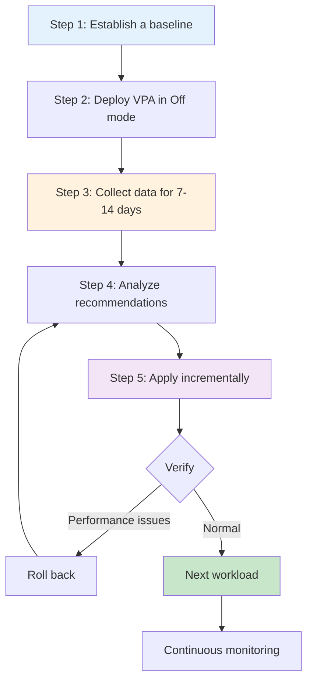

> **Baseline**: Kubernetes/EKS 1.33 APIs. Later-version features are scoped in their sections. Verify deployed versions and compatibility.

## Overview {#overview}

This guide covers CPU and memory requests/limits, QoS, VPA/HPA, and cost verification for EKS Pods. Size resources using observed demand and application SLOs. Savings depend on node removal, placement constraints, purchasing commitments, and billing scope. Cost examples below are illustrative calculations, not measured customer outcomes.

[Kubernetes resources](https://kubernetes.io/docs/concepts/configuration/manage-resources-containers/)

### Key Topics {#key-topics}

- Requests/limits and their relationship to throttling and OOM
- QoS versus node-pressure eviction
- Separating VPA recommendations from HPA control
- Usage analysis, staged rollout, and billed-cost verification

### Learning Objectives {#learning-objectives}

Explain CPU and memory settings and choose QoS and autoscaling policies for a workload. Record observation windows and sizing assumptions, then compare performance and cost before and after changes.

## Prerequisites {#prerequisites}


### Required Tools {#required-tools}

EKS/Kubernetes 1.33 is the minimum API baseline. Features introduced later are scoped in their sections. Keep kubectl within the supported minor-version skew of the API server; choose Metrics Server and controller releases from their Kubernetes compatibility matrices. Karpenter examples use the self-managed v1 NodePool API, not the Auto Mode NodeClass.

[Version skew](https://kubernetes.io/releases/version-skew-policy/) · [Metrics Server compatibility](https://github.com/kubernetes-sigs/metrics-server#compatibility-matrix)

### Required Permissions {#required-permissions}

```bash
# Check RBAC permissions
kubectl auth can-i get pods --all-namespaces
kubectl auth can-i get resourcequotas
kubectl auth can-i create verticalpodautoscaler
```

### Prior Knowledge {#prior-knowledge}

- Basic Kubernetes Pod and Deployment concepts
- Experience writing YAML manifests
- Basic understanding of Linux cgroups (recommended)
- Basic Prometheus/Grafana usage (recommended)

## Resource Requests & Limits in Depth {#resource-requests--limits-in-depth}


### 2.1 Exact Meaning of Requests vs. Limits {#21-exact-meaning-of-requests-vs-limits}

Requests are scheduling inputs compared with node allocatable capacity, not a guarantee that runtime usage is always available. CPU requests also affect CPU weights under contention. CPU limits constrain execution time and may throttle work. Memory limits are enforced reactively and excess usage can cause a container process to be OOM-killed. A memory request does not replace a limit.

[Kubernetes resources](https://kubernetes.io/docs/concepts/configuration/manage-resources-containers/)

### 2.2 CPU Resources in Depth {#22-cpu-resources-in-depth}


#### CPU Millicore Units {#cpu-millicore-units}

CPU quantities represent logical CPUs; 1000m equals one CPU. These are alternative representations, not duplicate keys in one YAML mapping.

```text
500m = 0.5 CPU
1 = 1000m
2.5 = 2500m
```

[Kubernetes resources](https://kubernetes.io/docs/concepts/configuration/manage-resources-containers/)

#### CFS Bandwidth Throttling {#cfs-bandwidth-throttling}

In cgroups v2, `cpu.max` expresses quota and period in microseconds. `50000 100000` allows an aggregate 50ms CPU budget per 100ms period. Concurrent threads can consume that budget sooner; execution need not occupy the first 50ms. Omitting CPU limits is an option for latency-sensitive services, subject to isolation, tenant policy, LimitRange, and contention.

```bash
cat /sys/fs/cgroup/cpu.max
```

[Kubernetes resources](https://kubernetes.io/docs/concepts/configuration/manage-resources-containers/)

#### CPU Resource Configuration Examples {#cpu-resource-configuration-examples}

This Burstable Pod sets a CPU request and a memory limit. Namespace policy must permit an omitted CPU limit. Quantities are examples and require validation with the selected nginx image and workload.

```yaml
apiVersion: v1
kind: Pod
metadata:
  name: web-server
spec:
  containers:
  - name: nginx
    image: nginx:stable
    resources:
      requests:
        cpu: "250m"
        memory: "128Mi"
      limits:
        memory: "256Mi"
```

### 2.3 Memory Resources in Depth {#23-memory-resources-in-depth}


#### Memory Units {#memory-units}

Mi/Gi/Ti use powers of 1024; M/G/T use powers of 1000. Lowercase `m` means milli-byte for memory and should not be used for these allocations.

```text
128Mi = 134217728 bytes
128M = 128000000 bytes
1Gi = 1073741824 bytes
1G = 1000000000 bytes
```

[Kubernetes resources](https://kubernetes.io/docs/concepts/configuration/manage-resources-containers/)

#### OOM Kill Mechanism {#oom-kill-mechanism}

Distinguish cgroup OOM caused by a memory limit from node-wide memory exhaustion. OOMKilled is a container termination reason, not a Pod phase. The kubelet restarts containers according to restartPolicy. A memory limit bounds impact but does not prevent OOM. Size for heap, native memory, caches, and startup peaks. Equal memory requests and limits alone do not give Guaranteed QoS: CPU settings for every container must also meet its conditions.

[Kubernetes resources](https://kubernetes.io/docs/concepts/configuration/manage-resources-containers/) · [Node-pressure eviction](https://kubernetes.io/docs/concepts/scheduling-eviction/node-pressure-eviction/)

#### Memory Resource Configuration Examples {#memory-resource-configuration-examples}

This resource fragment belongs in a Deployment container entry. Every regular/init container must have equal CPU requests/limits and equal memory requests/limits for Guaranteed QoS. JVM heap and Node.js old-space percentages are workload choices, not fixed recommendations. Verify that the runtime reads the configured environment variables and retain space for native memory.

```yaml
resources:
  requests:
    cpu: "2000m"
    memory: "4Gi"
  limits:
    cpu: "2000m"
    memory: "4Gi"
```

[Kubernetes resources](https://kubernetes.io/docs/concepts/configuration/manage-resources-containers/)

### 2.4 Ephemeral Storage {#24-ephemeral-storage}

Local ephemeral-storage requests affect scheduling. Writable layers, logs, and disk-backed emptyDir usage contribute to limits and eviction decisions. A tmpfs emptyDir is accounted as memory. `sizeLimit` does not reserve disk space, and node pressure may evict a Pod earlier. Merge this fragment into a Pod spec.

```yaml
containers:
- name: app
  image: busybox:stable
  command: ["sh", "-c", "sleep 3600"]
  resources:
    requests:
      ephemeral-storage: "2Gi"
    limits:
      ephemeral-storage: "4Gi"
  volumeMounts:
  - name: cache
    mountPath: /cache
volumes:
- name: cache
  emptyDir:
    sizeLimit: "4Gi"
```

[Kubernetes resources](https://kubernetes.io/docs/concepts/configuration/manage-resources-containers/)

### 2.5 EKS Auto Mode Resource Optimization {#25-eks-auto-mode-resource-optimization}

Auto Mode manages nodes and associated infrastructure. Operators remain responsible for Pod requests/limits, VPA deployment, HPA policies, and application availability.

[EKS Auto Mode](https://docs.aws.amazon.com/eks/latest/eksctl/auto-mode.html) · [EKS VPA](https://docs.aws.amazon.com/eks/latest/userguide/vertical-pod-autoscaler.html)

#### 2.5.1 Auto Mode Overview {#251-auto-mode-overview}

This is the official eksctl ClusterConfig format. Before execution, select the AWS account/region, IAM permissions, supported Kubernetes version, and VPC/subnets, following the official creation procedure. eksctl can create the default node role and NodePools. Executing this configuration creates billable infrastructure.

```yaml
apiVersion: eksctl.io/v1alpha5
kind: ClusterConfig
metadata:
  name: auto-mode-cluster
  region: us-west-2
autoModeConfig:
  enabled: true
```

```bash
eksctl create cluster -f auto-mode-cluster.yaml
```

[EKS Auto Mode](https://docs.aws.amazon.com/eks/latest/eksctl/auto-mode.html)

#### 2.5.2 Auto Mode vs. Manual Management Comparison {#252-auto-mode-vs-manual-management-comparison}

| Responsibility | Self-managed | Auto Mode |
|---|---|---|
| Node capacity | Configure Karpenter or node groups | Managed compute and NodePool constraints |
| Pod VPA | Separate installation and policy | Separate installation and policy |
| HPA | Configure metrics and policies | Configure metrics and policies |
| Updates | Operator-managed lifecycle | Managed replacement; no zero-downtime guarantee |
| CPU/memory sizing | Application owner | Application owner |

[EKS Auto Mode](https://docs.aws.amazon.com/eks/latest/eksctl/auto-mode.html)

#### 2.5.3 Optimizing the Graviton + Spot Combination {#253-optimizing-the-graviton--spot-combination}

Graviton requires arm64-compatible images and native dependencies. Measure price/performance for the instance, region, and workload. Do not convert Graviton4/5 release dates or marketing numbers into application performance guarantees. Compare throughput, P99 latency, CPU, memory, and cost per request at the same dataset, concurrency, and SLO.

This scoped example is for **self-managed Karpenter**. Install the controller and IAM integration, and configure a `default` EC2NodeClass with subnet/security-group selectors and an AMI first. Higher `weight` expresses preference among overlapping NodePools. Requirement value order provides neither priority nor a Spot percentage. Allowing Spot and On-Demand does not guarantee capacity or graceful interruption. Auto Mode cannot reuse this EC2NodeClass.

```yaml
apiVersion: karpenter.sh/v1
kind: NodePool
metadata:
  name: graviton-pool
spec:
  weight: 100
  template:
    spec:
      nodeClassRef:
        group: karpenter.k8s.aws
        kind: EC2NodeClass
        name: default
      expireAfter: 720h
      requirements:
      - key: kubernetes.io/arch
        operator: In
        values: ["arm64"]
      - key: karpenter.sh/capacity-type
        operator: In
        values: ["spot", "on-demand"]
  disruption:
    consolidationPolicy: WhenEmptyOrUnderutilized
    consolidateAfter: 1m
  limits:
    cpu: "1000"
```

[Karpenter NodePools](https://karpenter.sh/docs/concepts/nodepools/) · [EC2NodeClass](https://karpenter.sh/docs/concepts/nodeclasses/) · [Karpenter installation](https://karpenter.sh/docs/getting-started/getting-started-with-karpenter/) · [Graviton](https://aws.amazon.com/ec2/graviton/)

#### 2.5.4 Resource Configuration Recommendations for Auto Mode Environments {#254-resource-configuration-recommendations-for-auto-mode-environments}

Auto Mode uses configured requests and scheduling constraints to provision nodes. Do not assume a built-in Pod VPA/right-sizing dashboard or automatic HPA configuration. Review recommendations from a separately installed VPA in Off mode or external metrics analysis, then update through GitOps. A 7–14 day window is an initial plan for weekly patterns, not a guarantee of recommendation quality.

[EKS Auto Mode](https://docs.aws.amazon.com/eks/latest/eksctl/auto-mode.html) · [VPA 1.4.0 FAQ](https://github.com/kubernetes/autoscaler/blob/vertical-pod-autoscaler-1.4.0/vertical-pod-autoscaler/docs/faq.md)

## QoS (Quality of Service) Classes {#qos-quality-of-service-classes}


### 3.1 Three QoS Classes {#31-three-qos-classes}

Kubernetes classifies Pods into three QoS classes based on resource configuration:

#### Guaranteed {#guaranteed-highest-priority}

Every regular/init container must have matching positive CPU requests/limits and matching positive memory requests/limits. Ordinary Guaranteed containers receive oom_score_adj -997; this grants neither eviction immunity nor a CPU priority guarantee.

```yaml
apiVersion: v1
kind: Pod
metadata:
  name: guaranteed-pod
  labels:
    qos: guaranteed
spec:
  containers:
  - name: app
    image: nginx:1.25
    resources:
      requests:
        cpu: "500m"
        memory: "256Mi"
      limits:
        cpu: "500m"        # Same as requests
        memory: "256Mi"    # Same as requests
  - name: sidecar
    image: fluentd:v1
    resources:
      requests:
        cpu: "100m"
        memory: "128Mi"
      limits:
        cpu: "100m"
        memory: "128Mi"
```

[Kubernetes resources](https://kubernetes.io/docs/concepts/configuration/manage-resources-containers/) · [Node-pressure eviction](https://kubernetes.io/docs/concepts/scheduling-eviction/node-pressure-eviction/)

#### Burstable {#burstable-medium-priority}

A Pod with CPU or memory requests/limits that does not qualify as Guaranteed is Burstable. Its oom_score_adj depends on memory requests and node memory capacity, not instantaneous usage; distinguish it from the kernel oom_score.

```yaml
apiVersion: v1
kind: Pod
metadata:
  name: burstable-pod
  labels:
    qos: burstable
spec:
  containers:
  - name: app
    image: web-app:v1
    resources:
      requests:
        cpu: "250m"
        memory: "512Mi"
      limits:
        cpu: "1000m"       # Greater than requests (Burstable)
        memory: "1Gi"      # Greater than requests

  - name: cache
    image: redis:7
    resources:
      requests:
        memory: "256Mi"    # No CPU requests (Burstable)
      limits:
        memory: "512Mi"
```

[Kubernetes resources](https://kubernetes.io/docs/concepts/configuration/manage-resources-containers/) · [Node-pressure eviction](https://kubernetes.io/docs/concepts/scheduling-eviction/node-pressure-eviction/)

#### BestEffort {#besteffort-lowest-priority}

A Pod without CPU/memory requests or limits is BestEffort. Ordinary BestEffort containers receive oom_score_adj 1000. QoS alone does not determine eviction ordering for every resource.

```yaml
apiVersion: v1
kind: Pod
metadata:
  name: besteffort-pod
  labels:
    qos: besteffort
spec:
  containers:
  - name: app
    image: test-app:latest
    # resources section absent or empty
```

[Kubernetes resources](https://kubernetes.io/docs/concepts/configuration/manage-resources-containers/) · [Node-pressure eviction](https://kubernetes.io/docs/concepts/scheduling-eviction/node-pressure-eviction/)

### 3.2 QoS and Eviction Priority {#32-qos-and-eviction-priority}

For memory-pressure eviction, the kubelet considers whether usage exceeds requests, then Pod Priority, then usage relative to requests. QoS affects this indirectly but is not a fixed four-stage eviction list. Disk/inode pressure uses different considerations. Kernel OOM victim selection is separate from kubelet eviction; high priority does not grant unconditional protection.

[Node-pressure eviction](https://kubernetes.io/docs/concepts/scheduling-eviction/node-pressure-eviction/)

### 3.3 Practical QoS Strategies {#33-practical-qos-strategies}

Choose Burstable or Guaranteed for API services by balancing CPU throttling and isolation. Databases also need memory headroom, replication, and recovery. Do not assign the system-only `system-cluster-critical` PriorityClass to ordinary applications. Define application PriorityClasses and PDBs according to operational policy.

[Kubernetes resources](https://kubernetes.io/docs/concepts/configuration/manage-resources-containers/) · [Node-pressure eviction](https://kubernetes.io/docs/concepts/scheduling-eviction/node-pressure-eviction/)

## Detailed VPA (Vertical Pod Autoscaler) Guide {#detailed-vpa-vertical-pod-autoscaler-guide}


### 4.1 VPA Architecture {#41-vpa-architecture}

The recommender computes recommendations from resource-metrics API samples and stored history. The admission controller applies recommendations to new Pods; the updater resizes or evicts according to updateMode and the deployed version. Prometheus is not a required downstream stage of Metrics Server. Prometheus history integration requires separate configuration.

```text
Resource metrics API -> Recommender -> VPA status.recommendation
Optional history store -> Recommender
VPA policy + recommendation -> Admission / Updater -> Pod resources
```

[VPA 1.4.0 FAQ](https://github.com/kubernetes/autoscaler/blob/vertical-pod-autoscaler-1.4.0/vertical-pod-autoscaler/docs/faq.md)

#### 4.1.4 VPA Recommender statistical algorithm {#414-vpa-recommender-ml-algorithm-details}

This section uses the statistical recommender in VPA 1.4.0 source. It is not a general trained ML model or a predictive-performance guarantee. Verify flags and policies for the deployed release.

[VPA 1.4.0 recommender](https://github.com/kubernetes/autoscaler/blob/vertical-pod-autoscaler-1.4.0/vertical-pod-autoscaler/pkg/recommender/logic/recommender.go)

##### Exponentially-weighted Histogram {#exponentially-weighted-histogram}

Relative sample weight decays as `2 ** (-age / half_life)`: one half-life gives 0.5 and two give 0.25. VPA uses bucket histograms and resource-specific aggregation. This offline Python illustrates weighted quantiles; it does not reproduce VPA.

```python
import math

def weighted_quantile(samples, q, half_life_hours=24.0):
    # samples: (usage in millicores, nonnegative age in hours)
    if not samples or not 0 <= q <= 1 or half_life_hours <= 0:
        raise ValueError("invalid quantile input")
    if not math.isfinite(half_life_hours):
        raise ValueError("invalid half-life")
    if any(not math.isfinite(v) or not math.isfinite(age)
           or v < 0 or age < 0 for v, age in samples):
        raise ValueError("invalid sample")
    youngest = min(age for _, age in samples)
    ordered = sorted((v, 2 ** (-(age - youngest) / half_life_hours))
                     for v, age in samples)
    threshold = q * sum(w for _, w in ordered)
    cumulative = 0.0
    for value, weight in ordered:
        cumulative += weight
        if cumulative >= threshold:
            return value
    return ordered[-1][0]

assert 2 ** (-24 / 24) == 0.5
assert 2 ** (-48 / 24) == 0.25
assert weighted_quantile([(100, 0), (200, 0), (300, 0)], .5) == 200
assert weighted_quantile([(100, 0), (1000, 48)], .5) == 100
print(weighted_quantile([(100, 0), (200, 24), (400, 48)], .95))
```

[VPA decaying histogram](https://github.com/kubernetes/autoscaler/blob/vertical-pod-autoscaler-1.4.0/vertical-pod-autoscaler/pkg/recommender/util/decaying_histogram.go)

##### Calculation of the Four Recommendation Values {#calculation-of-the-four-recommendation-values}

| Status field | Meaning | Use |
|---|---|---|
| lowerBound | Lower estimator output | Update range; not a guaranteed minimum |
| target | Recommendation including margins, minima, and policy | Starting point for review |
| upperBound | Upper estimator output | Update range; not observed maximum or a limit |
| uncappedTarget | Target before minAllowed/maxAllowed | Detect clipping by policy |

VPA 1.4.0 defaults are 0.9 for CPU/memory targets, 0.5 for lower bounds, and 0.95 for upper bounds. Margins, minima, and confidence adjustments mean status values are not simply raw percentiles.

P5 means roughly 5% of samples are at or below the value, not that it suffices for 95% of the time. Target is neither a fixed P95 nor a guarantee for unseen peaks.

[VPA 1.4.0 recommender](https://github.com/kubernetes/autoscaler/blob/vertical-pod-autoscaler-1.4.0/vertical-pod-autoscaler/pkg/recommender/logic/recommender.go)

##### Confidence Multiplier: Confidence-Based Adjustment {#confidence-multiplier-confidence-based-adjustment}

VPA 1.4.0 uses history-dependent confidence multipliers for bounds. A fixed day-based 1.5/1.3/1.1 table is not the implementation. There is no universal 24-hour or seven-day minimum. Evaluate recommendations against an observation plan covering weekly/monthly load, startup, and recovery.

[VPA 1.4.0 recommender](https://github.com/kubernetes/autoscaler/blob/vertical-pod-autoscaler-1.4.0/vertical-pod-autoscaler/pkg/recommender/logic/recommender.go) · [VPA 1.4.0 FAQ](https://github.com/kubernetes/autoscaler/blob/vertical-pod-autoscaler-1.4.0/vertical-pod-autoscaler/docs/faq.md)

##### Memory Recommendations: OOM Event-Based Bump-Up {#memory-recommendations-oom-event-based-bump-up}

An observed OOM can add an adjusted sample to memory history. Verify OOM-bump flags and memory-peak aggregation in the deployed release. There is no universal rule that target immediately rises by 20% or is capped at twice its previous value. Investigate the cause and termination history; a subsequent recommendation update does not guarantee recovery.

[VPA 1.4.0 recommender](https://github.com/kubernetes/autoscaler/blob/vertical-pod-autoscaler-1.4.0/vertical-pod-autoscaler/pkg/recommender/logic/recommender.go) · [VPA 1.4.0 FAQ](https://github.com/kubernetes/autoscaler/blob/vertical-pod-autoscaler-1.4.0/vertical-pod-autoscaler/docs/faq.md)

##### CPU recommendations and throttling interpretation {#cpu-recommendations-based-on-p95p99-usage}

CPU recommendations depend on usage histograms, configured percentiles, margins, and minima. Throttling can hide unmet demand, so observed usage alone does not establish sufficiency. Select HPA, limit adjustments, or profiling based on latency, queue backlog, and CPU contention together.

[VPA 1.4.0 recommender](https://github.com/kubernetes/autoscaler/blob/vertical-pod-autoscaler-1.4.0/vertical-pod-autoscaler/pkg/recommender/logic/recommender.go)

##### VPA and Prometheus Data Source Integration {#vpa-and-prometheus-data-source-integration}

The resource metrics API is VPA’s default live input. The VPA 1.4.0 Prometheus history provider is configured with real recommender command-line flags such as `--storage=prometheus` and `--prometheus-address`. Merge them with existing Deployment args and verify the labels and retention required by that release’s history queries. An arbitrary ConfigMap or `PROMETHEUS_ADDRESS`/`USE_CUSTOM_METRICS` environment variables do not enable it. Prometheus Adapter’s Custom Metrics API serves HPA and is separate from VPA history integration.

```text
Recommender arguments to merge into the installed Deployment:
--storage=prometheus
--prometheus-address=http://prometheus-server.monitoring.svc:9090

Verify: endpoint connectivity, scrape labels, history queries,
existing recommender arguments, RBAC, and observed recommendations.
```

[VPA 1.4.0 flags](https://github.com/kubernetes/autoscaler/blob/vertical-pod-autoscaler-1.4.0/vertical-pod-autoscaler/pkg/recommender/main.go) · [VPA 1.4.0 FAQ](https://github.com/kubernetes/autoscaler/blob/vertical-pod-autoscaler-1.4.0/vertical-pod-autoscaler/docs/faq.md)

##### Validating VPA Recommendation Quality {#validating-vpa-recommendation-quality}

These queries require cAdvisor and kube-state-metrics collection in Prometheus. Remove duplicate scrapes and preserve cluster/namespace/pod/container identity. Apply rate to the CPU counter first; the result is in cores. Memory is in bytes. Read VPA targets separately from CR status and compare the same container and units. VPA target metrics do not appear automatically without a custom-resource exporter.

The OOM query shows **containers whose last termination reason was OOMKilled**, not an event count over a period. Count events from retained event/runtime logs when exact totals are required. Throttling is the proportion of CFS periods throttled, not a CPU-time percentage. Choose thresholds with SLOs.

```promql
quantile_over_time(0.95,
  rate(container_cpu_usage_seconds_total{namespace="production",container!="",container!="POD"}[5m])[7d:5m]
)
```

```promql
quantile_over_time(0.99,
  container_memory_working_set_bytes{namespace="production",container!="",container!="POD"}[7d]
)
```

```promql
kube_pod_container_status_last_terminated_reason{namespace="production",reason="OOMKilled"} == 1
```

```promql
100 *
rate(container_cpu_cfs_throttled_periods_total{namespace="production",container!="",container!="POD"}[5m])
/
rate(container_cpu_cfs_periods_total{namespace="production",container!="",container!="POD"}[5m])
```

[PromQL functions](https://prometheus.io/docs/prometheus/latest/querying/functions/) · [cAdvisor metric definitions](https://github.com/google/cadvisor/blob/master/docs/storage/prometheus.md) · [Pod metrics](https://github.com/kubernetes/kube-state-metrics/blob/main/docs/metrics/workload/pod-metrics.md)

### 4.2 VPA Installation and Configuration {#42-vpa-installation-and-configuration}


#### Installation with Helm {#installation-with-helm}

For Helm installation, pin the VPA chart and controller image versions and review rendered CRDs, RBAC, and webhook configuration. First verify Metrics Server compatibility and resource API access. These commands inspect an existing installation. Do not combine an arbitrary latest manifest with an independent Helm installation.

```bash
kubectl get deployment metrics-server -n kube-system
kubectl top nodes
kubectl get crd verticalpodautoscalers.autoscaling.k8s.io
```

[EKS VPA installation](https://docs.aws.amazon.com/eks/latest/userguide/vertical-pod-autoscaler.html) · [Fairwinds VPA chart](https://github.com/FairwindsOps/charts/tree/master/stable/vpa)

#### Manual Installation (Official Method) {#manual-installation-official-method}

Use the official installation procedure, check out a compatible release, and verify prerequisites, CRDs/RBAC, admission certificates, and image versions before running `hack/vpa-up.sh`. Auto Mode also requires a separate VPA installation. The algorithm reference version 1.4.0 is not a deployment endorsement for every EKS release.

[EKS VPA installation](https://docs.aws.amazon.com/eks/latest/userguide/vertical-pod-autoscaler.html) · [VPA 1.4.0 FAQ](https://github.com/kubernetes/autoscaler/blob/vertical-pod-autoscaler-1.4.0/vertical-pod-autoscaler/docs/faq.md)

### 4.3 VPA Modes {#43-vpa-modes}

Off and Initial support recommendation observation and new-Pod admission as below. Check Recreate and InPlaceOrRecreate support against the installed VPA version and Kubernetes features. The name Auto does not imply uninterrupted operation.

[VPA 1.4.0 FAQ](https://github.com/kubernetes/autoscaler/blob/vertical-pod-autoscaler-1.4.0/vertical-pod-autoscaler/docs/faq.md)

#### Off Mode (Recommendations Only) {#off-mode-recommendations-only}

Off writes recommendations to status without automatically changing resources on running or new Pods. This VPA observes an existing production/web-app Deployment. Read actual values from status.

```yaml
apiVersion: autoscaling.k8s.io/v1
kind: VerticalPodAutoscaler
metadata:
  name: web-app-vpa
  namespace: production
spec:
  targetRef:
    apiVersion: apps/v1
    kind: Deployment
    name: web-app
  updatePolicy:
    updateMode: "Off"
```

```bash
kubectl get vpa web-app-vpa -n production -o yaml
```

[VPA 1.4.0 FAQ](https://github.com/kubernetes/autoscaler/blob/vertical-pod-autoscaler-1.4.0/vertical-pod-autoscaler/docs/faq.md)

#### Initial Mode (Applied Only at Pod Creation) {#initial-mode-applied-only-at-pod-creation}

```yaml
apiVersion: autoscaling.k8s.io/v1
kind: VerticalPodAutoscaler
metadata:
  name: batch-worker-vpa
  namespace: batch
spec:
  targetRef:
    apiVersion: apps/v1
    kind: Deployment
    name: batch-worker
  updatePolicy:
    updateMode: "Initial"    # Set resources only when a Pod is created
  resourcePolicy:
    containerPolicies:
    - containerName: worker
      minAllowed:
        cpu: "100m"
        memory: "128Mi"
      maxAllowed:
        cpu: "4000m"
        memory: "16Gi"
```

**Usage scenarios:**
- CronJob and Job workloads
- StatefulSets where restarts are not allowed
- When manual scaling is desired

**How it works:**
1. A new Pod creation request is submitted
2. VPA Admission Controller injects recommended resources
3. Existing running Pods remain unchanged

#### Auto mode and explicit update policies {#auto-mode-fully-automated}

In VPA 1.4.0, Auto currently behaves like Recreate. Select Recreate explicitly when recreation is intended. `minReplicas` is the minimum replica count before the updater considers eviction, not a guarantee of that many available Pods. Merge this fragment into a VPA spec and separately verify PDBs, readiness, and spare capacity.

```yaml
updatePolicy:
  updateMode: Recreate
  minReplicas: 2
```

[VPA 1.4.0 FAQ](https://github.com/kubernetes/autoscaler/blob/vertical-pod-autoscaler-1.4.0/vertical-pod-autoscaler/docs/faq.md)

### 4.4 VPA + HPA Coexistence Strategies {#44-vpa--hpa-coexistence-strategies}

Conflicts must be prevented when using VPA and HPA together.

#### Conflict Scenario (❌ Prohibited) {#conflict-scenario--prohibited}

CPU-utilization HPA divides usage by requests. If VPA changes those CPU requests, the denominator changes and the control loops interact. An infinite loop is not inevitable, but the combination needs stability testing under load. Use Off or resource/metric separation as described below.

[VPA 1.4.0 FAQ](https://github.com/kubernetes/autoscaler/blob/vertical-pod-autoscaler-1.4.0/vertical-pod-autoscaler/docs/faq.md)

#### Pattern 1: VPA Off + HPA (✅ Recommended) {#pattern-1-vpa-off--hpa--recommended}

```yaml
# ✅ Correct configuration: VPA only recommends; HPA handles scaling
---
apiVersion: autoscaling.k8s.io/v1
kind: VerticalPodAutoscaler
metadata:
  name: web-vpa
  namespace: production
spec:
  targetRef:
    apiVersion: apps/v1
    kind: Deployment
    name: web-app
  updatePolicy:
    updateMode: "Off"    # ✅ Provide recommendations only
  resourcePolicy:
    containerPolicies:
    - containerName: app
      controlledResources:
      - cpu
      - memory

---
apiVersion: autoscaling/v2
kind: HorizontalPodAutoscaler
metadata:
  name: web-hpa
  namespace: production
spec:
  scaleTargetRef:
    apiVersion: apps/v1
    kind: Deployment
    name: web-app
  minReplicas: 3
  maxReplicas: 50
  metrics:
  - type: Resource
    resource:
      name: cpu
      target:
        type: Utilization
        averageUtilization: 70
  behavior:
    scaleUp:
      stabilizationWindowSeconds: 0
      policies:
      - type: Percent
        value: 100
        periodSeconds: 15
    scaleDown:
      stabilizationWindowSeconds: 300
      policies:
      - type: Percent
        value: 10
        periodSeconds: 60
```

**Operational workflow:**
1. VPA generates recommendations
2. Check VPA recommendations in a weekly review
3. Manually incorporate them into Deployment manifests
4. HPA scales horizontally according to load

#### Pattern 2: VPA Memory + HPA CPU (✅ Recommended) {#pattern-2-vpa-memory--hpa-cpu--recommended}

```yaml
# ✅ Separate metrics: Memory for VPA, CPU for HPA
---
apiVersion: autoscaling.k8s.io/v1
kind: VerticalPodAutoscaler
metadata:
  name: api-vpa
  namespace: production
spec:
  targetRef:
    apiVersion: apps/v1
    kind: Deployment
    name: api-server
  updatePolicy:
    updateMode: "Recreate"    # Automatically adjust Memory only
  resourcePolicy:
    containerPolicies:
    - containerName: api
      controlledResources:
      - memory            # ✅ Control Memory only
      minAllowed:
        memory: "256Mi"
      maxAllowed:
        memory: "8Gi"

---
apiVersion: autoscaling/v2
kind: HorizontalPodAutoscaler
metadata:
  name: api-hpa
  namespace: production
spec:
  scaleTargetRef:
    apiVersion: apps/v1
    kind: Deployment
    name: api-server
  minReplicas: 5
  maxReplicas: 100
  metrics:
  - type: Resource
    resource:
      name: cpu          # ✅ Use CPU metrics only
      target:
        type: Utilization
        averageUtilization: 60
```

**Benefits:**
- VPA optimizes Memory (Vertical)
- HPA scales horizontally according to load (Horizontal)
- Reduces direct CPU-request denominator interaction; validate indirect memory/performance effects

#### Pattern 3: VPA + HPA + Custom Metrics (✅ Advanced) {#pattern-3-vpa--hpa--custom-metrics--advanced}

```yaml
# ✅ HPA uses custom metrics
---
apiVersion: autoscaling.k8s.io/v1
kind: VerticalPodAutoscaler
metadata:
  name: worker-vpa
spec:
  targetRef:
    apiVersion: apps/v1
    kind: Deployment
    name: queue-worker
  updatePolicy:
    updateMode: "Recreate"
  resourcePolicy:
    containerPolicies:
    - containerName: worker
      controlledResources:
      - cpu
      - memory

---
apiVersion: autoscaling/v2
kind: HorizontalPodAutoscaler
metadata:
  name: worker-hpa
spec:
  scaleTargetRef:
    apiVersion: apps/v1
    kind: Deployment
    name: queue-worker
  minReplicas: 2
  maxReplicas: 50
  metrics:
  - type: External
    external:
      metric:
        name: sqs_queue_depth    # ✅ Custom metric (not CPU/Memory)
        selector:
          matchLabels:
            queue: "tasks"
      target:
        type: AverageValue
        averageValue: "30"
```

**Use cases:**
- Queue-based workloads (SQS, RabbitMQ, Kafka)
- Event-driven architectures
- Scaling based on business metrics

External/custom metrics require a separately configured adapter and actual metric mapping. These names do not automatically expose AWS metrics.

### 4.5 VPA Limitations and Considerations {#45-vpa-limitations-and-considerations}

In-place Pod resize is beta in Kubernetes 1.33 and stable in 1.35. VPA integration has separate version requirements. VPA 1.4.0 InPlaceOrRecreate requires its feature gate on admission/updater and cluster resize support; it can attempt an in-place resize and fall back to eviction where necessary. Check resizePolicy, node headroom, QoS restrictions, and runtime support; not every change is restart-free.

JVM heap settings may remain fixed after startup rather than recalculating after a limit change. StatefulSets need availability and storage-recovery review. Choose observation windows covering workload cycles and check collection failures and missing data.

[In-place resize](https://kubernetes.io/docs/tasks/configure-pod-container/resize-container-resources/) · [VPA 1.4.0 FAQ](https://github.com/kubernetes/autoscaler/blob/vertical-pod-autoscaler-1.4.0/vertical-pod-autoscaler/docs/faq.md)

## Advanced HPA Patterns {#advanced-hpa-patterns}


### 5.1 HPA Behavior Configuration {#51-hpa-behavior-configuration}

HPA v2 provides fine-grained control over scaling behavior:

```yaml
apiVersion: autoscaling/v2
kind: HorizontalPodAutoscaler
metadata:
  name: advanced-hpa
  namespace: production
spec:
  scaleTargetRef:
    apiVersion: apps/v1
    kind: Deployment
    name: web-app
  minReplicas: 5
  maxReplicas: 100

  metrics:
  - type: Resource
    resource:
      name: cpu
      target:
        type: Utilization
        averageUtilization: 70

  behavior:
    scaleUp:
      stabilizationWindowSeconds: 0    # Scale up immediately
      policies:
      - type: Percent
        value: 100                     # Allow a 100% increase (2x)
        periodSeconds: 15              # Limit changes over 15 seconds
      - type: Pods
        value: 10                      # Or add 10 Pods
        periodSeconds: 15
      selectPolicy: Max                # Select the larger value

    scaleDown:
      stabilizationWindowSeconds: 300  # 5-minute stabilization (prevent abrupt reductions)
      policies:
      - type: Percent
        value: 10                      # 10% decrease
        periodSeconds: 60              # Limit changes over 60 seconds
      - type: Pods
        value: 5                       # Or remove 5 Pods
        periodSeconds: 60
      selectPolicy: Min                # Select the smaller value (conservative)
```

**Parameter descriptions:**

| Parameter | Description | Recommended value |
|---------|------|--------|
| `stabilizationWindowSeconds` | Wait time for metric stabilization | ScaleUp: 0-30s, ScaleDown: 300-600s |
| `type: Percent` | Increase/decrease as a % of current replicas | ScaleUp: 100%, ScaleDown: 10-25% |
| `type: Pods` | Increase/decrease by an absolute Pod count | Adjust based on workload size |
| `periodSeconds` | Lookback window for scaling changes | 15-60 seconds |
| `selectPolicy` | Max (aggressive), Min (conservative), Disabled | ScaleUp: Max, ScaleDown: Min |

:::info See karpenter-autoscaling.md
For the complete architecture combining HPA and Karpenter, see the [Karpenter Autoscaling Guide](./karpenter-autoscaling.md).
:::


`periodSeconds` is not the HPA reconciliation interval. Metric collection latency and controller synchronization also affect response time.

### 5.2 Custom Metric-Based HPA {#52-custom-metric-based-hpa}


#### Using Prometheus Adapter {#using-prometheus-adapter}

```bash
# Install Prometheus Adapter
helm repo add prometheus-community https://prometheus-community.github.io/helm-charts
helm repo update

helm install prometheus-adapter prometheus-community/prometheus-adapter \
  --namespace monitoring \
  --set prometheus.url=http://prometheus-server.monitoring.svc \
  --set prometheus.port=80
```

**Custom metric configuration:**

```yaml
# values.yaml for prometheus-adapter
rules:
  default: false
  custom:
  - seriesQuery: 'http_requests_total{namespace!="",pod!=""}'
    resources:
      overrides:
        namespace: {resource: "namespace"}
        pod: {resource: "pod"}
    name:
      matches: "^(.*)_total$"
      as: "${1}_per_second"
    metricsQuery: 'sum(rate(<<.Series>>{<<.LabelMatchers>>}[2m])) by (<<.GroupBy>>)'
```

**HPA configuration:**

```yaml
apiVersion: autoscaling/v2
kind: HorizontalPodAutoscaler
metadata:
  name: custom-metric-hpa
spec:
  scaleTargetRef:
    apiVersion: apps/v1
    kind: Deployment
    name: api-server
  minReplicas: 3
  maxReplicas: 50
  metrics:
  - type: Pods
    pods:
      metric:
        name: http_requests_per_second
      target:
        type: AverageValue
        averageValue: "1000"    # 1000 req/s per Pod
```

#### KEDA ScaledObject {#keda-scaledobject}

```bash
# Install KEDA
helm repo add kedacore https://kedacore.github.io/charts
helm install keda kedacore/keda --namespace keda --create-namespace
```

```yaml
apiVersion: keda.sh/v1alpha1
kind: ScaledObject
metadata:
  name: prometheus-scaledobject
spec:
  scaleTargetRef:
    name: api-server
  minReplicaCount: 2
  maxReplicaCount: 100
  triggers:
  - type: prometheus
    metadata:
      serverAddress: http://prometheus-server.monitoring.svc:80
      metricName: http_requests_per_second
      threshold: "1000"
      query: sum(rate(http_requests_total{app="api-server"}[2m]))
```

### 5.3 Multi-Metric HPA {#53-multi-metric-hpa}

Combine multiple metrics for scaling:

```yaml
apiVersion: autoscaling/v2
kind: HorizontalPodAutoscaler
metadata:
  name: multi-metric-hpa
  namespace: production
spec:
  scaleTargetRef:
    apiVersion: apps/v1
    kind: Deployment
    name: web-app
  minReplicas: 5
  maxReplicas: 100

  metrics:
  # 1. CPU metric
  - type: Resource
    resource:
      name: cpu
      target:
        type: Utilization
        averageUtilization: 70

  # 2. Memory metric
  - type: Resource
    resource:
      name: memory
      target:
        type: Utilization
        averageUtilization: 80

  # 3. Custom metric - RPS
  - type: Pods
    pods:
      metric:
        name: http_requests_per_second
      target:
        type: AverageValue
        averageValue: "1000"

  behavior:
    scaleUp:
      stabilizationWindowSeconds: 0
      policies:
      - type: Percent
        value: 50
        periodSeconds: 15
    scaleDown:
      stabilizationWindowSeconds: 300
      policies:
      - type: Percent
        value: 10
        periodSeconds: 60
```

**Multi-metric evaluation:**
- HPA **evaluates each metric independently**
- Selects the **highest replica count** (conservative approach)
- Example: CPU requires 10, Memory requires 15, RPS requires 20 → **Select 20**


`http_requests_per_second` requires the preceding Prometheus Adapter mapping. Metric retrieval failures can prevent scale-down.

## Node Readiness Controller and Resource Optimization {#node-readiness-controller-and-resource-optimization}


### 5.3 Resource Waste on Nodes That Are Not Ready {#53-resource-waste-on-nodes-that-are-not-ready}

Node Ready does not mean every application dependency is ready. CSI, device plugins, or custom bootstrap dependencies can delay Pod startup. Restarts do not always redownload images; inspect caching, pull policy, and failure causes. Karpenter tracks capacity being prepared, but further provisioning depends on scheduling constraints and configuration.

[Node Readiness Controller](https://kubernetes.io/blog/2026/02/03/introducing-node-readiness-controller/) · [Karpenter NodePools](https://karpenter.sh/docs/concepts/nodepools/)

### 5.4 Node Readiness Controller (NRC) Overview {#54-node-readiness-controller-nrc-overview}

NRC, introduced in February 2026, is a separately installed out-of-tree controller. It manages readiness taints based on NodeReadinessRule conditions. It does not replace kubelet Ready or speed kubelet startup by skipping all DaemonSets. An implemented component must publish every Node condition referenced by a rule.

[Node Readiness Controller](https://kubernetes.io/blog/2026/02/03/introducing-node-readiness-controller/) · [NRC repository](https://github.com/kubernetes-sigs/node-readiness-controller)

### 5.5 Optimization with Karpenter Integration {#55-optimization-with-karpenter-integration}

Integration requires matching NodePool startupTaints to NRC-managed taint keys/values/effects and defining when condition publishers report True/False. Without a controller to remove a startup taint, ordinary Pods keep waiting. Do not assume CNI/CSI/GPU readiness condition names are automatically published standards. This is a conceptual implementation flow.

```text
NodePool startup taint -> new Node
Dependency agent publishes verified Node conditions
NRC evaluates a release-valid NodeReadinessRule
NRC removes matching readiness taint -> eligible Pods schedule
```

[Node Readiness Controller](https://kubernetes.io/blog/2026/02/03/introducing-node-readiness-controller/) · [Karpenter NodePools](https://karpenter.sh/docs/concepts/nodepools/)

### 5.6 Resource Efficiency Improvements {#56-resource-efficiency-improvements}

Measure effects using actual bootstrap intervals and failure logs. Provisioning events and concurrently running node counts have different units. **Illustrative assumptions:** three unnecessary launches per hour, ten-minute lifetime each, 720 hours, and $0.384 per node-hour produce 360 node-hours costing $138.24. At 0.5 launches per hour, this becomes 60 node-hours costing $23.04, a $115.20 difference. Image transfer charges are excluded without evidence of transfer paths, caching, and billed line items.

```python
before_hours = 3 * (10 / 60) * 720
after_hours = 0.5 * (10 / 60) * 720
assert before_hours == 360
assert after_hours == 60
assert round((before_hours - after_hours) * 0.384, 2) == 115.20
```

### 5.7 Practical Implementation Guide {#57-practical-implementation-guide}


#### Step 1: Deploy NRC and inspect its API {#step-1-enable-the-feature-gate}

NRC is not enabled by a Karpenter feature gate. Follow the NRC repository installation procedure and pin the release, CRD, RBAC, and controller together. Validate them on the target EKS release in a separate environment first.

[NRC installation](https://github.com/kubernetes-sigs/node-readiness-controller#installation)

#### Step 2: Apply NodeReadinessRule {#step-2-apply-nodereadinessrule}

Use the installed release’s NodeReadinessRule schema and examples. Review node selectors, conditions actually published, taints, and enforcement mode for each rule. Do not apply a manifest that assumes EBS/VPC CNI/NVIDIA components publish invented conditions. The following is an integration contract, not an API object.

```text
For each selected node class:
- Producer: installed dependency-health agent
- Signal: documented Node condition emitted by that agent
- Rule: matching condition/status in the installed NRC CRD
- Taint: exact match with NodePool startupTaints
- Failure: retain taint, expose reason, alert owner
- Recovery: validate dependencies before releasing the taint
```

[Node Readiness Controller](https://kubernetes.io/blog/2026/02/03/introducing-node-readiness-controller/)

#### Step 3: Monitor Node Conditions {#step-3-monitor-node-conditions}

Inspect both the conditions used by rules and taint transitions. Node Ready and readiness taints are distinct state.

```bash
kubectl get nodes -o json | jq '.items[] | {name: .metadata.name, conditions: .status.conditions, taints: .spec.taints}'
```

[Node Readiness Controller](https://kubernetes.io/blog/2026/02/03/introducing-node-readiness-controller/)

#### Step 4: Optimize Karpenter NodePool {#step-4-optimize-karpenter-nodepool}

Use this NodePool spec fragment **only after implementing an NRC rule and condition publisher that remove the same taint**. The taint name is illustrative and must match the installed rule exactly. Kubelet configuration belongs in EC2NodeClass; `systemReserved` is not a bootstrap timeout. A GPU device plugin must register allocatable GPUs before GPU-requesting Pods can schedule. NRC is not mandatory for every GPU node.

```yaml
template:
  spec:
    nodeClassRef:
      group: karpenter.k8s.aws
      kind: EC2NodeClass
      name: default
    startupTaints:
    - key: readiness.k8s.io/dependencies-not-ready
      value: "true"
      effect: NoSchedule
```

[Karpenter NodePools](https://karpenter.sh/docs/concepts/nodepools/) · [EC2NodeClass](https://karpenter.sh/docs/concepts/nodeclasses/) · [Node Readiness Controller](https://kubernetes.io/blog/2026/02/03/introducing-node-readiness-controller/)

### 5.8 Troubleshooting and Monitoring {#58-troubleshooting-and-monitoring}


#### Common Issues {#common-issues}

Inspect rule status, actual condition publishers, NRC controller logs, and dependency DaemonSets. Karpenter logs are not NRC logs. Manual taint removal bypasses readiness checks and belongs only in a controlled recovery procedure after resolving the cause.

```bash
kubectl get nodes
kubectl get events --all-namespaces --field-selector involvedObject.kind=Node
kubectl get daemonsets --all-namespaces
```

[Node Readiness Controller](https://kubernetes.io/blog/2026/02/03/introducing-node-readiness-controller/)

#### Prometheus Metrics {#prometheus-metrics}

Inspect the installed NRC release’s metrics endpoint and actual Service labels/port before writing a ServiceMonitor. Prometheus Operator CRDs and a matching Service selector are required. Do not invent `node_readiness_controller_*` metric names or target the Karpenter Service. Observe taint duration, rule errors, condition changes, and bootstrap failures.

[NRC source](https://github.com/kubernetes-sigs/node-readiness-controller)

## Right-Sizing Methodology {#right-sizing-methodology}


### 6.1 Analyzing Current Resource Usage {#61-analyzing-current-resource-usage}


#### Using kubectl top {#using-kubectl-top}

```bash
# Resource usage by node
kubectl top nodes

# Pod resource usage by namespace
kubectl top pods -n production --sort-by=cpu
kubectl top pods -n production --sort-by=memory

# Usage by container in a specific Pod
kubectl top pods <pod-name> --containers -n production
```

#### Querying the Metrics Server API Directly {#querying-the-metrics-server-api-directly}

```bash
# CPU usage
kubectl get --raw /apis/metrics.k8s.io/v1beta1/namespaces/production/pods | jq '.items[] | {name: .metadata.name, cpu: .containers[0].usage.cpu}'

# Memory usage
kubectl get --raw /apis/metrics.k8s.io/v1beta1/namespaces/production/pods | jq '.items[] | {name: .metadata.name, memory: .containers[0].usage.memory}'
```

#### Container Insights (AWS) {#container-insights-aws}

Run this CloudWatch Logs Insights query against the performance log group. `pod_cpu_utilization` is relative to node CPU capacity, not the Pod request. Verify the aggregation scope of `PodName` and identity across Pod replacements.

```text
fields @timestamp, PodName, pod_cpu_utilization, pod_memory_utilization
| filter Type = "Pod" and Namespace = "production"
| stats avg(pod_cpu_utilization) as avg_cpu,
        max(pod_memory_utilization) as max_memory by PodName
| sort avg_cpu desc
```

[Enhanced Container Insights metrics](https://docs.aws.amazon.com/AmazonCloudWatch/latest/monitoring/Container-Insights-metrics-enhanced-EKS.html)

#### 6.1.5 Automated Analysis with CloudWatch Observability Operator {#615-automated-analysis-with-cloudwatch-observability-operator}

Before installing the CloudWatch Observability add-on, configure Kubernetes/add-on compatibility, EKS Pod Identity or IRSA and agent permissions, and log collection/retention. Hierarchical Enhanced Container Insights metrics, CloudWatch anomaly detection, Application Signals, and EKS Network Observability are distinct capabilities. Do not assume control-plane logs contain Prometheus counter fields.

For mean API latency, divide the rate of the sum counter by the rate of the count counter in Prometheus where these apiserver metrics are actually collected. The result is seconds; P95 requires a separate histogram-bucket query.

Waste candidates include (1) excessive requests, (2) PDBs blocking drain, and (3) unnecessarily narrow placement constraints. Low request utilization alone does not establish waste. Review availability before relaxing PDBs, and check whether affinity encodes security, licensing, or topology constraints. The Running Pod query below counts actual Pods, not allocatable Pod slots.

```promql
sum(rate(apiserver_request_duration_seconds_sum{verb!="WATCH"}[5m]))
/
sum(rate(apiserver_request_duration_seconds_count{verb!="WATCH"}[5m]))
```

```promql
100 * sum by (namespace, pod) (
  rate(container_cpu_usage_seconds_total{namespace="production",container!="",container!="POD"}[5m])
) / sum by (namespace, pod) (
  kube_pod_container_resource_requests{namespace="production",resource="cpu",unit="core"}
)
```

```bash
kubectl get pods --all-namespaces --field-selector=status.phase=Running -o json | jq '[.items[] | select(.spec.nodeName != null)] | group_by(.spec.nodeName) | map({node: .[0].spec.nodeName, runningPods: length})'
```

[CloudWatch add-on installation](https://docs.aws.amazon.com/AmazonCloudWatch/latest/monitoring/install-CloudWatch-Observability-EKS-addon.html) · [Enhanced Container Insights metrics](https://docs.aws.amazon.com/AmazonCloudWatch/latest/monitoring/Container-Insights-metrics-enhanced-EKS.html) · [PromQL functions](https://prometheus.io/docs/prometheus/latest/querying/functions/)

#### Prometheus Queries {#prometheus-queries}

Calculate CPU percentiles after rate. These yield per-container P95 CPU cores and P99 memory bytes. Join current resources using namespace/pod/container identity and do not sum multiple replicas into a single-container estimate. Check duplicate scrapes and time-series gaps caused by restarts or Pod replacements.

```promql
quantile_over_time(0.95,
  rate(container_cpu_usage_seconds_total{namespace="production",container!="",container!="POD"}[5m])[7d:5m]
)
```

```promql
quantile_over_time(0.99,
  container_memory_working_set_bytes{namespace="production",container!="",container!="POD"}[7d]
)
```

[PromQL functions](https://prometheus.io/docs/prometheus/latest/querying/functions/)

### 6.2 Review VPA recommendations with Goldilocks {#62-automatic-right-sizing-with-goldilocks}

Goldilocks provides a dashboard based on VPA Recommender.

#### Installation {#installation}

Goldilocks requires a separately installed VPA recommender, its CRDs, and the resource metrics API. The following procedure reviews and installs chart **11.1.0** (Goldilocks **v4.16.1**) with the controller and dashboard enabled. Keep the dashboard as ClusterIP and use port forwarding. Wait for both Deployments before enabling namespaces.

```bash
helm repo add fairwinds-stable https://charts.fairwinds.com/stable
helm repo update fairwinds-stable
helm show values fairwinds-stable/goldilocks --version 11.1.0
helm install goldilocks fairwinds-stable/goldilocks \
  --version 11.1.0 \
  --namespace goldilocks --create-namespace \
  --set dashboard.service.type=ClusterIP
kubectl rollout status -n goldilocks deployment/goldilocks-controller
kubectl rollout status -n goldilocks deployment/goldilocks-dashboard
```

[Goldilocks installation](https://github.com/FairwindsOps/goldilocks/blob/master/docs/installation.md)

#### Enabling Namespaces {#enabling-namespaces}

```bash
# Add labels to namespaces
kubectl label namespace production goldilocks.fairwinds.com/enabled=true
kubectl label namespace staging goldilocks.fairwinds.com/enabled=true

# Goldilocks automatically creates VPAs (Off mode)
kubectl get vpa -n production
```

#### Accessing the Dashboard {#accessing-the-dashboard}

```bash
# Check the dashboard URL
kubectl get svc -n goldilocks goldilocks-dashboard

# Port forwarding
kubectl port-forward -n goldilocks svc/goldilocks-dashboard 8080:80

# Open http://localhost:8080 in a browser
```

**Dashboard features:**
- Resource recommendations by namespace
- Display VPA Lower Bound, Target, and Upper Bound
- Compare current settings with recommended values
- Display QoS classes

### 6.3 Using Container Insights Enhanced Anomaly Detection {#63-using-container-insights-enhanced-anomaly-detection}

Enhanced Container Insights provides detailed metrics and hierarchical navigation. Configure anomaly detection models, alarms, and SNS or other notification integrations separately. A graph alone cannot establish the cause of a memory leak.

[Enhanced Container Insights metrics](https://docs.aws.amazon.com/AmazonCloudWatch/latest/monitoring/Container-Insights-metrics-enhanced-EKS.html) · [CloudWatch anomaly detection](https://docs.aws.amazon.com/AmazonCloudWatch/latest/monitoring/CloudWatch_Anomaly_Detection.html)

#### 6.3.1 Container Insights Enhanced Overview {#631-container-insights-enhanced-overview}

Complete IAM, agent deployment, and version compatibility using the official Observability add-on procedure first. This scoped JSON configures enhanced collection under `agent.config` in add-on configuration values. Merge it with existing agent configuration and check the installed version’s configuration schema. It is not a Kubernetes CloudWatchObservability object.

```json
{
  "agent": {
    "config": {
      "logs": {
        "metrics_collected": {
          "kubernetes": {"enhanced_container_insights": true}
        }
      }
    }
  }
}
```

[CloudWatch add-on configuration](https://docs.aws.amazon.com/AmazonCloudWatch/latest/monitoring/install-CloudWatch-Observability-EKS-addon.html)

#### 6.3.2 Visual Patterns for Identifying Memory Leaks {#632-visual-patterns-for-identifying-memory-leaks}

Investigate leaks, caches, and data growth when memory baselines rise under comparable load. This alarm detects upper-band breaches in **cluster-aggregated** `pod_memory_utilization`; it does not diagnose a particular Pod’s leak. Verify that the metric and dimensions exist. Save the JSON as `memory-alarm.json`. Configure notification actions separately and verify SNS subscription/delivery.

```json
{
  "AlarmName": "eks-memory-anomaly",
  "ComparisonOperator": "GreaterThanUpperThreshold",
  "EvaluationPeriods": 3,
  "DatapointsToAlarm": 3,
  "TreatMissingData": "missing",
  "Metrics": [
    {
      "Id": "m1",
      "ReturnData": true,
      "MetricStat": {
        "Metric": {
          "Namespace": "ContainerInsights",
          "MetricName": "pod_memory_utilization",
          "Dimensions": [
            {
              "Name": "ClusterName",
              "Value": "production-eks"
            }
          ]
        },
        "Period": 300,
        "Stat": "Average"
      }
    },
    {
      "Id": "ad1",
      "Expression": "ANOMALY_DETECTION_BAND(m1, 2)",
      "ReturnData": true
    }
  ],
  "ThresholdMetricId": "ad1"
}
```

```bash
aws cloudwatch put-metric-alarm --cli-input-json file://memory-alarm.json
```

[Enhanced Container Insights metrics](https://docs.aws.amazon.com/AmazonCloudWatch/latest/monitoring/Container-Insights-metrics-enhanced-EKS.html) · [CloudWatch anomaly detection](https://docs.aws.amazon.com/AmazonCloudWatch/latest/monitoring/CloudWatch_Anomaly_Detection.html) · [PutMetricAlarm API](https://docs.aws.amazon.com/AmazonCloudWatch/latest/APIReference/API_PutMetricAlarm.html)

#### 6.3.3 CPU throttling observation and alerts {#633-automatic-cpu-throttling-detection}

Calculate throttled-period percentage using cAdvisor CFS counters. Dividing a seconds counter by a period counter does not produce this percentage. Analyze latency and throughput alongside it before adjusting limits or requests. Exporting to CloudWatch requires a real exporter/metric mapping and dimensions; do not assume a built-in metric named `pod_cpu_throttled_percentage`.

```promql
100 *
rate(container_cpu_cfs_throttled_periods_total{namespace="production",container!="",container!="POD"}[5m])
/
rate(container_cpu_cfs_periods_total{namespace="production",container!="",container!="POD"}[5m])
```

[PromQL functions](https://prometheus.io/docs/prometheus/latest/querying/functions/) · [cAdvisor metrics](https://github.com/google/cadvisor/blob/master/docs/storage/prometheus.md)

#### 6.3.4 Configuring the Anomaly Detection Band {#634-configuring-the-anomaly-detection-band}

CloudWatch trains on up to two weeks of history but can be enabled before a full two weeks exists. Increasing the numeric parameter in `ANOMALY_DETECTION_BAND(m1, 2)` widens the band. Do not interpret it as a guaranteed normal-distribution 95%/99.7% confidence interval. Manage models per metric/statistic, configure excluded periods, and observe alert quality.

[CloudWatch anomaly detection](https://docs.aws.amazon.com/AmazonCloudWatch/latest/monitoring/CloudWatch_Anomaly_Detection.html)

#### 6.3.5 Practical Workflow: Anomaly Detection → Investigation → Right-Sizing {#635-practical-workflow-anomaly-detection--investigation--right-sizing}

1. Check alarm state and metric/dimensions: OK, ALARM, or INSUFFICIENT_DATA.
2. Correlate per-Pod/container series, termination reasons, and application logs.
3. Fix application leaks; treat a higher limit as a possible temporary mitigation.
4. Apply resource changes to the Deployment container separately from the VPA object.
5. Compare SLOs, OOMs, restarts, and node-hours again.

In an illustrative calculation, 1.8Gi plus 20% is 2.16Gi, rounded up to 2240Mi in 64Mi increments. VPA target may already include a margin, so this extra buffer is an explicit policy assumption.

```yaml
resources:
  requests:
    memory: "2240Mi"
  limits:
    memory: "3Gi"
```

[VPA 1.4.0 recommender](https://github.com/kubernetes/autoscaler/blob/vertical-pod-autoscaler-1.4.0/vertical-pod-autoscaler/pkg/recommender/logic/recommender.go) · [CloudWatch anomaly detection](https://docs.aws.amazon.com/AmazonCloudWatch/latest/monitoring/CloudWatch_Anomaly_Detection.html)

### 6.4 Right-Sizing Process {#64-right-sizing-process}

A systematic five-step right-sizing process:


```mermaid
graph TB
    A[Step 1: Establish a baseline] --> B[Step 2: Deploy VPA in Off mode]
    B --> C[Step 3: Collect data for 7-14 days]
    C --> D[Step 4: Analyze recommendations]
    D --> E[Step 5: Apply incrementally]

    E --> F{Verify}
    F -->|Performance issues| G[Roll back]
    F -->|Normal| H[Next workload]

    G --> D
    H --> I[Continuous monitoring]

    style A fill:#e3f2fd
    style C fill:#fff3e0
    style E fill:#f3e5f5
    style H fill:#c8e6c9
```

#### Step 1: Establish a Baseline {#step-1-establish-a-baseline}

```bash
# Back up current resource settings
kubectl get deploy -n production -o yaml > deployments-backup.yaml

# Snapshot of current usage
kubectl top pods -n production --containers > baseline-usage.txt
```

#### Step 2: Deploy VPA in Off Mode {#step-2-deploy-vpa-in-off-mode}

```yaml
apiVersion: autoscaling.k8s.io/v1
kind: VerticalPodAutoscaler
metadata:
  name: web-app-vpa
  namespace: production
spec:
  targetRef:
    apiVersion: apps/v1
    kind: Deployment
    name: web-app
  updatePolicy:
    updateMode: "Off"
  resourcePolicy:
    containerPolicies:
    - containerName: '*'    # All containers
      minAllowed:
        cpu: "50m"
        memory: "64Mi"
      maxAllowed:
        cpu: "8000m"
        memory: "32Gi"
```

#### Step 3: Collect Data for 7-14 Days {#step-3-collect-data-for-7-14-days}

Seven to fourteen days is an observation plan for weekly traffic, not a fixed VPA minimum. Use longer history or separate load validation if month-end batches, release startup, or seasonal peaks are missing. Record missing samples and short Pod lifetimes.

```bash
kubectl get vpa web-app-vpa -n production -o jsonpath='{.status.recommendation}'
```

[VPA 1.4.0 FAQ](https://github.com/kubernetes/autoscaler/blob/vertical-pod-autoscaler-1.4.0/vertical-pod-autoscaler/docs/faq.md)

#### Step 4: Analyze Recommendations {#step-4-analyze-recommendations}

Use target as the starting point for review; lowerBound/upperBound are not observed minima/maxima or prescribed limits. Compare uncappedTarget with target to assess resourcePolicy effects. An extra 20% buffer is a policy choice, not a VPA formula. For example, 250m × 1.2 = 300m and 350Mi × 1.2 = 420Mi; rounding to 512Mi is a separate choice.

[VPA 1.4.0 recommender](https://github.com/kubernetes/autoscaler/blob/vertical-pod-autoscaler-1.4.0/vertical-pod-autoscaler/pkg/recommender/logic/recommender.go)

#### Step 5: Apply Incrementally {#step-5-apply-incrementally}

Merge this **RollingUpdate fragment** into an existing Deployment while preserving matching selectors/labels. maxSurge=1 limits additional Pods; it is neither a 10% canary traffic split nor an automatic pause. A canary requires a separate Deployment and implemented traffic routing/controller. Review the entire desired resource manifest in Git before applying; if removing a CPU limit, verify deletion of that field in the diff.

On failure, restore a previously approved revision. Run rollback separately after a failure decision, not unconditionally after a successful rollout. Check readinessProbe, spare node capacity, and HPA/VPA interactions.

```yaml
strategy:
  type: RollingUpdate
  rollingUpdate:
    maxSurge: 1
    maxUnavailable: 0
```

```bash
kubectl rollout status deployment/web-app -n production
kubectl rollout history deployment/web-app -n production
```

[Deployment rolling update](https://kubernetes.io/docs/concepts/workloads/controllers/deployment/)

### 6.5 AI-Based Resource Recommendation Automation (Advanced) {#65-ai-based-resource-recommendation-automation-advanced}

AI can draft analysis of observations and policy. Data collection, quantity validation, permissions, PR creation, and deployment require separate implemented integrations. Do not execute model output directly as resource changes.

#### 6.5.1 Amazon Bedrock + Prometheus → Automatic Right-Sizing PR Creation {#651-amazon-bedrock--prometheus--automatic-right-sizing-pr-creation}

This is an integration design and scoped SDK call, not complete Lambda automation. (1) Collect the current Deployment and VPA status with Kubernetes read permissions. (2) Access AMP query APIs with IAM `aps:QueryMetrics` and SigV4 signing for service `aps`. (3) Normalize CPU rates/memory gauges for the same container. (4) Verify Bedrock model/region availability, model access, and `bedrock:InvokeModel`. (5) Treat model output as a PR draft after policy checks and human review. GitHub permissions, branch/commit/PR operations, error handling, and retries require separate implementation.

Calling the function incurs charges. `client` is a Boto3 bedrock-runtime client using its credential chain; `model_id` is an accessible Converse-compatible model or inference profile. The SDK signs Bedrock requests. Offline verification here uses only a mock client.

```text
Kubernetes snapshot + SigV4-authenticated AMP query
  -> validated, normalized observation JSON
  -> Bedrock analysis draft
  -> deterministic resource checks + human review
  -> implemented GitHub PR integration
  -> approved GitOps rollout + SLO/billing comparison
```

```python
import json

def analyze_with_bedrock(client, model_id, snapshot):
    if not isinstance(snapshot, dict):
        raise ValueError("snapshot must be an object")
    required = {"current_resources", "observations", "window", "container"}
    if not required <= snapshot.keys():
        raise ValueError("missing current resources or observation context")
    prompt = (
        "Review this untrusted observation data. Explain evidence, missing "
        "data, risks, and a staged validation plan. Do not invent savings "
        "or execute changes.\n" + json.dumps(snapshot, allow_nan=False)
    )
    response = client.converse(
        modelId=model_id,
        messages=[{"role": "user", "content": [{"text": prompt}]}],
        inferenceConfig={"maxTokens": 1200},
    )
    blocks = response["output"]["message"]["content"]
    return "\n".join(block["text"] for block in blocks if "text" in block)
```

[Boto3 Converse](https://docs.aws.amazon.com/boto3/latest/reference/services/bedrock-runtime/client/converse.html) · [AMP query authentication](https://docs.aws.amazon.com/prometheus/latest/userguide/AMP-onboard-query-APIs.html)

#### 6.5.2 Resource Optimization with Kiro + EKS MCP {#652-resource-optimization-with-kiro--eks-mcp}

Kiro is a development tool with IDE/CLI and MCP integration. Configure the server command/args or endpoint, authentication, and read-only tool permissions through the official MCP setup. Connecting EKS MCP alone does not supply Prometheus history or billing data. Connect those providers separately. These are chat prompts, not shell commands or Workflow CRDs.

```text
For production workloads, compare CPU P95 in cores with CPU requests.
Show namespace, workload, container, time window, missing samples,
and query evidence. Return a draft; do not apply changes.

Identify sustained memory growth under comparable load.
Separate observations from possible causes; do not predict OOM dates.

Prioritize candidates using SLO risk and removable node-hours.
Report unknown billing assumptions instead of fabricating savings.
```

[Kiro MCP configuration](https://kiro.dev/docs/mcp/configuration/)

#### 6.5.3 Interactive Optimization with Amazon Q Developer {#653-interactive-optimization-with-amazon-q-developer}

Use Amazon Q Developer IDE chat with the actual manifest and observations to request a review draft. Do not rely on undocumented `/q optimize-resources` or `q ask` commands. This fragment has no CPU limit and is Burstable, not Guaranteed. The illustrative 350m must be justified by supplied measurements and a chosen margin.

```text
Review deployment.yaml against the attached per-container metrics.
Explain the resulting QoS class, missing data, and rollback criteria.
Prepare a proposed diff only; do not claim observed savings.
```

```yaml
resources:
  requests:
    cpu: "350m"
    memory: "512Mi"
  limits:
    memory: "1Gi"
```

[Amazon Q Developer chat](https://docs.aws.amazon.com/amazonq/latest/qdeveloper-ug/chat-with-q.html) · [Kubernetes resources](https://kubernetes.io/docs/concepts/configuration/manage-resources-containers/)

#### 6.5.4 Considerations and Limitations {#654-considerations-and-limitations}

Exclude secrets from AI inputs and identify time windows, units, and sources. Review SLOs, errors, OOMs, restarts, and cost before and after changes. Define canary percentages, validation duration, and rollback time for the implemented delivery system and workload; do not guarantee fixed three-day/one-minute windows or 80% time savings. Scheduled automation requires real CI/EventBridge/Lambda permissions and targets, not arbitrary YAML.

## Resource Quota & LimitRange {#resource-quota--limitrange}


### 7.1 Namespace-Level Resource Limits {#71-namespace-level-resource-limits}

Use ResourceQuota to limit total resources in a namespace:

```yaml
apiVersion: v1
kind: ResourceQuota
metadata:
  name: production-quota
  namespace: production
spec:
  hard:
    # Total resource limits
    requests.cpu: "100"           # 100 CPU cores
    requests.memory: "200Gi"      # 200GiB RAM
    limits.cpu: "200"             # Sum of CPU limits
    limits.memory: "400Gi"        # Sum of Memory limits

    # Object count limits
    pods: "500"                   # Maximum 500 Pods
    services: "50"                # Maximum 50 Services
    persistentvolumeclaims: "100" # Maximum 100 PVCs

    # Storage limits
    requests.storage: "2Ti"       # Total 2TiB storage

---
# Example quotas by environment
apiVersion: v1
kind: ResourceQuota
metadata:
  name: development-quota
  namespace: development
spec:
  hard:
    requests.cpu: "20"
    requests.memory: "40Gi"
    limits.cpu: "40"
    limits.memory: "80Gi"
    pods: "100"

---
apiVersion: v1
kind: ResourceQuota
metadata:
  name: staging-quota
  namespace: staging
spec:
  hard:
    requests.cpu: "50"
    requests.memory: "100Gi"
    limits.cpu: "100"
    limits.memory: "200Gi"
    pods: "200"
```

**Check quota usage:**

```bash
# Current quota usage
kubectl describe resourcequota production-quota -n production

# Example output:
# Name:            production-quota
# Namespace:       production
# Resource         Used   Hard
# --------         ----   ----
# limits.cpu       150    200
# limits.memory    300Gi  400Gi
# pods             342    500
# requests.cpu     75     100
# requests.memory  150Gi  200Gi
```


A `limits.cpu` quota can require CPU limits on each container. Reconcile this policy before using a strategy that omits CPU limits. Quota does not reserve actual running capacity.

### 7.2 Setting Defaults with LimitRange {#72-setting-defaults-with-limitrange}

Production defaults below request CPU 250m and memory 256Mi. Limit/request ratios are CPU 2 and memory 2, satisfying maxima of 4 and 2. LimitRange applies defaults and checks bounds during new Pod admission; it does not retroactively change Pods. A Pod without resource settings should receive the values in the second document, but actual admission also depends on other policies.

```yaml
apiVersion: v1
kind: LimitRange
metadata:
  name: production-limitrange
  namespace: production
spec:
  limits:
  - type: Container
    default:
      cpu: "500m"
      memory: "512Mi"
    defaultRequest:
      cpu: "250m"
      memory: "256Mi"
    max:
      cpu: "4000m"
      memory: "8Gi"
    min:
      cpu: "50m"
      memory: "64Mi"
    maxLimitRequestRatio:
      cpu: "4"
      memory: "2"
---
apiVersion: v1
kind: Pod
metadata:
  name: test-pod
  namespace: production
spec:
  containers:
  - name: nginx
    image: nginx:stable
    resources:
      requests:
        cpu: "250m"
        memory: "256Mi"
      limits:
        cpu: "500m"
        memory: "512Mi"
```

[LimitRange](https://kubernetes.io/docs/concepts/policy/limit-range/)

### 7.3 DRA (Dynamic Resource Allocation) - GPU/Specialized Resource Management {#73-dra-dynamic-resource-allocation---gpuspecialized-resource-management}

Kubernetes 1.34 provides stable core DRA and the `resource.k8s.io/v1` API. Do not apply that API unchanged to this chapter’s 1.33 minimum baseline. **In 1.34**, partitionable devices and consumable capacity have separate alpha feature gates; they are not stable merely because core DRA is GA. Verify EKS feature support and actual DRA driver capabilities separately.

Device plugins can expose MIG or time-slicing through plugin-specific mechanisms, so sharing is not universally impossible. DRA provides structured attributes and claim-based allocation, while partition creation, performance isolation, and same-NUMA placement depend on drivers and hardware. See the [DRA guide](./kubernetes-dra.md) and [GPU resource management](../../agentic-ai-platform/model-serving/gpu-infrastructure/gpu-resource-management.md).

[Kubernetes 1.34 DRA](https://github.com/kubernetes/website/blob/release-1.34/content/en/docs/concepts/scheduling-eviction/dynamic-resource-allocation.md) · [Kubernetes 1.34 feature gates](https://github.com/kubernetes/kubernetes/blob/v1.34.0/pkg/features/kube_features.go)

### 7.3.1 Setu: Kueue–Karpenter integration and GPU idle time {#731-setu-eliminating-idle-gpu-costs-with-kueue-karpenter-integration}

Setu is a community controller connecting Kueue AdmissionCheck to Karpenter NodeClaim; its repository identifies it as alpha. Review the deployed version, compatibility, and failure cleanup behavior. Pre-provisioning addresses admission waits and partial readiness but does not guarantee EC2 capacity, uninterrupted operation, or zero billed idle time.

[Setu source](https://github.com/sanjeevrg89/Setu)

#### Resource Waste in Reactive Provisioning {#resource-waste-in-reactive-provisioning}

The example workload is **four Pods × eight GPUs per Pod = 32 GPUs**. Two waiting eight-GPU nodes represent 16 idle GPUs. Measure initialization and provisioning time. The calculation below assumes $32.77 per node-hour, two nodes, and ten minutes waiting; it is not a current p4d price quote.

```python
from decimal import Decimal
idle_cost_per_job = Decimal("32.77") * 2 * Decimal(10) / 60
monthly_100_jobs = idle_cost_per_job * 100
monthly_100_per_day = idle_cost_per_job * 100 * 30
assert round(idle_cost_per_job, 2) == Decimal("10.92")
assert round(monthly_100_jobs, 2) == Decimal("1092.33")
assert round(monthly_100_per_day, 2) == Decimal("32770.00")
```

#### Setu pre-provisioning and admission {#setus-all-or-nothing-provisioning}

Setu creates required NodeClaims, observes readiness, and updates AdmissionCheck status. NodePool limits do not reserve available cloud capacity. Timeout/retry/rejection and cleanup of already created nodes are required. Kubernetes object creation and EC2 provisioning are not one atomic transaction.

```text
Kueue Workload with configured AdmissionCheck
  -> Setu validates policy and requests NodeClaims
  -> Karpenter provisions nodes; failures may occur
  -> Ready: approve admission
  -> Timeout/error: retry or reject and reconcile cleanup
  -> Workload starts; billed bootstrap/idle time is still measured
```

[Setu controller](https://github.com/sanjeevrg89/Setu)

#### Integration with Kueue ClusterQueue {#integration-with-kueue-clusterqueue}

Install compatible Kueue/Karpenter/Setu releases and IAM/RBAC first, then configure GPU drivers and EC2NodeClass. Map ResourceFlavor labels to real NodePools and reference the **installed Setu AdmissionCheck** from ClusterQueue. An invented `setu.io/enabled` label does not establish integration. This scoped Job illustrates resource arithmetic and Kueue submission; its namespace and LocalQueue must exist. `suspend: true` prevents execution before Kueue admission. Real distributed training separately requires a trainer image, rendezvous, data, and checkpoint configuration.

```yaml
apiVersion: batch/v1
kind: Job
metadata:
  name: gpu-allocation-example
  namespace: ml-training
  labels:
    kueue.x-k8s.io/queue-name: ml-team-queue
spec:
  suspend: true
  parallelism: 4
  completions: 4
  template:
    spec:
      restartPolicy: Never
      containers:
      - name: allocation-demo
        image: busybox:stable
        command: ["sh", "-c", "echo GPU-allocation-example"]
        resources:
          requests:
            cpu: "1"
            memory: "1Gi"
            nvidia.com/gpu: "8"
          limits:
            memory: "2Gi"
            nvidia.com/gpu: "8"
```

[Kueue Jobs](https://kueue.sigs.k8s.io/docs/tasks/run/jobs/) · [Setu configuration](https://github.com/sanjeevrg89/Setu#configuration)

#### Resource Efficiency Comparison {#resource-efficiency-comparison}

| Comparison | Measurement | Interpretation |
|---|---|---|
| Admission delay | Submission to admission | Separate from node bootstrap cost |
| Startup delay | Submission to all workers Ready | Include readiness/image/data initialization |
| Idle cost | Each node’s idle time × rate | Concurrent admission does not guarantee zero |
| Retry cost | Node-hours during failure/cleanup | Include Spot and capacity failures |

Under the preceding assumptions, idle exposure is $1,092.33 for 100 Jobs per month or $32,770.00 for 100 Jobs per day over 30 days. These are not guaranteed savings. Calculate the difference from measured reductions in idle time; do not double-count the same interval as separate cold-start savings.

#### Fairness + Efficiency in Multitenant Environments {#fairness--efficiency-in-multitenant-environments}

Use separate ClusterQueues with explicit cohort/borrowing policies when teams need quota isolation. Two LocalQueues sharing one ClusterQueue do not establish per-team fair allocation. Configure ResourceFlavor, namespaceSelector, workload priorities, and preemption together. Kueue quota reservation is neither EC2 capacity reservation nor Spot interruption protection.

[Kueue ClusterQueue](https://kueue.sigs.k8s.io/docs/concepts/cluster_queue/)

### 7.4 Standardizing Resource Policies with EKS Blueprints IaC Patterns {#74-standardizing-resource-policies-with-eks-blueprints-iac-patterns}

Terraform EKS Blueprints can standardize ResourceQuota, LimitRange, and policy enforcement as code and apply them consistently across all clusters.

#### Terraform EKS Blueprints AddOn Structure {#terraform-eks-blueprints-addon-structure}

Separate cluster lifecycle from workload policy. Pin Blueprints/module versions and review support for the selected EKS minor release; do not provision a 1.31 cluster in a 1.33+ chapter. This section demonstrates **offline policy YAML generation** rather than infrastructure deployment. Terraform’s built-in `yamlencode` needs no external provider or hidden Helm chart.

Terraform `templatefile` uses `${name}`, distinct from Kyverno `{{ request... }}` expressions. Manage Kyverno policy objects as separate manifests after installing their CRDs, not as Kyverno chart values.

```hcl
locals {
  quota = {
    apiVersion = "v1"
    kind       = "ResourceQuota"
    metadata = {
      name      = "production-quota"
      namespace = "production"
    }
    spec = {
      hard = {
        "requests.cpu"    = "100"
        "requests.memory" = "200Gi"
        "pods"            = "500"
      }
    }
  }
}
output "quota_yaml" {
  value = yamlencode(local.quota)
}
```

[Terraform yamlencode](https://developer.hashicorp.com/terraform/language/functions/yamlencode) · [Terraform templatefile](https://developer.hashicorp.com/terraform/language/functions/templatefile) · [EKS Blueprints AddOns](https://github.com/aws-ia/terraform-aws-eks-blueprints-addons)

#### Enforcing Resource Requests with Kyverno Policies {#enforcing-resource-requests-with-kyverno-policies}

This policy checks CPU/memory requests and memory limits for regular/init containers. Start in Audit to assess existing workloads and validate the transition to Enforce on the installed Kyverno release. Autogen is disabled in this scoped example to make the Pod-admission scope explicit. The preceding LimitRange enforces CPU/memory maxima and ratios. Do not compare an entire array with a scalar or use undefined template variables.

```yaml
apiVersion: kyverno.io/v1
kind: ClusterPolicy
metadata:
  name: require-resource-requests
  annotations:
    pod-policies.kyverno.io/autogen-controllers: none
spec:
  validationFailureAction: Audit
  background: true
  rules:
  - name: require-container-resources
    match:
      any:
      - resources:
          kinds: [Pod]
          namespaces: [production, staging]
    validate:
      message: "CPU/memory requests and memory limits are required."
      pattern:
        spec:
          containers:
          - resources:
              requests:
                cpu: "?*"
                memory: "?*"
              limits:
                memory: "?*"
          =(initContainers):
          - resources:
              requests:
                cpu: "?*"
                memory: "?*"
              limits:
                memory: "?*"
```

[Kyverno resource policy](https://kyverno.io/policies/best-practices/require-pod-requests-limits/require-pod-requests-limits/) · [LimitRange](https://kubernetes.io/docs/concepts/policy/limit-range/)

#### OPA Gatekeeper Policy Example (Alternative) {#opa-gatekeeper-policy-example-alternative}

This Gatekeeper alternative checks the same regular/init container fields. `excludedNamespaces` is Gatekeeper’s native match feature; no unused `exemptNamespaces` parameter is declared. The example uses Gatekeeper’s legacy `targets[].rego` format (Rego v0). Verify Rego support for the installed release, and wait for the generated CRD after installing ConstraintTemplate before applying the Constraint. Review dryrun results before choosing enforcementAction.

```yaml
apiVersion: templates.gatekeeper.sh/v1
kind: ConstraintTemplate
metadata:
  name: k8srequireresources
spec:
  crd:
    spec:
      names:
        kind: K8sRequireResources
      validation:
        openAPIV3Schema:
          type: object
  targets:
  - target: admission.k8s.gatekeeper.sh
    rego: |
      package k8srequireresources

      containers[c] {
        c := input.review.object.spec.containers[_]
      }
      containers[c] {
        c := input.review.object.spec.initContainers[_]
      }
      violation[{"msg": msg}] {
        c := containers[_]
        not c.resources.requests.cpu
        msg := sprintf("container %v lacks CPU requests", [c.name])
      }
      violation[{"msg": msg}] {
        c := containers[_]
        not c.resources.requests.memory
        msg := sprintf("container %v lacks memory requests", [c.name])
      }
      violation[{"msg": msg}] {
        c := containers[_]
        not c.resources.limits.memory
        msg := sprintf("container %v lacks memory limits", [c.name])
      }
---
apiVersion: constraints.gatekeeper.sh/v1beta1
kind: K8sRequireResources
metadata:
  name: require-resources
spec:
  enforcementAction: dryrun
  match:
    scope: Namespaced
    kinds:
    - apiGroups: [""]
      kinds: [Pod]
    excludedNamespaces: [kube-system, kube-node-lease]
```

[Gatekeeper templates](https://open-policy-agent.github.io/gatekeeper/website/docs/constrainttemplates/) · [Gatekeeper matching](https://open-policy-agent.github.io/gatekeeper/website/docs/howto/)

#### GitOps-Based Resource Policy Management Pattern {#gitops-based-resource-policy-management-pattern}

Use either raw manifests or actual Helm charts per environment in the GitOps repository. Do not set Helm parameters for a directory of raw YAML. Define ownership and ordering: controllers/CRDs, namespaces, quota/LimitRange, then policy. Review audit results first. This is a conceptual directory layout.

```text
resource-policies/
  production/
    resource-quota.yaml
    limit-range.yaml
    resource-policy.yaml
  staging/
    resource-quota.yaml
    limit-range.yaml
    resource-policy.yaml
```

[Argo CD directory source](https://argo-cd.readthedocs.io/en/stable/user-guide/directory/)

## Cost Impact Analysis {#cost-impact-analysis}


### 8.1 Calculating Resource Waste {#81-calculating-resource-waste}

**Illustrative assumptions:** 100 identical nodes, 40% average utilization, 70% target, $0.384 per node-hour, and 730 hours per month. The continuous capacity estimate is 57.142857 nodes, so round **up to 58 nodes**. Add integer-placement, AZ, memory, DaemonSet, PDB, and availability constraints. Although 57 nodes cost $15,978.24, that count does not meet this target capacity.

```python
from decimal import Decimal, ROUND_CEILING
nodes = int((Decimal(100) * Decimal("0.4") / Decimal("0.7"))
            .to_integral_value(rounding=ROUND_CEILING))
rate = Decimal("0.384")
before = 100 * rate * 730
after = nodes * rate * 730
assert nodes == 58
assert before == Decimal("28032.000")
assert after == Decimal("16258.560")
assert before - after == Decimal("11773.440")
assert (before - after) / before * 100 == 42
```

### 8.2 Cluster Efficiency Metrics {#82-cluster-efficiency-metrics}

Request utilization is running-container usage divided by requests. It is not node-capacity efficiency or billed savings. This CPU example matches both vectors by namespace/pod/container for workloads with usage series. Investigate missing series and zero requests separately; preserve the cluster label in multi-cluster collection.

```promql
100 * sum by (namespace, pod, container) (
  rate(container_cpu_usage_seconds_total{namespace="production",container!="",container!="POD"}[5m])
) / on (namespace, pod, container)
sum by (namespace, pod, container) (
  kube_pod_container_resource_requests{namespace="production",resource="cpu",unit="core"} > 0
)
```

[PromQL functions](https://prometheus.io/docs/prometheus/latest/querying/functions/)

### 8.3 Right-Sizing Savings {#83-right-sizing-savings}

| Change | Validation target | Cost evidence |
|---|---|---|
| Adjust requests | Retained SLOs, improved placement | Node-hours actually removed |
| Adjust CPU limits | Throttling/latency changes | Measure cost effects separately |
| Change QoS | Isolation/eviction effects | No intrinsic savings percentage |
| Tune HPA | Demand response and replica-hours | Check node removal/addition too |

Do not add percentage savings across actions: the same node cost can be attributed more than once.

### 8.4 Cost Optimization with FinOps Integration {#84-cost-optimization-with-finops-integration}

FinOps (Financial Operations) is a methodology for embedding cloud cost management into organizational culture. In Kubernetes environments, resource visibility, cost allocation, and continuous optimization are central.

#### 8.4.1 Integrating Kubecost + AWS Cost Explorer {#841-integrating-kubecost--aws-cost-explorer}

If using Kubecost, follow the installed edition/version’s official AWS cloud integration procedure for CUR/Data Exports, S3/Athena, and least-privilege IAM. Do not place access keys directly into Helm values or rely on unverified `/model/savings` response fields. Check the API contract for the installed product version.

Align UTC windows, cost metric (for example amortized cost), accounts/regions/tags, idle/shared costs, discounts/commitments/refunds/taxes when comparing with Cost Explorer. Namespace, Pod, and label aggregations are alternative views; summing them double-counts cost. Verify EC2 node-hours and commitment utilization instead of equating lower CPU requests with billed savings.

[Kubecost documentation](https://www.ibm.com/docs/en/kubecost) · [AWS Cost Explorer](https://docs.aws.amazon.com/cost-management/latest/userguide/ce-what-is.html)

#### 8.4.2 Goldilocks vs. Kubecost Tool Comparison {#842-goldilocks-vs-kubecost-tool-comparison}

| Area | Goldilocks | Kubecost |
|---|---|---|
| Main purpose | Visualize VPA recommendations | Kubernetes cost allocation and analysis |
| Inputs | VPA status and resource metrics | Usage and configured cloud billing integration |
| Operating cost | Deployment/collection infrastructure | Verify edition and infrastructure costs |
| Application | Review recommendations before changes | Align cost scope before measuring effects |

A free Goldilocks license does not mean zero operating cost. Verify Kubecost export/notification/budget features for the installed edition.

[Goldilocks](https://github.com/FairwindsOps/goldilocks) · [Kubecost documentation](https://www.ibm.com/docs/en/kubecost)

#### 8.4.3 Automated Cost Optimization Loop {#843-automated-cost-optimization-loop}

Implement a loop of cost analysis, policy checks, PR review, approved rollout, and billing verification. Use the earlier SDK call for Bedrock analysis, without confusing it with a direct Anthropic API call. This Python creates an **offline manifest-change draft** only. Inputs are an apps/v1 Deployment, a container selected by name, and positive integer millicores/MiB. It preserves other resource fields and rejects requests above existing limits. It makes no Git/network/model calls and rejects unsupported limit units instead of guessing.

```python
from copy import deepcopy
from decimal import Decimal
import re

def quantity(value, kind):
    match = re.fullmatch(r"(\d+(?:\.\d+)?)(m|Ki|Mi|Gi)?", str(value))
    if not match:
        raise ValueError("unsupported quantity")
    number, unit = match.groups()
    scales = {"": 1000, "m": 1} if kind == "cpu" else {
        "": Decimal(1) / (1024 ** 2), "Ki": Decimal(1) / 1024,
        "Mi": 1, "Gi": 1024}
    if (unit or "") not in scales:
        raise ValueError("unsupported unit")
    return Decimal(number) * scales[unit or ""]

def propose_requests(manifest, name, cpu_m, memory_mi):
    if any(type(v) is not int or v <= 0 for v in (cpu_m, memory_mi)):
        raise ValueError("requests must be positive integer millicores/MiB")
    if manifest.get("apiVersion") != "apps/v1" or manifest.get("kind") != "Deployment":
        raise ValueError("expected apps/v1 Deployment")
    draft = deepcopy(manifest)
    matches = [c for c in draft["spec"]["template"]["spec"]["containers"]
               if c["name"] == name]
    if len(matches) != 1:
        raise ValueError("container name must match exactly once")
    resources = matches[0].setdefault("resources", {})
    limits = resources.get("limits", {})
    for key, desired in (("cpu", cpu_m), ("memory", memory_mi)):
        if key in limits and desired > quantity(limits[key], key):
            raise ValueError("request exceeds existing limit")
    resources.setdefault("requests", {}).update(
        cpu=f"{cpu_m}m", memory=f"{memory_mi}Mi")
    return draft
```

#### 8.4.4 Graviton + Spot Cost Savings Scenarios {#844-graviton--spot-cost-savings-scenarios}

These are **assumed-rate comparisons**, not a current instance price list. Assume x86 $0.384/h, Arm $0.3264/h, Spot at 30% of the corresponding assumed rate, and 730 hours per month. Equal node counts meeting equal SLOs/throughput is another assumption to validate. Auto Mode management fees, EBS, networking, tax, and commitments are excluded. Verify regional/AZ/time-specific prices and image compatibility before deployment.

Even if an API design target is 70% On-Demand plus 30% Spot, a mixed NodePool capacity-type list or weight cannot enforce that ratio. Implement and observe separate workload replica allocation/placement control if a ratio is required. Evaluate interruption/checkpoint/retry behavior for batch, and replication/recovery/storage for databases.

Use the earlier Karpenter v1 NodePool format: kubelet belongs in EC2NodeClass and expireAfter under template.spec. Disruption budgets limit voluntary disruption; they do not schedule demand reductions. Spot notifications and PDBs cannot prevent forced reclamation. Configure self-managed Karpenter interruption queues/IAM using the official procedure, avoiding duplicate drain handlers on the same nodes. Auto Mode arm64/Spot use also depends on actual NodePool constraints and images.

```python
from decimal import Decimal
rates = {"x86": Decimal("0.384"), "arm": Decimal("0.3264")}
rates.update(x86_spot=rates["x86"] * Decimal("0.30"),
             arm_spot=rates["arm"] * Decimal("0.30"))
monthly = {name: rate * 730 for name, rate in rates.items()}
assert monthly["arm_spot"] == Decimal("71.481600")
assert monthly["x86"] == Decimal("280.320")
for name, cost in monthly.items():
    print(name, round(cost, 2), round(cost * 100 * 12, 2))
```

[Karpenter NodePools](https://karpenter.sh/docs/concepts/nodepools/) · [EC2NodeClass](https://karpenter.sh/docs/concepts/nodeclasses/) · [Karpenter disruption](https://karpenter.sh/docs/concepts/disruption/) · [EKS Auto Mode](https://docs.aws.amazon.com/eks/latest/eksctl/auto-mode.html)

## Comprehensive Checklist & References {#comprehensive-checklist--references}


### Resource Configuration Checklist {#resource-configuration-checklist}

| Item | Check | Decision basis |
|---|---|---|
| Requests | Observed usage/startup/peaks | Observation window and SLOs |
| Limits | Memory isolation/CPU throttling | Policy and load validation |
| QoS | Every regular/init container | CPU and memory conditions |
| VPA/HPA | Controlled resources/metric separation | Versions, adapters, feedback |
| PDB | Allowed voluntary evictions | Replicas/readiness; no absolute guarantee |
| LimitRange/Quota | Consistent defaults/ratios/maxima | Actual admission validation |
| Cost | Node-hours/commitments/billing scope | Before/after without double counting |

### Related Documents {#related-documents}

Official documentation and implementation sources:

- [Kubernetes resources](https://kubernetes.io/docs/concepts/configuration/manage-resources-containers/) — API and implementation reference
- [Node-pressure eviction](https://kubernetes.io/docs/concepts/scheduling-eviction/node-pressure-eviction/) — API and implementation reference
- [VPA 1.4.0 recommender](https://github.com/kubernetes/autoscaler/blob/vertical-pod-autoscaler-1.4.0/vertical-pod-autoscaler/pkg/recommender/logic/recommender.go) — API and implementation reference
- [VPA 1.4.0 FAQ](https://github.com/kubernetes/autoscaler/blob/vertical-pod-autoscaler-1.4.0/vertical-pod-autoscaler/docs/faq.md) — API and implementation reference
- [Karpenter NodePools](https://karpenter.sh/docs/concepts/nodepools/) — API and implementation reference
- [EC2NodeClass](https://karpenter.sh/docs/concepts/nodeclasses/) — API and implementation reference
- [Node Readiness Controller](https://kubernetes.io/blog/2026/02/03/introducing-node-readiness-controller/) — API and implementation reference
- [Enhanced Container Insights metrics](https://docs.aws.amazon.com/AmazonCloudWatch/latest/monitoring/Container-Insights-metrics-enhanced-EKS.html) — API and implementation reference
- [CloudWatch anomaly detection](https://docs.aws.amazon.com/AmazonCloudWatch/latest/monitoring/CloudWatch_Anomaly_Detection.html) — API and implementation reference
- [EKS Auto Mode](https://docs.aws.amazon.com/eks/latest/eksctl/auto-mode.html) — API and implementation reference
- [DRA 1.34 feature gates](https://github.com/kubernetes/kubernetes/blob/v1.34.0/pkg/features/kube_features.go) — API and implementation reference
- [Setu](https://github.com/sanjeevrg89/Setu) — API and implementation reference
- [Kueue](https://kueue.sigs.k8s.io/docs/tasks/run/jobs/) — API and implementation reference
- [Boto3 Converse](https://docs.aws.amazon.com/boto3/latest/reference/services/bedrock-runtime/client/converse.html) — API and implementation reference
- [Goldilocks](https://github.com/FairwindsOps/goldilocks) — API and implementation reference

Related guides:

- [Karpenter autoscaling](./karpenter-autoscaling.md) — node scaling
- [EKS cost management](./cost-management.md) — cost strategy

Reviewed: 2026-09-18. Review again on Kubernetes/controller upgrades or material policy changes.
