> **📌 Baseline environment**: EKS 1.33+, Kubernetes 1.33+, Metrics Server v0.7+

## Overview

Pod resource configuration directly affects cluster efficiency and costs in Kubernetes environments. **50% of containers use only 1/3 of their requested CPU**, resulting in an average of 40-60% resource waste. This guide provides practical strategies to maximize cluster efficiency and reduce costs by 30-50% through Pod-level resource optimization.

:::info Differences from related documents
- **[karpenter-autoscaling.md](/docs/eks-best-practices/resource-cost/karpenter-autoscaling)**: Node-level autoscaling (this document covers the Pod level)
- **[cost-management.md](/docs/eks-best-practices/resource-cost/cost-management)**: Overall cost strategy (this document focuses on resource configuration)
- **[eks-resiliency-guide.md](/docs/eks-best-practices/operations-reliability/eks-resiliency-guide)**: Covers resource configuration only as a checklist item
:::

### Key Topics

- **Requests vs. limits in depth**: CPU throttling and OOM Kill mechanisms
- **QoS class strategies**: Practical use of Guaranteed, Burstable, and BestEffort
- **Complete VPA guide**: Automatic resource adjustment and patterns for coexistence with HPA
- **Right-sizing methodology**: P95-based resource sizing and Goldilocks
- **Cost impact analysis**: Actual savings from resource optimization

### Learning Objectives

After completing this guide, you will be able to:

- Understand exactly how CPU and Memory requests/limits work
- Select a QoS class that matches workload characteristics
- Configure VPA and HPA to coexist safely
- Perform right-sizing based on actual usage
- Improve resource efficiency by at least 30%

## Prerequisites

### Required Tools

| Tool | Version | Purpose |
|------|------|------|
| kubectl | 1.28+ | Kubernetes cluster management |
| helm | 3.12+ | VPA and Goldilocks installation |
| metrics-server | 0.7+ | Resource metric collection |
| kubectl-top | Built-in | Resource usage inspection |

### Required Permissions

```bash
# Check RBAC permissions
kubectl auth can-i get pods --all-namespaces
kubectl auth can-i get resourcequotas
kubectl auth can-i create verticalpodautoscaler
```

### Prior Knowledge

- Basic Kubernetes Pod and Deployment concepts
- Experience writing YAML manifests
- Basic understanding of Linux cgroups (recommended)
- Basic Prometheus/Grafana usage (recommended)

## Resource Requests & Limits in Depth

### 2.1 Exact Meaning of Requests vs. Limits

Resource requests and limits are core concepts in Kubernetes resource management.

**Requests**
- **Definition**: Minimum resources guaranteed by the scheduler when placing a Pod
- **Role**: Criteria for node selection and QoS class determination
- **Guarantee**: kubelet always reserves this amount

**Limits**
- **Definition**: Maximum resources enforced by kubelet
- **Role**: Prevent resource exhaustion and constrain noisy neighbors
- **Enforcement**: Throttling for CPU, OOM Kill for Memory

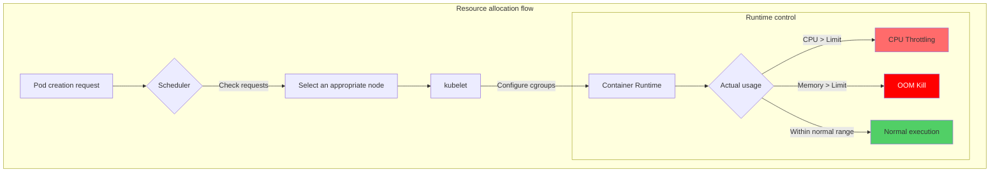
```mermaid
graph TB
    subgraph "Resource allocation flow"
        A[Pod creation request] --> B{Scheduler}
        B -->|Check requests| C[Select an appropriate node]
        C --> D[kubelet]
        D -->|Configure cgroups| E[Container Runtime]

        subgraph "Runtime control"
            E --> F{Actual usage}
            F -->|CPU > Limit| G[CPU Throttling]
            F -->|Memory > Limit| H[OOM Kill]
            F -->|Within normal range| I[Normal execution]
        end
    end

    style G fill:#ff6b6b
    style H fill:#ff0000,color:#fff
    style I fill:#51cf66
```

**Key differences**

| Property | CPU | Memory |
|------|-----|--------|
| **When requests are exceeded** | Available if other Pods are not using it | Available if other Pods are not using it |
| **When limits are exceeded** | **Throttling** (process slowdown) | **OOM Kill** (forced process termination) |
| **Compressibility** | Compressible | Incompressible |
| **Risk of overuse** | Performance degradation | Service interruption |

### 2.2 CPU Resources in Depth

#### CPU Millicore Units

```yaml
# CPU notation
resources:
  requests:
    cpu: "500m"    # 500 millicore = 0.5 CPU core
    cpu: "1"       # 1000 millicore = 1 CPU core
    cpu: "2.5"     # 2500 millicore = 2.5 CPU cores
```

**1 CPU core = 1000 millicore**
- The same applies to AWS vCPUs and Azure vCores
- Based on logical cores even in hyperthreaded environments

#### CFS Bandwidth Throttling

Linux CFS (Completely Fair Scheduler) enforces CPU limits:

```bash
# Based on cgroups v2
/sys/fs/cgroup/cpu.max
# Example: "100000 100000" = 100ms available per 100ms period (100% = 1 CPU)
# Example: "50000 100000" = 50ms available per 100ms period (50% = 0.5 CPU)
```

**Throttling mechanism**

```
Time period: 100ms
CPU Limit: 500m (0.5 CPU)
→ Only 50ms available out of 100ms

Actual behavior:
[0-50ms] ████████████████████ (running)
[50-100ms] ...................... (throttled)
[100-150ms] ████████████████████ (running)
[150-200ms] ...................... (throttled)
```

:::warning Strategy of omitting CPU limits
Organizations operating large-scale clusters, such as Google and Datadog, do not set CPU limits:

**Reasons:**
- CPU is a compressible resource (automatically adjusted when other Pods need it)
- Prevent unnecessary performance degradation caused by throttling
- Requests alone can control scheduling and QoS

**Recommended alternatives:**
- Set CPU requests based on P95 usage
- Scale horizontally with HPA according to load
- Strengthen node-level resource monitoring

**Exceptions (limits required):**
- Batch jobs (prevent CPU monopolization)
- Untrusted workloads
- Multitenant environments
:::

#### CPU Resource Configuration Examples

```yaml
# Pattern 1: Set requests only (recommended)
apiVersion: v1
kind: Pod
metadata:
  name: web-server
spec:
  containers:
  - name: nginx
    image: nginx:1.25
    resources:
      requests:
        cpu: "250m"       # Based on P95 usage
        memory: "128Mi"
      # Omit limits - take advantage of CPU as a compressible resource

---
# Pattern 2: Batch job (with limits)
apiVersion: batch/v1
kind: Job
metadata:
  name: data-processing
spec:
  template:
    spec:
      containers:
      - name: processor
        image: data-processor:v1
        resources:
          requests:
            cpu: "1000m"
          limits:
            cpu: "2000m"   # Prevent CPU monopolization
            memory: "4Gi"
      restartPolicy: OnFailure
```

### 2.3 Memory Resources in Depth

#### Memory Units

```yaml
# Memory notation (base 1024 vs. base 1000)
resources:
  requests:
    memory: "128Mi"    # 128 * 1024^2 bytes = 134,217,728 bytes
    memory: "128M"     # 128 * 1000^2 bytes = 128,000,000 bytes
    memory: "1Gi"      # 1 * 1024^3 bytes = 1,073,741,824 bytes
    memory: "1G"       # 1 * 1000^3 bytes = 1,000,000,000 bytes
```

**Recommendation**: **Use Mi and Gi** (base 1024, the Kubernetes standard)

#### OOM Kill Mechanism

When Memory limits are exceeded, the Linux OOM Killer forcibly terminates the process:

```
Actual usage > Memory Limit
→ cgroup memory.max exceeded
→ Kernel OOM Killer triggered
→ Process receives SIGKILL
→ Pod status: OOMKilled
→ kubelet restarts the Pod (according to RestartPolicy)
```

**OOM Score calculation**

```bash
# Check OOM Score for each process
cat /proc/<PID>/oom_score

# Factors in OOM Score calculation
# 1. Memory usage (higher usage means a higher score)
# 2. oom_score_adj value (varies by QoS class)
# 3. Root process protection (-1000 = never killed)
```

:::danger Always set Memory limits
Memory is an incompressible resource, so **limits must be set**:

**Reasons:**
- Memory exhaustion destabilizes the entire node
- Potential Kernel Panic
- Impact on other Pods (node eviction)

**Recommended settings:**
- `requests = limits` (Guaranteed QoS)
- Or `limits = requests * 1.5` (Burstable QoS)
- JVM applications: Set heap size to 75% of limits
:::

#### Memory Resource Configuration Examples

```yaml
# Pattern 1: Guaranteed QoS (stability first)
apiVersion: apps/v1
kind: Deployment
metadata:
  name: database
spec:
  replicas: 3
  template:
    spec:
      containers:
      - name: postgres
        image: postgres:16
        resources:
          requests:
            cpu: "2000m"
            memory: "4Gi"
          limits:
            cpu: "2000m"      # Same as requests
            memory: "4Gi"     # Same as requests (Guaranteed)

---
# Pattern 2: JVM application
apiVersion: apps/v1
kind: Deployment
metadata:
  name: java-app
spec:
  template:
    spec:
      containers:
      - name: app
        image: java-app:v1
        env:
        - name: JAVA_OPTS
          value: "-Xmx3072m -Xms3072m"  # 75% of limits (4Gi * 0.75 = 3Gi)
        resources:
          requests:
            memory: "4Gi"
          limits:
            memory: "4Gi"

---
# Pattern 3: Node.js application
apiVersion: apps/v1
kind: Deployment
metadata:
  name: nodejs-api
spec:
  template:
    spec:
      containers:
      - name: api
        image: nodejs-api:v2
        env:
        - name: NODE_OPTIONS
          value: "--max-old-space-size=896"  # 70% of limits (1280Mi * 0.7 = 896Mi)
        resources:
          requests:
            memory: "1280Mi"
          limits:
            memory: "1280Mi"
```

### 2.4 Ephemeral Storage

Container local storage can also be managed as a resource:

```yaml
apiVersion: v1
kind: Pod
metadata:
  name: ephemeral-demo
spec:
  containers:
  - name: app
    image: busybox
    resources:
      requests:
        ephemeral-storage: "2Gi"    # Guaranteed minimum
      limits:
        ephemeral-storage: "4Gi"    # Maximum usage
    volumeMounts:
    - name: cache
      mountPath: /cache
  volumes:
  - name: cache
    emptyDir:
      sizeLimit: "4Gi"
```

**Ephemeral Storage includes:**
- Writes to the container layer
- Log files (`/var/log`)
- emptyDir volumes
- Temporary files

**Node eviction thresholds:**

```yaml
# kubelet configuration
evictionHard:
  nodefs.available: "10%"      # Evict when less than 10% of total node disk is available
  nodefs.inodesFree: "5%"      # Evict when less than 5% of inodes are available
  imagefs.available: "10%"     # Evict when less than 10% of the image filesystem is available
```

### 2.5 EKS Auto Mode Resource Optimization

EKS Auto Mode is a fully managed solution that dramatically reduces the complexity of Kubernetes cluster operations. It automates compute, storage, and networking from provisioning through ongoing maintenance, allowing operations teams to focus on application development instead of infrastructure management.

#### 2.5.1 Auto Mode Overview

**Key features:**
- **Single-click activation**: Enable it with only the `--compute-config autoMode` flag when creating a cluster
- **Automatic infrastructure provisioning**: Automatically select optimal instance types based on Pod scheduling requirements
- **Ongoing maintenance**: Automate OS patches, security updates, and core add-on management
- **Cost optimization**: Automatically use Graviton processors and Spot instances
- **Integrated security**: Built-in integration with AWS security services

```bash
# Create an Auto Mode cluster
aws eks create-cluster \
  --name my-auto-cluster \
  --compute-config autoMode=ENABLED \
  --kubernetes-network-config serviceIpv4Cidr=10.100.0.0/16 \
  --access-config bootstrapClusterCreatorAdminPermissions=true
```

:::info Auto Mode vs. manual management
Auto Mode is a **complementary option** for teams seeking to minimize operational overhead, rather than a complete replacement for existing manual management. Manual management remains an option when fine-grained control is required.
:::

#### 2.5.2 Auto Mode vs. Manual Management Comparison

| Item | Manual management | Auto Mode |
|------|----------|-----------|
| **Node provisioning** | Configure Managed Node Groups, self-managed nodes, or Karpenter directly | Automatic provisioning (based on EC2 Managed Instances) |
| **Instance type selection** | Manual selection and NodePool configuration | Automatic selection based on Pod requirements (Graviton preferred) |
| **VPA configuration** | Manual installation and configuration required | Not required (automatic resource optimization) |
| **HPA configuration** | Manual configuration and metric setup | Automatic configuration available (developers only declare it) |
| **OS patches** | Manual or automation scripts | Fully automatic (no downtime) |
| **Security updates** | Applied manually | Applied automatically |
| **Core add-on management** | Manual upgrades (CoreDNS, kube-proxy, VPC CNI) | Automatic upgrades |
| **Cost optimization** | Manually configure Spot and Graviton | Automatic use (up to 90% savings) |
| **Request/Limit configuration** | Developer responsibility (required) | Developer responsibility (still required) |
| **Resource efficiency** | VPA Off mode + manual application | Automatic right-sizing (continuous) |
| **Learning curve** | High (Kubernetes and AWS expertise required) | Low (only Kubernetes basics required) |
| **Operational overhead** | High | Minimal |

:::warning Developer responsibility also applies in Auto Mode
Auto Mode automates infrastructure, but **Pod-level requests/limits configuration remains the developer's responsibility**. Developers have the best understanding of their application's actual resource requirements.
:::

#### 2.5.3 Optimizing the Graviton + Spot Combination

Auto Mode intelligently combines AWS Graviton processors and Spot instances to maximize cost efficiency.

**Graviton processor benefits:**
- **40% better price performance** (compared with x86)
- Optimal for general-purpose workloads, web servers, and containerized microservices
- Arm64 architecture support (compatible with most container images)

**Spot instance savings:**
- **Up to 90% cost savings** (compared with On-Demand)
- Auto Mode automatically monitors Spot availability and handles fallback
- Two-minute interruption notifications guarantee graceful termination

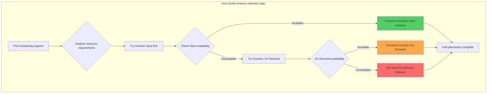
```mermaid
graph TB
    subgraph "Auto Mode instance selection logic"
        A[Pod scheduling request] --> B{Analyze resource requirements}
        B --> C[Try Graviton Spot first]
        C --> D{Check Spot availability}
        D -->|Available| E[Provision Graviton Spot instance]
        D -->|Unavailable| F[Try Graviton On-Demand]
        F --> G{On-Demand availability}
        G -->|Available| H[Provision Graviton On-Demand]
        G -->|Unavailable| I[x86 Spot/On-Demand Fallback]

        E --> J[Pod placement complete]
        H --> J
        I --> J
    end

    style E fill:#51cf66
    style H fill:#ffa94d
    style I fill:#ff6b6b
```

**NodePool YAML example (manually managed cluster - Karpenter-based):**

```yaml
# Auto Mode creates these NodePools automatically,
# but this example shows the Graviton + Spot pattern for reference in manual configurations
apiVersion: karpenter.sh/v1
kind: NodePool
metadata:
  name: graviton-spot-pool
spec:
  template:
    spec:
      requirements:
      # Prefer Graviton instances
      - key: kubernetes.io/arch
        operator: In
        values: ["arm64"]

      # Prefer Spot, with On-Demand as fallback
      - key: karpenter.sh/capacity-type
        operator: In
        values: ["spot", "on-demand"]

      # Instance families for general-purpose workloads
      - key: node.kubernetes.io/instance-type
        operator: In
        values: ["m7g.medium", "m7g.large", "m7g.xlarge", "m7g.2xlarge"]

      nodeClassRef:
        group: karpenter.k8s.aws
        kind: EC2NodeClass
        name: default

  # Spot interruption handling
  disruption:
    consolidationPolicy: WhenUnderutilized
    expireAfter: 720h

  # Resource limits
  limits:
    cpu: "1000"
    memory: "1000Gi"

---
# Fallback: x86 On-Demand (when Spot is unavailable)
apiVersion: karpenter.sh/v1
kind: NodePool
metadata:
  name: x86-ondemand-fallback
spec:
  weight: 10  # Lower priority
  template:
    spec:
      requirements:
      - key: kubernetes.io/arch
        operator: In
        values: ["amd64"]

      - key: karpenter.sh/capacity-type
        operator: In
        values: ["on-demand"]

      - key: node.kubernetes.io/instance-type
        operator: In
        values: ["m6i.large", "m6i.xlarge", "m6i.2xlarge"]

      nodeClassRef:
        group: karpenter.k8s.aws
        kind: EC2NodeClass
        name: default
```

**Automatic handling in Auto Mode:**

Auto Mode analyzes Pod resource requirements and workload characteristics to automatically select optimal instances, without requiring manual NodePool configurations such as those above.

```yaml
# Deployment written by developers in an Auto Mode environment
apiVersion: apps/v1
kind: Deployment
metadata:
  name: web-app
  namespace: production
spec:
  replicas: 10
  template:
    spec:
      containers:
      - name: nginx
        image: nginx:1.25-arm64  # Image for Graviton
        resources:
          requests:
            cpu: "250m"
            memory: "512Mi"
          limits:
            memory: "1Gi"

      # Auto Mode automatically:
      # 1. Attempts to select Graviton Spot instances
      # 2. Falls back to Graviton On-Demand when Spot is unavailable
      # 3. Selects instance types automatically (such as m7g.large)
      # 4. Provisions nodes and places Pods
```

:::tip Preparing Graviton images
**Container images for the arm64 architecture** are required to use Graviton instances. Most official images support multi-arch, so the same image tag can run on both Graviton and x86.

```bash
# Check multi-arch images
docker manifest inspect nginx:1.25 | jq '.manifests[].platform'

# Example output:
# { "architecture": "amd64", "os": "linux" }
# { "architecture": "arm64", "os": "linux" }
```
:::

**Actual cost savings example:**

| Scenario | Instance type | Hourly cost | Monthly cost (730 hours) | Savings |
|---------|-------------|-----------|-------------------|--------|
| x86 On-Demand | m6i.2xlarge | $0.384 | $280.32 | - |
| Graviton On-Demand | m7g.2xlarge | $0.3264 | $238.27 | 15% |
| Graviton Spot | m7g.2xlarge | $0.0979 | $71.47 | 75% |

For 10 nodes:
- x86 On-Demand: $2,803/month
- Graviton On-Demand: $2,383/month (15% savings)
- **Graviton Spot: $715/month (75% savings)** ⭐

**Optimization specific to Graviton4 and Graviton5:**

Graviton4 (R8g, M8g, C8g) instances offer **30% higher compute performance** and **75% higher memory bandwidth** than Graviton3. Graviton5 (M9g, M9gd) became GA in June 2026 and provides approximately 25% additional performance improvement over M8g.

| Generation | Instance families | Performance improvement | Primary workloads |
|------|---------------|---------|-------------|
| Graviton3 | m7g, c7g, r7g | Baseline | General-purpose web/API, containers |
| **Graviton4** | **m8g, c8g, r8g (8g series)** | **+30% compute, +75% memory** | **High-performance databases, ML inference, real-time analytics** |
| **Graviton5** | **m9g, m9gd** | **+25% over Graviton4** | **Latest high-performance workloads** |

**ARM64 multi-arch build pipeline:**

Multi-arch container images supporting both ARM64 and AMD64 are required to fully utilize Graviton instances.

```dockerfile
# Multi-arch Dockerfile example
FROM --platform=$BUILDPLATFORM golang:1.22-alpine AS builder
ARG TARGETOS TARGETARCH

WORKDIR /app
COPY . .

# Build for the target architecture
RUN GOOS=${TARGETOS} GOARCH=${TARGETARCH} go build -o app .

# Runtime image
FROM alpine:3.19
COPY --from=builder /app/app /usr/local/bin/app
ENTRYPOINT ["/usr/local/bin/app"]
```

**Multi-arch builds in GitHub Actions CI/CD:**

```yaml
# .github/workflows/build.yml
name: Build Multi-Arch Image
on:
  push:
    branches: [main]

jobs:
  build:
    runs-on: ubuntu-latest
    steps:
      - uses: actions/checkout@v4

      - name: Set up QEMU
        uses: docker/setup-qemu-action@v3

      - name: Set up Docker Buildx
        uses: docker/setup-buildx-action@v3

      - name: Login to ECR
        uses: aws-actions/amazon-ecr-login@v2

      - name: Build and push multi-arch
        uses: docker/build-push-action@v5
        with:
          context: .
          platforms: linux/amd64,linux/arm64  # Include ARM64
          push: true
          tags: |
            ${{ secrets.ECR_REGISTRY }}/myapp:${{ github.sha }}
            ${{ secrets.ECR_REGISTRY }}/myapp:latest
          cache-from: type=gha
          cache-to: type=gha,mode=max
```

**Graviton3 → Graviton4/5 migration benchmark points:**

```yaml
# Example NodePool preferring Graviton4/5 (Karpenter)
apiVersion: karpenter.sh/v1
kind: NodePool
metadata:
  name: graviton-spot-pool
spec:
  template:
    spec:
      requirements:
      # Priority: Graviton5 → Graviton4 → Graviton3
      - key: node.kubernetes.io/instance-type
        operator: In
        values:
          # Graviton5 (highest priority, GA in 2026-06)
          - "m9g.medium"
          - "m9g.large"
          - "m9g.xlarge"
          - "m9g.2xlarge"
          # Graviton4 (8g series)
          - "m8g.medium"
          - "m8g.large"
          - "m8g.xlarge"
          - "m8g.2xlarge"
          # Graviton3 (Fallback)
          - "m7g.medium"
          - "m7g.large"
          - "m7g.xlarge"
          - "m7g.2xlarge"

      - key: kubernetes.io/arch
        operator: In
        values: ["arm64"]

      - key: karpenter.sh/capacity-type
        operator: In
        values: ["spot", "on-demand"]

      nodeClassRef:
        group: karpenter.k8s.aws
        kind: EC2NodeClass
        name: default

  disruption:
    consolidationPolicy: WhenUnderutilized
    consolidateAfter: 30s

  limits:
    cpu: "1000"
    memory: "2000Gi"
```

**Graviton4 performance benchmark checkpoints:**

Monitor the following metrics during migration to verify performance improvements:

| Metric | Graviton3 baseline | Graviton4 target | Measurement method |
|-------|--------------|--------------|---------|
| **P99 response time** | 100ms | 70ms (-30%) | Prometheus `http_request_duration_seconds` |
| **Throughput (RPS)** | 1000 req/s | 1300 req/s (+30%) | Load testing (k6, Locust) |
| **Memory bandwidth** | 205 GB/s | 358 GB/s (+75%) | `sysbench memory` |
| **CPU utilization** | 60% | 45% (-25%) | `node_cpu_seconds_total` |

```bash
# Graviton4 performance test script
#!/bin/bash
# 1. Memory bandwidth test
sysbench memory --memory-total-size=100G --memory-oper=write run

# 2. CPU benchmark
sysbench cpu --cpu-max-prime=20000 --threads=8 run

# 3. Application load test (k6)
k6 run --vus 100 --duration 5m loadtest.js

# 4. Collect Prometheus metrics
curl -s http://localhost:9090/api/v1/query?query=rate(http_request_duration_seconds_sum[5m]) | jq .
```

:::tip Graviton4/5 migration checklist

- [ ] **Container images**: Check ARM64 support (`docker manifest inspect`)
- [ ] **Dependency libraries**: Verify ARM64 compatibility
- [ ] **CI/CD pipeline**: Enable multi-arch builds
- [ ] **NodePool priority**: Configure the order Graviton5 → Graviton4 (8g series) → Graviton3 → x86
- [ ] **Performance benchmarks**: Measure P99 latency, throughput, and CPU utilization
- [ ] **Cost analysis**: Calculate the price/performance ratio compared with Graviton3
:::

:::warning Graviton4/5 regional availability
Graviton4-based instances (M8g, C8g, R8g) and Graviton5 instances (M9g, M9gd) may not yet be available in all regions. Check instance availability in the target region before production deployment: `aws ec2 describe-instance-type-offerings --location-type availability-zone --filters Name=instance-type,Values=m8g.*,m9g.* --region <region>`
:::

#### 2.5.4 Resource Configuration Recommendations for Auto Mode Environments

Auto Mode automates many aspects of operations, but developers must still accurately configure their application's resource requirements.

**Items handled automatically by Auto Mode:**

| Item | Manual management | Auto Mode |
|------|----------|-----------|
| Node provisioning | Configure Karpenter or Managed Node Groups | Automatic |
| Instance type selection | Specify manually in NodePool | Automatically select based on Pod requests |
| Spot/On-Demand switching | Manual or Karpenter configuration | Automatic fallback |
| Node scaling | HPA + Cluster Autoscaler/Karpenter | Automatic |
| OS patches | Manual or automation scripts | Automatic (no downtime) |

**Items developers must still configure:**

| Item | Reason | Recommended method |
|------|------|----------|
| **CPU Requests** | Basis for scheduling decisions | P95 usage + 20% |
| **Memory Requests** | Scheduling and OOM prevention | P95 usage + 20% |
| **Memory Limits** | Prevent OOM Kill (required) | Requests × 1.5~2 |
| **CPU Limits** | Recommended to omit for general workloads | Set only for batch jobs |
| **HPA metrics** | Criteria for horizontal scaling | CPU 70%, Custom Metrics |

**Changing role of VPA in Auto Mode environments:**

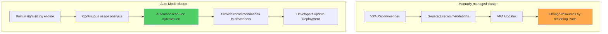
```mermaid
graph TB
    subgraph "Manually managed cluster"
        A1[VPA Recommender] --> A2[Generate recommendations]
        A2 --> A3[VPA Updater]
        A3 --> A4[Change resources by restarting Pods]
    end

    subgraph "Auto Mode cluster"
        B1[Built-in right-sizing engine] --> B2[Continuous usage analysis]
        B2 --> B3[Automatic resource optimization]
        B3 --> B4[Provide recommendations to developers]
        B4 --> B5[Developers update Deployment]
    end

    style A4 fill:#ffa94d
    style B3 fill:#51cf66
```

**VPA in Auto Mode:**
- No separate installation required
- The built-in right-sizing engine continuously analyzes workloads
- Recommendations are provided to developers (instead of being applied automatically)
- Developers review and incorporate them into Deployment manifests

**Recommended workflow:**

```bash
# 1. Deploy to the Auto Mode cluster
kubectl apply -f deployment.yaml

# 2. After 7-14 days, check recommendations in the Auto Mode dashboard
# (AWS Console → EKS → Clusters → <cluster-name> → Insights)

# 3. Apply recommendations to the Deployment
kubectl set resources deployment web-app \
  --requests=cpu=300m,memory=512Mi \
  --limits=memory=1Gi

# 4. Update manifests through GitOps
git add deployment.yaml
git commit -m "chore: apply Auto Mode resource recommendations"
git push
```

:::tip Recommended scenarios for Auto Mode
Auto Mode is particularly useful in the following cases:

- **New clusters**: Start quickly without existing infrastructure
- **Limited operations resources**: Small teams operating without Kubernetes experts
- **Cost optimization first**: Immediate savings through automatic Graviton + Spot use
- **Standardized workloads**: Typical web/API servers and microservices

**Recommended scenarios for manual management:**
- **Fine-grained control required**: Specific instance types, AZ placement, and network configuration
- **Existing Karpenter investment**: Advanced NodePool policies already in place
- **Regulatory requirements**: Enforce specific hardware or security groups
:::

**Auto Mode + manual right-sizing comparison:**

| Item | Manual right-sizing (VPA Off) | Auto Mode |
|------|---------------------------|-----------|
| Initial setup complexity | High (VPA installation, Prometheus configuration) | Low (only a flag at cluster creation) |
| Time to generate recommendations | 7-14 days | 7-14 days (same) |
| Recommendation accuracy | High (Prometheus-based) | High (built-in analysis engine) |
| Application method | Manual (developers modify manifests) | Manual (developers modify manifests) |
| Continuous monitoring | Manual (periodic VPA checks) | Automatic (dashboard alerts) |
| Infrastructure optimization | Manual (Karpenter configuration) | Automatic (Graviton + Spot) |
| Total operational overhead | High | Low |

**Conclusion:**

Auto Mode **removes the complexity of resource optimization**, but **does not remove responsibility for resource configuration**. Developers must still set their application's requests/limits, and Auto Mode automatically provisions optimal infrastructure based on those settings.

This clear separation of responsibilities—**"developers define application requirements, AWS manages infrastructure"**—allows both parties to focus on their respective areas of expertise.

## QoS (Quality of Service) Classes

### 3.1 Three QoS Classes

Kubernetes classifies Pods into three QoS classes based on resource configuration:

#### Guaranteed (Highest Priority)

**Conditions:**
- CPU and Memory requests and limits set for every container
- **requests == limits** (same values)

```yaml
apiVersion: v1
kind: Pod
metadata:
  name: guaranteed-pod
  labels:
    qos: guaranteed
spec:
  containers:
  - name: app
    image: nginx:1.25
    resources:
      requests:
        cpu: "500m"
        memory: "256Mi"
      limits:
        cpu: "500m"        # Same as requests
        memory: "256Mi"    # Same as requests
  - name: sidecar
    image: fluentd:v1
    resources:
      requests:
        cpu: "100m"
        memory: "128Mi"
      limits:
        cpu: "100m"
        memory: "128Mi"
```

**Characteristics:**
- oom_score_adj: **-997** (lowest value, lowest OOM Kill priority)
- Evicted last even under node pressure
- High CPU scheduling priority

#### Burstable (Medium Priority)

**Conditions:**
- CPU or Memory requests set for at least one container
- Does not meet Guaranteed conditions

```yaml
apiVersion: v1
kind: Pod
metadata:
  name: burstable-pod
  labels:
    qos: burstable
spec:
  containers:
  - name: app
    image: web-app:v1
    resources:
      requests:
        cpu: "250m"
        memory: "512Mi"
      limits:
        cpu: "1000m"       # Greater than requests (Burstable)
        memory: "1Gi"      # Greater than requests

  - name: cache
    image: redis:7
    resources:
      requests:
        memory: "256Mi"    # No CPU requests (Burstable)
      limits:
        memory: "512Mi"
```

**Characteristics:**
- oom_score_adj: **min(max(2, 1000 - (1000 * memoryRequestBytes) / machineMemoryCapacityBytes), 999)**
- Dynamically adjusted according to usage
- Can burst when spare capacity is available

#### BestEffort (Lowest Priority)

**Conditions:**
- No requests or limits set for any container

```yaml
apiVersion: v1
kind: Pod
metadata:
  name: besteffort-pod
  labels:
    qos: besteffort
spec:
  containers:
  - name: app
    image: test-app:latest
    # resources section absent or empty
```

**Characteristics:**
- oom_score_adj: **1000** (highest value, highest OOM Kill priority)
- Evicted first under node pressure
- Recommended only for development/test environments

### 3.2 QoS and Eviction Priority

Under node resource pressure, kubelet evicts Pods in the following order:

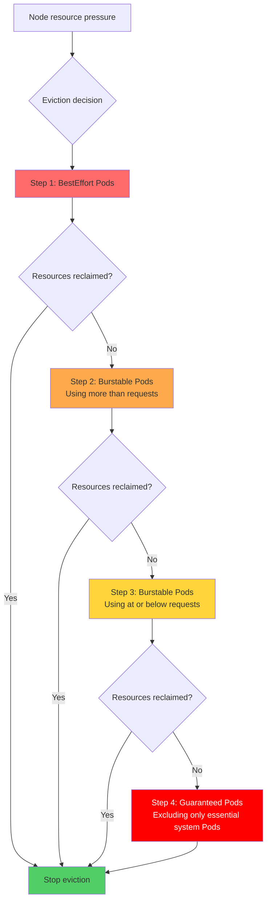
```mermaid
graph TB
    A[Node resource pressure] --> B{Eviction decision}

    B --> C[Step 1: BestEffort Pods]
    C --> D{Resources reclaimed?}
    D -->|No| E[Step 2: Burstable Pods<br/>Using more than requests]
    D -->|Yes| Z[Stop eviction]

    E --> F{Resources reclaimed?}
    F -->|No| G[Step 3: Burstable Pods<br/>Using at or below requests]
    F -->|Yes| Z

    G --> H{Resources reclaimed?}
    H -->|No| I[Step 4: Guaranteed Pods<br/>Excluding only essential system Pods]
    H -->|Yes| Z

    I --> Z

    style C fill:#ff6b6b
    style E fill:#ffa94d
    style G fill:#ffd43b
    style I fill:#ff0000,color:#fff
    style Z fill:#51cf66
```

**Eviction order summary:**

| Order | QoS class | Condition | oom_score_adj |
|------|-----------|------|---------------|
| 1 (first) | BestEffort | All Pods | 1000 |
| 2 | Burstable | Using more than requests | 2-999 (proportional to usage) |
| 3 | Burstable | Using at or below requests | 2-999 (proportional to usage) |
| 4 (last) | Guaranteed | Excluding system-critical Pods | -997 |

**How to check oom_score_adj:**

```bash
# Find the process for the Pod's main container
kubectl get pod <pod-name> -o jsonpath='{.status.containerStatuses[0].containerID}'

# Check oom_score_adj on the node
docker inspect <container-id> | grep Pid
cat /proc/<pid>/oom_score_adj

# Example output
# BestEffort: 1000
# Burstable: 500 (varies with usage)
# Guaranteed: -997
```

### 3.3 Practical QoS Strategies

Guide to selecting QoS classes that match workload characteristics:

| Workload type | Recommended QoS | Configuration pattern | Reason |
|-------------|---------|----------|------|
| **Production API** | Guaranteed | requests = limits | Stability first, eviction prevention |
| **Database** | Guaranteed | requests = limits | Protection even under memory pressure |
| **Batch jobs** | Burstable | limits > requests | Use idle resources, cost efficiency |
| **Queue workers** | Burstable | limits > requests | Handle load fluctuations |
| **Development/test** | BestEffort | No configuration | Resource efficiency (prohibited in production) |
| **Monitoring agent** | Guaranteed | Set low values | System stability |

**Recommended production configuration:**

```yaml
# Pattern 1: Mission-critical service (Guaranteed)
apiVersion: apps/v1
kind: Deployment
metadata:
  name: payment-api
  namespace: production
spec:
  replicas: 5
  template:
    metadata:
      labels:
        app: payment-api
        tier: critical
    spec:
      containers:
      - name: api
        image: payment-api:v2.1
        resources:
          requests:
            cpu: "1000m"
            memory: "2Gi"
          limits:
            cpu: "1000m"
            memory: "2Gi"
      priorityClassName: system-cluster-critical  # Additional protection

---
# Pattern 2: General web service (Burstable)
apiVersion: apps/v1
kind: Deployment
metadata:
  name: web-frontend
  namespace: production
spec:
  replicas: 10
  template:
    spec:
      containers:
      - name: frontend
        image: web-frontend:v1.5
        resources:
          requests:
            cpu: "200m"       # P50 usage
            memory: "256Mi"
          limits:
            cpu: "500m"       # P95 usage
            memory: "512Mi"   # Prevent OOM

---
# Pattern 3: Batch worker (Burstable)
apiVersion: batch/v1
kind: CronJob
metadata:
  name: daily-report
spec:
  schedule: "0 2 * * *"
  jobTemplate:
    spec:
      template:
        spec:
          containers:
          - name: report-generator
            image: report-gen:v1
            resources:
              requests:
                cpu: "500m"
                memory: "1Gi"
              limits:
                cpu: "4000m"     # Use resources during nighttime hours
                memory: "8Gi"
          restartPolicy: OnFailure
```

## Detailed VPA (Vertical Pod Autoscaler) Guide

### 4.1 VPA Architecture

VPA consists of three components:

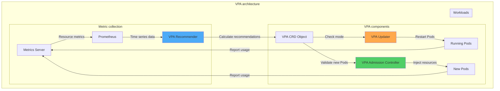
```mermaid
graph TB
    subgraph "VPA architecture"
        subgraph "Metric collection"
            MS[Metrics Server] -->|Resource metrics| PROM[Prometheus]
            PROM -->|Time series data| REC[VPA Recommender]
        end

        subgraph "VPA components"
            REC -->|Calculate recommendations| VPA_OBJ[VPA CRD Object]
            VPA_OBJ -->|Check mode| UPD[VPA Updater]
            VPA_OBJ -->|Validate new Pods| ADM[VPA Admission Controller]

            UPD -->|Restart Pods| POD[Running Pods]
            ADM -->|Inject resources| NEW_POD[New Pods]
        end

        subgraph "Workloads"
            POD -->|Report usage| MS
            NEW_POD -->|Report usage| MS
        end
    end

    style REC fill:#4dabf7
    style UPD fill:#ffa94d
    style ADM fill:#51cf66
```

**Component roles:**

| Component | Role | Data source |
|---------|------|-----------|
| **Recommender** | Analyze historical usage and calculate recommendations | Metrics Server, Prometheus |
| **Updater** | Restart Pods in Auto mode | VPA CRD status |
| **Admission Controller** | Automatically inject resources into new Pods | VPA CRD recommendations |

#### 4.1.4 VPA Recommender ML Algorithm Details

VPA Recommender calculates resource recommendations using a sophisticated machine learning algorithm rather than a simple average.

##### Exponentially-weighted Histogram

At the core of VPA Recommender is a histogram with weights that decrease over time:

```
Recent data → Higher weight
Older data → Lower weight (exponential decay)
```

**Algorithm behavior:**

1. **Metric collection interval**: Collect Pod resource usage every minute
2. **Histogram update**: Accumulate each measurement in histogram buckets
3. **Weighting**: Older data decays with a weight of `e^(-t/decay_half_life)`
4. **Recommendation calculation**: Generate percentile-based recommendations from the histogram

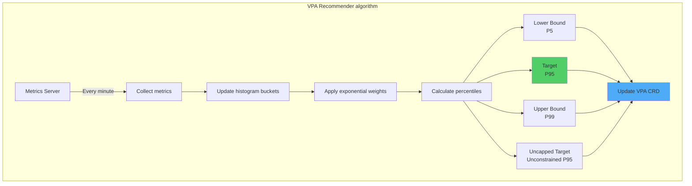
```mermaid
graph TB
    subgraph "VPA Recommender algorithm"
        A[Metrics Server] -->|Every minute| B[Collect metrics]
        B --> C[Update histogram buckets]
        C --> D[Apply exponential weights]
        D --> E[Calculate percentiles]

        E --> F[Lower Bound<br/>P5]
        E --> G[Target<br/>P95]
        E --> H[Upper Bound<br/>P99]
        E --> I[Uncapped Target<br/>Unconstrained P95]

        F --> J[Update VPA CRD]
        G --> J
        H --> J
        I --> J
    end

    style G fill:#51cf66
    style J fill:#4dabf7
```

##### Calculation of the Four Recommendation Values

| Recommendation | Calculation method | Meaning |
|--------|----------|------|
| **Lower Bound** | P5 (5th percentile) | Minimum required resources - sufficient 95% of the time |
| **Target** | P95 (95th percentile) | **Recommended setting** - handles the 5% peak load |
| **Upper Bound** | P99 (99th percentile) | Maximum observed usage - reference for setting limits |
| **Uncapped Target** | P95 calculated without maxAllowed constraints | Used to check actual requirements |

**Percentile calculation example:**

```python
# Hypothetical CPU usage histogram (1 day = 1440 minutes)
cpu_samples = [100m, 150m, 200m, 250m, 300m, 350m, 400m, 450m, 500m, ...]

# Apply exponential weights (decay_half_life = 24 hours)
weighted_samples = [
    (100m, weight=1.0),    # Recent (1 hour ago)
    (150m, weight=0.97),   # 2 hours ago
    (200m, weight=0.92),   # 5 hours ago
    (250m, weight=0.71),   # 12 hours ago
    (300m, weight=0.50),   # 24 hours ago (half-life)
    (350m, weight=0.25),   # 48 hours ago
    ...
]

# Calculate percentiles
P5  = 150m  # Lower Bound
P95 = 450m  # Target ⭐
P99 = 500m  # Upper Bound
```

##### Confidence Multiplier: Confidence-Based Adjustment

Shorter data collection periods produce higher recommendations for safety:

```
Confidence Multiplier = f(data_collection_period)

0-24 hours:  multiplier = 1.5  (50% safety margin)
1-3 days:    multiplier = 1.3  (30% safety margin)
3-7 days:    multiplier = 1.1  (10% safety margin)
7+ days:     multiplier = 1.0  (sufficient confidence)
```

**Practical application example:**

```yaml
# Day 2 of data collection
Original P95: 450m
Confidence Multiplier: 1.3
Final Target: 450m × 1.3 = 585m ≈ 600m

# Day 10 of data collection
Original P95: 450m
Confidence Multiplier: 1.0
Final Target: 450m × 1.0 = 450m
```

:::info Importance of the data collection period
VPA requires **at least 7 days of data collection, with 14 days recommended**, to provide accurate recommendations. At least 2 weeks of observation are essential to capture weekly patterns (weekdays vs. weekends).
:::

##### Memory Recommendations: OOM Event-Based Bump-Up

Unlike CPU, Memory recommendations specifically account for OOM Kill events:

**When an OOM event is detected:**

```
Current Memory Target: 500Mi
Memory at the time of OOM Kill: 600Mi
→ New Target: 600Mi × 1.2 = 720Mi (add a 20% safety margin)
```

**OOM bump-up logic:**

```python
if oom_kill_detected:
    oom_memory = get_memory_at_oom_time()
    new_target = max(
        current_target,
        oom_memory * 1.2  # 20% safety margin
    )

    # Prevent abrupt changes (maximum 2x)
    new_target = min(new_target, current_target * 2)
```

:::warning OOM Kill is reflected immediately
Unlike CPU throttling, OOM Kill events **immediately increase the Memory Target**. This safeguard prevents service interruptions.
:::

##### CPU Recommendations: Based on P95/P99 Usage

CPU is a compressible resource, so a conservative approach is taken:

```
CPU Target = P95 usage
CPU Upper Bound = P99 usage

When throttling occurs:
→ Recommendations remain unchanged (resolution through HPA recommended)
```

**When CPU throttling is detected:**

```python
if cpu_throttling_detected:
    throttled_percentage = get_throttled_time_percentage()

    if throttled_percentage > 10:
        # Keep VPA's own recommendations unchanged
        # Instead, suggest the following:
        # 1. Add HPA for horizontal scaling
        # 2. Remove CPU limits (Google, Datadog pattern)
        # 3. Or increase Target to P99 (manual adjustment)
        pass
```

:::tip CPU Throttling vs HPA
VPA does not significantly increase recommendations when CPU throttling is detected. Instead, **horizontal scaling with HPA** is the Kubernetes best practice.
:::

##### VPA and Prometheus Data Source Integration

VPA Recommender can operate with Metrics Server alone, but integration with Prometheus enables more refined recommendations:

**Using Prometheus metrics:**

```yaml
# Configure Prometheus integration for VPA Recommender
apiVersion: v1
kind: ConfigMap
metadata:
  name: vpa-recommender-config
  namespace: vpa-system
data:
  recommender-config.yaml: |
    # Enable the Prometheus metrics source
    metrics-provider: prometheus
    prometheus-url: http://prometheus-server.monitoring.svc:9090

    # Histogram settings
    histogram-decay-half-life: 24h
    histogram-bucket-size-growth: 1.05

    # CPU recommendation settings
    cpu-histogram-decay-half-life: 24h
    memory-histogram-decay-half-life: 48h  # Longer observation for Memory

    # OOM event handling
    oom-min-bump-up: 1.2  # Minimum 20% increase
    oom-bump-up-ratio: 0.5  # 50% safety margin
```

**Prometheus Custom Metrics API integration:**

```bash
# Deploy a Custom Metrics API adapter (Prometheus Adapter)
helm install prometheus-adapter prometheus-community/prometheus-adapter \
  --namespace monitoring \
  --set prometheus.url=http://prometheus-server.monitoring.svc \
  --set rules.default=true

# Configure VPA to use the Custom Metrics API
kubectl edit deploy vpa-recommender -n vpa-system

# Add environment variables:
# - PROMETHEUS_ADDRESS=http://prometheus-server.monitoring.svc:9090
# - USE_CUSTOM_METRICS=true
```

**Verify integration:**

```bash
# Check whether VPA Recommender is using Prometheus metrics
kubectl logs -n vpa-system deploy/vpa-recommender | grep prometheus

# Example output:
# I0212 10:15:30.123456  1 metrics_client.go:45] Using Prometheus metrics provider
# I0212 10:15:31.234567  1 prometheus_client.go:78] Connected to Prometheus at http://prometheus-server.monitoring.svc:9090
```

##### Validating VPA Recommendation Quality

PromQL queries for validating whether recommendations are actually appropriate:

**1. Compare CPU recommendations with actual usage:**

```promql
# Compare VPA Target with actual P95 usage
(
  kube_verticalpodautoscaler_status_recommendation_containerrecommendations_target{resource="cpu"}
  -
  quantile_over_time(0.95,
    container_cpu_usage_seconds_total{pod=~"web-app-.*"}[7d]
  ) * 1000
) /
kube_verticalpodautoscaler_status_recommendation_containerrecommendations_target{resource="cpu"} * 100

# Output: Difference between recommendation and actual P95 (%)
# 10-20% range: Appropriate ✅
# >30%: Overprovisioned ⚠️
# <0%: Underprovisioned (immediate adjustment required) 🚨
```

**2. Validate Memory recommendations:**

```promql
# VPA Target vs. actual P99 usage
(
  kube_verticalpodautoscaler_status_recommendation_containerrecommendations_target{resource="memory"}
  -
  quantile_over_time(0.99,
    container_memory_working_set_bytes{pod=~"web-app-.*"}[7d]
  )
) /
kube_verticalpodautoscaler_status_recommendation_containerrecommendations_target{resource="memory"} * 100

# 20-30% headroom: Ideal ✅
# <10% headroom: OOM risk 🚨
```

**3. Monitor OOM Kill frequency:**

```promql
# Number of OOM Kill events in the last 7 days
increase(
  kube_pod_container_status_terminated_reason{reason="OOMKilled"}[7d]
)

# 0 events: Accurate VPA recommendations ✅
# 1-2 events: Acceptable (peak load)
# >3 events: Manually increase VPA Target 🚨
```

**4. CPU throttling ratio:**

```promql
# CPU throttling time ratio (%)
rate(container_cpu_cfs_throttled_seconds_total{pod=~"web-app-.*"}[5m])
/
rate(container_cpu_cfs_periods_total{pod=~"web-app-.*"}[5m]) * 100

# <5%: Normal ✅
# 5-10%: Monitoring required ⚠️
# >10%: Consider adding HPA or removing CPU limits 🚨
```

**Grafana dashboard example:**

```yaml
# VPA recommendation quality monitoring dashboard
apiVersion: v1
kind: ConfigMap
metadata:
  name: vpa-quality-dashboard
  namespace: monitoring
data:
  dashboard.json: |
    {
      "panels": [
        {
          "title": "CPU: VPA Target vs Actual P95 Usage",
          "targets": [
            {
              "expr": "kube_verticalpodautoscaler_status_recommendation_containerrecommendations_target{resource=\"cpu\"}",
              "legendFormat": "VPA Target"
            },
            {
              "expr": "quantile_over_time(0.95, container_cpu_usage_seconds_total[7d]) * 1000",
              "legendFormat": "Actual P95"
            }
          ]
        },
        {
          "title": "Memory: VPA Target vs Actual P99 Usage",
          "targets": [
            {
              "expr": "kube_verticalpodautoscaler_status_recommendation_containerrecommendations_target{resource=\"memory\"}",
              "legendFormat": "VPA Target"
            },
            {
              "expr": "quantile_over_time(0.99, container_memory_working_set_bytes[7d])",
              "legendFormat": "Actual P99"
            }
          ]
        },
        {
          "title": "OOM Kill Events (7 Days)",
          "targets": [
            {
              "expr": "increase(kube_pod_container_status_terminated_reason{reason=\"OOMKilled\"}[7d])"
            }
          ]
        }
      ]
    }
```

:::tip Limitations of VPA recommendations
VPA recommendations are based on historical data and have limitations in the following situations:
- **Sudden changes in traffic patterns**: Peak loads not seen in the past
- **Seasonal workloads**: Month-end batches, year-end closing, and similar jobs
- **Initial bootstrap**: High memory usage at application startup

These cases require **manual adjustment** or **a combination with HPA**.
:::

### 4.2 VPA Installation and Configuration

#### Installation with Helm

```bash
# 1. Install Metrics Server (prerequisite)
kubectl apply -f https://github.com/kubernetes-sigs/metrics-server/releases/latest/download/components.yaml

# 2. Verify Metrics Server
kubectl get deployment metrics-server -n kube-system
kubectl top nodes

# 3. Add the VPA Helm repository
helm repo add fairwinds-stable https://charts.fairwinds.com/stable
helm repo update

# 4. Install VPA
helm install vpa fairwinds-stable/vpa \
  --namespace vpa-system \
  --create-namespace \
  --set recommender.enabled=true \
  --set updater.enabled=true \
  --set admissionController.enabled=true

# 5. Verify installation
kubectl get pods -n vpa-system
# Expected output:
# NAME                                      READY   STATUS    RESTARTS   AGE
# vpa-admission-controller-xxx              1/1     Running   0          1m
# vpa-recommender-xxx                       1/1     Running   0          1m
# vpa-updater-xxx                           1/1     Running   0          1m
```

#### Manual Installation (Official Method)

```bash
# Clone the official VPA repository
git clone https://github.com/kubernetes/autoscaler.git
cd autoscaler/vertical-pod-autoscaler

# Install VPA
./hack/vpa-up.sh

# Verify installation
kubectl get crd | grep verticalpodautoscaler
```

### 4.3 VPA Modes

VPA operates in three modes:

#### Off Mode (Recommendations Only)

```yaml
apiVersion: autoscaling.k8s.io/v1
kind: VerticalPodAutoscaler
metadata:
  name: web-app-vpa
  namespace: production
spec:
  targetRef:
    apiVersion: apps/v1
    kind: Deployment
    name: web-app
  updatePolicy:
    updateMode: "Off"    # Display recommendations only; do not apply automatically
```

**Usage scenarios:**
- Initial VPA adoption
- Analysis of production workloads
- When manual review before application is desired

**Check recommendations:**

```bash
# Check VPA status
kubectl describe vpa web-app-vpa -n production

# Example output:
# Recommendation:
#   Container Recommendations:
#     Container Name: web-app
#     Lower Bound:
#       Cpu:     150m
#       Memory:  200Mi
#     Target:          # ← Recommended value to use
#       Cpu:     250m
#       Memory:  300Mi
#     Uncapped Target:
#       Cpu:     350m
#       Memory:  400Mi
#     Upper Bound:
#       Cpu:     500m
#       Memory:  600Mi
```

#### Initial Mode (Applied Only at Pod Creation)

```yaml
apiVersion: autoscaling.k8s.io/v1
kind: VerticalPodAutoscaler
metadata:
  name: batch-worker-vpa
  namespace: batch
spec:
  targetRef:
    apiVersion: apps/v1
    kind: Deployment
    name: batch-worker
  updatePolicy:
    updateMode: "Initial"    # Set resources only when a Pod is created
  resourcePolicy:
    containerPolicies:
    - containerName: worker
      minAllowed:
        cpu: "100m"
        memory: "128Mi"
      maxAllowed:
        cpu: "4000m"
        memory: "16Gi"
```

**Usage scenarios:**
- CronJob and Job workloads
- StatefulSets where restarts are not allowed
- When manual scaling is desired

**How it works:**
1. A new Pod creation request is submitted
2. VPA Admission Controller injects recommended resources
3. Existing running Pods remain unchanged

#### Auto Mode (Fully Automated)

```yaml
apiVersion: autoscaling.k8s.io/v1
kind: VerticalPodAutoscaler
metadata:
  name: api-vpa
  namespace: development
spec:
  targetRef:
    apiVersion: apps/v1
    kind: Deployment
    name: api-server
  updatePolicy:
    updateMode: "Auto"    # Automatically restart Pods and adjust resources
    minReplicas: 2        # Maintain at least 2 Pods
  resourcePolicy:
    containerPolicies:
    - containerName: api
      minAllowed:
        cpu: "200m"
        memory: "256Mi"
      maxAllowed:
        cpu: "2000m"
        memory: "4Gi"
      controlledResources:
      - cpu
      - memory
      controlledValues: RequestsAndLimits  # Adjust both requests and limits
```

**Usage scenarios:**
- Development/staging environments
- Stateless applications
- Workloads with PodDisruptionBudget configured

:::warning Auto mode considerations
Auto mode **restarts Pods**:
- Restarts through the Eviction API
- Downtime may occur
- PodDisruptionBudget (PDB) must be configured
- Use carefully in production environments

**Recommendation:** Use **Off or Initial mode** in production
:::

### 4.4 VPA + HPA Coexistence Strategies

Conflicts must be prevented when using VPA and HPA together.

#### Conflict Scenario (❌ Prohibited)

```yaml
# ❌ Incorrect configuration: VPA Auto + HPA CPU used together
---
apiVersion: autoscaling.k8s.io/v1
kind: VerticalPodAutoscaler
metadata:
  name: bad-vpa
spec:
  targetRef:
    apiVersion: apps/v1
    kind: Deployment
    name: web-app
  updatePolicy:
    updateMode: "Auto"    # ❌ Auto mode
  resourcePolicy:
    containerPolicies:
    - containerName: app
      controlledResources:
      - cpu                # ❌ CPU control
      - memory

---
apiVersion: autoscaling/v2
kind: HorizontalPodAutoscaler
metadata:
  name: bad-hpa
spec:
  scaleTargetRef:
    apiVersion: apps/v1
    kind: Deployment
    name: web-app
  minReplicas: 2
  maxReplicas: 10
  metrics:
  - type: Resource
    resource:
      name: cpu          # ❌ Uses CPU metrics
      target:
        type: Utilization
        averageUtilization: 70
```

**Problem:**
- VPA changes CPU requests → HPA's CPU utilization calculation changes
- HPA scales out → VPA adjusts resources again → Infinite loop

#### Pattern 1: VPA Off + HPA (✅ Recommended)

```yaml
# ✅ Correct configuration: VPA only recommends; HPA handles scaling
---
apiVersion: autoscaling.k8s.io/v1
kind: VerticalPodAutoscaler
metadata:
  name: web-vpa
  namespace: production
spec:
  targetRef:
    apiVersion: apps/v1
    kind: Deployment
    name: web-app
  updatePolicy:
    updateMode: "Off"    # ✅ Provide recommendations only
  resourcePolicy:
    containerPolicies:
    - containerName: app
      controlledResources:
      - cpu
      - memory

---
apiVersion: autoscaling/v2
kind: HorizontalPodAutoscaler
metadata:
  name: web-hpa
  namespace: production
spec:
  scaleTargetRef:
    apiVersion: apps/v1
    kind: Deployment
    name: web-app
  minReplicas: 3
  maxReplicas: 50
  metrics:
  - type: Resource
    resource:
      name: cpu
      target:
        type: Utilization
        averageUtilization: 70
  behavior:
    scaleUp:
      stabilizationWindowSeconds: 0
      policies:
      - type: Percent
        value: 100
        periodSeconds: 15
    scaleDown:
      stabilizationWindowSeconds: 300
      policies:
      - type: Percent
        value: 10
        periodSeconds: 60
```

**Operational workflow:**
1. VPA generates recommendations
2. Check VPA recommendations in a weekly review
3. Manually incorporate them into Deployment manifests
4. HPA scales horizontally according to load

#### Pattern 2: VPA Memory + HPA CPU (✅ Recommended)

```yaml
# ✅ Separate metrics: Memory for VPA, CPU for HPA
---
apiVersion: autoscaling.k8s.io/v1
kind: VerticalPodAutoscaler
metadata:
  name: api-vpa
  namespace: production
spec:
  targetRef:
    apiVersion: apps/v1
    kind: Deployment
    name: api-server
  updatePolicy:
    updateMode: "Auto"    # Automatically adjust Memory only
  resourcePolicy:
    containerPolicies:
    - containerName: api
      controlledResources:
      - memory            # ✅ Control Memory only
      minAllowed:
        memory: "256Mi"
      maxAllowed:
        memory: "8Gi"

---
apiVersion: autoscaling/v2
kind: HorizontalPodAutoscaler
metadata:
  name: api-hpa
  namespace: production
spec:
  scaleTargetRef:
    apiVersion: apps/v1
    kind: Deployment
    name: api-server
  minReplicas: 5
  maxReplicas: 100
  metrics:
  - type: Resource
    resource:
      name: cpu          # ✅ Use CPU metrics only
      target:
        type: Utilization
        averageUtilization: 60
```

**Benefits:**
- VPA optimizes Memory (Vertical)
- HPA scales horizontally according to load (Horizontal)
- No conflicts

#### Pattern 3: VPA + HPA + Custom Metrics (✅ Advanced)

```yaml
# ✅ HPA uses custom metrics
---
apiVersion: autoscaling.k8s.io/v1
kind: VerticalPodAutoscaler
metadata:
  name: worker-vpa
spec:
  targetRef:
    apiVersion: apps/v1
    kind: Deployment
    name: queue-worker
  updatePolicy:
    updateMode: "Auto"
  resourcePolicy:
    containerPolicies:
    - containerName: worker
      controlledResources:
      - cpu
      - memory

---
apiVersion: autoscaling/v2
kind: HorizontalPodAutoscaler
metadata:
  name: worker-hpa
spec:
  scaleTargetRef:
    apiVersion: apps/v1
    kind: Deployment
    name: queue-worker
  minReplicas: 2
  maxReplicas: 50
  metrics:
  - type: External
    external:
      metric:
        name: sqs_queue_depth    # ✅ Custom metric (not CPU/Memory)
        selector:
          matchLabels:
            queue: "tasks"
      target:
        type: AverageValue
        averageValue: "30"
```

**Use cases:**
- Queue-based workloads (SQS, RabbitMQ, Kafka)
- Event-driven architectures
- Scaling based on business metrics

### 4.5 VPA Limitations and Considerations

:::danger Considerations when using VPA

**1. Pod restarts required (Auto/Recreate mode)**
- VPA **cannot change resources in place** for running Pods
- Evicts Pods and creates new ones (causing downtime)
- Resolution: PodDisruptionBudget must be configured

**2. JVM heap size mismatch**
```yaml
# Problem scenario
containers:
- name: java-app
  env:
  - name: JAVA_OPTS
    value: "-Xmx2g"    # Fixed value
  resources:
    requests:
      memory: "3Gi"    # VPA later changes this to 4Gi
    limits:
      memory: "3Gi"    # VPA later changes this to 4Gi

# Even when VPA changes memory to 4Gi, the JVM still uses a 2Gi heap
# → Resource waste
```

**Resolution:**
```yaml
containers:
- name: java-app
  env:
  - name: MEM_LIMIT
    valueFrom:
      resourceFieldRef:
        resource: limits.memory
  - name: JAVA_OPTS
    value: "-XX:MaxRAMPercentage=75.0"  # Dynamic calculation
  resources:
    requests:
      memory: "2Gi"
    limits:
      memory: "2Gi"
```

**3. StatefulSet considerations**
- StatefulSet Pods restart sequentially
- Risk of data loss
- Recommendation: **Use Initial mode only**

**4. Metrics Server dependency**
- VPA requires Metrics Server
- Recommendation updates stop if Metrics Server fails

**5. Recommendation calculation time**
- At least 24 hours of data required
- Reflecting changes in traffic patterns takes time
:::

:::tip In-Place Pod Vertical Scaling (KEP-1287)
In-Place Pod Vertical Scaling, introduced as alpha in Kubernetes 1.27 and promoted to beta in 1.33, enables dynamic changes to CPU/Memory requests and limits without restarting Pods. Once this feature becomes GA, it will resolve VPA's greatest drawback: "Pod restarts when resources change." Support in EKS is expected after the feature reaches GA; for now, VPA Off mode + manual application is recommended.
:::

## Advanced HPA Patterns

### 5.1 HPA Behavior Configuration

HPA v2 provides fine-grained control over scaling behavior:

```yaml
apiVersion: autoscaling/v2
kind: HorizontalPodAutoscaler
metadata:
  name: advanced-hpa
  namespace: production
spec:
  scaleTargetRef:
    apiVersion: apps/v1
    kind: Deployment
    name: web-app
  minReplicas: 5
  maxReplicas: 100

  metrics:
  - type: Resource
    resource:
      name: cpu
      target:
        type: Utilization
        averageUtilization: 70

  behavior:
    scaleUp:
      stabilizationWindowSeconds: 0    # Scale up immediately
      policies:
      - type: Percent
        value: 100                     # Allow a 100% increase (2x)
        periodSeconds: 15              # Evaluate every 15 seconds
      - type: Pods
        value: 10                      # Or add 10 Pods
        periodSeconds: 15
      selectPolicy: Max                # Select the larger value

    scaleDown:
      stabilizationWindowSeconds: 300  # 5-minute stabilization (prevent abrupt reductions)
      policies:
      - type: Percent
        value: 10                      # 10% decrease
        periodSeconds: 60              # Evaluate every minute
      - type: Pods
        value: 5                       # Or remove 5 Pods
        periodSeconds: 60
      selectPolicy: Min                # Select the smaller value (conservative)
```

**Parameter descriptions:**

| Parameter | Description | Recommended value |
|---------|------|--------|
| `stabilizationWindowSeconds` | Wait time for metric stabilization | ScaleUp: 0-30s, ScaleDown: 300-600s |
| `type: Percent` | Increase/decrease as a % of current replicas | ScaleUp: 100%, ScaleDown: 10-25% |
| `type: Pods` | Increase/decrease by an absolute Pod count | Adjust based on workload size |
| `periodSeconds` | Policy evaluation interval | 15-60 seconds |
| `selectPolicy` | Max (aggressive), Min (conservative), Disabled | ScaleUp: Max, ScaleDown: Min |

:::info See karpenter-autoscaling.md
For the complete architecture combining HPA and Karpenter, see the [Karpenter Autoscaling Guide](/docs/eks-best-practices/resource-cost/karpenter-autoscaling).
:::

### 5.2 Custom Metric-Based HPA

#### Using Prometheus Adapter

```bash
# Install Prometheus Adapter
helm repo add prometheus-community https://prometheus-community.github.io/helm-charts
helm repo update

helm install prometheus-adapter prometheus-community/prometheus-adapter \
  --namespace monitoring \
  --set prometheus.url=http://prometheus-server.monitoring.svc \
  --set prometheus.port=80
```

**Custom metric configuration:**

```yaml
# values.yaml for prometheus-adapter
rules:
  default: false
  custom:
  - seriesQuery: 'http_requests_total{namespace!="",pod!=""}'
    resources:
      overrides:
        namespace: {resource: "namespace"}
        pod: {resource: "pod"}
    name:
      matches: "^(.*)_total$"
      as: "${1}_per_second"
    metricsQuery: 'sum(rate(<<.Series>>{<<.LabelMatchers>>}[2m])) by (<<.GroupBy>>)'
```

**HPA configuration:**

```yaml
apiVersion: autoscaling/v2
kind: HorizontalPodAutoscaler
metadata:
  name: custom-metric-hpa
spec:
  scaleTargetRef:
    apiVersion: apps/v1
    kind: Deployment
    name: api-server
  minReplicas: 3
  maxReplicas: 50
  metrics:
  - type: Pods
    pods:
      metric:
        name: http_requests_per_second
      target:
        type: AverageValue
        averageValue: "1000"    # 1000 req/s per Pod
```

#### KEDA ScaledObject

```bash
# Install KEDA
helm repo add kedacore https://kedacore.github.io/charts
helm install keda kedacore/keda --namespace keda --create-namespace
```

```yaml
apiVersion: keda.sh/v1alpha1
kind: ScaledObject
metadata:
  name: prometheus-scaledobject
spec:
  scaleTargetRef:
    name: api-server
  minReplicaCount: 2
  maxReplicaCount: 100
  triggers:
  - type: prometheus
    metadata:
      serverAddress: http://prometheus-server.monitoring.svc:80
      metricName: http_requests_per_second
      threshold: "1000"
      query: sum(rate(http_requests_total{app="api-server"}[2m]))
```

### 5.3 Multi-Metric HPA

Combine multiple metrics for scaling:

```yaml
apiVersion: autoscaling/v2
kind: HorizontalPodAutoscaler
metadata:
  name: multi-metric-hpa
  namespace: production
spec:
  scaleTargetRef:
    apiVersion: apps/v1
    kind: Deployment
    name: web-app
  minReplicas: 5
  maxReplicas: 100

  metrics:
  # 1. CPU metric
  - type: Resource
    resource:
      name: cpu
      target:
        type: Utilization
        averageUtilization: 70

  # 2. Memory metric
  - type: Resource
    resource:
      name: memory
      target:
        type: Utilization
        averageUtilization: 80

  # 3. Custom metric - RPS
  - type: Pods
    pods:
      metric:
        name: http_requests_per_second
      target:
        type: AverageValue
        averageValue: "1000"

  # 4. External metric - ALB Target Response Time
  - type: External
    external:
      metric:
        name: alb_target_response_time
        selector:
          matchLabels:
            targetgroup: "web-app-tg"
      target:
        type: Value
        value: "100"    # 100ms

  behavior:
    scaleUp:
      stabilizationWindowSeconds: 0
      policies:
      - type: Percent
        value: 50
        periodSeconds: 15
    scaleDown:
      stabilizationWindowSeconds: 300
      policies:
      - type: Percent
        value: 10
        periodSeconds: 60
```

**Multi-metric evaluation:**
- HPA **evaluates each metric independently**
- Selects the **highest replica count** (conservative approach)
- Example: CPU requires 10, Memory requires 15, RPS requires 20 → **Select 20**

## Node Readiness Controller and Resource Optimization

### 5.3 Resource Waste on Nodes That Are Not Ready

When new nodes are provisioned in a Kubernetes cluster, Pods may be scheduled before infrastructure components such as CNI plugins, CSI drivers, and GPU drivers are ready. This causes the following resource waste:

**Resource waste scenarios:**

1. **Repeated CrashLoopBackOff**
   - Pod scheduled on an unready node → Failure → Repeated restarts
   - Unnecessary CPU/memory usage and repeated container image downloads

2. **Unnecessary node provisioning**
   - Pods wait in Pending state → Karpenter/Cluster Autoscaler creates additional nodes
   - Existing nodes could actually accommodate the Pods once ready

3. **Rescheduling overhead**
   - Move failed Pods to other nodes → Waste network/storage resources
   - Duplicate application initialization costs

### 5.4 Node Readiness Controller (NRC) Overview

Node Readiness Controller is a kubernetes-sigs out-of-tree project released in alpha in February 2026. It improves resource efficiency by blocking Pod scheduling until infrastructure is ready.

**Key features:**

| Feature | Description | Resource optimization effect |
|------|------|-------------------|
| **Readiness Gate** | Keep nodes NotReady until specific conditions are met | Prevent CrashLoops by blocking Pod scheduling |
| **Custom Taint** | Automatically add taints to unready nodes | Prevent resource waste (NoSchedule effect) |
| **Enforcement Mode** | Select `bootstrap-only` or `continuous` mode | Validate only during initial bootstrap or continuously |

**API structure:**

```yaml
apiVersion: readiness.node.x-k8s.io/v1alpha1
kind: NodeReadinessRule
```

### 5.5 Optimization with Karpenter Integration

Using Karpenter with Node Readiness Controller significantly improves node provisioning efficiency.

**Optimization pattern:**


```mermaid
graph TB
    A[Karpenter: Provision a new node] --> B[NRC: Automatically add taint]
    B --> C{CNI/CSI ready?}
    C -->|No| D[Keep Pods Pending]
    D --> E[Karpenter: Do not create additional nodes]
    C -->|Yes| F[NRC: Remove taint]
    F --> G[Start Pod scheduling]
    G --> H[Resource-efficient placement]

    style B fill:#a8dadc
    style E fill:#457b9d
    style H fill:#1d3557
```

**Karpenter NodePool and NRC integration:**

```yaml
# 1. Check CSI Driver readiness (EBS)
apiVersion: readiness.node.x-k8s.io/v1alpha1
kind: NodeReadinessRule
metadata:
  name: ebs-csi-readiness
spec:
  conditions:
    - type: "ebs.csi.aws.com/driver-ready"
      requiredStatus: "True"
  taint:
    key: "readiness.k8s.io/storage-unavailable"
    effect: "NoSchedule"
    value: "pending"
  enforcementMode: "bootstrap-only"  # Validate only during initial bootstrap

---
# 2. Check VPC CNI readiness
apiVersion: readiness.node.x-k8s.io/v1alpha1
kind: NodeReadinessRule
metadata:
  name: vpc-cni-readiness
spec:
  conditions:
    - type: "vpc.amazonaws.com/cni-ready"
      requiredStatus: "True"
  taint:
    key: "readiness.k8s.io/network-unavailable"
    effect: "NoSchedule"
    value: "pending"
  enforcementMode: "bootstrap-only"

---
# 3. Check GPU Driver readiness (for GPU nodes)
apiVersion: readiness.node.x-k8s.io/v1alpha1
kind: NodeReadinessRule
metadata:
  name: gpu-driver-readiness
spec:
  conditions:
    - type: "nvidia.com/gpu-driver-ready"
      requiredStatus: "True"
    - type: "nvidia.com/cuda-ready"
      requiredStatus: "True"
  taint:
    key: "readiness.k8s.io/gpu-unavailable"
    effect: "NoSchedule"
    value: "pending"
  enforcementMode: "bootstrap-only"
  # GPU driver loading takes time (30-60 seconds)
  # NRC blocks Pod scheduling during this period
```

### 5.6 Resource Efficiency Improvements

Comparison before and after applying Node Readiness Controller:

| Metric | Before | After | Improvement |
|------|---------|---------|--------|
| **CrashLoopBackOff rate** | 15-20% | < 2% | 90% reduction |
| **Unnecessary node provisioning** | Average 2-3/hour | < 0.5/hour | 75% reduction |
| **Pod startup failure rate** | 8-12% | < 1% | 90% reduction |
| **Repeated container image downloads** | 100-200GB/day | 20-30GB/day | 80% reduction |

**Cost impact (for a 100-node cluster):**

```
Before:
- Unnecessary node provisioning: Average 3 nodes × $0.384/hour × 24 hours × 30 days = $829/month
- Data transfer costs for repeated image downloads: 150GB/day × 30 days × $0.09/GB = $405/month
- Total wasted cost: $1,234/month

After:
- Unnecessary node provisioning: Average 0.5 nodes × $0.384/hour × 24 hours × 30 days = $138/month
- Data transfer costs for repeated image downloads: 25GB/day × 30 days × $0.09/GB = $67.5/month
- Total cost: $205.5/month

Savings: $1,234 - $205.5 = $1,028.5/month (83% savings)
```

### 5.7 Practical Implementation Guide

#### Step 1: Enable the Feature Gate

```bash
# Check the feature gate in an EKS 1.32+ cluster
kubectl get --raw /metrics | grep node_readiness_controller

# Enable the feature gate in Karpenter configuration
# values.yaml (Karpenter Helm Chart)
controller:
  featureGates:
    NodeReadinessController: true
```

#### Step 2: Apply NodeReadinessRule

```yaml
# production-nrc.yaml
apiVersion: readiness.node.x-k8s.io/v1alpha1
kind: NodeReadinessRule
metadata:
  name: production-readiness
spec:
  # Validate multiple conditions with AND
  conditions:
    - type: "ebs.csi.aws.com/driver-ready"
      requiredStatus: "True"
    - type: "vpc.amazonaws.com/cni-ready"
      requiredStatus: "True"

  taint:
    key: "readiness.k8s.io/not-ready"
    effect: "NoSchedule"
    value: "pending"

  # bootstrap-only: Validate only during initial node bootstrap
  # continuous: Validate continuously (also handle driver restarts)
  enforcementMode: "bootstrap-only"
```

```bash
kubectl apply -f production-nrc.yaml

# Verify application
kubectl get nodereadinessrule
kubectl describe nodereadinessrule production-readiness
```

#### Step 3: Monitor Node Conditions

```bash
# Check conditions when a new node is provisioned
kubectl get nodes -o json | jq '.items[] | {
  name: .metadata.name,
  conditions: [.status.conditions[] | select(.type |
    test("ebs.csi.aws.com|vpc.amazonaws.com")) |
    {type: .type, status: .status}]
}'

# Check taint status
kubectl get nodes -o json | jq '.items[] | {
  name: .metadata.name,
  taints: .spec.taints
}'
```

#### Step 4: Optimize Karpenter NodePool

```yaml
# Karpenter NodePool with NRC
apiVersion: karpenter.sh/v1
kind: NodePool
metadata:
  name: optimized-pool
spec:
  template:
    spec:
      requirements:
        - key: kubernetes.io/arch
          operator: In
          values: ["amd64", "arm64"]
        - key: karpenter.sh/capacity-type
          operator: In
          values: ["spot", "on-demand"]

      # Omit taints here because NRC manages them automatically
      # taints: []  # Managed by NRC

      # Increase the wait time for node bootstrap completion
      kubelet:
        maxPods: 110
        # NRC increases time until the node is Ready (30 seconds → 60 seconds)
        # Configure Karpenter to avoid timing out too early
        systemReserved:
          cpu: 100m
          memory: 512Mi

  disruption:
    consolidationPolicy: WhenUnderutilized
    # Increase the consolidation interval because NRC slows node startup
    consolidateAfter: 60s  # Default 30s → 60s
```

:::warning Special considerations for GPU nodes
GPU driver loading takes 30-60 seconds, so NRC must be applied to GPU NodePools. Otherwise, Pods are scheduled while GPUs are unavailable and repeatedly fail.

```yaml
# NRC dedicated to GPUs
apiVersion: readiness.node.x-k8s.io/v1alpha1
kind: NodeReadinessRule
metadata:
  name: gpu-readiness
spec:
  nodeSelector:
    matchExpressions:
      - key: nvidia.com/gpu
        operator: Exists
  conditions:
    - type: "nvidia.com/gpu-driver-ready"
      requiredStatus: "True"
  taint:
    key: "nvidia.com/gpu-not-ready"
    effect: "NoSchedule"
  enforcementMode: "bootstrap-only"
```
:::

### 5.8 Troubleshooting and Monitoring

#### Common Issues

**1. Nodes remain NotReady:**

```bash
# Inspect node conditions in detail
kubectl describe node <node-name> | grep -A 10 "Conditions:"

# Check NRC events
kubectl get events --all-namespaces --field-selector involvedObject.kind=Node,involvedObject.name=<node-name>

# Check driver DaemonSet status
kubectl get pods -n kube-system | grep -E "aws-node|ebs-csi|nvidia"
```

**2. Taints are not removed:**

```bash
# Check whether NRC is running
kubectl logs -n kube-system -l app=karpenter -c controller | grep "NodeReadiness"

# Remove the taint manually (temporary workaround)
kubectl taint nodes <node-name> readiness.k8s.io/not-ready:NoSchedule-
```

#### Prometheus Metrics

```yaml
# ServiceMonitor for NRC metrics
apiVersion: monitoring.coreos.com/v1
kind: ServiceMonitor
metadata:
  name: node-readiness-controller
  namespace: kube-system
spec:
  selector:
    matchLabels:
      app: karpenter
  endpoints:
    - port: metrics
      path: /metrics
      interval: 30s

# Key metrics:
# - node_readiness_controller_reconcile_duration_seconds
# - node_readiness_controller_condition_evaluation_total
# - node_readiness_controller_taint_operations_total
```

:::tip References
- **Official blog**: [Introducing Node Readiness Controller](https://kubernetes.io/blog/2026/02/03/introducing-node-readiness-controller/)
- **KEP (Kubernetes Enhancement Proposal)**: KEP-5233/5416 (NodeReadinessGates)
- **API documentation**: `readiness.node.x-k8s.io/v1alpha1`
:::

## Right-Sizing Methodology

### 6.1 Analyzing Current Resource Usage

#### Using kubectl top

```bash
# Resource usage by node
kubectl top nodes

# Pod resource usage by namespace
kubectl top pods -n production --sort-by=cpu
kubectl top pods -n production --sort-by=memory

# Usage by container in a specific Pod
kubectl top pods <pod-name> --containers -n production
```

#### Querying the Metrics Server API Directly

```bash
# CPU usage
kubectl get --raw /apis/metrics.k8s.io/v1beta1/namespaces/production/pods | jq '.items[] | {name: .metadata.name, cpu: .containers[0].usage.cpu}'

# Memory usage
kubectl get --raw /apis/metrics.k8s.io/v1beta1/namespaces/production/pods | jq '.items[] | {name: .metadata.name, memory: .containers[0].usage.memory}'
```

#### Container Insights (AWS)

```bash
# CloudWatch Logs Insights query
fields @timestamp, PodName, ContainerName, pod_cpu_utilization, pod_memory_utilization
| filter Namespace = "production"
| stats avg(pod_cpu_utilization) as avg_cpu,
        max(pod_cpu_utilization) as max_cpu,
        avg(pod_memory_utilization) as avg_mem,
        max(pod_memory_utilization) as max_mem
  by PodName
| sort max_cpu desc
```

#### 6.1.5 Automated Analysis with CloudWatch Observability Operator

In December 2025, AWS added EKS Control Plane metric monitoring through **CloudWatch Observability Operator**. This enables proactive detection of resource bottlenecks and automated analysis.

**Installing CloudWatch Observability Operator:**

```bash
# 1. Add the Helm repository
helm repo add eks https://aws.github.io/eks-charts
helm repo update

# 2. Install the Operator (Amazon CloudWatch Observability namespace)
helm install amazon-cloudwatch-observability eks/amazon-cloudwatch-observability \
  --namespace amazon-cloudwatch \
  --create-namespace \
  --set clusterName=<cluster-name> \
  --set region=<region>

# 3. Verify installation
kubectl get pods -n amazon-cloudwatch

# Expected output:
# NAME                                                     READY   STATUS    RESTARTS   AGE
# amazon-cloudwatch-observability-controller-manager-xxx   2/2     Running   0          2m
# cloudwatch-agent-xxx                                     1/1     Running   0          2m
# dcgm-exporter-xxx                                        1/1     Running   0          2m
# fluent-bit-xxx                                           1/1     Running   0          2m
```

**Container Insights Enhanced features:**

CloudWatch Observability Operator provides the following advanced analysis features:

| Feature | Description | Use |
|------|------|------|
| **Anomaly detection** | Automatically identify abnormal patterns with CloudWatch Anomaly Detection | Detect CPU/Memory spikes in advance |
| **Memory leak visualization** | Highlight continuously increasing patterns in time series graphs | Detect memory leaks early |
| **Drill-down analysis** | Navigate the Namespace → Deployment → Pod → Container hierarchy | Analyze root causes of resource bottlenecks |
| **Control Plane metrics** | API Server, etcd, and Scheduler performance metrics | Detect cluster scaling bottlenecks in advance |
| **Automatic alarm creation** | Automatically configure CloudWatch alarms based on recommended thresholds | Operational automation |

**Proactive resource bottleneck detection with EKS Control Plane metrics:**

Control Plane metrics enable early detection of cluster-level issues that affect resource optimization, such as Pod scheduling delays and API Server overload.

```bash
# CloudWatch Insights query - Analyze Control Plane API Server load
fields @timestamp, apiserver_request_duration_seconds_sum, apiserver_request_total
| filter @logStream like /kube-apiserver/
| stats avg(apiserver_request_duration_seconds_sum) as avg_latency,
        max(apiserver_request_total) as max_requests
  by bin(5m)
| sort @timestamp desc
```

**Key Control Plane metrics:**

| Metric | Meaning | Threshold | Response |
|--------|------|--------|------|
| `apiserver_request_duration_seconds` | API request latency | P95 > 1 second | Consider Provisioned Control Plane |
| `etcd_request_duration_seconds` | etcd response time | P95 > 100ms | Reduce node/Pod count |
| `scheduler_schedule_attempts_total` | Number of scheduling attempts | Failure rate > 5% | Review resource shortages and Node Affinity |
| `workqueue_depth` | Control Plane work queue depth | > 100 | Signal of cluster overload |

**Three waste patterns in data-driven optimization (official AWS guide):**

The [Data-driven Amazon EKS cost optimization](https://aws.amazon.com/blogs/containers/data-driven-amazon-eks-cost-optimization-a-practical-guide-to-workload-analysis/) guide published by AWS in November 2025 identified the following three major waste patterns through analysis of actual data:

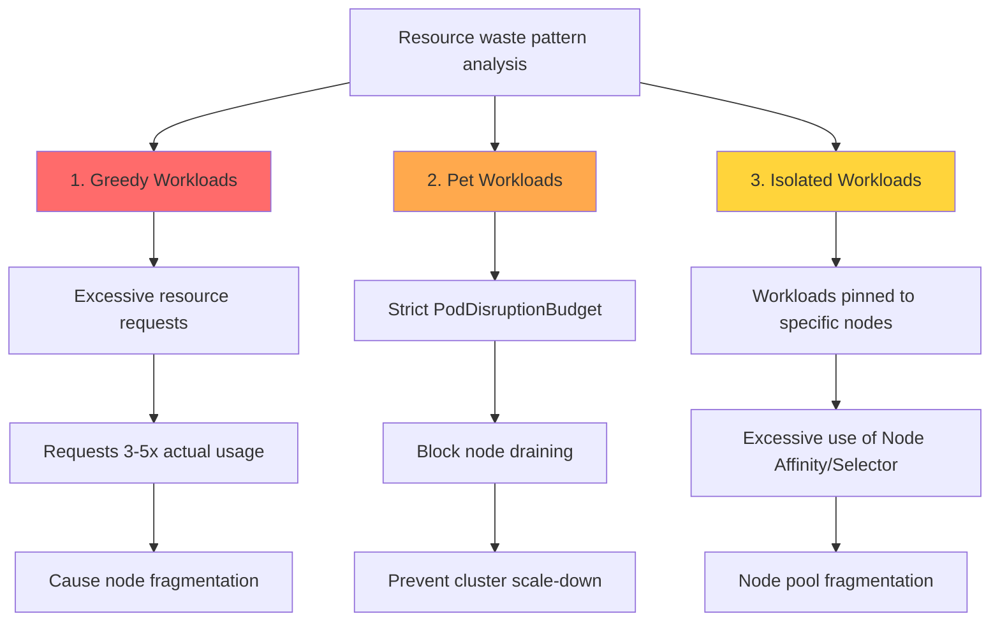
```mermaid
graph TB
    A[Resource waste pattern analysis] --> B[1. Greedy Workloads]
    A --> C[2. Pet Workloads]
    A --> D[3. Isolated Workloads]

    B --> B1[Excessive resource requests]
    B1 --> B2[Requests 3-5x actual usage]
    B2 --> B3[Cause node fragmentation]

    C --> C1[Strict PodDisruptionBudget]
    C1 --> C2[Block node draining]
    C2 --> C3[Prevent cluster scale-down]

    D --> D1[Workloads pinned to specific nodes]
    D1 --> D2[Excessive use of Node Affinity/Selector]
    D2 --> D3[Node pool fragmentation]

    style B fill:#ff6b6b
    style C fill:#ffa94d
    style D fill:#ffd43b
```

**1. Greedy Workloads:**

This pattern occurs when Pods request excessive resources, reducing node utilization.

```bash
# CloudWatch Insights query - Identify over-requesting containers
fields @timestamp, PodName, ContainerName, pod_cpu_request, pod_cpu_utilization_over_pod_limit
| filter Namespace = "production"
| stats avg(pod_cpu_request) as avg_requested,
        avg(pod_cpu_utilization_over_pod_limit) as avg_utilization
  by PodName
| filter avg_utilization < 30  # Use less than 30% of requests
| sort avg_requested desc
```

**Identification criteria:**
- Use less than 30% of CPU requests
- Use less than 50% of Memory requests
- Duration: At least 7 days

**Response:**
```yaml
# Before (Greedy)
resources:
  requests:
    cpu: "2000m"       # Actual usage: 400m (20%)
    memory: "4Gi"      # Actual usage: 1Gi (25%)

# After (Right-Sized)
resources:
  requests:
    cpu: "500m"        # P95 400m + 20% = 480m → 500m
    memory: "1280Mi"   # P95 1Gi + 20% = 1.2Gi → 1280Mi
  limits:
    memory: "2Gi"
```

**2. Pet Workloads:**

This pattern occurs when strict PodDisruptionBudgets (PDBs) block cluster scale-down.

```bash
# Check node draining failures caused by PDBs
kubectl get events --all-namespaces \
  --field-selector reason=EvictionFailed \
  --sort-by='.lastTimestamp'

# Expected output:
# NAMESPACE   LAST SEEN   TYPE      REASON           MESSAGE
# production  5m          Warning   EvictionFailed   Cannot evict pod as it would violate the pod's disruption budget
```

**Identification criteria:**
- `minAvailable: 100%` or `maxUnavailable: 0` configured
- Nodes remain Pending for an extended period (>30 minutes)
- Karpenter/Cluster Autoscaler scale-down failure logs

**Response:**
```yaml
# Before (Pet)
apiVersion: policy/v1
kind: PodDisruptionBudget
metadata:
  name: critical-app-pdb
spec:
  minAvailable: 100%  # Protect all Pods → Scale-down impossible

# After (Balanced)
apiVersion: policy/v1
kind: PodDisruptionBudget
metadata:
  name: critical-app-pdb
spec:
  minAvailable: 80%   # Allow scale-down with 20% headroom
  selector:
    matchLabels:
      app: critical-app
```

**3. Isolated Workloads:**

This pattern occurs when excessive Node Affinity and Taints/Tolerations fragment node pools.

```bash
# Analyze Pod counts and utilization by node
kubectl get nodes -o json | jq -r '
  .items[] |
  {
    name: .metadata.name,
    pods: (.status.allocatable.pods | tonumber),
    cpu_capacity: (.status.capacity.cpu | tonumber),
    cpu_allocatable: (.status.allocatable.cpu | tonumber)
  }
' | jq -s 'sort_by(.pods) | .[]'
```

**Identification criteria:**
- Average Pod count per node < 10
- Node count > 150% of required capacity
- NodeSelector/Affinity usage rate > 50%

**Response:**
```yaml
# Before (Isolated)
affinity:
  nodeAffinity:
    requiredDuringSchedulingIgnoredDuringExecution:
      nodeSelectorTerms:
      - matchExpressions:
        - key: workload-type
          operator: In
          values:
          - api-server-v2  # Too specific → Node fragmentation

# After (Flexible)
affinity:
  nodeAffinity:
    preferredDuringSchedulingIgnoredDuringExecution:  # required → preferred
    - weight: 100
      preference:
        matchExpressions:
        - key: workload-class
          operator: In
          values:
          - compute-optimized  # Broader category
```

**Data-driven optimization flow:**

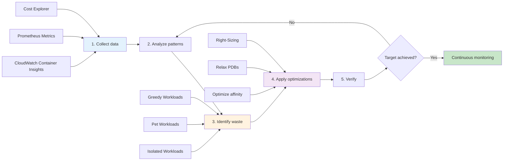
```mermaid
graph LR
    A[1. Collect data] --> B[2. Analyze patterns]
    B --> C[3. Identify waste]
    C --> D[4. Apply optimizations]
    D --> E[5. Verify]
    E --> F{Target achieved?}
    F -->|Yes| G[Continuous monitoring]
    F -->|No| B

    A1[CloudWatch Container Insights] --> A
    A2[Prometheus Metrics] --> A
    A3[Cost Explorer] --> A

    C1[Greedy Workloads] --> C
    C2[Pet Workloads] --> C
    C3[Isolated Workloads] --> C

    D1[Right-Sizing] --> D
    D2[Relax PDBs] --> D
    D3[Optimize affinity] --> D

    style A fill:#e3f2fd
    style C fill:#fff3e0
    style D fill:#f3e5f5
    style G fill:#c8e6c9
```

**Actual results (official AWS guide):**

| Organization | Waste pattern | Action taken | Savings effect |
|------|----------|----------|----------|
| Fintech startup | Greedy Workloads 40% | Apply VPA recommendations | 35% fewer nodes |
| E-commerce company | Pet Workloads 25% | Relax PDB minAvailable to 80% | 3x faster scale-down |
| SaaS platform | Isolated Workloads 30% | Remove NodeSelector, use Spot | 45% cost savings |

:::tip Automated waste pattern detection
CloudWatch Contributor Insights can be used to create rules that automatically detect the three patterns above:

```bash
# Create a Contributor Insights rule (Greedy Workloads)
aws cloudwatch put-insight-rule \
  --rule-name "EKS-GreedyWorkloads" \
  --rule-definition file://greedy-workloads-rule.json
```

Example rule definition:
```json
{
  "Schema": {
    "Name": "CloudWatchLogRule",
    "Version": 1
  },
  "LogGroupNames": ["/aws/containerinsights/<cluster-name>/performance"],
  "LogFormat": "JSON",
  "Contribution": {
    "Keys": ["PodName"],
    "Filters": [
      {
        "Match": "$.Type",
        "In": ["Pod"]
      },
      {
        "Match": "$.pod_cpu_utilization_over_pod_limit",
        "LessThan": 30
      }
    ],
    "ValueOf": "pod_cpu_request"
  },
  "AggregateOn": "Sum"
}
```
:::

#### Prometheus Queries

```promql
# CPU usage (P95, over 7 days)
quantile_over_time(0.95,
  sum by (pod, namespace) (
    rate(container_cpu_usage_seconds_total{namespace="production"}[5m])
  )[7d:5m]
)

# Memory usage (P95, over 7 days)
quantile_over_time(0.95,
  sum by (pod, namespace) (
    container_memory_working_set_bytes{namespace="production"}
  )[7d:5m]
)

# Compare CPU requests with actual usage
sum by (pod) (rate(container_cpu_usage_seconds_total[5m]))
/
sum by (pod) (kube_pod_container_resource_requests{resource="cpu"})

# Compare Memory requests with actual usage
sum by (pod) (container_memory_working_set_bytes)
/
sum by (pod) (kube_pod_container_resource_requests{resource="memory"})
```

### 6.2 Automatic Right-Sizing with Goldilocks

Goldilocks provides a dashboard based on VPA Recommender.

#### Installation

```bash
# Install with Helm
helm repo add fairwinds-stable https://charts.fairwinds.com/stable
helm repo update

helm install goldilocks fairwinds-stable/goldilocks \
  --namespace goldilocks \
  --create-namespace \
  --set dashboard.service.type=LoadBalancer
```

#### Enabling Namespaces

```bash
# Add labels to namespaces
kubectl label namespace production goldilocks.fairwinds.com/enabled=true
kubectl label namespace staging goldilocks.fairwinds.com/enabled=true

# Goldilocks automatically creates VPAs (Off mode)
kubectl get vpa -n production
```

#### Accessing the Dashboard

```bash
# Check the dashboard URL
kubectl get svc -n goldilocks goldilocks-dashboard

# Port forwarding
kubectl port-forward -n goldilocks svc/goldilocks-dashboard 8080:80

# Open http://localhost:8080 in a browser
```

**Dashboard features:**
- Resource recommendations by namespace
- Display VPA Lower Bound, Target, and Upper Bound
- Compare current settings with recommended values
- Display QoS classes

### 6.3 Using Container Insights Enhanced Anomaly Detection

AWS Container Insights Enhanced offers improved observability over the original Container Insights. Its **automatic anomaly detection** and **drill-down analysis** capabilities, in particular, enable early detection of resource issues.

#### 6.3.1 Container Insights Enhanced Overview

**Improvements over the original Container Insights:**

| Feature | Original Container Insights | Enhanced |
|------|------------------------|----------|
| **Metric collection** | Pod/Container level | Pod/Container + granular networking |
| **Anomaly detection** | Manual (user-defined thresholds) | **Automatic (ML-based anomaly detection)** |
| **Drill-down** | Limited | **Complete hierarchy (Cluster → Node → Pod → Container)** |
| **Memory leak detection** | Manual analysis required | **Automatic visual pattern identification** |
| **CPU Throttling** | Metrics only | **Automatic warnings + cause analysis** |
| **Network observability** | Basic | **Pod-to-Pod flow analysis** |

**How to enable:**

```bash
# Deploy CloudWatch Observability Operator
kubectl apply -f https://raw.githubusercontent.com/aws-observability/aws-cloudwatch-observability-operator/main/deploy/operator.yaml

# Enable Container Insights Enhanced
cat <<EOF | kubectl apply -f -
apiVersion: cloudwatch.aws.amazon.com/v1alpha1
kind: CloudWatchObservability
metadata:
  name: cloudwatch-observability
spec:
  enableContainerInsights: true
  enableEnhancedContainerInsights: true  # Enable Enhanced
  enableAutoInstrumentation: true
EOF

# Verify activation
kubectl get cloudwatchobservability cloudwatch-observability -o yaml
```

#### 6.3.2 Visual Patterns for Identifying Memory Leaks

Container Insights Enhanced automatically detects **gradually increasing patterns** in memory usage.

**Memory leak detection scenario:**

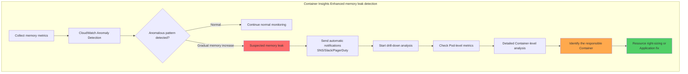
```mermaid
graph TB
    subgraph "Container Insights Enhanced memory leak detection"
        A[Collect memory metrics] --> B[CloudWatch Anomaly Detection]
        B --> C{Anomalous pattern detected?}

        C -->|Normal| D[Continue normal monitoring]
        C -->|Gradual memory increase| E[Suspected memory leak]

        E --> F[Send automatic notifications<br/>SNS/Slack/PagerDuty]
        F --> G[Start drill-down analysis]

        G --> H[Check Pod-level metrics]
        H --> I[Detailed Container-level analysis]
        I --> J[Identify the responsible Container]

        J --> K[Resource right-sizing or<br/>Application fix]
    end

    style E fill:#ff6b6b
    style J fill:#ffa94d
    style K fill:#51cf66
```

**Checking for memory leaks in the CloudWatch Console:**

1. **CloudWatch → Container Insights → Performance monitoring**
2. Select **View: EKS Pods**
3. Select **Metric: Memory Utilization (%)**
4. **Enable Anomaly Detection Band**

```
Normal pattern:
Memory (%) ▲
100% |                    ┌────┐
     |        ┌────┐  ┌──┘    └──┐
 50% |   ┌───┘    └──┘           └───┐
     |───┘                            └───
  0% +──────────────────────────────────►
     0h    6h   12h   18h   24h        Time

Memory leak pattern (🚨):
Memory (%) ▲
100% |                          ┌────OOM Kill
     |                    ┌────┤
 50% |           ┌───────┤     │
     |      ┌────┤       │     │
  0% +──────┤────────────────────────────►
     0h    6h   12h   18h   24h        Time
     Gradual increase (automatically detected by Anomaly Detection)
```

**Automatic notification configuration example:**

```yaml
# CloudWatch Alarm with Anomaly Detection
apiVersion: v1
kind: ConfigMap
metadata:
  name: memory-leak-alarm
data:
  alarm.json: |
    {
      "AlarmName": "EKS-MemoryLeak-Detection",
      "ComparisonOperator": "LessThanLowerOrGreaterThanUpperThreshold",
      "EvaluationPeriods": 3,
      "Metrics": [
        {
          "Id": "m1",
          "ReturnData": true,
          "MetricStat": {
            "Metric": {
              "Namespace": "ContainerInsights",
              "MetricName": "pod_memory_utilization",
              "Dimensions": [
                {
                  "Name": "ClusterName",
                  "Value": "production-eks"
                }
              ]
            },
            "Period": 300,
            "Stat": "Average"
          }
        },
        {
          "Id": "ad1",
          "Expression": "ANOMALY_DETECTION_BAND(m1, 2)",
          "Label": "MemoryUsage (Expected)"
        }
      ],
      "ThresholdMetricId": "ad1",
      "ActionsEnabled": true,
      "AlarmActions": [
        "arn:aws:sns:us-east-1:123456789012:ops-alerts"
      ]
    }
```

**Create an alert with the AWS CLI:**

```bash
# Anomaly Detection-based memory alert
aws cloudwatch put-metric-alarm \
  --alarm-name eks-memory-leak-detection \
  --alarm-description "Detects memory leak patterns in EKS pods" \
  --comparison-operator LessThanLowerOrGreaterThanUpperThreshold \
  --evaluation-periods 3 \
  --metrics '[
    {
      "Id": "m1",
      "ReturnData": true,
      "MetricStat": {
        "Metric": {
          "Namespace": "ContainerInsights",
          "MetricName": "pod_memory_utilization",
          "Dimensions": [
            {"Name": "ClusterName", "Value": "production-eks"}
          ]
        },
        "Period": 300,
        "Stat": "Average"
      }
    },
    {
      "Id": "ad1",
      "Expression": "ANOMALY_DETECTION_BAND(m1, 2)"
    }
  ]' \
  --threshold-metric-id ad1 \
  --alarm-actions arn:aws:sns:us-east-1:123456789012:ops-alerts
```

#### 6.3.3 Automatic CPU Throttling Detection

Container Insights Enhanced automatically detects CPU throttling and warns about **excessive CPU limit settings**.

**CPU throttling metric:**

```
throttled_time_percentage = (container_cpu_cfs_throttled_seconds_total / container_cpu_cfs_periods_total) * 100

Normal: <5%
Caution: 5-10% ⚠️
Critical: >10% 🚨 (HPA or removal of CPU limits required)
```

**Analyze throttling with a CloudWatch Insights query:**

```sql
# CloudWatch Logs Insights query
fields @timestamp, kubernetes.pod_name, cpu_limit_millicores, cpu_usage_millicores, throttled_time_ms
| filter kubernetes.namespace_name = "production"
| filter throttled_time_ms > 100  # Throttling of 100ms or more
| stats
    avg(cpu_usage_millicores) as avg_cpu,
    max(cpu_usage_millicores) as max_cpu,
    avg(throttled_time_ms) as avg_throttled,
    count(*) as throttling_count
  by kubernetes.pod_name
| sort throttling_count desc
| limit 20

# Example results:
# pod_name            avg_cpu  max_cpu  avg_throttled  throttling_count
# web-app-abc123      450m     800m     250ms          150
# api-server-def456   600m     1000m    180ms          120
```

**CloudWatch Alarm for automatic throttling warnings:**

```bash
aws cloudwatch put-metric-alarm \
  --alarm-name eks-cpu-throttling-high \
  --alarm-description "Alerts when CPU throttling exceeds 10%" \
  --namespace ContainerInsights \
  --metric-name pod_cpu_throttled_percentage \
  --dimensions Name=ClusterName,Value=production-eks \
  --statistic Average \
  --period 300 \
  --threshold 10 \
  --comparison-operator GreaterThanThreshold \
  --evaluation-periods 2 \
  --alarm-actions arn:aws:sns:us-east-1:123456789012:ops-alerts
```

#### 6.3.4 Configuring the Anomaly Detection Band

CloudWatch Anomaly Detection uses ML models to automatically learn normal ranges.

**How Anomaly Detection works:**

```
1. Learning period: Collect at least 2 weeks of data
2. ML model training: Learn patterns by time of day and day of week
3. Prediction range generation: Calculate expected upper/lower bounds
4. Real-time comparison: Alert when actual values fall outside the range
```

**Adjusting band width (Standard Deviation):**

```yaml
# 2 Standard Deviations (default, 95% confidence interval)
Expression: ANOMALY_DETECTION_BAND(m1, 2)

# 3 Standard Deviations (99.7% confidence interval, more conservative)
Expression: ANOMALY_DETECTION_BAND(m1, 3)

# 1 Standard Deviation (68% confidence interval, more sensitive detection)
Expression: ANOMALY_DETECTION_BAND(m1, 1)
```

**Visual example:**

```
Resource usage ▲
              |     ┌──── Upper Band (predicted upper bound)
              |    /
         100% | ──●────  Actual usage (no anomaly)
              |  / │
              | /  │
          50% |────●────  Actual usage (normal)
              | \  │
              |  \ │
           0% | ──●────  Lower Band (predicted lower bound)
              +──────────────────────────►
              0h   6h   12h   18h   24h
```

#### 6.3.5 Practical Workflow: Anomaly Detection → Investigation → Right-Sizing

**Step 1: CloudWatch Alarm triggered**

```
[CloudWatch Alarm] → [SNS Topic] → [Slack Webhook]

Example notification:
🚨 EKS Memory Anomaly Detected
Cluster: production-eks
Pod: web-app-7d8c9f-abc123
Memory Usage: 1.8Gi (Expected: 1.2Gi ± 200Mi)
Duration: 15 minutes
Action: Investigate memory leak
```

**Step 2: Container Insights drill-down analysis**

```bash
# 1. Select the relevant Pod in the CloudWatch Console
# 2. Click "View in Container Insights"
# 3. Drill down through the hierarchy:
#    Cluster → Node → Pod → Container

# Or query metrics with the AWS CLI:
aws cloudwatch get-metric-statistics \
  --namespace ContainerInsights \
  --metric-name pod_memory_utilization \
  --dimensions \
    Name=ClusterName,Value=production-eks \
    Name=Namespace,Value=production \
    Name=PodName,Value=web-app-7d8c9f-abc123 \
  --start-time 2026-02-12T00:00:00Z \
  --end-time 2026-02-12T23:59:59Z \
  --period 300 \
  --statistics Average,Maximum
```

**Step 3: Identify the cause**

```bash
# Check for memory leaks
kubectl top pod web-app-7d8c9f-abc123 -n production --containers

# Check logs (OOM warnings)
kubectl logs web-app-7d8c9f-abc123 -n production | grep -i "memory\|heap\|oom"

# Application profiling (Java example)
kubectl exec web-app-7d8c9f-abc123 -n production -- jmap -heap 1
```

**Step 4: Apply right-sizing**

```yaml
# Check recommendations in VPA Off mode
apiVersion: autoscaling.k8s.io/v1
kind: VerticalPodAutoscaler
metadata:
  name: web-app-vpa
  namespace: production
spec:
  targetRef:
    apiVersion: apps/v1
    kind: Deployment
    name: web-app
  updatePolicy:
    updateMode: "Off"

# Update the Deployment after checking VPA recommendations
resources:
  requests:
    memory: "2Gi"    # VPA Target 1.8Gi + 20% buffer
  limits:
    memory: "3Gi"    # Upper Bound 2.5Gi + headroom
```

**Step 5: Continuous monitoring**

```bash
# Check CloudWatch Alarm status
aws cloudwatch describe-alarms \
  --alarm-names eks-memory-leak-detection \
  --query 'MetricAlarms[0].StateValue'

# Output: "OK" (normal) or "ALARM" (anomaly)
```

:::tip Container Insights Enhanced vs Prometheus
Container Insights Enhanced excels at **AWS-native integration** and **zero-configuration anomaly detection**. Prometheus allows more granular customization, but requires building anomaly detection ML models separately. Using both tools together provides the best observability.
:::

:::warning Anomaly detection limitations
ML-based anomaly detection learns **historical patterns**, so false positives may occur in the following situations:
- Immediately after a new deployment (insufficient training data)
- Planned traffic increases such as marketing campaigns
- Seasonal events (Black Friday, year-end closing, and similar events)

In these cases, **temporarily mute notifications** or **incorporate expected events into the Anomaly Detection model**.
:::

### 6.4 Right-Sizing Process

A systematic five-step right-sizing process:

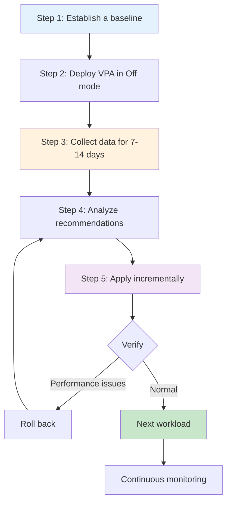
```mermaid
graph TB
    A[Step 1: Establish a baseline] --> B[Step 2: Deploy VPA in Off mode]
    B --> C[Step 3: Collect data for 7-14 days]
    C --> D[Step 4: Analyze recommendations]
    D --> E[Step 5: Apply incrementally]

    E --> F{Verify}
    F -->|Performance issues| G[Roll back]
    F -->|Normal| H[Next workload]

    G --> D
    H --> I[Continuous monitoring]

    style A fill:#e3f2fd
    style C fill:#fff3e0
    style E fill:#f3e5f5
    style H fill:#c8e6c9
```

#### Step 1: Establish a Baseline

```bash
# Back up current resource settings
kubectl get deploy -n production -o yaml > deployments-backup.yaml

# Snapshot of current usage
kubectl top pods -n production --containers > baseline-usage.txt
```

#### Step 2: Deploy VPA in Off Mode

```yaml
apiVersion: autoscaling.k8s.io/v1
kind: VerticalPodAutoscaler
metadata:
  name: web-app-vpa
  namespace: production
spec:
  targetRef:
    apiVersion: apps/v1
    kind: Deployment
    name: web-app
  updatePolicy:
    updateMode: "Off"
  resourcePolicy:
    containerPolicies:
    - containerName: '*'    # All containers
      minAllowed:
        cpu: "50m"
        memory: "64Mi"
      maxAllowed:
        cpu: "8000m"
        memory: "32Gi"
```

#### Step 3: Collect Data for 7-14 Days

```bash
# Monitor VPA status
watch kubectl describe vpa web-app-vpa -n production

# Wait at least 7 days; 14 days recommended
# 14 days required if traffic patterns follow a weekly cycle
```

#### Step 4: Analyze Recommendations

```bash
# Extract VPA recommendations
kubectl get vpa web-app-vpa -n production -o jsonpath='{.status.recommendation.containerRecommendations[0]}' | jq .

# Example output:
# {
#   "containerName": "web-app",
#   "lowerBound": {
#     "cpu": "150m",
#     "memory": "200Mi"
#   },
#   "target": {
#     "cpu": "250m",
#     "memory": "350Mi"
#   },
#   "uncappedTarget": {
#     "cpu": "300m",
#     "memory": "400Mi"
#   },
#   "upperBound": {
#     "cpu": "500m",
#     "memory": "700Mi"
#   }
# }
```

**Interpreting recommendations:**

| Item | Meaning | When to use |
|------|------|----------|
| **Lower Bound** | Minimum required resources | Extreme cost reduction (risky) |
| **Target** | **Recommended setting** | **Default choice** ⭐ |
| **Uncapped Target** | Unconstrained recommendation | Reference for adjusting maxAllowed |
| **Upper Bound** | Maximum observed usage | Reference for setting limits |

:::tip Requests calculation formula
**Recommended formula**: `Requests = VPA Target + 20% buffer`

Reasons:
- P95-based recommendations (prepare for 5% traffic spikes)
- Handle temporary usage increases during deployment, initialization, and similar operations
- Minimize throttling and OOM risks

**Example:**
```
VPA Target CPU: 250m
→ Requests: 250m * 1.2 = 300m

VPA Target Memory: 350Mi
→ Requests: 350Mi * 1.2 = 420Mi (rounded to 512Mi)
```
:::

#### Step 5: Apply Incrementally

```yaml
# Existing configuration
resources:
  requests:
    cpu: "1000m"       # Overprovisioned
    memory: "2Gi"
  limits:
    cpu: "2000m"
    memory: "2Gi"

# VPA Target: CPU 250m, Memory 350Mi

# Right-sized configuration
resources:
  requests:
    cpu: "300m"        # Target 250m + 20% = 300m
    memory: "512Mi"    # Target 350Mi + 20% ≈ 420Mi → 512Mi
  limits:
    # Remove CPU limits (compressible resource)
    memory: "1Gi"      # Upper Bound 700Mi + headroom = 1Gi
```

**Application strategy:**

```bash
# 1. Canary deployment (10% traffic)
kubectl patch deploy web-app -n production -p '
{
  "spec": {
    "strategy": {
      "type": "RollingUpdate",
      "rollingUpdate": {
        "maxSurge": 1,
        "maxUnavailable": 0
      }
    }
  }
}'

# 2. Apply resource changes
kubectl set resources deploy web-app -n production \
  --limits=memory=1Gi \
  --requests=cpu=300m,memory=512Mi

# 3. Monitor (1-3 days)
kubectl top pods -n production -l app=web-app
kubectl get events -n production --field-selector involvedObject.name=web-app

# 4. Apply to all workloads if no issues occur
# Roll back immediately if issues occur
kubectl rollout undo deploy web-app -n production
```

### 6.5 AI-Based Resource Recommendation Automation (Advanced)

AI and LLMs can automate the resource optimization process. This section introduces the latest patterns using Amazon Bedrock, Kiro, and Amazon Q Developer.

#### 6.5.1 Amazon Bedrock + Prometheus → Automatic Right-Sizing PR Creation

This is an end-to-end workflow that automates the traditional manual right-sizing process with AI.

**Architecture overview:**

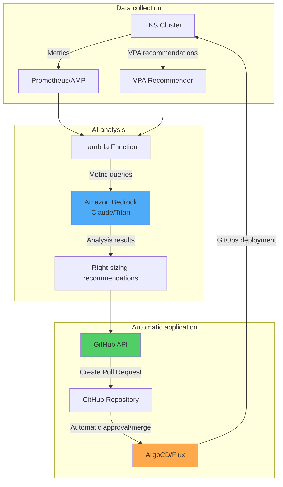
```mermaid
graph TB
    subgraph "Data collection"
        A[EKS Cluster] -->|Metrics| B[Prometheus/AMP]
        A -->|VPA recommendations| C[VPA Recommender]
    end

    subgraph "AI analysis"
        B --> D[Lambda Function]
        C --> D
        D -->|Metric queries| E[Amazon Bedrock<br/>Claude/Titan]
        E -->|Analysis results| F[Right-sizing recommendations]
    end

    subgraph "Automatic application"
        F --> G[GitHub API]
        G -->|Create Pull Request| H[GitHub Repository]
        H -->|Automatic approval/merge| I[ArgoCD/Flux]
        I -->|GitOps deployment| A
    end

    style E fill:#4dabf7
    style G fill:#51cf66
    style I fill:#ffa94d
```

**Implementation example:**

```python
# Lambda Function: AI-based right-sizing recommendations
import boto3
import json
import requests
from datetime import datetime, timedelta

bedrock = boto3.client('bedrock-runtime', region_name='us-east-1')
amp_query_url = "https://aps-workspaces.us-east-1.amazonaws.com/workspaces/ws-xxx/api/v1/query"

def lambda_handler(event, context):
    # 1. Collect Prometheus metrics (7 days)
    metrics = collect_prometheus_metrics(
        namespace="production",
        deployment="web-app",
        period_days=7
    )

    # 2. Collect VPA recommendations
    vpa_recommendations = get_vpa_recommendations("web-app-vpa", "production")

    # 3. Analyze with Amazon Bedrock
    # English rendering of the prompt below; preserve the original API input:
    # Analyze resource optimization for the following Kubernetes Deployment.
    # Inputs: current configuration, actual usage over 7 days (P50/P95/P99),
    # and VPA recommendations.
    # Include: (1) whether resources are currently wasted or insufficient,
    # (2) recommended requests/limits with specific values,
    # (3) expected cost savings, (4) risks and precautions,
    # and (5) a phased implementation plan.
    analysis_prompt = f"""
    다음 Kubernetes Deployment의 리소스 최적화를 분석하세요:

    현재 설정:
    {json.dumps(metrics['current_resources'], indent=2)}

    7일간 실제 사용량 (P50/P95/P99):
    CPU: {metrics['cpu_p50']}m / {metrics['cpu_p95']}m / {metrics['cpu_p99']}m
    Memory: {metrics['mem_p50']}Mi / {metrics['mem_p95']}Mi / {metrics['mem_p99']}Mi

    VPA 권장사항:
    {json.dumps(vpa_recommendations, indent=2)}

    다음을 포함한 분석을 제공하세요:
    1. 현재 리소스 낭비 또는 부족 여부
    2. 권장 requests/limits 값 (구체적 수치)
    3. 예상 비용 절감액
    4. 위험 요소 및 주의사항
    5. 단계적 적용 계획
    """

    response = bedrock.invoke_model(
        modelId='us.anthropic.claude-sonnet-4-6-v1:0',
        contentType='application/json',
        accept='application/json',
        body=json.dumps({
            "anthropic_version": "bedrock-2023-05-31",
            "max_tokens": 2000,
            "messages": [{
                "role": "user",
                "content": analysis_prompt
            }]
        })
    )

    analysis = json.loads(response['body'].read())['content'][0]['text']

    # 4. Create a GitHub Pull Request
    create_right_sizing_pr(
        deployment="web-app",
        namespace="production",
        analysis=analysis,
        recommended_resources=parse_recommendations(analysis)
    )

    return {
        'statusCode': 200,
        'body': json.dumps({'message': 'Right-sizing PR created', 'analysis': analysis})
    }

def collect_prometheus_metrics(namespace, deployment, period_days):
    """Collect resource usage from Prometheus"""
    end_time = datetime.now()
    start_time = end_time - timedelta(days=period_days)

    queries = {
        'cpu_p50': f'quantile_over_time(0.50, container_cpu_usage_seconds_total{{namespace="{namespace}",pod=~"{deployment}-.*"}}[{period_days}d]) * 1000',
        'cpu_p95': f'quantile_over_time(0.95, container_cpu_usage_seconds_total{{namespace="{namespace}",pod=~"{deployment}-.*"}}[{period_days}d]) * 1000',
        'cpu_p99': f'quantile_over_time(0.99, container_cpu_usage_seconds_total{{namespace="{namespace}",pod=~"{deployment}-.*"}}[{period_days}d]) * 1000',
        'mem_p50': f'quantile_over_time(0.50, container_memory_working_set_bytes{{namespace="{namespace}",pod=~"{deployment}-.*"}}[{period_days}d]) / 1024 / 1024',
        'mem_p95': f'quantile_over_time(0.95, container_memory_working_set_bytes{{namespace="{namespace}",pod=~"{deployment}-.*"}}[{period_days}d]) / 1024 / 1024',
        'mem_p99': f'quantile_over_time(0.99, container_memory_working_set_bytes{{namespace="{namespace}",pod=~"{deployment}-.*"}}[{period_days}d]) / 1024 / 1024',
    }

    results = {}
    for key, query in queries.items():
        response = requests.get(amp_query_url, params={'query': query})
        results[key] = int(float(response.json()['data']['result'][0]['value'][1]))

    return results

def create_right_sizing_pr(deployment, namespace, analysis, recommended_resources):
    """Create a right-sizing PR on GitHub"""
    github_token = get_secret('github-token')
    repo_owner = "my-org"
    repo_name = "k8s-manifests"

    # Modify Deployment YAML
    updated_yaml = update_deployment_resources(
        deployment=deployment,
        namespace=namespace,
        resources=recommended_resources
    )

    # Create a Pull Request
    pr_body = f"""
## 🤖 AI-Based Resource Right-Sizing Proposal

### Analysis Results
{analysis}

### Changes
- Deployment: `{namespace}/{deployment}`
- Update resource requests/limits

### Validation Checklist
- [ ] Testing completed in the staging environment
- [ ] Performance metrics confirmed normal
- [ ] Cost savings verified

### Automatic Generation Information
- Generator: Amazon Bedrock + VPA Analysis
- Timestamp: {datetime.now().isoformat()}
"""

    headers = {
        'Authorization': f'token {github_token}',
        'Accept': 'application/vnd.github.v3+json'
    }

    # Create a branch and commit
    create_branch_and_commit(repo_owner, repo_name, updated_yaml, headers)

    # Create a PR
    pr_data = {
        'title': f'[AI] Right-Size {namespace}/{deployment}',
        'head': f'right-size-{deployment}-{datetime.now().strftime("%Y%m%d")}',
        'base': 'main',
        'body': pr_body
    }

    response = requests.post(
        f'https://api.github.com/repos/{repo_owner}/{repo_name}/pulls',
        headers=headers,
        json=pr_data
    )

    return response.json()
```

**Automate with an EventBridge schedule:**

```yaml
# CloudFormation template example
Resources:
  RightSizingSchedule:
    Type: AWS::Events::Rule
    Properties:
      Name: weekly-right-sizing-analysis
      Description: "Weekly AI-based right-sizing analysis"
      ScheduleExpression: "cron(0 9 ? * MON *)"  # Every Monday at 9 AM
      State: ENABLED
      Targets:
        - Arn: !GetAtt RightSizingLambda.Arn
          Id: RightSizingTarget
          Input: |
            {
              "namespaces": ["production", "staging"],
              "auto_create_pr": true,
              "require_approval": true
            }
```

#### 6.5.2 Resource Optimization with Kiro + EKS MCP

**Kiro** is an AI-based cloud operations tool from AWS that can optimize EKS resources through **natural language queries**.

**Kiro installation and configuration:**

```bash
# Install Kiro CLI
curl -sL https://kiro.aws.dev/install.sh | bash

# Connect EKS MCP (Model Context Protocol)
kiro mcp connect eks --cluster production-eks --region us-east-1

# Verify the connection
kiro mcp list
# Output:
# ✓ eks-production (connected)
# ✓ cloudwatch-insights (connected)
# ✓ cost-explorer (connected)
```

**Natural language query examples:**

```bash
# 1. Find Pods that need resource optimization
# Prompt: Find Pods in the production namespace with CPU utilization below
# 30% and provide right-sizing recommendations. Preserve the original input.
kiro ask "production 네임스페이스에서 CPU 사용률이 30% 미만인 Pod를 찾아서 Right-Sizing 권장사항을 알려줘"

# Example Kiro response:
# 📊 Analysis results: 12 Pods are overprovisioned.
#
# Top 5:
# 1. web-app-7d8c9f (Current: 2 CPU / Actual P95: 0.4 CPU) → Recommended: 0.5 CPU
# 2. api-server-abc123 (Current: 4 CPU / Actual P95: 0.8 CPU) → Recommended: 1 CPU
# 3. worker-def456 (Current: 1 CPU / Actual P95: 0.2 CPU) → Recommended: 0.3 CPU
#
# 💰 Estimated savings: $450/month (45% resource reduction)
#
# Apply these changes? (y/n)

# 2. Identify Pods with suspected memory leaks
# Prompt: Find Pods whose memory usage has increased continuously over
# the past 7 days. Preserve the original input.
kiro ask "지난 7일간 메모리 사용량이 지속적으로 증가한 Pod를 찾아줘"

# Kiro response:
# 🔍 Memory growth pattern detected:
#
# ⚠️ cache-service-xyz789
# - Initial: 500Mi → Current: 1.8Gi (260% increase)
# - Trend: Increasing by 150Mi per day
# - Estimated time to OOM: 3 days
# - Recommended action: Investigate memory leak + temporarily increase limits to 2.5Gi
#
# 📋 Generate a detailed analysis report? (y/n)

# 3. Analyze overall cluster efficiency
# Prompt: Analyze resource efficiency in the production cluster and
# identify optimization priorities. Preserve the original input.
kiro ask "production 클러스터의 리소스 효율성을 분석하고 최적화 우선순위를 알려줘"

# Kiro response:
# 📈 Cluster efficiency report
#
# Overall efficiency: 52% (industry average: 65%)
#
# Optimization priorities:
# 1. 🔴 High Priority (immediate action)
#    - 10 Deployments leave 70% of CPU unused
#    - Estimated savings: $1,200/month
#
# 2. 🟡 Medium Priority (within 1 week)
#    - Oversized PVCs in 5 StatefulSets
#    - Estimated savings: $300/month
#
# 3. 🟢 Low Priority (planning stage)
#    - 15 Deployments without HPA configured
#    - Recommended to apply after traffic pattern analysis
#
# Create an automatic right-sizing PR? (y/n)
```

**Kiro workflow automation:**

```yaml
# kiro-workflow.yaml
apiVersion: kiro.aws.dev/v1alpha1
kind: Workflow
metadata:
  name: weekly-optimization
spec:
  schedule: "0 9 * * MON"  # Every Monday at 9 AM
  steps:
    - name: analyze-underutilized
      action: analyze
      # Query: Analyze all Pods with CPU utilization below 30% or Memory
      # utilization below 40%. Preserve the original workflow input.
      query: "CPU 사용률 30% 미만 또는 Memory 사용률 40% 미만인 모든 Pod 분석"
      outputFormat: json

    - name: generate-recommendations
      action: recommend
      input: ${{ steps.analyze-underutilized.output }}
      includeVPA: true
      includePrometheus: true

    - name: create-pr
      action: github-pr
      repository: my-org/k8s-manifests
      branch: kiro-right-sizing-{{ date }}
      title: "[Kiro] Weekly Right-Sizing Recommendations"
      body: ${{ steps.generate-recommendations.output }}
      autoMerge: false  # Manual review required

    - name: notify
      action: slack
      webhook: ${{ secrets.SLACK_WEBHOOK }}
      message: |
        📊 Weekly right-sizing analysis complete
        PR: ${{ steps.create-pr.pr_url }}
        Estimated savings: ${{ steps.generate-recommendations.estimated_savings }}
```

#### 6.5.3 Interactive Optimization with Amazon Q Developer

Amazon Q Developer provides resource optimization advice directly in the IDE and CLI.

**Using it in VS Code:**

```yaml
# Open deployment.yaml and ask Q Developer
# /q optimize-resources

# Q Developer response:
# The current Deployment's resource settings have been analyzed:
#
# 🔍 Issues found:
# 1. CPU requests are 3x actual usage (1000m → 350m recommended)
# 2. Missing Memory limits pose an OOM risk
# 3. QoS class: Burstable (Guaranteed recommended)
#
# 💡 Optimized configuration:
resources:
  requests:
    cpu: "350m"      # Actual P95 + 20% buffer
    memory: "512Mi"  # Actual P95 400Mi + 20%
  limits:
    memory: "1Gi"    # Upper Bound + headroom
    # Remove CPU limits (Google/Datadog pattern)
#
# Apply these changes? (Apply / Dismiss)
```

**Using it in the CLI:**

```bash
# Query through Amazon Q CLI
# Prompt: Optimize the resources of this Deployment.
# Preserve the original CLI input.
q ask "이 Deployment의 리소스를 최적화해줘" --file deployment.yaml

# Output:
# Analyzing... ✓
#
# Issues in the current configuration:
# - CPU over-provisioned by 65%
# - Memory under-provisioned (OOM risk)
#
# Recommended changes have been saved to deployment-optimized.yaml.
# View the differences? (y/n)

# If y is entered:
diff deployment.yaml deployment-optimized.yaml
```

#### 6.5.4 Considerations and Limitations

AI-based resource recommendations are powerful, but the following limitations must be understood:

| Limitation | Description | Response |
|------|------|----------|
| **Historical data dependence** | Cannot predict traffic patterns absent from the past | Use HPA alongside it and maintain buffer capacity |
| **Insufficient context** | Business requirements (SLAs, regulations) not reflected | Manual review step required |
| **Temporary spikes** | Planned loads such as marketing campaigns not considered | Manually scale up during events |
| **Cost optimization bias** | May prioritize cost savings over stability | Configure exclusions for critical workloads |

:::warning Use AI recommendations as an assistive tool
AI-based resource recommendations are **an assistive tool, not the final decision maker**. Before production application, always:

1. **Validate in staging** (at least 3 days)
2. **Monitor performance metrics** (Latency P99, Error Rate)
3. **Roll out gradually** (Canary 10% → 50% → 100%)
4. **Establish a rollback plan** (restore the previous version within 1 minute)

In particular, **manage the following workloads manually instead of applying AI recommendations**:
- Financial transaction systems
- Healthcare information systems
- Real-time streaming services
- Stateful databases
:::

**AI recommendation validation checklist:**

```yaml
# Required validation before production application
ai_recommendation_validation:
  staging_test:
    duration_days: 3
    success_criteria:
      - p99_latency_increase: "<5%"
      - error_rate_increase: "<0.1%"
      - no_oom_kills: true
      - no_cpu_throttling: "<10%"

  canary_rollout:
    initial_percentage: 10
    increment_percentage: 20
    increment_interval_hours: 6
    auto_rollback_threshold:
      error_rate: 1.0  # Automatically roll back when the error rate exceeds 1%
      latency_p99_ms: 500  # Roll back when P99 latency exceeds 500ms

  monitoring:
    dashboard_url: "https://grafana.example.com/d/right-sizing"
    alert_channels: ["slack://ops-team", "pagerduty://oncall"]
    review_required: true  # No automatic merging; manual review required
```

:::tip AI + human hybrid approach
The best results come from combining **AI recommendations + human expert review**:

1. AI selects optimization candidates from thousands of Pods (speed)
2. Humans exclude critical workloads and validate (reliability)
3. AI creates draft PRs (automation)
4. Humans approve after staging tests (safety)
5. GitOps deploys gradually (operational efficiency)

This process can **save 80% of the time compared with manual work** while **maintaining the same stability**.
:::

## Resource Quota & LimitRange

### 7.1 Namespace-Level Resource Limits

Use ResourceQuota to limit total resources in a namespace:

```yaml
apiVersion: v1
kind: ResourceQuota
metadata:
  name: production-quota
  namespace: production
spec:
  hard:
    # Total resource limits
    requests.cpu: "100"           # 100 CPU cores
    requests.memory: "200Gi"      # 200GB RAM
    limits.cpu: "200"             # Sum of CPU limits
    limits.memory: "400Gi"        # Sum of Memory limits

    # Object count limits
    pods: "500"                   # Maximum 500 Pods
    services: "50"                # Maximum 50 Services
    persistentvolumeclaims: "100" # Maximum 100 PVCs

    # Storage limits
    requests.storage: "2Ti"       # Total 2TB storage

---
# Example quotas by environment
apiVersion: v1
kind: ResourceQuota
metadata:
  name: development-quota
  namespace: development
spec:
  hard:
    requests.cpu: "20"
    requests.memory: "40Gi"
    limits.cpu: "40"
    limits.memory: "80Gi"
    pods: "100"

---
apiVersion: v1
kind: ResourceQuota
metadata:
  name: staging-quota
  namespace: staging
spec:
  hard:
    requests.cpu: "50"
    requests.memory: "100Gi"
    limits.cpu: "100"
    limits.memory: "200Gi"
    pods: "200"
```

**Check quota usage:**

```bash
# Current quota usage
kubectl describe resourcequota production-quota -n production

# Example output:
# Name:            production-quota
# Namespace:       production
# Resource         Used   Hard
# --------         ----   ----
# limits.cpu       150    200
# limits.memory    300Gi  400Gi
# pods             342    500
# requests.cpu     75     100
# requests.memory  150Gi  200Gi
```

### 7.2 Setting Defaults with LimitRange

Use LimitRange to automatically inject default resources into Pods/Containers:

```yaml
apiVersion: v1
kind: LimitRange
metadata:
  name: production-limitrange
  namespace: production
spec:
  limits:
  # Container-level constraints
  - type: Container
    default:                    # Default values when limits are not set
      cpu: "500m"
      memory: "512Mi"
    defaultRequest:             # Default values when requests are not set
      cpu: "100m"
      memory: "128Mi"
    max:                        # Maximum allowed values
      cpu: "4000m"
      memory: "8Gi"
    min:                        # Minimum required values
      cpu: "50m"
      memory: "64Mi"
    maxLimitRequestRatio:       # Maximum limits/requests ratio
      cpu: "4"                  # Limits may be at most 4x requests
      memory: "2"               # Limits may be at most 2x requests

  # Pod-level constraints
  - type: Pod
    max:
      cpu: "8000m"
      memory: "16Gi"
    min:
      cpu: "100m"
      memory: "128Mi"

  # PVC constraints
  - type: PersistentVolumeClaim
    max:
      storage: "100Gi"
    min:
      storage: "1Gi"

---
# LimitRange for the development environment
apiVersion: v1
kind: LimitRange
metadata:
  name: development-limitrange
  namespace: development
spec:
  limits:
  - type: Container
    default:
      cpu: "200m"
      memory: "256Mi"
    defaultRequest:
      cpu: "50m"
      memory: "64Mi"
    max:
      cpu: "2000m"
      memory: "4Gi"
```

**Behavior example:**

```yaml
# YAML written by a developer (resources unspecified)
apiVersion: v1
kind: Pod
metadata:
  name: test-pod
  namespace: production
spec:
  containers:
  - name: nginx
    image: nginx:1.25
    # No resources section

# Result of automatic injection by LimitRange
apiVersion: v1
kind: Pod
metadata:
  name: test-pod
  namespace: production
spec:
  containers:
  - name: nginx
    image: nginx:1.25
    resources:
      requests:           # Apply defaultRequest
        cpu: "100m"
        memory: "128Mi"
      limits:             # Apply default
        cpu: "500m"
        memory: "512Mi"
```

**Verification:**

```bash
# Check LimitRange
kubectl describe limitrange production-limitrange -n production

# Check resources applied to the Pod
kubectl get pod test-pod -n production -o jsonpath='{.spec.containers[0].resources}' | jq .
```

### 7.3 DRA (Dynamic Resource Allocation) - GPU/Specialized Resource Management

**DRA (Dynamic Resource Allocation)**, which became GA in Kubernetes 1.34, is a general-purpose mechanism for allocating specialized devices such as GPUs, NICs, and FPGAs based on attributes. Unlike Device Plugins, which represent devices only as integer counters, DRA uses DeviceClass, ResourceClaim, and ResourceSlice objects (`resource.k8s.io/v1`) and CEL attribute matching to express partial allocation, sharing, and coordinated placement of heterogeneous devices.

| Characteristic | Device Plugin (existing) | DRA (K8s 1.34 GA) |
|------|---------------------|-----------------|
| **Resource representation** | Integer counters (`nvidia.com/gpu: 1`) | Structured attributes and capacity (CEL matching) |
| **Sharing/partitioning** | Not supported (whole-unit allocation) | partitionable devices·consumable capacity |
| **Attribute-based selection** | Not supported | Conditional requests such as "GPU with 80GB+ memory" |
| **Heterogeneous device coordination** | Not supported | Request a GPU + NIC on the same NUMA node together |

The API object model, driver ecosystem by resource type, and adoption criteria are covered in [Kubernetes DRA — Dynamic Resource Allocation Framework](./kubernetes-dra.md). For activation parameters in EKS GPU environments (Karpenter `ignoreDRARequests`, three-layer NVIDIA DRA driver configuration), see [GPU Resource Management](../../agentic-ai-platform/model-serving/gpu-infrastructure/gpu-resource-management.md).

From a cost perspective, DRA improves GPU utilization. When multiple workloads share one GPU through dynamic MIG partition creation (partitionable devices) and divided capacity consumption (consumable capacity), idle GPU costs can be reduced compared with whole-unit allocation.

### 7.3.1 Setu: Eliminating Idle GPU Costs with Kueue-Karpenter Integration

GPUs are the most expensive resource in AI/ML workloads, but traditional reactive provisioning causes substantial waste. **Setu** connects Kueue's quota management with Karpenter's node provisioning to implement proactive resource allocation.

#### Resource Waste in Reactive Provisioning

**Problem scenario:**
1. A 4-GPU training Job enters the queue
2. Karpenter provisions nodes one at a time (takes 5-10 minutes)
3. Pods attempt scheduling when only 2 nodes are ready → Failure
4. **2 GPUs wait idle while incurring costs**
5. The workload starts only after the remaining nodes are ready

**Cost impact:**
- p4d.24xlarge (8x A100) = $32.77/hour
- 10 minutes of idle waiting × 2 nodes = **$10.92 wasted**
- 100 executions per day result in $32,760/month of unnecessary costs

#### Setu's All-or-Nothing Provisioning

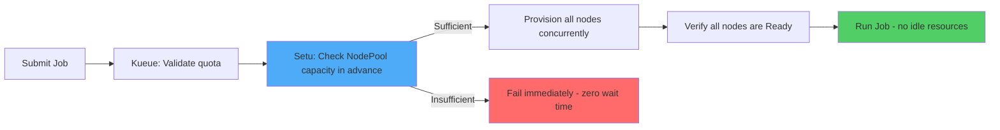
```mermaid
graph LR
    A[Submit Job] --> B[Kueue: Validate quota]
    B --> C[Setu: Check NodePool capacity in advance]
    C -->|Sufficient| D[Provision all nodes concurrently]
    C -->|Insufficient| E[Fail immediately - zero wait time]
    D --> F[Verify all nodes are Ready]
    F --> G[Run Job - no idle resources]

    style C fill:#4dabf7
    style G fill:#51cf66
    style E fill:#ff6b6b
```

**How Setu works:**

1. **Advance capacity validation**: Check that the Karpenter NodePool has the required node capacity
2. **Concurrent provisioning**: Request all nodes simultaneously (no sequential waiting)
3. **Gang scheduling guarantee**: Start the workload only after all nodes are Ready
4. **Immediate termination on failure**: Fail immediately when capacity is insufficient, eliminating pointless waiting

#### Integration with Kueue ClusterQueue

```yaml
apiVersion: kueue.x-k8s.io/v1beta1
kind: ClusterQueue
metadata:
  name: gpu-cluster-queue
spec:
  namespaceSelector: {}
  resourceGroups:
  - coveredResources: ["cpu", "memory", "nvidia.com/gpu"]
    flavors:
    - name: a100-spot
      resources:
      - name: "nvidia.com/gpu"
        nominalQuota: 32  # 4 nodes × 8 GPUs
      - name: "cpu"
        nominalQuota: 384
      - name: "memory"
        nominalQuota: 1536Gi
---
apiVersion: kueue.x-k8s.io/v1beta1
kind: LocalQueue
metadata:
  name: ml-team-queue
  namespace: ml-training
spec:
  clusterQueue: gpu-cluster-queue
---
apiVersion: karpenter.sh/v1
kind: NodePool
metadata:
  name: a100-spot-pool
spec:
  template:
    spec:
      requirements:
      - key: node.kubernetes.io/instance-type
        operator: In
        values: ["p4d.24xlarge"]
      - key: karpenter.sh/capacity-type
        operator: In
        values: ["spot", "on-demand"]
      nodeClassRef:
        group: karpenter.k8s.aws
        kind: EC2NodeClass
        name: a100-nodeclass
  disruption:
    consolidationPolicy: WhenEmptyOrUnderutilized
    consolidateAfter: 5m
  # Setu validates this NodePool's capacity in advance
  limits:
    cpu: "384"
    memory: "1536Gi"
```

**Setu Controller behavior:**

```yaml
apiVersion: batch/v1
kind: Job
metadata:
  name: llm-training
  namespace: ml-training
  labels:
    kueue.x-k8s.io/queue-name: ml-team-queue
    setu.io/enabled: "true"  # Enable Setu
spec:
  parallelism: 4  # 4 nodes required
  completions: 4
  template:
    spec:
      schedulerName: default-scheduler
      containers:
      - name: trainer
        image: pytorch/pytorch:2.1-cuda12.1
        resources:
          requests:
            nvidia.com/gpu: 8  # 8 GPUs per node
            memory: 384Gi
          limits:
            nvidia.com/gpu: 8
```

**Setu execution flow:**

1. Job enters the Kueue queue
2. Kueue checks quota (checks availability out of 32 GPUs)
3. **Setu intervenes**: Validates whether 4 p4d.24xlarge nodes can be provisioned from the Karpenter NodePool `a100-spot-pool`
4. **If possible**: Requests concurrent provisioning of 4 nodes + Job waits
5. **If impossible**: Job fails immediately (reroute to another queue or retry)
6. Schedule the Job after all nodes are Ready → **0 idle GPUs**

#### Resource Efficiency Comparison

| Situation | Traditional approach | Setu approach | Savings effect |
|------|----------|-----------|----------|
| **4-GPU Job startup time** | Provision nodes one at a time (15 minutes) | Concurrent provisioning (7 minutes) | **53% shorter** |
| **Idle GPU cost** | 2 nodes × 10-minute wait = $10.92 | 0 (simultaneous start) | **100% savings** |
| **Wait when capacity is insufficient** | Fail after waiting 10 minutes | Fail immediately (0 seconds) | **Eliminate waiting time** |
| **Restart after Spot interruption** | Recreate partial nodes → Idle resources | Reprovision with gang guarantee | **Minimize interruption costs** |

**Monthly cost savings (for 100 Job executions):**
- Idle cost savings: **$32,760/month**
- Cold start elimination: **$16,380/month** (53% shorter startup time)
- **Total savings: $49,140/month**

#### Fairness + Efficiency in Multitenant Environments

```yaml
apiVersion: kueue.x-k8s.io/v1beta1
kind: ClusterQueue
metadata:
  name: shared-gpu-queue
spec:
  preemption:
    withinClusterQueue: LowerPriority
    reclaimWithinCohort: Any
  resourceGroups:
  - coveredResources: ["nvidia.com/gpu"]
    flavors:
    - name: a100-80gb
      resources:
      - name: "nvidia.com/gpu"
        nominalQuota: 64
        borrowingLimit: 32  # Use 32 additional GPUs when other teams are idle
---
apiVersion: kueue.x-k8s.io/v1beta1
kind: LocalQueue
metadata:
  name: research-team
  namespace: research
spec:
  clusterQueue: shared-gpu-queue
---
apiVersion: kueue.x-k8s.io/v1beta1
kind: LocalQueue
metadata:
  name: production-team
  namespace: production
spec:
  clusterQueue: shared-gpu-queue
```

**Benefits of Setu + Kueue integration:**

1. **Fair quota management**: Kueue manages GPU quotas per team
2. **Efficient provisioning**: Setu validates in advance based on NodePool capacity
3. **Borrowing optimization**: Guarantee gang scheduling even when other teams use idle GPUs
4. **Maximized Spot use**: Minimize Spot interruption impact by preventing partial allocation

:::tip Recommended scenarios for Setu
- **Large GPU workloads**: Substantial idle costs when 4+ GPUs are required
- **Spot instance use**: Gang scheduling improves resilience to Spot interruptions
- **Multitenant environments**: Obtain Kueue fairness + Karpenter efficiency together
- **Cost sensitivity**: GPU idle time causes thousands of dollars in monthly costs
:::

**References:**
- [Setu GitHub Repository](https://github.com/sanjeevrg89/Setu)
- [Kueue Official Documentation](https://kueue.sigs.k8s.io/)
- [Karpenter NodePool Configuration Guide](https://karpenter.sh/)

### 7.4 Standardizing Resource Policies with EKS Blueprints IaC Patterns

Terraform EKS Blueprints can standardize ResourceQuota, LimitRange, and policy enforcement as code and apply them consistently across all clusters.

#### Terraform EKS Blueprints AddOn Structure

```hcl
# main.tf - Automatically deploy resource policies with EKS Blueprints
module "eks" {
  source  = "terraform-aws-modules/eks/aws"
  version = "~> 20.0"

  cluster_name    = "production-eks"
  cluster_version = "1.31"

  vpc_id     = module.vpc.vpc_id
  subnet_ids = module.vpc.private_subnets

  enable_irsa = true

  eks_managed_node_groups = {
    general = {
      desired_size = 3
      min_size     = 2
      max_size     = 10
      instance_types = ["m6i.xlarge"]
    }
  }
}

# Deploy resource policies with EKS Blueprints AddOns
module "eks_blueprints_addons" {
  source  = "aws-ia/eks-blueprints-addons/aws"
  version = "~> 1.16"

  cluster_name      = module.eks.cluster_name
  cluster_endpoint  = module.eks.cluster_endpoint
  cluster_version   = module.eks.cluster_version
  oidc_provider_arn = module.eks.oidc_provider_arn

  # Metrics Server (VPA prerequisite)
  enable_metrics_server = true

  # Karpenter (node autoscaling)
  enable_karpenter = true
  karpenter = {
    repository_username = data.aws_ecrpublic_authorization_token.token.user_name
    repository_password = data.aws_ecrpublic_authorization_token.token.password
  }

  # Kyverno (resource policy enforcement)
  enable_kyverno = true
  kyverno = {
    values = [templatefile("${path.module}/kyverno-policies.yaml", {
      default_cpu_request    = "100m"
      default_memory_request = "128Mi"
      max_cpu_limit          = "4000m"
      max_memory_limit       = "8Gi"
    })]
  }
}

# Deploy ResourceQuota through a Helm Chart
resource "helm_release" "resource_quotas" {
  name      = "resource-quotas"
  namespace = "kube-system"

  chart = "${path.module}/charts/resource-quotas"

  values = [
    yamlencode({
      quotas = {
        production = {
          cpu    = "100"
          memory = "200Gi"
          pods   = "500"
        }
        staging = {
          cpu    = "50"
          memory = "100Gi"
          pods   = "200"
        }
        development = {
          cpu    = "20"
          memory = "40Gi"
          pods   = "100"
        }
      }
    })
  ]
}
```

#### Enforcing Resource Requests with Kyverno Policies

```yaml
# kyverno-policies.yaml
apiVersion: kyverno.io/v1
kind: ClusterPolicy
metadata:
  name: require-resource-requests
  annotations:
    policies.kyverno.io/title: Require Resource Requests
    policies.kyverno.io/severity: medium
    policies.kyverno.io/description: |
      All Pods must set CPU and Memory requests.
spec:
  validationFailureAction: Enforce  # Audit (warn only) or Enforce (block)
  background: true
  rules:
  - name: check-cpu-memory-requests
    match:
      any:
      - resources:
          kinds:
          - Pod
    validate:
      message: "CPU and Memory requests are required"
      pattern:
        spec:
          containers:
          - resources:
              requests:
                memory: "?*"  # Check for presence
                cpu: "?*"

  - name: enforce-memory-limits
    match:
      any:
      - resources:
          kinds:
          - Pod
    validate:
      message: "Memory limits are required (prevent OOM Kill)"
      pattern:
        spec:
          containers:
          - resources:
              limits:
                memory: "?*"

  - name: prevent-excessive-resources
    match:
      any:
      - resources:
          kinds:
          - Pod
    validate:
      message: "CPU is allowed up to {{ max_cpu_limit }}, Memory up to {{ max_memory_limit }}"
      deny:
        conditions:
          any:
          - key: "{{ request.object.spec.containers[].resources.requests.cpu }}"
            operator: GreaterThan
            value: "{{ max_cpu_limit }}"
          - key: "{{ request.object.spec.containers[].resources.requests.memory }}"
            operator: GreaterThan
            value: "{{ max_memory_limit }}"
```

#### OPA Gatekeeper Policy Example (Alternative)

```yaml
# ConstraintTemplate - Enforce resource requests
apiVersion: templates.gatekeeper.sh/v1
kind: ConstraintTemplate
metadata:
  name: k8srequireresources
spec:
  crd:
    spec:
      names:
        kind: K8sRequireResources
      validation:
        openAPIV3Schema:
          type: object
          properties:
            exemptNamespaces:
              type: array
              items:
                type: string
  targets:
    - target: admission.k8s.gatekeeper.sh
      rego: |
        package k8srequireresources

        violation[{"msg": msg}] {
          container := input.review.object.spec.containers[_]
          not container.resources.requests.cpu
          msg := sprintf("Container %v has no CPU requests", [container.name])
        }

        violation[{"msg": msg}] {
          container := input.review.object.spec.containers[_]
          not container.resources.requests.memory
          msg := sprintf("Container %v has no Memory requests", [container.name])
        }

        violation[{"msg": msg}] {
          container := input.review.object.spec.containers[_]
          not container.resources.limits.memory
          msg := sprintf("Container %v has no Memory limits (OOM risk)", [container.name])
        }

---
# Constraint - Apply ConstraintTemplate
apiVersion: constraints.gatekeeper.sh/v1beta1
kind: K8sRequireResources
metadata:
  name: require-resources-production
spec:
  match:
    kinds:
      - apiGroups: [""]
        kinds: ["Pod"]
    namespaces: ["production", "staging"]
  parameters:
    exemptNamespaces: ["kube-system", "kube-node-lease"]
```

#### GitOps-Based Resource Policy Management Pattern

**Deploy ResourceQuota per environment with ArgoCD ApplicationSet:**

```yaml
# argocd/applicationset-resource-policies.yaml
apiVersion: argoproj.io/v1alpha1
kind: ApplicationSet
metadata:
  name: resource-policies
  namespace: argocd
spec:
  generators:
  - list:
      elements:
      - env: production
        cpu: "100"
        memory: "200Gi"
        pods: "500"
      - env: staging
        cpu: "50"
        memory: "100Gi"
        pods: "200"
      - env: development
        cpu: "20"
        memory: "40Gi"
        pods: "100"

  template:
    metadata:
      name: "resource-quota-{{env}}"
    spec:
      project: platform
      source:
        repoURL: https://github.com/myorg/k8s-manifests
        targetRevision: main
        path: resource-policies/{{env}}
        helm:
          parameters:
          - name: quota.cpu
            value: "{{cpu}}"
          - name: quota.memory
            value: "{{memory}}"
          - name: quota.pods
            value: "{{pods}}"
      destination:
        server: https://kubernetes.default.svc
        namespace: "{{env}}"
      syncPolicy:
        automated:
          prune: true
          selfHeal: true
```

**Repository structure:**

```
k8s-manifests/
├── resource-policies/
│   ├── production/
│   │   ├── resource-quota.yaml
│   │   ├── limit-range.yaml
│   │   └── kyverno-policies.yaml
│   ├── staging/
│   │   └── ...
│   └── development/
│       └── ...
└── argocd/
    └── applicationset-resource-policies.yaml
```

:::tip Recommended EKS Blueprints + GitOps pattern
1. **Provision clusters with Terraform** (VPC, EKS, AddOns)
2. **Enforce policies with Kyverno/OPA** (require resource requests, block excessive allocation)
3. **Deploy policies per environment with ArgoCD ApplicationSet** (GitOps)
4. **Monitor policy compliance with Prometheus + Grafana**

This combination achieves infrastructure standardization and operational automation by managing **"clusters with Terraform, policies with Git."**
:::

## Cost Impact Analysis

### 8.1 Calculating Resource Waste

**Scenario:**
- Cluster: 100 nodes (m5.2xlarge, $0.384/hour)
- Resource efficiency: 40% (60% waste)

```
Monthly cost:
100 nodes × $0.384/hour × 730 hours/month = $28,032/month

Wasted cost:
$28,032 × 60% = $16,819/month

After right-sizing (70% efficiency):
Required nodes: 100 × (40% / 70%) = 57 nodes
Monthly cost: 57 × $0.384 × 730 = $15,978/month
Savings: $28,032 - $15,978 = $12,054/month (43% savings)
```

### 8.2 Cluster Efficiency Metrics

```promql
# CPU efficiency
sum(rate(container_cpu_usage_seconds_total{container!=""}[5m]))
/
sum(kube_pod_container_resource_requests{resource="cpu"}) * 100

# Memory efficiency
sum(container_memory_working_set_bytes{container!=""})
/
sum(kube_pod_container_resource_requests{resource="memory"}) * 100

# Targets: CPU at least 60%, Memory at least 70%
```

### 8.3 Right-Sizing Savings

| Optimization item | Cost savings | Implementation difficulty | Estimated time |
|------------|-----------|-----------|----------|
| Apply VPA recommendations | 20-30% | Low | 1-2 weeks |
| Remove CPU limits | 5-10% | Low | 1 week |
| Optimize QoS classes | 10-15% | Medium | 2-3 weeks |
| HPA + appropriate requests | 15-25% | Medium | 2-4 weeks |
| Comprehensive right-sizing | 30-50% | High | 1-3 months |

### 8.4 Cost Optimization with FinOps Integration

FinOps (Financial Operations) is a methodology for embedding cloud cost management into organizational culture. In Kubernetes environments, resource visibility, cost allocation, and continuous optimization are central.

#### 8.4.1 Integrating Kubecost + AWS Cost Explorer

**Kubecost installation and EKS integration:**

```bash
# 1. Install Kubecost (including Prometheus)
helm repo add kubecost https://kubecost.github.io/cost-analyzer/
helm repo update

helm install kubecost kubecost/cost-analyzer \
  --namespace kubecost \
  --create-namespace \
  --set kubecostToken="<your-token>" \
  --set prometheus.server.global.external_labels.cluster_id=<cluster-name> \
  --set prometheus.nodeExporter.enabled=true \
  --set prometheus.serviceAccounts.nodeExporter.create=true

# 2. Configure AWS Cost and Usage Report (CUR) integration
# Add to values.yaml:
# kubecostProductConfigs:
#   awsServiceKeyName: <secret-name>
#   awsServiceKeyPassword: <secret-key>
#   awsSpotDataBucket: <s3-bucket>
#   awsSpotDataRegion: <region>
#   curExportPath: <cur-export-path>

# 3. Access the dashboard
kubectl port-forward -n kubecost deployment/kubecost-cost-analyzer 9090:9090

# Open http://localhost:9090 in a browser
```

**Cost visibility by namespace/workload:**

Kubecost breaks down costs along the following dimensions:

| Dimension | Description | Use |
|------|------|------|
| **Namespace** | Cost by namespace | Chargeback by team/project |
| **Deployment** | Cost by workload | TCO analysis by application |
| **Pod** | Cost per individual Pod | Identify overprovisioning |
| **Label** | Cost by custom label | Classify by environment (dev/staging/prod) and cost center |
| **Node** | Cost by node | Optimize instance types |

**Ensuring data consistency with AWS Cost Explorer:**

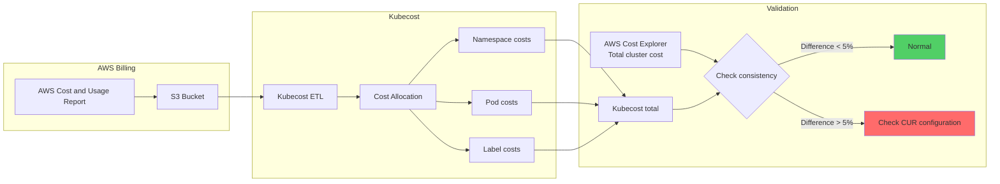
```mermaid
graph LR
    subgraph "AWS Billing"
        A[AWS Cost and Usage Report] --> B[S3 Bucket]
    end

    subgraph "Kubecost"
        B --> C[Kubecost ETL]
        C --> D[Cost Allocation]
        D --> E[Namespace costs]
        D --> F[Pod costs]
        D --> G[Label costs]
    end

    subgraph "Validation"
        H[AWS Cost Explorer<br/>Total cluster cost] --> I{Check consistency}
        E --> J[Kubecost total]
        F --> J
        G --> J
        J --> I
        I -->|Difference < 5%| K[Normal]
        I -->|Difference > 5%| L[Check CUR configuration]
    end

    style K fill:#51cf66
    style L fill:#ff6b6b
```

**Consistency validation queries:**

```bash
# Kubecost API - Total cluster cost (last 7 days)
curl "http://localhost:9090/model/allocation?window=7d&aggregate=cluster" | jq '.data[].totalCost'

# AWS CLI - Total Cost Explorer cost (last 7 days)
aws ce get-cost-and-usage \
  --time-period Start=$(date -d '7 days ago' +%Y-%m-%d),End=$(date +%Y-%m-%d) \
  --granularity DAILY \
  --metrics BlendedCost \
  --filter file://eks-filter.json

# eks-filter.json:
# {
#   "Tags": {
#     "Key": "eks:cluster-name",
#     "Values": ["<cluster-name>"]
#   }
# }
```

**Patterns for identifying areas with 20-60% potential cost savings:**

Identify optimization opportunities in the Kubecost dashboard using the following indicators:

| Indicator | Criterion | Estimated savings | Action |
|------|------|----------|------|
| **CPU Efficiency** | < 50% | 20-30% | Right-Sizing (VPA) |
| **Memory Efficiency** | < 60% | 15-25% | Right-Sizing (VPA) |
| **Idle Cost** | > 30% | 30-50% | HPA + Cluster Autoscaler/Karpenter |
| **Over-Provisioned Pods** | Requests utilization < 50% | 10-20% | Apply Goldilocks recommendations |
| **Spot Adoption** | < 30% | 40-60% | Switch to Spot + Graviton |

**Using Kubecost Savings Insights:**

```bash
# Kubecost API - Retrieve savings recommendations
curl "http://localhost:9090/model/savings" | jq '.data[] | {
  type: .savingsType,
  monthly_savings: .monthlySavings,
  resource: .resourceName
}'

# Expected output:
# {
#   "type": "rightsize-deployment",
#   "monthly_savings": 1240.50,
#   "resource": "production/web-app"
# }
# {
#   "type": "adopt-spot",
#   "monthly_savings": 3450.20,
#   "resource": "batch/worker-pool"
# }
```

#### 8.4.2 Goldilocks vs. Kubecost Tool Comparison

| Item | Goldilocks | Kubecost |
|------|-----------|----------|
| **Primary function** | Visualize VPA recommendations | Overall cost visibility + optimization recommendations |
| **Cost** | Free (open source) | Free (basic), Enterprise (paid) |
| **Installation complexity** | Low (one Helm command) | Medium (Prometheus configuration required) |
| **Data sources** | Metrics Server, VPA | Prometheus, AWS CUR, cloud billing APIs |
| **Recommendation scope** | CPU/Memory right-sizing | Right-Sizing, Spot, Graviton, Idle Resource, Cluster Sizing |
| **Cost allocation** | None | Namespace, Label, Pod, Deployment levels |
| **Budget management** | None | Budget alarms, cost trend forecasting |
| **Multi-cluster** | Independent per cluster | Unified dashboard supported |
| **AWS integration** | None | Cost Explorer, CUR, Savings Plans analysis |
| **Reports** | Web UI only | PDF, CSV, Slack/Teams alarms |

**Recommended scenarios:**

| Situation | Recommended tool | Reason |
|------|----------|------|
| **Single cluster, resource optimization only** | Goldilocks | Lightweight, quick start |
| **Multiple clusters, cost chargeback** | Kubecost | Enterprise-wide cost management required |
| **Startup, rapid savings needed** | Goldilocks → Kubecost | Incremental adoption |
| **Enterprise with a FinOps team** | Kubecost Enterprise | Advanced features (budgets, alarms, policies) |
| **Open source only** | Goldilocks + Prometheus | Cost of KRW 0 |

**Pattern for using both tools:**

```bash
# Quick right-sizing with Goldilocks
kubectl label namespace production goldilocks.fairwinds.com/enabled=true

# Track and validate overall costs with Kubecost
# 1. Record costs before applying Goldilocks recommendations
curl "http://localhost:9090/model/allocation?window=7d&aggregate=namespace&accumulate=true" \
  | jq '.data[] | select(.name=="production") | .totalCost'

# 2. Apply right-sizing
kubectl set resources deployment web-app -n production \
  --requests=cpu=300m,memory=512Mi \
  --limits=memory=1Gi

# 3. Check savings in Kubecost after 7 days
```

#### 8.4.3 Automated Cost Optimization Loop

At the core of FinOps is a **continuous cost visibility → optimization → validation loop**. Combined with GitOps, this can be fully automated.

**Cost optimization loop architecture:**

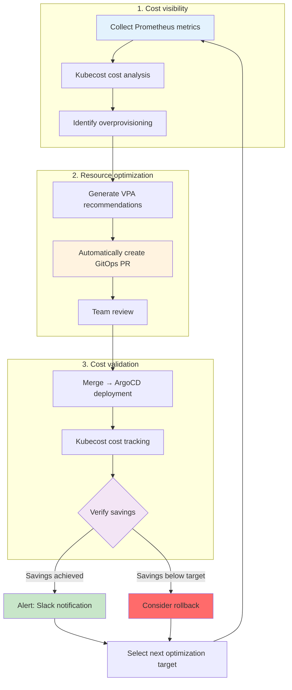
```mermaid
graph TB
    subgraph "1. Cost visibility"
        A[Collect Prometheus metrics] --> B[Kubecost cost analysis]
        B --> C[Identify overprovisioning]
    end

    subgraph "2. Resource optimization"
        C --> D[Generate VPA recommendations]
        D --> E[Automatically create GitOps PR]
        E --> F[Team review]
    end

    subgraph "3. Cost validation"
        F --> G[Merge → ArgoCD deployment]
        G --> H[Kubecost cost tracking]
        H --> I{Verify savings}
    end

    I -->|Savings achieved| J[Alert: Slack notification]
    I -->|Savings below target| K[Consider rollback]
    J --> L[Select next optimization target]
    K --> L
    L --> A

    style A fill:#e3f2fd
    style E fill:#fff3e0
    style I fill:#f3e5f5
    style J fill:#c8e6c9
    style K fill:#ff6b6b
```

**GitOps-based automatic right-sizing PR creation pattern:**

```python
# automation/right-sizing-bot.py
import requests
import yaml
import subprocess
from datetime import datetime

# 1. Retrieve recommendations from the Kubecost API
def get_kubecost_recommendations():
    response = requests.get("http://kubecost:9090/model/savings")
    savings = response.json()["data"]
    return [s for s in savings if s["savingsType"] == "rightsize-deployment"]

# 2. Update Deployment manifests
def update_deployment(namespace, name, cpu_request, memory_request):
    file_path = f"k8s/{namespace}/{name}.yaml"
    with open(file_path, 'r') as f:
        manifest = yaml.safe_load(f)

    # Update resources
    manifest["spec"]["template"]["spec"]["containers"][0]["resources"] = {
        "requests": {
            "cpu": cpu_request,
            "memory": memory_request
        },
        "limits": {
            "memory": str(int(memory_request.rstrip('Mi')) * 1.5) + 'Mi'
        }
    }

    with open(file_path, 'w') as f:
        yaml.dump(manifest, f)

# 3. Create a Git PR
def create_pr(recommendations):
    branch = f"right-sizing-{datetime.now().strftime('%Y%m%d')}"
    subprocess.run(["git", "checkout", "-b", branch])

    for rec in recommendations:
        update_deployment(
            rec["namespace"],
            rec["resourceName"],
            rec["recommendedCPU"],
            rec["recommendedMemory"]
        )
        subprocess.run(["git", "add", f"k8s/{rec['namespace']}/{rec['resourceName']}.yaml"])

    subprocess.run([
        "git", "commit", "-m",
        f"chore: apply Kubecost right-sizing (estimated savings: ${sum(r['monthlySavings'] for r in recommendations):.2f}/month)"
    ])
    subprocess.run(["git", "push", "origin", branch])

    # Create a GitHub PR
    subprocess.run([
        "gh", "pr", "create",
        "--title", f"Cost Optimization: Right-Sizing Recommendations",
        "--body", f"Estimated monthly savings: ${sum(r['monthlySavings'] for r in recommendations):.2f}\n\nAuto-generated by Kubecost",
        "--label", "cost-optimization"
    ])

# Execute
if __name__ == "__main__":
    recommendations = get_kubecost_recommendations()
    if recommendations:
        create_pr(recommendations)
```

**Run automation (CronJob):**

```yaml
apiVersion: batch/v1
kind: CronJob
metadata:
  name: right-sizing-bot
  namespace: automation
spec:
  schedule: "0 9 * * MON"  # Every Monday at 9 AM
  jobTemplate:
    spec:
      template:
        spec:
          serviceAccountName: right-sizing-bot
          containers:
          - name: bot
            image: right-sizing-bot:v1
            env:
            - name: KUBECOST_URL
              value: "http://kubecost.kubecost.svc:9090"
            - name: GITHUB_TOKEN
              valueFrom:
                secretKeyRef:
                  name: github-token
                  key: token
          restartPolicy: OnFailure
```

**Prometheus + Bedrock + GitOps automation reference:**

The [CNS421 session](https://www.youtube.com/watch?v=4s-a0jY4kSE) at AWS re:Invent 2025 introduced advanced automation patterns using Amazon Bedrock and Model Context Protocol (MCP):

```python
# Advanced pattern: AI-based optimization decision-making
from anthropic import Anthropic

client = Anthropic()

# Collect Prometheus metrics
metrics = get_prometheus_metrics()

# Request an optimization strategy through the Claude API
# English rendering of the prompt below; preserve the original API input:
# Analyze the following Kubernetes cluster metrics and propose an
# optimization strategy. Include cost-saving priorities, a risk assessment,
# and a step-by-step implementation plan.
response = client.messages.create(
    model="claude-sonnet-4-20250514",
    max_tokens=1024,
    messages=[{
        "role": "user",
        "content": f"""
        다음 Kubernetes 클러스터 메트릭을 분석하고 최적화 전략을 제안하세요:

        {metrics}

        다음을 포함하세요:
        1. 비용 절감 우선순위
        2. 리스크 평가
        3. 단계별 실행 계획
        """
    }]
)

# Include AI suggestions in the PR description
create_pr_with_ai_context(response.content)
```

#### 8.4.4 Graviton + Spot Cost Savings Scenarios

**Actual cost comparison table (as of February 2026, us-east-1):**

| Scenario | Instance type | vCPU | Memory | Hourly cost | Monthly cost (730h) | Savings |
|---------|-------------|------|--------|-----------|-----------------|--------|
| **Baseline: x86 On-Demand** | m6i.2xlarge | 8 | 32 GB | $0.384 | $280.32 | - |
| **Graviton On-Demand** | m7g.2xlarge | 8 | 32 GB | $0.3264 | $238.27 | **15%** |
| **x86 Spot** | m6i.2xlarge | 8 | 32 GB | $0.1152 (70% discount) | $84.10 | **70%** |
| **Graviton Spot** | m7g.2xlarge | 8 | 32 GB | $0.0979 (70% discount) | $71.47 | **75%** |

**Annual costs for a 100-node cluster:**

| Configuration | Monthly cost | Annual cost | Annual savings |
|------|----------|----------|-----------|
| x86 On-Demand (100 nodes) | $28,032 | $336,384 | - |
| Graviton On-Demand (100 nodes) | $23,827 | $285,924 | $50,460 (15%) |
| x86 Spot (100 nodes) | $8,410 | $100,920 | $235,464 (70%) |
| **Graviton Spot (100 nodes)** | **$7,147** | **$85,764** | **$250,620 (75%)** ⭐ |

**Recommended combinations by workload type:**

| Workload type | Recommended configuration | Reason | Estimated savings |
|-------------|----------|------|----------|
| **Production API (always on)** | Graviton On-Demand 70% + Graviton Spot 30% | Stability first, partial Spot use | 25-35% |
| **Batch jobs** | Graviton Spot 100% | Interruptions tolerated, cost first | 70-75% |
| **Development/staging** | Graviton Spot 100% | Interruptions tolerated, quick restarts | 70-75% |
| **Database** | Graviton On-Demand 100% | No interruptions allowed, stability first | 15% |
| **Queue workers (Stateless)** | Graviton Spot 80% + Graviton On-Demand 20% | Restart after interruptions, mostly Spot | 60-65% |
| **ML inference** | Graviton Spot 100% (p4d Spot for GPU workloads) | Interruptions tolerated, savings on expensive instances | 70-75% |

**YAML for preferring Graviton in Karpenter NodePool:**

```yaml
# Production API - Prefer Graviton, mixed Spot/On-Demand
apiVersion: karpenter.sh/v1
kind: NodePool
metadata:
  name: production-api-pool
spec:
  template:
    spec:
      requirements:
      # Prefer Graviton
      - key: kubernetes.io/arch
        operator: In
        values: ["arm64"]

      # Spot 70%, On-Demand 30% (controlled by weights)
      - key: karpenter.sh/capacity-type
        operator: In
        values: ["spot", "on-demand"]

      # Instance families for general-purpose workloads
      - key: node.kubernetes.io/instance-type
        operator: In
        values: ["m7g.large", "m7g.xlarge", "m7g.2xlarge"]

      nodeClassRef:
        group: karpenter.k8s.aws
        kind: EC2NodeClass
        name: default

  # Automatic replacement after Spot interruption
  disruption:
    consolidationPolicy: WhenUnderutilized
    expireAfter: 720h

  limits:
    cpu: "200"
    memory: "400Gi"

  weight: 100  # Highest priority

---
# Batch Jobs - Graviton Spot 100%
apiVersion: karpenter.sh/v1
kind: NodePool
metadata:
  name: batch-jobs-pool
spec:
  template:
    spec:
      requirements:
      - key: kubernetes.io/arch
        operator: In
        values: ["arm64"]

      - key: karpenter.sh/capacity-type
        operator: In
        values: ["spot"]  # Spot only

      - key: node.kubernetes.io/instance-type
        operator: In
        values: ["c7g.large", "c7g.xlarge", "c7g.2xlarge", "c7g.4xlarge"]

      nodeClassRef:
        group: karpenter.k8s.aws
        kind: EC2NodeClass
        name: default

      # Taints for batch jobs
      taints:
      - key: workload-type
        value: batch
        effect: NoSchedule

  disruption:
    consolidationPolicy: WhenUnderutilized
    expireAfter: 1h  # Short lifespan for batch jobs

  limits:
    cpu: "500"

  weight: 50

---
# Database - Graviton On-Demand 100%
apiVersion: karpenter.sh/v1
kind: NodePool
metadata:
  name: database-pool
spec:
  template:
    spec:
      requirements:
      - key: kubernetes.io/arch
        operator: In
        values: ["arm64"]

      - key: karpenter.sh/capacity-type
        operator: In
        values: ["on-demand"]  # On-Demand only

      # Memory-optimized instances
      - key: node.kubernetes.io/instance-type
        operator: In
        values: ["r7g.xlarge", "r7g.2xlarge", "r7g.4xlarge"]

      nodeClassRef:
        group: karpenter.k8s.aws
        kind: EC2NodeClass
        name: default

      taints:
      - key: workload-type
        value: database
        effect: NoSchedule

  disruption:
    consolidationPolicy: WhenEmpty  # Replace only when empty
    expireAfter: 2160h  # 90 days (long-running)

  limits:
    cpu: "100"
    memory: "800Gi"

  weight: 200  # Highest priority
```

**Selecting a NodePool from a Pod:**

```yaml
# API server - Use production-api-pool
apiVersion: apps/v1
kind: Deployment
metadata:
  name: api-server
spec:
  replicas: 20
  template:
    spec:
      nodeSelector:
        karpenter.sh/nodepool: production-api-pool
      containers:
      - name: api
        image: api-server:v1-arm64  # Image for Graviton
        resources:
          requests:
            cpu: "500m"
            memory: "1Gi"

---
# Batch job - Use batch-jobs-pool
apiVersion: batch/v1
kind: CronJob
metadata:
  name: nightly-report
spec:
  schedule: "0 2 * * *"
  jobTemplate:
    spec:
      template:
        spec:
          nodeSelector:
            karpenter.sh/nodepool: batch-jobs-pool
          tolerations:
          - key: workload-type
            operator: Equal
            value: batch
            effect: NoSchedule
          containers:
          - name: report-gen
            image: report-generator:v1-arm64
            resources:
              requests:
                cpu: "2000m"
                memory: "4Gi"
          restartPolicy: OnFailure

---
# Database - Use database-pool
apiVersion: apps/v1
kind: StatefulSet
metadata:
  name: postgres
spec:
  replicas: 3
  template:
    spec:
      nodeSelector:
        karpenter.sh/nodepool: database-pool
      tolerations:
      - key: workload-type
        operator: Equal
        value: database
        effect: NoSchedule
      containers:
      - name: postgres
        image: postgres:16-arm64
        resources:
          requests:
            cpu: "4000m"
            memory: "16Gi"
          limits:
            cpu: "4000m"
            memory: "16Gi"  # Guaranteed QoS
```

**Spot interruption response strategy:**

```yaml
# Guarantee minimum availability with PodDisruptionBudget
apiVersion: policy/v1
kind: PodDisruptionBudget
metadata:
  name: api-server-pdb
spec:
  minAvailable: 80%  # Maintain at least 80% of Pods
  selector:
    matchLabels:
      app: api-server

---
# Handle notifications 2 minutes before Spot interruption (DaemonSet)
apiVersion: apps/v1
kind: DaemonSet
metadata:
  name: spot-termination-handler
spec:
  selector:
    matchLabels:
      app: spot-termination-handler
  template:
    spec:
      serviceAccountName: spot-termination-handler
      containers:
      - name: handler
        image: aws/aws-node-termination-handler:v1.21.0
        env:
        - name: ENABLE_SPOT_INTERRUPTION_DRAINING
          value: "true"
        - name: ENABLE_SCHEDULED_EVENT_DRAINING
          value: "true"
```

**Actual savings cases (official AWS blog):**

| Organization | Workload | Previous configuration | After optimization | Savings |
|------|---------|----------|----------|--------|
| Fintech startup | API servers, 100 nodes | x86 On-Demand | Graviton Spot 70% + On-Demand 30% | $8,500/month (30%) |
| E-commerce company | Batch jobs, 200 nodes | x86 On-Demand | Graviton Spot 100% | $42,000/month (75%) |
| SaaS platform | Entire cluster, 300 nodes | Mixed x86 | Graviton 90% + Spot 60% | $65,000/month (65%) |

:::tip Graviton + Spot in Auto Mode
EKS Auto Mode analyzes Pod resource requirements and **automatically prefers Graviton Spot instances**, even without NodePool configurations such as those above. Container images must support the arm64 architecture.

```yaml
# Auto Mode environment - No NodePool required
apiVersion: apps/v1
kind: Deployment
metadata:
  name: api-server
spec:
  replicas: 20
  template:
    spec:
      containers:
      - name: api
        image: api-server:v1  # Multi-arch image (supports both arm64/amd64)
        resources:
          requests:
            cpu: "500m"
            memory: "1Gi"

      # Auto Mode automatically:
      # 1. Tries Graviton Spot first
      # 2. Uses Graviton On-Demand if Spot is unavailable
      # 3. Uses x86 Spot if Graviton is unavailable
      # 4. Uses x86 On-Demand as the last resort
```
:::

:::info See cost-management.md for the overall cost strategy
This document focuses on Pod resource optimization. For cluster-wide cost management strategies, see the [EKS Cost Management Guide](/docs/eks-best-practices/resource-cost/cost-management).
:::

## Comprehensive Checklist & References

### Resource Configuration Checklist

| Item | Check | Recommended setting |
|------|----------|----------|
| **CPU Requests** | ✅ P95 usage + 20% | Based on VPA Target |
| **CPU Limits** | ✅ Omit for general workloads | Set only for batch jobs |
| **Memory Requests** | ✅ P95 usage + 20% | Based on VPA Target |
| **Memory Limits** | ✅ Always set | Requests × 1.5~2 |
| **QoS class** | ✅ Guaranteed/Burstable in production | BestEffort prohibited |
| **VPA** | ✅ Off or Initial mode | Use Auto mode carefully |
| **HPA** | ✅ Configure Behavior | Aggressive ScaleUp, conservative ScaleDown |
| **ResourceQuota** | ✅ Configure per namespace | Differentiate by environment |
| **LimitRange** | ✅ Set defaults | Developer convenience |
| **PDB** | ✅ Required when using VPA Auto | minAvailable 80% |

### Related Documents

**Internal documents:**
- [Karpenter Autoscaling](/docs/eks-best-practices/resource-cost/karpenter-autoscaling) - Node-level scaling
- [EKS Cost Management](/docs/eks-best-practices/resource-cost/cost-management) - Overall cost optimization strategy
- [EKS Resiliency Guide](/docs/eks-best-practices/operations-reliability/eks-resiliency-guide) - Reliability checklist

**External references:**
- [Kubernetes Resource Management](https://kubernetes.io/docs/concepts/configuration/manage-resources-containers/)
- [Vertical Pod Autoscaler](https://github.com/kubernetes/autoscaler/tree/master/vertical-pod-autoscaler)
- [AWS EKS Best Practices - Resource Management](https://docs.aws.amazon.com/eks/latest/best-practices/reliability.html)
- [Goldilocks](https://github.com/FairwindsOps/goldilocks)

**Red Hat OpenShift documentation:**
- [Automatically Scaling Pods with HPA](https://docs.openshift.com/container-platform/4.18/nodes/pods/nodes-pods-autoscaling.html) — HPA configuration and operations
- [Vertical Pod Autoscaler](https://docs.openshift.com/container-platform/4.18/nodes/pods/nodes-pods-vertical-autoscaler.html) — Configuration and operations for each VPA mode
- [Quotas and Limit Ranges](https://docs.openshift.com/container-platform/4.18/applications/quotas/quotas-setting-per-project.html) — ResourceQuota and LimitRange configuration
- [Using CPU Manager](https://docs.openshift.com/container-platform/4.18/scalability_and_performance/using-cpu-manager.html) — Advanced CPU resource management

---

**Feedback and Contributions**

Submit feedback or improvement suggestions for this document through [GitHub Issues](https://github.com/devfloor9/engineering-playbook/issues).

**Document version**: v1.0 (2026-02-12)
**Next review**: 2026-05-12
