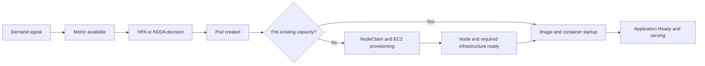
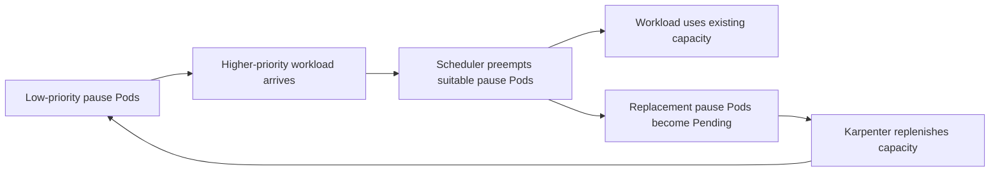
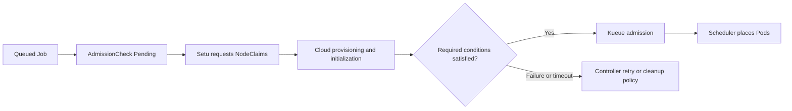

## Overview

Scaling on EKS consists of metric collection, replica decisions, scheduling, node provisioning, and application readiness. This chapter uses the Karpenter v1.13 API to explain how to measure those stages and combine queues, baseline capacity, and overprovisioning. Example capacities and intervals are tuning starting points, not throughput or latency guarantees.

Measure paths using existing capacity separately from paths requiring new nodes. Record EC2 capacity, images, initialization, HPA cadence, and workload conditions, then compare the latency distribution of each stage. Distinguish the responsibilities of [HPA](https://kubernetes.io/docs/tasks/run-application/horizontal-pod-autoscale/) and [Karpenter](https://karpenter.sh/v1.13/concepts/nodepools/).

## Scaling Strategy Decision Framework

First evaluate traffic predictability, synchronous response requirements, tolerated queue delay, and baseline capacity cost. Combine predictive and reactive scaling with buffering; use load tests and cost calculations to determine which approach is cheaper.

### Comparison of Approaches

Each approach reduces a different part of the latency path.

| Approach | Mechanism | Remaining latency | Suitable conditions |
| --- | --- | --- | --- |
| Reactive | KEDA/HPA → Karpenter | Observation, control loops, node startup | Unpredictable demand |
| Predictive | Pre-scale with KEDA cron, for example | Forecast error and image readiness | Recurring schedules |
| Resilience | Queues, limits, retries | Queue waiting time | Asynchronous processing |
| Baseline capacity | Run required replicas in advance | Demand exceeding planned capacity | Tight response latency budget |

### Cost Structure Comparison by Approach

Compare reserved node-hours, active node-hours, metrics, collectors, storage, transfer, staffing, and business loss. Cluster count alone does not determine monthly cost or ROI. The following is a formula, not a price list.

Use actual hourly node counts and rates for the Region and purchase option; account separately for Savings Plans/RI coverage, Spot variation, and Auto Mode management charges.

```text
monthly_compute = sum(node_count[t] * applicable_hourly_rate[t])
net_benefit = avoided_business_loss - incremental_compute - telemetry - operations
ROI = net_benefit / incremental_investment  # only when investment > 0
```

### Approach 2: Predictive Scaling

Use the [KEDA cron scaler](https://keda.sh/docs/2.20/scalers/cron/) for recurring peaks. CronHPA is not a built-in Kubernetes resource. This example requires the KEDA CRDs/controller and the `production/web-app` Deployment. It requests at least 20 replicas on weekdays from 08:30 to 19:00 Seoul time and at least 5 otherwise. With other triggers, HPA selects the larger replica requirement.

```yaml
apiVersion: keda.sh/v1alpha1
kind: ScaledObject
metadata:
  name: scheduled-web-app
  namespace: production
spec:
  scaleTargetRef:
    name: web-app
  minReplicaCount: 5
  maxReplicaCount: 100
  triggers:
    - type: cron
      metadata:
        timezone: Asia/Seoul
        start: "30 8 * * 1-5"
        end: "0 19 * * 1-5"
        desiredReplicas: "20"
```

### Approach 3: Architectural Resilience

A queue converts scaling latency into queue waiting time. Design retention, visibility timeout, retries/DLQs, idempotency, processing rate, and maximum tolerated wait together. For synchronous APIs, use timeouts, rate limits, circuit breakers, and load shedding. A queue alone does not eliminate failures or data loss.

The [SQS scaler](https://keda.sh/docs/2.20/scalers/aws-sqs/) requires queue permissions and authentication. Derive target queue length from measured message processing time, and deploy Istio/Envoy policies through the APIs supported by their installed versions.

<span id="approach-4-baseline-capacity" />

### Approach 4: Adequate Baseline Capacity

Calculate baseline capacity from load-tested per-replica throughput and failure headroom. This HPA targets an existing Deployment and requires Metrics Server. Each container needs CPU requests for utilization calculation. Choose either this HPA or a KEDA ScaledObject for the Deployment; do not configure competing autoscalers.

```yaml
apiVersion: autoscaling/v2
kind: HorizontalPodAutoscaler
metadata:
  name: web-app-hpa
  namespace: production
spec:
  scaleTargetRef:
    apiVersion: apps/v1
    kind: Deployment
    name: web-app
  minReplicas: 5
  maxReplicas: 100
  metrics:
    - type: Resource
      resource:
        name: cpu
        target:
          type: Utilization
          averageUtilization: 60
  behavior:
    scaleUp:
      stabilizationWindowSeconds: 0
      policies:
        - type: Percent
          value: 100
          periodSeconds: 15
      selectPolicy: Max
    scaleDown:
      stabilizationWindowSeconds: 300
      policies:
        - type: Percent
          value: 10
          periodSeconds: 60
```

## Problems with Conventional Autoscaling

Scaling latency is not solely a CPU-metric problem. Observe metric publication/collection, control loops, scheduling constraints, EC2 capacity, IP allocation, image downloads, initialization, and readiness probes separately. CPU remains a useful saturation signal; queue length and request rate can complement it depending on the workload.

<span id="karpenter-direct-to-metal-provisioning" />

## Karpenter Node Provisioning Path {#the-karpenter-revolution-direct-to-metal-provisioning}

<span id="references" />

Karpenter creates NodeClaims and requests EC2 capacity from Pending Pod requirements. Self-managed Karpenter does not require a separate ASG per node group. Drift does not guarantee immediate replacement for every configuration change: detection rules, disruption budgets, and PDBs all matter. See [provisioning](https://karpenter.sh/v1.13/concepts/nodepools/) and [drift](https://karpenter.sh/v1.13/concepts/disruption/#drift).

<span id="high-speed-metrics-architecture" />

## High-Speed Metrics Architecture: Two Approaches

CloudWatch and Prometheus can both support scaling, but collection cadence, API quotas, authentication, storage costs, and operational responsibility differ. Compare them under the same load and with identical start/end events.

<span id="cloudwatch-high-resolution" />

### Approach 1: CloudWatch High-Resolution Integration

High resolution is a storage resolution for custom metrics. It does not automatically shorten the publication interval of existing AWS service metrics. In particular, ALB CloudWatch metrics are published at 60-second intervals. See [ALB metrics](https://docs.aws.amazon.com/elasticloadbalancing/latest/application/load-balancer-cloudwatch-metrics.html).

#### Key Components

Applications publish metrics through PutMetricData or EMF logs; a KEDA CloudWatch scaler or another adapter reads them. Align IAM permissions, dimensions, and statistic periods. EMF has a log ingestion/extraction path and should not be depicted as the same path as a direct PutMetricData call.

#### Scaling Timeline

Record publication, ingestion, query, HPA reconciliation, Pod creation, and node/container readiness timestamps. High-resolution storage guarantees neither immediate end-to-end visibility nor immediate HPA execution. There is no universal 5,000-Pod ceiling implied by this architecture. Check the account/Region’s actual [CloudWatch service quotas](https://docs.aws.amazon.com/AmazonCloudWatch/latest/monitoring/cloudwatch_limits.html).

<span id="adot--prometheus" />

### Approach 2: ADOT + Prometheus Architecture

The ADOT/Prometheus path lets operators control scrape targets, retention, and query configuration. Collector CPU/memory, time-series cardinality, remote-write throughput, replication, and recovery all require design.

#### Key Components

The path is collector → Prometheus or remote storage → KEDA scaler → HPA. Thanos and Mimir are optional, not jointly mandatory components. [KEDA polling and HPA cadence](https://keda.sh/docs/2.20/reference/scaledobject-spec/) are separate.

#### Metric Collection and Scaling Latency Analysis {#scaling-timeline-66-seconds}

Measure the distribution across scraping, remote-write delay, query time, HPA cadence, and Pod readiness. This path does not guarantee 66 seconds, 100,000 TPS, or 20,000 Pods. Self-managed cost includes compute, HA, networking, and staffing in addition to storage.

### Cost-Optimized Metrics Strategy

Collect only the signals needed for scaling at high frequency, and collect diagnostic signals at the resolution they require. Count time series by label/dimension combinations, not metric names. Measure cost and detection quality before and after changing cadence.

### Recommended Use Cases

Evaluate CloudWatch when AWS integration and operational simplicity dominate; evaluate Prometheus when PromQL, scrape control, and shared observability infrastructure matter. Use measured throughput, latency budgets, cost, and operational capability rather than arbitrary Pod-count thresholds.

## Scaling Optimization Architecture: Layer-by-Layer Analysis

Track start/end events at each layer. Existing spare capacity can bypass the NodeClaim/EC2 path in this flow, but image and application readiness time remain.



<span id="production-patterns" />

## Core Karpenter Configuration

First check instance flexibility, accurate requests, and sufficient IP capacity, IAM permissions, and EC2 quotas. The following configures a [v1.13 NodePool](https://karpenter.sh/v1.13/concepts/nodepools/) and [EC2NodeClass](https://karpenter.sh/v1.13/concepts/nodeclasses/); it does not guarantee a boot time.

### Karpenter NodePool YAML

First configure controller IAM, the node role and cluster access, and the interruption queue through the [official installation procedure](https://karpenter.sh/v1.13/getting-started/getting-started-with-karpenter/). Replace `EXAMPLE_CLUSTER`, the role, and discovery tags. `al2023@latest` is for experimentation; pin a tested AMI release in production.

`Gt: "5"` means generation 6 or later. `m` is general purpose and `r` is memory optimized. Limits are not unlimited soft hints, although concurrent provisioning can temporarily overshoot them. Karpenter generates AL2023 nodeadm configuration; do not invoke the AL2 `/etc/eks/bootstrap.sh` script.

```yaml
apiVersion: karpenter.sh/v1
kind: NodePool
metadata:
  name: fast-scaling
spec:
  template:
    spec:
      nodeClassRef:
        group: karpenter.k8s.aws
        kind: EC2NodeClass
        name: fast-nodepool
      expireAfter: 720h
      requirements:
        - key: kubernetes.io/arch
          operator: In
          values: [amd64]
        - key: karpenter.k8s.aws/instance-category
          operator: In
          values: [c, m, r]
        - key: karpenter.k8s.aws/instance-generation
          operator: Gt
          values: ["5"]
        - key: karpenter.sh/capacity-type
          operator: In
          values: [spot, on-demand]
  limits:
    cpu: "1000"
    memory: 4000Gi
  disruption:
    consolidationPolicy: WhenEmptyOrUnderutilized
    consolidateAfter: 1m
    budgets:
      - nodes: "10%"
---
apiVersion: karpenter.k8s.aws/v1
kind: EC2NodeClass
metadata:
  name: fast-nodepool
spec:
  amiSelectorTerms:
    - alias: al2023@latest
  role: KarpenterNodeRole-EXAMPLE_CLUSTER
  subnetSelectorTerms:
    - tags:
        karpenter.sh/discovery: EXAMPLE_CLUSTER
  securityGroupSelectorTerms:
    - tags:
        karpenter.sh/discovery: EXAMPLE_CLUSTER
```

## Real-Time Scaling Workflow

Do not aggregate Pod creation through readiness into one undifferentiated duration. Correlate NodeClaim creation/Launched/Registered/Initialized, scheduler events, image pulling/Started, readiness probes, and actual traffic serving. Separate existing capacity, new On-Demand, and new Spot paths to expose bottlenecks.

## HPA Configuration for Aggressive Scaling

This configuration removes scale-up stabilization delay, not metric latency or the HPA control loop. HPA’s default synchronization period is 15 seconds; `behavior` does not change that cadence. Multiple metrics select the largest replica requirement rather than an arbitrary weighted average. See [HPA behavior](https://kubernetes.io/docs/tasks/run-application/horizontal-pod-autoscale/). This is an alternative for the existing `production/web-app` Deployment.

```yaml
apiVersion: autoscaling/v2
kind: HorizontalPodAutoscaler
metadata:
  name: web-app-hpa
  namespace: production
spec:
  scaleTargetRef:
    apiVersion: apps/v1
    kind: Deployment
    name: web-app
  minReplicas: 5
  maxReplicas: 100
  metrics:
    - type: Resource
      resource:
        name: cpu
        target:
          type: Utilization
          averageUtilization: 60
  behavior:
    scaleUp:
      stabilizationWindowSeconds: 0
      policies:
        - type: Percent
          value: 100
          periodSeconds: 15
      selectPolicy: Max
    scaleDown:
      stabilizationWindowSeconds: 300
      policies:
        - type: Percent
          value: 10
          periodSeconds: 60
```

## When to Use KEDA: Event-Driven Scenarios

Use KEDA scalers for demand such as queues, streams, or external request rate that CPU alone cannot represent well. KEDA generally creates an HPA and supplies metrics, while Karpenter provides nodes for Pending Pods. Configure [ScaledObject](https://keda.sh/docs/2.20/reference/scaledobject-spec/) authentication, fallback, and cooldown for the demand pattern.

## Designing Reproducible Scaling Measurements {#production-performance-metrics}

Collect measured values in the following format. This document has no validated production benchmark dataset, so cluster counts, request volumes, and 100% availability figures are not presented as measured results.

| Metric | Start → end | Conditions to separate |
| --- | --- | --- |
| Detection latency | Load increase → queryable metric | Collection path and cadence |
| Provisioning latency | NodeClaim creation → Initialized | Region, AZ, instance, purchase option |
| Serving-capacity latency | Load increase → additional serving capacity | Image cache, readiness, load shape |
| Operational impact | Entire test window | P50/P95/P99, error rate, cost, sample count |

## Multi-Region Considerations

Validate EC2 supply, quotas, IP/subnet capacity, AMIs, image replication, and telemetry paths per Region. Identical instance lists or collection intervals do not guarantee identical performance across Regions. Test failover capacity and traffic switching against actual demand and SLOs.

## Scaling Optimization Best Practices

Review configuration and observability in the following order.

### 1. Metric Selection

Select signals that explain demand and control cardinality. Evaluate CPU, queue length, processing time, and error rate together; do not impose an arbitrary universal limit of 10–15 high-resolution metrics.

### 2. Karpenter Optimization

Review NodePool instance/AZ flexibility, workload requests, PDBs, and interruption handling. The v1 API uses `disruption.consolidationPolicy` and `consolidateAfter`, not `ttlSecondsAfterEmpty`. See [disruption configuration](https://karpenter.sh/v1.13/concepts/disruption/).

### 3. HPA Tuning

Set maxReplicas with downstream capacity in mind and test scale-up/down policies. Shorter stabilization windows can increase oscillation. Multiple metrics select the largest requirement; avoid competing autoscalers on the same target.

### 4. Monitoring

Derive latency, error-rate, and queue-age alarms from the SLO. Observe P99 as well as P95, failures/retries, Spot interruptions, hourly node cost, and controller errors. There is no universal 15-second failure threshold.

## Troubleshooting Common Issues

First inspect Pending Pod events, requests, affinity, taints, and PVCs, then NodePool/EC2NodeClass conditions and NodeClaim events. Distinguish EC2 supply failures from quotas, constrained instance/AZ choices, and subnet IP exhaustion. `describe-instance-type-offerings` lists supported locations; it is not a live spare-capacity API.

```bash
kubectl get pods -n production --field-selector=status.phase=Pending
kubectl get nodepools,ec2nodeclasses,nodeclaims
kubectl describe nodepool fast-scaling
kubectl describe ec2nodeclass fast-nodepool
kubectl get events -n production --sort-by=.lastTimestamp
```

## Hybrid Approach (Recommended)

Choose CloudWatch or Prometheus per service’s latency budget and operational foundation. Reuse collection where the same telemetry is needed, while checking duplicate time series and charges. Adopt incrementally and use a common load test to judge improvements.

## EKS Auto Mode vs Self-managed Karpenter

[EKS Auto Mode](https://docs.aws.amazon.com/eks/latest/userguide/automode.html) expands infrastructure management to nodes, networking, storage, and related capabilities. Its APIs, AMIs, and access policies differ from self-managed Karpenter. It does not automatically create or tune Pod HPA/VPA policies or application requests. Check instance-specific management charges rather than assuming a fixed 10% premium.

## Designing for Lower Scaling Latency {#p1-ultra-fast-scaling-architecture-critical}

Target low scaling latency while distinguishing existing-capacity and new-provisioning paths.

### Scaling Latency Breakdown

Collect the times of load arrival, metric visibility, replica changes, Pod creation, readiness, and traffic serving. Correlate node events to attribute time to stages, and publish percentiles with sample counts and experimental conditions.

### Multi-Layer Scaling Strategy

Separate (1) already-running replicas, (2) spare node capacity or low-priority pause Pods, and (3) new Karpenter provisioning. Both Spot and On-Demand can face capacity shortages; On-Demand fallback is not an availability guarantee.

### Scaling Timeline Comparison by Layer

Preallocated capacity removes EC2 launch time from the critical path, but HPA observation/reconciliation, preemption, images, and readiness remain. New-node paths add EC2 launch and bootstrap. Measure each path separately and size capacity for demand and cost.

## Selecting and Validating Provisioned Control Plane {#p2-eliminate-api-bottlenecks-with-provisioned-eks-control-plane}

Choose control-plane capacity after establishing whether API throughput is the bottleneck.

### Provisioned Control Plane Overview

[Provisioned Control Plane](https://docs.aws.amazon.com/eks/latest/userguide/eks-provisioned-control-plane-getting-started.html) preallocates control-plane capacity through a scaling tier. Investigate API Priority and Fairness, client rate limits, webhook latency, scheduler load, and etcd separately. Selecting a tier does not remove all throttling or downstream bottlenecks.

### Standard vs Provisioned Comparison

Choose a tier using the [official feature documentation](https://docs.aws.amazon.com/eks/latest/userguide/eks-provisioned-control-plane.html) and [pricing](https://aws.amazon.com/eks/pricing/), not arbitrary Pod counts, $350/month, or a fixed 10× performance claim.

| Criterion | Standard | Provisioned |
| --- | --- | --- |
| Capacity model | AWS-managed automatic scaling | Preallocated capacity for selected tier |
| Evaluation | API latency, throttling, scheduler delay | Measure tiers under identical load |
| Cost assessment | Cluster and version support charges | Also check the applicable tier charge |

### Provisioned Control Plane Configuration

Before changing capacity, check the current tier, IAM permissions, Regional support, and rates. The commands are operator instructions; document validation did not create or modify a cluster.

#### Create a New Cluster with the AWS CLI

Use `--control-plane-scaling-config` from the [official CLI procedure](https://docs.aws.amazon.com/eks/latest/userguide/eks-provisioned-control-plane-getting-started.html). `$CLUSTER_ROLE_ARN`, `$SUBNET_IDS`, and `$SECURITY_GROUP_IDS` must identify pre-created, validated resources. Prepare network access and node configuration separately.

```bash
aws eks create-cluster --name "$CLUSTER_NAME"   --role-arn "$CLUSTER_ROLE_ARN"   --resources-vpc-config "subnetIds=$SUBNET_IDS,securityGroupIds=$SECURITY_GROUP_IDS"   --control-plane-scaling-config tier=tier-xl
```

#### Upgrade an Existing Cluster (Standard → Provisioned)

Updates are asynchronous. Use the returned update ID to inspect status/errors, then verify API latency and workload impact. There is no guaranteed 10–15-minute completion or zero disruption. Check the [current official procedure](https://docs.aws.amazon.com/eks/latest/userguide/eks-provisioned-control-plane-getting-started.html) for tier changes and return-to-Standard conditions; recovery requires a separate update to a supported prior tier.

```bash
aws eks describe-cluster --name "$CLUSTER_NAME"   --query 'cluster.controlPlaneScalingConfig'
aws eks update-cluster-config --name "$CLUSTER_NAME"   --control-plane-scaling-config tier=tier-2xl
aws eks describe-update --name "$CLUSTER_NAME" --update-id "$UPDATE_ID"
```

### Performance Comparison During Large Bursts

Test tiers with identical Pod counts, creation rates, admission webhooks, and watch load. Record API 429s, request latency, scheduler pending time, errors/retries, and incremental cost. Report the test manifest, Region, Kubernetes version, and sample count rather than inventing results for a 1,000-Pod test.

## P3: Warm Pool / Overprovisioning Pattern (Core Strategy)

Warm Pool here means overprovisioning: low-priority Pods retain capacity on running Kubernetes nodes. It is distinct from EC2 Auto Scaling Warm Pools of stopped or hibernated instances.

### How Pause Pod Overprovisioning Works

Run pause Pods below the priority of real workloads. When capacity is needed, the scheduler can preempt them and place the workloads. [Pod priority/preemption](https://kubernetes.io/docs/concepts/scheduling-eviction/pod-priority-preemption/) guarantees neither immediate execution nor satisfaction of every constraint. Align NodePool, AZ, and resource shape between pause Pods and workloads.

### End-to-End Overprovisioning Workflow

When pause Pods are preempted, their Deployment recreates them, and Karpenter may replenish capacity for the Pending replacements. Watch for churn and tune consolidation, PDBs, and affinity together.



### Pause Pod Overprovisioning YAML Configuration

The following resources use example capacities. Real workloads must have priority 0 or higher and be eligible for the same node pool. Do not interpret pause Pod count as a fixed percentage of peak demand.

#### 1. Define a PriorityClass (Low Priority)

This PriorityClass is dedicated to preemptible pause Pods. Verify that real workloads have a higher priority.

```yaml
apiVersion: scheduling.k8s.io/v1
kind: PriorityClass
metadata:
  name: overprovisioning
value: -1
globalDefault: false
description: "Preemptible capacity reservation for higher-priority workloads"
```

#### 2. Pause Deployment (Baseline Warm Pool)

This example reserves 1 CPU and 2Gi per Pod across 10 Pods, using the preceding `fast-scaling` NodePool. Derive production reservation size from measured demand, fragmentation, and availability by AZ.

```yaml
apiVersion: apps/v1
kind: Deployment
metadata:
  name: overprovisioning-pause
  namespace: kube-system
spec:
  replicas: 10
  selector:
    matchLabels:
      app: overprovisioning-pause
  template:
    metadata:
      labels:
        app: overprovisioning-pause
    spec:
      priorityClassName: overprovisioning
      terminationGracePeriodSeconds: 0
      nodeSelector:
        karpenter.sh/nodepool: fast-scaling
      containers:
        - name: pause
          image: registry.k8s.io/pause:3.10
          resources:
            requests:
              cpu: "1"
              memory: 2Gi
            limits:
              cpu: "1"
              memory: 2Gi
```

#### 3. Automatic Warm Pool Adjustment by Time of Day (CronJob)

The schedule expands and shrinks capacity on Seoul-time weekdays; Friday evening’s minimum remains through the weekend. Alert on failed Jobs and missed schedules. The kubectl image is an example version: verify supported version skew and registry access for the cluster. Do not let HPA/KEDA concurrently modify this Deployment.

```yaml
apiVersion: batch/v1
kind: CronJob
metadata:
  name: scale-up-warm-pool
  namespace: kube-system
spec:
  schedule: "30 8 * * 1-5"
  timeZone: Asia/Seoul
  concurrencyPolicy: Forbid
  jobTemplate:
    spec:
      template:
        spec:
          serviceAccountName: warm-pool-scaler
          restartPolicy: OnFailure
          containers:
            - name: kubectl
              image: registry.k8s.io/kubectl:v1.33.5
              command: [kubectl]
              args: [scale, deployment/overprovisioning-pause, --namespace=kube-system, --replicas=30]
---
apiVersion: batch/v1
kind: CronJob
metadata:
  name: scale-down-warm-pool
  namespace: kube-system
spec:
  schedule: "0 19 * * 1-5"
  timeZone: Asia/Seoul
  concurrencyPolicy: Forbid
  jobTemplate:
    spec:
      template:
        spec:
          serviceAccountName: warm-pool-scaler
          restartPolicy: OnFailure
          containers:
            - name: kubectl
              image: registry.k8s.io/kubectl:v1.33.5
              command: [kubectl]
              args: [scale, deployment/overprovisioning-pause, --namespace=kube-system, --replicas=5]
---
apiVersion: v1
kind: ServiceAccount
metadata:
  name: warm-pool-scaler
  namespace: kube-system
---
apiVersion: rbac.authorization.k8s.io/v1
kind: Role
metadata:
  name: warm-pool-scaler
  namespace: kube-system
rules:
  - apiGroups: [apps]
    resources: [deployments, deployments/scale]
    resourceNames: [overprovisioning-pause]
    verbs: [get, patch, update]
---
apiVersion: rbac.authorization.k8s.io/v1
kind: RoleBinding
metadata:
  name: warm-pool-scaler
  namespace: kube-system
roleRef:
  apiGroup: rbac.authorization.k8s.io
  kind: Role
  name: warm-pool-scaler
subjects:
  - kind: ServiceAccount
    name: warm-pool-scaler
    namespace: kube-system
```

### Calculating Warm Pool Size

Use per-replica CPU/memory, additional demand arriving before scaling completes, AZ/affinity constraints, and safety headroom. For example, 20 additional workload Pods requiring 1 CPU and 2Gi each need at least 20 CPU and 40Gi plus placement headroom. Node-level rounding and fragmentation mean Pod count alone cannot determine cost.

### Cost Analysis and Optimization

Calculate cost from incremental node-hours. If three nodes are **assumed** to cost $0.20/hour and run an additional 12 hours/day for 22 days/month, compute cost is `3 × 0.20 × 12 × 22 = $158.40`. This rate is not an AWS quote; actual billing must include purchase options, discounts, telemetry, and other relevant charges.

Reserved node capacity and already-running baseline replicas differ in image/application readiness, so equal cost does not imply equal benefit. Spot reservations can disappear on interruption.

## P4: Setu - Kueue + Karpenter Proactive Provisioning

Evaluate Setu as a separate project, not a built-in feature of Kueue or Karpenter.

### Setu Overview

The [Setu project](https://github.com/sanjeevrg89/Setu) connects Kueue AdmissionCheck with Karpenter NodeClaim. In contrast, the built-in [Kueue ProvisioningRequest](https://kueue.sigs.k8s.io/docs/concepts/admission_check/provisioning_request/) path targets Cluster Autoscaler. Review the implementation and compatibility of the selected Setu release/commit.

Creating multiple NodeClaims is not a single atomic Kubernetes API transaction. Test partial success, retries, and cleanup; all nodes being Ready does not guarantee simultaneous Pod scheduling or zero billed GPU idle time.

### Setu Architecture and Operation

While a Workload’s AdmissionCheck is Pending, the controller creates NodeClaims and approves admission after checking the required conditions. Queue waiting and provisioning can overlap, but this does not remove EC2 readiness time or guarantee a shorter total.



### Setu Installation and Configuration

First validate Kueue, Karpenter, GPU drivers/device plugins, IAM, subnets, and the node role. Match Setu’s controllerName, NodeClass selection, readiness checks, and retries to the selected version’s manifests and code.

#### Setu Components and Installation Review {#1-install-setu-helm}

Do not use the former `setu.sh` Helm repository or invented values. Follow the [project installation documentation](https://github.com/sanjeevrg89/Setu) using deployment manifests from a reviewed release/commit, checking CRDs, RBAC, images, and controllerName. Installation, upgrades, and recovery are operator responsibilities separate from upstream Kueue/Karpenter.

#### 2. ClusterQueue with AdmissionCheck

The following uses Kueue v0.16+ v1beta2 resources. The installed Setu controller must provide an Active `karpenter-provision` AdmissionCheck. Do not create an invented `ProvisioningParameters` CRD. The `gpu` ResourceFlavor label matches the following GPU NodePool. First check the Kueue API versions served by the cluster.

```yaml
apiVersion: kueue.x-k8s.io/v1beta2
kind: ResourceFlavor
metadata:
  name: gpu
spec:
  nodeLabels:
    karpenter.sh/nodepool: gpu
---
apiVersion: kueue.x-k8s.io/v1beta2
kind: ClusterQueue
metadata:
  name: gpu-jobs
spec:
  namespaceSelector: {}
  resourceGroups:
    - coveredResources: [cpu, memory, nvidia.com/gpu]
      flavors:
        - name: gpu
          resources:
            - name: cpu
              nominalQuota: "32"
            - name: memory
              nominalQuota: 128Gi
            - name: nvidia.com/gpu
              nominalQuota: "4"
  admissionChecksStrategy:
    admissionChecks:
      - name: karpenter-provision
---
apiVersion: kueue.x-k8s.io/v1beta2
kind: LocalQueue
metadata:
  name: gpu-jobs
  namespace: production
spec:
  clusterQueue: gpu-jobs
```

#### 3. GPU NodePool (Karpenter)

Validate the AMI ID, Region, architecture, Kubernetes version, and GPU drivers before replacing the placeholder. The AL2023 family name alone does not establish that every GPU component is installed. The device plugin and required DaemonSets must tolerate the GPU taint. Capacity-type list order does not guarantee purchase ratios or availability.

```yaml
apiVersion: karpenter.sh/v1
kind: NodePool
metadata:
  name: gpu
spec:
  template:
    spec:
      nodeClassRef:
        group: karpenter.k8s.aws
        kind: EC2NodeClass
        name: gpu
      requirements:
        - key: node.kubernetes.io/instance-type
          operator: In
          values: [g5.4xlarge, g5.8xlarge]
        - key: karpenter.sh/capacity-type
          operator: In
          values: [spot, on-demand]
      taints:
        - key: nvidia.com/gpu
          effect: NoSchedule
  limits:
    cpu: "128"
  disruption:
    consolidationPolicy: WhenEmpty
    consolidateAfter: 5m
---
apiVersion: karpenter.k8s.aws/v1
kind: EC2NodeClass
metadata:
  name: gpu
spec:
  amiFamily: AL2023
  amiSelectorTerms:
    - id: ami-0123456789abcdef0
  role: KarpenterNodeRole-EXAMPLE_CLUSTER
  subnetSelectorTerms:
    - tags:
        karpenter.sh/discovery: EXAMPLE_CLUSTER
  securityGroupSelectorTerms:
    - tags:
        karpenter.sh/discovery: EXAMPLE_CLUSTER
```

#### 4. AI/ML Job Submission Example

This diagnostic Job requests four GPUs in total: four Pods with one GPU each. It does not implement distributed training or gang scheduling. Training requires validated framework rendezvous, synchronization, recovery, and any separate scheduling guarantees. `suspend: true` waits for Kueue admission.

```yaml
apiVersion: batch/v1
kind: Job
metadata:
  name: gpu-diagnostic
  namespace: production
  labels:
    kueue.x-k8s.io/queue-name: gpu-jobs
spec:
  suspend: true
  parallelism: 4
  completions: 4
  backoffLimit: 1
  template:
    spec:
      restartPolicy: Never
      tolerations:
        - key: nvidia.com/gpu
          operator: Exists
          effect: NoSchedule
      containers:
        - name: diagnostic
          image: nvidia/cuda:12.4.1-base-ubuntu22.04
          command: [nvidia-smi]
          resources:
            requests:
              cpu: "4"
              memory: 16Gi
              nvidia.com/gpu: "1"
            limits:
              cpu: "4"
              memory: 16Gi
              nvidia.com/gpu: "1"
```

### Measuring Setu Performance Improvements

Record Job submission → quota reservation → NodeClaim creation → node initialization → admission → all Pods Ready/job completion. Check remaining NodeClaims, EC2 instances, and charges after partial failures and cleanup. Compare total duration and idle seconds per GPU with the reactive path; do not promise 15–30-second completion, a 40-second improvement, or elimination of idle cost.

## Node Readiness Controller: Readiness-Based Placement {#p5-eliminate-boot-delays-with-node-readiness-controller}

NRC adds readiness conditions for workload placement. It is not a node boot acceleration feature.

### The Node Readiness Problem

Kubelet’s Node Ready condition is not an aggregate that waits for every DaemonSet. If workloads require GPU drivers, additional CNI conditions, storage, or image readiness, use appropriate condition publishers and scheduling controls.

### How Node Readiness Controller Works

[NRC](https://github.com/kubernetes-sigs/node-readiness-controller) evaluates the Node conditions in a NodeReadinessRule and adds/removes the configured taint. It does not perform health checks itself or bypass kubelet’s Ready semantics. `bootstrap-only` stops checking after initial completion; `continuous` keeps evaluating conditions. A NoSchedule taint restricts new placement and does not automatically evict existing Pods.

### Node Readiness Controller Installation

NRC is a separately installed kubernetes-sigs project. Check its early API support in the [project documentation](https://github.com/kubernetes-sigs/node-readiness-controller). It is not enabled through a Karpenter feature gate or as an EKS Auto Mode built-in feature.

#### Additional Readiness Conditions and Taint Behavior {#1-install-nrc-helm}

Follow the CRD, controller, validation webhook, and RBAC installation procedure for a reviewed release of the [official repository](https://github.com/kubernetes-sigs/node-readiness-controller). Do not use an unverified Helm repository. Node Feature Discovery is not mandatory, and labels alone do not publish the required Node conditions. Ensure the controller and condition publishers are not blocked by the taints they must clear.

#### Node Readiness Controller Adoption Requirements {#2-define-the-nodereadinessrule-crd}

This is an instance of an installed CRD, not the CRD definition. `example.com/CNIReady` is a custom condition; do not assume Amazon VPC CNI publishes it automatically. A component must verify the node’s actual readiness and publish that condition before the taint can be removed.

```yaml
apiVersion: readiness.node.x-k8s.io/v1alpha1
kind: NodeReadinessRule
metadata:
  name: network-readiness-rule
spec:
  conditions:
    - type: example.com/CNIReady
      requiredStatus: "True"
  taint:
    key: readiness.k8s.io/NetworkReady
    effect: NoSchedule
    value: pending
  enforcementMode: bootstrap-only
  nodeSelector:
    matchLabels:
      readiness.example.com/profile: network
```

### Integrating Karpenter Startup Taints {#karpenter--nrc-integration-configuration}

To close the gap between node registration and rule evaluation, configure matching key/value/effect in Karpenter startupTaints. Karpenter expects an external component to remove this taint. Validate the condition publisher, NRC, and tolerations of required DaemonSets together.

#### Custom-Condition Configuration Example {#1-karpenter-nodepool-with-nrc-annotation}

This separate NodePool references the preceding `fast-nodepool` EC2NodeClass. Workloads intentionally remain Pending if actual network readiness is not established. Do not add unsupported NRC annotations or bootstrap shell commands.

```yaml
apiVersion: karpenter.sh/v1
kind: NodePool
metadata:
  name: readiness-gated
spec:
  template:
    metadata:
      labels:
        readiness.example.com/profile: network
    spec:
      nodeClassRef:
        group: karpenter.k8s.aws
        kind: EC2NodeClass
        name: fast-nodepool
      startupTaints:
        - key: readiness.k8s.io/NetworkReady
          value: pending
          effect: NoSchedule
      requirements:
        - key: karpenter.sh/capacity-type
          operator: In
          values: [on-demand]
  limits:
    cpu: "100"
```

#### Condition Publisher Validation and Diagnostics {#2-vpc-cni-readiness-rule-detailed-configuration}

A custom publisher must verify actual CNI connectivity and have the minimum permission needed to update Node status conditions. The example condition name is not a feature enabled merely by installing NRC. Compare rule conditions, taints, and targets with these read-only queries.

```bash
kubectl get nodereadinessrules network-readiness-rule -o yaml
kubectl get nodes -l readiness.example.com/profile=network -o json   | jq '.items[] | {name: .metadata.name, taints: .spec.taints, conditions: .status.conditions}'
```

### Readiness Validation and Operational Considerations {#nrc-performance-comparison}

Measure NRC by premature-placement failures, taint waiting time, and condition publication/removal latency, not a 50% reduction in Node Ready time. Adding required conditions may delay first placement. Test GPU allocatable resources, CNI connectivity, CSI registration, and volume attach/mount separately.

An external controller must remove Pod schedulingGates. Arbitrary label affinity or checking `/var/lib/kubelet` inside a Pod is not a general substitute for CSI readiness. During recovery, investigate the publisher and rule before removing taints without verification.

## Conclusion

Karpenter supplies nodes, HPA/KEDA control replica counts, and NRC enforces additional placement-readiness conditions. Baseline capacity and overprovisioning trade additional cost for less dependence on new EC2 capacity. Choose control-plane tiers, queues, and image optimizations to address measured bottlenecks. No combination solves every failure or guarantees a fixed scaling time.

### Overall Recommendations

First correct requests, scheduling constraints, IAM, and IP capacity, then observe load and metrics. Next tune HPA/KEDA and evaluate queues and load shedding. Add overprovisioning when the benefit of existing capacity justifies its cost; evaluate installation, upgrades, and failure recovery before adding another controller.

## Complete Guide to EKS Auto Mode

EKS Auto Mode lets AWS manage node compute and parts of networking and storage. Users still own application requests, replica policies, availability design, and cost review. The examples below distinguish Auto Mode APIs from self-managed Karpenter APIs; they assume neither identical scaling latency nor a fixed management-fee percentage.

### Managed Karpenter: Automatic Infrastructure Management

Auto Mode provides an AWS-managed node OS and Karpenter-based compute management. It does not expose the same arbitrary AMI and bootstrap customization model as self-managed Karpenter. Prepare the cluster IAM role, node role, and required permissions. Enabling Auto Mode does not configure HPA/VPA or application requests automatically. Review current node-replacement and disruption constraints as well. Choose it against the [documented feature scope](https://docs.aws.amazon.com/eks/latest/userguide/automode.html).

### Detailed Auto Mode vs Self-managed Comparison

Compare operational responsibilities and extension APIs.

| Item | EKS Auto Mode | Self-managed Karpenter |
| --- | --- | --- |
| Node class | eks.amazonaws.com/NodeClass | karpenter.k8s.aws/EC2NodeClass |
| Node OS/AMI | AWS-managed OS; supported NodeClass settings | Supported AMI families and user-managed AMIs |
| Controller operations | Managed by AWS | User-managed installation, permissions, upgrades, and observability |
| Pod replicas/requests | Design HPA/KEDA/VPA separately | Design HPA/KEDA/VPA separately |
| Cost | EC2, applicable Auto Mode charges, and related services | EC2, controller operation, and related services |
| Scaling latency | Measure each workload, capacity, and readiness path | Measure each workload, capacity, and readiness path |

### Measuring the Auto Mode Scaling Path {#ultra-fast-scaling-with-auto-mode}

Measure Auto Mode scaling across metric detection, replica changes, node provisioning, image preparation, and readiness. A managed controller alone does not establish faster scaling or a fixed p99 latency. AWS manages the built-in NodePools; express separate workload policies in custom NodePools.

### Built-in NodePool Configuration

On a cluster with the built-in `system` and `general-purpose` NodePools enabled, inspect their actual settings with the following commands. This is not a manifest for overwriting the built-in pools. Manage their enabled state through EKS configuration and place distinct requirements in a new NodePool. Check Pod selectors, affinity, tolerations, and overlap with existing pools.

```bash
kubectl get nodepools system general-purpose -o yaml
kubectl get nodeclasses.eks.amazonaws.com -o yaml
```

### Self-managed → Auto Mode Migration Guide

Before enabling an existing cluster, follow the [official migration procedure](https://docs.aws.amazon.com/eks/latest/userguide/auto-enable-existing.html) to prepare cluster IAM policies, the `sts:TagSession` trust policy, node roles, and networking/storage prerequisites. Set `CLUSTER_NAME` to the target cluster. Enable compute, load balancing, and block storage in the same request. Configure the node role and pools as documented if using built-in pools.

Enabling the feature does not immediately migrate existing nodes or workloads. Place a canary first, validate images, service exposure, PVCs, AZ constraints, PDBs, and termination behavior, then move workloads gradually. Retain recovery capacity; do not delete existing NodeGroups before validation.

```bash
aws eks update-cluster-config --name "$CLUSTER_NAME"   --compute-config enabled=true   --kubernetes-network-config '{"elasticLoadBalancing":{"enabled":true}}'   --storage-config '{"blockStorage":{"enabled":true}}'
```

### Auto Mode Cluster Creation YAML

This new-cluster configuration uses the [eksctl Auto Mode schema](https://docs.aws.amazon.com/eks/latest/eksctl/auto-mode.html). Before use, verify the account, Region, IAM permissions, eksctl version, and regional availability of the selected Kubernetes version. `1.33` is the example version for this chapter, not a claim that it is latest or supported in every Region. No cluster was created during this documentation review.

```yaml
apiVersion: eksctl.io/v1alpha5
kind: ClusterConfig
metadata:
  name: auto-mode-example
  region: us-east-1
  version: "1.33"
autoModeConfig:
  enabled: true
```

### Auto Mode NodePool Customization

This custom pool requires enabled Auto Mode and an existing `default` NodeClass. It uses fields documented for [Auto Mode NodePools](https://docs.aws.amazon.com/eks/latest/userguide/create-node-pool.html), rather than mixing in self-managed Karpenter EC2NodeClass fields. Configure intended Pods to select `workload-class: custom`. Pods without that selector may also use the pool if otherwise compatible; design taints and tolerations when stronger isolation is required.

```yaml
apiVersion: karpenter.sh/v1
kind: NodePool
metadata:
  name: custom-workloads
spec:
  template:
    metadata:
      labels:
        workload-class: custom
    spec:
      nodeClassRef:
        group: eks.amazonaws.com
        kind: NodeClass
        name: default
      requirements:
        - key: kubernetes.io/arch
          operator: In
          values: [amd64]
        - key: karpenter.sh/capacity-type
          operator: In
          values: [on-demand]
  limits:
    cpu: "100"
```

## Latest Karpenter v1.x Features

The self-managed Karpenter examples below target v1.13. Check installed CRD and controller versions together and use the corresponding [NodePool](https://karpenter.sh/v1.13/concepts/nodepools/), [EC2NodeClass](https://karpenter.sh/v1.13/concepts/nodeclasses/), and [disruption](https://karpenter.sh/v1.13/concepts/disruption/) documentation. Do not assume Auto Mode exposes the same fields or feature gates at the same time.

### Consolidation Policies: Speed vs Cost

`WhenEmpty` considers empty nodes; `WhenEmptyOrUnderutilized` also considers underutilized nodes that can be consolidated. `consolidateAfter` is a delay after relevant Pod changes, not a guaranteed savings rate or exact deletion time. This complete NodePool example references the earlier `fast-nodepool` EC2NodeClass. Short delays can increase churn, so evaluate PDBs, startup time, and load variation together. [Policy semantics](https://karpenter.sh/v1.13/concepts/disruption/)

```yaml
apiVersion: karpenter.sh/v1
kind: NodePool
metadata:
  name: conservative-consolidation
spec:
  template:
    spec:
      nodeClassRef:
        group: karpenter.k8s.aws
        kind: EC2NodeClass
        name: fast-nodepool
      requirements:
        - key: kubernetes.io/arch
          operator: In
          values: [amd64]
  disruption:
    consolidationPolicy: WhenEmptyOrUnderutilized
    consolidateAfter: 5m
    budgets:
      - nodes: "10%"
```

### Disruption Budgets: Configuration for Burst Traffic

This is a **`spec.disruption` configuration fragment** to merge into an existing NodePool, not a standalone Kubernetes resource. The most restrictive applicable budget governs. Schedules use UTC; this example allows zero Underutilized or Drift disruptions on weekdays from 00:00 to 09:00 UTC. Empty disruptions remain subject to the default 10% budget. This neither pre-scales nodes nor blocks all forceful disruptions such as expiry, interruptions, or manual deletion. [Budget rules](https://karpenter.sh/v1.13/concepts/disruption/)

```yaml
spec:
  disruption:
    consolidationPolicy: WhenEmptyOrUnderutilized
    consolidateAfter: 5m
    budgets:
      - nodes: "10%"
      - nodes: "0"
        reasons: [Underutilized, Drifted]
        schedule: "0 0 * * 1-5"
        duration: 9h
```

### Drift Detection: Automatic Node Replacement

Drift drives replacement when a NodeClaim is incompatible with desired state. Documented detection includes NodePool requirements and changes to EC2NodeClass AMI, subnet, and security-group selection. Expanding requirements need not cause drift if existing nodes remain compatible. Behavioral settings such as `weight`, `limits`, and `disruption` are not drift fields.

Do not guarantee immediate replacement for every `userData` or block-device change. Check the version-specific [drift rules](https://karpenter.sh/v1.13/concepts/disruption/), pin a validated AMI version, and observe NodeClaim conditions, budgets, PDBs, and replacement readiness. A GitOps diff alone does not establish rollout completion.

### NodePool Weights: Spot → On-Demand Fallback

Among compatible NodePools, **higher weight has priority**. This example prefers Spot with weight 100 over On-Demand with weight 50. Weight guarantees neither a Pod distribution ratio, Spot availability, nor a fixed fallback time. Batch scheduling and existing capacity can still place Pods on lower-weight pools. Both pools reference the existing `fast-nodepool` EC2NodeClass. [Weight semantics](https://karpenter.sh/v1.13/concepts/nodepools/)

```yaml
apiVersion: karpenter.sh/v1
kind: NodePool
metadata:
  name: preferred-spot
spec:
  weight: 100
  template:
    spec:
      nodeClassRef:
        group: karpenter.k8s.aws
        kind: EC2NodeClass
        name: fast-nodepool
      requirements:
        - key: karpenter.sh/capacity-type
          operator: In
          values: [spot]
---
apiVersion: karpenter.sh/v1
kind: NodePool
metadata:
  name: fallback-on-demand
spec:
  weight: 50
  template:
    spec:
      nodeClassRef:
        group: karpenter.k8s.aws
        kind: EC2NodeClass
        name: fast-nodepool
      requirements:
        - key: karpenter.sh/capacity-type
          operator: In
          values: [on-demand]
```

## Metric Collection Optimization

Define scaling metrics as a contract covering units, aggregation scope, timestamps, latency, and failure behavior. Higher collection resolution does not change a source service’s publication interval. Avoid having multiple HPAs, or KEDA and an independent HPA, control the same Deployment.

### KEDA and Prometheus Scaling Signals {#keda--prometheus-event-driven-scaling-1-3-second-response}

This ScaledObject requires an existing `production/web-app`, installed KEDA, and a reachable Prometheus server. Its query aggregates request counters across Pods into one total requests-per-second value. Threshold `100` expresses a target of 100 requests/s per replica; tune it through load tests. Match metric names and labels to the application’s contract. For protected servers, add TriggerAuthentication or another documented [Prometheus scaler authentication method](https://keda.sh/docs/2.20/scalers/prometheus/).

`pollingInterval: 5` configures KEDA polling on the 0→1 path; it does not change the default 15-second HPA period for 1→N scaling. Measure scrape, query-window, controller, and readiness delays together. [ScaledObject behavior](https://keda.sh/docs/2.20/reference/scaledobject-spec/)

```yaml
apiVersion: keda.sh/v1alpha1
kind: ScaledObject
metadata:
  name: web-requests
  namespace: production
spec:
  scaleTargetRef:
    name: web-app
  pollingInterval: 5
  minReplicaCount: 2
  maxReplicaCount: 100
  advanced:
    horizontalPodAutoscalerConfig:
      behavior:
        scaleUp:
          stabilizationWindowSeconds: 0
        scaleDown:
          stabilizationWindowSeconds: 300
  triggers:
    - type: prometheus
      metricType: AverageValue
      metadata:
        serverAddress: http://prometheus.monitoring.svc:9090
        query: sum(rate(http_requests_total{namespace="production",service="web-app"}[2m]))
        threshold: "100"
        ignoreNullValues: "false"
```

### ADOT Collector Tuning: Minimize the Scrape Interval

This is an OpenTelemetry Collector **configuration-file fragment**, not an `OpenTelemetryCollector` Kubernetes CRD. Prepare Collector deployment, Services, RBAC, TLS, and backend authentication separately. Verify that the selected ADOT distribution supports the exporter and endpoint, then merge this into its configuration. The example scrapes one application endpoint; use service discovery and prevent duplicate scraping when collecting per-replica metrics.

A five-second scrape interval is a collection frequency, not a guarantee of storage or HPA delivery within one second. Observe queueing, retries, batching, and remote-write ingestion latency. Follow supported options in the [Collector configuration](https://opentelemetry.io/docs/collector/configuration/) and [Prometheus receiver](https://github.com/open-telemetry/opentelemetry-collector-contrib/tree/main/receiver/prometheusreceiver) documentation.

```yaml
receivers:
  prometheus:
    config:
      scrape_configs:
        - job_name: application
          scrape_interval: 5s
          scrape_timeout: 4s
          static_configs:
            - targets: [web-app.production.svc.cluster.local:9090]
processors:
  memory_limiter:
    check_interval: 1s
    limit_mib: 256
    spike_limit_mib: 64
  batch:
    timeout: 5s
exporters:
  prometheusremotewrite:
    endpoint: ${env:PROMETHEUS_REMOTE_WRITE_URL}
service:
  pipelines:
    metrics:
      receivers: [prometheus]
      processors: [memory_limiter, batch]
      exporters: [prometheusremotewrite]
```

### CloudWatch Metric Streams

[CloudWatch Metric Streams](https://docs.aws.amazon.com/AmazonCloudWatch/latest/monitoring/CloudWatch-Metric-Streams.html) forwards supported metrics through Firehose to an external destination. Configure the Firehose stream, destination, permissions, and trust policy first. Set the two ARN variables to those prepared resources. A stream does not increase source publication frequency or turn 60-second ALB metrics into one-second signals. An adapter from the external system to KEDA/HPA is still required.

```bash
aws cloudwatch put-metric-stream   --name scaling-observability   --firehose-arn "$FIREHOSE_ARN"   --role-arn "$METRIC_STREAM_ROLE_ARN"   --output-format json   --include-filters '[{"Namespace":"AWS/ApplicationELB"},{"Namespace":"AWS/EC2"}]'
```

### Custom Metrics API HPA

A Deployment using an arbitrary image does not implement the Custom Metrics API. Follow the [Prometheus Adapter](https://github.com/kubernetes-sigs/prometheus-adapter) installation procedure for the APIService, serving certificates, RBAC, and metric mapping. This HPA works only when `custom.metrics.k8s.io` exposes `requests_per_second` per Pod. The mapping must convert cumulative counters to rates and correctly associate namespace/Pod labels. `AverageValue: 100` is a requests-per-second target per Pod, not total requests. Do not apply this alongside the earlier KEDA example for the same target.

```yaml
apiVersion: autoscaling/v2
kind: HorizontalPodAutoscaler
metadata:
  name: request-rate-hpa
  namespace: production
spec:
  scaleTargetRef:
    apiVersion: apps/v1
    kind: Deployment
    name: web-app
  minReplicas: 5
  maxReplicas: 100
  metrics:
    - type: Pods
      pods:
        metric:
          name: requests_per_second
        target:
          type: AverageValue
          averageValue: "100"
```

## Container Image Optimization

Image optimization affects download, decompression, process initialization, and readiness after node capacity is available. It does not directly remove node-provisioning latency. Separate cold-cache and warm-cache tests and measure through actual service readiness.

### Relationship Between Image Size and Scaling Speed

Size is one contributor to transferred bytes. Compression, layer reuse, registry location, concurrent downloads, disk performance, lazy loading, and application initialization also matter. Do not predict startup time from a size such as 500 MB alone or impose one limit on every workload. Record image digest, bytes transferred, pull time, first-request latency, and steady-state performance together.

### ECR Pull-Through Cache

This [ECR pull-through cache](https://docs.aws.amazon.com/AmazonECR/latest/userguide/pull-through-cache-creating-rule.html) rule uses the unauthenticated Amazon ECR Public upstream. Verify account, Region, ECR permissions, and service-linked-role prerequisites. Authenticated upstreams such as Docker Hub have separate Secrets Manager credential requirements; do not simply substitute an endpoint in this command. Initial pulls and cache refreshes require upstream access, so neither consistently faster pulls nor complete avoidance of upstream limits is guaranteed.

```bash
aws ecr create-pull-through-cache-rule   --ecr-repository-prefix ecr-public   --upstream-registry-url public.ecr.aws
```

### Image Pre-pull: DaemonSet vs userData

A pre-pull DaemonSet warms caches on existing target nodes; it cannot download an image onto nodes that do not yet exist. In this example, the init container pulls the nginx image and exits, leaving only a pause container. For production, substitute a validated application digest and check registry authentication, architecture, tolerated taints, and image-cleanup policy. Validate the pre-pull command so that it does not accidentally run application side effects. Do not assume the cache survives kubelet image garbage collection.

```yaml
apiVersion: apps/v1
kind: DaemonSet
metadata:
  name: image-prepull
  namespace: kube-system
spec:
  selector:
    matchLabels:
      app: image-prepull
  template:
    metadata:
      labels:
        app: image-prepull
    spec:
      initContainers:
        - name: pull-image
          image: nginx:1.28.0
          command: [sh, -c, "true"]
          resources:
            requests:
              cpu: 10m
              memory: 32Mi
            limits:
              memory: 64Mi
      containers:
        - name: pause
          image: registry.k8s.io/pause:3.10
          resources:
            requests:
              cpu: 1m
              memory: 8Mi
            limits:
              memory: 16Mi
```

### Minimal Base Image: distroless, scratch

This is one complete multi-stage Dockerfile for a Go project containing `go.mod`, `go.sum`, and `cmd/server`. Match source layout and module versions to the project, and pin validated builder/runtime image digests. It copies a static Linux binary built with `CGO_ENABLED=0` into a shell-free nonroot runtime. Applications requiring dynamic libraries need a suitable runtime instead. Measure the resulting image-size reduction rather than assuming an automatic 90% decrease. [Multi-stage builds](https://docs.docker.com/build/building/multi-stage/)

```dockerfile
FROM golang:1.25 AS builder
WORKDIR /src
COPY go.mod go.sum ./
RUN go mod download
COPY . .
RUN CGO_ENABLED=0 GOOS=linux go build -trimpath -o /out/server ./cmd/server

FROM gcr.io/distroless/static-debian12:nonroot
COPY --from=builder /out/server /server
USER nonroot:nonroot
ENTRYPOINT ["/server"]
```

### SOCI (Seekable OCI) for Large Images

[SOCI Snapshotter](https://github.com/awslabs/soci-snapshotter) can lazily load image data with supported runtimes and image/index formats. Pushing an image alone does not enable it. Follow version-specific installation instructions for the snapshotter, containerd integration, registry/index, and authentication, then validate fallback behavior. Do not assume arbitrary containerd changes are supported in EKS Auto Mode.

The following is a validation procedure, not deployment commands. Do not overwrite `/etc/containerd/config.toml` with a partial example. Measure first-request I/O, network-failure behavior, index verification, and steady-state performance in addition to cold-start latency.

```text
1. Select mutually compatible snapshotter, containerd, image, and index versions.
2. Build and publish the required index using the selected release procedure.
3. Configure a test node through the full, reviewed runtime configuration.
4. Compare conventional pulls and lazy loading with identical image digests.
5. Test missing/corrupt indexes and registry/network failures before rollout.
```

### Bottlerocket Optimization

Bottlerocket does not imply a fixed percentage improvement in boot time. Verify the supported AMI variant, architecture, GPU drivers, and Pod security/operational requirements. This EC2NodeClass is for self-managed Karpenter and uses the earlier `EXAMPLE_CLUSTER` role/discovery-tag prerequisites. `@latest` is an example selector; pin a validated alias version and control changes in production. Put workload labels in NodePool template metadata rather than overriding reserved labels through user configuration. [Bottlerocket AMI family](https://karpenter.sh/v1.13/concepts/nodeclasses/)

```yaml
apiVersion: karpenter.k8s.aws/v1
kind: EC2NodeClass
metadata:
  name: bottlerocket-nodes
spec:
  amiSelectorTerms:
    - alias: bottlerocket@latest
  role: KarpenterNodeRole-EXAMPLE_CLUSTER
  subnetSelectorTerms:
    - tags:
        karpenter.sh/discovery: EXAMPLE_CLUSTER
  securityGroupSelectorTerms:
    - tags:
        karpenter.sh/discovery: EXAMPLE_CLUSTER
```

## In-Place Pod Vertical Scaling (K8s 1.33+)

[In-place Pod resize](https://kubernetes.io/docs/tasks/configure-pod-container/resize-container-resources/) entered beta in Kubernetes 1.33 and became stable in 1.35. For this chapter’s 1.33 examples, verify support in that version and platform. `RestartContainer` in `resizePolicy` permits a container restart and is therefore not equivalent to uninterrupted operation. Insufficient node capacity can defer resizing or make it infeasible; resizing does not guarantee prevention or automatic recovery of an OOM that has already occurred.

This pause Pod demonstrates resize behavior. Do not manually adjust it concurrently with VPA. For controller-managed workloads, manage the lasting template policy as well as individual Pod changes. After changing CPU or memory, inspect allocated resources and resize conditions in status.

```yaml
apiVersion: v1
kind: Pod
metadata:
  name: resizable-pod
spec:
  containers:
    - name: app
      image: registry.k8s.io/pause:3.10
      resizePolicy:
        - resourceName: cpu
          restartPolicy: NotRequired
        - resourceName: memory
          restartPolicy: RestartContainer
      resources:
        requests:
          cpu: 100m
          memory: 64Mi
        limits:
          cpu: 200m
          memory: 128Mi
```

```bash
kubectl patch pod resizable-pod --subresource resize --type strategic \
  -p '{"spec":{"containers":[{"name":"app","resources":{"requests":{"cpu":"200m","memory":"128Mi"},"limits":{"cpu":"400m","memory":"256Mi"}}}]}}'
kubectl get pod resizable-pod -o yaml
```

## Advanced Patterns

Additional controllers and advanced scheduling features do not replace basic scaling design. Define ownership, failure behavior, RBAC, and version compatibility first, then validate within a small scope.

### Pod Scheduling Readiness Gates (K8s 1.30+)

In [Pod scheduling readiness](https://kubernetes.io/docs/concepts/scheduling-eviction/pod-scheduling-readiness/), `schedulingGates` holds a Pod out of scheduling until its gates are removed. Kubernetes does not automatically check custom external conditions or remove these gates. The Pod below needs a controller that owns its gate. Gates are specified at creation and can later be removed; this is not a mechanism for continually adding arbitrary new gates to existing Pods.

Controller logic is described as pseudocode. A real implementation needs informer/reconcile behavior, a timeout policy, minimum RBAC, conflict retries, and observability. Clearing all gates to `null` can bypass another controller’s conditions, so remove only the gate you own.

```yaml
apiVersion: v1
kind: Pod
metadata:
  name: gated-example
spec:
  schedulingGates:
    - name: example.com/config-ready
  containers:
    - name: app
      image: registry.k8s.io/pause:3.10
      resources:
        requests:
          cpu: 10m
          memory: 16Mi
```

```text
Read the current Pod and the required external configuration.
If the external condition is not verified, retain the gate and report why.
Find only the gate named example.com/config-ready.
Atomically test the observed resourceVersion/gate and remove that gate.
On a conflict, read again and reevaluate; do not remove other gates.
Record the decision and verify that normal scheduling proceeds.
```

### ARC + Karpenter AZ Failure Recovery

Listing several AZs in a NodePool does not by itself integrate [ARC zonal shift](https://docs.aws.amazon.com/eks/latest/userguide/zone-shift.html). Configure the cluster’s zonal-shift setting and workload/networking prerequisites, then test both shifting and returning traffic and capacity.

Self-managed Karpenter supports the [ARC integration documented in the v1.13 installation guide](https://karpenter.sh/v1.13/getting-started/getting-started-with-karpenter/). Set the Helm chart value `settings.enableZonalShift=true` (environment variable `ENABLE_ZONAL_SHIFT=true`) and enable EKS ARC Zonal Shift on the cluster. Grant the controller `eks:DescribeCluster` and `arc-zonal-shift:GetManagedResource`. This integration uses impairment conditions to avoid provisioning new nodes in the affected AZ; review the installation policy for the selected version. Simple AZ affinity or a forced Pod-deletion script is not a substitute. Follow the current EKS procedures separately for Auto Mode and managed node groups.

Zonal shift helps avoid an impaired fault domain but does not guarantee EC2 capacity in other AZs, data replication, freedom from zonal PVC constraints, connection continuity, or uninterrupted recovery. A recovery plan must include spare capacity and load testing.

## Validation Criteria Across Scaling Approaches {#comprehensive-scaling-benchmark-comparison}

Use this evaluation matrix instead of universal numeric comparisons without measurements. Repeat tests with the same workload, AMI/image digests, requests, load, Region, and cache conditions; report p50/p95/p99, failure rate, node-hours, and total cost.

| Choice | Benefit to validate | Cost/constraint |
| --- | --- | --- |
| HPA/KEDA metric improvements | Lower change-detection delay | Collection cost, source publication interval, signal quality |
| Existing-node overprovisioning | Less dependence on new EC2 capacity | Idle node-hours and preemption latency |
| Image optimization | Lower pull and first-request latency | Build, registry, and runtime compatibility |
| NRC / scheduling gates | Fewer premature-placement failures | Controller operations and additional waiting |
| Auto Mode | Reduced infrastructure operations | Feature constraints and applicable charges |
| PCP tier / ARC | Measured control-plane bottlenecks / AZ fault response | Support scope, cost, and spare-capacity validation |
