import { ScalingLatencyBreakdown, ControlPlaneComparison, WarmPoolCostAnalysis, AutoModeComparison, ScalingBenchmark, PracticalGuide } from '@site/src/components/KarpenterTables';

## Overview

Ensuring that users do not experience errors during traffic spikes is a key engineering challenge for modern cloud-native applications. This document covers **comprehensive scaling strategies** with Karpenter on Amazon EKS, from reactive scaling optimization to predictive scaling and architectural resilience.

:::caution Realistic Optimization Expectations
The "ultra-fast scaling" discussed in this document assumes a **Warm Pool (preallocated nodes)**. The physical minimum for the E2E autoscaling pipeline (metric detection → decision → Pod creation → container startup) is **6-11 seconds**, with an additional **45-90 seconds** when new nodes must be provisioned.

Maximizing scaling speed is not the only strategy. **Architectural resilience** (queue-based buffering, Circuit Breaker) and **predictive scaling** (pattern-based advance scaling) are more cost-effective for most workloads. This document covers all of these approaches together.
:::

This guide explores production-validated architectures that reduced scaling latency from over 180 seconds to under 45 seconds in a global EKS environment (3 regions, 28 clusters, and more than 15,000 Pods), reaching 5-10 seconds with Warm Pools.

## Scaling Strategy Decision Framework

Before optimizing scaling, first determine **"Does this workload really require ultra-fast reactive scaling?"** Four approaches address the same business problem of "preventing user errors during traffic spikes," and approaches 2-4 are more cost-effective for most workloads.

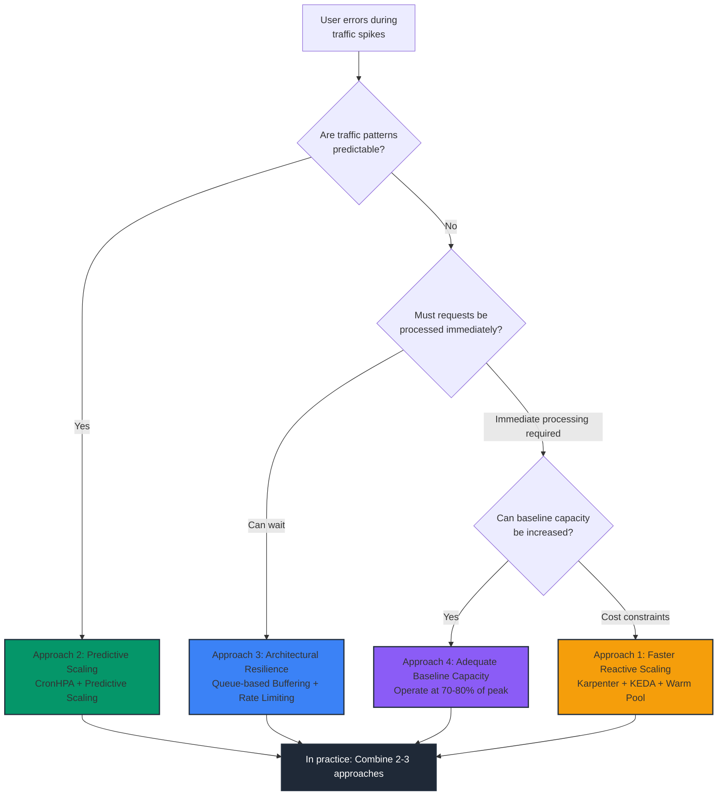
```mermaid
graph TB
    START[User errors during<br/>traffic spikes] --> Q1{Are traffic patterns<br/>predictable?}

    Q1 -->|Yes| PRED[Approach 2: Predictive Scaling<br/>CronHPA + Predictive Scaling]
    Q1 -->|No| Q2{Must requests be<br/>processed immediately?}

    Q2 -->|Can wait| ARCH[Approach 3: Architectural Resilience<br/>Queue-based Buffering + Rate Limiting]
    Q2 -->|Immediate processing required| Q3{Can baseline capacity<br/>be increased?}

    Q3 -->|Yes| BASE[Approach 4: Adequate Baseline Capacity<br/>Operate at 70-80% of peak]
    Q3 -->|Cost constraints| REACTIVE[Approach 1: Faster Reactive Scaling<br/>Karpenter + KEDA + Warm Pool]

    PRED --> COMBINE[In practice: Combine 2-3 approaches]
    ARCH --> COMBINE
    BASE --> COMBINE
    REACTIVE --> COMBINE

    style PRED fill:#059669,stroke:#232f3e,stroke-width:2px
    style ARCH fill:#3b82f6,stroke:#232f3e,stroke-width:2px
    style BASE fill:#8b5cf6,stroke:#232f3e,stroke-width:2px
    style REACTIVE fill:#f59e0b,stroke:#232f3e,stroke-width:2px
    style COMBINE fill:#1f2937,color:#fff,stroke:#232f3e,stroke-width:2px
```

### Comparison of Approaches

| Approach | Core Strategy | E2E Scaling Time | Additional Monthly Cost (28 Clusters) | Complexity | Suitable Workloads |
|--------|-----------|-------------------|---------------------------|--------|---------------|
| **1. Faster reactive scaling** | Karpenter + KEDA + Warm Pool | 5-45 seconds | $40K-190K | Very high | A small subset of mission-critical workloads |
| **2. Predictive scaling** | CronHPA + Predictive Scaling | Advance scaling (0 seconds) | $2K-5K | Low | Most services with traffic patterns |
| **3. Architectural resilience** | SQS/Kafka + Circuit Breaker | Tolerates scaling latency | $1K-3K | Medium | Services that support asynchronous processing |
| **4. Adequate baseline capacity** | Increase baseline replicas by 20-30% | Unnecessary (already sufficient) | $5K-15K | Very low | Stable traffic |

### Cost Structure Comparison by Approach

The following monthly estimates are based on **10 medium-sized clusters**. Actual costs vary with workloads and instance types.

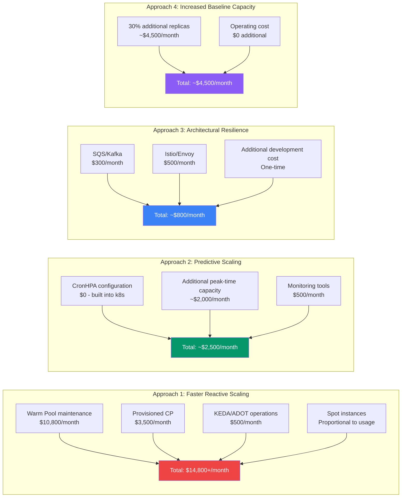
```mermaid
graph LR
    subgraph "Approach 1: Faster Reactive Scaling"
        R1["Warm Pool maintenance<br/>$10,800/month"]
        R2["Provisioned CP<br/>$3,500/month"]
        R3["KEDA/ADOT operations<br/>$500/month"]
        R4["Spot instances<br/>Proportional to usage"]
        RT["Total: $14,800+/month"]
        R1 --> RT
        R2 --> RT
        R3 --> RT
        R4 --> RT
    end

    subgraph "Approach 2: Predictive Scaling"
        P1["CronHPA configuration<br/>$0 - built into k8s"]
        P2["Additional peak-time capacity<br/>~$2,000/month"]
        P3["Monitoring tools<br/>$500/month"]
        PT["Total: ~$2,500/month"]
        P1 --> PT
        P2 --> PT
        P3 --> PT
    end

    subgraph "Approach 3: Architectural Resilience"
        A1["SQS/Kafka<br/>$300/month"]
        A2["Istio/Envoy<br/>$500/month"]
        A3["Additional development cost<br/>One-time"]
        AT["Total: ~$800/month"]
        A1 --> AT
        A2 --> AT
        A3 --> AT
    end

    subgraph "Approach 4: Increased Baseline Capacity"
        B1["30% additional replicas<br/>~$4,500/month"]
        B2["Operating cost<br/>$0 additional"]
        BT["Total: ~$4,500/month"]
        B1 --> BT
        B2 --> BT
    end

    style RT fill:#ef4444,color:#fff
    style PT fill:#059669,color:#fff
    style AT fill:#3b82f6,color:#fff
    style BT fill:#8b5cf6,color:#fff
```

| Approach | Monthly Cost (10 Clusters) | Initial Setup Cost | Operations Staffing | Conditions for ROI |
|--------|----------------------|---------------|---------------|-------------|
| **1. Faster reactive scaling** | $14,800+ | High (2-4 weeks) | 1-2 dedicated staff | SLA violation penalties > $15K/month |
| **2. Predictive scaling** | ~$2,500 | Low (2-3 days) | Existing staff | Traffic pattern prediction accuracy > 70% |
| **3. Architectural resilience** | ~$800 | Medium (1-2 weeks) | Existing staff | Services that allow asynchronous processing |
| **4. Increased baseline capacity** | ~$4,500 | None (immediate) | None | A 30% buffer relative to peak is sufficient |

:::tip Recommendation: Combine Approaches
In most production environments, the most cost-effective combination covers over 90% of traffic spikes with **approaches 2 + 4 (predictive scaling + baseline capacity)** and handles the remaining 10% with **approach 1 (reactive Karpenter)**.

Approach 3 (architectural resilience) is a foundational pattern that must be considered when designing new services.
:::

### Approach 2: Predictive Scaling

Most production traffic follows patterns (commuting hours, lunch, events). Predictive advance scaling is often more effective than reactive scaling.

```yaml
# CronHPA: Scheduled advance scaling
apiVersion: autoscaling.k8s.io/v1alpha1
kind: CronHPA
metadata:
  name: traffic-pattern-scaling
spec:
  scaleTargetRef:
    apiVersion: apps/v1
    kind: Deployment
    name: web-app
  jobs:
  - name: morning-peak
    schedule: "0 8 * * 1-5"    # Weekdays at 8 AM
    targetSize: 50              # Scale in advance of peak traffic
    completionPolicy:
      type: Never
  - name: lunch-peak
    schedule: "30 11 * * 1-5"   # Weekdays at 11:30 AM
    targetSize: 80
    completionPolicy:
      type: Never
  - name: off-peak
    schedule: "0 22 * * *"      # Daily at 10 PM
    targetSize: 10              # Scale down at night
    completionPolicy:
      type: Never
```

### Approach 3: Architectural Resilience

Designing the system so that **scaling latency is invisible to users** is more realistic than reducing scaling time to zero.

**Queue-based buffering**: Placing requests in SQS/Kafka turns scaling latency into "waiting" instead of "failure."

```yaml
# KEDA SQS-based scaling - requests wait safely in the queue
apiVersion: keda.sh/v1alpha1
kind: ScaledObject
metadata:
  name: queue-worker
spec:
  scaleTargetRef:
    name: order-processor
  minReplicaCount: 2
  maxReplicaCount: 100
  triggers:
  - type: aws-sqs-queue
    metadata:
      queueURL: https://sqs.us-east-1.amazonaws.com/123456789/orders
      queueLength: "5"         # 1 Pod per 5 queue messages
      awsRegion: us-east-1
```

**Circuit Breaker + Rate Limiting**: Graceful degradation under overload with Istio/Envoy

```yaml
# Istio Circuit Breaker - prevent overload during scaling
apiVersion: networking.istio.io/v1
kind: DestinationRule
metadata:
  name: web-app-circuit-breaker
spec:
  host: web-app
  trafficPolicy:
    connectionPool:
      http:
        h2UpgradePolicy: DEFAULT
        http1MaxPendingRequests: 100    # Limit pending requests
        http2MaxRequests: 1000          # Limit concurrent requests
    outlierDetection:
      consecutive5xxErrors: 5            # Eject after 5 occurrences of 5xx errors
      interval: 10s
      baseEjectionTime: 30s
      maxEjectionPercent: 50
```

### Approach 4: Adequate Baseline Capacity

Instead of spending $1,080-$5,400 per month on a Warm Pool, increasing baseline replicas by 20-30% can achieve the same effect without complex infrastructure.

```yaml
apiVersion: apps/v1
kind: Deployment
metadata:
  name: web-app
spec:
  # Expected Pod requirement: 20 → operate with a baseline of 25 (25% headroom)
  replicas: 25
  # HPA handles additional scaling at peak times
---
apiVersion: autoscaling/v2
kind: HorizontalPodAutoscaler
metadata:
  name: web-app-hpa
spec:
  scaleTargetRef:
    apiVersion: apps/v1
    kind: Deployment
    name: web-app
  minReplicas: 25     # Ensure baseline capacity
  maxReplicas: 100    # Prepare for extreme conditions
  metrics:
  - type: Resource
    resource:
      name: cpu
      target:
        type: Utilization
        averageUtilization: 60   # Target with headroom (70 → 60)
```

---

The following sections cover the detailed implementation of **approach 1: faster reactive scaling**. Review approaches 2-4 above first, then apply the following to workloads that require additional optimization.

---

## Problems with Conventional Autoscaling

Before optimizing reactive scaling, understand the bottlenecks in conventional approaches:

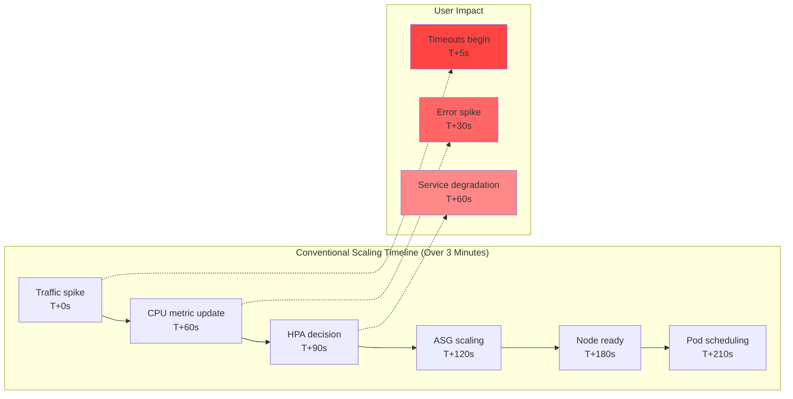
```mermaid
graph LR
    subgraph "Conventional Scaling Timeline (Over 3 Minutes)"
        T1[Traffic spike<br/>T+0s] --> T2[CPU metric update<br/>T+60s]
        T2 --> T3[HPA decision<br/>T+90s]
        T3 --> T4[ASG scaling<br/>T+120s]
        T4 --> T5[Node ready<br/>T+180s]
        T5 --> T6[Pod scheduling<br/>T+210s]
    end

    subgraph "User Impact"
        I1[Timeouts begin<br/>T+5s]
        I2[Error spike<br/>T+30s]
        I3[Service degradation<br/>T+60s]
    end

    T1 -.-> I1
    T2 -.-> I2
    T3 -.-> I3

    style I1 fill:#ff4444
    style I2 fill:#ff6666
    style I3 fill:#ff8888

```

The fundamental problem: By the time CPU metrics trigger scaling, it is already too late.

**Challenges in the current environment:**

- **Global scale**: 3 regions, 28 EKS clusters, and 15,000 Pods in operation
- **High traffic volume**: 773.4K requests processed daily
- **Latency issues**: 1-3 minutes of scaling latency with HPA + Karpenter
- **Metric collection latency**: 1-3 minutes of CloudWatch metric latency prevents real-time response

## The Karpenter Revolution: Direct-to-Metal Provisioning

Karpenter removes the Auto Scaling Group (ASG) abstraction layer and provisions EC2 instances directly based on pending Pod requirements. Karpenter v1.x automatically replaces existing nodes when the NodePool specification changes through **Drift Detection**. This automates AMI updates, security patching, and related tasks.

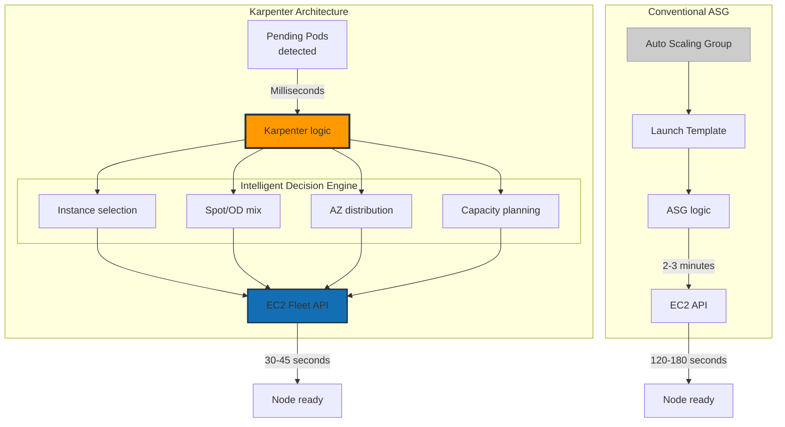
```mermaid
graph TB
    subgraph "Karpenter Architecture"
        PP[Pending Pods<br/>detected]
        KL[Karpenter logic]
        EC2[EC2 Fleet API]

        PP -->|Milliseconds| KL

        subgraph "Intelligent Decision Engine"
            IS[Instance selection]
            SP[Spot/OD mix]
            AZ[AZ distribution]
            CP[Capacity planning]
        end

        KL --> IS
        KL --> SP
        KL --> AZ
        KL --> CP

        IS --> EC2
        SP --> EC2
        AZ --> EC2
        CP --> EC2
    end

    subgraph "Conventional ASG"
        ASG[Auto Scaling Group]
        LT[Launch Template]
        ASGL[ASG logic]

        ASG --> LT
        LT --> ASGL
        ASGL -->|2-3 minutes| EC2_OLD[EC2 API]
    end

    EC2 -->|30-45 seconds| NODE[Node ready]
    EC2_OLD -->|120-180 seconds| NODE_OLD[Node ready]

    style KL fill:#ff9900,stroke:#232f3e,stroke-width:3px
    style EC2 fill:#146eb4,stroke:#232f3e,stroke-width:2px
    style ASG fill:#cccccc,stroke:#999999

```

## High-Speed Metrics Architecture: Two Approaches

Minimizing scaling response time requires a fast detection system. The following compares two validated architectures.

### Approach 1: CloudWatch High-Resolution Integration

Use CloudWatch high-resolution metrics in an AWS-native environment.

#### Key Components

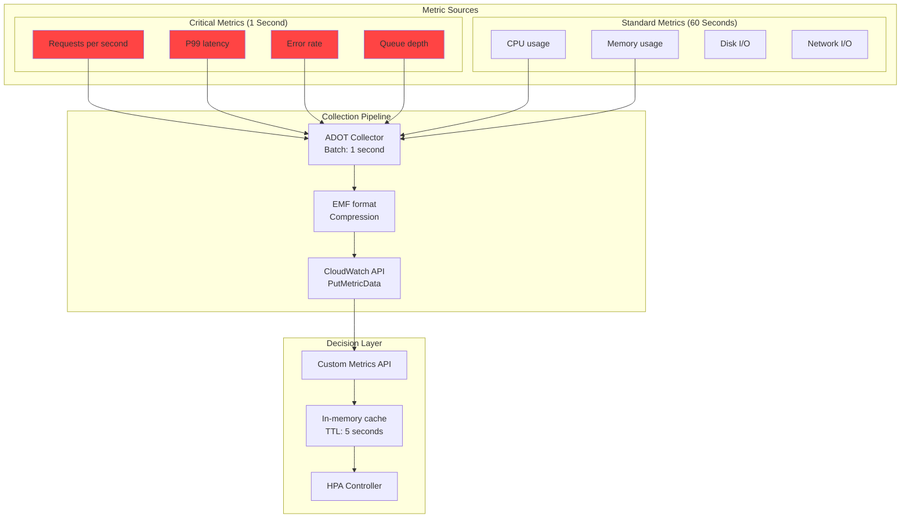
```mermaid
graph TB
    subgraph "Metric Sources"
        subgraph "Critical Metrics (1 Second)"
            RPS[Requests per second]
            LAT[P99 latency]
            ERR[Error rate]
            QUEUE[Queue depth]
        end

        subgraph "Standard Metrics (60 Seconds)"
            CPU[CPU usage]
            MEM[Memory usage]
            DISK[Disk I/O]
            NET[Network I/O]
        end
    end

    subgraph "Collection Pipeline"
        AGENT[ADOT Collector<br/>Batch: 1 second]
        EMF[EMF format<br/>Compression]
        CW[CloudWatch API<br/>PutMetricData]
    end

    subgraph "Decision Layer"
        API[Custom Metrics API]
        CACHE[In-memory cache<br/>TTL: 5 seconds]
        HPA[HPA Controller]
    end

    RPS --> AGENT
    LAT --> AGENT
    ERR --> AGENT
    QUEUE --> AGENT

    CPU --> AGENT
    MEM --> AGENT

    AGENT --> EMF
    EMF --> CW
    CW --> API
    API --> CACHE
    CACHE --> HPA

    style RPS fill:#ff4444
    style LAT fill:#ff4444
    style ERR fill:#ff4444
    style QUEUE fill:#ff4444

```

#### Scaling Timeline

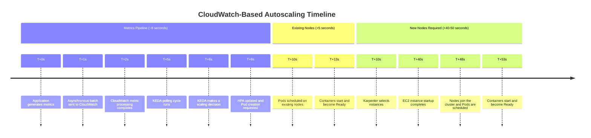
```mermaid
timeline
    title CloudWatch-Based Autoscaling Timeline

    section Metrics Pipeline (~8 seconds)
        T+0s  : Application generates metrics
        T+1s  : Asynchronous batch sent to CloudWatch
        T+2s  : CloudWatch metric processing completes
        T+5s  : KEDA polling cycle runs
        T+6s  : KEDA makes a scaling decision
        T+8s  : HPA updated and Pod creation requested

    section Existing Nodes (+5 seconds)
        T+10s : Pods scheduled on existing nodes
        T+13s : Containers start and become Ready

    section New Nodes Required (+40-50 seconds)
        T+10s : Karpenter selects instances
        T+40s : EC2 instance startup completes
        T+48s : Nodes join the cluster and Pods are scheduled
        T+53s : Containers start and become Ready
```

:::info Interpreting the Timeline
- **When nodes already exist** (Warm Pool or existing spare nodes): E2E **~13 seconds**
- **When new nodes must be provisioned**: E2E **~53 seconds**
- EC2 instance launch time (30-40 seconds) is a physical constraint that cannot be eliminated by optimizing the metrics pipeline alone.
:::

**Advantages:**

- ✅ **Fast metric collection**: Low latency of 1-2 seconds
- ✅ **Simple setup**: AWS-native integration
- ✅ **No management overhead**: No separate infrastructure to manage

**Disadvantages:**

- ❌ **Limited throughput**: 500 TPS per account (regional PutMetricData limit)
- ❌ **Pod limit**: Up to 5,000 per cluster
- ❌ **High metric costs**: AWS CloudWatch metric charges

### Approach 2: ADOT + Prometheus Architecture

This high-performance, open-source pipeline combines AWS Distro for OpenTelemetry (ADOT) with Prometheus.

#### Key Components

- **ADOT Collector**: Hybrid DaemonSet and Sidecar deployment
- **Prometheus**: HA configuration and Remote Storage integration
- **Thanos Query Layer**: Global view across multiple clusters
- **KEDA Prometheus Scaler**: Fast polling at 2-second intervals
- **Grafana Mimir**: Long-term storage and high-speed query engine

#### Scaling Timeline (~66 Seconds)

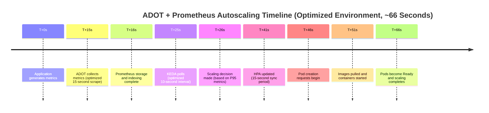
```mermaid
timeline
    title ADOT + Prometheus Autoscaling Timeline (Optimized Environment, ~66 Seconds)

    T+0s   : Application generates metrics
    T+15s  : ADOT collects metrics (optimized 15-second scrape)
    T+16s  : Prometheus storage and indexing complete
    T+25s  : KEDA polls (optimized 10-second interval)
    T+26s  : Scaling decision made (based on P95 metrics)
    T+41s  : HPA updated (15-second sync period)
    T+46s  : Pod creation requests begin
    T+51s  : Images pulled and containers started
    T+66s  : Pods become Ready and scaling completes
```

**Advantages:**

- ✅ **High throughput**: Supports 100,000+ TPS
- ✅ **Scalability**: Supports 20,000+ Pods per cluster
- ✅ **Low metric costs**: Storage costs only (self-managed)
- ✅ **Full control**: Flexibility in configuration and optimization

**Disadvantages:**

- ❌ **Complex setup**: Additional components to manage
- ❌ **High operational complexity**: Requires HA configuration, backup/recovery, and performance tuning
- ❌ **Specialist staff required**: Prometheus operations experience is essential

### Cost-Optimized Metrics Strategy

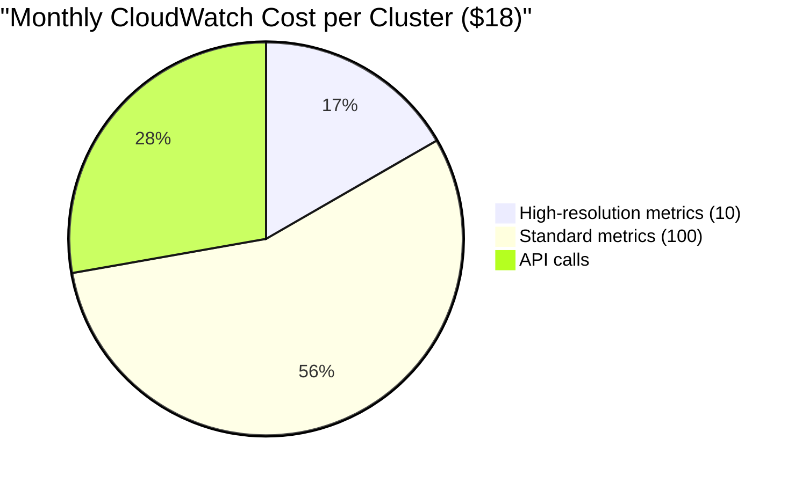
```mermaid
pie title "Monthly CloudWatch Cost per Cluster ($18)"
    "High-resolution metrics (10)" : 3
    "Standard metrics (100)" : 10
    "API calls" : 5

```

For 28 clusters: ~$500 per month for comprehensive monitoring vs $30,000+ when collecting all metrics at high resolution

### Recommended Use Cases

**When CloudWatch High Resolution Metrics are suitable:**

- Small applications (5,000 Pods or fewer)
- Simple monitoring requirements
- Preference for AWS-native solutions
- Priority on rapid setup and stable operations

**When ADOT + Prometheus is suitable:**

- Large clusters (20,000 Pods or more)
- High metric throughput requirements
- Need for detailed monitoring and customization
- Need for the highest levels of performance and scalability

## Scaling Optimization Architecture: Layer-by-Layer Analysis

Minimizing scaling response time requires optimization at every layer:

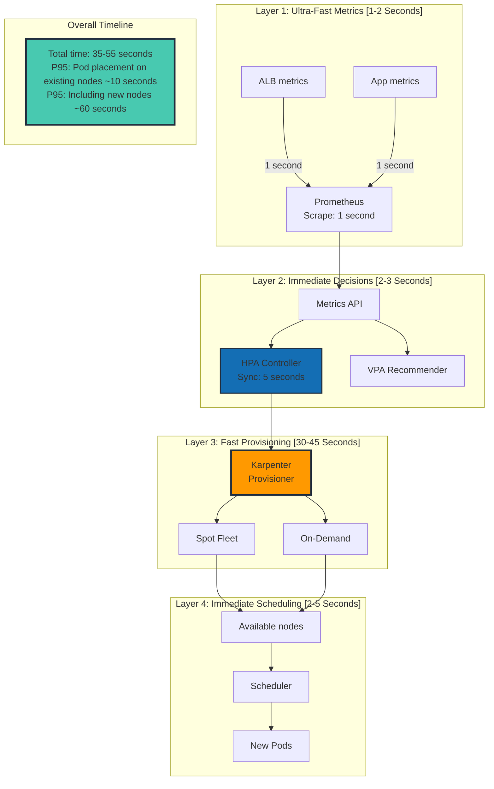
```mermaid
graph TB
    subgraph "Layer 1: Ultra-Fast Metrics [1-2 Seconds]"
        ALB[ALB metrics]
        APP[App metrics]
        PROM[Prometheus<br/>Scrape: 1 second]

        ALB -->|1 second| PROM
        APP -->|1 second| PROM
    end

    subgraph "Layer 2: Immediate Decisions [2-3 Seconds]"
        MA[Metrics API]
        HPA[HPA Controller<br/>Sync: 5 seconds]
        VPA[VPA Recommender]

        PROM --> MA
        MA --> HPA
        MA --> VPA
    end

    subgraph "Layer 3: Fast Provisioning [30-45 Seconds]"
        KARP[Karpenter<br/>Provisioner]
        SPOT[Spot Fleet]
        OD[On-Demand]

        HPA --> KARP
        KARP --> SPOT
        KARP --> OD
    end

    subgraph "Layer 4: Immediate Scheduling [2-5 Seconds]"
        SCHED[Scheduler]
        NODE[Available nodes]
        POD[New Pods]

        SPOT --> NODE
        OD --> NODE
        NODE --> SCHED
        SCHED --> POD
    end

    subgraph "Overall Timeline"
        TOTAL[Total time: 35-55 seconds<br/>P95: Pod placement on existing nodes ~10 seconds<br/>P95: Including new nodes ~60 seconds]
    end

    style KARP fill:#ff9900,stroke:#232f3e,stroke-width:3px
    style HPA fill:#146eb4,stroke:#232f3e,stroke-width:2px
    style TOTAL fill:#48C9B0,stroke:#232f3e,stroke-width:3px

```

## Core Karpenter Configuration

Optimal Karpenter configuration is the key to node provisioning in under 60 seconds:

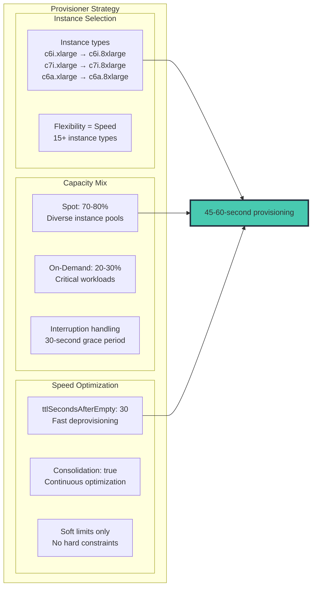
```mermaid
graph LR
    subgraph "Provisioner Strategy"
        subgraph "Instance Selection"
            IT[Instance types<br/>c6i.xlarge → c6i.8xlarge<br/>c7i.xlarge → c7i.8xlarge<br/>c6a.xlarge → c6a.8xlarge]
            FLEX[Flexibility = Speed<br/>15+ instance types]
        end

        subgraph "Capacity Mix"
            SPOT[Spot: 70-80%<br/>Diverse instance pools]
            OD[On-Demand: 20-30%<br/>Critical workloads]
            INT[Interruption handling<br/>30-second grace period]
        end

        subgraph "Speed Optimization"
            TTL[ttlSecondsAfterEmpty: 30<br/>Fast deprovisioning]
            CONS[Consolidation: true<br/>Continuous optimization]
            LIMITS[Soft limits only<br/>No hard constraints]
        end
    end

    IT --> RESULT[45-60-second provisioning]
    SPOT --> RESULT
    TTL --> RESULT

    style RESULT fill:#48C9B0,stroke:#232f3e,stroke-width:3px

```

### Karpenter NodePool YAML

```yaml
apiVersion: karpenter.sh/v1
kind: NodePool
metadata:
  name: fast-scaling
spec:
  # Configuration optimized for speed
  disruption:
    consolidationPolicy: WhenEmptyOrUnderutilized
    consolidateAfter: 30s
    budgets:
    - nodes: "10%"

  # Maximum flexibility for speed
  template:
    spec:
      requirements:
        - key: karpenter.sh/capacity-type
          operator: In
          values: ["spot", "on-demand"]
        - key: kubernetes.io/arch
          operator: In
          values: ["amd64"]
        - key: node.kubernetes.io/instance-type
          operator: In
          values:
            # Compute optimized - primary choice
            - c6i.xlarge
            - c6i.2xlarge
            - c6i.4xlarge
            - c6i.8xlarge
            - c7i.xlarge
            - c7i.2xlarge
            - c7i.4xlarge
            - c7i.8xlarge
            # AMD alternatives - better availability
            - c6a.xlarge
            - c6a.2xlarge
            - c6a.4xlarge
            - c6a.8xlarge
            # Memory optimized - for specific workloads
            - m6i.xlarge
            - m6i.2xlarge
            - m6i.4xlarge

      nodeClassRef:
        group: karpenter.k8s.aws
        kind: EC2NodeClass
        name: fast-nodepool

  # Ensure fast provisioning
  limits:
    cpu: 100000  # Soft limits only
    memory: 400000Gi
---
apiVersion: karpenter.k8s.aws/v1
kind: EC2NodeClass
metadata:
  name: fast-nodepool
spec:
  amiSelectorTerms:
    - alias: al2023@latest

  subnetSelectorTerms:
    - tags:
        karpenter.sh/discovery: "${CLUSTER_NAME}"

  securityGroupSelectorTerms:
    - tags:
        karpenter.sh/discovery: "${CLUSTER_NAME}"

  role: "KarpenterNodeRole-${CLUSTER_NAME}"

  # Speed optimization
  userData: |
    #!/bin/bash
    # Optimize node startup time
    /etc/eks/bootstrap.sh ${CLUSTER_NAME} \
      --b64-cluster-ca ${B64_CLUSTER_CA} \
      --apiserver-endpoint ${API_SERVER_URL} \
      --kubelet-extra-args '--node-labels=karpenter.sh/fast-scaling=true --max-pods=110'

    # Pre-pull critical images (registry.k8s.io replaces k8s.gcr.io)
    ctr -n k8s.io images pull registry.k8s.io/pause:3.10 &
    ctr -n k8s.io images pull public.ecr.aws/eks-distro/kubernetes/pause:3.10 &

```

## Real-Time Scaling Workflow

How all components work together to achieve optimal scaling performance:

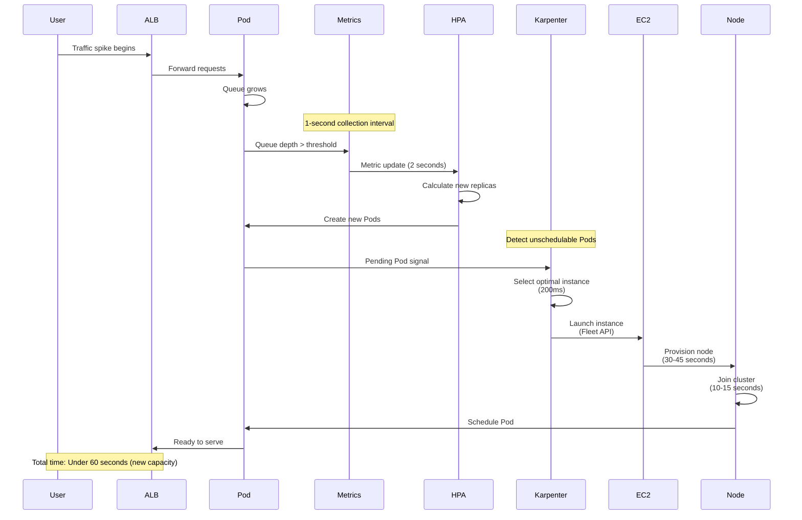
```mermaid
sequenceDiagram
    participant User
    participant ALB
    participant Pod
    participant Metrics
    participant HPA
    participant Karpenter
    participant EC2
    participant Node

    User->>ALB: Traffic spike begins
    ALB->>Pod: Forward requests
    Pod->>Pod: Queue grows

    Note over Metrics: 1-second collection interval
    Pod->>Metrics: Queue depth > threshold
    Metrics->>HPA: Metric update (2 seconds)

    HPA->>HPA: Calculate new replicas
    HPA->>Pod: Create new Pods

    Note over Karpenter: Detect unschedulable Pods
    Pod->>Karpenter: Pending Pod signal
    Karpenter->>Karpenter: Select optimal instance<br/>(200ms)

    Karpenter->>EC2: Launch instance<br/>(Fleet API)
    EC2->>Node: Provision node<br/>(30-45 seconds)

    Node->>Node: Join cluster<br/>(10-15 seconds)
    Node->>Pod: Schedule Pod
    Pod->>ALB: Ready to serve

    Note over User,ALB: Total time: Under 60 seconds (new capacity)

```

## HPA Configuration for Aggressive Scaling

Configure the HorizontalPodAutoscaler for immediate response:

```yaml
apiVersion: autoscaling/v2
kind: HorizontalPodAutoscaler
metadata:
  name: ultra-fast-hpa
spec:
  scaleTargetRef:
    apiVersion: apps/v1
    kind: Deployment
    name: web-app
  minReplicas: 10
  maxReplicas: 1000

  metrics:
  # Primary metric - queue depth
  - type: External
    external:
      metric:
        name: sqs_queue_depth
        selector:
          matchLabels:
            queue: "web-requests"
      target:
        type: AverageValue
        averageValue: "10"

  # Secondary metric - request rate
  - type: External
    external:
      metric:
        name: alb_request_rate
        selector:
          matchLabels:
            targetgroup: "web-tg"
      target:
        type: AverageValue
        averageValue: "100"

  behavior:
    scaleUp:
      stabilizationWindowSeconds: 0  # No delay!
      policies:
      - type: Percent
        value: 100
        periodSeconds: 10
      - type: Pods
        value: 100
        periodSeconds: 10
      selectPolicy: Max
    scaleDown:
      stabilizationWindowSeconds: 300  # 5-minute cooldown
      policies:
      - type: Percent
        value: 10
        periodSeconds: 60

```

## When to Use KEDA: Event-Driven Scenarios

Karpenter handles infrastructure scaling, while KEDA excels in specific event-driven scenarios:

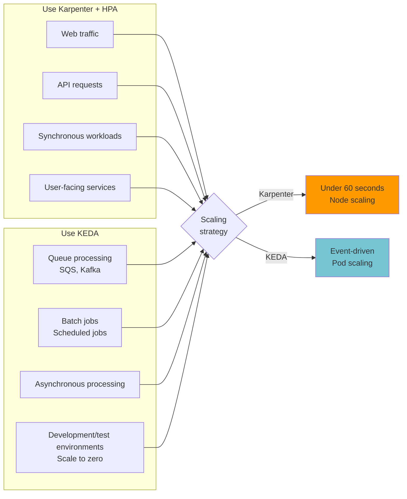
```mermaid
graph LR
    subgraph "Use Karpenter + HPA"
        WEB[Web traffic]
        API[API requests]
        SYNC[Synchronous workloads]
        USER[User-facing services]
    end

    subgraph "Use KEDA"
        QUEUE[Queue processing<br/>SQS, Kafka]
        BATCH[Batch jobs<br/>Scheduled jobs]
        ASYNC[Asynchronous processing]
        DEV[Development/test environments<br/>Scale to zero]
    end

    WEB --> DECISION{Scaling<br/>strategy}
    API --> DECISION
    SYNC --> DECISION
    USER --> DECISION

    QUEUE --> DECISION
    BATCH --> DECISION
    ASYNC --> DECISION
    DEV --> DECISION

    DECISION -->|Karpenter| FAST[Under 60 seconds<br/>Node scaling]
    DECISION -->|KEDA| EVENT[Event-driven<br/>Pod scaling]

    style FAST fill:#ff9900
    style EVENT fill:#76c5d5

```

## Production Performance Metrics

Actual results from a deployment processing 750K+ requests daily:

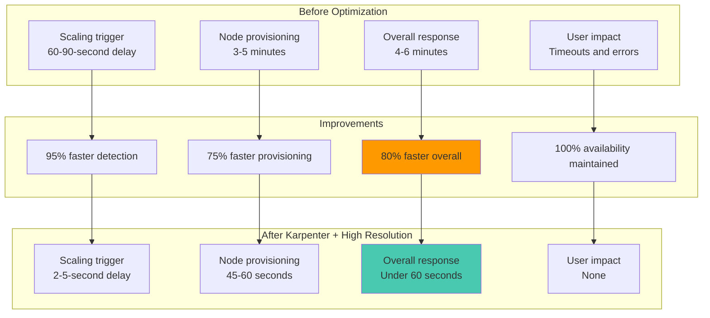
```mermaid
graph TB
    subgraph "Before Optimization"
        B1[Scaling trigger<br/>60-90-second delay]
        B2[Node provisioning<br/>3-5 minutes]
        B3[Overall response<br/>4-6 minutes]
        B4[User impact<br/>Timeouts and errors]
    end

    subgraph "After Karpenter + High Resolution"
        A1[Scaling trigger<br/>2-5-second delay]
        A2[Node provisioning<br/>45-60 seconds]
        A3[Overall response<br/>Under 60 seconds]
        A4[User impact<br/>None]
    end

    subgraph "Improvements"
        I1[95% faster detection]
        I2[75% faster provisioning]
        I3[80% faster overall]
        I4[100% availability maintained]
    end

    B1 --> I1
    B2 --> I2
    B3 --> I3
    B4 --> I4

    I1 --> A1
    I2 --> A2
    I3 --> A3
    I4 --> A4

    style A3 fill:#48C9B0
    style I3 fill:#ff9900

```

## Multi-Region Considerations

Organizations operating across multiple regions need region-specific optimizations for consistently fast scaling:

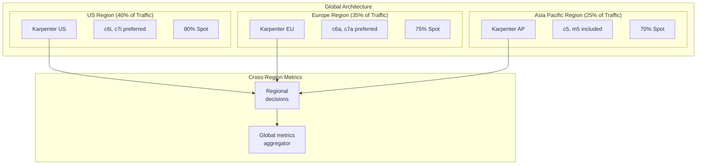
```mermaid
graph TB
    subgraph "Global Architecture"
        subgraph "US Region (40% of Traffic)"
            US_KARP[Karpenter US]
            US_TYPES[c6i, c7i preferred]
            US_SPOT[80% Spot]
        end

        subgraph "Europe Region (35% of Traffic)"
            EU_KARP[Karpenter EU]
            EU_TYPES[c6a, c7a preferred]
            EU_SPOT[75% Spot]
        end

        subgraph "Asia Pacific Region (25% of Traffic)"
            AP_KARP[Karpenter AP]
            AP_TYPES[c5, m5 included]
            AP_SPOT[70% Spot]
        end
    end

    subgraph "Cross-Region Metrics"
        GLOBAL[Global metrics<br/>aggregator]
        REGIONAL[Regional<br/>decisions]
    end

    US_KARP --> REGIONAL
    EU_KARP --> REGIONAL
    AP_KARP --> REGIONAL

    REGIONAL --> GLOBAL

```

## Scaling Optimization Best Practices

### 1. Metric Selection

- Use leading indicators (queue depth, connection count), not lagging indicators (CPU)
- Keep high-resolution metrics to no more than 10-15 per cluster
- Submit metrics in batches to prevent API throttling

### 2. Karpenter Optimization

- Provide maximum instance type flexibility
- Make extensive use of Spot instances with appropriate interruption handling
- Enable consolidation for cost efficiency
- Set an appropriate ttlSecondsAfterEmpty (30-60 seconds)

### 3. HPA Tuning

- Zero stabilization window for scale-up
- Aggressive scaling policies (allow 100% increases)
- Multiple metrics with appropriate weights
- Appropriate cooldown for scale-down

### 4. Monitoring

- Track P95 scaling latency as the primary KPI
- Alert on scaling failures or delays exceeding 15 seconds
- Monitor Spot interruption rates
- Track cost per scaled Pod

## Troubleshooting Common Issues

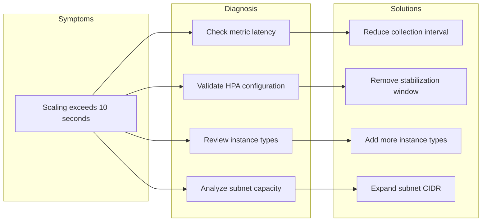
```mermaid
graph LR
    subgraph "Symptoms"
        SLOW[Scaling exceeds 10 seconds]
    end

    subgraph "Diagnosis"
        D1[Check metric latency]
        D2[Validate HPA configuration]
        D3[Review instance types]
        D4[Analyze subnet capacity]
    end

    subgraph "Solutions"
        S1[Reduce collection interval]
        S2[Remove stabilization window]
        S3[Add more instance types]
        S4[Expand subnet CIDR]
    end

    SLOW --> D1 --> S1
    SLOW --> D2 --> S2
    SLOW --> D3 --> S3
    SLOW --> D4 --> S4

```

## Hybrid Approach (Recommended)

In production environments, a hybrid approach combining both methods is recommended:

1. **Mission-critical services**: Achieve 10-13-second scaling with ADOT + Prometheus
2. **General services**: Achieve 12-15-second scaling and simplify operations with CloudWatch Direct
3. **Gradual migration**: Start with CloudWatch and transition to ADOT as needed

## EKS Auto Mode vs Self-managed Karpenter

EKS Auto Mode (GA in December 2024, re:Invent 2024) includes Karpenter and manages it automatically:

| Item | Self-managed Karpenter | EKS Auto Mode |
|------|----------------------|---------------|
| Installation/upgrades | Self-managed (Helm) | Automatically managed by AWS |
| NodePool configuration | Full customization | Limited configuration |
| Cost optimization | Fine-grained control | Automatic optimization |
| OS patches | Self-managed | Automatic patching |
| Suitable environments | Require advanced customization | Minimize operational burden |

**Recommendation**: Choose self-managed Karpenter for complex scheduling requirements and EKS Auto Mode when the goal is simpler operations.

## P1: Ultra-Fast Scaling Architecture (Critical)

### Scaling Latency Breakdown

Optimizing scaling response time starts with a detailed breakdown of latency across the entire scaling chain.

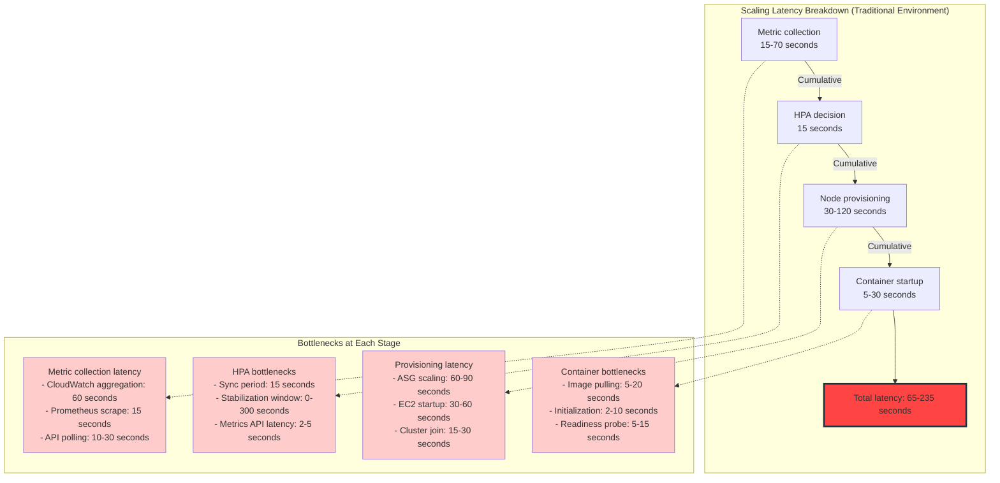
```mermaid
graph TB
    subgraph "Scaling Latency Breakdown (Traditional Environment)"
        M[Metric collection<br/>15-70 seconds]
        H[HPA decision<br/>15 seconds]
        N[Node provisioning<br/>30-120 seconds]
        C[Container startup<br/>5-30 seconds]

        M -->|Cumulative| H
        H -->|Cumulative| N
        N -->|Cumulative| C

        TOTAL[Total latency: 65-235 seconds]
        C --> TOTAL
    end

    subgraph "Bottlenecks at Each Stage"
        M1[Metric collection latency<br/>- CloudWatch aggregation: 60 seconds<br/>- Prometheus scrape: 15 seconds<br/>- API polling: 10-30 seconds]

        H1[HPA bottlenecks<br/>- Sync period: 15 seconds<br/>- Stabilization window: 0-300 seconds<br/>- Metrics API latency: 2-5 seconds]

        N1[Provisioning latency<br/>- ASG scaling: 60-90 seconds<br/>- EC2 startup: 30-60 seconds<br/>- Cluster join: 15-30 seconds]

        C1[Container bottlenecks<br/>- Image pulling: 5-20 seconds<br/>- Initialization: 2-10 seconds<br/>- Readiness probe: 5-15 seconds]
    end

    M -.-> M1
    H -.-> H1
    N -.-> N1
    C -.-> C1

    style TOTAL fill:#ff4444,stroke:#232f3e,stroke-width:3px
    style M1 fill:#ffcccc
    style H1 fill:#ffcccc
    style N1 fill:#ffcccc
    style C1 fill:#ffcccc
```

<ScalingLatencyBreakdown />

:::danger Result
During traffic spikes, **users experience errors for over 5 minutes** — node provisioning accounts for more than 60% of total latency
:::

### Multi-Layer Scaling Strategy

Ultra-fast scaling is achieved through a **3-layer fallback strategy**, rather than a single optimization.

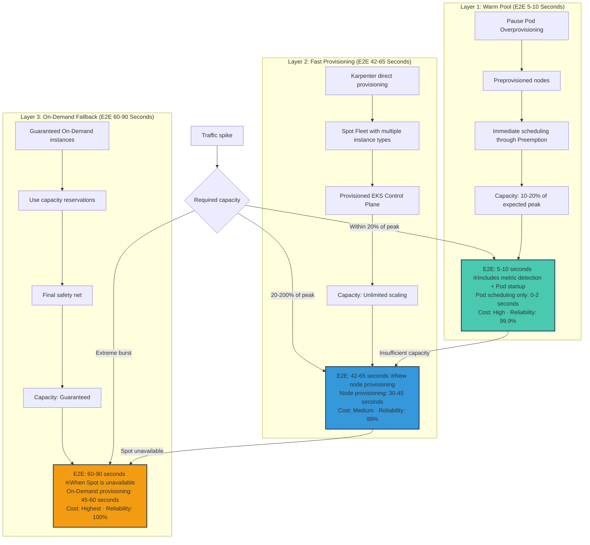
```mermaid
graph TB
    subgraph "Layer 1: Warm Pool (E2E 5-10 Seconds)"
        WP1[Pause Pod Overprovisioning]
        WP2[Preprovisioned nodes]
        WP3[Immediate scheduling through Preemption]
        WP4[Capacity: 10-20% of expected peak]

        WP1 --> WP2 --> WP3 --> WP4

        WP_RESULT[E2E: 5-10 seconds ※Includes metric detection + Pod startup<br/>Pod scheduling only: 0-2 seconds<br/>Cost: High · Reliability: 99.9%]
        WP4 --> WP_RESULT
    end

    subgraph "Layer 2: Fast Provisioning (E2E 42-65 Seconds)"
        FP1[Karpenter direct provisioning]
        FP2[Spot Fleet with multiple instance types]
        FP3[Provisioned EKS Control Plane]
        FP4[Capacity: Unlimited scaling]

        FP1 --> FP2 --> FP3 --> FP4

        FP_RESULT[E2E: 42-65 seconds ※New node provisioning<br/>Node provisioning: 30-45 seconds<br/>Cost: Medium · Reliability: 99%]
        FP4 --> FP_RESULT
    end

    subgraph "Layer 3: On-Demand Fallback (E2E 60-90 Seconds)"
        OD1[Guaranteed On-Demand instances]
        OD2[Use capacity reservations]
        OD3[Final safety net]
        OD4[Capacity: Guaranteed]

        OD1 --> OD2 --> OD3 --> OD4

        OD_RESULT[E2E: 60-90 seconds ※When Spot is unavailable<br/>On-Demand provisioning: 45-60 seconds<br/>Cost: Highest · Reliability: 100%]
        OD4 --> OD_RESULT
    end

    TRAFFIC[Traffic spike] --> DECISION{Required capacity}
    DECISION -->|Within 20% of peak| WP_RESULT
    DECISION -->|20-200% of peak| FP_RESULT
    DECISION -->|Extreme burst| OD_RESULT

    WP_RESULT -->|Insufficient capacity| FP_RESULT
    FP_RESULT -->|Spot unavailable| OD_RESULT

    style WP_RESULT fill:#48C9B0,stroke:#232f3e,stroke-width:2px
    style FP_RESULT fill:#3498DB,stroke:#232f3e,stroke-width:2px
    style OD_RESULT fill:#F39C12,stroke:#232f3e,stroke-width:2px
```

### Scaling Timeline Comparison by Layer

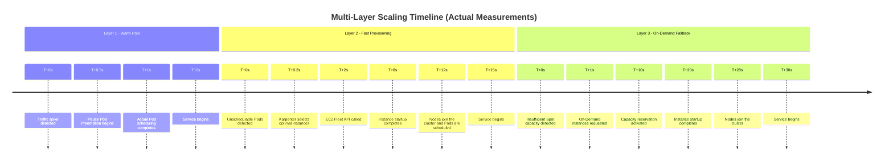
```mermaid
timeline
    title Multi-Layer Scaling Timeline (Actual Measurements)

    section Layer 1 - Warm Pool
        T+0s : Traffic spike detected
        T+0.5s : Pause Pod Preemption begins
        T+1s : Actual Pod scheduling completes
        T+2s : Service begins

    section Layer 2 - Fast Provisioning
        T+0s : Unschedulable Pods detected
        T+0.2s : Karpenter selects optimal instances
        T+2s : EC2 Fleet API called
        T+8s : Instance startup completes
        T+12s : Nodes join the cluster and Pods are scheduled
        T+15s : Service begins

    section Layer 3 - On-Demand Fallback
        T+0s : Insufficient Spot capacity detected
        T+1s : On-Demand instances requested
        T+10s : Capacity reservation activated
        T+20s : Instance startup completes
        T+28s : Nodes join the cluster
        T+30s : Service begins
```

:::tip Layer Selection Criteria
**Layer 1 (Warm Pool)** — Preallocation strategy:
- **Nature**: **Overprovisioning**, not autoscaling. Reserve nodes in advance with Pause Pods
- E2E 5-10 seconds (metric detection + Preemption + container startup)
- **Cost**: Maintain 10-20% of expected peak capacity for 24 hours a day ($720-$5,400 per month)
- **Consideration**: Increasing baseline replicas for the same cost may be simpler

**Layer 2 (Fast Provisioning)** — Default strategy for most workloads:
- Actual node provisioning with Karpenter + Spot instances
- E2E 42-65 seconds (metric detection + EC2 launch + container startup)
- **Cost**: Proportional to actual usage (70-80% Spot discount)
- **Consideration**: Combining this with architectural resilience (queue-based) hides this delay from users

**Layer 3 (On-Demand Fallback)** — Essential insurance:
- Final safety net when Spot capacity is insufficient
- E2E 60-90 seconds (On-Demand provisioning may be slower than Spot)
- **Cost**: On-Demand pricing (minimal use)
:::

## P2: Eliminate API Bottlenecks with Provisioned EKS Control Plane

### Provisioned Control Plane Overview

In November 2025, AWS announced **EKS Provisioned Control Plane**. It removes the API throttling limitations of the existing Standard Control Plane, dramatically improving scaling speed in large burst scenarios.

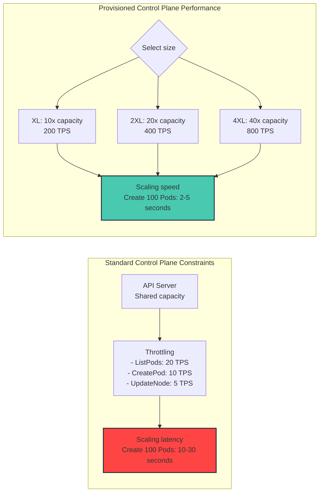
```mermaid
graph LR
    subgraph "Standard Control Plane Constraints"
        STD_API[API Server<br/>Shared capacity]
        STD_THROTTLE[Throttling<br/>- ListPods: 20 TPS<br/>- CreatePod: 10 TPS<br/>- UpdateNode: 5 TPS]
        STD_DELAY[Scaling latency<br/>Create 100 Pods: 10-30 seconds]

        STD_API --> STD_THROTTLE --> STD_DELAY
    end

    subgraph "Provisioned Control Plane Performance"
        PROV_SIZE{Select size}
        PROV_XL[XL: 10x capacity<br/>200 TPS]
        PROV_2XL[2XL: 20x capacity<br/>400 TPS]
        PROV_4XL[4XL: 40x capacity<br/>800 TPS]
        PROV_RESULT[Scaling speed<br/>Create 100 Pods: 2-5 seconds]

        PROV_SIZE --> PROV_XL
        PROV_SIZE --> PROV_2XL
        PROV_SIZE --> PROV_4XL

        PROV_XL --> PROV_RESULT
        PROV_2XL --> PROV_RESULT
        PROV_4XL --> PROV_RESULT
    end

    style STD_DELAY fill:#ff4444,stroke:#232f3e,stroke-width:2px
    style PROV_RESULT fill:#48C9B0,stroke:#232f3e,stroke-width:2px
```

### Standard vs Provisioned Comparison

<ControlPlaneComparison />

:::warning Provisioned Control Plane Selection Criteria
**Signs that an upgrade to Provisioned is needed:**

1. **Frequent API throttling errors**: `kubectl` commands frequently fail or retry
2. **Large deployment delays**: Deploying 100+ Pods takes over 5 minutes
3. **Karpenter node provisioning failures**: `too many requests` errors
4. **HPA scaling delays**: Pod creation requests accumulate in a queue
5. **Cluster size**: 1,000 or more Pods continuously, or 3,000 or more Pods at peak

**Cost vs performance trade-off:**
- **Standard → XL**: **10x API performance** for an additional $350 per month (ROI: Offset by preventing 10 minutes of downtime)
- **XL → 2XL**: Needed only for very large clusters (10,000+ Pods)
- **4XL**: For extreme scale (50,000+ Pods) or multi-tenant platforms
:::

### Provisioned Control Plane Configuration

#### Create a New Cluster with the AWS CLI

```bash
aws eks create-cluster \
  --name ultra-fast-cluster \
  --region us-east-1 \
  --role-arn arn:aws:iam::123456789012:role/EKSClusterRole \
  --resources-vpc-config subnetIds=subnet-xxx,subnet-yyy,securityGroupIds=sg-xxx \
  --kubernetes-version 1.33 \
  --compute-config enabled=true,nodePools=system,nodeRoleArn=arn:aws:iam::123456789012:role/EKSNodeRole \
  --kubernetes-network-config elasticLoadBalancing=disabled \
  --access-config authenticationMode=API \
  --upgrade-policy supportType=EXTENDED \
  --zonal-shift-config enabled=true \
  --compute-config enabled=true \
  --control-plane-placement groupName=my-placement-group,clusterTenancy=dedicated \
  --control-plane-provisioning mode=PROVISIONED,size=XL  # Check the AWS CLI reference for the exact CLI flag format
```

#### Upgrade an Existing Cluster (Standard → Provisioned)

```bash
# 1. Check the current Control Plane mode
aws eks describe-cluster --name my-cluster --query 'cluster.controlPlaneProvisioning'

# 2. Upgrade to Provisioned (no downtime)
# Check the AWS CLI reference for the exact CLI flag format
aws eks update-cluster-config \
  --name my-cluster \
  --control-plane-provisioning mode=PROVISIONED,size=XL

# 3. Monitor upgrade status (takes 10-15 minutes)
aws eks describe-cluster \
  --name my-cluster \
  --query 'cluster.status'

# 4. Validate API performance
kubectl get pods --all-namespaces --watch
kubectl create deployment nginx --image=nginx --replicas=100
```

:::info Upgrade Characteristics
- **No downtime**: The Control Plane performs a rolling upgrade automatically
- **Duration**: 10-15 minutes (regardless of cluster size)
- **No rollback**: Downgrading from Provisioned → Standard is not supported
- **Billing starts**: Charges begin immediately after the upgrade completes
:::

### Performance Comparison During Large Bursts

A test scaling 1,000 Pods simultaneously in an actual production environment:

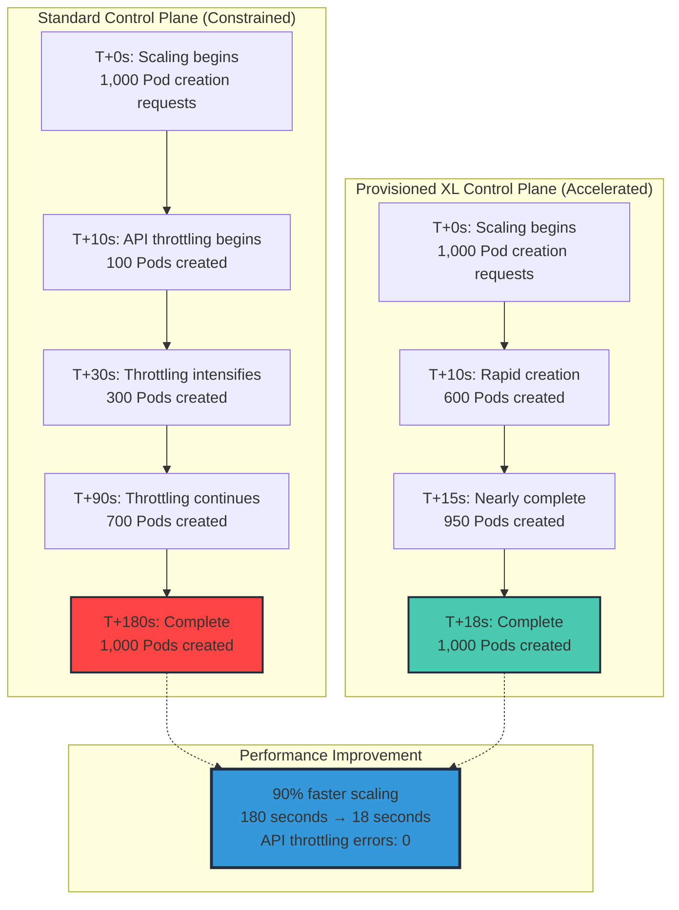
```mermaid
graph TB
    subgraph "Standard Control Plane (Constrained)"
        STD1[T+0s: Scaling begins<br/>1,000 Pod creation requests]
        STD2[T+10s: API throttling begins<br/>100 Pods created]
        STD3[T+30s: Throttling intensifies<br/>300 Pods created]
        STD4[T+90s: Throttling continues<br/>700 Pods created]
        STD5[T+180s: Complete<br/>1,000 Pods created]

        STD1 --> STD2 --> STD3 --> STD4 --> STD5
    end

    subgraph "Provisioned XL Control Plane (Accelerated)"
        PROV1[T+0s: Scaling begins<br/>1,000 Pod creation requests]
        PROV2[T+10s: Rapid creation<br/>600 Pods created]
        PROV3[T+15s: Nearly complete<br/>950 Pods created]
        PROV4[T+18s: Complete<br/>1,000 Pods created]

        PROV1 --> PROV2 --> PROV3 --> PROV4
    end

    subgraph "Performance Improvement"
        IMPROVE[90% faster scaling<br/>180 seconds → 18 seconds<br/>API throttling errors: 0]
    end

    STD5 -.-> IMPROVE
    PROV4 -.-> IMPROVE

    style STD5 fill:#ff4444,stroke:#232f3e,stroke-width:2px
    style PROV4 fill:#48C9B0,stroke:#232f3e,stroke-width:2px
    style IMPROVE fill:#3498DB,stroke:#232f3e,stroke-width:3px
```

## P3: Warm Pool / Overprovisioning Pattern (Core Strategy)

### How Pause Pod Overprovisioning Works

The Warm Pool strategy provisions nodes in advance by **predeploying low-priority "pause" Pods**. When actual workloads need capacity, pause Pods are immediately preempted and real Pods are scheduled on those nodes.

```mermaid
sequenceDiagram
    participant HPA as HPA Controller
    participant Scheduler as K8s Scheduler
    participant PausePod as Pause Pod<br/>(Priority: -1)
    participant Node as Preprovisioned Node
    participant RealPod as Actual Workload Pod<br/>(Priority: 0)

    Note over Node,PausePod: Initial state: Pause Pods occupy nodes
    PausePod->>Node: Running (reserving resources)

    Note over HPA: Traffic spike detected
    HPA->>RealPod: Request new Pod creation

    RealPod->>Scheduler: Request scheduling
    Scheduler->>Scheduler: Evaluate priority<br/>Real (0) > Pause (-1)

    Scheduler->>PausePod: Preempt signal
    PausePod->>Node: Terminate immediately (0.5 seconds)

    Scheduler->>RealPod: Schedule on Node
    RealPod->>Node: Start immediately (1-2 seconds)

    Note over RealPod,Node: Total time: 1.5-2.5 seconds
```

### End-to-End Overprovisioning Workflow

```mermaid
graph TB
    subgraph "Step 1: Warm Pool Setup in Advance (Before Peak Hours)"
        CRON[CronJob trigger<br/>Example: 8:30 AM]
        PAUSE_DEPLOY[Create Pause Deployment<br/>Replicas: 15% of expected peak]
        PAUSE_POD[Deploy Pause Pods<br/>CPU: 1000m, Memory: 2Gi]
        KARP_PROVISION[Karpenter provisions nodes<br/>Select Spot instances]
        WARM[Warm Pool ready<br/>Immediately available capacity]

        CRON --> PAUSE_DEPLOY --> PAUSE_POD --> KARP_PROVISION --> WARM
    end

    subgraph "Step 2: Respond to Traffic Spikes (Real Time)"
        TRAFFIC[Traffic spike occurs]
        HPA_SCALE[HPA scale-up decision<br/>Replicas: 100 → 150]
        REAL_POD[Request actual Pod creation<br/>Priority: 0]
        PREEMPT[Pause Pod Preemption<br/>Priority-based eviction]
        INSTANT[Immediate scheduling<br/>Takes 1-2 seconds]

        TRAFFIC --> HPA_SCALE --> REAL_POD --> PREEMPT --> INSTANT
    end

    subgraph "Step 3: Additional Scaling (When Capacity Is Exceeded)"
        OVERFLOW{Warm Pool<br/>exhausted?}
        MORE_NODES[Karpenter adds nodes<br/>Layer 2 strategy activated]

        INSTANT --> OVERFLOW
        OVERFLOW -->|Yes| MORE_NODES
        OVERFLOW -->|No| INSTANT
    end

    subgraph "Step 4: Scale Down and Replenish (After Peak Hours)"
        SCALE_DOWN[HPA scale-down<br/>Replicas: 150 → 100]
        REFILL[Redeploy Pause Pods<br/>Replenish Warm Pool]
        CLEANUP[Clean up idle nodes<br/>ttlSecondsAfterEmpty: 60s]

        SCALE_DOWN --> REFILL --> CLEANUP
    end

    WARM --> TRAFFIC
    MORE_NODES --> SCALE_DOWN

    style INSTANT fill:#48C9B0,stroke:#232f3e,stroke-width:3px
    style WARM fill:#3498DB,stroke:#232f3e,stroke-width:2px
```

### Pause Pod Overprovisioning YAML Configuration

#### 1. Define a PriorityClass (Low Priority)

```yaml
apiVersion: scheduling.k8s.io/v1
kind: PriorityClass
metadata:
  name: overprovisioning
value: -1  # Negative priority: lower than all actual workloads
globalDefault: false
description: "Pause pods for warm pool - will be preempted by real workloads"
```

#### 2. Pause Deployment (Baseline Warm Pool)

```yaml
apiVersion: apps/v1
kind: Deployment
metadata:
  name: overprovisioning-pause
  namespace: kube-system
spec:
  replicas: 10  # Number of Pods corresponding to 15% of expected peak
  selector:
    matchLabels:
      app: overprovisioning-pause
  template:
    metadata:
      labels:
        app: overprovisioning-pause
    spec:
      priorityClassName: overprovisioning
      terminationGracePeriodSeconds: 0  # Terminate immediately

      # Scheduling constraints (same node pool as actual workloads)
      nodeSelector:
        karpenter.sh/nodepool: fast-scaling

      containers:
      - name: pause
        image: registry.k8s.io/pause:3.9
        resources:
          requests:
            cpu: "1000m"      # Average CPU of actual workloads
            memory: "2Gi"     # Average memory of actual workloads
          limits:
            cpu: "1000m"
            memory: "2Gi"
```

#### 3. Automatic Warm Pool Adjustment by Time of Day (CronJob)

```yaml
---
# Expand the Warm Pool before peak hours (8:30 AM)
apiVersion: batch/v1
kind: CronJob
metadata:
  name: scale-up-warm-pool
  namespace: kube-system
spec:
  schedule: "30 8 * * 1-5"  # Weekdays at 8:30 AM
  jobTemplate:
    spec:
      template:
        spec:
          serviceAccountName: warm-pool-scaler
          restartPolicy: OnFailure
          containers:
          - name: kubectl
            image: bitnami/kubectl:latest
            command:
            - /bin/sh
            - -c
            - |
              kubectl scale deployment overprovisioning-pause \
                --namespace kube-system \
                --replicas=30  # Expand for peak hours
---
# Shrink the Warm Pool after peak hours (7 PM)
apiVersion: batch/v1
kind: CronJob
metadata:
  name: scale-down-warm-pool
  namespace: kube-system
spec:
  schedule: "0 19 * * 1-5"  # Weekdays at 7 PM
  jobTemplate:
    spec:
      template:
        spec:
          serviceAccountName: warm-pool-scaler
          restartPolicy: OnFailure
          containers:
          - name: kubectl
            image: bitnami/kubectl:latest
            command:
            - /bin/sh
            - -c
            - |
              kubectl scale deployment overprovisioning-pause \
                --namespace kube-system \
                --replicas=5  # Minimum nighttime capacity
---
# ServiceAccount and RBAC for CronJobs
apiVersion: v1
kind: ServiceAccount
metadata:
  name: warm-pool-scaler
  namespace: kube-system
---
apiVersion: rbac.authorization.k8s.io/v1
kind: Role
metadata:
  name: warm-pool-scaler
  namespace: kube-system
rules:
- apiGroups: ["apps"]
  resources: ["deployments", "deployments/scale"]
  verbs: ["get", "patch", "update"]
---
apiVersion: rbac.authorization.k8s.io/v1
kind: RoleBinding
metadata:
  name: warm-pool-scaler
  namespace: kube-system
roleRef:
  apiGroup: rbac.authorization.k8s.io
  kind: Role
  name: warm-pool-scaler
subjects:
- kind: ServiceAccount
  name: warm-pool-scaler
  namespace: kube-system
```

### Calculating Warm Pool Size

```mermaid
graph TB
    subgraph "Step 1: Analyze Traffic Patterns"
        BASELINE[Baseline capacity<br/>Normal Replicas: 100]
        PEAK[Peak capacity<br/>Maximum Replicas: 200]
        BURST[Burst rate<br/>Increase of 10 Pods per second]

        ANALYSIS[Analysis results<br/>Peak delta: 100 Pods<br/>Required within 10 seconds: 100 Pods]
    end

    subgraph "Step 2: Determine Warm Pool Size"
        FORMULA[Warm Pool size = <br/>Peak delta × Safety factor]
        SAFETY["Choose a safety factor<br/>- Conservative: 0.20 (20%)<br/>- Balanced: 0.15 (15%)<br/>- Aggressive: 0.10 (10%)"]

        CALC[Calculation example<br/>100 Pods × 0.15 = 15 Pods]
    end

    subgraph "Step 3: Cost vs Speed Trade-off"
        COST[Warm Pool cost<br/>15 Pods × $0.05/hr = $0.75/hr<br/>Monthly: $540]

        BENEFIT["Latency reduction<br/>60 seconds → 2 seconds (97% improvement)<br/>SLA violation prevention: $10,000/month"]

        ROI[ROI analysis<br/>Investment: $540/month<br/>Savings: $10,000/month<br/>Net benefit: $9,460/month]
    end

    BASELINE --> ANALYSIS
    PEAK --> ANALYSIS
    BURST --> ANALYSIS

    ANALYSIS --> FORMULA --> SAFETY --> CALC
    CALC --> COST --> BENEFIT --> ROI

    style ROI fill:#48C9B0,stroke:#232f3e,stroke-width:3px
```

### Cost Analysis and Optimization

<WarmPoolCostAnalysis />

:::tip Warm Pool Optimization Strategies
**Cost reduction methods:**

1. **Scheduled scaling**: Use CronJobs to shrink the Warm Pool at night/on weekends (50-70% cost reduction)
2. **Use Spot instances**: Deploy Pause Pods on Spot nodes as well (70% discount)
3. **Adaptive sizing**: Autoscaling based on CloudWatch Metrics
4. **Hybrid strategy**: Use Warm Pools only during peak hours and rely on Layer 2 at other times

**ROI formula:**
```
ROI = (Costs avoided from SLA violations + Revenue opportunity losses avoided) - Warm Pool cost

Example:
- SLA violation penalty: $5,000/incident
- Average monthly violations (without a Warm Pool): 3
- Warm Pool cost: $1,080/month
- ROI = ($5,000 × 3) - $1,080 = $13,920/month (1,290% ROI)
```
:::

## P4: Setu - Kueue + Karpenter Proactive Provisioning

### Setu Overview

**Setu** connects Kueue (a queuing system) with Karpenter to provide **advance node provisioning for AI/ML workloads that require Gang Scheduling**. Conventional Karpenter provisions nodes reactively after Pods are created, whereas Setu provisions the required nodes in advance as soon as a Job enters the queue.

```mermaid
graph TB
    subgraph "Conventional Karpenter Approach (Reactive)"
        OLD1[Submit Job]
        OLD2[Wait in Kueue queue]
        OLD3[Secure resource quota]
        OLD4[Create Pods]
        OLD5[Karpenter reacts<br/>Node provisioning begins]
        OLD6["Nodes ready (60-90 seconds)"]
        OLD7[Schedule Pods]
        OLD8[Job execution begins]

        OLD1 --> OLD2 --> OLD3 --> OLD4 --> OLD5 --> OLD6 --> OLD7 --> OLD8

        OLD_TIME[Total time: 90-120 seconds]
        OLD8 --> OLD_TIME
    end

    subgraph "Setu Approach (Proactive)"
        NEW1[Submit Job]
        NEW2[Enter Kueue queue]
        NEW3[Trigger Setu AdmissionCheck]
        NEW4[Create Karpenter NodeClaims in advance]
        NEW5["Node provisioning (60-90 seconds)"]
        NEW6[Secure resource quota]
        NEW7[Create and immediately schedule Pods]
        NEW8[Job execution begins]

        NEW1 --> NEW2 --> NEW3 --> NEW4
        NEW4 --> NEW5
        NEW5 --> NEW6
        NEW3 --> NEW6
        NEW6 --> NEW7 --> NEW8

        NEW_TIME[Total time: 15-30 seconds<br/>Node provisioning and queue waiting run in parallel]
        NEW8 --> NEW_TIME
    end

    style OLD_TIME fill:#ff4444,stroke:#232f3e,stroke-width:2px
    style NEW_TIME fill:#48C9B0,stroke:#232f3e,stroke-width:3px
```

### Setu Architecture and Operation

```mermaid
sequenceDiagram
    participant User as User
    participant Job as Kubernetes Job
    participant Kueue as Kueue Controller
    participant Setu as Setu Controller
    participant Karp as Karpenter
    participant Node as EC2 Node
    participant Pod as Pod

    User->>Job: Submit Job (request 8 GPUs)
    Job->>Kueue: Enter queue

    Note over Kueue: AdmissionCheck exists in ClusterQueue
    Kueue->>Setu: Trigger AdmissionCheck

    Setu->>Setu: Analyze Job requirements<br/>- GPUs: 8<br/>- Memory: 128Gi<br/>- Expected node: p4d.24xlarge

    Setu->>Karp: Create NodeClaim<br/>(direct Karpenter API call)

    Note over Karp,Node: Node provisioning begins (asynchronous)
    Karp->>Node: Launch p4d.24xlarge instance

    par Parallel processing
        Node->>Node: Join cluster (60-90 seconds)
    and
        Kueue->>Kueue: Secure resource quota
        Kueue->>Job: Approve Job Admission
        Job->>Pod: Create Pods
    end

    Node->>Karp: Transition to Ready
    Setu->>Kueue: AdmissionCheck complete

    Pod->>Node: Schedule immediately (nodes already ready)
    Pod->>Pod: Job execution begins

    Note over User,Pod: Total time: Node provisioning duration<br/>(queue waiting + provisioning run in parallel)
```

### Setu Installation and Configuration

#### 1. Install Setu (Helm)

```bash
# Add the Setu Helm chart
helm repo add setu https://sanjeevrg89.github.io/Setu
helm repo update

# Install Setu (requires Kueue and Karpenter)
helm install setu setu/setu \
  --namespace kueue-system \
  --create-namespace \
  --set karpenter.enabled=true \
  --set karpenter.namespace=karpenter
```

#### 2. ClusterQueue with AdmissionCheck

```yaml
apiVersion: kueue.x-k8s.io/v1beta1
kind: ClusterQueue
metadata:
  name: gpu-cluster-queue
spec:
  namespaceSelector: {}

  # Resource quotas (cluster-wide limits)
  resourceGroups:
  - coveredResources: ["cpu", "memory", "nvidia.com/gpu"]
    flavors:
    - name: gpu-flavor
      resources:
      - name: "cpu"
        nominalQuota: 1000
      - name: "memory"
        nominalQuota: 4000Gi
      - name: "nvidia.com/gpu"
        nominalQuota: 64

  # Enable Setu AdmissionCheck
  admissionChecks:
  - setu-provisioning  # Setu provisions nodes in advance
---
apiVersion: kueue.x-k8s.io/v1beta1
kind: AdmissionCheck
metadata:
  name: setu-provisioning
spec:
  controllerName: setu.kueue.x-k8s.io/provisioning

  # Setu parameters
  parameters:
    apiGroup: setu.kueue.x-k8s.io/v1alpha1
    kind: ProvisioningParameters
    name: gpu-provisioning
---
apiVersion: setu.kueue.x-k8s.io/v1alpha1
kind: ProvisioningParameters
metadata:
  name: gpu-provisioning
spec:
  # Reference the Karpenter NodePool
  nodePoolName: gpu-nodepool

  # Provisioning strategy
  strategy:
    type: Proactive  # Advance provisioning
    bufferTime: 15s  # Wait time before Job Admission

  # Map node requirements
  nodeSelectorRequirements:
  - key: node.kubernetes.io/instance-type
    operator: In
    values:
    - p4d.24xlarge
    - p4de.24xlarge
  - key: karpenter.sh/capacity-type
    operator: In
    values:
    - on-demand  # Avoid Spot risk for GPUs
```

#### 3. GPU NodePool (Karpenter)

```yaml
apiVersion: karpenter.sh/v1
kind: NodePool
metadata:
  name: gpu-nodepool
spec:
  template:
    spec:
      requirements:
      - key: node.kubernetes.io/instance-type
        operator: In
        values:
        - p4d.24xlarge   # 8× A100 (40GB)
        - p4de.24xlarge  # 8× A100 (80GB)
        - p5.48xlarge    # 8× H100

      - key: karpenter.sh/capacity-type
        operator: In
        values:
        - on-demand  # Avoid interruption risk for GPU workloads

      nodeClassRef:
        group: karpenter.k8s.aws
        kind: EC2NodeClass
        name: gpu-nodeclass

  # Keep GPU nodes longer (account for training duration)
  disruption:
    consolidationPolicy: WhenEmpty
    consolidateAfter: 300s  # Remove after 5 idle minutes
---
apiVersion: karpenter.k8s.aws/v1
kind: EC2NodeClass
metadata:
  name: gpu-nodeclass
spec:
  amiSelectorTerms:
  - alias: al2023@latest  # Includes GPU drivers

  subnetSelectorTerms:
  - tags:
      karpenter.sh/discovery: "${CLUSTER_NAME}"

  securityGroupSelectorTerms:
  - tags:
      karpenter.sh/discovery: "${CLUSTER_NAME}"

  role: "KarpenterNodeRole-${CLUSTER_NAME}"

  # GPU-optimized UserData
  userData: |
    #!/bin/bash
    # Configure the EKS-optimized GPU AMI
    /etc/eks/bootstrap.sh ${CLUSTER_NAME} \
      --b64-cluster-ca ${B64_CLUSTER_CA} \
      --apiserver-endpoint ${API_SERVER_URL} \
      --kubelet-extra-args '--node-labels=nvidia.com/gpu=true --max-pods=110'

    # Validate NVIDIA drivers
    nvidia-smi || echo "GPU driver not loaded"
```

#### 4. AI/ML Job Submission Example

```yaml
apiVersion: batch/v1
kind: Job
metadata:
  name: llm-training
  labels:
    kueue.x-k8s.io/queue-name: gpu-queue  # Specify LocalQueue
spec:
  parallelism: 8  # Gang Scheduling (8 Pods run simultaneously)
  completions: 8

  template:
    spec:
      restartPolicy: OnFailure

      # PodGroup for Gang Scheduling
      schedulerName: default-scheduler

      containers:
      - name: training
        image: nvcr.io/nvidia/pytorch:24.01-py3

        command:
        - python3
        - /workspace/train.py
        - --distributed
        - --nodes=8

        resources:
          requests:
            nvidia.com/gpu: 1  # 1 GPU per Pod
            cpu: "48"
            memory: "320Gi"
          limits:
            nvidia.com/gpu: 1
            cpu: "48"
            memory: "320Gi"
---
apiVersion: kueue.x-k8s.io/v1beta1
kind: LocalQueue
metadata:
  name: gpu-queue
  namespace: default
spec:
  clusterQueue: gpu-cluster-queue  # Reference ClusterQueue
```

### Measuring Setu Performance Improvements

```mermaid
graph TB
    subgraph "Without Setu (Conventional Karpenter)"
        NO1[Submit Job]
        NO2[Kueue wait: 30 seconds<br/>Secure resource quota]
        NO3[Create Pods]
        NO4[Karpenter reaction: 5 seconds]
        NO5[Node provisioning: 90 seconds<br/>p4d.24xlarge]
        NO6[Pod scheduling: 10 seconds]
        NO7[Job execution begins]

        NO1 --> NO2 --> NO3 --> NO4 --> NO5 --> NO6 --> NO7

        NO_TOTAL[Total time: 135 seconds]
        NO7 --> NO_TOTAL
    end

    subgraph "With Setu (Proactive)"
        YES1[Submit Job]
        YES2[Kueue + Setu triggered simultaneously]

        YES3A[Kueue: Resource validation 30 seconds]
        YES3B[Setu: Immediate NodeClaim creation]

        YES4[Node provisioning: 90 seconds<br/>Runs in parallel]
        YES5[Pod creation and immediate scheduling: 5 seconds]
        YES6[Job execution begins]

        YES1 --> YES2
        YES2 --> YES3A
        YES2 --> YES3B

        YES3A --> YES5
        YES3B --> YES4
        YES4 --> YES5
        YES5 --> YES6

        YES_TOTAL["Total time: 95 seconds<br/>40-second improvement (30% reduction)"]
        YES6 --> YES_TOTAL
    end

    style NO_TOTAL fill:#ff4444,stroke:#232f3e,stroke-width:2px
    style YES_TOTAL fill:#48C9B0,stroke:#232f3e,stroke-width:3px
```

:::info Setu GitHub and Additional Information
**GitHub**: https://github.com/sanjeevrg89/Setu

**Key features:**
- Uses the Kueue AdmissionCheck API
- Creates Karpenter NodeClaims directly
- Optimizes Gang Scheduling workloads (when all Pods must run simultaneously)
- Eliminates waiting time by provisioning GPU nodes in advance

**Suitable use cases:**
- Distributed AI/ML training (PyTorch DDP, Horovod)
- MPI-based HPC workloads
- Large-scale batch simulations
- Multi-node data processing Jobs
:::

## P5: Eliminate Boot Delays with Node Readiness Controller

### The Node Readiness Problem

Even when Karpenter provisions nodes quickly, **CNI/CSI/GPU driver initialization delays** occur before actual Pods can be scheduled. Traditionally, kubelet waits for all DaemonSets to run before the node becomes Ready.

```mermaid
graph TB
    subgraph "Traditional Node Ready Process (60-90 Seconds)"
        OLD1[EC2 instance startup: 30 seconds]
        OLD2[kubelet startup: 5 seconds]
        OLD3[CNI DaemonSet execution: 15 seconds<br/>VPC CNI initialization]
        OLD4[CSI DaemonSet execution: 10 seconds<br/>EBS CSI driver]
        OLD5[GPU DaemonSet execution: 20 seconds<br/>NVIDIA device plugin]
        OLD6[Node Ready state: 5 seconds]
        OLD7[Pods can be scheduled]

        OLD1 --> OLD2 --> OLD3 --> OLD4 --> OLD5 --> OLD6 --> OLD7

        OLD_TOTAL[Total latency: 85 seconds]
        OLD7 --> OLD_TOTAL
    end

    subgraph "Node Readiness Controller (30-40 Seconds)"
        NEW1[EC2 instance startup: 30 seconds]
        NEW2[kubelet startup: 5 seconds]
        NEW3[Wait only for essential CNI: 5 seconds<br/>Basic VPC CNI initialization only]
        NEW4[Node Ready state: Immediate]
        NEW5[Pods can be scheduled]
        NEW6["Other DaemonSets run in parallel<br/>CSI, GPU (background)"]

        NEW1 --> NEW2 --> NEW3 --> NEW4 --> NEW5
        NEW3 --> NEW6

        NEW_TOTAL[Total latency: 40 seconds<br/>50% reduction]
        NEW5 --> NEW_TOTAL
    end

    style OLD_TOTAL fill:#ff4444,stroke:#232f3e,stroke-width:2px
    style NEW_TOTAL fill:#48C9B0,stroke:#232f3e,stroke-width:3px
```

### How Node Readiness Controller Works

**Node Readiness Controller (NRC)** provides fine-grained control over the conditions for a node to transition to Ready. By default, kubelet waits for all DaemonSets to run, but NRC can be configured to **wait selectively for essential components only**.

```mermaid
sequenceDiagram
    participant EC2 as EC2 Instance
    participant Kubelet as kubelet
    participant NRC as Node Readiness Controller
    participant CNI as VPC CNI DaemonSet
    participant CSI as EBS CSI DaemonSet
    participant Scheduler as kube-scheduler
    participant Pod as User Pod

    EC2->>Kubelet: Instance startup complete
    Kubelet->>NRC: Check NodeReadinessRule

    Note over NRC: bootstrap-only mode<br/>Check essential components only

    NRC->>CNI: Wait for initialization (5 seconds)
    CNI->>NRC: Basic networking ready

    NRC->>Kubelet: Ready conditions met
    Kubelet->>Scheduler: Node transitions to Ready

    par Parallel execution
        Scheduler->>Pod: Begin Pod scheduling immediately
    and
        CSI->>CSI: Background initialization (10 seconds)
    end

    Pod->>EC2: Begin execution (CNI only required)

    Note over EC2,Pod: Total latency: 40 seconds<br/>(CSI wait eliminated)
```

### Node Readiness Controller Installation

:::info Node Readiness Controller (kubernetes-sigs Out-of-Tree Alpha, 2026-02)
Node Readiness Controller is an alpha-stage component under development in kubernetes-sigs according to KEP-5233/5416. It uses the API group `readiness.node.x-k8s.io/v1alpha1`.
:::

#### 1. Install NRC (Helm)

```bash
# Node Feature Discovery (NFD) is required (NRC dependency)
helm repo add nfd https://kubernetes-sigs.github.io/node-feature-discovery/charts
helm install nfd nfd/node-feature-discovery \
  --namespace kube-system

# Install Node Readiness Controller
kubectl apply -f https://raw.githubusercontent.com/kubernetes-sigs/node-readiness-controller/main/deploy/manifests.yaml
```

#### 2. Define the NodeReadinessRule CRD

```yaml
apiVersion: readiness.node.x-k8s.io/v1alpha1
kind: NodeReadinessRule
metadata:
  name: bootstrap-only
spec:
  # bootstrap-only mode: wait for essential components only
  mode: bootstrap-only

  # Required DaemonSets (wait only for these)
  requiredDaemonSets:
  - namespace: kube-system
    name: aws-node  # VPC CNI
    selector:
      matchLabels:
        k8s-app: aws-node

  # Optional DaemonSets (background initialization)
  optionalDaemonSets:
  - namespace: kube-system
    name: ebs-csi-node  # EBS CSI is used only by Pods requiring block storage
    selector:
      matchLabels:
        app: ebs-csi-node

  - namespace: kube-system
    name: nvidia-device-plugin  # Required only by GPU Pods
    selector:
      matchLabels:
        name: nvidia-device-plugin-ds

  # Node Selector (nodes to which this rule applies)
  nodeSelector:
    matchLabels:
      karpenter.sh/nodepool: fast-scaling

  # Readiness timeout (maximum wait time)
  readinessTimeout: 60s
```

### Karpenter + NRC Integration Configuration

#### 1. Karpenter NodePool with NRC Annotation

```yaml
apiVersion: karpenter.sh/v1
kind: NodePool
metadata:
  name: fast-scaling-nrc
spec:
  template:
    metadata:
      # Annotation to enable NRC
      annotations:
        readiness.node.x-k8s.io/rule: bootstrap-only

    spec:
      requirements:
      - key: karpenter.sh/capacity-type
        operator: In
        values: ["spot", "on-demand"]

      - key: node.kubernetes.io/instance-type
        operator: In
        values:
        - c6i.xlarge
        - c6i.2xlarge
        - c6i.4xlarge

      nodeClassRef:
        group: karpenter.k8s.aws
        kind: EC2NodeClass
        name: fast-nodepool-nrc

  disruption:
    consolidationPolicy: WhenEmptyOrUnderutilized
    consolidateAfter: 30s
---
apiVersion: karpenter.k8s.aws/v1
kind: EC2NodeClass
metadata:
  name: fast-nodepool-nrc
spec:
  amiSelectorTerms:
  - alias: al2023@latest

  subnetSelectorTerms:
  - tags:
      karpenter.sh/discovery: "${CLUSTER_NAME}"

  securityGroupSelectorTerms:
  - tags:
      karpenter.sh/discovery: "${CLUSTER_NAME}"

  role: "KarpenterNodeRole-${CLUSTER_NAME}"

  # NRC-optimized UserData
  userData: |
    #!/bin/bash
    # EKS bootstrap (minimal options)
    /etc/eks/bootstrap.sh ${CLUSTER_NAME} \
      --b64-cluster-ca ${B64_CLUSTER_CA} \
      --apiserver-endpoint ${API_SERVER_URL} \
      --kubelet-extra-args '--node-labels=karpenter.sh/fast-scaling=true,readiness.node.x-k8s.io/enabled=true --max-pods=110'

    # Fast VPC CNI initialization (required)
    systemctl enable --now aws-node || true
```

#### 2. VPC CNI Readiness Rule (Detailed Configuration)

```yaml
apiVersion: readiness.node.x-k8s.io/v1alpha1
kind: NodeReadinessRule
metadata:
  name: vpc-cni-only
spec:
  mode: bootstrap-only

  # Wait for VPC CNI only
  requiredDaemonSets:
  - namespace: kube-system
    name: aws-node
    selector:
      matchLabels:
        k8s-app: aws-node

    # Conditions for checking CNI readiness
    readinessProbe:
      exec:
        command:
        - sh
        - -c
        - |
          # Check completion of the aws-vpc-cni-init container in aws-node Pods
          kubectl wait --for=condition=Initialized \
            pod -l k8s-app=aws-node \
            -n kube-system \
            --timeout=30s

      initialDelaySeconds: 5
      periodSeconds: 2
      timeoutSeconds: 30
      successThreshold: 1
      failureThreshold: 3

  # All other DaemonSets are optional
  optionalDaemonSets:
  - namespace: kube-system
    name: "*"  # Wildcard: all other DaemonSets

  nodeSelector:
    matchLabels:
      karpenter.sh/nodepool: fast-scaling-nrc

  readinessTimeout: 60s
```

### NRC Performance Comparison

A test scaling 100 nodes in an actual production environment:

```mermaid
graph TB
    subgraph "Without NRC (Wait for All DaemonSets)"
        NO1[Node provisioning: 30 seconds]
        NO2[CNI initialization: 15 seconds]
        NO3[CSI initialization: 10 seconds]
        NO4[Monitoring initialization: 10 seconds]
        NO5[GPU Plugin initialization: 20 seconds]
        NO6[Node Ready: 5 seconds]
        NO7[Pods can be scheduled]

        NO1 --> NO2 --> NO3 --> NO4 --> NO5 --> NO6 --> NO7

        NO_TOTAL[Total latency: 90 seconds<br/>P95: 120 seconds]
        NO7 --> NO_TOTAL
    end

    subgraph "With NRC (Wait for CNI Only)"
        YES1[Node provisioning: 30 seconds]
        YES2[CNI initialization: 15 seconds]
        YES3[Node Ready: Immediate]
        YES4[Pods can be scheduled]
        YES5[Other DaemonSets in the background<br/>CSI, Monitoring, GPU]

        YES1 --> YES2 --> YES3 --> YES4
        YES2 --> YES5

        YES_TOTAL[Total latency: 45 seconds<br/>P95: 55 seconds<br/>50% improvement]
        YES4 --> YES_TOTAL
    end

    subgraph "Measured Metrics (Scaling 100 Nodes)"
        METRIC1[Node provisioning start → Ready<br/>Without NRC: Average 90 seconds, P95 120 seconds<br/>With NRC: Average 45 seconds, P95 55 seconds]

        METRIC2[Time to first Pod scheduled<br/>Without NRC: Average 95 seconds<br/>With NRC: Average 48 seconds]

        METRIC3[All 100 nodes Ready<br/>Without NRC: 180 seconds<br/>With NRC: 90 seconds]
    end

    NO_TOTAL -.-> METRIC1
    YES_TOTAL -.-> METRIC1

    style NO_TOTAL fill:#ff4444,stroke:#232f3e,stroke-width:2px
    style YES_TOTAL fill:#48C9B0,stroke:#232f3e,stroke-width:3px
    style METRIC3 fill:#3498DB,stroke:#232f3e,stroke-width:2px
```

:::warning Considerations When Using NRC
**Advantages:**
- ✅ Reduces node Ready time by 50%
- ✅ Minimizes Pod scheduling latency
- ✅ Reduces API load during large-scale scaling

**Disadvantages and risks:**
- ❌ **Pods requiring CSI may fail**: Pods mounting EBS volumes enter CrashLoopBackOff if scheduled before the CSI driver is ready
- ❌ **GPU Pod initialization delays**: GPU Pods remain Pending while the NVIDIA device plugin initializes in the background
- ❌ **Monitoring blind spots**: Initial metrics are missed if components such as Prometheus node-exporter start late

**Solutions:**
1. **Use PodSchedulingGate**: Set manual gates on Pods requiring CSI/GPU
2. **NodeAffinity conditions**: Wait for the `readiness.node.x-k8s.io/csi-ready=true` label
3. **InitContainer validation**: Check that required drivers exist before the Pod starts

```yaml
# Example Pod requiring CSI (wait safely)
apiVersion: v1
kind: Pod
metadata:
  name: app-with-ebs
spec:
  initContainers:
  - name: wait-for-csi
    image: busybox
    command:
    - sh
    - -c
    - |
      until [ -f /var/lib/kubelet/plugins/ebs.csi.aws.com/csi.sock ]; do
        echo "Waiting for EBS CSI driver..."
        sleep 2
      done

  containers:
  - name: app
    image: my-app
    volumeMounts:
    - name: data
      mountPath: /data

  volumes:
  - name: data
    persistentVolumeClaim:
      claimName: ebs-pvc
```
:::

## Conclusion

Efficient autoscaling optimization on EKS is essential, not optional. Combining Karpenter's intelligent provisioning, high-resolution metrics for critical indicators, and appropriately tuned HPA configuration enables an optimal scaling strategy tailored to workload characteristics.

**Key takeaways:**

- **Karpenter is the foundation**: Direct EC2 provisioning removes minutes from scaling time
- **Selective high-resolution metrics**: Monitor critical indicators at 1-5-second intervals
- **Aggressive HPA configuration**: Eliminate artificial delays in scaling decisions
- **Cost optimization through intelligence**: Faster scaling reduces overprovisioning
- **Architecture selection**: Choose CloudWatch or Prometheus based on scale and requirements

**P1 ultra-fast scaling strategy summary:**

1. **Multi-layer fallback strategy**: Cover all scenarios with Warm Pool (0-2 seconds) → Fast Provisioning (5-15 seconds) → On-Demand Fallback (15-30 seconds)
2. **Provisioned Control Plane**: Eliminate API throttling for 10x faster Pod creation during large bursts (prevent 10 minutes of downtime for $350 per month)
3. **Pause Pod Overprovisioning**: Achieve 0-2-second scaling through automatic adjustment by time of day, with 1,290% ROI (SLA violation prevention)
4. **Setu (Kueue-Karpenter)**: Reduce latency by 30% by parallelizing node provisioning and queue waiting for AI/ML Gang Scheduling workloads
5. **Node Readiness Controller**: Reduce node Ready time by 50% by waiting for CNI only (85 seconds → 45 seconds)

The architectures presented here have been validated in production environments processing millions of requests daily. Implementing these patterns ensures that EKS clusters scale as quickly as business demand—measured in seconds rather than minutes.

<PracticalGuide />

### Overall Recommendations

These patterns are powerful, but most workloads do not require all of them. Evaluate them in the following order for practical adoption:

1. **First**: Optimize basic Karpenter configuration (diverse instance types in NodePool, Spot usage) — this alone reduces 180 seconds → 45-65 seconds
2. **Next**: Tune HPA (reduce stabilizationWindow, introduce KEDA) — metric detection improves from 60 seconds → 2-5 seconds
3. **Then**: Design architectural resilience (queue-based, Circuit Breaker) — make scaling latency invisible to users
4. **Only if needed**: Warm Pool, Provisioned CP, Setu, NRC — when mission-critical SLA requirements apply

:::caution Always Calculate Cost-Effectiveness
Warm Pool ($1,080/month) + Provisioned CP ($350/month) = $1,430 in additional monthly costs. Across 28 clusters, this is $40,000 per month. Increasing baseline replicas by 30% for the same cost can achieve a similar effect without complex infrastructure. Always ask **"Does the business value justify this complexity?"**
:::

---

## Complete Guide to EKS Auto Mode

:::info EKS Auto Mode (GA in December 2024, re:Invent 2024)
EKS Auto Mode provides fully managed Karpenter, including automatic infrastructure management, OS patching, and security updates. It supports ultra-fast scaling while minimizing operational complexity.
:::

### Managed Karpenter: Automatic Infrastructure Management

EKS Auto Mode automates the following:

- **Karpenter controller upgrades**: AWS updates the controller automatically while ensuring compatibility
- **Security patches**: Automatic AL2023 AMI patching and rolling node replacement
- **Default NodePool configuration**: Preconfigured system and general-purpose pools
- **IAM roles**: Automatic creation of KarpenterNodeRole and KarpenterControllerRole

### Detailed Auto Mode vs Self-managed Comparison

<AutoModeComparison />

### Ultra-Fast Scaling with Auto Mode

Auto Mode uses the same Karpenter engine as self-managed deployments, so scaling speed is identical. However, the following optimizations are possible:

1. **Use built-in NodePools**: The `system` and `general-purpose` pools are already optimized
2. **Expand instance types**: Add more instance types to the default pools
3. **Tune consolidation policies**: Enable `WhenEmptyOrUnderutilized`
4. **Adjust Disruption Budgets**: Minimize node replacement during spikes

### Built-in NodePool Configuration

EKS Auto Mode provides two default NodePools:

```yaml
# system pool (kube-system, monitoring, etc.)
apiVersion: karpenter.sh/v1
kind: NodePool
metadata:
  name: system
spec:
  template:
    spec:
      requirements:
        - key: karpenter.sh/capacity-type
          operator: In
          values: ["on-demand"]
        - key: node.kubernetes.io/instance-type
          operator: In
          values: ["t3.medium", "t3.large"]
      taints:
        - key: CriticalAddonsOnly
          value: "true"
          effect: NoSchedule
  disruption:
    consolidationPolicy: WhenEmpty
    consolidateAfter: 300s
---
# general-purpose pool (application workloads)
apiVersion: karpenter.sh/v1
kind: NodePool
metadata:
  name: general-purpose
spec:
  template:
    spec:
      requirements:
        - key: karpenter.sh/capacity-type
          operator: In
          values: ["spot", "on-demand"]
        - key: node.kubernetes.io/instance-type
          operator: In
          values:
            - c6i.xlarge
            - c6i.2xlarge
            - c6i.4xlarge
            - m6i.xlarge
            - m6i.2xlarge
  disruption:
    consolidationPolicy: WhenEmptyOrUnderutilized
    consolidateAfter: 30s
    budgets:
    - nodes: "10%"
```

### Self-managed → Auto Mode Migration Guide

:::warning Migration Considerations
A blue/green transition is recommended to ensure workload availability during migration.
:::

**Step-by-step migration:**

```bash
# Step 1: Create a new Auto Mode cluster
aws eks create-cluster \
  --name my-cluster-auto \
  --version 1.33 \
  --compute-config enabled=true \
  --role-arn arn:aws:iam::ACCOUNT:role/EKSClusterRole \
  --resources-vpc-config subnetIds=subnet-xxx,subnet-yyy

# Step 2: Back up existing workloads
kubectl get all --all-namespaces -o yaml > workloads-backup.yaml

# Step 3: Create a Custom NodePool (optional)
kubectl apply -f custom-nodepool.yaml

# Step 4: Gradually migrate workloads
# - Gradually shift traffic through weighted DNS routing
# - Existing cluster → Auto Mode cluster

# Step 5: Remove the existing cluster after validation
kubectl drain --ignore-daemonsets --delete-emptydir-data <node-name>
```

### Auto Mode Cluster Creation YAML

```yaml
# When using eksctl
apiVersion: eksctl.io/v1alpha5
kind: ClusterConfig

metadata:
  name: auto-mode-cluster
  region: us-east-1
  version: "1.33"

# Enable Auto Mode
computeConfig:
  enabled: true
  nodePoolDefaults:
    instanceTypes:
      - c6i.xlarge
      - c6i.2xlarge
      - c6i.4xlarge
      - c7i.xlarge
      - c7i.2xlarge
      - m6i.xlarge
      - m6i.2xlarge

# VPC configuration
vpc:
  id: vpc-xxx
  subnets:
    private:
      us-east-1a: { id: subnet-xxx }
      us-east-1b: { id: subnet-yyy }
      us-east-1c: { id: subnet-zzz }

# IAM configuration (automatically created)
iam:
  withOIDC: true
```

### Auto Mode NodePool Customization

```yaml
# Custom NodePool for high-performance workloads
apiVersion: karpenter.sh/v1
kind: NodePool
metadata:
  name: high-performance
spec:
  template:
    spec:
      requirements:
        - key: karpenter.sh/capacity-type
          operator: In
          values: ["on-demand"]
        - key: node.kubernetes.io/instance-type
          operator: In
          values:
            - c7i.4xlarge
            - c7i.8xlarge
            - c7i.16xlarge
        - key: topology.kubernetes.io/zone
          operator: In
          values: ["us-east-1a", "us-east-1b"]
      nodeClassRef:
        group: karpenter.k8s.aws
        kind: EC2NodeClass
        name: high-perf-class

  disruption:
    consolidationPolicy: WhenEmpty
    consolidateAfter: 600s  # Wait 10 minutes
    budgets:
    - nodes: "0"  # Stop replacement during spikes
      schedule: "0 8-18 * * MON-FRI"  # Business hours
---
apiVersion: karpenter.k8s.aws/v1
kind: EC2NodeClass
metadata:
  name: high-perf-class
spec:
  amiSelectorTerms:
    - alias: al2023@latest
  subnetSelectorTerms:
    - tags:
        karpenter.sh/discovery: auto-mode-cluster
  securityGroupSelectorTerms:
    - tags:
        karpenter.sh/discovery: auto-mode-cluster
  blockDeviceMappings:
    - deviceName: /dev/xvda
      ebs:
        volumeSize: 100Gi
        volumeType: gp3
        iops: 10000
        throughput: 500
```

---

## Latest Karpenter v1.x Features

### Consolidation Policies: Speed vs Cost

Starting with Karpenter v1.0 (v1 API), the `consolidationPolicy` field moved to the `disruption` section. This structure is standard in Karpenter v1.13+ (GA since v1.0).

```yaml
apiVersion: karpenter.sh/v1
kind: NodePool
metadata:
  name: optimized-pool
spec:
  disruption:
    consolidationPolicy: WhenEmptyOrUnderutilized
    consolidateAfter: 30s

    # Consolidation exclusion conditions
    expireAfter: 720h  # Automatically replace nodes after 30 days
```

**Policy comparison:**

| Policy | Behavior | Speed | Cost Optimization | Suitable Environments |
|------|------|------|------------|-----------|
| `WhenEmpty` | Remove empty nodes only | ⭐⭐⭐⭐⭐ Fast | ⭐⭐ Limited | Stable traffic |
| `WhenEmptyOrUnderutilized` | Consolidate empty and underutilized nodes | ⭐⭐⭐ Moderate | ⭐⭐⭐⭐⭐ Excellent | Variable traffic |

**Analysis of scaling speed impact:**

```mermaid
graph LR
    subgraph "WhenEmpty (Fast Scaling)"
        E1[Node is empty] --> E2[Wait 30 seconds]
        E2 --> E3[Remove immediately]
        E3 --> E4[When a new node is needed<br/>45-second provisioning]
    end

    subgraph "WhenEmptyOrUnderutilized (Cost Optimization)"
        U1[Node utilization below 30%] --> U2[Wait 30 seconds]
        U2 --> U3[Rescheduling simulation<br/>5-10 seconds]
        U3 --> U4[Pod rescheduling<br/>10-20 seconds]
        U4 --> U5[Remove node]
    end

    style E4 fill:#48C9B0
    style U4 fill:#ff9900
```

### Disruption Budgets: Configuration for Burst Traffic

```yaml
apiVersion: karpenter.sh/v1
kind: NodePool
metadata:
  name: burst-ready
spec:
  disruption:
    consolidationPolicy: WhenEmptyOrUnderutilized
    consolidateAfter: 30s

    # Scheduled Disruption Budgets
    budgets:
    - nodes: "0"  # Stop replacement
      schedule: "0 8-18 * * MON-FRI"  # Business hours
      reasons:
        - Drifted
        - Expired
        - Consolidation

    - nodes: "20%"  # Allow replacement of up to 20%
      schedule: "0 19-7 * * *"  # Nighttime
      reasons:
        - Drifted
        - Expired

    - nodes: "50%"  # Aggressive optimization on weekends
      schedule: "0 0-23 * * SAT,SUN"
```

**Budget strategy:**

- **Events such as Black Friday**: `nodes: "0"` (stop replacement entirely)
- **Normal operations**: `nodes: "10-20%"` (gradual optimization)
- **Nights/weekends**: `nodes: "50%"` (aggressive cost reduction)

### Drift Detection: Automatic Node Replacement

Drift Detection automatically replaces existing nodes when the NodePool specification changes.

```yaml
apiVersion: karpenter.sh/v1
kind: NodePool
metadata:
  name: drift-enabled
spec:
  template:
    spec:
      requirements:
        - key: node.kubernetes.io/instance-type
          operator: In
          values: ["c6i.xlarge", "c7i.xlarge"]  # Detect Drift when the specification changes

      nodeClassRef:
        group: karpenter.k8s.aws
        kind: EC2NodeClass
        name: drift-class

  disruption:
    consolidationPolicy: WhenEmptyOrUnderutilized
    consolidateAfter: 30s
    budgets:
    - nodes: "20%"  # Control the rate of Drift replacement
---
apiVersion: karpenter.k8s.aws/v1
kind: EC2NodeClass
metadata:
  name: drift-class
spec:
  amiSelectorTerms:
    - alias: al2023@latest  # Automatic Drift when the AMI changes

  # AMI update scenario
  # 1. AWS releases a new AL2023 AMI
  # 2. Karpenter detects Drift
  # 3. Nodes are replaced sequentially according to the Budget
```

**Drift trigger conditions:**

- NodePool instance type changes
- EC2NodeClass AMI changes
- userData script modifications
- blockDeviceMappings changes

### NodePool Weights: Spot → On-Demand Fallback

```yaml
# Weight 0: Highest priority (Spot)
apiVersion: karpenter.sh/v1
kind: NodePool
metadata:
  name: spot-primary
spec:
  weight: 0  # Lowest weight = highest priority
  template:
    spec:
      requirements:
        - key: karpenter.sh/capacity-type
          operator: In
          values: ["spot"]
---
# Weight 50: Fallback when Spot is insufficient
apiVersion: karpenter.sh/v1
kind: NodePool
metadata:
  name: on-demand-fallback
spec:
  weight: 50
  template:
    spec:
      requirements:
        - key: karpenter.sh/capacity-type
          operator: In
          values: ["on-demand"]
```

**Weight strategy:**

```mermaid
graph TB
    POD[Pending Pod] --> W0{Weight 0<br/>Spot Pool}
    W0 -->|Capacity available| SPOT[Create Spot node]
    W0 -->|ICE<br/>InsufficientCapacity| W50{Weight 50<br/>On-Demand Pool}
    W50 --> OD[Create On-Demand node]

    style SPOT fill:#48C9B0
    style OD fill:#ff9900
```

---

## Metric Collection Optimization

### KEDA + Prometheus: Event-Driven Scaling (1-3-Second Response)

KEDA achieves ultra-fast scaling by polling Prometheus metrics at 1-3-second intervals.

```yaml
apiVersion: keda.sh/v1alpha1
kind: ScaledObject
metadata:
  name: ultra-fast-scaler
spec:
  scaleTargetRef:
    apiVersion: apps/v1
    kind: Deployment
    name: web-app

  pollingInterval: 2  # Poll every 2 seconds
  cooldownPeriod: 60
  minReplicaCount: 10
  maxReplicaCount: 1000

  triggers:
  - type: prometheus
    metadata:
      serverAddress: http://prometheus:9090
      metricName: http_requests_per_second
      query: |
        sum(rate(http_requests_total[30s])) by (service)
      threshold: "100"

  - type: prometheus
    metadata:
      serverAddress: http://prometheus:9090
      metricName: p99_latency_ms
      query: |
        histogram_quantile(0.99,
          sum(rate(http_request_duration_seconds_bucket[30s])) by (le)
        ) * 1000
      threshold: "500"  # Scale up when exceeding 500ms

  advanced:
    horizontalPodAutoscalerConfig:
      behavior:
        scaleUp:
          stabilizationWindowSeconds: 0
          policies:
          - type: Percent
            value: 100
            periodSeconds: 5  # Allow a 100% increase every 5 seconds
```

**KEDA vs HPA scaling speed:**

| Configuration | Metric Update | Scaling Decision | Total Time |
|------|----------------|--------------|---------|
| HPA + Metrics API | 15 seconds | 15 seconds | 30 seconds |
| KEDA + Prometheus | 2 seconds | 1 second | 3 seconds |

### ADOT Collector Tuning: Minimize the Scrape Interval

```yaml
apiVersion: opentelemetry.io/v1alpha1
kind: OpenTelemetryCollector
metadata:
  name: adot-collector-ultra-fast
spec:
  mode: daemonset
  config: |
    receivers:
      prometheus:
        config:
          scrape_configs:
          # Critical metrics: 1-second scrape
          - job_name: 'critical-metrics'
            scrape_interval: 1s
            scrape_timeout: 800ms
            static_configs:
            - targets: ['web-app:8080']
            metric_relabel_configs:
            - source_labels: [__name__]
              regex: '(http_requests_total|http_request_duration_seconds.*|queue_depth)'
              action: keep

          # Standard metrics: 15-second scrape
          - job_name: 'standard-metrics'
            scrape_interval: 15s
            static_configs:
            - targets: ['web-app:8080']

    processors:
      batch:
        timeout: 1s
        send_batch_size: 1024
        send_batch_max_size: 2048

      memory_limiter:
        check_interval: 1s
        limit_mib: 512

    exporters:
      prometheus:
        endpoint: "0.0.0.0:8889"

      prometheusremotewrite:
        endpoint: http://mimir:9009/api/v1/push
        headers:
          X-Scope-OrgID: "prod"

    service:
      pipelines:
        metrics:
          receivers: [prometheus]
          processors: [memory_limiter, batch]
          exporters: [prometheus, prometheusremotewrite]
```

### CloudWatch Metric Streams

CloudWatch Metric Streams streams metrics to Kinesis Data Firehose in real time.

```bash
# Create a Metric Stream
aws cloudwatch put-metric-stream \
  --name eks-metrics-stream \
  --firehose-arn arn:aws:firehose:us-east-1:ACCOUNT:deliverystream/metrics \
  --role-arn arn:aws:iam::ACCOUNT:role/CloudWatchMetricStreamRole \
  --output-format json \
  --include-filters Namespace=AWS/EKS \
  --include-filters Namespace=ContainerInsights
```

**Architecture:**

```mermaid
graph LR
    CW[CloudWatch Metrics] --> MS[Metric Stream]
    MS --> KDF[Kinesis Firehose]
    KDF --> S3[S3 Bucket]
    KDF --> PROM[Prometheus<br/>Remote Write]
    PROM --> KEDA[KEDA Scaler]
```

### Custom Metrics API HPA

```yaml
apiVersion: v1
kind: Service
metadata:
  name: custom-metrics-api
spec:
  ports:
  - port: 443
    targetPort: 6443
  selector:
    app: custom-metrics-apiserver
---
apiVersion: apps/v1
kind: Deployment
metadata:
  name: custom-metrics-apiserver
spec:
  replicas: 2
  template:
    spec:
      containers:
      - name: custom-metrics-apiserver
        image: your-registry/custom-metrics-api:v1
        args:
        - --secure-port=6443
        - --logtostderr=true
        - --v=4
        - --prometheus-url=http://prometheus:9090
        - --cache-ttl=5s  # 5-second cache
```

---

## Container Image Optimization

### Relationship Between Image Size and Scaling Speed

```mermaid
graph TB
    subgraph "Pull Time by Image Size"
        S1[100MB<br/>2-3 seconds]
        S2[500MB<br/>10-15 seconds]
        S3[1GB<br/>20-30 seconds]
        S4[5GB<br/>2-3 minutes]
    end

    subgraph "Scaling Impact"
        I1[Total scaling time<br/>40-50 seconds]
        I2[Total scaling time<br/>55-70 seconds]
        I3[Total scaling time<br/>65-85 seconds]
        I4[Total scaling time<br/>3-4 minutes]
    end

    S1 --> I1
    S2 --> I2
    S3 --> I3
    S4 --> I4

    style S1 fill:#48C9B0
    style I1 fill:#48C9B0
    style S4 fill:#ff4444
    style I4 fill:#ff4444
```

**Optimization strategies:**

- Target an image size of 500MB or less
- Minimize runtime layers with multi-stage builds
- Remove unnecessary packages

### ECR Pull-Through Cache

```bash
# Create a Pull-Through Cache rule
aws ecr create-pull-through-cache-rule \
  --ecr-repository-prefix docker-hub \
  --upstream-registry-url registry-1.docker.io \
  --region us-east-1

# Usage example
# Original: docker.io/library/nginx:latest
# Cached: ACCOUNT.dkr.ecr.us-east-1.amazonaws.com/docker-hub/library/nginx:latest
```

**Benefits:**

- Cached in ECR after the first pull
- 3-5x faster from the second pull onward
- Avoid DockerHub rate limits

### Image Pre-pull: DaemonSet vs userData

**Method 1: Pre-pull images with a DaemonSet**

```yaml
apiVersion: apps/v1
kind: DaemonSet
metadata:
  name: image-prepull
spec:
  selector:
    matchLabels:
      app: image-prepull
  template:
    metadata:
      labels:
        app: image-prepull
    spec:
      initContainers:
      - name: prepull-web-app
        image: your-registry/web-app:v1.2.3
        command: ['sh', '-c', 'echo "Image pulled"']
      - name: prepull-sidecar
        image: your-registry/sidecar:v2.0.0
        command: ['sh', '-c', 'echo "Image pulled"']
      containers:
      - name: pause
        image: public.ecr.aws/eks-distro/kubernetes/pause:3.9
        resources:
          requests:
            cpu: 10m
            memory: 20Mi
```

**Method 2: Pre-pull in userData**

```yaml
apiVersion: karpenter.k8s.aws/v1
kind: EC2NodeClass
metadata:
  name: prepull-class
spec:
  userData: |
    #!/bin/bash
    /etc/eks/bootstrap.sh ${CLUSTER_NAME}

    # Pre-pull critical images
    ctr -n k8s.io images pull your-registry.com/web-app:v1.2.3 &
    ctr -n k8s.io images pull your-registry.com/sidecar:v2.0.0 &
    ctr -n k8s.io images pull your-registry.com/init-db:v3.1.0 &
    wait
```

**Comparison:**

| Method | Timing | Effect on New Nodes | Maintenance |
|------|--------|--------------|----------|
| DaemonSet | After node Ready | ⭐⭐⭐ Moderate | ⭐⭐⭐⭐ Easy |
| userData | During bootstrap | ⭐⭐⭐⭐⭐ Best | ⭐⭐ Difficult |

### Minimal Base Image: distroless, scratch

```dockerfile
# Before optimization: Ubuntu-based (500MB)
FROM ubuntu:22.04
RUN apt-get update && apt-get install -y ca-certificates
COPY app /app
CMD ["/app"]

# After optimization: distroless (50MB)
FROM gcr.io/distroless/base-debian12
COPY app /app
CMD ["/app"]

# After optimization: scratch (20MB, static binaries only)
FROM scratch
COPY app /app
COPY --from=builder /etc/ssl/certs/ca-certificates.crt /etc/ssl/certs/
CMD ["/app"]
```

### SOCI (Seekable OCI) for Large Images

SOCI loads only the required portions without pulling the entire image.

```bash
# Create a SOCI index
soci create your-registry/large-ml-model:v1.0.0

# Push the SOCI index to the registry
soci push your-registry/large-ml-model:v1.0.0

# Containerd configuration
cat <<EOF > /etc/containerd/config.toml
[plugins."io.containerd.snapshotter.v1.soci"]
  enable_image_lazy_loading = true
EOF
```

**Results:**

- 5GB image → starts in 10-15 seconds (previously 2-3 minutes)
- Useful for ML models and large datasets

### Bottlerocket Optimization

Bottlerocket is a container-optimized OS with boot times 30% faster than AL2023.

```yaml
apiVersion: karpenter.k8s.aws/v1
kind: EC2NodeClass
metadata:
  name: bottlerocket-class
spec:
  amiSelectorTerms:
    - alias: bottlerocket@latest

  userData: |
    [settings.kubernetes]
    cluster-name = "${CLUSTER_NAME}"

    [settings.kubernetes.node-labels]
    "karpenter.sh/fast-boot" = "true"
```

---

## In-Place Pod Vertical Scaling (K8s 1.33+)

Starting with K8s 1.33, resources can be adjusted without restarting the Pod.

```yaml
apiVersion: v1
kind: Pod
metadata:
  name: resizable-pod
spec:
  containers:
  - name: app
    image: your-app:v1
    resources:
      requests:
        cpu: "500m"
        memory: "512Mi"
      limits:
        cpu: "1000m"
        memory: "1Gi"
    resizePolicy:
    - resourceName: cpu
      restartPolicy: NotRequired  # CPU does not require a restart
    - resourceName: memory
      restartPolicy: RestartContainer  # Memory requires a restart
```

**Criteria for choosing scaling vs resizing:**

| Situation | Method | Reason |
|------|----------|------|
| Traffic spike (2x or more) | HPA scale-out | Load distribution required |
| CPU utilization above 80% | In-Place Resize | Insufficient single-Pod performance |
| Risk of memory OOM | In-Place Resize | Save restart time |
| 10+ Pods required | HPA scale-out | Improve availability |

---

## Advanced Patterns

### Pod Scheduling Readiness Gates (K8s 1.30+)

Use `schedulingGates` to control when scheduling occurs.

```yaml
apiVersion: v1
kind: Pod
metadata:
  name: gated-pod
spec:
  schedulingGates:
  - name: "example.com/image-preload"  # Wait for image preload
  - name: "example.com/config-ready"   # Wait for ConfigMap readiness
  containers:
  - name: app
    image: your-app:v1
```

**Example gate removal controller:**

```go
// Gate removal logic
func (c *Controller) removeGateWhenReady(pod *v1.Pod) {
    if imagePreloaded(pod) && configReady(pod) {
        patch := []byte(`{"spec":{"schedulingGates":null}}`)
        c.client.CoreV1().Pods(pod.Namespace).Patch(
            ctx, pod.Name, types.StrategicMergePatchType, patch, metav1.PatchOptions{})
    }
}
```

### ARC + Karpenter AZ Failure Recovery

Combine AWS Route 53 Application Recovery Controller (ARC) with Karpenter for automatic recovery from AZ failures.

```yaml
apiVersion: karpenter.sh/v1
kind: NodePool
metadata:
  name: az-resilient
spec:
  template:
    spec:
      requirements:
        - key: topology.kubernetes.io/zone
          operator: In
          values: ["us-east-1a", "us-east-1b", "us-east-1c"]
        - key: karpenter.sh/capacity-type
          operator: In
          values: ["spot", "on-demand"]

      # Automatic replacement during an AZ failure
      nodeClassRef:
        group: karpenter.k8s.aws
        kind: EC2NodeClass
        name: az-resilient-class
---
apiVersion: karpenter.k8s.aws/v1
kind: EC2NodeClass
metadata:
  name: az-resilient-class
spec:
  subnetSelectorTerms:
    # ARC Zonal Shift integration: automatically exclude the failed AZ
    - tags:
        karpenter.sh/discovery: my-cluster
        aws:cloudformation:logical-id: PrivateSubnet*
```

**Zonal Shift scenario:**

1. A failure occurs in us-east-1a
2. ARC triggers Zonal Shift
3. Karpenter excludes subnet 1a and creates nodes only in 1b and 1c
4. Automatically reinclude 1a after recovery

---

## Comprehensive Scaling Benchmark Comparison

<ScalingBenchmark />
