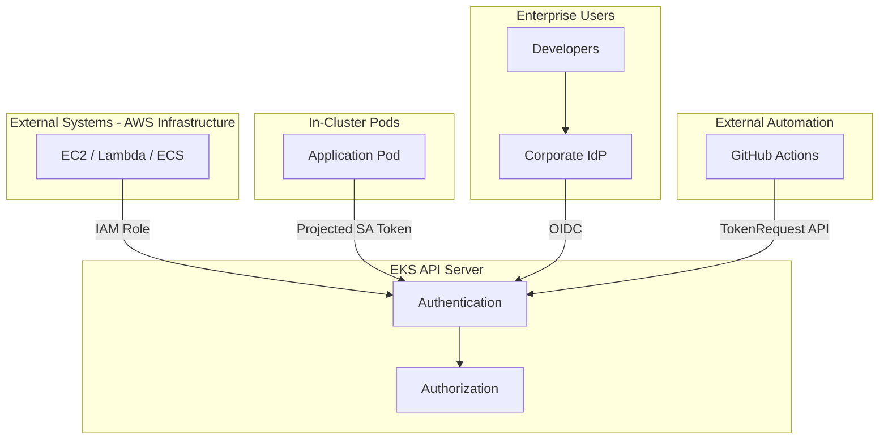

# EKS API Server Authentication/Authorization Guide

> **Written**: 2026-03-24 | **Reading time**: ~20 min

## Overview

The EKS API Server is accessed not only by kubectl users but by various **Non-Standard Callers**: CI/CD pipelines (GitHub Actions, Jenkins, ArgoCD), monitoring systems (Prometheus, Datadog), automation tools (Terraform, custom controllers), and enterprise users.

This document provides **authentication (AuthN)** method selection and **authorization (AuthZ)** best practices for each scenario.

---

## 1. EKS API Server Authentication Methods

| # | Method | Suitable For | Recommendation |
|---|--------|-------------|---------------|
| 1 | **IAM** (aws-iam-authenticator) | Systems running on AWS infrastructure, kubectl users | Top priority |
| 2 | **EKS Pod Identity** (IRSA v2) | Pods running inside EKS cluster | Optimal for Pod workloads |
| 3 | **K8s Service Account Token** | In-cluster automation, CI/CD | Also usable for external systems |
| 4 | **External OIDC Identity Provider** | Enterprise IdP (Okta, Azure AD, Google) | Optimal for enterprise SSO |
| 5 | **x509 Client Certificate** | Legacy cert-based authentication | Limited (no CRL support) |

---

## 2. Recommended Approach by Caller Type

### CASE A: External Systems on AWS Infrastructure (EC2, Lambda, ECS)

**IAM Role + Access Entry** (top priority)

```bash
aws eks update-cluster-config --name <cluster> \
    --access-config '{"authenticationMode": "API_AND_CONFIG_MAP"}'

aws eks create-access-entry \
    --cluster-name <cluster> \
    --principal-arn arn:aws:iam::<account>:role/<role> \
    --type STANDARD

aws eks associate-access-policy \
    --cluster-name <cluster> \
    --principal-arn arn:aws:iam::<account>:role/<role> \
    --policy-arn arn:aws:eks::aws:cluster-access-policy/AmazonEKSViewPolicy \
    --access-scope '{"type": "namespace", "namespaces": ["monitoring"]}'
```

### CASE B: Pods Inside EKS Cluster

**EKS Pod Identity** (IRSA v2) — No IAM OIDC Provider needed, Session Tags for ABAC, cross-account support.

```bash
aws eks create-pod-identity-association \
    --cluster-name <cluster> \
    --namespace app-system \
    --service-account app-controller \
    --role-arn arn:aws:iam::<account>:role/<role>
```

### CASE C: Enterprise IdP Integration

**OIDC Identity Provider** — One per cluster, public issuer URL required.

### CASE D: External Automation Tools (CI/CD)

**TokenRequest API** — Short-lived tokens, not stored in etcd, configurable audience and expiration.

```bash
kubectl create token ci-pipeline-sa \
    --namespace ci-system \
    --audience "https://kubernetes.default.svc" \
    --duration 1h
```

---

## 3. Authentication Mode Migration

```
CONFIG_MAP → API_AND_CONFIG_MAP → API (one-way, no rollback)
```

## 4. EKS Auto Mode Authentication

Auto Mode uses `API` mode by default — Access Entry is the **only** authentication management method. aws-auth ConfigMap is not supported.

## 5. Authorization Best Practices

5 pre-defined EKS Access Policies (ClusterAdmin, Admin, Edit, View) + custom K8s RBAC. Both work as a **union**.

## 6. Comprehensive Architecture



## 7. Security Best Practices Checklist

| Principle | Action |
|-----------|--------|
| **Least Privilege** | Namespace-scoped Access Policies, fine-grained RBAC |
| **Short-lived Credentials** | Projected SA Tokens (max 24h), no Legacy SA Tokens |
| **Audit Trail** | Enable audit logs, CloudTrail for Access Entry changes |
| **IaC Automation** | Manage Access Entries via CloudFormation/Terraform |
| **Regional STS** | Set `AWS_STS_REGIONAL_ENDPOINTS=regional` |
| **Authentication Mode** | Migrate to `API_AND_CONFIG_MAP`, then `API` |

---

## References

- [EKS Access Management](https://docs.aws.amazon.com/eks/latest/userguide/access-entries.html)
- [EKS Pod Identity](https://docs.aws.amazon.com/eks/latest/userguide/pod-identities.html)
- [EKS Auto Mode](https://docs.aws.amazon.com/eks/latest/userguide/automode.html)
- [OIDC Identity Provider](https://docs.aws.amazon.com/eks/latest/userguide/authenticate-oidc-identity-provider.html)
- [Kubernetes TokenRequest API](https://kubernetes.io/docs/reference/kubernetes-api/authentication-resources/token-request-v1/)
