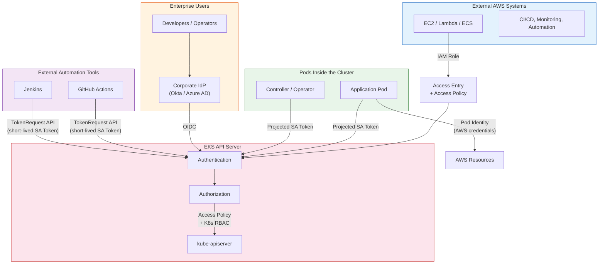

## Overview

The EKS cluster API server is accessed by kubectl users and a range of **Non-Standard Callers**:

- **CI/CD pipelines**: GitHub Actions, Jenkins, and ArgoCD deploy and manage resources.
- **Monitoring systems**: Prometheus, Datadog, and Grafana retrieve metadata.
- **Automation tools**: Terraform, Ansible, and custom controllers create and modify resources.
- **Enterprise users**: Developers and operators access clusters through kubectl.

This document provides best practices for selecting an **authentication (AuthN)** method and configuring **authorization (AuthZ)** for each scenario.

---

## 1. EKS API Server Authentication Methods

The table compares credentials presented to the Kubernetes API. **EKS Pod Identity and IRSA provide AWS credentials**, rather than a separate Kubernetes API authentication method. See [EKS access control](https://docs.aws.amazon.com/eks/latest/userguide/cluster-auth.html).

| # | Authentication Method | Suitable Use Cases | Recommendation |
|---|---------|---------------|-------|
| ① | **IAM** (aws-iam-authenticator) | Systems running on AWS infrastructure and kubectl users | ⭐⭐⭐ Preferred approach |
| ② | **Kubernetes Service Account Token** | In-cluster automation and CI/CD pipelines | ⭐⭐ Also usable by external systems |
| ③ | **External OIDC Identity Provider** | Enterprise IdP integration (Okta, Azure AD, Google, and others) | ⭐⭐⭐ Best suited to enterprise SSO integration |
| ④ | **x509 Client Certificate** | Legacy systems requiring certificate-based authentication | ⭐ Limited use (no CRL support) |

---

## 2. Recommended Approach by Caller Type

### CASE A: External Systems on AWS Infrastructure (EC2, Lambda, ECS)

**→ IAM Role + Access Entry (preferred approach)**

```bash
# 1. Set Authentication Mode to API_AND_CONFIG_MAP or API
aws eks update-cluster-config --name <your-cluster> \
    --access-config '{"authenticationMode": "API_AND_CONFIG_MAP"}'

# 2. Create an Access Entry for the external system's IAM role
aws eks create-access-entry \
    --cluster-name <your-cluster> \
    --principal-arn arn:aws:iam::<account-id>:role/<external-system-role> \
    --type STANDARD

# 3. Associate an Access Policy that grants only the required permissions
aws eks associate-access-policy \
    --cluster-name <your-cluster> \
    --principal-arn arn:aws:iam::<account-id>:role/<external-system-role> \
    --policy-arn arn:aws:eks::aws:cluster-access-policy/AmazonEKSViewPolicy \
    --access-scope '{"type": "namespace", "namespaces": ["monitoring", "app-system"]}'
```

**Benefits:**

- **IaC compatibility**: Manage access through CloudFormation or Terraform.
- **IAM condition keys** provide fine-grained control (`eks:authenticationMode`, `eks:namespaces`, and others).
- Permissions can be limited to a **namespace or cluster scope**.
- **CloudTrail** records EKS access-management API changes; use Kubernetes **audit** logs for Kubernetes API requests.
- Supports **AWS-managed EKS access policies** and custom Kubernetes RBAC. Section 5.1 shows representative policies, not the complete catalog.

**Generate a token from an external system:**

```bash
# Generate a Kubernetes token using IAM credentials
aws eks get-token --cluster-name <your-cluster> \
    --role-arn arn:aws:iam::<account-id>:role/<external-system-role>
```

This token contains a base64-encoded presigned STS `GetCallerIdentity` URL, which `aws-iam-authenticator` validates.

---

### CASE B: Pods Inside EKS Cluster

**→ Projected service account token + Kubernetes RBAC**

For Kubernetes API access, assign a ServiceAccount to the Pod and grant its `ServiceAccount` subject only the required verbs/resources through a RoleBinding or ClusterRoleBinding. A Pod Identity association is not required for this path.

Create `app-controller` in the existing `app-system` namespace and its RBAC bindings before using this Pod-spec fragment:

```yaml
spec:
  serviceAccountName: app-controller
  automountServiceAccountToken: true
```

Kubernetes mounts a short-lived projected token for that ServiceAccount and the kubelet rotates it. Use an in-cluster client that reloads rotated tokens. Leave the Kubernetes API audience at its default unless a different accepted audience is explicitly configured. See [Kubernetes Service Accounts](https://kubernetes.io/docs/concepts/security/service-accounts/).

**Optional: AWS service access from the same Pod**

If the workload also calls AWS APIs, configure a separate Pod Identity association with an IAM role granting those AWS actions:

```bash
aws eks create-pod-identity-association \
    --cluster-name <your-cluster> \
    --namespace app-system \
    --service-account app-controller \
    --role-arn arn:aws:iam::<account-id>:role/<controller-role>
```

This requires the Pod Identity Agent (built into Auto Mode), a supported AWS SDK credential chain, and the role’s Pod Identity trust/permissions configuration. Pod Identity does not require an IAM OIDC provider. The documented limit is 5,000 associations per cluster; this is not an increase to Kubernetes API permissions. See [EKS Pod Identity](https://docs.aws.amazon.com/eks/latest/userguide/pod-identities.html).

---

### CASE C: Enterprise IdP Integration

Integrate enterprise identity providers such as Okta, Azure AD, or Google through an **OIDC identity provider**.

```bash
# Associate an external OIDC identity provider
aws eks associate-identity-provider-config \
    --cluster-name <your-cluster> \
    --oidc '{
        "identityProviderConfigName": "corporate-idp",
        "issuerUrl": "https://your-idp.example.com/oauth2/default",
        "clientId": "<your-client-id>",
        "usernameClaim": "email",
        "groupsClaim": "groups",
        "groupsPrefix": "oidc:"
    }'
```

:::warning Considerations
- Only **one OIDC identity provider** can be associated with a cluster.
- The issuer URL must be **publicly accessible**.
- Manage authorization through Kubernetes RBAC (Role/ClusterRole + RoleBinding/ClusterRoleBinding).
- **Kubernetes 1.30 and later**: The OIDC provider URL must differ from the service account issuer URL.
:::

---

### CASE D: External Automation Tools (CI/CD)

For external CI/CD and monitoring tools, use **projected service account tokens through the TokenRequest API**.

The requester must already authenticate to the cluster and have `create` permission on the target `serviceaccounts/token` subresource. TokenRequest does not bootstrap an unauthenticated external client. The ServiceAccount and its RBAC permissions must already exist; the external client must securely renew tokens before expiry.

```bash
# Generate a short-lived token through the TokenRequest API
# Use a dedicated ServiceAccount for the external system
kubectl create token ci-pipeline-sa \
    --namespace ci-system \
    --duration 1h
```

**Benefits:**

- Tokens are **not stored in etcd**, improving security.
- **Expiration** is requested with `--duration`; the API server may return a different lifetime. Check the returned expiry rather than assuming a universal 24-hour maximum.
- An **audience** can be specified to separate tokens by purpose.
- Substantially safer than legacy service account tokens.

---

## 3. Authentication Mode Migration

To use access entries, Authentication Mode must be set to `API_AND_CONFIG_MAP` or `API`.

### Migration Path

```text
CONFIG_MAP → API_AND_CONFIG_MAP → API
    (one-way; rollback is not supported)
```

| Mode | Access Entry API | aws-auth ConfigMap | Recommendation |
|-----|:---:|:---:|------|
| `CONFIG_MAP` | ❌ Unavailable | ✅ Used | Legacy |
| `API_AND_CONFIG_MAP` | ✅ Available | ✅ Used | ⭐ During migration |
| `API` | ✅ Available | ❌ Ignored | ⭐⭐ Target state |

### Migration Steps

```bash
# Step 1: Check the current Authentication Mode
aws eks describe-cluster --name <your-cluster> \
    --query 'cluster.accessConfig.authenticationMode'

# Step 2: Switch to API_AND_CONFIG_MAP (retaining the existing aws-auth configuration)
aws eks update-cluster-config --name <your-cluster> \
    --access-config '{"authenticationMode": "API_AND_CONFIG_MAP"}'

# Step 3: Migrate existing aws-auth ConfigMap entries to Access Entries
# (Create an Access Entry for each mapRoles/mapUsers entry in aws-auth)

# Step 4: Switch to API mode after all entries have been migrated
aws eks update-cluster-config --name <your-cluster> \
    --access-config '{"authenticationMode": "API"}'
```

:::danger One-Way Transition
Authentication Mode changes are **one-way**. After switching to `API`, rollback to `API_AND_CONFIG_MAP` is not supported. Verify that every aws-auth entry has been migrated to an access entry before making the switch.
:::

---

## 4. EKS Auto Mode Authentication

EKS Auto Mode delegates cluster infrastructure management to AWS and introduces important differences in authentication and authorization.

### Auto Mode Authentication Characteristics

| Item | EKS Without Auto Mode | Auto Mode |
|-----|:---:|:---:|
| Authentication Mode | `CONFIG_MAP`, `API_AND_CONFIG_MAP`, or `API`; creation defaults vary by tool | `API_AND_CONFIG_MAP` or `API` |
| aws-auth ConfigMap | Used in `CONFIG_MAP` / `API_AND_CONFIG_MAP` | Optional in `API_AND_CONFIG_MAP`; not used in `API` |
| Access Entry | Available when API access mode is enabled | Required; cannot be disabled |
| Pod Identity | AWS credentials with the agent installed | AWS credentials; agent built in |
| OIDC Identity Provider | Supported | Supported |

### Key Auto Mode Considerations

- **Access entries are required**, but the `aws-auth` ConfigMap can optionally coexist. The configured authentication mode determines its use; Auto Mode does not require `API`-only mode.
- **Cluster creator access is configurable** through `bootstrapClusterCreatorAdminPermissions` at creation time (default `true`). Do not assume every cluster retains a creator admin entry.
- **Pod Identity grants AWS permissions**. Kubernetes API access for workload Pods still uses service account tokens and RBAC.
- **Node-role access depends on the NodeClass**: EKS creates entries for built-in node classes/pools. For a custom NodeClass role, create an `EC2` access entry and associate `AmazonEKSAutoNodePolicy` with cluster scope. `EC2_LINUX` is not the Auto Mode entry type. This EKS access policy grants Kubernetes node permissions, not IAM permissions for AWS APIs.

Sources: [Auto Mode access control](https://docs.aws.amazon.com/eks/latest/userguide/cluster-auth.html), [custom NodeClass access entry](https://docs.aws.amazon.com/eks/latest/userguide/create-node-class.html), and [cluster creator access configuration](https://docs.aws.amazon.com/eks/latest/APIReference/API_CreateAccessConfigRequest.html).

### Auto Mode with Pod Identity

```bash
# Configure Pod Identity in an Auto Mode cluster (same as Standard Mode)
aws eks create-pod-identity-association \
    --cluster-name <your-auto-mode-cluster> \
    --namespace app-system \
    --service-account app-controller \
    --role-arn arn:aws:iam::<account-id>:role/<controller-role>
```

### Authentication Considerations for Hybrid Nodes

When using Auto Mode with Hybrid Nodes, use `API` or `API_AND_CONFIG_MAP` authentication mode. `CONFIG_MAP` alone is unsupported for Hybrid Nodes-enabled clusters. See [Prepare cluster access for hybrid nodes](https://docs.aws.amazon.com/eks/latest/userguide/hybrid-nodes-cluster-prep.html).

- Hybrid Nodes obtain IAM credentials through **IAM Roles Anywhere** or **SSM**.
- Use an IAM **role** principal and `--type HYBRID_LINUX` for a Hybrid Nodes access entry; do not substitute `EC2_LINUX` or an STS session ARN. This node entry has EKS-defined permissions and cannot have a user access policy attached.
- The kubelet on Hybrid Nodes automatically uses IAM-based tokens when authenticating to the API server.

```bash
# Create an Access Entry for Hybrid Nodes
aws eks create-access-entry \
    --cluster-name <your-cluster> \
    --principal-arn arn:aws:iam::<account-id>:role/<hybrid-node-role> \
    --type HYBRID_LINUX
```

---

## 5. Authorization Best Practices

### 5.1 EKS Access Policies (Managed)

The table is a **representative subset**, not the full catalog. AWS also provides policies such as `AmazonEKSAdminViewPolicy` (which includes Secrets) and service-specific policies such as `AmazonEKSAutoNodePolicy`. These EKS access policies grant Kubernetes permissions, not AWS IAM permissions. Review the [current policy permissions](https://docs.aws.amazon.com/eks/latest/userguide/access-policy-permissions.html) before choosing a policy.

```bash
aws eks list-access-policies
```

| Policy Name | Description | Use Case |
|-----------|------|------------|
| `AmazonEKSClusterAdminPolicy` | Cluster-wide administrator | Platform administrators |
| `AmazonEKSAdminPolicy` | Namespace administrator | Team administrators |
| `AmazonEKSEditPolicy` | Create and modify resources | Developers |
| `AmazonEKSViewPolicy` | Read-only access | Monitoring systems and external queries |

### 5.2 Custom Kubernetes RBAC (Fine-Grained Control)

The example grants read access to the **namespaced `widgets` custom resources** in `your-app.io`, within `app-system`. RBAC grants access to the resource, not just its metadata fields. Replace the API group/resource with the actual CRD and create the namespace first.

Use a dedicated, existing IAM role and create a `STANDARD` access entry with an explicit Kubernetes group. This is a separate RBAC-only example from CASE A; do not attach a broader access policy if only these permissions are intended.

```bash
aws eks create-access-entry \
    --cluster-name <your-cluster> \
    --principal-arn arn:aws:iam::<account-id>:role/<rbac-reader-role> \
    --type STANDARD \
    --kubernetes-groups external-system-readers
```

Bind the **same group name** to the namespace-scoped Role:

```yaml
apiVersion: rbac.authorization.k8s.io/v1
kind: Role
metadata:
  name: custom-resource-reader
  namespace: app-system
rules:
- apiGroups: ["your-app.io"]
  resources: ["widgets"]
  verbs: ["get", "list", "watch"]
---
apiVersion: rbac.authorization.k8s.io/v1
kind: RoleBinding
metadata:
  name: external-system-reader
  namespace: app-system
subjects:
- kind: Group
  name: external-system-readers
  apiGroup: rbac.authorization.k8s.io
roleRef:
  kind: Role
  name: custom-resource-reader
  apiGroup: rbac.authorization.k8s.io
```

For a role, EKS normally generates a Kubernetes username from its **STS assumed-role session**, not the literal IAM role ARN. The group mapping above avoids relying on a session-specific username. If the role already has an access entry, update its `kubernetesGroups` rather than creating a duplicate. See [Kubernetes group access entries](https://docs.aws.amazon.com/eks/latest/userguide/create-k8s-group-access-entry.html) and [generated usernames](https://docs.aws.amazon.com/eks/latest/userguide/set-custom-username.html).

:::tip Combining Access Policies and Custom RBAC
Permissions from access policies and Kubernetes RBAC form a **union**. Adding a narrower RoleBinding does not restrict an existing broader access policy or ClusterRoleBinding. Remove unnecessary grants if narrower access is intended.
:::

---

## 6. Comprehensive Architecture


```mermaid
flowchart TB
    subgraph External["External AWS Systems"]
        EC2["EC2 / Lambda / ECS"]
        CICD_EXT["CI/CD, Monitoring, Automation"]
    end

    subgraph Internal["Pods Inside the Cluster"]
        Pod["Application Pod"]
        Controller["Controller / Operator"]
    end

    subgraph Enterprise["Enterprise Users"]
        Dev["Developers / Operators"]
        IdP["Corporate IdP<br/>(Okta / Azure AD)"]
    end

    subgraph ExtAuto["External Automation Tools"]
        GHA["GitHub Actions"]
        Jenkins["Jenkins"]
    end

    subgraph EKS["EKS API Server"]
        AuthN["Authentication"]
        AuthZ["Authorization"]
        APIServer["kube-apiserver"]
    end

    EC2 -->|"IAM Role"| AccessEntry["Access Entry<br/>+ Access Policy"]
    AccessEntry --> AuthN

    Pod -->|"Pod Identity<br/>(AWS credentials)"| AWSResources["AWS Resources"]
    Pod -->|"Projected SA Token"| AuthN
    Controller -->|"Projected SA Token"| AuthN

    Dev --> IdP
    IdP -->|"OIDC"| AuthN

    GHA -->|"TokenRequest API<br/>(short-lived SA Token)"| AuthN
    Jenkins -->|"TokenRequest API<br/>(short-lived SA Token)"| AuthN

    AuthN --> AuthZ
    AuthZ -->|"Access Policy<br/>+ K8s RBAC"| APIServer

    style External fill:#e3f2fd,stroke:#1565c0
    style Internal fill:#e8f5e9,stroke:#2e7d32
    style Enterprise fill:#fff3e0,stroke:#e65100
    style ExtAuto fill:#f3e5f5,stroke:#6a1b9a
    style EKS fill:#fce4ec,stroke:#c62828
```

### Access Path Summary

| Caller Type | Authentication | Authorization | Examples |
|-----------|---------|---------|-----|
| External systems on AWS infrastructure | IAM Role → Access Entry | Access Policy (namespace scope) | CI/CD, monitoring, automation |
| Pods inside the cluster | Projected SA Token | Kubernetes RBAC | Controllers, operators |
| Enterprise users | Corporate IdP → OIDC | Kubernetes RBAC (group-based) | Developer access through kubectl |
| External automation tools | TokenRequest API → short-lived SA Token | Kubernetes RBAC | GitHub Actions, Jenkins |

---

## 7. Security Best Practices Checklist

| Principle | Specific Action |
|-----|----------|
| **Least Privilege** | Limit access policy scope to namespaces; use custom RBAC for fine-grained verb/resource control |
| **Short-Lived Credentials** | Use projected SA tokens with the returned expiry and IAM tokens (automatic renewal); **do not use legacy SA tokens** |
| **Audit Trail** | Enable `audit` logs in control plane logging and track access entry changes through CloudTrail |
| **IaC Automation** | Manage access entries through CloudFormation/Terraform; avoid manually editing ConfigMaps |
| **Regional STS** | Set `AWS_STS_REGIONAL_ENDPOINTS=regional` on external systems |
| **Authentication Mode** | Move to `API_AND_CONFIG_MAP`, then complete migration to `API` |

:::info Key Message
For external systems that need API server access, **IAM Role + Access Entry** is the most secure and manageable approach. Set Authentication Mode to `API_AND_CONFIG_MAP`, assign a dedicated IAM role to each external system, and use access entries and access policies to grant least-privilege access within the required namespaces. Use an **OIDC identity provider** for enterprise users and **service account tokens with Kubernetes RBAC** for Pods accessing the Kubernetes API. Add **Pod Identity** when Pods also call AWS APIs. If external CI/CD uses the **TokenRequest API**, prepare its initial authentication and token renewal paths.
:::

---

## References

- [EKS Access Management - AWS Official Documentation](https://docs.aws.amazon.com/eks/latest/userguide/access-entries.html)
- [EKS Pod Identity - AWS Official Documentation](https://docs.aws.amazon.com/eks/latest/userguide/pod-identities.html)
- [EKS Auto Mode - AWS Official Documentation](https://docs.aws.amazon.com/eks/latest/userguide/automode.html)
- [Authenticating Users from an OIDC Identity Provider](https://docs.aws.amazon.com/eks/latest/userguide/authenticate-oidc-identity-provider.html)
- [Kubernetes Service Accounts and TokenRequest](https://kubernetes.io/docs/reference/access-authn-authz/service-accounts-admin/)
