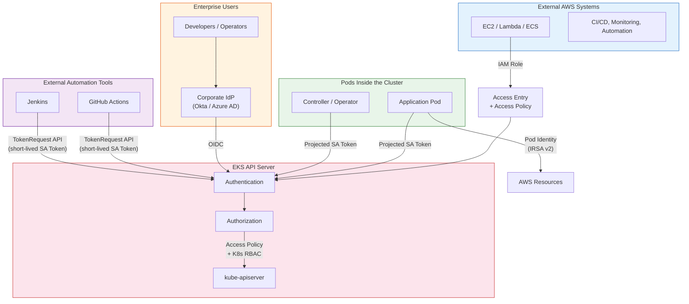

## Overview

The EKS cluster API server is accessed by kubectl users and a range of **Non-Standard Callers**:

- **CI/CD pipelines**: GitHub Actions, Jenkins, and ArgoCD deploy and manage resources.
- **Monitoring systems**: Prometheus, Datadog, and Grafana retrieve metadata.
- **Automation tools**: Terraform, Ansible, and custom controllers create and modify resources.
- **Enterprise users**: Developers and operators access clusters through kubectl.

This document provides best practices for selecting an **authentication (AuthN)** method and configuring **authorization (AuthZ)** for each scenario.

---

## 1. EKS API Server Authentication Methods

EKS supports the following five authentication methods:

| # | Authentication Method | Suitable Use Cases | Recommendation |
|---|---------|---------------|-------|
| ① | **IAM** (aws-iam-authenticator) | Systems running on AWS infrastructure and kubectl users | ⭐⭐⭐ Preferred approach |
| ② | **EKS Pod Identity** (IRSA v2) | Pods running inside an EKS cluster | ⭐⭐⭐ Best suited to Pod-based workloads |
| ③ | **Kubernetes Service Account Token** | In-cluster automation and CI/CD pipelines | ⭐⭐ Also usable by external systems |
| ④ | **External OIDC Identity Provider** | Enterprise IdP integration (Okta, Azure AD, Google, and others) | ⭐⭐⭐ Best suited to enterprise SSO integration |
| ⑤ | **x509 Client Certificate** | Legacy systems requiring certificate-based authentication | ⭐ Limited use (no CRL support) |

---

## 2. Recommended Approach by Caller Type

### CASE A: External Systems on AWS Infrastructure (EC2, Lambda, ECS)

**→ IAM Role + Access Entry (preferred approach)**

```bash
# 1. Set Authentication Mode to API_AND_CONFIG_MAP or API
aws eks update-cluster-config --name <your-cluster> \
    --access-config '{"authenticationMode": "API_AND_CONFIG_MAP"}'

# 2. Create an Access Entry for the external system's IAM role
aws eks create-access-entry \
    --cluster-name <your-cluster> \
    --principal-arn arn:aws:iam::<account-id>:role/<external-system-role> \
    --type STANDARD

# 3. Associate an Access Policy that grants only the required permissions
aws eks associate-access-policy \
    --cluster-name <your-cluster> \
    --principal-arn arn:aws:iam::<account-id>:role/<external-system-role> \
    --policy-arn arn:aws:eks::aws:cluster-access-policy/AmazonEKSViewPolicy \
    --access-scope '{"type": "namespace", "namespaces": ["monitoring", "app-system"]}'
```

**Benefits:**

- **IaC compatibility**: Manage access through CloudFormation or Terraform.
- **IAM condition keys** provide fine-grained control (`eks:authenticationMode`, `eks:namespaces`, and others).
- Permissions can be limited to a **namespace or cluster scope**.
- **CloudTrail** provides an audit trail for all API access.
- Supports **five predefined EKS access policies** and custom Kubernetes RBAC.

**Generate a token from an external system:**

```bash
# Generate a Kubernetes token using IAM credentials
aws eks get-token --cluster-name <your-cluster> \
    --role-arn arn:aws:iam::<account-id>:role/<external-system-role>
```

This token contains a base64-encoded presigned STS `GetCallerIdentity` URL, which `aws-iam-authenticator` validates.

---

### CASE B: Pods Inside EKS Cluster

**→ EKS Pod Identity (IRSA v2) (preferred approach)**

```bash
# Create a Pod Identity Association
aws eks create-pod-identity-association \
    --cluster-name <your-cluster> \
    --namespace app-system \
    --service-account app-controller \
    --role-arn arn:aws:iam::<account-id>:role/<controller-role>
```

**Benefits:**

- **No IAM OIDC provider is required**, addressing the global limit of 100 providers in IRSA v1.
- The **trust policy** needs only the `pods.eks.amazonaws.com` service principal.
- **Session tags are added automatically** (`eks-cluster-name`, `kubernetes-namespace`, `kubernetes-pod-name`, and others), supporting ABAC.
- Supports **cross-account role chaining** (`targetRoleArn` + `externalId`).
- Supports up to **5,000 associations per cluster** by default, with an increase available to 20K.

**Combining Pod Identity with Kubernetes API server access:**

After Pod Identity grants access to AWS resources, the Pod authenticates to the Kubernetes API server with a **projected service account token**. This token is automatically mounted into the Pod:

```yaml
# Projected service account token automatically mounted into a Pod
volumes:
- name: kube-api-access
  projected:
    sources:
    - serviceAccountToken:
        audience: "https://kubernetes.default.svc"
        expirationSeconds: 3600
        path: token
```

---

### CASE C: Enterprise IdP Integration

Integrate enterprise identity providers such as Okta, Azure AD, or Google through an **OIDC identity provider**.

```bash
# Associate an external OIDC identity provider
aws eks associate-identity-provider-config \
    --cluster-name <your-cluster> \
    --oidc '{
        "identityProviderConfigName": "corporate-idp",
        "issuerUrl": "https://your-idp.example.com/oauth2/default",
        "clientId": "<your-client-id>",
        "usernameClaim": "email",
        "groupsClaim": "groups",
        "groupsPrefix": "oidc:"
    }'
```

:::warning Considerations
- Only **one OIDC identity provider** can be associated with a cluster.
- The issuer URL must be **publicly accessible**.
- Manage authorization through Kubernetes RBAC (Role/ClusterRole + RoleBinding/ClusterRoleBinding).
- **Kubernetes 1.30 and later**: The OIDC provider URL must differ from the service account issuer URL.
:::

---

### CASE D: External Automation Tools (CI/CD)

For external CI/CD and monitoring tools, use **projected service account tokens through the TokenRequest API**.

Systems outside the cluster can request short-lived tokens through the Kubernetes TokenRequest API:

```bash
# Generate a short-lived token through the TokenRequest API
# Use a dedicated ServiceAccount for the external system
kubectl create token ci-pipeline-sa \
    --namespace ci-system \
    --audience "https://kubernetes.default.svc" \
    --duration 1h
```

**Benefits:**

- Tokens are **not stored in etcd**, improving security.
- **Expiration** is configurable, up to 24 hours.
- An **audience** can be specified to separate tokens by purpose.
- Substantially safer than legacy service account tokens.

---

## 3. Authentication Mode Migration

To use access entries, Authentication Mode must be set to `API_AND_CONFIG_MAP` or `API`.

### Migration Path

```text
CONFIG_MAP → API_AND_CONFIG_MAP → API
    (one-way; rollback is not supported)
```

| Mode | Access Entry API | aws-auth ConfigMap | Recommendation |
|-----|:---:|:---:|------|
| `CONFIG_MAP` | ❌ Unavailable | ✅ Used | Legacy |
| `API_AND_CONFIG_MAP` | ✅ Available | ✅ Used | ⭐ During migration |
| `API` | ✅ Available | ❌ Ignored | ⭐⭐ Target state |

### Migration Steps

```bash
# Step 1: Check the current Authentication Mode
aws eks describe-cluster --name <your-cluster> \
    --query 'cluster.accessConfig.authenticationMode'

# Step 2: Switch to API_AND_CONFIG_MAP (retaining the existing aws-auth configuration)
aws eks update-cluster-config --name <your-cluster> \
    --access-config '{"authenticationMode": "API_AND_CONFIG_MAP"}'

# Step 3: Migrate existing aws-auth ConfigMap entries to Access Entries
# (Create an Access Entry for each mapRoles/mapUsers entry in aws-auth)

# Step 4: Switch to API mode after all entries have been migrated
aws eks update-cluster-config --name <your-cluster> \
    --access-config '{"authenticationMode": "API"}'
```

:::danger One-Way Transition
Authentication Mode changes are **one-way**. After switching to `API`, rollback to `API_AND_CONFIG_MAP` is not supported. Verify that every aws-auth entry has been migrated to an access entry before making the switch.
:::

---

## 4. EKS Auto Mode Authentication

EKS Auto Mode delegates cluster infrastructure management to AWS and introduces important differences in authentication and authorization.

### Auto Mode Authentication Characteristics

| Item | Standard Mode | Auto Mode |
|-----|:---:|:---:|
| Default Authentication Mode | `CONFIG_MAP` | `API` |
| aws-auth ConfigMap | Supported | **Unsupported** |
| Access Entry | Optional | **Only supported method** |
| Pod Identity | Supported | Supported |
| OIDC Identity Provider | Supported | Supported |

### Key Auto Mode Considerations

- **Access entries are the only authentication management method**: Because the aws-auth ConfigMap is unavailable, access entries must manage cluster access for all IAM principals.
- **Automatic cluster creator registration**: The IAM principal that creates the cluster automatically receives `AmazonEKSClusterAdminPolicy`.
- **Full Pod Identity support**: Assigning IAM roles to Pods through Pod Identity associations works the same way in Auto Mode.
- **Automatic node IAM role management**: AWS automatically manages node IAM roles in Auto Mode, so separate access entry configuration for node roles is unnecessary.

### Auto Mode with Pod Identity

```bash
# Configure Pod Identity in an Auto Mode cluster (same as Standard Mode)
aws eks create-pod-identity-association \
    --cluster-name <your-auto-mode-cluster> \
    --namespace app-system \
    --service-account app-controller \
    --role-arn arn:aws:iam::<account-id>:role/<controller-role>
```

### Authentication Considerations for Hybrid Nodes

When using Auto Mode with Hybrid Nodes:

- Hybrid Nodes obtain IAM credentials through **IAM Roles Anywhere** or **SSM**.
- Create an access entry for the IAM role with `--type EC2_LINUX` or `--type HYBRID_LINUX`.
- The kubelet on Hybrid Nodes automatically uses IAM-based tokens when authenticating to the API server.

```bash
# Create an Access Entry for Hybrid Nodes
aws eks create-access-entry \
    --cluster-name <your-cluster> \
    --principal-arn arn:aws:iam::<account-id>:role/<hybrid-node-role> \
    --type HYBRID_LINUX
```

---

## 5. Authorization Best Practices

### 5.1 EKS Access Policies (Managed)

| Policy Name | Description | Use Case |
|-----------|------|------------|
| `AmazonEKSClusterAdminPolicy` | Cluster-wide administrator | Platform administrators |
| `AmazonEKSAdminPolicy` | Namespace administrator | Team administrators |
| `AmazonEKSEditPolicy` | Create and modify resources | Developers |
| `AmazonEKSViewPolicy` | Read-only access | Monitoring systems and external queries |

### 5.2 Custom Kubernetes RBAC (Fine-Grained Control)

The following example covers an external system that only retrieves CRD metadata:

```yaml
apiVersion: rbac.authorization.k8s.io/v1
kind: ClusterRole
metadata:
  name: metadata-reader
rules:
- apiGroups: ["your-app.io"]  # CRD API group
  resources: ["*"]
  verbs: ["get", "list", "watch"]
- apiGroups: [""]
  resources: ["namespaces", "pods", "services"]
  verbs: ["get", "list"]
---
apiVersion: rbac.authorization.k8s.io/v1
kind: ClusterRoleBinding
metadata:
  name: external-system-reader
subjects:
- kind: User
  name: arn:aws:iam::<account-id>:role/<external-system-role>  # IAM Role ARN
  apiGroup: rbac.authorization.k8s.io
roleRef:
  kind: ClusterRole
  name: metadata-reader
  apiGroup: rbac.authorization.k8s.io
```

:::tip Combining Access Policies and Custom RBAC
Grant baseline permissions through an access policy and add custom RBAC when finer control is required. Permissions from the two mechanisms form a **union**.
:::

---

## 6. Comprehensive Architecture


```mermaid
flowchart TB
    subgraph External["External AWS Systems"]
        EC2["EC2 / Lambda / ECS"]
        CICD_EXT["CI/CD, Monitoring, Automation"]
    end

    subgraph Internal["Pods Inside the Cluster"]
        Pod["Application Pod"]
        Controller["Controller / Operator"]
    end

    subgraph Enterprise["Enterprise Users"]
        Dev["Developers / Operators"]
        IdP["Corporate IdP<br/>(Okta / Azure AD)"]
    end

    subgraph ExtAuto["External Automation Tools"]
        GHA["GitHub Actions"]
        Jenkins["Jenkins"]
    end

    subgraph EKS["EKS API Server"]
        AuthN["Authentication"]
        AuthZ["Authorization"]
        APIServer["kube-apiserver"]
    end

    EC2 -->|"IAM Role"| AccessEntry["Access Entry<br/>+ Access Policy"]
    AccessEntry --> AuthN

    Pod -->|"Pod Identity<br/>(IRSA v2)"| AWSResources["AWS Resources"]
    Pod -->|"Projected SA Token"| AuthN
    Controller -->|"Projected SA Token"| AuthN

    Dev --> IdP
    IdP -->|"OIDC"| AuthN

    GHA -->|"TokenRequest API<br/>(short-lived SA Token)"| AuthN
    Jenkins -->|"TokenRequest API<br/>(short-lived SA Token)"| AuthN

    AuthN --> AuthZ
    AuthZ -->|"Access Policy<br/>+ K8s RBAC"| APIServer

    style External fill:#e3f2fd,stroke:#1565c0
    style Internal fill:#e8f5e9,stroke:#2e7d32
    style Enterprise fill:#fff3e0,stroke:#e65100
    style ExtAuto fill:#f3e5f5,stroke:#6a1b9a
    style EKS fill:#fce4ec,stroke:#c62828
```

### Access Path Summary

| Caller Type | Authentication | Authorization | Examples |
|-----------|---------|---------|-----|
| External systems on AWS infrastructure | IAM Role → Access Entry | Access Policy (namespace scope) | CI/CD, monitoring, automation |
| Pods inside the cluster | Projected SA Token | Kubernetes RBAC | Controllers, operators |
| Enterprise users | Corporate IdP → OIDC | Kubernetes RBAC (group-based) | Developer access through kubectl |
| External automation tools | TokenRequest API → short-lived SA Token | Kubernetes RBAC | GitHub Actions, Jenkins |

---

## 7. Security Best Practices Checklist

| Principle | Specific Action |
|-----|----------|
| **Least Privilege** | Limit access policy scope to namespaces; use custom RBAC for fine-grained verb/resource control |
| **Short-Lived Credentials** | Use projected SA tokens (up to 24h) and IAM tokens (automatic renewal); **do not use legacy SA tokens** |
| **Audit Trail** | Enable `audit` logs in control plane logging and track access entry changes through CloudTrail |
| **IaC Automation** | Manage access entries through CloudFormation/Terraform; avoid manually editing ConfigMaps |
| **Regional STS** | Set `AWS_STS_REGIONAL_ENDPOINTS=regional` on external systems |
| **Authentication Mode** | Move to `API_AND_CONFIG_MAP`, then complete migration to `API` |

:::info Key Message
For external systems that need API server access, **IAM Role + Access Entry** is the most secure and manageable approach. Set Authentication Mode to `API_AND_CONFIG_MAP`, assign a dedicated IAM role to each external system, and use access entries and access policies to grant least-privilege access within the required namespaces. Use an **OIDC identity provider** for enterprise users, **Pod Identity** for Pods inside the cluster, and the **TokenRequest API** for external CI/CD to cover the respective scenarios securely.
:::

---

## References

- [EKS Access Management - AWS Official Documentation](https://docs.aws.amazon.com/eks/latest/userguide/access-entries.html)
- [EKS Pod Identity - AWS Official Documentation](https://docs.aws.amazon.com/eks/latest/userguide/pod-identities.html)
- [EKS Auto Mode - AWS Official Documentation](https://docs.aws.amazon.com/eks/latest/userguide/automode.html)
- [Authenticating Users from an OIDC Identity Provider](https://docs.aws.amazon.com/eks/latest/userguide/authenticate-oidc-identity-provider.html)
- [Kubernetes TokenRequest API](https://kubernetes.io/docs/reference/kubernetes-api/authentication-resources/token-request-v1/)
