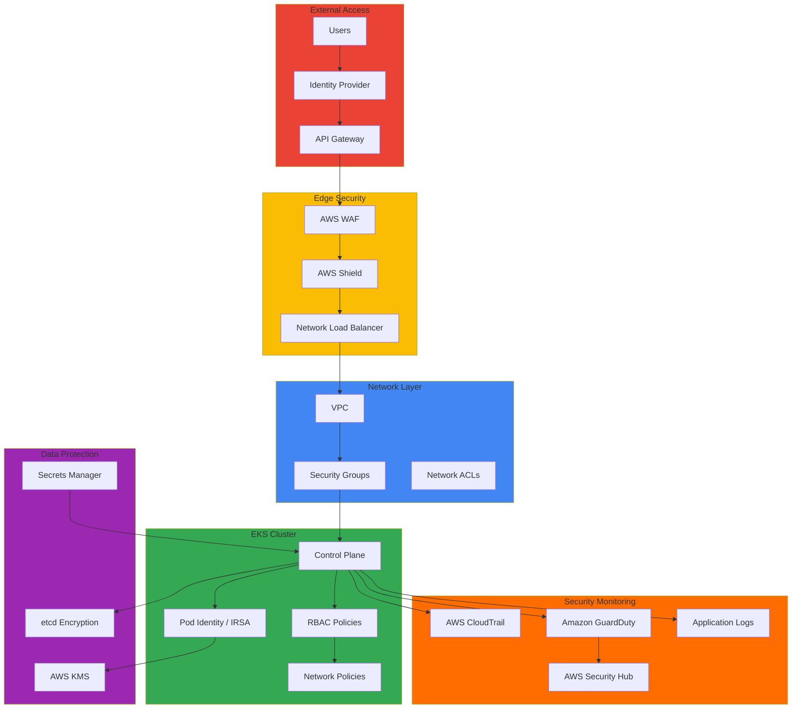

import { DocCard, DocCardGrid } from '@site/src/components/DocCards';

Security in Amazon EKS environments requires a Defense in Depth strategy and continuous security posture assessment rather than a single perimeter. This chapter covers the full security lifecycle: cluster access control (authentication/authorization), policy-based governance, supply chain security, runtime threat detection, and incident response.

Security governance goes beyond technical controls — it embeds organizational policies, processes, and compliance requirements into code and infrastructure. Regulated industries such as financial services must comply with frameworks like PCI-DSS, SOC 2, and ISO 27001, which requires automated policy enforcement, continuous audit logging, and real-time threat detection. Integrating Kubernetes-native security capabilities (RBAC, Network Policy, Pod Security Standards) with AWS cloud-native services (IAM, KMS, GuardDuty) builds a strong security posture grounded in Zero Trust principles.

## Key Documents

<DocCardGrid columns={2}>
  <DocCard
    to="/docs/eks-best-practices/security-authn/eks-api-server-authn-authz"
    icon="🔐"
    title="EKS API Server AuthN/AuthZ"
    description="Authentication/authorization guide for Non-Standard Callers (CI/CD, monitoring, automation) accessing the EKS API Server. Access Entry, Pod Identity, OIDC, and TokenRequest API."
    color="#e63946"
  />
  <DocCard
    to="/docs/eks-best-practices/security-authn/identity-first-security"
    icon="🪪"
    title="Identity-First Security Architecture"
    description="Zero-trust access control based on EKS Pod Identity, migration from IRSA to Pod Identity, and least-privilege automation."
    color="#f4a261"
  />
  <DocCard
    to="/docs/eks-best-practices/security-authn/kyverno-policy-management"
    icon="📜"
    title="Policy Management with Kyverno"
    description="Kyverno v1.17+ CEL v1 GA policies, namespace-level policies, policy exception management, and OPA Gatekeeper comparison."
    color="#2a9d8f"
  />
  <DocCard
    to="/docs/eks-best-practices/security-authn/guardduty-extended-threat-detection"
    icon="🛡️"
    title="GuardDuty Extended Threat Detection"
    description="EC2/ECS host and container signal correlation, MITRE ATT&CK mapping, and automated threat response."
    color="#e76f51"
  />
  <DocCard
    to="/docs/eks-best-practices/security-authn/supply-chain-security"
    icon="📦"
    title="Container Supply Chain Security"
    description="ECR image scanning and signing, Sigstore/Cosign integration, SBOM generation and management, CI/CD security gates."
    color="#457b9d"
  />
  <DocCard
    to="/docs/eks-best-practices/security-authn/default-namespace-incident"
    icon="🚨"
    title="Default Namespace Incident Response"
    description="Root-cause analysis and recovery procedures for Control Plane access loss caused by default namespace deletion, with prevention via Kyverno, GitOps, and Access Entry."
    color="#6d597a"
  />
</DocCardGrid>

## Architecture Patterns

## Security Domains

The security architecture consists of five layers: cluster, network, workload, secrets, and data.

**Cluster security (authentication/authorization)** is implemented through the integration of AWS IAM and Kubernetes RBAC. Access Entry-based authentication modes, selection criteria between EKS Pod Identity and IRSA, enterprise IdP (OIDC) integration, and access patterns for Non-Standard Callers such as CI/CD and monitoring tools are covered in detail in the [EKS API Server AuthN/AuthZ guide](./eks-api-server-authn-authz.md). New projects should evaluate EKS Pod Identity first, which binds IAM roles directly to Pods without OIDC provider setup.

**Network security** controls Pod-to-Pod communication with Kubernetes Network Policy and implements namespace isolation. See [VPC CNI Deep Dive](/docs/eks-best-practices/networking-performance/vpc-cni-deep-dive) for how VPC CNI implements NetworkPolicy, and the [Service Mesh Comparison Guide](../networking-performance/service-mesh/index.md) for automated mTLS with a service mesh.

**Workload security** enforces the Restricted level of Pod Security Standards to block root execution, restrict host network access, and drop dangerous capabilities. Container images are scanned in the CI/CD pipeline to block vulnerabilities upfront, and policies enforce the use of signed images from approved registries only. Policy enforcement automation is covered in [Policy Management with Kyverno](./kyverno-policy-management.md), and image signing/SBOM in [Container Supply Chain Security](./supply-chain-security.md).

**Secrets management** integrates AWS Secrets Manager with External Secrets Operator for centralized management. Secrets are kept in an external secret store instead of being stored directly as Kubernetes Secrets, with automatic rotation and periodic synchronization minimizing exposure risk. See [GitOps-based EKS Cluster Operations](../operations-reliability/gitops-cluster-operation.md) for the secrets management architecture in GitOps environments.

**Data security** includes encryption for both data at rest and in transit. EBS volumes are protected at the block level with KMS-based encryption, and etcd transparently encrypts Kubernetes configuration data through AWS KMS integration. Data in transit is encrypted with TLS/mTLS; HTTPS is enforced at the ingress level with certificates automatically renewed by Cert Manager.

## Compliance Frameworks

Compliance requires integrating technical implementation with organizational processes. SOC 2 covers data security, availability, and processing integrity — implemented through highly available architecture, data encryption, and access control. PCI-DSS, essential for payment card data processing, requires network isolation, data encryption, and periodic security assessments. HIPAA requires data encryption and audit logging for healthcare data, GDPR requires data minimization and processing transparency, and ISO 27001 provides the overall framework for information security management systems.

In EKS environments, compliance requirements map to technical controls.

| Requirement | Implementation |
|-------------|----------------|
| Access control | AWS IAM + Kubernetes RBAC (Access Entry, Pod Identity) |
| Encryption | TLS/mTLS, AWS KMS envelope encryption |
| Audit trail | CloudTrail API logging, Control Plane audit logs |
| Threat detection | GuardDuty, Security Hub unified dashboard |
| Policy enforcement | Kyverno / OPA Gatekeeper admission control |
| Configuration compliance | Continuous monitoring with AWS Config rules |

## Security Tools & Technologies

Open source tools include Falco for detecting runtime anomalies at the system call level, Kyverno and OPA Gatekeeper for validating policies at deployment time via admission webhooks, Trivy for scanning container images and filesystems for vulnerabilities, kube-bench for CIS Kubernetes Benchmark-based configuration assessment, and kube-hunter for cluster penetration testing.

AWS native services include AWS WAF for blocking web attacks such as SQL injection and XSS, AWS Shield for DDoS protection, Amazon Inspector for continuous vulnerability assessment of EC2 instances and container images, and AWS Systems Manager for patch automation.

## Security Monitoring & Response

Security events are collected from multiple sources — CloudTrail, VPC Flow Logs, application and container logs — and aggregated into a centralized log store. GuardDuty uses machine learning to automatically detect abnormal API call patterns, suspicious network activity, and compromised instance behavior; integrating EventBridge and Lambda automates isolation, alerting, and recovery. For hands-on configuration of GuardDuty Extended Threat Detection and automated Pod isolation, see the GuardDuty integration section in [EKS Pod Health Check & Lifecycle Management](../operations-reliability/eks-pod-health-lifecycle.md).

Incident response follows a repeatable procedure: detection → analysis → containment → recovery → post-mortem. See the [EKS Debugging Guide](../operations-reliability/eks-debugging/index.md) for diagnosis and recovery procedures by failure type, and [Default Namespace Incident Response](./default-namespace-incident.md) for a representative security governance failure that causes Control Plane access loss.

## Security Roadmap 2025

### Latest Security Features (AWS re:Invent 2025)

| Feature | Status | Impact |
|---------|--------|--------|
| GuardDuty Extended Threat Detection | GA | Enhanced container threat detection (EKS Protection required, Runtime Monitoring recommended) |
| IAM Policy Autopilot | GA | Open source available (re:Invent 2025, awslabs/iam-policy-autopilot) |
| EKS Pod Identity | GA | Replaces/complements IRSA |
| Security Hub Analytics | GA | Real-time risk quantification |
| ECR Enhanced Scanning | GA | Strengthened supply chain security |

### Kyverno v1.17+ Key Updates (currently v1.18)

- **CEL-based policies v1 GA (since 1.17)**: Uses Common Expression Language instead of Rego, production-ready
- **Namespace CEL policies**: Autonomous per-team policy management
- **Fine-grained policy exceptions**: Granular exception handling
- **Improved observability**: Policy enforcement metrics and dashboards

## Related Documents

- [EKS Debugging Guide](../operations-reliability/eks-debugging/index.md) — Incident triage and per-domain debugging
- [GitOps-based EKS Cluster Operations](../operations-reliability/gitops-cluster-operation.md) — Secrets management and RBAC governance
- [EKS Hybrid Nodes](/docs/eks-hybrid-nodes) — Node authentication and security in hybrid environments
